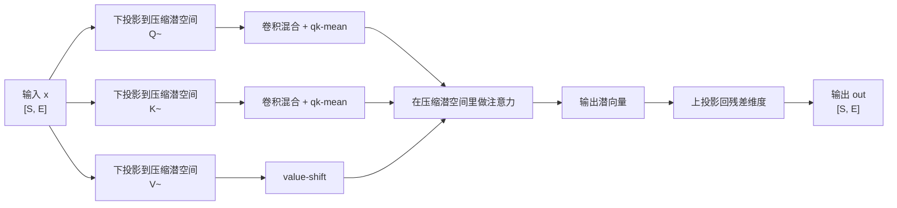
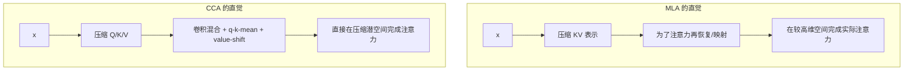
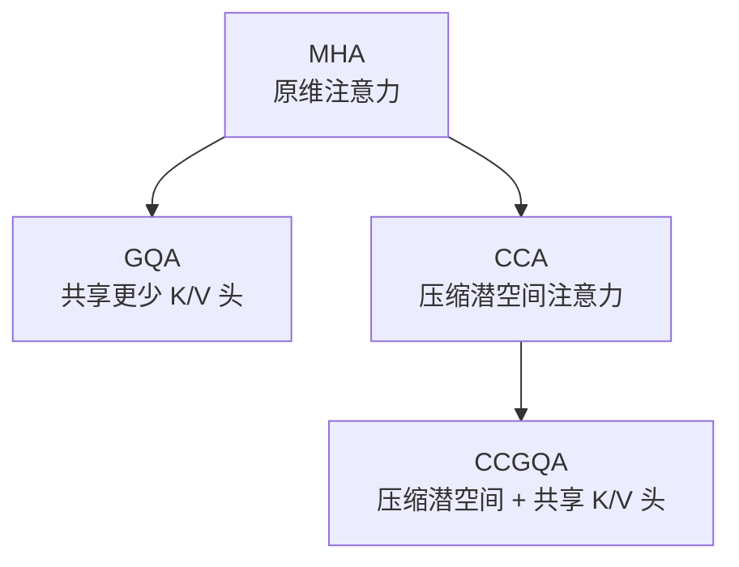
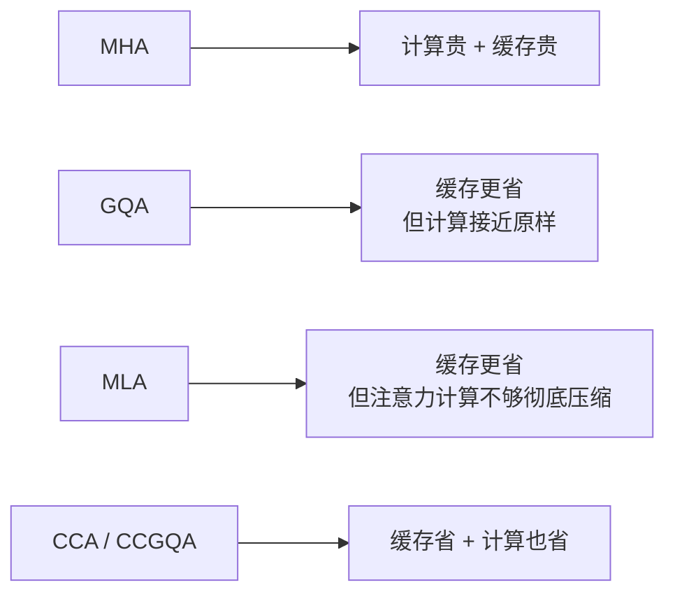

# Compressed Convolutional Attention (CCA) 详解


## 1. 什么是 CCA

CCA 是 **Compressed Convolutional Attention** 的缩写，中文可以理解为：

> **压缩卷积注意力**

它来自 2025 年的一篇论文 **Compressed Convolutional Attention: Efficient Attention in a Compressed Latent Space**。  
这篇工作的核心目标很明确：

- 不只是像 GQA、MLA 那样压缩 KV Cache
- 还要进一步压缩 **注意力本身的计算量**
- 让训练、prefill、decode 三个阶段都能受益

一句话概括：

> CCA 先把 `Q / K / V` 一起下采样到一个更小的潜在空间里，再直接在这个压缩空间里完成整个注意力计算。

这和很多只“压缩缓存、但仍在原始维度里做注意力”的方法不同。

---

## 2. 它到底想解决什么问题

标准多头注意力（MHA）有两个老问题：

### 2.1 计算量大

注意力的核心计算是：

```text
softmax(QK^T / sqrt(d)) V
```

其中：

- `QK^T` 带来与序列长度相关的二次复杂度
- `Q/K/V/O` 投影又带来与隐藏维度相关的大量矩阵乘法

所以在长上下文下：

- 训练慢
- prefill 慢
- 序列越长越贵

### 2.2 KV Cache 越长越大

在自回归生成时，历史的 `K/V` 要持续缓存下来。

如果：

- 序列长度是 `S`
- 隐藏维度是 `E`

那么 KV Cache 大小近似正比于：

```text
2 x S x E
```

于是长上下文推理会遇到：

- 显存吃紧
- 访存带宽吃紧
- decode 阶段常常变成 memory-bound

---

## 3. 为什么光有 GQA / MLA 还不够

CCA 的提出背景，要放在 MHA、GQA、MLA 这条演化线上看。

### 3.1 MHA：表达强，但最贵

- 每个 Query 头都有自己的 Key / Value 头
- 参数量高
- KV Cache 大
- 注意力计算也完全在原维度完成

### 3.2 GQA：压缩 KV，但不怎么减计算

GQA 的核心是：

- 多个 Query 头共享更少数量的 K/V 头

它非常擅长：

- 减少 KV Cache
- 降低 decode 的访存压力

但它的缺点也很明显：

- 注意力计算基本还在原维度做
- prefill 和训练 FLOPs 并没有本质下降

### 3.3 MLA：把 KV 压到潜空间，但注意力仍不完全在潜空间里做

MLA 比 GQA 走得更远：

- 它学习一个压缩的潜在表示来保存 K/V
- 这样能更省缓存

但 MLA 的关键限制是：

- 仍需要为实际注意力计算做上投影或等价恢复
- 所以 **训练和 prefill 的计算收益不够彻底**
- 与 RoPE 的结合也更复杂

### 3.4 CCA 的关键转折

CCA 的思路是：

> 既然已经压缩到了潜在空间，那为什么不直接在潜在空间里做完整注意力？

这就是它和前面方法最本质的区别。

---

## 4. 一张图先看懂 CCA



这张图里的重点有两个：

- `Q/K/V` 是先压缩，再做注意力
- 压缩后不是直接裸算，而是加上卷积混合等增强步骤

---

## 5. CCA 的核心思想

CCA 可以拆成两句话理解：

### 5.1 在更小的潜空间里做注意力

设模型原始隐藏维度是 `E`，压缩后的潜空间维度是：

```text
e_tilde = E / C
```

其中：

- `C` 是压缩因子
- `C` 越大，压缩越强

那么原本在 `E` 维空间里的注意力，现在改到 `e_tilde` 维里做。

于是直觉上：

- 参数量下降
- KV Cache 下降
- 注意力里的大矩阵乘法也下降

### 5.2 压缩后要补足表达能力

如果只是粗暴地把 `Q/K/V` 压缩后直接做注意力，效果往往会掉。

论文的关键发现是：

> 只压缩不够，还需要在压缩空间里加入额外的局部混合与信息补偿。

于是 CCA 又引入了：

- 卷积混合（convolutional mixing）
- q-k-mean
- value-shift

这些额外模块的成本不高，但能显著减轻压缩后的性能损失。

---

## 6. 数学上它是怎么做的

### 6.1 第一步：下投影

输入为：

```text
x ∈ R^(S x E)
```

先学习三个下投影矩阵，把它压到更小的潜空间：

```text
Q~ = x W~Q
K~ = x W~K
V~ = x W~V
```

其中：

- `W~Q, W~K, W~V ∈ R^(E x e_tilde)`

如果 `C = 4`，那就表示：

```text
e_tilde = E / 4
```

也就是说，注意力不再在原来的全维空间中展开。

### 6.2 第二步：对压缩后的 Q/K 做卷积混合

压缩后最容易丢失的是：

- 局部邻近信息
- 通道间的微妙交互
- 头内表达能力

所以 CCA 在 `Q~` 和 `K~` 上引入两类卷积：

- 沿序列维的卷积
- 在每个头内部进行的通道混合卷积

可以粗略理解成：

```text
Q~ -> sequence conv -> channel conv -> enhanced Q~
K~ -> sequence conv -> channel conv -> enhanced K~
```

它的作用很像：

- 在压缩空间里先做一层局部特征提取
- 再把结果交给注意力做全局加权

这也是“Compressed Convolutional”里 **Convolutional** 的来源。

### 6.3 第三步：q-k-mean

论文还引入了一个 q-k-mean 操作，用来：

- 在压缩空间里让 Q 和 K 共享一部分统计信息
- 给卷积结果提供一种 skip / interpolation 作用
- 帮助稳定训练

直觉上，它在做的是：

> 让 Query 不是只看自己的压缩结果，Key 也不是只看自己的压缩结果，而是彼此交换一点“公共背景信息”。

你可以把它理解成一种非常轻量的：

- `Q/K` 之间的信息对齐
- 卷积增强后的残差补偿

### 6.4 第四步：value-shift

对于 `V~`，论文没有像 `Q~ / K~` 那样做卷积，而是用了 **value-shift**。

它的大意是：

- Value 的一部分来自当前位置 `x_t`
- 另一部分来自前一个位置 `x_(t-1)`

然后再拼接成完整的压缩 value 表示。

直觉可以理解为：

> 在压缩 Value 时，显式保留一点“时间邻近偏移”的信息，避免压缩后 value 过于平滑。

### 6.5 第五步：在压缩空间里直接做注意力

经过上面的增强后，再对压缩后的 `Q~/K~/V~` 做标准注意力：

```text
O~ = softmax(Q~ K~^T / sqrt(d_h)) V~
```

其中：

- 每头维度不再是原来的 `d = E / n_h`
- 而是压缩后的 `d_h = e_tilde / n_h`

这一步很关键，因为它意味着：

> 真正最贵的 `QK^T` 和 `Attn · V` 都已经在更小的维度里完成了。

### 6.6 第六步：上投影回原空间

最后再把注意力输出从潜空间映射回残差维度：

```text
out = O~ W~O
```

其中：

- `W~O ∈ R^(e_tilde x E)`

所以 CCA 不是取消输出投影，而是：

- 先在低维里做完整注意力
- 再把结果送回模型主干

---

## 7. 这和“普通降维”有什么不同

如果只说“先降维再升维”，很容易误以为 CCA 只是一个低秩近似。

其实它比简单降维更强，原因有三点：

### 7.1 它压缩的是整个注意力路径

不是只压缩：

- 参数
- 或缓存

而是把：

- `Q`
- `K`
- `V`
- `QK^T`
- `Attn · V`

整个链路都搬到了潜空间。

### 7.2 它在潜空间里加了专门的增强结构

包括：

- 序列卷积
- 通道卷积
- q-k-mean
- value-shift

这些都是为了回答一个问题：

> 注意力如果真的在小空间里做，怎么尽量别丢太多表达力？

### 7.3 它和 RoPE 兼容得更自然

论文强调 CCA 的一个优点是：

- RoPE 可以直接作用在压缩后的 `Q/K` 上
- 不需要像某些压缩方案那样额外维护一套未压缩的 RoPE cache

这在工程实现上非常重要。

---

## 8. 一张图看 CCA 和 MLA 的区别



最核心的差异是：

- MLA 更偏向“把缓存压小”
- CCA 更偏向“把整个注意力一起压小”

所以：

- MLA 主要利好 decode
- CCA 对 prefill / 训练 / decode 都更有机会受益

---

## 9. 复杂度为什么会下降

论文给出的结论可以概括成：

### 9.1 参数量下降

标准 MHA 里，`Q/K/V/O` 四个大投影都大约是：

```text
E x E
```

而 CCA 里主要变成：

```text
E x (E/C)
```

以及：

```text
(E/C) x E
```

所以参数量大致按压缩因子缩小。

### 9.2 KV Cache 下降

因为缓存的不再是原维 `K/V`，而是压缩后的潜向量：

```text
KV cache ≈ 2 x B x S x (E / C)
```

相对 MHA，大约变成原来的：

```text
1 / C
```

### 9.3 注意力 FLOPs 下降

最关键的是：

- `QK^T`
- `Attn · V`

这两个大头都在更小维度中完成。

论文把它总结为：

> 注意力中的二次项会随着压缩因子按比例下降。

这正是 CCA 和 GQA / MLA 的根本差异所在。

---

## 10. 用一个具体例子理解

假设：

- 隐藏维度 `E = 4096`
- 注意力头数 `n_h = 32`
- 压缩因子 `C = 4`

那么：

```text
e_tilde = 4096 / 4 = 1024
```

此时每头潜维度变成：

```text
d_h = 1024 / 32 = 32
```

对比原始 MHA：

- 原始每头维度：`4096 / 32 = 128`
- CCA 每头维度：`32`

这意味着：

- `Q/K/V` 表达空间变小了 4 倍
- KV Cache 近似缩小 4 倍
- 注意力核心计算也在更小维度展开

当然，这种强压缩如果没有补偿，很容易掉点，所以论文才会加上卷积和其他增强模块。

---

## 11. 为什么卷积会有帮助

很多人第一次看到 CCA 会问：

> 注意力都已经很强了，为什么还要加卷积？

原因在于：

### 11.1 压缩会损失局部细节

把高维 `Q/K` 压到小潜空间后，最容易损失的是：

- 相邻 token 的细粒度差异
- 某些头内部的局部模式

而卷积天然擅长：

- 聚合局部邻域
- 识别短程模式
- 在序列上做平滑而非粗暴平均

### 11.2 卷积提供归纳偏置

注意力本身很灵活，但在极小潜空间中可能太“脆”。

卷积加入后，相当于告诉模型：

- 邻近 token 之间通常是相关的
- 局部上下文值得先被整理一下

这种归纳偏置在压缩场景里往往是有益的。

### 11.3 卷积比恢复全维更便宜

如果为了恢复性能而重新把张量拉回高维，那就会损失 CCA 的核心收益。

而卷积混合：

- 参数不多
- FLOPs 相对可控
- 但能有效提升压缩空间里的表达能力

所以它是一种更划算的补偿手段。

---

## 12. q-k-mean 和 value-shift 分别在补什么

这两个模块是 CCA 里最容易被忽略、但又很关键的地方。

### 12.1 q-k-mean：补 Q/K 的协同

压缩后，`Q` 和 `K` 可能出现：

- 表示空间偏移
- 统计量不一致
- 相似度分布变差

q-k-mean 的作用可以概括成：

- 给 `Q/K` 之间增加一个轻量的信息交换
- 让两者在压缩空间里更“对齐”
- 减少只靠卷积混合时的偏移问题

### 12.2 value-shift：补 V 的时序信息

对于 Value 来说，单纯压缩可能让内容表达过于平均化。

value-shift 通过引入前一位置的信息，让 `V` 多保留了一点：

- 时间上的相邻关系
- 局部动态变化
- 序列流动感

你可以把它想成一种非常轻量的“时移特征”。

---

## 13. CCA 和 GQA、MLA、MHA 的关系

| 方案 | 主要压缩什么 | KV Cache | 训练 / Prefill FLOPs | Decode 带宽 | 典型特点 |
| --- | --- | --- | --- | --- | --- |
| MHA | 不压缩 | 最高 | 最高 | 最高 | 标准注意力 |
| GQA | 共享 K/V 头 | 较低 | 接近 MHA | 更低 | 工程折中很好 |
| MLA | 压缩 KV 表示 | 更低 | 下降有限 | 更低 | 偏向缓存压缩 |
| CCA | 压缩整个注意力路径 | 更低 | 明显下降 | 更低 | 同时减参数、缓存、FLOPs |

如果只看一句话：

- **GQA** 更像“共享头”
- **MLA** 更像“压缩缓存”
- **CCA** 更像“把注意力搬进小空间里重做”

---

## 14. CCGQA 是什么

CCA 论文里还有一个很重要的变体：

> **CCGQA = Compressed Convolutional Grouped Query Attention**

它的思路是：

- 先用 CCA 把注意力整体搬到压缩潜空间
- 再在这个压缩空间里叠加 GQA 风格的 K/V 共享

也就是说，CCA 和 GQA 不是互斥的，而是：

> 一个负责“压缩维度”，一个负责“共享头结构”。

### 14.1 为什么这很有用

这样做可以同时调两个旋钮：

- `C1`：Query 的压缩程度
- `C2`：Key / Value 的压缩程度

于是可以更灵活地适配：

- 计算受限场景
- 显存受限场景
- 带宽受限场景

### 14.2 直观理解



所以 CCGQA 可以理解成：

- CCA 的进一步工程增强版
- 也是论文里性能最亮眼的版本之一

---

## 15. 论文里宣称的收益

根据论文摘要与方法总结，CCA / CCGQA 的主要收益包括：

### 15.1 训练和 prefill 更快

因为注意力二次项发生在更小的潜空间里，所以：

- 训练前向更快
- backward 也能受益
- prefill 会比只压 KV 的方法更占优

### 15.2 decode 也更省

因为 KV Cache 也被一起压缩，所以：

- 解码显存更省
- 访存更少
- 长上下文吞吐更高

### 15.3 参数量更低

相比在原空间做完整投影，CCA 的大投影矩阵更小，因此：

- 参数更少
- 部分算子更便宜

### 15.4 与质量之间取得更好的折中

论文声称：

- 在相同 KV 压缩率下，CCGQA 往往优于 GQA 和 MLA
- 某些 MoE 配置下，可以在更低 KV Cache 下保持和 MHA 接近的效果

---

## 16. 为什么说 CCA 对 prefill 尤其有意义

很多只压 KV 的方法，在 decode 阶段收益很明显，但在 prefill 阶段没那么突出。

原因是：

- decode 常常受限于 KV 读取带宽
- prefill 更容易受限于大量注意力计算本身

CCA 的优势刚好对准了 prefill：

- 它不仅让缓存更小
- 更让真正贵的注意力乘法发生在低维空间

所以在长 prompt、长上下文任务里，它的价值会更明显，比如：

- 长文档问答
- 长代码补全
- 长上下文 reasoning
- 检索增强后的超长输入

---

## 17. 一张图看它更适合哪类瓶颈



如果你的系统瓶颈是：

- **显存 / 带宽**：GQA、MLA、CCA 都可能有帮助
- **prefill / 训练 FLOPs**：CCA 的针对性更强

---

## 18. 一个极简伪代码

下面用伪代码描述它的大概流程：

```python
x = hidden_states                       # [B, S, E]

q_lat = x @ Wq_down                     # [B, S, E/C]
k_lat = x @ Wk_down                     # [B, S, E/C]
v_lat = x @ Wv_down                     # [B, S, E/C]

q_lat = seq_conv(q_lat)
q_lat = channel_conv(q_lat)

k_lat = seq_conv(k_lat)
k_lat = channel_conv(k_lat)

q_lat, k_lat = qk_mean_mix(q_lat, k_lat)
v_lat = value_shift(v_lat, x)

q_lat = rope(norm(q_lat))
k_lat = rope(norm(k_lat))

o_lat = attention(q_lat, k_lat, v_lat) # 完全在压缩空间里做
out = o_lat @ Wo_up                     # [B, S, E]
```

如果是 CCGQA，则还会进一步让压缩空间中的 K/V 头共享。

---

## 19. 它和稀疏注意力不是一回事

CCA 常常会被误解成“减少可见 token 数量”的方法，但其实不是。

### 19.1 CCA 不是位置稀疏

它没有规定：

- 只能看附近 token
- 或只能看某些 block

所以它不同于：

- Sliding-Window Attention
- Block Sparse Attention
- Longformer 一类方法

### 19.2 CCA 是通道 / 表示压缩

它压缩的是：

- 注意力内部的表示维度
- 参数规模
- KV Cache 维度

而不是直接稀疏化 token-token 的连接图。

### 19.3 两者可以叠加

理论上，CCA 可以和：

- Sliding-Window
- Paged Attention
- Flash Attention
- 稀疏路由

这些机制继续组合。

---

## 20. 它的代价和风险

CCA 很有吸引力，但不是没有代价。

### 20.1 结构更复杂

相比纯 MHA / GQA：

- 多了卷积模块
- 多了 q-k-mean
- 多了 value-shift

所以实现难度更高。

### 20.2 压缩太狠可能伤表达力

如果 `C` 太大，那么即使加了补偿模块，也可能出现：

- 信息瓶颈过强
- 头内表征不足
- 训练不稳定

### 20.3 卷积带来额外归纳偏置

这有时是好事，但也意味着：

- 它不像纯注意力那么“中性”
- 在更大规模模型上是否始终最优，还要看更多实证

### 20.4 高效 kernel 很关键

CCA 的纸面复杂度很好看，但要真正变成速度收益，还依赖：

- fused kernel
- 合适的 layout
- 对卷积与注意力衔接的工程优化

否则理论收益未必能完全兑现。

---

## 21. 更适合哪些场景

CCA / CCGQA 更适合下面这些场景：

- 长上下文推理
- 长 prompt prefill 昂贵的在线服务
- 对训练吞吐敏感的预训练或继续训练
- MoE 模型，因为注意力成本更值得精打细算
- 显存和带宽都紧张的大模型部署

如果一个场景主要瓶颈是：

- **decode 带宽**：GQA、MLA、CCA 都值得看
- **prefill 和训练成本**：CCA 的吸引力更强

---

## 22. 一个特别重要的理解角度

CCA 真正有意思的地方，不只是“又一种注意力变体”，而是它体现了一个很强的工程判断：

> 传统注意力里有不少冗余，尤其是在通道维度上；如果能在压缩空间里保持足够表达力，就没必要始终用全分辨率做完整注意力。

这背后的思想很像图像或信号处理中常见的做法：

- 先压缩
- 再在低成本表示上做主要运算
- 最后把结果映射回主空间

只不过 CCA 把这套思路成功放进了 Transformer 注意力里。

---

## 23. 常见误区

### 23.1 CCA 不是只压缩 KV

它压缩的是：

- `Q`
- `K`
- `V`
- 以及整个注意力链路

### 23.2 CCA 不是简单线性低秩替代

如果只是下投影再上投影，效果通常不够好。  
CCA 的真正关键在于：

- 卷积混合
- q-k-mean
- value-shift

### 23.3 CCA 不等于卷积注意力

虽然名字里有 convolutional，但主角仍然是注意力。  
卷积更像是：

- 压缩空间里的表达增强器
- 而不是替代注意力本身

### 23.4 CCA 也不等于稀疏注意力

它减少的是维度和缓存，不是连接边数。

---

## 24. 一句话总结

CCA 的本质是：

> 先把 `Q/K/V` 压缩到更小的潜在空间，再借助卷积混合、q-k-mean、value-shift 等机制补足表达能力，并直接在这个压缩空间里完成整个注意力计算，从而同时降低参数量、KV Cache 和注意力 FLOPs。

如果再压缩成更短的口号：

> **不是只把缓存压小，而是把整个注意力“搬进小空间”里。**

---

## 25. 速记版

- MHA：表达强，但参数、KV Cache、FLOPs 都贵
- GQA：主要压 KV Cache，对 decode 很友好
- MLA：学习压缩 KV 表示，但注意力计算收益不够彻底
- CCA：把完整注意力放到压缩潜空间里做
- 卷积混合、q-k-mean、value-shift 是它能成立的关键补偿机制
- CCGQA = CCA + GQA，在压缩空间里继续共享 K/V 头
- 它特别适合长上下文、prefill 昂贵、训练吞吐敏感的场景

---

## 26. 参考

- 论文：Compressed Convolutional Attention: Efficient Attention in a Compressed Latent Space
- arXiv：https://arxiv.org/abs/2510.04476
