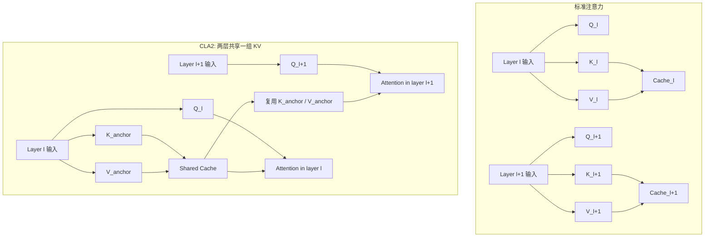

# Cross-Layer Attention (CLA) 详解


## 1. 什么是 CLA

CLA 是 **Cross-Layer Attention** 的缩写，中文通常可以理解为：

> **跨层注意力**
>  
> 更准确地说，是一种 **跨层共享 Key / Value 激活** 的注意力结构

它要解决的问题非常明确：

- 大模型推理时，**KV Cache 会随着层数、序列长度、batch size 线性膨胀**
- 即使已经用了 [GQA-Attention.md](./GQA-Attention.md) 这类层内共享机制，**每一层通常仍要保留自己的 KV**
- CLA 进一步沿着“**深度维度**”做压缩，不再让每层都维护独立的 K/V

一句话概括：

> **GQA / MQA 压缩的是“每层里有多少组 KV 头”，而 CLA 压缩的是“总共有多少层需要各自维护 KV”。**

---

## 2. 它到底在解决什么瓶颈

在自回归解码里，历史 token 的 `K/V` 会被缓存起来，供后续 token 反复读取。  
如果模型有：

- `L` 层
- `n_kv` 个 KV 头
- 每头维度 `d_head`
- 序列长度 `T`

那么 KV Cache 的规模大致正比于：

```text
KV Cache ∝ 2 x L x T x n_kv x d_head
```

其中：

- `2` 对应 `K` 和 `V`
- `L` 对应层数
- `T` 对应上下文长度
- `n_kv x d_head` 对应每层每个 token 的 KV 表示大小

这意味着，哪怕你已经把每层内部从 MHA 改成 GQA/MQA，`L` 这个维度仍然在。

CLA 的关键观察是：

> 相邻层的注意力读取行为存在冗余，没有必要让每一层都单独生成并缓存一套新的 `K/V`。

因此，CLA 试图把 KV Cache 从：

```text
按“每层一份”存储
```

改成：

```text
按“若干层共享一份”存储
```

---

## 3. 一张图看懂核心思想



这张图里最关键的区别是：

- 标准注意力：每层都自己生成 `K_l / V_l`
- CLA：只有部分层是 **锚点层（anchor layer）**，真正生成新的 `K/V`
- 非锚点层仍然保留本层 `Q`，但它们**跨层复用**先前锚点层的 `K/V`

因此，CLA 不是跳过整层，而是把“本层要问什么”与“上下文索引长什么样”拆开：

- **Query 仍保留本层特性**
- **Key / Value 可以跨层共享**

---

## 4. 从 MHA 到 GQA/MQA，再到 CLA

可以把它们看成沿两个不同维度压缩 KV Cache：

| 方法 | 压缩维度 | 核心做法 | KV Cache 变化 | 典型代价 |
| --- | --- | --- | --- | --- |
| MHA | 不压缩 | 每个 Query 头都有独立 KV 头 | 最大 | 表达最强，缓存最贵 |
| GQA | 层内头维度 | 多个 Query 头共享更少 KV 头 | 减少每层 KV 宽度 | 可能轻微掉点 |
| MQA | 层内头维度 | 所有 Query 头共享 1 组 KV | 更强压缩 | 表达能力更受限 |
| CLA | 层间深度维度 | 多层共享同一组 KV | 减少需要缓存的层数 | 共享过度可能掉点 |
| MLA | 表示维度 | 缓存压缩 latent 而非完整 KV | 压缩每 token 表示 | 结构更复杂 |

所以最容易记忆的方式是：

- GQA / MQA：**层内共享**
- CLA：**层间共享**
- MLA：**表示压缩**

相关主题：

- 见：[GQA-Attention.md](./GQA-Attention.md)
- 见：[Multi-head-Latent-Attention.md](./Multi-head-Latent-Attention.md)
- 见：[Sliding-Window-Attention.md](./Sliding-Window-Attention.md)

---

## 5. 数学形式怎么理解

### 5.1 标准注意力

对于第 `l` 层，标准做法是：

```text
Q_l = X_l W_Q^(l)
K_l = X_l W_K^(l)
V_l = X_l W_V^(l)

Attn_l = softmax(Q_l K_l^T / sqrt(d_head)) V_l
```

每层都生成并缓存自己的 `(K_l, V_l)`。

### 5.2 CLA 的写法

假设第 `a(l)` 层是第 `l` 层所对应的锚点层，那么：

```text
Q_l = X_l W_Q^(l)
K_shared = K_(a(l))
V_shared = V_(a(l))

Attn_l = softmax(Q_l K_shared^T / sqrt(d_head)) V_shared
```

这意味着：

- 第 `l` 层依然有自己的 Query 投影
- 但注意力中使用的 `K/V` 不再由该层独立产生
- 而是来自某个更早的锚点层

### 5.3 共享因子 `s`

论文里把“多少层共享同一份 KV”称为 **sharing factor**，记作 `s`。

- `CLA2`：每 `2` 层共享一份 KV
- `CLA3`：每 `3` 层共享一份 KV
- `CLA4`：每 `4` 层共享一份 KV

如果总层数为 `L`，那么需要真正维护 KV 的层数近似为：

$$
L_{\text{kv}} \approx \left\lceil \frac{L}{s} \right\rceil
$$

于是每个 token 的 KV 开销可以粗略写成：

$$
\text{KVBytesPerToken} \propto 2 \cdot L_{\text{kv}} \cdot n_{\text{kv}} \cdot d_{\text{head}} \cdot \text{dtype\_bytes}
$$

如果与不使用 CLA 的同配置模型相比，理论压缩比大致接近：

$$
\text{Reduction} \approx \frac{L}{\lceil L / s \rceil}
$$

当 `s = 2` 且层数可整除时，KV Cache 大约可以进一步缩小到原来的一半。

---

## 6. 一个具体例子

假设模型有 `8` 层。

### 6.1 标准做法

```text
Layer 1 -> KV_1
Layer 2 -> KV_2
Layer 3 -> KV_3
Layer 4 -> KV_4
Layer 5 -> KV_5
Layer 6 -> KV_6
Layer 7 -> KV_7
Layer 8 -> KV_8
```

总共有 `8` 份独立 KV。

### 6.2 CLA2

```text
Layer 1 -> 生成 KV_A，被 Layer 1 / 2 共享
Layer 2 -> 复用 KV_A

Layer 3 -> 生成 KV_B，被 Layer 3 / 4 共享
Layer 4 -> 复用 KV_B

Layer 5 -> 生成 KV_C，被 Layer 5 / 6 共享
Layer 6 -> 复用 KV_C

Layer 7 -> 生成 KV_D，被 Layer 7 / 8 共享
Layer 8 -> 复用 KV_D
```

此时只需要 `4` 份 KV。

### 6.3 CLA3

```text
Layer 1 -> 生成 KV_A，被 Layer 1 / 2 / 3 共享
Layer 2 -> 复用 KV_A
Layer 3 -> 复用 KV_A

Layer 4 -> 生成 KV_B，被 Layer 4 / 5 / 6 共享
Layer 5 -> 复用 KV_B
Layer 6 -> 复用 KV_B

Layer 7 -> 生成 KV_C，被 Layer 7 / 8 共享
Layer 8 -> 复用 KV_C
```

KV 进一步减少，但共享跨度更大，通常更容易损伤表达能力。

---

## 7. 推理过程伪代码

下面用伪代码展示解码时 CLA 的逻辑：

```text
inputs: hidden_states[1...L], sharing_factor s
shared_cache = {}

for layer l in 1...L:
    Q_l = project_query(hidden_states[l], WQ[l])

    if is_anchor_layer(l, s):
        K_l = project_key(hidden_states[l], WK[l])
        V_l = project_value(hidden_states[l], WV[l])
        shared_cache[group_id(l, s)] = (K_l, V_l)
    else:
        (K_l, V_l) = shared_cache[group_id(l, s)]

    hidden_states[l + 1] = attention(Q_l, K_l, V_l)
    hidden_states[l + 1] = feed_forward(hidden_states[l + 1])
```

这段伪代码说明了 3 件事：

- 锚点层负责真正生成新的 `K/V`
- 非锚点层直接引用共享缓存
- FFN、残差、归一化等其余结构并不会因此自动消失

---

## 8. 论文实验到底说明了什么

CLA 最核心的论文是：

- **[Reducing Transformer Key-Value Cache Size with Cross-Layer Attention](https://arxiv.org/abs/2405.12981)**

这篇工作最重要的结论，不是“CLA 永远更强”，而是：

> **在固定或更低 KV Cache 预算下，CLA 能把精度-内存折中曲线继续往前推。**

### 8.1 1B 规模的一组关键结果

下面列出论文里最值得记住的几组结果，指标为 `16-bit KV Bytes / token` 与验证集困惑度：

| 配置 | KV Bytes / token | Validation Perplexity | 解读 |
| --- | --- | --- | --- |
| H128-MHA | 163,840 | 13.15 | 精度高，但缓存极大 |
| H128-GQA4 | 40,960 | 13.36 | 层内分组后缓存明显下降 |
| H128-MQA | 10,240 | 13.54 | 单层内部进一步强压缩 |
| H128-MQA-CLA2 | 5,120 | 13.60 | 在 MQA 基础上再减半，精度只小幅下降 |
| H128-MQA-CLA3 | 3,584 | 13.77 | 更省缓存，但精度下降更明显 |
| H128-MQA-CLA4 | 2,560 | 13.95 | 压得更狠，掉点继续扩大 |

从这张表可以读出两个很重要的结论：

1. **CLA2 往往是最稳妥的折中点**
2. **共享因子继续增大，不一定划算**

### 8.2 为什么论文强调 `CLA2`

论文在 `1B` 和 `3B` 规模上的结论都指向类似现象：

- `sharing factor = 2` 的表现通常最好
- CLA 与 **MQA 结合**时更稳定
- 共享因子大于 `2` 时，虽然内存继续下降，但困惑度恶化更快

可以直观理解为：

> 相邻两层的功能冗余较大，因此“借用上一层的 KV”还比较自然；  
> 但跨三层、四层继续共享时，层间语义偏移开始变大，复用就不再那么安全。

---

## 9. 它和 GQA / MQA / MLA 到底是什么关系

### 9.1 和 GQA / MQA 的关系

CLA 与 GQA / MQA 不是替代关系，而是 **正交关系**。

- GQA / MQA 解决的是：**一个层里需要多少组 KV 头**
- CLA 解决的是：**多少个层需要独立 KV**

因此它们可以叠加：

```text
总 KV 开销
≈ 层数方向压缩 x 头数方向压缩
≈ L_kv x n_kv
```

也正因为这个原因，论文里效果最好的点大多落在：

```text
MQA + CLA2
```

### 9.2 和 MLA 的关系

`MLA` 关注的是把 `K/V` 先压缩成 latent，再按需恢复。  
`CLA` 则是直接减少“需要独立存哪些层的 KV”。

两者关注点不同：

| 方法 | 主要压缩对象 | 更像是在做什么 |
| --- | --- | --- |
| GQA/MQA | KV 头数 | 减少每层 KV 宽度 |
| CLA | KV 层数 | 减少独立 KV 层数 |
| MLA | KV 表示维度 | 减少每 token 的存储维度 |

如果把 KV Cache 看成一个三维体积：

```text
深度 x 宽度 x 表示尺寸
```

那么：

- CLA 压的是 **深度**
- GQA / MQA 压的是 **宽度**
- MLA 压的是 **表示尺寸**

---

## 10. 系统与工程层面的影响

论文对系统设计层面的分析很值得单独记住。

### 10.1 明确收益

- **KV Cache 显存下降**：压缩比例大致接近共享因子 `s`
- **训练中间激活略降**：因为需要显式生成的 KV 投影块更少
- **参数量与 FLOPs 略降**：被删掉了一部分 `W_K / W_V` 投影路径
- **服务栈吞吐潜力提升**：同显存下可支持更长上下文或更大 batch

### 10.2 不要误解的地方

CLA 有一个特别容易被误解的点：

> **它不一定直接降低“单步核心注意力计算”的读取带宽。**

原因是：

- 虽然不同层共享同一组 KV
- 但在解码时，每一层做注意力时还是要再次读取这组共享 KV
- 所以单步 attention kernel 的核心访存，并不会像 GQA/MQA 那样天然减少到同等程度

这意味着：

- **CLA 的主要收益首先是缓存容量**
- 其次才是由容量释放带来的更高 batch、更长缓存保留时间和更好的服务侧调度空间

### 10.3 并行训练的注意点

论文还指出：

- 对 **tensor parallelism** 基本兼容
- 对 **pipeline parallelism** 需要额外留意

因为：

- 如果共享同一份 KV 的层被切到不同 pipeline stage
- 那么 stage 之间就需要通信共享 KV

所以从工程部署角度看，**共享组最好尽量落在同一 stage 内**。

---

## 11. 为什么共享 K/V 还可能有效

CLA 背后的直觉，并不是说后面的层不重要，而是：

- 相邻层对历史上下文的“索引结构”可能高度相似
- 当前层真正不同的部分，很多时候体现在 **Q 的提问方式**
- 只要保留本层 Query，模型依然能以当前层的视角去读取共享的上下文记忆

可以把它想象成：

- `Q` 决定“我要问什么”
- `K/V` 决定“历史信息被如何组织和被读取”

CLA 假设的是：

> 某些相邻层虽然“问法不同”，但“历史信息的索引底座”可以共用。

这和很多高效模型里的常见思想是一致的：

- 不去盲目保留每一级冗余中间表示
- 尽量只为“真正不可共享”的部分付费

---

## 12. 局限与风险

CLA 很有价值，但也不是没有代价。

### 12.1 共享过强会掉点

从论文结果可以看到：

- `CLA2` 往往较稳
- `CLA3 / CLA4` 更容易损伤精度

说明层间共享不是越多越好。

### 12.2 不是“免费加一个开关”就行

CLA 通常不是推理时简单做个后处理就完全稳妥：

- 最可靠的方式通常是 **从训练阶段就按 CLA 架构训练**
- 否则模型未必能适应“当前层读取他层 KV”的分布变化

### 12.3 对架构细节更敏感

当模型里存在：

- 不同注意力类型交替
- 不同 head 几何
- 特殊位置编码策略

那么共享规则往往不能简单地“固定每两层共享一次”，而需要结合具体实现设计锚点规则。

---

## 13. Gemma4 里的 Cross-Layer KV Sharing 与 CLA 是什么关系

仓库里还有一篇直接相关的工程说明：

- 见：[Cross-Layer KV Sharing.md](../models/Gemma/Gemma4/Cross-Layer%20KV%20Sharing.md)

它和 CLA 的关系可以这样理解：

### 13.1 共同点

- 都在做 **层间 KV 复用**
- 都是为了 **减小 KV Cache**
- 都保留“本层 Query + 共享 K/V”的基本思想

### 13.2 不同点

论文里的 CLA 更像是一个**通用架构原语**：

- 可以与 MHA / GQA / MQA 任意组合
- 用 sharing factor 描述一般性的层共享方式

Gemma4 的工程实现则更具体：

- 不是所有层都统一共享
- 会按 **attention type** 区分锚点层
- 某些模型变体启用，某些则可能关闭

所以更稳妥的说法是：

> **Gemma4 的 Cross-Layer KV Sharing 可以看作 CLA 思想的一种工程化、类型感知版本。**

---

## 14. 一个总览公式

把多种 KV 优化统一起来，可以用下面这个式子抓住直觉：

$$
\text{KV Cache Size}
\propto
T \cdot L_{\text{kv}} \cdot n_{\text{kv}} \cdot d_{\text{repr}}
$$

其中：

- `T`：上下文长度
- `L_kv`：需要独立缓存 KV 的层数
- `n_kv`：每层的 KV 头数
- `d_repr`：每个 KV 表示的尺寸

那么不同方法分别在压哪一项就一目了然：

| 方法 | 主要作用项 |
| --- | --- |
| Sliding Window / 稀疏注意力 | 降低有效 `T` |
| CLA | 降低 `L_kv` |
| GQA / MQA | 降低 `n_kv` |
| MLA / 压缩 KV | 降低 `d_repr` |

这也是为什么在现代长上下文模型里，经常会看到多种机制叠加出现。

---

## 15. 应该如何评价 CLA

如果只用一句话评价 CLA，可以这样说：

> **CLA 不是去改变注意力公式本身，而是去挑战“每层都必须拥有自己独立 KV”这个默认前提。**

它的重要性在于：

- 把 KV 优化从“时间轴 / 头数轴”扩展到了“深度轴”
- 给长上下文推理和受限显存部署提供了新的设计空间
- 为后续的 depth-wise cache sharing、随机跨层路由等工作打开了方向

如果从架构演进角度看，CLA 值得记住的不是一个单点技巧，而是它提出的判断：

> **Transformer 深度方向上的 KV 冗余，是真实存在且可以被系统性利用的。**

---

## 16. 相关主题导航

- 层内 KV 共享：见 [GQA-Attention.md](./GQA-Attention.md)
- KV 表示压缩：见 [Multi-head-Latent-Attention.md](./Multi-head-Latent-Attention.md)
- 长上下文局部稀疏：见 [Sliding-Window-Attention.md](./Sliding-Window-Attention.md)
- Gemma4 工程落地：见 [Cross-Layer KV Sharing.md](../models/Gemma/Gemma4/Cross-Layer%20KV%20Sharing.md)

---

## 17. 参考资料

1. William Brandon, Mayank Mishra, Aniruddha Nrusimha, Rameswar Panda, Jonathan Ragan-Kelley. **Reducing Transformer Key-Value Cache Size with Cross-Layer Attention**. arXiv:2405.12981, 2024.  
   链接：<https://arxiv.org/abs/2405.12981>
2. Noam Shazeer. **Fast Transformer Decoding: One Write-Head is All You Need**. 2019.  
   链接：<https://arxiv.org/abs/1911.02150>
3. Joshua Ainslie, James Lee-Thorp, Michiel de Jong, et al. **GQA: Training Generalized Multi-Query Transformer Models from Multi-Head Checkpoints**. EMNLP 2023.  
   链接：<https://arxiv.org/abs/2305.13245>
4. Hugging Face. **Welcome Gemma 4: Frontier multimodal intelligence on device**. 2026.  
   链接：<https://huggingface.co/blog/gemma4>
5. Apple. **Stochastic KV Routing: Enabling Adaptive Depth-Wise Cache Sharing**. arXiv:2604.22782, 2026.  
   链接：<https://arxiv.org/abs/2604.22782>
