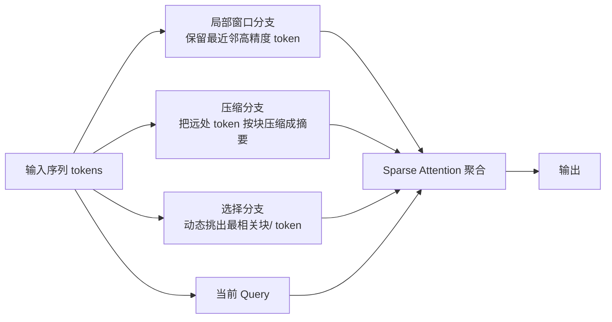
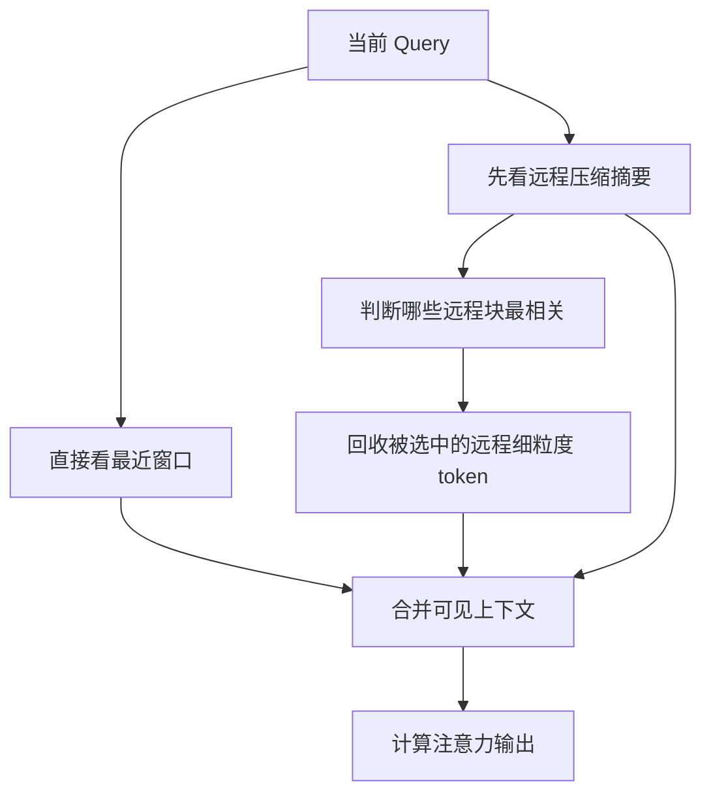

# DeepSeek Sparse Attention 详解


## 1. 这里说的 DeepSeek Sparse Attention，具体指什么

如果你最近在看 DeepSeek 相关架构，提到 **DeepSeek Sparse Attention**，大多数情况下真正指的是：

> **Native Sparse Attention**
>  
> 简称 **NSA**

这是 DeepSeek-AI 在 2025 年公开的一种：

- 面向长上下文的稀疏注意力机制
- 可以端到端训练的稀疏注意力机制
- 强调硬件友好、而不是只追求理论稀疏度的设计

一句话概括它：

> **不是让每个 token 再去看全部历史，而是只看“局部必须看”的、"压缩后保留全局轮廓" 的、以及 “动态挑出来最重要的” 那部分上下文。**

这篇文章主要以公开论文中的 **NSA** 为核心来讲，因为这是 DeepSeek 稀疏注意力最清晰、最权威的公开版本。  
如果后面你看到社区有人说 `DSA` 或其他 DeepSeek 稀疏注意力变体，通常可以先把它理解成：

> **在 NSA 思路上的进一步工程化或产品化演进。**

---

## 2. 它到底要解决什么问题

标准自注意力最核心的瓶颈是：

```text
Attention(Q, K, V) = softmax(QK^T / sqrt(d)) V
```

如果序列长度是 `n`，那么 `QK^T` 的规模大约就是：

```text
n x n
```

这意味着：

- 计算复杂度接近 `O(n^2)`
- 注意力分数矩阵的开销也接近 `O(n^2)`
- 上下文越长，代价增长越快

当上下文从 `4K` 扩展到 `32K`、`64K`、`128K` 甚至更长时，问题会迅速恶化。

对于长文本、长代码仓库、超长对话、复杂推理来说，这个瓶颈尤其明显。

所以 DeepSeek 要解决的不是“小优化”，而是一个非常根本的问题：

> **长上下文很好用，但全量注意力太贵。**

---

## 3. 为什么“普通稀疏注意力”还不够

很多人第一次接触稀疏注意力时，会自然地想：

> 既然不是所有 token 都重要，那直接删掉大部分连接不就行了吗？

理论上看似合理，但真正落到训练和部署时，事情没那么简单。

传统稀疏注意力常见有几个问题：

- **稀疏模式太固定**：例如只看局部窗口，远距离依赖捕捉不够
- **稀疏模式太随机**：虽然理论稀疏，但 GPU 上访存不规则，实际不一定更快
- **只能推理时做近似**：训练时还是全注意力，真正预训练算力并没有省掉
- **稀疏后掉点明显**：效率上去了，但效果掉太多

DeepSeek 做 NSA 的关键，不是简单把注意力“裁掉一半”，而是同时追求三件事：

- 稀疏之后仍然保留强效果
- 从训练到推理全流程都能用
- 在现代硬件上真的跑得快

这就是 NSA 和很多“论文里稀疏、工程上不一定稀疏”的方案之间最重要的区别。

---

## 4. 一句话抓住 NSA 的核心思想

你可以把 NSA 记成下面这句：

> **近处看细节，远处看摘要，重要处再精看。**

更具体一点，它把注意力拆成三条互补路径：

1. **Sliding Window / 局部窗口**
2. **Token Compression / 压缩分支**
3. **Token Selection / 选择分支**

三条路径组合后，既保住局部精度，也保住远程全局感知，还能对“真正关键的远处信息”做更高分辨率的精读。

---

## 5. 一张图看懂整体框架



这张图里最关键的信息是：

- **不是只保留局部**
- **不是只做压缩**
- **也不是只做 Top-K 检索**
- **而是三种信息来源一起参与注意力**

这样才能在效率和效果之间找到更稳的平衡点。

---

## 6. 三条路径分别在做什么

### 6.1 局部窗口分支：保住最近邻细节

这条路径最好理解。

对于当前 token，最近的上下文通常最重要，比如：

- 句子里刚出现的修饰词
- 代码里刚定义的变量
- 推理链里前几步中间结论

所以 NSA 会始终保留一段 **滑动窗口注意力**。

它的作用不是“补充一点局部信息”那么简单，而是：

> **确保模型在短程依赖上不失真。**

如果没有这条路径，模型可能会过度依赖压缩摘要，导致近邻细节被抹平。

### 6.2 压缩分支：把远处大段上下文变成“摘要视图”

远距离上下文并不一定要逐 token 原样全部读取。

NSA 的做法是：

- 把更远的 token 划成若干块
- 对每个块做压缩
- 让这些压缩后的表示作为“粗粒度全局记忆”

可以把它理解成：

> 原本要看一本书每一页的每一个字，  
> 现在先快速看每一页的提纲摘要。

这条路径的意义在于：

- 让模型依然能感知远处发生过什么
- 让远距离信息进入注意力视野
- 避免只看局部窗口造成“只见树木，不见森林”

### 6.3 选择分支：从远处再挑真正重要的部分精看

如果只有压缩摘要，模型虽然知道“远处大概讲了什么”，但有时仍然不够。

因为摘要是粗粒度的，细节会丢失。

所以 NSA 又加入了 **动态选择分支**：

- 先根据 query 判断哪些远处块更相关
- 再从这些块中取出更细粒度的内容
- 对这些“被选中的关键区域”做更高精度注意力

这个分支本质上是在做：

> **有依据地回看重点段落。**

因此 NSA 不是“全靠摘要”，而是：

- 摘要负责全局轮廓
- 动态选择负责重点复读

---

## 7. 为什么三条路径缺一不可

如果你只保留其中一条，会分别遇到不同问题。

### 7.1 只有局部窗口

问题是：

- 很高效
- 局部很准
- 但远距离依赖会变差

这类结构更像是局部建模器，不是完整的长上下文方案。

### 7.2 只有压缩分支

问题是：

- 有全局视野
- 但信息太粗
- 细节容易损失

这会导致模型知道“远处有重要信息”，却拿不到足够精确的内容。

### 7.3 只有动态选择

问题是：

- 能抓重点
- 但如果没有局部保底和全局摘要兜底
- 选择器一旦选错，信息就丢了

所以 NSA 的设计哲学不是“押宝单一路径”，而是：

> **用局部窗口保精度，用压缩分支保全局，用选择分支保关键细节。**

---

## 8. 从注意力矩阵角度看，NSA 到底变了什么

### 8.1 标准全注意力

标准自注意力的矩阵几乎是全稠密的：

```text
1 1 1 1 1 1 1 1
1 1 1 1 1 1 1 1
1 1 1 1 1 1 1 1
1 1 1 1 1 1 1 1
1 1 1 1 1 1 1 1
1 1 1 1 1 1 1 1
1 1 1 1 1 1 1 1
1 1 1 1 1 1 1 1
```

每一行都看所有列。

### 8.2 纯滑窗注意力

如果只做滑窗，会更像带状矩阵：

```text
1 1 1 0 0 0 0 0
1 1 1 1 0 0 0 0
1 1 1 1 1 0 0 0
0 1 1 1 1 1 0 0
0 0 1 1 1 1 1 0
0 0 0 1 1 1 1 1
0 0 0 0 1 1 1 1
0 0 0 0 0 1 1 1
```

### 8.3 NSA 的层次化稀疏矩阵

NSA 更像是：

```text
1 1 1 0 0 1 0 1
1 1 1 1 0 1 0 1
1 1 1 1 1 0 1 0
0 1 1 1 1 1 0 1
0 0 1 1 1 1 1 0
1 0 0 1 1 1 1 1
0 1 0 0 1 1 1 1
1 0 1 0 0 1 1 1
```

这里可以这样理解：

- 对角附近的连续 `1` 是 **局部窗口**
- 远处零星但有结构的 `1` 是 **动态选中的重要区域**
- 压缩分支不一定直接体现在这个原始矩阵上，因为它相当于额外引入了一套“摘要 token 视图”

所以 NSA 不是简单的“把稠密矩阵挖空”，而是：

> **把原本单层的稠密注意力，改造成多粒度、多路径的注意力。**

---

## 9. 压缩分支到底怎么理解

压缩分支是 NSA 很关键的一层“粗看世界”的能力。

假设远处有很多 token：

```text
t1 t2 t3 t4 | t5 t6 t7 t8 | t9 t10 t11 t12
```

可以按块压缩成：

```text
c1 | c2 | c3
```

其中：

- `c1` 代表 `[t1, t2, t3, t4]` 的摘要
- `c2` 代表 `[t5, t6, t7, t8]` 的摘要
- `c3` 代表 `[t9, t10, t11, t12]` 的摘要

于是 query 在看远处时，不必先逐 token 扫描全部原始内容，而可以先快速看：

```text
c1 c2 c3
```

这带来两个好处：

- 历史长度被压缩了
- 全局结构被保留下来了

这条路径最适合承担的任务是：

- 判断远处大概有没有相关信息
- 提供跨段落、跨章节、跨代码块的全局语义轮廓

---

## 10. 选择分支为什么比“固定稀疏模式”更强

固定稀疏模式的问题在于：

- 它预先规定了“该看哪里”
- 但真实任务里，不同 query 想看的远处位置并不一样

例如：

- 一个 query 可能需要看最前面的系统提示
- 另一个 query 可能需要看中间一段函数定义
- 再另一个 query 可能需要看上文某个中间结论

如果稀疏模式完全固定，就会出现：

> 真正重要的位置可能刚好不在固定模板里。

NSA 的选择分支更聪明的地方在于：

- 它不是死规则
- 它会根据当前 query 动态判断
- 它允许不同 query 关注不同远程区域

这让它比纯局部窗口、纯固定块稀疏，更接近真正的内容感知注意力。

---

## 11. 一个小例子看三条路径怎么协作

假设当前正在处理 `t20`，历史一共有 `t1 ~ t19`。

设定：

- 局部窗口大小为最近 `4` 个 token
- 更远历史按每 `4` 个 token 压成一个块
- 选择器再从远处选 `2` 个最相关块

那么对 `t20` 来说：

### 11.1 局部窗口会看

```text
t16 t17 t18 t19
```

### 11.2 压缩分支会看

```text
[t1~t4] -> c1
[t5~t8] -> c2
[t9~t12] -> c3
[t13~t16] -> c4
```

即：

```text
c1 c2 c3 c4
```

### 11.3 选择分支可能挑出

假设 query 发现：

- `t5~t8` 那段很相关
- `t9~t12` 那段也很关键

那么它就会额外精看这些块中的内容。

所以最终 `t20` 不是只看一小段，也不是看全部，而是看：

- 最近邻细节
- 远处摘要
- 少量远处重点

这就是 NSA 的精髓。

---

## 12. 数学上可以怎么理解它

标准 attention 是：

```text
Attn(Q, K, V) = softmax(QK^T / sqrt(d)) V
```

NSA 可以理解为：

> 不再让 `Q` 对所有原始 `K/V` 做全连接，而是只对一个稀疏候选集合做注意力。

这个候选集合大致由三部分组成：

- `Local(i)`：当前位置 `i` 附近的局部窗口
- `Compressed(i)`：压缩后的远程摘要
- `Selected(i)`：动态挑出的远程重点

因此可以写成概念形式：

```text
NSA_i = Attention(Q_i, K_{Local(i) ∪ Compressed(i) ∪ Selected(i)}, V_{Local(i) ∪ Compressed(i) ∪ Selected(i)})
```

或者写成带 mask 的形式：

```text
NSA(Q, K, V) = softmax((QK^T + M_sparse) / sqrt(d)) V
```

其中：

- 允许访问的位置，mask 为 `0`
- 不允许访问的位置，mask 为 `-inf`

但要注意：

> **NSA 不只是“加一个 sparse mask”这么简单。**

它真正的关键在于：

- 稀疏集合怎么构造
- 压缩分支怎么组织
- 选择分支怎么做动态筛选
- kernel 怎么让这件事在 GPU 上真的高效

---

## 13. 复杂度为什么会明显下降

设：

- 序列长度是 `n`
- 局部窗口大小是 `w`
- 压缩后远程摘要数量约为 `n / r`
- 每个 query 额外精看的远程 token 数量约为 `k`

那么单个 query 不再看全部 `n` 个 token，而是大致看：

```text
w + n/r + k
```

于是总复杂度可以近似理解为：

```text
O(n * (w + n/r + k))
```

和标准全注意力的：

```text
O(n^2)
```

相比，只要：

- `w` 远小于 `n`
- `r` 足够大
- `k` 被控制在较小范围

整体代价就会显著下降。

这也是 NSA 适合超长上下文的根本原因。

---

## 14. 为什么说它“Hardware-Aligned”

这是 NSA 非常容易被忽视、但又非常重要的一点。

很多稀疏注意力方法的问题并不是“数学不对”，而是：

> **GPU 不喜欢过于零散、过于随机、过于碎片化的访存和计算。**

如果一个稀疏方法虽然把理论 FLOPs 降低了，但带来了：

- 大量不规则 gather / scatter
- 很差的内存连续性
- 很低的算术强度
- kernel 启动开销过大

那么现实里未必更快。

NSA 强调硬件对齐，核心可以理解成：

- 尽量使用更规则的块级组织方式
- 让压缩和选择后的访存模式更适合 GPU
- 让 sparse attention 不是“理论省”，而是“实际也省”

你可以把它理解成：

> **NSA 不是只在算法层面追求稀疏，而是同时在 kernel 层面追求高吞吐。**

---

## 15. 为什么说它是 “Natively Trainable”

很多效率优化方案是：

- 推理时做近似
- 或训练后再做剪枝 / 稀疏化

这类方法虽然能省推理成本，但不等于训练过程本身也受益。

NSA 之所以叫 **Native Sparse Attention**，关键是：

> **它不是把已经训练好的全注意力模型强行改稀疏，而是把稀疏注意力本身当成原生结构来训练。**

这意味着它的目标不是：

- 先按全注意力训练
- 再尽量少损失地改成稀疏

而是：

- 一开始就围绕稀疏结构训练
- 让模型学会在这种结构下表达和推理

这件事很重要，因为它直接关系到：

- 稀疏结构能不能稳定预训练
- 稀疏模型能不能接近甚至超过全注意力基线
- 训练成本能不能一起降下来

---

## 16. NSA 和 MLA 到底是什么关系

这也是理解 DeepSeek 架构时最容易混淆的地方。

### 16.1 MLA 解决的是什么

见：[Multi-head-Latent-Attention.md](./Multi-head-Latent-Attention.md)

MLA 的核心是：

> **压缩每个 token 的 KV 表示，减少 KV Cache 大小和访存压力。**

也就是说，MLA 更关心的是：

- 每个历史 token 的缓存体积有多大
- decode 时读缓存是否更省

### 16.2 NSA 解决的是什么

NSA 的核心是：

> **减少当前 query 需要真正访问多少历史位置。**

也就是说，NSA 更关心的是：

- 每个 query 还要不要看全部 token
- 长上下文下注意力计算是否仍然接近平方增长

### 16.3 一句话区分

你可以这样记：

- **MLA：缩小每条记忆的体积**
- **NSA：减少要访问的记忆数量**

两者并不冲突，反而非常互补。

---

## 17. NSA 和 Sliding-Window Attention 是什么关系

见：[Sliding-Window-Attention.md](./Sliding-Window-Attention.md)

很多人会把 NSA 理解成“高级版滑窗注意力”，这有一点像，但不完全对。

### 相同点

- 都不是全量注意力
- 都想把成本从平方往下压
- 都保留局部依赖

### 不同点

- 滑窗注意力主要是 **固定局部模式**
- NSA 是 **局部窗口 + 压缩全局 + 动态选择**

因此：

- 滑窗更简单
- NSA 更完整
- 滑窗更像“局部近似”
- NSA 更像“层次化长上下文方案”

---

## 18. NSA、Full Attention、FlashAttention、Sliding Window 对比

| 方案 | 核心思路 | 是否改变注意力模式 | 长上下文能力 | 工程重点 |
| --- | --- | --- | --- | --- |
| Full Attention | 每个 token 看全部 token | 是稠密全连接 | 强，但代价最高 | 算法最直接 |
| FlashAttention | 重写 kernel，减少中间显存读写 | **不改变**，仍是全注意力 | 强，但本质仍是稠密 | kernel 优化 |
| Sliding Window | 每个 token 只看附近窗口 | 改成固定局部模式 | 中等，长程依赖偏弱 | 结构简单 |
| NSA | 局部窗口 + 压缩远程 + 动态选择 | 改成层次化稀疏模式 | 强，面向超长上下文 | 算法与 kernel 协同 |

这个表里最容易误解的一点是：

> **FlashAttention 很快，但它不是稀疏注意力。**

它优化的是“怎么更高效地算稠密注意力”，不是“让 query 少看一些位置”。

而 NSA 改的是注意力连接模式本身。

---

## 19. 为什么 NSA 特别适合长上下文

因为长上下文里最浪费的地方往往不是“局部不足”，而是：

> **明明只有少数远处信息真正重要，却还要把全部远处 token 全扫一遍。**

NSA 利用了一个非常符合直觉的事实：

- 近处信息通常要高精度保留
- 远处大部分信息只需要粗粒度感知
- 真正关键的远处位置只占少数

这种信息分布非常像人类阅读长文档时的行为：

- 近处精读
- 远处扫读
- 重点回看

所以 NSA 特别适合：

- 长文档问答
- 仓库级代码理解
- 长链条推理
- 长对话上下文

---

## 20. 伪代码最容易看懂

下面给一个概念级伪代码：

```python
def nsa_attention(q, k, v, block_size, window_size, topk_blocks):
    local_k, local_v = take_local_window(k, v, window_size)

    comp_k, comp_v = compress_remote_blocks(k, v, block_size)

    selected_block_ids = select_relevant_blocks(
        query=q,
        compressed_keys=comp_k,
        topk=topk_blocks,
    )
    sel_k, sel_v = gather_selected_tokens(k, v, selected_block_ids, block_size)

    final_k = concat(local_k, comp_k, sel_k)
    final_v = concat(local_v, comp_v, sel_v)

    return softmax(q @ final_k.T / sqrt(d)) @ final_v
```

这里最重要的不是代码细节，而是结构顺序：

1. 先保局部
2. 再保全局摘要
3. 再补关键远程细节
4. 最后在这个稀疏候选集上做注意力

---

## 21. 一个流程图看 query 是怎么“找信息”的



这张图体现的是 NSA 最重要的“阅读策略”：

- **近处直接看**
- **远处先粗看**
- **确认重要后再精看**

---

## 22. 训练时和推理时，NSA 分别值在哪里

### 22.1 训练阶段

训练时长序列最怕的是：

- 前向慢
- 反向慢
- 显存和算力消耗高

如果稀疏结构本身可训练，那么它就有机会：

- 降低长序列预训练成本
- 让更长上下文训练变得可承受

### 22.2 推理阶段

推理时最重要的是：

- 每个新 token 的解码延迟
- 长上下文时的吞吐

NSA 会减少每一步需要真正读取和参与打分的历史位置数，因此在超长上下文下会更占优。

所以 NSA 不是只服务某一个阶段，而是：

> **训练和推理都能从稀疏结构里获益。**

---

## 23. 它的优点

### 23.1 面向长上下文更自然

不是硬把全注意力搬到超长序列上，而是承认：

> 远距离信息天然就应该分层处理。

### 23.2 局部与全局兼顾

只看局部不够，只看摘要也不够，NSA 同时兼顾两者。

### 23.3 动态性更强

选择分支允许不同 query 访问不同远程区域，表达力比固定稀疏模板更好。

### 23.4 工程落地意识更强

它不是只在论文公式里追求低复杂度，而是把 kernel 设计也纳入目标。

### 23.5 可以原生训练

这点非常关键，因为它让“降推理成本”和“降预训练成本”有机会同时成立。

---

## 24. 它的代价和局限

NSA 也不是没有代价。

### 24.1 结构比普通滑窗复杂得多

它涉及：

- 压缩
- 选择
- 稀疏组织
- 专门 kernel

实现难度明显更高。

### 24.2 选择策略一旦不好，效果会受影响

动态选择的价值很大，但风险也在这里：

> **选错了，就会漏掉真正该看的远程信息。**

### 24.3 稀疏不等于免费

如果实现不好，稀疏模式会带来：

- 额外索引开销
- 不规则访存
- kernel 调度负担

所以真正难点不只是“稀疏”，而是“高效稀疏”。

### 24.4 对某些任务未必总是比全注意力更优

当上下文不长、或任务本身需要极密集的全局交互时，全注意力的表达上限仍然很强。

因此 NSA 更像是：

> **长上下文场景下非常有价值的架构取舍。**

---

## 25. 常见误区

### 25.1 “NSA 就是滑窗注意力”

不对。

滑窗只是 NSA 的一部分，NSA 还有：

- 压缩分支
- 动态选择分支

### 25.2 “NSA 只是推理优化”

不对。

它强调的是 **原生可训练**，并不只是推理时做 patch。

### 25.3 “稀疏注意力理论上更省，所以一定更快”

不对。

如果没有硬件友好实现，理论省并不自动等于实际省。

### 25.4 “有了 MLA 就不需要 NSA”

不对。

两者解决的是不同问题：

- `MLA` 主要减小 KV Cache 体积
- `NSA` 主要减少访问位置数量

### 25.5 “NSA 就是在 full attention 上加个 mask”

也不准确。

mask 只是表象，真正关键的是：

- 多路径信息组织
- 压缩与选择机制
- 训练可行性
- kernel 设计

---

## 26. 如果你只想记住一个类比

把 NSA 想成“读长文档”的策略最合适：

- **最近几段**：逐句精读
- **更早内容**：先看每段摘要
- **发现某段特别相关**：翻回去精读那一段

这比“从头到尾每次都全文重读”高效得多。

而标准全注意力，本质上更像：

> 每读一个新句子，都把前面所有文字重新逐字看一遍。

---

## 27. 学习这类结构时，最该抓住哪几个关键词

如果你之后再看论文、实现或别人讲解，最值得抓的就是这几个关键词：

- `hierarchical sparse attention`
- `sliding window`
- `token compression`
- `token selection`
- `hardware-aligned`
- `natively trainable`

只要你把这六个关键词串起来，NSA 的核心骨架基本就不会丢。

---

## 28. 一句话总结

> **DeepSeek Sparse Attention（主要指 NSA）本质上是一种面向长上下文的层次化稀疏注意力：用局部窗口保细节，用压缩分支保全局，用动态选择保关键远程信息，并且从算法到 kernel 都围绕“可训练、可部署、真加速”来设计。**

---

## 29. 速记版

- `NSA = Native Sparse Attention`
- 目标：降低长上下文注意力成本
- 核心：`局部窗口 + 远程压缩 + 动态选择`
- 不是只做滑窗，也不是只加 sparse mask
- `MLA` 管的是每条 KV 记忆有多大
- `NSA` 管的是每次要访问多少条记忆
- 强调 `hardware-aligned`，因为理论稀疏不等于实际更快
- 强调 `natively trainable`，因为它希望训练和推理都受益

---

## 30. 参考资料

1. Native Sparse Attention: Hardware-Aligned and Natively Trainable Sparse Attention  
   https://arxiv.org/abs/2502.11089

2. 本仓库相关概念文档：
   - [Sliding-Window-Attention.md](./Sliding-Window-Attention.md)
   - [Multi-head-Latent-Attention.md](./Multi-head-Latent-Attention.md)
