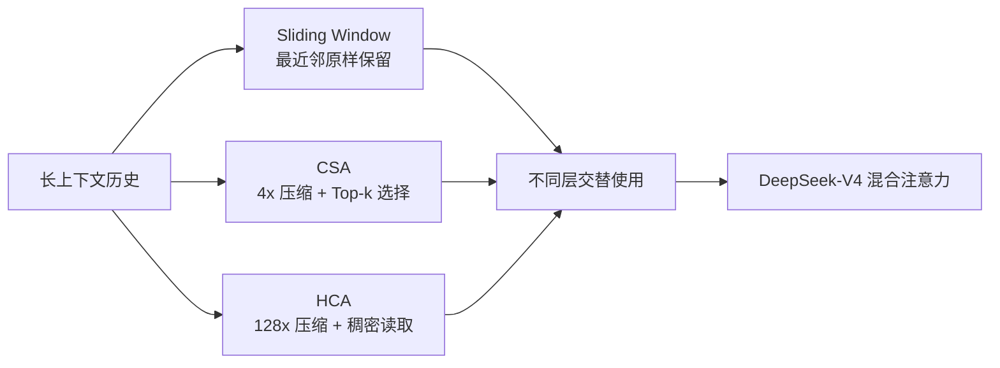
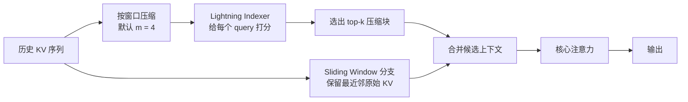
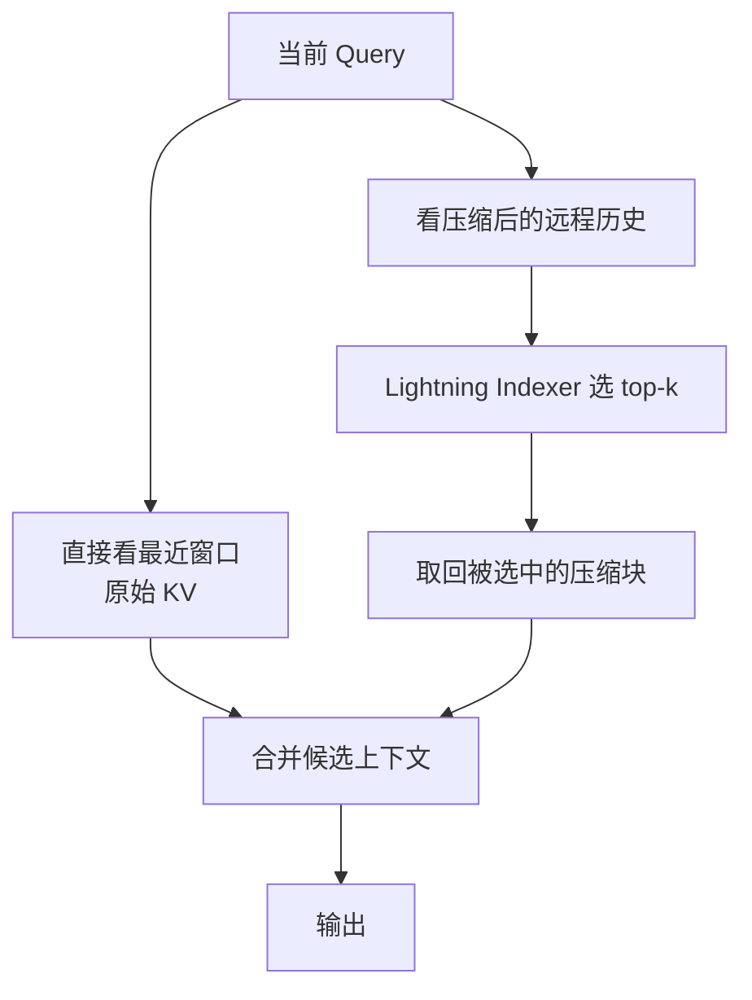
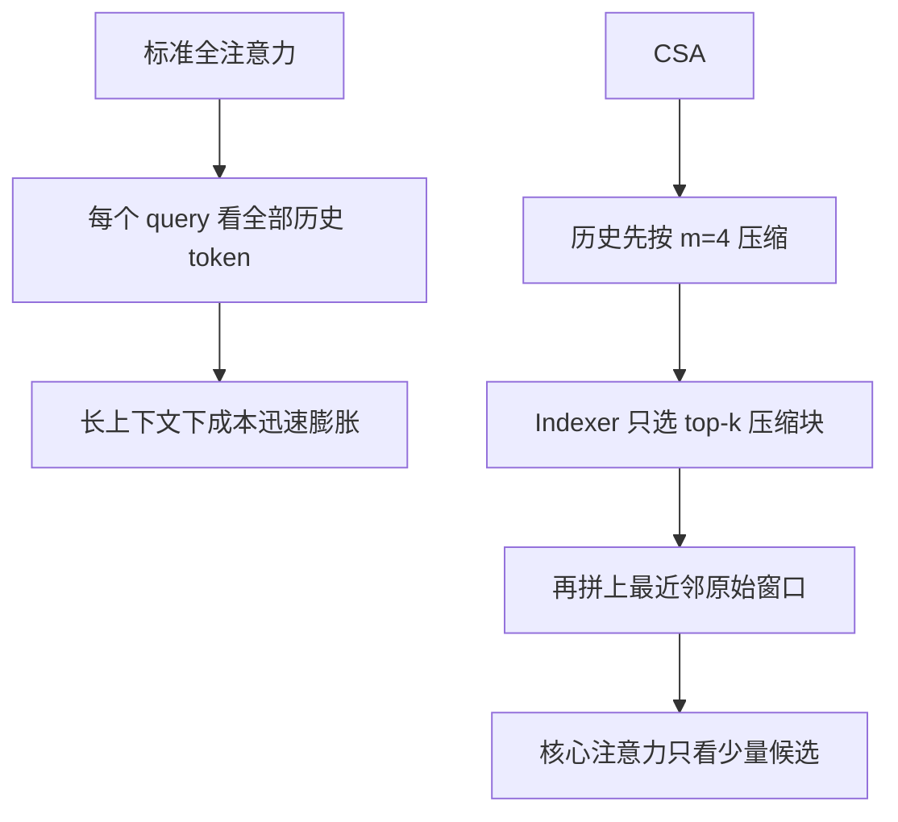

# DeepSeek-V4 Compressed Sparse Attention (CSA) 详解


## 1. 先用一句话讲清楚它是什么

DeepSeek-V4 里的 **Compressed Sparse Attention**，简称 **CSA**，可以理解成：

> **先把长历史沿着序列维压缩，再在压缩后的历史上做稀疏选择，最后配合一个保留近邻细节的滑动窗口分支完成注意力。**

如果你只记住一个关键词，那就是：

> **先压缩，再筛选，再精读。**

它是 DeepSeek-V4 混合注意力架构里的核心组件之一，和 **HCA（Heavily Compressed Attention）** 交替使用，一起把模型推进到 **100 万 token 上下文** 这个级别。

---

## 2. 它到底要解决什么问题

### 2.1 标准注意力在超长上下文下太贵

标准自注意力的核心形式是：

```text
Attention(Q, K, V) = softmax(QK^T / sqrt(d)) V
```

一旦序列长度变成 `n`，最直观的问题就是：

- 注意力打分矩阵接近 `n x n`
- 计算复杂度接近 `O(n^2)`
- 推理时 KV Cache 会随上下文长度线性膨胀

当上下文来到 `128K`、`256K`、`1M` 时，模型真正被卡住的，往往不是“能不能表达”，而是：

> **算不过来，也存不下来。**

### 2.2 仅仅压 KV 还不够

DeepSeek 早期的 `MLA` 更偏向：

- 压缩每个 token 的 KV 表示
- 降低 decode 阶段的缓存体积和带宽压力

而 DeepSeek-V4 的 CSA 则更进一步，它重点解决的是：

> **每个 query 到底还要访问多少历史位置。**

这意味着它不只是把“每条记忆变小”，而是把“要看的记忆数量”也一起压下去。

---

## 3. CSA 在 DeepSeek-V4 里处于什么位置

DeepSeek-V4 不是把所有层都改成同一种注意力，而是采用 **混合注意力**。

公开资料里，V4 的注意力层大致分成三类：

1. `Sliding Attention`：只看局部窗口
2. `CSA`：低倍率压缩 + 稀疏选择
3. `HCA`：高倍率压缩 + 稠密注意力

可以把它理解成一个分层阅读系统：

- **最近邻**：直接精读
- **中远距离**：压缩后只挑最相关块精读
- **超长距离**：做更粗粒度的全局总览



这也是 DeepSeek-V4 和早期单一路径注意力方案最大的不同：

> **不是让所有层都承担同一种工作，而是让不同层用不同粒度读上下文。**

---

## 4. 为什么叫 Compressed Sparse Attention

这个名字里有两层意思。

### 4.1 Compressed

它先把序列维上的历史 KV 条目压缩。

根据公开实现与文档说明，CSA 的默认压缩率是：

```text
m = 4
```

也就是：

- 原来每个 token 一条 KV 条目
- 现在大致每 `4` 个 token 压成 `1` 个压缩条目

所以压缩后的历史长度大致从：

```text
n -> n / 4
```

### 4.2 Sparse

压缩完以后，CSA 并不是对全部压缩条目做稠密注意力，而是通过一个 **Lightning Indexer**，为每个 query 只挑出最相关的 `top-k` 压缩块。

也就是说，CSA 不是：

- 只压缩不筛选

而是：

- **先压缩搜索空间**
- **再在压缩空间里做稀疏检索**

这两步叠在一起，效率收益才足够大。

---

## 5. 一张图看懂 CSA 的主流程



这张图里最关键的不是“压缩”本身，而是三步配合：

1. 先把远处长历史变短
2. 再从短历史里挑重点
3. 同时保留最近邻的原始细节

所以 CSA 不是一个单点技巧，而是一套完整的信息组织策略。

---

## 6. 第一步：CSA 是怎么压缩 KV 的

### 6.1 不是简单平均，而是带权压缩

CSA 的压缩不是把 `4` 个 token 直接求平均这么粗暴。

公开解读通常把它描述为：

- 使用 **softmax-gated pooling**
- 带有 **learned positional bias**
- 对每个压缩窗口做数据相关的加权融合

可以把一个压缩条目写成概念形式：

```text
K_comp[w] = sum(alpha[w, j] * K[j])
V_comp[w] = sum(beta[w, j] * V[j])
```

其中：

- `w` 是压缩窗口编号
- `j` 是窗口内的原始 token
- `alpha / beta` 是学出来的权重

这意味着 CSA 的压缩更像：

> **学习“这 4 个 token 里，哪些维度、哪些位置更值得留下来”。**

### 6.2 采用重叠窗口，避免硬边界

Hugging Face 文档里明确提到，CSA 的压缩窗口是 **overlapping windows**。

这点非常重要，因为如果窗口完全不重叠，容易出现这种问题：

```text
[t1 t2 t3 t4] | [t5 t6 t7 t8]
```

一旦关键信息刚好落在边界上，两个压缩块都可能只保留到一半语义。

重叠窗口则更像这样：

```text
w1 = [t1 t2 t3 t4]
w2 = [t3 t4 t5 t6]
w3 = [t5 t6 t7 t8]
```

这样做好处很明显：

- 减少窗口切分造成的信息断裂
- 提升跨块依赖的连续性
- 让局部语义过渡更平滑

所以你可以把重叠窗口理解成：

> **用一点冗余，换取压缩后的信息连续性。**

---

## 7. 第二步：Lightning Indexer 在做什么

压缩后，历史长度虽然从 `n` 变成了 `n / 4`，但如果 query 仍然对全部压缩块做稠密注意力，成本还是会继续随上下文增长。

于是 DeepSeek-V4 在 CSA 里加了一个 **Lightning Indexer**。

它的职责非常像一个“轻量检索器”：

- 输入当前 query
- 对所有压缩块快速打分
- 只保留最相关的 `top-k` 块

Hugging Face 的官方博客把它概括为：

- 使用 **multi-head dot product** 打分
- `ReLU` 风格评分
- indexer 的 QK path 使用 **FP4**

你可以把它想成：

> **不是让 query 去扫全部历史，而是先问一个更便宜的检索器：最值得看的压缩块是哪几个？**

### 7.1 为什么先压缩再索引特别值钱

这里有个很关键的设计收益：

- 如果直接在原始 `n` 个 token 上做稀疏选择，检索空间还是很大
- CSA 先把搜索空间压到 `n / 4`
- 再在这个更短的序列上做 top-k 选择

所以 Lightning Indexer 不只是“加了个检索器”，而是：

> **在已经缩短过的搜索空间上做检索。**

这会同时降低：

- 检索器本身的代价
- 后续 gather 的代价
- 核心注意力真正要看的条目数

---

## 8. 第三步：为什么还要保留 Sliding Window 分支

如果 CSA 只有“压缩块 + top-k 选择”，它仍然会有一个问题：

> **最近邻的细粒度信息可能被压缩得不够精确。**

但语言模型在生成下一个 token 时，最常依赖的往往恰恰是最近若干个 token，例如：

- 句法上的紧邻依赖
- 代码里的局部变量
- 推理链最近一步的中间状态

所以 DeepSeek-V4 的公开实现里，CSA 还带着一个：

> **Additional Branch of Sliding Window Attention**

也就是共享的 **滑动窗口原始 KV 分支**。

它保留最近邻的未压缩细节，然后与 CSA 选出来的压缩候选一起送进核心注意力。



所以 CSA 的阅读策略可以概括成：

- **近处直接看**
- **远处先压缩看**
- **确认重要后再精看**

这和人读长文档时的习惯非常像。

---

## 9. 一个小例子最容易理解

假设当前要处理 `t20`，历史是 `t1 ~ t19`。

设：

- 压缩率 `m = 4`
- 局部窗口保留最近 `4` 个 token
- Lightning Indexer 从压缩块里选 `top-2`

### 9.1 原始历史

```text
t1 t2 t3 t4 | t5 t6 t7 t8 | t9 t10 t11 t12 | t13 t14 t15 t16 | t17 t18 t19
```

### 9.2 压缩后

```text
c1 c2 c3 c4
```

例如：

- `c1` 表示 `t1 ~ t4`
- `c2` 表示 `t5 ~ t8`
- `c3` 表示 `t9 ~ t12`
- `c4` 表示 `t13 ~ t16`

### 9.3 局部窗口分支

对 `t20` 来说，最近邻原始细节来自：

```text
t16 t17 t18 t19
```

### 9.4 Indexer 选重点

假设当前 query 觉得：

- `c2` 对应的历史片段很相关
- `c4` 也很相关

那么最后真正进入核心注意力的上下文就不再是全部历史，而是：

```text
local raw KV + {c2, c4}
```

这个例子里最本质的变化是：

- 标准注意力：`t20` 看全部 `t1 ~ t19`
- CSA：`t20` 看最近原始细节 + 少量精选压缩块

---

## 10. 从复杂度角度看，它为什么更省

设：

- 原序列长度是 `n`
- 滑窗大小是 `w`
- CSA 压缩率是 `m`
- indexer 选出的压缩块数是 `k`

那么一个 query 需要看的上下文，不再是 `n`，而更接近：

```text
w + k
```

这里的关键前提是：

- `k` 是对压缩后的块数做 top-k
- 原始长历史不会全部进入核心注意力

当然，CSA 还要额外付出：

- 压缩代价
- indexer 打分代价
- gather 候选块的代价

但整体思路是用：

> **少量压缩与检索开销，换掉原本大规模的全量注意力。**

这在 `n` 极大时是非常划算的。

---

## 11. CSA 和 HCA 的关系

很多人第一次看到 V4 会问：

> 既然已经有 CSA，为什么还要 HCA？

因为两者承担的职责不一样。

### 11.1 CSA 更像“精细的中远程检索器”

特点是：

- 压缩率低，默认 `m = 4`
- 保留更多局部细节
- 通过 indexer 做 query-aware 的稀疏选择

适合做：

- 更细粒度的长程信息访问
- 兼顾效率和精度的中远距离建模

### 11.2 HCA 更像“极粗粒度的全局目录”

公开资料里，HCA 的默认压缩率约为：

```text
m' = 128
```

特点是：

- 压得更狠
- 没有 indexer
- 对压缩后的超短序列做稠密注意力

适合做：

- 极长范围的全局概览
- 非常便宜的远距上下文扫描

### 11.3 一句话区分

- `CSA`：**4x 压缩后，再挑重点看**
- `HCA`：**128x 压缩后，全部摘要都看**

也就是说：

> **CSA 更偏“选得聪明”，HCA 更偏“压得更狠”。**

---

## 12. CSA 和 DeepSeek Sparse Attention、MLA 分别是什么关系

### 12.1 它和 DeepSeek Sparse Attention 的关系

根据公开说明，CSA 继承了 DeepSeek 早期稀疏选择思路，但做了一个关键升级：

> **把稀疏选择运行在“已经压缩过”的序列上。**

因此可以粗略理解为：

- 早期 DeepSeek Sparse Attention：直接在较长历史上做稀疏选择
- V4 的 CSA：先把历史缩短，再做稀疏选择

所以 CSA 不是把旧方法简单照搬，而是：

> **让稀疏选择先享受到序列压缩带来的搜索空间缩短。**

### 12.2 它和 MLA 的关系

`MLA` 与 `CSA` 经常一起被提，但它们解决的问题不同。

| 机制 | 主要优化对象 | 主要目标 | 典型收益 |
| --- | --- | --- | --- |
| MLA | 每个 token 的 KV 表示体积 | 降低 KV Cache 和带宽 | 更省 decode |
| CSA | 每个 query 访问的历史条目数 | 降低长上下文注意力计算 | 更省长程访问 |

一句话区分：

- **MLA：把每条记忆压小**
- **CSA：把需要访问的记忆数量压少**

在 DeepSeek-V4 里，重点已经从“只压 KV 体积”转向“沿序列维组织上下文”。

---

## 13. 为什么说它是“沿序列维压缩”

这是理解 DeepSeek-V4 的一个关键点。

很多常见优化更像是在：

- 头维度上共享
- 通道维度上低秩
- KV 表示维度上做压缩

但 CSA 最独特的地方在于：

> **它压的是时间轴，也就是 token 序列本身。**

原来是：

```text
t1 t2 t3 t4 t5 t6 t7 t8 ...
```

压缩后变成：

```text
c1      c2      c3 ...
```

这样一来，真正随上下文长度线性膨胀的那个维度，终于被直接“动手术”了。

这也是为什么 CSA 比“只做头共享”更适合百万级上下文。

---

## 14. 公开数字应该怎么理解

这里很容易混淆两个不同口径。

### 14.1 对比 DeepSeek-V3.2 的官方口径

在 1M-token 场景下，DeepSeek-V4-Pro 相比 DeepSeek-V3.2，大约是：

- 单 token 推理 FLOPs 为其 `27%`
- KV Cache 大小为其 `10%`

这是技术报告中的主口径。

### 14.2 对比“传统 GQA + BF16 KV Cache”的解读口径

Hugging Face 的官方解读进一步指出：

- 如果和比较传统的 `GQA(8 heads) + BF16 KV` 体系相比
- DeepSeek-V4 的 KV Cache 体积可粗略理解为约 `2%`

这个数字并不是单独由 CSA 贡献，而是多项设计共同叠加的结果，包括：

- `CSA`
- `HCA`
- 存储精度设计
- 其它投影优化

所以更严谨的表述应该是：

> **CSA 是 DeepSeek-V4 把长上下文做便宜的核心机制之一，但不是唯一因素。**

---

## 15. 一张图看“标准注意力 vs CSA”



如果你只从这张图里提炼一个认知，那就是：

> **CSA 的收益不是来自一个神奇公式，而是来自“候选集缩小”这件事。**

---

## 16. 伪代码最容易建立直觉

下面给一个概念级伪代码：

```python
def csa_attention(query, key_cache, value_cache, window_size, compress_rate, topk):
    # 1) 最近邻原始窗口，保留细粒度细节
    local_k, local_v = take_recent_window(
        key_cache, value_cache, window_size
    )

    # 2) 把更远历史按重叠窗口压缩成 compressed KV
    comp_k, comp_v = compress_overlapping_windows(
        key_cache, value_cache, compress_rate
    )

    # 3) 用轻量 indexer 只挑出最相关的 top-k 压缩块
    chosen_ids = lightning_indexer(
        query=query,
        compressed_keys=comp_k,
        topk=topk,
    )

    sel_k, sel_v = gather_selected_blocks(comp_k, comp_v, chosen_ids)

    # 4) 合并局部原始 KV 与远程精选压缩块
    final_k = concat(local_k, sel_k)
    final_v = concat(local_v, sel_v)

    # 5) 在缩小后的候选集上做注意力
    return attention(query, final_k, final_v)
```

这段伪代码最重要的地方不是 API 细节，而是顺序：

1. 先保局部高精度
2. 再构造远程压缩记忆
3. 再用 query 动态挑重点
4. 最后只在缩小后的候选集合上做注意力

---

## 17. CSA 的优点

### 17.1 直接处理“序列太长”这个根因

它不是只压缩某个中间表示，而是直接减少需要参与注意力的历史条目数。

### 17.2 兼顾精度和效率

- 局部窗口保住细节
- 压缩块保住全局轮廓
- top-k 选择保住关键远程信息

### 17.3 Query-aware

不同 query 可以选择不同的压缩块，而不是所有 token 都被迫使用同一套固定稀疏模板。

### 17.4 比“直接在原序列上做稀疏选择”更省

因为它先把搜索空间缩短了，再做选择。

### 17.5 工程上更适合百万级上下文

对 1M 级别上下文来说，光靠普通滑窗或轻量 KV 压缩都不够，CSA 这种“先缩短历史，再稀疏访问”的设计更对症。

---

## 18. CSA 的代价和局限

CSA 也不是没有代价。

### 18.1 结构更复杂

它同时涉及：

- 压缩器
- 重叠窗口
- 轻量索引器
- 候选块 gather
- 滑动窗口分支

实现复杂度明显高于普通 MHA、GQA 或滑窗注意力。

### 18.2 选择器如果选错，会漏关键信息

任何 top-k 机制都绕不开一个问题：

> **一旦重要块没有进入候选集，就会产生信息遗漏。**

这也是为什么 CSA 不能只靠 indexer，还要有滑窗分支做局部兜底。

### 18.3 压缩有信息损失

即使是学习型加权压缩，也不可能完全等价于保留所有原始 token。

### 18.4 稀疏收益高度依赖实现质量

理论上减少访问数量不代表实际一定更快，因为还涉及：

- 索引开销
- gather 开销
- kernel 是否融合
- 内存布局是否友好

所以 CSA 的难点从来不只是“算法想法”，而是：

> **怎么把这套想法做成真正高吞吐的工程实现。**

---

## 19. 最容易混淆的几个误区

### 19.1 CSA 不是普通滑窗注意力

滑窗只是它的一条辅助分支。CSA 的主体仍然是：

- 远程历史压缩
- 轻量索引
- top-k 稀疏选择

### 19.2 CSA 不等于 HCA

两者都压缩，但：

- `CSA` 是低倍率压缩 + 稀疏选择
- `HCA` 是高倍率压缩 + 稠密注意力

### 19.3 CSA 也不等于 MLA

MLA 主要在表示层压 KV；CSA 主要在序列层减访问。

### 19.4 CSA 不只是“在压缩序列上做 attention”

它真正的关键在于：

- 压缩方式是学习型的
- 窗口是重叠的
- 还有 query-aware 的 Lightning Indexer
- 并且始终带着滑窗局部分支

---

## 20. 如果你想把它彻底记住，就记这四句话

1. **CSA 沿序列维压缩历史，而不是只压头维或通道维。**
2. **CSA 先把历史缩短，再在缩短后的历史上做稀疏选择。**
3. **CSA 不是只看压缩块，还会保留最近邻原始窗口。**
4. **CSA 在 V4 里不是单独工作，而是和 HCA 交替构成混合注意力。**

---

## 21. 一句话总结

> **DeepSeek-V4 的 Compressed Sparse Attention，本质上是一种“先沿序列维压缩 KV、再用轻量检索器做 top-k 选择、并用滑动窗口保住局部细节”的混合注意力机制。它把长上下文最贵的那部分访问成本，从“看全部历史”改成了“看局部原始细节 + 少量精选压缩块”，因此成为 DeepSeek-V4 迈向百万 token 上下文的核心架构支点之一。**

---

## 22. 速记版

- `CSA = Compressed Sparse Attention`
- 默认压缩率大致是 `m = 4`
- 沿 **序列维** 压缩 KV 条目
- 压缩窗口采用 **overlapping windows**
- 通过 **Lightning Indexer** 做 `top-k` 选择
- 带一个共享的 **Sliding Window** 原始 KV 分支
- `CSA` 更偏“精细检索”，`HCA` 更偏“极致压缩”
- `MLA` 压的是单条记忆体积，`CSA` 压的是访问历史数量

---

## 23. 参考资料

1. DeepSeek-V4: Towards Highly Efficient Million-Token Context Intelligence  
   https://huggingface.co/deepseek-ai/DeepSeek-V4-Pro/blob/main/DeepSeek_V4.pdf

2. Hugging Face Transformers 文档：DeepSeek-V4  
   https://huggingface.co/docs/transformers/model_doc/deepseek_v4

3. Hugging Face 博文：DeepSeek-V4: a million-token context that agents can actually use  
   https://huggingface.co/blog/deepseekv4

4. 本仓库相关概念文档：
   - [DeepSeek-Sparse-Attention.md](./DeepSeek-Sparse-Attention.md)
   - [Multi-head-Latent-Attention.md](./Multi-head-Latent-Attention.md)
   - [Sliding-Window-Attention.md](./Sliding-Window-Attention.md)
