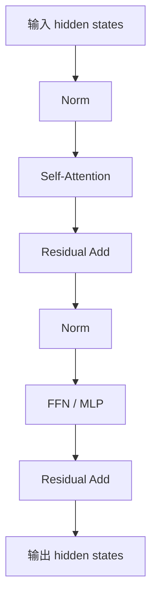
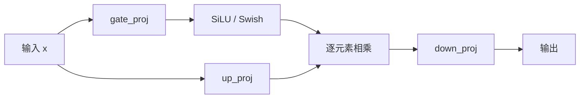
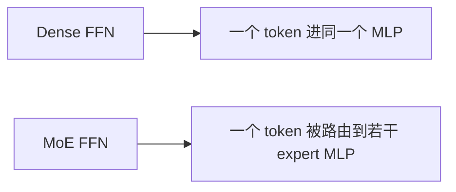

# FFN 详解


## 1. 什么是 FFN

FFN 是 **Feed-Forward Network** 的缩写，中文通常叫：

> **前馈网络**

在 Transformer 里，它更完整的名字常写成：

> **Position-wise Feed-Forward Network**

也就是：

> **逐位置前馈网络**

这四个字非常重要，因为它直接说明了 FFN 的工作方式：

- 它会对序列中的每个 token 向量单独做变换
- 同一层里，不同位置共享同一套 FFN 参数
- 它不像 attention 那样在 token 与 token 之间做信息交互

如果用一句话概括 FFN：

> **attention 负责“从别的 token 收集信息”，FFN 负责“对当前 token 的表示做更强的非线性加工”。**

这也是为什么大家常说，Transformer 的核心骨架不是只有 attention，而是：

```text
Attention + FFN
```

---

## 2. FFN 在 Transformer 里到底处于什么位置

一个标准 Transformer block，通常都包含两大子模块：

- Self-Attention
- FFN

最常见的逻辑是：

```text
x -> Attention -> Add/Norm -> FFN -> Add/Norm
```

或者在现代 LLM 的 pre-norm 写法中：

```text
x -> Norm -> Attention -> Residual
x -> Norm -> FFN -> Residual
```

### 2.1 一张图先看整体位置



你可以这样理解：

- attention 让一个 token 去看别的 token
- FFN 则是在“已经融合上下文之后”，再对每个 token 做一次本地非线性变换

所以：

> **attention 更像“信息路由与聚合”，FFN 更像“特征重编码与提纯”。**

---

## 3. 为什么 Transformer 不能只有 attention

这是理解 FFN 最核心的问题之一。

很多人初学 Transformer 时，会把注意力机制看成主角，于是直觉上会问：

> 既然 attention 已经能建模依赖关系，为什么还要 FFN？

原因是，attention 和 FFN 解决的问题不同。

### 3.1 attention 的强项

attention 擅长做：

- token 之间的信息交互
- 上下文聚合
- 动态加权检索

它回答的是：

> “我当前这个 token，应该从别的位置拿什么信息回来？”

### 3.2 FFN 的强项

FFN 擅长做：

- 对每个 token 表示进行非线性映射
- 将混合后的上下文特征重新组织
- 增强表示能力
- 做“升维 -> 激活 -> 降维”的特征变换

它回答的是：

> “这个 token 在拿到上下文之后，怎样把这些信息加工成更有用的表示？”

### 3.3 没有 FFN 会怎样

如果 Transformer 只有 attention，没有 FFN，那么模型虽然还能交换信息，但：

- 每层的非线性加工能力会弱很多
- token 表示的局部变换不足
- 表达能力明显受限

所以 FFN 不是可有可无的配角，而是 Transformer 表达能力的重要来源之一。

---

## 4. 标准 FFN 的公式是什么

原始 Transformer 论文中的标准 FFN 是：

```text
FFN(x) = max(0, xW1 + b1) W2 + b2
```

如果写得更现代一些，也常写成：

```text
FFN(x) = W2(activation(W1 x + b1)) + b2
```

其中：

- `x` 的维度通常是 `d_model`
- `W1` 把维度从 `d_model` 升到 `d_ff`
- 激活函数引入非线性
- `W2` 再把维度从 `d_ff` 压回 `d_model`

最经典的结构就是：

```text
d_model -> d_ff -> d_model
```

### 4.1 原始 Transformer 的典型配置

在论文里常见的是：

```text
d_model = 512
d_ff = 2048
```

也就是：

```text
d_ff = 4 * d_model
```

这也是为什么很多人把标准 FFN 叫做：

> **4 倍扩张 MLP**

---

## 5. 一张图看懂 FFN 做了什么


这张图里最重要的直觉是：

- 第一层先把特征空间拉大
- 在更大的空间里做非线性筛选和组合
- 再压缩回主残差流维度

可以把它想成：

> **先把表示摊开，再挑重点，最后再收回来。**

---

## 6. 为什么要先升维再降维

这一步是 FFN 的关键设计。

如果只是：

```text
x -> Linear -> Linear
```

而没有明显扩张，那么它的表达空间会比较受限。  
加入中间扩张层后，模型就能在更大的特征空间里组合模式。

### 6.1 升维的直觉

把 `d_model` 扩张到 `d_ff`，相当于：

- 给模型更多中间通道
- 让不同特征可以在更大空间里解耦
- 为激活函数提供更丰富的可塑性

### 6.2 降维的必要性

Transformer 的残差流通常要求输入输出维度一致，因此 FFN 需要把维度再投影回去：

```text
d_model -> d_ff -> d_model
```

否则就没法和原始残差相加。

### 6.3 一个形象类比

可以把 FFN 想成一个“小型加工厂”：

- 升维：把原料铺开、分类、打开更多工位
- 激活：做非线性筛选和加工
- 降维：把加工后的结果重新打包回统一规格

---

## 7. 为什么说 FFN 是“逐位置”的

FFN 的一个非常重要特点是：

> **它对每个 token 分别计算，但所有位置共享同一套参数。**

如果输入张量形状是：

```text
[B, T, d_model]
```

那么 FFN 的操作可以理解为：

- 对 `B x T` 个 token 向量分别做同一个 MLP

也就是说，它不会像 attention 那样让位置 `i` 和位置 `j` 直接发生交互。

### 7.1 数学上怎么理解

对序列中第 `t` 个位置的向量 `x_t`：

```text
y_t = FFN(x_t)
```

每个 `x_t` 都用同一组 `W1/W2`。

### 7.2 为什么这很合理

因为 attention 已经负责跨位置通信了。  
FFN 不需要再做一次 token 间交互，它只需要：

- 对当前 token 表示做深度加工
- 保持计算并行

所以 Transformer 的计算分工很清楚：

- attention：**跨位置**
- FFN：**逐位置**

---

## 8. FFN 和 CNN 的 `1x1` 卷积为什么常被类比

经典讲解里经常会说：

> FFN 可以理解成两个 `1x1` 卷积。

这是因为：

- 它不在序列维上卷动
- 它只在通道维上做线性变换
- 对每个位置应用同一套参数

因此从结构上看，FFN 很像：

```text
Conv1x1 -> activation -> Conv1x1
```

这个类比的价值在于帮助你理解：

- FFN 不负责邻域建模
- FFN 主要做通道混合

---

## 9. FFN 和 attention 的分工到底是什么

这是最值得反复记住的一张对比表。

| 模块 | 主要作用 | 信息范围 | 擅长什么 |
| --- | --- | --- | --- |
| Attention | 聚合其他 token 信息 | 跨位置 | 关系建模、上下文检索 |
| FFN | 加工当前 token 表示 | 单位置 | 非线性变换、特征重编码 |

再用一句更口语的话说：

- attention 决定“看谁”
- FFN 决定“怎么消化”

### 9.1 一张图看二者配合


所以一个 Transformer block 的能力，实际上来自两次不同类型的加工：

1. 先混信息
2. 再炼表示

---

## 10. 标准 FFN 为什么参数很多

在 Transformer 中，FFN 往往是参数大户。

原因很简单：

- `W1` 的大小是 `d_model x d_ff`
- `W2` 的大小是 `d_ff x d_model`

如果 `d_ff = 4 * d_model`，那么总参数量大约是：

```text
2 * d_model * d_ff
```

代入 `d_ff = 4 * d_model`：

```text
8 * d_model^2
```

这通常比单个 attention 投影层还更重。

### 10.1 一个直观例子

假设：

```text
d_model = 4096
d_ff = 11008
```

那么仅 FFN 的两层大矩阵就非常可观。  
这也是为什么很多大模型：

- 会对 FFN 结构精心设计
- 会在 FFN 上使用 GLU 变体
- MoE 也经常优先替换 FFN 而不是 attention

---

## 11. 标准 FFN 的激活函数为什么重要

FFN 的非线性能力主要来自中间激活函数。

如果没有激活函数，两层线性层可合并为一层线性层，表达能力会大幅下降。

### 11.1 早期常见：ReLU

原始 Transformer 使用的是：

```text
ReLU
```

优点：

- 简单
- 计算快

但缺点也明显：

- 不够平滑
- 负半轴直接截断为 0

### 11.2 GPT / BERT 常见：GELU

后来很多模型更偏爱：

```text
GELU
```

因为它：

- 更平滑
- 对小负值保留一定响应
- 往往更利于优化

### 11.3 现代 LLM 常见：SwiGLU / GLU 变体

近年来很多强模型使用的不是简单 `Linear -> GELU -> Linear`，而是：

```text
SwiGLU
```

这类结构更强调：

- 门控
- 更强的表达能力
- 更好的训练表现

所以今天提 FFN，往往不再只指最原始的 ReLU 两层网络，而是广义上的：

> **Transformer 中负责逐位置非线性变换的 MLP 子模块。**

---

## 12. 从 ReLU FFN 到 GELU FFN

最传统的 FFN 写法是：

```text
FFN(x) = W2(ReLU(W1x + b1)) + b2
```

后来很多模型换成：

```text
FFN(x) = W2(GELU(W1x + b1)) + b2
```

### 12.1 为什么 GELU 更常见

因为 GELU 相比 ReLU：

- 更平滑
- 梯度性质更柔和
- 在语言模型中经常效果更好

你可以粗略理解成：

- ReLU：硬门
- GELU：软门

---

## 13. 现代 LLM 的主流变体：SwiGLU

如果你最近看 LLaMA、Qwen、Gemma、DeepSeek 一类模型，FFN 很多时候实际上是 **SwiGLU MLP**。

### 13.1 SwiGLU 的基本形式

一种常见写法是：

```text
SwiGLU(x) = Swish(xWg) ⊙ (xWu)
out = SwiGLU(x) Wd
```

也常写成：

```text
out = Wdown( SiLU(Wgate x) ⊙ Wup x )
```

其中：

- `Wgate` 产生门控分支
- `Wup` 产生内容分支
- `SiLU/Swish` 作用在 gate 上
- `⊙` 表示逐元素乘法
- `Wdown` 把维度投回 `d_model`

### 13.2 一张图看懂 SwiGLU



它和标准 FFN 的最大不同是：

- 不再只有单一路径激活
- 而是内容分支和门控分支配合

### 13.3 为什么它更强

因为门控机制会让模型更灵活地决定：

- 哪些维度该放大
- 哪些维度该抑制

这通常能带来更强的表达能力。

---

## 14. 标准 FFN 和 SwiGLU 的区别

| 结构 | 核心形式 | 特点 |
| --- | --- | --- |
| ReLU FFN | `Linear -> ReLU -> Linear` | 最经典、最简单 |
| GELU FFN | `Linear -> GELU -> Linear` | 更平滑，NLP 中更常见 |
| SwiGLU FFN | `gate/up -> SiLU gate -> elementwise product -> down` | 门控更强，现代 LLM 常用 |

### 14.1 为什么 modern LLM 不太爱最原始 ReLU FFN

主要原因通常是：

- GELU / SwiGLU 表达能力更强
- 优化更稳定
- 在大规模训练里更容易取得更好效果

所以今天如果你看到配置里写：

```text
mlp
ffn
feed_forward
```

它背后很可能已经不是最早的 ReLU 版，而是某种 GLU 变体。

---

## 15. FFN 的维度为什么常常是 4 倍左右

很多文档里会写：

```text
d_ff = 4 * d_model
```

这是经典经验设置。

### 15.1 为什么不是 1 倍或 2 倍

如果中间维度太小：

- 中间空间不够丰富
- 非线性变换能力不够

### 15.2 为什么也不是越大越好

如果中间维度太大：

- 参数量暴涨
- FLOPs 变多
- 显存和吞吐压力上升

所以 `4x` 是一个历史上很常见的平衡点。

### 15.3 现代模型为什么经常不是严格 4 倍

因为不同变体会受：

- 门控结构
- 参数量预算
- kernel 对齐
- 吞吐优化

影响。

例如 SwiGLU 结构中，为了和传统 FFN 保持参数规模接近，经常会采用不是严格 `4x` 的中间维度，比如：

```text
intermediate_size ≈ 8/3 * d_model
```

或类似工程上更合适的取整值。

---

## 16. FFN 的输入输出形状怎么看

假设输入张量是：

```text
x: [B, T, d_model]
```

那么标准 FFN 通常会经历：

```text
[B, T, d_model]
-> [B, T, d_ff]
-> [B, T, d_ff]
-> [B, T, d_model]
```

这里最关键的一点是：

> **序列长度 `T` 不变，变化的是每个 token 的通道维度。**

这也再次说明 FFN 主要在做：

- 通道混合
- 特征变换

而不是位置混合。

---

## 17. 代码层面标准 FFN 长什么样

### 17.1 最小 PyTorch 版

```python
import torch.nn as nn


class FeedForward(nn.Module):
    def __init__(self, d_model, d_ff):
        super().__init__()
        self.w1 = nn.Linear(d_model, d_ff)
        self.act = nn.GELU()
        self.w2 = nn.Linear(d_ff, d_model)

    def forward(self, x):
        return self.w2(self.act(self.w1(x)))
```

这个实现就是最经典的：

- 升维
- 激活
- 降维

### 17.2 常见现代写法

实际工程里经常还会加入：

- dropout
- bias 开关
- RMSNorm 配套
- fused kernel

例如：

```python
class MLP(nn.Module):
    def __init__(self, d_model, d_ff, dropout=0.0):
        super().__init__()
        self.up = nn.Linear(d_model, d_ff, bias=False)
        self.act = nn.GELU()
        self.down = nn.Linear(d_ff, d_model, bias=False)
        self.dropout = nn.Dropout(dropout)

    def forward(self, x):
        x = self.up(x)
        x = self.act(x)
        x = self.down(x)
        return self.dropout(x)
```

---

## 18. SwiGLU 代码骨架长什么样

```python
import torch
import torch.nn as nn
import torch.nn.functional as F


class SwiGLUFFN(nn.Module):
    def __init__(self, d_model, d_ff):
        super().__init__()
        self.gate_proj = nn.Linear(d_model, d_ff, bias=False)
        self.up_proj = nn.Linear(d_model, d_ff, bias=False)
        self.down_proj = nn.Linear(d_ff, d_model, bias=False)

    def forward(self, x):
        gate = F.silu(self.gate_proj(x))
        up = self.up_proj(x)
        return self.down_proj(gate * up)
```

这就是很多现代 LLM 中最常见的 FFN 风格之一。

---

## 19. FFN 和残差连接是什么关系

FFN 一般不会单独裸奔，而是放在残差路径里：

```text
x -> FFN(x) -> x + FFN(x)
```

或者在 pre-norm 中：

```text
x -> FFN(Norm(x)) -> x + ...
```

### 19.1 为什么需要残差

因为：

- FFN 变换能力很强
- 深层堆叠时容易破坏信息流

残差连接可以帮助：

- 保持梯度流动
- 避免深层退化
- 让 FFN 更像“增量修正”

所以你可以把 FFN 视为：

> **对原始表示的增强，而不是彻底替换。**

---

## 20. FFN 为什么常常比 attention 更像“参数仓库”

在很多模型里：

- attention 是信息路由核心
- FFN 是参数容量核心

原因是 FFN 的大矩阵很多，而且每层都会重复出现。

这也是为什么：

- 参数量分析时经常发现 FFN 占比很高
- 想提升模型容量时，FFN 是一个非常自然的扩展位置

这一步再往前走，就会得到一个重要方向：

> **MoE**

---

## 21. MoE 为什么通常替换 FFN，而不是 attention

这是理解现代大模型结构的关键之一。

MoE 的典型做法不是改掉 attention，而是把原本的 dense FFN 替换成多个 expert FFN。

### 21.1 为什么替 FFN 更自然

因为：

- FFN 本来就是逐 token 计算
- 每个 token 独立进 FFN，天然适合路由到不同专家
- FFN 是参数大户，稀疏化收益很高

### 21.2 一张图看关系



所以很多 MoE 模型本质上是：

> **attention 保持密集，FFN 变成稀疏专家网络。**

---

## 22. FFN 在大模型里的意义

如果只从功能看，FFN 似乎只是一个两层 MLP。  
但如果从现代 LLM 视角看，它的地位非常高。

因为它承载了很多关键设计选择：

- 激活函数选什么
- 是否做门控
- 中间维度开多大
- 是否 bias-free
- 是否替换成 MoE
- 是否做 fused kernel 优化

也就是说，今天的大模型配方里，FFN 已经不是一个“固定不变的小模块”，而是：

> **模型容量、表达能力、吞吐效率、架构风格的集中体现。**

---

## 23. 常见误区

### 23.1 FFN 不是传统意义上的整网“前馈神经网络”

虽然名字叫 Feed-Forward Network，但在 Transformer 语境里，它通常特指：

- block 内部的逐位置 MLP 子模块

而不是泛指所有前馈网络。

### 23.2 FFN 不负责 token 间交互

token 与 token 的交互主要是 attention 完成的。  
FFN 只处理每个 token 自己的表示。

### 23.3 FFN 不一定就是 `Linear-ReLU-Linear`

现代 LLM 中更常见的是：

- GELU FFN
- SwiGLU FFN
- 其他 GLU 变体

### 23.4 FFN 虽然“逐位置”，但并不弱

很多人误以为它只是一个辅助层。  
其实 FFN 往往占据了大量参数和相当关键的表达能力。

---

## 24. 一个非常直观的小例子

假设句子中某个 token 经过 attention 后，已经把上下文信息收集回来了：

```text
"bank"
```

在不同上下文中，它可能更接近：

- 银行
- 河岸

attention 负责把周围语境的信息聚合到这个 token 表示里。  
而 FFN 做的事更像是：

- 根据当前已经融合后的上下文表示
- 重新塑形这个 token 的内部特征
- 把更相关的语义维度放大，把不重要的维度抑制

也就是说：

> **attention 决定拿什么证据，FFN 决定怎么把证据加工成最终表示。**

---

## 25. 一句话总结

FFN 的本质是：

> **Transformer 中对每个 token 表示单独进行“升维 -> 非线性变换 -> 降维”加工的逐位置 MLP 子模块，用来增强表示能力，并与 attention 形成“信息聚合 + 特征重编码”的配合。**

如果压缩成更短的一句：

> **attention 负责看别人，FFN 负责炼自己。**

---

## 26. 速记版

- FFN = Feed-Forward Network，Transformer 中通常指逐位置前馈网络
- 它对每个 token 单独计算，但同层所有位置共享参数
- 标准结构是 `d_model -> d_ff -> d_model`
- 最经典公式是 `FFN(x) = W2(activation(W1x + b1)) + b2`
- attention 做跨 token 信息交互，FFN 做单 token 非线性加工
- FFN 常是参数大户，因此很多架构优化会重点改它
- 早期常用 ReLU，后来大量模型用 GELU
- 现代 LLM 常见 FFN 变体是 SwiGLU / GLU 类门控 MLP
- MoE 往往不是替换 attention，而是把 dense FFN 换成 sparse expert FFN

---

## 27. 参考资料

- Vaswani et al., *Attention Is All You Need*, 2017
- [Transformer 原理导读](https://arxiv.org/abs/1706.03762)
- Hendrycks and Gimpel, *Gaussian Error Linear Units (GELUs)*, 2016
- Shazeer, *GLU Variants Improve Transformer*, 2020
- Touvron et al., *LLaMA: Open and Efficient Foundation Language Models*, 2023
