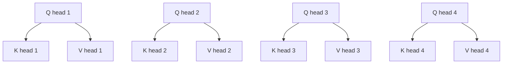
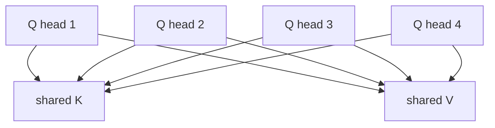
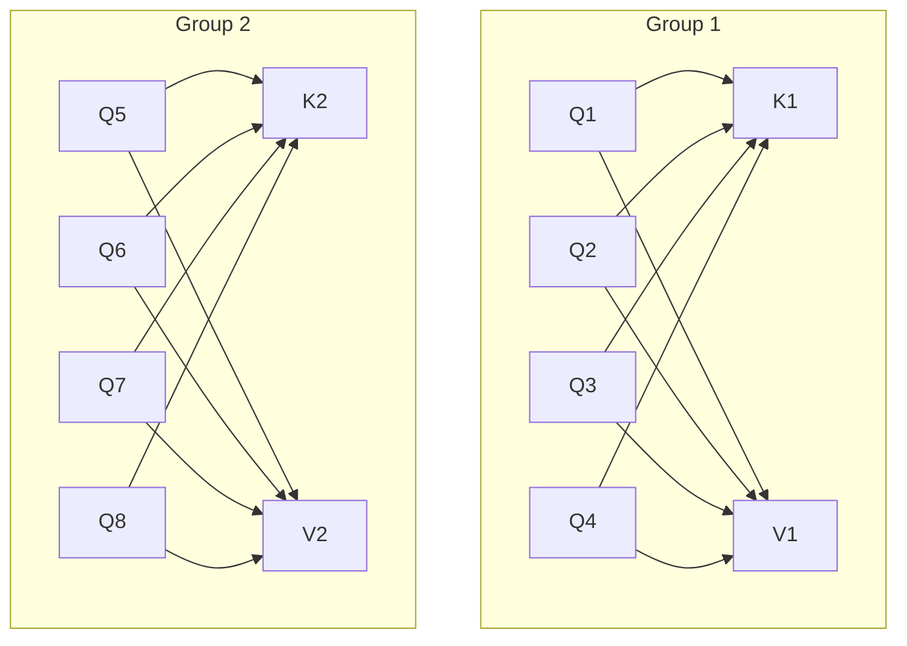
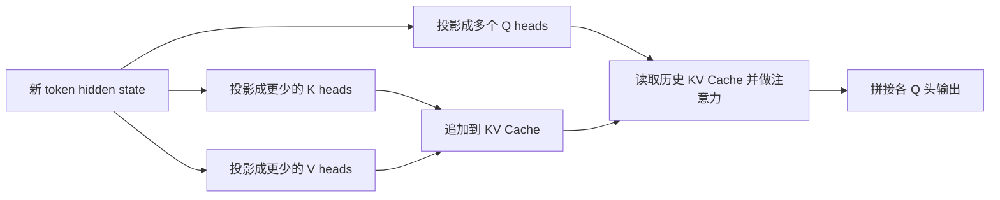
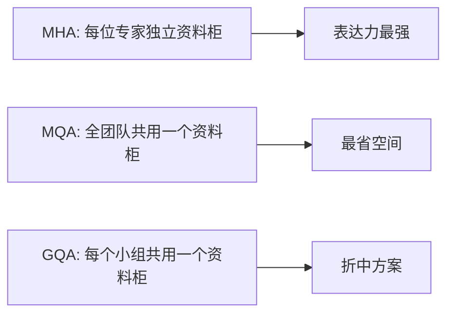

# GQA Attention 详解

## 1. 什么是 GQA

GQA 是 **Grouped-Query Attention** 的缩写，中文通常叫 **分组查询注意力**。

它的核心思想是：

> 让多个 Query 头共享同一组 Key / Value 头。

如果标准多头注意力（MHA）是“每个查询头都自带一套 K/V”，那么 GQA 更像是“多个查询头按组共用 K/V”。

它的主要目标不是改变注意力的数学本质，而是：

- 显著减少 KV Cache 占用
- 降低解码阶段的带宽压力
- 尽量保留多头注意力的表达能力
- 在 MHA 和 MQA 之间取得工程上的平衡

---

## 2. 为什么会需要 GQA

在大语言模型推理里，尤其是 **自回归解码** 场景，瓶颈往往不只是算力，还有 **KV Cache 的显存和访存开销**。

对长度为 `T` 的上下文，若有：

- `h` 个 Query 头
- 每头维度为 `d`

那么标准 MHA 需要缓存：

- `K`: `T x h x d`
- `V`: `T x h x d`

也就是说，头数越多，缓存越大。

当上下文很长、batch 很大、层数很多时，这部分成本会迅速膨胀。于是大家开始问：

> Query 头必须很多，但 Key / Value 头也必须一样多吗？

GQA 给出的回答是：

> 不一定。多个 Query 头可以共享更少数量的 K/V 头。

---

## 3. 从 MHA 到 MQA，再到 GQA

理解 GQA 最简单的方法，是把它放到一条连续谱上看。

### 3.1 MHA：每个头各管各的

在标准 Multi-Head Attention 中：

- Query 有 `h` 个头
- Key 有 `h` 个头
- Value 有 `h` 个头
- 一一对应做注意力



优点是表达能力强，但 K/V 缓存最多。

### 3.2 MQA：所有 Query 头共享一套 K/V

MQA 是 **Multi-Query Attention**。

它进一步把 K/V 压缩到只有 1 组：

- Query 仍然有 `h` 个头
- Key 只有 `1` 个头
- Value 只有 `1` 个头



这样缓存最省，但因为所有头共享同一套 K/V，表达能力可能下降。

### 3.3 GQA：折中方案

GQA 介于两者之间：

- Query 有 `h` 个头
- K/V 只有 `g` 个头
- 其中 `g < h`
- 每个 K/V 头服务一组 Query 头

例如：

- `h = 8`
- `g = 2`

则每 4 个 Query 头共享 1 个 K 头和 1 个 V 头。



你可以把它理解成：

- MHA：`h` 组 K/V
- GQA：`g` 组 K/V
- MQA：`1` 组 K/V

---

## 4. 一张图看懂三者区别

| 方案 | Query 头数 | Key/Value 头数 | 头间关系 | KV Cache 开销 |
| --- | --- | --- | --- | --- |
| MHA | `h` | `h` | 一一对应 | 最高 |
| GQA | `h` | `g` | 多个 Q 头共享一组 K/V | 中等 |
| MQA | `h` | `1` | 所有 Q 头共享同一组 K/V | 最低 |

如果以 `h = 16` 为例：

- MHA：16 组 K/V
- GQA（`g = 4`）：4 组 K/V
- MQA：1 组 K/V

所以 GQA 的 K/V 缓存大约是 MHA 的 `g / h`。

---

## 5. 数学上它到底变了什么

标准注意力仍然是：

```text
Attention(Q, K, V) = softmax(QK^T / sqrt(d)) V
```

GQA 改变的不是公式本身，而是 **Q 头和 K/V 头的对应关系**。

设：

- Query 头数为 `h`
- KV 头数为 `g`
- 每组包含 `r = h / g` 个 Query 头

那么第 `i` 个 Query 头，不再使用自己的独立 `K_i, V_i`，而是使用所属组的：

```text
K_group(i), V_group(i)
```

可以写成：

```text
head_i = Attention(Q_i, K_group(i), V_group(i))
```

其中：

- `Q_i` 仍然保持多头差异
- `K_group(i)` 和 `V_group(i)` 在组内共享

这意味着 GQA 保留了：

- Query 视角上的多样性

同时压缩了：

- Key/Value 的参数量与缓存量

---

## 6. 形状变化最关键

假设：

- batch 为 `B`
- 序列长度为 `T`
- 隐藏维度为 `hidden_size`
- Query 头数为 `h`
- KV 头数为 `g`
- 每头维度为 `d`

那么典型张量形状是：

### MHA

```text
Q: [B, T, h, d]
K: [B, T, h, d]
V: [B, T, h, d]
```

### GQA

```text
Q: [B, T, h, d]
K: [B, T, g, d]
V: [B, T, g, d]
```

当计算时，通常会把 `K/V` 沿头维复制或广播到对应的 Query 分组上，逻辑上等价于：

```text
Q heads per KV head = h / g
```

例如：

- `h = 32`
- `g = 8`

则每个 K/V 头负责 4 个 Query 头。

---

## 7. GQA 为什么能明显加速推理

在训练时，注意力通常仍要处理整段序列，因此收益不一定像推理那样显著。

但在 **解码阶段**，GQA 很有价值，因为每生成一个新 token，都要：

- 读取历史 K Cache
- 读取历史 V Cache
- 和当前 Query 计算注意力

此时大量开销来自：

- 从显存搬运 K/V
- 读取超长上下文中的缓存

如果把 KV 头数从 `h` 降到 `g`，那么：

- KV Cache 容量下降
- 每步解码的访存量下降
- 更容易提升吞吐和降低延迟

### 7.1 解码流程示意



这里真正省下来的，主要是 `读取历史 KV Cache` 这一步。

---

## 8. KV Cache 能省多少

设：

- 层数为 `L`
- 上下文长度为 `T`
- batch 为 `B`
- 精度字节数为 `s`
- KV 头数为 `n_kv_heads`
- 每头维度为 `d`

那么单层 KV Cache 大小近似为：

```text
2 x B x T x n_kv_heads x d x s
```

其中前面的 `2` 表示同时缓存 K 和 V。

可见，GQA 直接线性影响的是：

```text
n_kv_heads
```

### 8.1 一个直观例子

假设：

- `h = 32`
- `g = 8`

那么相对 MHA：

- K Cache 变成原来的 `8 / 32 = 1/4`
- V Cache 变成原来的 `1/4`
- 总 KV Cache 也大约变成 `1/4`

如果改成 MQA（`g = 1`），则大约是原来的 `1/32`。

所以：

- MQA 最省
- MHA 最贵
- GQA 在效果和成本之间更平衡

---

## 9. 为什么 GQA 往往比 MQA 更稳

MQA 把所有 Query 头都压到同一套 K/V 上，压缩很激进。

这会带来一个风险：

> 不同 Query 头虽然看问题的角度不同，但它们检索信息时却共用完全一样的 Key/Value 空间。

这样做可能让头之间的差异性被削弱。

GQA 缓和了这个问题：

- Query 头仍然很多
- 但不是所有头都挤在同一套 K/V 上
- 而是按组共享，保留一部分组间差异

直觉上：

- MHA：每个头都有自己的“记忆索引”
- MQA：所有头都查同一个“总索引”
- GQA：每一组头共享一个“小索引”

因此它通常能比 MQA 更好地维持模型质量。

---

## 10. 一个更直观的类比

可以把注意力想成“检索资料”：

- `Q` 像是提问方式
- `K` 像是资料目录
- `V` 像是资料内容

那么：

- MHA：每位专家都带自己的目录和资料
- MQA：所有专家共用一套目录和资料
- GQA：每个专家组共用一套目录和资料



---

## 11. GQA 的常见实现方式

在实现层面，通常会看到两个配置：

- `num_attention_heads`
- `num_key_value_heads`

其中：

- `num_attention_heads = h`
- `num_key_value_heads = g`

只要 `g < h`，就说明用了 GQA 或 MQA。

常见关系是：

```text
num_attention_heads % num_key_value_heads == 0
```

因为需要把 Query 头整齐地分到各个 KV 组中。

### 11.1 伪代码示意

```python
q = q_proj(x).view(B, T, h, d)
k = k_proj(x).view(B, T, g, d)
v = v_proj(x).view(B, T, g, d)

repeat_factor = h // g
k = repeat_kv(k, repeat_factor)
v = repeat_kv(v, repeat_factor)

out = attention(q, k, v)
```

这里的 `repeat_kv` 不一定真做物理复制，也可能是更高效的 view / broadcast 或 fused kernel。

---

## 12. 它和参数量的关系

GQA 不仅减少 KV Cache，也会影响投影层参数量。

假设输入维度固定，且每头维度是 `d`：

- `W_Q` 输出维度通常还是 `h x d`
- `W_K` 输出维度从 `h x d` 下降到 `g x d`
- `W_V` 输出维度从 `h x d` 下降到 `g x d`

因此：

- Query 投影参数通常不变
- K/V 投影参数减少

不过，GQA 最被重视的收益通常还是：

- 推理内存
- 推理带宽
- 长上下文吞吐

---

## 13. 训练时会发生什么

GQA 并不是“只改推理、不改训练”的技巧，它通常在训练时就被纳入模型结构中。

这样做的好处是：

- 训练和推理保持一致
- 模型能适应共享 K/V 的约束

如果一个已经训练好的 MHA 模型想转换成 GQA，通常需要：

- 重新训练
- 或进行 uptraining / continued pretraining

因为直接强行减少 K/V 头数，往往会带来分布偏移和性能下降。

---

## 14. 与 MHA / MQA 的优缺点对比

| 方案 | 质量潜力 | KV Cache | 推理带宽 | 工程复杂度 | 典型特点 |
| --- | --- | --- | --- | --- | --- |
| MHA | 最高 | 最高 | 最高 | 低 | 传统标准方案 |
| GQA | 较高 | 较低 | 较低 | 中 | 性能与成本折中 |
| MQA | 可能下降更多 | 最低 | 最低 | 中 | 极致节省缓存 |

### 14.1 GQA 的优势

- 比 MHA 更省显存和带宽
- 比 MQA 往往更稳，模型质量更容易保住
- 非常适合长上下文推理
- 适合大模型部署场景

### 14.2 GQA 的代价

- 表达能力仍可能略弱于全 MHA
- 需要合理选择 `num_key_value_heads`
- 内核实现和张量映射比纯 MHA 更复杂

---

## 15. 适合什么场景

GQA 尤其适合下面几类需求：

- 长上下文聊天
- 长文档问答
- 长代码补全
- 高并发推理服务
- 对延迟和吞吐敏感的在线系统

因为这些场景往往更受限于：

- 显存容量
- KV Cache 大小
- 访存带宽

而不是单纯的 FLOPs。

---

## 16. 在大模型中的意义

很多现代 LLM 之所以能把上下文做长、推理做快，一个关键点就是不再执着于：

> Query 头数必须等于 Key/Value 头数

GQA 体现的是一种很典型的工程思想：

> 对真正昂贵的部分做压缩，对真正重要的表达能力尽量保留。

在注意力中：

- 多个 Query 头的多样性很重要
- 但 K/V 不一定需要同等规模

这就是 GQA 能成立的根本原因。

---

## 17. 一个小例子

假设某层配置如下：

- `num_attention_heads = 12`
- `num_key_value_heads = 3`

那么：

- 一共有 12 个 Query 头
- 只有 3 个 Key 头
- 只有 3 个 Value 头
- 每 4 个 Query 头共享 1 组 K/V

对应关系可以写成：

```text
Q1  Q2  Q3  Q4   -> share KV1
Q5  Q6  Q7  Q8   -> share KV2
Q9  Q10 Q11 Q12  -> share KV3
```

于是：

- Query 仍保留 12 个不同子空间
- 但缓存只需要存 3 组 K/V

---

## 18. 常见误区

### 18.1 GQA 不是减少 Query 头

GQA 通常减少的是：

- Key 头数
- Value 头数

而不是 Query 头数。

### 18.2 GQA 不是稀疏注意力

GQA 并不限制每个 token 看哪些 token。

它和 Sliding-Window、Block Sparse 这类方法不同：

- 那些方法是在“位置连接模式”上做稀疏
- GQA 是在“头的参数与缓存结构”上做压缩

两者可以同时存在。

### 18.3 GQA 主要收益常出现在推理阶段

虽然参数量会下降一些，但最显著的价值通常仍是：

- KV Cache 更小
- 每步解码更省带宽

---

## 19. 和长上下文技术的关系

GQA 经常与下面技术配合出现：

- RoPE / 长上下文位置编码扩展
- KV Cache 管理优化
- Flash Attention / 高效 kernel
- Sliding-Window Attention
- Paged Attention

它们解决的问题并不完全相同：

- GQA：减少 K/V 头数
- Sliding-Window：减少可见位置
- Paged Attention：优化缓存分页管理
- Flash Attention：优化注意力计算与 IO

因此在真实系统里，它往往是整体优化方案中的一环。

---

## 20. 一句话总结

GQA Attention 的本质是：

> 保留较多 Query 头来维持表达能力，同时让多个 Query 头共享更少数量的 Key/Value 头，以降低 KV Cache 和推理访存成本。

它是：

- 比 MHA 更高效的方案
- 比 MQA 更稳妥的折中
- 现代大模型推理优化中的关键设计之一

---

## 21. 速记版

- MHA：`Q/K/V` 头数都一样，效果强但缓存大
- MQA：很多 Q 头共享 1 组 K/V，最省但压缩最激进
- GQA：很多 Q 头共享少量 K/V 组，是两者之间的折中
- 数学公式没变，变的是 Q 头与 K/V 头的映射关系
- 最大收益通常出现在自回归推理时的 KV Cache 和带宽优化
- 很适合长上下文、高并发、显存敏感的大模型部署
