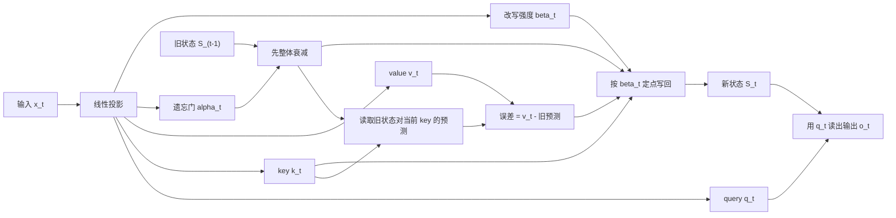
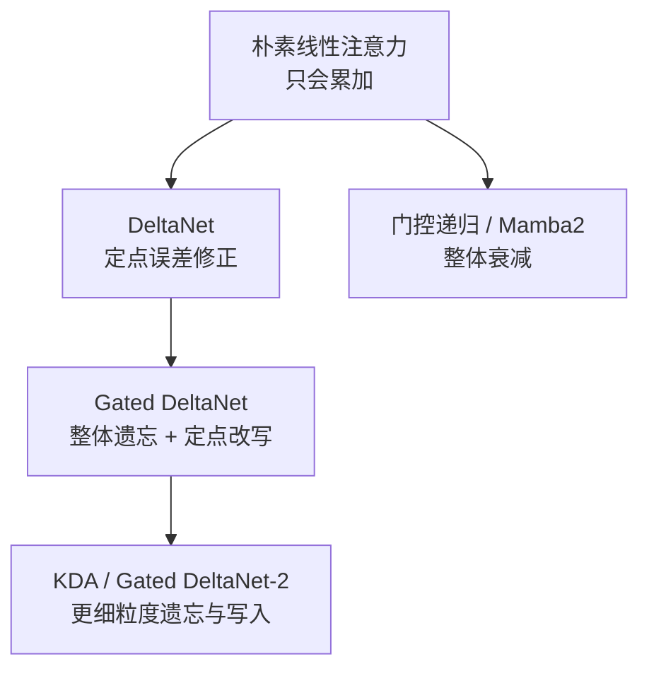
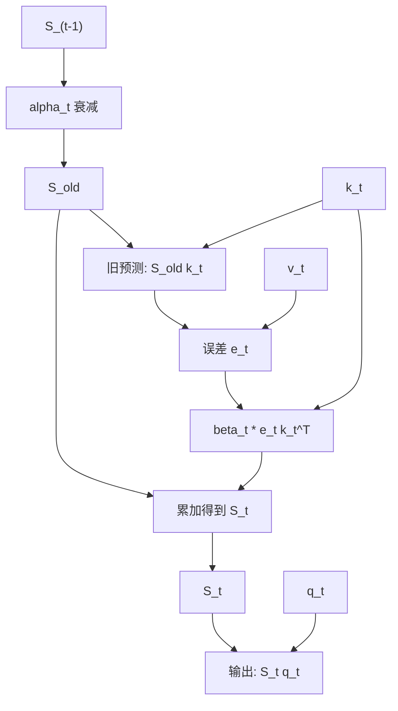
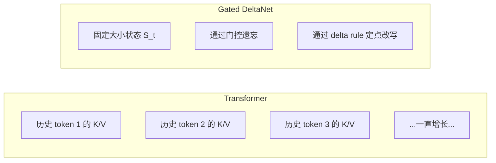
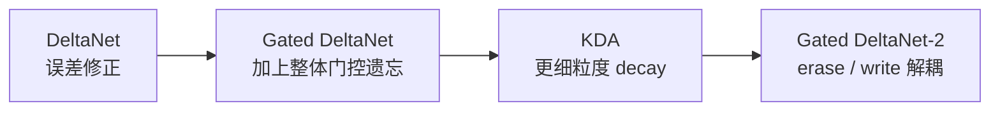

# Gated DeltaNet 详解


## 1. 什么是 Gated DeltaNet

Gated DeltaNet 是一种 **线性注意力（Linear Attention）/ 线性循环混合器**。

它最核心的思想可以压成一句话：

> **把 Mamba2 式的“快速遗忘”能力，和 DeltaNet 式的“定点改写记忆”能力合在一起。**

它来自 2024 年底提出、并在 2025 年 ICLR 公开的工作：

> **Gated Delta Networks: Improving Mamba2 with Delta Rule**

这篇工作的出发点很明确：

- 标准 Transformer 很强，但长上下文代价高
- 线性注意力推理内存更省，但检索和长程记忆常常不够稳
- 仅靠“整体衰减”不够精细
- 仅靠“局部修正”又不够擅长快速清空旧记忆

所以作者提出：

> **遗忘和改写不是一回事，最好同时拥有。**

---

## 2. 它到底要解决什么问题

Gated DeltaNet 要解决的，不只是“把复杂度从平方降到线性”这么简单。

更准确地说，它在解决两个更尖锐的问题：

### 2.1 固定大小状态怎么记住长历史

线性注意力通常不会像 Transformer 那样保存整条历史的 KV Cache，而是把过去压进一个固定大小的状态里。

这当然有好处：

- 推理时常数内存
- 序列越长越划算
- 很适合超长上下文

但副作用也很明显：

> **固定大小的状态，迟早会发生记忆冲突。**

也就是：

- 新信息写进来时，旧信息可能被挤坏
- 两个相似 key 可能在状态里互相干扰
- 序列一长，检索质量就容易下滑

### 2.2 忘得快和改得准往往很难兼得

如果一个模型只能做“整体衰减”，那它擅长的是：

- 遇到上下文切换时快速清空旧状态

但它不擅长：

- 精准修改某个特定 key 对应的 value

反过来，如果一个模型只能做“误差修正式写入”，那它擅长的是：

- 在已有记忆上定点纠正

但它又不擅长：

- 在场景突然切换时快速忘掉大段旧信息

Gated DeltaNet 的核心判断就是：

> **这两种能力是互补的，不该二选一。**

---

## 3. 为什么线性注意力经常“省了计算，伤了记忆”

先从最朴素的线性注意力说起。

### 3.1 标准 softmax 注意力

普通自注意力是：

```text
Attention(Q, K, V) = softmax(QK^T / sqrt(d)) V
```

它的优点是：

- 每个 token 都能看全部历史
- 检索能力强
- 信息读写很细粒度

缺点也熟悉：

- 训练和 prefill 常常接近二次复杂度
- decode 需要维护不断增长的 KV Cache
- 长上下文成本高

### 3.2 线性注意力的基本重排

很多线性注意力方法会把注意力写成某种可结合的形式，然后改写成递推：

```text
S_t = S_(t-1) + v_t k_t^T
o_t = S_t q_t
```

这里：

- `S_t` 是一个矩阵状态
- 它用固定大小的状态压缩整个历史
- 每次读出时，用 query 去读这个状态

这让模型具备：

- 线性时间的序列混合
- 常数大小的递归状态

但问题在于：

> **它只是不断把新信息往状态里加。**

久而久之会发生：

- 旧信息无法有针对性地删除
- 相似 key 的信息相互叠加
- 记忆越来越“糊”

这就是很多早期线性注意力在检索任务上不够强的根本原因。

---

## 4. DeltaNet 先补上了什么

Gated DeltaNet 并不是从零开始，它是在 DeltaNet 基础上继续往前走。

### 4.1 Delta rule 的直觉

DeltaNet 的关键想法是：

> **不要无脑把新 value 直接加进状态，而是先看当前状态对这个 key 已经记住了什么，再只写入“误差”。**

如果当前 key 是 `k_t`，当前真值是 `v_t`，那么状态对这个 key 的已有预测是：

```text
S_(t-1) k_t
```

于是误差就是：

```text
v_t - S_(t-1) k_t
```

然后只把这部分误差写回去。

### 4.2 DeltaNet 的更新式

可以写成简化形式：

```text
S_t = S_(t-1) + β_t (v_t - S_(t-1) k_t) k_t^T
```

其中：

- `β_t` 是写入强度
- 如果 `β_t` 大，纠正更激进
- 如果 `β_t` 小，写入更保守

把它展开后可以得到等价形式：

```text
S_t = S_(t-1) (I - β_t k_t k_t^T) + β_t v_t k_t^T
```

这式子非常关键，因为它暴露了两个动作：

- 一边“擦掉”当前 key 方向上已经存着的旧内容
- 一边把新的目标 value 写进去

### 4.3 DeltaNet 为什么比纯加法更聪明

因为它不是：

- 往一个越来越满的桶里继续倒水

而更像是：

- 先把与当前 key 冲突的那一格擦掉一部分
- 再把新值写进去

这让它在：

- 检索
- 键值关联
- 重复更新同一事实

这些场景里比朴素线性注意力强很多。

---

## 5. Mamba2 又补上了什么

DeltaNet 擅长“改得准”，但还不够擅长“忘得快”。

Mamba2 一类门控递归模型强调的是另一种能力：

> **遇到上下文切换时，可以用数据依赖的门控快速衰减整个状态。**

可以把它粗略理解为：

```text
S_t = α_t S_(t-1) + new_write_t
```

其中：

- `α_t` 是门控衰减系数
- `α_t` 小时，旧记忆迅速衰减
- `α_t` 大时，旧记忆被保留得更多

这种机制的优点是：

- 对场景切换非常敏感
- 可以快速“清场”
- 避免状态被陈旧内容长期占住

但它的问题也很明显：

> **它擅长整体忘，却不擅长对某个具体 key 精准改写。**

所以：

- Mamba2 风格门控 = 快速忘
- DeltaNet 风格更新 = 精准改

这就是 Gated DeltaNet 要合并的两种能力。

---

## 6. 一张图先看懂 Gated DeltaNet



这张图最重要的信息有三点：

- `alpha_t` 负责整体遗忘
- `beta_t` 负责当前 key 的定点改写强度
- 旧状态不是直接被覆盖，而是先读出旧预测，再按误差修正

所以它不是“门控版普通 RNN”，也不是“带衰减的纯 DeltaNet”，而是两者的组合。

---

## 7. Gated DeltaNet 的核心递推式

用简化符号表示，Gated DeltaNet 的核心更新可以写成：

```text
S_t = α_t S_(t-1) (I - β_t k_t k_t^T) + β_t v_t k_t^T
```

也可以写成更容易读懂的误差修正版：

```text
S_t = α_t S_(t-1) + β_t (v_t - α_t S_(t-1) k_t) k_t^T
```

这里的直觉是：

### 7.1 `alpha_t`

它控制：

- 旧状态整体保留多少

所以它像一个：

- **全局遗忘旋钮**

### 7.2 `beta_t`

它控制：

- 当前 key 对应的误差修正写回得有多强

所以它像一个：

- **局部改写旋钮**

### 7.3 `k_t k_t^T`

它决定：

- 这次“擦除/改写”主要发生在哪个 key 方向上

所以它体现的是：

- **内容寻址**

这也是 Gated DeltaNet 最有意思的地方：

> **先决定旧记忆整体保留多少，再决定当前 key 要对哪一块记忆做多强的定点修改。**

---

## 8. 把它想成“会删改的压缩记事本”

如果把 Transformer 的 KV Cache 想成：

- 每个 token 都有自己的一张小纸条
- 历史越长，纸条越多

那么 Gated DeltaNet 更像是：

- 只有一本固定大小的记事本

这本记事本每来一个新 token，要做三件事：

1. 判断旧内容要不要整体淡化一点
2. 根据当前 key 找到相关槽位
3. 把旧内容和新 value 的差值写回去

也就是说，它处理的是：

- **怎么在有限记忆里做可控编辑**

而不是：

- 把所有历史原样存起来

这正是它能常数内存推理的原因，也是它比很多普通线性注意力更擅长检索的原因。

---

## 9. 为什么“门控 + delta rule”是互补的

这是整篇工作的核心洞见。

### 9.1 只有门控，不够精细

如果只有门控衰减，你能做的是：

- 快速把整个状态压小

但你做不到：

- 精准地只修改某个 key 对应的旧 value

所以它更像：

- 一键清空一部分白板

### 9.2 只有 delta rule，不够果断

如果只有 delta rule，你能做的是：

- 很精细地纠正当前 key 的记忆

但当上下文突然换主题时：

- 它不擅长一下子甩掉大量旧背景

所以它更像：

- 精修某一段文字

### 9.3 两者合起来才像“真记忆管理”

现实中的长期记忆管理往往需要两件事：

- 能整体淡忘不重要的旧背景
- 能定点修改仍然重要但需要更新的事实

Gated DeltaNet 做的正是这件事。

---

## 10. 一张图看它和前代模型的关系



你可以把这条线简单记成：

- 第一代：会记，但不太会删
- 第二代：会定点改，但整体遗忘弱
- 第三代：会删，也会改
- 后续代：把删和改做得更细粒度

---

## 11. 它为什么对检索任务更友好

Gated DeltaNet 在论文里特别强调：

- in-context retrieval
- length extrapolation
- long-context understanding

这些能力之所以更强，和它的记忆机制直接相关。

### 11.1 朴素累加很容易“糊”

如果状态只是一味叠加：

- 很多相似 key 会互相污染
- 相同位置附近的不同 value 会相互干扰

检索时就容易出现：

- 知道大概有这条信息
- 但取不准是哪一条

### 11.2 Delta rule 让写入更像“纠错”

delta rule 会先问：

> 当前状态对这个 key 已经记住了什么？

如果已经差不多正确，就不用大改。

如果错得多，就重点修正。

这使得它更像一种：

- 在线回归
- 误差驱动记忆修复

### 11.3 门控减少“状态拥塞”

即使定点修正很聪明，历史太长后状态仍可能逐渐拥挤。

门控能做的是：

- 让不再重要的旧背景整体衰减
- 给新上下文腾出空间

于是组合起来效果就是：

- 不重要的旧内容会淡出
- 重要 key 的已有绑定会被精修

这对多跳检索、长文找事实、needle-in-a-haystack 一类任务很有帮助。

---

## 12. 从在线学习角度怎么理解它

Gated DeltaNet 不只是一个“工程技巧”，它也可以从在线优化角度来理解。

### 12.1 Delta rule 像一次局部梯度更新

把状态 `S` 看成一个随时间在线更新的记忆参数。

当新样本 `(k_t, v_t)` 到来时，希望：

```text
S k_t ≈ v_t
```

如果当前预测不准，就按误差做一次更新：

```text
v_t - S k_t
```

这和在线最小二乘、联想记忆、fast weight 更新有很强亲缘关系。

### 12.2 门控像“权重衰减到旧状态”

`alpha_t` 则像在说：

- 旧参数别百分之百照搬到下一步
- 当前上下文可能已经换了

所以它相当于对旧状态做：

- 数据依赖的保留
- 数据依赖的遗忘

换句话说：

> Delta rule 决定怎么学当前样本，gating 决定旧知识保留多少。

---

## 13. 一步一步看单个 token 到底发生了什么

为了更直观，我们把单步过程拆开。

设上一时刻状态是：

```text
S_(t-1)
```

当前 token 经过投影得到：

```text
q_t, k_t, v_t, alpha_t, beta_t
```

那么流程是：

### 13.1 先衰减旧状态

```text
S_old = alpha_t S_(t-1)
```

这一步代表：

- 如果当前 token 暗示上下文切换，就把旧内容整体压低

### 13.2 用当前 key 读取旧预测

```text
v_hat_t = S_old k_t
```

这表示：

- 旧状态认为这个 key 应该对应什么 value

### 13.3 计算误差

```text
e_t = v_t - v_hat_t
```

### 13.4 把误差沿 key 方向写回

```text
S_t = S_old + beta_t e_t k_t^T
```

这一步不是把 `v_t` 整块塞进去，而是：

- 只把“差了多少”那部分补进去

### 13.5 用 query 读出输出

```text
o_t = S_t q_t
```

于是它像一个非常紧凑的读写存储器：

- `k_t` 决定写到哪里
- `v_t` 决定写什么
- `q_t` 决定读什么
- `alpha_t` 决定旧记忆保留多少
- `beta_t` 决定写入多猛

---

## 14. 一张图看读写路径



这条路径说明：

- 同一个 `k_t` 既参与“查旧记忆”，也参与“写新误差”
- 所以更新是内容寻址的
- 这和普通门控 RNN 的“统一状态推进”很不一样

---

## 15. 复杂度为什么能做到线性

Gated DeltaNet 属于线性注意力家族，所以它天然继承了两个重要性质。

### 15.1 推理时不需要随序列增长的 KV Cache

Transformer 自回归生成时要保存所有历史 `K/V`。

而 Gated DeltaNet 在递归模式下只需要维护：

```text
S_t
```

也就是固定大小的状态。

因此：

- 推理内存与序列长度基本无关
- decode 很适合超长上下文

### 15.2 序列混合代价随长度线性增长

每来一个 token，主要做的是：

- 若干投影
- 一次状态读
- 一次状态更新

而不是对全部历史重新算 `QK^T`。

所以相较于标准注意力：

- 长序列下更有优势
- 上下文越长，优势越明显

当然，要真正把训练也做快，还需要解决：

> **递推更新本身是顺序的，怎么并行化？**

这也是论文另一个关键点。

---

## 16. 为什么训练不会退化成“纯串行 RNN”

很多人一看到递推式就会问：

> 这不就是 RNN 吗？那训练岂不是很难并行？

这是个很好的问题。

### 16.1 推理时它确实可以按 RNN 方式跑

在生成阶段，它可以一 token 一 token 地更新状态。

这正是它：

- 常数内存
- 长上下文友好

的来源。

### 16.2 训练时作者做了 chunkwise 并行

论文的关键工程贡献之一是：

- 把序列分成 chunks
- 在 chunk 内尽量转成矩阵运算
- 通过 WY representation 来处理一串 rank-1 更新的乘积

你不用死记推导，只要抓住直觉：

> **它把“很多连续的小递推”重写成 GPU 更喜欢的大矩阵块计算。**

### 16.3 这很重要

如果没有这一步，Gated DeltaNet 纸面上很优雅，但训练吞吐会非常难看。

作者做的事，本质上是：

- 保住递归模型的长上下文效率
- 同时尽量逼近 Transformer 式并行训练效率

这也是它比“只在理论上递推很美”的很多模型更实用的原因。

---

## 17. WY representation 到底在解决什么

这部分经常被忽略，但其实很关键。

在 DeltaNet / Gated DeltaNet 里，状态转移里反复出现这样的矩阵：

```text
I - β_t k_t k_t^T
```

它是：

- 单位阵减去一个 rank-1 修正

如果连续很多步都这样更新，那么一个 chunk 内的整体转移就是一串这类矩阵的乘积。

直接算这些乘积会很慢，也不利于并行。

WY representation 的作用可以粗略理解成：

> **把一串 rank-1 更新，重新组织成更适合块并行和 GPU kernel 的形式。**

因此它解决的不是理论表达问题，而是：

- 训练时怎么把递推改写成高速实现

---

## 18. 为什么它对长上下文特别有吸引力

长上下文系统的两个主要痛点通常是：

- 历史越长，KV Cache 越大
- 历史越长，注意力计算越贵

Gated DeltaNet 的吸引力在于：

### 18.1 它不需要把所有历史显式留着

历史被压进：

- 固定大小的矩阵状态

所以不会像 Transformer 那样：

- 上下文越长，缓存线性膨胀

### 18.2 它不是“瞎压缩”，而是带控制地写状态

这很关键。

很多线性递归模型的问题不在于“压缩”本身，而在于：

- 压缩后不会精细管理记忆

Gated DeltaNet 则通过：

- `alpha_t` 的整体遗忘
- `beta_t` 的误差修正

把压缩状态变成一个更可编辑的记忆体。

### 18.3 它天然适合检索类长任务

比如：

- 长文档问答
- 长对话跨段记忆
- 代码仓库长链条定位
- needle-in-a-haystack

因为这些任务最怕的不是“短程局部建模差”，而是：

- 长历史中目标信息被淹没

---

## 19. 一张图看它和 Transformer 的差别



最本质的区别是：

- Transformer 保存所有细节，代价越来越大
- Gated DeltaNet 只保留压缩记忆，代价基本稳定

所以你可以把两者理解成：

- Transformer：外部显式记忆库
- Gated DeltaNet：内部可编辑压缩记忆

---

## 20. 它和普通 RNN、Mamba2、DeltaNet 到底有什么不同

把几种常见结构放一起最容易看明白。

| 方案 | 记忆形式 | 遗忘机制 | 写入机制 | 长上下文成本 | 典型特点 |
| --- | --- | --- | --- | --- | --- |
| 普通 RNN | 向量状态 | 隐式 | 隐式 | 低 | 简单但检索弱 |
| 朴素线性注意力 | 矩阵状态 | 很弱或没有 | 直接累加 | 低 | 省但容易记忆冲突 |
| DeltaNet | 矩阵状态 | 主要靠 delta 修正 | 误差修正写入 | 低 | 检索更强 |
| Mamba2 风格门控模型 | 向量/结构化状态 | 强门控遗忘 | 非 delta 式 | 低 | 场景切换友好 |
| Gated DeltaNet | 矩阵状态 | 强门控遗忘 | delta 误差修正 | 低 | 兼顾快速遗忘与定点改写 |

如果只记一句话：

- **DeltaNet = 会精准修改**
- **Mamba2 = 会快速遗忘**
- **Gated DeltaNet = 两者结合**

---

## 21. 它和 MLA、稀疏注意力不是一回事

这一点很容易混。

### 21.1 它不是 MLA

见：[Multi-head-Latent-Attention.md](./Multi-head-Latent-Attention.md)

MLA 主要解决的是：

- KV Cache 太大
- decode 带宽太重

它更像：

- 压缩每个 token 的缓存表示

而 Gated DeltaNet 不是压缩 KV 后再恢复，而是：

- 直接用固定状态递归总结全部历史

### 21.2 它不是稀疏注意力

见：[Sliding-Window-Attention.md](./Sliding-Window-Attention.md)

稀疏注意力做的是：

- 改变 token 与 token 的可见连接图

Gated DeltaNet 做的是：

- 不再显式保留所有 token
- 而是维护一个递归状态

所以两者的区别是：

- 稀疏注意力：减少“看多少位置”
- Gated DeltaNet：改成“把历史压成一个可编辑状态”

### 21.3 它也不是 CCA

见：[Compressed-Convolutional-Attention.md](./Compressed-Convolutional-Attention.md)

CCA 更像：

- 把完整注意力搬进压缩潜空间

Gated DeltaNet 更像：

- 放弃显式全注意力，改用递归矩阵记忆

---

## 22. 它和 KDA、Gated DeltaNet-2 的关系

如果你最近在看长上下文架构，很容易看到这几个名字一起出现。

### 22.1 KDA 往前走了一步

Kimi Delta Attention（KDA）可以看成是在 Gated DeltaNet 之后，继续把遗忘机制做得更细粒度。

一个常见理解方式是：

- Gated DeltaNet 里门控更偏标量式/较粗粒度
- KDA 往通道级衰减继续推进

于是它能更细地控制：

- 哪些通道更该忘
- 哪些通道更该留

### 22.2 Gated DeltaNet-2 继续拆开“擦除”和“写入”

2026 年的 Gated DeltaNet-2 又进一步指出：

> 在一代 Gated DeltaNet 里，主动编辑记忆时，“擦掉多少旧内容”和“写入多少新内容”仍然绑得太紧。

于是 Gated DeltaNet-2 引入：

- 单独的 erase gate
- 单独的 write gate
- 以及更细粒度的 decay

如果只做一个直觉上的代际划分：

- Gated DeltaNet：先把“遗忘 + delta 改写”合起来
- KDA：把遗忘做成更细粒度
- Gated DeltaNet-2：把“擦除”和“写入”进一步解耦

### 22.3 为什么这条演化线很自然

因为这类模型的核心矛盾始终是：

- 固定状态容量有限
- 但又希望长历史检索更准

所以改进方向基本都会围绕：

- 更精细的遗忘
- 更精细的写入
- 更好的并行训练

---

## 23. 一张图看 Gated DeltaNet 到 GDN-2 的演化



所以如果你在看 2025 到 2026 这条技术线，可以把它看成：

> **如何在固定大小递归记忆里，把“忘”和“写”做得越来越细。**

---

## 24. Gated DeltaNet 的 block 大概长什么样

从工程实现看，它通常不是只有一个裸递推公式。

一个典型 block 往往还会包含：

- 输入投影，生成 `q/k/v`
- 生成 `alpha_t` 与 `beta_t` 的门控分支
- 短卷积或局部混合，用来补充局部归纳偏置
- 归一化与输出投影
- 有时还会有 output gate

你可以把它理解成：

```text
输入
-> 投影 / 局部混合
-> Gated Delta Rule 递归状态更新
-> 归一化 / 输出门控
-> 输出
```

不过要注意：

> **论文真正的核心贡献不是这些外围组件，而是 gated delta rule 本身，以及它的并行训练算法。**

---

## 25. 一个极简伪代码

下面用概念级伪代码描述单步推理：

```python
def gated_deltanet_step(x_t, S_prev):
    q_t = proj_q(x_t)
    k_t = proj_k(x_t)
    v_t = proj_v(x_t)

    alpha_t = sigmoid(proj_alpha(x_t))   # 全局遗忘
    beta_t = sigmoid(proj_beta(x_t))     # 局部改写强度

    S_old = alpha_t * S_prev
    v_hat = S_old @ k_t
    err = v_t - v_hat

    S_t = S_old + beta_t * outer(err, k_t)
    o_t = S_t @ q_t
    return o_t, S_t
```

如果写成更贴近论文直觉的形式，它也可以是：

```python
S_t = alpha_t * S_prev @ (I - beta_t * outer(k_t, k_t))
S_t += beta_t * outer(v_t, k_t)
o_t = S_t @ q_t
```

这两种写法表达的是同一个核心思想：

- 先衰减旧记忆
- 再做 key 定位的误差修正写入

---

## 26. 一个小例子帮助理解

假设状态里已经记住：

```text
“法国首都是巴黎”
```

某个 key 大致对应：

```text
“法国首都”
```

此时模型又读到一个新上下文：

```text
“德国首都是柏林”
```

如果 key 指向的是：

```text
“德国首都”
```

那么模型希望：

- 不要把“法国首都 -> 巴黎”整个冲掉
- 但也要在相邻概念区域里正确写入“德国首都 -> 柏林”

delta rule 的作用是：

- 看旧状态对“德国首都”预测成什么
- 然后只改动偏差那部分

而如果当前段落突然切到了完全不同的主题，比如：

```text
从地理问答切到代码调试
```

门控 `alpha_t` 就可以把与旧主题相关的背景整体淡化。

所以：

- `beta_t` 让它像在改词条
- `alpha_t` 让它像在翻页

---

## 27. 为什么它常被用于混合架构

纯线性递归模型虽然省，但并不总能完全替代 full attention。

因此很自然的工程路线是：

> **让一部分层负责高效长程压缩记忆，另一部分层继续保留显式注意力。**

Gated DeltaNet 论文里也强调了 hybrid architecture。

常见混搭方式包括：

- Gated DeltaNet + Sliding Window Attention
- Gated DeltaNet + Mamba2
- 线性层和全注意力层交替堆叠

### 27.1 为什么混合有效

因为两类层的长处不同：

- 显式注意力层擅长精确局部/中程路由
- Gated DeltaNet 层擅长低成本维持长历史摘要

### 27.2 可以把它理解成

- 一部分层像“压缩长期记忆”
- 一部分层像“高分辨率局部处理”

这在实践里往往比纯单一路线更稳。

---

## 28. 它的优点

### 28.1 推理内存稳定

最直接的优点是：

- 不需要长度不断增长的 KV Cache

### 28.2 长上下文更友好

因为成本不会随着上下文长度像标准注意力那样迅速膨胀。

### 28.3 比很多线性注意力更擅长检索

因为它不是只累加，而是：

- 会按 key 做误差修正
- 会按 token 做数据依赖遗忘

### 28.4 更适合上下文切换频繁的任务

例如：

- 长对话
- 多主题文档
- 多阶段推理

因为门控可以帮助状态及时“换挡”。

### 28.5 容易和其他 token mixer 组合

它很适合作为：

- hybrid 模型中的长程记忆层

---

## 29. 它的代价和局限

### 29.1 固定大小状态终究不是无限记忆

再聪明的写法，也不能把固定大小状态变成无限精度数据库。

所以在极长、极细节的任务上，它仍可能：

- 丢失部分细节
- 发生状态冲突

### 29.2 训练实现比普通 attention 更复杂

真正高效落地需要：

- chunkwise 算法
- 专门 kernel
- 对 WY 形式的工程实现

### 29.3 纸面线性不等于一定更快

如果实现不够好，可能会出现：

- 理论复杂度很好
- 实际吞吐却不理想

### 29.4 某些任务仍然更偏爱显式 KV

比如特别依赖：

- 逐 token 精准回看
- 高分辨率位置级检索

这时纯 Transformer 或混合架构仍可能更稳。

---

## 30. 它更适合哪些场景

Gated DeltaNet 更适合下面这些场景：

- 长上下文建模
- 对 decode 内存敏感的系统
- 需要较强检索但又不想维护巨大 KV Cache 的系统
- 希望把线性层和注意力层混合的架构
- 长文档、长代码、多轮对话等主题切换明显的任务

如果你的主要瓶颈是：

- **KV Cache 爆炸**：它很值得看
- **长上下文检索差**：它比普通线性注意力更有针对性
- **需要完全保留逐 token 细节**：可能还是要混合 full attention

---

## 31. 常见误区

### 31.1 “Gated DeltaNet 就是带门控的 RNN”

不准确。

它虽然是递归状态模型，但它的状态更新是：

- 基于 key/value 的矩阵记忆
- 带内容寻址
- 带 delta 式误差修正

这和普通向量 RNN 很不一样。

### 31.2 “它只是给 DeltaNet 多加一个门”

也不够准确。

关键不只是多一个 `alpha_t`，而是：

- 全局遗忘与局部改写被统一进一个可训练记忆规则里

### 31.3 “它能完全替代 Transformer”

未必。

它更像：

- 一种在长上下文与成本之间很有竞争力的替代路线
- 或 hybrid 架构中的强力组件

### 31.4 “线性复杂度就一定比注意力快”

不一定。

实际速度还受：

- kernel 质量
- 序列长度
- batch 规模
- 硬件特点

影响。

### 31.5 “它和 KDA、Gated DeltaNet-2 是同一个东西”

不是。

它们是一条连续演化线上的不同代际：

- Gated DeltaNet 是关键一代
- 后续版本把遗忘和写入继续做细

---

## 32. 一个特别重要的理解角度

Gated DeltaNet 真正有意思的地方，不只是“又一种线性注意力”。

它体现的是一种更深的设计判断：

> **长上下文建模的难点，不只是把历史压缩进固定状态，而是如何让这份压缩记忆可以被有控制地编辑。**

这句话很重要，因为很多模型只做到了：

- 有状态

但没做到：

- 会管理状态

而 Gated DeltaNet 的价值就在于，它把记忆管理拆成了两个动作：

- 忘掉多少
- 改写多少

于是固定状态不再只是一个被动容器，而更像一个：

- 可写
- 可擦
- 可校正

的动态联想记忆。

---

## 33. 一句话总结

Gated DeltaNet 的本质是：

> **在线性递归注意力的固定大小矩阵状态中，同时引入 Mamba2 式的数据依赖遗忘和 DeltaNet 式的 key-value 误差修正写入，让模型既能快速淡化无关旧记忆，又能对当前 key 对应的内容做精确改写，从而提升长上下文检索、长度外推和整体记忆管理能力。**

如果再压成更短的一句：

> **它不是只会“记”，而是更会“忘”和“改”。**

---

## 34. 速记版

- Gated DeltaNet 属于线性注意力 / 递归矩阵记忆模型
- 它把 `Mamba2` 式门控遗忘和 `DeltaNet` 式误差修正写入结合起来
- `alpha_t` 控制整体遗忘，`beta_t` 控制定点改写强度
- 核心状态是固定大小矩阵，因此推理内存不随上下文长度线性膨胀
- 它比朴素线性注意力更擅长检索与长程记忆
- 训练上依赖 chunkwise 并行和 WY representation 来提升 GPU 友好性
- 常被放进 hybrid 架构里，与滑窗注意力或其他层组合
- 后续演化方向包括 `KDA` 和 `Gated DeltaNet-2`

---

## 35. 参考

1. Gated Delta Networks: Improving Mamba2 with Delta Rule  
   https://arxiv.org/abs/2412.06464

2. NVIDIA Research 页面  
   https://research.nvidia.com/publication/2025-04_gated-delta-networks-improving-mamba2-delta-rule

3. 后续工作：Gated DeltaNet-2: Decoupling Erase and Write in Linear Attention  
   https://arxiv.org/abs/2605.22791
