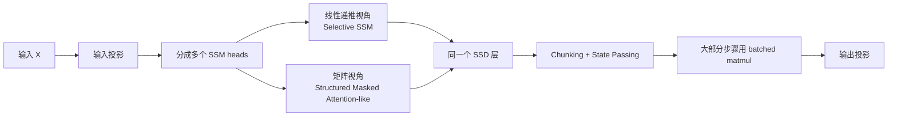
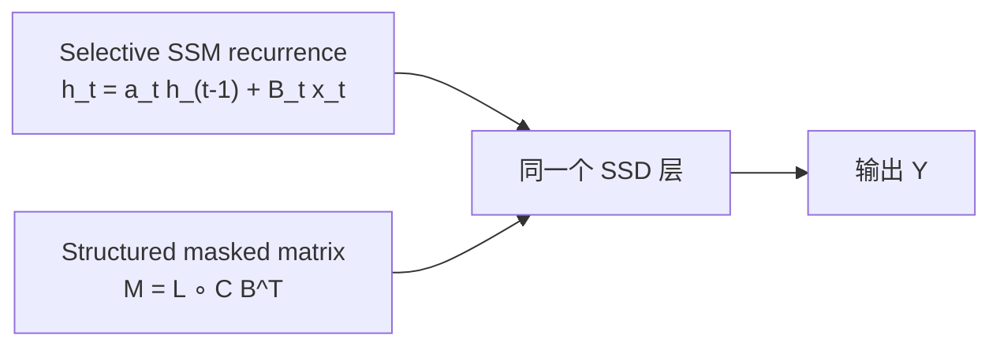
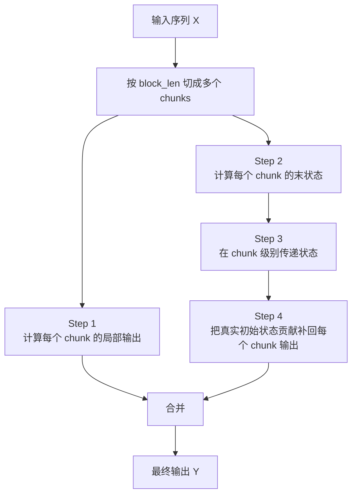
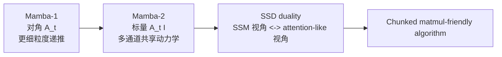
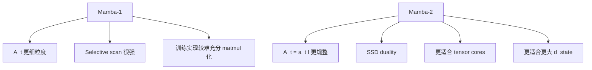

# Mamba-2 详解


## 1. 什么是 Mamba-2

Mamba-2 是 2024 年提出的第二代 Mamba 架构，来自论文：

> **Transformers are SSMs: Generalized Models and Efficient Algorithms Through Structured State Space Duality**

如果只用一句话概括它：

> **Mamba-2 把 Mamba 的选择性状态空间模型重新整理成一种既能按 SSM 递推、又能按 attention-like 矩阵方式理解和计算的模型，从而让训练更快、更适合现代 GPU，同时继续保留长序列递推模型的优势。**

它的关键词有三个：

- `SSD`，即 `Structured State Space Duality`
- `semiseparable matrix`，即半可分结构矩阵
- `matmul-friendly`，即更适合张量核心与矩阵乘的实现

如果说 Mamba-1 的核心突破是：

- **让 SSM 变得内容相关**

那么 Mamba-2 的核心突破就是：

- **让这条 SSM 路线在理论上和 attention 更接近，在工程上和 matmul 更接近。**

---

## 2. 它到底想解决什么问题

Mamba-2 不是重新发明 Mamba，而是在回答 Mamba-1 留下的两个问题。

### 2.1 理论上：SSM 和 Attention 到底是什么关系

Mamba-1 很强，但它看起来仍像一条和 Transformer 平行的路线：

- 一边是 attention
- 一边是 SSM

作者想进一步追问：

> **这两类模型真的毫无关系吗？**

Mamba-2 给出的答案是：

> **不是。至少在一大类结构化模型里，SSM 和 attention 可以被看作同一个序列变换的两种计算视角。**

### 2.2 工程上：Mamba-1 够快，但还不够“GPU 友好”

Mamba-1 已经通过 `selective scan` 把递推模型做快了，但训练时仍有一个问题：

- GPU 和 TPU 最擅长的是大矩阵乘
- Mamba-1 的核心并不天然是 matmul-heavy

这意味着：

- 它纸面上线性
- 但训练吞吐不一定能像 attention / matmul 那样充分吃满硬件

Mamba-2 的直接目标就是：

> **把更多计算改写成矩阵乘，让张量核心真正发挥作用。**

### 2.3 规模上：Mamba-1 的状态维度常常不敢开太大

Mamba-1 的 `d_state` 常见较小，例如论文和实现中常常围绕较小状态展开。

Mamba-2 的目标之一则是：

- 允许状态维度做得更大
- 同时训练速度不至于明显恶化

所以 Mamba-2 不只是“更快一点”，而是在试图解决：

- 理论统一性
- 训练吞吐
- 可扩展状态维度

这三个核心问题。

---

## 3. 一句话先建立直觉

如果把 Mamba-1 理解成：

- 一个会根据输入动态更新状态的高性能 SSM

那么 Mamba-2 更像：

- 把这套动态状态更新，改写成一种既像递推系统、又像结构化注意力矩阵的统一对象

所以它最关键的不是“又多了个门”或者“又换了个 kernel”，而是：

> **同一个模型，有两种等价视角。**

这两种视角分别是：

- `线性递推视角`
- `二次矩阵视角`

训练时，可以更多利用矩阵乘；
推理时，仍然可以用递推状态高效运行。

这就是 Mamba-2 最迷人的地方。

---

## 4. 先回顾：Mamba-1 的核心是什么

见：[Mamba.md](./Mamba.md)

Mamba-1 的核心可以写成一个选择性 SSM：

```text
h_t = A_t h_(t-1) + B_t x_t
y_t = C_t h_t
```

其中：

- `A_t`
- `B_t`
- `C_t`

都可以依赖当前输入。

这让 Mamba-1 获得了：

- 内容相关的状态更新
- 线性时间序列建模
- 固定状态推理内存

但它的核心仍然更像：

- 一套高性能递推扫描算法

而不是：

- 一个天然和矩阵乘友好的结构

Mamba-2 的出发点，就是在不丢掉这些优点的前提下，再往前走一步。

---

## 5. Mamba-2 的核心关键词：SSD

Mamba-2 的中心概念是：

> **Structured State Space Duality, SSD**

这个词很大，但可以拆成三层意思。

### 5.1 SSD model

指的是：

- 一个具体可用的 layer
- 可以像 attention layer 一样直接塞进神经网络

### 5.2 SSD framework

指的是：

- 一整套理论视角
- 用来说明 SSM、attention、结构化矩阵之间的关系

### 5.3 SSD algorithm

指的是：

- 如何高效计算这个 layer
- 特别是如何把大量工作改成 batched matmul

所以当大家说 Mamba-2 的时候，很多时候其实混在说三件事：

- 一个新层
- 一套理论
- 一种高效算法

---

## 6. 一张图先看懂 Mamba-2



这张图里最关键的信息有四点：

- Mamba-2 仍然是 SSM 路线
- 但同一个层可以从 attention-like 角度理解
- 训练算法大量利用 chunked matmul
- 推理时仍保留递推状态优势

---

## 7. SSD 层本身长什么样

Mamba-2 仍从选择性 SSM 出发：

```text
h_t = A_t h_(t-1) + B_t x_t
y_t = C_t^T h_t
```

看起来和 Mamba-1 很像。

但关键改动在于：

### 7.1 `A_t` 结构被进一步约束

Mamba-1 的核心 S6 层里，`A_t` 通常可以看成：

- 对角结构

也就是：

- 每个状态维度都有自己的递推衰减

Mamba-2 则更进一步，把它限制为：

> **scalar times identity**

也就是：

- 每个时刻只有一个标量 `a_t`
- 它对该 head 内的所有状态维度共享

### 7.2 它从“每通道独立的小 SSM”变成“多通道共享动力学”

Mamba-1 更像：

- 每个通道单独控制

Mamba-2 更像：

- 一个 head 内多个通道共享同一套递推动态

### 7.3 这不是退步，而是为了换取 duality 和效率

这个约束表面上看像减少了表达力。

但换来的好处是：

- 可以写成更漂亮的结构化矩阵
- 可以触发 SSD duality
- 可以设计新的 matmul-heavy 算法

所以这是 Mamba-2 最重要的设计交换：

- **牺牲一部分自由度，换来理论统一和工程效率。**

---

## 8. 从公式看：Mamba-1 和 Mamba-2 的差别

### 8.1 Mamba-1

概念上更接近：

```text
h_t = A_t h_(t-1) + B_t x_t
```

其中 `A_t` 是对角结构：

```text
A_t = diag(a_t^(1), a_t^(2), ..., a_t^(N))
```

### 8.2 Mamba-2

则更接近：

```text
h_t = a_t h_(t-1) + B_t x_t
```

其中：

```text
A_t = a_t I
```

也就是：

- 同一个时刻，状态内所有分量共用同一衰减系数

### 8.3 直觉上怎么理解

Mamba-1 像：

- 每个状态通道有自己的“遗忘率”

Mamba-2 像：

- 整个 head 用一套统一的“节奏”

这让 Mamba-2：

- 更规整
- 更容易被重写成结构化矩阵运算

---

## 9. Multi-head SSM 是什么意思

Mamba-2 还有一个很重要的变化是：

- 它把 SSM 头的概念做得更接近多头注意力

### 9.1 不是每个维度各自独立跑 SSM

在 Mamba-1 里，可以粗略理解为：

- 很多通道更独立地被 SSM 控制

而在 Mamba-2 里，一个 head 往往会有：

- `d_head` 个通道
- 这些通道共享同一递推动态

### 9.2 这和多头注意力有点像

可以把 Mamba-2 的每个 SSM head 理解成：

- 一个自己的记忆通道组
- 有自己的状态参数与读写方式

只不过它不是用 attention score 路由，而是用共享递推动态来推进。

### 9.3 这也让它更容易和 Transformer 工程做对接

因为它变得更像：

- “按头组织”的序列混合器

这对：

- tensor parallelism
- sequence parallelism
- 混合 block 设计

都更友好。

---

## 10. 为什么说它有“线性模式”和“二次模式”

这是 Mamba-2 最核心也最容易误解的地方。

### 10.1 线性模式：按 SSM 递推

如果按照 SSM 视角看，Mamba-2 仍然可以逐 token 递推：

```text
h_t = a_t h_(t-1) + B_t x_t
y_t = C_t^T h_t
```

这种做法的优点是：

- 线性时间
- 固定状态
- 推理友好

### 10.2 二次模式：写成矩阵乘

但 Mamba-2 同一个变换，也可以写成：

```text
Y = M X
```

其中 `M` 是一个特殊结构的下三角矩阵。

它看起来像：

- 带因果 mask 的 attention-like mixing matrix

### 10.3 关键不是“二选一”，而是“同一个函数的两种计算方式”

这点非常重要：

- 不是 SSM 模式做一种函数，attention 模式做另一种函数
- 而是同一个 SSD 层，有两种等价计算视角

这就是 duality 的含义。

---

## 11. attention-like 视角到底长什么样

Mamba-2 可以把同一个层写成：

```text
M = L ∘ C B^T
Y = M X
```

这里：

- `∘` 是逐元素乘
- `C B^T` 看起来像 query-key 相互作用形成的相似度结构
- `L` 是一个特别的下三角 mask / discount matrix

如果你把符号替换一下，这个形式会很像：

```text
Y = (mask ∘ QK^T) V
```

也就是：

- 某种没有 softmax 的结构化注意力

### 11.1 如果 `L` 退化成普通因果 mask

那它会更像：

- 因果线性注意力

### 11.2 但 SSD 的 `L` 更一般

它不是简单的全 1 下三角，而是由一串 `a_t` 累乘构成：

```text
a_i * a_(i-1) * ... * a_(j+1)
```

所以更像：

- 一个输入相关的相对位置折扣因子

### 11.3 这就是 selectivity 在矩阵视角里的体现

Mamba-1 的 selectivity 在递推视角里体现为：

- 当前 token 如何更新状态

Mamba-2 在 attention-like 视角里则体现为：

- 历史位置之间的贡献被数据依赖的折扣矩阵重新加权

---

## 12. 一张图看 duality



这张图应该牢牢记住：

- 左边不是模型 A
- 右边也不是模型 B
- 它们是同一个层的两种数学表达

这就是 Mamba-2 和普通“再发明一个 SSM”最不一样的地方。

---

## 13. 什么是 semiseparable matrix

要理解 SSD，最终还是绕不过一个词：

> **semiseparable matrix，半可分矩阵**

不过博客阅读并不需要你吃透全部数学推导，只要抓住直觉。

### 13.1 它是一种“离对角远处结构很低秩”的矩阵

对于这类矩阵：

- 对角附近可以很复杂
- 但远离对角的很多 block 其实可以低秩分解

这意味着：

- 表面上是一个大 `T x T` 矩阵
- 实际上内部有很强的可压缩结构

### 13.2 为什么这很关键

因为如果一个序列混合矩阵有这种结构，就说明：

- 它不需要像普通 attention 矩阵那样完整无结构地处理
- 可以被分块、分解、重写成更高效的算法

### 13.3 对 Mamba-2 来说意味着什么

Mamba-2 的 SSD 层对应的 token-mixing matrix 恰好属于这类结构。

于是作者就可以：

- 从递推角度理解它
- 从结构矩阵角度理解它
- 再从块矩阵角度设计高效算法

这就是 SSD 理论真正值钱的地方。

---

## 14. 一个更直观的比喻

你可以把普通 attention 矩阵想成：

- 一张很大的“所有位置两两关系表”

而 semiseparable 矩阵更像：

- 这张表并不是完全任意填写的
- 很多远距离区域其实遵循某种可压缩规律

所以你不必真的把整张表原样存下来、原样算一遍；
你可以：

- 按块拆开
- 对某些块低秩分解
- 只保留真正重要的结构部分

Mamba-2 的训练加速，本质上就是在吃这部分结构红利。

---

## 15. 为什么 Mamba-2 更适合矩阵乘

这是它最重要的工程价值。

### 15.1 现代 GPU 对 matmul 极度偏爱

大多数现代加速器最擅长的并不是：

- 零散标量递推

而是：

- 大块矩阵乘
- batched matmul
- tensor core 加速

### 15.2 Mamba-1 的 selective scan 仍有不少“非 matmul 味道”

即使做了高性能实现，它的核心仍不像 attention 那样天然贴合张量核心。

### 15.3 Mamba-2 则故意把大部分工作改写成 matmul

SSD 算法的重点就是：

- 把序列分块
- 把块内与块间很多步骤重写成矩阵乘
- 把真正必须 scan 的部分缩到更短的 chunk 序列上

所以它的关键收益不是：

- 理论复杂度突然变神奇了

而是：

- **同样的序列模型，更能吃到硬件最擅长的计算模式。**

---

## 16. SSD 算法到底做了什么

SSD 算法最常见的直觉解释有两种。

### 16.1 块矩阵分解视角

先把大序列矩阵按 `Q x Q` block 切开。

然后观察到：

- 对角块仍然是小型 semiseparable 结构
- 非对角块很多都可以低秩分解

于是整个大矩阵乘法可以拆成若干更便宜的子步骤。

### 16.2 chunking and state passing 视角

这是更适合工程博客的解释：

1. 把序列切成很多 chunks
2. 每个 chunk 先独立算“假设初始状态为 0 时”的局部输出
3. 每个 chunk 再产出一个“chunk 末状态”
4. 然后只在 chunk 级别做状态传递
5. 最后再补回这些初始状态对 chunk 内输出的贡献

这比直接逐 token 全串行递推好很多，因为：

- 大量计算都能并行
- 真正的 scan 只发生在 chunk 级序列上

---

## 17. 一张图看 SSD 四步算法



这张图最关键的结论是：

- 只有 `Step 3` 真正需要 scan
- `Step 1 / 2 / 4` 都很适合并行和 batched matmul

这就是 Mamba-2 为什么训练速度通常明显好于 Mamba-1 的根本原因。

---

## 18. 四步算法逐步拆解

### 18.1 Step 1：算 chunk 内部输出

把每个 chunk 当成一个局部小问题：

- 先不考虑它之前的真实历史
- 假设进入这个 chunk 的初始状态是 0

然后计算：

- 这个 chunk 自己内部的输出

### 18.2 Step 2：算 chunk 的末状态

同样在“初始状态为 0”的假设下，再算：

- 每个 chunk 走完以后，最终留下的状态是什么

### 18.3 Step 3：在 chunk 之间传递状态

现在才真正把 chunks 接起来。

也就是：

- 第一个 chunk 的末状态传给第二个
- 第二个再传给第三个

但这时 scan 的长度已经不是原始 `T`，而是：

- `T / Q`

### 18.4 Step 4：把真实初始状态对 chunk 输出的贡献补回来

因为 Step 1 里是假设初始状态为 0 算的，现在需要修正：

- 如果这个 chunk 进入时其实已经带有上文状态，那它对 chunk 内每个 token 的输出贡献是多少

最终把：

- chunk 内部输出
- 来自真实初始状态的输出

两部分相加，得到完整结果。

---

## 19. 为什么这比 Mamba-1 更快

### 19.1 大量工作变成 batched matmul

这意味着可以更充分利用：

- Tensor Cores
- 高吞吐矩阵乘 kernel

### 19.2 scan 的长度显著缩短

Mamba-1 的关键瓶颈之一是：

- 很多递推仍更贴近 token 级序列

Mamba-2 则把真正难并行的部分缩到：

- chunk 级别

### 19.3 结构更规则

`A_t = a_t I` 的约束，让很多实现可以更规整、更好向量化。

### 19.4 更容易借用 Transformer 世界的系统优化

例如：

- tensor parallelism
- sequence parallelism
- variable sequence length 支持

这也是 Mamba-2 和 Mamba-1 很大的现实差别。

---

## 20. 为什么它叫 State Space Duality

这个名字其实非常准确。

### 20.1 State Space

因为它仍然是从：

- 状态空间模型

出发。

### 20.2 Duality

因为同一个层既可以看成：

- 递推 SSM

也可以看成：

- 结构化 masked attention-like 变换

### 20.3 这不是“很像”，而是“等价”

Mamba-2 最重要的不是说：

- SSM 跟 attention 有一点神似

而是说：

- 在 SSD 这个交集里，两者对应的是同一个模型对象

这也是论文标题里“Transformers are SSMs”那种很强的口号背后的真正含义。

---

## 21. 它和标准 Attention 到底差在哪

尽管有 duality，Mamba-2 仍然不是标准 self-attention。

### 21.1 它没有 softmax

attention-like 视角里，Mamba-2 的 mixing matrix 不走：

```text
softmax(QK^T)
```

而是更像：

```text
L ∘ C B^T
```

### 21.2 它带一个额外的结构化 mask

这个 `L` 不是普通的因果 mask，而是：

- 由 `a_t` 链式累乘形成的折扣矩阵

这等价于一种：

- 输入相关的相对位置衰减

### 21.3 它的状态维度是常数级，而不是显式保存全历史

这依然保留了 SSM 的核心优势：

- 推理时状态固定大小

所以它和标准 attention 的关系更像：

- 不是“完全相同”
- 而是“在一类结构化 attention-like 形式上相遇”

---

## 22. 它和线性注意力又有什么关系

Mamba-2 经常也会被拿去和线性注意力比较。

### 22.1 相似点

- 都试图摆脱标准 softmax attention 的二次开销
- 都可以出现某种递推 / 状态化视角
- 都更强调高效长序列建模

### 22.2 不同点

线性注意力通常还是从：

- `Q/K/V`
- kernel trick
- attention factorization

出发。

而 Mamba-2 是从：

- selective SSM
- structured matrix
- SSD duality

出发。

### 22.3 它的理论落点不同

Mamba-2 的重点不只是“线性化 attention”，而是：

- **把一类 SSM 与一类 structured attention 放进同一框架里。**

这比普通“设计一个新的 linear attention 公式”更底层。

---

## 23. Mamba-2 block 大概长什么样

Mamba-2 的外围 block 设计并不是和 Mamba-1 完全断裂。

一个典型 block 仍然会有：

- 输入投影
- 多头 SSM 结构
- 选择性参数生成
- SSD 层
- 输出门控
- 输出投影

可以把它粗略理解成：

```text
输入
-> 投影
-> 按 heads 组织
-> SSD 层
-> 门控 / 输出投影
-> 输出
```

与 Mamba-1 相比，更重要的变化不是外围“长相”完全不同，而是：

- 核心层的参数结构
- 计算方式
- 训练算法

---

## 24. 一张图看 Mamba-1 到 Mamba-2 的结构变化



如果只记变化主线：

- 第一代重点在 `Selective SSM`
- 第二代重点在 `SSD + 更强工程友好性`

---

## 25. 一个概念级伪代码

下面用概念级伪代码描述 Mamba-2 的核心 layer：

```python
def mamba2_layer(X):
    # X: [B, T, H, P]
    a = proj_a(X)          # [B, T, H]
    B = proj_B(X)          # [B, T, H, N]
    C = proj_C(X)          # [B, T, H, N]

    # 线性递推视角
    state = init_state()
    outputs = []
    for t in range(T):
        state = a[:, t] * state + B[:, t] * X[:, t]
        y_t = readout(C[:, t], state)
        outputs.append(y_t)

    return stack(outputs, dim=1)
```

如果从 SSD 算法视角看，它更像：

```python
def mamba2_ssd(X, a, B, C, block_len):
    chunks = split_into_chunks(X, block_len)

    local_outputs = compute_intra_chunk_outputs(chunks, a, B, C)
    chunk_states = compute_chunk_final_states(chunks, a, B)
    true_states = pass_states_across_chunks(chunk_states, a)
    state_outputs = convert_states_to_outputs(true_states, C)

    return merge(local_outputs + state_outputs)
```

这两种写法描述的是：

- 同一个模型
- 只是计算组织方式不同

---

## 26. 这和普通 chunkwise RNN 有什么不同

很多人看到“分块 + 状态传递”会说：

> 这不就是 chunkwise RNN 吗？

不完全是。

### 26.1 普通 chunkwise RNN 只是工程切块

很多时候只是为了：

- 降低显存
- 或方便并行

但模型本身未必有特别漂亮的结构。

### 26.2 Mamba-2 的分块是由 semiseparable 结构支撑的

它不是随便切块，而是因为：

- 对应的大矩阵本身就允许这样分解

### 26.3 所以它不是“硬切”

而是：

- **模型结构决定了算法分解是自然成立的**

这也是 SSD 算法比较优雅的地方。

---

## 27. 为什么它允许更大的状态维度

Mamba-2 很重要的一个实际收益是：

- `d_state` 可以开得更大

### 27.1 Mamba-1 的状态维度受实现代价限制更明显

因为 selective scan 的代价与实现方式会让大状态维度不那么友好。

### 27.2 Mamba-2 把大头工作交给 matmul

于是更容易支持：

- `N = 64`
- `N = 128`
- `N = 256`

甚至更高的状态规模

### 27.3 这很重要

因为状态维度本质上决定了：

- 模型内部可容纳多少递推记忆容量

所以 Mamba-2 的一个现实价值是：

- 不只是更快
- 还允许更“大脑容量”的 SSM 核心层

---

## 28. 但它是不是在所有方面都比 Mamba-1 好

不应该简单这么说。

### 28.1 训练上，Mamba-2 通常更占优

尤其是在：

- 训练吞吐
- 硬件利用
- 大状态维度可行性

这些方面。

### 28.2 推理上，不一定对所有设定都绝对占优

因为推理的关键瓶颈和训练不完全一样。

Mamba-1 的更高自由度在某些固定状态预算下，可能仍有吸引力。

### 28.3 表达力上，Mamba-2 做了结构共享

`A_t = a_t I` 这件事本身就是一种约束。

所以从理论直觉上：

- 它未必在每个细粒度表达自由度上都强于 Mamba-1

### 28.4 这是一种典型工程折中

可以把它总结成：

- Mamba-1：自由度更高
- Mamba-2：结构更规整、训练更快、系统更友好

---

## 29. 一张图看 Mamba-1 与 Mamba-2 的取舍



所以 Mamba-2 不是“暴力替代”，更像：

- 一次很聪明的重参数化与计算重写

---

## 30. 为什么它很适合 Hybrid 架构

这一点在后续实证里非常重要。

### 30.1 Mamba-2 本身已更像“按头组织的序列混合器”

所以更容易和 Transformer 世界对接。

### 30.2 它很适合承担长程低成本传播

而 attention 仍然可以承担：

- 高分辨率显式检索
- 强 in-context learning
- 精细多跳路由

### 30.3 两者组合往往更稳

纯 SSM 路线有长处，但也有边界；
纯 attention 路线有能力，但成本高。

Hybrid 的吸引力就在于：

- 用 Mamba-2 层承担“低成本长上下文建模”
- 用少量 attention 层保住关键显式检索能力

这也是后来很多 Mamba 系系统里很现实的落地方向。

---

## 31. 实证上大家后来学到了什么

从后续经验看，一个很重要的认识是：

> **纯 Mamba / 纯 Mamba-2 模型并不总能全面超越 Transformer，但 hybrid 方案常常非常有竞争力。**

特别是在一些需要：

- 强复制
- 强 in-context learning
- 长上下文推理

的任务上，加入少量 attention 层往往能明显补足短板。

所以今天再看 Mamba-2，更合理的定位通常是：

- 一条强大的后 Transformer 路线
- 也是 hybrid 大模型里的关键高效层

---

## 32. 它和 Gated DeltaNet / KDA 的关系

见：[Gated-DeltaNet.md](./Gated-DeltaNet.md)

这几条路线常常被放在一起讨论，因为它们都在解决：

- 长上下文
- 线性或近线性序列建模
- 更好的训练与推理效率

但出发点并不一样。

### 32.1 Mamba-2

更偏：

- SSM
- structured matrices
- duality between recurrence and attention-like matrices

### 32.2 Gated DeltaNet / KDA

更偏：

- 线性注意力
- 记忆矩阵更新
- forget / write 机制设计

### 32.3 一个粗暴但好记的区别

- Mamba-2：从 `状态动力学` 出发
- Gated DeltaNet：从 `记忆改写规则` 出发

它们都在走“不是 full attention 也能做好长序列”的路，但不是同一技术谱系。

---

## 33. 它和 MLA 也不是一回事

见：[Multi-head-Latent-Attention.md](./Multi-head-Latent-Attention.md)

MLA 更偏：

- 压缩 KV Cache
- 仍然保留 attention 主体

Mamba-2 则更偏：

- 不走显式 KV 历史
- 改用递推状态与 SSD 层

所以两者解决的问题虽然都和长上下文效率有关，但路径完全不同：

- MLA：压缓存
- Mamba-2：改记忆机制 + 改训练算法

---

## 34. 复杂度和系统表现应该怎么理解

### 34.1 推理时

Mamba-2 仍保留 SSM 递推的关键优势：

- 固定大小状态
- 不需要不断膨胀的 KV Cache

### 34.2 训练时

它最突出的优势在于：

- 大量计算可以 matmul 化
- 更充分利用硬件吞吐

### 34.3 不要只看大 O

Mamba-2 的意义不只是：

- “理论上线性”

更重要的是：

- “在真实硬件上更容易把理论优势兑现出来”

这也是现代模型架构越来越重要的一点：

- 数学形式必须和系统形式一起设计

---

## 35. 为什么很多人觉得 Mamba-2 比 Mamba-1 “更好懂”

虽然 SSD 理论很深，但它反而在一些地方让 Mamba-2 更容易形成统一理解。

### 35.1 Mamba-1 更像一个很强的专用递推算子

你知道它快，但不一定很容易把它和 attention 放进同一张图里。

### 35.2 Mamba-2 则提供了统一桥梁

它告诉你：

- 递推 view 是什么
- attention-like view 是什么
- 为什么两者其实是同一对象

### 35.3 这对研究和工程都很有帮助

因为一旦有了这种统一视角，很多之前只属于 Transformer 的优化就更容易迁移过来。

---

## 36. 常见误区

### 36.1 “Mamba-2 就是更快的 Mamba”

不够准确。

它不是只换了个更快 kernel，而是：

- 换了核心层的结构约束
- 建立了 SSD duality
- 重新设计了训练算法

### 36.2 “它已经完全变成 attention 了”

也不对。

它依然是：

- 从 selective SSM 出发
- 保留递推推理优势

只是多了一个等价的 attention-like 视角。

### 36.3 “既然能写成 attention-like 形式，那就和 Transformer 一样了”

不一样。

它没有：

- 标准 softmax
- 标准全自由 attention matrix

而是一个带结构约束的特殊 family。

### 36.4 “Mamba-2 一定在所有任务上优于 Transformer”

没有这么绝对。

后续实证更支持的结论通常是：

- 纯 SSM 很强，但也有边界
- hybrid 常常是更现实、更强的落点

### 36.5 “它一定在所有设定下都比 Mamba-1 好”

也不应说死。

更准确的说法是：

- 训练和系统友好性上通常更强
- 但自由度、推理预算和表达折中仍有具体 trade-off

---

## 37. Mamba-2 最重要的思想价值

Mamba-2 真正厉害的地方，不只是提出一个新层，而是把一个更深的问题往前推了一大步：

> **高效序列模型之间的边界，也许没有我们以前想得那么硬。**

过去大家很容易把架构世界分成：

- attention 派
- RNN 派
- SSM 派

而 Mamba-2 传递出的信号是：

- 这些东西之间存在深层结构联系
- 尤其是当你从“序列变换矩阵”角度看问题时

这对后续研究非常重要，因为它意味着：

- 很多看似不同的高效模型，也许可以在更统一的框架里比较、组合和优化

---

## 38. 一句话总结

Mamba-2 的本质是：

> **把 Mamba 风格的选择性状态空间模型进一步约束成一种具有结构化矩阵 duality 的 SSD 层，使其既能以 SSM 递推方式运行，也能以 attention-like 矩阵方式理解和高效计算，从而显著提升训练时的硬件利用率，并支持更大的状态维度与更现实的 hybrid 架构设计。**

如果再压成更短的一句：

> **它把“高效递推模型”改造成了“既像 SSM 又像 attention 的统一层”。**

---

## 39. 速记版

- Mamba-2 的核心关键词是 `SSD`
- 它解决的两个核心问题是：`SSM 与 attention 的关系`，以及 `Mamba-1 训练不够 matmul-friendly`
- 它把 `A_t` 从对角结构进一步约束为 `a_t I`
- 它引入 `multi-head SSM`，让一个 head 内多个通道共享递推动力学
- 同一个 SSD 层既可按 `SSM recurrence` 看，也可按 `structured masked attention-like matrix` 看
- 其 token-mixing matrix 属于 `semiseparable matrix` 家族
- SSD 算法通过 `chunking + state passing` 把大量工作改成 batched matmul
- 推理仍保留固定状态优势，训练则更能吃到 tensor cores
- 它通常比 Mamba-1 更适合大状态维度和 hybrid 架构
- 但它不是“所有场景都无条件全面优于 Mamba-1 或 Transformer”

---

## 40. 参考

1. Transformers are SSMs: Generalized Models and Efficient Algorithms Through Structured State Space Duality  
   https://arxiv.org/abs/2405.21060

2. 官方系列解读 Part I: The Model  
   https://goombalab.github.io/blog/2024/mamba2-part1-model/

3. 官方系列解读 Part II: The Theory  
   https://goombalab.github.io/blog/2024/mamba2-part2-theory/

4. 官方系列解读 Part III: The Algorithm  
   https://goombalab.github.io/blog/2024/mamba2-part3-algorithm/

5. An Empirical Study of Mamba-based Language Models  
   https://arxiv.org/abs/2406.07887
