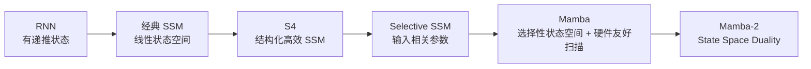
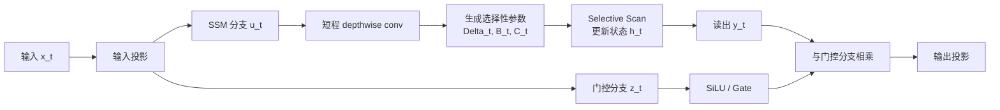
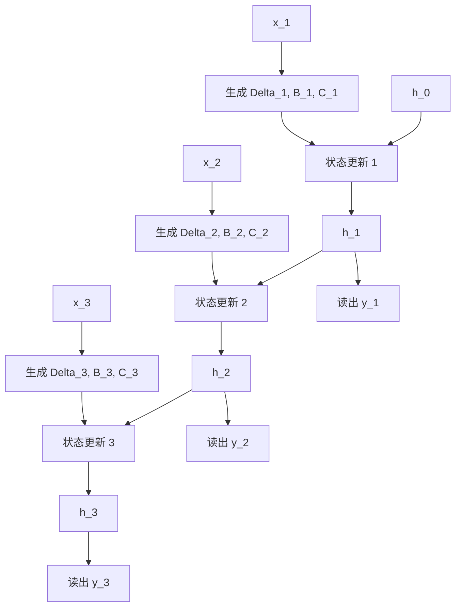
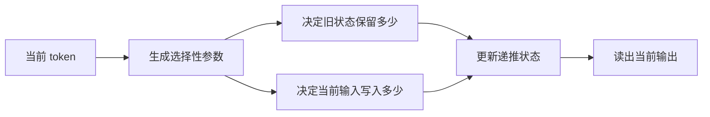
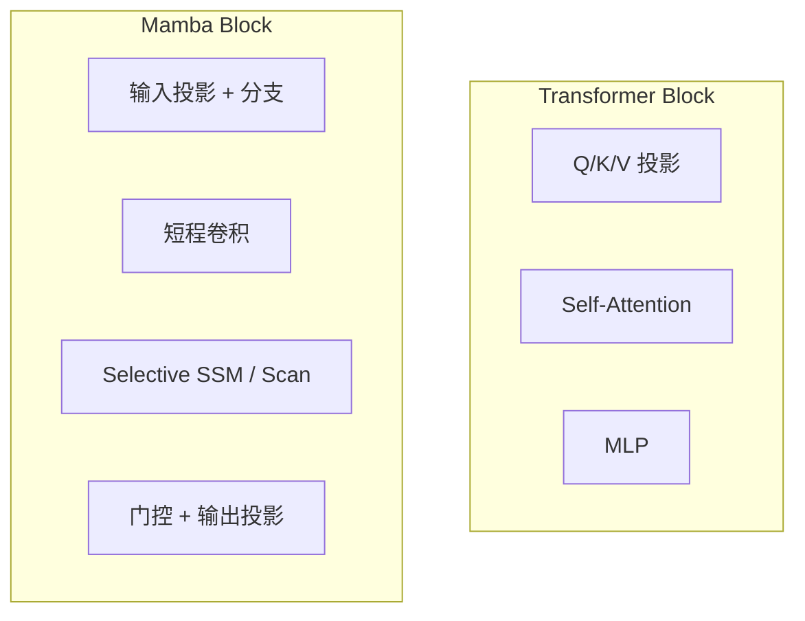
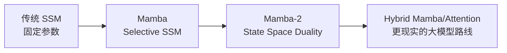

# Mamba 详解


## 1. 什么是 Mamba

Mamba 是 2023 年底提出的一条重要的后 Transformer 架构路线，论文标题是：

> **Mamba: Linear-Time Sequence Modeling with Selective State Spaces**

如果只用一句话概括它：

> **Mamba 试图用“可选择地更新状态”的状态空间模型，替代一部分甚至全部显式注意力，从而在长序列上获得更好的时间和内存效率。**

它不是传统意义上的 Attention 变体，也不是普通 RNN 的简单翻版，而是建立在 **State Space Model, SSM** 这条技术线上，并在此基础上加入了：

- 输入相关的选择性参数
- 硬件友好的并行扫描算法
- 更适合语言建模的 block 设计

Mamba 之所以引起巨大关注，根本原因在于它同时碰了两个最痛的点：

- Transformer 的长序列成本
- RNN / 传统 SSM 的内容感知能力不足

---

## 2. 它到底想解决什么问题

Mamba 的目标，不只是把复杂度从二次降到线性。

更准确地说，它在回答下面这个问题：

> **有没有一种架构，既不像 Transformer 那样显式保存和比较所有 token，又能像注意力一样对输入内容有选择地响应？**

这个问题背后有三个现实动机。

### 2.1 Transformer 的长上下文代价高

标准自注意力的核心是：

```text
Attention(Q, K, V) = softmax(QK^T / sqrt(d)) V
```

它的优点很强：

- 每个 token 都能看见整段历史
- 内容路由能力极强
- in-context learning 很自然

但代价也很明显：

- 训练和 prefill 往往接近二次复杂度
- 自回归生成需要不断增长的 KV Cache
- 上下文越长，显存和带宽压力越大

### 2.2 普通 RNN 太容易“记不住重点”

RNN 的计算很省，因为它只维护一个递推状态：

```text
h_t = f(h_(t-1), x_t)
```

但它的问题是：

- 历史信息被压进固定状态后容易退化
- 很难像注意力那样做细粒度内容检索
- 长依赖训练不稳定的问题很经典

### 2.3 传统 SSM 很高效，但不够“看内容”

状态空间模型在长序列上本来就很有潜力，因为它天然支持：

- 递推式推理
- 固定大小状态
- 线性时间序列处理

但早期 SSM 的一个核心弱点是：

> **状态更新规则通常对所有 token 都差不多，不够数据依赖。**

对于语言来说，这很致命，因为语言并不是均匀信号，而是：

- 有的 token 很重要
- 有的 token 应该被快速忘掉
- 有的信息要长期保留
- 有的信息只应短暂通过

Mamba 就是在这里切入：

> **让状态更新不再固定，而是由当前输入决定。**

---

## 3. 一句话先建立直觉

如果把 Transformer 想成：

- 每来一个新 token，都去翻整本历史档案馆

那么 Mamba 更像：

- 一边读 token
- 一边实时编辑一份压缩记忆
- 决定这一步该保留什么、忘掉什么、写入什么

所以它不是“回看全部历史”，而是：

> **把历史持续压缩进一个动态可控的状态里。**

这就是它能做到：

- 推理时固定状态内存
- 序列长度线性扩展
- 对超长序列更友好

---

## 4. Mamba 来自哪条技术线

Mamba 并不是凭空出现的，它背后是一整条 SSM 演化链。



这条线大致可以这样理解：

- RNN 提供了“递推记忆”这件事
- SSM 提供了更稳定、更可分析的线性动态系统形式
- S4 解决了很多长程建模与训练效率问题
- Mamba 进一步解决“如何按内容选择性更新状态”

所以 Mamba 的关键词不是单独的某一个数学技巧，而是：

- **SSM**
- **Selective**
- **Scan**
- **Hardware-aware**

---

## 5. 先理解 SSM：它到底是什么

很多人一看到 Mamba 会被“状态空间模型”这个名字劝退。

其实先抓住最朴素的离散形式就够了。

### 5.1 最基础的状态更新

一个离散 SSM 可以写成：

```text
h_t = A h_(t-1) + B x_t
y_t = C h_t
```

其中：

- `x_t` 是当前输入
- `h_t` 是内部状态
- `y_t` 是输出
- `A` 决定旧状态怎样传播
- `B` 决定输入怎样写进状态
- `C` 决定怎样从状态读出输出

你可以把它看成一个“有固定动力学规则的记忆系统”。

### 5.2 它和 RNN 的关系

RNN 也有递推状态，但形式通常更非线性、更难分析：

```text
h_t = tanh(W_h h_(t-1) + W_x x_t)
```

而 SSM 更强调：

- 状态转移结构清晰
- 连续时间与离散时间都有统一数学框架
- 可以利用线性系统工具分析稳定性和长程行为

### 5.3 它和 Attention 的关系

Attention 的做法是：

- 显式计算 token 与 token 之间的两两相互作用

SSM 的做法是：

- 不显式保存所有历史
- 而是用状态持续概括历史

因此二者的根本差异是：

- Attention：显式外部记忆
- SSM：隐式递推记忆

---

## 6. 为什么早期 SSM 不够适合语言

如果传统 SSM 已经这么优雅，为什么一直没有像 Transformer 那样统治 NLP？

关键原因是：

> **固定参数的状态更新太“统一”，而语言需要强烈的内容选择性。**

### 6.1 传统 SSM 更像处理平稳信号

在很多经典任务里，SSM 非常擅长：

- 音频
- 时间序列
- 连续信号

因为这些任务常常受益于：

- 平滑传播
- 稳定滤波
- 长程依赖建模

### 6.2 语言是非平稳、离散、内容驱动的

语言里不同 token 的作用差别极大：

- 标点和关键词的重要性不同
- 实体词和功能词的重要性不同
- 某些 token 会触发状态切换
- 某些 token 只需要短暂影响

如果 `A / B / C` 是固定的，就相当于：

- 不管当前 token 是什么
- 都用类似的规则推进状态

这就会导致：

- 信息过滤不够灵活
- 重点记忆能力不足
- 复杂内容选择能力不如 attention

---

## 7. Mamba 的关键突破：Selective State Spaces

Mamba 的核心创新可以压缩成一句话：

> **让状态更新参数由当前输入动态决定。**

也就是说，它不再使用固定的：

```text
h_t = A h_(t-1) + B x_t
```

而是更接近：

```text
h_t = A_t h_(t-1) + B_t x_t
y_t = C_t h_t
```

其中：

- `A_t`
- `B_t`
- `C_t`

都和当前输入 `x_t` 有关。

这意味着什么？

### 7.1 同一套状态，不同 token 用不同更新规则

于是模型可以学会：

- 某些 token 让旧状态快速衰减
- 某些 token 强烈写入新信息
- 某些 token 主要负责读出已有状态
- 某些 token 几乎不改动状态

### 7.2 它终于具备了“内容选择性”

这正是 Mamba 名字里 `Selective` 的意义：

- 不是无差别扫描
- 而是有选择地通过、遗忘、写入

### 7.3 这也是它最像 Attention 的地方

Attention 强，是因为它能根据内容动态决定信息流。

Mamba 虽然不显式计算 `QK^T`，但它通过输入相关参数实现了另一种形式的动态路由：

- 不是“这个 token 去看哪些 token”
- 而是“这个 token 应该怎样改写递推状态”

---

## 8. 一张图先看懂 Mamba



这张图里最关键的点有四个：

- 有一条主分支负责 SSM 更新
- 有一条门控分支控制输出强度
- 选择性参数是由输入动态生成的
- 序列核心计算不是 attention，而是 selective scan

---

## 9. Mamba block 大概长什么样

从工程实现角度看，一个 Mamba block 通常可以拆成下面几部分。

### 9.1 输入投影

先把输入 hidden state 投影到更大的内部维度，并分成两路：

- 一路用于 SSM 更新
- 一路用于门控

这有点像：

- GLU
- SwiGLU
- 或某种带门控的 MLP 分支

### 9.2 短程卷积

Mamba 并不是纯裸 SSM，它通常会在进入 SSM 前加一层很轻的局部卷积。

这层卷积的作用很重要：

- 补充局部归纳偏置
- 帮助捕捉短程模式
- 让模型不至于把所有事情都推给长程状态

### 9.3 选择性参数生成

当前 token 表示会被映射出若干参数，例如：

- `Delta_t`
- `B_t`
- `C_t`

这些参数控制：

- 状态更新步长
- 输入写入方式
- 状态读出方式

### 9.4 Selective Scan

这是 Mamba 真正的核心：

- 按序列方向更新状态
- 但不是简单 for-loop
- 而是利用并行扫描思想做硬件友好实现

### 9.5 输出门控与输出投影

SSM 分支的输出会和门控分支相结合，然后再回到原始隐藏维度。

所以一个 Mamba block 虽然没有 attention，但仍然具备：

- 非线性
- 门控
- 局部混合
- 长程递推记忆

---

## 10. 最核心的状态更新公式

在概念层面，Mamba 可以理解为如下递推：

```text
h_t = A(Delta_t) h_(t-1) + B_t x_t
y_t = C_t h_t + D x_t
```

这里：

- `h_t` 是状态
- `x_t` 是当前输入
- `Delta_t` 是输入相关的离散步长
- `B_t` 是输入相关写入
- `C_t` 是输入相关读出
- `D x_t` 是一条跳连式直通项

真正重要的不是死记某个符号版本，而是理解这几个旋钮在做什么。

### 10.1 `Delta_t`

它可以理解成：

- 当前 token 让系统“走多大一步”

直觉上相当于：

- 有的 token 让状态快速变化
- 有的 token 让状态更新更平缓

### 10.2 `B_t`

它控制：

- 当前输入以什么方式写进状态

### 10.3 `C_t`

它控制：

- 从当前状态里重点读出哪些内容

### 10.4 `D x_t`

它相当于：

- 给模型一条不经过长程状态的直接通路

这样模型既能利用：

- 长程递推状态

也能保留：

- 当前 token 的局部信息

---

## 11. `Delta` 为什么特别关键

很多人第一次看 Mamba，会把注意力都放在 `B_t` 和 `C_t` 上，但其实 `Delta_t` 非常关键。

### 11.1 它决定“状态推进速度”

在离散化视角里，`Delta_t` 可以看作：

- 每一步状态更新的时间间隔

如果 `Delta_t` 大，通常意味着：

- 旧状态更快衰减
- 当前输入更强地改写系统

如果 `Delta_t` 小，通常意味着：

- 系统更保守
- 更倾向保留已有状态

### 11.2 它给了模型一种“按内容调节遗忘率”的能力

这很像在说：

- 重要 token 来了，要快速切换状态
- 普通 token 来了，只做小修小补

所以 `Delta_t` 在 Mamba 里很像：

- **数据依赖的时间步长**
- 也像一种 **内容相关遗忘开关**

### 11.3 这比固定离散化强很多

传统 SSM 通常使用固定离散步长。

Mamba 则把离散化本身也做成输入相关，这就是它比旧式 SSM 更灵活的原因之一。

---

## 12. 一步一步看单个 token 到底发生了什么

假设当前输入是 `x_t`，上一时刻状态是 `h_(t-1)`，那么单步流程大致是：

1. 先把 `x_t` 经过投影，生成内部表示
2. 从内部表示中得到 `Delta_t`、`B_t`、`C_t`
3. 用 `Delta_t` 决定旧状态如何离散推进
4. 用 `B_t` 把当前输入写入状态
5. 得到新状态 `h_t`
6. 用 `C_t` 从 `h_t` 读出输出
7. 再与门控分支结合，形成 block 输出

如果写成更直观的伪代码，可以是：

```python
def mamba_step(x_t, h_prev):
    u_t, z_t = in_proj(x_t)
    u_t = depthwise_conv(u_t)

    delta_t = proj_delta(u_t)
    B_t = proj_B(u_t)
    C_t = proj_C(u_t)

    A_bar_t = discretize_A(delta_t)
    h_t = A_bar_t * h_prev + B_t * u_t
    y_t = C_t * h_t + D * u_t

    out_t = out_proj(y_t * silu(z_t))
    return out_t, h_t
```

这段伪代码最重要的不是细节，而是你能看到：

- 参数是 token 相关的
- 核心记忆是递推状态
- 输出不是只靠状态，还带门控与直通

---

## 13. 为什么它叫 Scan，而不是普通循环

如果 Mamba 只是：

```python
for t in range(T):
    h_t = f(h_(t-1), x_t)
```

那它就会退化成“理论上线性，工程上串行”的普通递推模型。

Mamba 真正厉害的地方在于：

> **它把选择性状态更新写成适合并行 scan 的形式。**

### 13.1 什么是 scan

scan 可以理解为：

- 一类前缀递推计算
- 在很多情况下可以重写成并行块操作

例如前缀和：

```text
s_t = s_(t-1) + x_t
```

看起来是串行的，但可以做高效并行前缀扫描。

### 13.2 Mamba 把状态更新也组织成类似结构

虽然它的状态更新比前缀和复杂得多，但核心思想类似：

- 把序列分块
- 利用可组合的状态转移结构
- 在 GPU 上以更大的并行粒度执行

### 13.3 这就是“hardware-aware”含义的一部分

Mamba 不是只提出一个好公式，而是同时考虑：

- HBM 读写
- SRAM / cache 利用
- kernel 融合
- 并行扫描模式

所以它的成功不是纯数学上的，而是：

- **模型设计**
- **算法重写**
- **硬件实现**

三者一起完成的。

---

## 14. 一张图看 Selective Scan



从概念上看，它确实像递推。

但实现上，Mamba 并不会傻傻地逐 token 写 Python 循环，而是把这类更新转换成 GPU 更擅长的大块计算。

---

## 15. Mamba 和 Attention 的本质差别是什么

这是理解 Mamba 最关键的问题之一。

### 15.1 Attention 是“显式检索”

Transformer 中，一个新 token 会：

- 生成 query
- 与全部历史 key 比相似度
- 从对应 value 里聚合信息

它的记忆形式更像：

- 历史档案全部保留
- 查询时再按需检索

### 15.2 Mamba 是“隐式压缩记忆”

Mamba 不保留全部历史 token 的显式表示，而是不断维护一个状态。

它更像：

- 历史信息被持续压缩
- 当前 token 决定如何编辑这份压缩状态

### 15.3 一个保存细节，一个保存摘要

因此你可以粗略把两者理解为：

- Transformer：高分辨率外部记忆
- Mamba：低成本内部递推记忆

这也是它们优缺点的来源：

- Transformer 更擅长精确回看和复制
- Mamba 更擅长稳定、低成本地跨很长序列传播信息

---

## 16. 为什么 Mamba 可以做到线性时间

Mamba 的线性时间来自两个层面。

### 16.1 模型层面

它不需要像 attention 那样显式计算：

```text
QK^T
```

也就不需要对每个 token 与全部历史做两两交互。

每一步主要做的是：

- 局部投影
- 生成选择性参数
- 状态更新
- 状态读出

### 16.2 系统层面

如果只有递推式而没有高效 scan 实现，线性时间也未必真能转成高吞吐。

Mamba 的贡献在于：

- 重新组织计算图
- 设计 fused kernel
- 让线性递推真正变成高效硬件执行

所以“线性”在这里不是只指大 O 记号，而是：

> **一种可以在真实 GPU 上兑现的线性序列建模路线。**

---

## 17. 为什么它的推理内存更省

Transformer 在自回归生成时要维护：

- 历史 `K`
- 历史 `V`

所以上下文越长，KV Cache 越大。

Mamba 则不同。

### 17.1 它主要维护固定大小状态

推理时核心只需要保存：

- 当前递推状态
- 少量局部缓存

而不是每个历史 token 的完整 key/value。

### 17.2 因此更适合超长生成

这意味着：

- 序列很长时，内存增长更平稳
- decode 阶段带宽压力更低
- 长上下文部署更有吸引力

### 17.3 这也是它与 MLA 的区别

见：[Multi-head-Latent-Attention.md](./Multi-head-Latent-Attention.md)

MLA 是：

- 仍然走 attention 路线
- 但压缩 KV Cache

Mamba 是：

- 干脆不显式维护完整 KV 历史
- 而改成递推状态

---

## 18. 它为什么比普通 RNN 更强

很多人会问：

> 说了这么多，它不还是递推模型吗？

不完全是。

### 18.1 它不是简单向量状态

普通 RNN 常常就是一个向量状态反复更新。

Mamba 则来自结构化 SSM 路线，具备：

- 更强的状态转移表达
- 更清晰的动态系统结构
- 更适合长程建模的参数化

### 18.2 它有输入相关选择性

普通 RNN 的门控虽然也能输入相关，但 Mamba 的关键是：

- 选择性被直接做进 SSM 动力学里

也就是：

- 不是只在非线性单元上门控
- 而是在状态推进规则本身上内容依赖

### 18.3 它有更强的工程设计

Mamba 不是“递推就完了”，而是包含：

- 轻卷积
- 门控分支
- 扩张通道
- selective scan kernel

所以它更像一个现代深度学习 block，而不是教科书里的简单循环层。

---

## 19. 为什么短卷积也很重要

很多人解读 Mamba 时会只盯着 selective SSM，但短卷积同样很重要。

### 19.1 SSM 更擅长长程动态

SSM 很适合：

- 跨长距离传播信息
- 建模稳定的时序动态

### 19.2 卷积更擅长短程局部模式

语言与代码里有很多局部规律，例如：

- n-gram
- 局部语法结构
- 邻近 token 的强耦合

轻量 depthwise conv 可以帮助模型更好地捕捉这些模式。

### 19.3 两者互补

因此 Mamba block 的设计直觉是：

- 卷积负责短程局部整理
- selective SSM 负责长程递推记忆

这和很多现代架构的经验是一致的：

- 单一机制往往不够
- 局部与全局混合通常更稳

---

## 20. 一张图看 Mamba 和记忆管理



你可以把这个过程理解成：

- 不是去“查历史表”
- 而是在“编辑状态”

这也是 Mamba 和 Gated DeltaNet 那条线的联系所在。  
见：[Gated-DeltaNet.md](./Gated-DeltaNet.md)

不过两者也有明显区别：

- Mamba 更偏 SSM / 状态动力学
- Gated DeltaNet 更偏线性注意力 / 记忆矩阵改写

---

## 21. 从连续时间角度怎么理解它

如果你只关心工程实现，这一节可以略读。

但从思想上说，Mamba 很重要的一点是它保留了 SSM 的连续时间视角。

### 21.1 连续系统到离散系统

经典 SSM 常从连续时间系统出发：

```text
dh(t)/dt = A h(t) + B x(t)
y(t) = C h(t)
```

然后再离散化成适合神经网络计算的形式。

### 21.2 Mamba 把离散化做成输入相关

它的重要变化之一就是：

- 离散步长不再固定
- 而是由输入驱动

这使得模型拥有一种非常特别的能力：

- 同一层在不同 token 上，表现得像不同时间尺度的动态系统

### 21.3 这很像“自适应时间分辨率”

直觉上可以理解为：

- 某些 token 需要快速刷新记忆
- 某些 token 只做慢速累积

这正是语言序列和均匀信号的根本差异之一。

---

## 22. 为什么 Mamba 对长序列特别有吸引力

Mamba 受到欢迎，最直接的原因就是它对长序列很友好。

### 22.1 成本不会像全注意力那样随长度迅速膨胀

因为它不做：

- 全历史两两比较

### 22.2 推理不依赖不断增长的 KV Cache

这对长对话、长文档、长代码非常关键。

### 22.3 长距离传播更自然

递推模型天然适合：

- 一路把状态往后传

不像 attention 那样每次都重新与全部历史建立连接。

### 22.4 训练和推理的范式更统一

Mamba 的训练和推理都围绕：

- 状态推进
- 扫描实现

而不是训练时全并行、推理时显式 cache 回看的强切换。

---

## 23. 但它为什么没有直接全面替代 Transformer

这也是必须诚实面对的问题。

### 23.1 压缩状态不等于保留全部细节

Transformer 的优势之一是：

- 历史细节并没有被提前压缩掉

Mamba 则必须把历史不断压进有限状态里。

所以在某些任务上，它可能不如 attention 擅长：

- 精细复制
- 逐 token 精确回看
- 强 in-context learning

### 23.2 生态仍以 Transformer 为中心

即使 Mamba 很强，整个大模型生态仍大量围绕：

- attention kernel
- KV cache 系统
- Transformer 训练 recipe
- 周边优化与工具链

### 23.3 有些能力确实更适合显式注意力

尤其在需要：

- 精确检索某段历史
- 基于示例即时推断规则
- 多跳路由与强对齐

这些场景里，显式 attention 往往更自然。

### 23.4 所以 hybrid 往往更现实

后续很多工作会考虑：

- 一部分层用 Mamba
- 一部分层保留 Attention

这通常能结合两者长处。

---

## 24. Mamba 和 Transformer 到底怎么比较

| 方案 | 历史表示方式 | 长度复杂度 | 推理缓存 | 内容路由方式 | 典型优点 | 典型短板 |
| --- | --- | --- | --- | --- | --- | --- |
| Transformer | 显式保存历史 K/V | 通常较高 | 随长度增长 | Query-Key 显式匹配 | 检索与 ICL 强 | 长上下文成本高 |
| RNN | 向量状态 | 低 | 低 | 隐式 | 简单省内存 | 长依赖弱 |
| 传统 SSM | 结构化状态 | 低 | 低 | 固定动力学 | 长程效率好 | 内容选择性弱 |
| Mamba | 选择性 SSM 状态 | 低 | 低 | 输入相关状态更新 | 长序列友好、推理省内存 | 某些精细检索任务不如 attention |

如果只记一句话：

- **Transformer 擅长显式检索**
- **Mamba 擅长低成本递推记忆**

---

## 25. Mamba block 和 Transformer block 的直觉对照



最本质的替换关系是：

- `Self-Attention` 被 `Selective SSM / Scan` 取代

但别把 Mamba 想成“只换了一个算子”。

它同时连带改变了：

- 记忆形式
- 序列混合方式
- 训练与推理系统优化重点

---

## 26. 一个极简伪代码看完整 block

```python
def mamba_block(x):
    u, z = in_proj(x).chunk(2, dim=-1)

    # 用轻量卷积补局部归纳偏置
    u = depthwise_conv1d(u)
    u = silu(u)

    # 由当前输入生成选择性参数
    delta = proj_dt(u)
    B = proj_B(u)
    C = proj_C(u)

    # 沿序列做 selective scan
    h = init_state()
    ys = []
    for t in range(u.size(1)):
        A_bar_t = discretize(delta[:, t])
        h = A_bar_t * h + B[:, t] * u[:, t]
        y_t = C[:, t] * h + D * u[:, t]
        ys.append(y_t)

    y = stack(ys, dim=1)
    y = y * silu(z)
    return out_proj(y)
```

真实实现会复杂得多，也不会真的用这段循环来跑大规模训练。

但这段伪代码已经足够说明 Mamba 的骨架：

- 先局部处理
- 再生成选择性参数
- 再做状态扫描
- 最后门控输出

---

## 27. 它和线性注意力不是一回事

Mamba 常被和各种线性复杂度架构放在一起讨论，但它和线性注意力并不一样。

### 27.1 线性注意力仍然是“注意力”

很多线性注意力方法本质上还是在做：

- Query / Key / Value 路线
- 只是通过核技巧或状态重写把复杂度降下来

### 27.2 Mamba 不是 QKV 模型

Mamba 并不围绕：

- `Q`
- `K`
- `V`

来设计，而是围绕：

- 状态推进
- 离散动力学
- 输入相关参数

### 27.3 两者的记忆哲学不同

- 线性注意力：把注意力改写成递推记忆
- Mamba：从 SSM 出发做内容选择性

这也是为什么它和 Gated DeltaNet、KDA 那些工作可以相互比较，但不属于同一路线。

---

## 28. 它和稀疏注意力也不是一回事

见：[Sliding-Window-Attention.md](./Sliding-Window-Attention.md)

稀疏注意力做的是：

- 改变 token 可以看见哪些 token

Mamba 做的是：

- 不再显式保存所有 token
- 而改为维护递推状态

所以它们的本质区别是：

- 稀疏注意力：减少连接边
- Mamba：改写记忆机制

两者理论上也可以组合，但不是一个东西。

---

## 29. 为什么说 Mamba 更像“会筛选的压缩记事本”

假设模型在读一篇很长的文章。

Transformer 的方式更像：

- 把前文每个句子的 key/value 都存档
- 需要时随时检索

Mamba 的方式更像：

- 手上只有一本有限大小的动态笔记本
- 每来一段新内容，就决定：
- 哪些旧笔记该淡化
- 哪些新信息该重点写入
- 当前输出该从笔记本哪部分读

所以它解决的问题不是：

- “如何完整保留全部历史”

而是：

- **如何在有限状态里高效管理历史摘要**

---

## 30. 这会带来什么能力边界

这个“压缩记事本”比喻很好，但也直接暴露了 Mamba 的边界。

### 30.1 它擅长状态传播

例如：

- 长距离上下文影响后文
- 长序列连续建模
- 对内存和带宽敏感的场景

### 30.2 它不天然擅长逐项翻阅历史

如果任务要求模型像数据库检索那样：

- 精确回看若干离散历史片段
- 保留高分辨率位置级细节

那么显式 attention 会更自然。

### 30.3 所以“强项”和“适用边界”要分开看

Mamba 很强，但它强在：

- 低成本长程建模

而不一定强在：

- 一切需要显式逐 token 回看的任务

---

## 31. 为什么后续又出现了 Mamba-2

Mamba 已经很强，但它也留下了两个问题：

- 理论上怎样更统一地理解 SSM 与 Attention
- 工程上怎样把训练吞吐做得更好

Mamba-2 就是在这条线上继续推进的。

### 31.1 Mamba-2 的关键词是 State Space Duality

它试图建立一种更统一的视角：

- SSM 与某些 attention 结构之间并非完全割裂

### 31.2 它更强调 matmul 友好

Mamba-2 的一个重要方向是：

- 更好利用现代硬件擅长的大矩阵乘

### 31.3 为什么这很自然

Mamba-1 的亮点在于：

- selective SSM

Mamba-2 则更进一步考虑：

- 数学统一性
- 并行效率
- 与现有大模型工程体系的兼容性

如果只做一个非常粗的代际记忆：

- Mamba：让 SSM 更像内容感知序列模型
- Mamba-2：让这条路线更统一、更工程化

---

## 32. 一张图看 Mamba 到 Mamba-2



这条演化线很说明问题：

- 社区并不只是想要“线性复杂度”
- 更想要“既高效又能保住 Transformer 关键能力”的路线

---

## 33. 它为什么在大模型里常被做成 Hybrid

这是非常重要的工程现实。

### 33.1 不同层并不一定都需要同一种记忆机制

有些层更适合：

- 全局显式路由

有些层更适合：

- 低成本长程状态传播

### 33.2 Hybrid 可以同时利用两者优势

比如：

- 一部分层保留 attention，用于精细检索与路由
- 一部分层使用 Mamba，用于长程传播与效率优化

### 33.3 这通常比“纯替代”更稳

因为现实任务常常同时需要：

- 高分辨率局部细节
- 低成本超长上下文能力

所以把 Mamba 理解成：

- “Transformer 的竞争者”

是对的，但把它理解成：

- “Transformer 生态中的重要新组件”

往往更贴近实践。

---

## 34. Mamba 的优点

### 34.1 长序列复杂度更友好

不需要显式两两注意力矩阵。

### 34.2 推理内存更稳定

不依赖不断增长的 KV Cache。

### 34.3 适合硬件优化

论文非常强调：

- 算法与 kernel 共同设计

### 34.4 状态更新具有内容选择性

这使它区别于传统固定参数 SSM。

### 34.5 对超长上下文很有吸引力

尤其适合：

- 长文档
- 长音频
- 长时间序列
- 长代码序列

---

## 35. Mamba 的代价和局限

### 35.1 固定状态终究不是无限外部记忆

历史会被压缩，细节可能损失。

### 35.2 某些任务对显式检索更敏感

比如：

- 强复制
- 精确多例归纳
- 某些复杂 in-context learning 场景

### 35.3 高效实现门槛不低

如果没有好的 kernel，Mamba 的理论优势不一定完全兑现。

### 35.4 生态成熟度不如 Transformer

包括：

- 工具链
- 部署栈
- 推理框架支持
- 下游经验

### 35.5 理论线性不代表任何长度都更快

实际速度还会受：

- 序列长度
- batch size
- 硬件
- kernel 质量

影响。

---

## 36. 它更适合哪些场景

Mamba 特别适合下面这些方向：

- 长序列语言建模
- 长文档理解
- 长代码上下文
- 音频与时序建模
- 对推理内存和带宽敏感的系统

如果你的主要瓶颈是：

- **KV Cache 太大**
- **长上下文 decode 成本高**
- **希望探索非 Attention 路线**

那 Mamba 很值得研究。

如果你的任务高度依赖：

- **显式例子检索**
- **逐 token 精确回看**
- **强 few-shot ICL**

那么纯 Mamba 可能未必是最佳答案，Hybrid 往往更稳。

---

## 37. 常见误区

### 37.1 “Mamba 就是高级 RNN”

不准确。

它虽然是递推架构，但它来自：

- 结构化状态空间模型
- 输入相关离散动力学
- 硬件友好扫描算法

和普通 RNN 不是一个层级的东西。

### 37.2 “Mamba 就是线性注意力”

也不对。

它不走 QKV 路线，而是走 selective SSM 路线。

### 37.3 “线性复杂度一定全面碾压 Transformer”

不一定。

真实表现还受：

- 任务类型
- 实现质量
- 模型规模
- 训练预算

影响。

### 37.4 “Mamba 会完全替代 Attention”

至少从当前实践看，不应这么绝对。

更现实的判断是：

- 它是非常强的替代路线
- 也是非常强的混合组件

### 37.5 “Mamba 只对 NLP 有意义”

也不对。

它本质上是序列建模方法，所以对：

- 语音
- 时间序列
- 视频序列
- 强时序结构任务

都很有吸引力。

---

## 38. 一个特别重要的理解角度

Mamba 最有价值的地方，不只是“提出了一个新模块”，而是它重新回答了一个老问题：

> **强序列建模，是否一定需要显式注意力矩阵？**

Mamba 给出的答案是：

> **不一定。只要状态更新足够内容感知、算法足够硬件友好，递推模型也可以成为强大的现代序列架构。**

这句话之所以重要，是因为它改变了很多人对架构空间的直觉：

- 过去大家容易把“强建模能力”和“注意力”绑定
- Mamba 则证明了高性能序列建模还有另一条路线

---

## 39. 一句话总结

Mamba 的本质是：

> **把传统状态空间模型升级成一种输入相关、可选择地更新状态的现代序列模块，通过 selective state spaces 和 hardware-aware scan，在不依赖显式注意力矩阵的前提下，实现长序列友好的线性时间建模与更稳定的推理内存。**

如果再压成更短的一句：

> **它不是去回看全部历史，而是学会如何按内容动态管理一份压缩状态。**

---

## 40. 速记版

- Mamba 属于 `Selective State Space Model`
- 它的核心不是 Attention，而是输入相关状态更新
- `Delta_t`、`B_t`、`C_t` 由当前输入动态生成
- 它通过 `selective scan` 在长序列上实现线性时间建模
- 推理时主要维护固定状态，而不是不断增长的 KV Cache
- 短程卷积负责局部模式，SSM 负责长程传播
- 它比传统 SSM 更内容感知，但某些显式检索任务仍不如 Attention 自然
- 实践中常和 Attention 组成 Hybrid 架构
- 后续代表性演化方向是 `Mamba-2`

---

## 41. 参考

1. Mamba: Linear-Time Sequence Modeling with Selective State Spaces  
   https://arxiv.org/abs/2312.00752

2. Transformers are SSMs: Generalized Models and Efficient Algorithms Through Structured State Space Duality  
   https://arxiv.org/abs/2405.21060

3. A Survey of Mamba  
   https://arxiv.org/abs/2408.01129

4. An Empirical Study of Mamba-based Language Models  
   https://arxiv.org/abs/2406.07887
