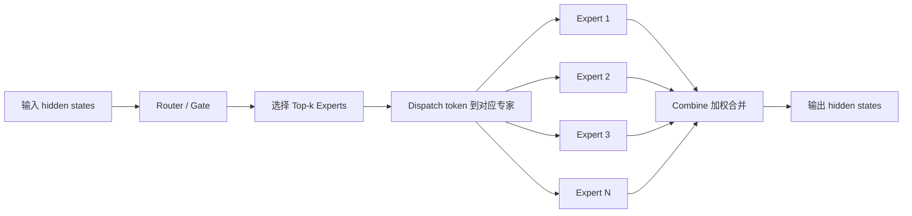
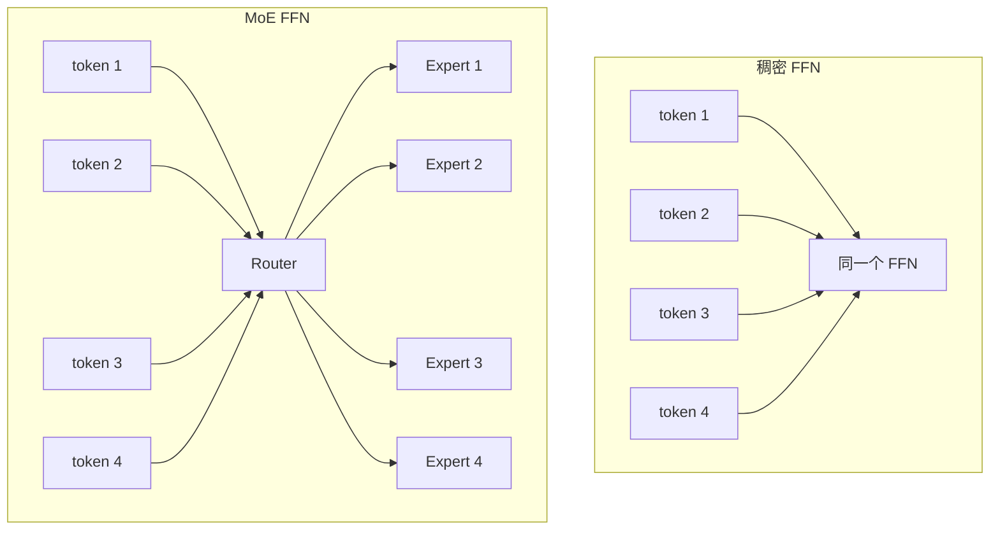
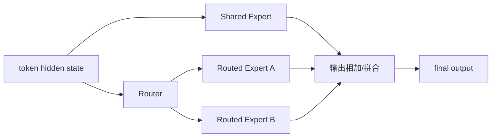

# Mixture of Experts (MoE) 详解


## 1. 什么是 MoE

MoE 是 **Mixture of Experts** 的缩写，中文通常叫：

> **混合专家模型**  
> 或 **专家混合架构**

它的核心思想非常直接：

- 不再让所有 token 都走同一套完整前馈网络
- 而是为模型准备很多个“专家”子网络
- 每个 token 只激活其中少数几个专家
- 最后把这些专家的输出按路由权重加权合并

一句话概括：

> **MoE 用稀疏激活换大容量。**

这也是它在大模型时代特别重要的原因。  
因为传统稠密模型一旦继续扩大参数，训练和推理成本也几乎同步上涨；而 MoE 允许模型的**总参数量**大幅增长，但让**单个 token 的实际计算量**只增长一小部分，甚至接近不变。

---

## 2. 为什么大模型需要 MoE

### 2.1 稠密模型的扩展代价越来越高

在标准 Transformer 中，每个 token 经过每一层时，都会完整执行：

- 注意力模块
- 前馈网络模块（FFN / MLP）

如果把 FFN 做大，模型容量会增强，但问题也很明显：

- 参数量增加
- 显存占用增加
- 训练 FLOPs 增加
- 推理成本增加

也就是说，稠密模型的扩展方式本质上是：

> **参数更大，计算也更大。**

### 2.2 很多 token 其实不需要同样的计算路径

不同 token 的语义模式并不一样：

- 代码 token 更像在调用“程序理解专家”
- 数学 token 更像在调用“符号推理专家”
- 多语言 token 更像在调用“语言迁移专家”

如果所有 token 都经过同一个 FFN，那么这套网络必须同时服务各种模式，容易造成：

- 参数利用率不高
- 学到的能力相互干扰
- 继续做大时收益变慢

MoE 的回答是：

> **把 FFN 分解成很多个专家，让不同 token 走不同专家。**

---

## 3. MoE 的核心结构

一个典型的 MoE 层，通常由 4 部分组成：

- `Router / Gate`：决定 token 该送到哪些专家
- `Experts`：一组并行的前馈网络
- `Dispatch`：把 token 按专家分发
- `Combine`：把专家输出加权合并回原位置



### 3.1 Expert 是什么

在大语言模型里，MoE 通常不是把整个 Transformer block 替换掉，而是：

> **把原来的稠密 FFN 换成稀疏专家 FFN。**

也就是说，注意力模块往往仍是普通注意力，而专家通常是多个并行 MLP。

一个专家本质上可以理解为：

- 结构相同
- 参数不同
- 专长不同

最常见的实现就是多个 `MLP` 并排放在一起。

### 3.2 Router 是什么

Router 接收 token 的隐藏状态 `x`，输出每个专家的路由分数：

```text
router_logits = W_r x
```

再经过 softmax：

```text
g = softmax(router_logits)
```

得到每个 token 对不同专家的偏好概率。

### 3.3 Top-k 路由

为了保持稀疏性，模型不会真的调用所有专家，而是只取分数最高的 `k` 个：

- `top-1`：每个 token 只走 1 个专家
- `top-2`：每个 token 走 2 个专家
- 更高 `k`：表达更灵活，但调度更重

所以 MoE 的核心表达可以写成：

```text
y = Σ_{i in TopK(x)} g_i(x) E_i(x)
```

其中：

- `E_i(x)` 是第 `i` 个专家的输出
- `g_i(x)` 是该专家的路由权重
- `TopK(x)` 表示只保留得分最高的 `k` 个专家

---

## 4. 一张图看懂稠密 FFN 和 MoE FFN 的区别



直观理解：

- 稠密 FFN：所有 token 共享同一套参数
- MoE FFN：不同 token 可以走不同专家

因此 MoE 的收益不是“每个 token 计算更多”，而是：

> **让总模型容量更大，但单 token 只使用其中的一小部分。**

---

## 5. MoE 放在 Transformer 的哪里

在 LLM 中，最常见的 MoE 位置是：

- 保留 Self-Attention 不变
- 把原来的 MLP/FFN 层替换为 MoE 层

典型 block 可以理解为：

```text
Transformer Block
= Attention + MoE FFN
```

而不是：

```text
Transformer Block
= MoE Attention + MoE FFN
```

原因很简单：

- Attention 已经很重，改动太大会增加复杂度
- FFN 往往占据大量参数，更适合做专家化扩展
- 专家 MLP 更容易并行、复用和工程化

---

## 6. MoE 为什么能“大参数、低激活”

假设一个稠密 FFN 的参数量是 `P`。  
如果我们做一个有 `N` 个专家的 MoE 层，总参数大约接近：

```text
N x P
```

但如果每个 token 只激活 `k` 个专家，那么单 token 的实际计算更接近：

```text
k x P
```

而不是 `N x P`。

例如：

- 8 个专家
- 每个 token 只激活 2 个

那么：

- 总容量接近 8 倍
- 单 token 激活量只接近 2 倍

这就是很多模型会写成：

- 总参数 `47B`
- 激活参数 `12B`

其中“总参数”是所有专家都算上，“激活参数”则是单次前向真正参与计算的部分。

---

## 7. 路由机制是 MoE 的灵魂

MoE 能不能工作好，关键不只在专家本身，而在 **Router 是否稳定、是否均衡、是否可训练**。

### 7.1 Router 的基本流程

对每个 token 的隐藏状态 `h_t`：

```text
router_logits_t = W_r h_t
router_probs_t = softmax(router_logits_t)
topk_idx, topk_weight = topk(router_probs_t, k)
```

然后把 `h_t` 发给 `topk_idx` 对应的专家。

### 7.2 为什么要用 softmax

softmax 带来两个作用：

- 把打分变成概率分布
- 让不同专家之间形成竞争关系

### 7.3 为什么要做 Top-k

如果所有专家都参与：

- 就失去稀疏性
- 计算量又回到接近稠密大模型

所以 MoE 必须稀疏路由。

---

## 8. Top-1、Top-2、Shared Expert 有什么区别

| 路由方式 | 含义 | 优点 | 代价 |
| --- | --- | --- | --- |
| Top-1 | 每个 token 只选 1 个专家 | 最省计算，调度简单 | 容易路由过硬，信息单一路径 |
| Top-2 | 每个 token 选 2 个专家 | 更稳、更有表达力 | Dispatch 和 Combine 更复杂 |
| Shared Expert | 每个 token 总会经过共享专家，再叠加路由专家 | 稳定通用能力，降低塌缩风险 | 额外增加一部分固定计算 |

很多现代开源 MoE 模型都不再只用“纯 top-1/2”，而是加入：

- 共享专家
- 细粒度专家
- 分组路由
- 更稳定的负载均衡策略


---

## 9. 训练 MoE 时最麻烦的问题

MoE 很强，但训练远比普通稠密模型麻烦。核心难点主要有 4 类。

### 9.1 专家负载不均衡

如果 Router 只偏爱少数专家，会出现：

- 有的专家特别忙
- 有的专家几乎没 token
- 模型容量虽然很大，但没被真正利用

这叫做 **expert imbalance** 或 **expert collapse**。

### 9.2 专家过载

每个专家在一个 batch 中能处理的 token 数通常会受容量限制。  
如果某个专家一下子被分配了太多 token，就会发生：

- token 丢弃
- token 重路由
- 或者计算图严重失衡

### 9.3 跨设备通信开销

真实训练里，专家常常分布在多张卡上。  
于是 token 分发和结果回收会触发：

- all-to-all 通信
- tensor 重排
- 显存读写峰值

MoE 的工程瓶颈往往不是数学公式，而是这里。

### 9.4 路由训练不稳定

Router 是离散选择的近似版本。  
虽然训练里通常用 softmax + top-k，但依然容易出现：

- 路由震荡
- 早期专家分工不稳定
- 某些专家长期学不到有效模式

---

## 10. 负载均衡为什么重要

如果不做额外约束，Router 很可能学成：

> “把大多数 token 都丢给几个看起来最强的专家。”

这会导致两个问题：

- 热门专家越来越强，冷门专家越来越弱
- 模型虽然总参数大，但有效容量很低

因此 MoE 常会引入 **负载均衡辅助损失**。

### 10.1 两类常见统计量

通常会关注：

- `importance`：某专家被分到的总概率权重
- `load`：某专家实际接到的 token 数

理想情况下，各专家的 `importance` 和 `load` 都更均匀。

### 10.2 直觉版理解

你可以把 Router 想成客服分单系统：

- 如果所有订单都堆给 2 个客服，其他人再强也没用
- 更好的做法是，在保持专业匹配的同时，尽量均匀分配

这也是为什么 MoE 不只是“让路由会选”，还要“让路由会平衡”。

---

## 11. Capacity Factor 是什么

为了防止某个专家瞬时接收太多 token，很多 MoE 实现会设置专家容量上限：

```text
expert_capacity = capacity_factor x (tokens_per_batch / num_experts)
```

其中：

- `tokens_per_batch / num_experts` 是平均应分配量
- `capacity_factor` 给一点冗余空间

例如：

- batch 中有 `4096` 个 token
- `num_experts = 16`
- 平均每个专家大约应接 `256` 个 token

若 `capacity_factor = 1.25`，则每个专家容量上限约为：

```text
320 tokens
```

### 11.1 超出容量怎么办

常见做法有：

- **drop tokens**：直接丢弃超额 token 的该专家路径
- **reroute**：尝试发往次优专家
- **dropless**：不丢 token，但实现更复杂，对系统调度要求更高

现代高质量实现越来越倾向于：

- 尽量减少 token drop
- 或使用更稳的路由与并行策略做 dropless MoE

---

## 12. 一个最小数学表达

设：

- 输入 token 表示为 `x`
- 一共有 `N` 个专家
- 每个专家是函数 `E_i`
- Router 输出分布 `g(x)`

则 MoE 输出可以写成：

```text
y = Σ_{i=1..N} m_i(x) g_i(x) E_i(x)
```

其中：

- `g_i(x)` 是路由概率
- `m_i(x)` 是 top-k 产生的稀疏掩码，只有被选中的专家才为 1

也可以理解为：

```text
只对被选中的专家求和
```

这个公式很简单，但真正复杂的地方在于：

- 这些 token 如何高效分组
- 专家如何并行执行
- 输出如何散回原顺序

---

## 13. MoE 在代码里通常长什么样

从实现视角看，一个最小 MoE 模块的伪代码通常是：

```python
router_logits = router(hidden_states)
router_probs = softmax(router_logits, dim=-1)

topk_weights, topk_indices = torch.topk(router_probs, k=top_k, dim=-1)
topk_weights = topk_weights / topk_weights.sum(dim=-1, keepdim=True)

final_output = zeros_like(hidden_states)

for expert_id in range(num_experts):
    token_mask = topk_indices == expert_id
    if token_mask.any():
        token_states = gather(hidden_states, token_mask)
        expert_output = experts[expert_id](token_states)
        final_output = scatter_add(final_output, expert_output, token_mask, topk_weights)
```

这个伪代码已经包含了 MoE 的 3 个关键动作：

- `gather`：收集属于某个专家的 token
- `expert forward`：专家计算
- `scatter_add`：把结果按权重加回去

---

## 14. PyTorch 最小实现骨架

下面给一个教学版最小实现，重点是看懂流程，不追求最高性能。

```python
import torch
import torch.nn as nn
import torch.nn.functional as F


class FeedForwardExpert(nn.Module):
    def __init__(self, hidden_size: int, intermediate_size: int):
        super().__init__()
        self.gate_proj = nn.Linear(hidden_size, intermediate_size, bias=False)
        self.up_proj = nn.Linear(hidden_size, intermediate_size, bias=False)
        self.down_proj = nn.Linear(intermediate_size, hidden_size, bias=False)
        self.act = nn.SiLU()

    def forward(self, x: torch.Tensor) -> torch.Tensor:
        return self.down_proj(self.act(self.gate_proj(x)) * self.up_proj(x))


class SimpleMoE(nn.Module):
    def __init__(
        self,
        hidden_size: int,
        intermediate_size: int,
        num_experts: int,
        top_k: int = 2,
    ):
        super().__init__()
        self.num_experts = num_experts
        self.top_k = top_k
        self.router = nn.Linear(hidden_size, num_experts, bias=False)
        self.experts = nn.ModuleList(
            [FeedForwardExpert(hidden_size, intermediate_size) for _ in range(num_experts)]
        )

    def forward(self, hidden_states: torch.Tensor):
        """
        hidden_states: [batch, seq, hidden]
        """
        batch, seq, hidden = hidden_states.shape
        x = hidden_states.reshape(-1, hidden)  # [tokens, hidden]

        router_logits = self.router(x)  # [tokens, num_experts]
        router_probs = F.softmax(router_logits, dim=-1, dtype=torch.float)

        topk_weights, topk_indices = torch.topk(router_probs, k=self.top_k, dim=-1)
        topk_weights = topk_weights / topk_weights.sum(dim=-1, keepdim=True)

        final_output = torch.zeros_like(x)

        # 遍历专家而不是遍历 token，更容易并行化
        for expert_id, expert in enumerate(self.experts):
            match = topk_indices == expert_id  # [tokens, top_k]
            if not match.any():
                continue

            token_pos, route_rank = torch.where(match)
            expert_input = x[token_pos]  # 收集被该专家接收的 token
            expert_output = expert(expert_input)

            weight = topk_weights[token_pos, route_rank].to(expert_output.dtype).unsqueeze(-1)
            final_output.index_add_(0, token_pos, expert_output * weight)

        final_output = final_output.view(batch, seq, hidden)
        return final_output, router_logits
```

### 14.1 这段代码体现了什么

- `router` 负责计算专家偏好
- `topk` 负责制造稀疏性
- `ModuleList` 里每个 MLP 都是一个 expert
- `index_add_` 负责把多个专家结果合并回 token 位置

### 14.2 它缺了什么

为了教学简洁，上面故意省略了很多工业级细节：

- 容量控制
- token drop / dropless 策略
- 共享专家
- 负载均衡 loss
- all-to-all 通信
- fused kernel
- Expert Parallel

也就是说，这段代码能帮助你理解 **MoE 是怎么工作的**，但不能直接当作大规模训练实现。

---

## 15. 负载均衡辅助损失怎么理解

很多实现都会在主任务 loss 之外，再加一项辅助损失，鼓励专家负载更均匀。

一个直觉版写法可以近似理解为：

```python
def load_balance_loss(router_probs: torch.Tensor) -> torch.Tensor:
    # router_probs: [tokens, num_experts]
    importance = router_probs.mean(dim=0)
    uniform = torch.full_like(importance, 1.0 / importance.numel())
    return torch.sum((importance - uniform) ** 2)
```

真实大模型里的公式通常更讲究，会同时关注：

- 概率分布是否均匀
- 实际分配数量是否均匀
- 路由是否过于尖锐

但直观上你只需要记住：

> **辅助损失不是为了提高主任务语义能力，而是为了让专家系统“运转正常”。**

---

## 16. Shared Expert 为什么越来越常见

早期 MoE 里，所有 token 只走被选中的路由专家。  
但现代很多模型会额外加入 **共享专家**。

### 16.1 共享专家的作用

共享专家通常对所有 token 都执行，用于承载：

- 通用语言能力
- 基础句法与语义模式
- 稳定的公共计算路径

而路由专家则负责：

- 专门化能力
- 稀疏扩展容量
- 细粒度差异处理

### 16.2 为什么它有效

因为纯路由专家体系有时会过于依赖 Router，导致：

- 某些通用知识学习不稳
- 路由错误时损失过大
- 训练初期更容易塌缩

共享专家相当于给所有 token 保留一条保底主干。



---

## 17. 细粒度专家为什么会变多

现代 MoE 模型常见趋势是：

- 专家数更多
- 单专家更小
- 路由更细

这背后的动机是：

- 大专家数量少，容易形成粗糙分工
- 小专家数量多，更容易形成细粒度 specialization
- 调度粒度更灵活

也就是说，MoE 的升级方向不是简单堆更大专家，而是：

> **把专家拆得更细，再用更聪明的路由去组合。**

---

## 18. 训练视角：MoE 的真实成本在哪里

很多人第一次接触 MoE 时，会以为：

> “既然每个 token 只激活少数专家，那训练一定很便宜。”

这只对了一半。

### 18.1 计算不一定最难，通信才常常最难

当专家分布在多卡上时，训练流程会变成：

1. 每张卡先计算本地 token 的路由结果
2. 按专家归属把 token 发到不同设备
3. 对应设备上的专家执行前向
4. 再把结果发回原设备继续后续层

其中最贵的往往是：

- token 搬运
- all-to-all
- 不均衡导致的等待

### 18.2 Expert Parallel

因此 MoE 常和 **Expert Parallel** 一起出现。

它的思想是：

- 不同专家分布到不同设备
- 每台设备只保存部分专家权重
- token 按需要被发送过去

这能让总参数扩展得更大，但同时也会让系统复杂度明显上升。

---

## 19. 推理视角：MoE 不是天然更容易部署

MoE 的推理优势主要来自：

- 单 token 激活参数更少
- 理论 FLOPs 更低

但它并不意味着推理一定更简单。

### 19.1 推理中的真实难点

- batch 小时专家利用率差
- token 被分散到不同专家，kernel 不够饱满
- 专家跨卡放置会引入额外通信
- 调度与内存访问模式更复杂

### 19.2 为什么有时“小 batch MoE”不一定占优

如果请求很少、batch 很小，就可能出现：

- 每个专家只处理几个 token
- GPU 利用率偏低
- 调度成本抵消稀疏收益

因此 MoE 更适合：

- 高吞吐在线服务
- 大 batch 推理
- 已针对专家路由做过优化的推理框架

---

## 20. 与稠密模型、GQA、MLA 的区别

这几个概念经常一起出现，但它们优化的对象不同。

| 技术 | 主要优化对象 | 核心方法 | 主要收益 |
| --- | --- | --- | --- |
| Dense Transformer | 无稀疏路由 | 所有 token 走同一路径 | 实现简单、训练稳定 |
| MoE | FFN 计算路径 | token 只激活少数专家 | 更大总容量、更低激活计算 |
| GQA | 注意力 KV 头数 | 多个 Q 头共享较少 K/V 头 | 降低 KV Cache 和带宽 |
| MLA | 注意力 KV 表示 | 缓存压缩 latent 而非完整 K/V | 显著压缩 cache |

所以要特别注意：

> **MoE 主要解决的是“前馈网络容量与计算”的矛盾，不是 KV Cache 问题。**

这也是为什么现代大模型常常会把它们组合使用：

- 用 MoE 扩展 FFN 容量
- 用 GQA / MLA 优化注意力推理成本

---

## 21. 一个更完整的工程视角

工业级 MoE 往往不只是“加几个专家”这么简单，还会配套这些策略：

- **Router jitter noise**：训练期给路由一点扰动，提升探索性
- **Auxiliary loss / balance loss**：避免专家塌缩
- **Capacity planning**：限制单专家过载
- **Dropless dispatch**：尽量不丢 token
- **Shared experts**：给所有 token 一条稳定主干
- **Expert parallel**：把专家分散到多卡
- **Fused kernel**：减少 gather/scatter 开销
- **Group-limited routing**：先限制候选专家组，再做局部 top-k

这些技巧的目标可以浓缩为三件事：

- 让路由更稳
- 让专家更忙但不过载
- 让系统通信更便宜

---

## 22. 为什么 MoE 能提升效果

MoE 的价值不只是“省算力”，更在于它可能带来更强的模型能力。

### 22.1 专家专门化

不同专家会逐渐形成不同偏好：

- 语言风格
- 领域术语
- 推理模式
- 代码结构

这种分工有点像“条件计算版集成学习”。

### 22.2 参数利用率更高

稠密模型要求同一套参数适配所有 token；MoE 则允许：

- 通用部分共用
- 特化部分分流

因此在相近激活计算预算下，MoE 往往能提供更高的总容量。

### 22.3 训练数据多样性越高，专家化越有意义

当训练数据覆盖：

- 多语言
- 代码
- 数学
- 工具调用
- 长文写作

MoE 更容易学出有差异的专家分工。

---

## 23. MoE 的局限与代价

MoE 并不是“只赚不亏”。

### 23.1 实现复杂度高

相比稠密 FFN，MoE 额外引入了：

- Router
- Dispatch / Combine
- 平衡损失
- 容量控制
- 分布式调度

### 23.2 部署复杂度高

训练能跑不代表服务好做。  
真正上线时还要解决：

- 专家权重如何放置
- 请求批处理如何聚合
- 小 batch 如何避免效率低
- 专家热点如何平滑

### 23.3 并不是所有任务都稳定占优

在一些预算较小、实现较弱的场景里：

- 稠密模型更简单
- 调参更稳定
- 训练和部署成本更低

所以 MoE 的优势通常在：

- 大规模训练
- 大模型容量扩展
- 有较强系统工程支持的场景

---

## 24. 常见误区

### 24.1 MoE 不是把 Attention 稀疏化

绝大多数 LLM 中，MoE 替换的是：

- FFN / MLP

而不是注意力本身。

### 24.2 总参数大，不等于单 token 计算大

MoE 的关键就在于：

- 总参数可以很大
- 但单 token 只激活其中一小部分

### 24.3 MoE 不是天然更省显存

它可能减少单 token 激活计算，但同时也会增加：

- 专家总权重存储
- 分布式通信
- 调度中间缓冲

所以显存与速度收益都要结合实现看。

### 24.4 Router 不是“可有可无”的小模块

Router 决定了：

- token 去哪
- 专家是否均衡
- 模型是否稳定

很多时候，MoE 成败不在专家有多强，而在路由系统是否成熟。

---

## 25. 适合如何学习和实现 MoE

如果你想从零理解并自己实现，最好的路径通常是：

1. 先写单机单卡的教学版 `Top-k MoE`
2. 再加入负载均衡 loss
3. 再加入 shared expert
4. 最后再考虑 Expert Parallel 和多卡 dispatch

学习时重点要分清三层问题：

- **数学层**：`top-k` 路由和加权求和
- **框架层**：`gather -> expert -> scatter`
- **系统层**：通信、并行、容量、吞吐

把这三层混在一起看，往往最容易晕。

---

## 26. 仓库里的相关例子

如果你想继续结合本仓库内容往下看，可以参考这些资料：

- `models/Qwen/Qwen1.5/06-Qwen1.5-MoE-A2.7B.md`
- `models/XVERSE/06-XVERSE-MoE-A4.2B.md`
- `models/Qwen/Qwen3/01-Qwen3-模型结构解析-Blog.md`
- `papers/to-2026/16_Switch_Transformer_2021_原理.md`
- `papers/to-2026/27_Mixtral_2024_原理.md`

它们分别对应：

- MoE 模型部署案例
- 开源模型结构说明
- 经典论文的入门导读

---

## 27. 一句话总结

MoE 的本质是：

> **把一个大而统一的前馈网络拆成很多专家，让每个 token 只激活少数专家，从而在保持单 token 计算相对可控的前提下，把模型总容量扩展到更大。**

它最重要的工程价值是：

- 用稀疏激活换更大参数容量
- 让模型形成专家化分工
- 为超大模型提供另一条扩展路径

它最核心的工程挑战是：

- 路由稳定性
- 负载均衡
- token dispatch
- 多卡通信

---

## 28. 速记版

- MoE 主要替换 Transformer 中的 FFN，而不是注意力
- 每个 token 只激活少数 `top-k` 专家，因此是稀疏计算
- 总参数量可以很大，但激活参数量远小于总参数量
- Router 决定 token 去哪个专家，是 MoE 的关键模块
- 辅助平衡损失、容量控制、共享专家是训练稳定性的关键
- 真正的工程难点通常在 dispatch、combine 和多卡 all-to-all
- MoE 适合大规模训练和高吞吐部署，但实现复杂度明显高于稠密模型
