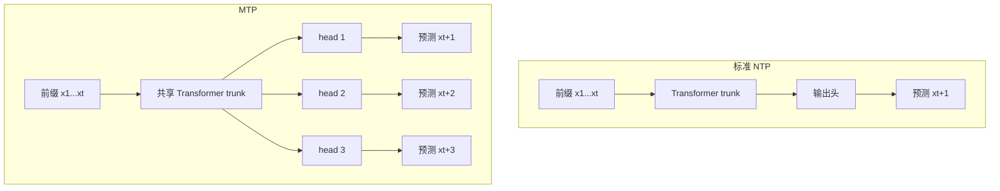
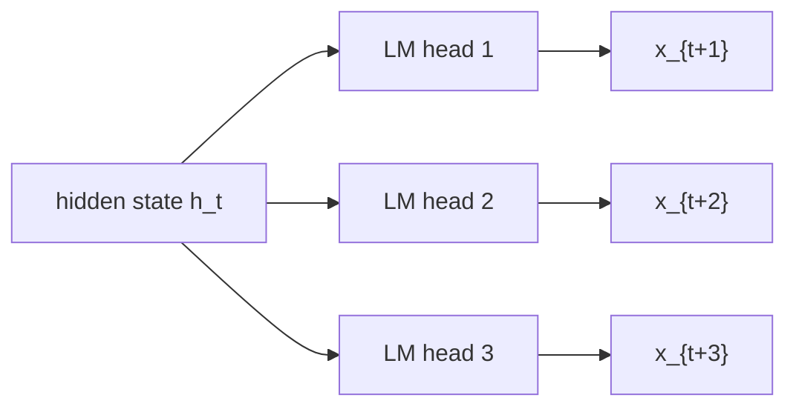
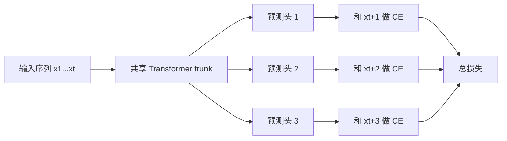
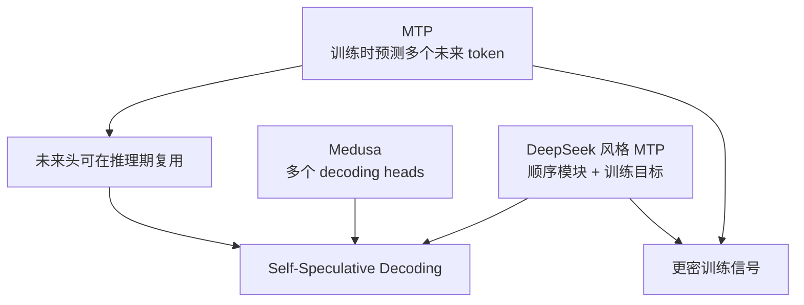
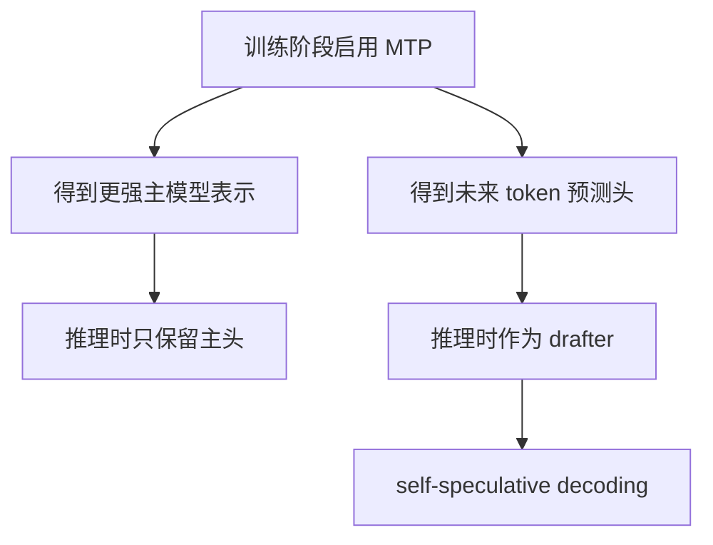

# Multi-Token Prediction (MTP) 详解


## 1. 什么是 MTP

MTP 是 **Multi-Token Prediction** 的缩写，中文通常叫：

> **多 Token 预测**

它的核心思想非常直接：

> 不再只让模型预测“下一个 token”，而是让模型在同一个位置上，尽量同时预测接下来多个 token。

标准大语言模型训练时，常用的是 **Next-Token Prediction, NTP**：

```text
给定 x1, x2, ..., xt
预测 xt+1
```

而 MTP 会把目标扩展成：

```text
给定 x1, x2, ..., xt
同时预测 xt+1, xt+2, ..., xt+k
```

其中：

- `k` 表示往前看的未来 token 数
- `k = 1` 时，MTP 退化成普通 NTP
- `k > 1` 时，模型需要学习更长程的未来信息

一句话概括：

> **NTP 只学“下一步”，MTP 逼着模型学“接下来几步”。**

***

## 2. 为什么大家会关注 MTP

MTP 火起来，主要因为它同时击中了大模型训练和推理的两个痛点。

### 2.1 训练侧痛点：监督信号太稀

标准 NTP 每个位置只提供一个监督目标：

- 当前位置隐藏状态 `h_t`
- 只拿来预测 `x_{t+1}`

这意味着：

- 每个位置只得到一步监督
- 模型更偏向局部流畅，而不是全局规划
- 训练信号相对稀疏，数据利用率不够高

而 MTP 会让同一个 `h_t` 同时服务多个未来位置：

- 预测 `x_{t+1}`
- 预测 `x_{t+2}`
- 预测 `x_{t+3}`
- ...

所以它相当于：

> **让同一个隐藏状态承载更多未来信息。**

### 2.2 推理侧痛点：自回归解码太慢

普通自回归生成一次只能吐出一个 token：

```text
1 次 forward -> 1 个 token
```

所以推理很慢，尤其在长回答、长代码生成、长推理链里更明显。

如果模型已经学会了对未来多个位置做预测，那么这些额外预测头就可能在推理时被复用为：

- draft heads
- self-drafter
- self-speculative decoding 的候选生成器

于是有机会做到：

```text
1 次大模型验证 -> 接受多个 token
```

这就是 MTP 在工程上很有吸引力的原因。

***

## 3. 一张图看懂 NTP 和 MTP 的区别



可以看到：

- NTP 是一个位置对应一个预测目标
- MTP 是一个位置对应多个未来目标
- trunk 通常共享，额外增加的是多步预测模块或多组预测头

***

## 4. MTP 的核心直觉

MTP 背后的直觉其实很自然：

### 4.1 更强的“提前规划”压力

如果模型只预测下一个 token，它有时只需要局部接龙即可。

例如写代码时：

- 当前先生成一个变量名
- 几十个 token 以后还要继续引用它

NTP 不一定强迫模型在当前位置就为后面的结构做准备。\
但 MTP 不一样，因为它会直接问模型：

- 下一步是什么
- 下两步是什么
- 下三步是什么

于是隐藏状态会更倾向于编码：

- 当前局部语义
- 未来句法结构
- 更长程的计划信息

### 4.2 更密的学习信号

在同一份训练数据下，MTP 等于从每个位置“榨”出更多监督。

这常被称为：

- 更 dense 的 supervision
- 更高的数据利用率
- 更好的 sample efficiency

### 4.3 缓解训练和推理的不一致

训练时模型看到完整前缀，常用 teacher forcing。\
推理时模型要自己一步步生成。

MTP 的一个潜在好处是：

> 它让模型在训练阶段就开始对“更远的未来”负责，而不是只对下一步负责。

这会让模型更像是在做“局部生成 + 短程规划”的联合任务。

***

## 5. MTP 的常见结构形式

MTP 并不是只有一种固定实现。实际工程里大致有两类思路。

### 5.1 并行多头式 MTP

这是最容易理解的版本：

- 一个共享的 Transformer trunk
- 在顶层接 `k` 个输出头
- 第 `i` 个头预测第 `i` 个未来 token

示意如下：



优点是：

- 概念简单
- 好实现
- 训练目标直接

代价是：

- 越远位置越难预测
- 不同未来位置之间没有显式因果链

### 5.2 顺序模块式 MTP

有些模型不是简单挂多个独立 head，而是采用 **顺序 MTP 模块**：

- 第一个模块预测 `x_{t+1}`
- 再基于额外信息构造下一步隐藏表示
- 第二个模块预测 `x_{t+2}`
- 如此递进

这种设计更接近：

> **在训练里显式保留未来 token 之间的因果关系。**

这也是 DeepSeek-V3 技术报告中较有代表性的做法之一。

***

## 6. 训练目标到底怎么写

### 6.1 标准 NTP

标准训练目标通常是：

```text
L_NTP = CE(p1, x_{t+1})
```

其中：

- `p1` 是模型对下一个 token 的预测分布
- `CE` 是交叉熵损失

### 6.2 MTP

如果模型预测未来 `k` 个 token，那么一个简化版目标可以写成：

```text
L_MTP = sum(i = 1..k) lambda_i * CE(p_i, x_{t+i})
```

这里：

- `p_i` 表示第 `i` 个未来位置的预测分布
- `lambda_i` 是第 `i` 个目标的损失权重

直觉上：

- `i` 越大，预测越难
- 所以远距离目标有时会设置更小权重

### 6.3 训练时的数据对齐

假设序列是：

```text
x1 x2 x3 x4 x5 x6
```

当模型处理到 `x3` 时：

- NTP 只监督 `x4`
- 2-token MTP 监督 `x4, x5`
- 4-token MTP 监督 `x4, x5, x6, x7`

当然，真正实现时要考虑：

- 序列末尾不足 `k` 个 token 的截断
- padding/mask
- 不同 future head 的 label shift

***

## 7. 一张图看训练过程



这意味着 MTP 的训练并不是把主任务换掉，而更像是：

- 保留标准 next-token 目标
- 再叠加额外未来位置监督

所以很多论文会把它描述为：

> **一种辅助训练目标，但效果足够强，可以改变模型能力和推理效率。**

***

## 8. MTP 为什么可能提升模型能力

这是最值得理解的一点。MTP 不只是“为了加速推理”，它往往还会影响模型本身学到的表示。

### 8.1 隐藏状态更有前瞻性

如果一个隐藏状态只需要预测一步未来，它可以比较“短视”。\
但如果它要同时预测后面几步，就必须编码更多：

- 当前语义
- 局部结构
- 后续延续方向

因此 MTP 往往会鼓励模型形成更有前瞻性的内部表示。

### 8.2 对生成类任务帮助更明显

从直觉上说，MTP 对下面任务通常更友好：

- 代码生成
- 长文本续写
- 摘要生成
- 需要结构规划的推理生成

因为这些任务都更依赖：

- 连续多个 token 之间的协调
- 较长范围的一致性

### 8.3 对算法性和归纳能力可能有帮助

有一类观点认为，MTP 会更早地逼出：

- induction-like behavior
- pattern continuation 能力
- 局部规则向多步规则的泛化

原因很简单：\
模型不再只是记住“下一步最像什么”，而是被迫兼顾“接下来几步应该连起来像什么”。

***

## 9. MTP 为什么能加速推理

这部分要和 **Speculative Decoding** 一起理解。

### 9.1 普通自回归推理

普通解码流程：

```text
forward 1 次 -> 采样 1 个 token
再 forward 1 次 -> 再采样 1 个 token
...
```

它的问题不是单步算不出来，而是：

> **时间维度上无法并行。**

### 9.2 如果模型已经能预测未来多个 token

那么额外的 MTP 头就可以先给出多个候选：

```text
候选: y_{t+1}, y_{t+2}, y_{t+3}
```

然后再由主模型或主头去验证：

- 第 1 个对不对
- 第 2 个在前一个成立时对不对
- 第 3 个在前两个成立时对不对

如果连续几个都被接受，就可以一次前进多步。

### 9.3 本质上减少的是“大模型 forward 次数”

注意一个常见误区：

> MTP 不是让每次 forward 本身变便宜，而是让每次 expensive forward 尽量产出更多 token。

所以它本质上是在减少：

- 串行解码步数
- 大模型验证轮数

***

## 10. 一张图看 MTP 推理加速


更直观地说：

- 没有 MTP：`1 次验证 -> 1 个 token`
- 有 MTP：`1 次验证 -> 最多多个 token`

当 acceptance rate 足够高时，速度收益就会比较明显。

***

## 11. MTP 和 Speculative Decoding 是什么关系

很多人会把两者混在一起，但它们并不完全等价。

### 11.1 MTP 是训练目标

MTP 主要回答的是：

> 训练时，模型是否同时学习预测多个未来 token？

### 11.2 Speculative Decoding 是推理算法

Speculative Decoding 主要回答的是：

> 推理时，如何先草拟多个 token，再一次性验证，以减少串行步数？

### 11.3 两者的交叉点

MTP 很适合拿来做 self-speculative decoding，因为：

- 模型内部已经有额外 future heads
- 不一定需要单独训练一个 draft model
- 可以直接用自身的未来预测能力做草拟

所以可以这样理解：

| 概念                        | 核心问题             | 所在阶段 |
| ------------------------- | ---------------- | ---- |
| NTP                       | 只预测下一个 token     | 训练   |
| MTP                       | 同时预测多个未来 token   | 训练   |
| Speculative Decoding      | 一次草拟并验证多个 token  | 推理   |
| Self-Speculative with MTP | 用 MTP 头当 drafter | 推理   |

***

## 12. MTP、Medusa、DeepSeek MTP 的关系

这是最容易混淆的一组概念。

### 12.1 MTP 是更一般的训练思想

它强调的是：

- 共享 trunk
- 面向多个未来位置的预测
- 通过多个监督目标 densify training signal

### 12.2 Medusa 更偏推理加速框架

Medusa 的典型表述是：

- 在主模型上添加多个 decoding heads
- 推理时构造候选树
- 通过 tree attention 或接受机制加速生成

它和 MTP 很像，但重点更偏：

- inference acceleration
- decoding heads 的使用方式

### 12.3 DeepSeek 风格 MTP 更强调“训练目标 + 推理复用”

DeepSeek-V3 里讨论的 MTP，重点是：

- 训练时引入多 token 预测目标
- 让监督更密、更有前瞻性
- 推理时可以丢弃 MTP 模块
- 或把它们用作 speculative decoding 的 drafter

所以可以粗略记成：

- **MTP**：更一般的多未来 token 训练目标
- **Medusa**：更偏工程化的多头推理加速方案
- **DeepSeek MTP**：把训练增强和推理加速打通

***

## 13. 一张图看三者关系



***

## 14. MTP 的数学直觉

设标准语言模型的自回归分解是：

```text
P(x1, x2, ..., xT) = Π_t P(x_t | x_<t)
```

NTP 在训练中，实际上每个位置只优化：

```text
log P(x_{t+1} | x_<=t)
```

而 MTP 会在同一个位置上附加多个目标：

```text
log P_1(x_{t+1} | x_<=t)
log P_2(x_{t+2} | x_<=t)
...
log P_k(x_{t+k} | x_<=t)
```

需要注意：

- 这里的 `P_i` 往往不是严格意义上完整联合分布的逐步展开
- 更常见的是多个辅助头分别预测不同 future offset

因此 MTP 更准确的理解是：

> **对同一个上下文表示施加多个未来位置的监督约束。**

而不是简单说“它直接学到了完整联合分布”。

***

## 15. 一个非常直观的小例子

假设模型当前看到了：

```text
def add(a, b):
    return
```

标准 NTP 只需要预测下一个 token，比如：

```text
a
```

但 MTP 可能同时被要求预测：

```text
第 1 个未来 token: a
第 2 个未来 token:  +
第 3 个未来 token:  b
```

这会逼迫模型在看到 `return` 的那一刻，不只是知道“下一个很可能是 `a`”，还要更倾向于理解：

- 后面要形成一个完整表达式
- 当前语义结构是二元加法
- 下一串 token 之间有强耦合

这也是为什么 MTP 在代码任务里常常更自然。

***

## 16. MTP 的主要优点

### 16.1 更高的数据效率

同样一段语料，每个位置得到更多监督目标。

### 16.2 更强的前瞻性表示

隐藏状态不再只服务一步预测，而要兼顾未来多步。

### 16.3 对生成类任务更友好

尤其是：

- 代码补全
- 长文本生成
- 需要局部规划的任务

### 16.4 可以服务推理加速

额外 future heads 不是只能在训练里用，还可能在推理时复用。

### 16.5 可能提升模型的多步一致性

因为模型在训练期就被要求更关注未来短程链条。

***

## 17. MTP 的代价与难点

MTP 并不是“白赚”的。

### 17.1 越远的目标越难

预测 `x_{t+4}` 一定比预测 `x_{t+1}` 更难。\
如果 `k` 过大：

- 监督可能变噪
- 优化可能变不稳定
- 远距离 head 学不到有用东西

### 17.2 额外参数和训练开销

虽然 trunk 通常共享，但多出来的 heads 或模块并非零成本：

- 参数量会上升
- loss 计算会更复杂
- label shift 和 masking 更麻烦

### 17.3 并非所有模型规模都一样受益

直觉上，小模型本来 capacity 就紧张。\
如果再让它看更远未来，可能会：

- 学不会
- 甚至拖累主任务

所以 MTP 往往在更大模型上更有吸引力。

### 17.4 推理收益依赖 acceptance rate

就算训练了 MTP，如果推理时未来 token 接受率不高：

- 还是要频繁回退
- 速度提升会被打折

也就是说：

> **MTP 能不能真正加速，不只取决于有没有 future heads，还取决于这些 heads 预测得准不准。**

***

## 18. MTP 的一个关键权衡：`k` 取多大

这是实际设计里最核心的超参数之一。

### 18.1 `k` 太小

如果：

```text
k = 2
```

那么：

- 训练信号变密了一点
- 推理加速空间有限

### 18.2 `k` 太大

如果：

```text
k = 8 或更大
```

那么：

- 远处目标很难
- 优化难度明显增加
- 额外头的有效性未必划算

### 18.3 一般会找一个中间折中

经验上常见的设计倾向是：

- 不要太小，否则收益不明显
- 不要太大，否则远距离监督变弱

所以 MTP 本质上是在平衡：

- 监督密度
- 优化难度
- 推理 acceptance
- 参数/计算开销

***

## 19. 训练时和推理时，MTP 可以怎么用

### 19.1 训练时保留，推理时丢弃

这是最保守的用法：

- 把 MTP 当训练增强目标
- 推理时只用主头

这种情况下，收益主要来自：

- 更好的模型表示
- 更好的下游能力

### 19.2 训练时保留，推理时复用未来头

这是更工程化的路线：

- future heads 负责草拟
- 主模型负责验证
- 做 self-speculative decoding

这种情况下，可以同时获得：

- 训练增强
- 推理加速

### 19.3 单独加 heads 只服务推理

这更像 Medusa 风格思路：

- 主要目标是加速推理
- 不一定强调把 MTP 当完整预训练目标

***

## 20. 一张图看使用方式



***

## 21. MTP 和其他常见技术的区别

| 技术                   | 主要解决什么问题        | 主要阶段      | 核心方式               |
| -------------------- | --------------- | --------- | ------------------ |
| NTP                  | 标准语言建模          | 训练        | 只预测下一个 token       |
| MTP                  | 更密监督 + 可复用未来头   | 训练为主，兼顾推理 | 预测多个未来 token       |
| Speculative Decoding | 降低串行解码步数        | 推理        | 先草拟后验证             |
| Medusa               | 主模型多头草拟加速       | 推理为主      | 多 decoding heads   |
| GQA                  | 降低 KV Cache 和带宽 | 结构/推理     | 多个 Q 头共享 K/V       |
| MLA                  | 更激进压缩 KV 表示     | 结构/推理     | 缓存 latent 而非完整 K/V |

可以看到：

- `GQA / MLA` 更像是 attention 结构优化
- `MTP / Medusa / Speculative` 更像是解码和训练目标优化

它们可以同时存在，并不冲突。

***

## 22. MTP 最适合什么场景

MTP 尤其适合下面几类场景：

- 代码模型
- 长文本续写
- 需要多步一致性的生成任务
- 希望把训练增强和推理加速结合起来的模型
- 大模型而不是非常小的模型

如果你的诉求是：

- 提升生成质量
- 增强短程规划能力
- 顺带为 speculative decoding 准备 future heads

那么 MTP 是非常自然的选择。

***

## 23. MTP 不适合被怎么理解

### 23.1 不是“直接一次输出多个 token 就完事了”

训练里预测多个未来 token，和推理里真正安全地一次接受多个 token，不是一回事。

推理还需要：

- 验证机制
- 接受规则
- 回退策略

### 23.2 不是所有 future heads 都同样有价值

越远的头通常越弱。\
真正有工程价值的，往往是前几个未来位置。

### 23.3 不是无脑增大 `k` 就更好

远距离目标会变难，优化可能恶化。

### 23.4 不是只对速度有帮助

MTP 更本质的价值，其实常常是：

- 训练监督更密
- 隐藏状态更前瞻

推理加速反而是它非常亮眼的附加收益。

***

## 24. 站在工程角度，怎么评价 MTP

如果只看一句话，MTP 的工程意义可以概括成：

> **用少量额外头或模块，换更密的训练信号，以及把“多步未来预测能力”转化成推理时的并行草拟能力。**

它体现的是一种很典型的 LLM 工程思路：

- 训练时不要浪费每个位置的隐藏状态
- 推理时不要浪费每次昂贵 forward 的验证能力

换句话说：

- 训练侧，MTP 提高“每个位置学到多少”
- 推理侧，MTP 提高“每次验证吐出多少 token”

***

## 25. 一句话总结

MTP 的本质是：

> **让模型在每个位置不只预测下一个 token，而是同时学习预测接下来多个 token，从而获得更密的训练监督、更有前瞻性的内部表示，并为 speculative decoding 提供天然的 future heads。**

如果把它再压缩成更短的一句：

> **NTP 学下一步，MTP 学接下来几步。**

***

## 26. 速记版

- MTP = Multi-Token Prediction，多 token 预测
- 它把标准 next-token 训练扩展成多个未来位置联合监督
- 主要收益有两个：更密训练信号、可用于推理加速
- 典型做法是共享 trunk，加多个 future heads 或顺序 MTP 模块
- 它和 speculative decoding 关系很紧，但两者不是同一个概念
- 它和 Medusa 很像，但 Medusa 更偏推理框架，MTP 更偏训练目标
- 它和 GQA / MLA 不冲突，后两者主要解决 KV Cache 与带宽问题
- 对代码生成、长文本生成、需要短程规划的任务尤其有吸引力

***

## 27. 参考资料

- Fabian Gloeckle, Badr Youbi Idrissi, Baptiste Roziere, David Lopez-Paz, Gabriel Synnaeve, *Better & Faster Large Language Models via Multi-token Prediction*, arXiv:2404.19737
- DeepSeek-AI, *DeepSeek-V3 Technical Report*, arXiv:2412.19437
- Tianle Cai et al., *Medusa: Simple LLM Inference Acceleration Framework with Multiple Decoding Heads*, arXiv:2401.10774
- Yaniv Leviathan, Matan Kalman, Yossi Matias, *Fast Inference from Transformers via Speculative Decoding*, arXiv:2211.17192

