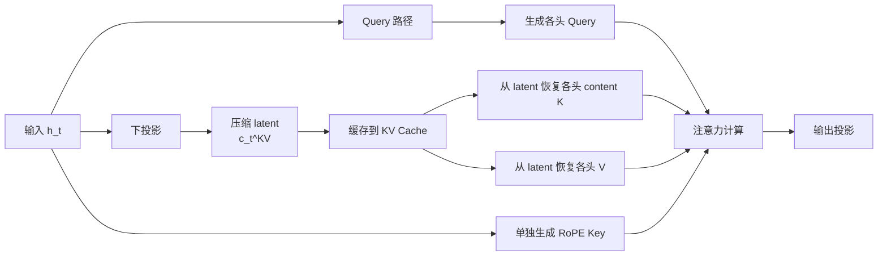
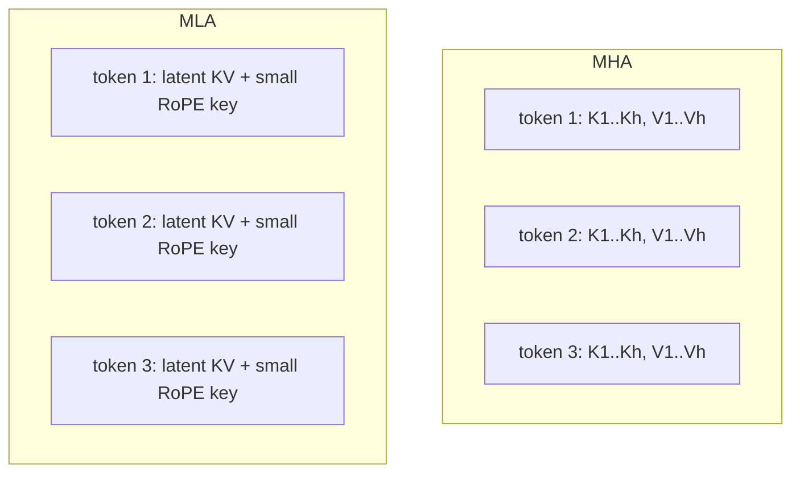
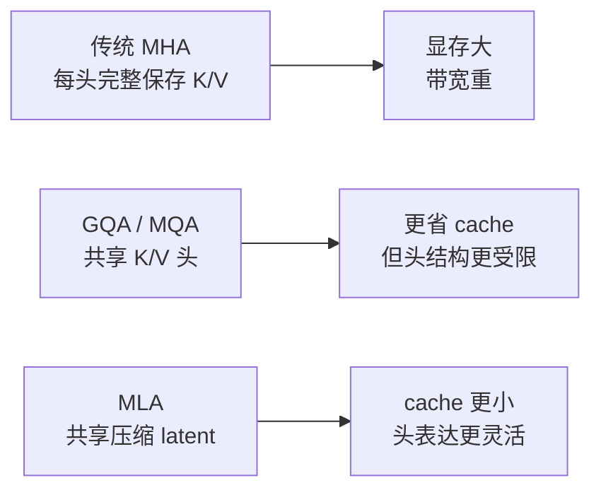

# Multi-head Latent Attention (MLA) 详解


## 1. 什么是 MLA

MLA 是 **Multi-head Latent Attention** 的缩写，中文通常可以理解为：

> **多头潜变量注意力**  
> 或 **多头潜空间注意力**

它由 DeepSeek 在 **DeepSeek-V2** 中系统提出，核心目标非常明确：

- 大幅缩小推理阶段的 KV Cache
- 降低 decode 阶段的访存带宽压力
- 尽量保留接近甚至优于传统 MHA 的表达能力

一句话概括：

> MLA 不直接缓存每个头完整的 `K/V`，而是先把它们压缩成一个更小的潜在表示，缓存这份“低秩 latent”，需要时再恢复出各头所需的 Key / Value 信息。

它最重要的应用价值在于：

- 长上下文推理
- 高并发在线服务
- 显存和带宽敏感的大模型部署

---

## 2. 为什么会有 MLA

先看标准多头注意力（MHA）在推理时最麻烦的地方。

### 2.1 MHA 的 KV Cache 会持续膨胀

自回归生成时，历史 token 的 `K` 和 `V` 要全部缓存下来。

如果：

- 序列长度为 `T`
- 头数为 `h`
- 每头维度为 `d`

那么缓存量近似是：

```text
K: T x h x d
V: T x h x d
```

也就是总量大致正比于：

```text
2 x T x h x d
```

上下文越长，这部分显存和访存越大。

### 2.2 decode 阶段常常是带宽瓶颈

生成新 token 时，模型每一步都要：

- 读出历史 K Cache
- 读出历史 V Cache
- 与当前 Query 计算注意力

这时瓶颈往往不是单纯算力，而是：

- 显存读取
- KV Cache 带宽
- cache footprint

所以大家关心的不是“只让模型更聪明”，还要让它：

> **在不明显掉点的前提下，缓存更小、读得更快。**

MLA 就是在这个背景下出现的。

---

## 3. MLA 的核心思想

MLA 的基本判断是：

> 对于注意力来说，完整的每头 `K/V` 表示可能存在明显冗余；与其逐 token 缓存一大堆完整头向量，不如把它们先压成一个更小的潜变量表示。

所以 MLA 做了两件关键事：

### 3.1 用低秩潜变量表示 K/V

不是直接缓存每个头的完整 `K/V`，而是把输入先映射到一个更小的 latent：

```text
c_t^KV
```

这个 latent 可以理解为：

- 一个压缩后的 token 记忆摘要
- 一个共享给所有头使用的低维内容表示

### 3.2 再从 latent 恢复各头所需的信息

真正做注意力时，每个头并不是直接拿 latent 本身当 Key / Value 用，而是：

- 从这份 latent 恢复出每头的 content key
- 从这份 latent 恢复出每头的 value

因此 MLA 的本质不是“完全取消多头结构”，而是：

> 让多个头共享一份压缩后的底层记忆，再通过不同的上投影恢复各头自己的视角。

---

## 4. 一张图看懂 MLA



这张图里最关键的点是：

- **缓存的是压缩 latent，不是完整每头 K/V**
- **各头的 K/V 是从 latent 恢复出来的**
- **RoPE 部分又被单独拆出来处理**

---

## 5. 从 MHA 到 MLA：到底变了什么

### 5.1 标准 MHA

在 MHA 中，输入 `x` 经过三套投影：

```text
Q = x W_Q
K = x W_K
V = x W_V
```

然后按头拆开，直接做：

```text
head_i = softmax(Q_i K_i^T / sqrt(d)) V_i
```

这种方式的特点是：

- 每个头的 `K/V` 都是显式完整存储
- KV Cache 最大
- 结构直接，但 decode 带宽压力大

### 5.2 MLA

MLA 把 `K/V` 路径改造为：

```text
x -> down projection -> c_t^KV
```

然后再通过不同矩阵恢复：

```text
K_content = up_k(c_t^KV)
V = up_v(c_t^KV)
```

所以它和 MHA 的关键区别可以总结成：

- MHA：缓存完整 `K/V`
- MLA：缓存压缩 latent，再按需恢复 `K/V`

---

## 6. MLA 的完整结构拆解

MLA 真正好理解的方法，不是直接背公式，而是拆成 4 条路径看。

### 6.1 Query content 路径

输入 token 表示 `h_t` 先经过一个低秩下投影：

```text
h_t -> c_t^Q
```

然后再上投影成多头 query 的 content 部分：

```text
c_t^Q -> q_t^C
```

这表示：

- Query 也可以先经过低秩瓶颈
- 但最终仍恢复成多头形式

### 6.2 Key / Value latent 路径

输入 `h_t` 再经过另一条低秩下投影，得到：

```text
h_t -> c_t^KV
```

这是 MLA 最核心的压缩表示。

然后从它恢复：

```text
c_t^KV -> k_t^C
c_t^KV -> v_t^C
```

也就是说：

- content key 来自 latent
- value 也来自 latent
- 这份 latent 会被缓存

### 6.3 RoPE 路径单独处理

MLA 一个很关键的设计是 **Decoupled RoPE（解耦 RoPE）**。

它的动机是：

- 如果把 RoPE 完全混进压缩 latent，再做缓存和恢复，工程上会很麻烦
- 某些矩阵吸收技巧也会受影响

所以 MLA 把位置相关部分拆出来，单独生成：

```text
q_t^R
k_t^R
```

再与 content 部分拼接。

### 6.4 拼接后再做注意力

最终每个头的 query / key 可以理解为：

```text
q_t,i = [q_t,i^C ; q_t,i^R]
k_t,i = [k_t,i^C ; k_t^R]
```

其中：

- `q^C / k^C` 是内容相关部分
- `q^R / k^R` 是位置相关部分

然后再做标准 attention。

---

## 7. 为什么 MLA 需要 Decoupled RoPE

这是 MLA 最容易“看懂字面但没真正理解”的地方。

### 7.1 RoPE 原本直接作用在 Q/K 上

在普通注意力里，RoPE 往往直接施加在每头的 `Q/K` 向量上。

这样做很自然，因为：

- `Q/K` 本来就是完整的每头表示

### 7.2 但 MLA 里 K 被压缩成 latent 了

如果把位置编码也塞进压缩 latent：

- latent 会同时承担内容和位置信息
- 恢复矩阵和缓存结构会更复杂
- 推理期的矩阵吸收优化也不方便

### 7.3 于是 MLA 选择“解耦”

它把 Key 分成两部分：

- content key：来自压缩 latent
- positional key：单独生成并带 RoPE

对应地，Query 也有：

- content query
- positional query

这种拆法的好处是：

- latent 更纯粹，主要承载内容信息
- KV Cache 可以继续维持紧凑
- RoPE 逻辑独立，工程上更顺

你可以把它理解成：

> **内容压缩走一条路，位置编码走另一条路，最后再拼到一起。**

---

## 8. 数学直觉版解释

为了便于理解，这里不完全照搬论文符号，而用简化版写法。

### 8.1 压缩 Query

```text
c_t^Q = W_DQ h_t
q_t^C = W_UQ c_t^Q
q_t^R = RoPE(W_QR c_t^Q)
```

### 8.2 压缩 Key / Value

```text
c_t^KV = W_DKV h_t
k_t^C = W_UK c_t^KV
v_t^C = W_UV c_t^KV
```

### 8.3 单独位置 Key

```text
k_t^R = RoPE(W_KR h_t)
```

### 8.4 拼成最终 Q / K

```text
q_t = [q_t^C ; q_t^R]
k_t = [k_t^C ; k_t^R]
v_t = v_t^C
```

然后注意力仍然是：

```text
softmax(q_t k_j^T / sqrt(d)) v_j
```

所以 MLA 改的不是注意力公式本身，而是：

- `Q/K/V` 的参数化方式
- KV Cache 的存储形式
- RoPE 的组织方式

---

## 9. 形状变化最关键

假设：

- batch 为 `B`
- 序列长度为 `T`
- 隐藏维度为 `E`
- 头数为 `h`
- 每头内容维度为 `d_c`
- 每头 RoPE 维度为 `d_r`
- KV latent 维度为 `r_kv`

那么：

### MHA 中

```text
K cache: [B, T, h, d]
V cache: [B, T, h, d]
```

### MLA 中

缓存的不是完整 `K/V`，而更接近于：

```text
latent KV cache: [B, T, r_kv]
rope key cache:  [B, T, d_r]
```

所以总体缓存会从“按头展开的大块张量”，变成“一个共享 latent + 一小份 RoPE key”。

这就是 MLA 能显著节省 KV Cache 的根本原因。

---

## 10. 一张图看缓存差异



MHA 是：

- 每个 token 保存完整多头 `K/V`

MLA 是：

- 每个 token 保存一份共享压缩 latent
- 再加一小部分位置相关 key

---

## 11. MLA 为什么能大幅提升推理效率

MLA 最主要受益的是 **decode 阶段**。

### 11.1 读 cache 更少

每生成一个新 token，都要访问全部历史缓存。

如果每个历史 token 都只保存：

- 一份较小 latent
- 一小份 RoPE key

那么总读取量显著降低。

### 11.2 带宽压力更低

解码常是 memory-bound。  
MLA 的价值就在于：

- 少搬数据
- 少占显存
- 提高吞吐

### 11.3 能把部分问题从“带宽瓶颈”推向“计算瓶颈”

这其实是好事，因为现代 GPU 往往更怕：

- 带宽吃满但算力闲着

MLA 通过减少 KV 读写，让硬件利用更均衡。

---

## 12. MLA 的推理优化：Absorption / 矩阵吸收

这是 MLA 很精华、也很工程化的一点。

### 12.1 朴素理解

如果每次解码都这么做：

- 从缓存拿出 `c_j^KV`
- 重新乘 `W_UK` 得到 `k_j^C`
- 重新乘 `W_UV` 得到 `v_j`

那虽然 cache 小了，但会多很多额外计算。

### 12.2 吸收技巧

由于矩阵乘法满足结合律，一部分恢复矩阵可以提前吸收到：

- Query 侧
- 输出投影侧

这样在推理时，就不一定需要显式把完整的 `K/V` 每次都恢复出来。

直觉上就是：

> 原本“先恢复 K/V，再做注意力”的步骤，可以部分重写成“直接在 latent 空间里完成等价计算”。

### 12.3 这为什么重要

因为 MLA 如果只有“压 cache”，没有“吸收优化”，那收益会被部分抵消。  
真正让它在工程上有竞争力的，是：

- cache 变小
- 计算顺序可重排
- 一部分恢复成本能被隐藏或提前合并

---

## 13. MLA 与 GQA、MQA、MHA 的关系

把几种主流方案放一起最容易看明白。

| 方案 | Query 头数 | Key/Value 结构 | KV Cache | 主要收益 | 主要代价 |
| --- | --- | --- | --- | --- | --- |
| MHA | 多头 | 每头独立 K/V | 最高 | 表达力强 | 显存和带宽最贵 |
| MQA | 多头 | 所有头共享一套 K/V | 最低 | 极致省 cache | 质量可能掉更多 |
| GQA | 多头 | 一组 Q 共享一组 K/V | 中低 | 解码更高效 | 仍偏 cache 优化 |
| MLA | 多头 | K/V 由共享 latent 恢复 | 很低 | 更强 cache 压缩 + 保持表达力 | 实现更复杂 |

最本质的区别是：

- MQA / GQA 是 **共享头**
- MLA 是 **共享压缩 latent**

所以 MLA 的表达方式更灵活。

---

## 14. 为什么 MLA 往往比 MQA / GQA 更有表达力

虽然 MLA 也在压缩，但它不像 MQA 那样把所有头都强行绑到同一套完整 K/V 上。

它做的是：

- 共享一个 latent 底座
- 再通过不同上投影恢复各头的 content key / value

这意味着：

- 多个头不是完全同质化
- 每个头仍可以有自己的投影视角
- 头间差异性比单纯共享 K/V 更容易保留

可以把它类比成：

- GQA：多个专家共用同一个资料柜
- MLA：多个专家共用同一份压缩数据库，但每个人有自己的检索器

所以在相同 cache 预算下，MLA 常常能给出更强的质量-效率折中。

---

## 15. MLA 与 CCA 的区别

它们都和“压缩注意力”有关，但重点并不一样。

### 15.1 MLA 更偏向压缩缓存

MLA 的主强项是：

- 缩小 KV Cache
- 优化 decode 带宽
- 利用 latent 恢复 K/V

### 15.2 CCA 更偏向压缩整个注意力计算路径

CCA 的关键是：

- 把完整注意力直接搬进压缩潜空间里做

因此它更强调：

- 减少训练 / prefill FLOPs

### 15.3 简单记忆

可以粗略记成：

- **MLA：压缩 KV，再恢复使用**
- **CCA：压缩后直接在小空间里算完整注意力**

---

## 16. 一个简化例子

假设有：

- `h = 32` 个头
- 每头 content 维度 `d_c = 64`
- 每头 RoPE 维度 `d_r = 16`
- latent 维度 `r_kv = 256`

### MHA 的缓存直觉

每个 token 需要缓存大致：

```text
K: 32 x 80
V: 32 x 64
```

总量非常大。

### MLA 的缓存直觉

每个 token 更接近缓存：

```text
latent KV: 256
rope key: 16
```

即：

- 不再为 32 个头各存一大份 K/V
- 而是存一份共享 latent 和一小份位置 key

这就是为什么 MLA 对长上下文特别友好。

---

## 17. 训练时和推理时 MLA 有什么不同

MLA 在训练和推理中都能使用，但它最耀眼的收益通常出现在推理阶段。

### 17.1 训练时

训练阶段的注意力仍要完整参与前后向计算，所以：

- MLA 会有额外投影结构
- 不一定像 decode 那样体现出巨大优势

### 17.2 推理时

推理，尤其是自回归 decode，最依赖：

- 历史 cache 读写
- cache 存储效率

而 MLA 正好对这两个问题动刀。

所以：

- 它不是“只为训练设计”
- 更像是“训练可用，但推理尤其值钱”

---

## 18. 为什么说 MLA 是通信换计算

从工程视角看，MLA 其实在做一个很经典的折中：

> 少存、少传、少读，但允许自己多做一些结构化变换。

也就是说，它愿意：

- 增加一些低秩变换和恢复逻辑

来换取：

- 更小的 cache
- 更低的带宽压力
- 更好的长上下文解码吞吐

这是一种非常典型的：

- **用更多算术，换更少通信**

在现代硬件上，这种折中常常是划算的。

---

## 19. MLA 的优点

### 19.1 KV Cache 显著更小

这是 MLA 最核心的卖点。

### 19.2 更适合长上下文生成

上下文越长，cache 压缩的价值越明显。

### 19.3 质量-效率折中通常优于简单共享头方案

它不是简单把头砍掉，而是通过 latent + 恢复保留表达能力。

### 19.4 对硬件友好

特别是在带宽敏感的推理场景里，收益很突出。

---

## 20. MLA 的代价

### 20.1 结构更复杂

相较 MHA / GQA：

- 多了低秩下投影
- 多了恢复矩阵
- 多了解耦 RoPE
- 多了推理吸收逻辑

### 20.2 实现不如 GQA 直接

GQA 往往很好并入现有框架；MLA 则更像一套新的 attention parameterization。

### 20.3 某些收益依赖良好 kernel 和推理实现

如果实现很粗糙，可能只看到：

- 结构变复杂
- 但速度没有完全释放

所以 MLA 的工程质量非常关键。

---

## 21. MLA 适合什么场景

MLA 特别适合：

- 长上下文聊天
- 大规模在线推理服务
- 显存受限的部署
- 高吞吐生成场景
- 对 decode 延迟和并发都敏感的系统

如果你的问题主要是：

- **KV Cache 太大**
- **decode 访存太重**
- **长上下文一上来就炸显存**

那 MLA 往往是很有吸引力的设计。

---

## 22. 一张图看它的设计哲学



MLA 想表达的工程思想很简单：

> 不一定非要缓存“显式的完整头向量”，缓存一个足够有信息量的 latent，也许更划算。

---

## 23. 常见误区

### 23.1 MLA 不是把头数减少了

MLA 通常仍保留多头结构。  
它压缩的是：

- K/V 的底层表示
- 而不是直接砍 Query 头数

### 23.2 MLA 不是稀疏注意力

它不限制 token 看哪些 token。  
它不同于：

- Sliding-Window Attention
- Block Sparse Attention

MLA 主要是在：

- 表示形式
- 缓存方式

上做优化。

### 23.3 MLA 不是完全在 latent 空间做注意力

这点和 CCA 不同。  
MLA 更接近：

- 用 latent 保存 / 参数化 K/V
- 通过恢复与吸收技巧完成高效注意力

### 23.4 MLA 的核心收益主要在推理

虽然训练也能使用，但最显著的工程价值通常出现在：

- decode
- 长上下文推理
- 带宽受限硬件

---

## 24. 一句话总结

MLA 的本质是：

> 用一个共享的低秩潜变量来压缩和缓存 Key / Value 信息，再通过头特定的上投影恢复注意力所需表示，并借助解耦 RoPE 与推理期矩阵吸收来显著降低 KV Cache 和 decode 带宽成本。

如果把它压成一句更短的话：

> **不是缓存完整 K/V，而是缓存一份更小、更共享的 latent 记忆。**

---

## 25. 速记版

- MHA：每头完整 K/V，表达强但 cache 最大
- GQA：多个 Query 头共享 K/V，省 cache 但仍偏头共享
- MLA：缓存压缩 latent，再恢复各头 K/V
- MLA 的关键组件：低秩 KV 联合压缩、解耦 RoPE、推理期矩阵吸收
- 最大收益通常出现在长上下文 decode
- 它本质上是在做“少通信、少缓存、保表达”的工程折中

---

## 26. 参考

- 论文：DeepSeek-V2: A Strong, Economical, and Efficient Mixture-of-Experts Language Model
- 相关分析：Hardware-Centric Analysis of DeepSeek's Multi-Head Latent Attention
