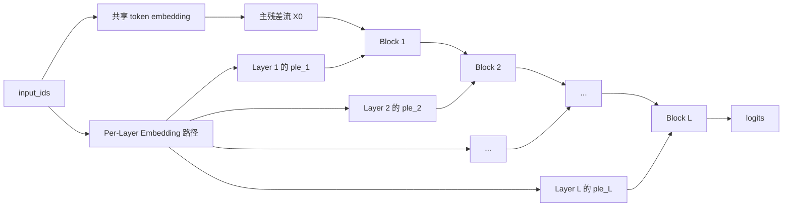

# Per-Layer Embeddings (PLE) 详解


## 1. 什么是 PLE

PLE 是 **Per-Layer Embeddings** 的缩写，中文通常可理解为：

> **逐层嵌入**
>  
> 更准确一点，是 **给每个 Transformer 层都提供一份额外的层专属 token 条件向量**

它和标准 Transformer 最大的不同在于：

- 标准做法里，token embedding 只在输入阶段查表一次
- PLE 里，模型除了主输入 embedding 之外，还会为 **每一层** 准备一份额外的小向量
- 这份小向量不是用来替代主残差流，而是作为 **layer-wise conditioning signal**

一句话概括：

> **普通 embedding 是“开局给一次提示”，而 PLE 是“每一层都再提醒一次这个 token 是谁，以及这一层该怎样看它”。**

---

## 2. 它到底在解决什么问题

先看普通 decoder-only Transformer 的信息流：

```text
input_ids
  -> token embedding
  -> L 层 Transformer block
  -> logits
```

在这个结构里，token 的原始身份信息主要是在最开始注入一次，后续各层都只能通过主残差流间接保留它。

这在大模型里往往还可以接受，但在更小、更强调端侧部署的模型里，会出现几个矛盾：

- **深层 token identity 容易被“上下文化”稀释**  
  层数变深之后，表示越来越像“上下文综合结果”，最初的 token 身份信号会逐步变淡。
- **如果想保住这些细粒度信息，通常要把主干做得更大**  
  比如更宽的 hidden size、更多层、更重的 attention/FFN。
- **但端侧模型最不想增加的恰恰是高 FLOPs 主干计算**

因此，PLE 的核心问题意识可以写成：

> **能不能不用大幅增加 attention/MLP 的计算量，就让深层依然持续获得细粒度 token 提示？**

PLE 的回答是：

> **可以，把一部分能力做进“每层专属 embedding 查表 + 轻量注入”这条旁路里。**

---

## 3. 一张图看懂核心思路



图里最关键的不是“多了一套 embedding”，而是：

- 主干残差流仍然存在，Transformer 本体没有被推翻
- 但每层额外收到一份 `ple_l`
- `ple_l` 是该层自己的辅助条件信号，而不是所有层共用同一份

所以 PLE 更像：

- 主干负责主要建模
- PLE 负责逐层“补信号”

---

## 4. 它和普通 token embedding 有什么本质区别

最容易混淆的一点是：

> **PLE 不是把输入 embedding 查很多次那么简单。**

两者的职责并不一样：

| 机制 | 进入模型的时机 | 共享方式 | 主要作用 |
| --- | --- | --- | --- |
| 普通 token embedding | 只在输入端一次 | 所有层共用同一初始表示 | 提供初始词元表示 |
| PLE | 每层一次 | 每层有自己的条件向量 | 持续补充 token 身份与层特定提示 |

如果用一个形象比喻：

- 普通 embedding：像入场时发给每个 token 一张通行证
- PLE：像每到一层检查站，再发一张“这一层该怎么解释你”的补充说明

---

## 5. 数学上怎么理解

### 5.1 标准 Transformer

标准做法里：

```text
X_0 = E[input_ids]
X_{l+1} = Block_l(X_l)
```

其中：

- `E` 是共享 embedding 表
- 后续所有层只看到不断演化的 `X_l`

### 5.2 加入 PLE 后

一个抽象写法是：

$$
X_0 = E[\text{input\_ids}]
$$

$$
P_l = \text{PLE}_l(\text{input\_ids}, X_0)
$$

$$
X_{l+1} = \text{Block}_l(X_l, P_l)
$$

这里的关键是：

- `P_l` 是第 `l` 层专属条件
- `P_l` 可以只依赖 token ID
- 也可以同时依赖主输入嵌入 `X_0`

### 5.3 一个更具体的拆分

在更常见的实现里，`P_l` 可以分成两部分：

$$
P_l = \frac{T_l + C_l}{\sqrt{2}}
$$

其中：

- `T_l`：**token-identity component**
- `C_l`：**context-aware component**

也就是说，PLE 并不只是说“这个 token 是谁”，还可以说“它在当前上下文入口里处于什么状态”。

---

## 6. Gemma 风格 PLE：最值得记住的实现范式

虽然 “Per-Layer Embeddings” 作为概念可以有不同实现，但现在大家最常讨论的，主要是 **Gemma 3n / Gemma 4 E2B / E4B** 里的版本。

它的结构可以理解为：

### 6.1 token-identity 分量

对 `input_ids` 做 per-layer embedding 查表：

```text
T = embed_tokens_per_layer(input_ids)
```

然后 reshape 成：

```text
[batch, seq, num_layers, ple_dim]
```

这意味着：

> 同一个 token，不只对应一份通用输入 embedding，而是对应一整组“给不同层使用的小 embedding”。

### 6.2 context-aware 分量

再从主输入 embedding `X_0` 走一条投影路径：

```text
C = projection(X_0)
```

再做缩放、reshape、归一化，得到每层一份上下文感知向量。

### 6.3 最终组合

Gemma 风格的组合可写成：

$$
P_l = \frac{T_l + C_l}{\sqrt{2}}
$$

这背后的直觉非常重要：

- `T_l` 负责“你是谁”
- `C_l` 负责“你在当前上下文入口里是什么状态”
- 二者融合后，第 `l` 层得到的是一个既保留 token identity、又带一点上下文感知的条件信号

---

## 7. PLE 是怎样进入每一层的

### 7.1 最简单的理解：辅助残差

最直观的抽象写法是：

```text
X_{l+1} = Block_l(X_l) + f_l(P_l)
```

也就是：

- 主干先正常做 attention + FFN
- 再把从 `P_l` 得到的附加量加回去

### 7.2 更贴近工程实现的理解：门控注入

很多现代实现不会直接生硬相加，而会做 **gated injection**：

```text
gate_l = act(W_g^(l) X_l)
delta_l = Proj_l(gate_l ⊙ P_l)
X_{l+1} = X_l + MainBlock_l(X_l) + delta_l
```

这里：

- `⊙` 表示逐元素乘
- `gate_l` 表示当前层自己决定“要用多少 PLE”
- `delta_l` 是经过投影/归一化后的可加残差

这能避免一个问题：

> 不是所有 token、所有层都同样依赖 PLE，门控可以让模型自己学会“什么时候强依赖，什么时候弱依赖”。

---

## 8. 一段伪代码看完整流程

```python
def build_per_layer_inputs(input_ids, inputs_embeds, num_layers, ple_dim):
    token_part = embed_tokens_per_layer(input_ids)
    token_part = token_part.view(batch, seq, num_layers, ple_dim)

    context_part = per_layer_projection(inputs_embeds)
    context_part = context_part * (hidden_size ** -0.5)
    context_part = context_part.view(batch, seq, num_layers, ple_dim)
    context_part = rmsnorm(context_part)

    per_layer_inputs = (token_part + context_part) * (2 ** -0.5)
    return per_layer_inputs


def forward(input_ids):
    hidden = embed_tokens(input_ids)
    ple = build_per_layer_inputs(input_ids, hidden, num_layers=L, ple_dim=P)

    for l in range(L):
        hidden = transformer_block[l](hidden)

        gate = silu(gate_proj[l](hidden))
        delta = out_proj[l](gate * ple[:, :, l, :])
        hidden = hidden + delta

    return lm_head(hidden)
```

这段伪代码可以帮助记住 4 件事：

1. PLE 先统一预计算出来
2. 其形状通常是“每层一份”
3. 每层只取自己的那一片 `ple[:, :, l, :]`
4. 注入方式通常是轻量残差，而不是重新跑一遍大 attention

---

## 9. 为什么 PLE 对小模型特别有价值

### 9.1 持续刷新 token identity

普通模型里，深层想记住词元身份，得靠主残差流自己“撑住”。  
PLE 相当于每层都在做一次：

```text
token identity refresh
```

这对小模型尤其重要，因为小模型：

- 容量更紧
- 更难在很多层之后还稳定保留细节
- 更依赖额外结构把“便宜但有用”的信号送回来

### 9.2 增加的是查表参数，不是同量级 FLOPs

PLE 最有工程味的地方在于：

- 它可以让参数量显著增加
- 但这些新增参数很多是 embedding table
- embedding table 的主要成本是 **静态存储和查表**
- 并不像 attention/FFN 那样对应巨量矩阵乘法

所以从系统角度看：

> **PLE 更像“多加一堆便宜参数”，而不是“多加一堆昂贵计算”。**

### 9.3 非常适合端侧部署

对手机、浏览器、边缘设备而言，很多时候瓶颈并不是“模型总参数绝对最少”，而是：

- 主要计算路径能不能足够轻
- 每个 token 的增量推理 FLOPs 能不能够低

PLE 正好符合这种诉求：

- 主干不用无限变大
- 额外能力通过每层查表旁路补上

---

## 10. 为什么会出现 “effective parameter” 这个说法

PLE 在 Gemma 3n / Gemma 4 E2B / E4B 里引出了一个非常重要的概念：

> **effective parameters**

这个词最容易误解。

### 10.1 它不等于总参数

如果模型里有大量 PLE embedding table，那么：

- 静态权重总量可能很大
- 模型加载内存也会更高

### 10.2 它更接近“主要计算规模”

但这些 PLE 表很多只是：

- 做 quick lookup
- 再经过轻量注入

并不像大矩阵乘那样在每个 token 上都贡献等价计算量。

因此，官方说某些 Gemma 小模型是 `E2B`、`E4B`，本质是在强调：

- **主干有效计算规模** 更接近 2B / 4B
- **总静态权重** 却可能明显更高

一句话记忆：

> **PLE 会把“模型能力”部分转移到大但便宜的查表参数里。**

---

## 11. PLE Caching 是什么

这是 PLE 最有代表性的系统技巧之一。

Gemma 3n 官方文档强调：

> PLE 数据可以单独生成，在模型运行内存之外缓存到快速存储，再在各层执行时逐层加回去。

这件事意味着：

- PLE 相关参数不一定非要常驻主模型运行内存
- 可以把它们看成一种 **可预生成、可旁路缓存的层条件数据**
- 这对低内存设备特别有价值

从系统视角看，PLE caching 相当于把参数分成两类：

| 参数类型 | 典型例子 | 更像什么成本 |
| --- | --- | --- |
| 主干计算参数 | attention / FFN / projection | 高 FLOPs + 持续参与前向 |
| PLE 参数 | per-layer embedding table | 大静态存储 + 快速查表 |

因此，PLE caching 背后的核心思想不是“让模型变小”，而是：

> **把一部分参数能力从“常驻计算核心”挪到“可缓存、可查表、可按层补给”的旁路里。**

---

## 12. 它和 Prompt / Prefix / Adapter 有什么关系

PLE 容易和几类“额外条件信号”方法混淆，把它们放一起看最清楚。

| 方法 | 条件信号放在哪里 | 是否对每层不同 | 主要服务对象 |
| --- | --- | --- | --- |
| 普通 token embedding | 输入端 | 否 | 所有 Transformer |
| Soft Prompt / Prompt Tuning | 输入前缀 | 通常否 | 任务适配 |
| Prefix / P-Tuning | attention 上下文前缀 | 可间接影响各层 | 任务适配 |
| Adapter | block 内部小模块 | 是 | 参数高效微调 |
| PLE | 每层输入旁路 | 是 | 架构级表示增强 |

最重要的区别是：

- Prompt / Prefix / Adapter 往往是 **微调或条件适配工具**
- PLE 更像是 **模型原生架构的一部分**

也就是说，PLE 不是“训练后外挂”，而是“从一开始就写进模型设计里”的层级条件通路。

---

## 13. 它和 MoE、CLA、MLA 分别不是一回事

这个仓库里有很多“为了效率做结构改造”的主题，PLE 和它们的优化维度不同。

| 方法 | 主要优化对象 | 核心思想 | 和 PLE 的关系 |
| --- | --- | --- | --- |
| MoE | FFN 计算 | 只激活少量专家 | 稀疏激活，不是逐层 embedding |
| CLA / Cross-Layer KV Sharing | KV Cache | 多层共享 K/V | 压缓存，不是补层输入 |
| MLA | KV 表示 | 用 latent 压缩 K/V | 压注意力缓存，不是层级条件注入 |
| PLE | 层输入表示 | 给每层补一份专属 token 条件 | 增强表示，偏输入侧 |

如果把它们放到统一视角：

- `PLE`：增强 **layer input conditioning**
- `CLA`：压缩 **depth-wise KV cache**
- `MLA`：压缩 **representation-wise KV cache**
- `MoE`：稀疏化 **FFN compute**

这也是为什么在现代模型里，经常会看到它们 **并存**，而不是互相替代。

相关主题：

- 见：[Cross-Layer-Attention.md](./Cross-Layer-Attention.md)
- 见：[Multi-head-Latent-Attention.md](./Multi-head-Latent-Attention.md)
- 见：[Mixture-of-Experts(MoE).md](./Mixture-of-Experts(MoE).md)

---

## 14. PLE 的优点

### 14.1 用较低计算代价增强小模型表达力

这是 PLE 最核心的优点。

### 14.2 让深层更容易保留 token 粒度信息

深层表示不必完全依赖最开始那一次 embedding。

### 14.3 对端侧“算力贵、查表相对便宜”的场景很友好

特别适合：

- 手机
- 浏览器
- 边缘设备
- 低功耗推理

### 14.4 允许“总参数大于有效计算规模”

这是它很有辨识度的架构哲学：

> **把参数加到对计算更温和的地方，而不是全部堆到主干里。**

---

## 15. PLE 的代价与局限

### 15.1 静态权重更大

虽然计算未必同量级上涨，但：

- embedding 表可能很大
- 模型加载内存会变高

### 15.2 推理框架实现更复杂

因为 decoder 往往不能只吃 `inputs_embeds`，还要考虑：

- `input_ids`
- `per_layer_inputs`
- 或上游预计算结果

### 15.3 多模态与分模块部署时更麻烦

如果前端和 decoder 分离，PLE 路径要么：

- 一起带上 token ID
- 要么提前算完再传给 decoder

### 15.4 并不是“通用万能增益按钮”

PLE 适合的是：

- 小模型
- 端侧
- 强调参数效率

但对已经非常宽、非常深、服务器部署优先的大模型，收益未必同样显著。

---

## 16. 一个具体例子：Gemma 4 E2B / E4B 为什么特别强调 PLE

Gemma 4 官方 overview 里提到：

- E2B / E4B 是 **effective parameter models**
- 这些小模型为了端侧参数效率引入了 **Per-Layer Embeddings**
- PLE 的 embedding tables 很大，但主要用于 **quick lookups**
- 所以总静态权重加载内存，会高于直觉上的 2B / 4B

这说明 Gemma 的设计不是简单“做小”：

```text
不是：把所有参数都砍掉
而是：把一部分能力挪到每层查表旁路
```

因此，Gemma 4 的小模型路线可以被概括为：

> **不是用更大的主干换能力，而是用 PLE 把能力做成逐层可注入的廉价条件信号。**

如果你想看更偏 Gemma 4 工程落地的说明，可继续阅读：

- 见：[Per-Layer Embeddings and Effective Size.md](../models/Gemma/Gemma4/Per-Layer%20Embeddings%20and%20Effective%20Size.md)
- 见：[Cross-Layer KV Sharing.md](../models/Gemma/Gemma4/Cross-Layer%20KV%20Sharing.md)

---

## 17. 一个总览公式

如果把 PLE 抽象成“主干 + 每层条件旁路”，可以记成下面这个框架：

$$
X_0 = E[\text{token}]
$$

$$
P_l = g_l(\text{token}) + h_l(X_0)
$$

$$
X_{l+1} = \text{TransformerBlock}_l(X_l) + \phi_l(X_l, P_l)
$$

其中：

- `E[token]` 是普通输入 embedding
- `g_l(token)` 是层专属 token identity 提示
- `h_l(X_0)` 是从主输入生成的上下文感知部分
- `\phi_l` 是当前层把 PLE 注入主残差流的方式

这个公式最值得记的结论是：

> **PLE 并不是替换 Transformer，而是给每个层再接一条“层级条件输入支路”。**

---

## 18. 一句话总结

如果只用一句话定义 PLE，可以这样说：

> **Per-Layer Embeddings（PLE）是一种让每个 Transformer 层都获得专属 token 条件向量的架构机制，它通过“每层补一份 embedding 信号”来增强小模型的表示能力，同时尽量把新增成本放在查表而不是高 FLOPs 主干计算上。**

再压缩成更短的一句：

> **普通 embedding 只在开头说一次，PLE 会在每层再说一遍。**

---

## 19. 速记版

- PLE = Per-Layer Embeddings，逐层嵌入
- 核心不是“多查几次 embedding”，而是“每层都有自己的条件向量”
- 它解决的是小模型深层 token identity 易被稀释的问题
- 常见实现会把 PLE 分成 token-identity 分量和 context-aware 分量
- PLE 常通过轻量残差或门控注入进入每个 block
- 它增加的很多是查表型参数，而不是同量级 attention/FFN FLOPs
- Gemma 3n / Gemma 4 E2B/E4B 是 PLE 的代表性工程落地
- PLE caching 说明这类参数甚至可以旁路缓存，而不必始终常驻主运行内存

---

## 20. 参考资料

1. Google AI for Developers. **Gemma 3n model overview**.  
   链接：<https://ai.google.dev/gemma/docs/gemma-3n>
2. Google AI for Developers. **Gemma 4 model overview**.  
   链接：<https://ai.google.dev/gemma/docs/core>
3. Google AI for Developers. **Gemma 4 model card**.  
   链接：<https://ai.google.dev/gemma/docs/core/model_card_4>
4. Hugging Face. **Gemma 4 model documentation**.  
   链接：<https://huggingface.co/docs/transformers/main/en/model_doc/gemma4>
5. Hugging Face Transformers Issue. **Gemma4: PLE implementation is underdocumented and config is misleading**.  
   链接：<https://github.com/huggingface/transformers/issues/45206>
6. Microsoft ONNX Runtime GenAI Issue. **Gemma4 Per-Layer Embedding: Architecture Analysis & Alternatives**.  
   链接：<https://github.com/microsoft/onnxruntime-genai/issues/2149>
