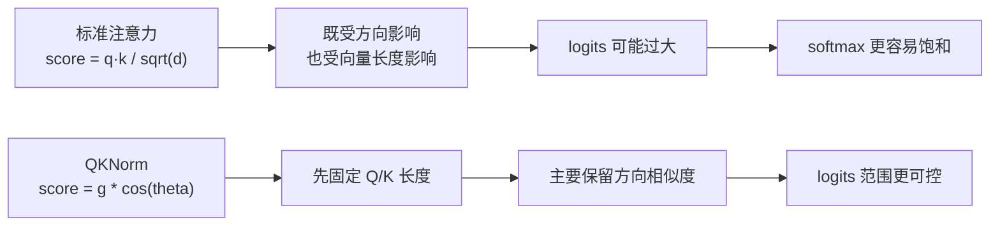
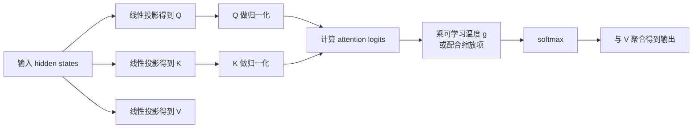
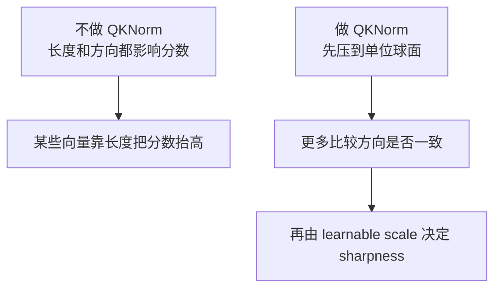

# QKNorm 详解


## 1. 什么是 QKNorm

QKNorm 是 **Query-Key Normalization** 的缩写，中文可以叫：

> **查询-键归一化**

它是一种加在注意力内部的小改动，目标非常明确：

- 控制 `QK^T` 的数值范围
- 避免 softmax 因 logits 过大而过早饱和
- 让注意力训练更稳定
- 在不大改 Transformer 主体结构的前提下改善优化行为

如果用一句话概括它：

> **先把 `Q` 和 `K` 的长度收敛到更可控的范围，再去算注意力分数。**

很多人第一次看到它，会觉得它只是“又加了一层 norm”。  
但真正关键的不是“又归一化了一次”，而是：

> **它归一化的位置，恰好在注意力分数产生之前。**

也就是说，QKNorm 不是在整个 block 外面做预归一化或后归一化，而是直接作用在决定注意力 logits 的 `Q` 和 `K` 上。

---

## 2. 它要解决什么问题

标准缩放点积注意力是：

```text
Attention(Q, K, V) = softmax(QK^T / sqrt(d_h)) V
```

其中：

- `d_h` 是单个 attention head 的维度
- `QK^T / sqrt(d_h)` 是 softmax 的输入 logits

这条公式默认有一个隐含假设：

> `q` 和 `k` 的范数规模大致处于“合理区间”。

但训练中并不总是这样。

如果 `q` 和 `k` 的向量长度变大，即使它们的方向关系没有明显变化，点积也会被快速放大：

```text
q^T k = ||q|| ||k|| cos(theta)
```

于是注意力分数不仅由“方向相似度”决定，也被“向量长度”强烈影响。

这会带来几个典型问题：

- logits 过大，softmax 变得非常尖锐
- 梯度集中在极少数位置，训练不稳定
- 不同 head、不同层之间的分数尺度差异变大
- 模型可能过早进入“几乎 one-hot 的注意力”

### 2.1 一眼看懂 softmax 饱和

假设一个 head 的维度是 `64`，因此：

```text
sqrt(64) = 8
```

如果某个 query 和 key 的夹角余弦是 `0.8`：

### 情况 A：不做 QKNorm

```text
||q|| = 20
||k|| = 20

q^T k = 20 * 20 * 0.8 = 320
logit = 320 / 8 = 40
```

`40` 这样的 logit 对 softmax 来说已经非常大了，容易直接饱和。

### 情况 B：做 QKNorm

若先把 `q` 和 `k` 归一到单位长度，再乘一个可学习温度 `g`：

```text
logit = g * 0.8
```

如果 `g = 10`，那么：

```text
logit = 8
```

它仍然可以表达“非常相关”，但数值受控得多。

所以 QKNorm 的核心，不是让注意力变弱，而是：

> **把注意力的强弱更多交给“方向关系”和“可学习温度”控制，而不是交给失控的向量范数。**

---

## 3. 原始论文版 QKNorm 到底做了什么

QKNorm 最经典的定义来自 2020 年论文 **Query-Key Normalization for Transformers**。

它对标准 attention 做了两步改造：

### 3.1 先对 `Q` 和 `K` 做 `L2` 归一化

对每个 query / key 向量：

```text
q_hat = q / ||q||_2
k_hat = k / ||k||_2
```

这样做之后：

- `q_hat` 的长度固定为 `1`
- `k_hat` 的长度固定为 `1`

于是它们的点积就退化成了：

```text
q_hat^T k_hat = cos(theta)
```

也就是纯粹的方向相似度。

### 3.2 用可学习参数替代 `1 / sqrt(d_h)`

标准 attention 里是：

```text
q^T k / sqrt(d_h)
```

QKNorm 改成：

```text
g * q_hat^T k_hat
```

其中 `g` 是可学习的缩放参数，常被理解为：

- 可学习温度
- learnable scale
- per-head temperature

因此原始 QKNorm 可以写成：

```text
Attention(Q, K, V) = softmax(g * normalize(Q) normalize(K)^T) V
```

这里的 `normalize` 指的是按 head 维度做 `L2` norm。

---

## 4. 它本质上接近“带温度的余弦注意力”

这是理解 QKNorm 最重要的一步。

标准 attention 的分数是：

```text
score(q, k) = q^T k / sqrt(d_h)
```

把点积展开后：

```text
score(q, k) = ||q|| ||k|| cos(theta) / sqrt(d_h)
```

你会发现它同时依赖三部分：

- `||q||`
- `||k||`
- `cos(theta)`

而 QKNorm 变成：

```text
score(q, k) = g * cos(theta)
```

于是分数主要只看：

- 方向是否一致
- 学到的温度 `g`

### 4.1 一张图看懂区别



如果你喜欢一句话记忆：

> **QKNorm = 把 dot-product attention 往 cosine attention 推近一步，再给它一个可学习温度。**

---

## 5. 为什么这会让训练更稳

QKNorm 的稳定性收益，主要来自下面几个方面。

### 5.1 限制了 logits 的来源

当 `q` 和 `k` 都被归一后：

```text
q_hat^T k_hat in [-1, 1]
```

再乘 `g` 后，logits 会落在：

```text
[-g, g]
```

虽然 `g` 本身是可学习的，但至少“尺度控制权”集中到了一个更容易管理的参数上，而不是隐藏在大量投影输出的范数波动里。

### 5.2 减少 softmax 过早尖锐化

softmax 一旦过早变得极尖锐，训练时常见问题是：

- 有效梯度只来自少数位置
- attention map 太快塌缩
- 优化对初始化和学习率更敏感

QKNorm 让分数分布更平滑，模型可以逐步学到“应该变尖锐到什么程度”。

### 5.3 不同 head 的尺度更容易对齐

不同 attention head 本来就会学到不同模式。  
如果再叠加很大的范数差异，某些 head 可能会因为数值尺度过大而“抢戏”。

QKNorm 会把 head 之间的数值尺度拉到更接近的起点。

### 5.4 对低资源、小数据训练更友好

原始论文的重点应用场景是 **低资源机器翻译**。  
在这类任务里：

- 数据更少
- 训练更容易不稳定
- 对初始化和优化细节更敏感

QKNorm 在这里更容易体现收益。

---

## 6. 一张流程图看它插在哪里



最重要的是：

- 它改的是 `Q/K -> logits` 这一段
- 它不改 attention 的整体拓扑
- 它也不减少时间复杂度

所以 QKNorm 是一个：

> **稳定性优化**，不是 **复杂度优化**。

---

## 7. 和标准注意力逐项对比

| 维度 | 标准缩放点积注意力 | QKNorm |
| --- | --- | --- |
| 分数形式 | `q^T k / sqrt(d_h)` | `g * normalize(q)^T normalize(k)` |
| 是否受向量长度强影响 | 是 | 明显减弱 |
| 本质相似度 | 点积 | 接近余弦相似度 |
| 缩放方式 | 固定 `1 / sqrt(d_h)` | 可学习温度 `g` |
| 主要收益 | 简单、经典、通用 | 稳定 logits，减轻 softmax 饱和 |
| 主要目标 | 通用表达能力 | 训练稳定性与数值控制 |
| 复杂度 | `O(T^2)` | `O(T^2)`，几乎不变 |

---

## 8. 一个更直观的几何解释

如果不做归一化，那么 `q` 和 `k` 是平面或高维空间里的箭头：

- 箭头方向表示“看什么”
- 箭头长度也会进入点积

因此两个向量即使方向差不多，只要长度很大，点积也可能极大。

QKNorm 相当于先把所有箭头压到单位球面上：

- 长度统一
- 只比较方向夹角
- 再用一个可学习温度 `g` 决定“判定到底要多尖锐”



这个视角下，QKNorm 的含义很清楚：

> **先分离“相似度”与“温度”，再让模型自己学温度。**

---

## 9. 论文里报告了什么收益

原始论文的任务背景是 **低资源双语翻译**。

论文摘要给出的核心结论是：

- 在 5 个低资源双语翻译基准上
- 平均提升约 `0.928 BLEU`

原论文最强调的不是“它让模型架构更先进”，而是：

> **它能让 attention 的 softmax 更不容易因为任意尺度放大而饱和，同时不牺牲表达能力。**

这个表述很重要，因为它点出了 QKNorm 的真正价值：

- 不是削弱模型
- 不是把注意力做平
- 而是让尖锐程度更可控

---

## 10. 现代 LLM 里大家说的 QK Norm，常常不是同一个东西

这里非常容易混淆。

今天很多大模型讨论里的 **QK Norm / QK-Norm**，通常泛指：

> **在 attention 内部，对 query 和 key 再额外做一次归一化，以稳定训练。**

但它未必严格等同于 2020 论文中的原始 QKNorm。

### 10.1 原始论文版

更严格的形式是：

- `L2` 归一化 `Q`
- `L2` 归一化 `K`
- 用可学习参数 `g` 替代固定的 `1 / sqrt(d_h)`

### 10.2 现代 LLM 常见变体

很多现代实现更常见的是：

- 对 `Q` 做 `RMSNorm`
- 对 `K` 做 `RMSNorm`
- 仍保留标准 attention 的其他框架
- 常与 `RoPE`、`GQA`、`SwiGLU`、`RMSNorm` 主干一起使用

因此现在社区里说“模型用了 QK Norm”，经常指的是：

> **在 Q/K 投影后、attention score 之前，再加一个专门的 q_norm / k_norm。**

### 10.3 为什么会演化成 RMSNorm 版本

原因很现实：

- RMSNorm 实现简单
- 与现代 LLM 的 pre-norm 风格兼容
- 工程内核更容易复用
- 不一定要严格改写成“纯余弦注意力”

所以你可以把现代版本理解成：

> **沿着 QKNorm 的思路，把 Q/K 的尺度先稳定住。**

但为了严谨，最好区分：

- **严格论文定义的 QKNorm**
- **现代 LLM 语境中的 QK Norm 变体**

---

## 11. 它和 RMSNorm、LayerNorm、Pre-Norm 有什么不同

很多人会把这些 norm 混在一起，实际上它们作用位置完全不同。

| 方法 | 作用位置 | 主要作用对象 | 主要目的 |
| --- | --- | --- | --- |
| LayerNorm / RMSNorm（block 外） | attention/FFN 子层前后 | 整个隐藏状态 `x` | 稳定残差流与整体训练 |
| QKNorm | attention 内部 | `Q` 和 `K` | 稳定 attention logits |
| Value norm / QKV norm | attention 内部 | `Q/K/V` | 更激进地稳定 attention 路径 |

最容易记的区别是：

- `Pre-Norm` 管的是整个 block 输入
- `QKNorm` 管的是 attention 分数生成器

所以它不是普通 norm 的替代品，更像是：

> **在注意力内部又加了一层“局部保险”。**

---

## 12. 它和 RoPE 是什么关系

QKNorm 和 RoPE 很容易一起出现，因为它们都直接作用在 `Q/K` 上。

### 12.1 二者解决的问题不同

- `RoPE`：解决位置信息怎么进入注意力
- `QKNorm`：解决注意力分数的数值尺度怎么更稳

一个管“位置”，一个管“尺度稳定”。

### 12.2 现代实现里常见顺序

很多现代实现会采用下面流程：

```text
x -> q_proj, k_proj, v_proj
q -> q_norm
k -> k_norm
q, k -> apply_rope
attention(q, k, v)
```

也就是说：

- 先把 `Q/K` 尺度管住
- 再注入 RoPE 的位置信息
- 最后再计算 attention score

### 12.3 为什么这两个组合很自然

因为 RoPE 改的是 `Q/K` 的方向结构，QKNorm 管的是 `Q/K` 的长度尺度。  
这两者并不冲突，反而常常互补。

可以粗略记成：

- RoPE：**把向量转起来**
- QKNorm：**把向量长度管起来**

---

## 13. 伪代码最容易看懂

### 13.1 原始论文风格伪代码

```python
import torch
import torch.nn.functional as F


def l2_normalize(x, eps=1e-6):
    return x / (x.norm(dim=-1, keepdim=True) + eps)


q = q_proj(hidden_states)   # [..., head_dim]
k = k_proj(hidden_states)
v = v_proj(hidden_states)

q = l2_normalize(q)
k = l2_normalize(k)

scores = temperature * (q @ k.transpose(-1, -2))
attn = torch.softmax(scores, dim=-1)
out = attn @ v
```

这版最像论文定义：

- `Q/K` 直接 `L2` 归一
- 去掉固定 `1 / sqrt(d_h)` 缩放
- 改用可学习 `temperature`

### 13.2 现代 LLM 常见伪代码

```python
q = q_proj(x)
k = k_proj(x)
v = v_proj(x)

q = q_norm(q)   # 常见是 RMSNorm
k = k_norm(k)

q = apply_rope(q, cos, sin)
k = apply_rope(k, cos, sin)

scores = (q @ k.transpose(-1, -2)) / math.sqrt(head_dim)
attn = softmax(scores, dim=-1)
out = attn @ v
```

这里和原始 QKNorm 的差别是：

- 归一化方法可能不是严格 `L2 norm`
- 缩放项可能仍保留 `1 / sqrt(d_h)`
- 更像“QK 稳定化版本的 attention”

---

## 14. 为什么它通常不被看成“效率优化”

QKNorm 不会改变：

- 注意力的连接模式
- KV Cache 大小
- `O(T^2)` 的复杂度

所以它和下面这些不是一类东西：

- `GQA`
- `MQA`
- `MLA`
- `Sliding-Window Attention`
- `FlashAttention`

这些方法主要关心：

- 显存
- 带宽
- 长上下文
- kernel IO

而 QKNorm 主要关心：

- logits 尺度
- softmax 饱和
- 训练稳定性

所以一句话区分：

> **QKNorm 优化的是“数值行为”，不是“渐近复杂度”。**

---

## 15. 它的优点

### 15.1 改动小

不需要重写整个 Transformer block。  
通常只是在 attention 内部加 `q_norm` / `k_norm`。

### 15.2 直接命中问题源头

注意力不稳定，很多时候就出在 logits 的尺度失控。  
QKNorm 直接作用于 `Q/K`，比在外围做一些间接修补更直接。

### 15.3 常对训练更友好

尤其在：

- 深层模型
- 小数据
- 大 batch
- 高学习率
- 长训练过程

这些更敏感的配置里，往往更容易体现稳定性收益。

### 15.4 与现代组件兼容

它通常能和下面这些一起工作：

- `RoPE`
- `RMSNorm`
- `GQA`
- `SwiGLU`
- `KV Cache`
- `FlashAttention`

---

## 16. 它的代价和局限

### 16.1 不是免费午餐

虽然改动小，但也不是“永远无脑加上就更好”。

可能的代价包括：

- 多一点计算
- 多一点参数（若使用 learnable scale）
- 可能改变注意力尖锐度分布

### 16.2 并不是所有任务都显著受益

在某些任务或训练配方下：

- baseline 已经足够稳定
- `Q/K` 范数本身没有形成明显问题

那它带来的提升可能不大。

### 16.3 可能和长上下文行为有交互

一些工程经验会提到：

- QK 归一化虽然更稳
- 但也可能影响模型在超长上下文中的注意力分布形状

这不是说它一定不好，而是：

> **它改善的是一个维度，可能同时影响另一个维度，需要结合具体训练目标看。**

### 16.4 “QKNorm”这个名字今天有歧义

这是实践中最需要小心的一点。

如果文档或代码里写：

```text
use_qk_norm = true
```

它未必代表：

- 严格使用论文版 `L2`-QKNorm

很多时候它只是表示：

- 对 `Q/K` 做某种额外归一化

所以读实现时一定要看清：

- 是 `L2 norm`
- 还是 `RMSNorm`
- 是否保留 `1 / sqrt(d_h)`
- 是否另有 learnable temperature

---

## 17. 它和几种相关概念怎么区分

| 概念 | 主要做什么 | 改哪里 | 和 QKNorm 的关系 |
| --- | --- | --- | --- |
| RoPE | 注入位置 | `Q/K` 表示 | 常与 QKNorm 配合 |
| RMSNorm | 稳定隐藏状态或局部表示 | block 外或 attention 内 | 现代 QK Norm 常直接用它实现 |
| Cosine Attention | 用方向相似度代替原始点积 | attention score | 原始 QKNorm 很接近它 |
| Temperature Scaling | 控制 softmax 尖锐度 | logits | QKNorm 中的 `g` 就像 learnable temperature |
| GQA | 压缩 K/V 头数 | attention 结构 | 目标不同，不冲突 |
| FlashAttention | 优化 attention IO | kernel 实现 | 目标不同，不冲突 |

---

## 18. 一个简单的代码阅读指南

如果你在现代 LLM 代码里想判断“有没有 QK Norm”，最常见的信号是：

### 18.1 看 attention 初始化

你可能会看到：

```python
self.q_norm = RMSNorm(head_dim)
self.k_norm = RMSNorm(head_dim)
```

或：

```python
self.q_norm = nn.Identity()
self.k_norm = nn.Identity()
```

### 18.2 看 forward 顺序

典型结构是：

```python
q = q_proj(x)
k = k_proj(x)
v = v_proj(x)

q = self.q_norm(q)
k = self.k_norm(k)

q = apply_rope(q, ...)
k = apply_rope(k, ...)

scores = q @ k.transpose(-1, -2)
```

只要你看到：

- `q_proj/k_proj` 之后
- `attention score` 之前
- 有额外 `q_norm/k_norm`

那大概率就是现代语境下的 QK Norm。

---

## 19. 一个适合记忆的类比

可以把注意力分数想成“面试评分”。

### 标准注意力

不仅看候选人与岗位方向是否匹配，还看候选人“声音有多大”：

- 方向匹配度 = `cos(theta)`
- 声音大小 = 向量范数

于是有人即使没那么匹配，只是“声音大”，也可能得分很高。

### QKNorm

先把大家音量调到同一档，再比较内容匹配度，最后让面试官自己决定要不要打分更严格：

- 统一音量 = 归一化 `Q/K`
- 内容匹配 = 方向相似度
- 严格程度 = learnable temperature

这个类比虽然不数学，但很适合记住它的本质。

---

## 20. 常见误区

### 20.1 QKNorm 不是普通的 Pre-Norm

它不是在整个 block 输入前加 norm，而是在 attention 内部处理 `Q/K`。

### 20.2 QKNorm 不是效率优化

它不会自动减少：

- FLOPs 数量级
- KV Cache
- 长上下文显存

### 20.3 QKNorm 不是“把分数变小”这么简单

它真正做的是：

- 分离方向与长度
- 控制 logits 来源
- 学一个更合适的温度

### 20.4 现代 QK Norm 不一定等于原始论文版

这一点最容易被忽略。

---

## 21. 什么时候值得考虑它

QKNorm 或 QK Norm 变体通常更值得考虑于：

- 训练不够稳定
- 注意力分数过尖
- loss 会偶发尖峰
- 想在不大改架构的情况下增强稳定性
- 使用现代 decoder-only LLM 配方时

如果你的主要问题是：

- 推理太慢
- 显存爆炸
- 长上下文成本太高

那优先看的往往不是 QKNorm，而是：

- `GQA / MQA`
- `FlashAttention`
- `Paged Attention`
- `Sliding-Window Attention`

---

## 22. 一张表总结“论文版”和“现代版”

| 版本 | 归一化方式 | 缩放方式 | 目标 | 典型语境 |
| --- | --- | --- | --- | --- |
| 原始 QKNorm（2020） | `L2` norm on `Q/K` | learnable `g` 替代 `1 / sqrt(d_h)` | 防止 softmax 饱和 | 低资源机器翻译 |
| 现代 QK Norm 变体 | 常见为 `RMSNorm(Q)` 与 `RMSNorm(K)` | 常保留原缩放，也可能附加温度 | 稳定 LLM 训练 | 现代 decoder-only LLM |

这张表可以帮助你避免两个常见错误：

- 看到“QK Norm”就以为一定是论文原版
- 看到现代实现用了 RMSNorm 就以为和 QKNorm 毫无关系

更准确的理解应该是：

> **现代 QK Norm 往往是对原始 QKNorm 思路的工程化延伸。**

---

## 23. 一句话总结

QKNorm 的本质是：

> **在注意力分数计算前先约束 Query 和 Key 的尺度，让注意力更像“带可学习温度的方向相似度匹配”，从而降低 softmax 饱和风险并改善训练稳定性。**

如果压缩成更短的一句：

> **先把 `Q/K` 的长度管住，再让模型决定注意力该有多尖。**

---

## 24. 速记版

- QKNorm = Query-Key Normalization
- 它作用在 attention 内部，不是普通 block norm
- 原始论文版做法是：`L2` 归一 `Q/K`，再乘 learnable scale
- 它让注意力从“点积 + 固定缩放”更接近“余弦相似度 + 可学习温度”
- 主要价值是稳定 logits，减少 softmax 过早饱和
- 它不改变注意力复杂度，也不是推理加速技巧
- 现代 LLM 里的 QK Norm 常是 `Q/K` 上额外的 `RMSNorm` 变体
- 它经常和 `RoPE` 一起出现，但两者解决的问题不同

---

## 25. 参考资料

- Henry et al., *Query-Key Normalization for Transformers*, Findings of EMNLP 2020
- ACL Anthology: https://aclanthology.org/2020.findings-emnlp.379/
- arXiv: https://arxiv.org/abs/2010.04245
- 官方复现仓库: https://github.com/CyndxAI/QKNorm
- Sebastian Raschka, *QK-Norm*: https://sebastianraschka.com/llms-from-scratch/ch04/12_qk_norm/
