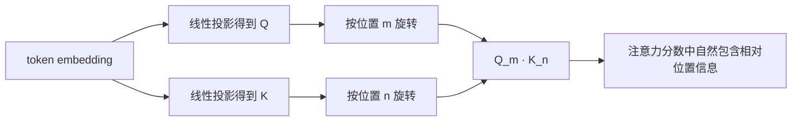
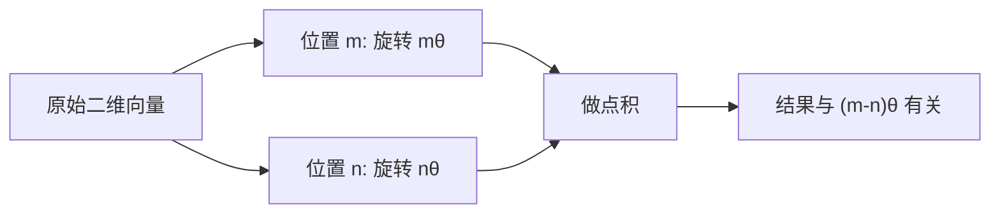
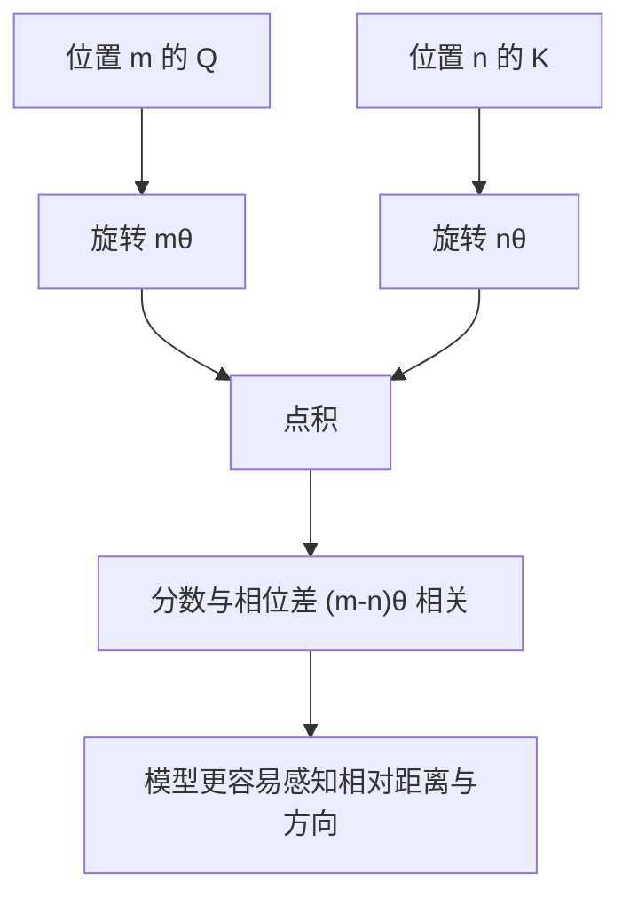
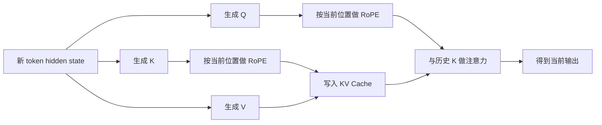

# RoPE 详解


## 1. 什么是 RoPE

RoPE 是 **Rotary Position Embedding** 的缩写，中文通常叫：

> **旋转位置编码**

它是 Transformer 中一种非常重要的位置编码方法，核心思想可以压缩成一句话：

> **不给 token 直接加一个位置向量，而是让 Query / Key 在不同二维子空间里按照“位置相关角度”做旋转。**

这件事听起来有点抽象，但它解决的问题非常具体：

- 让注意力知道 token 的先后顺序
- 让位置关系以更自然的方式进入 `QK^T`
- 让模型不仅感知“绝对位置”，还更容易感知“相对距离”
- 在长上下文场景下，通常比传统绝对位置编码更稳

RoPE 现在几乎已经成了大语言模型中的“默认选项”之一，很多主流 LLM 都在使用它或它的变体。

---

## 2. 为什么 Transformer 需要位置编码

Self-Attention 本身对输入顺序并不敏感。

如果只看这条公式：

```text
Attention(Q, K, V) = softmax(QK^T / sqrt(d)) V
```

那么它只关心 token 向量之间的相似性，却不知道：

- 谁在前
- 谁在后
- 两个 token 相隔多远

这就会带来一个问题：

```text
"猫 追 狗"
"狗 追 猫"
```

如果没有位置信息，模型只看到这三个 token 的集合，很难分辨语义顺序。

所以位置编码的目标很明确：

> **把“序列顺序”注入到注意力里。**

---

## 3. 传统位置编码有什么局限

在 RoPE 之前，比较常见的位置编码方式有两类。

### 3.1 可学习绝对位置编码

做法是给每个位置单独分配一个向量：

```text
x_t -> x_t + p_t
```

优点是直接、易学。

缺点也明显：

- 位置是离散表查出来的
- 训练长度之外的位置没有天然定义
- 长度外推能力通常较弱

### 3.2 正弦余弦绝对位置编码

Transformer 论文中的经典做法是：

```text
PE(pos, 2i)   = sin(pos / 10000^(2i/d))
PE(pos, 2i+1) = cos(pos / 10000^(2i/d))
```

它比 learnable embedding 更适合外推，但仍然有一个问题：

> 它主要是“加到输入上”的绝对位置信号，而不是直接以最自然的方式进入 attention score。

RoPE 的改进点就在这里：

> **把位置作用到 `Q` 和 `K` 上，让位置关系直接体现在点积里。**

---

## 4. RoPE 的核心直觉

RoPE 最值得记住的直觉不是公式，而是下面这句话：

> **不同位置的向量会被旋转不同角度；两个位置做点积时，结果自然带上了相对角度差。**

也就是说：

- 位置 `m` 的 Query 旋转角度是 `m * theta`
- 位置 `n` 的 Key 旋转角度是 `n * theta`
- 两者点积后，留下来的主要是 `m - n` 这个相对差

这就是为什么大家常说：

> **RoPE 是一种“把相对位置信息隐式写进注意力”的方法。**

---

## 5. 一张图先看懂它在做什么



和传统“把位置向量加到输入上”相比，RoPE 更像是：

- 输入内容先生成 `Q/K`
- 再对 `Q/K` 做位置相关变换
- 位置关系直接进入相似度计算

---

## 6. 二维平面直觉最关键

RoPE 的本质是把高维向量拆成很多个二维小块，然后每个二维小块单独旋转。

假设某个二维子向量是：

```text
[x1, x2]
```

对位置 `m`，RoPE 会把它旋转角度 `m * theta`：

```text
[x1', x2'] =
[ x1 cos(m theta) - x2 sin(m theta),
  x1 sin(m theta) + x2 cos(m theta) ]
```

这就是标准二维旋转。

### 6.1 几何上怎么理解

你可以把一个二维子向量想成平面上的箭头：

- 不同位置，对应不同旋转角度
- 位置越靠后，旋转得越多
- 不同维度对使用不同频率的 `theta`



这就是 RoPE 的核心几何直觉。

---

## 7. 为什么要“按二维配对”旋转

因为二维旋转矩阵非常干净：

```text
[ cos a  -sin a ]
[ sin a   cos a ]
```

它有两个特别好的性质：

- 保持范数不变
- 两个旋转向量做内积时，结果只与角度差有关

RoPE 正是利用这点，把高维向量拆成：

```text
(x1, x2), (x3, x4), (x5, x6), ...
```

然后每一对分别旋转。

所以如果 `head_dim = d`，那么通常会有：

```text
d / 2 个二维旋转子空间
```

---

## 8. 数学形式到底是什么

设某个头的维度为 `d`，通常要求 `d` 为偶数。

把 Query 向量写成：

```text
q = [q0, q1, q2, q3, ..., q_{d-2}, q_{d-1}]
```

RoPE 会把它按二维分组：

```text
(q0, q1), (q2, q3), ..., (q_{d-2}, q_{d-1})
```

对于第 `i` 个二维组，使用角频率：

```text
theta_i = 10000^(-2i/d)
```

位置 `m` 上的旋转矩阵是：

```text
R(m, theta_i) =
[ cos(m theta_i)  -sin(m theta_i) ]
[ sin(m theta_i)   cos(m theta_i) ]
```

于是 Query / Key 的旋转可以写成：

```text
q_m^(i) = R(m, theta_i) q^(i)
k_n^(i) = R(n, theta_i) k^(i)
```

最后把所有二维组拼回去，就得到整条向量的旋转结果。

---

## 9. 最关键的性质：点积里出现相对位置

RoPE 真正厉害的地方，不是“能旋转”，而是：

> **旋转后的 Query 和 Key 做点积时，结果天然与位置差 `m - n` 有关。**

对某个二维组，有：

```text
<R(m)q, R(n)k> = <q, R(n-m)k>
```

这意味着：

- 如果 `m = n`，角度差为 0
- 如果 `m` 和 `n` 相差越大，旋转相位差越大
- 注意力分数自然带上相对位置信息

也就是说，RoPE 并不是显式构造一个“相对位置 bias 表”，而是通过旋转，让相对位置成为点积的一部分。

---

## 10. 一张图看“相对位置进入注意力”



这也是 RoPE 相比“绝对位置向量直接相加”更自然的地方。

---

## 11. 用复数形式看会更优雅

很多论文会把一对二维分量写成一个复数：

```text
z = x1 + i x2
```

那么旋转就变成：

```text
z' = z * e^(i m theta)
```

这样：

- 二维旋转变成复平面乘上一个相位
- 位置就是相位
- 相对位置就是相位差

从这个角度看，RoPE 本质上是在做：

> **把位置编码成不同频率上的复相位。**

这也是为什么很多讲解会把它叫做“旋转相位编码”。

---

## 12. 不同维度为什么用不同频率

如果所有二维块都用同一个 `theta`，模型能表示的位置模式会比较单一。

RoPE 和正弦位置编码一样，使用多尺度频率：

- 低维部分变化快，对近距离更敏感
- 高维部分变化慢，对远距离更稳定

可以把它理解成：

> **让不同维度像不同波长的时钟，同时记录位置信息。**

这带来的好处是：

- 能编码多种尺度的位置关系
- 近距离和远距离模式都能表达
- 模型更容易拟合复杂序列结构

---

## 13. 为什么 RoPE 在 LLM 里这么流行

RoPE 在大模型里流行，主要因为它在多个维度上比较平衡。

### 13.1 相对位置信息自然

它不是显式构造很大的相对位置表，而是把相对关系写入 `QK^T`。

### 13.2 长度外推通常比绝对位置编码更好

虽然不代表无限外推都没问题，但相较 learnable absolute embedding，RoPE 一般稳得多。

### 13.3 实现简单

从工程上看，它只是在 `Q/K` 上加一个确定性的旋转步骤。

### 13.4 和缓存兼容

在自回归推理中，RoPE 非常适合和 KV Cache 一起使用。

因为每个历史位置的 Key 一旦旋转好，就可以直接缓存下来。

---

## 14. 它和绝对位置编码的差别在哪里

下面这张表最容易记忆。

| 方法 | 位置怎么进入模型 | 相对位置建模 | 长度外推 | 常见问题 |
| --- | --- | --- | --- | --- |
| Learnable Absolute PE | 位置向量加到输入 | 弱 | 较弱 | 超出训练长度时不自然 |
| Sin/Cos Absolute PE | 固定向量加到输入 | 间接 | 中等 | 相对位置不是直接进入点积 |
| RoPE | 对 `Q/K` 旋转 | 强 | 较好 | 超长时仍会出现相位失真 |
| ALiBi | 对分数加线性偏置 | 强 | 通常也不错 | 表达形式更线性、更偏 bias |

可以看到，RoPE 的特点是：

> **位置不加在 embedding 上，而是乘到 attention 几何结构里。**

---

## 15. 在注意力实现里 RoPE 到底加在哪里

最常见的顺序是：

```text
x -> W_Q -> q
x -> W_K -> k
x -> W_V -> v

q -> apply_rope(q, pos)
k -> apply_rope(k, pos)

attention(q, k, v)
```

注意：

- 通常只对 `Q` 和 `K` 施加 RoPE
- 一般不对 `V` 做旋转

原因是位置主要影响的是：

- 谁该关注谁
- 分数如何受相对位置影响

而不是 value 内容本身。

---

## 16. 一段最常见的实现伪代码

```python
def rotate_half(x):
    x1 = x[..., ::2]
    x2 = x[..., 1::2]
    return torch.stack([-x2, x1], dim=-1).flatten(-2)


def apply_rope(x, cos, sin):
    return x * cos + rotate_half(x) * sin


q = q_proj(hidden_states)
k = k_proj(hidden_states)
v = v_proj(hidden_states)

q = apply_rope(q, cos, sin)
k = apply_rope(k, cos, sin)

attn = softmax(q @ k.transpose(-1, -2) / math.sqrt(head_dim))
out = attn @ v
```

这里的 `rotate_half` 很关键：

- 偶数位和奇数位配成二维
- `[x1, x2]` 变成 `[-x2, x1]`
- 再和 `sin/cos` 组合，就等价于二维旋转

---

## 17. 为什么代码里常看到 `rotate_half`

因为真正做矩阵乘法去旋转会比较慢，也没必要。

二维旋转：

```text
[x1', x2'] =
[x1 cos - x2 sin, x1 sin + x2 cos]
```

可以重写成：

```text
x' = x * cos + rotate_half(x) * sin
```

其中：

```text
rotate_half([x1, x2]) = [-x2, x1]
```

这样就能用非常高效的逐元素运算实现 RoPE。

---

## 18. 在自回归推理里它怎么和 KV Cache 配合

在解码时，每生成一个新 token：

- 当前 token 先生成 `q/k/v`
- 按当前位置对 `q/k` 做 RoPE
- 把旋转后的 `k/v` 写入 KV Cache
- 当前 `q` 去和历史 `k` 做注意力



RoPE 在这里的价值是：

- 每个位置的 Key 都已经带了位置信息
- 后续读取历史 cache 时不需要再猜位置关系

---

## 19. 为什么大家说 RoPE 更适合长上下文

需要注意，准确说法不是“RoPE 天生无限长”，而是：

> **RoPE 相较很多绝对位置编码，更容易在更长上下文上工作。**

原因主要有三点。

### 19.1 它不是离散查表

RoPE 的位置由连续角度决定，不是简单依赖一个有限的 embedding 表。

### 19.2 相对位置信息更直接

注意力分数对位置差敏感，这很符合语言序列中“相隔多远”往往比“绝对编号是多少”更重要的特性。

### 19.3 多频率结构有更好的尺度表达

不同频率让模型能同时看到近距离与远距离模式。

不过这不意味着它没有上限。

---

## 20. RoPE 的长上下文问题出在哪里

RoPE 在超出训练长度很多时，仍可能出问题，根源通常是：

### 20.1 相位增长过快

位置越大，旋转角度越大。

如果直接把训练时的 RoPE 用到特别长的位置：

- 某些高频维度会快速绕圈
- 相邻位置的相位关系会变得不稳定
- 模型会遇到没见过的相位分布

### 20.2 训练和推理的长度分布不一致

例如训练只见过 `4K`，推理突然拉到 `64K` 或 `128K`，即使公式还能算，模型也不一定适应。

### 20.3 高频维度先失真

因为高频部分变化更快，所以通常先“扭坏”的也是这些维度。

所以很多长上下文方法，本质上都在做一件事：

> **重新安排 RoPE 的位置尺度，让相位增长更平缓。**

---

## 21. 常见的 RoPE 扩展方法

RoPE 本体很经典，但为了支持更长上下文，工程上出现了很多缩放方案。

### 21.1 Position Interpolation

核心思想是：

> 把更长的位置压缩映射回训练时见过的位置范围。

例如训练长度是 `L_train`，推理长度是 `L_test`，就把测试位置缩放一下再送进 RoPE。

直觉上：

- 不让相位增长太快
- 把超长位置挤回模型熟悉的角度区间

### 21.2 Linear Scaling

一种更直接的做法是：

```text
pos' = pos / scale
```

位置越长，角度增长越慢。

### 21.3 NTK-Aware Scaling

它尝试从核函数视角解释 RoPE 缩放，让缩放后的注意力行为更接近原模型在训练长度内的模式。

### 21.4 YaRN / LongRoPE 等方案

这类方法会更细致地处理：

- 不同频率维度的缩放
- 插值与外推的混合
- 短上下文能力和长上下文能力之间的平衡

你可以把这些方法理解为：

> **RoPE 不是被推翻了，而是被“拉伸”成更适合长上下文的版本。**

---

## 22. `theta` 或 `base` 参数是什么意思

在代码里你经常会看到：

```text
rope_theta = 10000
```

或类似配置。

它控制的是频率尺度。

如果把频率写成：

```text
theta_i = base^(-2i/d)
```

那么：

- `base` 越大，频率衰减越慢
- 整体相位增长更平缓
- 通常更有利于较长上下文

很多模型为了更长 context，会把默认的 `10000` 调大，比如改成更大的 `rope_theta`。

不过这不是越大越好，因为还要平衡：

- 近距离分辨率
- 远距离稳定性
- 与原训练分布的一致性

---

## 23. RoPE 和 ALiBi 的区别

这两个都很适合拿来做长上下文讨论，但它们思路不同。

### 23.1 RoPE

- 通过旋转 `Q/K` 注入位置
- 位置信息进入向量几何关系
- 更像“改特征表示”

### 23.2 ALiBi

- 直接给 attention score 加一个与距离相关的线性偏置
- 更像“改分数规则”

简单记忆：

- RoPE：**旋转向量**
- ALiBi：**偏置分数**

两者都能建模相对位置，但表达形式不一样。

---

## 24. RoPE 的优势总结

### 24.1 相对位置建模自然

它不是靠查表硬记，而是让位置差直接进入点积。

### 24.2 工程实现简单

不需要很大的相对位置 bias 表，也不需要复杂离散索引。

### 24.3 外推性通常较好

相较绝对位置 embedding，通常更容易扩展到更长序列。

### 24.4 与现代注意力优化兼容

RoPE 可以和：

- GQA
- MLA / Decoupled RoPE
- Flash Attention
- KV Cache
- Sliding-Window Attention

一起使用。

---

## 25. RoPE 的局限也要看清

### 25.1 并不是无限长无损外推

位置太长时，仍然会有相位错位和高频失真问题。

### 25.2 头维度必须适配

通常要求参与 RoPE 的那部分维度是偶数，方便按二维配对。

### 25.3 长上下文常需要额外缩放策略

很多模型虽然“用了 RoPE”，但真正把上下文拉得很长时，往往还会叠加：

- 位置插值
- 线性缩放
- NTK-aware scaling
- YaRN 等改造

### 25.4 不同实现细节会影响效果

比如：

- `interleaved` 还是 `pairwise` 配对方式
- 只对部分维度做 RoPE，还是全维度做
- 预计算 `sin/cos` 的方式

这些都会影响模型表现与兼容性。

---

## 26. 一个非常直观的小例子

假设句子是：

```text
我 爱 深度 学习
```

如果没有位置编码，模型只知道 token 内容，不知道：

- `我` 在最前面
- `学习` 在最后面

用了 RoPE 以后：

- 位置 0 的 Query / Key 旋转 0 度
- 位置 1 的 Query / Key 旋转一点
- 位置 2 的 Query / Key 再旋转更多
- 位置 3 的 Query / Key 继续旋转

于是当某个 token 去和其他 token 做注意力时，分数里会自然体现：

- 谁离自己更近
- 谁在前面
- 谁在后面

这就是 RoPE 的实际意义。

---

## 27. 在现代 LLM 里常见的几种用法

### 27.1 标准 RoPE

对每个头的 `Q/K` 直接做旋转，是最常见版本。

### 27.2 Partial RoPE

有些模型只对一部分维度做 RoPE，剩余维度保留原样。

这样做的直觉是：

- 一部分维度专门承载位置信息
- 另一部分维度更多保留内容表达

### 27.3 Decoupled RoPE

在一些更复杂的注意力结构里，位置部分会和内容部分拆开处理。

典型例子就是 MLA：

- 内容相关表示走压缩路径
- RoPE 位置相关部分单独维护

### 27.4 Scaled RoPE

为了支持长上下文，对位置或频率做缩放，是现在大模型里非常常见的工程变体。

---

## 28. 常见误区

### 28.1 RoPE 不是把位置向量加到 token 上

它主要是对 `Q/K` 做旋转，而不是简单 `x + p`。

### 28.2 RoPE 不是显式相对位置表

它没有像某些相对位置方法那样维护一张偏置表，而是通过旋转隐式实现相对位置建模。

### 28.3 RoPE 不是只编码绝对位置

虽然旋转角度取决于绝对位置 `m`，但真正进入点积的是相位差，所以它非常擅长表达相对关系。

### 28.4 用了 RoPE 不代表长上下文问题就全解决了

超长上下文仍然需要：

- 训练适配
- 缩放策略
- cache 管理
- 更高效的 attention 实现

---

## 29. 一张表总结它和几个概念的关系

| 概念 | 解决什么问题 | 主要作用位置 | 和 RoPE 的关系 |
| --- | --- | --- | --- |
| Position Embedding | 告诉模型顺序 | 输入或注意力 | RoPE 是其中一种 |
| Relative Position Bias | 建模相对距离 | score 上 | RoPE 用旋转隐式实现相对关系 |
| ALiBi | 长上下文相对偏置 | score 上 | 和 RoPE 是不同路线 |
| GQA | 减少 KV 头数 | attention 结构 | 常与 RoPE 同时使用 |
| MLA | 压缩 KV 表示 | attention 结构 | 常配合 decoupled RoPE |
| Sliding-Window Attention | 限制可见范围 | attention mask | 与 RoPE 不冲突 |

---

## 30. 一句话总结

RoPE 的本质是：

> **把位置编码成 Query / Key 在多个二维子空间中的旋转相位，使得注意力分数天然携带相对位置信息。**

如果压成更短的一句：

> **RoPE 不把位置“加进去”，而是把向量“转起来”。**

---

## 31. 速记版

- RoPE = Rotary Position Embedding，旋转位置编码
- 它对 `Q/K` 做位置相关旋转，而不是给输入简单加位置向量
- 高维向量会被拆成多个二维子空间分别旋转
- 旋转后的 `Q/K` 点积天然与相对位置差有关
- 它通常比绝对位置编码更适合大语言模型
- 但超长上下文下仍常需要 scaling、插值或 YaRN 等扩展方案
- 它经常与 GQA、MLA、Flash Attention、KV Cache 同时出现

---

## 32. 参考资料

- Su et al., *RoFormer: Enhanced Transformer with Rotary Position Embedding*, arXiv:2104.09864
- Press et al., *Train Short, Test Long: Attention with Linear Biases Enables Input Length Extrapolation*, arXiv:2108.12409
- Chen et al., *Extending Context Window of Large Language Models via Positional Interpolation*, arXiv:2306.15595
- Peng et al., *YaRN: Efficient Context Window Extension of Large Language Models*, arXiv:2309.00071
