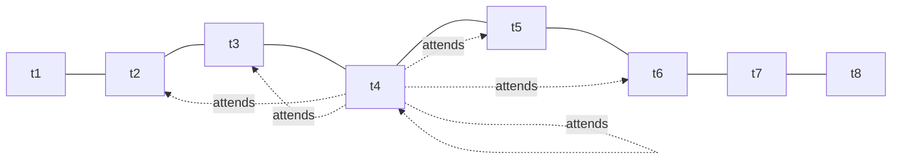
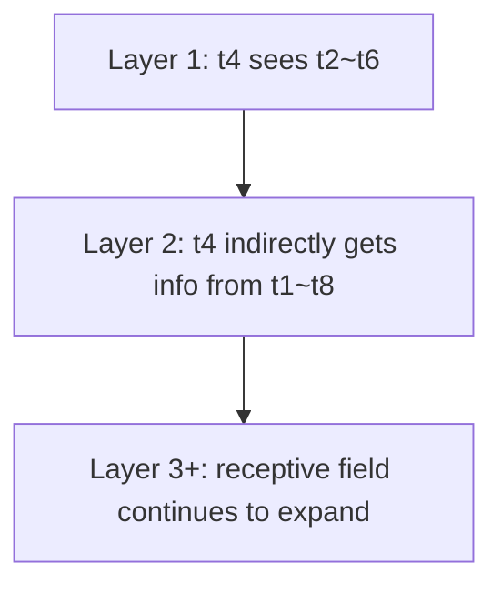

# Sliding-Window Attention 详解

## 1. 什么是 Sliding-Window Attention

Sliding-Window Attention（滑动窗口注意力）是一种 **局部注意力** 机制。它不让每个 token 都和整段序列中的所有 token 计算注意力，而是只关注自己附近的一个窗口范围。

如果把标准 Self-Attention 看成“每个人都和全班同学交谈”，那么 Sliding-Window Attention 更像是“每个人只和自己前后几排的同学交谈”。

这样做的核心目标是：

- 降低注意力计算量
- 降低显存占用
- 让模型可以处理更长的上下文
- 在保留局部建模能力的同时，牺牲一部分全局交互能力

---

## 2. 为什么需要它

标准 Self-Attention 的注意力矩阵大小是 `n x n`。

当序列长度为 `n` 时：

- 计算复杂度约为 `O(n^2)`
- 注意力分数矩阵的显存开销也接近 `O(n^2)`

当 `n` 从 4K 增长到 32K、128K 甚至更长时，二次复杂度会迅速成为瓶颈。

例如：

- 4K token：还能接受
- 32K token：代价显著上升
- 128K token：若仍使用全量注意力，训练和推理成本都非常高

Sliding-Window Attention 的思路是：

> 远距离 token 并不是在每一层、每一个头上都必须直接相互看到；很多时候，局部上下文已经足够有用。

---

## 3. 标准 Self-Attention 与滑动窗口的区别

### 3.1 标准 Self-Attention

对第 `i` 个 token，标准注意力会看所有位置：

```text
token_i -> [1, 2, 3, ..., n]
```

对应的注意力矩阵是一个稠密矩阵：

```text
      1 1 1 1 1 1 1
      1 1 1 1 1 1 1
      1 1 1 1 1 1 1
      1 1 1 1 1 1 1
      1 1 1 1 1 1 1
      1 1 1 1 1 1 1
      1 1 1 1 1 1 1
```

### 3.2 Sliding-Window Attention

对第 `i` 个 token，只看附近窗口中的位置。

如果窗口半径记为 `w`，那么第 `i` 个 token 只关注：

```text
[i-w, ..., i-1, i, i+1, ..., i+w]
```

对应的注意力矩阵会变成带状稀疏矩阵：

```text
      1 1 1 0 0 0 0
      1 1 1 1 0 0 0
      1 1 1 1 1 0 0
      0 1 1 1 1 1 0
      0 0 1 1 1 1 1
      0 0 0 1 1 1 1
      0 0 0 0 1 1 1
```

矩阵中：

- `1` 表示允许关注
- `0` 表示被 mask 掉，不能参与注意力计算

---

## 4. 直观示意图

### 4.1 单层窗口注意力

下面假设窗口半径为 2：



这里 `t4` 只能看到 `[t2, t3, t4, t5, t6]`，看不到更远的 `t1、t7、t8`。

### 4.2 多层堆叠后的感受野扩展

虽然单层只能看局部，但多层叠加后，信息可以逐层传播。



这意味着：

- **单层是局部的**
- **多层组合后可以逐步获得更远的信息**

---

## 5. 数学形式

标准注意力：

```text
Attention(Q, K, V) = softmax(QK^T / sqrt(d)) V
```

Sliding-Window Attention 的区别在于，会增加一个局部 mask：

```text
Attention(Q, K, V) = softmax((QK^T + M) / sqrt(d)) V
```

其中：

- `M[i, j] = 0`，表示位置 `j` 在 `i` 的窗口范围内
- `M[i, j] = -inf`，表示位置 `j` 超出窗口，softmax 后权重变为 0

如果采用因果语言模型（causal LM）设置，还要额外满足：

- 只能看当前及过去位置
- 不能看未来 token

这时 mask 会同时具备：

- **窗口约束**
- **因果约束**

---

## 6. 复杂度变化

设：

- 序列长度为 `n`
- 窗口半径为 `w`
- 每个 token 最多关注 `2w + 1` 个位置

那么：

### 标准 Self-Attention

- 时间复杂度：`O(n^2)`
- 空间复杂度：`O(n^2)`

### Sliding-Window Attention

- 时间复杂度：`O(n * w)`
- 空间复杂度：`O(n * w)`

当 `w << n` 时，收益非常明显。

例如：

- `n = 32768`
- `w = 256`

则每个 token 只需要看大约 513 个位置，而不是 32768 个位置。

---

## 7. 它的优势

### 7.1 更适合长序列

很多长文本任务中，真正强相关的信息往往集中在附近区域，比如：

- 连续自然语言段落
- 代码中的局部块
- 文档中的相邻句子
- 多轮对话中的最近轮次

局部注意力通常已经能捕捉大量有用模式。

### 7.2 计算和显存更可控

窗口大小固定后，序列变长时成本近似线性增长，而不再是平方增长。

### 7.3 工程上更容易落地

相比更复杂的稀疏模式，滑动窗口结构规则、稳定，便于：

- kernel 优化
- 分块计算
- 推理缓存管理
- 长上下文训练

---

## 8. 它的局限

### 8.1 全局依赖变弱

如果两个关键信息点距离非常远，而模型层数不够深，那么它们之间的信息传播会变慢，甚至传播不到。

例如：

- 文档开头定义了一个概念
- 文档末尾才使用该概念

单层滑动窗口无法直接建立这种远程联系。

### 8.2 窗口大小需要权衡

窗口太小：

- 成本低
- 但信息范围窄

窗口太大：

- 信息范围更广
- 但成本重新上升

### 8.3 对某些全局任务不够理想

例如：

- 跨长距离检索
- 全文级别推理
- 多跳远程依赖
- 很长代码库级别引用追踪

通常需要额外机制补足。

---

## 9. 常见增强方式

Sliding-Window Attention 通常不是单独使用，而是和其他机制组合。

### 9.1 Local + Global

一部分 token 做局部窗口注意力，少量特殊 token 做全局注意力。

典型思路：

- 普通 token：只看附近
- 全局 token：可以看全局，也可被全局看到

这类设计适合：

- 文档分类
- 问答任务
- 长文摘要

### 9.2 Dilated / Strided Attention

除了看附近 token，还间隔性地看更远位置，例如：

```text
i-8, i-4, i-2, i-1, i, i+1, i+2, i+4, i+8
```

这样可以在不完全恢复全量注意力的情况下扩大感受野。

### 9.3 Chunk + Sliding Window

把长序列切成多个 chunk，在 chunk 内做密集注意力，在 chunk 间用窗口或稀疏连接。

### 9.4 与检索或记忆模块结合

局部窗口负责近邻建模，检索模块负责远距离召回。

---

## 10. 在大模型中的典型用途

Sliding-Window Attention 常见于长上下文模型、稀疏注意力模型和高效推理方案中。

比较常见的应用方向包括：

- 长文档建模
- 长代码补全
- 低成本长上下文预训练
- 推理阶段限制 KV 访问范围

相关代表思路包括：

- Longformer：局部窗口 + 全局 token
- Mistral 系列中的滑动窗口思路：强调长上下文下的高效注意力访问

---

## 11. 与其他注意力方案对比

| 方案 | 注意范围 | 复杂度 | 优点 | 缺点 |
| --- | --- | --- | --- | --- |
| Full Attention | 全局 | `O(n^2)` | 表达力强，任意两点可直接交互 | 长序列成本高 |
| Sliding-Window | 局部窗口 | `O(nw)` | 高效、稳定、容易工程化 | 远程依赖弱 |
| Global + Local | 局部 + 少量全局点 | 介于两者之间 | 兼顾效率和全局建模 | 设计更复杂 |
| Linear Attention | 近似全局 | 通常近线性 | 更适合超长序列 | 近似误差、效果不一定稳定 |
| Retrieval / Memory | 局部 + 外部召回 | 取决于实现 | 能处理超长距离依赖 | 系统复杂度高 |

---

## 12. 一个简单例子

假设一句话有 10 个 token，窗口半径为 2。

对位置 `5` 来说，可见范围是：

```text
[3, 4, 5, 6, 7]
```

如果堆叠两层：

- 第 1 层：位置 5 看到 3~7
- 第 2 层：位置 5 可以通过中间 token 间接获得 1~9 的部分信息

如果堆叠更多层，感受野会继续扩大。

在一个简化近似下：

- 单层可见半径：`w`
- `L` 层后可传播半径约为：`L * w`

这也是为什么局部注意力模型通常会依赖：

- 更深的层数
- 额外的全局连接
- 或其他跨窗口机制

---

## 13. 因果场景下的窗口注意力

在自回归生成任务中，token 不能看未来，因此常用的是 **Causal Sliding-Window Attention**。

例如窗口半径为 3，但只允许看历史，则位置 `i` 只能看：

```text
[i-3, i-2, i-1, i]
```

对应 mask 大致如下：

```text
1 0 0 0 0 0
1 1 0 0 0 0
1 1 1 0 0 0
0 1 1 1 0 0
0 0 1 1 1 0
0 0 0 1 1 1
```

这类结构特别适合：

- 长文本续写
- 长代码生成
- 对话生成

因为它兼顾了：

- 因果性
- 局部建模效率

---

## 14. 工程实现时关注什么

### 14.1 窗口定义

实现时要先明确：

- `window_size` 指的是总宽度
- 还是单边半径

不同框架的定义不一定一致。

### 14.2 边界处理

序列开头和结尾处，窗口会天然变窄：

- 第一个 token 没有左邻居
- 最后一个 token 没有右邻居

### 14.3 与 KV Cache 的关系

在推理时，若只保留最近窗口的 KV，可以显著降低缓存占用，但也会限制模型访问更久远的历史信息。

### 14.4 训练与推理一致性

如果训练时是全量注意力、推理时才改成窗口注意力，往往会出现行为不一致；通常更好的做法是：

- 训练时就使用相同或相近的注意力模式
- 或进行专门的长上下文适配

---

## 15. 一句话总结

Sliding-Window Attention 的本质是：

> 用“局部可见”替代“全局可见”，把注意力从稠密矩阵变成带状稀疏矩阵，以更低成本处理更长序列。

它非常适合长上下文、高效率、强工程可落地性的场景，但如果任务严重依赖远距离全局关系，通常还需要和全局 token、检索、记忆或其他稀疏机制配合使用。

---

## 16. 速记版

- 标准注意力：每个 token 看所有 token，`O(n^2)`
- 滑动窗口注意力：每个 token 只看邻域窗口，`O(nw)`
- 优点：省算力、省显存、适合长文本
- 缺点：远距离依赖变弱
- 常见补强：global token、dilated attention、retrieval、memory
- 多层堆叠后，局部信息可以逐层传播到更远位置

