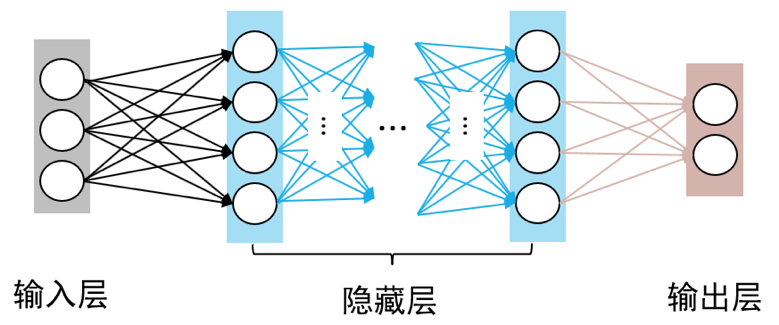

# 多层感知机(MLP: Multi-Layer Perceptron)

# 简介

由于无法模拟诸如异或以及其他复杂函数的功能，使得单层感知机的应用较为单一。一个简单的想法是，如果能在感知机模型中增加若干隐藏层，增强神经网络的非线性表达能力，就会让神经网络具有更强拟合能力。因此，由多个隐藏层构成的多层感知机被提出。也叫全连接神经网络，是最基础、最简单的人工神经网络；

如 **图1** 所示，多层感知机由输入层、输出层和至少一层的隐藏层构成。网络中各个隐藏层中神经元可接收相邻前序隐藏层中所有神经元传递而来的信息，经过加工处理后将信息输出给相邻后续隐藏层中所有神经元。



<center>图1 多层感知机模型</center><br></br>

在多层感知机中，相邻层所包含的神经元之间通常使用“全连接”方式进行连接。所谓“全连接”是指两个相邻层之间的神经元相互成对连接，但同一层内神经元之间没有连接。多层感知机可以模拟复杂非线性函数功能，所模拟函数的复杂性取决于网络隐藏层数目和各层中神经元数目。

一句话定义：
由**输入层 + 若干隐藏层 + 输出层**组成，层与层之间**全部神经元两两相连**，没有回路、没有跨层跳跃，用来学习复杂非线性映射关系。

> 区别于单层感知机：单层只能解决线性问题，**MLP 加了隐藏层和激活函数，能解决任何非线性分类、回归问题**。

# 结构组成

标准MLP三层结构：

**1.输入层 Input Layer**

接收原始特征数据，神经元个数 = 特征维度。比如手写数字 28×28 图片，输入层神经元就是 784 个。

**2.隐藏层 Hidden Layer**

可以**一层或多层**，是 MLP 的核心。

作用：对特征做**抽象、组合、非线性变换**，提取高阶特征。

**3.输出层 Output Layer**

输出最终预测结果：

- 二分类：1 个神经元 + Sigmoid
- 多分类：类别数神经元 + Softmax
- 回归任务：1 个或多个线性输出

<br />

结构特点：

- 同层神经元**互不连接**
- 相邻层**全连接**（全连接层 FC）
- 信息**单向传播**：输入 → 隐藏层 → 输出层

<br />

## 核心关键：为什么 MLP 能变强？

两个核心要素缺一不可：

**1.多层堆叠**

单层感知机只能画一条直线分割数据，**多层叠加可以拟合任意复杂边界**。

**2.非线性激活函数**

如果只做矩阵乘法，不管叠多少层，**永远还是线性模型**。

加入**激活函数**引入非线性，MLP 才有拟合复杂任务的能力。

常用激活：
- **ReLU**：最常用，隐藏层标配
- Sigmoid：二分类输出
- Softmax：多分类输出
- Tanh：早期常用，现在少用

# 工作原理：前向传播
流程：
1.输入特征向量送入输入层
2.每一层做：**加权求和 + 偏置 + 激活函数**
3.逐层向后传递，直到输出层得到预测值

单层计算公式：
$$
z = W \cdot x + b
$$
$$
a = \sigma(z)
$$
- $W$：权重矩阵
- $b$：偏置
- $\sigma$：激活函数

多层就是重复上面过程逐层计算。

# 怎么训练 MLP（反向传播）
训练两大步骤循环迭代：
1.**前向传播**：输入数据，得到预测值
2.**计算损失**：预测和真实标签算误差（交叉熵、MSE）
3.**反向传播**：从输出层往回逐层求导，计算每个权重梯度
4.**梯度下降**：用优化器（SGD/Adam）更新权重和偏置
不断迭代，直到损失收敛。

# MLP 能做什么任务
1.**分类任务**
   手写数字识别、文本分类、表格数据二分类/多分类。
2.**回归任务**
   房价预测、销量预测、数值拟合。
3.**特征映射与降维**
   简单表征学习、浅层特征提取。
4.**作为大网络组件**
   Transformer、CNN 里都有 MLP 层做特征变换。

# MLP 的优缺点
**优点**
- 结构极简、容易实现、训练快
- 适合**表格结构化数据**
- 理论上：**足够宽+足够深的 MLP 可以拟合任何连续函数**（万能逼近定理）

**缺点**
- **全连接参数量巨大**，容易过拟合
- 不擅长图像、序列的**局部空间/时序关联**（不如 CNN、RNN、Transformer）
- 输入维度一大，参数爆炸，训练开销高


# PyTorch 极简 MLP 代码示例
```python
import torch
import torch.nn as nn

class MLP(nn.Module):
    def __init__(self, in_dim, hidden_dim, out_dim):
        super().__init__()
        self.net = nn.Sequential(
            nn.Linear(in_dim, hidden_dim),
            nn.ReLU(),
            nn.Linear(hidden_dim, hidden_dim),
            nn.ReLU(),
            nn.Linear(hidden_dim, out_dim)
        )
    def forward(self, x):
        return self.net(x)

# 构建：输入784，隐藏层256，输出10分类
model = MLP(784, 256, 10)
x = torch.randn(32, 784)  # batch=32
out = model(x)
print(out.shape)  # torch.Size([32, 10])
```

---

# 一句话总结
**多层感知机 MLP = 输入层 + 多个全连接隐藏层 + 输出层 + 非线性激活**。
它是神经网络的基石，CNN、Transformer 本质都内嵌了 MLP；适合表格、简单分类回归，靠**隐藏层+激活函数**突破线性限制，具备万能拟合能力。