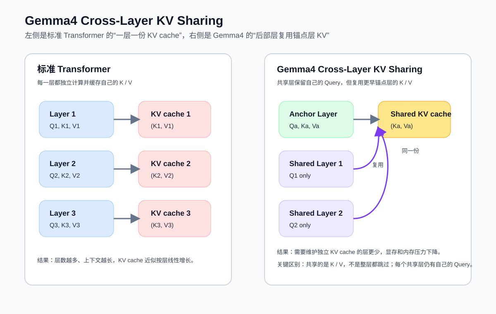
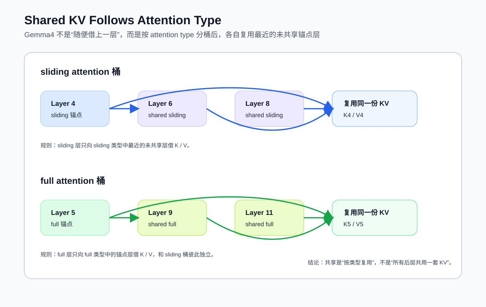

# Gemma4 的 Cross-Layer KV Sharing

## 1. 先说结论

Cross-Layer KV Sharing 可以直译为“跨层 K/V 共享”或“跨层 KV 缓存共享”。它的核心思想是：

- 在标准 Transformer 里，每一层都会各自生成并缓存自己的 Key / Value。
- 在 Gemma4 里，**一部分后续层不再单独生成 K/V**，而是**复用更早某一层已经生成好的 K/V**。
- 这样做的直接收益是：**减少 KV cache 占用，降低长上下文推理显存/内存压力，同时减少部分 K/V 投影计算**。

这项机制是 Gemma4 面向长上下文和设备侧部署的重要优化之一。Hugging Face 对 Gemma4 的说明明确写到：最后 `num_kv_shared_layers` 层会复用更早层的 key-value states，从而避免重复的 KV 投影计算。[来源：Hugging Face Gemma4 博客](https://huggingface.co/blog/gemma4)、[来源：Transformers Gemma4 文档](https://huggingface.co/docs/transformers/main/en/model_doc/gemma4)

| 模型名称 | 总层数 | 计算层数 | 共享层数 | 节省内存 | 
| --- | --- | --- | --- | --- |
| Gemma 4 E2B | 35 |15 | 20 | 2.7GB(bf16) |
|  Gemma 4 E4B | 42 | 24 | 18 | 6GB(bf16) |

下图先把“标准 Transformer”和“Gemma4 跨层共享 KV”的差别放在一起看：




## 2. 为什么 KV cache 会成为大模型推理瓶颈

在自回归生成中，模型每生成一个新 token，都要让当前 token 的 Query 去和历史所有 token 的 Key / Value 做注意力计算。为了避免每一步都重复计算历史 token 的 K/V，推理框架会把历史 K/V 缓存起来，这就是 KV cache。

标准做法的问题是：

- **每一层都有自己的 KV cache**。
- 序列越长，cache 越大。
- 层数越多，cache 线性增长得越明显。

因此，在长上下文场景下，KV cache 往往会成为显存/内存的主要消耗项之一。Gemma4 的 Cross-Layer KV Sharing，本质上就是在问：

> 既然相邻层或者某些后层的注意力行为足够接近，能不能不要让每层都维护一套独立的 K/V？

答案是可以，于是就有了跨层共享。

---

## 3. Gemma4 里这项机制到底怎么做

### 3.1 配置入口

在 Hugging Face 的 Gemma4 文档中，`num_kv_shared_layers` 的定义是：

- `num_kv_shared_layers`：连续多少个 decoder 层共享同一组 key-value projections。
- 当该值为 `0` 时，表示**不启用**跨层 KV 共享，每层都有独立 K/V。[来源：Transformers Gemma4 文档](https://huggingface.co/docs/transformers/main/en/model_doc/gemma4)

也就是说，Gemma4 不是“所有层都共享”，而是用一个显式配置去控制**尾部若干层**是否共享。

### 3.2 共享规则

Hugging Face 对 Gemma4 Shared KV Cache 的说明非常关键：

- **模型最后 `num_kv_shared_layers` 层**，不再自己计算 K/V。
- 它们会**复用“同一种 attention 类型”中，最近一个未共享层**所产生的 K/V。
- 这里的 attention 类型指 Gemma4 里的不同注意力模式，例如 **sliding attention** 和 **full attention**。[来源：Hugging Face Gemma4 博客](https://huggingface.co/blog/gemma4)

这句话很重要，因为它说明共享不是无条件的“随便借上一层”，而是带有结构约束：

- sliding attention 层，只会向 sliding attention 的非共享锚点层借 K/V；
- full attention 层，只会向 full attention 的非共享锚点层借 K/V。

因此，Gemma4 的 Cross-Layer KV Sharing 不是一个粗暴的全局共享，而是**按注意力类型分桶，再做跨层复用**。

下图展示了这种“先按 attention type 分桶，再各自找锚点层”的共享方式：



### 3.3 共享的到底是什么

从推理执行角度看，Gemma4 共享的是两层含义：

- **投影结果层面**：共享层不必再为当前层额外产出独立的 K/V states。
- **缓存层面**：共享层不需要维护自己独立的一整套 KV cache，而是引用锚点层已经生成的 K/V。

在 Hugging Face 的 `modeling_gemma4.py` 里，输出结构里专门暴露了 `shared_kv_states`，其说明是：

- `shared_kv_states` 是一个字典，按 layer type 映射到 `(key_states, value_states)`；
- 它用于在层与层之间传递共享的 KV 状态。[来源：Transformers `modeling_gemma4.py`](https://raw.githubusercontent.com/huggingface/transformers/1656d90b774d94c30af24113e60e926fc2f39072/src/transformers/models/gemma4/modeling_gemma4.py)

这说明这套机制在实现上不是“概念层面复用”，而是有明确的数据结构来承载共享 K/V 状态。

---

## 4. 它和标准 Transformer 的区别

### 标准做法

对于第 `l` 层：

```text
Q_l = X_l Wq_l
K_l = X_l Wk_l
V_l = X_l Wv_l
cache_l <- (K_l, V_l)
```

每层都单独生成、单独缓存。

### Gemma4 的 Cross-Layer KV Sharing

对于某个共享层 `l`：

```text
Q_l = X_l Wq_l
K_l, V_l = K_anchor(type=l.type), V_anchor(type=l.type)
```

也就是说：

- 当前层仍然做自己的表示变换；
- 但在注意力里使用的 K/V，不再来自当前层单独投影，而是来自一个“锚点层”；
- 锚点层按 attention type 区分。

这也是为什么它叫 **Cross-Layer KV Sharing**：**Query 仍然是本层的，K/V 则跨层复用**。

---

## 5. 这项机制带来的收益

### 5.1 降低 KV cache 内存

如果总层数是 `L`，其中最后 `S` 层共享 K/V，那么理论上需要维护独立 KV cache 的层数就从 `L` 下降到 `L - S`。

粗略地说，KV cache 的层维度开销大约按下面比例下降：

```text
原始:   L
共享后: L - S
节省比例约为: S / L
```

这也是为什么这项机制特别适合：

- 长上下文推理
- 边缘设备部署
- 显存/内存受限环境

Hugging Face 对 Gemma4 的描述也明确指出，这项优化对 **long context generation** 和 **on-device use** 特别有价值。[来源：Hugging Face Gemma4 博客](https://huggingface.co/blog/gemma4)

### 5.2 减少部分 K/V 投影计算

共享层不必重复执行独立的 K/V 投影，因此还能减少一部分矩阵乘法开销。  
需要注意的是，这并不意味着注意力计算整体被“白嫖”掉：

- 当前层仍然要计算自己的 Query；
- 当前层仍然要完成注意力分数计算与输出聚合；
- 节省的主要是 **K/V 投影** 与 **独立 cache 维护**。

所以，这项设计更偏向**内存优化优先，同时兼顾一定计算优化**，而不是把整个注意力层都跳过去。

---

## 6. 它和 GQA / MQA 是什么关系

这一点很容易混淆。

### GQA / MQA

GQA（Grouped Query Attention）和 MQA（Multi-Query Attention）解决的是：

- **同一层内部**，多个 Query 头是否共享更少数量的 K/V 头。

也就是“**层内 head 级共享**”。

### Cross-Layer KV Sharing

Gemma4 的 Cross-Layer KV Sharing 解决的是：

- **不同层之间**，是否可以共享同一组 K/V。

也就是“**层间共享**”。

两者并不冲突，甚至可以叠加：

- GQA/MQA：减少单层 KV 头数量；
- Cross-Layer KV Sharing：减少需要维护独立 KV cache 的层数。

从工程角度看，前者压缩的是**每层 cache 的宽度**，后者压缩的是**cache 的层数**。

---

## 7. Gemma4 中是否所有模型都启用这项机制

**不一定。不同变体的配置可能不同。**

公开资料里可以确认两点：

1. Hugging Face Gemma4 文档把 `num_kv_shared_layers` 设计成可配置项，且明确说 `0` 表示不共享。[来源：Transformers Gemma4 文档](https://huggingface.co/docs/transformers/main/en/model_doc/gemma4)
2. Hugging Face 的一个修复 PR 明确提到：`google/gemma-4-26B-A4B-it` 的配置里 `num_kv_shared_layers == 0`，因此这个模型在该实现路径下**不启用**跨层 KV 共享。[来源：Transformers PR #46235](https://github.com/huggingface/transformers/pull/46235)

此外，Google MaxText 在 Gemma4 E2B/E4B 相关配置中给出了一个很有代表性的例子：  
`gemma4_e2b_dict` 中包含：

- `num_hidden_layers = 35`
- `num_kv_shared_layers = 20`

这说明至少在公开生态实现中，**小型边缘版本更积极地使用了这项共享机制**。[来源：MaxText Gemma4 E2B 配置 PR](https://github.com/AI-Hypercomputer/maxtext/pull/3904/files/ed8ee2c000fb08cae7a81b3025397309c412cc94)

因此，更稳妥的说法是：

- **Cross-Layer KV Sharing 是 Gemma4 架构工具箱中的一项机制；**
- **是否启用、启用多少层，要看具体模型变体和对应配置。**

---

## 8. 为什么共享 K/V 仍然能保持质量

这背后的直觉是：

- 相邻层，尤其是后部层，在注意力使用的上下文结构上往往存在较强相似性；
- 没必要让每一层都付出完整、独立的一套 K/V 成本；
- 只要 Query 仍保留本层特性，模型依然可以通过当前层的 Q 去“选择性读取”共享的上下文记忆。

从这个角度看，Cross-Layer KV Sharing 不是简单“砍掉几层能力”，而是把：

- 本层负责的“我此刻想问什么”保留在 Query 中；
- 相对昂贵、又可复用的“历史上下文索引”放到共享的 K/V 中。

Hugging Face 的总结是：这种做法对质量影响很小，但对长上下文和高效部署更友好。[来源：Hugging Face Gemma4 博客](https://huggingface.co/blog/gemma4)

---

## 9. 一个更直观的示意

假设某个 Gemma4 变体有 12 层，其中后 4 层开启 KV sharing：

```text
Layer 1   -> 独立 K/V
Layer 2   -> 独立 K/V
Layer 3   -> 独立 K/V
Layer 4   -> 独立 K/V
Layer 5   -> 独立 K/V
Layer 6   -> 独立 K/V
Layer 7   -> 独立 K/V
Layer 8   -> 独立 K/V   <- 某类 attention 的锚点层
Layer 9   -> 复用 Layer 8 的 K/V
Layer 10  -> 复用 Layer 8 的 K/V
Layer 11  -> 复用 Layer 8 的 K/V
Layer 12  -> 复用 Layer 8 的 K/V
```

如果模型同时存在 sliding attention 和 full attention，那么实际上会变成：

```text
sliding 类层   -> 只共享 sliding 的锚点 K/V
full 类层      -> 只共享 full 的锚点 K/V
```

这就是 Gemma4“按 attention type 共享”的含义。

---

## 10. 对推理框架和微调工具的工程影响

这项机制会影响很多下游工程实现：

### 10.1 Cache 构建逻辑不能再假设“一层一份 KV”

推理框架若默认每层都分配独立 KV cache，就可能和 Gemma4 的共享设计不一致。  
Hugging Face 针对 `num_kv_shared_layers == 0` 的修复 PR，也从侧面说明：**cache 初始化逻辑需要显式考虑这项配置**。[来源：Transformers PR #46235](https://github.com/huggingface/transformers/pull/46235)

### 10.2 层级分析、权重替换、LoRA 注入要注意共享边界

如果某些层的 K/V 投影或状态不是独立存在，而是共享/借用关系，那么：

- 做层级消融实验时不能简单按“每层完全独立”理解；
- 做量化、缓存压缩、权重替换时，要清楚共享发生在哪些层；
- 做微调或 adapter 注入时，也要先确认目标层的 K/V 是否真的是独立参数路径。

换句话说，Gemma4 的这项设计提高了推理效率，但也要求工具链更理解模型结构。

---

## 11. 和学术界已有的 Cross-Layer KV Sharing 工作的关系

Gemma4 的这项设计并不是凭空出现的。  
在更广义的研究脉络中，跨层共享 KV 已经被系统研究过，例如：

- LCKV
- CLA
- YOCO

- 论文 *A Systematic Study of Cross-Layer KV Sharing for Efficient LLM Inference* 对这类方法做了统一框架分析，核心结论也是：在显著压缩 KV cache 的同时，很多配置仍能保持较好的性能。[来源：arXiv 2410.14442](https://arxiv.org/html/2410.14442v1)
- 论文 *Reducing Transformer Key-Value Cache Size with Cross-Layer Attention* [来源: arXiv:2405.12981](https://arxiv.org/abs/2405.12981)

不过要注意：

- **学术论文讨论的是一大类方法；**
- **Gemma4 实际采用的是它自己工程化后的具体版本。**

因此，理解 Gemma4 时，应优先看 Gemma4 自身文档与实现，再把这篇论文作为背景知识。

---

## 12. 一句话总结

Gemma4 的 Cross-Layer KV Sharing 可以概括为：

> **让后部若干层停止各自维护独立的 K/V，而是按 attention type 复用前面锚点层的 K/V，以更低的 KV cache 成本支持长上下文推理。**

它的价值主要体现在三点：

- **降内存**：减少需要缓存的层数；
- **降重复计算**：减少额外的 K/V 投影；
- **更适合长上下文与端侧部署**：尤其适合内存受限环境。

---

## 参考资料

1. Hugging Face, *Welcome Gemma 4: Frontier multimodal intelligence on device*  
   https://huggingface.co/blog/gemma4
2. Hugging Face Transformers, *Gemma4 model documentation*  
   https://huggingface.co/docs/transformers/main/en/model_doc/gemma4
3. Hugging Face Transformers source, *modeling_gemma4.py*  
   https://raw.githubusercontent.com/huggingface/transformers/1656d90b774d94c30af24113e60e926fc2f39072/src/transformers/models/gemma4/modeling_gemma4.py
4. Hugging Face Transformers PR #46235, *Fix StaticCache building an empty layer list when num_kv_shared_layers == 0*  
   https://github.com/huggingface/transformers/pull/46235
5. Google MaxText PR #3904, Gemma4 E2B/E4B config snippet  
   https://github.com/AI-Hypercomputer/maxtext/pull/3904/files/ed8ee2c000fb08cae7a81b3025397309c412cc94
6. Wu et al., *A Systematic Study of Cross-Layer KV Sharing for Efficient LLM Inference*  
   https://arxiv.org/html/2410.14442v1
7. Gemma 4 Architecture Explained: Per-Layer Embeddings, Shared KV Cache, and Dual RoPE https://botmonster.com/ai/gemma-4-architecture-per-layer-embeddings-shared-kv-cache-dual-rope/
8. GEMMA 4 ARCHITECTURE https://g4.si5.pl/
9. Google’s Gemma 4 is Weirder than you Realize https://machine-learning-made-simple.medium.com/googles-gemma-4-is-weirder-than-you-realize-17d00d95b0d5
