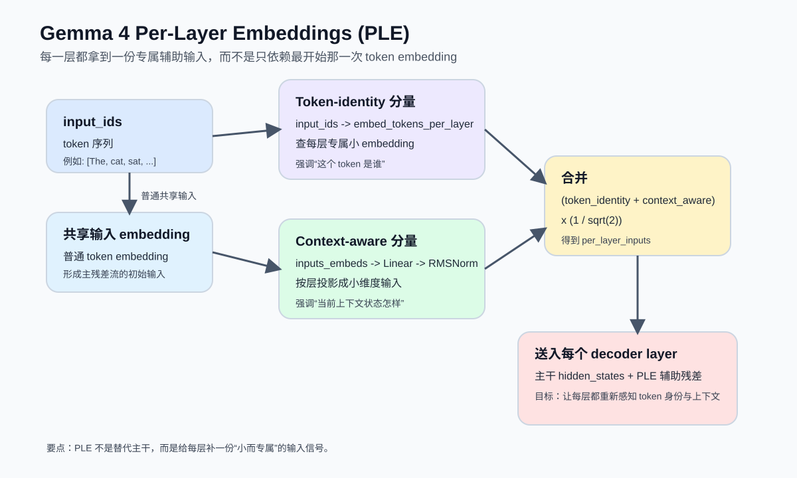
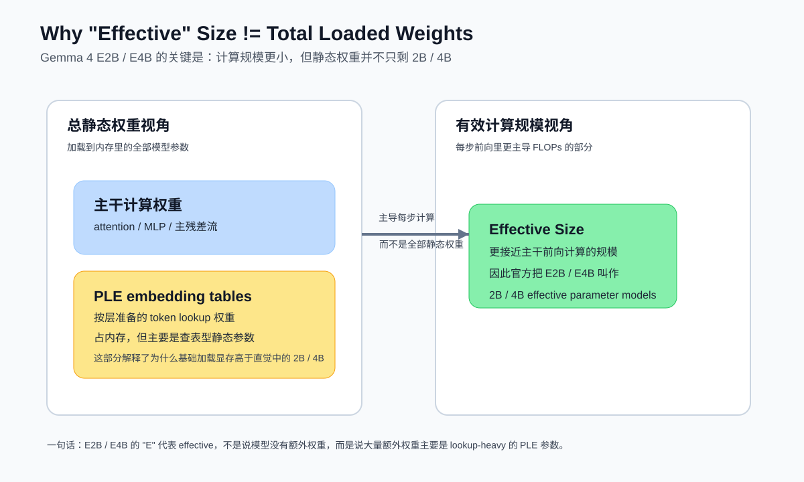

# Gemma 4 的 Per-Layer Embeddings 与 “Effective” Size

## 1. 先说结论

Gemma 4 里最值得注意的一个“小模型增强器”，就是 **Per-Layer Embeddings（PLE）**。

它不是只在模型入口给一次 token embedding，然后把这份表示一路传到底；而是：

- 在每一层 decoder 之前，都额外提供一份“这一层专属的辅助输入”；
- 这份辅助输入既包含 **token 身份信息**，也包含 **当前上下文感知信息**；
- 最终以辅助残差的形式送进每一层。

这也是为什么 Gemma 4 的 E2B / E4B 会被官方称为：

- **2B / 4B effective parameter models**

这里的 **effective** 不是说模型磁盘大小只有 2B/4B，也不是说总权重只有 2B/4B，而是指：

> **真正主导每步前向计算成本的“有效计算规模”更接近 2B / 4B；但模型里还额外带着一大批主要用于查表的 PLE embedding 权重，所以实际加载静态权重时，内存需求会更高。**

---

## 2. 为什么 Gemma 4 要引入 PLE

传统 decoder-only Transformer 的做法是：

1. 输入 token 先查一次共享 embedding table；
2. 得到初始向量后，后面各层都只在这条主残差流上做加工；
3. 层数越深，模型越依赖中间表示，而最初的 token 身份信息会越来越“被上下文冲淡”。

对于大模型，这通常不是致命问题，因为参数足够多、宽度足够大，模型可以自己在深层里保留细粒度语义。

但对 **E2B / E4B 这种面向端侧和低内存场景的小模型** 来说，这样做会出现两个矛盾：

- 如果想让深层一直记得 token 的原始身份，就需要更强的表示能力；
- 如果直接把主干做大、做深，算力和显存成本又会上去，不利于手机、浏览器、边缘设备部署。

PLE 本质上是在回答这个问题：

> **有没有办法不给主干网络大幅加算力，却能让每一层都重新拿到“这个 token 是谁、当前上下文怎样”的提醒？**

Gemma 4 给出的答案就是：**每层都喂一份专属的小 embedding 辅助信号。**

---

## 3. PLE 的核心直觉

可以把 Gemma 4 的主干理解成一条“主车道”，而 PLE 是每层旁边的一条“小辅路”：

- 主车道负责完整的注意力、MLP、残差更新；
- 辅路不替代主车道，只负责把“对这一层有帮助的 token 提示”重新送进来；
- 于是每一层都不会只依赖最开始那一次 embedding。

下图是 PLE 的直观数据流：



这个设计带来的直接收益是：

- **深层保留 token 身份信息更容易**；
- **小模型表示能力更强**；
- **不需要用更宽更深的主干去硬堆参数**；
- **很多额外参数放在 embedding 查表里，增加内存多于增加 FLOPs。**

---

## 4. PLE 在 Gemma 4 里是怎么计算的

根据 Hugging Face Transformers 的 Gemma 4 文档，PLE 会给每一层提供一份辅助残差信号，而这份信号由两部分组成：

### 4.1 Token-identity 分量

第一部分是 **token 身份分量**：

- 用 `input_ids` 去查 `embed_tokens_per_layer`；
- 这个表不是普通输入 embedding，而是 **给每一层准备好的 per-layer embedding**；
- 查到的结果会从打包形式 reshape 成：

```text
[batch, seq, num_hidden_layers, hidden_size_per_layer_input]
```

可以把它理解为：

> 对于同一个 token，Gemma 4 不只准备“一份通用 embedding”，而是准备“每一层都能拿到一份属于自己的小 embedding”。

### 4.2 Context-aware 分量

第二部分是 **上下文感知分量**：

- 先拿主输入 `inputs_embeds`；
- 经过 `per_layer_model_projection` 线性投影；
- 再乘以 `1 / sqrt(hidden_size)`；
- reshape 成每层一份的小向量；
- 最后过 `per_layer_projection_norm`（RMSNorm）。

这一步的含义是：

> 不只是告诉每层“这个 token 是谁”，还告诉每层“当前主干里，这个 token 现在处在怎样的上下文状态”。

### 4.3 二者如何合并

官方文档给出的组合方式非常直接：

```text
per_layer_input = (token_identity + context_aware) * (1 / sqrt(2))
```

也就是说：

- 一部分来自原始 token 身份；
- 一部分来自当前上下文状态；
- 两者加和后再做一次缩放，控制数值稳定性。

---

## 5. PLE 不是替换主干，而是“每层加一份辅助残差”

理解 PLE 时，一个常见误区是：

> 以为每层都重新做一遍完整输入 embedding。

其实不是。

Gemma 4 的做法更接近：

```text
主干 hidden_states
    +
每层专属的 PLE 辅助信号
    ->
送入当前 decoder layer
```

也就是说：

- 主干 attention 和 MLP 仍然是模型的核心计算主体；
- PLE 只是往每层注入一个额外的小维度条件信号；
- 它增强的是“每层输入质量”，而不是把整层结构改写掉。

所以 PLE 的工程气质非常明确：

- **增强表示**
- **尽量少增 FLOPs**
- **允许多加静态参数，但这些参数最好是查表型、低计算型**

---

## 6. 为什么这会让小模型更强

### 6.1 每层都能重新拿到 token 身份

在普通做法里，token 身份只在最开始注入一次；在 PLE 里，后续每层都能重新获得一份 token 身份提示。

这对小模型很重要，因为：

- 它们主干容量有限；
- 很难靠主残差流“长期无损保存”细粒度词汇信息；
- PLE 相当于给深层做了持续的 token identity refresh。

### 6.2 主干不需要为“记忆 token 身份”付太多算力

如果没有 PLE，模型想保住这类信息，通常只能依赖：

- 更宽 hidden size
- 更多层数
- 更重的中间计算

这会直接推高推理成本。

而 PLE 选择了另一条路：

- 把很多“静态 token 知识”放到 per-layer embedding 表里；
- 需要时快速查表；
- 把真正昂贵的 FLOPs 留给 attention 和 MLP 主干。

### 6.3 对端侧部署更友好

这正是 Google 在 Gemma 4 overview 里把 E2B/E4B 描述成 **effective parameter models** 的原因。

它们不是单纯做小，而是：

> **把一部分能力做进了“大但便宜”的 embedding 权重里，而不是全部塞进“每步都要重算”的主干矩阵乘法里。**

---

## 7. 什么叫 “Effective” Size

Gemma 4 官方 overview 对 E2B/E4B 的解释非常关键：

- **E 代表 effective**
- 小模型集成了 **Per-Layer Embeddings (PLE)**
- PLE 让模型在端侧部署时拥有更高参数效率
- 但这些 embedding tables 虽然很大，却主要是 **quick lookups**
- 所以 **静态权重加载内存** 会比 2B/4B 这个 effective 规模看上去更高

下图解释了 “总静态权重” 和 “有效计算规模” 的区别：



因此，“effective size” 最好理解成：

### 7.1 它更接近“计算视角”的大小

也就是：

- 多少参数真正持续参与主要前向计算；
- 每生成一个 token 时，模型的计算负担更像多大规模；
- 推理时的主干 FLOPs 更接近 2B / 4B。

### 7.2 它不等于总加载权重

E2B / E4B 还带着大量 PLE 相关 embedding 表，这些表：

- 占静态存储；
- 占加载内存；
- 但主要做 lookup，不像 attention/MLP 那样每步产生等量的大矩阵乘法。

所以会出现这种现象：

- **“看起来是 2B / 4B effective”**
- **“实际加载内存却明显高于普通 2B / 4B dense 模型的朴素想象”**

这不是矛盾，而是 PLE 设计本来就刻意制造出来的结果。

---

## 8. 为什么官方显存数字会比 2B / 4B 更高

Gemma 4 overview 给出的基础加载内存大约是：

| 模型 | BF16 | SFP8 | Q4_0 |
| --- | --- | --- | --- |
| Gemma 4 E2B | 9.6 GB | 4.6 GB | 3.2 GB |
| Gemma 4 E4B | 15 GB | 7.5 GB | 5 GB |

如果只盯着“2B / 4B”这几个字，很多人会疑惑：

> 为什么 2B / 4B effective 模型加载起来还要这么多内存？

原因就在这里：

- **effective size 说的是主干有效计算规模**
- **加载内存说的是所有静态权重都要放进来**
- **PLE embedding tables 是大块静态权重**

官方原话的核心意思可以概括成一句：

> **E2B / E4B 之所以能做到高参数效率，是因为它们把不少能力放进了“大而便宜”的 PLE 查表权重里；这些权重不便宜的是内存，不是计算。**

---

## 9. PLE 和 MoE 的“有效参数”不是一回事

这点非常容易混淆。

### 9.1 E2B / E4B 的 effective

E2B / E4B 的 effective，主要来自：

- PLE 提高参数效率；
- 很多额外参数属于查表型 embedding；
- 主干计算规模仍更接近 2B / 4B。

### 9.2 26B A4B 的高效率

26B A4B 则是 **MoE（Mixture of Experts）** 路线：

- 总参数很多；
- 但每个 token 只激活一部分专家；
- 所以它的“高效率”来自 **稀疏激活**。

也就是说：

- **E2B / E4B：查表权重大，主干计算有效规模小**
- **26B A4B：总权重大，但每 token 只激活少量专家**

二者都在追求“高能力 / 高效率”，但手段完全不同。

---

## 10. 从实现角度看，PLE 会影响哪些工程细节

PLE 不只是论文概念，它会直接影响推理框架实现。

### 10.1 decoder 往往不再只吃 `inputs_embeds`

因为 token-identity 分量要用到 `input_ids`，所以一些推理后端需要：

- 保留原始 `input_ids`
- 或提前把 `per_layer_inputs` 预计算好再传进 decoder

这也是为什么 Gemma 4 E2B/E4B 的适配，常常比普通 decoder-only 模型复杂。

### 10.2 多模态场景要考虑 fallback

官方文档提到：

- 当是多模态输入、拿不到原始 `input_ids` 时；
- 可以只用 context-aware 分量；
- 或在上游先把 per-layer inputs 预计算出来。

说明 PLE 不是“可有可无的装饰”，而是 E2B/E4B 正常发挥能力的重要组成部分。

### 10.3 框架如果漏掉 PLE，质量会悄悄下降

如果一个后端把模型跑起来了，但没有真正把 per-layer residual 信号接进每层，那么：

- 模型未必会崩；
- 但输出质量通常会和官方实现有差距。

这也是 Gemma 4 E2B/E4B 在不同推理框架里，适配难度高于普通 dense 模型的核心原因之一。

---

## 11. 一个最简公式版理解

如果把 Gemma 4 小模型写成极简抽象，可以记成：

```text
主输入:
X0 = token_embedding(input_ids)

每层辅助输入:
PLE_l = (TokenIdentity_l(input_ids) + ContextAware_l(X0)) / sqrt(2)

第 l 层:
Xl+1 = DecoderLayer_l(Xl, ple = PLE_l)
```

这个公式最重要的不是数学精确性，而是结构含义：

- 每层都有 `PLE_l`
- `PLE_l` 一部分看 token ID
- 一部分看当前输入嵌入
- 它作为辅助残差进入当前层

这就解释了 Gemma 4 小模型的核心设计哲学：

> **把“每层都重新感知 token”的能力做成查表友好的静态参数，而不是完全压在高 FLOPs 主干里。**

---

## 12. 一句话总结

Gemma 4 的 **Per-Layer Embeddings（PLE）** 可以理解成：

> **给每个 decoder 层都补一份“这一层专属的 token 提示”，这份提示同时包含 token 身份和上下文感知信息，用辅助残差的方式增强小模型的表示能力。**

而 Gemma 4 的 **“effective” size** 则可以理解成：

> **模型在主要前向计算上更接近 2B / 4B 的规模，但它额外携带了一大批主要用于快速查表的 PLE 权重，所以静态加载内存会比字面上的 2B / 4B 更高。**

---

## 参考资料

1. Google AI for Developers, Gemma 4 model overview  
   https://ai.google.dev/gemma/docs/core
2. Hugging Face Transformers, Gemma4 model documentation  
   https://huggingface.co/docs/transformers/main/en/model_doc/gemma4
3. Google AI for Developers, Gemma 4 model card  
   https://ai.google.dev/gemma/docs/core/model_card_4
4. LiteRT-LM model card for Gemma 4 E2B  
   https://huggingface.co/litert-community/gemma-4-E2B-it-litert-lm
