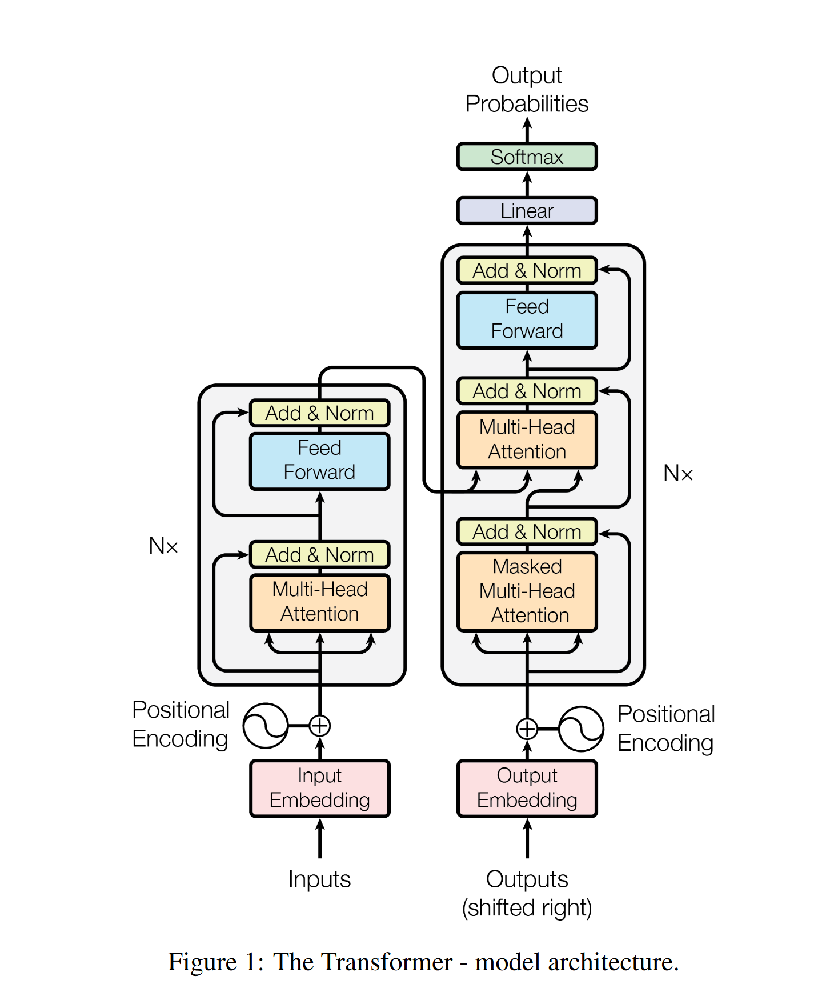
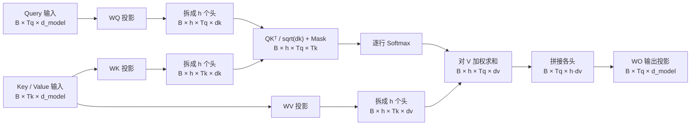

# Transformer 原理导读

| 项目 | 内容 |
| --- | --- |
| 论文 | `Attention Is All You Need` |
| 作者 | Ashish Vaswani、Noam Shazeer、Niki Parmar 等 |
| 会议 / 年份 | NIPS 2017（现称 NeurIPS） |
| 主题 | `注意力 / 编码器-解码器 / 序列建模` |
| 定位 | 以注意力承担序列间的信息交互，完全移除递归与卷积 |
| 原文 | [arXiv v7](https://arxiv.org/abs/1706.03762v7) · [NeurIPS 2017 会议版](https://papers.nips.cc/paper_files/paper/2017/file/3f5ee243547dee91fbd053c1c4a845aa-Paper.pdf) |

Transformer 最重要的价值，不只是得到一个更好的机器翻译模型，而是把序列建模改造成了一组可以并行计算、反复堆叠和大规模扩展的标准积木：

> **Attention 负责跨 token 路由与聚合信息，FFN 负责逐 token 变换信息，残差与归一化负责让深层堆叠可训练。**

还可以从“依赖路径”理解它：RNN 要让信息沿时间步逐个传递；全局自注意力则让任意两个位置在同一层直接建立连接。后来的 BERT、GPT、T5 以及大多数 LLM，都可以看作对这套骨架的选取、改造和工程化。

> **版本说明**：论文在 2017 年发表，但 arXiv 后续有修订。本文的架构与训练配方来自原论文，实验表默认采用当前 arXiv v7 的数值；涉及会议版差异时会单独注明。

## 1. 先看结论：五个核心部件

| 部件 | 解决的问题 | 关键表达 |
| --- | --- | --- |
| Scaled Dot-Product Attention | 动态决定“从哪些位置取多少信息” | `softmax(QKᵀ / √d_k + M)V` |
| Multi-Head Attention | 在多个投影子空间并行建模不同关系 | `Concat(head₁, …, headₕ)Wᴼ` |
| Positional Encoding | 给无递归、无卷积的模型注入位置信号 | `Embedding + PE` |
| Position-wise FFN | 对每个位置独立做非线性特征变换 | `d_model → d_ff → d_model` |
| Residual + LayerNorm | 保留信息通路并稳定深层训练 | 原论文采用 `post-norm` |

原论文不是“网络中只有 attention”。更准确的说法是：

- 序列位置之间的交互完全由 attention 完成；
- 每层仍然包含 FFN、残差连接、LayerNorm 和 dropout；
- 输入端还有 embedding 与位置编码，输出端还有线性层与 softmax。

## 2. 论文要解决什么问题

2017 年主流 Seq2Seq 系统仍以 RNN、LSTM 或 CNN 为主。即使已经引入注意力，模型主干通常仍有以下限制：

- **RNN 难以并行**：位置 `t` 的隐藏状态依赖位置 `t-1`，单个样本内部必须按时间步计算。
- **长程路径较长**：相距很远的 token 需要经过多次状态传递，前向信息和反向梯度都要走更长路径。
- **CNN 需要堆叠**：有限卷积核不能在一层连接任意两个位置，需要增加深度或使用空洞卷积。
- **架构较复杂**：递归、卷积与注意力混合后，计算图和工程优化都不够统一。

作者的目标是构造一个不依赖递归和卷积的编码器-解码器，并验证它能否同时做到：

1. 训练时更易并行；
2. 更直接地建模长距离依赖；
3. 在机器翻译上达到或超过当时最佳结果；
4. 迁移到翻译以外的序列转换任务。

## 3. 一张图看懂完整架构



*图源：Vaswani et al. (2017), Figure 1；此处引用仓库中的本地副本。*

**图 1 读图说明：**

1. **左侧是 Encoder**：源序列经过 embedding 与位置编码后，依次通过 `Self-Attention → FFN`；每个子层后都有残差连接与 LayerNorm。
2. **右侧是 Decoder**：目标序列先右移一位，再经过 target embedding 与位置编码，以及 `Masked Self-Attention → Cross-Attention → FFN`。
3. **中间的横向连线是 encoder memory**：在 cross-attention 中，Query 来自 decoder，Key 和 Value 来自 encoder 的最终输出。
4. **`N×` 表示堆叠而非参数共享**：原论文的 Base 和 Big 都是 **6 层 Encoder + 6 层 Decoder**，不同层拥有不同参数。
5. **Add & Norm 的顺序很重要**：原论文是先执行子层和残差相加，再做 LayerNorm，即 post-norm。
6. **Decoder 顶部是输出头**：`Linear + Softmax` 把每个位置的隐藏状态映射为词表上的下一 token 概率。

从概率模型看，Encoder 把源序列 `x` 编码为 memory `z`，Decoder 再自回归地分解目标序列概率：

$$
p(y\mid x)=\prod_{t=1}^{m}p(y_t\mid y_{<t},x)
$$

Transformer 改变的是每一步条件分布的计算方式，没有取消自回归分解本身。

## 4. Scaled Dot-Product Attention：一次信息检索

### 4.1 Q、K、V 分别是什么

可以先用“检索”类比建立直觉：

- **Query（Q）**：当前位置想寻找什么；
- **Key（K）**：每个候选位置用什么特征参与匹配；
- **Value（V）**：匹配后真正被加权汇总的内容。

它们不是人工指定的语义标签。对单个 attention head，可以把输入经过三组可学习线性投影后的表示写成：

$$
Q=X_QW^Q,\qquad K=X_{KV}W^K,\qquad V=X_{KV}W^V
$$

在 self-attention 中，`X_Q` 与 `X_KV` 来自同一序列，但经过不同投影后，`Q`、`K`、`V` 通常并不相等。在 cross-attention 中，`X_Q` 来自 Decoder，而 `X_KV` 来自 Encoder。这里的 `Q/K/V` 已经是投影结果。

### 4.2 完整公式

带 mask 的缩放点积注意力写作：

$$
\operatorname{Attention}(Q,K,V)=
\operatorname{softmax}\left(
\frac{QK^\top}{\sqrt{d_k}}+M
\right)V
$$

其中加法 mask `M` 在允许连接处取 `0`，在禁止连接处取 `−∞`，并广播到注意力分数的形状。

它可以分成四步：

1. `QKᵀ`：计算每个 Query 与所有 Key 的匹配分数；
2. `/ √d_k`：控制 logits 的尺度；
3. `+ M` 后逐行 softmax：屏蔽非法连接，并把每行变成和为 1 的权重；
4. 乘 `V`：按权重汇总内容。

注意力输出是 Value 的加权和，而不是注意力分数本身。

### 4.3 为什么要除以 `√d_k`

若 Query 和 Key 的各维独立、均值为 0、方差为 1，则点积

$$
q\cdot k=\sum_{i=1}^{d_k}q_i k_i
$$

的方差约为 `d_k`，标准差约为 `√d_k`。维度越大，未缩放的点积越容易具有很大的绝对值，使 softmax 接近 one-hot、梯度进入很小的区域。

除以 `√d_k` 后，logits 的方差大致回到 1 附近，训练更稳定。这里缩放的是**每个头的 Key 维度 `d_k`**，不是整个模型宽度 `d_model`。

## 5. Multi-Head Attention：在多个子空间并行检索

多头结构会为第 `i` 个头分别学习投影：

$$
Q_i=X_QW_i^Q,\qquad
K_i=X_{KV}W_i^K,\qquad
V_i=X_{KV}W_i^V
$$

然后每个头独立执行缩放点积注意力：

$$
\operatorname{head}_i=
\operatorname{Attention}(Q_i,K_i,V_i)
$$

多头结果拼接后再做一次输出投影：

$$
\operatorname{MHA}(X_Q,X_{KV})=
\operatorname{Concat}
\left(\operatorname{head}_1,\ldots,\operatorname{head}_h\right)W^O
$$



**图 2 读图说明：**

- `Tq` 是 Query 序列长度，`Tk` 是 Key/Value 序列长度；self-attention 中两者通常相等，cross-attention 中可以不同。
- score/weight 张量是 `[B, h, Tq, Tk]`，空间项为 `O(Tq·Tk)`；在 self-attention 的 `Tq=Tk=n` 情况下才表现为 `O(n²)`。
- 多头不是执行 `h` 次完整宽度的 attention。原论文令每头维度约为 `d_model / h`，所以总计算量与单个全宽头同量级。
- Base 配置中 `d_model=512`、`h=8`，因此 `d_k=d_v=64`；Big 配置中 `1024 / 16` 仍为 64。

### 5.1 张量形状逐步核对

| 阶段 | 形状 |
| --- | --- |
| Query 输入 | `[B, Tq, d_model]` |
| Key / Value 输入 | `[B, Tk, d_model]` |
| 拆头后的 `Q` | `[B, h, Tq, d_k]` |
| 拆头后的 `K` | `[B, h, Tk, d_k]` |
| 拆头后的 `V` | `[B, h, Tk, d_v]` |
| `QKᵀ` 与 softmax 权重 | `[B, h, Tq, Tk]` |
| 每个头的输出 | `[B, h, Tq, d_v]` |
| 拼接与输出投影后 | `[B, Tq, d_model]` |

实现时最常见的错误，正是 `reshape / transpose` 顺序不对，或者 mask 无法广播到 `[B, h, Tq, Tk]`。

### 5.2 原模型中的三类 Attention

| 类型 | Query 来源 | Key / Value 来源 | 可见范围 | 作用 |
| --- | --- | --- | --- | --- |
| Encoder self-attention | Encoder 上一层 | Encoder 上一层 | 整个有效源序列 | 为每个源 token 聚合双向上下文 |
| Decoder masked self-attention | Decoder 上一层 | Decoder 上一层 | 当前及更早的目标输入位置 | 建模已知目标前缀，阻止未来信息泄漏 |
| Encoder-decoder attention | Decoder 子层 | Encoder 最终输出 | 整个有效源序列 | 按当前生成状态检索源句信息 |

“Self” 指 Q/K/V 来自同一组输入，不代表三者投影后的数值相同；“Cross” 指 Query 与 Key/Value 来自不同序列。

## 6. 另外三块关键积木

### 6.1 Position-wise FFN

每个 Encoder/Decoder 层都包含一个两层前馈网络：

$$
\operatorname{FFN}(x)=
\max(0,xW_1+b_1)W_2+b_2
$$

原论文使用 ReLU，并执行 `d_model → d_ff → d_model`。Base 配置是 `512 → 2048 → 512`。

“Position-wise” 的含义是：

- 每个 token 独立通过同一个 FFN，FFN 内部不混合不同位置；
- 同一层的所有位置共享 FFN 参数；
- 不同 Transformer 层使用不同的 FFN 参数。

因此可以把二者的分工记成：**Attention 在 token 之间通信，FFN 在每个 token 内变换通道特征。**

### 6.2 Residual、Dropout 与 LayerNorm

原论文中每个子层都使用：

$$
\operatorname{LayerNorm}
\left(
x+\operatorname{Dropout}(\operatorname{Sublayer}(x))
\right)
$$

这就是 **post-norm**：LayerNorm 位于残差相加之后。残差流要求所有子层输入输出都是 `d_model` 维。

除子层输出外，论文还对输入端的 `embedding + positional encoding` 之和使用 dropout。

现代大模型常改为 pre-norm，即先归一化再进入子层：

$$
x+\operatorname{Sublayer}(\operatorname{LayerNorm}(x))
$$

两者不能混为一谈；阅读实现时应先确认归一化位置。

### 6.3 正弦位置编码

不加入位置信号、也不使用位置相关 mask 时，全局 self-attention（尤其 Encoder self-attention）是**置换等变**的：若对所有输入位置施加同一置换，输出只会跟着做相同置换，模型本身无法知道谁在前、谁在后。Decoder 的 causal mask 已经绑定了位置关系，不能直接套用任意排列等变的结论。原论文在 Encoder 和 Decoder 堆叠的底部，把位置编码与 token embedding **相加**：

$$
\operatorname{PE}(pos,2i)=
\sin\left(\frac{pos}{10000^{2i/d_{\text{model}}}}\right)
$$

$$
\operatorname{PE}(pos,2i+1)=
\cos\left(\frac{pos}{10000^{2i/d_{\text{model}}}}\right)
$$

不同维度使用几何级数分布的频率。由正弦、余弦的和角公式，对任意固定偏移 `k`，`PE(pos+k)` 可以由 `PE(pos)` 在每对正余弦维度上做线性旋转得到；这给模型学习相对位移提供了合适的结构。

论文也实验了 learned positional embedding，两者在当时任务上的结果几乎相同。作者选择正弦编码，是因为它**可能**有利于超出训练长度的外推；这不是长度外推可靠性的保证。

另外两个容易漏掉的细节是：

- embedding 在与位置编码相加前乘以 `√d_model`；
- 源端 embedding、目标端 embedding 与 pre-softmax 线性投影共享权重。

embedding 的 `× √d_model` 与 attention logits 的 `/ √d_k` 目的不同，不要混淆。

## 7. Mask、右移与自回归

### 7.1 因果 Mask 长什么样

令行是 Query 位置 `i`，列是 Key 位置 `j`。Decoder self-attention 对所有 `j > i` 的未来位置加 `−∞`：

| Query ↓ / Key → | `k₀` | `k₁` | `k₂` | `k₃` |
| --- | ---: | ---: | ---: | ---: |
| `q₀` | `0` | `−∞` | `−∞` | `−∞` |
| `q₁` | `0` | `0` | `−∞` | `−∞` |
| `q₂` | `0` | `0` | `0` | `−∞` |
| `q₃` | `0` | `0` | `0` | `0` |

softmax 后，`−∞` 对应的权重为 0。称它为“上三角 mask”依赖矩阵的行列约定；最不易歧义的定义是：**查询位置 `i` 不得关注任何 `j > i` 的 Key。**

### 7.2 为什么允许看对角线却不会泄漏答案

训练时目标序列会右移一位：

| 位置 | 0 | 1 | 2 | 3 |
| --- | --- | --- | --- | --- |
| Decoder 输入 | `<bos>` | `我` | `爱` | `猫` |
| 监督目标 | `我` | `爱` | `猫` | `<eos>` |

位置 2 虽然可以关注自身的 Decoder 输入“爱”，但它要预测的是下一项“猫”，仍然看不到当前监督答案。

### 7.3 Padding Mask 与组合

现代批处理实现通常还会使用 padding mask：

- source padding mask：屏蔽 Encoder 和 cross-attention 中无效的源 Key 列；
- target padding mask：屏蔽 Decoder self-attention 中无效的目标 Key 列；
- Decoder 中常把 causal mask 与 target padding mask 合并。

概念上，所有被屏蔽的 logits 都应变成 `−∞`。工程中应优先使用布尔 mask 或框架提供的安全 attention API；直接写死 `-1e9` 可能在低精度 dtype 和全行被屏蔽时产生数值问题。

## 8. 训练为什么可并行，生成为什么仍串行

| 阶段 | 已知信息 | 计算方式 | 是否按目标 token 串行 |
| --- | --- | --- | --- |
| 训练 | 完整真实目标序列 | 目标右移 + causal mask，一次前向计算所有目标位置 | 否 |
| 自回归推理 | 只有已生成前缀 | 生成一个 token，再把它加入输入继续生成 | 是 |

训练时的目标 token 已知，所以 teacher forcing 配合 causal mask 可以把所有位置打包成矩阵并行计算。推理时下一个 token 尚未产生，仍必须逐步生成；KV cache 能避免重复计算历史 Key/Value，但不能取消这种数据依赖。

因此，“Transformer 可并行”主要描述**训练和已知整段输入的前向计算**，不等于自回归生成天然并行。

## 9. 一个与原论文结构对齐的 PyTorch 教学骨架

下面代码聚焦最容易写错的注意力形状、布尔 mask、位置编码和 post-norm。它是教学骨架，不含完整的 Encoder/Decoder 堆叠、embedding 权重绑定、训练循环与 beam search。

```python
import math

import torch
from torch import nn


def causal_block_mask(seq_len: int, device=None) -> torch.Tensor:
    """True 表示该 attention 连接被屏蔽。"""
    blocked = torch.triu(
        torch.ones(seq_len, seq_len, dtype=torch.bool, device=device),
        diagonal=1,
    )
    return blocked[None, None, :, :]  # [1, 1, T, T]


class SinusoidalPositionEncoding(nn.Module):
    def __init__(
        self,
        d_model: int,
        max_len: int = 5000,
        dropout: float = 0.1,
    ):
        super().__init__()
        assert d_model % 2 == 0
        self.dropout = nn.Dropout(dropout)
        position = torch.arange(max_len).unsqueeze(1)
        angular_rate = torch.exp(
            torch.arange(0, d_model, 2) * (-math.log(10000.0) / d_model)
        )

        pe = torch.zeros(max_len, d_model)
        pe[:, 0::2] = torch.sin(position * angular_rate)
        pe[:, 1::2] = torch.cos(position * angular_rate)
        self.register_buffer("pe", pe.unsqueeze(0), persistent=False)

    def forward(self, x: torch.Tensor) -> torch.Tensor:
        x = x + self.pe[:, : x.size(1)].to(dtype=x.dtype)
        return self.dropout(x)


class MultiHeadAttention(nn.Module):
    def __init__(self, d_model: int, num_heads: int, dropout: float = 0.1):
        super().__init__()
        assert d_model % num_heads == 0
        self.d_model = d_model
        self.num_heads = num_heads
        self.d_head = d_model // num_heads

        self.wq = nn.Linear(d_model, d_model)
        self.wk = nn.Linear(d_model, d_model)
        self.wv = nn.Linear(d_model, d_model)
        self.wo = nn.Linear(d_model, d_model)
        self.attn_dropout = nn.Dropout(dropout)

    def _split_heads(self, x: torch.Tensor) -> torch.Tensor:
        batch, seq_len, _ = x.shape
        x = x.view(batch, seq_len, self.num_heads, self.d_head)
        return x.transpose(1, 2)  # [B, h, T, d_head]

    def forward(self, q, k, v, blocked_mask=None):
        batch, query_len, _ = q.shape
        q = self._split_heads(self.wq(q))
        k = self._split_heads(self.wk(k))
        v = self._split_heads(self.wv(v))

        scores = q @ k.transpose(-2, -1)
        scores = scores / math.sqrt(self.d_head)

        # blocked_mask 必须能广播到 [B, h, Tq, Tk]；
        # 每个 Query 至少应保留一个有效 Key。
        if blocked_mask is not None:
            scores = scores.masked_fill(blocked_mask, float("-inf"))

        attn_probs = torch.softmax(scores, dim=-1)
        dropped_probs = self.attn_dropout(attn_probs)
        context = dropped_probs @ v

        context = context.transpose(1, 2).contiguous()
        context = context.view(batch, query_len, self.d_model)
        return self.wo(context), attn_probs


class EncoderLayer(nn.Module):
    """原论文 post-norm Encoder layer。"""

    def __init__(self, d_model, num_heads, d_ff, dropout=0.1):
        super().__init__()
        self.self_attn = MultiHeadAttention(d_model, num_heads, dropout)
        self.ffn = nn.Sequential(
            nn.Linear(d_model, d_ff),
            nn.ReLU(),
            nn.Linear(d_ff, d_model),
        )
        self.dropout = nn.Dropout(dropout)
        self.norm1 = nn.LayerNorm(d_model)
        self.norm2 = nn.LayerNorm(d_model)

    def forward(self, x, src_blocked_mask=None):
        y, _ = self.self_attn(x, x, x, src_blocked_mask)
        x = self.norm1(x + self.dropout(y))
        y = self.ffn(x)
        return self.norm2(x + self.dropout(y))


class DecoderLayer(nn.Module):
    """原论文 post-norm Decoder layer。"""

    def __init__(self, d_model, num_heads, d_ff, dropout=0.1):
        super().__init__()
        self.self_attn = MultiHeadAttention(d_model, num_heads, dropout)
        self.cross_attn = MultiHeadAttention(d_model, num_heads, dropout)
        self.ffn = nn.Sequential(
            nn.Linear(d_model, d_ff),
            nn.ReLU(),
            nn.Linear(d_ff, d_model),
        )
        self.dropout = nn.Dropout(dropout)
        self.norm1 = nn.LayerNorm(d_model)
        self.norm2 = nn.LayerNorm(d_model)
        self.norm3 = nn.LayerNorm(d_model)

    def forward(
        self,
        x,
        memory,
        tgt_blocked_mask=None,
        src_blocked_mask=None,
    ):
        y, _ = self.self_attn(x, x, x, tgt_blocked_mask)
        x = self.norm1(x + self.dropout(y))

        # Query 来自 Decoder；Key / Value 来自 Encoder memory。
        y, _ = self.cross_attn(x, memory, memory, src_blocked_mask)
        x = self.norm2(x + self.dropout(y))

        y = self.ffn(x)
        return self.norm3(x + self.dropout(y))
```

若 `valid_tokens` 是 `[B, T]` 的布尔张量，且 `True` 表示真实 token，那么常见 mask 形状为：

```python
T = valid_tokens.size(1)
padding_blocked = (~valid_tokens)[:, None, None, :]  # [B, 1, 1, T]
causal_blocked = causal_block_mask(T, device=valid_tokens.device)
tgt_blocked = padding_blocked | causal_blocked      # [B, 1, T, T]
```

这里屏蔽的是无效 Key 列；padding Query 位置仍可能产生输出，训练时还应在 loss 中忽略这些位置。

调用位置编码前，别漏掉原论文的 embedding 缩放：

```python
x = token_embedding(token_ids) * math.sqrt(d_model)
x = position_encoding(x)
```

## 10. 训练目标与优化配方

### 10.1 损失函数

训练使用自回归交叉熵。加入 label smoothing 后，监督分布不再把正确词的概率设为严格的 1：

$$
\mathcal{L}=
-\sum_t\sum_{v\in\mathcal{V}}
q_t(v)\log p_\theta(v\mid y_{<t},x)
$$

原论文的 label smoothing 系数为 `ε_ls=0.1`。论文指出它会让 perplexity 变差，却能提高准确率和 BLEU，说明“更自信的概率”不一定意味着“更好的生成结果”。

### 10.2 Adam 与学习率调度（后世常称 Noam schedule）

原论文使用：

- Adam：`β₁=0.9`、`β₂=0.98`、`ε=10⁻⁹`；
- warmup：`4000` 步；
- Base residual dropout：`0.1`；
- 学习率先线性 warmup，再按步数的平方根倒数衰减。

$$
\operatorname{lr}=
d_{\text{model}}^{-1/2}
\cdot
\min\left(
\operatorname{step}^{-1/2},
\operatorname{step}\cdot
\operatorname{warmup}^{-3/2}
\right)
$$

前 4000 步中第二项更小，学习率线性增大；之后第一项更小，学习率按 `step⁻¹ᐟ²` 衰减。`d_model⁻¹ᐟ²` 还会让更宽模型使用更小的整体学习率尺度。

### 10.3 数据与推理

- WMT 2014 English-German：约 450 万句对，共享约 3.7 万 BPE 词表；
- WMT 2014 English-French：约 3600 万句对，约 3.2 万 word-piece 词表；
- batch 按近似长度组织，每批约 2.5 万 source token 和 2.5 万 target token；
- 翻译推理使用 beam size `4` 和长度惩罚 `α=0.6`；
- Base 平均最后 5 个 checkpoint，Big 平均最后 20 个 checkpoint。

## 11. 为什么它有效：复杂度、并行性与路径

原论文从每层计算复杂度、最少串行操作数和最大依赖路径三个角度比较不同序列层：

| 层类型 | 每层复杂度 | 最少串行操作 | 最大路径长度 |
| --- | ---: | ---: | ---: |
| Self-Attention | `O(n²d)` | `O(1)` | `O(1)` |
| Recurrent | `O(nd²)` | `O(n)` | `O(n)` |
| Convolutional | `O(knd²)` | `O(1)` | `O(logₖ n)` |
| Restricted Self-Attention | `O(rnd)` | `O(1)` | `O(n/r)` |

其中 `n` 是序列长度，`d` 是表示维度，`k` 是卷积核宽度，`r` 是受限注意力的邻域大小。

**表格应该这样解读：**

- 全局 self-attention 在一层内就连接任意两个位置，因此最大路径长度是 `O(1)`；
- 它没有沿序列长度的递推依赖，训练矩阵运算易于并行；
- 当论文中的机器翻译场景满足 `n < d` 时，`n²d < nd²`，self-attention 子层比 recurrent 子层更有计算优势；
- 表中的卷积路径 `O(logₖ n)` 对应空洞卷积；连续卷积核需要约 `O(n/k)` 层才能连接远端位置；
- 当序列很长时，`n²` 项会反过来成为主要瓶颈。

还要注意，这张表比较的是**抽象子层**。若把 self-attention 的输入输出长度统一记为 `n`，一个完整 Encoder 层还包含 Q/K/V 与输出投影、FFN，粗略复杂度可写成：

$$
O\left(n^2d+nd^2+ndd_{\text{ff}}\right)
$$

Decoder 还多一个 cross-attention，其序列交互项是 `O(n_tgt·n_src·d)`。

朴素实现还会物化 `[B,h,n,n]` 的 attention score/weight，激活内存随 `n²` 增长。FlashAttention 通过分块和在线 softmax 减少高带宽内存 IO 与中间矩阵物化，但稠密 attention 的理论乘加量仍是二次的；稀疏或线性注意力则是在改变连接或算法本身。

## 12. 模型配置与论文证据

### 12.1 Base 与 Big

| 配置 | Encoder 层 | Decoder 层 | `d_model` | `d_ff` | 头数 `h` | `d_k=d_v` | Dropout | 参数量 | 训练步数 |
| --- | ---: | ---: | ---: | ---: | ---: | ---: | ---: | ---: | ---: |
| Base | 6 | 6 | 512 | 2048 | 8 | 64 | 0.1 | 65M | 100K |
| Big | 6 | 6 | 1024 | 4096 | 16 | 64 | 0.3 | 213M | 300K |

两者都在单机 8 张 NVIDIA P100 上训练：Base 约 12 小时，Big 约 3.5 天。English-French 的 Big 实验把 dropout 改为 `0.1`，并非表中的 `0.3`。

### 12.2 机器翻译结果

以下是当前 arXiv v7 的 WMT 2014 `newstest2014` BLEU：

| 模型 | English-German | English-French |
| --- | ---: | ---: |
| Transformer Base | 27.3 | 38.1 |
| Transformer Big | **28.4** | **41.8** |

版本差异需要留意：2017 NeurIPS 会议版的 English-French Big 是 `41.0`，当前 arXiv v7 改为 `41.8`。因此引用这一结果时，应同时注明论文版本。

### 12.3 消融和迁移告诉了我们什么

以下消融来自 English-German `newstest2013` 开发集，且没有做 checkpoint averaging：

- 单头 attention 比最佳多头设置低约 `0.9 BLEU`，说明多个投影子空间确有价值，但头数也不是越多越好；
- learned positional embedding 与正弦编码结果接近，正弦形式不是性能提升的唯一来源；
- 把 `d_k` 从 Base 的 64 降到 16 或 32 会降低结果；更大模型和合适的 dropout 也很重要；
- 4 层 Transformer 用于英文 constituency parsing 时，WSJ-only 达到 `91.3 F1`，半监督设置达到 `92.7 F1`，说明架构并非只适用于机器翻译。

## 13. 常见误解与局限

### 13.1 五个常见误解

1. **“Attention Is All You Need” 等于模型里只有 attention。** 实际还有 FFN、残差、LayerNorm、embedding、位置编码与输出层；标题强调的是不再需要递归和卷积来做序列交互。

2. **Transformer 天生就是 decoder-only LLM。** 原始 Transformer 是完整的 encoder-decoder。BERT 取 Encoder；GPT 保留 masked self-attention + FFN 主干，但移除 Encoder 和 cross-attention；T5 则保留两侧。

3. **`O(1)` 路径意味着 `O(1)` 计算。** `O(1)` 指同一 self-attention 层中任意位置之间的最大路径和最少串行操作，不是总算力；稠密注意力仍有 `O(n²d)`。

4. **训练可并行意味着生成也可并行。** 自回归推理仍依赖刚生成的 token，只能逐步解码。

5. **attention 权重就是模型解释。** 权重能展示某次前向中的信息混合比例，但不等同于完整因果解释；残差、Value 投影、后续层和 FFN 都会继续改变表示。

### 13.2 原始设计的主要局限

- **长序列成本高**：稠密 score 矩阵的计算和朴素激活内存随序列长度二次增长；
- **自回归解码延迟**：训练可并行，但输出 token 之间仍有串行依赖；
- **位置外推不可靠**：正弦位置编码可定义到训练长度之外，不代表模型一定能正确泛化；
- **深层 post-norm 较难优化**：后续大模型常采用 pre-norm 或其他归一化改造；
- **注意力是内容的加权平均**：单头容易造成不同关系被混合，多头只能缓解而非彻底解决；
- **归纳偏置较弱**：与 RNN 的时间递推、CNN 的局部性相比，Transformer 更依赖数据学习顺序与局部规律。

## 14. 历史地位与现代演化

Transformer 把序列模型统一成了“矩阵乘法 + 归一化 + 逐位置 MLP”的可堆叠骨架。这既缩短了依赖路径，也非常适合 GPU/TPU 的批量矩阵运算，为后来的大规模预训练奠定了系统基础。

| 原始设计 / 工程环节 | 后续典型演化 |
| --- | --- |
| Encoder-Decoder | BERT 的 encoder-only、GPT 的 decoder-only、T5 的 encoder-decoder |
| 正弦绝对位置编码 | learned PE、相对位置、RoPE、ALiBi |
| 归一化位置：Post-Norm | Pre-Norm |
| 归一化算子：LayerNorm | RMSNorm |
| FFN 激活 / 门控：ReLU | GELU、SwiGLU |
| 稠密 FFN | MoE、Switch FFN |
| Multi-Head Attention | MQA、GQA、MLA |
| 朴素 attention 计算 | FlashAttention 等 IO-aware kernel |
| 自回归推理的 KV cache 管理 | PagedAttention 等分页式管理 |
| 全局稠密连接 | 局部、滑窗、稀疏与线性注意力 |

后续研究大多没有抛弃这套积木，而是在四个方向持续改造：**更容易训练、更长上下文、更低推理成本、更强表达能力。**

## 15. 怎样阅读和验证这篇论文

建议按以下顺序精读：

1. 先看原论文 Figure 1，分清 Encoder self-attention、Decoder masked self-attention 和 cross-attention；
2. 手推一次 `[B,T,d_model] → [B,h,T,d_k] → [B,h,T,T]` 的形状变化；
3. 画出 4×4 causal mask，并把目标输入右移一位，确认没有标签泄漏；
4. 对照原论文 Table 1，区分计算复杂度、串行操作数和最大路径长度；
5. 对照实现确认 norm 是 pre-norm 还是 post-norm、mask 中 `True` 到底表示保留还是屏蔽；
6. 最后再读训练配方和实验，不要只记住 `Attention(Q,K,V)` 一条公式。

### 前置知识

- 线性代数：矩阵乘法、转置、向量点积；
- 概率基础：softmax、交叉熵；
- 深度学习基础：embedding、残差连接、LayerNorm；
- 了解 Seq2Seq 与传统 encoder-decoder 会更容易，但不是必需。

### 读完接着看

- 架构分支：[BERT：Encoder-only](./01_BERT_2018_原理.md) · [GPT：Decoder-only](./02_GPT_2018_原理.md) · [T5：Encoder-Decoder](./04_T5_2020_原理.md)
- 位置编码：[RoFormer / RoPE](./09_RoFormer_RoPE_2021_原理.md)
- 系统优化：[FlashAttention](./14_FlashAttention_2022_原理.md)
- 模型组件：[FFN 详解](../../concept/FFN.md)

## 16. 参考资料

- [Vaswani et al., Attention Is All You Need（arXiv v7）](https://arxiv.org/abs/1706.03762v7)
- [Attention Is All You Need（NeurIPS 2017 会议版 PDF）](https://papers.nips.cc/paper_files/paper/2017/file/3f5ee243547dee91fbd053c1c4a845aa-Paper.pdf)
- [Google Research 论文主页](https://research.google/pubs/attention-is-all-you-need/)
- [The Annotated Transformer](https://nlp.seas.harvard.edu/annotated-transformer/)
- [本仓库 Annotated Transformer 实现](../../code/annotated-transformer/README.md)
- [PaperNotes：Transformer 论文精读](https://github.com/Hoper-J/AI-Guide-and-Demos-zh_CN/blob/master/PaperNotes/Transformer%20%E8%AE%BA%E6%96%87%E7%B2%BE%E8%AF%BB.md)
