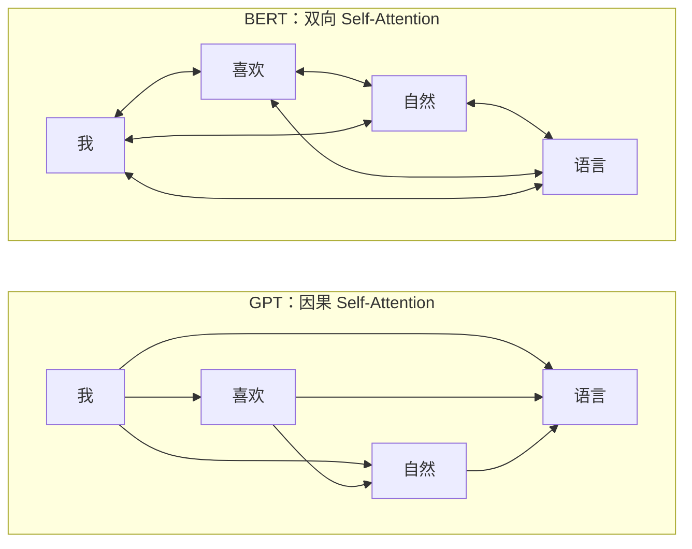
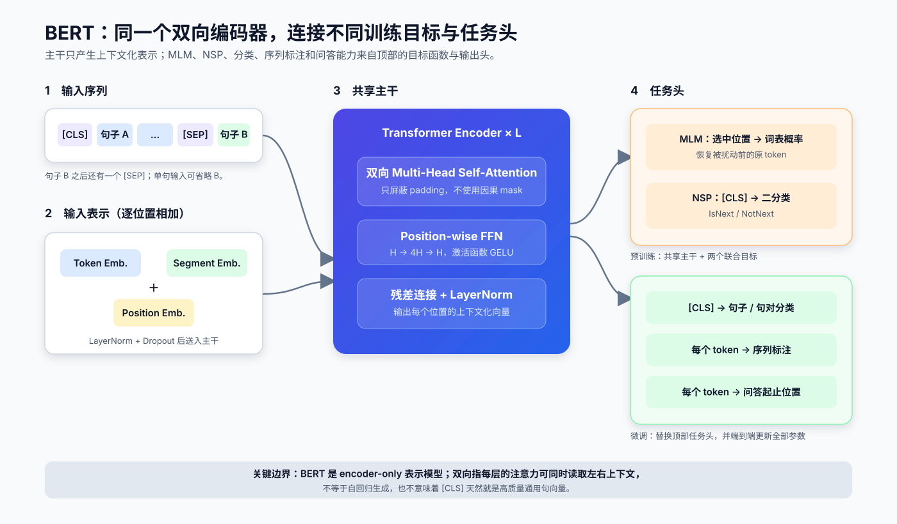
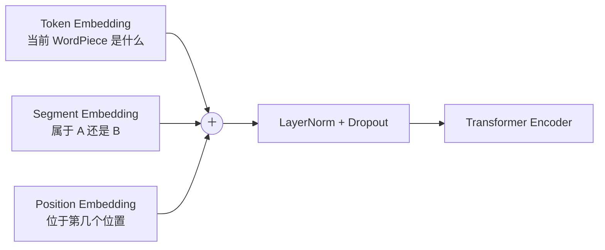

# BERT 原理导读

| 项目 | 内容 |
| --- | --- |
| 论文 | `BERT: Pre-training of Deep Bidirectional Transformers for Language Understanding` |
| 作者 | Jacob Devlin、Ming-Wei Chang、Kenton Lee、Kristina Toutanova |
| 首次公开 / 发表 | 2018 年 10 月 / NAACL-HLT 2019 |
| 主题 | `预训练 / 双向表示 / Encoder-only` |
| 定位 | 用 MLM 训练深层双向 Transformer Encoder，并把“预训练 → 全参数微调”变成通用 NLP 范式 |
| 原文与代码 | [arXiv v2](https://arxiv.org/abs/1810.04805v2) · [论文 PDF](https://arxiv.org/pdf/1810.04805) · [Google 官方代码](https://github.com/google-research/bert) |

一句话概括 BERT：

> **先把部分输入 token 隐藏起来，让多层 Transformer Encoder 同时利用左右上下文恢复原词；再用同一套预训练参数初始化分类、序列标注和抽取式问答等任务。**

BERT 的创新重点不是发明新的 Transformer Block，而是解决了一个训练目标上的矛盾：普通语言模型如果直接看见目标词，就会“抄答案”；如果只允许看左侧，又无法得到深层双向表示。Masked Language Model（MLM）通过先破坏输入、再预测原词，绕开了这个矛盾。

## 1. BERT 要解决什么问题

2018 年以前，预训练语言表示主要有两条路线：

| 路线 | 代表 | 预训练时能看到什么 | 主要限制 |
| --- | --- | --- | --- |
| 特征抽取 | ELMo | 分别训练左到右和右到左 LM，再拼接表示 | 两个方向没有在每一层内联合交互，且下游仍需任务专用架构 |
| 全参数微调 | GPT-1 | 位置 `i` 只能看 `≤ i` 的左侧上下文 | 对需要同时理解前后文的 token 级任务不够自然 |
| BERT | BERT | 每层中，非 padding token 之间都可相互注意 | 不能直接用普通“预测下一个词”目标训练，需要 MLM |

例如，“他到银行取了钱”中“银行”的语义不只依赖左侧的“到”，也依赖右侧的“取了钱”。BERT 让这个 token 在**同一层**里直接聚合两侧信息，并在多层堆叠中反复融合，因此称为“深层双向”。

### 1.1 双向不是“训练两个方向”

BERT 的双向性来自注意力可见范围，而不是训练两个独立模型后拼接：



- GPT 的位置 `i` 不能读取 `i` 之后的 token，适合自回归生成。
- BERT 不使用因果 mask；它仍会使用 **padding mask**，避免真实 token 读取补齐位置。
- “双向”描述的是上下文编码方式，不表示 BERT 可以像 GPT 一样逐 token 生成长文本。

## 2. 一张图看懂 BERT



**读图要点：**

1. 句子 A、句子 B 被拼成一条序列，特殊 token 标记整体与边界。
2. 每个位置的 Token、Segment、Position 三种 embedding 相加，作为 Encoder 输入。
3. 主干只有 Transformer Encoder，没有 Decoder 和 Cross-Attention。
4. 预训练时，MLM 读取被选中位置的隐藏状态；NSP 读取 `[CLS]` 表示。
5. 微调时替换输出头，并更新主干在内的全部参数。论文强调的是 **fine-tuning**，不是冻结 BERT 只训练线性层。

## 3. 输入表示

### 3.1 WordPiece 与特殊 token

BERT 使用大小为 30,000 的 WordPiece 词表。句子对的标准形式是：

```text
[CLS] sentence A [SEP] sentence B [SEP]
```

| token | 作用 |
| --- | --- |
| `[CLS]` | 每条输入的第一个 token；它的最终隐藏状态 `C` 用于句级分类 |
| `[SEP]` | 标记句子或文本片段边界 |
| `[MASK]` | 只用于 MLM 输入扰动；微调和常规推理通常不出现 |
| `[PAD]` | 把批内序列补到相同长度，并由 padding mask 屏蔽 |

论文里的 “sentence A/B” 更准确地说是两个连续文本片段，不要求每段严格对应一个语法句。

### 3.2 三种 embedding 相加

第 `i` 个位置的输入向量为：

$$
E_i =
E_{\text{token}}(x_i)
+ E_{\text{segment}}(s_i)
+ E_{\text{position}}(i)
$$



需要区分两个容易混淆的概念：

- `segment / token_type id` 区分 A 和 B，不表示自然语言中的分词边界；
- 原始 BERT 使用**可学习的绝对位置 embedding**，最大训练长度为 512，不是正弦位置编码。

## 4. 模型主干

### 4.1 Encoder Block

BERT 基本沿用原始 Transformer Encoder。每层包括：

1. Multi-Head Self-Attention；
2. 残差连接与 LayerNorm；
3. 两层 Position-wise FFN，中间使用 GELU；
4. 再一次残差连接与 LayerNorm。

原论文/官方实现采用 post-norm，可简写为：

$$
H' = \operatorname{LayerNorm}
\left(H+\operatorname{Dropout}(\operatorname{MHA}(H))\right)
$$

$$
H_{\text{out}} = \operatorname{LayerNorm}
\left(H'+\operatorname{Dropout}(\operatorname{FFN}(H'))\right)
$$

其中：

$$
\operatorname{FFN}(x)=
\operatorname{GELU}(xW_1+b_1)W_2+b_2
$$

FFN 的中间维度固定为 `4H`。Attention 负责在 token 之间交换信息，FFN 则对每个 token 的通道独立做非线性变换。

### 4.2 双向 Self-Attention

单个注意力头仍使用标准缩放点积注意力：

$$
\operatorname{Attention}(Q,K,V)=
\operatorname{softmax}
\left(
\frac{QK^\top}{\sqrt{d_k}} + M_{\text{pad}}
\right)V
$$

`M_pad` 在真实 Key 位置取 `0`，在 padding Key 位置取 `-\infty`。与 GPT 的关键差异是：BERT **不再叠加上三角因果 mask**，所以一个真实 token 可以读取其左右两侧的所有真实 token。

若 `H ∈ ℝ^{B×T×hidden}`，则注意力分数形状为：

| 张量 | 形状 |
| --- | --- |
| 输入隐藏状态 | `[B, T, H]` |
| 拆头后的 `Q/K/V` | `[B, A, T, H/A]` |
| 注意力分数 / 权重 | `[B, A, T, T]` |
| 合并多头后的输出 | `[B, T, H]` |

因此标准 BERT 的注意力时间和显存随序列长度呈 `O(T²)` 增长。

### 4.3 Base 与 Large

论文用 `L` 表示层数、`H` 表示隐藏维度、`A` 表示注意力头数：

| 模型 | `L` | `H` | `A` | 每头维度 `H/A` | FFN 中间维度 | 参数量 |
| --- | ---: | ---: | ---: | ---: | ---: | ---: |
| BERT-Base | 12 | 768 | 12 | 64 | 3,072 | 110M |
| BERT-Large | 24 | 1,024 | 16 | 64 | 4,096 | 340M |

BERT-Base 被刻意设计得与 GPT-1 规模接近，以便尽量隔离“双向注意力 + 预训练任务”带来的差异。

### 4.4 `[CLS]`、Pooler 与句向量

需要区分三样东西：

- `C = H_last[:, 0]`：最后一层 `[CLS]` 的隐藏状态，论文用它表示整条输入；
- `pooled_output = tanh(WC+b)`：官方实现中的 Pooler 输出，最初供 NSP 使用；
- 下游句向量：必须由具体训练目标决定，不能默认把未经相应微调的 Pooler 输出当作高质量通用 embedding。

论文脚注也特别说明：没有经过相应微调时，`C` 并不天然是有意义的句子表示。

## 5. 预训练目标

### 5.1 Masked Language Model（MLM）

先从序列中均匀选择 15% 的 WordPiece 位置组成集合 `M`。对每个被选中的位置：

| 输入处理 | 占被选中位置 | 占全部 token 的期望比例 |
| --- | ---: | ---: |
| 替换为 `[MASK]` | 80% | 12% |
| 替换为随机 token | 10% | 1.5% |
| 保持原 token 不变 | 10% | 1.5% |

无论输入被怎样处理，标签始终是该位置**扰动前的原 token**。未被选中的 85% 位置不计算 MLM loss：

$$
\mathcal{L}_{\text{MLM}}
=
-\frac{1}{|M|}
\sum_{i\in M}
\log p_\theta(x_i\mid\tilde{x})
$$

其中 `x` 是原序列，`\tilde{x}` 是扰动后的完整序列。

例如：

```text
原序列：  [CLS] 我 今天 去 学校 [SEP]
模型输入：[CLS] 我 今天 去 [MASK] [SEP]
MLM 标签：  -   -   -  -   学校    -
```

为什么不把选中位置全部替换成 `[MASK]`？

- 随机 token 迫使模型判断当前输入是否可信；
- 保持不变让被选中位置偶尔包含真实词；
- 二者共同缓解预训练大量出现 `[MASK]`、微调却没有 `[MASK]` 的分布差异。

但要注意：它们只能**缓解**差异，不能彻底消除差异。

#### 80/10/10 的可运行 PyTorch 实现

下面使用现代 PyTorch 常见的 `-100` 作为忽略标签。代码只跳过调用方标记的特殊 token：

```python
import torch


def make_mlm_batch(
    input_ids: torch.Tensor,
    special_tokens_mask: torch.Tensor,
    mask_token_id: int,
    vocab_size: int,
) -> tuple[torch.Tensor, torch.Tensor]:
    """返回 corrupted_input_ids 和 mlm_labels，形状均为 [B, T]。"""
    corrupted = input_ids.clone()
    labels = input_ids.clone()

    # 只在非特殊 token 中选择约 15% 的预测位置。
    selected = (
        torch.rand(input_ids.shape, device=input_ids.device) < 0.15
    ) & ~special_tokens_mask.bool()
    labels[~selected] = -100

    # 条件概率 80% / 10% / 10%；最后 10% 保持输入不变。
    choice = torch.rand(input_ids.shape, device=input_ids.device)
    use_mask = selected & (choice < 0.8)
    use_random = selected & (choice >= 0.8) & (choice < 0.9)

    corrupted[use_mask] = mask_token_id
    random_ids = torch.randint(
        low=0,
        high=vocab_size,
        size=input_ids.shape,
        device=input_ids.device,
    )
    corrupted[use_random] = random_ids[use_random]
    return corrupted, labels
```

这里最常见的错误是：只给真正替换为 `[MASK]` 的 80% 位置保留标签。正确做法是对**全部被选中的 15% 位置**计算 loss。

### 5.2 Next Sentence Prediction（NSP）

每个样本包含文本片段 A 和 B：

```text
[CLS] 今天天气很好 [SEP] 我们去公园吧 [SEP]  → IsNext
[CLS] 今天天气很好 [SEP] 量子力学很难   [SEP]  → NotNext
```

- 50% 的 B 是语料中紧接 A 的真实下文；
- 50% 的 B 是从语料库随机采样的片段；
- `[CLS]` 的表示 `C` 经过二分类器预测 `IsNext / NotNext`。

$$
\mathcal{L}_{\text{NSP}}
=
-\log p_\theta(y_{\text{NSP}}\mid C)
$$

论文把两个平均损失直接相加：

$$
\mathcal{L}
=
\mathcal{L}_{\text{MLM}}
+ \mathcal{L}_{\text{NSP}}
$$

NSP 是 BERT 的**原始配方**，但不是所有后续 BERT 类模型都需要它。原论文的消融实验认为移除 NSP 会伤害部分任务；RoBERTa 后来在改变数据规模、训练时长和样本组织方式后，发现可以移除 NSP 而不损失效果。更稳妥的结论是：NSP 不是双向编码器成立的必要条件，它的收益依赖整体预训练配方。

### 5.3 两个 loss 怎样落到代码上

假设 `mlm_logits` 形状为 `[B, T, V]`，`nsp_logits` 为 `[B, 2]`：

```python
from torch.nn import functional as F

mlm_loss = F.cross_entropy(
    mlm_logits.transpose(1, 2),  # [B, V, T]
    mlm_labels,                  # [B, T]，非预测位置为 -100
    ignore_index=-100,
)
nsp_loss = F.cross_entropy(nsp_logits, nsp_labels)
loss = mlm_loss + nsp_loss
```

## 6. 一个可运行的最小 Encoder Block

下面的代码包含论文语义上的三种 embedding、padding mask、双向 Self-Attention、post-norm 和 GELU。它只是帮助核对数据流的最小实现，不包含完整的 12/24 层模型、MLM 变换头和 checkpoint 兼容逻辑。

```python
import torch
from torch import nn


class BertEmbeddings(nn.Module):
    def __init__(self, vocab_size: int, hidden_size: int, max_length: int):
        super().__init__()
        self.token = nn.Embedding(vocab_size, hidden_size, padding_idx=0)
        self.segment = nn.Embedding(2, hidden_size)
        self.position = nn.Embedding(max_length, hidden_size)
        self.norm = nn.LayerNorm(hidden_size)
        self.dropout = nn.Dropout(0.1)

    def forward(
        self,
        input_ids: torch.Tensor,
        token_type_ids: torch.Tensor,
    ) -> torch.Tensor:
        seq_len = input_ids.size(1)
        position_ids = torch.arange(seq_len, device=input_ids.device)
        x = (
            self.token(input_ids)
            + self.segment(token_type_ids)
            + self.position(position_ids)
        )
        return self.dropout(self.norm(x))


class BertEncoderBlock(nn.Module):
    def __init__(self, hidden_size: int, num_heads: int):
        super().__init__()
        self.attention = nn.MultiheadAttention(
            hidden_size,
            num_heads,
            dropout=0.1,
            batch_first=True,
        )
        self.attention_norm = nn.LayerNorm(hidden_size)
        self.ffn = nn.Sequential(
            nn.Linear(hidden_size, 4 * hidden_size),
            nn.GELU(),
            nn.Linear(4 * hidden_size, hidden_size),
        )
        self.ffn_norm = nn.LayerNorm(hidden_size)
        self.dropout = nn.Dropout(0.1)

    def forward(
        self,
        x: torch.Tensor,
        attention_mask: torch.Tensor,
    ) -> torch.Tensor:
        # PyTorch 在 key_padding_mask 中用 True 表示“不可读取”。
        key_padding_mask = ~attention_mask.bool()
        attention_output, _ = self.attention(
            x,
            x,
            x,
            key_padding_mask=key_padding_mask,
            need_weights=False,
        )
        x = self.attention_norm(x + self.dropout(attention_output))
        return self.ffn_norm(x + self.dropout(self.ffn(x)))


# 形状自检：2 条序列，每条长度 8，隐藏维度 96。
input_ids = torch.randint(5, 30_000, (2, 8))
input_ids[1, -2:] = 0
token_type_ids = torch.zeros_like(input_ids)
attention_mask = input_ids.ne(0)

embeddings = BertEmbeddings(30_000, hidden_size=96, max_length=512)
block = BertEncoderBlock(hidden_size=96, num_heads=4)
output = block(embeddings(input_ids, token_type_ids), attention_mask)
assert output.shape == (2, 8, 96)
```

这段代码故意没有传入因果 `attn_mask`。如果误加上三角 mask，得到的就不再是 BERT 的双向注意力。

## 7. 预训练配方

| 项目 | 原论文设置 |
| --- | --- |
| 语料 | BooksCorpus 约 8 亿词 + 英文 Wikipedia 约 25 亿词 |
| 词表 | 30,000 WordPiece |
| 最大长度 | 512 |
| Batch | 256 条序列，按 512 长度折算为约 128,000 token / step |
| 训练步数 | 1,000,000，论文估算约遍历 3.3B 词语料 40 次 |
| 长度调度 | 前 90% step 用长度 128，后 10% 用长度 512 学习长位置表示 |
| 优化器 | Adam，`β₁=0.9`、`β₂=0.999`、L2 weight decay `0.01` |
| 学习率 | 峰值 `1e-4`，前 10,000 step warmup，之后线性衰减 |
| 正则与激活 | Dropout `0.1`，GELU |
| 计算资源 | Base：4 个 Cloud TPU（16 个 TPU 芯片）；Large：16 个 Cloud TPU（64 个芯片） |
| 用时 | 两个规模的预训练均约 4 天 |

原文把所有序列按 512 token 折算 batch token 数，但实际前 90% step 使用长度 128。阅读数字时不要误以为全部 100 万步都在计算 256×512 的完整注意力矩阵。

## 8. 下游微调怎样统一

BERT 为每个位置输出隐藏状态 `H ∈ ℝ^{B×T×H}`。不同任务主要区别在于读取哪些位置：

| 任务 | 读取的表示 | 最小任务头 |
| --- | --- | --- |
| 单句 / 句对分类 | `[CLS]` | `Linear(H, num_labels)` |
| 序列标注 / NER | 每个 token | `Linear(H, num_tags)` |
| 抽取式问答 | 问题与段落的每个 token | 两组 logits，分别预测 start / end |
| 多项选择 | 每个选项各自输入后的 `[CLS]` | 为每个选项输出一个分数 |

对于一个 `K` 类分类任务，若 `C ∈ ℝ^H`：

$$
p(y\mid x)=\operatorname{softmax}(WC+b),
\qquad W\in\mathbb{R}^{K\times H}
$$

“只加一个输出层”描述的是**新增参数很少**，不表示主干被冻结。原论文微调时会端到端更新 BERT 的全部参数；典型搜索范围是 batch size `16/32`、学习率 `2e-5/3e-5/5e-5`、训练 `2–4` 个 epoch。

## 9. 实验结果应该怎样读

论文报告 BERT 在 11 项 NLP 任务上取得当时的最佳结果。摘要中的代表数字包括：

| 基准 | BERT 结果 | 论文报告的绝对提升 |
| --- | ---: | ---: |
| GLUE | 80.5 | +7.7 |
| MultiNLI Accuracy | 86.7 | +4.6 |
| SQuAD v1.1 Test F1 | 93.2 | +1.5 |
| SQuAD v2.0 Test F1 | 83.1 | +5.1 |

真正值得记住的不是这些已经成为历史快照的榜单数字，而是两点：

1. 同一预训练主干同时覆盖句级和 token 级任务；
2. BERT-Base 与 GPT-1 规模接近，但双向预训练在理解任务上带来明显优势，支持了论文的核心假设。

## 10. 为什么它有效

- **预训练目标与结构匹配**：MLM 允许 Encoder 在不泄漏目标 token 的前提下联合利用左右上下文。
- **深层交互**：双向信息不是最后才拼接，而是在每个 Transformer 层中反复融合。
- **统一输入接口**：单句、句对、问题—段落都可以表示成一条带 `[CLS]/[SEP]` 的序列。
- **统一迁移方式**：主干从大规模无标注文本获得初始化，下游只需新增很小的任务头并端到端微调。
- **容量与数据规模**：BERT-Large 的结果和消融实验也显示，更大的模型与充分的预训练步数都很重要。

## 11. 局限、争议与后续修正

| 局限 | 为什么是问题 | 典型后续方向 |
| --- | --- | --- |
| `[MASK]` 预训练—微调不一致 | 下游输入通常没有 `[MASK]` | RoBERTa 改进训练配方；ELECTRA 改为判别被替换 token |
| 每批只有约 15% token 提供 MLM 监督 | 相比逐 token 自回归目标，训练信号更稀疏 | ELECTRA、其他去噪目标 |
| NSP 的收益依赖配方 | 随机负例可能过于简单，并混入主题差异 | RoBERTa 移除 NSP；ALBERT 使用句序预测 |
| `O(T²)` 注意力与 512 长度 | 长文档成本高且会被截断 | Longformer、BigBird 等稀疏注意力 |
| Encoder-only 不原生支持开放式生成 | 没有因果解码过程 | GPT 的 decoder-only 路线、T5 的 encoder-decoder 路线 |
| `[CLS]` 不是天然通用句向量 | 预训练目标没有直接优化语义相似度空间 | Sentence-BERT、对比学习式文本表示 |

因此，BERT 的历史地位并不依赖 MLM 与 NSP 的每个细节都成为最终答案。它更重要的贡献是证明：**大规模自监督预训练得到的统一双向编码器，可以通过简单微调迁移到大量语言理解任务。**

## 12. 对照仓库中的实现

本仓库包含一个教学型 PyTorch 实现，可按以下顺序阅读：

| 关注点 | 本地源码 |
| --- | --- |
| 主干组装与 padding mask | [`model/bert.py`](../../code/BERT-pytorch/bert_pytorch/model/bert.py) |
| 三种输入 embedding | [`model/embedding/bert.py`](../../code/BERT-pytorch/bert_pytorch/model/embedding/bert.py) |
| Encoder Block | [`model/transformer.py`](../../code/BERT-pytorch/bert_pytorch/model/transformer.py) |
| Scaled Dot-Product Attention | [`model/attention/single.py`](../../code/BERT-pytorch/bert_pytorch/model/attention/single.py) |
| 80/10/10 MLM 与 NSP 样本 | [`dataset/dataset.py`](../../code/BERT-pytorch/bert_pytorch/dataset/dataset.py) |
| MLM / NSP 输出头 | [`model/language_model.py`](../../code/BERT-pytorch/bert_pytorch/model/language_model.py) |
| 两个 loss 相加 | [`trainer/pretrain.py`](../../code/BERT-pytorch/bert_pytorch/trainer/pretrain.py) |

但它不是原论文的精确复现，阅读时应主动注意这些差异：

1. 本地实现使用正弦位置编码；原始 BERT 使用可学习位置 embedding。
2. 本地 `SublayerConnection` 是 pre-norm；原始 BERT 是 post-norm。
3. 本地 embedding 相加后只有 dropout；官方 BERT 还有 LayerNorm。
4. 本地 MLM head 是简单线性层；官方实现还包含 Dense → GELU → LayerNorm，并与输入词 embedding 共享解码权重。
5. 本地 README 明确将项目描述为教学用途、尚未完整验证，所以应以论文与 Google 官方实现为事实基准。

## 13. 常见误解

- **“BERT 会预测所有 token。”** 原始 MLM 只对选中的 15% WordPiece 位置计算损失。

- **“15% token 都被替换成 `[MASK]`。”** 实际只有全部 token 的期望 12%；另有 1.5% 随机替换、1.5% 保持不变。

- **“BERT 没有任何 attention mask。”** 它没有因果 mask，但仍需要 padding mask。

- **“`[CLS]` 一定是最好的句向量。”** `[CLS]` 只是一个可被任务目标塑造的聚合位置，效果取决于如何训练。

- **“微调只训练新加的分类头。”** 原论文会更新包括 BERT 主干在内的全部参数。

- **“NSP 是 BERT 双向建模的来源。”** 双向性来自 MLM 与非因果 Self-Attention；NSP 是额外的句对目标。

## 14. 建议阅读顺序

1. 先读 [Transformer 原理导读](00_Transformer_2017_原理.md)，理解 Encoder、Self-Attention 与 padding mask。
2. 再对照 [GPT-1 原理导读](02_GPT_2018_原理.md)，重点比较因果 mask 与 MLM。
3. 阅读 BERT 论文第 3 节和附录 A，核对输入、80/10/10、训练配方。
4. 顺着上面的本地源码表走一遍，特别检查 mask 形状和 loss 的忽略位置。
5. 最后读 [RoBERTa](https://arxiv.org/abs/1907.11692)，区分“BERT 的核心思想”和“原始 BERT 的具体训练配方”。

## 15. 参考资料

- Devlin et al., [BERT: Pre-training of Deep Bidirectional Transformers for Language Understanding](https://arxiv.org/pdf/1810.04805)
- Google Research, [Official BERT repository](https://github.com/google-research/bert)
- Liu et al., [RoBERTa: A Robustly Optimized BERT Pretraining Approach](https://arxiv.org/abs/1907.11692)
