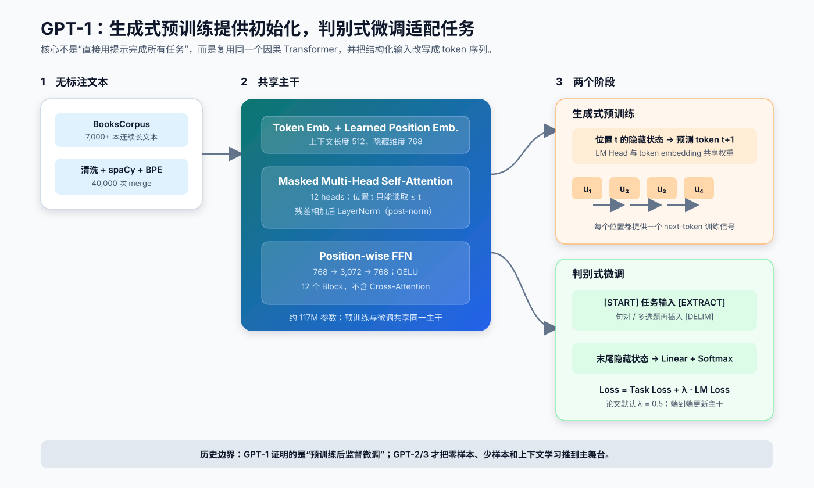
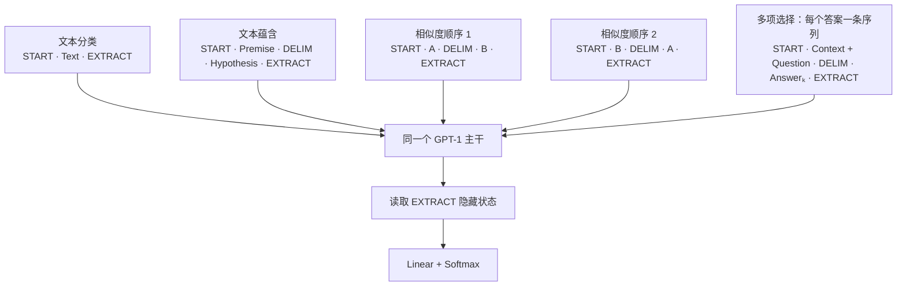

# GPT-1 原理导读

| 项目 | 内容 |
| --- | --- |
| 论文 | `Improving Language Understanding by Generative Pre-Training` |
| 作者 | Alec Radford、Karthik Narasimhan、Tim Salimans、Ilya Sutskever |
| 公开时间 | 2018 年 6 月 |
| 主题 | `生成式预训练 / Decoder-only / 监督微调` |
| 定位 | 用同一个因果 Transformer 完成“无标注语言模型预训练 → 多类理解任务监督微调” |
| 原文与代码 | [OpenAI 论文 PDF](https://cdn.openai.com/research-covers/language-unsupervised/language_understanding_paper.pdf) · [发布博客](https://openai.com/index/language-unsupervised/) · [官方代码](https://github.com/openai/finetune-transformer-lm) |

今天通常把论文中的模型称为 **GPT-1**，以便与 GPT-2/3 区分；原论文和官方代码更多使用 “Transformer LM” 或 “generative pre-training”，并没有把它包装成聊天或提示模型。

一句话概括 GPT-1：

> **先用“预测下一个 token”在连续长文本上训练一个通用因果 Transformer，再把不同下游任务序列化为统一 token 序列，通过一个小型分类头端到端微调整个模型。**

它建立的是两阶段迁移学习范式。论文的主结果来自**有标签数据上的判别式微调**，不是后来 GPT-2 的零样本任务接口，也不是 GPT-3 的 in-context learning。

## 1. GPT-1 要解决什么问题

2018 年的自然语言理解系统面临两个瓶颈：

1. 文本蕴含、问答、语义相似度、分类等任务依赖昂贵的人工标签；
2. 每种任务往往需要不同的网络结构，预训练表示难以用一种简单方式迁移。

GPT-1 的回答由两部分组成：


- **目标统一**：预训练只使用标准的从左到右语言模型目标；
- **主干统一**：下游任务复用同一个 Transformer；
- **接口尽量统一**：结构化输入被改写成 token 序列，顶部只增加线性层；
- **参数真正迁移**：不只迁移词向量，而是迁移多层 Transformer 的全部参数。

## 2. 一张图看懂 GPT-1



**读图要点：**

1. BooksCorpus 提供跨句、跨段落的连续文本，训练信号来自每个位置的下一个 token。
2. GPT-1 使用 12 层带因果 mask 的 Transformer，没有 Encoder–Decoder Cross-Attention。
3. 预训练 LM Head 与 token embedding 共享权重。
4. 微调时把任务输入拼成单一序列，读取末尾特殊 token 的隐藏状态进行分类。
5. 论文还在微调阶段保留辅助 LM loss，默认权重 `λ=0.5`。

## 3. 生成式预训练

### 3.1 自回归分解

给定 token 序列 `U={u₁,…,uₙ}` 和上下文窗口 `k`，论文最大化：

$$
\mathcal{L}_1(U)
=
\sum_i
\log p_\theta
\left(
u_i\mid u_{i-k},\ldots,u_{i-1}
\right)
$$

等价地，整段序列的联合概率按从左到右分解：

$$
p_\theta(u_1,\ldots,u_T)
=
\prod_{t=1}^{T}
p_\theta(u_t\mid u_{<t})
$$

训练样本不需要人工标签，因为“下一个 token”就是由原文本自动产生的监督信号：

```text
模型输入：  我   喜欢   自然   语言
预测目标：喜欢   自然   语言   处理
```

实现时通常不手工构造两份完整数据，而是让：

- `logits[:, :-1]` 对齐 `input_ids[:, 1:]`；
- 最后一个位置没有序列内的下一 token 标签，因此不参与该窗口的 loss。

### 3.2 输入表示与权重共享

论文把上下文 token embedding 与可学习的位置 embedding 相加：

$$
H_0 = UW_e + W_p
$$

经过 `L` 个 Transformer Block：

$$
H_l=\operatorname{TransformerBlock}(H_{l-1}),
\qquad l=1,\ldots,L
$$

位置 `t` 的隐藏状态预测 `u_{t+1}`：

$$
p(u_{t+1}\mid u_{\le t})
=
\operatorname{softmax}
\left(
h_t^L W_e^\top
\right)
$$

输出投影复用输入 token embedding 矩阵 `W_e`，即 **weight tying**。它减少参数，也让输入和输出词表共享同一表示空间。

GPT-1 使用可学习的绝对位置 embedding，而不是原始 Transformer 的正弦位置编码；训练上下文长度为 512。

### 3.3 因果 Self-Attention

GPT-1 的核心结构约束是因果 mask：

$$
M_{\text{causal}}[i,j]
=
\begin{cases}
0,&j\le i\\
-\infty,&j>i
\end{cases}
$$

$$
\operatorname{Attention}(Q,K,V)
=
\operatorname{softmax}
\left(
\frac{QK^\top}{\sqrt{d_k}}
+M_{\text{causal}}
+M_{\text{pad}}
\right)V
$$

对于长度为 5 的序列，可见性矩阵是下三角：

```text
             可读取的 Key 位置
Query       0   1   2   3   4
位置 0      ✓   ·   ·   ·   ·
位置 1      ✓   ✓   ·   ·   ·
位置 2      ✓   ✓   ✓   ·   ·
位置 3      ✓   ✓   ✓   ✓   ·
位置 4      ✓   ✓   ✓   ✓   ✓
```

这里常有两个方向性误解：

- 位置 `t` 的隐藏状态可以读取当前 token `u_t`，但训练标签是 `u_{t+1}`，所以没有泄漏；
- “Masked Self-Attention” 指屏蔽未来位置，不是 BERT 那种随机把输入替换成 `[MASK]`。

### 3.4 模型规模

| 配置 | GPT-1 |
| --- | ---: |
| Transformer Block | 12 |
| 隐藏维度 | 768 |
| 注意力头 | 12 |
| 每头维度 | 64 |
| FFN 中间维度 | 3,072 |
| 最大上下文 | 512 |
| BPE | 40,000 次 merge |
| 参数量 | 约 117M |
| 激活函数 | GELU |
| 归一化 | post-norm |

论文称其为 “multi-layer Transformer decoder”。按今天的术语，它是 **decoder-only Transformer**：有因果 Self-Attention，但没有原始 Transformer Decoder 中读取 Encoder 输出的 Cross-Attention。

官方 GPT-1 Block 使用 post-norm：

$$
H'=\operatorname{LayerNorm}
\left(
H+\operatorname{Dropout}(\operatorname{MHA}(H))
\right)
$$

$$
H_{\text{out}}=\operatorname{LayerNorm}
\left(
H'+\operatorname{Dropout}(\operatorname{FFN}(H'))
\right)
$$

这点不要套用 GPT-2 之后的印象：GPT-2 改为 pre-norm，并在全部 Block 之后增加 final LayerNorm。

## 4. 可运行的最小 GPT-1 主干

下面用现代 PyTorch 复现 GPT-1 的关键语义：可学习位置 embedding、因果注意力、post-norm、GELU、12 倍可堆叠 Block 和 LM 权重共享。为方便阅读，示例规模远小于论文配置，也不兼容原始 TensorFlow checkpoint。

```python
import torch
from torch import nn
from torch.nn import functional as F


class GPT1Block(nn.Module):
    def __init__(self, hidden_size: int, num_heads: int, dropout: float = 0.1):
        super().__init__()
        self.attention = nn.MultiheadAttention(
            hidden_size,
            num_heads,
            dropout=dropout,
            batch_first=True,
        )
        self.attention_norm = nn.LayerNorm(hidden_size)
        self.ffn = nn.Sequential(
            nn.Linear(hidden_size, 4 * hidden_size),
            nn.GELU(),
            nn.Linear(4 * hidden_size, hidden_size),
        )
        self.ffn_norm = nn.LayerNorm(hidden_size)
        self.dropout = nn.Dropout(dropout)

    def forward(
        self,
        x: torch.Tensor,
        causal_mask: torch.Tensor,
        key_padding_mask: torch.Tensor | None = None,
    ) -> torch.Tensor:
        attention_output, _ = self.attention(
            x,
            x,
            x,
            attn_mask=causal_mask,
            key_padding_mask=key_padding_mask,
            need_weights=False,
        )
        x = self.attention_norm(x + self.dropout(attention_output))
        return self.ffn_norm(x + self.dropout(self.ffn(x)))


class TinyGPT1(nn.Module):
    def __init__(
        self,
        vocab_size: int,
        hidden_size: int = 96,
        num_heads: int = 4,
        num_layers: int = 2,
        max_length: int = 128,
    ):
        super().__init__()
        self.max_length = max_length
        self.token_embedding = nn.Embedding(vocab_size, hidden_size)
        self.position_embedding = nn.Embedding(max_length, hidden_size)
        self.embedding_dropout = nn.Dropout(0.1)
        self.blocks = nn.ModuleList(
            GPT1Block(hidden_size, num_heads) for _ in range(num_layers)
        )

    def forward(
        self,
        input_ids: torch.Tensor,
        attention_mask: torch.Tensor | None = None,
    ) -> tuple[torch.Tensor, torch.Tensor]:
        batch_size, seq_len = input_ids.shape
        if seq_len > self.max_length:
            raise ValueError("sequence is longer than max_length")

        position_ids = torch.arange(seq_len, device=input_ids.device)
        hidden = self.embedding_dropout(
            self.token_embedding(input_ids)
            + self.position_embedding(position_ids)
        )

        # PyTorch 的 bool attn_mask 中，True 表示禁止读取。
        causal_mask = torch.triu(
            torch.ones(seq_len, seq_len, dtype=torch.bool, device=input_ids.device),
            diagonal=1,
        )
        key_padding_mask = (
            None if attention_mask is None else ~attention_mask.bool()
        )

        for block in self.blocks:
            hidden = block(hidden, causal_mask, key_padding_mask)

        # F.linear(..., token_embedding.weight) 显式实现 weight tying。
        logits = F.linear(hidden, self.token_embedding.weight)
        return logits, hidden


# 形状自检。
input_ids = torch.randint(0, 1_000, (2, 16))
model = TinyGPT1(vocab_size=1_000)
logits, hidden = model(input_ids)
assert logits.shape == (2, 16, 1_000)
assert hidden.shape == (2, 16, 96)
```

代码里没有 final LayerNorm，这是为了贴近 GPT-1，而不是遗漏。

### 4.1 Shifted labels 与 padding

假设 `attention_mask` 中真实 token 为 `1`、padding 为 `0`：

```python
def causal_lm_loss(
    logits: torch.Tensor,
    input_ids: torch.Tensor,
    attention_mask: torch.Tensor,
) -> torch.Tensor:
    """让位置 t 的 logits 预测位置 t+1 的 token。"""
    shift_logits = logits[:, :-1].contiguous()
    shift_labels = input_ids[:, 1:].clone()
    shift_labels.masked_fill_(~attention_mask[:, 1:].bool(), -100)

    return F.cross_entropy(
        shift_logits.view(-1, shift_logits.size(-1)),
        shift_labels.reshape(-1),
        ignore_index=-100,
    )
```

因果 mask 和标签右移解决的是不同问题：

- 因果 mask 防止隐藏状态读取未来输入；
- shifted labels 指定当前位置究竟要预测哪个 token；
- 两者缺一不可。

## 5. 判别式微调

### 5.1 分类头读取哪里

对于带标签样本 `(x¹,…,xᵐ,y)`，论文读取最后一个位置的最终隐藏状态：

$$
p(y\mid x^1,\ldots,x^m)
=
\operatorname{softmax}
\left(
h_m^L W_y
\right)
$$

任务输入末尾会加入一个特殊“提取/分类”token，因此 `h_m^L` 可以理解为 `[EXTRACT]` 位置的表示。新增参数主要是分类矩阵 `W_y` 和特殊 token embeddings；Transformer 主干会一起微调。

### 5.2 把结构化任务变成序列

下表用 `[START] / [DELIM] / [EXTRACT]` 表示论文图中的特殊 token；官方代码对应 `_start_ / _delimiter_ / _classify_`。

| 任务 | 输入变换 | 如何得到预测 |
| --- | --- | --- |
| 文本分类 | `[START] text [EXTRACT]` | 末尾隐藏状态接线性分类器 |
| 文本蕴含 | `[START] premise [DELIM] hypothesis [EXTRACT]` | 预测 entailment / neutral / contradiction |
| 语义相似度 | 同时编码 `A→B` 与 `B→A` | 两个末尾表示逐元素相加，再分类或回归 |
| 问答 / 常识多选 | 每个答案构造 `[START] context question [DELIM] answerₖ [EXTRACT]` | 每个候选独立打分，再对候选做 softmax |



这是“统一接口”的早期形式，但仍带有人工设计的任务序列化规则；它还不是自然语言 instruction，也不是不更新参数的 prompt。

### 5.3 输入变换代码

以下函数操作的都是 tokenizer 已输出的 token id：

```python
def classification_input(
    text: list[int],
    start_id: int,
    extract_id: int,
) -> list[int]:
    return [start_id, *text, extract_id]


def entailment_input(
    premise: list[int],
    hypothesis: list[int],
    start_id: int,
    delimiter_id: int,
    extract_id: int,
) -> list[int]:
    return [
        start_id,
        *premise,
        delimiter_id,
        *hypothesis,
        extract_id,
    ]


def similarity_inputs(
    text_a: list[int],
    text_b: list[int],
    start_id: int,
    delimiter_id: int,
    extract_id: int,
) -> tuple[list[int], list[int]]:
    ab = [start_id, *text_a, delimiter_id, *text_b, extract_id]
    ba = [start_id, *text_b, delimiter_id, *text_a, extract_id]
    return ab, ba


def multiple_choice_inputs(
    context: list[int],
    question: list[int],
    answers: list[list[int]],
    start_id: int,
    delimiter_id: int,
    extract_id: int,
) -> list[list[int]]:
    return [
        [
            start_id,
            *context,
            *question,
            delimiter_id,
            *answer,
            extract_id,
        ]
        for answer in answers
    ]
```

真正训练时还要统一截断与 padding，并确保 `[EXTRACT]` 没有在超长序列截断时被删除。

### 5.4 为什么微调时还保留 LM loss

论文最大化：

$$
\mathcal{L}_3(C)
=
\mathcal{L}_2(C)+\lambda\mathcal{L}_1(C)
$$

其中 `L₂` 是监督任务对数似然，`L₁` 是同一输入上的语言模型对数似然。若代码用需要最小化的交叉熵：

$$
\mathcal{J}
=
\operatorname{CE}_{\text{task}}
+\lambda\operatorname{CE}_{\text{LM}}
$$

```python
def fine_tuning_loss(
    task_logits: torch.Tensor,
    task_labels: torch.Tensor,
    lm_logits: torch.Tensor,
    input_ids: torch.Tensor,
    attention_mask: torch.Tensor,
    lm_weight: float = 0.5,
) -> torch.Tensor:
    task_loss = F.cross_entropy(task_logits, task_labels)
    lm_loss = causal_lm_loss(lm_logits, input_ids, attention_mask)
    return task_loss + lm_weight * lm_loss
```

作者认为辅助 LM 目标能改善泛化并加快收敛，但消融结果更细腻：它对较大的 NLI 数据集和 QQP 更有帮助，对小数据集未必有利；八项任务的无权平均甚至从 `74.7` 轻微变为 `75.0`。因此不应把辅助 LM 描述成 GPT-1 成功的必要条件。

## 6. 原论文训练配方

### 6.1 预训练

| 项目 | 原论文设置 |
| --- | --- |
| 数据 | BooksCorpus，7,000+ 本未出版书籍，约 5GB 连续文本 |
| Tokenizer | ftfy 清洗、spaCy 预分词、BPE 40,000 merges |
| 序列 | 随机采样连续 512-token 片段 |
| Batch size | 64 |
| Epoch | 100 |
| 优化器 | Adam |
| 最大学习率 | `2.5e-4` |
| 调度 | 前 2,000 update 线性 warmup，随后 cosine decay 到 0 |
| 初始化 | `N(0, 0.02)` |
| Dropout | embedding / residual / attention 均为 `0.1` |
| 正则 | 非 bias、非 gain 权重使用修改版 L2，`w=0.01` |
| 计算 | 8 张 P600 GPU，约 30 天；OpenAI 报告约 `0.96 pfs-days` |

BooksCorpus 的关键不只在规模，还在于保留长段连续文本。论文特意对比了大小相近、但在句子级被打乱的 1B Word Benchmark，强调长程结构对预训练的重要性。

### 6.2 微调

| 项目 | 多数任务的默认设置 |
| --- | --- |
| 学习率 | `6.25e-5` |
| Batch size | 32 |
| Epoch | 3 |
| 分类器 Dropout | `0.1` |
| 调度 | 训练前 `0.2%` warmup，之后线性衰减 |
| 辅助 LM 权重 | `λ=0.5` |

与今天常见做法一样，具体任务仍可能使用不同超参数；表中只是论文报告的多数任务默认值。

## 7. 实验结果与消融

论文覆盖四类、共 12 个数据集，并在其中 9 个上刷新了当时最佳结果：

| 类别 | 代表数据集 | GPT-1 结果 |
| --- | --- | ---: |
| 文本蕴含 | MNLI-m / MNLI-mm | 82.1 / 81.4 Accuracy |
| 文本蕴含 | SNLI / SciTail / QNLI | 89.9 / 88.3 / 88.1 Accuracy |
| 问答 | RACE | 59.0 Accuracy |
| 常识推理 | Story Cloze | 86.5 Accuracy |
| 语言可接受性 | CoLA | 45.4 Matthews correlation |
| 综合基准 | GLUE | 72.8 |

摘要重点报告了 Story Cloze `+8.9`、RACE `+5.7`、MultiNLI `+1.5` 的绝对提升。

结果并非所有任务都领先：RTE、MRPC、SST-2 等数据集上仍有更强的既有系统。这个边界反而能更准确地说明论文贡献——它不是“一套模型包打天下”，而是首次用极少架构定制在广泛理解任务上取得强迁移效果。

### 7.1 三个关键消融

| 设置 | 八项任务无权平均 | 说明 |
| --- | ---: | --- |
| Transformer + 预训练 + 辅助 LM | 74.7 | 论文完整设置 |
| 无预训练 | 59.9 | 下降 14.8，说明通用初始化是核心 |
| 无辅助 LM | 75.0 | 平均略高，说明辅助目标并非普遍有效 |
| LSTM + 预训练 + 辅助 LM | 69.1 | 比 Transformer 低 5.6，支持架构选择 |

此外，逐步增加迁移层数会持续改善 MultiNLI 与 RACE；在 MultiNLI 上，全层迁移相对只迁移少量层最多带来约 9% 提升。这说明迁移的不是一张静态词表，而是分布在深层网络中的功能。

## 8. 论文里的 zero-shot 到底是什么

GPT-1 确实分析了无需监督微调的行为，但那不是论文主结果。作者为不同任务设计了启发式打分：

- CoLA：用平均 token log-probability 判断句子是否自然；
- SST-2：在句末添加 `very`，比较 `positive` 与 `negative` 的概率；
- RACE：比较各候选答案在文档与问题条件下的平均 log-probability；
- 指代消解：替换不同候选实体，比较后续序列概率。

这些 zero-shot 指标随 LM 预训练推进而稳定上升，说明 next-token prediction 会学习任务相关能力；但 OpenAI 当时也明确指出，其绝对性能往往仍低于监督方法。

因此三代论文的关注点可以这样区分：

| 模型 | 主要迁移方式 |
| --- | --- |
| GPT-1 | 预训练后监督微调 |
| GPT-2 | 重点展示零样本任务行为 |
| GPT-3 | 重点展示 zero/one/few-shot in-context learning |

## 9. GPT-1 与 BERT 的分叉

| 维度 | GPT-1 | BERT |
| --- | --- | --- |
| 公开时间 | 2018 年 6 月 | 2018 年 10 月 |
| 主干 | Decoder-only | Encoder-only |
| 可见范围 | 仅当前位置及左侧 | 左右双向 |
| 预训练目标 | Next-token LM | MLM + NSP |
| 每批监督密度 | 几乎每个非末尾 token | 被选中的 15% token + NSP |
| 下游读取方式 | 末尾 `[EXTRACT]` 为主 | `[CLS]` 或逐 token 表示 |
| 开放式生成 | 原生适配 | 非原生目标 |
| 预训练—生成一致性 | 一致 | `[MASK]` 带来分布差异 |

两者共同确立了“先大规模预训练，再端到端微调”的路线；真正的分叉是：**GPT 保留因果目标以兼顾生成，BERT 用 MLM 换取深层双向理解。**

## 10. 为什么它有效

- **密集、自生成监督**：连续序列中几乎每个位置都产生 next-token 训练信号。
- **长文本预训练**：BooksCorpus 保留跨句、跨段落结构，有利于学习长程依赖。
- **Transformer 适合迁移**：多层注意力表示包含比静态词向量更丰富的句法、语义与世界知识。
- **输入变换减少架构碎片**：多类任务复用同一主干，只改变序列组织与顶部线性层。
- **全参数微调**：预训练知识不是冻结特征，而是会根据目标任务整体调整。
- **语言模型辅助约束**：在部分较大数据集上，微调期间保留 LM 目标可降低过拟合并加快收敛。

## 11. 局限与历史边界

| 局限 | 具体影响 |
| --- | --- |
| 单向上下文 | 做 token 级理解时不能利用右侧信息，BERT 随后直接针对这一点改进 |
| 每个任务仍需标注与微调 | 需要单独训练任务 checkpoint，不是一个模型零样本完成所有任务 |
| 输入模板仍是人工设计 | 蕴含、相似度、多选题各有专门序列化规则 |
| 512 上下文与 `O(T²)` 注意力 | 长文档必须截断，训练与推理成本随长度平方增长 |
| 预训练计算昂贵 | 当时需要 8 张 P600 运行约一个月 |
| 文本数据有缺失与偏见 | 只从书籍学习无法保证事实完整、公平或与现实世界一致 |
| 泛化仍脆弱 | 对对抗样本、分布外输入和小数据集表现不稳定 |
| 不是聊天模型 | 没有指令微调、偏好对齐、多轮对话状态或工具使用训练 |

GPT-1 的历史地位不在于它已经具备现代 LLM 的全部能力，而在于它验证了一条可以持续扩展的路线：**简单统一的生成式目标 + 通用 Transformer 主干 + 少量任务适配**。

## 12. 怎样读官方代码

官方仓库代码非常紧凑，主体集中在 `train.py`：

| 原理 | 官方源码位置 |
| --- | --- |
| 下三角因果 mask | [`mask_attn_weights`](https://github.com/openai/finetune-transformer-lm/blob/master/train.py) |
| Q/K/V、多头拆分与缩放 | 同文件的 `_attn`、`attn` |
| post-norm Block | 同文件的 `block` |
| token + position embedding | 同文件的 `embed`、`model` |
| shifted LM labels | `h[:, :-1]` 对齐 `X[:, 1:]` |
| `[EXTRACT]` 位置池化 | `pool_idx` 与 `clf_token` |
| 任务 loss + `lm_coef` | `mgpu_train` |
| BPE 与文本清洗 | [`text_utils.py`](https://github.com/openai/finetune-transformer-lm/blob/master/text_utils.py) |

阅读时注意：

1. 这是 TensorFlow 1.x 时代的研究代码，写法和现代 PyTorch/Transformers 差异很大。
2. token、特殊 token 与 position 共用一个大的 embedding 表，通过两列索引后求和实现。
3. 仓库 README 说明公开代码主要复现 ROCStories，且 GPU 操作导致结果非确定；它不是论文全部 12 个任务的完整训练框架。
4. 代码已归档，适合核对历史实现，不适合作为现代项目脚手架。

## 13. 常见误解

- **“GPT-1 的主打能力是 prompt。”** 主结果来自每个任务上的监督微调；zero-shot 只作为分析。

- **“Decoder-only 就等于原始 Transformer 的完整 Decoder。”** GPT-1 没有 Cross-Attention，只保留带因果 mask 的 Self-Attention 与 FFN。

- **“因果 mask 后，位置 `t` 看不到自己。”** 它可以读取 `u_t`，但预测目标被右移为 `u_{t+1}`。

- **“Masked Self-Attention 就是 `[MASK]` 训练。”** GPT-1 的 mask 屏蔽未来注意力连接，不会随机替换输入 token。

- **“GPT 系列一直都是 pre-norm。”** GPT-1 官方实现是 post-norm；GPT-2 才改为 pre-norm 并增加 final norm。

- **“微调只训练新分类器。”** 分类器参数很少，但 GPT-1 主干会端到端更新。

- **“辅助 LM loss 总能提升效果。”** 它在部分大数据集上有帮助，但论文无权平均结果并未优于移除该目标。

## 14. 建议阅读顺序

1. 先读 [Transformer 原理导读](00_Transformer_2017_原理.md)，重点理解 Decoder mask 和残差结构。
2. 阅读 GPT-1 论文第 3 节，抓住 `L₁ → L₂ → L₃` 三个目标。
3. 对照论文 Figure 1 与本文任务输入变换表，理解“统一主干”不等于“完全没有任务规则”。
4. 阅读 [BERT 原理导读](01_BERT_2018_原理.md)，比较因果 LM 与 MLM。
5. 接着读 [GPT-2 原理导读](03_GPT2_2019_原理.md)，观察主线如何从监督微调转向零样本任务行为。

## 15. 参考资料

- Radford et al., [Improving Language Understanding by Generative Pre-Training](https://cdn.openai.com/research-covers/language-unsupervised/language_understanding_paper.pdf)
- OpenAI, [Improving language understanding with unsupervised learning](https://openai.com/index/language-unsupervised/)
- OpenAI, [finetune-transformer-lm](https://github.com/openai/finetune-transformer-lm)
