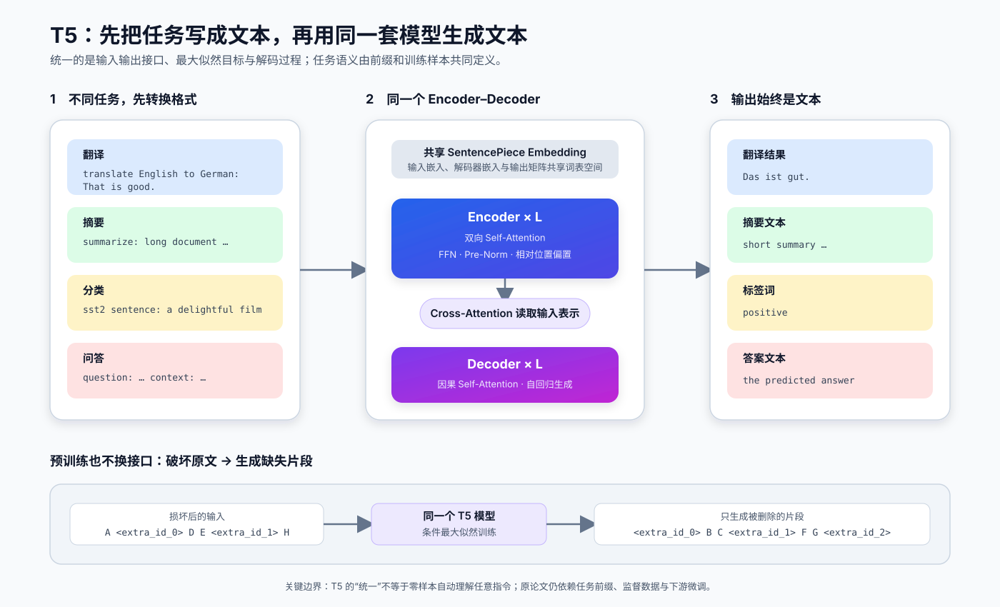
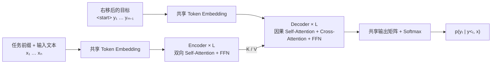
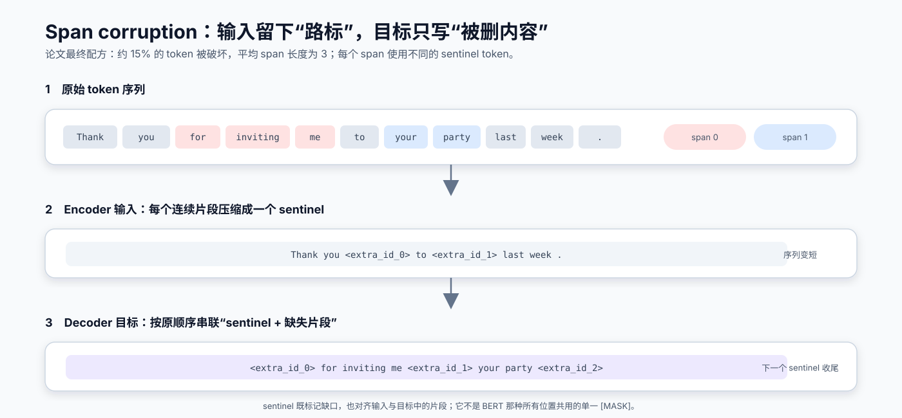
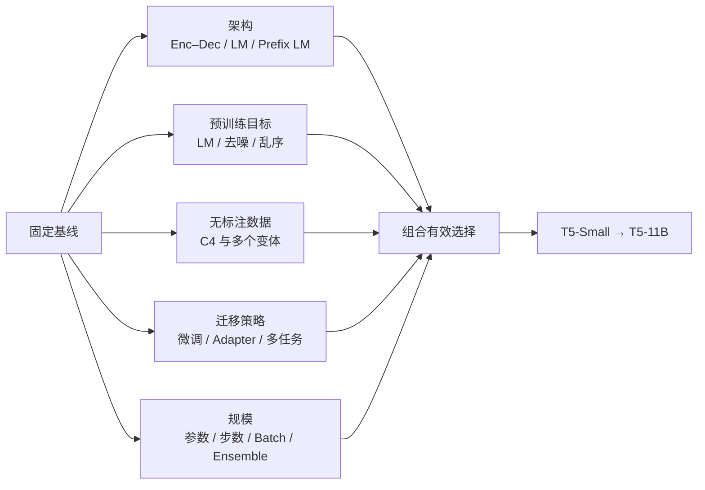

# T5 原理：把所有 NLP 任务统一成 Text-to-Text

| 项目 | 内容 |
| --- | --- |
| 论文 | `Exploring the Limits of Transfer Learning with a Unified Text-to-Text Transformer` |
| 模型全名 | **T**ext-**t**o-**T**ext **T**ransfer **T**ransformer（五个 T） |
| 作者 | Colin Raffel、Noam Shazeer、Adam Roberts 等 |
| 首次公开 / 发表 | 2019 年 10 月 / JMLR 2020 |
| 主题 | `统一任务接口 / Encoder–Decoder / Span Corruption / C4` |
| 定位 | 用统一实验框架系统比较 NLP 迁移学习方案，并把“任务即文本生成”推成主流范式 |
| 原文与代码 | [JMLR 论文](https://www.jmlr.org/papers/v21/20-074.html) · [arXiv](https://arxiv.org/abs/1910.10683) · [Google 官方代码](https://github.com/google-research/text-to-text-transfer-transformer) |

一句话概括 T5：

> **先给每个任务设计文本前缀，把输入和答案都写成字符串；再用同一个 Encoder–Decoder Transformer、同一个最大似然目标和同一种生成接口解决分类、问答、翻译与摘要。**

T5 的重要性不只来自一个模型。论文真正完成了三件事：

1. 提出统一的 **text-to-text** 接口，让不同任务可以在同一坐标系中比较；
2. 固定大部分变量，系统研究架构、预训练目标、语料、迁移方式和规模；
3. 根据实验结果组合出 `span corruption + C4 + Encoder–Decoder + scale` 的 T5 系列。

因此，阅读 T5 时不要只问“网络有几层”，还要问：

- 为什么一个分类标签也要由 Decoder 生成？
- span corruption 为什么比逐 token 的 `[MASK]` 更适合 Encoder–Decoder？
- 论文哪些结论来自受控实验，哪些能力来自扩大模型和数据？

## 1. T5 要解决什么问题

T5 之前，NLP 迁移学习已经很强，但任务接口十分碎片化：

| 任务 | 常见输入 | 常见输出头 / 目标 |
| --- | --- | --- |
| 情感分类 | 一段文本 | 线性分类头 + 交叉熵 |
| 序列标注 | token 序列 | 每个 token 一个分类头 |
| 抽取式问答 | 问题 + 上下文 | 起点、终点两个分类头 |
| 翻译 / 摘要 | 源文本 | Encoder–Decoder 自回归生成 |

这会带来两个问题：

- **工程不统一**：每换一个任务，数据格式、模型头、损失函数和解码代码都可能变化；
- **研究难比较**：架构、数据、目标函数、训练预算往往一起变化，很难知道提升究竟来自哪里。

T5 的答案是把所有任务都重写为：

$$
\text{text input} \longrightarrow \text{text output}
$$

统一后，模型学习的都是同一个条件分布：

$$
p_\theta(y \mid x)
=
\prod_{t=1}^{|y|}
p_\theta(y_t \mid y_{<t}, x)
$$

其中 `x` 是带任务前缀的输入文本，`y` 是目标文本。无论 `y` 是一句译文、一段摘要，还是一个标签词，训练时都使用 teacher forcing 和 token-level 交叉熵。

## 2. Text-to-Text 到底统一了什么

### 2.1 任务只通过文本格式区分

| 任务 | 输入文本 | 目标文本 |
| --- | --- | --- |
| 翻译 | `translate English to German: That is good.` | `Das ist gut.` |
| 摘要 | `summarize: <document>` | `<summary>` |
| 自然语言推断 | `mnli premise: ... hypothesis: ...` | `entailment` |
| 语义相似度 | `stsb sentence1: ... sentence2: ...` | `3.8` |
| 问答 | `question: ... context: ...` | `<answer>` |

分类任务不再增加一个专用分类头，而是生成 `positive`、`entailment` 等标签词；回归任务 STS-B 也被离散化为文本分数。



**读图要点：**

1. 任务前缀和原始内容先拼成普通文本，再用同一个 SentencePiece 词表编码；
2. Encoder 双向理解完整输入，Decoder 在 Cross-Attention 条件下逐 token 生成；
3. 输入、输出都在同一词表空间中，因此分类、问答和生成可以复用同一个 LM Head；
4. 预训练也使用相同接口，只是输入变成损坏文本，输出变成缺失片段。

### 2.2 “统一”不等于“无需任务知识”

Text-to-text 统一的是：

- 模型主干；
- 最大似然目标；
- 训练与解码接口；
- 输入、输出的数据类型。

它没有消除：

- 任务前缀和样本模板设计；
- 各任务自己的监督数据与评价指标；
- 生成后处理，例如把文本分数转回浮点数；
- 分类任务中输出非法标签的理论可能性。

原论文发现，前缀的具体措辞影响有限，但它仍是一个需要指定的超参数。更重要的是，论文最终结果主要来自**预训练后分别微调下游任务**，不是今天所说的零样本通用指令跟随。

## 3. 一张计算图看懂 T5

设输入 token 为 `x₁,…,xₙ`，目标 token 为 `y₁,…,yₘ`：



完整前向过程可以压缩为四步：

1. Encoder 对输入做双向编码，得到 `H_enc`；
2. 训练时把目标序列右移一位，作为 Decoder 输入；
3. Decoder 用因果 Self-Attention 读取已知目标前缀，再用 Cross-Attention 读取 `H_enc`；
4. 每个位置预测下一个目标 token，并只在有效目标位置计算损失。

## 4. 模型结构拆解

### 4.1 共享词表与权重

原始 T5 使用 32,000 个 SentencePiece wordpiece。这个词表由英语 C4 与少量德语、法语、罗马尼亚语数据共同训练，以覆盖论文里的翻译任务。

原论文的输入 embedding、Decoder 输入 embedding 和最终输出矩阵共享参数：

$$
E_{\text{enc}} = E_{\text{dec}} = W_{\text{vocab}}^\top
$$

这不等于 Encoder 与 Decoder 的 Transformer Block 也共享参数。论文把“共享两套 stack 参数”作为对照实验，最终标准 T5 仍使用各自独立的 Encoder、Decoder 层。

### 4.2 Encoder Block

Encoder 每层包含两个子层：

1. 双向 Multi-Head Self-Attention；
2. Position-wise Feed-Forward Network。

原始 T5 使用 **pre-norm** 残差结构，可简写为：

$$
H' = H + \operatorname{Dropout}
\left(\operatorname{SelfAttn}(\operatorname{Norm}(H))\right)
$$

$$
H_{\text{out}} = H' + \operatorname{Dropout}
\left(\operatorname{FFN}(\operatorname{Norm}(H'))\right)
$$

原论文称其归一化为“简化 LayerNorm”：只缩放、不加偏置。常见 T5 实现进一步写成不减均值的形式，接近今天所称的 RMSNorm：

$$
\operatorname{Norm}(x)
=
g \odot
\frac{x}{\sqrt{\operatorname{mean}(x^2)+\epsilon}}
$$

原始 T5 v1.0 的 FFN 是：

$$
\operatorname{FFN}(x)
=
\operatorname{ReLU}(xW_1)W_2
$$

不要把后续 T5 变体使用的门控 FFN 配置自动投射回这篇 2020 论文。

### 4.3 Decoder Block

Decoder 每层比 Encoder 多一个 Cross-Attention：

1. **Masked Self-Attention**：只能读取已经生成的目标前缀；
2. **Cross-Attention**：Query 来自 Decoder，Key/Value 来自 Encoder 输出；
3. **FFN**：对每个位置独立做非线性变换。

三种 mask 的职责必须分清：

| 注意力 | Query / Key 来源 | 可见范围 | 主要 mask |
| --- | --- | --- | --- |
| Encoder Self-Attention | 输入 / 输入 | 所有非 padding 输入 | Encoder padding mask |
| Decoder Self-Attention | 目标 / 目标 | 当前及更早目标位置 | causal mask + target padding mask |
| Cross-Attention | 目标 / 输入 | 所有非 padding 输入 | Encoder padding mask |

Cross-Attention 是 T5 条件生成能力的关键：Encoder 可以先完整理解输入，Decoder 再在每一步有选择地读取这些表示。

### 4.4 相对位置偏置

原始 Transformer 把绝对位置信号加到 token embedding 上；T5 改为在 Self-Attention 分数中加入一个可学习的相对位置标量：

$$
s_{ij}^{(h)}
=
q_i^\top k_j
+
b_{h,\operatorname{bucket}(j-i)}
+
M_{ij}
$$

$$
\alpha_{ij}^{(h)}
=
\operatorname{softmax}_j(s_{ij}^{(h)})
$$

其中：

- `j - i` 表示 Key 与 Query 的相对距离；
- `bucket(·)` 把距离映射到离散桶；
- `b` 是每个注意力头、每个距离桶对应的标量偏置；
- `M` 是 padding 或 causal mask。

论文使用 32 个桶：近距离分得细，远距离按对数区间合并；超过 128 的距离进入同一最远桶。参数量很小，而且同一套相对位置参数在层间复用。单层虽然分不清很远位置的精确距离，多层仍可通过组合局部信息形成更长程的依赖。

## 5. Span Corruption：T5 最关键的预训练目标

### 5.1 样本怎样构造

T5 最终采用的配方是：

- 随机破坏约 **15%** 的原始 token；
- 把相邻的被选 token 合并为连续 span；
- 平均 span 长度设为 **3**；
- 每个 span 在输入中替换为一个不同的 sentinel token；
- 目标序列只保留 sentinel token 与被删除片段，而不是重建整段原文。



若被删片段依次为 `c₁,…,cₖ`，对应 sentinel 为 `s₁,…,sₖ`，则：

$$
\tilde{x}
=
\operatorname{replace}(x, c_1 \to s_1,\ldots,c_k \to s_k)
$$

$$
y
=
s_1 \Vert c_1 \Vert
s_2 \Vert c_2 \Vert \cdots
s_k \Vert c_k \Vert s_{k+1}
$$

最后的 `sₖ₊₁` 表示目标结束边界；实际序列还会按实现约定加入 EOS。

### 5.2 Sentinel token 为什么重要

sentinel token 同时承担三种角色：

- 在 Encoder 输入中标出“这里缺了一段”；
- 在 Decoder 目标中标出“接下来恢复哪个缺口”；
- 在多个缺失片段之间建立一一对应关系。

它与 BERT 的 `[MASK]` 有两个关键区别：

1. 连续多个 token 只用**一个** sentinel 替换；
2. 每个 span 使用**不同**的 sentinel，而不是共享同一个 `[MASK]`。

### 5.3 为什么只预测缺失片段

若让 Decoder 重建完整原文，大部分输出只是复制未损坏 token，训练计算会浪费在简单位置上。T5 只生成被删内容，因此：

- 目标序列更短，Decoder 计算量更小；
- 学习信号集中在真正被破坏的位置；
- 仍然保留标准的 text-to-text 训练接口。

论文的实验结论也很克制：不同去噪目标之间的性能差异没有想象中大；平均 span 长度 3 只带来小幅优势。选择 span corruption 的重要原因之一，正是它产生更短序列、训练更高效。

### 5.4 与 BERT MLM 的本质区别

| 维度 | BERT MLM | T5 Span Corruption |
| --- | --- | --- |
| 主干 | Encoder-only | Encoder–Decoder |
| 损坏单位 | 主要按 token 选择 | 显式选择连续 span |
| 输入占位符 | 共用 `[MASK]` | 每个 span 独立 sentinel |
| 预测位置 | Encoder 被选位置 | Decoder 目标序列 |
| 输出内容 | 每个被选位置的原 token | sentinel + 缺失片段 |
| 推理形态 | 通常接任务头 | 天然自回归生成文本 |

## 6. 训练目标与 Teacher Forcing

给定损坏输入 `x̃` 和目标 `y`，损失为：

$$
\mathcal{L}_{\text{T5}}
=
-\sum_{t=1}^{|y|}
\log p_\theta
\left(y_t \mid y_{<t}, \tilde{x}\right)
$$

训练时 Decoder 看到的不是自己刚预测的 token，而是右移后的真实目标：

```text
labels:              <extra_id_0> for inviting me <extra_id_1> ...
decoder_input_ids:   <start>      <extra_id_0> for inviting me ...
```

在常见 T5 实现中，`<start>` 使用 `pad_token_id`，T5 没有另设传统 BOS token。这个细节常导致手写实现出现一位错位。

推理时没有真实目标可用，Decoder 从起始 token 开始，把上一步输出喂回下一步，直到生成 EOS 或达到长度上限。于是训练可以并行计算所有目标位置，推理仍必须自回归执行。

## 7. C4：模型之外的另一项核心贡献

T5 从 2019 年 4 月的 Common Crawl 快照构建 **Colossal Clean Crawled Corpus（C4）**。论文中的英语 C4 约 745 GB，通常概述为约 750 GB。

主要清洗规则包括：

- 只保留以终止标点结尾的文本行；
- 丢弃少于 5 个句子的页面，以及少于 3 个词的行；
- 过滤特定脏词、`Javascript`、`lorem ipsum` 和包含 `{` 的页面；
- 对重复出现的三句片段做去重；
- 使用语言识别，只保留英语概率至少 0.99 的页面。

为什么清洗重要？论文对照实验中，6.1 TB 的 unfiltered C4 虽然大得多，却在多数下游指标上弱于 745 GB 的 C4。这个结果说明：

> **预训练数据不是“越多越好”，有效 token 的质量、重复率和领域分布同样决定迁移效果。**

但“Clean”只是基于规则的工程命名，不代表语料无偏、无毒或事实可靠。粗糙过滤也会误删正常文本，并把过滤规则设计者的价值判断带入数据。

## 8. 论文如何做受控实验

T5 与普通“发布一个新模型”的论文不同。作者先固定一套约 220M 参数的基线，每次只改变一个因素：



这种 coordinate-ascent 式实验不能覆盖所有因素组合，论文也明确承认可能遗漏二阶交互；但它比同时修改架构、数据和训练预算更容易解释。

### 8.1 五组最值得记住的结论

| 研究维度 | 论文观察 | 正确解读 |
| --- | --- | --- |
| 架构 | 在该实验设置下，Encoder–Decoder + 去噪目标整体最好 | 显式 Cross-Attention 对条件生成有价值；不等于它永远优于 decoder-only |
| 目标 | 去噪明显优于前缀 LM 和乱序；多种去噪变体差距较小 | 先选对目标家族，再按计算效率选择细节 |
| 数据 | 过滤后的 C4 多数指标优于更大的未过滤版本 | 数据质量和去重不能被规模替代 |
| 迁移 | 预训练后分别全参数微调，在多数任务上优于单一多任务模型 | 任务混合比例与容量干扰很关键 |
| 规模 | 增大模型、训练步数或 batch 通常都有效；增大模型略占优势 | “扩大规模”与“延长训练”是互补手段，也有不同部署成本 |

最终配置把 15% corruption、平均 span 长度 3、C4、更长训练与更大模型组合起来。最大的 T5-11B 在当时 24 个评测任务中的 18 个达到 state of the art；这是 2020 年语境下的历史结果，不应理解为今天仍领先。

## 9. 模型规模与训练预算

### 9.1 五种公开规模

| 模型 | Encoder / Decoder 层数 | `d_model` | `d_ff` | 头数 | 近似参数量 |
| --- | ---: | ---: | ---: | ---: | ---: |
| T5-Small | 6 / 6 | 512 | 2,048 | 8 | 60M |
| T5-Base | 12 / 12 | 768 | 3,072 | 12 | 220M |
| T5-Large | 24 / 24 | 1,024 | 4,096 | 16 | 770M |
| T5-3B | 24 / 24 | 1,024 | 16,384 | 32 | 2.8B |
| T5-11B | 24 / 24 | 1,024 | 65,536 | 128 | 11B |

3B 与 11B 主要把 FFN 和 Attention 内部维度做大，而没有继续加深层数。论文给出的工程理由是：TPU 更擅长执行 FFN 中的大型稠密矩阵乘法。

### 9.2 基线实验与最终模型不要混为一谈

| 配置 | 步数 | 每步 token 量 | 总预训练 token |
| --- | ---: | ---: | ---: |
| 受控实验基线 | 524,288 | 约 65,536 | 约 34B |
| 最终 T5 系列 | 1,000,000 | 约 1,048,576 | 约 1T |

最终模型的训练量约为基线的 32 倍。若只看到基线章节就认为 T5 只训练了 34B token，会严重低估最终结果使用的计算预算。

## 10. 从代码实现看 T5

### 10.1 最小结构骨架

下面给出一份**结构完整、工程简化**的 PyTorch 实现。它不是对 Hugging Face 或 T5X 的逐行复刻，但覆盖了理解 T5 forward 所需的关键机制：

- T5 风格 RMSNorm 与 pre-norm 残差；
- Encoder 双向相对位置偏置和 Decoder 单向相对位置偏置；
- Encoder Self-Attention、Decoder Causal Self-Attention、Cross-Attention；
- 原始 T5 v1.0 的 `Dense → ReLU → Dense` FFN；
- Encoder、Decoder 和 LM Head 共享 token embedding；
- `labels → shift_right → decoder_input_ids`；
- padding mask、causal mask、交叉注意力 mask；
- teacher forcing loss 与不带 KV Cache 的 greedy decoding。

为便于阅读，代码省略了 mixed precision、KV Cache、beam search、模型并行、gradient checkpointing 和复杂初始化。T5 的原始实现通过初始化约定吸收 Attention 的缩放，因此下面不额外除以 `√d_k`。

#### 10.1.1 配置、RMSNorm 与相对位置分桶

```python
from __future__ import annotations

import math
from dataclasses import dataclass

import torch
import torch.nn as nn
import torch.nn.functional as F


@dataclass
class T5Config:
    vocab_size: int = 32_128
    d_model: int = 512
    d_ff: int = 2_048
    num_heads: int = 8
    d_kv: int = 64
    num_layers: int = 6
    dropout_rate: float = 0.1
    layer_norm_epsilon: float = 1e-6
    relative_attention_num_buckets: int = 32
    relative_attention_max_distance: int = 128
    pad_token_id: int = 0
    eos_token_id: int = 1


class T5LayerNorm(nn.Module):
    """T5 的 RMSNorm：不减均值、没有 bias，只学习逐维缩放。"""

    def __init__(self, d_model: int, eps: float):
        super().__init__()
        self.weight = nn.Parameter(torch.ones(d_model))
        self.eps = eps

    def forward(self, hidden_states: torch.Tensor) -> torch.Tensor:
        variance = hidden_states.float().pow(2).mean(dim=-1, keepdim=True)
        normalized = hidden_states * torch.rsqrt(variance + self.eps)
        return self.weight * normalized.to(hidden_states.dtype)


def relative_position_bucket(
    relative_position: torch.Tensor,
    *,
    bidirectional: bool,
    num_buckets: int,
    max_distance: int,
) -> torch.Tensor:
    """把相对距离映射到 T5 的“近处线性、远处对数”位置桶。"""
    buckets = torch.zeros_like(relative_position, dtype=torch.long)

    if bidirectional:
        # 一半桶表示过去，一半桶表示未来。
        num_buckets //= 2
        buckets += (relative_position > 0).long() * num_buckets
        distance = relative_position.abs()
    else:
        # Decoder 只需要区分当前位置和过去；未来位置随后由 causal mask 屏蔽。
        distance = -torch.minimum(
            relative_position,
            torch.zeros_like(relative_position),
        )

    max_exact = num_buckets // 2
    is_small = distance < max_exact

    # distance=0 走 is_small 分支；clamp 只为避免 log(0)。
    distance_if_large = distance.float().clamp(min=1)
    large_bucket = max_exact + (
        torch.log(distance_if_large / max_exact)
        / math.log(max_distance / max_exact)
        * (num_buckets - max_exact)
    ).long()
    large_bucket = large_bucket.clamp(max=num_buckets - 1)

    buckets += torch.where(is_small, distance, large_bucket)
    return buckets


class T5RelativePositionBias(nn.Module):
    """同一 stack 的所有层复用这张相对位置偏置表。"""

    def __init__(self, config: T5Config, *, bidirectional: bool):
        super().__init__()
        self.bidirectional = bidirectional
        self.num_buckets = config.relative_attention_num_buckets
        self.max_distance = config.relative_attention_max_distance
        self.embedding = nn.Embedding(self.num_buckets, config.num_heads)

    def forward(
        self,
        query_length: int,
        key_length: int,
        device: torch.device,
    ) -> torch.Tensor:
        query_position = torch.arange(query_length, device=device)[:, None]
        key_position = torch.arange(key_length, device=device)[None, :]
        relative_position = key_position - query_position

        buckets = relative_position_bucket(
            relative_position,
            bidirectional=self.bidirectional,
            num_buckets=self.num_buckets,
            max_distance=self.max_distance,
        )
        # [query, key, heads] → [1, heads, query, key]
        values = self.embedding(buckets)
        return values.permute(2, 0, 1).unsqueeze(0)
```

论文中的 SentencePiece 词表是 32,000；T5 tokenizer 另加 100 个 sentinel token，公开 checkpoint 的 embedding / LM Head 通常再填充到 32,128 行。因此示例使用 `vocab_size=32_128`，而 `<extra_id_0>`、`<extra_id_1>` 的逻辑 ID 分别是 32,099、32,098。

这里最重要的是 `bidirectional`：

- Encoder 可以同时看过去和未来，因此 32 个桶会分给两个方向；
- Decoder 只能看当前位置及过去，全部桶用于编码非负历史距离；
- Cross-Attention 对齐的是两条不同序列，这个最小实现不为它添加相对位置偏置。

#### 10.1.2 多头注意力与三种 mask

```python
class T5Attention(nn.Module):
    def __init__(self, config: T5Config):
        super().__init__()
        self.num_heads = config.num_heads
        self.d_kv = config.d_kv
        self.inner_dim = config.num_heads * config.d_kv

        # 原始 T5 的 Attention 线性层不使用 bias。
        self.q = nn.Linear(config.d_model, self.inner_dim, bias=False)
        self.k = nn.Linear(config.d_model, self.inner_dim, bias=False)
        self.v = nn.Linear(config.d_model, self.inner_dim, bias=False)
        self.o = nn.Linear(self.inner_dim, config.d_model, bias=False)
        self.dropout = nn.Dropout(config.dropout_rate)

    def _split_heads(self, states: torch.Tensor) -> torch.Tensor:
        batch_size, seq_length, _ = states.shape
        states = states.view(
            batch_size,
            seq_length,
            self.num_heads,
            self.d_kv,
        )
        return states.transpose(1, 2)

    def _merge_heads(self, states: torch.Tensor) -> torch.Tensor:
        batch_size, _, seq_length, _ = states.shape
        states = states.transpose(1, 2).contiguous()
        return states.view(batch_size, seq_length, self.inner_dim)

    def forward(
        self,
        hidden_states: torch.Tensor,
        *,
        allowed_mask: torch.Tensor,
        key_value_states: torch.Tensor | None = None,
        position_bias: torch.Tensor | None = None,
    ) -> torch.Tensor:
        """
        hidden_states:     [B, Tq, d_model]
        key_value_states:  [B, Tk, d_model]；None 表示 Self-Attention
        allowed_mask:      [B or 1, 1, Tq or 1, Tk]，True 表示允许读取
        position_bias:     [1, heads, Tq, Tk]
        """
        source_states = (
            hidden_states if key_value_states is None else key_value_states
        )

        query = self._split_heads(self.q(hidden_states))
        key = self._split_heads(self.k(source_states))
        value = self._split_heads(self.v(source_states))

        # [B, heads, Tq, d_kv] × [B, heads, d_kv, Tk]
        scores = torch.matmul(query, key.transpose(-2, -1))
        if position_bias is not None:
            scores = scores + position_bias.to(scores.dtype)

        mask_value = torch.finfo(scores.dtype).min
        scores = scores.masked_fill(~allowed_mask, mask_value)

        # fp32 softmax 更稳定，再转回模型 dtype。
        attention_weights = F.softmax(scores.float(), dim=-1).to(scores.dtype)
        attention_weights = self.dropout(attention_weights)

        context = torch.matmul(attention_weights, value)
        return self.o(self._merge_heads(context))


def make_encoder_mask(attention_mask: torch.Tensor) -> torch.Tensor:
    """[B, S] → [B, 1, 1, S]，对所有 query 屏蔽 padding key。"""
    return attention_mask.bool()[:, None, None, :]


def make_decoder_mask(decoder_attention_mask: torch.Tensor) -> torch.Tensor:
    """组合 target padding mask 与下三角 causal mask。"""
    target_length = decoder_attention_mask.size(1)
    causal = torch.ones(
        target_length,
        target_length,
        dtype=torch.bool,
        device=decoder_attention_mask.device,
    ).tril()
    causal = causal[None, None, :, :]

    key_is_token = decoder_attention_mask.bool()[:, None, None, :]
    return causal & key_is_token
```

`allowed_mask` 统一使用“`True` 表示可见”，可以避免不同库中 `0/1`、`0/-∞` 语义相反的问题。四维 mask 会依赖广播机制扩展：

| 场景 | Mask 形状 | 广播后的语义 |
| --- | --- | --- |
| Encoder Self-Attention | `[B, 1, 1, S]` | 每个输入 query 都屏蔽 padding key |
| Decoder Self-Attention | `[B, 1, T, T]` | 同时屏蔽未来 key 与 target padding |
| Cross-Attention | `[B, 1, 1, S]` | 每个目标 query 都屏蔽 Encoder padding |

#### 10.1.3 FFN、Encoder Block 与 Decoder Block

```python
class T5FeedForward(nn.Module):
    """原始 T5 v1.0 的 Dense → ReLU → Dense。"""

    def __init__(self, config: T5Config):
        super().__init__()
        self.wi = nn.Linear(config.d_model, config.d_ff, bias=False)
        self.wo = nn.Linear(config.d_ff, config.d_model, bias=False)
        self.dropout = nn.Dropout(config.dropout_rate)

    def forward(self, hidden_states: torch.Tensor) -> torch.Tensor:
        hidden_states = F.relu(self.wi(hidden_states))
        hidden_states = self.dropout(hidden_states)
        return self.wo(hidden_states)


class T5EncoderBlock(nn.Module):
    def __init__(self, config: T5Config):
        super().__init__()
        self.self_attention_norm = T5LayerNorm(
            config.d_model,
            config.layer_norm_epsilon,
        )
        self.self_attention = T5Attention(config)
        self.ffn_norm = T5LayerNorm(
            config.d_model,
            config.layer_norm_epsilon,
        )
        self.ffn = T5FeedForward(config)
        self.dropout = nn.Dropout(config.dropout_rate)

    def forward(
        self,
        hidden_states: torch.Tensor,
        *,
        self_attention_mask: torch.Tensor,
        position_bias: torch.Tensor,
    ) -> torch.Tensor:
        # Pre-Norm：Norm 在子层前，残差主路径保持直通。
        attention_output = self.self_attention(
            self.self_attention_norm(hidden_states),
            allowed_mask=self_attention_mask,
            position_bias=position_bias,
        )
        hidden_states = hidden_states + self.dropout(attention_output)

        ffn_output = self.ffn(self.ffn_norm(hidden_states))
        return hidden_states + self.dropout(ffn_output)


class T5DecoderBlock(nn.Module):
    def __init__(self, config: T5Config):
        super().__init__()
        self.self_attention_norm = T5LayerNorm(
            config.d_model,
            config.layer_norm_epsilon,
        )
        self.self_attention = T5Attention(config)
        self.cross_attention_norm = T5LayerNorm(
            config.d_model,
            config.layer_norm_epsilon,
        )
        self.cross_attention = T5Attention(config)
        self.ffn_norm = T5LayerNorm(
            config.d_model,
            config.layer_norm_epsilon,
        )
        self.ffn = T5FeedForward(config)
        self.dropout = nn.Dropout(config.dropout_rate)

    def forward(
        self,
        hidden_states: torch.Tensor,
        *,
        self_attention_mask: torch.Tensor,
        position_bias: torch.Tensor,
        encoder_states: torch.Tensor,
        cross_attention_mask: torch.Tensor,
    ) -> torch.Tensor:
        self_attention_output = self.self_attention(
            self.self_attention_norm(hidden_states),
            allowed_mask=self_attention_mask,
            position_bias=position_bias,
        )
        hidden_states = hidden_states + self.dropout(self_attention_output)

        cross_attention_output = self.cross_attention(
            self.cross_attention_norm(hidden_states),
            allowed_mask=cross_attention_mask,
            key_value_states=encoder_states,
        )
        hidden_states = hidden_states + self.dropout(cross_attention_output)

        ffn_output = self.ffn(self.ffn_norm(hidden_states))
        return hidden_states + self.dropout(ffn_output)
```

注意 Decoder 的 Cross-Attention 不能错误地复用 Self-Attention 的 K/V：

```text
Decoder Self-Attention:  Q = decoder, K = decoder, V = decoder
Cross-Attention:         Q = decoder, K = encoder, V = encoder
```

#### 10.1.4 Encoder Stack 与 Decoder Stack

```python
class T5Encoder(nn.Module):
    def __init__(self, config: T5Config, shared: nn.Embedding):
        super().__init__()
        self.shared = shared
        self.position_bias = T5RelativePositionBias(
            config,
            bidirectional=True,
        )
        self.blocks = nn.ModuleList(
            [T5EncoderBlock(config) for _ in range(config.num_layers)]
        )
        self.final_norm = T5LayerNorm(
            config.d_model,
            config.layer_norm_epsilon,
        )
        self.dropout = nn.Dropout(config.dropout_rate)

    def forward(
        self,
        input_ids: torch.Tensor,
        attention_mask: torch.Tensor,
    ) -> torch.Tensor:
        hidden_states = self.dropout(self.shared(input_ids))
        self_attention_mask = make_encoder_mask(attention_mask)
        position_bias = self.position_bias(
            input_ids.size(1),
            input_ids.size(1),
            input_ids.device,
        )

        # position_bias 只计算一次，所有 Encoder 层复用。
        for block in self.blocks:
            hidden_states = block(
                hidden_states,
                self_attention_mask=self_attention_mask,
                position_bias=position_bias,
            )

        return self.dropout(self.final_norm(hidden_states))


class T5Decoder(nn.Module):
    def __init__(self, config: T5Config, shared: nn.Embedding):
        super().__init__()
        self.shared = shared
        self.position_bias = T5RelativePositionBias(
            config,
            bidirectional=False,
        )
        self.blocks = nn.ModuleList(
            [T5DecoderBlock(config) for _ in range(config.num_layers)]
        )
        self.final_norm = T5LayerNorm(
            config.d_model,
            config.layer_norm_epsilon,
        )
        self.dropout = nn.Dropout(config.dropout_rate)

    def forward(
        self,
        decoder_input_ids: torch.Tensor,
        decoder_attention_mask: torch.Tensor,
        encoder_states: torch.Tensor,
        encoder_attention_mask: torch.Tensor,
    ) -> torch.Tensor:
        hidden_states = self.dropout(self.shared(decoder_input_ids))
        self_attention_mask = make_decoder_mask(decoder_attention_mask)
        cross_attention_mask = make_encoder_mask(encoder_attention_mask)
        position_bias = self.position_bias(
            decoder_input_ids.size(1),
            decoder_input_ids.size(1),
            decoder_input_ids.device,
        )

        for block in self.blocks:
            hidden_states = block(
                hidden_states,
                self_attention_mask=self_attention_mask,
                position_bias=position_bias,
                encoder_states=encoder_states,
                cross_attention_mask=cross_attention_mask,
            )

        return self.dropout(self.final_norm(hidden_states))
```

Encoder 与 Decoder 各自只创建一份 `T5RelativePositionBias`，然后把算出的 `[1, heads, T, T]` 偏置传入每一层。这表达了“相对位置参数在同一 stack 的层间共享”，同时没有把 Encoder 和 Decoder 的 Block 参数绑在一起。

#### 10.1.5 Shift Right、权重共享与训练损失

```python
def shift_right(labels: torch.Tensor, pad_token_id: int) -> torch.Tensor:
    """
    labels: [B, T]，padding loss 位置为 -100。
    T5 使用 pad_token_id 作为 Decoder 起始 token。
    """
    shifted = labels.new_full(labels.shape, pad_token_id)
    shifted[:, 1:] = labels[:, :-1].clone()
    shifted.masked_fill_(shifted == -100, pad_token_id)
    return shifted


class T5ForConditionalGeneration(nn.Module):
    def __init__(self, config: T5Config):
        super().__init__()
        self.config = config
        # Padding 是否可见由 Attention mask 和 loss mask 控制。
        self.shared = nn.Embedding(config.vocab_size, config.d_model)
        self.encoder = T5Encoder(config, self.shared)
        self.decoder = T5Decoder(config, self.shared)

    def encode(
        self,
        input_ids: torch.Tensor,
        attention_mask: torch.Tensor,
    ) -> torch.Tensor:
        return self.encoder(input_ids, attention_mask)

    def decode(
        self,
        decoder_input_ids: torch.Tensor,
        encoder_states: torch.Tensor,
        encoder_attention_mask: torch.Tensor,
    ) -> torch.Tensor:
        decoder_attention_mask = decoder_input_ids.ne(
            self.config.pad_token_id
        )

        # 第 0 位虽然数值是 PAD，但语义是 Decoder start，必须允许被读取。
        decoder_attention_mask[:, 0] = True
        return self.decoder(
            decoder_input_ids,
            decoder_attention_mask,
            encoder_states,
            encoder_attention_mask,
        )

    def project_to_vocab(
        self,
        decoder_states: torch.Tensor,
    ) -> torch.Tensor:
        # 原始 T5 在 tied embedding 前按 d_model^{-1/2} 缩放。
        decoder_states = decoder_states * (self.config.d_model ** -0.5)

        # 不单独声明 lm_head：直接复用 shared.weight。
        return F.linear(decoder_states, self.shared.weight)

    def forward(
        self,
        input_ids: torch.Tensor,
        attention_mask: torch.Tensor | None = None,
        *,
        labels: torch.Tensor | None = None,
        decoder_input_ids: torch.Tensor | None = None,
    ) -> dict[str, torch.Tensor | None]:
        if attention_mask is None:
            attention_mask = input_ids.ne(self.config.pad_token_id)

        if decoder_input_ids is None:
            if labels is None:
                raise ValueError(
                    "labels 和 decoder_input_ids 至少提供一个"
                )
            decoder_input_ids = shift_right(
                labels,
                self.config.pad_token_id,
            )

        encoder_states = self.encode(input_ids, attention_mask)
        decoder_states = self.decode(
            decoder_input_ids,
            encoder_states,
            attention_mask,
        )
        logits = self.project_to_vocab(decoder_states)

        loss = None
        if labels is not None:
            loss = F.cross_entropy(
                logits.reshape(-1, logits.size(-1)),
                labels.reshape(-1),
                ignore_index=-100,
            )

        return {"loss": loss, "logits": logits}

    @torch.no_grad()
    def generate_greedy(
        self,
        input_ids: torch.Tensor,
        attention_mask: torch.Tensor | None = None,
        max_new_tokens: int = 32,
    ) -> torch.Tensor:
        """
        教学版 greedy decoding：Encoder 只算一次，但未实现 KV Cache。
        调用生成前应执行 model.eval()，关闭 Dropout。
        """
        if attention_mask is None:
            attention_mask = input_ids.ne(self.config.pad_token_id)

        encoder_states = self.encode(input_ids, attention_mask)
        batch_size = input_ids.size(0)
        generated = input_ids.new_full(
            (batch_size, 1),
            self.config.pad_token_id,
        )
        finished = torch.zeros(
            batch_size,
            dtype=torch.bool,
            device=input_ids.device,
        )

        for _ in range(max_new_tokens):
            decoder_states = self.decode(
                generated,
                encoder_states,
                attention_mask,
            )
            next_token_logits = self.project_to_vocab(
                decoder_states[:, -1:]
            )[:, -1]
            next_token = next_token_logits.argmax(dim=-1)

            # 已结束样本后续补 PAD，未结束样本继续生成。
            next_token = torch.where(
                finished,
                torch.full_like(next_token, self.config.pad_token_id),
                next_token,
            )
            generated = torch.cat(
                [generated, next_token[:, None]],
                dim=1,
            )
            finished |= next_token.eq(self.config.eos_token_id)
            if bool(finished.all()):
                break

        # 去掉仅用于启动 Decoder 的第一个 PAD。
        return generated[:, 1:]
```

训练样本必须已经包含目标 EOS，并把目标 padding 改为 `-100`：

```python
# 使用小尺寸配置做结构测试，不对应官方 T5-Small 参数量。
config = T5Config(
    vocab_size=32_128,
    d_model=256,
    d_ff=1_024,
    num_heads=4,
    d_kv=64,
    num_layers=2,
)
model = T5ForConditionalGeneration(config)

# 0=PAD，1=EOS；32_099、32_098 模拟 sentinel token。
input_ids = torch.tensor(
    [
        [71, 82, 32_099, 93, 32_098, 104, 1, 0],
        [51, 62, 32_099, 73, 84, 1, 0, 0],
    ]
)
attention_mask = input_ids.ne(config.pad_token_id)

labels = torch.tensor(
    [
        [32_099, 201, 202, 32_098, 203, 1, -100],
        [32_099, 301, 302, 303, 1, -100, -100],
    ]
)

outputs = model(
    input_ids,
    attention_mask,
    labels=labels,
)
loss = outputs["loss"]
logits = outputs["logits"]

assert loss is not None
assert logits.shape == (
    labels.size(0),
    labels.size(1),
    config.vocab_size,
)
loss.backward()
```

这段训练过程对应：

```text
input_ids
  → shared embedding
  → Encoder（双向 Self-Attention）
  → encoder_states
                            labels
                              ↓ shift_right
                        decoder_input_ids
                              ↓
encoder_states ───────→ Decoder（Causal Self-Attention + Cross-Attention）
                              ↓
                 shared.weightᵀ → logits
                              ↓
            CrossEntropy(labels, ignore_index=-100)
```

#### 10.1.6 这份最小实现还省略了什么

| 生产实现能力 | 此处状态 | 为什么重要 |
| --- | --- | --- |
| KV Cache | 省略 | 避免每个生成步骤重算全部 Decoder 历史 |
| Beam Search / 采样 | 仅 greedy | 翻译、摘要和开放生成需要不同解码策略 |
| Relative Position Bias 缓存 | 每次 forward 重算索引 | 长序列与逐 token 解码时可减少重复工作 |
| Packed Sequence mask | 省略 | 多条样本打包进一个序列时必须防止跨样本注意 |
| 数值稳定与初始化 | 仅 fp32 softmax | 大模型还需要初始化、混合精度和梯度裁剪策略 |
| 并行与显存优化 | 省略 | 真实 T5-3B / 11B 无法靠单卡朴素实现训练 |
| Span corruption 数据构造 | 不在模型内 | 它属于数据预处理，不能塞进 `forward` |

因此，这份代码适合核对原理、张量形状与 mask 语义；要加载官方 checkpoint 或做高效训练，应直接使用成熟的 T5X、Flax 或 Transformers 实现。

### 10.2 数据管线比模型类更“像 T5”

T5 官方代码的大量工作不在 Transformer Block，而在 `Task` 与 `Mixture`：

```text
原始数据
  → text preprocessor
  → {"inputs": "...", "targets": "..."}
  → SentencePiece
  → token preprocessor / span corruption
  → packing + batching
  → model
  → postprocess
  → task-specific metric
```

一个 `Task` 不只是数据集名称，还定义数据源、前处理、词表、后处理和指标；`Mixture` 再定义多个任务的采样比例。这个抽象才是 text-to-text 范式在工程层的完整落地。

原始 TensorFlow / Mesh TensorFlow 仓库已推荐新项目转向 [T5X](https://github.com/google-research/t5x)；但读 2020 论文时，仍应先理解上述数据接口，而不是被具体框架 API 牵着走。

## 11. T5、BERT、GPT 应该怎样区分

| 维度 | BERT | T5 | GPT 类模型 |
| --- | --- | --- | --- |
| 主干 | Encoder-only | Encoder–Decoder | Decoder-only |
| 输入注意力 | 双向 | Encoder 双向 | 整体因果 |
| 预训练目标 | MLM | Span corruption | Next-token prediction |
| 任务输出 | 通常接专用任务头 | 一律生成文本 | 一律续写文本 |
| 条件信息读取 | 编码为双向表示 | Encoder 表示 + Cross-Attention | 与输出拼在同一因果序列 |
| 原论文主要适配方式 | 全参数微调 | 任务前缀 + 全参数微调 | GPT-3 强调 in-context learning |

可以用一句更直观的话记忆：

- **BERT**：先把输入读懂，再让不同任务头做判断；
- **T5**：先把输入完整编码，再让 Decoder 按任务要求写答案；
- **GPT**：把任务说明、输入与答案放进同一条序列，统一做下一 token 预测。

T5 在输入很长、输出较短的条件生成任务中很自然：Encoder 只运行一次，Decoder 每步读取同一份输入表示。Decoder-only 则接口更简单、开放式生成更统一，两者并不是“先进”与“落后”的单轴关系。

## 12. 常见误解

### 误解一：T5 发明了 Encoder–Decoder Transformer

没有。Encoder–Decoder 来自原始 Transformer。T5 的主要贡献是统一框架、系统实验、C4、预训练配方与规模化组合。

### 误解二：T5 的预训练目标就是 BERT MLM

都属于去噪，但预测位置不同。BERT 在 Encoder 隐藏状态上恢复被选 token；T5 让 Decoder 生成由 sentinel 串联的缺失 span。

### 误解三：Text-to-text 意味着模型天然理解任意自然语言指令

原始 T5 的短前缀更像任务 ID，语义由微调样本学出。真正系统研究“对未见任务按指令泛化”的主线，要继续看 FLAN 等 instruction tuning 工作。

### 误解四：分类任务不再有 label space

label space 仍然存在，只是被映射成字符串。生成非法标签、同义表达不匹配、tokenization 长短不同等问题也随之而来，工程上可用约束解码或候选标签打分处理。

### 误解五：看到 T5 checkpoint 就等于论文中的 T5 v1.0

后续 T5.1.1、mT5、ByT5、UL2、FLAN-T5 修改了数据、词表、FFN、训练目标或监督配方。比较实现时要先确认具体变体。

## 13. 局限与今天的视角

- **推理成本**：Encoder–Decoder 有两套 stack，服务形态与 decoder-only 不同；优势取决于输入输出长度和部署方式；
- **生成式分类的浪费**：简单二分类也要经过 Decoder，且开放词表带来非法输出空间；
- **输入长度**：论文训练主要使用长度 512，标准全注意力仍有 `O(n²)` 成本；
- **英语中心**：C4 主体是英语，原始模型的多语言覆盖有限；
- **数据治理**：网页清洗不能消除偏见、毒性、隐私与事实质量问题；
- **实验结论有边界**：受控实验基于当时模型、任务和预算，不能直接推出 Encoder–Decoder 在所有现代设置中都优于 decoder-only；
- **“统一”仍需要人工模板**：数据前处理和输出后处理只是被搬到统一接口两侧，并没有真正消失。

## 14. 为什么 T5 影响深远

T5 留下的最重要遗产不是某个单独的 benchmark 分数，而是三种方法论：

1. **任务可以被序列化**：分类、抽取、回归都能转成生成问题；
2. **自然语言可以成为任务接口**：短前缀进一步演化为完整指令；
3. **研究应拆变量**：架构、目标、语料、迁移策略与规模需要分别比较。

后来的 FLAN 把“任务前缀”推进为大规模自然语言指令微调；多任务生成、结构化文本输出和统一 NLP API 也都能看到 T5 的影子。即便今天商业聊天模型多采用 decoder-only，T5 的接口思想依然活在 prompt、instruction tuning 和 seq2seq 系统中。

## 15. 阅读论文的建议顺序

如果只用 30 分钟，按下面顺序读：

1. **Figure 1 + Section 2.4**：先掌握 text-to-text 输入输出格式；
2. **Section 2.1**：确认 T5 与原始 Transformer 的结构差异；
3. **Section 3.3**：理解作者如何从多个去噪目标走到 span corruption；
4. **Section 3.2 / 3.4 / 3.5**：看架构、数据和迁移策略的对照；
5. **Section 3.7**：看最终 T5 配方如何由实验结论组合而成；
6. **Table 14**：最后再看规模化结果，不要从榜单倒推原理。

读完后，应该能回答四个问题：

- 为什么 text-to-text 不等于 instruction following？
- Encoder、Decoder 和 Cross-Attention 分别看见什么？
- sentinel token 如何对齐多个缺失 span？
- T5 的最终表现有多少来自方法选择，又有多少来自 C4 与 1T token 的规模化训练？

## 16. 前置与延伸阅读

**前置阅读：**

- [Transformer 原理](00_Transformer_2017_原理.md)
- [BERT 原理](01_BERT_2018_原理.md)
- [GPT 原理](02_GPT_2018_原理.md)

**读完接着看：**

- [FLAN：从任务前缀到指令微调](08_FLAN_2021_原理.md)
- [Switch Transformer：在 T5 骨架上引入 MoE](16_Switch_Transformer_2021_原理.md)
- [InstructGPT：从“会做任务”到“遵循人类意图”](10_InstructGPT_2022_原理.md)

## 17. 参考资料

- Raffel et al., [Exploring the Limits of Transfer Learning with a Unified Text-to-Text Transformer](https://www.jmlr.org/papers/v21/20-074.html), JMLR 2020
- Google Research, [Text-to-Text Transfer Transformer 官方实现](https://github.com/google-research/text-to-text-transfer-transformer)
- Google Research, [T5X](https://github.com/google-research/t5x)
- TensorFlow Datasets, [C4 Dataset](https://www.tensorflow.org/datasets/catalog/c4)
