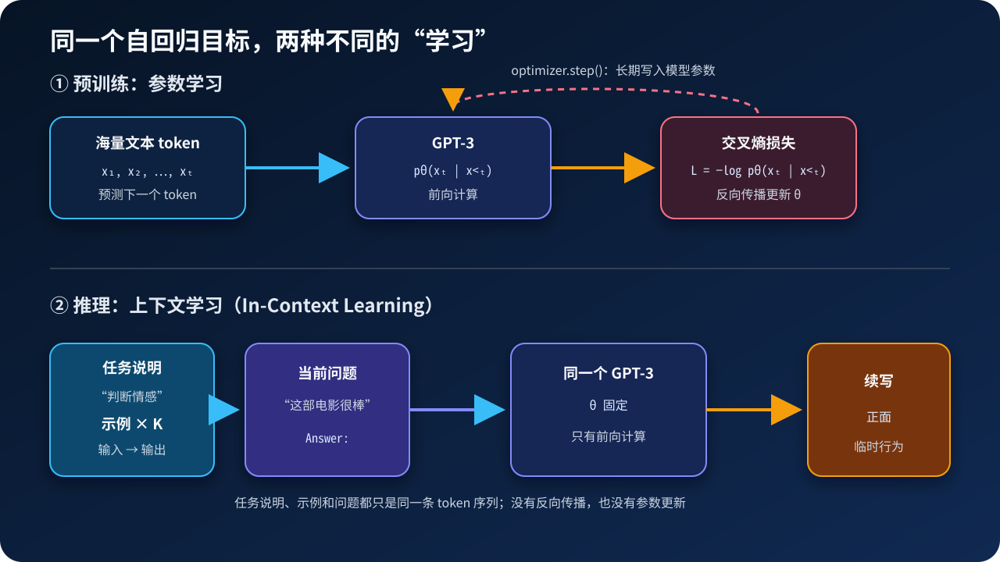
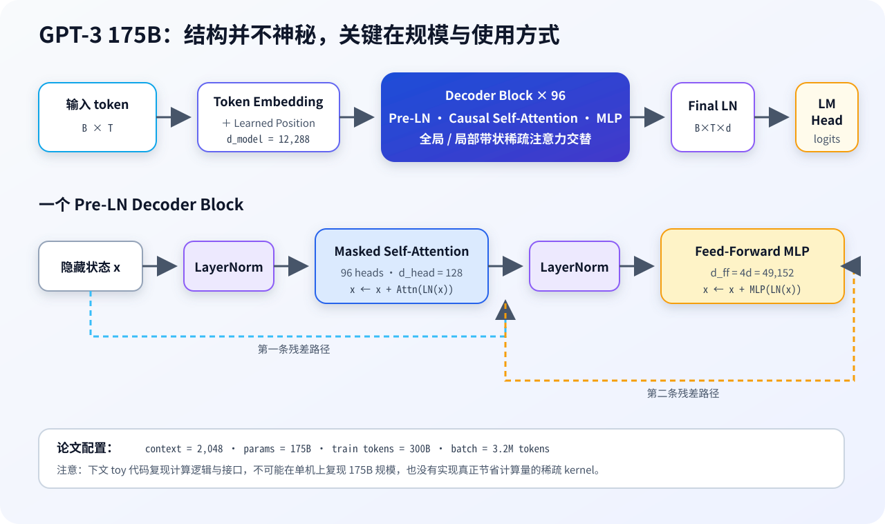
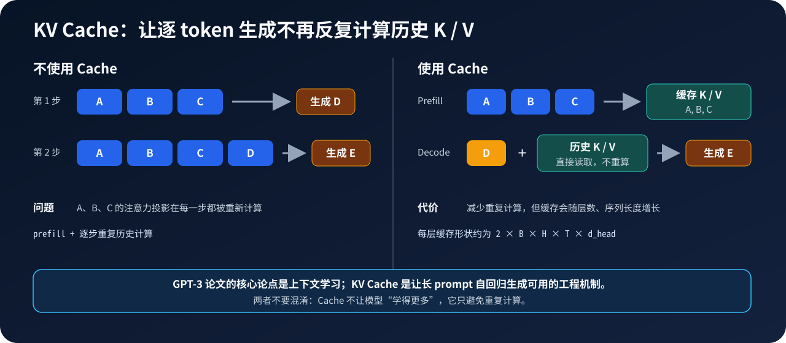

# GPT-3 原理与代码：规模如何催生上下文学习

**论文标题**：*Language Models are Few-Shot Learners*
**作者**：Tom B. Brown 等
**年份**：2020
**主题**：`Decoder-only Transformer` / `规模扩展` / `In-Context Learning`
**论文链接**：[arXiv](https://arxiv.org/abs/2005.14165) · [PDF](https://arxiv.org/pdf/2005.14165) · [OpenAI 论文页](https://openai.com/index/language-models-are-few-shot-learners/)
**一句话定位**：GPT-3 没有发明全新的网络结构，而是把 GPT-2 式语言模型扩展到 1750 亿参数，并系统证明了“任务可以写进上下文，而不一定写进参数”。


> 图：示例对被拼进上下文，经过同一个模型后产生符合模式的新输出。该图为本文原创概念图，不是论文原图。

## 0. 先给结论

读完这篇文章，你至少应该记住下面五件事：

1. **GPT-3 的训练目标仍然只是预测下一个 token**，没有专门的分类头、翻译头或问答头。
2. **175B 模型的结构仍是 GPT-2 风格的 decoder-only Transformer**，论文中特别提到各层交替采用全局注意力与局部带状稀疏注意力。
3. **zero-shot、one-shot、few-shot 不是三种模型**，而是三种 prompt 构造方式；测试时都不更新参数。
4. **few-shot 提升随模型规模增大而更明显，但并非每个任务都提升**。ARC、WiC、ANLI 等结果说明它仍然脆弱。
5. **GPT-3 的历史意义不是“175B 这个数字”本身**，而是它把自然语言上下文确立成了通用任务接口。

本文先还原论文，再给出一个可以在单机运行的 PyTorch 教学实现。代码复现的是计算逻辑和接口，不是 175B 训练工程。

---

## 1. 论文到底要解决什么问题

GPT-1 与 GPT-2 已经说明：一个自回归语言模型经过大规模预训练后，可以迁移到很多任务。但当时的主流范式仍然是：

```text
大规模预训练 → 为每个下游任务准备标注数据 → 为每个任务微调一份参数
```

这套方法有三个明显问题：

- 每个任务都要收集成百上千甚至更多标注样本；
- 每个任务都要保存或维护一份微调后的模型；
- 微调数据分布通常很窄，模型容易过拟合任务格式。

GPT-3 提出的问题是：

> 如果模型足够大，能否只用自然语言说明和少量示例，让它在测试时临时识别任务，而不进行梯度更新？

论文把四种范式放在同一条轴上比较：

| 范式 | 测试时提供什么 | 是否更新参数 | GPT-3 论文是否重点评估 |
|---|---|---:|---:|
| Fine-tuning | 大量任务样本 | 是 | 否 |
| Few-shot | 任务说明 + \(K\) 个示例 | 否 | 是 |
| One-shot | 任务说明 + 1 个示例 | 否 | 是 |
| Zero-shot | 只有任务说明 | 否 | 是 |

论文中的 few-shot 通常会尽量塞入上下文窗口可容纳的示例，典型是 **10～100 个**。所有模型的上下文长度都是 **2048 tokens**，所以 \(K\) 的上限由每个任务的样本长度决定。



### 1.1 “学习”发生在哪里

预训练时，模型参数 \(\theta\) 被优化：

\[
\theta^\*=
\arg\min_\theta
\left[
-\sum_{t=1}^{T}
\log p_\theta(x_t\mid x_{<t})
\right]
\]

few-shot 推理时，参数 \(\theta^\*\) 保持不变。任务说明 \(d\)、示例 \((x_i,y_i)\) 与新输入 \(x_\*\) 被串成一个前缀：

\[
p_{\theta^\*}
\left(
y_\*
\mid
d,\,
x_1,y_1,\ldots,x_K,y_K,\,
x_\*
\right)
\]

所以 in-context learning 的“learning”不是经典意义上的参数学习，而是**固定参数模型对当前上下文的条件化适应**。

---

## 2. 从自回归目标到通用任务接口

GPT-3 仍然只学习联合概率的链式分解：

\[
p(x_1,\ldots,x_T)
=
\prod_{t=1}^{T}
p(x_t\mid x_{<t})
\]

训练时，假设 token 序列为：

```text
[北京] [是] [中国] [的] [首都]
```

模型看到的监督信号可以理解为：

```text
输入: [北京]       → 目标: [是]
输入: [北京][是]   → 目标: [中国]
...
```

到了下游任务，分类、翻译和问答都被重写成“续写”：

```text
情感分类：
文本：这个产品非常好用
情感：正面

翻译：
English: sea otter
French: loutre de mer

问答：
Question: 中国的首都是哪里？
Answer: 北京
```

从模型视角看，它没有在调用三个不同的任务模块。它只是在计算：

```python
logits = model(prompt_token_ids)
```

差别全部落在 `prompt_token_ids` 的内容和排列方式上。

---

## 3. GPT-3 175B 的结构



论文明确写道，GPT-3 沿用了 GPT-2 的模型与架构，包括：

- decoder-only Transformer；
- Pre-LayerNorm；
- GPT-2 式修改初始化；
- GPT-2 的可逆 byte-level BPE tokenization；
- 词嵌入与输出头权重共享；
- 额外变化：**在 Transformer 层间交替使用全局注意力与局部带状稀疏注意力**。

### 3.1 175B 配置

| 配置项 | GPT-3 175B |
|---|---:|
| 参数量 \(N\) | 175B |
| 层数 \(n_\text{layers}\) | 96 |
| 隐藏维度 \(d_\text{model}\) | 12,288 |
| 注意力头数 \(n_\text{heads}\) | 96 |
| 单头维度 \(d_\text{head}\) | 128 |
| FFN 维度 \(d_\text{ff}\) | 49,152，即 \(4d_\text{model}\) |
| 上下文长度 \(n_\text{ctx}\) | 2,048 |
| 最终 batch size | 3.2M tokens |
| 初始峰值学习率 | \(6\times10^{-5}\) |
| 训练 token 数 | 300B |

论文并不只训练 175B 模型，而是训练了 8 个尺寸，用它们观察能力随规模的变化：

| 模型 | 参数量 | 层数 | 隐藏维度 | 头数 | Batch（tokens） | 学习率 |
|---|---:|---:|---:|---:|---:|---:|
| GPT-3 Small | 125M | 12 | 768 | 12 | 0.5M | \(6.0\times10^{-4}\) |
| GPT-3 Medium | 350M | 24 | 1,024 | 16 | 0.5M | \(3.0\times10^{-4}\) |
| GPT-3 Large | 760M | 24 | 1,536 | 16 | 0.5M | \(2.5\times10^{-4}\) |
| GPT-3 XL | 1.3B | 24 | 2,048 | 24 | 1M | \(2.0\times10^{-4}\) |
| GPT-3 2.7B | 2.7B | 32 | 2,560 | 32 | 1M | \(1.6\times10^{-4}\) |
| GPT-3 6.7B | 6.7B | 32 | 4,096 | 32 | 2M | \(1.2\times10^{-4}\) |
| GPT-3 13B | 13B | 40 | 5,140 | 40 | 2M | \(1.0\times10^{-4}\) |
| GPT-3 175B | 175B | 96 | 12,288 | 96 | 3.2M | \(0.6\times10^{-4}\) |

> 数据来自论文 Table 2.1。表中的 batch size 单位是 token，不是样本条数。

### 3.2 为什么 96 层 × 12,288 维大约是 175B

忽略 bias 与 LayerNorm，一个标准 Transformer block 的主要参数来自两部分。

多头注意力中的 \(Q,K,V,O\) 四个投影：

\[
N_\text{attn}\approx 4d^2
\]

FFN 从 \(d\) 扩展到 \(4d\)，再投影回 \(d\)：

\[
N_\text{ffn}\approx d(4d)+(4d)d=8d^2
\]

因此每层约为：

\[
N_\text{block}\approx 12d^2
\]

代入 \(L=96,d=12288\)：

\[
96\times12\times12288^2
\approx173.95\text{B}
\]

再加 token embedding、位置 embedding、LayerNorm 等参数，总量就落在约 175B。

这个估算也解释了一个重要工程事实：当宽度 \(d\) 增大时，参数量近似按 \(d^2\) 增长，而不是线性增长。

### 3.3 Pre-LN Decoder Block

GPT-3 的 block 可以写成：

\[
h'_\ell
=
h_\ell+
\operatorname{Attention}
\left(
\operatorname{LN}(h_\ell)
\right)
\]

\[
h_{\ell+1}
=
h'_\ell+
\operatorname{MLP}
\left(
\operatorname{LN}(h'_\ell)
\right)
\]

Pre-LN 把 LayerNorm 放在子层之前。与 Post-LN 相比，它通常更利于非常深的 Transformer 稳定训练。

### 3.4 因果注意力

对长度为 \(T\) 的输入，注意力分数为：

\[
S=\frac{QK^\top}{\sqrt{d_\text{head}}}
\]

因果 mask 要保证第 \(i\) 个位置只能看到 \(j\le i\)：

\[
M_{ij}=
\begin{cases}
0,&j\le i\\
-\infty,&j>i
\end{cases}
\]

\[
\operatorname{Attention}(Q,K,V)
=
\operatorname{softmax}(S+M)V
\]

局部带状注意力还会增加一个窗口限制，例如只允许：

\[
i-w<j\le i
\]

需要注意：论文只说明交替使用全局与局部带状稀疏模式。下文 toy 代码用 dense tensor 加 local mask 模拟**语义**，并没有实现真正节省显存与 FLOPs 的稀疏 kernel。

---

## 4. 数据：数量很大，但质量与采样权重同样重要

GPT-3 的训练集不是简单地把网页全部等比例混在一起。论文做了三类关键处理：

1. 用高质量语料作为正例，对 Common Crawl 文档进行质量过滤；
2. 在数据集内部和跨数据集做模糊去重；
3. 提高 WebText、图书和 Wikipedia 等高质量数据的采样权重。

| 数据集 | 数据量（tokens） | 训练混合权重 | 训练 300B tokens 后约经过几轮 |
|---|---:|---:|---:|
| 过滤后的 Common Crawl | 410B | 60% | 0.44 |
| WebText2 | 19B | 22% | 2.9 |
| Books1 | 12B | 8% | 1.9 |
| Books2 | 55B | 8% | 0.43 |
| Wikipedia | 3B | 3% | 3.4 |

> 权重之和为 101% 是论文表格四舍五入导致的。高质量小数据会被重复采样，巨大的 Common Crawl 反而没有完整遍历一轮。

这件事比“总共抓了多少网页”更值得注意：**数据混合比例表达了训练者对数据质量的先验判断。**

### 4.1 训练配置

论文附录给出的关键训练细节包括：

- 优化器：Adam，\(\beta_1=0.9,\beta_2=0.95,\epsilon=10^{-8}\)；
- 全局梯度范数裁剪到 1.0；
- weight decay：0.1；
- 前 375M tokens 线性 warmup；
- 学习率在前 260B tokens 内 cosine decay 到峰值的 10%，之后保持在 10%；
- batch 从 32K tokens 线性增加到最终大小，ramp-up 持续 4B～12B tokens，取决于模型规模；
- 始终以完整 2048-token 序列训练；
- 短文档会被打包进同一序列，以特殊的 end-of-text token 分隔；
- 训练 175B 需要同时沿矩阵宽度与网络深度做模型并行。

训练逻辑很朴素，困难主要在系统工程：

```text
数据并行：复制模型，切分 batch
张量并行：把单个大矩阵乘拆到多张 GPU
流水线并行：把不同层放在不同 GPU / 节点
```

---

## 5. In-Context Learning 是怎样工作的

下面用情感分类构造三种输入。

### 5.1 Zero-shot

```text
任务：判断文本情感，只回答“正面”或“负面”。

文本：剧情拖沓，表演也很生硬。
情感：
```

模型只有任务说明，没有已标注示例。

### 5.2 One-shot

```text
任务：判断文本情感，只回答“正面”或“负面”。

文本：画面很漂亮，音乐也恰到好处。
情感：正面

文本：剧情拖沓，表演也很生硬。
情感：
```

### 5.3 Few-shot

```text
任务：判断文本情感，只回答“正面”或“负面”。

文本：画面很漂亮，音乐也恰到好处。
情感：正面

文本：浪费了两个小时。
情感：负面

文本：演员把角色演活了。
情感：正面

文本：剧情拖沓，表演也很生硬。
情感：
```

模型可以从示例中同时推断：

- 任务是什么；
- 输入和输出用什么格式；
- 合法标签有哪些；
- 回答应该多长；
- 当前样本和哪些示例更相似。

这里没有调用 `loss.backward()`，也没有 `optimizer.step()`。参数没有改变，但每一层 self-attention 都可以读取前面的示例 token，因此当前 token 的隐藏状态会随示例而改变。

### 5.4 为什么示例顺序会影响结果

Transformer 使用有顺序的位置表示，因果注意力又只能从左向右读取。因此：

```text
demo_1 + demo_2 + query
```

和：

```text
demo_2 + demo_1 + query
```

不是相同输入。示例标签是否平衡、示例是否具有代表性、最近的示例是什么、分隔符是否稳定，都可能改变预测。

这也是为什么“给了示例”不等于“稳定地学会了任务”。

---

## 6. 从零实现一个 GPT-3-like 教学模型

下面代码要求 Python 3.10+ 与 PyTorch 2.x：

```bash
python -m pip install torch
```

它实现了：

- token embedding 与可学习位置 embedding；
- Pre-LN Decoder Block；
- 因果 self-attention；
- 交替的全局 / 局部窗口 mask；
- MLP；
- embedding 与 LM head 权重共享；
- shifted next-token loss；
- KV Cache 增量生成；
- temperature 与 top-k sampling。

### 6.1 完整模型代码

把下面内容保存为 `gpt3_toy.py`：

```python
from __future__ import annotations

import math
from dataclasses import dataclass
from typing import Optional

import torch
import torch.nn as nn
import torch.nn.functional as F


# 每层缓存一对 K / V。
# 形状都是 [batch, num_heads, cached_tokens, head_dim]。
KVCache = tuple[torch.Tensor, torch.Tensor]


@dataclass
class GPTConfig:
    # 教学版使用 byte tokenizer，因此词表大小是 256。
    vocab_size: int = 256
    context_length: int = 256
    n_layer: int = 6
    n_head: int = 6
    n_embd: int = 384
    dropout: float = 0.0

    # None 表示所有层都是全局注意力。
    # 给定整数时，奇数层使用局部窗口，偶数层使用全局注意力。
    local_window: Optional[int] = 128

    def __post_init__(self) -> None:
        if self.n_embd % self.n_head != 0:
            raise ValueError("n_embd 必须能被 n_head 整除")
        if self.local_window is not None and self.local_window <= 0:
            raise ValueError("local_window 必须为正整数或 None")


class CausalSelfAttention(nn.Module):
    def __init__(
        self,
        config: GPTConfig,
        local_window: Optional[int],
    ) -> None:
        super().__init__()
        self.n_head = config.n_head
        self.head_dim = config.n_embd // config.n_head
        self.local_window = local_window

        # 一次线性变换同时得到 Q、K、V。
        self.qkv = nn.Linear(config.n_embd, 3 * config.n_embd)
        self.out_proj = nn.Linear(config.n_embd, config.n_embd)
        self.attn_dropout = nn.Dropout(config.dropout)
        self.resid_dropout = nn.Dropout(config.dropout)

    def _split_heads(self, x: torch.Tensor) -> torch.Tensor:
        """[B, T, C] -> [B, H, T, D]"""
        batch, seq_len, channels = x.shape
        x = x.view(batch, seq_len, self.n_head, self.head_dim)
        return x.transpose(1, 2)

    def _build_mask(
        self,
        query_len: int,
        key_len: int,
        past_len: int,
        device: torch.device,
    ) -> torch.Tensor:
        """
        构造支持 KV Cache 的因果 mask。

        当 past_len > 0 时，新 query 的绝对位置从 past_len 开始。
        不能简单使用 tril(query_len, key_len)，否则位置会错位。
        """
        query_pos = torch.arange(
            past_len,
            past_len + query_len,
            device=device,
        ).unsqueeze(1)
        key_pos = torch.arange(key_len, device=device).unsqueeze(0)

        # 所有层都不能看未来。
        allowed = key_pos <= query_pos

        # 局部层只允许看当前 token 之前的固定窗口。
        if self.local_window is not None:
            allowed = allowed & (
                key_pos > query_pos - self.local_window
            )

        return allowed.view(1, 1, query_len, key_len)

    def forward(
        self,
        x: torch.Tensor,
        past_key_value: Optional[KVCache] = None,
        use_cache: bool = False,
    ) -> tuple[torch.Tensor, Optional[KVCache]]:
        batch, query_len, channels = x.shape

        q, k, v = self.qkv(x).chunk(3, dim=-1)
        q = self._split_heads(q)
        k = self._split_heads(k)
        v = self._split_heads(v)

        past_len = 0
        if past_key_value is not None:
            past_k, past_v = past_key_value
            past_len = past_k.size(-2)
            k = torch.cat((past_k, k), dim=-2)
            v = torch.cat((past_v, v), dim=-2)

        key_len = k.size(-2)
        mask = self._build_mask(
            query_len=query_len,
            key_len=key_len,
            past_len=past_len,
            device=x.device,
        )

        # [B, H, Tq, D] @ [B, H, D, Tk] -> [B, H, Tq, Tk]
        scores = q @ k.transpose(-2, -1)
        scores = scores / math.sqrt(self.head_dim)
        scores = scores.masked_fill(
            ~mask,
            torch.finfo(scores.dtype).min,
        )

        weights = F.softmax(scores, dim=-1)
        weights = self.attn_dropout(weights)
        y = weights @ v

        # [B, H, T, D] -> [B, T, C]
        y = y.transpose(1, 2).contiguous().view(
            batch,
            query_len,
            channels,
        )
        y = self.resid_dropout(self.out_proj(y))

        present = (k, v) if use_cache else None
        return y, present


class MLP(nn.Module):
    def __init__(self, config: GPTConfig) -> None:
        super().__init__()
        hidden = 4 * config.n_embd
        self.fc_in = nn.Linear(config.n_embd, hidden)
        self.fc_out = nn.Linear(hidden, config.n_embd)
        self.dropout = nn.Dropout(config.dropout)

    def forward(self, x: torch.Tensor) -> torch.Tensor:
        x = self.fc_in(x)
        # GPT 系列常用 GELU。approximate="tanh" 速度更友好。
        x = F.gelu(x, approximate="tanh")
        x = self.fc_out(x)
        return self.dropout(x)


class Block(nn.Module):
    def __init__(self, config: GPTConfig, layer_index: int) -> None:
        super().__init__()

        # 用偶数层全局、奇数层局部来演示论文所说的交替模式。
        # 这是教学近似，不代表 OpenAI 未公开的底层 kernel 细节。
        is_local_layer = (
            config.local_window is not None
            and layer_index % 2 == 1
        )
        window = config.local_window if is_local_layer else None

        self.ln_1 = nn.LayerNorm(config.n_embd)
        self.attn = CausalSelfAttention(config, local_window=window)
        self.ln_2 = nn.LayerNorm(config.n_embd)
        self.mlp = MLP(config)

    def forward(
        self,
        x: torch.Tensor,
        past_key_value: Optional[KVCache] = None,
        use_cache: bool = False,
    ) -> tuple[torch.Tensor, Optional[KVCache]]:
        # Pre-LN + residual
        attn_out, present = self.attn(
            self.ln_1(x),
            past_key_value=past_key_value,
            use_cache=use_cache,
        )
        x = x + attn_out
        x = x + self.mlp(self.ln_2(x))
        return x, present


class GPT(nn.Module):
    def __init__(self, config: GPTConfig) -> None:
        super().__init__()
        self.config = config
        self.wte = nn.Embedding(config.vocab_size, config.n_embd)
        self.wpe = nn.Embedding(config.context_length, config.n_embd)
        self.drop = nn.Dropout(config.dropout)
        self.blocks = nn.ModuleList(
            Block(config, layer_index=i)
            for i in range(config.n_layer)
        )
        self.ln_f = nn.LayerNorm(config.n_embd)
        self.lm_head = nn.Linear(
            config.n_embd,
            config.vocab_size,
            bias=False,
        )

        self.apply(self._init_weights)

        # GPT-2 式 residual projection 缩放初始化。
        # 随深度增大，残差分支初始输出应更小。
        residual_std = 0.02 / math.sqrt(2 * config.n_layer)
        for name, param in self.named_parameters():
            if name.endswith("attn.out_proj.weight"):
                nn.init.normal_(param, mean=0.0, std=residual_std)
            elif name.endswith("mlp.fc_out.weight"):
                nn.init.normal_(param, mean=0.0, std=residual_std)

        # Weight tying：输入 token embedding 与输出分类矩阵共享。
        self.lm_head.weight = self.wte.weight

    @staticmethod
    def _init_weights(module: nn.Module) -> None:
        if isinstance(module, nn.Linear):
            nn.init.normal_(module.weight, mean=0.0, std=0.02)
            if module.bias is not None:
                nn.init.zeros_(module.bias)
        elif isinstance(module, nn.Embedding):
            nn.init.normal_(module.weight, mean=0.0, std=0.02)

    def forward(
        self,
        input_ids: torch.Tensor,
        targets: Optional[torch.Tensor] = None,
        past_key_values: Optional[list[KVCache]] = None,
        use_cache: bool = False,
    ) -> tuple[
        torch.Tensor,
        Optional[torch.Tensor],
        Optional[list[KVCache]],
    ]:
        """
        Args:
            input_ids: [B, T]
            targets: [B, T]，每个位置的“下一个 token”标签
            past_key_values: 每层各一份历史 K / V
            use_cache: 是否返回新的 K / V
        """
        batch, seq_len = input_ids.shape

        if past_key_values is None:
            layer_past: list[Optional[KVCache]] = [
                None
            ] * self.config.n_layer
            past_len = 0
        else:
            if len(past_key_values) != self.config.n_layer:
                raise ValueError("cache 层数与模型层数不一致")
            layer_past = list(past_key_values)
            past_len = past_key_values[0][0].size(-2)

        if past_len + seq_len > self.config.context_length:
            raise ValueError(
                f"序列长度 {past_len + seq_len} 超过 "
                f"context_length={self.config.context_length}"
            )

        positions = torch.arange(
            past_len,
            past_len + seq_len,
            device=input_ids.device,
        )
        x = self.wte(input_ids) + self.wpe(positions)[None, :, :]
        x = self.drop(x)

        presents: Optional[list[KVCache]]
        presents = [] if use_cache else None

        for block, past in zip(self.blocks, layer_past):
            x, present = block(
                x,
                past_key_value=past,
                use_cache=use_cache,
            )
            if presents is not None:
                assert present is not None
                presents.append(present)

        logits = self.lm_head(self.ln_f(x))

        loss = None
        if targets is not None:
            if past_len != 0:
                raise ValueError("训练 loss 示例不支持同时传入 cache")
            if targets.shape != input_ids.shape:
                raise ValueError("targets 与 input_ids 形状必须一致")
            loss = F.cross_entropy(
                logits.reshape(-1, logits.size(-1)),
                targets.reshape(-1),
            )

        return logits, loss, presents

    @torch.no_grad()
    def generate(
        self,
        input_ids: torch.Tensor,
        max_new_tokens: int,
        temperature: float = 1.0,
        top_k: Optional[int] = 50,
    ) -> torch.Tensor:
        if temperature <= 0:
            raise ValueError("temperature 必须大于 0")
        if (
            input_ids.size(1) + max_new_tokens
            > self.config.context_length
        ):
            raise ValueError("prompt + 输出长度超过上下文窗口")

        was_training = self.training
        self.eval()
        result = input_ids
        cache: Optional[list[KVCache]] = None
        next_input = input_ids

        for _ in range(max_new_tokens):
            logits, _, cache = self(
                next_input,
                past_key_values=cache,
                use_cache=True,
            )
            next_logits = logits[:, -1, :] / temperature

            if top_k is not None:
                k = min(top_k, next_logits.size(-1))
                threshold = torch.topk(
                    next_logits,
                    k,
                    dim=-1,
                ).values[:, -1:]
                next_logits = next_logits.masked_fill(
                    next_logits < threshold,
                    -torch.inf,
                )

            probs = F.softmax(next_logits, dim=-1)
            next_token = torch.multinomial(probs, num_samples=1)
            result = torch.cat((result, next_token), dim=1)

            # 有 cache 后，只把最新 token 输入模型。
            next_input = next_token

        self.train(was_training)
        return result


if __name__ == "__main__":
    torch.manual_seed(7)
    config = GPTConfig()
    model = GPT(config)

    x = torch.randint(
        0,
        config.vocab_size,
        (2, 32),
    )
    y = torch.randint(
        0,
        config.vocab_size,
        (2, 32),
    )
    logits, loss, _ = model(x, targets=y)
    print("logits:", tuple(logits.shape))
    print("loss:", float(loss))
    print(
        "parameters:",
        f"{sum(p.numel() for p in model.parameters()):,}",
    )
```

运行后应该看到：

```text
logits: (2, 32, 256)
loss: 约 5.5
parameters: 约 10M
```

随机初始化时，256 类均匀分布的理论交叉熵是：

\[
\log(256)\approx5.545
\]

因此初始 loss 在 5.5 附近是合理的。

### 6.2 shifted labels 到底怎么移

语言模型的 logits 在位置 \(t\) 预测位置 \(t+1\) 的 token。最不容易写错的方式是在取 batch 时切片：

```python
tokens = torch.tensor([10, 20, 30, 40, 50])

input_ids = tokens[:-1]  # [10, 20, 30, 40]
targets = tokens[1:]     # [20, 30, 40, 50]
```

不要让同一位置同时看到并预测自己，否则会造成标签泄漏。

---

## 7. 写一个最小训练循环

为避免额外 tokenizer 依赖，下面用 UTF-8 byte 作为 token。它不等同于 GPT-3 的 byte-level BPE，但能让模型、loss 与生成代码完整跑通。

把下面保存为 `train_toy.py`，并在同目录准备一个 UTF-8 文本文件 `corpus.txt`：

```python
import math
from pathlib import Path

import torch

from gpt3_toy import GPT, GPTConfig


class ByteTokenizer:
    vocab_size = 256

    @staticmethod
    def encode(text: str) -> list[int]:
        return list(text.encode("utf-8"))

    @staticmethod
    def decode(token_ids: list[int]) -> str:
        return bytes(token_ids).decode(
            "utf-8",
            errors="replace",
        )


class RandomBatcher:
    def __init__(
        self,
        token_ids: list[int],
        block_size: int,
        batch_size: int,
        device: torch.device,
    ) -> None:
        self.data = torch.tensor(token_ids, dtype=torch.long)
        self.block_size = block_size
        self.batch_size = batch_size
        self.device = device

        if len(self.data) <= block_size + 1:
            raise ValueError("corpus 太短，无法切出一个训练样本")

    def next_batch(self) -> tuple[torch.Tensor, torch.Tensor]:
        max_start = len(self.data) - self.block_size - 1
        starts = torch.randint(
            low=0,
            high=max_start + 1,
            size=(self.batch_size,),
        )

        x = torch.stack(
            [
                self.data[i : i + self.block_size]
                for i in starts.tolist()
            ]
        )
        y = torch.stack(
            [
                self.data[i + 1 : i + 1 + self.block_size]
                for i in starts.tolist()
            ]
        )
        return x.to(self.device), y.to(self.device)


def cosine_lr(
    step: int,
    max_steps: int,
    warmup_steps: int,
    max_lr: float,
    min_lr_ratio: float = 0.1,
) -> float:
    if step < warmup_steps:
        return max_lr * (step + 1) / warmup_steps

    progress = (step - warmup_steps) / max(
        1,
        max_steps - warmup_steps,
    )
    progress = min(max(progress, 0.0), 1.0)
    cosine = 0.5 * (1.0 + math.cos(math.pi * progress))
    return max_lr * (
        min_lr_ratio + (1.0 - min_lr_ratio) * cosine
    )


def main() -> None:
    torch.manual_seed(42)
    device = torch.device(
        "cuda" if torch.cuda.is_available() else "cpu"
    )
    tokenizer = ByteTokenizer()
    text = Path("corpus.txt").read_text(encoding="utf-8")

    config = GPTConfig(
        vocab_size=tokenizer.vocab_size,
        context_length=256,
        n_layer=6,
        n_head=6,
        n_embd=384,
        local_window=128,
    )
    model = GPT(config).to(device)
    batcher = RandomBatcher(
        token_ids=tokenizer.encode(text),
        block_size=config.context_length,
        batch_size=8,
        device=device,
    )

    # 对齐论文中最关键的 Adam 超参数。
    optimizer = torch.optim.AdamW(
        model.parameters(),
        lr=3e-4,
        betas=(0.9, 0.95),
        eps=1e-8,
        weight_decay=0.1,
    )

    max_steps = 2_000
    warmup_steps = 100
    max_lr = 3e-4
    model.train()

    for step in range(max_steps):
        lr = cosine_lr(
            step=step,
            max_steps=max_steps,
            warmup_steps=warmup_steps,
            max_lr=max_lr,
        )
        for group in optimizer.param_groups:
            group["lr"] = lr

        input_ids, targets = batcher.next_batch()
        _, loss, _ = model(input_ids, targets=targets)
        assert loss is not None

        optimizer.zero_grad(set_to_none=True)
        loss.backward()

        # 论文使用全局梯度范数 1.0。
        grad_norm = torch.nn.utils.clip_grad_norm_(
            model.parameters(),
            max_norm=1.0,
        )
        optimizer.step()

        if step % 100 == 0:
            print(
                f"step={step:04d} "
                f"loss={loss.item():.4f} "
                f"lr={lr:.2e} "
                f"grad_norm={float(grad_norm):.2f}"
            )

    prompt = "人工智能"
    prompt_ids = torch.tensor(
        [tokenizer.encode(prompt)],
        dtype=torch.long,
        device=device,
    )
    output_ids = model.generate(
        prompt_ids,
        max_new_tokens=80,
        temperature=0.8,
        top_k=40,
    )
    print(tokenizer.decode(output_ids[0].tolist()))

    torch.save(
        {
            "config": config.__dict__,
            "model": model.state_dict(),
        },
        "gpt3_toy.pt",
    )


if __name__ == "__main__":
    main()
```

运行：

```bash
python train_toy.py
```

这个训练脚本刻意保持简单。真正训练大模型还要加入：

- bf16 / fp16 混合精度；
- gradient accumulation；
- 分布式数据采样；
- 张量并行、流水线并行；
- activation checkpointing；
- fused optimizer 与 fused attention；
- checkpoint 分片和故障恢复；
- 数据流式读取、去重与质量过滤。

---

## 8. 用代码构造 zero / one / few-shot prompt

```python
from dataclasses import dataclass


@dataclass(frozen=True)
class Demo:
    input_text: str
    output_text: str


def build_classification_prompt(
    instruction: str,
    demos: list[Demo],
    query: str,
) -> str:
    parts = [instruction.strip()]

    for demo in demos:
        parts.append(
            f"文本：{demo.input_text.strip()}\n"
            f"情感：{demo.output_text.strip()}"
        )

    # 故意不填最后一个答案，让语言模型续写。
    parts.append(f"文本：{query.strip()}\n情感：")
    return "\n\n".join(parts)


instruction = "判断文本情感，只回答“正面”或“负面”。"
all_demos = [
    Demo("画面很漂亮，音乐也恰到好处。", "正面"),
    Demo("浪费了两个小时。", "负面"),
    Demo("演员把角色演活了。", "正面"),
]
query = "剧情拖沓，表演也很生硬。"

zero_shot = build_classification_prompt(
    instruction,
    demos=[],
    query=query,
)
one_shot = build_classification_prompt(
    instruction,
    demos=all_demos[:1],
    query=query,
)
few_shot = build_classification_prompt(
    instruction,
    demos=all_demos,
    query=query,
)

print(few_shot)
```

对模型而言，三者的 API 完全相同：

```python
prompt_ids = torch.tensor(
    [tokenizer.encode(few_shot)],
    dtype=torch.long,
    device=device,
)
generated = model.generate(
    prompt_ids,
    max_new_tokens=8,
    temperature=0.7,
    top_k=20,
)
```

唯一变化是输入 token 序列。

### 8.1 Prompt 长度预算

few-shot 不是示例越多越好，因为：

\[
T_\text{instruction}
+
\sum_{i=1}^{K}
\left(
T_{x_i}+T_{y_i}+T_\text{format}
\right)
+
T_\text{query}
+
T_\text{output}
\le
T_\text{context}
\]

GPT-3 的 \(T_\text{context}=2048\)。加入更多示例会挤压问题与输出空间，长示例还可能让真正相关的信息离 query 更远。

---

## 9. 多选题为什么不一定要“生成答案”

GPT-3 论文在多选任务上常比较每个候选 completion 的语言模型概率，而不是让模型自由生成。

假设 prompt 是 \(c\)，候选答案是 \(a=(a_1,\ldots,a_m)\)：

\[
\log p(a\mid c)
=
\sum_{j=1}^{m}
\log p(a_j\mid c,a_{<j})
\]

下面代码计算候选答案分数：

```python
import torch
import torch.nn.functional as F


@torch.no_grad()
def score_completion(
    model: GPT,
    tokenizer: ByteTokenizer,
    prompt: str,
    completion: str,
    device: torch.device,
    length_normalize: bool = True,
) -> float:
    prompt_ids = tokenizer.encode(prompt)
    answer_ids = tokenizer.encode(completion)

    if not prompt_ids or not answer_ids:
        raise ValueError("prompt 和 completion 都不能为空")

    # 模型输入最后不放“待预测序列”的最后一个 token。
    sequence = prompt_ids + answer_ids
    input_ids = torch.tensor(
        [sequence[:-1]],
        dtype=torch.long,
        device=device,
    )
    targets = torch.tensor(
        sequence[1:],
        dtype=torch.long,
        device=device,
    )

    logits, _, _ = model(input_ids)
    token_log_probs = F.log_softmax(
        logits[0],
        dim=-1,
    ).gather(
        dim=-1,
        index=targets.unsqueeze(-1),
    ).squeeze(-1)

    # answer 的第一个 token 由 prompt 最后一个位置预测。
    answer_log_probs = token_log_probs[len(prompt_ids) - 1 :]

    if length_normalize:
        return float(answer_log_probs.mean())
    return float(answer_log_probs.sum())


def choose_answer(
    model: GPT,
    tokenizer: ByteTokenizer,
    prompt: str,
    options: list[str],
    device: torch.device,
) -> tuple[str, dict[str, float]]:
    scores = {
        option: score_completion(
            model=model,
            tokenizer=tokenizer,
            prompt=prompt,
            completion=option,
            device=device,
            length_normalize=True,
        )
        for option in options
    }
    best = max(scores, key=scores.get)
    return best, scores


answer, scores = choose_answer(
    model=model,
    tokenizer=tokenizer,
    prompt=few_shot,
    # 前导空格或分隔符也属于 prompt 设计的一部分。
    options=["正面", "负面"],
    device=device,
)
print(answer, scores)
```

为什么常做长度归一化？因为直接求和会天然偏向 token 更少的候选：

\[
\operatorname{score}(a)
=
\frac{1}{|a|}
\sum_{j=1}^{|a|}
\log p(a_j\mid c,a_{<j})
\]

论文在 ARC、OpenBookQA 与 RACE 上还尝试用无条件概率校准：

\[
\operatorname{score}(a)
=
\log p(a\mid c)
-
\log p(a\mid \text{``Answer: ''})
\]

直觉是减去候选答案本身的语言先验，避免模型仅因为某个选项“平时更常见”就选择它。

---

## 10. KV Cache：让自回归生成可用



如果 prompt 有 \(T\) 个 token，生成第 \(T+1\) 个 token 时，需要用 prompt 中所有 token 的 \(K,V\)。生成下一个 token 时，历史 token 的 \(K,V\) 没有变化。

不使用 cache：

```text
第 1 步：计算 token 1...T
第 2 步：重新计算 token 1...T+1
第 3 步：重新计算 token 1...T+2
```

使用 cache：

```text
Prefill：一次计算并保存 prompt 的 K/V
Decode 1：只计算新 token 的 Q/K/V，读取历史 K/V
Decode 2：继续只计算新 token，追加 K/V
```

对每层而言，K/V cache 的元素量近似是：

\[
2\times B\times H\times T\times d_\text{head}
\]

乘上层数 \(L\) 后，cache 显存随 batch 和序列长度线性增长。它用显存换计算。

必须区分两个概念：

- **上下文学习**解释“为什么示例会影响当前输出”；
- **KV Cache**解释“怎样避免逐 token 生成时重复计算历史”。

Cache 本身不会提高模型能力。

---

## 11. 论文结果应该怎样看

下面选一些代表性结果。数值来自论文原表，指标随任务而异，不能直接跨行比较。

| 任务 | Zero-shot | One-shot | Few-shot | 观察 |
|---|---:|---:|---:|---|
| LAMBADA（accuracy） | 76.2 | 72.5 | 86.4 | 示例帮助模型理解只填一个词的格式 |
| StoryCloze（accuracy） | 83.2 | 84.7 | 87.7 | few-shot 有稳定收益 |
| TriviaQA（accuracy） | 64.3 | 68.0 | 71.2 | 闭卷问答显著提升 |
| WebQuestions（accuracy） | 14.4 | 25.3 | 41.5 | 示例明显帮助适应答案分布 |
| CoQA（F1） | 81.5 | 84.0 | 85.0 | 接近当时强微调系统 |
| SQuAD v2（F1） | 59.5 | 65.4 | 69.8 | few-shot 比 zero-shot 高约 10 分 |
| ARC Challenge（accuracy） | 51.4 | 53.2 | 51.5 | 更多示例没有带来收益 |
| WiC（accuracy） | — | — | 49.4 | 约等于随机猜测 |

### 11.1 规模与 few-shot 的交互

论文最重要的现象并不是“few-shot 总比 zero-shot 强”，而是：

> 随模型增大，zero、one、few-shot 的差距经常扩大，大模型更能利用上下文中的示例。

这也是标题 *Language Models are Few-Shot Learners* 的真正含义：作者关心的不是单个 175B 分数，而是**上下文学习能力如何随规模变化**。

### 11.2 算术结果既惊艳又暴露边界

| 算术任务 | Zero-shot | One-shot | Few-shot |
|---|---:|---:|---:|
| 2 位加法 | 76.9 | 99.6 | 100.0 |
| 3 位加法 | 34.2 | 65.5 | 80.4 |
| 5 位加法 | 0.7 | 3.5 | 9.3 |

模型并没有获得一个稳定、可外推的任意精度加法算法。数字位数一增加，准确率快速下降。因此更准确的表述是：

- GPT-3 能从上下文识别某些计算模式；
- 大规模预训练带来了明显的算术行为；
- 但它仍然不是可靠的符号计算器。

---

## 12. 为什么规模会改善上下文学习

论文证明了现象，但没有给出完整机制理论。可以把常见解释分成三个层次。

### 12.1 表征容量

更大模型可以在参数中压缩更多语言模式、任务格式和世界知识。给出示例后，它更可能激活与当前任务相符的已有模式。

### 12.2 注意力提供临时读写路径

示例没有写入参数，但它们的 token 表示保留在上下文中。query 位置可以通过注意力读取：

- 哪些输入形式对应哪些输出形式；
- 标签之间怎样映射；
- 哪些示例与当前输入相似。

### 12.3 隐式元学习假说

预训练语料天然包含大量“先给模式，再继续”的结构：列表、问答、教程、对话、代码、词典、表格等。自回归训练可能让模型学会一种更一般的行为：

```text
先从前缀识别局部规则，再按规则续写
```

但要保持谨慎。论文作者也明确指出，很难判断模型是在：

- 从头学会一个新任务；
- 识别预训练中见过的任务；
- 识别旧任务的新格式；
- 只适应答案的表面分布。

这些情况构成连续谱，不应把所有 few-shot 成功都解释成“模型在内部重新训练了一次”。

---

## 13. 局限、争议与容易忽略的问题

### 13.1 数据污染

互联网训练数据可能包含 benchmark 的测试样本。论文尝试用 13-gram 重叠检测并删除污染文本，但过滤过程存在 bug，漏掉了部分重叠；由于重训成本太高，作者只能在事后分析影响。

这意味着评估大模型时，不能只问“分数是多少”，还要问：

- 测试集是否可能出现在预训练数据中；
- 模型是在泛化还是在记忆；
- 去重和污染检测的粒度是什么。

### 13.2 Few-shot 并不稳定

- 示例顺序会影响结果；
- 标签词的选择会影响结果；
- 分隔符和空格会影响 tokenization；
- \(K\) 增大通常有帮助，但并不总是；
- 有些任务对 prompt phrasing 极其敏感。

### 13.3 训练与推理成本

175B 模型昂贵、难部署、难复现。论文自己也把推理成本和使用不便列为主要限制，并讨论了蒸馏方向。

### 13.4 事实性、校准与偏见

自回归目标优化的是“下一个 token 是否像训练文本”，不是“陈述是否真实”。模型可能：

- 流畅地生成错误事实；
- 在分布外输入上置信度失真；
- 复制训练数据中的刻板印象与偏见；
- 生成难以与人类文本区分的误导性内容。

### 13.5 GPT-3 不是 ChatGPT

原始 GPT-3 是基础语言模型，没有后来的 instruction tuning 与 RLHF。它“会续写某种格式”不等于它天然“会服从用户意图”。

这也是为什么读完 GPT-3 后应该继续读 InstructGPT：前者解决“模型能做多少任务”，后者重点解决“模型是否按人的意图做任务”。

---

## 14. 五个常见误解

### 误解 1：few-shot 就是用少量样本微调

不是。GPT-3 论文中的 few-shot 只把示例放进 prompt，不更新参数。

### 误解 2：GPT-3 发明了新 Transformer 架构

不是。主干仍是 GPT-2 式 decoder-only Transformer，贡献主要来自规模化与系统的上下文学习评估。

### 误解 3：示例越多一定越好

不是。上下文窗口有限，示例质量、相关性、顺序和任务本身都会影响结果；ARC 就出现了 few-shot 不如 one-shot 的情况。

### 误解 4：KV Cache 是上下文学习的原因

不是。KV Cache 只减少重复计算。示例能影响输出，是因为因果 self-attention 能读取前缀。

### 误解 5：GPT-3 已经掌握了通用推理算法

证据不足。算术结果随位数增长迅速恶化，NLI 和部分阅读理解任务也很弱。行为能力不等于稳健算法。

---

## 15. 如果你要复现实验，最小检查清单

### 模型正确性

- [ ] 因果 mask 不允许看到未来；
- [ ] 使用 cache 时 query / key 的绝对位置没有错位；
- [ ] 输入与 targets 正确右移一位；
- [ ] LM head 与 token embedding 正确共享权重；
- [ ] 位置索引没有超过上下文长度；
- [ ] 训练与推理对 end-of-text 的处理一致。

### Few-shot 评估正确性

- [ ] zero / one / few-shot 使用同一个 checkpoint；
- [ ] 测试阶段没有梯度更新；
- [ ] 示例只来自允许使用的训练或开发划分；
- [ ] prompt 模板与分隔符固定；
- [ ] 记录示例顺序和随机种子；
- [ ] 多选题按 token log-prob 打分，而不是只看自由生成；
- [ ] 比较不同长度候选时考虑长度归一化；
- [ ] 检查 prompt 总 token 数不超过 context window。

### 数据可信度

- [ ] 文档级去重；
- [ ] 训练集与验证集去重；
- [ ] benchmark 污染检测；
- [ ] 保存过滤与采样规则；
- [ ] 报告数据混合权重，而不只报告原始数据量。

---

## 16. 应该怎样精读原论文

如果时间有限，建议按下面顺序：

1. **Figure 1.2**：先看模型规模与上下文示例数量怎样共同影响表现；
2. **Section 2**：理解 zero / one / few-shot 的严格定义；
3. **Table 2.1 与 2.2**：记住架构规模和数据混合；
4. **Section 2.4**：重点看多选题怎样按语言模型概率评估；
5. **Section 3.9**：看算术、字符操作、新词等合成任务；
6. **Section 4**：看测试集污染问题；
7. **Section 5 与 6**：看作者自己如何描述能力边界和社会风险；
8. **Appendix B 与 G**：查训练超参数和具体 prompt。

不要只读摘要里的“175 billion parameters”，也不要只看几个超过 SOTA 的结果。真正值得带走的是一套新的接口观：

```text
旧范式：任务定义 → 改参数
GPT-3 范式：任务定义 → 写进上下文
```

---

## 17. 前置阅读与后续路线

### 前置阅读

- [GPT-2：无监督多任务学习](03_GPT2_2019_原理.md)
- [Transformer：因果注意力与 Decoder](00_Transformer_2017_原理.md)
- [Scaling Laws：规模为何可以预测](06_Scaling_Laws_2020_原理.md)

### 读完接着看

- [FLAN：指令微调](08_FLAN_2021_原理.md)
- [InstructGPT：从会续写到会听指令](10_InstructGPT_2022_原理.md)
- [Chain-of-Thought：用中间步骤改善推理](11_Chain_of_Thought_2022_原理.md)
- [Chinchilla：重新审视参数量与训练 token 配比](12_Chinchilla_2022_原理.md)

---

## 参考资料

1. Brown, T. B. et al. [Language Models are Few-Shot Learners](https://arxiv.org/abs/2005.14165), 2020.
2. OpenAI. [Language models are few-shot learners](https://openai.com/index/language-models-are-few-shot-learners/), 2020.
3. Radford, A. et al. [Language Models are Unsupervised Multitask Learners](https://cdn.openai.com/better-language-models/language_models_are_unsupervised_multitask_learners.pdf), 2019.
4. Kaplan, J. et al. [Scaling Laws for Neural Language Models](https://arxiv.org/abs/2001.08361), 2020.

> 本文中的头图与三张技术示意图均为本文新增素材；技术参数与实验结果以 GPT-3 论文 v4 为准。
