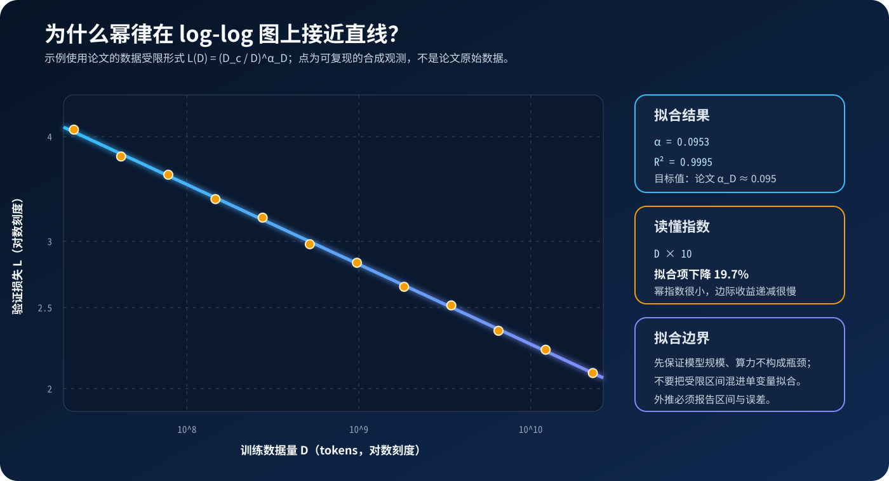

# Scaling Laws 原理与代码：如何用小实验预测大模型

**论文标题**：*Scaling Laws for Neural Language Models*

**作者**：Jared Kaplan、Sam McCandlish、Tom Henighan、Tom B. Brown 等

**年份**：2020

**主题**：`Scaling Laws` / `幂律` / `训练预算` / `Compute-efficient Frontier`

**论文链接**：[arXiv](https://arxiv.org/abs/2001.08361) · [PDF](https://arxiv.org/pdf/2001.08361) · [OpenAI 论文页](https://openai.com/index/scaling-laws-for-neural-language-models/)

**一句话定位**：这篇论文没有提出新模型，而是用一组受控实验说明：当其他资源不构成瓶颈时，语言模型损失会随参数量、数据量和训练算力呈现可预测的幂律下降。


> 图：模型容量、训练数据和计算资源共同决定可达到的损失，亮线表示固定预算下的 compute-efficient frontier。本文原创概念图，不是论文原图。

## 0. 先给结论

读完本文，至少应记住下面六件事：

1. **Scaling law 预测的是平均交叉熵损失，不是“参数翻倍，能力翻倍”。**
2. **幂律只在另外两个变量不构成瓶颈时成立。** 数据不够时继续增大模型，收益会饱和；模型太小时继续堆数据也一样。
3. 论文中的模型规模 \(N\) **排除了 token embedding 与位置 embedding**；训练算力近似为 \(C\approx6ND_{\text{train}}\)。
4. 在论文的实验区间内，单独扩大参数、数据或最优分配后的算力，损失都平滑下降，没有观察到突然的“能力跳变”。
5. 论文最反直觉的结论不是“越大越好”，而是：**固定算力下，应训练更大的模型，并在完全收敛前停止。**
6. 2022 年的 Chinchilla 改写了最优参数—数据配比，因此 Kaplan 2020 的具体指数应被视为特定实验条件下的经验拟合，而不是自然常数。

---

## 1. 这篇论文到底在问什么

训练一次大模型的成本很高，但真正做预算时，需要回答的是一组更具体的问题：

- 参数量增加 10 倍，验证损失大约会下降多少？
- 数据从 10 亿 token 增加到 100 亿 token 是否仍然值得？
- 固定一笔 FLOPs，应该选择更大的模型、更长的训练，还是更大的 batch？
- 能否用几十个小实验，预测一个尚未训练的大模型？

这篇论文把这些问题改写成一个经验建模任务：

\[
L=f(N,D,C,\text{architecture},\text{optimization},\ldots)
\]

其中：

- \(L\)：测试集或验证集上的平均自回归交叉熵；
- \(N\)：非 embedding 参数量；
- \(D\)：训练数据量，单位为 token；
- \(C\)：训练计算量，单位为 FLOPs 或 PF-days。

作者不试图从第一性原理推导 \(f\)，而是系统改变变量、记录损失，再拟合一个足够简单且能外推的函数。

### 1.1 论文的实验范围

论文使用 WebText2 和 decoder-only Transformer，主要设置如下：

| 项目 | 论文设置 |
|---|---|
| 模型规模 | 约 768 到 15 亿个非 embedding 参数 |
| 数据规模 | 约 2200 万到 230 亿 tokens |
| 上下文长度 | 大部分实验为 1024 tokens |
| 词表 | 50,257 个 byte-level BPE token |
| 数据集 | WebText2：约 2030 万篇文档、229 亿 tokens |
| 评价指标 | 1024-token 上下文上的平均自回归交叉熵 |
| 扫描变量 | 参数量、数据量、深宽比、头数、上下文、batch 与训练步数 |

所以论文结论首先适用于“2020 年的 WebText2 + dense Transformer + 当时的优化配方”。它的研究方法比某个具体常数更值得继承。

---

## 2. 先统一三个容易混淆的量

### 2.1 \(N\)：为什么不统计 embedding

一个标准 Transformer block 的主要参数来自注意力投影和 FFN。若

\[
d_{\text{attn}}=d_{\text{model}},\qquad
d_{\text{ff}}=4d_{\text{model}},
\]

则非 embedding 参数量近似为：

\[
N
\approx
2d_{\text{model}}n_{\text{layer}}
\left(2d_{\text{attn}}+d_{\text{ff}}\right)
\approx
12n_{\text{layer}}d_{\text{model}}^2.
\]

论文发现：用**总参数量**作横轴时，不同深度的模型不能很好落在同一条曲线上；排除 embedding 后，趋势明显更干净。这并不表示 embedding “不需要计算”，而是说明它在这组实验里不是主要的可扩展计算主体。

### 2.2 \(D\)：数据集 token 与已处理 token

“训练数据量”至少有两种含义：

- 数据集里有多少个不同位置的 token；
- 训练过程中累计处理了多少 token，重复 epoch 也会继续累加。

论文在不同章节会讨论 dataset size、tokens processed 和 batch-adjusted training steps。工程实现中必须分别记录：

```text
unique_tokens
tokens_seen
batch_tokens
optimizer_steps
epochs
```

只记录 `epochs=1` 或 `steps=10000`，无法跨上下文长度和 batch size 比较实验。

### 2.3 \(C\)：训练 FLOPs 为什么约等于 \(6ND\)

对 dense Transformer，忽略 embedding、注意力矩阵和其他低阶项：

- 前向传播每个 token 约需要 \(2N\) FLOPs；
- 反向传播通常约为前向的 2 倍；
- 合计约为每 token \(6N\) FLOPs。

若每步处理 \(B\) 个 token，共训练 \(S\) 步：

\[
C\approx6NBS.
\]

令 \(D_{\text{train}}=BS\)，就得到常见估算：

\[
\boxed{C\approx6ND_{\text{train}}}
\]

这只是 dense Transformer 的一阶估算。激活重计算、稀疏 MoE、长上下文注意力、硬件利用率和通信开销都会让“理论 FLOPs”“实际 FLOPs”和“墙钟成本”产生差异。

---

## 3. 三条基础幂律

当另外两个因素不构成瓶颈时，论文给出三条代表性拟合。

### 3.1 参数受限

在数据足够、训练接近收敛时：

\[
\boxed{
L(N)=
\left(\frac{N_c}{N}\right)^{\alpha_N}
}
\]

其中：

\[
\alpha_N\approx0.076,\qquad
N_c\approx8.8\times10^{13}.
\]

### 3.2 数据受限

模型足够大、对有限数据早停时：

\[
\boxed{
L(D)=
\left(\frac{D_c}{D}\right)^{\alpha_D}
}
\]

其中：

\[
\alpha_D\approx0.095,\qquad
D_c\approx5.4\times10^{13}\text{ tokens}.
\]

### 3.3 算力受限

数据充足、模型大小与 batch 都按预算优化时：

\[
\boxed{
L(C_{\min})=
\left(
\frac{C_c^{\min}}{C_{\min}}
\right)^{\alpha_C^{\min}}
}
\]

其中：

\[
\alpha_C^{\min}\approx0.050,\qquad
C_c^{\min}\approx3.1\times10^8\text{ PF-days}.
\]

这里的 \(C_{\min}\) 不是某次实验日志里直接读到的实际 FLOPs，而是根据 critical batch size 校正后，“达到该损失理论上至少需要的非 embedding 计算量”。论文特别提醒：固定 batch 得到的经验 \(L(C)\) 不应直接替代 \(L(C_{\min})\) 做远距离外推。

### 3.4 小指数到底意味着什么

若：

\[
L(X)\propto X^{-\alpha},
\]

那么把 \(X\) 放大 \(k\) 倍，损失会乘以：

\[
\frac{L(kX)}{L(X)}=k^{-\alpha}.
\]

代入论文指数：

| 扩展方式 | 扩大 2 倍后的损失比例 | 扩大 10 倍后的损失比例 |
|---|---:|---:|
| 参数 \(N\)，\(\alpha_N=0.076\) | 0.949 | 0.840 |
| 数据 \(D\)，\(\alpha_D=0.095\) | 0.936 | 0.803 |
| 最优算力 \(C_{\min}\)，\(\alpha_C=0.050\) | 0.966 | 0.891 |

最容易误读的是“参数翻倍，loss 下降约 5.1%”：

- 这是**乘法比例**，不是下降 5.1 个百分点；
- 这是交叉熵，不是准确率；
- 若损失采用自然对数，perplexity 为 \(\exp(L)\)，它和 loss 也不是线性关系；
- 不同 tokenizer 的 loss 和 perplexity 通常不能直接横向比较。

另外，\(N_c,D_c,C_c\) 会随词表与 tokenization 改变，不应赋予它们基础物理常数的意义。

---

## 4. 为什么 log-log 图上会出现直线

以更通用的形式为例：

\[
L(X)=E+AX^{-\alpha},
\]

其中 \(E\) 是不可约损失或经验下限。移项并取对数：

\[
\log(L-E)=\log A-\alpha\log X.
\]

令：

\[
y=\log(L-E),\qquad x=\log X,
\]

就得到：

\[
y=b-\alpha x.
\]

因此：

- log-log 图上的斜率是 \(-\alpha\)；
- 截距对应 \(\log A\)；
- 曲线是否近似直线，是检查幂律假设的第一步。

Kaplan 论文的主公式没有显式加入 \(E\)，但作者也明确指出：自然语言具有非零熵，损失不可能无限趋近于零，幂律最终必然弯折。现代实现常加入 \(E\)，但联合拟合 \(E,A,\alpha\) 很容易不稳定；实验跨度不够大时，多组参数都能解释同一段曲线。



> 图：橙点是配套代码按 \(\alpha_D=0.095\) 生成并加入轻微扰动的**合成数据**，蓝线是拟合结果，不是论文数据的数字化版本。运行本文脚本可重新生成。

---

## 5. 单变量幂律不够：联合损失模型

只写 \(L(N)\) 容易产生一个错误直觉：只要模型持续变大，损失就会一直按同一条线下降。但当数据有限时，模型最终会被数据瓶颈截住。

论文提出：

\[
\boxed{
L(N,D)=
\left[
\left(\frac{N_c}{N}\right)^{\alpha_N/\alpha_D}
+
\frac{D_c}{D}
\right]^{\alpha_D}
}
\]

这个形式有两个重要极限。

当 \(D\to\infty\)：

\[
L(N,\infty)
=
\left(\frac{N_c}{N}\right)^{\alpha_N}.
\]

当 \(N\to\infty\)：

\[
L(\infty,D)
=
\left(\frac{D_c}{D}\right)^{\alpha_D}.
\]

也就是说，联合公式同时包含模型受限区和数据受限区。

### 5.1 数据应该怎样随模型增长

让联合公式里的模型项与数据项保持同一数量级：

\[
\left(\frac{N_c}{N}\right)^{\alpha_N/\alpha_D}
\sim
\frac{D_c}{D},
\]

可得：

\[
D\propto N^{\alpha_N/\alpha_D}.
\]

联合拟合得到：

\[
\alpha_N=0.076,\qquad
\alpha_D=0.103,
\]

所以：

\[
\boxed{D\propto N^{0.74}}
\]

即模型扩大 8 倍，数据约需扩大 \(8^{0.74}\approx4.7\) 倍，才能维持相近的过拟合水平。

> 注意：论文摘要里的单变量数据指数约为 0.095，而联合拟合为 0.103。用四舍五入后的 \(0.076/0.095\) 会得到 0.80，不是论文报告的 0.74。做预算时应使用同一个联合拟合中的参数，不能把不同实验的系数随意拼接。

### 5.2 这不是“模型大了必然过拟合”

论文对每个有限数据实验都使用 10% dropout，并在测试损失不再下降时早停。在这种设置下：

- 更大的模型仍可能更快达到更低损失；
- 但固定 \(D\) 时，继续增大 \(N\) 会进入收益递减区；
- “模型越大越容易过拟合”不能脱离训练时长、正则化和早停规则单独讨论。

---

## 6. 训练曲线也可以缩放

论文不仅拟合最终损失，还拟合训练过程：

\[
\boxed{
L(N,S)=
\left(\frac{N_c}{N}\right)^{\alpha_N}
+
\left(\frac{S_c}{S_{\min}}\right)^{\alpha_S}
}
\]

其中：

\[
S_c\approx2.1\times10^3,\qquad
\alpha_S\approx0.76.
\]

\(S_{\min}\) 是经过 batch-size 校正后的最少参数更新步数。这个表达式把损失拆成：

- 模型容量造成的下限；
- 训练尚未完成造成的差距。

它带来一个实用想法：如果不同规模模型的早期训练曲线能共享同一形式，就可以用前半段曲线预测后半段，而不必把每个候选模型都训练到完全收敛。

### 6.1 Critical batch size

论文用梯度噪声尺度估计 critical batch size：

\[
B_{\text{crit}}(L)
=
\frac{B_*}{L^{1/\alpha_B}},
\qquad
B_*\approx2\times10^8\text{ tokens},
\qquad
\alpha_B\approx0.21.
\]

直觉是：

- \(B\ll B_{\text{crit}}\)：增加 batch 通常能提升并行度，计算效率损失较小；
- \(B\gg B_{\text{crit}}\)：继续扩大 batch 的边际收益快速减弱；
- 随着损失降低，\(B_{\text{crit}}\) 会升高，所以“最优 batch”不是一个固定常数。

---

## 7. 固定算力应该怎么分

由：

\[
C_{\min}\approx6NBS
\]

和前面的损失模型，论文得到 compute-efficient frontier 上的经验分配：

\[
\boxed{
N\propto C_{\min}^{0.73},
\quad
B\propto C_{\min}^{0.24},
\quad
S\propto C_{\min}^{0.03}
}
\]

因此一轮处理的数据量近似满足：

\[
D_{\text{train}}=BS\propto C_{\min}^{0.27}.
\]


> 图：把算力放大 \(10^9\) 倍作为示意。在 log 空间里，9 个新增数量级约有 6.57 个给模型规模、2.16 个给 batch、0.27 个给串行步数。图由本文 Python 脚本按论文指数生成。

这说明 Kaplan 2020 的处方是：

> 训练一个更大的模型，用更大的 batch 提高并行度，只略微增加串行训练步数，并在模型完全收敛之前停止。

附录给出的 compute-efficient 训练点大约停在该模型收敛损失上方 10% 的位置。这里的“早停”不是训练失败，而是固定预算下主动放弃最后一段昂贵的收敛过程，把算力转移给更大模型。

### 7.1 一个容易漏掉的内部张力

论文同时指出：若希望模型接近收敛且避免明显过拟合，数据集规模应按：

\[
D\propto N^{0.74}
\propto C_{\min}^{0.54}
\]

增长；但 compute-efficient frontier 上一轮实际处理的 token 只按 \(C^{0.27}\) 增长。把两条经验式外推到远超实验区间时会彼此冲突。

作者没有掩盖这个问题，而是明确说：这证明幂律最终必须失效。它也是一个很好的方法论提醒——**任何经验外推都要检查各条约束在目标尺度上是否仍然自洽。**

---

## 8. 可运行代码：拟合幂律并生成图

这类论文的“代码复现”重点不是重新实现 Transformer，而是把 sweep 日志变成可信的规模规律。最小实现需要四步：

1. 读取受控实验的规模变量与验证损失；
2. 在 log-log 空间拟合斜率；
3. 报告拟合优度和适用区间；
4. 用拟合结果做预算推演。

下面是核心拟合代码，只依赖 Python 标准库：

```python
import math
from dataclasses import dataclass


@dataclass(frozen=True)
class Observation:
    scale: float
    loss: float


@dataclass(frozen=True)
class PowerLawFit:
    floor: float
    amplitude: float
    alpha: float
    r_squared: float

    def predict(self, scale: float) -> float:
        return self.floor + self.amplitude * scale ** (-self.alpha)


def fit_power_law(observations, *, floor=0.0):
    """拟合 L(X) = floor + amplitude * X^(-alpha)。"""
    points = sorted(observations, key=lambda item: item.scale)
    if len(points) < 3:
        raise ValueError("at least three observations are required")
    if any(point.scale <= 0 or point.loss <= floor for point in points):
        raise ValueError("invalid scale/loss/floor")

    xs = [math.log(point.scale) for point in points]
    ys = [math.log(point.loss - floor) for point in points]
    x_mean = sum(xs) / len(xs)
    y_mean = sum(ys) / len(ys)

    denominator = sum((x - x_mean) ** 2 for x in xs)
    slope = sum(
        (x - x_mean) * (y - y_mean)
        for x, y in zip(xs, ys)
    ) / denominator
    intercept = y_mean - slope * x_mean

    residual = sum(
        (y - (intercept + slope * x)) ** 2
        for x, y in zip(xs, ys)
    )
    total = sum((y - y_mean) ** 2 for y in ys)

    return PowerLawFit(
        floor=floor,
        amplitude=math.exp(intercept),
        alpha=-slope,
        r_squared=1.0 - residual / total,
    )
```

训练 FLOPs 和 Kaplan 分配规则可以直接写成：

```python
def estimate_training_flops(params, tokens):
    return 6.0 * params * tokens


def kaplan_allocation(compute_multiplier):
    return {
        "model": compute_multiplier ** 0.73,
        "batch": compute_multiplier ** 0.24,
        "steps": compute_multiplier ** 0.03,
        "processed_tokens": compute_multiplier ** 0.27,
    }


print(f"{estimate_training_flops(1e9, 20e9):.2e}")
print(kaplan_allocation(1e3))
```

输出：

```text
1.20e+20
{
  'model': 154.88,
  'batch': 5.25,
  'steps': 1.23,
  'processed_tokens': 6.46
}
```

完整脚本见 [`code/scaling_laws_demo.py`](code/scaling_laws_demo.py)。它支持：

```bash
# 用内置合成数据拟合，并重新生成本文两张 SVG
python3 papers/to-2026/code/scaling_laws_demo.py

# 拟合自己的 sweep；CSV 必须包含 scale,loss 两列
python3 papers/to-2026/code/scaling_laws_demo.py \
  --csv sweep.csv \
  --floor 0
```

默认运行结果应接近：

```text
alpha=0.095341
R^2=0.999455
characteristic_scale=5.195975e+13
example_training_flops=1.200000e+20
```

### 8.1 为什么示例固定 floor

若只用有限区间的数据同时搜索 \(E,A,\alpha\)，三者通常高度相关。看起来拟合优度很高，不代表外推可信。更稳妥的做法是：

- 根据任务定义固定 \(E\)，或报告多个候选 floor；
- 对每个训练点保留随机种子与误差条；
- 用 bootstrap 给指数和外推值计算置信区间；
- 留出最大规模的若干点，做真正的外推验证；
- 不要只报告 \(R^2\)，还要检查残差是否随规模系统弯曲。

在生产研究中，可以用 SciPy 的有界非线性最小二乘或概率模型替代这份教学实现，但数据切分和诊断比换一个优化器更重要。

---

## 9. 一套更可信的复现实验流水线

### 9.1 设计受控 sweep

不要同时更换 tokenizer、数据配方、优化器和模型结构。一个用于拟合 \(L(N)\) 的最小实验表可以是：

| run_id | non_embed_params | unique_tokens | tokens_seen | train_flops | val_loss | seed |
|---|---:|---:|---:|---:|---:|---:|
| n_01_s1 | \(N_1\) | 固定 | 足够收敛 | 记录 | 记录 | 1 |
| n_01_s2 | \(N_1\) | 固定 | 足够收敛 | 记录 | 记录 | 2 |
| n_02_s1 | \(N_2\) | 固定 | 足够收敛 | 记录 | 记录 | 1 |

每个规模至少重复若干随机种子，否则一次不稳定训练就可能明显改变很小的幂指数。

### 9.2 明确“没有被谁卡住”

拟合单变量幂律前要检查：

- 拟合 \(L(N)\)：数据是否足够，训练是否接近各自收敛点；
- 拟合 \(L(D)\)：模型是否足够大，是否使用一致的早停规则；
- 拟合 \(L(C)\)：是否在每个预算上重新选择了模型大小，而不是只看一条训练曲线；
- 比较架构：参数计数与 FLOPs 口径是否一致。

没有这些条件，“双对数图像直线”也可能只是混杂变量制造的假象。

### 9.3 从等算力切片找前沿

假设已经得到许多 `(params, tokens, flops, val_loss)` 记录。对每个预算选出最小损失点：

```python
def best_under_budget(rows, budget):
    candidates = [row for row in rows if row["flops"] <= budget]
    if not candidates:
        raise ValueError("no run fits the budget")
    return min(candidates, key=lambda row: row["val_loss"])


frontier = [
    best_under_budget(rows, budget)
    for budget in (1e18, 3e18, 1e19, 3e19, 1e20)
]
```

然后分别拟合 frontier 上的 \(L(C)\)、\(N_{\text{opt}}(C)\) 和 \(D_{\text{opt}}(C)\)。这比先假设一个最优配比、再只训练那条线更有说服力。

---

## 10. Kaplan 与 Chinchilla 为什么结论不同

Kaplan 2020 与 Hoffmann 等人在 2022 年发表的 Chinchilla 都研究固定算力分配，但给出的处方不同：

| 问题 | Kaplan 2020 | Chinchilla 2022 |
|---|---|---|
| 最优模型规模 | \(N_{\text{opt}}\propto C^{0.73}\) | 约 \(N_{\text{opt}}\propto C^{0.5}\) |
| 最优训练 token | \(D_{\text{opt}}\propto C^{0.27}\) | 约 \(D_{\text{opt}}\propto C^{0.5}\) |
| 直觉 | 更大模型、较少 token、显著早停 | 参数与 token 更均衡增长 |
| 实验重点 | 训练曲线、critical batch 与早停校正 | 400 多个模型的等 FLOPs 比较与联合损失拟合 |

Chinchilla 的结论不是“scaling laws 错了”，而是：

- **幂律方法仍然有效；**
- **早期估计的最优前沿需要用更合适的数据和实验设计重新拟合。**

Chinchilla 训练了从 7000 万到 160 亿参数的 400 多个模型，并改变训练 token 数；它发现当时许多大模型参数过多、数据不足。在同等训练算力下，70B 的 Chinchilla 用约 1.3T tokens，表现优于 280B、训练数据更少的 Gopher。

还有一个工程上更深的区别：

> 训练 FLOPs 最优，不一定等于全生命周期成本最优。

如果模型会被高频部署，训练一个参数更少、token 更多的模型，哪怕稍微“过训练”，也可能用较低的推理显存和延迟换回更低的长期总成本。

---

## 11. Scaling law 不告诉你的事情

### 11.1 Loss 不是所有能力

平均 next-token loss 很适合做连续拟合，但产品真正关心的可能是：

- 数学正确率；
- 代码执行通过率；
- 长上下文召回；
- 指令遵循；
- 安全性与事实性；
- 推理延迟和单位请求成本。

这些指标可能有阈值、测量噪声和评测污染，不能假设它们都共享同一个指数。

### 11.2 平滑损失不排除能力阈值

论文观察到的是整体 loss 平滑下降。某个下游任务可能需要模型越过可见阈值，或者因评测分辨率有限而表现出“突然涌现”。因此：

- 平滑 scaling 与局部能力跃迁并不逻辑矛盾；
- 但仅凭少量基准点，也不应轻易宣称出现了新的相变。

### 11.3 数据不是同质 token

一亿个重复、低质量 token 与一亿个高质量、多样 token 不等价。去重、过滤、领域比例、合成数据和 curriculum 都可能移动曲线。把 \(D\) 只看成一个标量，会隐藏数据质量这个重要维度。

### 11.4 架构与训练配方会移动前沿

RoPE、RMSNorm、SwiGLU、MoE、FlashAttention、更好的 optimizer 与数据配方都会改变常数，甚至改变有效指数。Scaling law 应定期用当前技术栈重估。

### 11.5 外推距离必须透明

若观测最大模型为 \(10^9\) 参数，却预测 \(10^{12}\) 参数，实际是在跨 3 个数量级外推。报告结果时至少应写清：

- 训练点覆盖区间；
- 目标点离区间多远；
- 参数置信区间；
- 不同拟合形式下预测是否稳定；
- 留出实验的外推误差。

---

## 12. 这篇论文真正改变了什么

它把“大模型为什么要扩展”从一句经验判断，变成了一套可以执行的实验语言：

```text
定义统一指标
→ 扫描参数、数据与算力
→ 在 log-log 空间寻找规律
→ 建立联合损失模型
→ 找固定预算下的 Pareto 前沿
→ 用留出的大规模实验验证外推
```

这套方法后来影响了 GPT-3 的规模决策、Chinchilla 的 compute-optimal 配比，以及大量数据、模型、推理和多模态 scaling 研究。

最值得带走的不是 \(0.076\)、\(0.095\) 或 \(0.73\) 这些数字，而是下面这句话：

> **规模规律不是“越大越好”的口号，而是用受控小实验降低昂贵大实验风险的方法。**

---

## 13. 阅读路线

### 前置阅读

- [GPT-2](03_GPT2_2019_原理.md)：理解 WebText、自回归预训练和 decoder-only Transformer。
- [Transformer](00_Transformer_2017_原理.md)：理解参数量与计算量从哪里来。

### 读完接着看

- [GPT-3](05_GPT3_2020_原理.md)：看 Scaling Laws 如何影响 175B 模型的规模选择。
- [Chinchilla](12_Chinchilla_2022_原理.md)：看 compute-optimal 的参数—数据配比如何被重新估计。
- [PaLM](13_PaLM_2022_原理.md)：看扩展规律如何进入超大规模训练工程。

### 主要资料

1. Kaplan et al., [*Scaling Laws for Neural Language Models*](https://arxiv.org/abs/2001.08361), 2020.
2. OpenAI, [*Scaling laws for neural language models*](https://openai.com/index/scaling-laws-for-neural-language-models/), 2020.
3. Hoffmann et al., [*Training Compute-Optimal Large Language Models*](https://arxiv.org/abs/2203.15556), 2022.
