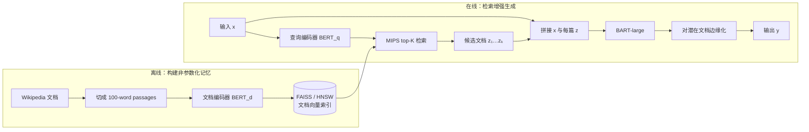
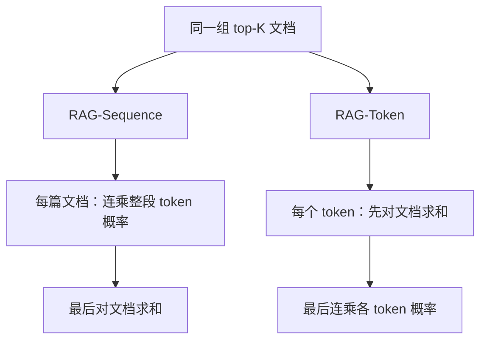
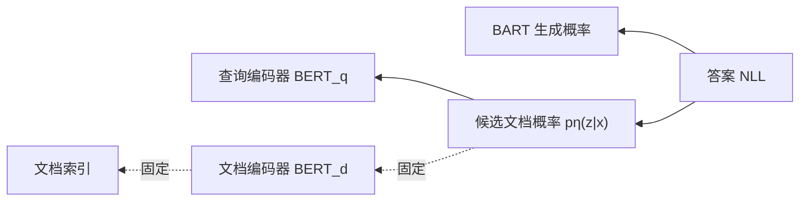
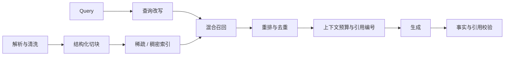
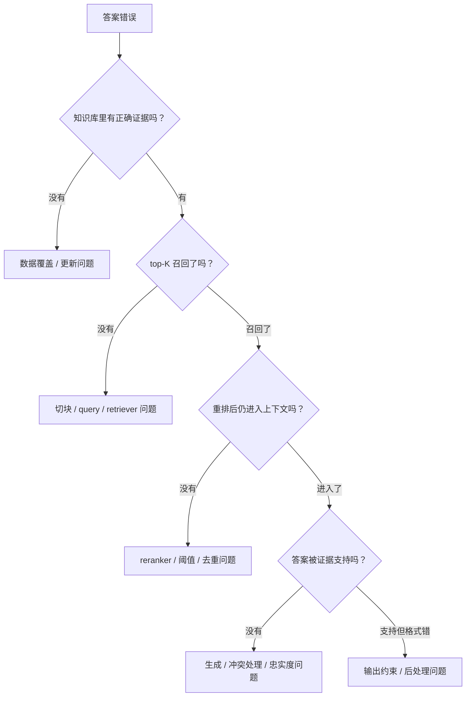

# RAG 原理与代码：让生成模型拥有可更新的外部记忆

**论文标题**：*Retrieval-Augmented Generation for Knowledge-Intensive NLP Tasks*

**作者**：Patrick Lewis、Ethan Perez、Aleksandra Piktus、Fabio Petroni 等

**会议 / 年份**：NeurIPS 2020

**主题**：`Retrieval-Augmented Generation` / `DPR` / `BART` / `潜变量模型`

**论文链接**：[arXiv](https://arxiv.org/abs/2005.11401) · [HTML](https://arxiv.org/html/2005.11401) · [PDF](https://arxiv.org/pdf/2005.11401)

**配套代码**：[rag_minimal.py](code/rag_minimal.py)

**一句话定位**：RAG 把检索到的文档视为潜变量，将可更新的非参数化记忆与生成模型的参数化记忆放进同一个概率模型中。


> 图：蓝色支路表示可检索的外部文档与向量索引，金色支路表示生成模型的参数化记忆，两者共同支持最终答案。本文原创概念图，不是论文原图。

---

## 0. 先给结论

读完本文，至少应记住下面八件事：

1. **RAG 不是简单的“搜索后拼 prompt”。** 原论文把文档 \(z\) 当作潜变量，对不同文档条件下的生成概率做边缘化。
2. **检索器是 DPR，生成器是 BART-large。** 查询和文档由不同的 BERT 编码器表示，通过最大内积搜索（MIPS）召回。
3. **RAG-Sequence 与 RAG-Token 的本质差别是求和与连乘的顺序。** 前者让整段输出由同一篇潜在文档解释，后者允许不同 token 由不同文档支持。
4. **RAG-Token 并不是每生成一个 token 就重新检索一次。** 它仍先取得同一组 top-\(K\) 文档，只是在每个 token 的概率上分别边缘化文档。
5. **训练不需要“这个答案来自哪篇文档”的直接标注。** 答案损失会更新查询编码器与生成器；但文档编码器和索引在论文中保持固定。
6. **知识可通过换索引更新。** 这比把全部事实压进模型参数更容易维护，但不等于“放入新文档后答案必然正确”。
7. **论文实验中的 RAG 没有 reranker。** “切块 + 混合检索 + 重排 + prompt + 引用”是后来工程 RAG 的常见形态，不应倒推成原论文设计。
8. **RAG 改善的是访问知识的方式，不是事实性的保证书。** 错误语料、漏召回、错误融合和生成幻觉仍可能沿管线传播。

---

## 1. 论文到底要解决什么问题

预训练语言模型可以把大量知识压进参数，但这种“闭卷记忆”有三个结构性问题：

- **难更新**：修改一个事实通常需要继续训练，且无法保证只修改目标知识；
- **难追溯**：模型很难解释某个答案来自哪里；
- **长尾知识不足**：参数容量、训练数据与优化过程都会影响记住哪些事实。

在 RAG 之前，开放域问答常用 `retrieve-and-extract`：先找文档，再从文档中抽取一个连续文本片段。它容易展示证据，却无法自然生成文档中没有逐字出现的答案。

RAG 把两条路线接到一起：

| 范式 | 知识主要存在哪里 | 输出方式 | 典型短板 |
|---|---|---|---|
| Closed-book LM | 模型参数 | 自由生成 | 知识难更新、来源不透明 |
| Retrieve-and-extract | 外部文档 | 抽取原文片段 | 不能灵活综合或改写 |
| RAG | 模型参数 + 外部文档 | 条件生成 | 依赖检索质量，系统更复杂 |

论文所说的两类记忆是：

- **参数化记忆（parametric memory）**：BART 参数中学到的语言能力与世界知识；
- **非参数化记忆（non-parametric memory）**：Wikipedia 文档向量及其检索索引。

“非参数化”不是说这部分没有任何模型，而是说知识内容主要保存在可替换的文档与索引中，不必写进生成器参数。

---

## 2. 整体架构：先检索，再对文档条件生成

原论文的系统同时包含离线建库与在线问答两条链路：



在线阶段可以拆成五步：

1. 查询编码器把输入 \(x\) 编码为向量 \(\mathbf q(x)\)；
2. 索引用最大内积搜索找到 top-\(K\) 文档；
3. 每篇候选文档分别与输入拼接；
4. BART 为每个“输入 + 文档”计算生成概率；
5. 系统按 RAG-Sequence 或 RAG-Token 的规则融合这些概率。

这与今天常见的 `top_k_docs -> 一个长 prompt -> LLM.generate()` 有明显区别：原论文会为各候选文档分别计算生成分布，再在概率空间里融合。

---

## 3. Retriever：DPR 如何给文档分配概率

### 3.1 双编码器

DPR 使用两个 BERT-base 编码器：

\[
\mathbf q(x)=\operatorname{BERT}_q(x),\qquad
\mathbf d(z)=\operatorname{BERT}_d(z)
\]

查询与文档的相关性是向量内积：

\[
s(x,z)=\mathbf d(z)^\top\mathbf q(x)
\]

再在候选文档上归一化：

\[
\boxed{
p_\eta(z\mid x)
\propto
\exp\left(\mathbf d(z)^\top\mathbf q(x)\right)
}
\]

其中 \(\eta\) 表示检索器参数。因为文档向量可提前计算，在线阶段只需编码问题，再进行 Maximum Inner Product Search。

### 3.2 为什么使用 MIPS

如果语料库有几千万个 passage，为每个问题与所有文档逐一计算内积不可行。论文把 top-\(K\) 检索转换为 MIPS，并用 FAISS 的 HNSW 近似索引加速。

这里需要区分两个操作：

- **top-\(K\) 选择**：从整个语料库近似找出候选文档；
- **候选内归一化**：把这些文档的分数变为 \(p_\eta(z\mid x)\)。

top-\(K\) 以外的文档在近似目标中被截断，因此“对所有文档边缘化”实际是“对召回的 \(K\) 篇文档边缘化”。

---

## 4. Generator：BART 如何使用检索结果

生成器可写为：

\[
p_\theta(y_i\mid x,z,y_{1:i-1})
\]

它根据原始输入 \(x\)、候选文档 \(z\) 和已生成前缀 \(y_{1:i-1}\)，预测第 \(i\) 个 token。

论文使用约 4 亿参数的 BART-large，并采用一个很朴素的融合方法：**直接把输入与候选文档拼接，再交给 BART 的 encoder-decoder**。因此，复杂之处不在一个新 Transformer block，而在文档潜变量的概率建模。

符号约定如下：

| 符号 | 含义 |
|---|---|
| \(x\) | 输入问题、声明或实体 |
| \(z\) | 一篇召回文档 / passage |
| \(y=(y_1,\ldots,y_N)\) | 目标输出序列 |
| \(p_\eta(z\mid x)\) | 检索器给文档的概率 |
| \(p_\theta(y_i\mid x,z,y_{<i})\) | 生成器的 token 概率 |
| \(K\) | 参与近似边缘化的候选文档数 |

---

## 5. 两个核心公式：RAG-Sequence 与 RAG-Token

### 5.1 RAG-Sequence：一篇潜在文档解释整段输出

\[
\boxed{
p_{\text{RAG-Sequence}}(y\mid x)
\approx
\sum_{z\in\operatorname{top-}K}
p_\eta(z\mid x)
\prod_{i=1}^{N}
p_\theta(y_i\mid x,z,y_{<i})
}
\]

计算顺序是：

1. 对每篇文档，先把所有 token 概率相乘，得到完整序列概率；
2. 再按检索概率对不同文档求和。

直觉上，它假设存在一篇潜在文档，对整段答案负责。候选答案可以由不同文档各自生成，但最终比较的是整段序列在所有文档下的边缘概率。

### 5.2 RAG-Token：每个 token 都可由不同文档支持

\[
\boxed{
p_{\text{RAG-Token}}(y\mid x)
\approx
\prod_{i=1}^{N}
\sum_{z\in\operatorname{top-}K}
p_\eta(z\mid x)
p_\theta(y_i\mid x,z,y_{<i})
}
\]

计算顺序变成：

1. 对当前 token，先融合所有候选文档下的预测概率；
2. 再把各位置的融合概率相乘。

因此一个 token 可以主要由文档 A 支持，下一个 token 可以主要由文档 B 支持。论文在 Jeopardy 问题生成中观察到，这种机制能组合多篇文档里的事实。

### 5.3 差别只在“求和与连乘的次序”



| 对比项 | RAG-Sequence | RAG-Token |
|---|---|---|
| 潜变量粒度 | 整个输出序列 | 每个输出 token |
| 文档切换 | 一段答案由同一潜在文档解释 | 不同 token 可依赖不同文档 |
| 解码 | 每篇文档分别 beam search，再重算边缘分数 | 融合 token 分布后可用标准 beam search |
| 更适合的直觉场景 | 单文档可回答的问题 | 跨文档组合信息 |
| 单 token 分类任务 | 与 RAG-Token 等价 | 与 RAG-Sequence 等价 |

> 易错点：RAG-Token 的“不同 token 使用不同文档”发生在**概率边缘化**层面，不表示系统每生成一个 token 都去全库重新检索。

### 5.4 用 20 行代码还原两个公式

真实训练应在 log 空间用 `logsumexp`，避免长序列概率下溢。若

- `doc_logits` 的形状为 `[batch, K]`；
- `token_log_probs` 的形状为 `[batch, K, target_length]`；

核心损失可以写成：

```python
import torch
import torch.nn.functional as F


def rag_sequence_nll(doc_logits, token_log_probs):
    """同一篇潜在文档负责完整序列。"""
    log_p_z = F.log_softmax(doc_logits, dim=1)          # [B, K]
    seq_log_p = token_log_probs.sum(dim=-1)             # [B, K]
    marginal = torch.logsumexp(log_p_z + seq_log_p, dim=1)
    return -marginal.mean()


def rag_token_nll(doc_logits, token_log_probs):
    """每个 token 都对潜在文档做一次边缘化。"""
    log_p_z = F.log_softmax(doc_logits, dim=1)           # [B, K]
    token_marginal = torch.logsumexp(
        log_p_z.unsqueeze(-1) + token_log_probs,
        dim=1,
    )                                                    # [B, T]
    return -token_marginal.sum(dim=-1).mean()
```

配套脚本还给出一个无依赖的数值版本。运行后会看到：

```text
RAG-Sequence probability: 0.1980
RAG-Token probability:    0.2736
```

这个例子特意让文档 1 更支持第一个 token、文档 2 更支持第二个 token，所以 RAG-Token 能得到更大的联合概率。它只是解释运算差异，不代表 RAG-Token 在所有任务上都更好。

---

## 6. 训练：没有文档标签，检索器如何学

训练集只需要输入—输出对 \((x_j,y_j)\)，目标是最小化负边缘对数似然：

\[
\mathcal L
=
-\sum_j\log p(y_j\mid x_j)
\]

训练信号的传播路径是：



如果某篇文档让正确答案的生成概率更高，它在边缘似然中的贡献就更大，查询编码器会逐渐提高对这类文档的得分。这是“用最终任务监督检索”的关键。

不过，“端到端训练”需要准确理解：

- 更新的是 **BART 生成器**与 **DPR 查询编码器**；
- 文档编码器 \(\operatorname{BERT}_d\) 与文档索引保持固定；
- top-\(K\) 搜索本身是离散选择，梯度是在当前召回集合内通过文档概率传播的；
- 检索器并非从随机初始化开始，它继承了在 Natural Questions 与 TriviaQA 上训练过的 DPR。

固定文档编码器是工程上的重要折中。若同时更新它，全部文档向量会变旧，需要反复重建千万级索引，训练代价会大幅上升。

### 6.1 一个失败模式：retrieval collapse

论文附录报告，在故事生成等任务上，检索器有时会坍缩为“无论输入是什么都召回相同文档”，随后生成器学会忽略文档，效果退化为普通 BART。

这说明只有当目标任务对外部事实有清晰需求，答案损失才可能为检索器提供足够有用的梯度。现代系统即使不联合训练，也会遇到类似的“上下文被忽略”问题。

---

## 7. 推理：两种模型为什么需要不同解码

### 7.1 RAG-Token

RAG-Token 可以先把当前步各文档下的 token 分布融合：

\[
p'(y_i\mid x,y_{<i})
=
\sum_z p_\eta(z\mid x)
p_\theta(y_i\mid x,z,y_{<i})
\]

融合后的 \(p'\) 仍是标准自回归转移概率，因此可以直接使用普通 beam search。

### 7.2 RAG-Sequence

RAG-Sequence 的文档求和在完整序列概率外层，不能在每个 token 上提前融合。论文的解码方法是：

1. 为每篇候选文档分别运行 beam search；
2. 合并各文档产生的候选序列；
3. 重新计算候选序列在各文档下的概率；
4. 加权求和，得到最终边缘概率。

论文把完整重算称为 **Thorough Decoding**。更快的 **Fast Decoding** 假设：若某序列没有出现在某篇文档对应的 beam 中，则它在该文档下的概率近似为 0。

因此 \(K\) 不只是召回超参数，也直接影响生成计算量与延迟。更多文档不一定总是更好：论文中 RAG-Token 在 Natural Questions 上的表现于 10 篇文档附近达到峰值，而 RAG-Sequence 在所测范围内随检索文档增多继续改善。

---

## 8. 实验设置与关键结果

### 8.1 论文使用了什么

| 组件 | 原论文设置 |
|---|---|
| 知识库 | 2018 年 12 月 Wikipedia |
| 切块 | 每篇文章切为互不重叠的 100-word passage |
| 规模 | 约 2100 万 passages |
| Retriever | DPR，BERT-base 双编码器 |
| 搜索 | FAISS + HNSW 的近似 MIPS |
| Generator | BART-large，约 4 亿参数 |
| 训练时 \(K\) | 5 或 10 |
| 训练参数 | 查询编码器 + BART |
| 固定部分 | 文档编码器 + 文档索引 |
| 任务 | 开放域 QA、抽象式 QA、Jeopardy 问题生成、FEVER 事实验证 |

需要注意：论文使用的是**互不重叠**的固定 100-word chunks；今天常见的 overlap、标题继承、表格感知和 parent-child retrieval 都是后续工程改进。

### 8.2 代表性结果

下面只摘录最能说明问题的测试集结果；不同任务指标不同，数值不能横向比较：

| 任务 / 指标 | 参数模型或检索基线 | RAG 结果 |
|---|---:|---:|
| Natural Questions / EM | T5-11B 34.5；DPR 41.5 | RAG-Sequence **44.5** |
| WebQuestions / EM | T5-11B 37.4；DPR 41.1 | RAG-Token **45.5** |
| CuratedTrec / EM | DPR 50.6 | RAG-Sequence **52.2** |
| MS-MARCO / Rouge-L | BART 38.2 | RAG-Sequence **40.8** |
| Jeopardy / Q-BLEU-1 | BART 19.7 | RAG-Token **22.2** |
| FEVER 3-way / Accuracy | BART 64.0 | RAG-Token **72.5** |

论文还报告：

- 在 Natural Questions 中，即使正确答案没有逐字出现在任何召回文档里，RAG 仍有 11.8% 的样本生成正确答案；
- Jeopardy 人工评测中，42.7% 的比较认为 RAG 比 BART 更事实准确，而认为 BART 更好的比例为 7.1%；
- FEVER 中，top-1 检索结果有 71% 来自 gold article，top-10 覆盖率达到 90%；
- 可学习的稠密检索在大多数任务上优于冻结检索或 BM25，但实体词重叠很强的 FEVER 是例外。

这些是 2020 年特定数据、模型和评测下的历史结果，不应直接解释为“任何现代 RAG 都会提升相同比例”。

### 8.3 换索引真的能更新知识吗

论文分别加载 2016 与 2018 年 Wikipedia 索引，并询问 82 个在这两年间发生变化的世界领导人职位：

| 索引与答案年份 | 准确率 |
|---|---:|
| 2016 索引回答 2016 领导人 | 70% |
| 2018 索引回答 2018 领导人 | 68% |
| 2018 索引回答 2016 领导人 | 12% |
| 2016 索引回答 2018 领导人 | 4% |

结果说明更换非参数化记忆能够显著改变模型可访问的事实。它同时说明：

- 参数化记忆仍可能与新文档冲突；
- 检索器未必能找到新文档；
- 生成器未必忠实采用召回内容；
- 所以索引热更新必须配合端到端评测，而不能只检查“文档已入库”。

---

## 9. 从零实现一个可运行的最小 RAG

论文级 RAG 需要 DPR、BART、FAISS 与大规模 Wikipedia 索引，不适合在一段博客代码里下载并运行。配套的 [rag_minimal.py](code/rag_minimal.py) 使用纯 Python 实现：

```text
Document
   ↓ chunk_documents
Chunk[]
   ↓ BM25Retriever.retrieve
RetrievedChunk[] + p(z|x)
   ↓ build_prompt
带来源编号的上下文
   ↓ generator
答案 + [E1] 引用
```

这个例子的目的，是让下面三个边界变得清楚：

- **检索**返回内容、分数、来源与候选概率；
- **prompt builder**只负责编排证据和回答约束；
- **generator**是可替换接口，示例用确定性的证据句抽取器占位。

### 9.1 最小管线接口

```python
class MinimalRAG:
    def __init__(self, retriever, generator):
        self.retriever = retriever
        self.generator = generator

    def answer(self, query, *, top_k=3):
        evidence = self.retriever.retrieve(query, top_k=top_k)
        prompt = build_prompt(query, evidence)
        answer = self.generator(query, prompt, evidence)
        return answer, evidence, prompt
```

### 9.2 Prompt 必须表达证据边界

```python
def build_prompt(query, evidence):
    context = "\n\n".join(
        f"[E{i}] {item.chunk.title}\n{item.chunk.text}"
        for i, item in enumerate(evidence, start=1)
    )
    return f"""你是一个严格依据证据回答问题的助手。
如果证据不足，请明确回答“现有证据不足”，不要补写常识。
回答中的事实后必须给出 [E1] 形式的引用。

问题：
{query}

证据：
{context}

答案："""
```

Prompt 约束不能证明答案真实，但能明确三件事：允许使用哪些证据、证据不足时做什么、输出如何对应来源。

### 9.3 运行

项目根目录执行：

```bash
python3 papers/to-2026/code/rag_minimal.py
```

脚本不依赖第三方包，也不需要 API Key。它会先验证 RAG-Sequence / RAG-Token 的数值差异，再运行一个中文 BM25 检索示例。

要接入真实 LLM，只需实现相同签名的生成函数：

```python
def my_llm_generator(query, prompt, evidence):
    # 把 prompt 交给本地模型或模型服务。
    # 返回字符串；日志中另外保存 evidence 与模型版本。
    return model.generate(prompt)


rag = MinimalRAG(retriever, my_llm_generator)
```

> 这段工程代码不是原论文训练的复现：BM25 替代了 DPR，单 prompt 生成替代了文档潜变量边缘化。两套概率公式的无依赖实现也放在同一个脚本中，便于逐行对照。

---

## 10. 从论文 RAG 到今天的工程 RAG

今天人们说“RAG”时，通常指一个更宽泛的系统模式：

| 维度 | 2020 原论文 | 常见工程 RAG |
|---|---|---|
| Retriever | 可训练 DPR 查询编码器 | BM25、embedding、hybrid search |
| 文档融合 | 对各文档生成概率做边缘化 | 将多段证据拼入一个 prompt |
| Generator | 任务微调的 BART | 通用指令 LLM，常保持冻结 |
| Reranker | 没有 | cross-encoder / LLM reranker 常见 |
| 训练 | 用答案 NLL 联合训练查询编码器与生成器 | 很多系统不训练，只调索引与 prompt |
| 来源引用 | 可检查召回文档，但不自动生成引用 | 常要求句级或段级 citation |
| 知识库 | 固定 Wikipedia passage | 企业文档、网页、数据库、API、多模态内容 |

因此阅读架构图时要先问一句：这里的 “RAG” 指的是论文中的概率模型，还是“先检索、后生成”的工程范式？

---

## 11. 生产实现：最值得优化的不是哪一个参数

一套可维护的 RAG，通常应把下面模块解耦：



### 11.1 切块

不要只按字符数机械切：

- 标题、列表、表格与代码块应尽量保持完整；
- chunk 太小会失去上下文，太大会稀释主题并浪费 token；
- overlap 能缓解边界截断，但也会制造重复召回；
- 保存 `source_id`、标题、时间、权限与字符偏移，后面才能展示引用。

### 11.2 检索与重排

稀疏检索擅长专有名词、编号和精确词面，稠密检索擅长语义改写。生产系统常先 hybrid recall，再让更昂贵的 reranker 对较小候选集排序。

不要只看最终答案。至少分别评估：

| 层级 | 推荐指标 | 回答的问题 |
|---|---|---|
| 召回 | Recall@K | 正确证据是否进入候选集 |
| 排序 | MRR / nDCG | 正确证据是否排得足够靠前 |
| 答案 | EM / F1 / 任务指标 | 最终任务是否完成 |
| 忠实度 | groundedness / citation precision | 答案是否真的被证据支持 |
| 系统 | P50/P95 latency、token、成本 | 能否稳定上线 |

### 11.3 上下文编排

top-\(K\) 不是越大越好。更多 chunk 会带来：

- 更高召回率；
- 更长 prompt 与更大延迟；
- 重复、冲突和无关证据；
- 关键信息被“埋在中间”的风险。

比固定 \(K\) 更稳妥的做法，是设置最低相关性阈值、去重、按 token budget 装箱，并在证据不足时允许拒答。

---

## 12. 如何定位 RAG 的错误

把“答案错了”直接归因于 LLM，往往会修错层。可以按下面顺序排查：



为每次请求记录下面这些信息，才能复盘：

```text
query
query_rewrite
retrieved_chunk_ids + raw_scores
reranked_chunk_ids + scores
final_context
prompt_version
model_version
answer
citations
latency_by_stage
```

同时注意隐私与权限：日志不应泄露敏感文档，检索必须在召回前做访问控制，不能等到生成后再过滤。

---

## 13. 局限、风险与常见误区

### 13.1 召回文档不等于正确证据

相似度衡量的是“像不像”，不是“真不真”。外部知识库可能过时、有偏见、被污染，甚至包含针对模型的提示注入文本。

### 13.2 有正确证据不等于忠实生成

生成器可能忽略证据、混合互相冲突的段落，或用参数记忆覆盖新文档。引用编号也可能只是格式正确，却没有真正支持相邻陈述。

### 13.3 可追溯不等于自动可解释

原论文能展示检索到哪些 passage，但这只能提供 provenance 候选。要声称“某句话由某证据支持”，仍需细粒度引用生成与 entailment 校验。

### 13.4 更新索引不等于删除模型记忆

换索引能更新外部知识，却不会擦除生成器参数中的旧知识。对于时效性事实，应在 prompt 中明确以带日期的外部证据为准，并测试新旧证据冲突。

### 13.5 外部文档扩大了攻击面

生产系统还要处理：

- 文档级 ACL 与多租户隔离；
- prompt injection 与恶意网页；
- PII、版权和数据保留策略；
- 索引版本、删除传播和审计；
- 引用链接失效与文档内容漂移。

RAG 把一部分模型风险转化成了搜索、数据治理和系统安全问题，而不是让风险消失。

---

## 14. 应该怎样读这篇论文

建议按下面顺序：

1. 先看 Figure 1，确认检索器、索引、生成器和边缘化各自的位置；
2. 精读 §2.1，只盯住 RAG-Sequence 与 RAG-Token 中求和、连乘的次序；
3. 再读 §2.4，理解答案监督如何更新查询编码器，以及为何固定文档编码器；
4. 读 §2.5，对照两种概率分解理解不同解码算法；
5. 看 §4.5 的检索消融、换索引和文档数量实验；
6. 最后读附录 H 的 retrieval collapse，避免只记住成功案例。

如果你做应用，最值得继承的不是 BART 或 DPR 的具体版本，而是三个设计原则：

- 让知识存储与语言生成承担不同职责；
- 把检索质量作为独立可测的中间环节；
- 让外部记忆可更新、可检查、可回滚。

---

## 15. 前置阅读与后续路线

### 前置阅读

- [BERT：双向编码与表示学习](01_BERT_2018_原理.md)
- [Transformer：encoder-decoder 基础](00_Transformer_2017_原理.md)
- [GPT-3：参数化知识与上下文学习](05_GPT3_2020_原理.md)
- DPR：理解双编码器与稠密检索
- BART：理解去噪预训练的 seq2seq 生成器

### 读完接着看

- **REALM**：检索增强语言模型预训练；
- **FiD**：在 decoder 侧融合多篇文档；
- **RETRO / Atlas**：扩大检索增强预训练与 few-shot 能力；
- **ReAct**：把知识检索扩展为推理与工具调用循环；
- **Self-RAG / Corrective RAG**：让模型学习何时检索、评价和修正证据。

---

## 参考资料

1. Patrick Lewis et al., [Retrieval-Augmented Generation for Knowledge-Intensive NLP Tasks](https://arxiv.org/html/2005.11401), NeurIPS 2020.
2. Vladimir Karpukhin et al., [Dense Passage Retrieval for Open-Domain Question Answering](https://aclanthology.org/2020.emnlp-main.550/), EMNLP 2020.
3. [Hugging Face Transformers: RAG model documentation](https://huggingface.co/docs/transformers/model_doc/rag).
4. [FAISS: A library for efficient similarity search](https://github.com/facebookresearch/faiss).
