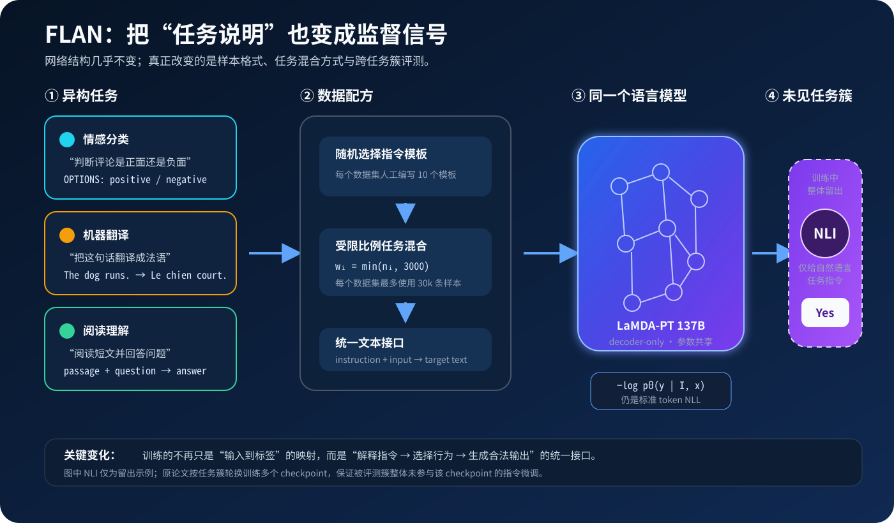
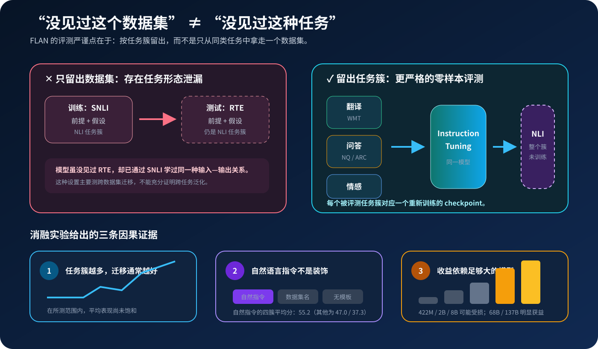

# FLAN 原理与代码：为什么指令微调能带来零样本泛化

**论文标题**：*Finetuned Language Models Are Zero-Shot Learners*

**作者**：Jason Wei、Maarten Bosma、Vincent Y. Zhao、Kelvin Guu 等

**会议 / 年份**：ICLR 2022（arXiv 首发于 2021）

**主题**：`Instruction Tuning` / `Multi-task Learning` / `Zero-shot Generalization`

**论文链接**：[arXiv](https://arxiv.org/abs/2109.01652) · [HTML](https://ar5iv.labs.arxiv.org/html/2109.01652) · [PDF](https://arxiv.org/pdf/2109.01652) · [Google Research](https://research.google/pubs/finetuned-language-models-are-zero-shot-learners/)

**官方数据代码**：[google-research/FLAN](https://github.com/google-research/FLAN)

**配套代码**：[flan_minimal.py](code/flan_minimal.py)

**一句话定位**：FLAN 没有发明新的 Transformer 层，而是把 62 个 NLP 数据集改写成自然语言指令，通过多任务微调让模型学习“根据指令选择行为”，再严格检验它能否泛化到训练中整体留出的任务类型。


> 图：不同任务通过自然语言接口进入共享模型，模型再处理一个未见过的新任务。本文原创概念图，不是论文原图。

---

## 0. 先给结论

读完本文，至少应记住下面九件事：

1. **FLAN 是训练范式，不是新网络结构。** 原论文使用 137B 的 decoder-only LaMDA-PT，改变的主要是数据组织与评测方式。
2. **FLAN 的核心不是“把问题前面加一句话”。** 指令必须在训练时反复出现，并与任务输入、合法输出共同参与监督学习。
3. **原始 FLAN 不是 Flan-T5。** 2021 年论文的底座是 LaMDA-PT；公开且常用的 Flan-T5 来自后续扩展工作。
4. **论文中的“未见任务”比“未见数据集”更严格。** 测试 NLI 时，所有 NLI 数据集都不能进入该 checkpoint 的指令微调。
5. **训练目标仍是标准自回归负对数似然。** 新能力来自任务与模板的分布，而不是一个特殊的 instruction loss。
6. **任务多样性比机械增加同一数据集的模板数更重要。** 消融中，增加每个任务簇的数据集带来明显收益；模板从 1 增至 10 的影响小得多。
7. **自然语言指令确实有独立贡献。** 只给输入输出，或只在输入前加数据集名称，都显著弱于真正的自然语言指令。
8. **指令微调并非在所有规模上都有效。** 原论文中 8B 及以下模型在留出任务上的表现反而下降，明显收益出现在 68B 和 137B。
9. **“更会听指令”不等于“更真实、更安全、更符合人类偏好”。** FLAN 是后训练的重要起点，但不是完整的对齐方案。

---

## 1. FLAN 要解决的不是“模型不会做题”，而是“模型不知道你要它做什么”

[GPT-3](05_GPT3_2020_原理.md) 已经展示出 few-shot in-context learning：只要在上下文里放几个示例，大模型就可能识别出任务。但 zero-shot 时只有一句自然语言说明，没有示例帮模型确认输入格式、标签空间和回答风格，性能往往显著下降。

问题可以概括成训练—使用接口错位：

```text
预训练看到的内容：网页、书籍、代码、对话……
实际使用时的输入：“判断下面两句话是否蕴含，只回答 Yes 或 No。”
```

纯语言模型训练的是“接下来最可能出现什么”，而用户需要的是“按这条任务说明完成工作”。二者有重叠，却不完全相同。

以自然语言推断（NLI）为例，原始数据集格式通常很像研究协议：

```text
premise: A child is playing a violin.
hypothesis: A child is making music.
label: entailment
```

这类结构未必像自然网页中的连续文本。FLAN 将它改写成更贴近人类交互的形式：

```text
Does the premise entail the hypothesis?

Premise: A child is playing a violin.
Hypothesis: A child is making music.

OPTIONS:
- yes
- no
```

目标是：

```text
yes
```

关键变化不是模型突然获得了新知识，而是训练过程开始显式教它：

- 哪段文字是任务说明；
- 哪段文字是待处理输入；
- 当前任务允许输出什么；
- 如何把同一套语言能力切换成分类、翻译、问答或生成行为。

---

## 2. 原始 FLAN 到底是什么

FLAN 是 **Finetuned LAnguage Net** 的缩写。论文从一个预训练模型出发：

| 项目 | 原论文设置 |
|---|---|
| 底座 | LaMDA-PT |
| 架构 | dense decoder-only Transformer |
| 参数量 | 137B |
| 预训练 token | 2.49T BPE tokens |
| 词表 | 32k SentencePiece |
| 非英语预训练数据 | 约 10% |
| 指令微调数据 | 62 个公开 NLP 数据集 |
| 任务簇 | 12 类 |

这里的 `PT` 很重要：LaMDA-PT 只经过语言模型预训练，不是已经做过对话微调的 LaMDA。论文因此可以更直接地比较：

```text
LaMDA-PT 137B
    │
    ├── 不做指令微调 → 基础 zero-shot 模型
    │
    └── 做指令微调   → FLAN 137B
```

这也纠正了一个常见误解：

> 2021 年原论文的 FLAN 不是基于 T5 的 encoder-decoder 模型。后来广泛使用的 Flan-T5 是后续扩大任务集合与模型家族后的产物。

---

## 3. 方法全景：网络不变，数据接口变了



整个过程可以压缩成四步：

1. 收集多个不同类型的监督数据集；
2. 用自然语言模板把每条样本改写为“指令 + 输入 → 文本输出”；
3. 按受限比例混合任务，继续训练同一个语言模型；
4. 只给自然语言指令，在训练中留出的任务簇上做 zero-shot 评测。

注意第 4 步不是拿一个统一 checkpoint 测完所有任务。为了保证某个评测簇没有出现在指令微调中，论文会针对不同留出簇分别训练 checkpoint。

---

## 4. 数据层才是 FLAN 的核心实现

### 4.1 62 个数据集被归到 12 个任务簇

论文没有把每个数据集都当作互不相关的“任务”，而是先按语义结构归类：

| 任务簇 | 代表数据集 | 输出形态 |
|---|---|---|
| Natural language inference | ANLI、SNLI、RTE | 类别文本 |
| Reading comprehension | BoolQ、DROP、SQuAD | 类别或自由文本 |
| Commonsense reasoning | COPA、HellaSwag、PIQA | 选项文本 |
| Sentiment analysis | IMDb、SST-2、Yelp | 类别文本 |
| Closed-book QA | ARC、Natural Questions、TriviaQA | 自由文本 |
| Paraphrase detection | MRPC、QQP、PAWS | 类别文本 |
| Coreference resolution | DPR、WinoGrande、WSC273 | 选项文本 |
| Reading comprehension with commonsense | CosmosQA、ReCoRD | 选项或文本 |
| Struct-to-text | DART、E2E NLG、WebNLG | 自由文本 |
| Translation | WMT、ParaCrawl | 自由文本 |
| Summarization | CNN/DailyMail、XSum、MultiNews 等 | 自由文本 |
| Miscellaneous | CoQA、QuAC、WiC、TREC、CoLA、数学题 | 多种形态 |

任务簇有两个作用：

- **训练层面**：迫使模型接触不同的输入—输出关系；
- **评测层面**：定义怎样才算真正“未见过一种任务”。

这个设计比单纯记录 `dataset_name` 更接近 FLAN 的研究问题：模型是否从已知任务族中学到一种可迁移的指令接口？

### 4.2 每个数据集有 10 个自然语言模板

原论文为每个数据集人工编写 10 个模板，并在采样一条训练样本时随机选择其中一个。模板不是只改同义词，还会改变任务表述方式。

例如同一条情感样本可以被写成：

```text
Is this movie review positive or negative?
{review}
```

也可以写成：

```text
What sentiment does the writer express in the following review?
{review}
```

每个数据集还可以有最多 3 个“反转任务”模板。例如原任务是：

```text
review → sentiment
```

反转后可以变成：

```text
sentiment → generate a matching review
```

这样做的意义不只是语言多样性。它还改变了条件生成的方向，避免模型把一个数据集永久绑定到单一映射。

### 4.3 分类任务为什么要显式追加 `OPTIONS`

原始 FLAN 是自由文本生成模型。对于分类任务，理论上可以比较所有候选标签的条件概率，但一个标签往往有很多语义等价写法：

```text
yes / Yes / true / entailed / definitely
```

如果只比较单个字符串，概率质量可能被这些表达分散。论文因此在分类输入末尾追加合法选项：

```text
OPTIONS:
- Yes
- It's impossible to say
- No
```

这相当于把输出协议也写进指令，减少“模型知道答案，但输出形式不符合评测”的问题。

不过，`OPTIONS` 不是强制解码约束。模型仍在整个词表上生成；选项只是文本上下文。

### 4.4 大数据集不能淹没小数据集

如果简单拼接数据，百万级翻译数据会让几千条样本的小任务几乎消失。FLAN 采用 examples-proportional mixing，并做两层截断：

1. 每个数据集最多使用 30,000 条训练样本；
2. 数据集混合权重最多按 3,000 条样本计算。

令清洗和截断后的数据集大小为 \(n_i\)，其采样权重可写成：

\[
w_i=\min(n_i,3000)
\]

\[
\boxed{
q_i
=
\frac{w_i}{\sum_j w_j}
}
\]

这意味着 100 万条样本的数据集不会比 3,000 条样本的数据集获得更高的任务采样权重，但它内部仍可从最多 30,000 个不同样本中抽取。

两个 cap 解决的问题不同：

| 限制 | 控制什么 |
|---|---|
| 30,000 examples / dataset | 单个数据集实际进入微调的样本池大小 |
| mixing rate cap = 3,000 | 每一步选中该数据集的相对概率 |

---

## 5. 数学目标：仍是普通语言模型损失

设：

- \(D_i\) 是第 \(i\) 个数据集；
- \(q_i\) 是它在任务混合中的采样概率；
- \((x,y)\sim D_i\) 是输入与目标；
- \(\tau\sim T_i\) 是为该数据集随机选择的指令模板；
- \(u=\tau(x)\) 是最终输入文本。

FLAN 的目标可以写成：

\[
\boxed{
\mathcal L(\theta)
=
-\mathbb E_{
i\sim q,\,
(x,y)\sim D_i,\,
\tau\sim T_i
}
\left[
\sum_{t=1}^{|y|}
\log p_\theta
\left(
y_t
\mid
u,y_{<t}
\right)
\right]
}
\]

这就是条件自回归生成。没有新的注意力层，也没有奖励模型。

对于 decoder-only 模型，输入与目标会被串成一个序列：

```text
[instruction + input] <EOS> [target] <EOS>
```

工程实现通常只在 target 位置计算监督损失：

```text
input_ids:  [101, 102, 103,   1, 201, 202,   2]
labels:     [-100,-100,-100,-100, 201, 202,   2]
             └──── prompt ────┘  └ target ──┘
```

`-100` 是 PyTorch 交叉熵常用的 `ignore_index`。这样模型读取指令作为条件，但不会被训练成复述 prompt。

> 原论文使用打包（packing），以特殊 EOS 分隔输入和目标，并把多个样本组合进长序列。上面的 mask 是现代 causal LM 训练中常见的等价教学写法，用于突出“只监督回答”的逻辑，并非对其内部训练代码的逐行复刻。

### 5.1 原论文训练配置

| 配置项 | 数值 |
|---|---:|
| 优化器 | Adafactor |
| 学习率 | \(3\times10^{-5}\) |
| 微调步数 | 30,000 |
| Batch size | 8,192 tokens |
| 最大输入长度 | 1,024 tokens |
| 最大目标长度 | 256 tokens |
| 硬件 | TPUv3，128 cores |
| 训练时间 | 约 60 小时 |

指令微调步数不到预训练步数的 2%。这正是该范式吸引人的地方：不必从头训练一个基础模型，就能显著改变它面对任务说明时的行为。

---

## 6. 最关键的实验设计：留出整个任务簇



假设训练使用 SNLI，测试使用 RTE。两者不是同一个数据集，但都是 NLI：

```text
premise + hypothesis → entailment label
```

模型可能只是学会了 NLI 的输入—输出结构，再把它迁移到另一个 NLI 数据集。这是有价值的跨数据集迁移，却不能证明模型学会了处理一种未见任务。

FLAN 使用更严格的标准：

\[
D\text{ 在评测时未见}
\iff
\text{训练中没有出现任何与 }D\text{ 同任务簇的数据集}
\]

例如评测 NLI 时：

```text
训练：翻译、情感、问答、摘要、结构化文本生成……
留出：ANLI、CB、MNLI、QNLI、SNLI、WNLI、RTE 等全部 NLI 数据集
```

而且论文还主动处理相近簇：

- 评测 NLI 时也移除 paraphrase detection，反之亦然；
- 评测 reading comprehension 或 commonsense reasoning 时，移除两者的组合簇；
- 评测组合簇时，同时移除 reading comprehension 与 commonsense reasoning。

因此，如果要评测 \(c\) 个任务簇，就要训练 \(c\) 个具有不同留出集合的模型。论文中提到的“FLAN”在这类结果表里，不应被误解为一个同时看过其余所有评测簇的万能 checkpoint。

---

## 7. 为什么指令微调会有效

论文主要提供实验事实。下面的三层解释有助于建立直觉，其中“任务表示”和“元学习”是对结果的建模视角，不是论文证明的唯一机制。

### 7.1 自然语言成为可组合的任务表示

传统多任务学习常用固定 task ID：

```text
[TASK_17] + input
```

这种标记只在训练任务集合内部有意义。新任务没有学过的 ID，也无法仅从 ID 的字面含义推断行为。

自然语言指令则复用了预训练中已有的语义空间：

```text
translate / summarize / decide whether / answer based on
```

模型在预训练时已经接触过这些词及其关系。指令微调把这种语言知识与明确的输入—输出行为对齐，使任务描述本身具备迁移价值。

### 7.2 训练与推理的接口终于一致

只在推理时突然要求基础模型听指令，相当于让模型处理一种训练分布中不稳定的格式。指令微调把这种格式反复写入训练分布：

```text
训练：instruction + input → output
推理：instruction + input → ?
```

这并不保证模型真正理解每句话，但显著缩小了接口层的分布偏移。

### 7.3 多任务训练形成“根据上下文选择算法”的压力

同一组参数要同时完成分类、问答、翻译和生成。只记住一个固定输入—输出规则不再可行，模型必须利用 prompt 中的任务信息切换行为。

从元学习视角看，训练样本不仅提供答案，还在教一个更高层过程：

```text
读取任务说明 → 推断输出协议 → 调用已有知识与能力 → 生成答案
```

这也是为什么任务簇多样性很重要：如果所有数据都只是情感分类，模型可能只学会情感分类的多种说法，而不是更通用的指令跟随。

---

## 8. 实验结果应该怎样读

### 8.1 最醒目的总结果

论文报告，在使用开发集选择最佳模板时：

- zero-shot FLAN 在 25 个可比较数据集中有 **20 个超过 zero-shot GPT-3 175B**；
- 在 **10 个数据集**上超过 few-shot GPT-3；
- 摘要特别强调了 ANLI、RTE、BoolQ、AI2-ARC、OpenBookQA 和 StoryCloze 的大幅领先。

这组比较很有历史意义：137B 的模型经过指令微调后，可以在许多 zero-shot 任务上超过参数更多的 175B GPT-3。

但不能把它简化为“FLAN 全面强于 GPT-3”：

- 不同论文的模型、预训练数据和提示格式不完全相同；
- 部分结果使用开发集挑选最佳模板；
- FLAN 的平均模板结果与最佳模板结果不是一回事；
- 论文还测试了 GPT-3 没有公开对应结果的其他数据集；
- supervised task-specific 模型在很多任务上仍然更强。

### 8.2 哪些任务提升明显

FLAN 对容易自然写成指令的任务尤其有效：

- NLI；
- 阅读理解；
- 闭卷问答；
- 翻译；
- struct-to-text。

NLI 是很典型的例子。把学术化的标签预测改写成：

```text
Does <premise> mean that <hypothesis>?
```

比让基础模型把 NLI 当作生硬的文本续写更自然。

### 8.3 哪些任务没有明显收益

对本来就很像语言模型续写的任务，指令可能是冗余的。论文在 7 个常识推理与共指消解任务中，FLAN 只在 3 个上超过 LaMDA-PT。

这条负结果很重要：

> 指令微调主要改善“如何调用能力”的接口；如果任务已经与预训练目标高度一致，额外接口未必带来收益。

翻译也表现出方向不对称：译入英语较强，英语译出其他语言相对较弱。论文将其与英语占主导的预训练数据和英语 SentencePiece tokenizer 联系起来。

---

## 9. 四组消融实验告诉了我们什么

### 9.1 训练任务簇越多，未见任务通常越好

论文留出 NLI、闭卷 QA 和常识推理作为评测簇，逐步把 1～7 个其他任务簇加入指令微调。平均表现总体随训练簇增加而提升，且在所测范围内没有明显饱和。

这支持了 FLAN 最核心的假设：

\[
\text{更丰富的任务分布}
\Longrightarrow
\text{更好的跨任务迁移}
\]

但结果不是“任何数据都有效”。情感分析簇在该实验里没有带来同样清晰的增益，任务之间的迁移关系仍然复杂。

### 9.2 模型规模存在明显门槛

论文比较了：

```text
422M → 2B → 8B → 68B → 137B
```

结果很反直觉：

- 68B 与 137B 在留出任务上从指令微调中明显获益；
- 8B 及以下模型在留出任务上的表现反而下降。

作者提出一种可能解释：小模型的容量被约 40 个训练任务占满，能拟合训练混合，却没有剩余容量形成跨任务泛化；大模型既能学习这些任务，也能抽象出指令跟随能力。

这是特定于该论文模型、数据配方和 2021 年训练条件的结果，不应解释成“今天所有小模型都不能做指令微调”。后续 T0、Flan-T5 等工作已经在更小尺度上获得成功，说明数据设计、底座和训练方法都会改变门槛。

### 9.3 自然语言指令不是多任务微调的装饰

论文比较三种训练输入：

1. 自然语言指令；
2. 只加 task / dataset name；
3. 完全不加模板，只给原始输入。

四个留出任务簇的平均分如下：

| 微调输入 | 推理输入 | 四任务平均分 |
|---|---|---:|
| 自然语言指令 | 自然语言指令 | **55.2** |
| Task / dataset name | Task / dataset name | 47.0 |
| Task / dataset name | 自然语言指令 | 46.6 |
| 无模板 | 自然语言指令 | 37.3 |

这说明收益不能只归因于“模型多看了几个有标签数据集”。训练时用可解释的自然语言描述任务，确实改善了面对未见任务说明时的迁移。

### 9.4 更多数据集比更多同义模板更重要

附录进一步控制任务簇数量，比较：

- 每簇 1 个数据集 vs. 每簇最多 4 个数据集；
- 每个数据集使用 1、4 或 10 个模板。

结果是：

- 每簇加入更多数据集，在三个留出簇上平均提升接近 10%；
- 把模板数从 1 增到 10，影响相对很小；
- 当每簇已有 4 个数据集时，模板数带来的差异基本消失。

所以不能把 FLAN 的成功简单归因于“prompt paraphrasing”。真正有价值的是**任务与数据分布的多样性**。

### 9.5 指令微调与 few-shot 不是互斥路线

论文还把最多 16 个示例放进上下文，并限制示例部分总长度小于 960 tokens。few-shot exemplars 在所有任务簇上都进一步提升 FLAN，尤其有利于输出空间复杂的翻译、闭卷问答和 struct-to-text。

同时，few-shot FLAN 在不同模板之间的标准差更小。这意味着：

```text
instruction tuning：让模型更熟悉“如何读任务说明”
few-shot examples：让模型更清楚当前任务的具体输出格式
```

两者互补，不是替代关系。

---

## 10. 从零实现最小 FLAN 数据管线

论文级复现需要 137B 模型、62 个数据集和大规模 TPU 训练，不适合塞进博客。配套的 [flan_minimal.py](code/flan_minimal.py) 使用纯 Python、零第三方依赖，还原 FLAN 最值得理解的工程逻辑：

```text
TaskDataset
    ├── cluster
    ├── natural-language templates
    ├── legal output options
    └── raw examples
          │
          ▼
strict cluster holdout
          │
          ▼
examples-proportional mixture
          │
          ▼
random template rendering
          │
          ▼
prompt-masked causal-LM features
```

运行：

```bash
python3 papers/to-2026/code/flan_minimal.py \
  --held-out-cluster nli \
  --samples 6 \
  --seed 7
```

输出会明确列出：

- 哪些数据集进入训练；
- 哪个任务簇只用于评测；
- 训练数据集的归一化采样概率；
- 随机模板生成的训练样本；
- causal LM 的 target-only label mask。

### 10.1 严格按任务簇切分

```python
def split_by_cluster(datasets, held_out_cluster):
    train = [
        task for task in datasets
        if task.cluster != held_out_cluster
    ]
    evaluation = [
        task for task in datasets
        if task.cluster == held_out_cluster
    ]

    assert not (
        {task.cluster for task in train}
        & {task.cluster for task in evaluation}
    )
    return train, evaluation
```

真实项目还应维护“相近任务簇互斥表”，处理 NLI / paraphrase 这类边界接近的任务。

### 10.2 实现受限比例混合

```python
MAX_EXAMPLES_PER_DATASET = 30_000
MIXING_RATE_CAP = 3_000


def mixing_weight(task):
    usable = min(task.declared_train_size, MAX_EXAMPLES_PER_DATASET)
    return min(usable, MIXING_RATE_CAP)
```

然后按权重抽数据集，再在数据集内部抽样本与模板：

```python
task = rng.choices(datasets, weights=weights, k=1)[0]
example = rng.choice(task.examples)
template = rng.choice(task.templates)
prompt = template.format_map(example.fields)
```

### 10.3 分类选项也是 prompt 的一部分

```python
if task.options:
    option_lines = "\n".join(
        f"- {option}" for option in task.options
    )
    prompt = f"{prompt}\n\nOPTIONS:\n{option_lines}"
```

要保证训练和评测使用相同的标签规范。例如训练目标是 `positive`，推理却要求 `好评`，可能把语义正确变成 exact-match 错误。

### 10.4 只在回答 token 上计算损失

```python
def make_causal_lm_features(
    prompt_ids,
    target_ids,
    *,
    separator_id,
    eos_id,
):
    input_ids = [
        *prompt_ids,
        separator_id,
        *target_ids,
        eos_id,
    ]
    labels = [
        *([-100] * (len(prompt_ids) + 1)),
        *target_ids,
        eos_id,
    ]
    return {
        "input_ids": input_ids,
        "labels": labels,
        "attention_mask": [1] * len(input_ids),
    }
```

接到任意 causal LM 后，训练 loop 仍然很普通：

```python
batch = collator(rendered_examples)
outputs = model(
    input_ids=batch["input_ids"],
    attention_mask=batch["attention_mask"],
    labels=batch["labels"],
)
loss = outputs.loss
loss.backward()
optimizer.step()
optimizer.zero_grad()
```

FLAN 的创新不在这四行，而在送入 `collator` 之前，训练流是否真的具备任务多样性、模板语义、平衡采样和严格留出。

---

## 11. 原始 FLAN、Flan-T5 与 InstructGPT 不要混为一谈

| 工作 | 原始底座 | 主要监督 | 核心目标 | 是否使用人类偏好 |
|---|---|---|---|---:|
| FLAN（2021） | LaMDA-PT 137B，decoder-only | 62 个 NLP 数据集的自然语言模板 | 未见任务类型的 zero-shot 泛化 | 否 |
| Flan-T5 / Scaling FLAN（后续） | T5 encoder-decoder 等 | 扩大的 Flan Collection，包含更多任务与提示设置 | 扩大指令微调的规模和适用模型 | 否 |
| InstructGPT（2022） | GPT-3，decoder-only | 人工演示 + 回答偏好比较 + RLHF | 更符合用户意图和人类偏好 | 是 |

三者有一条清晰演化线：

```text
GPT-3：任务可以放进上下文
   ↓
FLAN：把“听自然语言指令”写进参数
   ↓
InstructGPT：进一步用人类演示与偏好定义什么回答更好
```

如果只是想体验一个公开的小型指令模型，可以使用后续的 Flan-T5：

```python
from transformers import AutoModelForSeq2SeqLM, AutoTokenizer

name = "google/flan-t5-small"
tokenizer = AutoTokenizer.from_pretrained(name)
model = AutoModelForSeq2SeqLM.from_pretrained(name)

prompt = "Classify as positive or negative: The film was beautifully acted."
inputs = tokenizer(prompt, return_tensors="pt")
output_ids = model.generate(**inputs, max_new_tokens=8)
print(tokenizer.decode(output_ids[0], skip_special_tokens=True))
```

这段代码演示的是**使用后续 Flan-T5 checkpoint**，不是复现 2021 年的 LaMDA-PT FLAN。

---

## 12. 自己做指令微调时最容易踩的坑

### 12.1 数据集切分正确，任务却泄漏了

训练集有 SNLI、测试集有 RTE，文件层面完全分离，但模型仍见过 NLI。评测跨任务泛化时，必须为每个数据集维护 `task_cluster`，还要审查近邻簇。

### 12.2 混合权重只看样本数

大数据集会淹没小任务；反过来，把每个数据集简单等权也可能让极小、低质量数据被过度重复。应记录：

- 数据集采样概率；
- 实际 token 占比；
- 每个任务簇的梯度步数；
- 重复采样率；
- 各簇验证指标。

按“样本数”平衡也不等于按“token 数”平衡。长文摘要的一条样本可能比短分类样本多消耗几十倍计算。

### 12.3 模板很多，任务多样性却没有增加

把一句情感分类指令改写 100 次，仍然只是一个任务。论文消融已经提醒：增加独立数据集和任务结构，通常比堆同义模板更有价值。

### 12.4 Prompt 与 target 边界处理错误

常见 bug 包括：

- prompt token 也参与了 target loss；
- padding token 没有 mask；
- 截断时把答案截掉，只留下指令；
- EOS 缺失导致相邻 packed sample 串在一起；
- 分类标签在 tokenizer 中出现意外空格或大小写差异。

### 12.5 训练与评测的输出协议不一致

模型生成 `Yes.`，评测只接受 `yes`；模型输出完整句子，评测只取单标签。除了规范化，还应同时报告：

- average over templates；
- best dev template；
- 模板间标准差；
- 非法输出率。

只报最好 prompt 容易把 prompt engineering 的收益误算成模型能力。

### 12.6 把 instruction tuning 当成事实性与安全保证

指令数据可以带入偏差，模型也可能流畅地执行错误、危险或互相冲突的要求。指令微调没有自动解决：

- 幻觉；
- 数据时效性；
- 越狱与提示注入；
- 人类价值偏好；
- 不确定性校准。

这些问题需要检索、偏好优化、安全训练、系统约束和评测共同处理。

---

## 13. 论文的局限与今天仍值得保留的质疑

### 13.1 任务簇划分带有主观性

NLI 与 paraphrase、阅读理解与常识推理之间没有绝对边界。论文通过额外移除相近簇来降低泄漏，但不可能得到唯一正确的任务本体。

### 13.2 模型与训练成本很高

137B 模型在 2021 年很难复现和部署。虽然指令微调只占预训练的一小部分，推理成本并没有因此消失。

### 13.3 指令很短，离真实需求仍有距离

论文中的指令通常只有一句话，远比现实工作中的多约束需求简单。真实用户还会给背景、例外、格式规范和相互冲突的要求。

### 13.4 预训练污染无法完全排除

评测样本可能已经出现在网页预训练语料中。论文做了后验污染分析，未发现重叠显著解释结果的证据，但闭源预训练数据仍让彻底排查很困难。

### 13.5 泛化依赖模型规模与底座能力

指令微调更像是“组织和调用已有能力”，而不是凭空注入所有能力。底座不会翻译、推理或掌握某项知识时，换一条更漂亮的指令通常无济于事。

---

## 14. FLAN 留下的真正遗产

FLAN 最重要的影响不是某个具体分数，而是确立了一条后来几乎成为默认的后训练路线：

```text
基础语言模型
  + 多样化任务数据
  + 自然语言任务说明
  + 统一文本输出
  + 跨任务泛化评测
  = 更可用的通用模型
```

它把三个此前相对分散的想法连在了一起：

- [T5](04_T5_2020_原理.md) 的 text-to-text 统一接口；
- [GPT-3](05_GPT3_2020_原理.md) 的自然语言 prompt 与上下文学习；
- 多任务学习中的参数共享与任务迁移。

此后，[InstructGPT](10_InstructGPT_2022_原理.md) 把“遵循任务”推进到“符合人类偏好”，[Self-Instruct](22_Self_Instruct_2023_原理.md) 又探索了用模型合成更多指令数据。今天的 SFT 数据配方、指令模板、任务混合器与 held-out capability evaluation，都能在 FLAN 中看到清晰原型。

---

## 15. 一页纸复习

### 核心公式

\[
\mathcal L(\theta)
=
-\mathbb E_{i,(x,y),\tau}
\sum_t
\log p_\theta(y_t\mid\tau(x),y_{<t})
\]

### 核心数据流

```text
公开监督数据集
  → 按任务簇组织
  → 每个数据集配置自然语言模板
  → 受限比例混合
  → 统一条件生成训练
  → 在整体留出的任务簇上 zero-shot 评测
```

### 三个最重要的消融结论

```text
更多任务簇              → 通常更好的未见任务表现
自然语言指令            → 明显优于 task name 或无模板
足够大的基础模型        → 原论文中是收益出现的必要条件
```

### 最容易说错的一句话

错误：

> FLAN 是在 T5 上提出的一种新模型结构。

正确：

> 2021 年 FLAN 是在 137B decoder-only LaMDA-PT 上进行的多任务指令微调；它的创新主要在数据与评测范式，Flan-T5 是后续工作。

---

## 16. 阅读路线与参考资料

### 前置阅读

- [T5：统一的 text-to-text 接口](04_T5_2020_原理.md)
- [GPT-3：zero-shot、one-shot 与 few-shot](05_GPT3_2020_原理.md)

### 读完接着看

- [InstructGPT：SFT、奖励模型与 RLHF](10_InstructGPT_2022_原理.md)
- [Self-Instruct：用模型扩展指令数据](22_Self_Instruct_2023_原理.md)

### 一手资料

1. Wei et al., [*Finetuned Language Models Are Zero-Shot Learners*](https://arxiv.org/abs/2109.01652), ICLR 2022.
2. Google Research, [FLAN 官方论文页](https://research.google/pubs/finetuned-language-models-are-zero-shot-learners/).
3. Google Research, [FLAN instruction-tuning data repository](https://github.com/google-research/FLAN).
4. Chung et al., [*Scaling Instruction-Finetuned Language Models*](https://arxiv.org/abs/2210.11416), 2022.
5. Longpre et al., [*The Flan Collection: Designing Data and Methods for Effective Instruction Tuning*](https://arxiv.org/abs/2301.13688), 2023.
