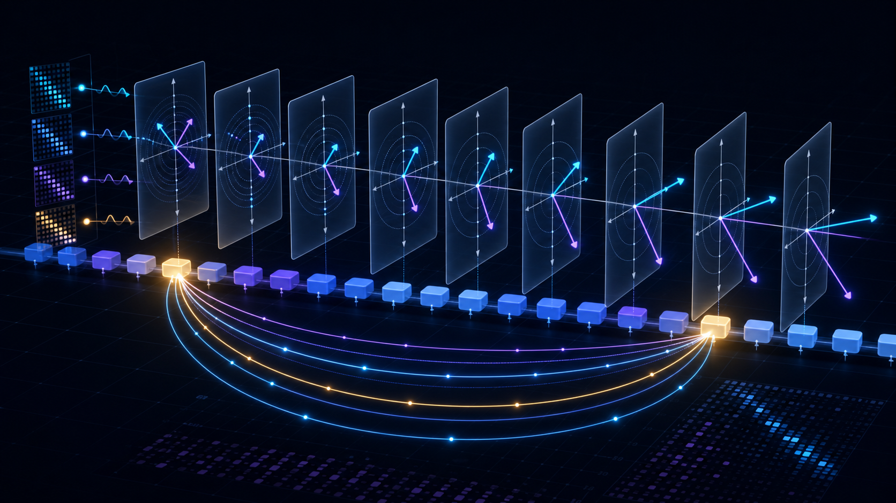
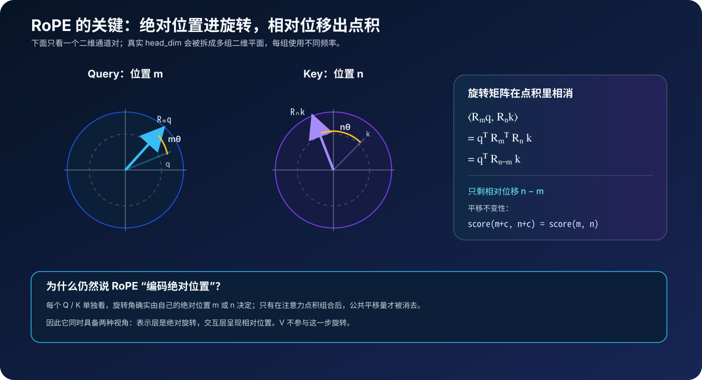
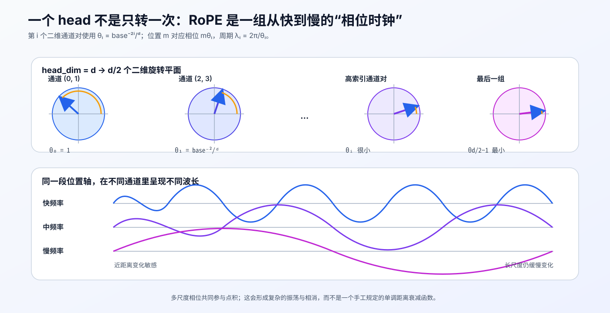
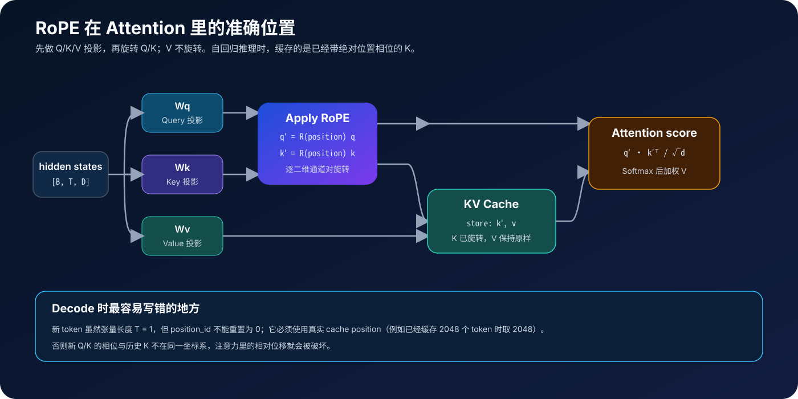

# RoFormer / RoPE 原理：把绝对位置“旋转”成相对距离



> **论文**：[RoFormer: Enhanced Transformer with Rotary Position Embedding](https://arxiv.org/abs/2104.09864)<br>
> **作者**：Jianlin Su、Yu Lu、Shengfeng Pan、Ahmed Murtadha、Bo Wen、Yunfeng Liu<br>
> **首次提交**：2021 年 4 月（本文参考论文 v5）<br>
> **关键词**：位置编码、相对位置、旋转矩阵、长上下文、KV Cache

## 0. 先说结论

RoPE（Rotary Position Embedding，旋转位置编码）不把位置向量加到 token embedding 上，而是在注意力内部，按 token 的绝对位置分别旋转 Query 和 Key：

$$
\tilde{\mathbf q}_m = \mathbf R_m\mathbf q_m,\qquad
\tilde{\mathbf k}_n = \mathbf R_n\mathbf k_n
$$

旋转后的注意力点积满足：

$$
\tilde{\mathbf q}_m^\top\tilde{\mathbf k}_n
=
\mathbf q_m^\top\mathbf R_m^\top\mathbf R_n\mathbf k_n
=
\mathbf q_m^\top\mathbf R_{n-m}\mathbf k_n
$$

左边的 Q、K 各自使用绝对位置 $m,n$；右边合并后却只剩相对位移 $n-m$。这就是 RoPE 最值得记住的一行公式。

它的工程价值同样直接：

- 不增加可训练参数，也不需要固定长度的位置 embedding 表；
- 只改 Q/K，能够嵌入标准 Attention、FlashAttention、GQA 和 KV Cache 流程；
- 旋转是正交变换，不改变 Q/K 的范数；
- 多组旋转频率让一个 attention head 同时感知短、中、长距离；
- 但“可以计算任意位置”**不等于**“未经训练就能无损外推到任意长度”。

下面从这个结论出发，把直觉、数学、代码和长上下文边界完整串起来。

---

## 1. Transformer 为什么必须显式加入位置

忽略 mask 时，自注意力的核心是：

$$
\operatorname{Attention}(\mathbf Q,\mathbf K,\mathbf V)
=
\operatorname{softmax}
\left(
\frac{\mathbf Q\mathbf K^\top}{\sqrt{d_h}}
\right)\mathbf V
$$

如果同时以相同方式打乱输入 token，以及 Q/K/V 的行，输出也只会跟着做同样的排列。也就是说，纯 Self-Attention 知道“有哪些 token”，却不知道“谁在前、谁在后”。

位置编码要回答两个不同问题：

1. **绝对位置**：当前 token 在序列的第几个位置？
2. **相对位置**：当前 Query 与某个 Key 相隔多远、方向是什么？

早期 Transformer 使用加法式绝对位置编码：

$$
\mathbf h_m = \mathbf x_m + \mathbf p_m
$$

它简单有效，但位置信息先与内容相加，再经过 Q/K/V 投影；“相对距离如何进入注意力分数”并不直接。另一类方法会给注意力 logits 加相对位置 bias，表达很直接，却需要额外设计偏置形式、分桶或裁剪范围。

RoPE 换了一个切入点：

> 能否让每个 Q/K 只根据自己的绝对位置变换，但两者点积后自动只依赖相对位置？

答案就是旋转。

---

## 2. 二维直觉：把位置想成时钟的转角

先把一个二维向量 $\mathbf x=(x_0,x_1)$ 看成复数：

$$
z=x_0+i x_1
$$

复数乘以 $e^{i\phi}$，等价于在二维平面旋转 $\phi$，长度不变：

$$
ze^{i\phi}
\Longleftrightarrow
\begin{bmatrix}
\cos\phi & -\sin\phi\\
\sin\phi & \cos\phi
\end{bmatrix}
\begin{bmatrix}
x_0\\x_1
\end{bmatrix}
$$

令位置 $m$ 的旋转角为 $m\theta$：

$$
\mathbf R_m =
\begin{bmatrix}
\cos(m\theta) & -\sin(m\theta)\\
\sin(m\theta) & \cos(m\theta)
\end{bmatrix}
$$

位置每前进一步，指针就多转 $\theta$。Query 在位置 $m$，Key 在位置 $n$，它们分别转 $m\theta$ 和 $n\theta$。两个指针之间的夹角只与 $(n-m)\theta$ 有关。



这里有一个容易忽略但非常重要的区分：

- **单看表示**：$\mathbf R_m\mathbf q_m$ 确实携带绝对位置 $m$；
- **看注意力交互**：$\mathbf R_m^\top\mathbf R_n=\mathbf R_{n-m}$，公共的绝对平移量被消掉了。

所以，把 RoPE 叫作“用绝对旋转实现相对位置”比单纯叫“绝对位置编码”或“相对位置编码”都更准确。

### 2.1 为什么旋转不破坏内容强度

旋转矩阵是正交矩阵：

$$
\mathbf R_m^\top\mathbf R_m=\mathbf I
$$

因此：

$$
\|\mathbf R_m\mathbf x\|_2=\|\mathbf x\|_2
$$

RoPE 改变的是向量方向，而不是向量长度。它不会因为位置变大就把 Q/K 的范数直接放大或缩小，这也是其数值性质干净的一点。

### 2.2 为什么通常不旋转 Value

位置的主要作用是改变“Query 应该关注哪个 Key”，因此进入 attention logits 即可：

$$
a_{m,n}
=
\operatorname{softmax}_n
\left(
\frac{\tilde{\mathbf q}_m^\top\tilde{\mathbf k}_n}{\sqrt{d_h}}
\right)
$$

Value 负责提供被加权汇聚的内容：

$$
\mathbf o_m=\sum_n a_{m,n}\mathbf v_n
$$

旋转 V 并不是建立相对位置点积所必需的，主流 RoPE 实现也只处理 Q/K。

---

## 3. 从二维推广到一个完整 Attention Head

Attention 的 head dimension $d_h$ 通常远大于 2。RoPE 要求参与旋转的维度为偶数，然后把它拆成 $d_h/2$ 个二维通道对：

$$
(x_0,x_1),\ (x_2,x_3),\ \ldots,\ (x_{d_h-2},x_{d_h-1})
$$

每一对使用不同的角频率：

$$
\theta_i = \text{base}^{-\frac{2i}{d_r}},
\qquad
i=0,1,\ldots,\frac{d_r}{2}-1
$$

其中：

- $d_r$ 是实际参与旋转的维度（rotary dimension）；
- 原论文与大量实现默认 $\text{base}=10000$；
- $d_r$ 可以等于整个 $d_h$，也可以只旋转前面一部分维度。

位置 $m$ 在第 $i$ 个二维平面的相位是 $m\theta_i$，相应周期为：

$$
\lambda_i=\frac{2\pi}{\theta_i}
$$



以 $d_r=128,\ \text{base}=10000$ 为例：

| 通道对索引 $i$ | $\theta_i$（rad/token） | 周期 $\lambda_i$（约） | 直觉 |
|---:|---:|---:|---|
| 0 | 1 | 6.28 token | 相位变化最快 |
| 16 | 0.1 | 62.8 token | 短距离 |
| 32 | 0.01 | 628 token | 中等距离 |
| 48 | 0.001 | 6,283 token | 长距离 |
| 63 | 0.000115 | 54,410 token | 变化最慢 |

这与正弦绝对位置编码的频谱有亲缘关系，但注入方式不同：

- 正弦位置编码：先构造 sin/cos 向量，再**加到输入表示**；
- RoPE：用 sin/cos 构成旋转，直接**乘到 Q/K**。

### 3.1 块对角旋转矩阵

把所有二维旋转拼起来，会得到块对角矩阵：

$$
\mathbf R_m =
\operatorname{diag}
\left(
\mathbf R(m\theta_0),
\mathbf R(m\theta_1),
\ldots,
\mathbf R(m\theta_{d_r/2-1})
\right)
$$

实际代码不会真的创建一个 $d_r\times d_r$ 矩阵；只要对每组通道做逐元素 sin/cos 运算即可。

### 3.2 相对位置公式的完整推导

令未编码位置的 Query/Key 为：

$$
\mathbf q_m=\mathbf W_q\mathbf x_m,\qquad
\mathbf k_n=\mathbf W_k\mathbf x_n
$$

应用 RoPE：

$$
\tilde{\mathbf q}_m=\mathbf R_m\mathbf q_m,\qquad
\tilde{\mathbf k}_n=\mathbf R_n\mathbf k_n
$$

则：

$$
\begin{aligned}
\tilde{\mathbf q}_m^\top\tilde{\mathbf k}_n
&=(\mathbf R_m\mathbf q_m)^\top(\mathbf R_n\mathbf k_n)\\
&=\mathbf q_m^\top\mathbf R_m^\top\mathbf R_n\mathbf k_n\\
&=\mathbf q_m^\top\mathbf R_{n-m}\mathbf k_n
\end{aligned}
$$

最后一步使用了二维旋转的群性质：

$$
\mathbf R(\alpha)^\top=\mathbf R(-\alpha),\qquad
\mathbf R(\alpha)\mathbf R(\beta)=\mathbf R(\alpha+\beta)
$$

因此，在 Q/K 内容不变时，同时把两个位置平移 $c$：

$$
\operatorname{score}(m+c,n+c)
=
\operatorname{score}(m,n)
$$

这就是注意力分数对“共同平移”不变。

> **符号提醒**：写成复数时，常见公式会出现 $e^{i(m-n)\theta}$；矩阵形式常写 $\mathbf R_{n-m}$。这是内积中共轭/转置放在哪一侧造成的符号视角差异，不影响“只依赖相对位置”这个结论。

---

## 4. RoPE 的“远距离衰减”到底是什么意思

原论文把每组二维通道写成复数后，点积可以表示为：

$$
\operatorname{Re}
\left[
\sum_{i=0}^{d_r/2-1}
h_i e^{i(m-n)\theta_i}
\right]
$$

其中 $h_i$ 由该通道对上的 Q/K 内容决定。随着相对距离变化，多组不同频率的相位会逐渐错开，求和时出现相消。论文利用 Abel 变换讨论了一个随距离整体下降的上界。

这句话不能误读为：

> 任意一个 Query–Key 分数都会随着距离增大而严格、单调地变小。

原因有三：

1. 每个二维旋转本身保持范数，根本没有乘一个小于 1 的衰减系数；
2. sin/cos 是周期函数，单个频率会反复振荡；
3. $h_i$ 是模型学出的内容相关系数，可以加强或抵消某些频率。

更准确的说法是：

> RoPE 的多频率结构给远距离相位相消提供了归纳偏置，但真实注意力仍由内容、训练数据、mask、层数与模型参数共同决定。

---

## 5. RoPE 在 Attention 代码里插在哪里

标准多头注意力先投影得到 Q/K/V。RoPE 插在 reshape 成多头之后、计算 logits 之前：

```text
hidden_states
    ├─ q_proj → reshape heads → RoPE(position) ─┐
    ├─ k_proj → reshape heads → RoPE(position) ─┼→ QKᵀ / √d → softmax
    └─ v_proj → reshape heads ──────────────────┘               │
                                                               × V
```



因此 RoPE 不是一种完整 Attention 算法，也不是 FlashAttention 的替代品：

- **RoPE** 决定 Q/K 如何携带位置；
- **Scaled Dot-Product Attention** 决定注意力的数学形式；
- **FlashAttention** 优化同一 Attention 的 IO 与 kernel 实现；
- **KV Cache** 避免自回归解码时重复计算历史 K/V。

它们处在不同层次，可以同时使用。

### 5.1 为什么原论文特别强调线性注意力

许多相对位置方法直接为每个 token pair 加一个依赖 $(m,n)$ 的 bias，容易破坏线性注意力先聚合 K/V、再与 Q 相乘的结合律重排。RoPE 则把位置分别乘到 Q/K 一侧：

$$
\left(\mathbf R_m\phi(\mathbf q_m)\right)^\top
\left(\mathbf R_n\varphi(\mathbf k_n)\right)
$$

仍可先累积带旋转的 K/V 项，再与当前位置的旋转 Q 相乘。原论文因此把“能给线性注意力加入相对位置”列为 RoPE 的性质之一。

不过旋转会产生负分量，论文在线性注意力公式中只对分子应用 RoPE、让分母保持未旋转形式，以避免分母接近 0。现代 decoder LLM 中更常见的仍是 RoPE 与 softmax Attention 的组合。

---

## 6. 一份可运行的 PyTorch 实现

仓库中提供了完整脚本：[rope_minimal.py](./code/rope_minimal.py)。它包含：

- 论文式相邻通道配对；
- 全量或 partial rotary；
- batch position IDs；
- GQA 兼容的 Q/K head 数；
- 范数不变与相对位置不变性测试。

安装 PyTorch 的环境中运行：

```bash
python3 papers/to-2026/code/rope_minimal.py
```

### 6.1 第一步：将每个二维向量旋转 90°

对于 $(x_0,x_1)$：

$$
\operatorname{rotate\_pair}(x_0,x_1)=(-x_1,x_0)
$$

代码：

```python
def rotate_pairs(x):
    pairs = x.reshape(*x.shape[:-1], -1, 2)
    x_even, x_odd = pairs.unbind(dim=-1)
    return torch.stack((-x_odd, x_even), dim=-1).flatten(-2)
```

于是二维旋转可以写成：

$$
\mathbf R(\phi)\mathbf x
=
\mathbf x\cos\phi
+
\operatorname{rotate\_pair}(\mathbf x)\sin\phi
$$

这正是绝大多数 RoPE kernel 的核心。

### 6.2 第二步：生成每个位置、每个通道对的相位

```python
pair_index = torch.arange(0, rotary_dim, 2, dtype=torch.float32)
inv_freq = 1.0 / (base ** (pair_index / rotary_dim))
phase = position_ids.float().unsqueeze(-1) * inv_freq

phase = phase.repeat_interleave(2, dim=-1)
cos = phase.cos()
sin = phase.sin()
```

这里的 `inv_freq` 就是 $\theta_i$。用 `float32` 计算相位与三角函数，再 cast 回模型 dtype，通常比直接在 FP16/BF16 中计算大位置相位更稳。

### 6.3 第三步：只旋转 Q/K 的 rotary 部分

```python
def apply_rope_core(q, k, cos, sin, rotary_dim):
    q_rot, q_pass = q[..., :rotary_dim], q[..., rotary_dim:]
    k_rot, k_pass = k[..., :rotary_dim], k[..., rotary_dim:]

    q_rot = q_rot * cos + rotate_pairs(q_rot) * sin
    k_rot = k_rot * cos + rotate_pairs(k_rot) * sin

    q = torch.cat((q_rot, q_pass), dim=-1)
    k = torch.cat((k_rot, k_pass), dim=-1)
    return q, k
```

若 `rotary_dim == head_dim`，全部通道参与旋转；否则剩余 `q_pass/k_pass` 原样通过。partial rotary 并非 RoPE 数学定义的必需部分，而是具体模型的架构选择。完整脚本中的 `apply_rope()` 还负责根据 `position_ids` 构建并广播 cos/sin。

### 6.4 第四步：接入 PyTorch Attention

假设 Q/K/V 的布局是 `[batch, heads, sequence, head_dim]`：

```python
q = q_proj(hidden_states).view(batch, seq, num_heads, head_dim).transpose(1, 2)
k = k_proj(hidden_states).view(batch, seq, num_heads, head_dim).transpose(1, 2)
v = v_proj(hidden_states).view(batch, seq, num_heads, head_dim).transpose(1, 2)

q, k = apply_rope(q, k, position_ids)

output = torch.nn.functional.scaled_dot_product_attention(
    q, k, v, is_causal=True
)
```

GQA/MQA 中 `q_heads` 可以多于 `kv_heads`；RoPE 只沿最后一维逐通道旋转，因此同一份 cos/sin 可以在 head 维广播。之后还要由支持 GQA 的 Attention kernel 或显式 head 映射来对齐 Q 与 K/V；这一步不属于 RoPE。

---

## 7. 两种常见通道布局：数学等价，权重并不兼容

RoPE 工程实现最容易踩的坑之一，是“二维通道如何配对”。

### 7.1 相邻交错（interleaved）

原论文的自然写法：

```text
(x0, x1), (x2, x3), (x4, x5), ...
```

对应：

```python
[-x1, x0, -x3, x2, -x5, x4, ...]
```

### 7.2 前后半区配对（half-split）

一些模型实现会把前半和后半对应维度配成一组：

```text
(x0, x[d/2]), (x1, x[d/2+1]), ...
```

常见代码是：

```python
x1 = x[..., : x.shape[-1] // 2]
x2 = x[..., x.shape[-1] // 2 :]
rotated = torch.cat((-x2, x1), dim=-1)
```

两种方式只差一个固定维度置换；如果从头训练，表达能力等价。但 checkpoint 的 Q/K 投影权重已经适应了某一种布局，不能只替换 `rotate_half()` 而不同时转换相关权重。加载现成模型时，必须与原实现完全一致。

同样需要对齐的配置还有：

- `rotary_dim` 或 `partial_rotary_factor`；
- `base` / `rope_theta`；
- position ID 从 0 还是其他偏移开始；
- cos/sin 的通道复制方式；
- 是否应用额外的 position/frequency scaling。

---

## 8. 自回归推理与 KV Cache

Prefill 阶段可以一次处理整个 prompt：

```python
position_ids = torch.arange(prompt_length)
q, k = apply_rope(q, k, position_ids)
```

Decode 阶段每次只有一个新 token，但它的张量长度为 1，不代表位置是 0。假设缓存里已有 $T$ 个 token，新 token 必须用：

```python
position_ids = torch.tensor([T], device=q.device)
q_new, k_new = apply_rope(q_new, k_new, position_ids)
```

然后：

1. 把已经旋转的 `k_new` 写入 K cache；
2. 把未旋转的 `v_new` 写入 V cache；
3. 用 `q_new` 与全部已旋转 K 计算注意力。

为什么缓存旋转后的 K？因为历史 token 的绝对位置不再变化，旋转结果可以复用。若每一步都保存原始 K 再重新旋转全部历史，就失去了 KV Cache 的主要意义。

### 8.1 一个具体例子

缓存中位置为 $0,1,\ldots,2047$，新 token 的位置是 2048：

$$
\tilde{\mathbf q}_{2048}^\top\tilde{\mathbf k}_{17}
=
\mathbf q_{2048}^\top\mathbf R_{17-2048}\mathbf k_{17}
$$

如果错误地把新 token 的 position ID 重置为 0，模型看到的相对位移会从 $17-2048$ 变成 $17-0$，整个相位坐标系被破坏。

### 8.2 滑动窗口与位置重映射

从数学上说，同时给 Q 与所有 K 的位置减去同一常数不会改变分数。但如果 K 已经以旧位置旋转后存入 cache，只改新 Q 的 position ID 并不构成“共同平移”。

因此窗口截断、cache compaction、跨段复用需要明确策略：

- 保留绝对 position IDs；或
- 对仍保留的 K 做一致的相位重映射；或
- 使用模型原生支持的 cache position 方案。

不能只根据 cache 当前长度随意重编号。

---

## 9. 如何验证实现不是“看起来能跑”

至少检查下面四件事。

### 9.1 范数保持

```python
torch.testing.assert_close(
    q.norm(dim=-1),
    q_rope.norm(dim=-1),
)
```

如果失败，通常是 sin/cos shape、配对方式或通道顺序有误。

### 9.2 共同平移不变

选择两组相同相对间隔的位置，例如 $(3,11)$ 与 $(103,111)$：

```python
score_a = dot(rope(q, pos=3), rope(k, pos=11))
score_b = dot(rope(q, pos=103), rope(k, pos=111))
torch.testing.assert_close(score_a, score_b, rtol=1e-4, atol=1e-4)
```

两组相对位移都为 8，分数应该近似相等。

### 9.3 与显式二维旋转矩阵对照

对一个很小的 `head_dim=2` 示例，直接构造 $\mathbf R_m$，比较矩阵乘法与 `x*cos + rotate(x)*sin`。这是排查符号和配对错误最直观的方法。

### 9.4 Prefill 与逐 token Decode 对齐

同一段 token：

- 一次性 prefill 得到每个位置的输出；
- 逐 token 前进并维护 KV Cache；

在相同 dtype、mask 与 kernel 设置下，两者结果应在合理浮点误差内一致。这个测试可以同时抓出 position ID、causal mask 和 cache 拼接错误。

---

## 10. RoPE 与其他位置方案对比

| 方法 | 位置注入点 | 可训练参数 | 注意力中相对位置是否显式 | 超出训练长度能否计算 | 典型代价/边界 |
|---|---|---:|---|---|---|
| 可学习绝对位置 | 加到输入 embedding | 有 | 否 | 通常受表长限制 | 简单，但需要最大长度 |
| 正弦绝对位置 | 加到输入 embedding | 无 | 间接 | 能 | Q/K/V 都混入位置信息 |
| 相对位置 bias | 加到 attention logits | 视实现而定 | 是 | 视分桶/函数而定 | 需要额外 bias 逻辑 |
| ALiBi 类线性偏置 | 加到 attention logits | 通常无 | 是 | 能 | 强距离单调偏置，表达形式固定 |
| RoPE | 乘到 Q/K | 无 | 点积后自然出现 | 能 | 相位外推仍可能失真 |

“能计算”这一列只表示公式或数据结构没有硬上限，不代表模型在超出训练分布时仍保持任务质量。

---

## 11. 长上下文：RoPE 给了坐标系，没有免费送来外推能力

RoPE 没有固定长度的 embedding table，只要给出 position ID 就能计算 sin/cos。因此它在**形式上**支持可变序列长度。

但直接把训练长度为 $L$ 的模型推到远大于 $L$ 的位置，常会遇到：

### 11.1 未见过的相位分布

训练时每个频率只经历有限范围的 $m\theta_i$。测试位置大幅增加后，Q/K 的相位组合进入训练外区域。

### 11.2 高频通道快速绕圈

高频通道周期很短，位置继续增大时会多次绕过 $2\pi$。多个距离可能在某些通道上产生相近相位，单个通道无法唯一标识无限远的位置。

### 11.3 低频通道训练不足

最慢频率虽然周期长，但若训练窗口远小于其周期，模型只见过那条正弦曲线的一小段，未必学会在更远范围内可靠使用它。

### 11.4 Attention 和内存复杂度仍然存在

原始全注意力的计算量仍是 $O(T^2)$；自回归推理的 KV Cache 仍随 $T$ 线性增长。RoPE 解决位置表示，不会单独解决长上下文的算力和显存问题。

后续长上下文扩展通常会修改“位置到相位”的映射，例如：

- **位置插值**：把长序列位置压回训练过的范围；
- **频率/base 缩放**：不同程度地放慢旋转；
- **分频段混合缩放**：高频与低频采用不同策略；
- **继续预训练或长上下文微调**：让模型真正见到扩展后的相位分布。

这些方法都应理解为“在 RoPE 坐标系上继续改造”，而不是 RoPE 原论文已经自动保证了任意长度外推。

---

## 12. 计算与数值细节

### 12.1 复杂度

RoPE 对 Q/K 做逐元素乘加，代价约为 $O(BHTd_r)$；相对于全注意力的 $O(BHT^2d_h)$ 通常很小。它不改变 Attention 的渐进复杂度。

### 12.2 cos/sin cache

训练固定长度时，可以缓存 `[max_seq_len, rotary_dim]` 的 cos/sin。动态推理时可按需扩容。常见实现让 cache 在 batch/head 维广播，避免重复存储。

### 12.3 大位置与低精度

大 position ID 乘以频率后，在 FP16/BF16 中直接做三角函数可能丢失相位精度。稳妥做法是：

1. position IDs 与频率乘法使用 FP32；
2. sin/cos 使用 FP32 计算；
3. 最后转换为 Q/K dtype；
4. 混合精度或编译模式下单独验证超长位置的数值。

### 12.4 不要混淆 `head_dim` 与模型隐藏维度

RoPE 通常独立应用在每个 attention head 内，频率公式中的 $d_r$ 是 rotary dimension，不是整个模型的 `hidden_size`。把隐藏维度误用进频率公式会改变所有波长。

### 12.5 Fused kernel 中也没有消失

在高性能实现里，Q/K projection、RoPE、cache write、Attention 可能被融合到少数 kernel 中，源码不一定显式出现 `apply_rope()`。判断是否正确，应检查张量语义和 position IDs，而不是只搜索函数名。

---

## 13. 常见错误清单

### 错误 1：把 RoPE 加到输入 embedding

RoPE 是乘法式 Q/K 旋转，不是 `token_embedding + rope_embedding`。

### 错误 2：连 V 一起旋转

标准 RoPE 只旋转 Q/K。除非复现明确的变体，否则不要擅自处理 V。

### 错误 3：Decode 时 position ID 每步都从 0 开始

新 token 必须使用真实 cache position。

### 错误 4：interleaved 与 half-split 实现混用

从头训练时二者可以等价；加载 checkpoint 时不兼容。

### 错误 5：默认 `rotary_dim == head_dim`

必须读取模型配置。一些架构只旋转 head 的一部分通道。

### 错误 6：用错误的维度计算频率

公式分母对应 rotary dimension。误用 hidden size 会让频率谱整体改变。

### 错误 7：认为 RoPE 分数会随距离严格单调下降

它产生多频率振荡与相消偏置，不是显式的指数衰减或线性惩罚。

### 错误 8：认为 base 越大一定越好

增大 base 会放慢部分频率，但也改变训练时模型使用的位置谱。它是模型配置与训练配方的一部分，不是可随意调大的推理旋钮。

### 错误 9：只验证短序列

shape 正确不代表相位正确。至少测试平移不变性、cache 对齐、超训练长度和混合精度。

---

## 14. RoFormer 论文与现代 LLM 中的 RoPE，不要混为一谈

原论文不只是提出一个代码函数，还构建并评估了 **RoFormer** 模型。实验覆盖机器翻译、掩码语言模型预训练、GLUE、长文本分类，以及与线性注意力结合等场景。

例如论文报告的 WMT 2014 英德翻译结果是：

| 模型 | BLEU |
|---|---:|
| Transformer-base | 27.3 |
| RoFormer | 27.5 |

这说明论文的实验对象并不是后来最常见的 decoder-only LLM。今天在 LLaMA 等模型源码里看到的通常是：

> 保留 RoPE 这个位置机制，放进另一套模型架构、训练配方和推理系统。

因此要区分：

- **RoFormer**：论文中的增强 Transformer 模型与实验系统；
- **RoPE**：可以被移植到许多 Attention 架构的位置编码机制。

RoPE 后来影响巨大，主要因为它是一个接口极小、性质清楚、又容易进入高性能 kernel 的局部模块。

---

## 15. FAQ

### Q1：RoPE 有可学习参数吗？

标准 RoPE 没有。$\theta_i$ 由 `base` 和 rotary dimension 确定，sin/cos 由 position IDs 计算。但后续变体可能学习或动态调整频率。

### Q2：RoPE 是绝对位置编码还是相对位置编码？

两者兼具：Q/K 的变换使用绝对位置，注意力点积只显式依赖相对位置。

### Q3：为什么位置 0 不变？

$\mathbf R_0=\mathbf I$，所以位置 0 的 Q/K 不旋转。这只是坐标原点选择，不会损失相对位置表达。

### Q4：负 position ID 能计算吗？

数学上可以，$\mathbf R_{-m}=\mathbf R_m^\top$。但模型是否训练过这种位置分布、cache 和 mask 是否支持，是另一回事。

### Q5：能否只给 K 加 RoPE？

不能得到标准 RoPE 的相对位置性质。关键等式来自 $\mathbf R_m^\top\mathbf R_n$，Q/K 两侧都要在同一个旋转体系中。

### Q6：RoPE 与 causal mask 有什么关系？

没有替代关系。RoPE 编码位置，causal mask 禁止看到未来 token；decoder-only 模型通常同时使用两者。

### Q7：改变 `base` 后能直接复用 checkpoint 吗？

公式仍能运行，但相位谱已经改变。若没有与该缩放匹配的模型方法或微调，质量可能下降。

---

## 16. 一页纸记忆

1. 把 head dimension 两两配对，当成多个复平面。
2. 第 $i$ 对通道在位置 $m$ 旋转 $m\theta_i$。
3. Q/K 使用同一套频率，V 不旋转。
4. $\mathbf R_m^\top\mathbf R_n=\mathbf R_{n-m}$，所以点积自然得到相对位置。
5. 旋转保持范数，多频率提供多尺度位置相位。
6. 实现必须对齐配对布局、rotary dimension、base、position IDs 和缩放策略。
7. KV Cache 保存旋转后的 K；decode 的 position ID 不能重置。
8. RoPE 允许计算任意位置，但可靠长度外推仍需要训练与缩放策略配合。

如果只记一句话：

> **RoPE 给 Q/K 戴上不同速度的位置时钟；两个时钟一比较，绝对时刻被消掉，只剩时间差。**

---

## 17. 建议阅读与资料

- [RoFormer 论文（arXiv）](https://arxiv.org/abs/2104.09864)
- [RoFormer 作者代码与伪代码](https://github.com/ZhuiyiTechnology/roformer)
- [作者早期中文推导：Transformer 升级之路（二）](https://kexue.fm/archives/8265)
- 本仓库前置阅读：[Transformer 原理](./00_Transformer_2017_原理.md)
- 下一篇建议：[FlashAttention 原理](./14_FlashAttention_2022_原理.md)
- 架构落地案例：[LLaMA 原理](./15_LLaMA_2023_原理.md)
