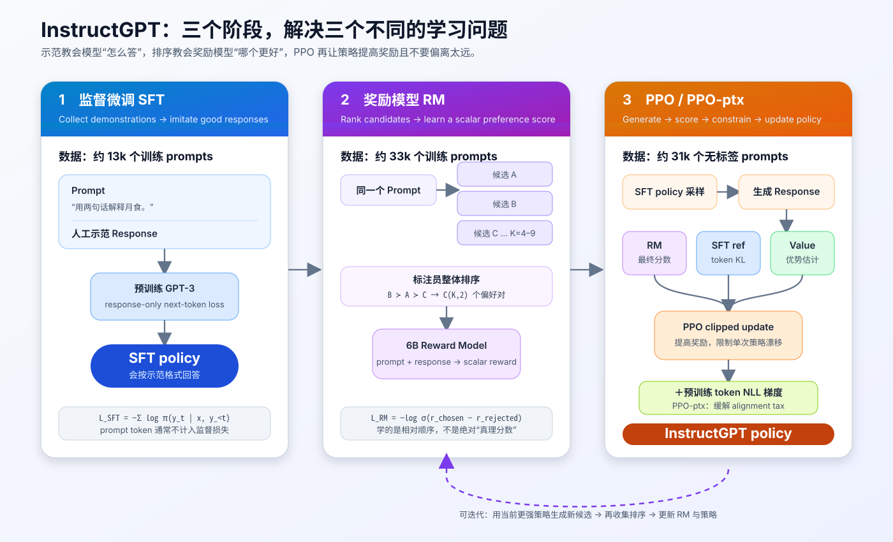
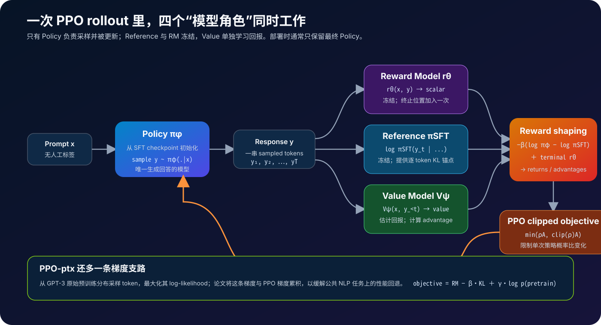
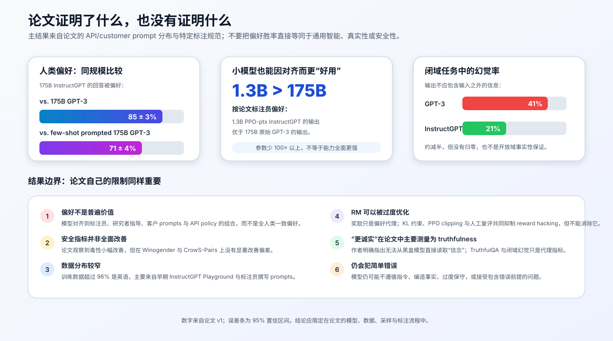

# InstructGPT 原理：SFT、奖励模型与 PPO 如何把 GPT-3 变成指令助手


> **论文**：[Training language models to follow instructions with human feedback](https://arxiv.org/abs/2203.02155)<br>
> **作者**：Long Ouyang、Jeff Wu、Xu Jiang 等<br>
> **发表时间**：2022 年 3 月<br>
> **关键词**：Instruction Following、RLHF、SFT、Reward Model、PPO、PPO-ptx

## 0. 先说结论

InstructGPT 没有发明新的 Transformer 层，也没有靠扩大模型参数解决问题。它展示的是一条完整的**后训练流水线**：

1. **监督微调（SFT）**：让预训练模型模仿标注员写出的理想回答；
2. **奖励模型（RM）**：从人类对多个候选回答的排序中，学习一个标量偏好函数；
3. **强化学习（PPO）**：让策略模型生成更高奖励的回答，同时用 KL 惩罚防止它偏离 SFT 模型太远；
4. **预训练混合（PPO-ptx）**：在 PPO 梯度之外混入原始预训练似然梯度，缓解公共 NLP 能力下降。

三阶段分别在回答三个问题：

| 阶段 | 输入监督 | 模型学什么 | 主要风险 |
|---|---|---|---|
| SFT | 人工完整示范 | “一个好助手通常怎样回答” | 覆盖有限，只会模仿见过的模式 |
| RM | 同一 prompt 下的回答排序 | “哪个回答更符合标注偏好” | 学到偏差或表面捷径 |
| PPO | RM 奖励 + KL + value | “如何提高偏好奖励” | reward hacking、训练不稳定、能力漂移 |
| PPO-ptx | 再加预训练 token | “对齐时别忘掉原有语言能力” | 多目标权重需要调节 |

论文最醒目的结果是：在论文的 API prompt 分布与标注标准下，**1.3B InstructGPT 的输出被偏好于 175B 原始 GPT-3**。这说明：

> 参数规模决定“能做什么”的上限，而后训练很大程度决定用户能否稳定地把这些能力调用出来。

但这不等于 1.3B 模型在知识、推理和所有基准上全面超过 175B GPT-3；它比较的是特定分布下的回答偏好。

---

## 1. 问题不只是能力不足，而是训练目标错位

GPT-3 的预训练目标是预测互联网文本中的下一个 token：

$$
\max_\phi\;
\mathbb E_{x\sim D_{\text{pretrain}}}
\left[
\sum_t \log \pi_\phi(x_t\mid x_{<t})
\right]
$$

这个目标能学到语言、知识和任务模式，却没有直接要求模型：

- 准确理解用户意图；
- 遵守输出格式与长度约束；
- 在不知道时承认不确定；
- 避免有害、偏见或不适合助手场景的回答；
- 区分“互联网上常见的续写”与“用户真正需要的答案”。

换句话说，预训练优化的是：

> 什么文本在语料分布中更可能出现？

用户需要的却是：

> 对这个请求，什么行为更有帮助、更真实、更安全？

论文借用了 helpful、honest、harmless 三个方向来描述目标：

- **Helpful**：理解并完成显式或隐式任务；
- **Honest**：不误导、不编造，能表达不确定性；
- **Harmless**：减少可能带来伤害的输出。

三者并不总是一致。例如用户要求生成有害内容时，“完全服从”与“无害”会冲突。论文也明确承认，其训练和评估规范对这些冲突的优先级处理并不完全相同。

### 1.1 “对齐到人类”这句话太宽泛

InstructGPT 实际对齐到的是多种影响源的组合：

$$
\text{behavior}
=
f(
\text{pretraining data},
\text{customer prompts},
\text{labeler preferences},
\text{researcher instructions},
\text{API policies},
\text{optimization}
)
$$

所以，更准确的表述是：

> 模型学习了这批标注员在研究者规范与数据分布下表达出的偏好，而不是获得了一个普遍、客观且无争议的“人类价值函数”。

---

## 2. 全流程：从“示范”到“比较”，再到“优化”



三种数据不要混淆：

### 2.1 SFT 数据：prompt + 人工示范

标注员直接写出希望模型生成的完整答案：

```text
Prompt:
请向初中生解释什么是月食。

Demonstration:
月食发生在地球运行到太阳和月球之间时……
```

这是昂贵但信息密度高的监督：一个样本不仅告诉模型谁胜谁负，还展示了答案的内容、结构、语气和长度。

### 2.2 RM 数据：prompt + 多个候选 + 排序

让模型对同一个 prompt 生成 $K$ 个候选，标注员将它们从好到坏排序：

```text
B ≻ D ≻ A ≻ C
```

排序可以转换为全部成对偏好：

```text
B ≻ D, B ≻ A, B ≻ C,
D ≻ A, D ≻ C,
A ≻ C
```

$K$ 个回答能产生：

$$
\binom K2=\frac{K(K-1)}{2}
$$

个有序偏好对。论文每次让标注员排序 $K=4\sim9$ 个回答。

### 2.3 PPO 数据：只有 prompt

PPO 阶段不再要求人工为每个 rollout 写答案或实时打分。给策略一个 prompt，让当前策略自己生成回答，再由冻结的 Reward Model 自动提供奖励。

这就是奖励模型的扩展价值：

> 人类先离线教会一个可重复调用的偏好代理，再让策略用大量在线采样去优化这个代理。

---

## 3. 论文中的数据不是“随便找一些指令”

InstructGPT 的 prompt 主要来自：

- 早期 InstructGPT 模型的 Playground 用户 prompts；
- 为冷启动而让标注员撰写的 prompts。

论文没有使用 API 生产客户的数据；对数据进行了长公共前缀去重、每个 user ID 最多保留 200 个 prompts，并按 user ID 划分 train/validation/test，避免同一用户跨集合泄漏。训练 prompts 还经过 PII 过滤。

标注员撰写的冷启动 prompt 分三类：

1. **Plain**：自由设计多样化任务；
2. **Few-shot**：写一条指令和多组 query/response 示例；
3. **User-based**：根据 API waitlist 中描述的使用场景构造任务。

### 3.1 三份训练数据的规模

| 数据集 | 训练 prompts | 来源 | 人类标签 |
|---|---:|---|---|
| SFT | 11,295 标注员 + 1,430 客户，约 13k | 标注员、Playground | 完整示范 |
| RM | 6,623 标注员 + 26,584 客户，约 33k | 标注员、Playground | $K=4\sim9$ 候选排序 |
| PPO | 31,144，约 31k 个唯一 prompts | Playground | 无 |

RM 的 33k 是 **prompt 数**，不是偏好 pair 数。每个 prompt 的 $K$ 路排序会产生最多 $\binom K2$ 个 pairs，所以实际成对比较数量高一个数量级。

数据任务分布也更像真实产品，而不是传统基准合集：生成约 45.6%，开放问答 12.4%，头脑风暴 11.2%，对话 8.4%，改写 6.6%；分类、抽取和闭域问答只占较小部分。训练数据超过 96% 为英语。

### 3.2 人类反馈本身是一套工程系统

论文团队招募了约 40 名承包标注员，并通过筛选测试、入职培训、详细规范、共享答疑和持续反馈来提高一致性。

报告中的 agreement 是：

- 训练标注员之间：$72.6\pm1.5\%$；
- held-out 标注员之间：$77.3\pm1.3\%$。

这提醒我们：

> RLHF 的“算法”不只在 PPO 代码里。标注规范、标注员选择、冲突处理与质量控制，本身就是目标函数的一部分。

---

## 4. 第一阶段：SFT 先把“续写器”变成助手

从预训练 GPT-3 参数初始化策略 $\pi_{\text{SFT}}$，对人工示范做因果语言模型训练：

$$
\mathcal L_{\text{SFT}}
=
-
\mathbb E_{(x,y)\sim D_{\text{demo}}}
\left[
\sum_{t=1}^{|y|}
\log \pi_{\text{SFT}}(y_t\mid x,y_{<t})
\right]
$$

其中 $x$ 是 prompt，$y$ 是人工回答。

现代指令微调实现通常把 prompt token 的 label 设为 `-100`，只对 response token 计算 loss：

```python
input_ids = [*prompt_ids, separator_id, *response_ids, eos_id]
labels = [
    *([-100] * (len(prompt_ids) + 1)),
    *response_ids,
    eos_id,
]
```

需要注意：**InstructGPT 论文只说明使用监督学习微调，并未披露这一 token mask 细节**。response-only loss 是本文代码采用的常见实现方式，不应伪装成论文明确写出的配置。

### 4.1 为什么 SFT 是不可省略的起点

如果直接让原始 GPT-3 进入 PPO：

- 初始回答质量较差，RM 打分分布可能不稳定；
- 探索空间极大，奖励信号稀疏；
- 模型还没学会稳定的助手格式；
- PPO 很容易用奇怪文本钻 RM 的空子。

SFT 先把策略放到“合理回答流形”附近，PPO 再做相对小的行为调整。

### 4.2 论文里其实有两类 SFT checkpoint

主 SFT baseline：

- 训练 16 epochs；
- cosine learning-rate decay；
- residual dropout 0.2；
- validation loss 在 1 epoch 后已出现过拟合，但更多 epochs 的 RM score 和人类偏好反而继续改善；
- 最终 checkpoint 按 validation RM score 选择。

用于 PPO 初始化的模型则在附录中单独描述：

- 对 demonstration data 训练 2 epochs；
- 同时混入 10% pretraining data；
- 再作为 RL policy 与 KL reference 的起点。

因此“论文 SFT 到底训练 16 还是 2 epochs”并不矛盾：它们服务于不同实验角色。

### 4.3 SFT 更像“解锁”而非重新预训练能力

整个后训练使用的算力和数据远小于 GPT-3 预训练。论文的解释是：RLHF 主要把预训练中已有、但难以用 prompt 稳定调出的能力，组织成更容易使用的助手行为。

它当然也会学习新的格式、偏好和局部行为，但不应被理解为用 13k 个示范重新教会模型世界知识。

---

## 5. 第二阶段：Reward Model 把排序压缩成标量

Reward Model 接收完整的 prompt 和 response：

$$
r_\theta(x,y)\in\mathbb R
$$

它不预测下一个 token，而是输出一个标量，表示该回答在训练偏好下“有多好”。

一个常见结构是复用语言模型 backbone，移除词表输出头，再在最后一个有效 token 的 hidden state 上接线性 value head：

```python
class RewardModel(nn.Module):
    def __init__(self, backbone, hidden_size):
        super().__init__()
        self.backbone = backbone
        self.reward_head = nn.Linear(hidden_size, 1, bias=False)

    def forward(self, input_ids, attention_mask):
        hidden = self.backbone(
            input_ids,
            attention_mask=attention_mask,
        ).last_hidden_state

        last_index = attention_mask.sum(dim=-1) - 1
        batch_index = torch.arange(input_ids.size(0), device=input_ids.device)
        final_hidden = hidden[batch_index, last_index]
        return self.reward_head(final_hidden).squeeze(-1)
```

重点不是“最后一个 token 天生代表质量”，而是因果 Transformer 在这个位置已经读过整段 prompt + response，可以将序列信息汇聚到一个标量头。

### 5.1 Bradley–Terry 偏好概率

若人类更偏好 $y_w$ 而不是 $y_l$：

$$
P(y_w\succ y_l\mid x)
=
\sigma
\left(
r_\theta(x,y_w)-r_\theta(x,y_l)
\right)
$$

对应 loss：

$$
\mathcal L_{\text{RM}}
=
-
\mathbb E_{(x,y_w,y_l)}
\left[
\log\sigma
\left(
r_\theta(x,y_w)-r_\theta(x,y_l)
\right)
\right]
$$

最小 PyTorch 写法：

```python
chosen_reward = reward_model(chosen_ids, chosen_mask)
rejected_reward = reward_model(rejected_ids, rejected_mask)
loss = -torch.nn.functional.logsigmoid(
    chosen_reward - rejected_reward
).mean()
```

它只关心 reward difference。给所有回答都加同一个常数 $c$：

$$
(r_w+c)-(r_l+c)=r_w-r_l
$$

loss 完全不变。因此 RM 的绝对零点不可辨识。论文在进入 RL 前加一个 bias，把人工 demonstration 的平均 reward 归一化到 0。

### 5.2 为什么收集完整排序，而不是每次只比较两个

一次展示 $K$ 个回答：

- 标注员读一次 prompt；
- 可以在同一上下文中建立相对标准；
- 一次排序生成 $\binom K2$ 个比较；
- 每个 completion 只需做一次 RM forward，即可复用到多个 pairs。

但同一 prompt 下的 pairs 高度相关。论文发现，如果把所有 pair 打散成独立样本，一个 epoch 内同一 completion 会被重复用于多次梯度更新，RM 很快过拟合。

论文的处理是：

> 将同一个 prompt 的全部 $\binom K2$ 个比较放在同一个 batch element 中，先一次性计算 K 个 rewards，再对全部 pairs 取平均。

概念代码：

```python
def ranked_rm_loss(rewards_best_to_worst):
    losses = []
    for better_index in range(len(rewards_best_to_worst)):
        for worse_index in range(better_index + 1, len(rewards_best_to_worst)):
            margin = (
                rewards_best_to_worst[better_index]
                - rewards_best_to_worst[worse_index]
            )
            losses.append(-F.logsigmoid(margin))
    return torch.stack(losses).mean()
```

### 5.3 论文实际使用的 Reward Model

- 所有 1.3B、6B、175B policy 共用一个 6B RM；
- 175B RM 训练更不稳定，且会显著增加 PPO 的 value/RM 计算成本；
- 最终 RM 只训练 1 epoch，batch size 按 64 个不同 prompts 计；
- 一个 batch 最多包含 $64\times\binom92=2304$ 个 comparisons；
- ties 被丢弃。

主文把 RM 描述为从 SFT 模型移除 unembedding 后训练；附录进一步说明，最终 6B RM 出于历史原因初始化自一个在公共 NLP 任务上微调过的 6B GPT-3，作者也观察到从 GPT-3 或 SFT 初始化能得到相似结果。

### 5.4 Reward Model 学到的不是“真相”

RM 更准确的定义是：

$$
r_\theta(x,y)
\approx
\text{这批标注员按这份规范偏好 }y\text{ 的程度}
$$

它可能把下面这些表面特征当成“好”：

- 更长或更完整；
- 更礼貌、更自信；
- 更像标注模板；
- 更常表达保守与不确定；
- 某些领域或文化的语言风格。

一旦策略能发现 RM 的漏洞，就可能得到高 reward、低真实质量的输出，即 reward hacking。

---

## 6. 第三阶段：把语言生成写成一个 bandit 环境

论文把一次 prompt-response 看成一个 episode：

1. 环境给出 customer prompt $x$；
2. policy $\pi_\phi$ 自回归生成完整 response $y$；
3. Reward Model 给出终局分数 $r_\theta(x,y)$；
4. episode 结束。

严格说，这是 contextual bandit：没有外部世界中的多步状态转移，但 response 内部仍包含许多 token actions。

### 6.1 不能只最大化 Reward Model

如果直接优化：

$$
\max_\phi\ \mathbb E[r_\theta(x,y)]
$$

策略会逐渐走到 RM 没见过的分布，在那里寻找评分漏洞。InstructGPT 用冻结的 SFT policy 作为 reference，加入 KL 惩罚：

$$
\max_\phi\;
\mathbb E_{x,y\sim\pi_\phi}
\left[
r_\theta(x,y)
-
\beta
\log
\frac{\pi_\phi(y\mid x)}
{\pi_{\text{SFT}}(y\mid x)}
\right]
$$

因为：

$$
\log
\frac{\pi_\phi(y\mid x)}
{\pi_{\text{SFT}}(y\mid x)}
=
\sum_t
\left[
\log\pi_\phi(y_t\mid x,y_{<t})
-
\log\pi_{\text{SFT}}(y_t\mid x,y_{<t})
\right]
$$

所以可在每个生成 token 上构造非终局奖励：

$$
r_t^{\text{KL}}
=
-
\beta
\left(
\log\pi_\phi(y_t\mid\cdot)
-
\log\pi_{\text{SFT}}(y_t\mid\cdot)
\right)
$$

最后一个 token 再加 RM score：

$$
r_T=r_T^{\text{KL}}+r_\theta(x,y)
$$

这就是论文所说的 per-token KL penalty。

> 单个 sampled token 的 log-ratio 可以为负；只有对 $y\sim\pi_\phi$ 取期望后，才得到非负的 $D_{\mathrm{KL}}(\pi_\phi\|\pi_{\text{SFT}})$。不要把每个样本 log-ratio 都误叫作严格非负的 KL 值。

### 6.2 PPO 中四个模型角色



| 角色 | 是否生成回答 | 是否更新 | 作用 |
|---|---:|---:|---|
| Policy $\pi_\phi$ | 是 | 是 | 采样 response，并被 PPO 优化 |
| Reference $\pi_{\text{SFT}}$ | 否 | 否 | 计算 token log-prob，提供 KL 锚点 |
| Reward Model $r_\theta$ | 否 | 否 | 给完整 response 一个终局标量 |
| Value Model $V_\psi$ | 否 | 是 | 预测未来回报，降低 policy gradient 方差 |

部署推理时通常只需要最终 policy。RM、reference 和 value 是训练基础设施。

### 6.3 Advantage：一个回答“比预期好多少”

由 token rewards 计算 return $G_t$，value model 预测当前位置的期望回报：

$$
A_t\approx G_t-V_\psi(s_t)
$$

- $A_t>0$：这次 sampled token 后续结果比预期好，应提高概率；
- $A_t<0$：结果比预期差，应降低概率。

论文的 value function 从 RM 初始化，但之后学习的是 rollout 各位置的 expected return，不再只是完整回答的单一偏好分数。

### 6.4 PPO 为什么要 clip

对 rollout 时的旧策略 $\pi_{\text{old}}$ 和当前策略 $\pi_\phi$：

$$
\rho_t(\phi)
=
\frac{\pi_\phi(a_t\mid s_t)}
{\pi_{\text{old}}(a_t\mid s_t)}
=
\exp
\left(
\log\pi_\phi-\log\pi_{\text{old}}
\right)
$$

PPO clipped surrogate：

$$
\mathcal J_{\text{PPO}}
=
\mathbb E_t
\left[
\min
\left(
\rho_tA_t,\;
\operatorname{clip}(\rho_t,1-\epsilon,1+\epsilon)A_t
\right)
\right]
$$

clip 的作用不是保证策略绝对不会变化，而是让超出信赖区间的概率比不再继续获得同样的优化收益，从而限制一次 update 过猛。

需要区分两种约束：

- **PPO clip**：限制当前 update 相对 rollout policy 的变化；
- **KL penalty**：限制整个 RL policy 相对 SFT reference 的长期漂移。

二者不是一回事。

---

## 7. PPO-ptx：用预训练梯度降低 alignment tax

纯 PPO 模型在 SQuAD、DROP、HellaSwag、WMT 等公共任务上出现性能回退。论文把这种为了对齐而付出的能力代价称为 **alignment tax**。

PPO-ptx 的完整概念目标是：

$$
\begin{aligned}
\mathcal J(\phi)
=&
\mathbb E_{(x,y)\sim D_{\pi_\phi}}
\left[
r_\theta(x,y)
-
\beta
\log
\frac{\pi_\phi(y\mid x)}
{\pi_{\text{SFT}}(y\mid x)}
\right]\\
&+
\gamma
\mathbb E_{z\sim D_{\text{pretrain}}}
\left[
\log \pi_\phi(z)
\right]
\end{aligned}
$$

三个信号分别是：

1. $r_\theta$：朝人类偏好方向移动；
2. $-\beta\log(\pi/\pi_{\text{SFT}})$：不要离 SFT 太远；
3. $\gamma\log\pi(z)$：继续保持对预训练分布的语言建模能力。

论文训练时连续计算 PPO 梯度和 pretraining 梯度，再累积到同一 gradient buffer。

### 7.1 论文配置，不是通用默认值

| 配置 | 论文值 |
|---|---:|
| policy size | 1.3B / 6B / 175B |
| RM / value size | 6B |
| KL coefficient $\beta$ | 0.02 |
| PPO clip $\epsilon$ | 0.2 |
| rollout episodes | 256k |
| unique PPO prompts | 约 31k |
| batch / minibatch | 512 / 64 |
| inner PPO epoch | 1 |
| rollout temperature | 1 |
| pretraining coefficient $\gamma$ | 27.8 |
| pretraining examples | RL episodes 的 8 倍 |

这些数字只说明论文实验如何实现，不能无条件照搬到不同模型、tokenizer、reward scale、batch 或数据分布。

特别是 $\beta$ 与 reward scale 强耦合：RM 的尺度、reward normalization 和 response 长度一变，相同 $\beta$ 的实际约束强度就会改变。

---

## 8. 可运行的目标函数实现

仓库提供了无第三方依赖脚本：[instructgpt_objectives.py](./code/instructgpt_objectives.py)。

它不训练语言模型，而是把最容易藏在大型 RLHF 框架里的数学拆成可独立验证的函数：

- response-mask SFT NLL；
- pairwise 与 K-way ranked RM loss；
- per-token KL-shaped reward；
- clipped PPO policy loss；
- PPO-ptx sequence objective。

运行：

```bash
python3 papers/to-2026/code/instructgpt_objectives.py
```

预期输出：

```text
All InstructGPT objective checks passed.
SFT response-token NLL: 0.2500
RM ranking pairs/loss: 6 / 0.2070
KL-shaped rollout return: 1.6920
PPO raw/clipped ratios: (2.0, 0.5) / (1.2, 0.8)
```

### 8.1 K-way 排序 loss

```python
def ranked_reward_loss(rewards_best_to_worst):
    pairs = list(itertools.combinations(rewards_best_to_worst, 2))
    losses = [
        -log_sigmoid(chosen - rejected)
        for chosen, rejected in pairs
    ]
    return sum(losses) / len(losses)
```

输入 `[2.0, 1.0, 0.0, -1.0]` 表示从优到劣的四个 reward，会得到 $\binom42=6$ 个 pairs。

### 8.2 逐 token reward shaping

```python
def kl_shaped_token_rewards(
    policy_logprobs,
    reference_logprobs,
    reward_model_score,
    beta,
):
    rewards = [
        -beta * (logp - ref_logp)
        for logp, ref_logp in zip(policy_logprobs, reference_logprobs)
    ]
    rewards[-1] += reward_model_score
    return rewards
```

这里必须使用**生成出来的相同 token**在 policy/reference 下的 log-prob。不能让 reference 重新采样另一段回答再比较。

### 8.3 PPO clip 的符号细节

```python
ratio = math.exp(new_logprob - old_logprob)
clipped_ratio = min(max(ratio, 1 - eps), 1 + eps)
surrogate = min(
    ratio * advantage,
    clipped_ratio * advantage,
)
```

对于负 advantage，`min()` 的行为经常被写错。不能先无条件对 ratio 截断再乘 advantage，因为标准 PPO 目标要取 unclipped 与 clipped surrogate 中更保守的一个。

### 8.4 一个真实训练器还需要什么

最小数学函数之外，生产 RLHF 系统至少还需要：

- tokenizer 与 prompt/response mask；
- 分布式 policy/reference/RM/value 模型编排；
- 自回归 rollout engine；
- old log-prob 与 value snapshot；
- reward whitening / normalization；
- return 与 GAE；
- value loss、entropy bonus、gradient clipping；
- padding/terminal/truncation 处理；
- rollout 与 update 的版本一致性；
- checkpoint、监控与人工抽检；
- 数据隐私、去重和内容安全流程。

PPO 最难的地方往往不是写出一行 clipped loss，而是保持这些张量在 token、sequence、batch 和 model version 上严格对齐。

---

## 9. 为什么三阶段组合有效

### 9.1 SFT 提供高密度行为先验

一条示范同时教内容、格式、语气和任务理解，让策略迅速进入“像助手”的分布。

### 9.2 比较通常比绝对打分更稳定

问“这个回答值 6.3 分吗”需要跨样本校准；问“同一个 prompt 下 A 和 B 哪个更好”更符合人的判断方式。Reward Model 再把大量局部比较拟合成可泛化的标量函数。

### 9.3 在线 rollout 缩小训练—推理分布差

RM 训练数据来自模型候选，PPO 又在当前策略输出上更新。步骤 2 和 3还能迭代：

```text
当前策略 → 新候选 → 人类重新排序 → 新 RM → 新策略
```

这比只在固定离线数据上训练更能暴露当前策略的新失败模式。

### 9.4 KL 与 PPO clip 提供双重稳定器

RM 在训练分布附近更可信。KL 把策略留在这个可信邻域，PPO clip 再限制每批 update 的幅度。

### 9.5 pretraining mix 保住广泛能力

偏好数据只覆盖较窄的用户任务。混入原始 token loss，相当于提醒模型不要为了变得“像助手”而忘掉预训练中学到的通用语言行为。

---

## 10. 实验结果应该怎样读



### 10.1 人类偏好

在论文测试集上：

- 175B InstructGPT 相对 175B GPT-3 的偏好胜率：$85\pm3\%$；
- 相对经过精心 few-shot prompt 的 175B GPT-3：$71\pm4\%$；
- 1.3B PPO-ptx InstructGPT 的输出也被偏好于 175B GPT-3。

实验呈现了阶梯式提升：

```text
GPT-3
  < 精心设计 few-shot prompt
  < SFT
  < PPO / PPO-ptx
```

这说明 prompt engineering、示范微调和偏好优化都在改善可用性。

### 10.2 Truthfulness 与 closed-domain hallucination

论文报告：

- TruthfulQA 上，PPO 模型总体更常生成 truthful and informative 的回答；
- 在摘要、闭域 QA 等答案不应超出输入的任务中，hallucination rate 从 GPT-3 的 41% 降到 InstructGPT 的 21%。

但作者没有声称能直接测量模型的“honesty”。他们明确区分：

- **honesty**：模型是否根据自己的真实信念回答；
- **truthfulness**：输出陈述是否真实。

黑盒模型的内部信念难以读取，所以论文用 TruthfulQA 与闭域幻觉作为代理指标。

### 10.3 Toxicity 与 bias

- 在要求 respectful 的 prompt 条件下，InstructGPT 生成的 toxic outputs 约少 25%；
- 没有 respectful 指令时，人类毒性评估的改善并不明显；
- 在 Winogender 与 CrowS-Pairs 上，没有观察到显著 bias 改善。

“更对齐”不能被简化成“所有安全指标都一起变好”。

### 10.4 Held-out labelers

没有参与训练数据生产的 held-out labelers，也大致偏好 InstructGPT。按标注员分组交叉验证时：

- RM 对训练标注员偏好的准确率：$72.4\pm0.4\%$；
- 对 held-out 标注员：$69.6\pm0.9\%$。

这说明 RM 不只是记住单个标注员，但 held-out workers 仍来自相似供应商和流程，不能证明它代表所有文化与群体。

### 10.5 PPO-ptx 的主要收益

PPO-ptx 并没有显著提高人类偏好分数；它的主要价值是恢复纯 PPO 在公共 NLP 数据集上的退化。

所以：

- RM reward / 人类偏好衡量“助手行为”；
- public NLP metrics 衡量部分传统能力；
- PPO-ptx 在二者之间做多目标权衡。

---

## 11. 九个常见误解

### 误解 1：InstructGPT 就是 ChatGPT 的技术论文

不是。论文研究的是基于 GPT-3 的 InstructGPT，模型规模为 1.3B、6B、175B，任务格式也不等同于后来完整的多轮 ChatGPT 系统。

### 误解 2：1.3B InstructGPT 全面打败 175B GPT-3

论文结论是标注员在特定 prompt 分布上更偏好其输出，不是所有知识、推理和 benchmark 能力都更强。

### 误解 3：RLHF 主要给模型灌输新知识

其主要作用是塑造行为、格式与偏好，更多是在“调出”和重组预训练能力。少量后训练数据无法替代大规模知识预训练。

### 误解 4：Reward Model 输出的是客观质量概率

RM 的 pairwise loss只约束差值，绝对 reward 可以整体平移；它预测的是训练偏好，不是客观真理。

### 误解 5：把 $\binom K2$ 个 pairs 全部随机打散最简单

同一 prompt 的 pairs 高度相关，会重复使用同一 completion 并加速过拟合。论文按 prompt 组织 K-way ranking。

### 误解 6：PPO 只需最大化 RM score

InstructGPT 同时使用 RM reward、逐 token KL、PPO clipping、value learning；PPO-ptx 还加预训练似然。

### 误解 7：PPO clip 与 KL penalty 是同一个约束

前者约束单次 update 相对 old policy，后者约束 RL policy 相对冻结 SFT reference。

### 误解 8：RLHF 自动解决真实性、偏见与安全

论文仍观察到简单错误、编造、毒性内容与偏见；某些指标改善，另一些没有显著变化。

### 误解 9：RLHF 必须等于 PPO

RLHF 指“用人类反馈形成训练信号”的更大范畴。PPO 是 InstructGPT 使用的策略优化器；后来的 DPO 等方法可以直接从偏好对优化模型而不运行在线 PPO。

---

## 12. 局限、风险与系统性成本

### 12.1 对齐目标由少数人具体化

约 40 名标注员加上研究者规范，不可能代表所有用户。平均偏好还可能压低少数群体的需求。

### 12.2 标注数据超过 96% 为英语

跨语言和跨文化泛化只是少量定性观察，不能视为得到充分验证。

### 12.3 Reward hacking 不会因 KL 自动消失

KL 让策略别走太远，但 RM 的偏差在邻域内也可能被利用；而且 KL 太强又会阻碍行为改善。

### 12.4 反馈瓶颈随能力增长而加剧

人类必须能判断回答好坏。面对专业、超长、难验证或超出标注员能力的任务，偏好标签会变得不可靠。

### 12.5 评估与训练偏好可能形成闭环

同类标注规范既产生 RM 数据又参与主要人类评估，容易更擅长衡量“是否符合这套规范”，而不是覆盖所有真实世界目标。

### 12.6 对齐可能提高被滥用时的可控性

更会遵循指令的模型也可能更有效地执行恶意请求。仅有 helpfulness 不够，还需要拒答规则、部署监控和使用政策。

### 12.7 人工劳动与敏感内容成本

标注员可能接触争议、暴力、色情或有害内容。数据生产效率不能只看每个 label 的价格，也要考虑劳动保护与流程设计。

### 12.8 训练系统昂贵且复杂

Policy、reference、RM、value 同时驻留，加上在线生成与分布式更新，使 PPO 的资源和工程成本远高于普通 SFT。

---

## 13. 与 FLAN、Constitutional AI、DPO 的关系

| 方法 | 监督从哪里来 | 如何优化 | 核心关注点 |
|---|---|---|---|
| FLAN | 公共 NLP 任务与人工模板 | 监督式 next-token training | 跨任务 instruction generalization |
| InstructGPT | 产品 prompts、人工示范与人工排序 | SFT + RM + PPO-ptx | 对齐真实用户任务偏好 |
| Constitutional AI | 人写原则 + AI critique/revision/preference | SFT + RLAIF/RL | 扩展并显式化反馈规范 |
| DPO | chosen/rejected 偏好对 | 直接对比式 policy loss | 移除显式 RM 与 PPO |

InstructGPT 的历史意义不只是“用了 PPO”，而是把现代后训练拆成了可复用模块：

```text
基础能力
  → 指令行为
  → 偏好建模
  → 策略优化
  → 能力保持
  → 人工评估与数据迭代
```

后续方法可以替换其中某一层：

- 用 AI feedback 替换部分 human comparison；
- 用 DPO/IPO 等替换 RM + online PPO；
- 用更强 verifier 替换通用偏好 RM；
- 用 rejection sampling、best-of-N 补充或替代部分 RL；
- 用更细的安全、真实性和风格目标拆分单一 reward。

但数据规范、偏好代表谁、评估如何避免自洽循环，仍然是同一组根本问题。

---

## 14. FAQ

### Q1：为什么 Reward Model 不直接做二分类？

它可以从 pairwise 二分类 loss 训练，但输出标量 reward 更方便对任意数量候选排序，也能作为 RL 的连续奖励。概率来自 reward difference 的 sigmoid，而不是单个 reward 本身。

### Q2：为什么 reference 选择 SFT 而不是原始 GPT-3？

SFT 已在合理助手分布附近。以它为 reference，KL 约束的是“不要丢掉刚学会的助手行为”；若锚定原始 GPT-3，策略可能被拉回普通网页续写分布。

### Q3：RM 和 Value Model 能不能是同一个模型？

角色不同。RM 对完整回答输出偏好分数并冻结；Value 预测 rollout 中各 token state 的期望 return 并持续更新。论文用 RM 初始化 value，但训练中二者会分化。

### Q4：为什么 RM score 只加在最后一个 token？

RM 评估完整 response，只有生成结束后才得到序列级评分。KL 可以逐 token 计算，所以每步都有 shaping reward。更细粒度的 process reward 属于后续另一类设计。

### Q5：为什么不用每生成一批答案就让人在线打分？

人工反馈昂贵且延迟高。RM 把离线比较转成可批量调用的代理奖励，使 PPO 能进行大量 rollout，但代价是引入代理偏差。

### Q6：PPO-ptx 是在 PPO 数据里混一些旧 prompts 吗？

不只是 prompts。论文从 GPT-3 原预训练分布采样 token，计算普通语言建模 log-likelihood 梯度，再与 PPO 梯度累积。

### Q7：KL 系数越大越安全吗？

不是。太小会过度优化 RM，太大会阻止策略学习偏好。论文消融中 $\beta=0$ 和很大的系数表现都较差，最佳值约在 0.01–0.02，但这不是跨系统通用常数。

### Q8：为什么不直接用 Reward Model 做 best-of-N？

可以，而且这是常见基线：采样 N 个回答，选 RM 分数最高的一个。它不更新 policy，简单但推理成本随 N 增长，也不能把偏好行为内化到一次生成中。

---

## 15. 一页纸记忆

1. 预训练目标是续写互联网文本，不等于遵循用户意图。
2. SFT 用人工示范把 GPT-3 拉到助手行为分布。
3. 标注员对同一 prompt 的 $K=4\sim9$ 个回答排序。
4. RM 用 $-\log\sigma(r_w-r_l)$ 学习相对偏好。
5. 同一 ranking 的 $\binom K2$ 个 pairs 应按 prompt 成组处理。
6. Policy 生成，RM 给终局 reward，reference 给逐 token KL，value 估计 return。
7. PPO clip 限制单次 update；KL 限制相对 SFT 的长期漂移。
8. PPO-ptx 混入预训练 token likelihood，缓解 alignment tax。
9. 1.3B 胜 175B 是特定人类偏好结论，不是全面能力反超。
10. RLHF 对齐到具体人、规范与数据，不会自动得到普遍价值或完全安全。

如果只记一句话：

> **InstructGPT 把“写一个好回答”拆成示范、比较和受约束优化：人先展示，再排序，模型最后学着稳定地产生更受偏好的答案。**

---

## 16. 建议阅读与资料

- [InstructGPT 原论文（arXiv）](https://arxiv.org/abs/2203.02155)
- [OpenAI 研究介绍：Aligning language models to follow instructions](https://openai.com/index/instruction-following/)
- [论文公开评估样本与 model card](https://github.com/openai/following-instructions-human-feedback)
- 前置阅读：[GPT-3 原理](./05_GPT3_2020_原理.md)
- 对照阅读：[FLAN 原理](./08_FLAN_2021_原理.md)
- 后续反馈来源：[Constitutional AI 原理](./19_Constitutional_AI_2023_原理.md)
- 后续偏好优化：[DPO 原理](./23_DPO_2023_原理.md)
