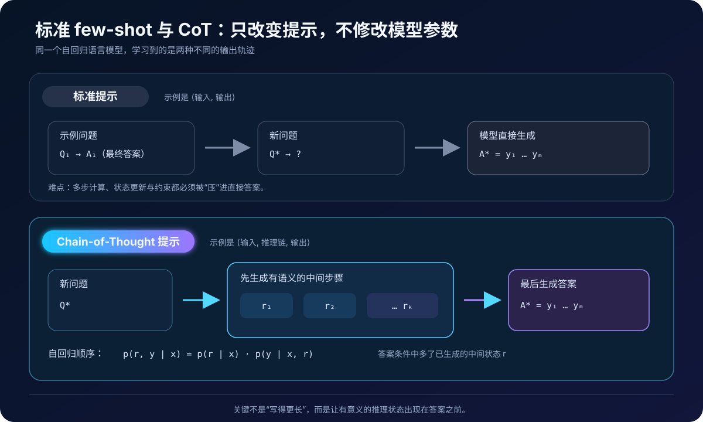
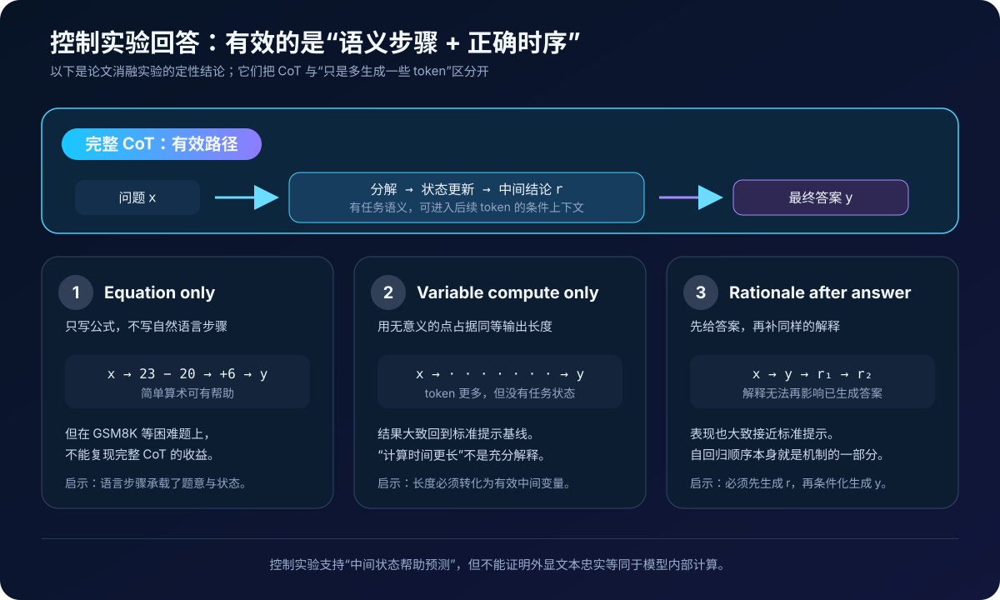
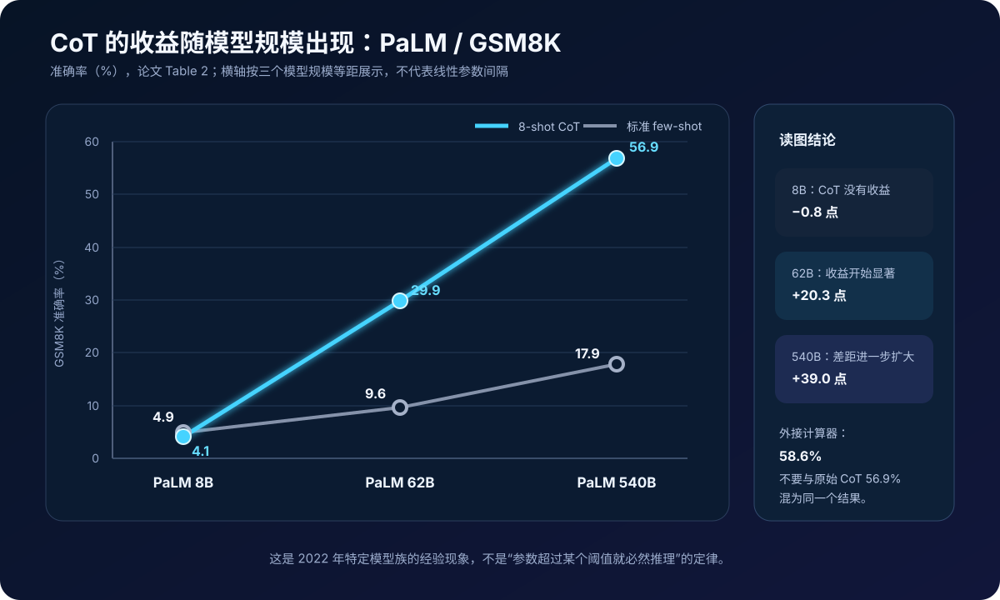

# Chain-of-Thought 原理：为什么“先写中间步骤”会改变大模型的答案


> **论文**：[Chain-of-Thought Prompting Elicits Reasoning in Large Language Models](https://arxiv.org/abs/2201.11903)<br>
> **作者**：Jason Wei、Xuezhi Wang、Dale Schuurmans 等<br>
> **发表时间**：2022 年，NeurIPS 2022<br>
> **关键词**：Chain-of-Thought、Few-shot Prompting、In-context Learning、Reasoning、Emergent Ability

## 0. 先说结论

Chain-of-Thought（CoT，思维链）论文做了一件结构上非常简单、影响却非常深远的事：

> 把 few-shot 示例从“问题 → 答案”改成“问题 → 自然语言中间步骤 → 答案”，让模型先生成推理文本，再在这些已生成 token 的条件下给出最终答案。

它没有：

- 修改 Transformer 结构；
- 增加训练 loss；
- 微调模型参数；
- 为每项任务训练一个专用 checkpoint；
- 在原始主实验中搜索多条路径。

原论文的核心是 **few-shot in-context learning**。对于算术任务，作者手写了 8 个带推理步骤的示例；测试时主要采用 greedy decoding，让模型生成一条推理链和一个答案。

论文最有代表性的结果来自 GSM8K：

| PaLM 540B / GSM8K | 准确率 |
|---|---:|
| 标准 few-shot prompting | 17.9% |
| 8-shot CoT prompting | 56.9% |
| CoT + 外接计算器 | 58.6% |

所以经常看到的“约 58%”不是一个含糊的 CoT 数字：**原始 CoT 是 56.9%，外接计算器后是 58.6%**。

与此同时，论文还有三条不能丢掉的限制：

1. CoT 在当时的小模型上经常无效甚至有害；
2. 更长的输出本身不够，必须是有任务语义的中间步骤；
3. 外显推理文本便于检查，但不等于模型内部计算的忠实解释。

一句话记忆：

> CoT 不是给模型安装了一个新的推理模块，而是把一次困难的“直接答案预测”，改写为一串更容易条件化的中间 token 预测。

---

## 1. 标准 prompting 的瓶颈：答案太短，任务过程太长

标准 few-shot prompt 通常给模型若干输入—输出对：

```text
Q: Roger 原有 5 个球，又买了 3 个。现在有几个？
A: 8

Q: Lina 买了 23 个苹果，卖掉 20 个，又收到 6 个。现在有几个？
A:
```

模型要直接生成 `9`。对人类来说，这个问题包含两个状态更新：

$$
23 - 20 = 3,\qquad 3 + 6 = 9
$$

但标准提示只示范了“输入最终映射到答案”，没有示范：

- 如何把题意分解成操作；
- 先更新哪个状态；
- 中间变量代表什么；
- 什么时候停止并输出最终答案。

在简单的一步任务上，模型可能直接学到映射。但当任务需要多跳推理、状态追踪或多项约束时，一次性预测最终答案会把过多工作压缩到很短的输出中。

### 1.1 CoT 改变的是输出轨迹

CoT 示例把中间过程写进答案：

```text
Q: Roger 原有 5 个球，又买了 3 个。现在有几个？
A: 他原有 5 个，又增加 3 个，所以 5 + 3 = 8。答案是 8。

Q: Lina 买了 23 个苹果，卖掉 20 个，又收到 6 个。现在有几个？
A:
```

模型可能续写：

```text
卖掉 20 个后剩 23 - 20 = 3 个；
又收到 6 个后共有 3 + 6 = 9 个。答案是 9。
```

模型参数完全相同，变化的是上下文中展示的模式，以及生成答案前已经进入上下文的中间状态。



---

## 2. 先把几个经常混用的概念分开

### 2.1 原论文是 few-shot CoT，不是 Zero-shot CoT

Wei 等人的原论文在 prompt 中提供完整的：

$$
\langle \text{input},\ \text{chain of thought},\ \text{output}\rangle
$$

示例。模型通过 in-context learning 模仿这些轨迹。

后来广为流传的：

```text
Let's think step by step.
```

属于 Kojima 等人在后续工作中提出的 **Zero-shot CoT**。它不依赖人工推理示例，方法与实验不能倒灌回原论文。

### 2.2 原论文主结果不是 Self-Consistency

原始 CoT 主实验主要使用 greedy decoding，每题生成一条链。

Self-Consistency 是后续方法：

1. 用随机采样生成多条推理链；
2. 提取每条链的最终答案；
3. 按答案多数投票。

它可以建立在 CoT 上，但不是 CoT 论文主方法的一部分。原论文修订版会引用这项后续工作，仍不应把两者写成同一种算法。

### 2.3 CoT 也不是 Tree of Thoughts

CoT 是一条自回归序列：

```text
问题 → 步骤 1 → 步骤 2 → … → 答案
```

Tree of Thoughts 会显式构造分支、评价中间候选并搜索：

```text
                 ┌→ 候选状态 A → …
问题 → 当前状态 ├→ 候选状态 B → …
                 └→ 候选状态 C → …
```

前者是单次序列生成，后者是推理时搜索框架。

### 2.4 “外显 rationale”不等于“模型真实内心独白”

论文中的 chain of thought 是模型生成的自然语言序列。它可以像解题过程，也能帮助定位错误，但不能据此断言：

- 每句话都忠实反映了网络内部计算；
- 文字里没写出的因素没有影响答案；
- 文本看起来正确，答案就一定可靠；
- 最终答案正确，整条链就一定正确。

更严谨的名称是“外显推理文本”或“中间解释轨迹”。本文仍沿用 CoT / 思维链这一标准术语，但不会把它神秘化。

---

## 3. 概率视角：答案为什么会被中间 token 改变

设：

- $x$：输入问题；
- $r=(r_1,\ldots,r_K)$：推理链 token；
- $y=(y_1,\ldots,y_M)$：最终答案 token；
- $D_{\text{CoT}}$：prompt 中的 CoT demonstrations。

标准 prompting 直接建模：

$$
p(y\mid x,D_{\text{std}})
=
\prod_{m=1}^{M}
p(y_m\mid x,D_{\text{std}},y_{<m})
$$

CoT prompting 则先生成 $r$，再生成 $y$：

$$
\begin{aligned}
p(r,y\mid x,D_{\text{CoT}})
&=
p(r\mid x,D_{\text{CoT}})
\cdot
p(y\mid x,D_{\text{CoT}},r)\\
&=
\prod_{k=1}^{K}
p(r_k\mid x,D_{\text{CoT}},r_{<k})
\prod_{m=1}^{M}
p(y_m\mid x,D_{\text{CoT}},r,y_{<m})
\end{aligned}
$$

最重要的变化出现在第二项：

$$
p(y\mid x,D_{\text{CoT}},r)
$$

模型预测最终答案时，不再只有原始问题；它还能注意到自己刚生成的分解、数字、实体状态和中间结论。

### 3.1 $r$ 是“中间变量”，但不是隐藏变量

从问题分解的角度，可以把 $r$ 看作位于 $x$ 和 $y$ 之间的中间变量。可是在 CoT 解码中，$r$：

- 明确出现在输出序列中；
- 能被用户读取；
- 会占用上下文和生成 token；
- 会直接条件化后续答案。

所以它不是经典意义上被边缘化掉的 latent variable。若只关心答案，理论上可以写：

$$
p(y\mid x)
=
\sum_r p(r\mid x)p(y\mid x,r)
$$

但原始 greedy CoT 并没有真的对所有 $r$ 求和；它近似选择一条高概率链，再沿这条链输出答案：

$$
\hat r=\arg\max_r p(r\mid x),\qquad
\hat y=\arg\max_y p(y\mid x,\hat r)
$$

这也解释了单链 CoT 的风险：第一条链走偏后，答案往往会被错误上下文继续带偏。

### 3.2 CoT 不会改变权重

CoT 发生在推理时。它不更新参数 $\theta$：

$$
\theta_{\text{after prompt}}=\theta_{\text{before prompt}}
$$

变化的是当前序列的条件分布。每生成一个有意义的中间 token，后续预测都获得一个新的可注意条件。

---

## 4. 为什么 CoT 可能有效

论文给出的是经验发现与机制动机，不是一个已经完成的因果理论。比较稳妥的解释有五层。

### 4.1 把多步问题拆成局部转换

直接预测：

$$
x\longrightarrow y
$$

要求模型在一次短输出中完成所有隐式计算。CoT 改成：

$$
x\longrightarrow s_1\longrightarrow s_2\longrightarrow\cdots\longrightarrow y
$$

每一步只需完成局部转换，例如：

- 从自然语言识别数量关系；
- 用一次运算更新状态；
- 将中间结果带入下一步；
- 检查最终问题问的是什么。

局部转换仍可能出错，但学习和生成难度通常低于一次性跨越整个问题。

### 4.2 把工作状态写入可注意的上下文

Transformer 每一步都能注意此前 token。中间结果一旦写出，就成为后续计算的“外部工作记忆”。

例如模型写出：

```text
卖掉后剩 3 个
```

后续预测可以直接利用 `3` 这个显式状态，而不必从原题重新恢复它。

这并不意味着文本等同于模型的内部工作记忆；更准确地说，它给后续 token 提供了一个稳定、可重读的外部表示。

### 4.3 允许按问题难度分配不同生成长度

一步题只需很短的链，多步题可以生成更多 token。作者把这称为一种 variable computation：

$$
\text{inference compute per example}
\propto
|r|+|y|
$$

但“多 token”只是必要条件之一。论文的点号占位消融表明：输出同样长的一串无意义符号，并不会获得完整 CoT 的收益。

### 4.4 few-shot 示例同时示范“答案”与“算法形状”

标准示例主要告诉模型输出空间是什么；CoT 示例还示范：

- 任务应该如何分解；
- 哪些事实值得保留；
- 中间状态如何命名；
- 采用何种运算或规则；
- 最终答案应该如何收束。

因此，CoT 可以被理解为一种更高带宽的 in-context supervision：每个 exemplar 不只提供标签，还提供一段可模仿的求解轨迹。

### 4.5 中间步骤提供了诊断窗口

若模型只返回 `17`，开发者很难知道它是：

- 读错题；
- 算错；
- 漏掉一步；
- 提取答案失败。

若它写出过程，至少可以按步骤做错误分析、规则检查或工具校验。

但“可检查”不等于“忠实解释”。CoT 是一个观测窗口，不是对神经网络内部机制的完整读出。

---

## 5. 三个消融实验排除了过于简单的解释



论文在 LaMDA 137B 上比较了标准提示、完整 CoT 和三个控制条件。以 GSM8K 为例：

| 提示方式 | GSM8K 准确率 |
|---|---:|
| 标准 prompting | $6.5\pm0.4$ |
| 完整 CoT | $14.3\pm0.4$ |
| 只写 equation | $5.4\pm0.2$ |
| 只增加无意义 token | $6.4\pm0.3$ |
| 先答案、后 reasoning | $6.1\pm0.4$ |

### 5.1 Equation only：公式有帮助，但自然语言仍重要

只生成公式可以在某些较简单算术集上取得介于标准提示与完整 CoT 之间的结果，但在 GSM8K 上没有复现收益。

自然语言步骤可能承担了公式之外的信息：

- 当前数字对应哪个实体；
- 这一步为什么做加法或减法；
- 哪个量是中间状态，哪个量才是所问答案；
- 不同句子之间的语义关系。

结论不是“公式没用”，而是**只保留符号运算会丢掉困难文字题所需的语义状态**。

### 5.2 Variable compute only：长度不是充分条件

作者让模型在答案前输出与推理链长度相近的点号：

```text
Q → · · · · · · · · → Answer
```

如果收益只是来自“多执行几次 Transformer forward”，这一控制条件也应显著提升表现；实验却大致回到标准提示。

因此：

$$
\text{更多生成 token}
\not\Rightarrow
\text{有效推理}
$$

更准确的说法是：

$$
\text{更多 token}
+
\text{任务相关中间状态}
+
\text{正确生成顺序}
\Rightarrow
\text{可能更好的答案}
$$

### 5.3 Reasoning after answer：时序是机制的一部分

自回归模型不能让未来 token 改变已经生成的过去 token。若顺序是：

```text
问题 → 最终答案 → 解释
```

解释生成得再好，也无法条件化那个已经输出的答案。

只有：

```text
问题 → 推理链 → 最终答案
```

才对应：

$$
p(y\mid x,r)
$$

这项消融直接说明，CoT 不只是“让回答看起来更可解释”；推理文本在答案之前出现，本身就是方法机制的一部分。

---

## 6. 论文实验是怎样做的

### 6.1 评测模型

修订版论文覆盖多个模型族和规模：

- GPT / InstructGPT API 系列：约 350M、1.3B、6.7B、175B；
- LaMDA：422M、2B、8B、68B、137B；
- PaLM：8B、62B、540B；
- UL2 20B；
- Codex `code-davinci-002`。

跨模型族结果很重要：它说明现象不只来自单一架构或单一 checkpoint。但参数量、训练数据、训练算力和后训练方式同时变化，所以不能把所有差异都归因于参数规模。

### 6.2 三类任务

| 类别 | 数据集 | 主要能力 |
|---|---|---|
| 算术推理 | GSM8K、SVAMP、ASDiv、AQuA、MAWPS | 读题、列式、多步计算 |
| 常识推理 | CSQA、StrategyQA、Date Understanding、Sports Understanding、SayCan | 多跳常识、日期、可行性、动作规划 |
| 符号推理 | Last Letter Concatenation、Coin Flip | 字符操作、状态追踪、长度泛化 |

### 6.3 Prompt 和解码

算术实验的关键设置：

- 除 AQuA 外，作者手工编写 8 个 CoT exemplars；
- AQuA 是多选题，使用 4 个 exemplars；
- 同一组算术 exemplar 跨多个数据集使用；
- 主实验使用 greedy decoding；
- LaMDA 对 5 种 exemplar 随机顺序取平均；
- 为节约计算，其他模型通常只用一个 exemplar 顺序。

这意味着原论文的核心问题不是：

> 采样多少条链、怎样搜索、怎样投票？

而是：

> 仅在上下文中示范“先推理后作答”，能否释放大模型在多步任务上的能力？

---

## 7. 最醒目的现象：CoT 收益随模型规模出现



PaLM 在 GSM8K 上的数据是：

| 模型 | 标准提示 | CoT | 变化 |
|---|---:|---:|---:|
| PaLM 8B | 4.9% | 4.1% | -0.8 |
| PaLM 62B | 9.6% | 29.9% | +20.3 |
| PaLM 540B | 17.9% | 56.9% | +39.0 |

论文把它描述为 CoT 的 emergent ability：

- 小模型往往能生成流畅文本；
- 但链条在语义或逻辑上不连贯；
- 这些错误步骤反而污染后续答案；
- 到足够大规模时，中间步骤才开始稳定带来净收益。

### 7.1 “约 100B 才有效”不是自然定律

论文正文用“约 100B 参数”概括当时的观察。但图表已经显示 PaLM 62B 在部分任务上有明显收益，而不同模型族的阈值也不完全相同。

参数量只是代理变量。真正一起变化的还包括：

- 预训练 token 与数据质量；
- 模型架构；
- 优化与训练算力；
- 指令微调；
- 推理数据和过程数据；
- tokenizer 与上下文长度。

因此，正确读法是：

> 在论文研究的 2022 年模型族中，few-shot CoT 的收益高度依赖规模，通常只在较大模型上明显出现。

不能把它改写成：

> 任意模型一过固定参数阈值，就会自动获得可靠推理。

现代较小模型可能因为专门的推理训练、蒸馏或工具使用而表现不同，那属于训练条件改变后的新问题。

### 7.2 越难、越需要多步的题，收益越大

论文在 MAWPS 子集上的观察很清楚：

- SingleOp、SingleEq、AddSub 等一步或简单两步任务，本来就容易；
- CoT 的提升较小，有时还会下降；
- MultiArith 等多步任务的提升明显更大。

这是一个实用判断标准：

$$
\text{CoT 价值}
\approx
\text{任务所需中间状态数量}
\times
\text{模型维持这些状态的能力}
$$

对不需要分解的任务，强行生成长链只会增加延迟、成本与出错面。

---

## 8. 算术结果：不要忽略 external calculator

PaLM 540B 在五个算术基准上的结果如下：

| 数据集 | 标准提示 | CoT | CoT + 外接计算器 |
|---|---:|---:|---:|
| GSM8K | 17.9 | 56.9 | 58.6 |
| SVAMP | 69.4 | 79.0 | 79.8 |
| ASDiv | 72.1 | 73.9 | 72.6 |
| AQuA | 25.2 | 35.8 | 35.8 |
| MAWPS | 79.2 | 93.3 | 93.5 |

这些数字说明两件事。

第一，CoT 的主要收益不是计算器贡献的。以 GSM8K 为例：

$$
\underbrace{17.9\rightarrow56.9}_{\text{CoT 带来的主要提升}}
\rightarrow
\underbrace{58.6}_{\text{再用计算器校正算术}}
$$

第二，工具并非永远提高结果。ASDiv 上外接计算器反而从 73.9 降到 72.6。工具链还会引入表达式抽取、解析和执行错误。

### 8.1 原论文中的 calculator 是后处理

论文附录描述的 external calculator 会从生成文本中识别算术方程，用 Python 计算并传播结果。它不是模型内部新建的神经模块，也不是训练时加入的监督。

工程上不要对不可信模型输出直接调用：

```python
# 不要这样做
value = eval(model_generated_expression)
```

本文配套代码使用 Python AST 白名单，只允许：

- 数值常量；
- 括号；
- `+`、`-`、`*`、`/`；
- 有界整数次幂。

函数调用、属性访问、变量名和容器都会被拒绝：

```python
from cot_prompting_demo import safe_eval_arithmetic

assert safe_eval_arithmetic("(23 - 20) + 6") == 9

# 会抛出 ValueError，而不是执行
safe_eval_arithmetic("__import__('os').system('echo unsafe')")
```

工具能降低局部算术错误，但不能修复错误的题意理解。如果模型把“卖掉”理解成加法，再精确的计算器也只会精确执行错误表达式。

---

## 9. CoT 不只用于数学

### 9.1 常识推理

PaLM 540B 在修订版附录 Table 4 中的结果：

| 数据集 | 标准提示 | CoT | 变化 |
|---|---:|---:|---:|
| CSQA | 78.1 | 79.9 | +1.8 |
| StrategyQA | 68.6 | 77.8 | +9.2 |
| Date Understanding | 49.0 | 65.3 | +16.3 |
| Sports Understanding | 80.5 | 95.4 | +14.9 |
| SayCan | 80.8 | 91.7 | +10.9 |

这里也能看到“多步程度”比“看起来像常识题”更重要：

- CSQA 的提升很小；
- 需要多跳策略、日期换算或动作序列的任务提升更明显。

CoT 不是数学专用技巧。只要任务可以用自然语言中间状态表达，就可能受益。

### 9.2 符号推理与长度泛化

论文设计了两个受控任务：

- **Last Letter Concatenation**：取多个词的末字母并拼接；
- **Coin Flip**：根据一系列翻转操作追踪硬币状态。

训练示例只覆盖较短输入，测试加入更长的 out-of-domain 输入。PaLM 540B 的 Last Letter 结果很有代表性：

| 输入长度 | 标准提示 | CoT |
|---|---:|---:|
| 2 个词（同分布） | 7.6 | 99.4 |
| 3 个词（OOD） | 0.2 | 94.8 |
| 4 个词（OOD） | 0.0 | 63.0 |

CoT 示例把“对每个词执行相同操作，再拼接”这一可迭代过程写了出来，所以大模型能把步骤延长到更多元素。

但 4 个词时准确率仍从 94.8 降到 63.0。CoT 改善长度泛化，不等于无限长度泛化。

---

## 10. 错误分析：正确答案、正确过程是两件事

作者人工检查了 LaMDA 137B 在 GSM8K 上的生成。

### 10.1 最终答案正确的 50 个样本

- 48 条链在逻辑和数学上正确；
- 2 条链存在问题，只是碰巧得到正确答案。

所以：

$$
\text{final answer correct}
\not\Rightarrow
\text{reasoning correct}
$$

### 10.2 最终答案错误的 50 个样本

- 46% 的链接近正确，只存在局部错误；
- 54% 存在较大的语义理解或连贯性错误。

局部错误包括：

- 算术失误；
- 符号映射错误；
- 漏掉一个步骤。

较大错误包括：

- 误解题目关系；
- 无依据引入条件；
- 前后状态矛盾；
- 推理链整体不连贯。

这给出了一个很实用的分层修复思路：

| 错误层 | 例子 | 更合适的修复 |
|---|---|---|
| 解析层 | 没按格式给最终答案 | 结构化输出、严格 parser |
| 局部计算层 | `23 - 20 = 4` | 计算器、代码执行、校验器 |
| 状态层 | 中途把实体或单位换掉 | 状态表、短步骤、约束检查 |
| 语义层 | 把“卖掉”当“买入” | 更强模型、更好示例、任务专用验证 |
| 搜索层 | 第一条合理路径走错 | self-consistency、搜索、verifier |

不是所有错误都应该用“再写长一点”解决。

---

## 11. 从零实现一个可评测的 CoT pipeline

完整可运行代码：

[cot_prompting_demo.py](./code/cot_prompting_demo.py)

运行：

```bash
python3 papers/to-2026/code/cot_prompting_demo.py
```

它不依赖第三方库，也不绑定任何 API，包含：

- 标准 few-shot 与 CoT prompt builder；
- 上下文预算截断；
- 最终答案 marker 解析；
- 数字、多选、文本归一化；
- 只评最终答案的 exact match；
- AST 白名单算术计算器；
- 可替换的 `generator(prompt) -> text` 接口；
- 内置自测试。

### 11.1 数据结构

```python
from dataclasses import dataclass


@dataclass(frozen=True)
class Exemplar:
    question: str
    rationale: str
    answer: str
```

把 `rationale` 与 `answer` 分开存有三个好处：

1. 可以用同一批样本构建标准提示和 CoT 提示；
2. 可以分别检查推理文本和最终答案；
3. 不需要用脆弱的字符串切片从模板中恢复字段。

### 11.2 两种 prompt 必须只差目标变量

```python
def build_standard_prompt(exemplars, question):
    blocks = [
        f"Q: {ex.question}\n"
        f"A: The answer is {ex.answer}."
        for ex in exemplars
    ]
    blocks.append(f"Q: {question}\nA:")
    return "\n\n".join(blocks)


def build_cot_prompt(exemplars, question):
    blocks = [
        f"Q: {ex.question}\n"
        f"A: {ex.rationale} The answer is {ex.answer}."
        for ex in exemplars
    ]
    blocks.append(f"Q: {question}\nA:")
    return "\n\n".join(blocks)
```

做标准提示 vs CoT 消融时，尽量固定：

- 示例数量；
- 示例顺序；
- 问题措辞；
- 答案 marker；
- 解码策略；
- 最大输出长度；
- 评测 parser。

否则测到的可能是模板、预算或解析差异，而不是 rationale 的作用。

### 11.3 不要用“最后一个数字”代替最终答案协议

一条 CoT 里通常有很多数字：

```text
23 - 20 = 3，然后 3 + 6 = 9。The answer is 9.
```

若 parser 随便取第一个或任意数字，评测会失真。更稳妥的方式是要求显式 marker：

```python
ANSWER_PATTERN = re.compile(
    r"(?:The answer is|Final answer\s*:|答案(?:是|为)\s*[:：]?)"
    r"\s*(?P<answer>[^\n]+)",
    flags=re.IGNORECASE,
)


def parse_completion(text):
    matches = list(ANSWER_PATTERN.finditer(text.strip()))
    if not matches:
        raise ValueError("missing final-answer marker")

    match = matches[-1]
    rationale = text[:match.start()].strip()
    answer = match.group("answer").strip().rstrip("。.")
    return rationale, answer
```

取**最后一个明确 marker**，可以避免 rationale 中提前出现类似短语时提取错误。

缺失 marker 时应记录 format error，而不是静默猜答案。否则模板服从率的下降会被错误地包装成任务准确率。

### 11.4 归一化应该由任务类型决定

数字题需要处理：

- 千位逗号：`1,392`；
- 货币符号：`$1,392.00`；
- 小数尾零：`9.0`；
- 百分号：`25%`。

多选题则应该把 `(b)`、`option B` 归一为 `B`。文本任务可统一大小写和空白，但不能盲目删掉所有有语义的标点或单位。

```python
assert normalize_numeric_answer("$1,392.00") == "1392"
assert normalize_choice_answer("option (b)") == "B"
assert answers_match("New York.", "new york", kind="text")
```

最终答案指标与 rationale 指标要分开：

```text
answer_exact_match
format_success_rate
rationale_validity      # 若有人工或 verifier 标签
average_output_tokens
latency
```

不要把“链写得很长”当作 reasoning quality。

### 11.5 用统一的 generator 接入任意模型

```python
from typing import Callable

Generator = Callable[[str], str]


def run_prompting(generator, mode, exemplars, question):
    prompt = build_prompt(mode, exemplars, question)
    completion = generator(prompt)
    parsed = parse_completion(completion)
    return {
        "prompt": prompt,
        "completion": completion,
        "parsed": parsed,
    }
```

本地 Transformers、推理服务器或远程模型都只需实现：

```python
def my_generator(prompt: str) -> str:
    ...
    return generated_text
```

这种解耦让 prompt、模型调用、parser 与 evaluator 可以独立测试。

### 11.6 上下文预算不要从中间截断 exemplar

最危险的做法是按字符或 token 生硬裁掉 prompt 尾部：

```text
Q: ...
A: 先计算第一步，然后把……
```

半条 rationale 会示范一个错误的停止模式。

配套实现选择“能完整放入预算的最大 exemplar 前缀”，并返回实际选中了哪些示例：

```python
selected, prompt = fit_exemplars_to_budget(
    mode="cot",
    exemplars=exemplars,
    question=question,
    max_chars=4000,
)
```

示例代码用字符数保持零依赖；生产中应换成部署模型的 tokenizer，并预留：

$$
\text{context budget}
=
\text{prompt tokens}
+
\text{max generation tokens}
+
\text{safety margin}
$$

---

## 12. 一个严谨的评测协议

如果要验证 CoT 是否真的改善你的任务，建议使用成对实验。

### 12.1 固定实验变量

对每一道题，用同一个模型、同一组 exemplar 和同一解码配置生成：

```text
standard prompt → completion_standard
CoT prompt      → completion_cot
```

原论文主要用 greedy decoding。复现实验可采用：

```text
temperature = 0
top_p       = 1
samples     = 1
```

具体 API 在 temperature 为 0 时的实现可能不同，因此还应记录模型版本、服务端版本与随机种子。

### 12.2 同时报告五类指标

| 指标 | 回答什么问题 |
|---|---|
| 最终答案准确率 | 任务是否真的做对 |
| 格式成功率 | parser 能否稳定提取答案 |
| 平均输出 token | CoT 增加多少推理成本 |
| 延迟 / 吞吐 | 实际服务代价 |
| 分层错误率 | 错在语义、步骤、计算还是解析 |

若使用工具，再单列：

```text
CoT raw
CoT + calculator
CoT + verifier
```

不能只展示工具链最终结果，然后把全部提升归因于 CoT。

### 12.3 进行 exemplar 稳健性检查

few-shot 方法天然对上下文敏感。至少检查：

- 不同 exemplar 顺序；
- 不同但等质量的 exemplar 集合；
- 简洁与详细 rationale；
- 不同 exemplar 数量；
- in-domain 与跨域 exemplar；
- prompt 总 token 数。

原论文也做了不同标注员、不同示例、顺序和数量的稳健性实验。不同 prompt 间存在方差，但研究中的 CoT 变体总体仍明显超过标准基线。

### 12.4 防止测试污染与答案泄漏

检查：

- exemplar 是否来自测试集；
- rationale 是否包含测试题的特殊模板；
- prompt 是否意外带入 gold answer；
- 评测 parser 是否根据 reference 做启发式选择；
- 同一实体或同一题改写是否跨 train/test。

CoT 提供的监督比普通答案更丰富，也更容易通过模板相似性造成隐性泄漏。

---

## 13. 工程上什么时候应该使用 CoT

### 13.1 适合

- 多步数学与数量关系；
- 日期、时间、单位换算；
- 多跳常识判断；
- 状态追踪；
- 需要先分解再执行的计划；
- 需要把中间表达式交给工具验证；
- 失败后需要定位错误层级的任务。

共同特征是：

> 最终答案依赖多个可表达、可顺序执行的中间状态。

### 13.2 不一定适合

- 情感分类、主题分类等直接映射；
- 简单抽取；
- 已有高准确率的一步任务；
- 极低延迟、高吞吐场景；
- 输出空间很小且可直接约束解码；
- rationale 可能泄露敏感信息的场景；
- 中间文本无法可靠验证、却可能被用户当作证据的高风险任务。

简单任务上，CoT 可能：

- 引入本来不存在的假设；
- 把正确直觉绕成错误结论；
- 增加 token 成本；
- 降低格式稳定性；
- 让错误答案显得更有说服力。

### 13.3 实用决策规则

先建立 direct baseline，再问三个问题：

1. 错误是否主要来自多步状态丢失？
2. 现有模型是否能生成连贯、可验证的中间步骤？
3. 准确率收益是否覆盖额外 token、延迟和风险？

只有实验回答“是”，才应该默认开启 CoT。

---

## 14. CoT 的常见失败模式

### 14.1 流畅但不合逻辑

小模型尤其容易模仿“所以、因此、下一步”的文体，却没有保持因果和状态一致。

语言流畅度与推理正确性是两个变量：

$$
\text{fluency}\neq\text{logical validity}
$$

### 14.2 早期错误被自回归放大

若第一步写成：

```text
23 - 20 = 4
```

后续往往会围绕 `4` 构造一条局部自洽、整体错误的链。单链 greedy decoding 没有自动回溯。

### 14.3 正确答案来自错误理由

中间出现两个错误相互抵消，或者模型根据模式猜中答案，都可能造成：

```text
错误 rationale + 正确 answer
```

只看答案会漏掉这个问题，只看解释是否“像真的”也会漏掉。

### 14.4 错误答案配上有说服力的故事

CoT 会增加回答的表面连贯性。一个错误结论经过多步包装，可能比短错误答案更容易让人相信。

因此，高风险场景需要：

- 独立事实来源；
- 可执行计算；
- 规则或约束检查；
- 独立 verifier；
- 人工复核。

不应把模型自己的解释当作模型自己的证明。

### 14.5 成本与延迟线性上升

大致有：

$$
\text{generation cost}
\propto
\text{number of generated tokens}
$$

长链还会增加 KV cache、网络传输、日志和后续上下文占用。CoT 的收益应与这些成本一起报告。

### 14.6 隐私与日志风险

更长的自由文本可能重复输入中的个人信息、敏感业务字段或不应长期保存的内容。工程上应：

- 只记录必要字段；
- 对 rationale 与 final answer 分开设留存策略；
- 做敏感信息过滤；
- 不把原始推理文本默认暴露给所有下游系统。

---

## 15. 与后续方法的关系

| 方法 | Prompt / 训练信号 | 推理时轨迹 | 与原始 CoT 的关系 |
|---|---|---|---|
| 标准 few-shot | $\langle x,y\rangle$ 示例 | 直接答案 | 原论文基线 |
| Few-shot CoT | $\langle x,r,y\rangle$ 示例 | 单条 `r → y` | 本论文 |
| Zero-shot CoT | “逐步思考”类指令 | 单条 `r → y` | 后续无需 rationale 示例 |
| Self-Consistency | CoT prompt | 多条链、答案投票 | 用采样近似对多条 $r$ 聚合 |
| Tree of Thoughts | 状态生成 + 评价器 | 分支、回溯、搜索 | 将单链扩展为显式搜索 |
| Tool use | 工具描述、调用协议 | 文本与外部执行交替 | 把部分中间步骤交给可靠执行器 |
| Process supervision | 步骤级标签或奖励 | 依训练方案而定 | 直接训练中间步骤质量 |
| Reasoning distillation | 教师轨迹 | 较小模型生成或内化轨迹 | 试图把能力迁移到小模型 |

从概率角度看，Self-Consistency 的动机可写成：

$$
p(y\mid x)
=
\sum_r p(r\mid x)p(y\mid x,r)
$$

原始 greedy CoT 只跟随一条高概率链；Self-Consistency 采样多条 $r$，再按最终答案聚合，试图减少单条路径偶然走偏的影响。

继续阅读：

- [Self-Consistency](./18_Self_Consistency_2022_原理.md)
- [Tree of Thoughts](./26_Tree_of_Thoughts_2023_原理.md)

---

## 16. 对论文结论的四个边界

### 16.1 “能生成 CoT”不等于“已证明模型在推理”

论文明确把“神经网络是否真的在 reasoning”留作开放问题。实验能证明的是：

> 在给定基准、prompt 和模型下，生成中间自然语言步骤改善了最终任务表现。

它没有给“推理”提供唯一的哲学或机制定义。

### 16.2 “可解释”不等于“忠实”

CoT 让错误更容易被人看见，是实际价值。但生成文本可能是：

- 有效中间计算；
- 对已形成答案的合理化；
- 混合了计算与叙述的轨迹；
- 事实错误却语言流畅的解释。

解释性与忠实性应分别验证。

### 16.3 “few-shot 标注便宜”不等于“规模化过程标注便宜”

为 prompt 手写 8 条 rationale 的成本很低。若要对数百万训练样本写高质量过程标签，成本会完全不同。

原论文强调的是 few-shot 场景中的低标注量，不是说大规模过程监督天然便宜。

### 16.4 “大模型受益”不等于“只要更大就够”

模型规模与训练算力、数据、架构一起变化。论文展示的是强经验规律，不是把 CoT 能力唯一归因于参数量的受控因果实验。

---

## 17. 常见误解

### 误解 1：CoT 就是在问题后加“请逐步思考”

这是后续 Zero-shot CoT 的典型形式。原论文方法是在 few-shot exemplar 中示范完整 rationale。

### 误解 2：CoT 等于生成更多 token

点号占位消融没有复现收益。有效中间状态和生成顺序才是关键。

### 误解 3：CoT 在所有任务上都会更好

小模型和简单任务上可能下降。应先测 direct baseline。

### 误解 4：GSM8K 的 58% 完全是纯 CoT

论文 v6 的精确数字是 56.9% raw CoT、58.6% CoT + external calculator。

### 误解 5：原论文已经使用多路径投票

原始主实验是 greedy 单链。多样采样与投票属于后续 Self-Consistency。

### 误解 6：推理文本就是模型内部思维的原样打印

论文没有证明这一点，反而明确把模型是否真正“在推理”列为开放问题。

### 误解 7：只要过程看起来专业，答案就可信

自然语言连贯不保证事实、逻辑或计算正确。高风险结果仍需独立验证。

---

## 18. 一页纸记忆

### 方法

$$
\langle x,y\rangle
\quad\Longrightarrow\quad
\langle x,r,y\rangle
$$

### 生成顺序

$$
p(r,y\mid x)
=
p(r\mid x)p(y\mid x,r)
$$

### 原论文设置

```text
few-shot rationale exemplars
+ ordinary autoregressive LM
+ mainly greedy decoding
+ no parameter update
```

### 最关键结果

```text
PaLM 540B / GSM8K
standard:          17.9%
CoT:               56.9%
CoT + calculator:  58.6%
```

### 最关键消融

```text
只写 equation       ≠ 完整 CoT
只增加点号 token     ≈ 标准基线
先答案后 reasoning   ≈ 标准基线
```

### 正确边界

```text
外显 rationale ≠ 内部机制的忠实读出
CoT             ≠ Zero-shot CoT
CoT             ≠ Self-Consistency
CoT             ≠ Tree of Thoughts
```

### 工程原则

```text
先做 direct baseline
显式 final-answer marker
答案与 rationale 分开评测
工具结果单列
完整 exemplar 级预算
同时报告准确率、token、延迟和格式失败
```

---

## 19. 参考资料

- [论文：Chain-of-Thought Prompting Elicits Reasoning in Large Language Models](https://arxiv.org/abs/2201.11903)
- [论文 PDF（含附录完整结果与消融）](https://arxiv.org/pdf/2201.11903)
- [Google Research：Language Models Perform Reasoning via Chain of Thought](https://research.google/blog/language-models-perform-reasoning-via-chain-of-thought/)
- [作者公开代码仓库](https://github.com/jasonwei20/chain-of-thoughts)
- [配套实现：cot_prompting_demo.py](./code/cot_prompting_demo.py)

如果只记住一句话：

> CoT 的突破不在于让模型“说得更长”，而在于让有意义的中间状态先进入自回归上下文，再由这些状态条件化最终答案。
