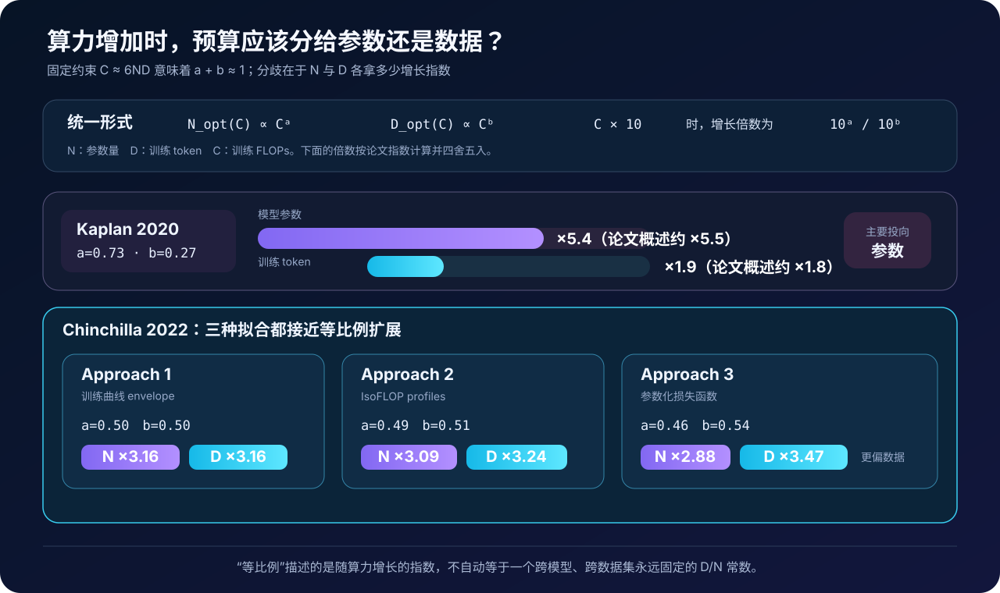
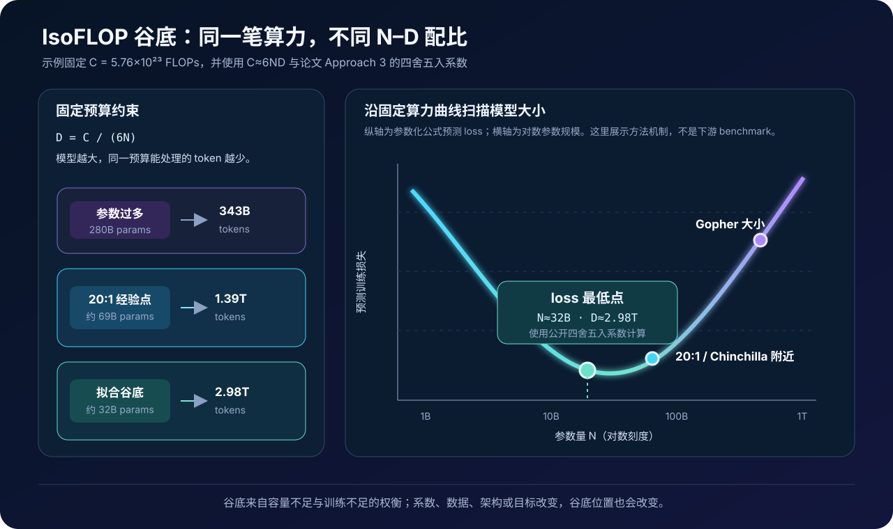
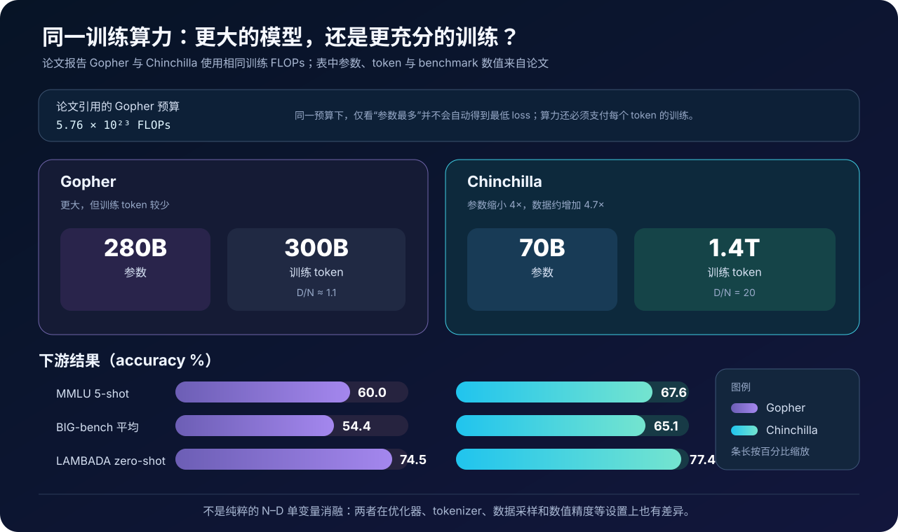

# Chinchilla 原理与代码：固定算力下，参数和训练数据应该怎样分配


> **论文**：[Training Compute-Optimal Large Language Models](https://arxiv.org/abs/2203.15556)<br>
> **作者**：Jordan Hoffmann、Sebastian Borgeaud、Arthur Mensch 等<br>
> **发表时间**：2022 年 3 月<br>
> **关键词**：Scaling Laws、Compute-optimal Training、IsoFLOP、Training Tokens、Chinchilla

## 0. 先说结论

Chinchilla 论文研究的不是一种新 Transformer，而是一个昂贵训练项目开始前必须回答的问题：

> 给定固定训练算力 \(C\)，应该训练多大的模型 \(N\)，又应该让它看多少 token \(D\)，才能得到最低的预训练损失？

在 dense Transformer 的常见近似下：

$$
\boxed{C\approx6ND}
$$

参数量和训练 token 会竞争同一笔算力：

- 模型越大，每处理一个 token 越贵；
- 在固定 \(C\) 下，模型越大，能训练的 token 就越少；
- 模型太小会容量不足；
- 模型太大又会因为数据和优化步数不足而欠训练。

因此，固定算力下通常存在一个损失最低的中间点，而不是“参数越多越好”。

论文用 400 多次训练实验研究这个谷底。模型从约 7000 万到 160 亿参数，训练量从 50 亿到 5000 亿 token。三种分析方法都得到相近结论：

$$
N_{\mathrm{opt}}\propto C^a,\qquad
D_{\mathrm{opt}}\propto C^b,
\qquad a\approx b\approx\frac12
$$

直观地说：

> 算力增加时，参数量和训练 token 应近似等比例扩大，而不是把绝大多数新增算力都花在参数量上。

作者用 Gopher 的训练算力验证了预测：

| 模型 | 参数量 | 训练 token | 论文报告的训练算力 |
|---|---:|---:|---:|
| Gopher | 280B | 300B | 与 Chinchilla 相同 |
| Chinchilla | 70B | 1.4T | 与 Gopher 相同 |

Chinchilla 参数少 4 倍、训练数据约多 4.7 倍，却在几乎所有评测上超过 Gopher；MMLU 5-shot 从 60.0% 提升到 67.6%。

但需要立刻纠正三个常见简化：

1. **“20 token/参数”是实用经验点，不是论文三种方法共同给出的自然常数。**
2. **compute-optimal 只优化给定训练 FLOPs 下的损失，不等于部署成本、延迟和数据约束下的产品最优。**
3. **Chinchilla 与 Gopher 不只改变了 \(N,D\)**；优化器、tokenizer、数据采样和数值精度也有差异，因此不是完美的单变量消融。

一句话记忆：

> Chinchilla 把大模型竞赛从“谁的参数最多”，改写成“谁能让参数容量、训练数据和计算预算匹配得更好”。

---

## 1. 问题的本质：算力是一笔必须提前分配的预算

训练前通常已经知道：

- 有多少加速器；
- 每台设备的有效吞吐；
- 最多训练多久；
- 可以承受多少总 FLOPs。

将训练算力记为 \(C\)，模型参数量记为 \(N\)，累计训练 token 记为 \(D\)。规划目标是：

$$
\boxed{
(N_{\mathrm{opt}}(C),D_{\mathrm{opt}}(C))
=
\arg\min_{N,D}
L(N,D)
\quad
\text{s.t.}\quad
\mathrm{FLOPs}(N,D)=C
}
$$

这里的 \(L(N,D)\) 是最终预训练损失。

### 1.1 为什么不能先定模型，再“能训练多久算多久”

模型大小会反过来决定：

- 单个 token 的训练 FLOPs；
- 数据并行、张量并行和流水并行策略；
- 显存与通信开销；
- 在截止日期前能处理多少 token；
- 学习率衰减应该在何时结束。

如果先拍脑袋选择一个很大的 \(N\)，训练到预算耗尽时可能仍处在高学习率或欠优化状态。参数很多，却没有足够数据和梯度更新让这些容量产生价值。

因此，模型大小和训练长度不是两个独立决策：

$$
N\uparrow
\quad\Longrightarrow\quad
\text{每 token 成本}\uparrow
\quad\Longrightarrow\quad
D\downarrow
\qquad(C\text{ 固定})
$$

### 1.2 论文修正的不是“规模有效”，而是“规模怎样分配”

Kaplan 等人的 2020 年 Scaling Laws 已经展示：

- 更大模型通常有更低损失；
- 更多数据通常有更低损失；
- 更多计算通常有更低损失；
- 这些关系在一定区间近似幂律。

Chinchilla 没有否定 scaling law。它重新估计的是：

> 当 \(N\) 和 \(D\) 必须共享同一个 \(C\) 时，最优增长比例是多少？

前置阅读：

- [Scaling Laws 原理与代码](./06_Scaling_Laws_2020_原理.md)

---

## 2. 先统一 \(N\)、\(D\)、\(C\) 的含义

### 2.1 \(N\)：模型参数量

论文的参数统计包含 embedding 参数。对足够大的 dense Transformer，主要计算仍来自注意力投影与 FFN，embedding 的相对占比较小。

不同论文对 \(N\) 是否包含 embedding 的口径可能不同，不能不加说明地混合拟合结果。

### 2.2 \(D\)：训练过程中处理的 token 数

\(D\) 指累计送入训练目标的 token，不等于：

- 原始文件字节数；
- 文档数量；
- 去重前语料 token；
- tokenizer 改变前的 token 数；
- 唯一 token 数。

如果数据被重复多个 epoch：

$$
D_{\mathrm{seen}}
>
D_{\mathrm{unique}}
$$

Chinchilla 的一些小数据子集会重复采样，例如 Wikipedia 子集在 1.4T 混合训练中对应约 3.4 个 epoch；因此只写“1.4T token”还不能说明数据多样性与重复率。

### 2.3 \(C\)：训练 FLOPs

常见一阶估算是：

$$
\boxed{C\approx6ND}
$$

来源是：

- 前向传播每 token 约 \(2N\) FLOPs；
- 反向传播约为前向的 2 倍；
- 总计约 \(2N+4N=6N\) FLOPs/token。

论文实际分析采用更细的 FLOPs 计算，显式统计：

- embedding；
- Q/K/V 和输出投影；
- attention logits、softmax 与加权；
- FFN；
- 最终词表 logits；
- forward 与 backward。

附录报告，详细计算与 \(6ND\) 在实验模型上通常只差几个百分点到约 10%，不会改变主要结论。

### 2.4 为什么 \(6ND\) 算不回论文的每一个精确数字

用四舍五入后的 Chinchilla 数字：

$$
6\times70\mathrm{B}\times1.4\mathrm{T}
=
5.88\times10^{23}\ \mathrm{FLOPs}
$$

论文图表常引用 Gopher 预算：

$$
5.76\times10^{23}\ \mathrm{FLOPs}
$$

附录更细计算又给出约：

$$
6.3\times10^{23}\ \mathrm{FLOPs}
$$

差异来自：

- `70B` 与 `1.4T` 本身是取整后的展示值；
- \(6ND\) 忽略一些结构项；
- 参数统计和 FLOPs 口径不同。

所以 \(6ND\) 适合预算扫描与数量级规划，不应伪装成精确硬件计费公式。

---

## 3. Kaplan 与 Chinchilla 的核心分歧



统一写成：

$$
N_{\mathrm{opt}}(C)\propto C^a,\qquad
D_{\mathrm{opt}}(C)\propto C^b
$$

由于：

$$
C\propto ND
$$

所以通常有：

$$
a+b\approx1
$$

### 3.1 Kaplan 2020：新增算力主要投向更大模型

Kaplan 给出的 compute-efficient allocation 约为：

$$
a=0.73,\qquad b=0.27
$$

算力扩大 10 倍时：

$$
N_{\mathrm{opt}}\times10^{0.73}\approx5.4
$$

$$
D_{\mathrm{opt}}\times10^{0.27}\approx1.9
$$

论文引言将其概述为模型扩大约 5.5 倍、token 增加约 1.8 倍。

这条路线会很快产生巨大的参数量，但训练 token 增长较慢。

### 3.2 Chinchilla：新增算力近似均分

论文三种方法给出的指数：

| 方法 | \(a\)：参数指数 | \(b\)：数据指数 |
|---|---:|---:|
| Approach 1：训练曲线 envelope | 0.50 | 0.50 |
| Approach 2：IsoFLOP profiles | 0.49 | 0.51 |
| Approach 3：参数化损失 | 0.46 | 0.54 |
| Kaplan 2020 | 0.73 | 0.27 |

若按 Approach 1，算力扩大 10 倍：

$$
N_{\mathrm{opt}}\times\sqrt{10}\approx3.16
$$

$$
D_{\mathrm{opt}}\times\sqrt{10}\approx3.16
$$

这就是论文所说的“模型大小和训练 token 应近似等比例扩展”。

### 3.3 为什么两篇论文会得出不同分配

Chinchilla 指出两个重要实验差异。

第一，学习率 schedule 必须匹配目标训练长度。

若模型只训练到 \(D_0\)，却使用按远大于 \(D_0\) 设计的 cosine schedule，那么在停止时学习率仍然偏高，得到的中途 loss 会高估短训练的真实最优 loss。

这会让分析错误地认为：

> 给小模型或短训练更多 token 不划算，因此应该更快扩大模型。

第二，Chinchilla 的扫描覆盖了更大的模型：

- Kaplan 的大量运行小于 100M；
- Chinchilla 的多数分析模型大于 500M；
- 最大扫描到约 16B；
- 论文观察到 compute–loss frontier 存在轻微曲率。

这说明 scaling law 的指数与实验区间、训练配方和拟合方法有关，不是脱离条件的自然常数。

---

## 4. 固定算力下为什么会出现一个谷底

固定 \(C\) 时：

$$
D=\frac{C}{6N}
$$

把 \(N\) 从小到大扫描，会经历两个受限区。

### 4.1 左侧：模型太小，容量不足

即使让一个很小的模型读很多数据，它也可能缺少足够容量去逼近数据分布：

$$
N\text{ 太小}
\Rightarrow
\text{approximation error 高}
$$

### 4.2 右侧：模型太大，训练不足

固定算力下，大模型能处理的 token 更少：

$$
N\text{ 太大}
\Rightarrow
D=\frac{C}{6N}\text{ 太小}
\Rightarrow
\text{optimization/data error 高}
$$

### 4.3 中间：两类误差取得平衡



因此，固定算力的损失曲线会形成谷底：

```text
小模型 + 很多 token     → 容量受限
中等模型 + 足够 token   → loss 最低
大模型 + 很少 token     → 训练不足
```

Chinchilla 的目标就是从许多较小实验中找到谷底随算力移动的规律，再外推到一次昂贵的大训练。

---

## 5. 论文的三种估计方法

三种方法不是三个模型，而是三种从实验结果估计 compute-optimal frontier 的办法。

### 5.1 Approach 1：固定模型大小，改变训练长度

步骤如下：

1. 选择一组模型大小，约从 70M 到 10B；
2. 每个模型训练 4 个不同长度；
3. 学习率在各自目标训练长度内做匹配的 cosine 衰减；
4. 平滑、插值每条训练 loss 曲线；
5. 对每个 FLOPs 点找所有运行中 loss 最低者；
6. 得到 compute-efficient envelope；
7. 对最优 \(N,D\) 与 \(C\) 拟合幂律。

结果：

$$
N_{\mathrm{opt}}\propto C^{0.50},
\qquad
D_{\mathrm{opt}}\propto C^{0.50}
$$

优点是可以利用训练曲线的所有中间点。风险是中间点是否公平，强烈依赖学习率 schedule 与目标训练长度是否匹配。

### 5.2 Approach 2：直接做 IsoFLOP profiles

IsoFLOP 的意思是固定训练 FLOPs：

$$
C_i=\text{constant}
$$

对每个预算 \(C_i\)：

1. 选择多种参数量 \(N\)；
2. 根据 \(D=C_i/(6N)\) 决定训练 token；
3. 将 cosine schedule 长度匹配到这次训练；
4. 记录最终 loss；
5. 在 \(\log N\) 方向对 loss 谷底拟合抛物线；
6. 得到该预算的 \(N_{\mathrm{opt}},D_{\mathrm{opt}}\)；
7. 再跨预算拟合幂律。

论文使用 9 个训练预算，约从：

$$
6\times10^{18}
\quad\text{到}\quad
3\times10^{21}\ \mathrm{FLOPs}
$$

结果：

$$
N_{\mathrm{opt}}\propto C^{0.49},
\qquad
D_{\mathrm{opt}}\propto C^{0.51}
$$

这是最直观的方法：在每个固定预算切片上直接寻找 U 形曲线最低点。

### 5.3 Approach 3：拟合一个联合损失函数

作者将所有最终 loss 拟合为：

$$
\boxed{
\hat L(N,D)
=
E+\frac{A}{N^\alpha}+\frac{B}{D^\beta}
}
$$

三个部分分别解释为：

| 项 | 含义 |
|---|---|
| \(E\) | 理想生成过程在自然文本分布上的不可约损失 |
| \(A/N^\alpha\) | 有限模型容量带来的函数逼近误差 |
| \(B/D^\beta\) | 有限训练数据与有限优化步骤带来的误差 |

附录给出的四舍五入后系数：

$$
E=1.69,\quad
A=406.4,\quad
B=410.7,\quad
\alpha=0.34,\quad
\beta=0.28
$$

即：

$$
\hat L(N,D)
=
1.69
+
\frac{406.4}{N^{0.34}}
+
\frac{410.7}{D^{0.28}}
$$

注意：

- \(N,D\) 使用原始计数，不是以 billion 为单位；
- 这些系数绑定论文 tokenizer、数据和训练配方；
- loss 的绝对值不能跨 tokenizer 随意比较；
- 公式用于经验预测，不是从 Transformer 第一性原理证明出的定律。

### 5.4 拟合细节为什么值得关注

论文不是对普通 loss 直接做最小二乘，而是：

- 比较预测与观测的 **log loss**；
- 使用 Huber loss，\(\delta=10^{-3}\)；
- 使用 L-BFGS；
- 从多组初始值开始，降低落入局部最优的风险；
- 通过 bootstrap 估计分配指数的不确定性。

在跨多个数量级的拟合里，普通平方误差容易被某些区间或异常点支配。拟合方法本身就是 scaling law 的一部分。

---

## 6. 从损失函数推导 compute-optimal 闭式解

从：

$$
\hat L(N,D)
=
E+\frac{A}{N^\alpha}+\frac{B}{D^\beta}
$$

以及：

$$
ND=\frac{C}{6}
$$

得到：

$$
D=\frac{C}{6N}
$$

代入损失：

$$
\hat L(N)
=
E
+
AN^{-\alpha}
+
B\left(\frac{6N}{C}\right)^\beta
$$

对 \(N\) 求导并令其为零，可得谷底满足：

$$
\alpha A N^{-\alpha}
=
\beta B D^{-\beta}
$$

它表达了一个很直观的平衡：

> 在最优点，继续增加参数带来的边际收益，与因此减少训练 token 带来的边际损失相互抵消。

定义：

$$
G=
\left(
\frac{\alpha A}{\beta B}
\right)^{1/(\alpha+\beta)}
$$

则：

$$
\boxed{
N_{\mathrm{opt}}(C)
=
G
\left(\frac C6\right)^{
\frac{\beta}{\alpha+\beta}
}
}
$$

$$
\boxed{
D_{\mathrm{opt}}(C)
=
G^{-1}
\left(\frac C6\right)^{
\frac{\alpha}{\alpha+\beta}
}
}
$$

因此：

$$
a=
\frac{\beta}{\alpha+\beta}
=
\frac{0.28}{0.34+0.28}
\approx0.452
$$

$$
b=
\frac{\alpha}{\alpha+\beta}
=
\frac{0.34}{0.34+0.28}
\approx0.548
$$

论文 Table 2 将 Approach 3 报告为约：

$$
a=0.46,\qquad b=0.54
$$

差异来自展示系数的四舍五入和完整拟合精度。

---

## 7. “20 token/参数”到底从哪里来

这是 Chinchilla 最常被过度简化的部分。

### 7.1 Approach 1 与实际 Chinchilla 接近 20:1

论文 Table 3 的 Approach 1 预测：

| 参数量 | compute-optimal token | \(D/N\) |
|---:|---:|---:|
| 400M | 8.0B | 20.0 |
| 1B | 20.2B | 20.2 |
| 10B | 205.1B | 20.5 |
| 67B | 1.5T | 22.4 |
| 175B | 3.7T | 21.1 |
| 1T | 21.2T | 21.2 |

最终 Chinchilla：

$$
\frac{1.4\mathrm{T}}{70\mathrm{B}}=20
$$

因此，`D ≈ 20N` 是一个很有用的**工程经验规则**。

### 7.2 等比例 scaling 不必然推出永恒的 20:1

若：

$$
a=b=\frac12
$$

则：

$$
\frac{D_{\mathrm{opt}}}{N_{\mathrm{opt}}}
\propto
C^{b-a}
=
C^0
$$

此时比例对算力近似为常数。但这个常数仍取决于：

- 数据分布；
- tokenizer；
- 模型架构；
- 优化器；
- loss 定义；
- FLOPs 口径；
- 拟合方法。

`20` 不是由量纲分析自动得出的。

### 7.3 Approach 2 与 Approach 3 并不给出同一个比例

附录对 67B 模型的预测：

| 方法 | 训练 token | \(D/N\) |
|---|---:|---:|
| Approach 1 | 1.5T | 22.4 |
| Approach 2 | 1.7T | 25.4 |
| Approach 3 | 4.1T | 61.2 |

Approach 3 在大预算上更偏向小模型、更多数据。

论文正文因此把 Gopher 预算下的最优模型描述为 **40B–70B** 的范围，并因数据与计算效率考虑选择范围上端的 70B，而不是声称数学上存在唯一精确的 70B 最优点。

### 7.4 为什么配套代码的闭式解约为 32B

使用论文公开的四舍五入系数、\(C=5.76\times10^{23}\) 和 \(C=6ND\)，闭式解得到约：

```text
N ≈ 32.2B
D ≈ 2.98T
D/N ≈ 92.6
```

论文 Figure 4 给出 Gopher 预算下约 40B 的预测；附录 Table A3 的 token 数也不能由展示到两位小数的 \(A,B,\alpha,\beta\) 与 \(6ND\) 完全重建。

配套代码刻意实现**论文印刷出来的公式与系数**，不额外调常数去追平图表。公开材料不足以精确还原内部拟合的全部有效精度和表格生成路径，因此这个差异应该作为复现边界公开，而不是悄悄抹平。可能影响数值的因素包括：

- 公开系数已经四舍五入；
- 完整 FLOPs 不完全等于 \(6ND\)；
- 远距离外推对指数和截距很敏感；
- Approach 1、2、3 本来就不是同一个估计器；
- 印刷公式与附录表之间还存在无法仅凭公开精度完全消除的数值差异。

所以，应把结果当作一个不确定区间，而不是把 `20 token/参数` 当作物理常数。

---

## 8. Chinchilla 是怎样训练的

Chinchilla 不是只改一张预算表。它是一次完整的 70B dense Transformer 训练。

### 8.1 架构

| 配置 | Gopher 280B | Chinchilla 70B |
|---|---:|---:|
| 层数 | 80 | 80 |
| \(d_{\mathrm{model}}\) | 16,384 | 8,192 |
| attention heads | 128 | 64 |
| key/value size | 128 | 128 |
| FFN size | \(4d_{\mathrm{model}}\) | \(4d_{\mathrm{model}}\) |
| 最大学习率 | \(4\times10^{-5}\) | \(1\times10^{-4}\) |
| batch tokens | 3M → 6M | 1.5M → 3M |

两者层数相同，Chinchilla 主要通过减小宽度和 head 数降低参数规模。

### 8.2 优化与数值精度

Chinchilla 的关键设置包括：

- AdamW，而 Gopher 使用 Adam；
- forward/backward 使用 bfloat16；
- 分布式优化器状态保存一份 float32 权重；
- 学习率按目标训练长度匹配 cosine schedule；
- 训练中途将 batch token 数翻倍；
- 使用 JAX、Haiku，在 TPUv3/TPUv4 上训练。

附录的小规模比较显示 AdamW 与高精度优化器权重本身也有收益。这进一步说明 Gopher vs Chinchilla 不是纯粹只改变 \(N,D\) 的消融。

### 8.3 Tokenizer

Chinchilla 使用 32,000 词表的 SentencePiece tokenizer，并取消 NFKC normalization。

与 Gopher tokenizer 的 token 有 94.15% 相同。作者发现这一变化尤其改善数学和化学文本的表示。

Tokenizer 会改变：

- 同一文本对应多少 token；
- 词表 embedding 大小；
- 每 token loss；
- `tokens per parameter` 的数值。

因此，不同 tokenizer 下的 20:1 不能机械横比。

### 8.4 MassiveText 数据配比

训练语料仍是 MassiveText，但为 1.4T token 调整了采样比例：

| 子集 | 采样比例 | 1.4T 训练中的约当 epoch |
|---|---:|---:|
| MassiveWeb | 45% | 1.24 |
| Books | 30% | 0.75 |
| C4 | 10% | 0.77 |
| News | 10% | 0.21 |
| GitHub | 4% | 0.13 |
| Wikipedia | 1% | 3.40 |

“更多 token”不等于把任意低质量网页重复 20 次。论文在结论中明确强调，进一步扩大数据应重视质量、去重、测试污染、隐私与有害内容。

---

## 9. Chinchilla 与 Gopher：同 FLOPs 的直接验证



论文的决定性实验是：

```text
Gopher:
280B parameters
300B training tokens

Chinchilla:
70B parameters
1.4T training tokens

training FLOPs:
approximately equal
```

### 9.1 预训练 loss

Chinchilla 在 The Pile 的所有评测子集上都取得比 Gopher 更低的 bits-per-byte。

这比只挑一个下游 benchmark 更直接，因为 scaling law 拟合的目标本来就是语言建模损失。

### 9.2 下游任务

| 任务 | Gopher | Chinchilla |
|---|---:|---:|
| MMLU 5-shot | 60.0 | 67.6 |
| BIG-bench 平均 | 54.4 | 65.1 |
| LAMBADA zero-shot | 74.5 | 77.4 |
| RACE-m few-shot | 75.1 | 86.8 |
| RACE-h few-shot | 71.6 | 82.3 |

论文摘要写 MMLU 67.5%，正文 Table 6 报告 67.6%；这是展示或版本中的四舍五入差异，不应解读为不同实验结论。

在 MMLU 57 个任务中：

- Chinchilla 优于 Gopher：51 个；
- 持平：2 个；
- 更差：4 个。

这说明更好的预训练 loss 通常会转移到多类下游任务，但不是逐任务单调保证。

### 9.3 更小参数还降低了推理成本

训练 FLOPs 相近，并不意味着生命周期成本相同。

单次 dense 推理的主要成本与参数量近似相关：

$$
C_{\mathrm{inference/token}}\propto N
$$

Chinchilla 只有 Gopher 四分之一参数，因此：

- 权重显存更低；
- 单 token 推理计算更少；
- fine-tuning 通常更便宜；
- 更容易部署到较少设备。

这让“训练时更充分地训练较小模型”同时改善了训练结果和后续服务经济性。

---

## 10. 配套代码：从预算计算 \(N,D\)

完整实现：

[chinchilla_compute.py](./code/chinchilla_compute.py)

运行默认示例：

```bash
python3 papers/to-2026/code/chinchilla_compute.py
```

默认预算为论文引用的：

```text
5.76e23 FLOPs
```

输出：

```text
plan                    params  tokens  D/N    pred. loss
----------------------  ------  ------  -----  ----------
Ratio rule (20:1)       69.3B   1.39T   20.00  1.9374
Printed-law optimum     32.2B   2.98T   92.65  1.9307
Fixed model 70B         70B     1.37T   19.59  1.9376
Fixed model 280B        280B    343B    1.22   1.9840
```

这里的 predicted loss 只用于同一论文拟合条件下的相对比较，不能拿去预测任意现代模型的实际 benchmark。

### 10.1 20:1 经验规则

若设：

$$
D=rN
$$

代入：

$$
C=6ND=6rN^2
$$

得到：

$$
\boxed{
N=\sqrt{\frac{C}{6r}},
\qquad
D=rN
}
$$

代码：

```python
def ratio_rule_plan(compute, tokens_per_parameter=20.0):
    params = math.sqrt(
        compute / (6.0 * tokens_per_parameter)
    )
    tokens = tokens_per_parameter * params
    return params, tokens
```

### 10.2 Approach 3 闭式解

配套代码直接实现：

```python
model_exponent = beta / (alpha + beta)
data_exponent = alpha / (alpha + beta)

G = (
    alpha * A / (beta * B)
) ** (1.0 / (alpha + beta))

params = G * (compute / 6.0) ** model_exponent
tokens = (compute / 6.0) ** data_exponent / G
```

代码会检查：

$$
6N_{\mathrm{opt}}D_{\mathrm{opt}}=C
$$

以及最优点的一阶平衡条件：

$$
\alpha A N^{-\alpha}
=
\beta B D^{-\beta}
$$

### 10.3 固定模型大小反推训练 token

若部署约束已经决定最多只能使用 10B 参数：

```bash
python3 papers/to-2026/code/chinchilla_compute.py \
  --compute 1e22 \
  --candidate-params 1e9 10e9
```

对每个候选：

$$
D=\frac{C}{6N}
$$

代码会比较相同预算下的 token 数、\(D/N\) 与拟合 loss。

### 10.4 导出 IsoFLOP 扫描

```bash
python3 papers/to-2026/code/chinchilla_compute.py \
  --compute 5.76e23 \
  --min-params 1e9 \
  --max-params 1e12 \
  --points 201 \
  --csv /tmp/isoflop.csv
```

CSV 包含：

```text
params
tokens
approximate_flops
tokens_per_parameter
predicted_loss
is_grid_minimum
```

这能把闭式推导与数值扫描相互校验，也方便接入自己的绘图库或实验平台。

---

## 11. 真正训练时，token budget 应该怎样实现

Chinchilla 不是在训练代码里增加一个新层。工程重点是精确控制训练消耗与 schedule。

### 11.1 用有效目标 token 计数

最简单的累计方式：

```python
tokens_seen = 0

for batch in dataloader:
    loss = train_step(batch)
    tokens_seen += batch.num_loss_tokens

    if tokens_seen >= target_tokens:
        break
```

`num_loss_tokens` 应优先统计真正参与语言模型 loss 的 token，而不是无条件使用：

```python
batch_size * sequence_length
```

因为 batch 可能包含：

- padding；
- 被 mask 的 prompt；
- 文档边界填充；
- 无效或丢弃样本；
- gradient accumulation 的重复计数风险。

### 11.2 schedule 也应该按 token 推进

若目标是训练 \(D_{\mathrm{target}}\)：

```python
progress = min(tokens_seen / target_tokens, 1.0)
learning_rate = cosine_schedule(progress)
```

这样改变：

- batch size；
- sequence length；
- gradient accumulation；
- 数据并行规模；

不会悄悄改变学习率衰减结束位置。

论文附录发现，cosine cycle 比实际训练长度高估超过约 25% 时，性能会明显下降。

### 11.3 理论 FLOPs、设备 FLOPs、墙钟时间分开记

建议每个运行同时保存：

```text
params_total
params_active
unique_tokens
loss_tokens_seen
sequences_seen
optimizer_steps
theoretical_flops
hardware_flops
accelerator_hours
model_flops_utilization
wall_clock_seconds
```

原因是：

$$
\text{theoretical FLOPs}
\neq
\text{hardware executed FLOPs}
\neq
\text{wall-clock cost}
$$

通信、padding、重计算、负载不均衡和 I/O 都会制造差异。

### 11.4 checkpoint 必须记录预算状态

断点恢复至少要保存：

```python
state = {
    "model": model.state_dict(),
    "optimizer": optimizer.state_dict(),
    "scheduler": scheduler.state_dict(),
    "tokens_seen": tokens_seen,
    "optimizer_steps": optimizer_steps,
    "data_cursor": data_cursor,
}
```

如果只恢复 `step`，而 batch packing 或并行规模已经变化，schedule 可能不再对应原定 token 预算。

---

## 12. 怎样在自己的任务上复现 Chinchilla 方法

复现重点不是直接套论文系数，而是复现它的**实验设计**。

### 12.1 固定不会随 sweep 改变的条件

尽量固定：

- tokenizer；
- 训练数据混合与清洗规则；
- 模型 block 类型；
- optimizer；
- batch 策略；
- context length；
- loss 定义；
- evaluation set；
- 学习率调参规则；
- FLOPs 统计口径。

如果数据质量与架构也同时变化，拟合出的 \(N,D\) 指数无法单独解释。

### 12.2 设计覆盖谷底的 IsoFLOP 网格

对多个预算 \(C_i\)，选择对数均匀的模型大小：

```python
for compute in compute_budgets:
    for params in logspace(min_params, max_params):
        tokens = compute / (6 * params)
        submit_run(params=params, tokens=tokens)
```

每个预算必须同时看到：

- 左侧容量不足区；
- 中间谷底；
- 右侧训练不足区。

如果所有实验都位于谷底一侧，只能看到单调曲线，无法可靠定位最优点。

### 12.3 每个运行使用匹配的 schedule

不要让所有实验共享同一个超长 cosine horizon。对每个 \(N,D\)：

```text
schedule_target_tokens = D
```

否则不同训练长度的最终点不是公平比较。

### 12.4 记录完整实验表

最小结果表：

| 字段 | 含义 |
|---|---|
| `run_id` | 唯一运行标识 |
| `params` | 参数总数及 active 参数数 |
| `target_tokens` | 计划训练量 |
| `actual_tokens` | 实际 loss token |
| `estimated_flops` | 统一口径的理论 FLOPs |
| `validation_loss` | 固定验证集 loss |
| `schedule` | warmup、峰值 LR、衰减终点 |
| `data_mix_hash` | 数据配方版本 |
| `tokenizer_hash` | tokenizer 版本 |
| `wall_clock` | 实际训练时间 |

### 12.5 对不确定性做 bootstrap

不要只报告一条没有误差的最优线。可以：

1. 从实验点中有放回抽样；
2. 重新拟合每个 IsoFLOP 谷底；
3. 重复拟合 \(a,b\)；
4. 报告分位区间；
5. 用留出的较大实验检查外推。

大模型训练不可重复次数很少，预算决策应显式呈现不确定性。

---

## 13. Compute-optimal 不等于产品最优

论文优化的是：

$$
\min L(N,D)
\quad
\text{s.t.}\quad
C_{\mathrm{train}}=C
$$

真实产品可能优化：

$$
\min
\left[
C_{\mathrm{train}}
+
Q\cdot C_{\mathrm{inference}}(N)
+
C_{\mathrm{latency}}
+
C_{\mathrm{memory}}
\right]
$$

其中 \(Q\) 是模型生命周期内的调用量。

### 13.1 推理量很大时，可能值得“过度训练”较小模型

若模型会服务数十亿次请求，减少 \(N\) 带来的推理节省可能远大于额外预训练 token 的成本。

这时最优点可能位于 Chinchilla training-optimal 点的左侧：

```text
更小模型
+ 更多训练 token
+ 更低长期推理成本
```

这种策略有时被称为 overtraining，但“超过 Chinchilla 训练最优 token”不等于训练过程失控；它可能是生命周期成本下的理性选择。

### 13.2 数据受限时，理论最优点可能不可达

若高质量唯一数据只有 \(D_{\max}\)：

$$
D_{\mathrm{opt}}>D_{\max}
$$

则必须考虑：

- 重复 epoch 的收益衰减；
- 数据增强；
- 合成数据；
- 课程学习；
- 检索；
- 更强正则；
- 数据质量而非 token 数量。

原论文的主要 scaling 分析聚焦接近单 epoch 的 regime，不能直接回答大量重复数据时的规律。

### 13.3 墙钟最优可能偏离 FLOPs 最优

两个 FLOPs 相同的模型，硬件效率可能不同：

- 太窄或太小的矩阵利用率低；
- 大模型需要更多跨设备通信；
- pipeline bubble 随层数变化；
- 数据读取可能成为瓶颈；
- 并行切分可能导致显存碎片。

因此最终选择还要满足：

$$
\text{FLOPs optimal}
\cap
\text{hardware efficient}
\cap
\text{deadline feasible}
$$

### 13.4 MoE、长上下文和多模态需要重新拟合

对 MoE：

- 总参数量与每 token active 参数量不同；
- 推理内存和计算的关系改变。

对长上下文：

- attention 的序列长度项可能不能忽略；
- \(6ND\) 近似变差。

对多模态：

- token 成本不再同质；
- 图像、音频和文本的数据质量与信息密度不同。

不能只把新的 `N` 和 `D` 代进 2022 年 dense text Transformer 的系数。

---

## 14. 数据为什么成为主角

Chinchilla 把瓶颈从“能否堆出更大模型”转向：

> 能否获得足够多、足够高质量、足够低重复、合规且可追踪的数据？

### 14.1 token 数不代表信息量

下面几种 `1T tokens` 的训练价值完全不同：

- 高质量、多样、去重后的文本；
- 大量模板页；
- 同一内容的近重复；
- 自动生成但错误率高的数据；
- 与评测集重叠的数据。

更合理的抽象是：

$$
D_{\mathrm{effective}}
=
f(
D_{\mathrm{raw}},
\text{quality},
\text{diversity},
\text{duplication},
\text{curriculum}
)
$$

Chinchilla 的 \(D\) 是原始训练 token 计数；公式没有显式建模有效信息量。

### 14.2 数据扩张会放大治理问题

论文明确指出，训练数万亿 token 会增加：

- 训练—测试重叠；
- 隐私信息；
- 有害与偏见内容；
- 数据来源和许可追踪难度；
- 数据审计成本。

更低语言模型 loss 不会自动消除这些风险。论文的无条件生成毒性比较中，Chinchilla 与 Gopher 的差异很小。

---

## 15. 论文的局限

### 15.1 大规模直接验证点很少

尽管小规模 sweep 有 400 多次训练，但大规模可直接比较的核心点主要是 Gopher 与 Chinchilla，没有一整条 40B、50B、60B、70B、100B 的同配方大规模曲线。

因此，70B 验证了“Gopher 过大、应训练更小模型和更多数据”的方向，但没有证明 70B 是唯一精确最优点。

### 15.2 假设 frontier 可由幂律外推

论文观察到高算力区的：

$$
\log N_{\mathrm{opt}}
$$

存在轻微凹曲率，说明远距离外推可能仍然高估最优模型大小。

### 15.3 主要分析处于接近单 epoch 的数据 regime

重复数据、多 epoch、极端数据受限情况下的最优规律没有被系统解决。

### 15.4 数据、架构与训练算法绑定

系数来自：

- MassiveText；
- dense autoregressive Transformer；
- 特定 tokenizer；
- 特定 optimizer 和 schedule；
- 特定模型尺度范围。

架构或数据发生显著改变，就应该重新做小规模 IsoFLOP sweep。

### 15.5 下游任务不是全部单调改善

Chinchilla 在 MMLU 绝大多数子任务上胜出，但仍有 4 个任务落后于 Gopher。

更低平均预训练 loss 是强信号，不是每个下游能力的充分保证。

---

## 16. 常见误解

### 误解 1：Chinchilla 证明 20 token/参数永远最优

20:1 来自 Approach 1 与最终模型的实用配比。Approach 2/3 给出不同常数，现代架构与数据也需要重估。

### 误解 2：模型训练超过 20 token/参数就是浪费

若目标包含推理成本、显存或端侧部署，更小模型训练更多 token 可能是生命周期最优。

### 误解 3：Chinchilla 否定了“大模型更强”

它否定的是固定算力下只扩大 \(N\) 的资源分配。若算力和数据都增加，最优模型仍会变大。

### 误解 4：\(C=6ND\) 是精确 FLOPs

它是 dense Transformer 的一阶近似。论文用更详细公式，并显示两者在其模型上接近。

### 误解 5：1.4T token 都是唯一数据

MassiveText 各子集重复率不同，Wikipedia 和 MassiveWeb 在采样中超过一个 epoch。

### 误解 6：Chinchilla 与 Gopher 是完美的 N–D 对照实验

两者还有 Adam/AdamW、tokenizer、数据混合和优化器精度差异。

### 误解 7：论文的 loss 公式可以预测任何 LLM

系数绑定论文设置。复现价值在实验方法与闭式推导，不在盲目照抄绝对 loss。

### 误解 8：Compute-optimal 等于能力、延迟、安全全面最优

论文目标是预训练 loss。产品目标通常是多目标约束。

---

## 17. 一页纸记忆

### 优化问题

$$
(N_{\mathrm{opt}},D_{\mathrm{opt}})
=
\arg\min_{N,D}L(N,D)
\quad
\text{s.t.}\quad
C\approx6ND
$$

### 经验结论

$$
N_{\mathrm{opt}}\propto C^{0.5},
\qquad
D_{\mathrm{opt}}\propto C^{0.5}
$$

### 参数化损失

$$
L(N,D)
=
E+\frac A{N^\alpha}+\frac B{D^\beta}
$$

论文公开系数：

```text
E = 1.69
A = 406.4
B = 410.7
α = 0.34
β = 0.28
```

### 闭式最优指数

$$
a=\frac{\beta}{\alpha+\beta}\approx0.46,
\qquad
b=\frac{\alpha}{\alpha+\beta}\approx0.54
$$

### 代表性验证

```text
Gopher:      280B params + 300B tokens
Chinchilla:   70B params + 1.4T tokens
training compute: approximately equal
```

### 20:1 的正确理解

```text
有用的经验基线       ✓
Approach 1 的近似     ✓
最终 Chinchilla 配比  ✓
跨架构自然常数       ✗
Approach 3 唯一解     ✗
```

### 工程原则

```text
先定训练预算
同时扫描参数和 token
让 schedule 匹配训练长度
记录实际 loss token
验证 IsoFLOP 谷底两侧
报告拟合不确定性
将训练最优与部署最优分开
```

---

## 18. 参考资料

- [论文：Training Compute-Optimal Large Language Models](https://arxiv.org/abs/2203.15556)
- [论文 PDF（含三种方法、完整附录与模型卡）](https://arxiv.org/pdf/2203.15556)
- [Google DeepMind：An empirical analysis of compute-optimal large language model training](https://deepmind.google/blog/an-empirical-analysis-of-compute-optimal-large-language-model-training/)
- [前置阅读：Scaling Laws 原理与代码](./06_Scaling_Laws_2020_原理.md)
- [配套实现：chinchilla_compute.py](./code/chinchilla_compute.py)

如果只记住一句话：

> 固定训练算力下，模型参数不是越多越好；最优方案要让模型容量和它真正获得的训练信号达到平衡。
