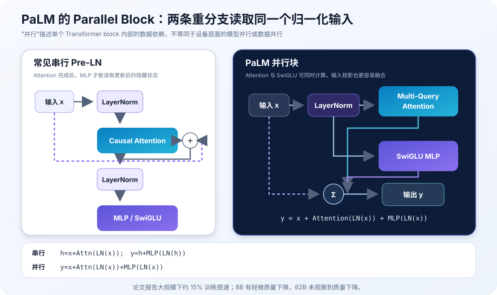
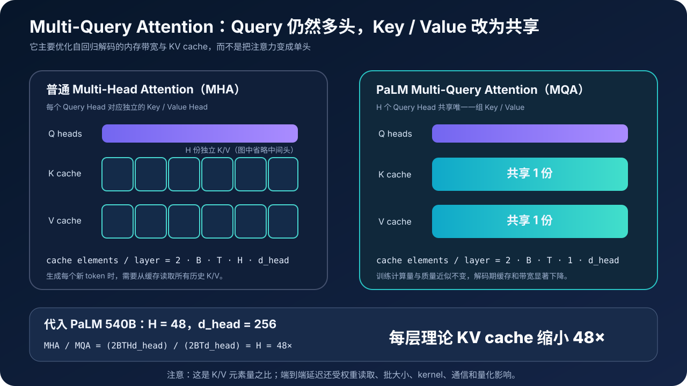
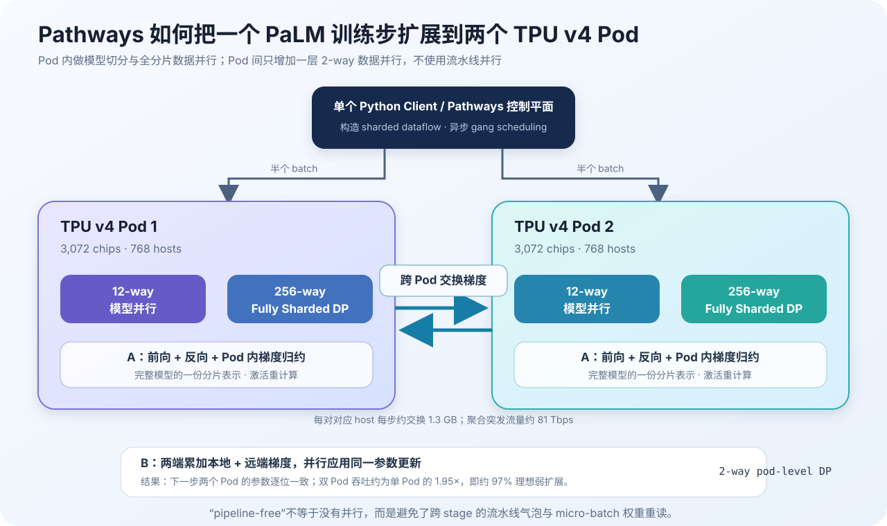

# PaLM 原理与代码：540B 稠密 Transformer 如何借 Pathways 扩展到 6144 枚 TPU


> **论文**：[PaLM: Scaling Language Modeling with Pathways](https://arxiv.org/abs/2204.02311)<br>
> **作者**：Aakanksha Chowdhery、Sharan Narang、Jacob Devlin 等<br>
> **发布时间**：2022 年 4 月，修订版 v5 发布于 2022 年 10 月<br>
> **关键词**：Dense Transformer、Pathways、SwiGLU、Multi-Query Attention、RoPE、Few-shot Learning、Scaling

## 0. 先说结论

PaLM（Pathways Language Model）不是一种脱离 Transformer 的新网络。它是一项把三种规模同时推到当时前沿的工作：

- **模型规模**：540.35B 参数的稠密 decoder-only Transformer；
- **数据规模**：780B token，覆盖自然语言、对话、书籍、代码、百科与新闻；
- **系统规模**：借助 Pathways 在两个 TPU v4 Pod、共 6144 枚芯片上训练。

“稠密”意味着每个 token 都会经过全部 Transformer 层与参数。PaLM 不是 MoE，`Pathways` 也不是专家路由器；它是负责跨加速器、跨 Pod 编排计算与通信的分布式系统。

PaLM 的主干仍然是标准自回归语言模型：

$$
p_\theta(x_1,\ldots,x_T)
=
\prod_{t=1}^{T}p_\theta(x_t\mid x_{<t})
$$

但“架构没有换范式”不等于“结构毫无创新”。论文对 decoder block 做了六项重要改造：

1. 用 **SwiGLU** 取代普通 ReLU / GELU MLP；
2. 让 Attention 与 MLP 从同一个归一化输入**并行计算**；
3. 用 **Multi-Query Attention（MQA）** 让所有 Query Head 共享一组 K/V；
4. 用 **RoPE** 编码位置；
5. 共享输入 embedding 与输出投影矩阵；
6. 去掉 dense kernel 与 LayerNorm 中的 bias。

论文真正有价值的地方可以概括成三层：

| 层次 | 关键问题 | PaLM 的回答 |
|---|---|---|
| 模型 | 怎样让 540B 稠密模型保持可训练、可解码？ | Parallel Block、SwiGLU、MQA、RoPE、无 bias、z-loss |
| 系统 | 怎样跨两个 TPU Pod 高效训练同一个模型？ | Pod 内二维切分，Pod 间数据并行，不使用流水线并行 |
| 能力 | 继续扩大规模还能得到什么？ | 少样本 NLP、BIG-bench、推理、代码和多语言能力继续提升 |

PaLM 540B 的几个代表数字是：

| 项目 | 论文报告值 |
|---|---:|
| 参数量 | 540.35B |
| 层数 | 118 |
| 训练 token | 780B |
| 上下文长度 | 2048 |
| TPU v4 芯片 | 6144 |
| 模型训练 FLOPs（不含额外重计算） | $2.56\times10^{24}$ FLOPs |
| Model FLOPs Utilization（MFU） | 46.2% |
| Hardware FLOPs Utilization（HFU） | 57.8% |
| 末期训练吞吐 | 238.3K token/s |

不过，读这篇论文时必须同时保留四个限定：

1. **PaLM 540B 是基础预训练模型，不是指令微调或 RLHF 聊天模型。**
2. **推理突破不只来自参数量，还依赖 Chain-of-Thought（CoT）prompting。**
3. **“涌现”来自有限规模点和具体指标上的观测，不是已经解释清楚的相变机制。**
4. **论文证明了 frontier capability 可以继续随规模增长，不代表 540B/780B 是固定算力下的最优参数—数据配比。**

一句话记忆：

> PaLM 的意义不只是“又把参数做大了”，而是证明一个经过工程化改造的稠密 Transformer，可以被 Pathways 高效扩展到跨 Pod 训练，并在广泛任务上把规模转化成新的 few-shot 能力。

---

## 1. PaLM 到底在回答什么问题

GPT-3 已经展示了大模型的 in-context learning：只在 prompt 中给几个例子，不更新参数，模型也能完成新任务。

PaLM 接着追问三个问题：

### 1.1 能力是否已经饱和

如果把模型从几十亿、几百亿继续扩大到五千多亿参数：

- 常规 NLP benchmark 是否仍然提升？
- 数学与常识推理能否跨过新的门槛？
- 少量代码数据能否形成可观的代码能力？
- 多语言能力是否也会随规模扩展？

为减少架构和数据差异的干扰，论文训练了同一家族的三个规模：8B、62B、540B。它们使用相同数据、词表和训练方法，主要改变模型宽度、深度与 batch size。

### 1.2 一个 540B 稠密模型能否高效训练

540B 参数不只是显存容量问题。一次训练步还涉及：

- 参数、优化器状态、梯度和激活怎样切分；
- 跨 6144 枚芯片怎样同步；
- 跨数据中心网络怎样交换梯度；
- 怎样避免流水线气泡；
- 怎样在故障或 loss spike 后精确恢复；
- 怎样让巨大矩阵乘真正吃满硬件。

所以 PaLM 同时是一篇模型能力论文和一篇大规模训练工程论文。

### 1.3 架构怎样为训练与推理解耦优化

训练阶段关心大矩阵乘吞吐、激活显存与通信；自回归解码则经常受 KV cache 和内存带宽限制。

PaLM 的 Parallel Block 主要服务训练效率，MQA 主要服务解码效率，z-loss 与无 bias 主要服务稳定性。把这些改动放回各自瓶颈，才不会把它们误读成一组随意堆叠的“现代 LLM 配方”。

---

## 2. 先分清 PaLM、Pathways 与 PaLM-Coder

### 2.1 PaLM 是模型

PaLM 是一个：

```text
decoder-only
+ causal self-attention
+ dense parameters
+ next-token prediction
```

的语言模型家族。

`PaLM 8B / 62B / 540B` 是同一家族的三个规模点。

### 2.2 Pathways 是系统

Pathways 是大规模加速器编排层。它负责：

- 表达分片数据流图；
- 把计算发往远端 TPU Pod；
- gang-schedule 大量加速器；
- 协调跨 Pod 数据传输；
- 让一个 Python 客户端管理异步控制流。

因此下面这句话是错的：

> PaLM 名字里有 Pathways，所以它是按 token 选择不同 pathway 的 MoE。

正确关系是：

```text
PaLM（稠密语言模型）
    运行在
Pathways（分布式执行与编排系统）
    管理的
TPU v4 Pods（硬件集群）
```

### 2.3 PaLM-Coder 是后续代码微调版本

原始 PaLM 已经在 780B token 中见过 39B 代码 token。论文随后又对模型进行两阶段代码微调，得到 PaLM-Coder。

因此，引用代码成绩时要区分：

- `PaLM 540B`：只做通用预训练；
- `PaLM-Coder 540B`：在额外代码数据上继续微调。

把 PaLM-Coder 的 88.4% HumanEval pass@100 当成基础 PaLM 的成绩，会高估纯预训练模型。

---

## 3. 训练目标：简单的自回归目标，加一个稳定 softmax 的 z-loss

### 3.1 标准 next-token loss

给定 token 序列：

$$
x=(x_1,x_2,\ldots,x_T)
$$

causal decoder 在位置 $t$ 只能读取 $x_{\le t}$，用位置 $t$ 的隐藏状态预测 $x_{t+1}$：

$$
\mathcal{L}_{\mathrm{NLL}}
=
-\frac{1}{T-1}
\sum_{t=1}^{T-1}
\log p_\theta(x_{t+1}\mid x_{\le t})
$$

若位置 $t$ 的词表 logits 是 $z_t\in\mathbb{R}^{|V|}$：

$$
p_\theta(x_{t+1}=v\mid x_{\le t})
=
\frac{e^{z_{t,v}}}{\sum_{u\in V}e^{z_{t,u}}}
$$

这和 GPT 类模型的预训练目标没有本质区别。

### 3.2 为什么还要 z-loss

softmax 对给所有 logit 同时加常数不敏感：

$$
\operatorname{softmax}(z+c\mathbf 1)
=
\operatorname{softmax}(z)
$$

所以仅靠交叉熵，不会强约束 logits 的整体平移。极大规模、低精度训练时，softmax normalizer 过大可能增加数值风险。

定义：

$$
\log Z_t
=
\log\sum_{v\in V}e^{z_{t,v}}
$$

PaLM 增加：

$$
\boxed{
\mathcal{L}_{z}
=
10^{-4}\cdot
\frac{1}{T-1}
\sum_{t=1}^{T-1}(\log Z_t)^2
}
$$

总损失为：

$$
\mathcal{L}
=
\mathcal{L}_{\mathrm{NLL}}+\mathcal{L}_{z}
$$

z-loss 的目的不是让概率分布更均匀，而是鼓励 softmax normalizer 的对数接近 0，限制 logits 无意义地整体漂移。

---

## 4. 模型规模：三个点不只是把同一配置乘一个常数

论文的核心配置如下：

| 模型 | 层数 $L$ | Query Heads $H$ | $d_{model}$ | $d_{head}$ | $d_{ff}$ | 参数量 | batch size（序列数） |
|---|---:|---:|---:|---:|---:|---:|---:|
| PaLM 8B | 32 | 16 | 4096 | 256 | 16384 | 8.63B | 256 → 512 |
| PaLM 62B | 64 | 32 | 8192 | 256 | 32768 | 62.50B | 512 → 1024 |
| PaLM 540B | 118 | 48 | 18432 | 256 | 73728 | 540.35B | 512 → 1024 → 2048 |

所有模型都满足：

$$
d_{ff}=4d_{model},\qquad d_{head}=256
$$

但 PaLM 540B 有一个容易忽略的细节：

$$
H\cdot d_{head}
=
48\times256
=
12288
\ne
d_{model}=18432
$$

也就是说，注意力内部宽度不必等于模型隐藏宽度。实现时应该把：

```python
attention_width = n_heads * head_dim
```

作为独立维度，而不是强制断言 `d_model == n_heads * head_dim`。

---

## 5. Parallel Transformer Block：把串行依赖改成两条并行支路



### 5.1 标准 Pre-LN 块

常见串行写法是：

$$
\begin{aligned}
h &= x+\operatorname{Attention}(\operatorname{LN}(x))\\
y &= h+\operatorname{MLP}(\operatorname{LN}(h))
\end{aligned}
$$

MLP 依赖 Attention 的输出 $h$，所以两条重计算支路不能同时启动。

### 5.2 PaLM 的并行写法

PaLM 改为：

$$
\boxed{
y
=
x
+\operatorname{Attention}(\operatorname{LN}(x))
+\operatorname{MLP}(\operatorname{LN}(x))
}
$$

两条支路读取同一个 `LN(x)`：

```python
normalized = norm(x)
y = x + attention(normalized) + mlp(normalized)
```

这带来两个系统收益：

- Attention 与 MLP 不再有前后依赖，可以并发调度；
- 两条支路的输入矩阵乘更容易被 XLA 融合成更大的计算。

论文报告，在大规模下该改动带来约 **15% 的训练提速**。

但质量结论要准确表述：

- 8B 消融中观察到轻微质量下降；
- 62B 消融中未观察到质量下降；
- 作者据此外推 540B 上应当质量中性。

所以 Parallel Block 首先是吞吐优化，不是一个被证明“总能提升精度”的结构。

### 5.3 为什么只做一次归一化

两条支路共享归一化结果，减少了依赖深度，也让残差路径很清楚：

$$
\frac{\partial y}{\partial x}
=
I
+
\frac{\partial \operatorname{Attention}(\operatorname{LN}(x))}{\partial x}
+
\frac{\partial \operatorname{MLP}(\operatorname{LN}(x))}{\partial x}
$$

恒等残差仍然存在。并行结构改变的是 block 内的信息混合顺序，而不是取消残差连接。

---

## 6. SwiGLU：MLP 不再只有一条激活路径

普通两层 MLP 可以写成：

$$
\operatorname{MLP}(x)
=
\phi(xW_1)W_2
$$

SwiGLU 使用两条输入投影：

$$
\boxed{
\operatorname{SwiGLU}(x)
=
\left(\operatorname{SiLU}(xW_g)\odot xW_v\right)W_o
}
$$

其中：

$$
\operatorname{SiLU}(u)=u\,\sigma(u)
$$

可以把两条支路理解为：

- $xW_g$ 产生一个平滑、数据相关的门；
- $xW_v$ 产生待传递的内容；
- 逐元素乘法决定每个中间通道传递多少信息。

最小实现是：

```python
def forward(self, x):
    gate = F.silu(self.gate_proj(x))
    value = self.value_proj(x)
    return self.out_proj(gate * value)
```

SwiGLU 比普通两矩阵 MLP 多一个输入投影。比较不同实现时不能只看 `d_ff`，还要看：

- 中间宽度；
- 三个矩阵的实际形状；
- 是否按相同参数量或相同 FLOPs 对齐。

PaLM 的表格明确给出 $d_{ff}=4d_{model}$，因此不要直接套用后来 LLaMA 系列为维持参数量而缩小 SwiGLU 中间维度的经验值。

---

## 7. Multi-Query Attention：用共享 K/V 换取更轻的自回归解码



### 7.1 普通多头注意力

普通 Multi-Head Attention（MHA）对每个 head 都投影 Q、K、V：

$$
Q\in\mathbb{R}^{B\times H\times T\times d_h}
$$

$$
K,V\in\mathbb{R}^{B\times H\times T\times d_h}
$$

每个 head 的注意力是：

$$
A_h
=
\operatorname{softmax}
\left(
\frac{Q_hK_h^\top}{\sqrt{d_h}}+M
\right)
$$

$$
O_h=A_hV_h
$$

其中 $M$ 是 causal mask。

### 7.2 MQA 共享 K/V

PaLM 保留 $H$ 个 Query Head：

$$
Q\in\mathbb{R}^{B\times H\times T\times d_h}
$$

但只产生一组 K/V：

$$
K,V\in\mathbb{R}^{B\times 1\times T\times d_h}
$$

计算时沿 head 维广播：

$$
A_h
=
\operatorname{softmax}
\left(
\frac{Q_hK^\top}{\sqrt{d_h}}+M
\right),qquad
O_h=A_hV
$$

所以 MQA 不是“单头注意力”。不同 head 仍有不同的 $Q_h$，会产生不同注意力分布；共享的是被查询的 K/V 表示。

### 7.3 KV cache 为什么减少 $H$ 倍

自回归生成时，每层需要缓存历史 token 的 K/V。

MHA 的元素数：

$$
N_{\mathrm{MHA}}
=
2BTHd_h
$$

MQA 的元素数：

$$
N_{\mathrm{MQA}}
=
2BTd_h
$$

两者之比：

$$
\frac{N_{\mathrm{MHA}}}{N_{\mathrm{MQA}}}=H
$$

PaLM 540B 的 $H=48$，所以在相同 batch、序列长度、精度下，每层 K/V 元素量理论上缩小 48 倍。

端到端速度不会自动提升 48 倍，因为生成还要读取 540B 权重，并受 kernel、通信、batch size 和量化影响；但 MQA 明显降低了长上下文与大 batch 解码的缓存压力。

### 7.4 MQA、GQA 与 MHA 的关系

后来常见的 Grouped-Query Attention（GQA）位于两者之间：

| 结构 | Query Head 数 | KV Head 数 |
|---|---:|---:|
| MHA | $H$ | $H$ |
| GQA | $H$ | $1<G<H$ |
| MQA | $H$ | $1$ |

PaLM 原论文用的是 MQA，不应写成 GQA。

---

## 8. RoPE、权重绑定、无 bias 与 lossless vocabulary

### 8.1 RoPE：把位置变成 Q/K 的旋转

PaLM 不使用 learned absolute position embedding，而是在每层注意力中对 Q/K 施加旋转位置编码。

对二维通道对，位置 $m$ 的旋转为：

$$
R_m(\theta)
=
\begin{bmatrix}
\cos(m\theta)&-\sin(m\theta)\\
\sin(m\theta)&\cos(m\theta)
\end{bmatrix}
$$

$$
q_m'=R_mq_m,\qquad k_n'=R_nk_n
$$

点积满足：

$$
(q_m')^\top k_n'
=
q_m^\top R_{n-m}k_n
$$

所以注意力分数自然带有相对位置 $n-m$。

RoPE 的完整推导和独立实现见：

- [RoFormer / RoPE 原理与代码](./09_RoFormer_RoPE_2021_原理.md)
- [可运行的 RoPE 最小实现](./code/rope_minimal.py)

### 8.2 输入输出 embedding 共享

设词表矩阵：

$$
E\in\mathbb{R}^{|V|\times d_{model}}
$$

输入 token $x_t$ 的向量为：

$$
h_t^{(0)}=E[x_t]
$$

输出 logits 复用同一个矩阵：

$$
z_t
=
\frac{h_t^{(L)}E^\top}{\sqrt{d_{model}}}
$$

论文说明输入 embedding 初始化为 $\mathcal{N}(0,1)$，且 embedding 前没有 LayerNorm；因此在 pre-softmax 处除以 $\sqrt{d_{model}}$。

权重绑定的收益包括：

- 少保存一份 $|V|\times d_{model}$ 大矩阵；
- 输入与输出 token 表示处于同一几何空间；
- 256K 大词表下节省尤其明显。

### 8.3 去掉 bias

论文在所有 dense kernel 和 LayerNorm 中都不使用 bias，并报告这改善了大模型训练稳定性。

这里要避免一个实现层误区：论文正文写的是 `LayerNorm`，并只明确“没有 bias”。如果目标是严格复现论文披露的计算，应实现 scale-only LayerNorm；不要因为后续模型常用 RMSNorm 就不加说明地替换，因为二者是否减去均值不同。

### 8.4 256K lossless SentencePiece 词表

PaLM 的 tokenizer 面向多语言和代码做了三项关键设计：

- 256K token，减少多语言文本被过度切碎；
- 完整保留空白符，代码缩进和布局不会丢失；
- 未登录 Unicode 字符回退到 UTF-8 byte token；
- 数字始终按单个 digit 切分。

例如：

```text
123.5 → 1 2 3 . 5
```

“lossless”在这里表示 token 序列可以无损还原原始文本，不是说 tokenizer 没有任何压缩或分词偏差。

---

## 9. 可运行源码：一个小型 PaLM-style decoder

完整代码：

- [palm_minimal.py](./code/palm_minimal.py)

它不是 Google 的 PaLM 源码，也不复现 Pathways；它以可审阅方式实现论文披露的核心计算：

```text
token embedding
    ↓
[ bias-free LN
    ├── RoPE + causal MQA ──┐
    └── SwiGLU MLP ─────────┤ + residual ] × L
    ↓
final bias-free LN
    ↓
tied embedding projection / sqrt(d_model)
    ↓
cross entropy + z-loss
```

### 9.1 配置必须允许注意力宽度独立于 $d_{model}$

```python
@dataclass(frozen=True)
class PaLMConfig:
    vocab_size: int = 256
    d_model: int = 64
    d_ff: int = 256
    n_layers: int = 2
    n_heads: int = 4
    head_dim: int = 16
```

注意力输出宽度单独计算：

```python
attention_width = config.n_heads * config.head_dim
self.q_proj = nn.Linear(config.d_model, attention_width, bias=False)
self.k_proj = nn.Linear(config.d_model, config.head_dim, bias=False)
self.v_proj = nn.Linear(config.d_model, config.head_dim, bias=False)
```

K/V 只投影到一个 `head_dim`，这正是 MQA 与普通 MHA 的结构差异。

### 9.2 Q、K、V 的形状是最好的单元测试

```python
q = q_proj(x).view(B, T, H, Dh).transpose(1, 2)
k = k_proj(x).view(B, T, 1, Dh).transpose(1, 2)
v = v_proj(x).view(B, T, 1, Dh).transpose(1, 2)
```

对应：

```text
q: [B, H, T, Dh]
k: [B, 1, T, Dh]
v: [B, 1, T, Dh]
```

如果 K/V 也是 `[B, H, T, Dh]`，实现的就是 MHA，不是 PaLM 的 MQA。

### 9.3 Parallel Block

```python
class ParallelPaLMBlock(nn.Module):
    def forward(self, x):
        normalized = self.norm(x)
        return x + self.attention(normalized) + self.mlp(normalized)
```

这个实现特意没有写成两个连续的 residual block，从代码数据依赖上保留论文的并行语义。

### 9.4 权重绑定与 z-loss

没有单独的 `lm_head.weight`：

```python
logits = F.linear(hidden, self.token_embedding.weight)
logits = logits / math.sqrt(config.d_model)
```

训练目标：

```python
nll = F.cross_entropy(
    logits[:, :-1].reshape(-1, config.vocab_size),
    token_ids[:, 1:].reshape(-1),
)
log_z = torch.logsumexp(logits[:, :-1].float(), dim=-1)
z_loss = config.z_loss_weight * log_z.square().mean()
loss = nll + z_loss
```

### 9.5 源码自检了什么

脚本内置检查包括：

- logits 形状正确；
- 所有 Linear 与归一化层没有 bias 参数；
- Q 有多头而 K/V 只有一个头；
- 修改未来 token 不会改变更早位置的 logits；
- NLL 与 z-loss 都是有限值，反向梯度有限；
- PaLM 540B 配置下 MQA 每层 KV 元素量是 MHA 的 $1/48$。

安装 PyTorch 后运行：

```bash
python3 papers/to-2026/code/palm_minimal.py
```

预期输出形如：

```text
All tiny PaLM checks passed.
logits: (2, 12, 256); parameters: ...
loss=... (nll=..., z=...)
PaLM-540B-style MQA cache reduction per layer: 48x
```

这个 toy 实现有意省略：

- SentencePiece 训练与真实 256K 词表；
- Adafactor 参数缩放；
- bf16 / 混合精度策略；
- 激活重计算与分片；
- fused kernel 与 XLA 编译；
- KV cache 增量解码接口；
- Pathways 的跨 Pod 执行。

它复现的是数学结构，不声称复现 540B 的系统性能或论文分数。

---

## 10. 训练数据：780B token 如何组成

论文的数据混合如下：

| 数据源 | 比例 | 约合 token |
|---|---:|---:|
| 多语言社交媒体对话 | 50% | 390B |
| 多语言过滤网页 | 27% | 210.6B |
| 英文书籍 | 13% | 101.4B |
| GitHub 代码 | 5% | 39B |
| 多语言 Wikipedia | 4% | 31.2B |
| 英文新闻 | 1% | 7.8B |

总计：

$$
D=780\text{B tokens}
$$

训练混合包含 124 种语言，英文约占 78%，非英文约占 22%。

### 10.1 网页不是简单全量抓取

网页会由质量分类器打分，再按质量分数采样：

- 高质量页面更可能进入训练；
- 低质量页面不是一刀切全部删除；
- 数据配比还要避免某些子语料在 780B 之前重复。

### 10.2 代码数据的处理

GitHub 代码：

- 限制为 24 种常见编程语言；
- 按仓库许可证过滤，排除 copyleft license；
- 通过文件间 Levenshtein distance 去重；
- 原始处理后约 196GB，tokenizer 后在训练混合中贡献 39B token。

许可证过滤只能回答“论文选择了哪些仓库”，不能自动消除代码归属、近重复、隐私和生成内容合规问题。

### 10.3 一次 epoch 的精确含义

三个 PaLM 模型都对这份打乱后的 780B token 数据训练一次。这里的“一次”是论文构造数据混合后的一个 epoch，不代表互联网原始内容没有近重复或模板重复。

训练样本会拼接并切成恰好 2048 token 的序列：

```text
document A <eod> document B <eod> document C ...
         ↓ concatenate + chunk
[2048 tokens][2048 tokens][2048 tokens]...
```

没有 padding，但文档可能在 chunk 中间被截断；`[eod]` 用来标识文档边界。

---

## 11. 优化配置：稳定跑完比写出 forward 更难

### 11.1 初始化

除 embedding 与 LayerNorm scale 外，kernel 使用 fan-in variance scaling：

$$
W\sim\mathcal{N}\left(0,\frac{1}{\sqrt{n_{in}}}\right)
$$

论文原文的记号表达的是标准差随 $1/\sqrt{n_{in}}$ 缩放。

输入 embedding 则初始化为：

$$
E\sim\mathcal{N}(0,1)
$$

### 11.2 Adafactor，但不做矩阵因子分解

PaLM 使用 Adafactor optimizer，关闭 factorization。其效果近似带 parameter scaling 的 Adam：不同参数矩阵的有效学习率会根据参数 RMS 调整。

关键超参数：

| 项目 | 配置 |
|---|---:|
| 前 10K step 学习率 | $10^{-2}$ |
| 之后衰减 | $1/\sqrt{k}$ |
| $\beta_1$ | 0.9 |
| $\beta_2$ | $1-k^{-0.8}$ |
| global gradient clipping | 1.0 |
| dynamic weight decay | $lr^2$ |
| dropout | 预训练时 0 |
| z-loss 系数 | $10^{-4}$ |

动态 $\beta_2$ 的动机是：稀有 token 的 embedding 梯度出现频率低，过短的二阶矩窗口可能估计很差。

### 11.3 batch size 随训练增大

PaLM 540B 的 batch schedule：

| step 区间 | 序列数 | 每步 token |
|---|---:|---:|
| 0 ～ 50K | 512 | 1,048,576 |
| 50K ～ 115K | 1024 | 2,097,152 |
| 115K ～ 255K | 2048 | 4,194,304 |

设计理由有两层：

- 训练早期小 batch 的 sample efficiency 更好；
- 训练后期大 batch 梯度估计更稳定，也形成更大的矩阵乘，提升 TPU 利用率。

这不是一个简单的“batch 越大越好”结论，而是样本效率与硬件效率的阶段性权衡。

### 11.4 bitwise determinism

PaLM 训练支持从 checkpoint 逐位确定性恢复。若从 step 15,000 重启，到 17,000 的结果应与原运行逐位相同。

它依赖：

- JAX + XLA + T5X 的确定性建模；
- 随机访问的数据格式；
- batch 内容只由 global step 决定。

大规模训练中，确定性不只是“方便复现实验”，还是排查偶发 loss spike、通信问题与数据问题的工程工具。

### 11.5 loss spike：论文没有假装问题已经解决

540B 训练中大约观察到 20 次不规则 loss spike，小模型没有同样现象。gradient clipping 也未能完全阻止。

论文采用的应急策略是：

1. 回滚到 spike 前约 100 step 的 checkpoint；
2. 跳过覆盖 spike 前后的约 200～500 个 batch；
3. 从新位置继续训练。

同一批数据从更早的不同模型状态开始训练时并不会必然触发 spike，因此作者判断它不是单纯的“坏 batch”，而更可能是特定参数状态与特定 batch 的组合。

这项处理有效，但不是原理完备的稳定性算法。论文也明确把更系统的 mitigation 留作未来工作。

---

## 12. Pathways 并行：6144 枚 TPU 上没有使用流水线



### 12.1 Pod 内：12-way 模型并行 × 256-way FSDP

每个 TPU v4 Pod 有：

$$
3072=12\times256
$$

枚芯片。

每个 Pod 在逻辑上包含一份完整模型，但每个权重张量被分到 3072 枚芯片：

- 12-way model parallelism；
- 256-way fully sharded data parallelism。

前向时沿数据并行轴 all-gather 当前计算所需权重；每层只保留一份全分片激活。反向时重新计算其余激活，以计算换显存。

### 12.2 Pod 间：2-way 数据并行

两个 Pod 分别处理一半 batch：

$$
\mathcal{B}=\mathcal{B}_1\cup\mathcal{B}_2
$$

各自完成前向、反向和 Pod 内归约：

$$
g_1=\nabla_\theta\mathcal{L}(\mathcal{B}_1),\qquad
g_2=\nabla_\theta\mathcal{L}(\mathcal{B}_2)
$$

然后跨 Pod 交换梯度并求和：

$$
g=g_1+g_2
$$

两个 Pod 并行应用同一个更新：

$$
\theta_{k+1}=\operatorname{Update}(\theta_k,g)
$$

得到逐位相同的下一步参数。

### 12.3 为什么不使用 pipeline parallelism

流水线把层切成多个 stage，再把 batch 切成 micro-batch。它能降低跨慢网络的通信频率，但有代价：

- 填充和排空流水线产生 bubble；
- 不同 stage 会阶段性空闲；
- 每个 micro-batch 可能重新从显存读取权重；
- 调度和故障恢复更复杂。

PaLM 依靠足够大的张量切分、全分片数据并行和 Pod 级数据并行，避免了跨层流水线。

“没有 pipeline”绝不等于“没有模型并行”。它只是说明模型没有被按连续层切成需要前后传递 micro-batch 的 stage。

### 12.4 跨 Pod 梯度是突发通信

论文报告：

- 对应 host 间每 step 交换约 1.3GB 梯度；
- 1536 个 host 同时通信，聚合 burst 约 81Tbps；
- 通过把传输拆成更小 chunk、分散到多条网络流，缓解拥塞。

双 Pod 吞吐达到单 Pod 的约 1.95 倍：

$$
\text{weak scaling efficiency}
=
\frac{1.95}{2}
\approx97.5\%
$$

论文取整表述为 97% 理想弱扩展。

---

## 13. MFU 与 HFU：57.8% 不是应该直接引用的唯一效率数字

### 13.1 Model FLOPs Utilization

MFU 只统计模型算法本身需要的前向与反向 FLOPs，不把 activation rematerialization 等实现额外计算算进“有用工作”。

对 $N$ 参数的 dense decoder，忽略注意力二次项时：

$$
\text{model FLOPs/token}\approx6N
$$

更完整地加入 dense self-attention：

$$
F_{token}
\approx
6N+12LHQT
$$

其中：

- $L$：层数；
- $H$：head 数；
- $Q=d_{head}$；
- $T$：序列长度。

若观测吞吐为 $R$ token/s，集群峰值为 $P$ FLOP/s：

$$
\boxed{
\mathrm{MFU}
=
\frac{R(6N+12LHQT)}{P}
}
$$

PaLM 540B 报告：

$$
\mathrm{MFU}=46.2\%
$$

### 13.2 Hardware FLOPs Utilization

HFU 会把硬件实际执行的重计算也计入分子。PaLM 540B 为增大可行 batch 而做 activation rematerialization，因此执行了额外 FLOPs：

$$
\mathrm{HFU}=57.8\%
$$

HFU 更高不必然代表训练更好：无意义地重算也能让硬件“很忙”。跨系统比较模型训练效率时，MFU 通常更接近“多少峰值算力转化为模型必须完成的计算”。

### 13.3 与当时系统的论文内比较

| 模型 | 硬件 | 论文重算的 MFU |
|---|---|---:|
| GPT-3 175B | V100 | 21.3% |
| Gopher 280B | 4096 TPU v3 | 32.5% |
| Megatron-Turing NLG 530B | 2240 A100 | 30.2% |
| PaLM 540B | 6144 TPU v4 | 46.2% |

这些数字来自论文按统一定义重算，但仍受公开吞吐口径、模型结构和硬件峰值定义影响，适合历史比较，不适合脱离上下文当成永久排行榜。

---

## 14. 训练成本与环境报告

论文附录给出的训练量：

| 模型 | 每 token TFLOPs（模型） | 每 token TFLOPs（含重计算） | 总模型训练 FLOPs（不含额外重计算） |
|---|---:|---:|---:|
| 8B | 0.0550 | 0.0561 | $4.29\times10^{22}$ |
| 62B | 0.388 | 0.392 | $3.08\times10^{23}$ |
| 540B | 3.28 | 4.10 | $2.56\times10^{24}$ |

对 540B，用简单估算：

$$
6ND
=
6\times540\times10^9\times780\times10^9
\approx
2.53\times10^{24}
$$

这和附录报告的 $2.56\times10^{24}$ 主模型 FLOPs 口径一致：后者计入 dense attention，但不把 rematerialization 当成模型必需计算。若用论文给出的含重计算 `4.10 TFLOPs/token` 乘以 780B token，可估得硬件实际执行约：

$$
4.10\times10^{12}\times780\times10^9
\approx3.20\times10^{24}\ \text{FLOPs}
$$

这也解释了为什么计入重计算的 HFU 会高于 MFU。

论文还报告 PaLM 540B：

- 在 6144 枚 TPU v4 上训练约 1200 小时；
- 另有 3072 枚 TPU v4 上的 336 小时，包括停机与重复步骤；
- 按当时数据中心能源结构估算净排放为 271.43 tCO2e。

这些是论文针对特定地点、PUE、碳强度与核算边界给出的历史数字，不应直接换算为另一集群、另一电网或今天硬件上的排放。

---

## 15. 结果怎样读：规模有效，但不同能力不是同一种证据

### 15.1 29 项英文 NLP

论文比较了 open-domain QA、cloze、Winograd、常识推理、阅读理解、SuperGLUE 和 NLI 等 29 项任务。

PaLM 540B：

- 1-shot 在 24/29 项超过此前单 checkpoint 预训练模型最好结果；
- few-shot 在 28/29 项超过此前最好结果。

这个比较排除了 instruction-tuned、多任务适配和专门 finetune 模型，回答的是：

> 同属通用预训练语言模型时，更大的 PaLM 能否成为更强 few-shot learner？

它不能直接证明 PaLM 比所有专用系统都强。

### 15.2 BIG-bench 与“不连续提升”

论文在 150 个 BIG-bench 文本任务上比较 8B、62B、540B，并称约 25% 任务在 62B → 540B 时出现远大于 8B → 62B 的跃升。

例如 BIG-bench Lite 的 `code line description`：

| PaLM 规模 | 分数 |
|---|---:|
| 8B | 15.0 |
| 62B | 26.7 |
| 540B | 90.0 |

`repeat copy logic`：

| PaLM 规模 | 分数 |
|---|---:|
| 8B | 6.2 |
| 62B | 15.6 |
| 540B | 53.1 |

这些结果是“涌现能力”讨论的重要来源，但要谨慎解释：

- 只有三个主要规模点，无法定位连续曲线的真实形状；
- accuracy、exact match 等离散指标可能把平滑概率改善显示成门槛跳变；
- prompt、shot 数和答案解析都会改变曲线；
- benchmark 聚合分数不等于一个统一的认知能力变量。

因此，更严谨的结论是：

> 在这些任务、prompt 与指标上，PaLM 观察到部分能力随规模呈明显非线性增长；论文没有证明神经网络内部发生了可识别的物理相变。

### 15.3 “超过平均人类”也要看聚合口径

PaLM 540B 5-shot 在 150 项 BIG-bench 的归一化平均分上超过平均人类分数，但：

- 在 BIG-bench Lite 的 24 项任务中，只在 3 项超过最佳人类分数；
- 不同任务使用各自 preferred metric，再做归一化平均；
- 平均人类与最佳人类是不同基线。

所以不能把它改写成“PaLM 在 BIG-bench 上全面超过人类”。

---

## 16. 推理能力：规模与 CoT 是联合变量

PaLM 的推理结果与 [Chain-of-Thought](./11_Chain_of_Thought_2022_原理.md) 紧密相关。

few-shot CoT prompt 给出：

```text
Q: Roger 有 5 个球，又买了 2 罐，每罐 3 个。现在有几个？
A: 2 罐共有 2×3=6 个；5+6=11。答案是 11。

Q: ...
A:
```

模型不是直接输出数字，而是先生成中间步骤，再输出答案。

论文 v5 在 GSM8K 上的汇总：

| 模型与方法 | 准确率 |
|---|---:|
| PaLM 540B，无 CoT | 17% |
| PaLM 62B + CoT | 33% |
| PaLM 540B + CoT | 54% |
| PaLM 540B + CoT + calculator | 58% |
| 此前 finetune + CoT + calculator + verifier | 55% |

这张表说明：

$$
\text{Reasoning gain}
\ne
\text{Scale only}
$$

而更接近：

$$
\text{Reasoning gain}
=
f(\text{scale},\text{CoT prompt},\text{calculator},\text{evaluation})
$$

论文在 7 个推理数据集上，PaLM 540B + 8-shot CoT 在 GSM8K、MAWPS、SVAMP、StrategyQA 四项达到当时 SOTA，在另外三项接近 SOTA。

不能从这些结果推出：

- 所有推理都会随参数量突然出现；
- 模型生成的自然语言过程一定忠实反映内部计算；
- 写得像推理就一定正确；
- CoT 对小模型同样有效。

---

## 17. 代码能力：39B 代码 token 已经足以产生明显迁移

基础 PaLM 540B 在预训练中只把 5% 配比给 GitHub 代码，对应 39B token，其中 Python 约 2.7B token。

代表性结果：

| 模型 | HumanEval pass@1 | HumanEval pass@100 | MBPP pass@1 | MBPP pass@80 |
|---|---:|---:|---:|---:|
| PaLM 540B | 26.2 | 76.2 | 36.8 | 75.0 |
| PaLM-Coder 540B | 36.0 | 88.4 | 47.0 | 80.8 |

`pass@k` 的含义是：对每题生成 $k$ 个候选，只要至少一个通过测试，就算解决。

若每个独立样本通过概率为 $p$，理想化地：

$$
\operatorname{pass@k}
=
1-(1-p)^k
$$

因此 pass@100 与 pass@1 不是同一种产品体验：

- pass@1 更接近只生成一个答案；
- pass@100 衡量多次采样再配合测试筛选的覆盖能力；
- $k$ 增大带来更多推理成本，还需要可靠 verifier。

论文对 `k>1` 使用 nucleus sampling，$p=0.95$、temperature 0.8；pass@1 使用 greedy decoding。比较代码模型时必须对齐采样与 `k`。

---

## 18. 多语言能力：22% 非英文数据带来了迁移，但不是“语言公平”

训练语料包含 124 种语言，非英文约占 22%。PaLM 540B 在：

- 机器翻译；
- 多语言摘要；
- 多语言自然语言生成；
- 多语言问答；

上表现出显著 few-shot 能力。

但“覆盖 124 种语言”不能自动等价为：

- 每种语言的数据量足够；
- 每种语言 tokenizer 效率相同；
- 高资源与低资源语言质量相同；
- 安全和偏见评估覆盖所有语言；
- 英文结果可以外推到所有语言。

论文也明确承认需要进一步研究提高多语言占比对英文与非英文任务的共同影响。

---

## 19. 记忆、污染、偏见与毒性：规模不是只带来正收益

### 19.1 训练数据记忆随规模增加

论文随机取训练样本中的 100-token span：

1. 用前 50 token 提示模型；
2. greedy 生成后 50 token；
3. 检查是否与训练文本完全匹配。

结果：

| 模型 | 50-token continuation 完全复现率 |
|---|---:|
| PaLM 8B | 1.6% |
| PaLM 540B | 2.4% |

对 540B：

- 只在训练中出现一次的片段，记忆率约 0.75%；
- 出现超过 500 次的片段，记忆率超过 40%。

所以重复与模板化是记忆的重要驱动。文档级去重并不能消除 span 级重复，例如许可证、代码片段和自动生成模板。

### 19.2 benchmark contamination

论文没有只用“出现某个 n-gram 就算污染”的简单规则，而是区分：

- 整个任务文本从网页自动抽取，较可能污染；
- context 在网页上，但问题由标注者新写；
- 没有显著重叠。

29 项英文任务中有 10 项落入前两类；论文进一步按 8-gram 覆盖切 clean subset 比较。

结果没有显示污染是 PaLM 全部提升的唯一解释，但这不等于污染不存在。合理表述是：作者做了系统检查，部分任务确有重叠风险，clean/full 差异因任务而异。

### 19.3 偏见与毒性不会因准确率提升自动消失

论文在性别—职业共现、Winogender 和 RealToxicityPrompts 等维度评估：

- 部分 coreference 公平性指标随规模改善；
- 62B 与 540B 的整体生成毒性略高于 8B；
- 生成毒性与 prompt 毒性高度相关。

这说明扩大规模可能同时：

- 提升任务理解；
- 放大 prompt 风格跟随；
- 保留或重现语料中的社会偏见；
- 增加训练文本记忆与提取风险。

PaLM 论文提供了 model card，但基础模型未经完整产品化对齐，不能直接当安全助手部署。

---

## 20. PaLM 与 Chinchilla：frontier capability 不等于 compute-optimal

PaLM 与 Chinchilla 几乎同时出现，却回答不同问题：

| 论文 | 核心问题 |
|---|---|
| PaLM | 能否把稠密模型和训练系统推到 540B，并继续得到广泛能力增益？ |
| Chinchilla | 给定固定训练 FLOPs，参数量与 token 应怎样分配才能降低损失？ |

PaLM 540B 的 token / parameter 比为：

$$
\frac{D}{N}
=
\frac{780\text{B}}{540\text{B}}
\approx1.44
$$

这远低于后来常引用的 Chinchilla `约 20 token / parameter` 经验点。

因此从固定训练算力下的损失最优化看，PaLM 540B 是明显偏“大模型、少 token”的配置。但这不让 PaLM 结论失效，因为它的目标还包括：

- 探索此前未训练过的参数规模；
- 展示 Pathways 的跨 Pod 扩展；
- 研究模型规模对 few-shot 与涌现任务的影响；
- 在数据重复前完成同一 780B 混合的一次遍历。

论文修订版还把 PaLM 62B 继续训练到 1.325T token。使用刷新数据比重复旧子语料更好，且显著缩小与 540B 的差距；但在部分 few-shot benchmark 上并非单调提升，也没有完全追上训练 FLOPs 高约 5 倍的 540B。

这给出一个比“参数越大越好”更成熟的结论：

> 能力由参数、数据、训练计算、数据质量、优化和任务使用方式共同决定；只改变其中一个轴，无法概括所有 scaling 行为。

延伸阅读：

- [Scaling Laws 原理与代码](./06_Scaling_Laws_2020_原理.md)
- [Chinchilla 原理与代码](./12_Chinchilla_2022_原理.md)

---

## 21. 常见误解逐条纠正

### 误解 1：PaLM 是 MoE

错。PaLM 540B 是 **densely activated** Transformer，每个 token 使用全部层。名字里的 Pathways 指训练系统。

### 误解 2：Pathways 就是张量并行

不完整。PaLM Pod 内确实有模型并行和 FSDP，但 Pathways 还负责跨 Pod 控制、调度、数据流与梯度传输。

### 误解 3：PaLM 用了 pipeline parallelism

错。论文特别强调 6144 枚 TPU 上是 pipeline-free training。

### 误解 4：Parallel Block 等于设备并行

错。Parallel Block 是单层内部 Attention / MLP 的计算图并行；设备模型并行是权重怎样切到芯片，二者层次不同。

### 误解 5：MQA 只有一个注意力头

错。它有多个 Query Head，只共享一个 K Head 和一个 V Head。

### 误解 6：PaLM 的推理能力完全由 540B 参数自动产生

错。GSM8K 从无 CoT 的 17% 到 CoT 的 54%，提示方法是关键变量。

### 误解 7：PaLM 已经是 instruction-following chat model

错。原始 PaLM 是 next-token 预训练模型。Flan-PaLM 等指令微调工作发生在后续。

### 误解 8：57.8% 是 MFU

错。57.8% 是含重计算的 HFU；论文主张更适合跨系统比较的 MFU 是 46.2%。

### 误解 9：780B token 都是唯一内容

错。论文构造的混合按一次 epoch 训练，但网页、代码、许可证和模板仍可能存在近重复或 span 级重复。

### 误解 10：540B 是相同算力下的最优模型大小

错。PaLM 研究 frontier scaling；Chinchilla 研究固定 FLOPs 下的 compute-optimal allocation。

---

## 22. 如果今天复现一个 PaLM-style 小模型

完整复现 540B 不现实，但可以把复现目标分成四层。

### 22.1 数学结构层

必须实现：

- causal decoder；
- Parallel Block；
- SwiGLU；
- MQA；
- RoPE；
- tied embedding；
- bias-free normalization 与 Linear；
- cross-entropy + z-loss。

本文的 [palm_minimal.py](./code/palm_minimal.py) 覆盖这一层。

### 22.2 数据语义层

需要明确：

- tokenizer 是否保留 whitespace；
- byte fallback 怎样处理未知 Unicode；
- 文档是否以 EOD 分隔；
- packing 后 loss 是否跨文档边界继续预测；
- 去重发生在文档级还是片段级；
- 数据配比是否按 token 而非文件数。

### 22.3 训练稳定层

至少监控：

- NLL 与 z-loss 分量；
- logit RMS / max 与 $\log Z$；
- gradient global norm；
- 不同参数组的 update-to-weight ratio；
- 稀有 token embedding 的二阶矩；
- loss spike 前后的 batch 与 checkpoint。

### 22.4 系统效率层

不要只报告 GPU/TPU utilization。至少同时给出：

- token/s；
- sequence length 与 global batch token；
- 模型 FLOPs 估算口径；
- MFU；
- 是否 activation checkpointing / rematerialization；
- MHA/MQA/GQA 与 KV cache 配置；
- 通信与编译时间是否计入。

一个 1B 小模型的正确 forward，不会自动推出 540B 的稳定性和 scaling 结论；一个高 utilization 的 benchmark，也不会自动证明端到端训练效率高。

---

## 23. 面试与复习问题

### Q1：PaLM 最核心的架构改动是什么

SwiGLU、Parallel Block、MQA、RoPE、共享 input/output embedding、dense 与 LayerNorm 无 bias。

### Q2：Parallel Block 为什么可能更快

Attention 与 MLP 都读取 `LN(x)`，消除两条重分支之间的串行依赖，并允许输入矩阵乘融合。

### Q3：MQA 为什么对训练速度影响小，却对解码帮助大

训练时整个序列并行处理，大矩阵乘主导；自回归解码每步只产生一个 token，需要反复读取历史 K/V，内存带宽和缓存容量更关键。

### Q4：PaLM 540B 的 MQA KV cache 理论缩小多少

相对 48 个独立 KV head 的 MHA，每层 KV 元素量缩小 48 倍。

### Q5：Pathways 在 PaLM 中做了什么

一个客户端编排两个 TPU Pod；Pod 内是 12-way 模型并行 × 256-way 全分片数据并行，Pod 间是 2-way 数据并行并交换梯度。

### Q6：为什么 HFU 高于 MFU

HFU 把 activation rematerialization 等额外硬件运算也算作已使用 FLOPs，MFU 只把模型算法必须完成的 FLOPs 视为有效工作。

### Q7：PaLM 是否证明了推理只靠规模

没有。GSM8K 的关键结果来自规模与 CoT prompting 联合使用，外接计算器还会进一步改变成绩。

### Q8：PaLM 与 Chinchilla 是否冲突

不冲突。PaLM 证明 frontier scale 与系统扩展仍能带来能力，Chinchilla 讨论固定训练算力怎样分配给参数和 token。

---

## 24. 读论文时最值得精读的顺序

如果时间有限，建议按以下顺序：

1. **Section 2 Model Architecture**：六项结构改动；
2. **Section 4 Training Infrastructure**：Pod 内/Pod 间切分；
3. **Section 5 Training Setup**：优化器、z-loss、batch schedule、loss spike；
4. **Section 6.2 / 6.3 / 6.4**：BIG-bench、推理与代码；
5. **Section 7–10**：分析、记忆、污染、偏见与毒性；
6. **Section 13 Open Questions in Scaling**：与 Chinchilla、数据和推理成本的关系；
7. **Appendix B / F**：MFU 公式、总 FLOPs、训练更久的 62B。

读图表时始终检查：

- 0-shot、1-shot 还是 5/8-shot；
- greedy 还是 sampling；
- pass@1 还是 pass@100；
- 基础 PaLM 还是 PaLM-Coder；
- clean subset 还是完整 benchmark；
- MFU 还是 HFU；
- 论文 v1 还是包含长训实验的 v5。

---

## 25. 前置与后续阅读

前置：

- [Transformer 原理](./00_Transformer_2017_原理.md)
- [GPT-3 原理与代码](./05_GPT3_2020_原理.md)
- [Scaling Laws 原理与代码](./06_Scaling_Laws_2020_原理.md)
- [RoPE 原理与代码](./09_RoFormer_RoPE_2021_原理.md)
- [Chain-of-Thought 原理](./11_Chain_of_Thought_2022_原理.md)
- [Chinchilla 原理与代码](./12_Chinchilla_2022_原理.md)

后续：

- [FlashAttention 原理](./14_FlashAttention_2022_原理.md)
- [LLaMA 原理](./15_LLaMA_2023_原理.md)
- [Gemini 原理](./28_Gemini_2023_原理.md)
- [DeepSeek-R1 原理](./30_DeepSeek_R1_2025_原理.md)

---

## 26. 参考资料

1. [PaLM: Scaling Language Modeling with Pathways（arXiv v5）](https://arxiv.org/abs/2204.02311)
2. [PaLM 论文 PDF](https://arxiv.org/pdf/2204.02311)
3. [Google Research：Pathways Language Model (PaLM)](https://research.google/blog/pathways-language-model-palm-scaling-to-540-billion-parameters-for-breakthrough-performance/)
4. [Pathways: Asynchronous Distributed Dataflow for ML](https://arxiv.org/abs/2203.12533)
5. [Scaling Up Models and Data with T5X and SeqIO](https://arxiv.org/abs/2203.17189)
6. [GLU Variants Improve Transformer](https://arxiv.org/abs/2002.05202)
7. [Fast Transformer Decoding: One Write-Head is All You Need（Multi-Query Attention）](https://arxiv.org/abs/1911.02150)
8. [RoFormer: Enhanced Transformer with Rotary Position Embedding](https://arxiv.org/abs/2104.09864)
9. [Chain-of-Thought Prompting Elicits Reasoning in Large Language Models](https://arxiv.org/abs/2201.11903)
10. [Training Compute-Optimal Large Language Models](https://arxiv.org/abs/2203.15556)

---

## 27. 最终总结

PaLM 可以被压缩成四个公式。

自回归目标：

$$
p(x)=\prod_t p(x_t\mid x_{<t})
$$

并行 block：

$$
y=x+\operatorname{MQA}(\operatorname{LN}(x))
+\operatorname{SwiGLU}(\operatorname{LN}(x))
$$

稳定性目标：

$$
\mathcal{L}=\mathcal{L}_{\mathrm{NLL}}
+10^{-4}\,\mathbb{E}\left[(\log Z)^2\right]
$$

系统拓扑：

$$
6144
=
2\ \text{Pods}
\times
256\ \text{FSDP}
\times
12\ \text{model parallel}
$$

但 PaLM 最重要的认识不在某一个公式，而在端到端协同：

> 模型结构决定哪些计算值得做，分布式系统决定这些计算能否高效完成，数据与 prompting 决定规模最终表现成什么能力；任何一个轴都不能单独解释 PaLM。
