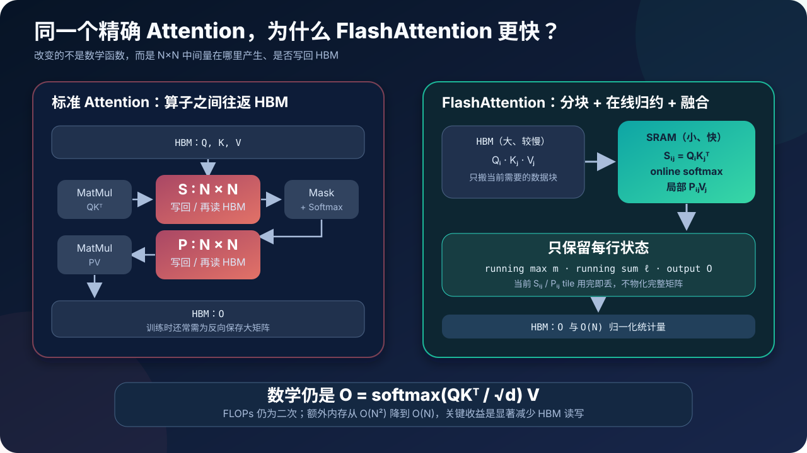
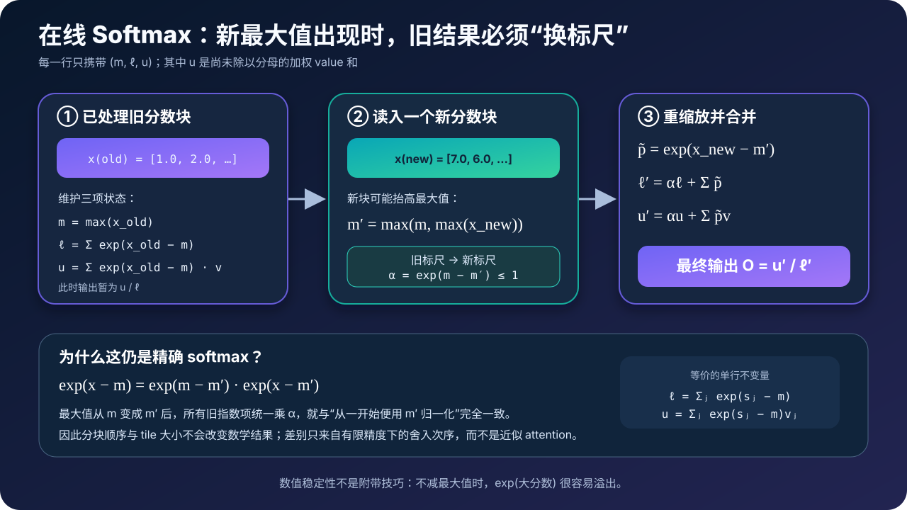
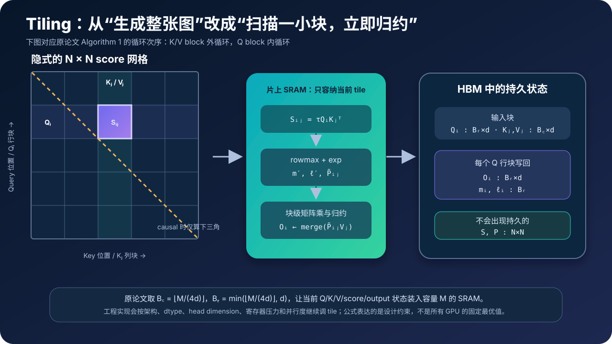
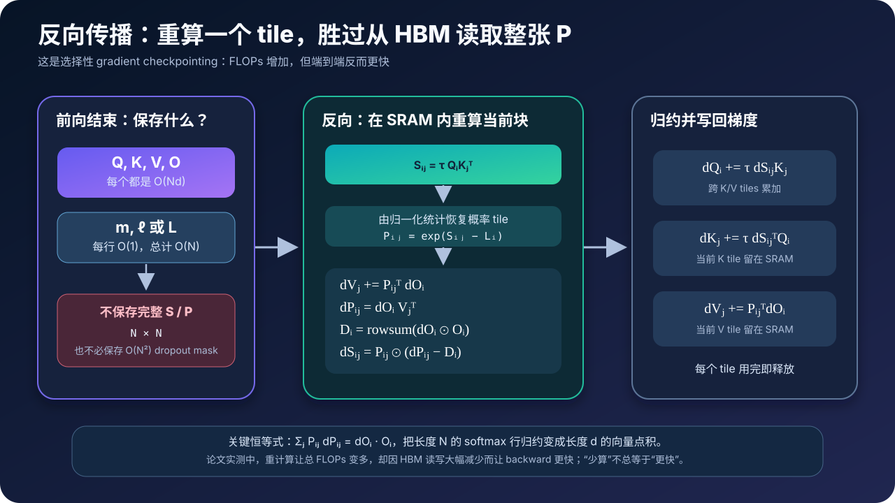

# FlashAttention 原理与源码：不保存注意力矩阵，如何仍然得到精确 Softmax



> **论文**：[FlashAttention: Fast and Memory-Efficient Exact Attention with IO-Awareness](https://arxiv.org/abs/2205.14135)<br>
> **作者**：Tri Dao、Daniel Y. Fu、Stefano Ermon、Atri Rudra、Christopher Ré<br>
> **发布时间**：2022 年 5 月；NeurIPS 2022<br>
> **关键词**：Exact Attention、IO Awareness、Tiling、Online Softmax、Kernel Fusion、Recomputation、HBM、SRAM<br>
> **配套源码**：[flash_attention_minimal.py](./code/flash_attention_minimal.py)

## 0. 先说结论

FlashAttention 没有把稠密注意力改成稀疏注意力，也没有用低秩近似替代 softmax。它计算的仍然是：

$$
\boxed{
O=\operatorname{softmax}\!\left(\frac{QK^\top}{\sqrt d}\right)V
}
$$

它真正改变的是**计算顺序与内存访问方式**：

1. 把 $Q,K,V$ 切成能装进片上 SRAM 的 tile；
2. 只在 SRAM 中生成当前 $S_{ij}=Q_iK_j^\top$ 小块；
3. 用 online softmax 逐块维护每行最大值、指数和与输出；
4. 当前 $S_{ij}/P_{ij}$ 用完即丢，不把完整 $N\times N$ 矩阵写回 HBM；
5. 反向传播时根据 $Q,K,V$ 和前向保存的归一化统计量重算当前概率块。

因此，它优化的不是渐进 FLOPs，而是昂贵的显存 IO：

| 维度 | 标准稠密 Attention | FlashAttention v1 |
|---|---:|---:|
| 数学结果 | 精确 softmax attention | 同一个精确 softmax attention |
| 前向 FLOPs | $O(N^2d)$ | $O(N^2d)$ |
| 额外内存 | $O(N^2)$ | $O(N)$ |
| HBM 访问量（论文模型） | $\Theta(Nd+N^2)$ | $\Theta(N^2d^2/M)$ |
| 是否持久化完整 $S/P$ | 是 | 否 |
| 反向需要 $P$ 时 | 从 HBM 读取保存值 | 在 SRAM 中按块重算 |

这里 $N$ 是序列长度，$d$ 是单个 attention head 的维度，$M$ 是片上 SRAM 能容纳的标量数量。论文的 IO 公式假设 $d\le M\le Nd$。

最值得记住的并不是“用了分块”这四个字，而是下面这条反直觉结论：

> 在现代 GPU 上，多做一些便宜的计算，可能比读写一个已经算好的大中间量更快。

这也是为什么论文中的 backward 虽然因重计算拥有更多 FLOPs，却能取得更短的运行时间。

---

## 1. 标准 Attention 慢在哪里

### 1.1 数学公式本身没有暴露系统瓶颈

先只看一个 head。令：

$$
Q,K,V\in\mathbb{R}^{N\times d}
$$

标准 scaled dot-product attention 分三步：

$$
S=\tau QK^\top,\qquad
P=\operatorname{softmax}(S),\qquad
O=PV
$$

其中：

$$
\tau=\frac{1}{\sqrt d},\quad
S,P\in\mathbb{R}^{N\times N},\quad
O\in\mathbb{R}^{N\times d}
$$

从公式看，两个大矩阵乘 $QK^\top$ 与 $PV$ 最显眼。但在 GPU 上，softmax、mask、dropout 等操作通常是 memory-bound：算术很少，却要读取和写回大量数据。

### 1.2 朴素实现会多次搬运 $N\times N$ 中间量

论文把标准实现概括为：

```text
1. 从 HBM 读 Q/K，计算 S = QKᵀ，再把 S 写回 HBM
2. 从 HBM 读 S，执行 mask + softmax，把 P 写回 HBM
3. 从 HBM 读 P/V，计算 O = PV，把 O 写回 HBM
```

如果还有 attention dropout，$P$ 又要被读取、修改或为 backward 保存相应状态。

问题不只是“$S/P$ 占显存”，而是它们不断跨越 HBM 与计算单元之间的边界：

```text
MatMul kernel → HBM → Mask/Softmax kernel → HBM → MatMul kernel
```

即使每个 kernel 单独很高效，中间数据的往返仍然昂贵。

### 1.3 二次中间量很快就会压过输入输出

假设：

- batch size 为 1；
- head 数为 32；
- 序列长度 $N=8192$；
- $S/P$ 均按 fp16 粗略估算。

仅一个 $[1,32,8192,8192]$ 矩阵就需要：

$$
1\times32\times8192^2\times2\ \text{bytes}
=4\ \text{GiB}
$$

若同时持有一份 score 和一份 probability，理论体量就是约 8 GiB。真实框架会通过融合、覆盖、checkpoint 等方式改变峰值，所以这不是对任意实现的显存预言；它只是展示 $N^2$ 项增长得有多快。

当 $N$ 翻倍时：

- $Q/K/V/O$ 的大小约翻倍；
- $S/P$ 的大小变成四倍。

这正是长上下文 attention 首先撞墙的原因。

---

## 2. IO-aware：速度不只由 FLOPs 决定

### 2.1 GPU 是分层存储系统

FlashAttention 论文以 A100 为例说明两层关键存储：

| 存储层级 | 特点 | 论文给出的 A100 量级 |
|---|---|---:|
| HBM | 容量大、所有 SM 可访问，但较慢 | 40–80 GB，约 1.5–2.0 TB/s |
| 片上 SRAM | 容量很小，但离计算单元近、带宽高 | 每个 SM 192 KB，估计总带宽约 19 TB/s |

这组数字是论文针对当时 A100 的说明，不应直接当成所有 GPU 的规格。真正重要的是数量级关系：**片上存储远小于 HBM，却也快得多。**

### 2.2 Compute-bound 与 memory-bound

可以用 arithmetic intensity 粗略理解一个算子：

$$
\text{Arithmetic Intensity}
=
\frac{\text{FLOPs}}{\text{从慢速内存搬运的 bytes}}
$$

- 大型 GEMM 往往有较高算术强度，更可能 compute-bound；
- softmax、mask、dropout、归约等往往算得少、搬得多，更可能 memory-bound。

标准 attention 恰好把两个高效矩阵乘夹在多个需要读写巨大矩阵的 memory-bound 操作之间。

### 2.3 Kernel fusion 还不够

把 mask、softmax、dropout 融合起来，能减少一部分往返。但如果完整 $S/P$ 仍要为后续 matmul 或 backward 落到 HBM，二次 IO 仍在。

FlashAttention 更进一步：

> 不只是把相邻逐元素算子融合，而是重新安排整个 attention，使 $N\times N$ 中间量从未以完整形式存在于 HBM。

---

## 3. “Exact Attention” 到底是什么意思

FlashAttention 的 exact 有一个严格而有限的含义：

$$
\text{FlashAttention}(Q,K,V)
=
\operatorname{softmax}(\tau QK^\top)V
$$

它不像 Linformer、Performer、Reformer 或稀疏 attention 那样改变连接模式或近似核函数。

但 exact **不等于逐 bit 相同**。原因包括：

- 浮点加法不满足结合律；
- tile 大小改变归约顺序；
- fused kernel 可能采用不同精度的中间累加；
- dropout 与非确定性调度还会引入额外差异。

更准确的说法是：

> FlashAttention 与标准 dense softmax attention 在实数数学上等价；有限精度结果允许正常的舍入误差。

这一区分很重要。它既不是近似 attention，也不是承诺任何硬件、任何 kernel 下都 bitwise identical。

---

## 4. 第一块拼图：稳定 Softmax

### 4.1 为什么要减最大值

对一行分数 $x=(x_1,\ldots,x_N)$：

$$
\operatorname{softmax}(x)_j
=
\frac{e^{x_j}}{\sum_k e^{x_k}}
$$

若 $x_j$ 很大，直接算 $e^{x_j}$ 容易上溢。稳定实现先取：

$$
m(x)=\max_j x_j
$$

再计算：

$$
\ell(x)=\sum_j e^{x_j-m(x)}
$$

于是：

$$
\operatorname{softmax}(x)_j
=
\frac{e^{x_j-m(x)}}{\ell(x)}
$$

因为每个指数的输入都不大于 0，数值稳定性显著改善。

### 4.2 普通 softmax 为什么看似必须看到整行

对某个 query $q_i$，它的注意力分数行是：

$$
s_i=(s_{i1},s_{i2},\ldots,s_{iN})
$$

每个概率都依赖整行最大值和整行分母：

$$
p_{ij}
=
\frac{e^{s_{ij}-m_i}}
{\sum_{k=1}^{N}e^{s_{ik}-m_i}}
$$

如果不保存整行，又怎样在只看到一个 key block 时知道最终 $m_i$ 与分母？答案是：让它们成为可以逐块更新的状态。

---

## 5. 第二块拼图：Online Softmax 推导



### 5.1 先看单行、两块的情况

把一行分数拆成两段：

$$
x=[x^{(1)},x^{(2)}]
$$

第一块的稳定 softmax 统计量为：

$$
m_1=\max(x^{(1)}),\qquad
\ell_1=\sum_{j\in 1}e^{x_j-m_1}
$$

第二块到来后：

$$
m_2=\max(m_1,\max(x^{(2)}))
$$

如果 $m_2>m_1$，旧指数项的标尺变了。利用：

$$
e^{x_j-m_2}
=
e^{m_1-m_2}e^{x_j-m_1}
$$

就能把旧分母换算到新标尺：

$$
\boxed{
\ell_2
=
e^{m_1-m_2}\ell_1
+
\sum_{j\in 2}e^{x_j-m_2}
}
$$

因此每处理一个新块，只需保留两个标量：running max $m$ 与 running sum $\ell$。

### 5.2 不只更新分母，还要同步更新 $PV$

Attention 最终需要的是：

$$
o_i
=
\frac{
\sum_j e^{s_{ij}-m_i}v_j
}{
\sum_j e^{s_{ij}-m_i}
}
$$

定义未归一化的加权和：

$$
u_i=\sum_j e^{s_{ij}-m_i}v_j
$$

处理新块时，令：

$$
m_i'=\max(m_i,\max_j S_{ij})
$$

$$
\alpha_i=e^{m_i-m_i'}
$$

当前块在新标尺下的权重为：

$$
\widetilde P_{ij}=e^{S_{ij}-m_i'}
$$

则三个状态同时更新：

$$
\boxed{
\begin{aligned}
m_i'&=\max(m_i,\operatorname{rowmax}(S_{ij}))\\
\ell_i'&=\alpha_i\ell_i+\operatorname{rowsum}(\widetilde P_{ij})\\
u_i'&=\alpha_i u_i+\widetilde P_{ij}V_j
\end{aligned}
}
$$

扫描完全部 key blocks 后：

$$
\boxed{O_i=\frac{u_i}{\ell_i}}
$$

### 5.3 论文为什么直接维护归一化后的 $O_i$

上面的 $u_i$ 形式最容易理解。原论文算法 1 在每轮直接把归一化后的 $O_i$ 写回 HBM：

$$
O_i'
=
\frac{
\alpha_i\ell_iO_i+\widetilde P_{ij}V_j
}{\ell_i'}
$$

因为旧的未归一化分子就是 $\ell_iO_i$。两种写法数学等价：

- 教学推导常维护 $(m,\ell,u)$，最后做一次除法；
- 论文伪代码维护 $(m,\ell,O)$，每块结束就得到当前归一化结果。

### 5.4 一个容易漏掉的错误

错误写法是：

```python
m = max(m, block_max)
l = l + exp(scores - m).sum()
```

一旦新块抬高 $m$，旧的 $l$ 仍在旧指数标尺下，不能直接相加。必须乘：

```python
old_scale = exp(old_m - new_m)
l = old_scale * l + exp(scores - new_m).sum()
```

输出分子也必须乘同一个 `old_scale`。忘记重缩放，是手写 online softmax 最常见的正确性 bug。

---

## 6. 第三块拼图：Tiling 与循环次序



### 6.1 怎样切块

令片上 SRAM 容量为 $M$。论文算法 1 设：

$$
B_c=\left\lfloor\frac{M}{4d}\right\rfloor,
\qquad
B_r=\min\left(
\left\lfloor\frac{M}{4d}\right\rfloor,d
\right)
$$

然后：

$$
T_r=\left\lceil\frac{N}{B_r}\right\rceil,
\qquad
T_c=\left\lceil\frac{N}{B_c}\right\rceil
$$

其中：

- $Q_i\in\mathbb{R}^{B_r\times d}$ 是 query 行块；
- $K_j,V_j\in\mathbb{R}^{B_c\times d}$ 是 key/value 列块；
- $S_{ij}\in\mathbb{R}^{B_r\times B_c}$ 是当前 score tile。

公式中的常数 4 来自让若干输入、输出与中间 tile 同时装进 SRAM 的保守安排。真实 kernel 会按 GPU 架构、dtype、寄存器压力、head dimension 与 occupancy 调优，不能把论文块大小当成永恒固定值。

### 6.2 原论文 Algorithm 1 的外层是 K/V block

循环顺序是：

```text
for each K_j, V_j block:          # 外循环
    load K_j, V_j from HBM to SRAM

    for each Q_i block:           # 内循环
        load Q_i, O_i, m_i, l_i to SRAM
        compute S_ij = Q_i K_j^T
        update online softmax and O_i
        write O_i, m_i, l_i to HBM
```

这样每个 $K_j,V_j$ tile 只需加载一次，并在片上复用于所有 query blocks。代价是 $Q/O/m/\ell$ 会随着每个 K/V block 被多次扫描。

后续实现可能采用不同的并行映射或循环组织；不要把“某段 Triton/CUDA 代码的循环写法”与数学算法的唯一形式混为一谈。只要：

- score tile 不落 HBM；
- softmax 状态能正确合并；
- 数据复用与并行调度符合硬件特性；

就仍然属于同一 IO-aware 思路。

### 6.3 前向伪代码

下面用未归一化分子 $u$ 表示，便于对应上一节推导：

```python
m = full((N,), -inf)
l = zeros((N,))
u = zeros((N, d))

for K_j, V_j in key_value_tiles(K, V):
    # 真实 kernel：把当前 K/V tile 留在 SRAM
    for Q_i in query_tiles(Q):
        S_ij = scale * Q_i @ K_j.T
        S_ij = apply_mask_inside_tile(S_ij)

        tile_max = rowmax(S_ij)
        m_new = maximum(m_i, tile_max)
        alpha = exp(m_i - m_new)
        P_tilde = exp(S_ij - m_new[:, None])

        l_i = alpha * l_i + rowsum(P_tilde)
        u_i = alpha[:, None] * u_i + P_tilde @ V_j
        m_i = m_new

O = u / l[:, None]
```

完整 $S$ 和 $P$ 都没有被创建。

### 6.4 为什么需要一个融合 kernel

如果在高层 Python/PyTorch 中真的写两层循环：

```python
for q_tile in ...:
    for kv_tile in ...:
        scores = q_tile @ k_tile.T
        ...
```

通常会产生大量 kernel launch、同步与临时 tensor，无法获得论文加速。FlashAttention 的性能来自组合拳：

- tile 尺寸适合片上存储；
- GEMM、mask、softmax、dropout、第二次 GEMM 在同一融合 kernel 内衔接；
- 中间 tile 停留在寄存器/SRAM；
- 线程块、warp 与矩阵乘硬件协同；
- 减少 HBM 流量和 launch 开销。

所以 online softmax 是**正确性条件**，CUDA kernel 是**性能条件**。

---

## 7. Causal Mask、Padding Mask 与 Dropout 怎样处理

### 7.1 Mask 必须在 softmax 统计之前进入 tile

mask 的数学含义是给被屏蔽位置加 $-\infty$：

$$
S_{ij}^{\text{masked}}
=
\begin{cases}
S_{ij},&\text{允许注意}\\
-\infty,&\text{禁止注意}
\end{cases}
$$

随后才计算 rowmax、指数和与输出。若先更新 softmax 再 mask，分母已经包含非法位置，结果必错。

### 7.2 Causal Attention 可以按 tile 剪枝

对自回归模型，query 位置 $i$ 只能看 $j\le i$：

- 完全位于主对角线下方的 tile：无需逐元素 mask；
- 与主对角线相交的 tile：在 tile 内应用三角 mask；
- 完全位于主对角线上方的 tile：整块跳过。

这既保持正确性，也省去无意义的计算。

### 7.3 Dropout 不必保存 $N^2$ mask

训练时 attention dropout 作用于概率。朴素做法会为 backward 保存完整随机 mask。

论文的处理是保存前向伪随机数生成器状态，在 backward 中按相同顺序重新生成 dropout mask。这样随机性仍一致，却不需要 $O(N^2)$ 持久存储。

工程上要注意：

- PRNG 的计数器与 tile 遍历必须可重放；
- 改变 kernel 调度可能影响确定性；
- eval 时 dropout 概率应为 0。

---

## 8. 反向传播：为什么重算会更快



### 8.1 标准 backward 需要哪些二次中间量

忽略 mask/dropout，前向为：

$$
S=\tau QK^\top,\qquad P=\operatorname{softmax}(S),\qquad O=PV
$$

给定上游梯度 $dO$：

$$
dV=P^\top dO
$$

$$
dP=dOV^\top
$$

softmax 的逐行梯度为：

$$
dS_{ij}
=
P_{ij}\left(
dP_{ij}-\sum_kP_{ik}dP_{ik}
\right)
$$

最后：

$$
dQ=\tau dSK,qquad dK=\tau dS^\top Q
$$

如果直接照公式实现，就会读写 $P,dP,dS\in\mathbb{R}^{N\times N}$。

### 8.2 前向究竟保存什么

FlashAttention 不保存完整 $P$，而保存：

- 原有输入 $Q,K,V$；
- 输出 $O$；
- 每行最大值 $m_i$ 与指数和 $\ell_i$。

也可以把最后两者合成 log-sum-exp：

$$
L_i=m_i+\log\ell_i
$$

那么任意概率块都能恢复：

$$
\boxed{
P_{ij}=e^{S_{ij}-L_i}
}
$$

论文伪代码显式保存 $m,\ell$；本文配套源码为简洁起见保存等价的 $L$。

### 8.3 关键恒等式：把长度 $N$ 的归约变成长度 $d$

定义 softmax 梯度中的行标量：

$$
D_i=\sum_jP_{ij}dP_{ij}
$$

又因为：

$$
dP_{ij}=dO_i\cdot V_j
$$

所以：

$$
\begin{aligned}
D_i
&=\sum_jP_{ij}(dO_i\cdot V_j)\\
&=dO_i\cdot\left(\sum_jP_{ij}V_j\right)\\
&=dO_i\cdot O_i
\end{aligned}
$$

即：

$$
\boxed{D_i=\operatorname{rowsum}(dO_i\odot O_i)}
$$

这让我们无需先收集整行 $P_i,dP_i$，只需对两个长度 $d$ 的向量做点积。

### 8.4 按块重算 backward

对当前 $(i,j)$ tile：

$$
\begin{aligned}
S_{ij}&=\tau Q_iK_j^\top\\
P_{ij}&=\exp(S_{ij}-L_i)\\
dV_j&\mathrel{+}=P_{ij}^\top dO_i\\
dP_{ij}&=dO_iV_j^\top\\
dS_{ij}&=P_{ij}\odot(dP_{ij}-D_i)\\
dQ_i&\mathrel{+}=\tau dS_{ij}K_j\\
dK_j&\mathrel{+}=\tau dS_{ij}^\top Q_i
\end{aligned}
$$

这里 $S_{ij},P_{ij},dP_{ij},dS_{ij}$ 都只是 SRAM 中的临时 tile，用完即可覆盖。

### 8.5 重计算为什么可能比读缓存快

传统 gradient checkpointing 通常是：省显存，但增加运行时间。FlashAttention 展示了另一种情况：

- 重算 $Q_iK_j^\top$ 增加 FLOPs；
- 但避免从 HBM 读写多个 $N\times N$ 矩阵；
- 当前小块的重算能充分利用矩阵乘单元；
- 省下的 IO 时间大于新增计算时间。

因此重计算同时降低内存并提高速度。这不是“计算免费”，而是硬件成本结构发生了变化。

---

## 9. IO 复杂度是怎样推出来的

### 9.1 标准 Attention

标准实现至少要搬运：

- $Q,K,V,O$：$\Theta(Nd)$；
- $S,P$：$\Theta(N^2)$。

因此论文模型下：

$$
\boxed{
\text{HBM accesses}_{\text{standard}}
=\Theta(Nd+N^2)
}
$$

### 9.2 FlashAttention

论文选取：

$$
B_c=\Theta(M/d)
$$

所以 K/V 列块数：

$$
T_c=\frac{N}{B_c}
=\Theta\left(\frac{Nd}{M}\right)
$$

对每个 K/V block，算法扫描一遍全部 $Q/O$，每遍需要 $\Theta(Nd)$ 级别的数据访问。因此：

$$
\begin{aligned}
\text{HBM accesses}_{\text{flash}}
&=\Theta(Nd\cdot T_c)\\
&=\boxed{\Theta\left(\frac{N^2d^2}{M}\right)}
\end{aligned}
$$

当典型 $M\gg d^2$ 时，它显著小于标准实现中的 $N^2$ 项。

### 9.3 这不是“IO 变成线性”的无条件承诺

常见误述是：

> FlashAttention 的 IO 复杂度是 $O(N)$。

论文真正证明的是：

$$
\Theta(N^2d^2/M)
$$

它依赖 SRAM 大小 $M$，并不对任意固定硬件随 $N$ 都变成线性。线性的是**额外存储空间** $O(N)$，不是一般条件下的 HBM 访问渐进式。

### 9.4 下界结论应该怎样表述

论文还证明：对 $d\le M\le Nd$ 的所有 SRAM 大小，不存在一个精确 attention 算法能在整个区间上统一达到：

$$
o(N^2d^2/M)
$$

这不是说 FlashAttention 在每一种具体 GPU、shape、dtype 上都达到最佳常数，也不是说未来 kernel 无法更快；它是对论文 IO 模型和指定 $M$ 区间的渐进下界。

### 9.5 计算和存储复杂度总结

| 项目 | 标准 Attention | FlashAttention |
|---|---:|---:|
| 前向数学 FLOPs | $O(N^2d)$ | $O(N^2d)$ |
| backward 数学量级 | $O(N^2d)$ | $O(N^2d)$，常数因重算增加 |
| 持久 score/probability | $O(N^2)$ | 0 |
| 额外存储（不含输入输出） | $O(N^2)$ | $O(N)$ |
| HBM accesses | $\Theta(Nd+N^2)$ | $\Theta(N^2d^2/M)$ |
| 长度翻倍后的 dense 乘加 | 约 4 倍 | 约 4 倍 |

所以 FlashAttention 没有消除 dense attention 的二次计算。它让相同的二次计算更贴合 GPU 内存层级。

---

## 10. 配套源码：可运行、可校验的最小实现

仓库提供了一份只依赖 Python 标准库的教学实现：

- [完整源码：flash_attention_minimal.py](./code/flash_attention_minimal.py)

它没有使用 NumPy、PyTorch 或 CUDA，目的不是快，而是让每个状态更新都能被直接阅读。

### 10.1 朴素实现作为正确性 oracle

朴素版本显式创建完整概率矩阵：

```python
for i in range(n):
    scores = [scale * dot(q[i], k[j]) for j in valid_keys]
    row_max = max(scores)
    weights = [exp(score - row_max) for score in scores]
    denominator = sum(weights)

    for j, weight in enumerate(weights):
        probability = weight / denominator
        probabilities[i][j] = probability
        output[i] += probability * v[j]
```

它用于对照，而不是模拟高性能框架所有细节。

### 10.2 分块前向的核心

源码按论文顺序让 K/V tile 位于外循环：

```python
for key_start in range(0, n, block_k):
    key_end = min(key_start + block_k, n)

    for query_start in range(0, n, block_q):
        query_end = min(query_start + block_q, n)

        for i in range(query_start, query_end):
            tile_scores = [
                scale * dot(q[i], k[j])
                for j in valid_keys_of_this_tile
            ]
            tile_max = max(tile_scores)
            new_max = max(running_max[i], tile_max)

            old_scale = exp(running_max[i] - new_max)
            tile_weights = [exp(score - new_max) for score in tile_scores]

            running_sum[i] = (
                old_scale * running_sum[i] + sum(tile_weights)
            )
            numerator[i] = (
                old_scale * numerator[i] + tile_weights @ value_tile
            )
            running_max[i] = new_max
```

实际文件还处理了初始化时的 $-\infty$、边界 tile 和 causal mask。

### 10.3 反向重算的核心

```python
softmax_dot[i] = dot(d_output[i], output[i])

for each query/key tile:
    score = scale * dot(q[i], k[j])
    probability = exp(score - logsumexp[i])
    d_probability = dot(d_output[i], v[j])
    d_score = probability * (d_probability - softmax_dot[i])

    d_v[j] += probability * d_output[i]
    d_q[i] += scale * d_score * k[j]
    d_k[j] += scale * d_score * q[i]
```

这里没有保存完整 $P$；每个 `probability` 都由当前 score 和前向 `logsumexp` 现场恢复。

### 10.4 怎样运行

在仓库根目录执行：

```bash
python3 papers/to-2026/code/flash_attention_minimal.py
```

预期输出：

```text
FlashAttention educational reference: all checks passed
  max forward error:          5.551e-17
  max backward error:         1.110e-16
  max finite-difference error: 1.727e-12
```

测试覆盖：

- non-causal 与 causal attention；
- `(1,1)`、`(2,3)`、`(4,2)`、`(8,8)` 等不同 tile 切分；
- tiled forward 对比完整 softmax；
- tiled backward 对比完整解析梯度；
- $Q/K/V$ 各抽一个元素做中心有限差分。

这验证了一个核心不变量：**tile 大小改变执行顺序，不改变数学函数。**

### 10.5 为什么教学源码不会更省 Python 内存

为了让接口清楚，教学实现返回 Python list，并分别构造最终 `output`。Python 对象本身还有巨大管理开销。它只演示“算法不需要 $N\times N$ 持久中间量”，不试图复现 GPU 内存布局。

真正的 $O(N)$ 额外内存与速度收益，需要在 CUDA/Triton 等底层 kernel 中控制：

- 哪个 tile 进寄存器或 shared memory；
- 中间量何时覆盖；
- 哪些值写回 HBM；
- warp 如何协作归约。

---

## 11. 从教学代码到真实 GPU Kernel

### 11.1 Batch 与多头不是新数学问题

实际输入通常为：

```text
[batch, sequence, heads, head_dim]
```

每个 batch/head 的 attention 在数学上相互独立，kernel 会把它们映射到不同 thread blocks 或 program instances。Online softmax 仍沿 key 维逐块归约。

### 11.2 真实 kernel 需要解决的额外问题

| 问题 | 为什么重要 |
|---|---|
| Tensor Core 友好的 tile | 影响矩阵乘吞吐与对齐 |
| Shared memory / 寄存器容量 | tile 太大会溢出，太小会增加循环与 IO |
| Occupancy | 单个 block 占资源过多会降低并发 |
| Warp 归约 | rowmax 与 rowsum 必须高效且数值稳定 |
| 数据布局 | Q/K/V 的 stride 和 head layout 影响合并访存 |
| 边界处理 | 序列长度与 head dim 常不是 tile 整数倍 |
| Mask / bias / dropout 融合 | 功能越多，寄存器与分支压力越大 |
| Forward/backward 调度 | 决定 dQ/dK/dV 的归约与写回次数 |

这解释了为什么理解算法不等于能写出最快 kernel。性能工程还需要 profiler、硬件规格和大量 shape-specific 调优。

### 11.3 为什么 block 越大不一定越快

增大 tile 通常可以：

- 提高 K/V 复用；
- 减少扫描次数；
- 降低 HBM 访问。

但过大也会：

- 超过 shared memory；
- 增加寄存器占用与 spill；
- 降低 occupancy；
- 让边界浪费更严重。

论文实验也观察到：块增大到一定程度后，运行时间不再随 HBM 访问下降而继续改善，因为瓶颈会转移到算术或其他资源。

---

## 12. 工程中怎样调用

### 12.1 官方 `flash-attn` 接口

[官方仓库](https://github.com/Dao-AILab/flash-attention) 的高层接口仍然像普通 attention：

```python
from flash_attn import flash_attn_func

# q, k, v: [batch, seqlen, nheads, headdim]
out = flash_attn_func(
    q,
    k,
    v,
    dropout_p=0.0,
    softmax_scale=None,  # 默认 1 / sqrt(headdim)
    causal=True,
)
```

上层 Transformer 仍负责：

```text
hidden states
    → Q/K/V projection
    → FlashAttention operator
    → output projection
```

FlashAttention 替换的是 attention 核心算子，不会自动替你实现整个 MHA 模块。

### 12.2 PyTorch SDPA

现代 PyTorch 可以通过：

```python
import torch.nn.functional as F

out = F.scaled_dot_product_attention(
    q,
    k,
    v,
    is_causal=True,
    dropout_p=(dropout_p if training else 0.0),
)
```

调用 scaled dot-product attention。根据 [PyTorch 官方文档](https://docs.pytorch.org/docs/stable/generated/torch.nn.functional.scaled_dot_product_attention.html)，CUDA 路径会依据输入条件自动选择可用实现；融合 kernel 各自有 dtype、shape、设备等限制，不能看到同一个 API 就断言本次一定使用 FlashAttention。

还有一个很容易踩的坑：该 API 按传入的 `dropout_p` 执行 dropout，所以 eval 时需要显式传 `0.0`。

### 12.3 怎样确认真的走了高效 kernel

不要只比较代码表面。应检查：

1. 设备与 dtype 是否受支持；
2. head dimension、mask 类型、stride 是否触发 fallback；
3. profiler 中实际出现了哪个 kernel；
4. benchmark 是否包含 warm-up 与同步；
5. 是否同时测量 forward、backward 与峰值显存；
6. baseline 是否启用了同等精度、mask、dropout 与编译优化。

---

## 13. 论文实验应该怎样读

### 13.1 最能说明机制的一组数字

论文 Figure 2 在 A100 上测 GPT-2 medium 的 attention forward + backward，配置为序列长度 1024、head dim 64、16 heads、batch size 64：

| 指标 | 标准 Attention | FlashAttention |
|---|---:|---:|
| GFLOPs | 66.6 | 75.2 |
| HBM R/W | 40.3 GB | 4.4 GB |
| 运行时间 | 41.7 ms | 7.3 ms |

这组数字的重点不是承诺所有工作负载都有 5.7 倍加速，而是展示因果链：

```text
FLOPs 更多
  但 HBM 读写约少一个数量级
  所以 wall-clock 更短
```

### 13.2 Attention kernel 加速不等于模型端到端同倍加速

论文报告过不同层级的结果：

| 场景 | 论文报告 |
|---|---:|
| GPT-2 attention 计算（Figure 1 特定配置） | 7.6× |
| 常见长度 128–2K 的 attention benchmark | 最高约 3× |
| BERT-large 端到端训练 | 相对 MLPerf 1.1 记录快 15% |
| GPT-2，序列长度 1K | 相对论文 baseline 约 3× |
| Long Range Arena，长度 1K–4K | 相对论文 baseline 约 2.4× |

为什么 attention kernel 的 7.6× 没直接变成所有模型的 7.6×？因为完整训练还包含：

- QKV 与输出投影；
- MLP；
- normalization；
- optimizer；
- 数据加载与分布式通信。

这也是所有 kernel benchmark 都必须区分“算子级”和“端到端”的原因。

### 13.3 更长上下文带来的质量收益

FlashAttention 本身不改变模型表达式，所以在相同设置下不应凭空提高质量。论文中的质量提升来自：显存与速度改善后，模型能够使用更长上下文。

例如论文的 GPT-2 small 实验中：

- Megatron-LM、1K 上下文：OpenWebText perplexity 18.2，训练 4.7 天；
- FlashAttention、4K 上下文：perplexity 17.5，训练 3.6 天。

即 4 倍上下文仍比对照的 1K 训练更快，并带来 0.7 perplexity 改善。这里的逻辑是：

```text
更高效 kernel → 可承受更长序列 → 模型看到更多上下文 → 任务指标改善
```

不能把它简化成“换 kernel 会直接改变同一模型的预测能力”。

### 13.4 Block-sparse FlashAttention 是另一条分支

原论文还把 IO-aware kernel 扩展到 block-sparse attention：只计算稀疏 mask 中的非零 tile。

这时它不再是与完整 dense attention 相同的函数，而是一种近似/结构化稀疏 attention。需要分清：

- dense FlashAttention：精确计算完整 attention；
- block-sparse FlashAttention：跳过指定块，计算量和 IO 都随稀疏率下降，但数学函数已改变。

---

## 14. FlashAttention 能解决什么，不能解决什么

### 14.1 它能解决

- 标准 attention 中 $S/P$ 的二次激活内存；
- 多 kernel 之间反复读写巨大中间矩阵；
- 长序列训练时 attention 算子的实际吞吐与峰值显存；
- 反向保存概率矩阵和 dropout mask 的开销；
- 一部分因高效 kernel 不足而无法兑现的算法性能。

### 14.2 它不能解决

#### 不能消除 dense attention 的二次计算

每个 query 仍与每个 key 交互，乘加量仍为 $O(N^2d)$。当序列继续增长，最终仍会 compute-bound。

#### 不能自动消除自回归解码的 KV cache

带 KV cache 的单 token decode 通常不形成完整 $N\times N$ score 矩阵，而是一个 query 对历史 K/V。此时瓶颈更可能是读取 KV cache。FlashAttention 的训练/prefill 优势不能原样套到 decode。

#### 不能保证所有 shape 都更快

短序列、小 batch、不支持的 dtype/head dim、复杂 mask、非连续布局、旧硬件或 fallback 都可能让收益变小。

#### 不能替代模型级长上下文方法

RoPE scaling、稀疏 attention、滑动窗口、状态空间模型、上下文压缩处理的是建模方式或渐进计算；FlashAttention 处理的是同一 dense attention 的实现效率。它们可以组合，但不是同一个维度。

#### 不能忽略数值与确定性验证

低精度归约、不同 kernel、dropout 重放和非确定性 backward 都可能产生小差异。训练迁移时仍应做 loss、梯度与收敛验证。

---

## 15. 与常见技术的关系

| 技术 | 改变什么 | 与 FlashAttention 的关系 |
|---|---|---|
| Gradient checkpointing | 重算层/子图，降低激活内存 | FlashAttention 的 backward 重算可看作更细粒度、IO-aware 的选择性 checkpoint |
| Kernel fusion | 合并相邻操作，减少中间读写 | FlashAttention 不仅融合，还用 online softmax 改变整个 attention 调度 |
| Sparse attention | 只计算部分 query-key 连接 | 改变数学函数；可与 tiled kernel 结合 |
| Linear attention | 改写或近似 attention，使复杂度近线性 | 属于算法替代，不等价于 dense softmax |
| RoPE | 改变 Q/K 的位置编码 | 在 QK 点积前应用，可与 FlashAttention 组合 |
| MQA/GQA | 减少 K/V head 数与 KV cache | 改变 head 共享方式，可由高效 kernel 支持 |
| KV cache | decode 时缓存历史 K/V | 主要服务自回归解码；瓶颈结构与全序列训练不同 |

---

## 16. 从 FlashAttention v1 到后续版本

本文主体只解释 2022 年 v1。后续版本延续“精确 attention + IO-aware”的主线，但优化重点发生变化：

- **FlashAttention-2**：改善工作划分与并行度，减少非矩阵乘 FLOPs，让 GPU 更充分并行；
- **FlashAttention-3**：面向 Hopper 架构，利用更强的异步执行与新硬件能力；
- 官方仓库还持续提供面向更新架构和更多功能的实现。

不要把后续 kernel 的具体 tile、并行策略、支持矩阵反推成原论文 Algorithm 1 的固定设定。阅读顺序最好是：

```text
v1：为什么不物化 N²，online softmax 怎样保证精确
 → v2：怎样改进并行度和工作划分
 → v3/后续：怎样利用新一代硬件流水线
```

截至阅读时的版本、硬件与功能支持，应以[官方仓库](https://github.com/Dao-AILab/flash-attention)为准。

---

## 17. 常见误解与纠正

### 17.1 “FlashAttention 把复杂度从 $O(N^2)$ 降到 $O(N)$”

错。它把**额外内存**降到 $O(N)$，但 dense attention 的计算仍为 $O(N^2d)$；论文 HBM IO 为 $\Theta(N^2d^2/M)$。

### 17.2 “它不创建 attention matrix，所以不是精确 attention”

错。完整矩阵没有被**持久物化**，不代表矩阵元素没有被计算。每个 score/probability 元素仍会在某个 SRAM tile 中短暂出现。

### 17.3 “Online softmax 就是分别对每块 softmax 再拼起来”

错。每块独立归一化会让每块概率和都为 1，改变全局分布。必须用新的全局最大值重缩放旧分母和旧输出。

### 17.4 “重计算一定更慢”

错。若重算是高吞吐矩阵乘，而替代的是大量 HBM IO，总时间可能下降。论文实验正是这种情况。

### 17.5 “用了 `scaled_dot_product_attention` 就一定走 FlashAttention”

错。框架会根据设备、dtype、shape、mask 等条件选择 backend，也可能 fallback 到其他实现。

### 17.6 “FlashAttention 只对训练有用”

不准确。长 prompt 的 prefill 仍是多 query 的 dense attention，通常能受益；但逐 token decode 的瓶颈不同，收益不能照搬训练数字。

### 17.7 “Exact 就是逐 bit 一样”

错。exact 指数学函数不近似，不等于浮点归约顺序一致。

### 17.8 “块越大越快”

错。tile 大小同时受 SRAM、寄存器、occupancy、矩阵乘布局与边界浪费约束。

---

## 18. 如何做一个可信的复现实验

### 18.1 正确性

至少比较：

- forward 最大绝对/相对误差；
- $dQ,dK,dV$ 梯度误差；
- causal 与 non-causal；
- 不同序列长度、head dim、非整 tile 边界；
- dropout 关闭时的确定性结果；
- 低精度与高精度 reference。

### 18.2 性能

GPU 异步执行会让普通计时失真。benchmark 应：

1. warm up；
2. 在计时边界同步，或使用 GPU event；
3. 分别测 forward、backward、forward+backward；
4. 报告 batch、heads、$N$、$d$、dtype、mask、dropout、GPU；
5. 检查 backend，没有静默 fallback；
6. 同时报告峰值显存与吞吐；
7. 多次测量并报告稳健统计量。

### 18.3 公平 baseline

两边必须保持：

- 同一 attention 数学函数；
- 同一 dtype 和精度策略；
- 同一 causal/padding mask；
- 同一 dropout 设置；
- 同一输入布局；
- 同样包含或不包含 QKV projection；
- 同样的编译与自动调优条件。

否则测到的可能是 layout 转换、fallback 或投影层差异，而不是 attention kernel。

---

## 19. 面试与自测题

### Q1：FlashAttention 的一句话核心是什么？

用 tiling、online softmax、kernel fusion 与 backward recomputation，让完整 $N\times N$ score/probability 不落 HBM，以相同 dense attention 数学结果换取更少 IO 和线性额外内存。

### Q2：为什么只保存 running sum 不够？

为防指数溢出必须减去 running max；当新块出现更大值，旧指数和必须按 $e^{m_{old}-m_{new}}$ 重缩放，所以至少要同时知道 max 与 sum。

### Q3：为什么输出也要重缩放？

输出分子与 softmax 分母使用同一指数标尺。最大值变化后，旧的 $\sum e^{s-m}v$ 也必须乘相同缩放因子。

### Q4：反向为什么可以不保存 $P$？

用 $Q_iK_j^\top$ 重算 score tile，再用前向保存的 $m_i,\ell_i$ 或 $L_i$ 恢复：

$$
P_{ij}=e^{S_{ij}-L_i}
$$

### Q5：$D_i=dO_i\cdot O_i$ 有什么用？

它把 softmax backward 中 $\sum_jP_{ij}dP_{ij}$ 的整行归约，改写成两个长度 $d$ 向量的点积，使每个 tile 可以独立计算 $dS_{ij}$。

### Q6：为什么 FLOPs 更多却能更快？

新增的是 GPU 擅长的矩阵乘重算，减少的是代价较高的 HBM 读写；当 attention 受 IO 限制时，后者更决定 wall-clock。

### Q7：FlashAttention 和 sparse attention 有什么区别？

Dense FlashAttention 仍计算所有 query-key 对，只改变实现；sparse attention 跳过一部分连接，改变数学函数与计算复杂度。

### Q8：它为什么没有解决无限长上下文？

因为 dense attention 的算术量仍随 $N^2$ 增长，且模型其余激活、通信、KV cache 等成本仍存在。

---

## 20. 读论文时最值得看的位置

建议按下面顺序：

1. **Figure 1**：先建立 HBM/SRAM 与标准/融合数据流直觉；
2. **Section 2.2 / Algorithm 0**：确认标准 attention 到底写回了什么；
3. **Section 3.1 / Algorithm 1**：逐行对照 tile、$m$、$\ell$、$O$ 更新；
4. **Theorem 1/2**：区分 FLOPs、额外内存和 HBM accesses；
5. **Figure 2**：理解“更多 FLOPs、更少 IO、更快”的实验证据；
6. **Appendix B.4 / Algorithm 4**：重点看 backward 重算与 $D_i$ 恒等式；
7. 最后再看 block-sparse 扩展与端到端实验。

如果只记公式而不看 Figure 1，会错过论文真正的系统贡献；如果只记“HBM 很慢”而不推 online softmax，又无法解释它为什么仍然 exact。

---

## 21. 一页纸总结

### 问题

标准 attention 会把：

$$
S,P\in\mathbb{R}^{N\times N}
$$

写入并读出 HBM，长序列下显存和 IO 都随 $N^2$ 增长。

### 前向解法

在 SRAM 中计算一个 $S_{ij}$ tile，并维护：

$$
m_i,quad \ell_i,quad u_i
$$

新 tile 到来时：

$$
\begin{aligned}
m_i'&=\max(m_i,\operatorname{rowmax}(S_{ij}))\\
\alpha_i&=e^{m_i-m_i'}\\
\ell_i'&=\alpha_i\ell_i+\operatorname{rowsum}(e^{S_{ij}-m_i'})\\
u_i'&=\alpha_i u_i+e^{S_{ij}-m_i'}V_j
\end{aligned}
$$

最后：

$$
O_i=u_i/\ell_i
$$

### 反向解法

保存：

$$
O_i,\quad L_i=m_i+\log\ell_i
$$

按块重算：

$$
P_{ij}=e^{S_{ij}-L_i}
$$

并利用：

$$
D_i=dO_i\cdot O_i
$$

完成 $dQ,dK,dV$ 的 tile 归约。

### 最终收益

$$
\text{额外内存}: O(N^2)\rightarrow O(N)
$$

$$
\text{HBM accesses}:
\Theta(Nd+N^2)
\rightarrow
\Theta(N^2d^2/M)
$$

但：

$$
\text{dense FLOPs 仍为 }O(N^2d)
$$

一句话收尾：

> FlashAttention 最深刻的贡献，是把“如何计算 attention”从纯代数问题变成了算法与内存层级共同设计的问题。

---

## 22. 参考资料与延伸阅读

### 一手资料

- [FlashAttention 论文（arXiv）](https://arxiv.org/abs/2205.14135)
- [FlashAttention 论文 PDF](https://arxiv.org/pdf/2205.14135)
- [Dao-AILab/flash-attention 官方实现](https://github.com/Dao-AILab/flash-attention)
- [PyTorch scaled_dot_product_attention 官方文档](https://docs.pytorch.org/docs/stable/generated/torch.nn.functional.scaled_dot_product_attention.html)

### 本仓库中的前后阅读

- 前置：[Transformer 原理](./00_Transformer_2017_原理.md)
- 前置：[RoFormer / RoPE 原理](./09_RoFormer_RoPE_2021_原理.md)
- 下一篇：[LLaMA 原理](./15_LLaMA_2023_原理.md)
- 系统视角延伸：[Mamba 原理](./29_Mamba_2023_原理.md)
