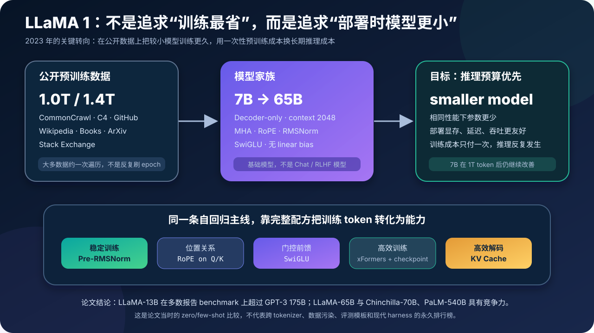
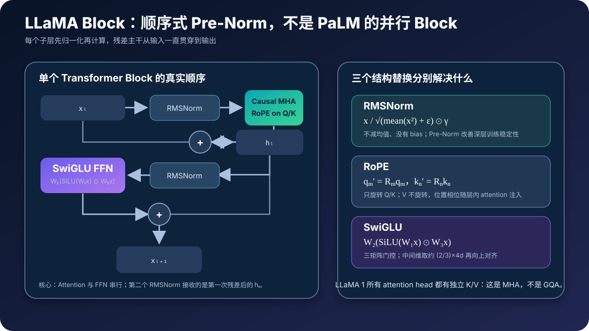
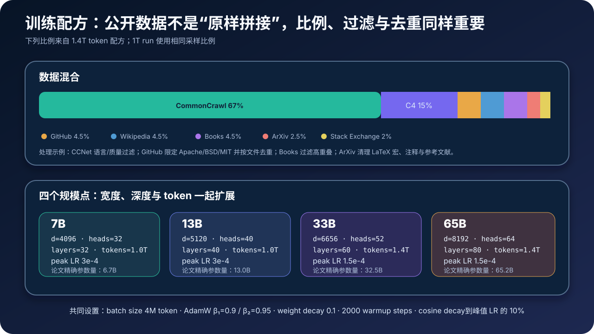
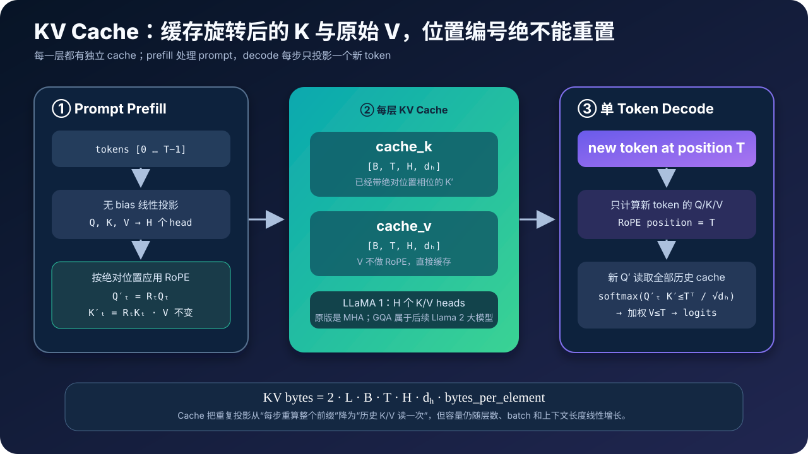

# LLaMA 1 原理与源码：小模型、长训练与现代开源 LLM 骨架



> **论文**：[LLaMA: Open and Efficient Foundation Language Models](https://arxiv.org/abs/2302.13971)<br>
> **作者**：Hugo Touvron 等（Meta AI）<br>
> **发布时间**：2023 年 2 月<br>
> **关键词**：Decoder-only、RMSNorm、RoPE、SwiGLU、Pre-Norm、Scaling Law、KV Cache<br>
> **配套源码**：[llama_minimal.py](./code/llama_minimal.py)

> 本文专门讲 **2023 年的第一代 LLaMA（LLaMA 1）**。原版使用标准多头注意力 MHA，不是 GQA；它是基础语言模型，不是聊天模型。文中会明确标出后续 Llama 2/3 和现代推理库带来的变化，不把新特性倒灌给原论文。

## 0. 先说结论

LLaMA 不是靠一种全新 Transformer 取胜。它的重要性在于：用一套干净、高效、易扩展的结构配方，证明了**参数更少但 token 训得更多**的模型，可以在不少基准上超过巨大得多的前代模型。

一句话概括它的方法：

$$
\boxed{
\text{LLaMA}
=
\text{decoder-only Transformer}
+\text{Pre-RMSNorm}
+\text{RoPE}
+\text{SwiGLU}
+\text{high-quality public data}
+\text{more training tokens}
}
$$

但真正值得带走的是三个判断：

1. **“训练计算最优”不等于“生命周期成本最优”**。如果模型要被反复推理，宁愿用更多一次性训练计算，也可以换取更小的部署模型。
2. **架构创新可以是“正确组合”**。RMSNorm、RoPE 和 SwiGLU 都非 LLaMA 首创，但它们被组成了后来开源 LLM 的标准骨架。
3. **“开放权重”、“开源代码”和“商业可用”不是同一件事**。LLaMA 1 权重采用非商业专用许可，不应简化成“无限制开源”。

---

## 1. LLaMA 要重新优化的，其实是总成本

### 1.1 只看训练 FLOPs，会得到一种答案

Scaling Laws 与 Chinchilla 的经典问题是：

> 在给定一次训练计算预算时，参数量 $N$ 与训练 token 数 $D$ 应如何分配，才能使损失尽可能低？

自回归 Transformer 的训练计算量可粗略写为：

$$
C_{\text{train}}\approx 6ND
$$

固定 $C_{\text{train}}$ 后，参数与数据存在最优配比。但这里默认训练结束后故事也结束了。

### 1.2 模型上线后，推理会被重复付费

生产系统的粗略总成本更像：

$$
C_{\text{life}}
=C_{\text{train}}+Q\cdot C_{\text{inference}}(N,L)
$$

其中 $Q$ 是生命周期内处理的请求或 token 数，$L$ 是上下文长度。推理中大部分线性层的工作量直接随 $N$ 增长；参数越多，权重显存、带宽需求与通信成本也通常越高。

因此 LLaMA 选择了不同的目标：

> 不只找“训练预算下损失最低”的模型，而是找“在指定推理预算下表现最好”的模型。

这可以导出一个看似“过度训练”、实际很适合部署的策略：固定模型规模，继续喂更多 token，直到训练边际收益与一生中的推理节省达到更好平衡。论文中 7B 模型在超过 1T token 后仍然继续改善，就是这条路线的关键证据。

### 1.3 这不是推翻 Chinchilla

两者的目标函数不同：

| 问题 | Chinchilla 式视角 | LLaMA 式视角 |
|---|---|---|
| 固定什么 | 一次训练计算 | 推理时的模型/计算预算 |
| 优化什么 | 预训练损失 | 部署性能与总成本 |
| 常见结果 | $N$ 和 $D$ 同时扩大 | 固定较小 $N$，让 $D$ 更大 |
| 适合场景 | 比较训练配置 | 模型要被大量重复服务 |

所以“LLaMA 违反了 Chinchilla”是错的。更准确的说法是：**LLaMA 把优化边界从单次训练扩大到训练加重复推理。**

---

## 2. 模型家族：名字是取整值，参数是实际值

论文训练了四种尺寸。社区常用 7B/13B/33B/65B，论文表格给出的实际参数量更精确：

| 常用名 | 实际参数 | 隐藏维 $d$ | Heads | Layers | Peak LR | Global batch | 训练 token |
|---:|---:|---:|---:|---:|---:|---:|---:|
| 7B | 6.7B | 4096 | 32 | 32 | $3.0\times10^{-4}$ | 4M tokens | 1.0T |
| 13B | 13.0B | 5120 | 40 | 40 | $3.0\times10^{-4}$ | 4M tokens | 1.0T |
| 33B | 32.5B | 6656 | 52 | 60 | $1.5\times10^{-4}$ | 4M tokens | 1.4T |
| 65B | 65.2B | 8192 | 64 | 80 | $1.5\times10^{-4}$ | 4M tokens | 1.4T |

四个版本共有的关键设置：

- 最大训练序列长度为 **2048** token；
- head dimension 都是 $128$；
- 使用标准 **MHA**，因此 Q/K/V 都有同样数量的 heads；
- 全部是只做 next-token prediction 的基础模型；
- 没有 SFT、RLHF、聊天模板或 system prompt 的训练阶段。

> **易错点**：原论文把 32.5B 约称为 33B，而一些工具或后续模型使用不同命名。比较显存和训练成本时，应以实际配置为准。

---

## 3. 训练目标：只有一件事，预测下一个 token

给定 token 序列 $x_1,\ldots,x_T$，模型把联合概率分解为：

$$
p_\theta(x_1,\ldots,x_T)
=\prod_{t=1}^{T}p_\theta(x_t\mid x_{<t})
$$

训练最小化负对数似然：

$$
\mathcal L(\theta)
=-\sum_{t=1}^{T}\log p_\theta(x_t\mid x_{<t})
$$

代码中最容易错的是标签错位。输入与目标应当是：

```text
input : [BOS,  x1,  x2, ..., x(T-1)]
target: [ x1,  x2,  x3, ...,   xT   ]
```

也就是：

```python
loss = cross_entropy(
    logits[:, :-1, :].reshape(-1, vocab_size),
    token_ids[:, 1:].reshape(-1),
)
```

因果 mask 确保位置 $t$ 只能读取 $j\le t$ 的 key/value。预训练时所有位置可并行计算，但概率分解仍然是从左到右的。

---

## 4. 架构全景：无奇怪分支的 decoder-only Transformer



给定 token id $t_1,\ldots,t_T$，整个模型可写成：

$$
X_0=\operatorname{Embedding}(t_{1:T})
$$

对第 $\ell$ 层：

$$
H_\ell
=X_\ell+
\operatorname{Attention}_\ell
\left(\operatorname{RMSNorm}_\ell^{(a)}(X_\ell)\right)
$$

$$
X_{\ell+1}
=H_\ell+
\operatorname{FFN}_\ell
\left(\operatorname{RMSNorm}_\ell^{(f)}(H_\ell)\right)
$$

最后：

$$
Z=\operatorname{RMSNorm}(X_L),\qquad
\text{logits}=ZW_{\text{out}}^\top
$$

这里有几个不应被“LLaMA 风格实现”掩盖的原版细节：

| 部件 | LLaMA 1 的选择 | 容易混入的后来选择 |
|---|---|---|
| Attention | 标准 MHA | GQA/MQA |
| Position | Q/K 上的 RoPE | 绝对位置 embedding、ALiBi |
| Norm | Pre-RMSNorm | Post-LayerNorm |
| FFN | bias-free SwiGLU | GELU MLP、带 bias 线性层 |
| Context | 2048 | 后续版本的更长上下文 |
| Embedding/head | 两套独立权重 | 权重绑定 |
| 定位 | base model | instruction/chat model |

原版推理源码使用 FairScale 的 model-parallel embedding 和线性层。这是分布式执行方式，不会改变上面的数学结构。

---

## 5. Pre-RMSNorm：先归一化，再走残差分支

### 5.1 RMSNorm 与 LayerNorm 的区别

对一个 token 的隐藏向量 $x\in\mathbb R^d$，LayerNorm 通常先减去均值：

$$
\operatorname{LayerNorm}(x)
=\gamma\odot
\frac{x-\mu}{\sqrt{\sigma^2+\epsilon}}
+\beta
$$

RMSNorm 只根据均方根缩放：

$$
\operatorname{RMSNorm}(x)
=\gamma\odot
\frac{x}{\sqrt{\frac1d\sum_{i=1}^{d}x_i^2+\epsilon}}
$$

因此 LLaMA 中的 RMSNorm：

- 不减均值；
- 不需要可学习的 shift $\beta$；
- 只保留每个特征的 scale $\gamma$；
- 官方 v1 配置使用 $\epsilon=10^{-6}$。

配套源码的实现只需几行：

```python
class RMSNorm:
    def __init__(self, dim: int, eps: float) -> None:
        self.weight = [1.0 for _ in range(dim)]
        self.eps = eps

    def __call__(self, x):
        output = []
        for token in x:
            mean_square = sum(v * v for v in token) / len(token)
            inverse_rms = 1.0 / math.sqrt(mean_square + self.eps)
            output.append([
                v * inverse_rms * scale
                for v, scale in zip(token, self.weight)
            ])
        return output
```

### 5.2 什么是 Pre-Norm

Post-Norm 是“子层→残差加法→归一化”；LLaMA 是“归一化→子层→残差加法”：

```python
h = x + attention(attention_norm(x))
out = h + feed_forward(ffn_norm(h))
```

这使主残差路径保持一条更直接的恒等通道。对深层 Transformer 而言，这种配置通常更容易稳定优化。

### 5.3 “每层归一化两次”不等于重复做同一件事

第一个 RMSNorm 的输出送入 attention，加回残差后得到 $H_\ell$；第二个 RMSNorm 处理的是已经融合 attention 结果的 $H_\ell$，再送入 FFN。它们有各自的可学习缩放参数。

---

## 6. Attention：先算 Q/K/V，再只旋转 Q/K

### 6.1 张量形状

设输入：

$$
X\in\mathbb R^{B\times T\times d}
$$

标准多头 attention 投影后：

$$
Q,K,V\in\mathbb R^{B\times T\times H\times d_h},
\qquad d=Hd_h
$$

LLaMA 1 的四种尺寸都有 $d_h=128$。每个 head 独立计算：

$$
S_h=\frac{Q_hK_h^\top}{\sqrt{d_h}}+M
$$

$$
P_h=\operatorname{softmax}(S_h),\qquad O_h=P_hV_h
$$

合并 heads 后再经过 $W_O$。四个投影 $W_Q,W_K,W_V,W_O$ 都不带 bias。

### 6.2 因果 mask 只屏蔽未来

对 query 位置 $i$ 和 key 位置 $j$：

$$
M_{ij}=
\begin{cases}
0,&j\le i\\
-\infty,&j>i
\end{cases}
$$

从而 $P_{ij}=0$ for $j>i$。这条约束不是“生成时才有”；训练时也必须存在，否则模型会偷看正确答案。

### 6.3 原版是 MHA，不是 GQA

原 LLaMA 1 每个 query head 都有对应的 key/value head：

$$
H_q=H_k=H_v=H
$$

GQA 则是 $H_{kv}<H_q$，多个 query heads 共享一组 K/V heads。它可大幅缩小 KV Cache，但不是 LLaMA 1 论文和 v1 源码中的结构。

如果一段“LLaMA 复现代码”包含 `num_key_value_heads < num_attention_heads`，它实现的是后来家族或泛 LLaMA 架构，不是原版 2023 LLaMA 1。

---

## 7. RoPE：把绝对位置旋转成相对位置关系

### 7.1 每两维是一个旋转平面

对 head 中第 $i$ 个二维子空间，位置 $m$ 对应旋转角：

$$
\phi_{m,i}=m\cdot\theta_i,
\qquad
\theta_i=10000^{-2i/d_h}
$$

旋转矩阵为：

$$
R(\phi)=
\begin{bmatrix}
\cos\phi&-\sin\phi\\
\sin\phi&\cos\phi
\end{bmatrix}
$$

然后：

$$
q_m'=R_mq_m,\qquad k_n'=R_nk_n
$$

V 不旋转。RoPE 也不是把一个位置向量加到 token embedding 上；它发生在**每层 attention 的 Q/K 上**。

### 7.2 为什么点积能看到相对位置

旋转矩阵满足：

$$
(R_mq)^{\top}(R_nk)
=q^\top R_m^\top R_nk
=q^\top R_{n-m}k
$$

所以 attention score 中的位置依赖通过 $n-m$ 出现。输入用绝对位置选择旋转角，点积却自然得到相对位置效果。

### 7.3 最小可运行实现

```python
def apply_rope(head, position, theta=10_000.0):
    rotated = []
    for pair_start in range(0, len(head), 2):
        inv_freq = theta ** (-pair_start / len(head))
        angle = position * inv_freq
        c, s = math.cos(angle), math.sin(angle)
        real, imag = head[pair_start], head[pair_start + 1]
        rotated.extend([
            real * c - imag * s,
            real * s + imag * c,
        ])
    return rotated
```

这里使用 adjacent-pair 写法，与复数表示数学等价。实际库可能用 rotate-half 布局或复数 view，只要频率排列与权重训练时的约定一致即可。**RoPE 布局不一致是移植 checkpoint 时极常见的静默错误。**

### 7.4 一个好的单元测试

旋转应保持向量范数：

$$
\|R_mx\|_2=\|x\|_2
$$

因此可以对随机 head 测试旋转前后的 $L_2$ 范数差。这不能证明频率与权重布局一定正确，但能快速捕捉符号和索引错误。

---

## 8. SwiGLU：三个矩阵构成的门控 FFN

### 8.1 不是“线性层 + SiLU + 线性层”

LLaMA 的前馈网络是：

$$
\operatorname{FFN}(x)
=W_2\left(\operatorname{SiLU}(W_1x)\odot W_3x\right)
$$

其中：

$$
\operatorname{SiLU}(z)=z\,\sigma(z)
$$

$W_1x$ 经 SiLU 后形成门，与另一条投影 $W_3x$ 逐元相乘，最后由 $W_2$ 投影回 model dimension。

```python
def swiglu(x, w1, w2, w3):
    gate = linear(x, w1)
    value = linear(x, w3)
    hidden = [silu(g) * v for g, v in zip(gate, value)]
    return linear(hidden, w2)
```

代码中常见的命名是：

```text
gate_proj = W1
down_proj = W2
up_proj   = W3
```

但不同仓库可能交换 `gate/up` 的名字，判断时要看数据流，不要只看变量名。

### 8.2 为什么 hidden width 是约 $8d/3$

传统 Transformer FFN 用两个矩阵，中间维度常设为 $4d$，主要参数量约为：

$$
d\times4d+4d\times d=8d^2
$$

SwiGLU 有三个矩阵。为使参数量与原来大致相当，取：

$$
d_{ff}\approx\frac23\times4d=\frac{8d}{3}
$$

则：

$$
3dd_{ff}\approx3d\cdot\frac{8d}{3}=8d^2
$$

官方 v1 代码先算这个宽度，再**向上取整到 256 的倍数**。配套源码将取整常数做成可配置的 `multiple_of`：

```python
raw = int(2 * (4 * dim) / 3)
hidden_dim = multiple_of * (
    (raw + multiple_of - 1) // multiple_of
)
```

所以不能仅从“SwiGLU 有三个矩阵”得出它必然比标准 FFN 多 50% 参数的结论：中间维度已同时被缩小。

---

## 9. 从数学到代码：一个完整 Decoder Block

配套源码对应的 block 非常直接：

```python
class TransformerBlock:
    def __call__(self, x, *, start_pos, cache):
        attention_output = self.attention(
            self.attention_norm(x), start_pos=start_pos, cache=cache
        )
        hidden = [
            _add(residual, update)
            for residual, update in zip(x, attention_output)
        ]

        ffn_output = self.feed_forward(self.ffn_norm(hidden))
        return [
            _add(residual, update)
            for residual, update in zip(hidden, ffn_output)
        ]
```

整个模型再把 token embedding、$L$ 个 block、末尾 RMSNorm 和 LM head 串起来：

```python
x = [token_embedding[token_id] for token_id in token_ids]

for layer, layer_cache in zip(layers, caches):
    x = layer(x, start_pos=start_pos, cache=layer_cache)

x = final_norm(x)
logits = [linear(token, output_weight) for token in x]
```

官方 v1 源码的输入 embedding 与输出 projection 是两个独立模块，没有权重绑定。配套实现也故意保留这一点。

### 9.1 为什么线性层都不要 bias

LLaMA 的 attention 投影、FFN 投影与输出头都采用 bias-free 线性层。这不会改变主干原理，但对 checkpoint 兼容、参数计数与 kernel 映射很重要。

如果目标是严格载入 LLaMA 1 权重，不能只写一个“差不多的 Transformer”；模块布局、RoPE 坐标顺序、FFN 投影顺序、归一化 $\epsilon$ 和权重分片方式都必须一致。

---

## 10. Tokenizer：32K BPE，数字拆分与 byte fallback

LLaMA 使用 SentencePiece 实现的 BPE tokenizer，词表规模为 **32K**。论文特别提到两个处理：

1. 将数字切分成单个数字；
2. 对未知 UTF-8 字符使用 byte fallback。

byte fallback 使任意 UTF-8 文本都能被可逆地表示，而不是落入一个丢失信息的通用 `<unk>`。但“可表示”不等于“编码高效”：某些语言或稀有字符仍可能需要更多 token。

Tokenizer 是模型规格的一部分，不是可随意替换的前处理工具：

$$
\text{same weights} + \text{different token IDs}
\Rightarrow \text{wrong model}
$$

所以复现时应同时校验 BOS/EOS id、是否自动添加 BOS、空格标记以及 decode 的 byte 合并逻辑。

---

## 11. 数据配方：全部来自公开可获取数据



论文给出的混合比例是：

| 数据源 | 比例 | 1.4T token 配置下的约当 epochs | 关键处理 |
|---|---:|---:|---|
| English CommonCrawl | 67.0% | 1.10 | CCNet 管线、语言识别、质量过滤与去重 |
| C4 | 15.0% | 1.06 | 不同于 CCNet 的清洗与过滤方法 |
| GitHub | 4.5% | 0.64 | 仅保留 Apache/BSD/MIT 许可项目，按文件去重 |
| Wikipedia | 4.5% | 2.45 | 20 种语言，处理超链接与标记 |
| Gutenberg + Books3 | 4.5% | 2.23 | 以书籍级别去重重叠内容 |
| arXiv | 2.5% | 1.06 | 删除参考文献与注释，展开用户宏 |
| Stack Exchange | 2.0% | 1.03 | 按分数排序回答，保留网站间结构 |

比例之和为 100%。但不能把这张表读成“网页文本按比例拼起来就能得到 LLaMA”：

- 质量筛选、语言过滤与去重会显著改变有效数据分布；
- “epoch”取决于清洗后语料的 token 总数，不是原始网页数；
- 数据源“公开可访问”不代表任意下游用途都无法律、隐私或合规风险；
- 精确重建原始数据快照往往比重写模型结构更难。

这也是 LLaMA 论文的一条深层教训：**数据管线本身就是模型的一部分。**

---

## 12. 优化器与训练配方

论文披露的主要设置如下：

| 项目 | 设置 |
|---|---:|
| Optimizer | AdamW |
| $\beta_1$ | 0.9 |
| $\beta_2$ | 0.95 |
| Weight decay | 0.1 |
| Gradient clipping | 1.0 |
| Warmup | 2000 steps |
| LR schedule | cosine decay |
| 最终学习率 | peak LR 的 10% |
| Global batch size | 4M tokens |
| Sequence length | 2048 tokens |

若序列都填满 2048，4M token 的 global batch 约对应：

$$
\frac{4,000,000}{2048}\approx1953
$$

条序列。实际实现会根据硬件数、数据并行度与 gradient accumulation 分配它，所以这不等于单卡 batch size。

### 12.1 用 token 计 batch，比用句子数更准确

不同样本的长度可以差很多。大模型训练的计算与激活量主要随 token 数增长，因此用 global tokens per step 表示 batch 更能跨数据分片与序列 packing 保持一致。

### 12.2 论文数值不是无条件复现配方

学习率还依赖参数量、global batch、精度、初始化、优化器实现与分布式归约语义。对小模型或小 batch 直接复制 65B 的 peak LR，不会自动得到相同训练动力学。

---

## 13. 训练系统：论文的“效率”不只指参数少

为训练 65B 模型，论文组合了多种系统优化。

### 13.1 内存高效的 causal attention

作者使用 xFormers 的 memory-efficient attention，结合 Rabe & Staats 的思路与 Dao 等人的 backward 方法。关键效果是：

- 不为 backward 持久保存完整 attention weight 矩阵；
- 不计算因 causal mask 注定会被屏蔽的上三角 score。

这与 [FlashAttention 的 IO-aware 主线](./14_FlashAttention_2022_原理.md) 一致：不要让 $T^2$ 中间量成为显存容量和带宽瓶颈。

### 13.2 选择性 activation checkpointing

如果粗暴地保存每一个前向中间量，激活显存会爆炸；如果什么都不保存，反向又要重算太多。论文采用选择性策略：

- 重算相对便宜的激活；
- 保存昂贵线性层的输出；
- 通过手工组织 backward 减少框架自动微分额外开销。

本质上是用少量额外 FLOPs 换取更低显存压力。

### 13.3 多维并行与通信重叠

论文使用了 model parallelism 与 sequence parallelism，并尽可能让 all-reduce 通信与前后向计算重叠。这里的原则是：

```text
单卡矩阵乘更快
      ≠
整个分布式 step 一定更快
```

端到端吞吐还取决于通信是否被隐藏、负载是否均衡、数据是否及时供给以及 checkpoint 是否阻塞。

论文报告 65B 在 2048 张 A100 80GB 上约达到 **380 tokens/s/GPU**，1.4T token 训练约用 21 天。这是特定 2023 硬件、软件与测量口径的结果，不应当作今天任意集群的直接吞吐预测。

---

## 14. KV Cache：为什么生成时不要重算历史 token



### 14.1 Prefill 与 Decode 是两种形状不同的工作负载

给定长度 $T_p$ 的 prompt：

- **Prefill**：一次处理 prompt 的多个 token，构建每层 K/V cache；attention 仍有 $O(T_p^2)$ 的密集计算。
- **Decode**：每次只输入一个新 token，生成它的 Q/K/V，并让新 Q 查询所有已缓存 K/V。

不用 cache 时，第 $t$ 步会重复计算前 $t-1$ 个 token 在所有层的 K/V 和中间状态。用 cache 后，历史 K/V 只写一次。

### 14.2 `start_pos` 不是可有可无

配套源码的关键路径可简化为：

```python
for offset, token in enumerate(x):
    position = start_pos + offset

    q_heads = split_heads(linear(token, wq))
    k_heads = split_heads(linear(token, wk))
    v_heads = split_heads(linear(token, wv))

    rotated_q = [apply_rope(q, position) for q in q_heads]
    rotated_k = [apply_rope(k, position) for k in k_heads]

    cache.keys.append(rotated_k)
    cache.values.append(v_heads)
```

必须注意：

- 缓存的 K 是**已经应用 RoPE** 的 K；
- V 不经过 RoPE，直接缓存；
- 新 token 的 position 是 `start_pos + offset`，不能每个 decode step 都从 0 开始；
- 分块 prefill 的第二块也必须继承已有 cache 长度。

如果 position 错了，程序通常不会 crash，但 attention score 的相对位置已经错乱。这比显式 shape error 更危险。

### 14.3 原版 MHA 的 KV Cache 有多大

对 $L$ 层、batch size $B$、已缓存长度 $T$、$H$ 个 K/V heads、head dimension $d_h$，每个元素 $b$ bytes：

$$
M_{KV}=2LBTHd_hb
$$

原 LLaMA 1 有 $Hd_h=d$，所以：

$$
\boxed{M_{KV}^{\text{MHA}}=2LBTdb}
$$

假设 batch size $B=1$、fp16/bf16（$b=2$）：

| 模型 | $L$ | $d$ | 2048 token 的总 KV Cache |
|---:|---:|---:|---:|
| 7B | 32 | 4096 | 1 GiB |
| 65B | 80 | 8192 | 5 GiB |

65B 每新增一个 token 约增加：

$$
2\times80\times8192\times2
=2{,}621{,}440\ \text{bytes}
\approx2.5\ \text{MiB}
$$

还未包括 allocator 对齐、分页元数据、logits、临时 buffer 与权重。张量并行可以把 cache 分散到多卡，但集群的逻辑总量不会凭空消失。

这也解释了为什么后来模型引入 GQA：把 $H$ 替换为更小的 $H_{kv}$，KV cache 体积会按 $H_{kv}/H$ 比例下降。再次强调，这是从 LLaMA 1 推出的工程动机，不是原版已经使用 GQA 的证明。

### 14.4 正确性测试：三条路径应数值一致

对不含 dropout 的 eval 模型，下面三种前向应在浮点误差内一致：

1. 整段序列一次前向，不用 cache；
2. 每次一个 token，逐步追加 cache；
3. 先一块 prefill，再用另一块继续 prefill/decode。

这比“看生成的文本像不像人话”严格得多，能定位 causal mask、cache append、RoPE position 与 chunk boundary 错误。

---

## 15. 配套源码：只用 Python 标准库的可审计 LLaMA

本文提供了一个纯 Python 实现：[llama_minimal.py](./code/llama_minimal.py)。它不依赖 PyTorch/NumPy，故意用极小张量和标量循环展开所有关键操作。

它包含：

- bias-free 线性层；
- RMSNorm 与 sequential Pre-Norm 残差块；
- 原版 MHA，而不是 GQA；
- Q/K 上的 adjacent-pair RoPE；
- 缓存已旋转 K 和未旋转 V 的 KV Cache；
- 约 $8d/3$ 且按 `multiple_of` 取整的 SwiGLU；
- 独立的 token embedding 与 LM head；
- shifted next-token cross-entropy；
- greedy prefill + decode 生成；
- 完整前向/cache 前向/分块前向一致性测试。

### 15.1 运行方式

```bash
python3 papers/to-2026/code/llama_minimal.py
```

当前版本输出：

```text
LLaMA educational reference: all checks passed
  hidden dimension:             32
  full vs token-cache error:    0.000e+00
  full vs chunked-cache error:  0.000e+00
  causal invariance error:      0.000e+00
  RoPE norm error:              1.110e-16
  next-token loss:              3.202294
  greedy token ids:             [1, 5, 3, 16, 4, 4]
```

这些 token id 没有语义，因为微型模型是随机初始化的；这个脚本的用途是验证架构与增量推理语义，不是生成有用文本。

### 15.2 为什么不把高性能代码写进教学实现

生产级实现还会加入：

- fused RMSNorm/RoPE/SwiGLU kernels；
- FlashAttention 或其他 scaled-dot-product attention backend；
- tensor/pipeline/data parallelism；
- bf16/fp16/fp8 与混合精度累加；
- PagedAttention、continuous batching 与 cache block allocator；
- 权重量化和 KV cache 量化；
- 失败恢复、checkpoint 分片、数据流式加载与监控。

把它们全塞进一个教学脚本，会让数学语义被设备与框架细节淹没。正确的学习顺序是：先让慢实现成为 oracle，再用它检验快实现。

---

## 16. 实验结果应该怎么读

论文的标志性结论是：

- LLaMA-13B 在大多数报告的基准上超过了 GPT-3 175B；
- LLaMA-65B 与 Chinchilla 70B 和 PaLM 540B 表现有竞争力；
- 小模型在充分训练后可获得很强的 zero-shot/few-shot 能力。

但这些话必须与 2023 年的评测语境一起阅读。

### 16.1 参数少不等于所有方面都更强

“13B 超过 175B”指论文中所选基准、prompt 设置、shot 数和指标下的多数结果，不是对任意任务、任意语言、任意安全要求的全序关系。

### 16.2 不同论文的表格不总是完全同口径

跨模型比较时要核对：

- 是原论文结果，还是作者重跑；
- zero-shot/few-shot 的样例数；
- prompt 模板与选项打分方式；
- 是否在验证集选过超参数；
- tokenization 与长度截断规则；
- 数据污染与基准泄漏的可能性。

### 16.3 论文最稳固的结论是方向，不是永久排名

基准会过时，模型会更新，但“以更多高质量 token 换取更小部署模型”依然是一个有生命力的系统设计原则。

---

## 17. Base Model 不是 Chat Model

LLaMA 1 的预训练只教了模型一件事：延续 token 序列。它没有原生的：

- 指令跟随 SFT；
- 人类偏好对齐/RLHF；
- system/user/assistant 角色协议；
- 安全拒答策略；
- 工具调用格式。

对 base model 输入：

```text
### Instruction: Explain RMSNorm
### Response:
```

它可能凭借预训练中学到的文档模式续写，但这不是已经对齐的产品交互契约。原 FAQ 建议把它当成文本自然续写模型，通过 few-shot prompt 或下游微调适配任务。

后来的 Alpaca、Vicuna 等生态工作主要发生在**后训练层**，不应被解读为 LLaMA 1 预训练本身已包含这些能力。

---

## 18. “开放”的准确边界

LLaMA 对开放模型生态的推动无需夸大，但许可语义仍应说准确。

### 18.1 代码许可与权重许可分开

原 v1 仓库中的代码文件标注 GPLv3，而模型卡说明权重使用非商业专用许可。当时权重也是通过申请流程向研究者提供，并不是任意用途的公共领域资产。

所以下面三句话含义不同：

```text
可阅读源码
可获取模型权重
可无限制商业使用
```

写研究史时可以说 LLaMA 1 大幅提高了强模型对研究社区的可获得性；做产品决策时，必须回到实际权重条款。

### 18.2 不要用后来的 Llama 条款覆盖 LLaMA 1

Llama 家族后续版本的授权、访问方式和 acceptable-use 条款发生过变化。审核一个具体 checkpoint 时，要核对它对应的版本和附带许可，不要只看“Llama”这个家族名。

---

## 19. 局限、风险与碳成本

### 19.1 预训练分布不等于真实世界

网络和公开语料会包含偏见、侮辱、错误信息、个人信息与文化分布不均。数据过滤能降低部分问题，不会将它们归零。

### 19.2 语言模型优化的是似然，不是事实性

模型可以生成语法流畅但事实错误的内容，也可对轻微 prompt 变化给出不稳定答案。原始 base model 未为医疗、法律、金融等高风险决策做专门对齐与验证。

### 19.3 较小参数不等于低门槛

65B bf16/fp16 权重本身约需 130 GB，还没有计入 KV cache、激活、通信 buffer 和框架开销。训练则要再保存梯度与优化器状态，资源量级远高于单纯权重大小。

### 19.4 “训得更久”也有环境代价

论文估计，研发过程的累计计算约为 2048 张 A100-80GB 运行 5 个月，在其假设下对应约 2638 MWh 和 1015 tCO₂eq。单次 LLaMA-65B 训练表中报告约 102 万 GPU-hours、449 MWh 与 173 tCO₂eq。

这些都是基于特定硬件功率和数据中心碳强度的估算，不是对任意复现的通用常数。它们提醒我们：把模型做小能降低长期推理成本，但更多预训练 token 仍需要真实能源。

---

## 20. LLaMA 1、后续 Llama 与“LLaMA-like”的边界

后来的框架常把一大类 `RMSNorm + RoPE + gated MLP` 模型都称为 LLaMA architecture。这对工程抽象很方便，对论文考据却容易造成混淆。

| 特性 | 2023 LLaMA 1 | 后续家族/现代实现可能存在 |
|---|---|---|
| 注意力 head 共享 | 标准 MHA | GQA 或 MQA |
| 上下文 | 2048 | 更长窗口与 RoPE 扩展 |
| Tokenizer | 32K SentencePiece BPE | 不同词表与规模 |
| 后训练 | 无，只有 base | instruction/chat/safety 版本 |
| Cache 管理 | 静态预分配 K/V 张量 | paged/block cache、量化 cache |
| Attention kernel | xFormers 高效 causal attention | SDPA/FlashAttention 等后端 |
| 许可 | v1 非商业权重条款 | 各版本需分别核对 |

因此阅读源码时应先问三件事：

1. 这是哪一代 checkpoint？
2. `config` 中 $H_q$ 与 $H_{kv}$ 分别是多少？
3. RoPE 程序、tokenizer 和权重布局是否来自同一个规格？

只要这三个问题没答清楚，“我实现了 LLaMA”就仍然是一句含混语句。

---

## 21. LLaMA 如何与 FlashAttention、LoRA 和 QLoRA 衔接

### 21.1 FlashAttention 改变 kernel，不改变 LLaMA 函数

LLaMA 的 attention 数学函数仍是 causal softmax attention。FlashAttention 通过 tiling、online softmax 和 recomputation 减少 HBM IO，在实数数学上保持结果等价。

替换时需要保持：

- RoPE 已正确作用于 Q/K；
- causal mask 和 chunk offset 正确；
- head 布局和 scale $1/\sqrt{d_h}$ 一致；
- prefill 与 decode 走合适的 kernel。

### 21.2 LoRA 只训低秩增量

对冻结权重 $W$，LoRA 学习：

$$
W'=W+\frac{\alpha}{r}BA
$$

在 LLaMA 中常见的 target modules 是 attention 的 $W_Q/W_K/W_V/W_O$ 或 FFN 投影。具体选择会改变可训参数和任务效果，不存在对所有任务都最优的固定目标集。详见 [LoRA 原理](./17_LoRA_2022_原理.md)。

### 21.3 QLoRA 量化冻结底座，仍用高精度优化 adapter

QLoRA 让冻结的 base weights 以 4-bit 形式存储，前向时解量化到计算精度，梯度只更新 LoRA adapter。这主要降低微调底座权重的显存，并不自动消除激活或 KV cache 开销。详见 [QLoRA 原理](./24_QLoRA_2023_原理.md)。

---

## 22. 常见误解

### 误解 1：LLaMA 的创新是发明了 RoPE、RMSNorm 和 SwiGLU

错。这些部件都来自更早的工作。LLaMA 的贡献是将成熟部件组成一个强、高效、可扩展的配方，再用数据和长训练验证它。

### 误解 2：LLaMA 1 用 GQA 所以推理快

错。LLaMA 1 用标准 MHA。把 GQA 写进原版架构是将后来家族的特性倒灌给 2023 论文。

### 误解 3：有 RoPE 就可以无限外推长度

错。RoPE 没有学习的位置 embedding 表，不代表模型在训练范围外会保持质量。LLaMA 1 的训练上下文是 2048，更长位置属于分布外外推，需要单独评测或进行 RoPE 扩展/长上下文训练。

### 误解 4：KV Cache 降低了 prefill 的 $T^2$ attention

错。KV Cache 避免的是 decode 期间重复生成历史 token 的 K/V；首次 prefill 仍需要处理 prompt 内部的全部因果 attention 关系。

### 误解 5：“训练 token 更多”总会更好

不完整。边际收益会下降，数据质量、重复率、学习率日程和预算机会成本都要一起考虑。将低质量或高重复数据简单复制多次，不等于 LLaMA 的“充分训练”。

### 误解 6：它是开放模型，所以能任意商用

错。原版权重是非商业专用许可。代码、权重、数据和下游衍生物还可能有不同条款。

### 误解 7：13B 超过 GPT-3 175B，证明参数量不重要

错。这证明参数量不是唯一变量。模型容量、训练 token、数据质量、架构、优化与评测任务共同决定结果。

---

## 23. 复现检查清单

### 23.1 架构

- [ ] decoder-only causal Transformer；
- [ ] sequential Pre-RMSNorm，$\epsilon=10^{-6}$；
- [ ] 原版 MHA，$H_q=H_k=H_v$；
- [ ] Q/K 用 RoPE，V 不用；
- [ ] SwiGLU 是 `W2(silu(W1x) * W3x)`；
- [ ] FFN width 从 $8d/3$ 出发，向上取整为 256 倍数；
- [ ] 线性投影不带 bias；
- [ ] token embedding 与 output head 不绑定；
- [ ] 训练序列长度 2048。

### 23.2 Tokenizer 与数据

- [ ] 使用对应的 32K SentencePiece BPE 模型；
- [ ] BOS/EOS 和数字分割行为一致；
- [ ] byte fallback 的 encode/decode 可逆；
- [ ] 数据清洗、语言筛选、去重和许可过滤有可追溯记录；
- [ ] 样本 packing 不会意外让不相干文档跨边界 attention。

### 23.3 训练

- [ ] labels 正确右移一位；
- [ ] causal mask 没有泄漏未来 token；
- [ ] global batch 按 token 数计算；
- [ ] AdamW $\beta=(0.9,0.95)$、weight decay 0.1；
- [ ] 2000-step warmup 与 cosine decay 语义正确；
- [ ] gradient norm clip 为 1.0；
- [ ] 分布式梯度归约与 loss reduction 没有多算/少算缩放。

### 23.4 推理

- [ ] 全序列与逐 token cache logits 一致；
- [ ] 分块 prefill 与一次 prefill logits 一致；
- [ ] K 在 RoPE 后缓存，V 未旋转；
- [ ] `start_pos` 与 cache 实际长度一致；
- [ ] 修改未来 token 不会改变过去 logits；
- [ ] 不超过 cache 预分配的 batch/sequence 上限；
- [ ] 采样的 temperature/top-p 只影响 token selection，不会破坏模型前向。

---

## 24. 面试式自测

### Q1：LLaMA 与 Chinchilla 的 scaling 结论矛盾吗？

不矛盾。Chinchilla 主要优化固定训练计算下的损失；LLaMA 更关心固定推理预算下的最强模型，因而愿意让较小模型多训 token。

### Q2：RMSNorm 相比 LayerNorm 少做了什么？

它不减均值，通常也没有可学习 shift；只用均方根缩放并乘上可学习 scale。

### Q3：RoPE 为什么只应用于 Q/K？

位置需要进入 query-key 点积，以影响注意力权重。Value 是按这些权重聚合的内容，原 RoPE/LLaMA 配方不旋转 V。

### Q4：为什么 SwiGLU 的中间维度不是 $4d$？

它有三个主要矩阵。取 $d_{ff}\approx8d/3$ 可让参数量 $3dd_{ff}$ 约等于标准 $4d$ 两矩阵 FFN 的 $8d^2$。

### Q5：KV Cache 缓存的 K 是 RoPE 前还是 RoPE 后？

官方 v1 路径缓存 RoPE 后的 K，并缓存未旋转的 V。新 query 用它的绝对 `start_pos` 旋转后，直接与历史 K 点积。

### Q6：为什么 LLaMA 1 的 KV Cache 很大？

它是 MHA，每个 query head 都有独立 K/V head。总量为 $2LBTdb$，随 layers、batch、context 和 hidden size 线性增长。

### Q7：怎样测试 causal mask 没有泄漏？

保持前缀不变，只修改后缀 token；所有修改位置之前的 logits 必须保持不变。

### Q8：LLaMA 1 是 instruction-tuned 吗？

不是。它是只用自回归 next-token objective 预训练的 base model。

---

## 25. 一页纸复习

```text
问题：
  如果模型会被大量推理，怎样优化训练+部署总成本？

策略：
  选较小模型，用高质量公开数据训更多 token。

模型：
  7B / 13B / 33B / 65B decoder-only base models
  context = 2048, head_dim = 128

每层：
  h = x + MHA(RMSNorm(x))
  y = h + SwiGLU(RMSNorm(h))

Attention：
  Q/K/V 都是 H 个 heads（MHA，非 GQA）
  RoPE 只旋转 Q/K
  causal softmax attention

FFN：
  W2(silu(W1x) * W3x)
  hidden 约 8d/3，向上取整为 256 倍数

训练：
  1.0T tokens: 7B / 13B
  1.4T tokens: 33B / 65B
  AdamW, beta=(0.9, 0.95), wd=0.1
  2000 warmup, cosine -> 10% peak LR, grad clip=1

数据：
  67% CommonCrawl + 15% C4 + code/wiki/books/arXiv/StackExchange
  清洗、过滤、去重与数据混合同样关键

生成：
  prefill 建 cache，decode 每步追加新 K/V
  cache K 是 RoPE 后，V 未旋转
  M_KV = 2 * L * B * T * d * bytes

边界：
  这是 LLaMA 1 base model，不是 chat model
  原版没有 GQA，上下文是 2048
  权重非商业专用许可，不等于无限制商用
```

---

## 26. 延伸阅读与一手资料

### 论文主线

- [LLaMA 论文（arXiv）](https://arxiv.org/abs/2302.13971)
- [Chinchilla：Training Compute-Optimal Large Language Models](https://arxiv.org/abs/2203.15556)
- [RMSNorm 论文](https://arxiv.org/abs/1910.07467)
- [RoFormer / RoPE 论文](https://arxiv.org/abs/2104.09864)
- [GLU Variants Improve Transformer](https://arxiv.org/abs/2002.05202)
- [FlashAttention 论文](https://arxiv.org/abs/2205.14135)

### 原版官方实现

- [Meta LLaMA 仓库的 `llama_v1` 分支](https://github.com/meta-llama/llama/tree/llama_v1)
- [LLaMA 1 `model.py`](https://github.com/meta-llama/llama/blob/llama_v1/llama/model.py)
- [LLaMA 1 `tokenizer.py`](https://github.com/meta-llama/llama/blob/llama_v1/llama/tokenizer.py)
- [LLaMA 1 Model Card](https://github.com/meta-llama/llama/blob/llama_v1/MODEL_CARD.md)
- [LLaMA 1 FAQ](https://github.com/meta-llama/llama/blob/llama_v1/FAQ.md)

### 本系列的推荐顺序

1. [Chinchilla：参数与 token 如何分配](./12_Chinchilla_2022_原理.md)
2. [FlashAttention：为什么 IO 决定 attention 速度](./14_FlashAttention_2022_原理.md)
3. [LoRA：如何低成本适配 LLaMA](./17_LoRA_2022_原理.md)
4. [QLoRA：4-bit 底座上的高效微调](./24_QLoRA_2023_原理.md)
5. [Mixtral：从稠密 LLaMA-like 骨架到稀疏 MoE](./27_Mixtral_2024_原理.md)

---

LLaMA 留下的不只是一组 checkpoint，而是一种工程观：**先确定模型一生要如何被使用，再决定应把计算花在参数、数据还是训练时长上。**
