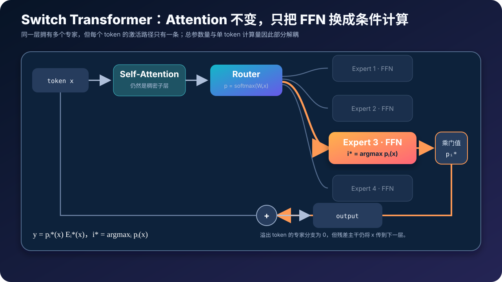
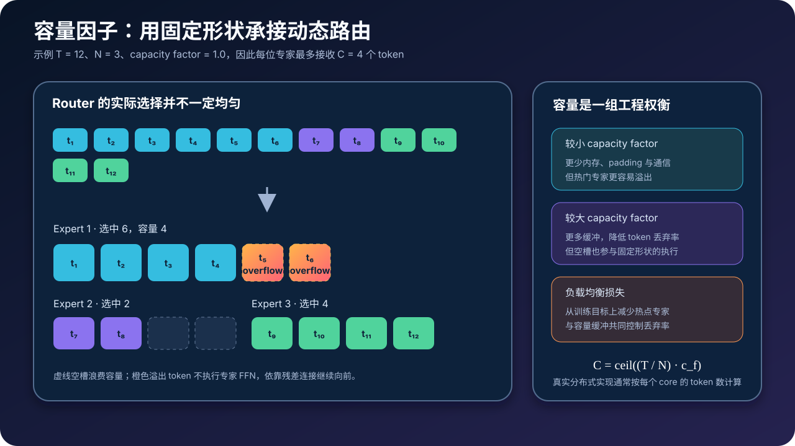
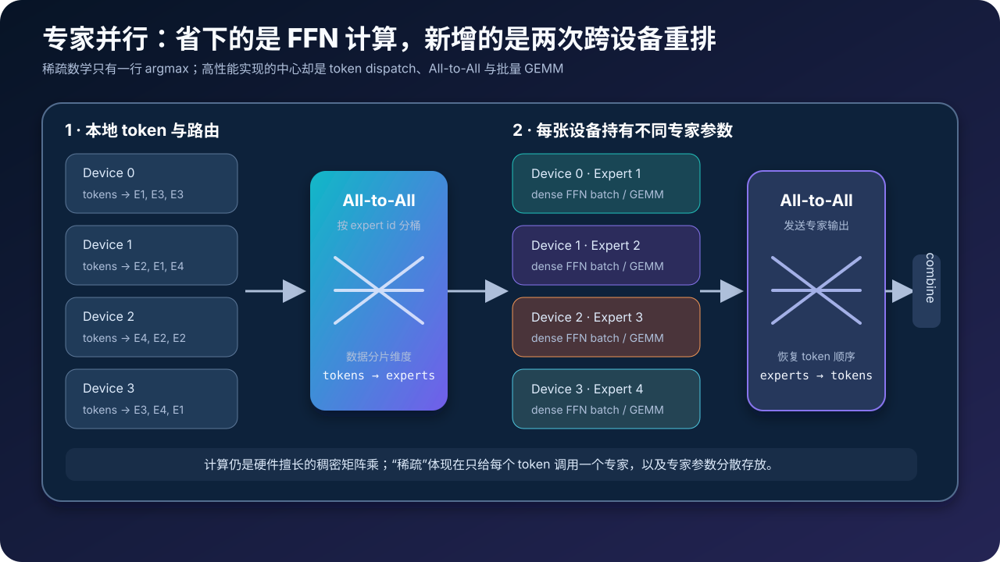

# Switch Transformer 原理与源码：Top-1 路由如何把模型容量与计算量解耦


> **论文**：[Switch Transformers: Scaling to Trillion Parameter Models with Simple and Efficient Sparsity](https://arxiv.org/abs/2101.03961)<br>
> **作者**：William Fedus、Barret Zoph、Noam Shazeer（Google）<br>
> **时间**：arXiv 预印本发布于 2021 年 1 月；修订版发表于 JMLR 2022<br>
> **关键词**：Mixture of Experts、Sparse Activation、Top-1 Routing、Expert Capacity、Load Balancing、Expert Parallelism<br>
> **配套源码**：[switch_transformer_minimal.py](./code/switch_transformer_minimal.py)

> 本文以论文中的 **Switch Transformer** 为准：它基于 T5，把部分稠密 FFN 替换为 Top-1 专家层。后来的 Shared Expert、Top-k without token dropping、细粒度专家、分组路由等改进不应倒灌成原论文设计。

## 0. 先说结论

Switch Transformer 的核心并不是“把 Transformer 全部稀疏化”，而是只改最适合扩容的 FFN 子层：准备 $N$ 份参数不同的 FFN，让 Router 为每个 token 只选择其中 **1 个**。

对 token 表示 $x$，最短的数学表达是：

$$
\boxed{
\begin{aligned}
p(x)&=\operatorname{softmax}(W_r x),\\
i^*&=\arg\max_i p_i(x),\\
y&=p_{i^*}(x)E_{i^*}(x)
\end{aligned}
}
$$

其中 $E_i$ 是第 $i$ 个 FFN 专家。虽然模型保存了全部 $N$ 个专家，但当前 token 只执行 $E_{i^*}$。

真正读懂这篇论文，需要同时抓住五点：

1. **稀疏的是 FFN 参数激活，不是 Attention 连接。** Self-Attention 仍然是稠密计算。
2. **Top-1 不等于没有软权重。** 只选择一个专家，但它的输出仍乘以连续的 gate probability $p_{i^*}(x)$。
3. **动态路由必须装进固定形状。** 每个专家只有有限容量，热门专家溢出的 token 会跳过该专家分支。
4. **负载均衡是模型目标的一部分。** 没有辅助损失，Router 很容易把流量集中到少数专家。
5. **MoE 的难点主要在系统。** 数学上的 `argmax` 很简单，高性能实现却需要 token 重排、两次 All-to-All、容量规划和跨设备监控。

一句话概括它的贡献：

> Switch Transformer 用更简单的 Top-1 条件计算，把“模型拥有多少参数”和“一个 token 执行多少参数”部分解耦，并证明这条路线可以稳定扩展到万亿参数规模。

---

## 1. 为什么稠密模型的扩展方式不够经济

### 1.1 稠密 Transformer：参数与计算一起增长

先看一个标准 Transformer FFN。忽略 bias，使用两层线性变换时：

$$
\operatorname{FFN}(x)
=W_2\,\sigma(W_1x)
$$

其中：

$$
W_1\in\mathbb R^{d_{ff}\times d},
\qquad
W_2\in\mathbb R^{d\times d_{ff}}
$$

它大约有：

$$
P_{\text{FFN}}\approx 2dd_{ff}
$$

个参数。一个 token 执行这层的主要计算量也与 $2dd_{ff}$ 同阶。

如果把 $d$、$d_{ff}$ 或层数继续放大：

- 总参数量增加；
- 每个 token 激活的参数量也增加；
- FLOPs、权重读取与跨卡模型并行成本随之增加。

也就是说，稠密模型只有一根主要的扩展旋钮：**让所有输入都使用一个更大的网络。**

### 1.2 条件计算：再增加一根“容量旋钮”

MoE 提供另一种扩展轴。把一个 FFN 复制成 $N$ 个参数独立的专家：

$$
E_1,E_2,\ldots,E_N
$$

总专家参数变成约：

$$
P_{\text{experts}}\approx N\cdot 2dd_{ff}
$$

但如果每个 token 只调用一个专家，专家部分的激活计算仍接近：

$$
C_{\text{active}}approx 2dd_{ff}
$$

另外只增加一个相对便宜的 Router：

$$
C_{\text{router}}=O(dN)
$$

所以 $N$ 增大时，总参数量可以近似线性增长，而单 token 的 FFN 计算基本不随 $N$ 线性增长。

这里必须加两个限定：

- “计算近似不变”不是“运行时间完全不变”，Router、padding 和通信都要付费；
- “只激活一个专家”也不是“只需要保存一个专家”，全部参数仍要分布在设备内存中。

### 1.3 Switch 研究的是第四条 Scaling 轴

论文把它描述为一条独立于模型宽度、数据量和计算预算的新扩展轴：

> 在每个样本 FLOPs 基本不变时，通过增加稀疏专家参数来扩大模型容量。

这也是 Switch Transformer 与普通“小模型加宽”最本质的区别。它没有免费创造计算，而是在相同计算路径长度下提供了更多可选择的参数集合。

---

## 2. Switch Layer 到底改了 Transformer 的哪里



### 2.1 不动 Attention，只替换 FFN

一个简化的 Pre-Norm Transformer Block 可以写成：

$$
h=x+\operatorname{Attention}(\operatorname{Norm}(x))
$$

$$
z=h+\operatorname{FFN}(\operatorname{Norm}(h))
$$

Switch Transformer 只把第二式改成：

$$
z=h+\operatorname{SwitchFFN}(\operatorname{Norm}(h))
$$

因此：

- token 之间的信息交换仍由 Self-Attention 完成；
- Router 对每个 token 独立决策；
- Expert 通常仍是普通两层 FFN；
- 专家之间结构相同、参数不同；
- 输出回到原 token 位置后，继续走残差主干。

论文的主要 T5 对比模型通常在**每隔一个 FFN 层**放置 Switch Layer，而不是把每一个 FFN 都换掉。是否每层都放 MoE 是模型设计选择，不是 Top-1 路由的数学要求。

### 2.2 从一般 MoE 到 Switch Top-1

一般 Top-k MoE 的输出是：

$$
y=\sum_{i\in\mathcal T(x)}p_i(x)E_i(x)
$$

其中 $\mathcal T(x)$ 是 Router 选出的 $k$ 个专家集合。

Switch 令 $k=1$：

$$
\mathcal T(x)=\{i^*\},
\qquad
i^*=\arg\max_i p_i(x)
$$

于是求和消失：

$$
y=p_{i^*}(x)E_{i^*}(x)
$$

Top-1 带来三类直接收益：

1. 每个 token 只做一次专家 FFN，而不是 Top-2 的两次；
2. token 只需要发送到一台专家设备，dispatch/combine 更简单；
3. 相同 token 数下，每位专家所需的平均容量约为 Top-2 的一半。

### 2.3 Router 的概率从哪里来

对隐藏状态 $x\in\mathbb R^d$，Router 是一个很小的线性分类器：

$$
h(x)=W_rx,
\qquad
W_r\in\mathbb R^{N\times d}
$$

再对专家维做 softmax：

$$
p_i(x)
=\frac{\exp(h_i(x))}
{\sum_{j=1}^N\exp(h_j(x))}
$$

得到：

- `expert_index = argmax(p)`：离散路径；
- `expert_gate = max(p)`：连续缩放系数。

这解释了一个常见疑问：既然 `argmax` 不可导，Router 怎么训练？

严格地说，梯度不会穿过“专家编号发生改变”这个离散操作；但在当前选择区域内，$p_{i^*}(x)$ 仍是可导的，主任务损失能更新选中 gate 的参数。后面还会看到，负载均衡损失通过完整概率向量 $p(x)$ 提供更直接的 Router 梯度。

> **易错点**：只写 `y = E[argmax(p)](x)` 会漏掉论文中的 gate scaling。它适合解释“选择了谁”，但不是完整的 Switch 输出公式。

---

## 3. 动态路由为什么需要 Expert Capacity



### 3.1 动态决策遇上静态张量

Router 的选择是数据相关的：今天一个 batch 可能有很多 token 选择 Expert 3，下一个 batch 又可能集中到 Expert 7。

但 TPU/GPU 上的高效批量矩阵乘希望输入形状固定。不能因为某个专家临时收到 17、93 或 241 个 token，就为每个专家启动大量不规则小 kernel。

论文因此给每个专家分配固定容量：

$$
\boxed{
C=
\left\lceil
\frac{T}{N}\cdot c_f
\right\rceil
}
$$

其中：

- $T$：参与本次路由的 token 数；
- $N$：专家数；
- $c_f$：capacity factor，容量因子；
- $C$：每个专家最多处理的 token 数。

概念上可以用整个 batch 的 $T$ 理解。论文的分布式伪代码实际按每个 core 的 `tokens_per_core` 计算容量，因为 dispatch 首先发生在本地分片上。

### 3.2 每个 token 还需要一个 slot 编号

只知道 `expert_index` 还不够。发往同一个专家的 token 必须占据不同槽位：

$$
\operatorname{slot}(t)
=\sum_{t'\le t}\mathbf 1[i^*(t')=i^*(t)]-1
$$

张量实现通常对 one-hot expert mask 沿 token 维做 `cumsum`。若：

$$
\operatorname{slot}(t)<C
$$

token 被接收；否则它成为 overflow token。

### 3.3 Overflow token 到底发生了什么

论文的处理很简单：超出容量的 token **跳过本次专家 FFN 计算**。

在代码里，这等价于让该 token 的专家分支输出为零：

$$
\operatorname{SwitchFFN}(x_t)=0
$$

但 Transformer Block 外面还有残差连接：

$$
z_t=h_t+0=h_t
$$

所以它不是从序列中删除，也不是变成全零隐藏状态，而是原表示通过残差直接进入下一层。

### 3.4 Capacity factor 在交换什么

增大 $c_f$：

- 为流量不均提供更多缓冲；
- 降低 token overflow 概率；
- 但增加空槽、激活内存、计算和通信。

减小 $c_f$：

- 固定张量更紧凑；
- 吞吐可能更高；
- 但 Router 略不均衡就会丢弃更多专家分支。

论文实验中，在足够强的负载均衡约束下，典型 token 丢弃率低于 1%。这不是 Top-1 天然保证，而是容量因子、batch 构成与辅助损失共同作用的结果。

> **实现提醒**：padding token 不应参与真实负载统计，否则 Router 可能学会“平衡 padding”，容量也会被无效位置占用。教学代码常省略 attention mask，生产实现不能省。

---

## 4. 负载均衡损失：防止所有 token 挤向同一专家

### 4.1 为什么主任务损失不会自动给出均衡路由

假设训练早期 Expert 2 偶然比其他专家更好一点，Router 会发送更多 token 给它。Expert 2 因为得到更多训练样本又进步更快，形成正反馈：

```text
稍强的专家 → 更多 token → 更多梯度 → 更强的专家 → 更集中路由
```

结果可能是：

- 少数专家持续过载；
- 大量 token overflow；
- 冷门专家几乎没有训练信号；
- 标称总参数很大，有效容量却很小。

因此路由均衡不是性能监控的附属项，而是训练目标的一部分。

### 4.2 两个容易混淆的统计量

一个 batch 有 $T$ 个 token、$N$ 个专家。对专家 $i$，定义硬路由比例：

$$
f_i
=\frac{1}{T}
\sum_{x\in\mathcal B}
\mathbf 1[\arg\max p(x)=i]
$$

$f_i$ 回答：“实际有多少 token 选择了专家 $i$？”它来自 `argmax`，不可导。

再定义平均概率质量：

$$
P_i
=\frac{1}{T}
\sum_{x\in\mathcal B}p_i(x)
$$

$P_i$ 回答：“Router 平均把多少软概率给了专家 $i$？”它由 softmax 得到，可导。

注意大小写：

- $p_i(x)$ 是一个 token 对专家 $i$ 的概率；
- $P_i$ 是整个 batch 上的平均概率。

### 4.3 Switch 的辅助损失

论文使用：

$$
\boxed{
\mathcal L_{\text{balance}}
=\alpha N\sum_{i=1}^{N}f_iP_i
}
$$

直觉是：一个专家如果既有很高的实际 token 比例 $f_i$，又得到很高的概率质量 $P_i$，乘积会显著抬高损失。优化器因而压低热门专家的概率，并把质量转移给冷门专家。

理想均匀状态下：

$$
f_i=P_i=\frac1N
$$

所以：

$$
\mathcal L_{\text{balance}}
=\alpha N\cdot N\cdot\frac1{N^2}
=\alpha
$$

外面的 $N$ 让均匀状态的损失尺度不随专家数改变，便于跨模型复用超参数。论文主要实验使用：

$$
\alpha=10^{-2}
$$

总训练目标是：

$$
\mathcal L
=\mathcal L_{\text{task}}
+\sum_{\ell\in\text{Switch layers}}
\mathcal L_{\text{balance}}^{(\ell)}
$$

### 4.4 梯度到底流向哪里

计算辅助损失时，可以把硬比例视为停止梯度：

```python
hard_fraction = expert_mask.float().mean(dim=0)  # f_i，不可导选择
prob_fraction = router_probs.mean(dim=0)         # P_i，可导
aux_loss = alpha * num_experts * (hard_fraction * prob_fraction).sum()
```

梯度通过 $P_i$ 回到所有 token 的 softmax 概率和 Router 权重；它不需要对 `argmax` 求导。

### 4.5 训练时至少监控这四组量

只看语言模型 loss，很难及时发现路由已经坏掉。每个 Switch Layer 最好记录：

| 指标 | 说明 | 异常信号 |
|---|---|---|
| `selected_load[i]` | 容量裁剪前选择专家 $i$ 的 token 数 | 少数专家长期占满 |
| `accepted_load[i]` | 容量裁剪后真正执行的 token 数 | 多个专家总在容量上限 |
| `drop_rate` | overflow token 比例 | 持续升高或层间差异极大 |
| `router_entropy` | 路由概率熵 | 过低可能过早塌缩，过高可能无专业化 |

还可以记录每位专家收到的语言、token 类型或任务分布，但不要把“专家编号”直接解释成稳定的人类语义。专家专业化通常是统计现象，不保证形成整齐的“数学专家”“代码专家”。

---

## 5. Dispatch 与 Combine：一行公式背后的真实张量

### 5.1 Dispatch Tensor

把输入 batch 与序列维展平：

$$
X\in\mathbb R^{T\times d}
$$

为每个 token 确定 `expert_index` 和 `slot` 后，可以构造布尔 Dispatch Tensor：

$$
D\in\{0,1\}^{T\times N\times C}
$$

若 token $t$ 被放到 expert $i$ 的 slot $c$，则：

$$
D_{t,i,c}=1
$$

专家输入为：

$$
X^{(E)}_{i,c,:}
=\sum_{t=1}^{T}D_{t,i,c}X_{t,:}
$$

它的形状是：

$$
X^{(E)}\in\mathbb R^{N\times C\times d}
$$

这样每个专家都拿到固定的 $[C,d]$ 小 batch，可以执行硬件擅长的稠密 GEMM。

### 5.2 Combine Tensor

Combine Tensor 在 Dispatch 的基础上乘 gate：

$$
G_{t,i,c}=p_i(x_t)D_{t,i,c}
$$

令专家输出为：

$$
Y^{(E)}_{i,c,:}=E_i(X^{(E)}_{i,c,:})
$$

恢复原 token 顺序：

$$
Y_{t,:}
=\sum_{i=1}^{N}\sum_{c=1}^{C}
G_{t,i,c}Y^{(E)}_{i,c,:}
$$

Top-1 意味着每个未溢出的 token 在 $D$ 中恰好只有一个非零位置。公式写成大张量便于解释与静态编译，真实框架往往使用排序、索引、分桶和 fused kernel，避免显式物化巨大的稀疏 one-hot 张量。

### 5.3 专家并行为什么需要两次 All-to-All



假设不同专家参数分布在不同设备：

1. 每台设备持有一部分原始 token，先本地计算 Router；
2. token 按 `expert_index` 分桶与重排；
3. 第一次 All-to-All 把 token 发给持有对应专家的设备；
4. 各设备对本地专家 batch 执行普通稠密 FFN；
5. 第二次 All-to-All 把专家输出送回 token 原来的设备；
6. Combine 按原序列位置恢复，并乘 gate probability。

这说明 MoE 的“稀疏”并不是在硬件上做任意稀疏矩阵乘。它用动态路由把 token 组织成多个小而稠密的 batch，再执行成熟的 GEMM。

### 5.4 参数、FLOPs 与通信要分开算

令每个专家是两层 FFN，则一层 Switch FFN 的粗略量级为：

| 项目 | 量级 |
|---|---:|
| 专家总参数 | $O(Ndd_{ff})$ |
| 单 token 专家 FLOPs | $O(dd_{ff})$ |
| Router 参数 | $O(dN)$ |
| 单 token Router FLOPs | $O(dN)$ |
| Dispatch 通信量 | 与 token 表示、容量和设备映射相关 |

因此“专家数增加但 FLOPs 不变”是对主要 FFN 计算的近似描述。专家数非常大时，Router 自身、设备数量、网络拓扑和 padding 都会成为不可忽略的项。

---

## 6. 为什么 Top-1 反而可能优于 Top-2

在 Switch 之前，稀疏 MoE 常用 Top-2：一个 token 同时走两个专家，再加权合并。直觉上，多一条路径似乎更稳。

Switch 的实验却表明，在其训练与系统设置下，Top-1 能在速度—质量上优于 Top-2。原因不是 Top-1 表达力一定更强，而是它把省下的预算转化成了更有效的规模：

- 每个 token 少执行一次 FFN；
- 每个 token 少一次目的专家通信；
- 专家容量需求降低；
- dispatch/combine 张量更简单；
- 相同硬件时间内可以训练更多步，或把宽度预算加回模型。

论文 Table 1 的同硬件比较中，128 专家的 Switch-Base 在 capacity factor 为 1.0 时达到约 1000 examples/s；对应 Top-2 MoE-Base 约 860 examples/s。更重要的是，论文比较的是到达固定质量所需时间，而不是只看单步吞吐。

不能从这里推出“Top-1 永远胜过 Top-2”。最佳 $k$ 取决于：

- 专家结构与粒度；
- 路由目标；
- token dropping 策略；
- 设备互联与 kernel；
- 训练规模和推理 batch；
- 是否存在共享专家。

Switch 的贡献是证明：**$k=1$ 并不会必然破坏 Router 学习，而且能显著简化大规模稀疏训练。**

---

## 7. 稳定训练的四个关键技巧

### 7.1 Router 局部使用 float32

低精度 softmax 对较大的 Router logits 很敏感。论文发现，全模型直接使用 bfloat16 可能发散。

解决方式是 selective precision：

1. 把 Router 输入或 logits 转为 float32；
2. 在线性路由、softmax、Top-1 和容量 mask 中使用 float32；
3. 构造完 dispatch/combine 后转回 bfloat16；
4. All-to-All 不传输昂贵的 float32 激活。

伪代码：

```python
router_input_fp32 = hidden_states.float()
router_logits = router(router_input_fp32)
router_probs = torch.softmax(router_logits, dim=-1)
gate, expert_index = router_probs.max(dim=-1)

# combine/专家输入回到主干精度，避免跨设备传 fp32 激活
gate = gate.to(hidden_states.dtype)
```

论文 Table 2 中，纯 bfloat16 的 Switch-Base 发散；Router 局部 float32 的 selective precision 达到与全 float32 接近的质量，同时保持接近 bfloat16 的吞吐。

### 7.2 初始化尺度缩小 10 倍

论文建议把标准 Transformer 权重初始化尺度乘以 0.1。

若原始截断正态标准差写作：

$$
\sigma=\sqrt{\frac{s}{n}}
$$

则把初始化 scale $s$ 对应的整体尺度显著减小，可降低训练早期路由与激活方差。论文在 32 专家模型上观察到更低的方差和更好的早期质量。

### 7.3 Fine-tuning 时提高 Expert Dropout

稀疏模型的总参数远多于 FLOP-matched 稠密模型，小数据微调更容易过拟合。

论文的有效配方是：

- 非专家层 dropout 保持 0.1；
- 专家 FFN 内部 dropout 提高到 0.4。

重点是只加强专家分支的正则，而不是把全模型 dropout 一起调高。具体数值来自论文任务，不应无条件复制到所有模型。

### 7.4 探索噪声是辅助项，不是核心定义

论文还研究了 deterministic argmax、按 softmax 采样、输入 dropout、乘性 jitter noise 等探索策略。其附录伪代码在训练时为路由加入小噪声。

这些策略可以避免训练早期路径过快固化，但 Switch 的核心定义仍是 Top-1 路由、容量约束和负载均衡；不能把某一种噪声写成所有 Switch 实现都必须具备的结构。

---

## 8. 从公式到代码：一个能看见容量语义的实现

### 8.1 先写 Router，而不是先写专家

下面是一个紧凑的 PyTorch 风格实现。它保留了五个关键语义：

- Router 使用 float32；
- Top-1 仍保留 gate；
- 辅助损失在容量裁剪前统计硬路由；
- 用 `cumsum` 计算专家槽位；
- overflow token 的专家分支输出为 0。

```python
import math
import torch
import torch.nn as nn
import torch.nn.functional as F


class Expert(nn.Module):
    def __init__(self, d_model: int, d_ff: int):
        super().__init__()
        self.net = nn.Sequential(
            nn.Linear(d_model, d_ff, bias=False),
            nn.GELU(),
            nn.Linear(d_ff, d_model, bias=False),
        )

    def forward(self, x: torch.Tensor) -> torch.Tensor:
        return self.net(x)


class SwitchFFN(nn.Module):
    def __init__(
        self,
        d_model: int,
        d_ff: int,
        num_experts: int,
        capacity_factor: float = 1.0,
        balance_alpha: float = 1e-2,
    ):
        super().__init__()
        self.num_experts = num_experts
        self.capacity_factor = capacity_factor
        self.balance_alpha = balance_alpha
        self.router = nn.Linear(d_model, num_experts, bias=False)
        self.experts = nn.ModuleList(
            Expert(d_model, d_ff) for _ in range(num_experts)
        )
        # 论文配方：truncated normal 的 scale s 从 1.0 降到 0.1，
        # 即 std = sqrt(0.1 / fan_in)。
        for module in self.modules():
            if isinstance(module, nn.Linear):
                std = math.sqrt(0.1 / module.in_features)
                nn.init.trunc_normal_(
                    module.weight,
                    mean=0.0,
                    std=std,
                    a=-2 * std,
                    b=2 * std,
                )

    def forward(self, x: torch.Tensor):
        # x: [batch, seq, d_model]
        original_shape = x.shape
        tokens = x.reshape(-1, original_shape[-1])  # [T, d]
        token_count = tokens.shape[0]

        # Selective precision：路由局部使用 fp32。
        router_logits = F.linear(
            tokens.float(), self.router.weight.float()
        )
        router_probs = F.softmax(router_logits, dim=-1)  # [T, N]
        gates, expert_index = router_probs.max(dim=-1)   # [T], [T]

        # 容量裁剪前的 one-hot 路由，用于论文的 f_i 与 P_i。
        expert_mask = F.one_hot(
            expert_index, num_classes=self.num_experts
        ).to(router_probs.dtype)
        hard_fraction = expert_mask.mean(dim=0)  # f_i
        prob_fraction = router_probs.mean(dim=0) # P_i
        balance_loss = (
            self.balance_alpha
            * self.num_experts
            * torch.sum(hard_fraction * prob_fraction)
        )

        capacity = max(
            1,
            math.ceil(
                self.capacity_factor
                * token_count
                / self.num_experts
            ),
        )

        # 每列各自 cumsum，得到 token 在所选 expert 内的 0-based slot。
        position_in_expert = torch.cumsum(expert_mask, dim=0) - 1
        token_position = position_in_expert.gather(
            1, expert_index[:, None]
        ).squeeze(1)
        keep = token_position < capacity

        # 教学版使用循环；分布式高性能实现会排序、分桶并 All-to-All。
        output = torch.zeros_like(tokens)
        for expert_id, expert in enumerate(self.experts):
            token_mask = (expert_index == expert_id) & keep
            if token_mask.any():
                expert_output = expert(tokens[token_mask])
                output[token_mask] = (
                    gates[token_mask].to(tokens.dtype).unsqueeze(-1)
                    * expert_output
                )

        stats = {
            "capacity": capacity,
            "selected_load": expert_mask.sum(dim=0).detach(),
            "drop_rate": (~keep).float().mean().detach(),
        }
        return output.view(original_shape), balance_loss, stats
```

外层 Block 必须负责残差：

```python
expert_update, aux_loss, stats = switch_ffn(norm(hidden_states))
hidden_states = hidden_states + dropout(expert_update)
```

这样 overflow token 对应的 `expert_update == 0`，但 `hidden_states` 仍沿残差主干保留。

### 8.2 为什么上面的循环“正确但不快”

按专家做布尔索引已经表达了逻辑，但它会产生：

- Python 循环；
- 不规则长度的小 tensor；
- 多次 kernel launch；
- 很差的跨设备扩展性。

生产实现通常改成：

```text
route → sort/group by expert → pad to capacity
      → all-to-all → grouped GEMM
      → all-to-all → unsort/combine
```

所以不要用这个教学循环测 MoE 吞吐，也不要据此得出“MoE 比稠密 FFN 慢”的系统结论。

### 8.3 配套的零依赖可运行脚本

[switch_transformer_minimal.py](./code/switch_transformer_minimal.py) 只使用 Python 标准库，实现了：

- 稳定 softmax；
- Top-1 选择与 gate；
- capacity/slot/overflow；
- $\alpha N\sum_i f_iP_i$；
- 多个参数独立的 FFN Expert；
- overflow token 的残差旁路；
- 负载与丢弃率断言。

运行：

```bash
python3 papers/to-2026/code/switch_transformer_minimal.py
```

固定随机种子的示例输出为：

```text
tokens:           17
experts:          4
expert capacity:  5
selected load:    [6, 0, 3, 8]
accepted load:    [5, 0, 3, 5]
dropped tokens:   4
auxiliary loss:   0.010664
```

这个 tiny demo 使用未训练 Router 和极小 token batch，故意让不均衡与 overflow 清晰可见；它的高丢弃率不是对论文训练结果的复现。

它是可审计的算法参考，不含自动求导和 All-to-All。真实训练应使用框架的 grouped GEMM、expert parallel 与分布式通信实现。

---

## 9. 手算一个 6-token 路由例子

假设：

- $T=6$ 个 token；
- $N=3$ 个专家；
- capacity factor $c_f=1$；
- 因此每个专家容量 $C=2$。

Router 给出：

| token | $p_1$ | $p_2$ | $p_3$ | Top-1 | slot | keep? |
|---:|---:|---:|---:|---:|---:|:---:|
| $x_1$ | 0.70 | 0.20 | 0.10 | E1 | 0 | ✓ |
| $x_2$ | 0.60 | 0.25 | 0.15 | E1 | 1 | ✓ |
| $x_3$ | 0.55 | 0.30 | 0.15 | E1 | 2 | ✗ |
| $x_4$ | 0.10 | 0.80 | 0.10 | E2 | 0 | ✓ |
| $x_5$ | 0.15 | 0.70 | 0.15 | E2 | 1 | ✓ |
| $x_6$ | 0.20 | 0.20 | 0.60 | E3 | 0 | ✓ |

硬路由比例为：

$$
f=\left[\frac36,\frac26,\frac16\right]
$$

平均概率质量为：

$$
P
=\frac16
\left[
2.30,
2.45,
1.25
\right]
\approx[0.383,0.408,0.208]
$$

辅助损失：

$$
\mathcal L_{\text{balance}}
=3\alpha
\left(
\frac36\cdot0.383
+\frac26\cdot0.408
+\frac16\cdot0.208
\right)
\approx1.086\alpha
$$

$x_3$ 因为是第三个选择 E1 的 token，`slot=2`，超出 $C=2$。它在这一层不执行 $E_1(x_3)$，但残差仍把 $x_3$ 传下去。

这个小例子把四件事分开了：

1. softmax 概率；
2. argmax 专家编号；
3. 专家内部槽位；
4. 容量裁剪后的执行 mask。

实际调试 MoE 时，也应该分别观察它们，而不是只输出 `expert_index`。

---

## 10. 论文实验应该怎样解读

### 10.1 “7× 更快”不是单步吞吐快 7 倍

论文报告，64 专家的 Switch-Base 在相同计算资源下，达到 T5-Base 相近预训练质量所需时间约为后者的 $1/7$。

这个结论表达的是 **time-to-quality**：

$$
\text{speedup}
=\frac{\text{baseline 达到目标质量的时间}}
{\text{Switch 达到目标质量的时间}}
$$

它综合了：

- 每步吞吐；
- 每个 token 的 FLOPs；
- 参数容量带来的样本效率；
- 训练曲线收敛速度。

不能把它改写成“Switch 的一次前向比 T5 快 7 倍”。

### 10.2 与更大的稠密模型比较

论文还把 Switch-Base 与 T5-Large 比较。T5-Large 每 token 使用约 3.5 倍 FLOPs，但 Switch-Base 仍然有更好的样本效率，并给出约 2.5 倍的 time-to-quality 优势。

这支持论文的核心假设：在一定范围内，**增加可选择的参数容量**，可能比让每个 token 执行更多稠密计算更有效。

### 10.3 万亿参数实验的三个数字

论文的大模型配置可以概括为：

| 模型 | 总参数 | 专家数 | FLOPs / sequence | 设计目的 |
|---|---:|---:|---:|---|
| T5-XXL | 13B | — | 8.7T | 强稠密基线 |
| Switch-XXL | 395B | 64 | 8.7T | 与 T5-XXL FLOP-matched |
| Switch-C | 1.571T | 2048 | 890B | 主要使用专家并行扩大容量 |

Switch-C 的参数量达到约 1.6T，但每个序列的计算量显著低于 T5-XXL；论文报告它在相同计算预算下达到固定 perplexity 的速度约快 4 倍。

这张表也揭示：

- **总参数量不能代表单次计算量**；
- **单次 FLOPs 也不能代表通信与部署难度**；
- 比较 MoE 时至少要同时报告总参数、激活参数/FLOPs、专家数、路由 $k$ 和硬件规模。

### 10.4 多语言与蒸馏结果

论文的 mSwitch-Base 在所评估的 101 种语言上都改善了相对 mT5-Base 的预训练指标；平均 time-to-quality speedup 约 5 倍，91% 的语言至少达到 4 倍。

论文还把稀疏教师蒸馏到小型稠密模型：模型尺寸最多减少约 99%，但只保留约 30% 的稀疏模型质量增益。它说明 MoE 可以作为高容量教师，却也说明“训练时稀疏、部署时自动无损变稠密”并不存在。

### 10.5 Upstream 变好不保证所有 Downstream 都同步变好

最大的 Switch 模型在 C4 预训练损失上明显改善，但这些收益没有在所有推理类下游任务上完整转化。论文附录观察到：

- 知识密集任务的收益更明显；
- 大规模下，固定预训练 perplexity 时，稠密模型在部分 SuperGLUE 结果上可能更好；
- fine-tuning 对正则、负载均衡和超参数非常敏感。

因此“参数容量更大、预训练 loss 更低”不等于“任何下游能力都按比例更强”。

---

## 11. 为什么 Switch Transformer 有效

### 11.1 容量与计算部分解耦

它最直接的价值是：同样的 token 不必激活全部参数。模型可以拥有更多记忆与变换能力，而单条路径仍保持较小。

### 11.2 每个专家仍能使用高效稠密计算

Switch 没有要求硬件高效执行任意元素级稀疏矩阵。Router 先把 token 分组，每个专家内部仍然是规整的 FFN GEMM。这使它能建立在成熟加速器能力之上。

### 11.3 输入相关的参数共享

稠密 FFN 对所有 token 使用同一套权重；Switch 让参数共享变成条件式：

$$
x_a\rightarrow E_2,
\qquad
x_b\rightarrow E_7
$$

这允许不同输入分布在参数空间中减少直接干扰。专家不一定对应可命名的语义，但模型获得了更灵活的函数分区。

### 11.4 Top-1 把算法优势转成系统优势

如果稀疏算法过于复杂，节省的 FLOPs 会被通信、padding 和调度吃掉。Top-1 的价值就在于把每个 token 的目的地压缩为一个，使大规模专家并行更可实现。

---

## 12. 局限：MoE 不是“免费参数”

### 12.1 总权重仍要驻留

一个 1.6T 参数模型即使每 token 只激活一小部分，也必须让全部专家权重存在于某个设备或存储层级。它解决主要是计算扩展，不自动解决：

- 聚合显存容量；
- checkpoint 体积；
- 权重加载时间；
- 容错与恢复；
- 小规模部署。

### 12.2 网络可能取代算力成为瓶颈

每层两次 All-to-All 对互联带宽和拓扑很敏感。设备更多、专家更分散时，理论 FLOPs 更低并不保证 wall-clock 更快。

### 12.3 容量限制会改变模型函数

同一个 token 是否 overflow 取决于同 batch 里其他 token 的路由选择。因此固定容量实现可能引入 batch-dependent 行为：换一组同批样本，某个 token 的专家分支可能从执行变成跳过。

这也是后来很多 MoE 工作继续研究 dropless routing、动态容量和更稳定 dispatch 的原因。

### 12.4 Router 容易形成热点与抖动

负载均衡系数太小，热门专家溢出；太大，Router 可能为了“均匀”牺牲任务最优分工。训练早期的微小偏差还会被强化。

### 12.5 推理未必适合所有 batch 规模

大 batch 能把同专家 token 聚成较大的 GEMM；逐 token、低 batch 解码时，每个专家收到的工作可能很少，kernel 利用率差，同时仍要跨设备取权重或传激活。

所以训练高吞吐、离线批推理与在线低延迟服务，是三套不同的 MoE 系统问题。

---

## 13. 五个常见误解

### 误解 1：Switch 把 Attention 做成了稀疏 Attention

错。稀疏的是 FFN 专家激活；Self-Attention 仍然连接序列中的 token。

### 误解 2：有 128 个专家，一个 token 就计算 128 份 FFN

错。它只计算 Top-1 专家。128 份是总参数容量，不是当前 token 的激活路径。

### 误解 3：Top-1 输出就是 `expert(x)`

不完整。论文输出是：

$$
p_{i^*}(x)E_{i^*}(x)
$$

gate probability 仍参与缩放与 Router 学习。

### 误解 4：Overflow token 被模型彻底删除

错。它跳过这一层的专家分支，外层残差仍把原表示传递下去。

### 误解 5：万亿参数意味着万亿参数都参与一次前向

错。总参数与激活参数必须分开。反过来，总参数未激活也不意味着无需存储与通信。

---

## 14. 与后续 MoE 的关系

Switch Transformer 奠定的是一套非常清晰的问题框架：

```text
Router 如何选择？
每 token 激活几个专家？
专家容量如何定义？
怎样避免负载塌缩？
token 如何跨设备 dispatch/combine？
总参数、激活参数、FLOPs 与吞吐如何一起报告？
```

后来的 MoE 模型会改变其中一些答案，例如：

- 从 Top-1 回到 Top-2 或更多路由专家；
- 加入始终激活的 Shared Expert；
- 使用更多、更小的细粒度专家；
- 使用 dropless dispatch 或不同容量策略；
- 用无辅助损失或偏置式策略做负载均衡；
- 在 GPU 上使用 grouped GEMM 与专用通信重叠。

但它们仍然在处理 Switch 明确提出的同一组矛盾：**容量、激活计算、负载、通信和稳定性。**

阅读 Mixtral、GLaM、ST-MoE 或现代 DeepSeek MoE 时，先用本文五元组做对照会很有效：

$$
(N,\ k,\ C,\ \mathcal L_{\text{balance}},\ \text{parallel layout})
$$

---

## 15. 推荐阅读顺序

### 前置知识

1. [Transformer](./00_Transformer_2017_原理.md)：先理解 Attention、FFN 与残差；
2. [T5](./04_T5_2020_原理.md)：Switch 的实验骨架和预训练任务来自 T5；
3. [Scaling Laws](./06_Scaling_Laws_2020_原理.md)：理解“固定 FLOPs 增加容量”为什么是一条新扩展轴。

### 阅读原论文时优先看

1. Section 2.1：为什么把 Top-k 简化为 Top-1；
2. Section 2.2：capacity、overflow 与负载均衡损失；
3. Section 2.4：selective precision、初始化和 expert dropout；
4. Section 3：不要混淆 step、throughput 与 time-to-quality；
5. Section 5：数据并行、模型并行和专家并行如何组合；
6. Appendix F：把公式对应到 dispatch/combine 伪代码。

### 读完接着看

- [Mixtral](./27_Mixtral_2024_原理.md)：比较 Top-2 开源 MoE 与 Switch Top-1；
- GShard：理解 Switch 之前的大规模 Top-2 MoE 与自动分片；
- ST-MoE：继续看稀疏模型稳定性与迁移；
- 专家并行框架源码：理解 All-to-All、grouped GEMM 和通信重叠。

---

## 16. 最后总结

Switch Transformer 可以被压缩成一条主线：

```text
复制 FFN 成多个专家
        ↓
Router 为每个 token 计算专家概率
        ↓
Top-1 只选择一个专家，并保留 gate 权重
        ↓
capacity 把动态路由装进固定形状
        ↓
负载均衡损失减少热点与 overflow
        ↓
All-to-All 将 token 送到专家设备并取回输出
        ↓
以接近稠密小模型的激活计算，获得大得多的总参数容量
```

它最重要的遗产不是“1.6T”这个规模数字，而是把一个复杂的条件计算想法简化到可以大规模工程化：

$$
\boxed{\text{一个 token，一位专家，一条稀疏路径}}
$$

而这条简单路径背后，容量、负载、精度和通信缺一不可。只讲 `argmax`，还没有真正讲完 Switch Transformer。

---

## 参考资料

1. [Switch Transformers: arXiv 版本](https://arxiv.org/abs/2101.03961)
2. [Switch Transformers: JMLR 论文页](https://www.jmlr.org/papers/v23/21-0998.html)
3. [Switch Transformers: JMLR PDF](https://www.jmlr.org/papers/volume23/21-0998/21-0998.pdf)
4. [论文对应的 Mesh TensorFlow MoE 源码](https://github.com/tensorflow/mesh/blob/master/mesh_tensorflow/transformer/moe.py)
5. [GShard: Scaling Giant Models with Conditional Computation and Automatic Sharding](https://arxiv.org/abs/2006.16668)
6. [Exploring the Limits of Transfer Learning with a Unified Text-to-Text Transformer（T5）](https://www.jmlr.org/papers/v21/20-074.html)
7. [Mixtral of Experts](https://arxiv.org/abs/2401.04088)
