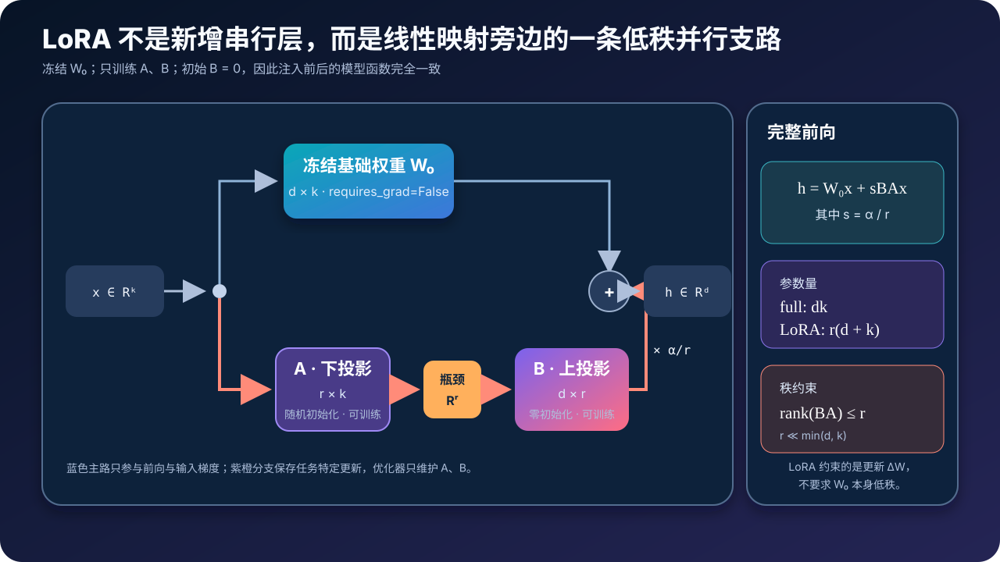
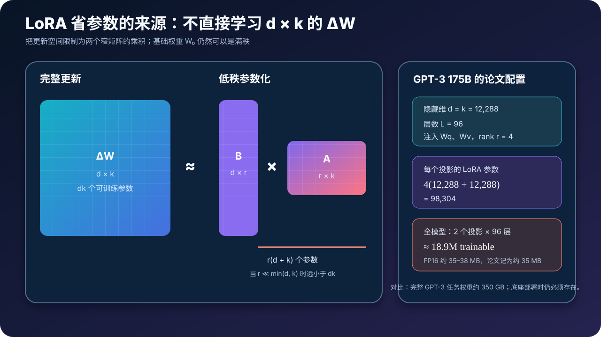
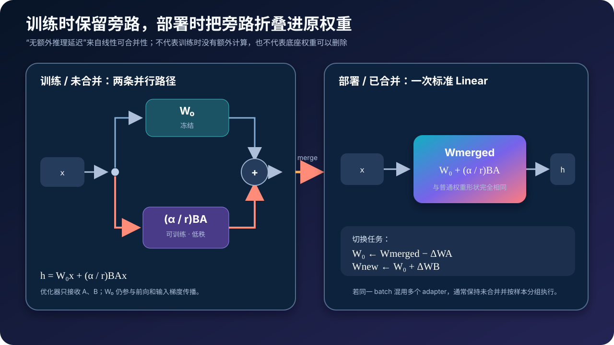

# LoRA 原理与源码：为什么一条低秩旁路就能微调大模型


> **论文**：[LoRA: Low-Rank Adaptation of Large Language Models](https://arxiv.org/abs/2106.09685)<br>
> **作者**：Edward J. Hu、Yelong Shen、Phillip Wallis 等（Microsoft）<br>
> **时间**：arXiv v1 发布于 2021 年 6 月；发表于 ICLR 2022<br>
> **关键词**：Parameter-Efficient Fine-Tuning、Low-Rank Update、Adapter、Weight Merging、Intrinsic Rank<br>
> **配套源码**：[lora_minimal.py](./code/lora_minimal.py)

> 本文首先解释 **LoRA 原论文**。论文主要研究 Transformer Attention 的 $W_q/W_k/W_v/W_o$，常用配置只适配 $W_q$ 与 $W_v$。今天常见的全线性层 LoRA、LoRA dropout、量化底座、DoRA、AdaLoRA 等属于实现扩展或后续研究，文中会明确区分，不把它们倒灌为原始定义。

## 0. 先说结论

LoRA 不直接训练一个与原权重同样大的更新矩阵 $\Delta W$，而是把它写成两个窄矩阵的乘积：

$$
\boxed{
W=W_0+\Delta W
=W_0+\frac{\alpha}{r}BA
}
$$

对输入 $x$，前向为：

$$
\boxed{
h=W_0x+\frac{\alpha}{r}B(Ax)
}
$$

其中：

$$
W_0\in\mathbb R^{d\times k},\quad
A\in\mathbb R^{r\times k},\quad
B\in\mathbb R^{d\times r},\quad
r\ll\min(d,k)
$$

训练时：

- $W_0$ 冻结；
- 只更新 $A$ 与 $B$；
- $A$ 随机初始化、$B$ 初始化为零；
- 初始 $BA=0$，模型注入 LoRA 前后输出完全一致。

部署时可以预先计算：

$$
W_{\text{merged}}
=W_0+\frac{\alpha}{r}BA
$$

随后仍只执行一次普通 Linear，所以 LoRA 不必增加推理层数和延迟。

真正理解 LoRA，需要同时记住六点：

1. **低秩的是任务更新 $\Delta W$，不是基础权重 $W_0$。**
2. **LoRA 是并行支路，不是插在主干后面的串行瓶颈层。**
3. **冻结参数不等于参数不存在。** 底座权重仍要驻留，也仍参与前向和输入梯度计算。
4. **省显存主要来自不保存底座梯度和优化器状态。** 激活显存不会自动消失。
5. **rank 不是越大越好。** 在固定参数预算下，覆盖更多合适模块可能比把一个模块的 rank 做大更有效。
6. **LoRA 是适配方法，不是模型压缩方法。** 它缩小任务增量，不会直接缩小基础模型推理成本。

---

## 1. LoRA 要解决的不是“能不能微调”，而是“能不能管理很多微调模型”

### 1.1 全量微调的第一笔账：每个任务一整份权重

设预训练模型参数为 $\Phi_0$。对任务 $t$ 做全量微调后：

$$
\Phi_t=\Phi_0+\Delta\Phi_t
$$

即使不同任务共享相同起点，每个 $\Phi_t$ 仍与原模型一样大。若一个 FP16 模型有 175B 参数，单份权重约为：

$$
175\times10^9\times2\ \text{bytes}
\approx350\ \text{GB}
$$

为 100 个任务分别保存完整模型，理论体量约 35 TB。真正的问题不只是一次训练贵，而是：

- checkpoint 存储；
- 任务切换时的权重加载；
- 多租户部署；
- 多份模型副本的显存；
- 训练过程中的 checkpoint I/O。

### 1.2 第二笔账：Adam 为每个可训练参数维护状态

训练一个参数，通常不只保存参数本身。以混合精度 Adam 为例，具体框架可能需要：

- 低精度模型权重；
- 参数梯度；
- FP32 master weight；
- 一阶动量 $m$；
- 二阶动量 $v$。

不同实现、ZeRO/FSDP 分片和精度策略会改变字节数，不能死记一个固定倍数。但结论稳定：**让 175B 参数都可训练，优化器状态会成为巨大的显存负担。**

### 1.3 既有 PEFT 方法仍有代价

LoRA 之前已有多种参数高效适配：

- Adapter：在 Block 中插入小型串行网络；
- Prefix/Prompt Tuning：学习额外的连续 prompt；
- BitFit：只训练 bias；
- 只微调顶部几层或部分参数。

论文关注的两个生产问题是：

1. 串行 Adapter 即使参数少，也会增加执行深度和 kernel/通信同步；
2. Prefix 方法会占用可用序列位置，并且性能不一定随参数量单调增长。

LoRA 的目标因此很具体：

> 只保存一个很小的任务增量，同时让这个增量可以在部署前折叠进原权重，不新增串行推理路径。

---

## 2. 核心数学：用两个窄矩阵表示权重更新



### 2.1 从全量更新开始

一个普通线性层：

$$
h=W_0x
$$

全量微调直接学习同形状更新：

$$
h=(W_0+\Delta W)x
$$

若：

$$
W_0,\Delta W\in\mathbb R^{d\times k}
$$

那么 $\Delta W$ 有 $dk$ 个可训练参数，理论秩最多为 $\min(d,k)$。

### 2.2 LoRA 的重参数化

LoRA 不把 $\Delta W$ 作为独立参数保存，而是令：

$$
\Delta W=BA
$$

其中：

$$
A\in\mathbb R^{r\times k},
\qquad
B\in\mathbb R^{d\times r}
$$

矩阵乘积满足：

$$
\operatorname{rank}(BA)
\le\min(\operatorname{rank}(A),\operatorname{rank}(B))
\le r
$$

所以 LoRA 明确限制了更新矩阵的最大秩。

### 2.3 参数量为什么显著下降

完整更新参数量：

$$
P_{\text{full}}=dk
$$

LoRA 参数量：

$$
P_{\text{LoRA}}=rk+dr=r(d+k)
$$

二者比例：

$$
\rho
=\frac{P_{\text{LoRA}}}{P_{\text{full}}}
=\frac{r(d+k)}{dk}
$$

若是方阵 $d=k$：

$$
\rho=\frac{2r}{d}
$$

例如 $d=4096,r=8$：

$$
\rho=\frac{16}{4096}
=0.390625\%
$$

也就是这一投影层的 LoRA 参数约为完整权重的 1/256。

### 2.4 低秩约束的是“可到达的更新空间”

$A$ 先把 $k$ 维输入映射到 $r$ 维：

$$
z=Ax\in\mathbb R^r
$$

$B$ 再把 $r$ 维信号映射到 $d$ 维：

$$
u=Bz\in\mathbb R^d
$$

所以所有 LoRA 更新都必须经过一个 $r$ 维瓶颈。它相当于在庞大的 $d\times k$ 更新空间中，只允许优化器使用一个结构化的低维子空间。

> **易错点**：LoRA 没有对 $W_0$ 做 SVD，也没有把 $W_0$ 压缩为低秩矩阵。$W_0$ 可以保持满秩；只有任务增量 $\Delta W$ 被低秩参数化。

### 2.5 当 rank 足够大时会怎样

如果对所有相关矩阵都使用 LoRA，并令：

$$
r\ge\operatorname{rank}(\Delta W^*)
$$

理论上 $BA$ 可以表示目标更新 $\Delta W^*$。当 $r$ 接近矩阵满秩时，LoRA 的表达能力逐渐接近直接训练完整权重，但参数效率也随之消失。

因此 LoRA 不是一种与全量微调毫无关系的新函数族，而是一种从低秩到近似全秩的连续重参数化。

---

## 3. 为什么“任务更新可能低秩”是合理假设

### 3.1 Intrinsic dimension 与 intrinsic rank

已有研究发现，大型预训练模型的下游优化可能存在较低的 intrinsic dimension：虽然参数空间极大，但达到良好解的有效方向数量远少于参数总数。

LoRA 把这个观察落到单个权重矩阵上：

> 预训练已经学到了大量通用特征，下游任务未必需要重写全部权重自由度；它可能主要重组、放大或抑制少数方向。

若任务只需要在少数输入方向上产生少数输出修正，$\Delta W$ 就自然可能近似低秩。

### 3.2 一个 rank-1 更新的直觉

当 $r=1$：

$$
A=a^\top\in\mathbb R^{1\times k},
\qquad
B=b\in\mathbb R^{d\times1}
$$

于是：

$$
\Delta W=ba^\top
$$

对输入 $x$：

$$
\Delta Wx
=b(a^\top x)
$$

它先用 $a$ 测量输入在某个方向上的分量，再沿输出方向 $b$ 加一个与该分量成比例的修正。rank-$r$ 就是 $r$ 个这类输入—输出方向的组合。

### 3.3 这是经验假设，不是普遍定理

论文在 GPT-3 的 WikiSQL 与 MultiNLI 实验中发现，某些配置 $r=1$ 已有竞争力；但论文明示不期待极小 rank 对所有任务都有效。

以下变化可能需要更高 rank 或更广注入范围：

- 新语言或新模态；
- 与预训练分布差距极大的领域；
- 需要重构多层表示的复杂任务；
- 数据量很大、全量微调能够稳定获益的场景。

因此正确结论是：**很多适配更新具有可利用的低秩结构**，而不是“任何任务的真实更新都天然 rank=1”。

---

## 4. 初始化：为什么 A 随机、B 为零

### 4.1 初始函数必须等于基础模型

原论文使用：

$$
A\sim\mathcal N(0,\sigma^2),
\qquad
B=0
$$

所以：

$$
\Delta W=BA=0
$$

注入 LoRA 的第一刻：

$$
h=W_0x
$$

这非常重要：我们不会因为随机新增参数而破坏预训练模型的初始输出。

### 4.2 为什么不能把 A、B 都初始化为零

令上游梯度为：

$$
g=\frac{\partial\mathcal L}{\partial h}
$$

忽略 batch 维，LoRA 分支为：

$$
u=sBAx,
\qquad s=\frac\alpha r
$$

梯度近似写作：

$$
\frac{\partial\mathcal L}{\partial B}
=s\,g(Ax)^\top
$$

$$
\frac{\partial\mathcal L}{\partial A}
=s\,B^\top g x^\top
$$

初始时 $B=0$：

- $\partial\mathcal L/\partial A=0$；
- 但因为随机 $A$ 通常使 $Ax\neq0$，$\partial\mathcal L/\partial B$ 非零。

所以第一步先推动 $B$ 离开零；之后 $A$ 也开始收到梯度。

如果 $A=B=0$，两边梯度都会为零，LoRA 分支无法启动训练。

### 4.3 为什么零初始化哪一边在数学上都能工作

也可以让 $A=0$、$B$ 随机，此时第一步先更新 $A$。只要乘积初始为零且另一因子非零，梯度就能启动。

但原论文和官方 `loralib` 采用的是 **A 随机、B 为零**。阅读不同框架源码时，应区分“数学上可行的变体”和“原论文配方”。

---

## 5. scaling：$\alpha/r$ 到底控制什么

完整前向通常写成：

$$
h=W_0x+sBAx,
\qquad
s=\frac\alpha r
$$

其中：

- $r$ 决定瓶颈宽度与最大更新秩；
- $\alpha$ 决定 LoRA 分支的缩放强度；
- 实际直接乘在输出上的量是 `scaling = alpha / rank`。

### 5.1 为什么要除以 r

如果 rank 增大，$BA$ 汇集的低秩方向也增加。用 $\alpha/r$ 缩放能减弱不同 rank 下更新幅度的漂移，减少重新调参的需要。

论文把 $\alpha$ 视为相对于 $r$ 的常数，并指出在适当初始化下，调整 $\alpha$ 与调整优化学习率有相似影响。论文实验通常选择第一个尝试的 $r$ 作为 $\alpha$，而不是大规模搜索。

### 5.2 alpha 不等于 rank

常见误解是“`alpha=32` 就等价于 rank 32”。不对：

- rank 改变参数量和可表达的更新子空间；
- alpha 只缩放当前 $BA$ 的贡献。

同样的 `alpha/r` 也不保证两个不同 rank 的训练轨迹完全一致，因为参数化维度、初始化和优化动态都变了。

### 5.3 LoRA dropout 是什么位置

现代实现常在低秩分支输入处加 dropout：

$$
h=W_0x+sBA(\operatorname{Dropout}(x))
$$

它只正则 LoRA 更新，不改变冻结主路。原论文核心公式没有把 dropout 定义为必要组成部分；它是常用工程超参数，是否有效取决于数据量和过拟合风险。

---

## 6. 应该把 LoRA 挂在哪里

### 6.1 原论文研究范围

Transformer Self-Attention 有四类投影：

$$
W_q,\quad W_k,\quad W_v,\quad W_o
$$

原论文为了简洁和参数效率，把研究限制在 Attention 权重，并冻结 MLP、LayerNorm 等模块。多数主实验使用：

$$
\boxed{W_q+W_v}
$$

官方 `loralib` README 也把只适配 q/v 称为其简单有效的示例设置。

### 6.2 为什么 q/v 是经典选择

直觉上：

- $W_q$ 改变 token 如何发起检索；
- $W_v$ 改变被读取内容怎样进入输出；
- 两者覆盖“读什么”与“取回什么信息”两种互补自由度。

但这只是解释，不是普遍定律。论文在固定 18M 参数预算下比较 GPT-3 的不同注入位置：

| 注入矩阵 | rank | WikiSQL | MultiNLI |
|---|---:|---:|---:|
| $W_q$ | 8 | 70.4 | 91.0 |
| $W_k$ | 8 | 70.0 | 90.8 |
| $W_v$ | 8 | 73.0 | 91.0 |
| $W_o$ | 8 | 73.2 | 91.3 |
| $W_q,W_v$ | 4 | 73.7 | 91.3 |
| $W_q,W_k,W_v,W_o$ | 2 | 73.7 | 91.7 |

在这个预算与任务上，把较小 rank 分散到更多合适投影，优于把全部预算只放进 $W_q$ 或 $W_k$。

### 6.3 现代 LLM 为什么常把 MLP 也纳入

后续实践常把 LoRA 注入：

- `q_proj/k_proj/v_proj/o_proj`；
- MLP 的 `gate_proj/up_proj/down_proj`；
- embedding 或输出 head；
- MoE 专家线性层。

这是因为不同架构与任务的最优更新位置不同。扩展 target modules 会提高表达能力，也会增加：

- 参数量；
- 优化器状态；
- 未合并训练计算；
- 过拟合风险。

因此“所有线性层”是一个可调配置，不是 LoRA 的定义。

### 6.4 Fused QKV 的实现陷阱

一些模型用一个大矩阵同时输出 Q/K/V：

```text
qkv_proj: d_model → 3 × d_model
```

若只想适配 Q 和 V，不能盲目给整个矩阵挂一份 LoRA，否则 K 也会被更新。可选方法：

1. 拆成三个独立 Linear，并正确转换 checkpoint；
2. 使用支持子区段 mask 的 `MergedLinear`；
3. 在 B 的输出块上显式屏蔽 K 区域。

官方 `loralib` 的 `MergedLinear(enable_lora=[True, False, True])` 就是为这种布局准备的。

---

## 7. 用 GPT-3 175B 算清 18M 参数从哪里来



论文中的 GPT-3 175B：

$$
d=k=12{,}288,
\qquad L=96
$$

对一个方形投影使用 rank $r=4$：

$$
P_{\text{one projection}}
=r(d+k)
=4\times(12{,}288+12{,}288)
=98{,}304
$$

每层注入 $W_q$ 与 $W_v$ 两个投影，共 96 层：

$$
P_{\text{total}}
=98{,}304\times2\times96
=18{,}874{,}368
$$

也就是约 18.9M 个可训练参数。若以 FP16 保存：

$$
18{,}874{,}368\times2\ \text{bytes}
\approx37.7\ \text{MB}
$$

按 MiB 和 checkpoint 元数据口径会有差异，论文概括为约 35 MB。相对于 350 GB 的完整任务权重，约缩小 10,000 倍。

> **关键限定**：35 MB 是任务 adapter，不是完整可运行模型。部署时仍需要约 350 GB 的 GPT-3 基础权重。

---

## 8. LoRA 训练到底省了哪些显存

### 8.1 明确省下的部分

对冻结 $W_0$：

- 不保存 $\nabla W_0$；
- Adam 不为 $W_0$ 保存 $m/v$；
- 通常不需要 $W_0$ 的可训练 FP32 master copy；
- 任务 checkpoint 只保存 A/B。

论文报告 GPT-3 175B 的训练显存从约 1.2 TB 降到约 350 GB，约为原来的 1/3；并观察到约 25% 的训练加速，其原因主要是不再计算与同步绝大多数权重梯度。

这些数字来自论文当时的 GPT-3、V100、模型并行和 Adam 配置，不应直接套到任意现代框架。

### 8.2 不会自动省下的部分

LoRA 仍需要：

- 完整基础权重 $W_0$；
- 当前 batch 的激活；
- 反向传播所需的中间状态；
- 用 $W_0^\top$ 计算输入梯度；
- Attention、MLP 等原始前向计算。

例如线性层：

$$
y=W_0x
$$

即使 `W0.requires_grad=False`，上一层仍需要：

$$
\frac{\partial\mathcal L}{\partial x}
=W_0^\top
\frac{\partial\mathcal L}{\partial y}
$$

所以冻结权重省掉的是 $\nabla W_0$ 和优化器状态，不是整个 backward。

### 8.3 为什么激活显存仍可能是瓶颈

长序列、大 batch 和深模型会产生大量激活。LoRA 本身不会降低序列长度或层数，因此通常还要组合：

- gradient checkpointing；
- FlashAttention；
- sequence packing；
- 混合精度；
- FSDP/ZeRO；
- QLoRA 的量化底座。

这也解释了为什么“可训练参数只有 0.1%”不等于“训练显存只剩 0.1%”。

---

## 9. 最小 PyTorch 实现：把细节写完整

### 9.1 一个可 merge/unmerge 的 LoRA Linear

下面的实现展示原理所需的关键语义，不依赖 PEFT 框架：

```python
import math
import torch
import torch.nn as nn
import torch.nn.functional as F


class LoRALinear(nn.Module):
    def __init__(
        self,
        in_features: int,
        out_features: int,
        rank: int = 8,
        alpha: float = 8.0,
        dropout: float = 0.0,
        bias: bool = True,
    ):
        super().__init__()
        if rank <= 0:
            raise ValueError("rank must be positive")

        self.in_features = in_features
        self.out_features = out_features
        self.rank = rank
        self.scaling = alpha / rank
        self.merged = False

        # 冻结底座：实际项目通常从 pretrained checkpoint 加载。
        self.weight = nn.Parameter(
            torch.empty(out_features, in_features),
            requires_grad=False,
        )
        self.bias = (
            nn.Parameter(torch.zeros(out_features), requires_grad=False)
            if bias
            else None
        )

        # nn.Linear 的 weight 布局是 [out_features, in_features]。
        self.lora_A = nn.Parameter(torch.empty(rank, in_features))
        self.lora_B = nn.Parameter(torch.zeros(out_features, rank))
        self.lora_dropout = nn.Dropout(dropout)

        nn.init.kaiming_uniform_(self.weight, a=math.sqrt(5))
        nn.init.normal_(self.lora_A, mean=0.0, std=0.02)
        # lora_B 已为 0，所以初始 delta_W == 0。

    def delta_weight(self) -> torch.Tensor:
        return (self.lora_B @ self.lora_A) * self.scaling

    def forward(self, x: torch.Tensor) -> torch.Tensor:
        base = F.linear(x, self.weight, self.bias)
        if self.merged:
            return base

        # F.linear(x, A) == x @ A.T；随后再乘 B.T。
        low_rank = F.linear(self.lora_dropout(x), self.lora_A)
        update = F.linear(low_rank, self.lora_B)
        return base + update * self.scaling

    @torch.no_grad()
    def merge(self) -> None:
        if self.merged:
            raise RuntimeError("LoRA is already merged")
        self.weight.add_(self.delta_weight().to(self.weight.dtype))
        self.merged = True

    @torch.no_grad()
    def unmerge(self) -> None:
        if not self.merged:
            raise RuntimeError("LoRA is not merged")
        self.weight.sub_(self.delta_weight().to(self.weight.dtype))
        self.merged = False
```

### 9.2 PyTorch 的矩阵方向为什么经常写反

论文按列向量写：

$$
h=W_0x+BAx
$$

PyTorch batch 通常把 token 放在最后一维，并让：

```python
F.linear(x, weight) == x @ weight.T
```

因此参数形状应该是：

```text
weight : [out_features, in_features]
lora_A : [rank, in_features]
lora_B : [out_features, rank]
```

前向顺序仍然是先 A、再 B。不要因为代码写成 `x @ A.T @ B.T` 就误以为论文的 $A/B$ 顺序反了。

### 9.3 优化器只接收可训练参数

```python
trainable = [
    parameter
    for parameter in model.parameters()
    if parameter.requires_grad
]
optimizer = torch.optim.AdamW(trainable, lr=2e-4)
```

训练前应检查：

```python
trainable_count = sum(p.numel() for p in trainable)
total_count = sum(p.numel() for p in model.parameters())
print(f"trainable: {trainable_count:,} / {total_count:,}")
```

如果比例明显不符合预期，常见原因是：

- 忘记冻结底座；
- target module 名称未匹配到；
- bias 或 LayerNorm 被意外设为可训练；
- tied weights 被重复替换；
- fused QKV 的 mask 配置错误。

### 9.4 只保存 Adapter

最小 checkpoint：

```python
adapter_state = {
    name: tensor.cpu()
    for name, tensor in model.state_dict().items()
    if "lora_A" in name or "lora_B" in name
}
torch.save(adapter_state, "task_adapter.pt")
```

真实项目还应保存：

- base model 精确标识与 revision；
- target modules；
- rank、alpha、dropout；
- bias 策略；
- tokenizer 和 prompt/template 版本；
- 训练 dtype 与框架版本。

仅有 A/B tensor 而没有配置，往往无法安全复现。

### 9.5 配套的零依赖实现

[lora_minimal.py](./code/lora_minimal.py) 使用 Python 标准库完整实现：

- $W_0x+(\alpha/r)BAx$；
- A 随机、B 为零的初始化；
- MSE 下 A/B 的解析梯度；
- 冻结底座权重；
- 参数量与矩阵秩检查；
- merge/unmerge 等价性。

运行：

```bash
python3 papers/to-2026/code/lora_minimal.py
```

固定随机种子的输出为：

```text
base parameters:      120
LoRA parameters:      44
initial delta rank:   0
learned delta rank:   2
initial loss:         0.50603007
final loss:           0.00000000
base weight changed:  no
merge equivalence:    passed
```

这个合成任务的目标更新本身 rank 不超过 2，所以 rank-2 LoRA 能拟合到近乎零误差。它是算法验证，不代表真实语言任务也能达到零 loss。

---

## 10. 权重合并：为什么部署可以没有额外延迟



### 10.1 训练态

训练时保留两条路径：

$$
h=W_0x+sBAx
$$

这样：

- $W_0$ 可共享；
- A/B 可单独保存；
- adapter 可以快速替换；
- 梯度只更新 A/B。

### 10.2 部署态

利用线性分配律：

$$
W_0x+sBAx
=(W_0+sBA)x
$$

预先计算：

$$
W_{\text{merged}}=W_0+sBA
$$

之后推理图只有一次：

```python
output = F.linear(x, merged_weight, bias)
```

不再运行 A/B 两个小矩阵乘，因此相对于同形状的全量微调权重，没有 LoRA 特有的额外推理延迟。

### 10.3 merge 不是无条件免费的

合并仍有工程注意事项：

1. 训练 A/B 前必须先 unmerge，否则会重复计入增量；
2. 同一个 adapter 不能重复 merge；
3. 低精度反复加减会产生舍入漂移，长期热切换最好保留不可变的原始 $W_0$；
4. 量化底座不一定能直接原位相加，可能需要反量化、重新量化或保持未合并；
5. 合并后每个任务仍对应一份完整 `Wmerged`，若把它们都保存下来就失去了 adapter 存储优势。

官方 `loralib` 在 `model.eval()` 时默认合并、回到 `model.train()` 时撤销合并，也允许关闭此行为。

### 10.4 同一 batch 混用多个 Adapter

如果一个 batch 内的不同样本要使用不同任务 adapter，单个 `Wmerged` 无法同时满足它们。可选策略：

- 按 adapter 对请求分组；
- 保持未合并，按样本选择 A/B；
- 使用支持 batched LoRA 的专用 kernel；
- 为热点任务维护独立 merged 实例。

这正是论文明确列出的局限之一：追求零额外延迟的合并策略与细粒度多 adapter batching 存在张力。

---

## 11. 论文实验怎样读才不会过度外推

### 11.1 覆盖范围

论文在以下模型上验证 LoRA：

- RoBERTa base/large；
- DeBERTa XXL；
- GPT-2 medium/large；
- GPT-3 175B。

任务包括 GLUE、E2E NLG、WikiSQL、MultiNLI 和 SAMSum，覆盖理解、结构化生成与摘要。

### 11.2 GPT-2 E2E NLG 示例

论文中：

| 模型与方法 | 可训练参数 | BLEU | ROUGE-L |
|---|---:|---:|---:|
| GPT-2 Medium 全量微调 | 354.92M | 68.2 | 71.0 |
| GPT-2 Medium LoRA | 0.35M | 70.4 | 71.8 |
| GPT-2 Large 全量微调 | 774.03M | 68.5 | 69.9 |
| GPT-2 Large LoRA | 0.77M | 70.4 | 72.0 |

LoRA 在该设置中用少得多的可训练参数达到或超过基线。但这些是特定数据、训练方案和模型版本的实验结果，不是“LoRA 必然超过全量微调”的定理。

### 11.3 GPT-3 175B 示例

| 方法 | 可训练参数 | WikiSQL | MNLI-m | SAMSum R1/R2/RL |
|---|---:|---:|---:|---:|
| Full FT | 175,255.8M | 73.8 | 89.5 | 52.0/28.0/44.5 |
| Adapter | 40.1M | 73.2 | 91.5 | 53.2/29.0/45.1 |
| LoRA | 4.7M | 73.4 | 91.7 | 53.8/29.8/45.9 |
| LoRA | 37.7M | 74.0 | 91.6 | 53.4/29.2/45.1 |

这里可以读出两个比“LoRA 更强”更重要的信号：

1. 可训练参数更多，结果不一定单调更好；
2. 合适的参数化与注入位置，可能比单纯增加自由度更重要。

论文也报告结果波动范围，WikiSQL 约 $\pm0.5\%$、MNLI 约 $\pm0.1\%$。比较很小的差值时不能忽略方差。

### 11.4 rank 实验不支持“永远用 r=1”

论文在 GPT-3 的 q/v 配置上观察到 $r=1$ 已有竞争力；GPT-2 的最佳 rank 则随指标在 4–16 之间。论文明确把“模型规模与最优 rank 的关系”留作开放问题。

因此实际选择 rank 时，应以验证集、任务难度、模块覆盖和参数预算为依据，而不是机械复制某个数字。

---

## 12. 论文怎样验证“更新确实低秩”

### 12.1 不同 rank 学到的顶级方向重叠

论文比较 $r=8$ 与 $r=64$ 的 LoRA 子空间，使用奇异向量的归一化子空间相似度：

$$
\phi(A_8,A_{64},i,j)
=\frac{
\left\|U_{A_8}^{i\top}U_{A_{64}}^j\right\|_F^2
}{\min(i,j)}
$$

结果显示最重要的奇异方向有显著重叠，而许多额外方向重叠很弱。这支持一种解释：较大 rank 新增的自由度不一定都承载稳定、有用的任务信号。

但这项分析主要查看 GPT-3 第 48 层，并通过附录扩展到其他层。它是经验支持，不是所有模型和任务的普遍证明。

### 12.2 $\Delta W$ 与 $W_0$ 的关系

论文把基础权重投影到 $\Delta W$ 的奇异向量子空间，发现：

- $\Delta W$ 的方向与 $W_0$ 比随机方向更相关；
- 它并不简单重复 $W_0$ 最大的奇异方向；
- 它可能放大预训练权重已经拥有、但未被强烈强调的特征。

这提供了一个很好的直觉：LoRA 不是从零学习新网络，而是在少数任务相关方向上重新加权预训练能力。

---

## 13. rank、alpha、target modules 应该怎样选

### 13.1 先做参数预算

对若干目标矩阵 $W_j\in\mathbb R^{d_j\times k_j}$：

$$
P_{\text{LoRA}}
=\sum_j r_j(d_j+k_j)
$$

若所有层和模块使用同一 rank：

$$
P_{\text{LoRA}}
=r\sum_j(d_j+k_j)
$$

先计算预算，再决定覆盖范围，比盲目设置 `r=64` 更可控。

### 13.2 一个实用调参顺序

1. 确认 target module 名称确实命中；
2. 从 Attention q/v 或 q/k/v/o 开始；
3. 在验证集上比较“更广覆盖、小 rank”和“更窄覆盖、大 rank”；
4. 数据分布变化大时，再加入 MLP；
5. 根据 loss/梯度范数调整 alpha 与学习率；
6. 小数据过拟合时尝试 LoRA dropout；
7. 记录每层 $\|BA\|_F$ 或奇异值，发现完全没学到的模块。

### 13.3 rank 增大可能出现什么

- 表达能力增加；
- 参数、优化器状态和 adapter 文件增大；
- 未合并训练计算增加；
- 可能拟合噪声；
- 若 alpha 固定，`alpha/r` 会变小；
- 最优学习率可能改变。

所以 rank 是模型容量超参数，不是越大越安全的“精度开关”。

### 13.4 是否训练 bias

原论文主要关注 A/B。官方库允许：

- 不训练任何 bias；
- 只训练挂 LoRA 模块相关 bias；
- 训练全部 bias。

训练 bias 会增加少量参数，有时能提高效果，但保存和加载 checkpoint 时必须使用一致策略，否则 adapter 不完整。

---

## 14. 与其他适配方法对比

| 方法 | 训练什么 | 是否占序列长度 | 能否折叠进原 Linear | 主要特点 |
|---|---|---:|---:|---|
| Full FT | 全部参数 | 否 | 已是完整权重 | 表达力最大，状态与存储最贵 |
| BitFit | bias | 否 | 是 | 极省参数，容量有限 |
| Adapter | 新增串行 MLP | 否 | 通常不能直接折叠 | 模块清晰，但增加执行深度 |
| Prefix/Prompt | 可训练连续 token | 是 | 否 | 不改权重，但消耗上下文 |
| LoRA | 低秩权重增量 | 否 | 是 | 训练旁路小，部署可零额外路径 |

LoRA 也可以与 Prefix Tuning 组合。论文附录中，组合在 WikiSQL 上有额外收益，但在 MultiNLI 上没有稳定超过 LoRA。方法正交不等于组合必然更好，联合超参数优化仍然重要。

---

## 15. LoRA 与 QLoRA 的边界

普通 LoRA 解决：

> 底座能装下，但全量训练参数、梯度与优化器状态太贵。

QLoRA 进一步解决：

> 连较高精度底座权重都太大，需要把冻结底座以 4-bit 形式存储。

可以写成：

$$
\text{LoRA:}
\quad W_0^{\text{fp16/bf16}}+BA
$$

$$
\text{QLoRA:}
\quad \operatorname{dequant}(W_0^{\text{4bit}})+BA
$$

QLoRA 不是另一种低秩公式，而是“量化冻结底座 + 高精度 LoRA 增量 + 显存管理配方”。因此理解 LoRA 的形状、缩放和 target modules，是阅读 QLoRA 的前提。

---

## 16. 局限与工程陷阱

### 16.1 极低 rank 可能欠拟合

如果任务更新需要许多独立方向，低 rank 会成为硬瓶颈。增加训练步数无法突破 `rank(BA) ≤ r` 的表达限制。

### 16.2 底座模型仍然决定显存下限

LoRA adapter 很小，但完整 $W_0$ 必须加载。一个放不进显存的 FP16 底座，不会因为挂了 LoRA 就突然能装下；这需要量化、分片或 offload。

### 16.3 激活与长上下文开销仍在

LoRA 不改变 Attention 的二次中间量，也不减少层数。长上下文训练中，激活显存可能远大于 adapter 参数。

### 16.4 注入位置高度依赖架构

不同模型可能使用：

- fused QKV；
- GQA/MQA；
- gated MLP；
- tied embedding/head；
- tensor parallel 分片 Linear；
- 量化 Linear。

简单按字符串替换 `nn.Linear`，可能漏注入、重复注入或破坏分片布局。

### 16.5 merge 与量化并不总是简单相加

量化权重没有普通浮点 `add_` 语义。合并后重新量化还会引入量化误差，可能与未合并动态 LoRA 得到不同结果。

### 16.6 冻结底座不保证没有遗忘

关闭 adapter 时，基础模型函数确实原样保留；但 adapter 激活时，输出仍可能显著偏离基础能力。因此不能简单宣称 LoRA 自动消除灾难性遗忘，需要实际评估通用能力与目标能力的权衡。

### 16.7 数据质量仍然比参数效率更根本

LoRA 让优化更便宜，却不会修复：

- 错误标签；
- 训练/推理模板不一致；
- 数据泄漏；
- 过度重复；
- 安全与偏见问题。

小 adapter 同样可以把坏数据学得很牢。

---

## 17. 七个常见误解

### 误解 1：LoRA 把原权重做成低秩

错。低秩的是 $\Delta W=BA$，$W_0$ 保持不变。

### 误解 2：LoRA 参数只有 A

错。A 与 B 都训练；参数量是 $r(d+k)$，不是 $rk$。

### 误解 3：A、B 都应初始化为零

错。这样两边初始梯度都为零。原论文是 A 随机、B 为零。

### 误解 4：冻结参数完全不参与反向

错。不计算 $\nabla W_0$，但为了把梯度传回上一层，仍要使用 $W_0^\top$ 计算输入梯度。

### 误解 5：LoRA 让基础模型推理更快

错。合并后通常与原模型同速，不会因为 adapter 很小就减少 $W_0x$ 的计算。

### 误解 6：rank 越大效果一定越好

错。论文实验并非单调，覆盖更多矩阵的小 rank 有时更优。

### 误解 7：Adapter 文件可以搭配任意同架构底座

错。A/B 学的是特定 $W_0$ 上的增量。底座 revision、权重顺序或 tokenizer 变化都可能导致不兼容。

---

## 18. 推荐阅读顺序

### 前置阅读

1. [Transformer](./00_Transformer_2017_原理.md)：理解 Attention 和线性投影；
2. [BERT](./01_BERT_2018_原理.md)：理解预训练后下游微调；
3. [GPT-3](./05_GPT3_2020_原理.md)：理解大模型全量部署与适配成本；
4. [LLaMA](./15_LLaMA_2023_原理.md)：对应现代开源模型中的 `q_proj/v_proj` 等模块。

### 阅读原论文时优先看

1. Section 4.1：低秩重参数化、初始化与 scaling；
2. Section 4.2：Attention 注入范围、显存收益与部署局限；
3. Section 5：不要只比较可训练参数，也看模型、任务和方差；
4. Section 7.1：固定预算下应该注入哪些矩阵；
5. Section 7.2：rank 与子空间相似度；
6. Section 7.3：$\Delta W$ 如何放大 $W_0$ 中未突出方向。

### 读完接着看

- [QLoRA](./24_QLoRA_2023_原理.md)：量化底座如何进一步降低显存；
- [DPO](./23_DPO_2023_原理.md)：LoRA 常被用于偏好优化训练；
- AdaLoRA：如何在层与模块之间动态分配 rank；
- DoRA：把更新分解为方向与幅度；
- PEFT/loralib 源码：理解 target module 替换、checkpoint 与量化兼容。

---

## 19. 最后总结

LoRA 的完整工作流可以压缩成：

```text
加载预训练权重 W₀
        ↓
冻结 W₀，在目标 Linear 旁增加 A/B
        ↓
A 随机、B 为 0，保证初始 ΔW = 0
        ↓
训练 h = W₀x + (α/r)BAx，只优化 A/B
        ↓
每个任务只保存小型 Adapter 与完整配置
        ↓
部署前可计算 Wmerged = W₀ + (α/r)BA
        ↓
推理恢复为一次普通 Linear
```

它最漂亮的地方不是“参数少”这一个数字，而是同时解决了三件事：

1. 用低秩结构约束任务更新；
2. 用冻结底座减少训练状态与任务存储；
3. 用线性可合并性消除额外部署路径。

因此最值得记住的不是某个固定 rank，而是这个设计原则：

$$
\boxed{
\text{不要复制整个模型，只保存任务真正需要的结构化增量}
}
$$

---

## 参考资料

1. [LoRA: arXiv 论文](https://arxiv.org/abs/2106.09685)
2. [LoRA: ICLR 2022 / OpenReview](https://openreview.net/forum?id=nZeVKeeFYf9)
3. [Microsoft 官方 LoRA / loralib 代码](https://github.com/microsoft/LoRA)
4. [Intrinsic Dimensionality Explains the Effectiveness of Language Model Fine-Tuning](https://arxiv.org/abs/2012.13255)
5. [Parameter-Efficient Transfer Learning for NLP（Adapter）](https://proceedings.mlr.press/v97/houlsby19a.html)
6. [Prefix-Tuning: Optimizing Continuous Prompts for Generation](https://arxiv.org/abs/2101.00190)
7. [QLoRA: Efficient Finetuning of Quantized LLMs](https://arxiv.org/abs/2305.14314)
