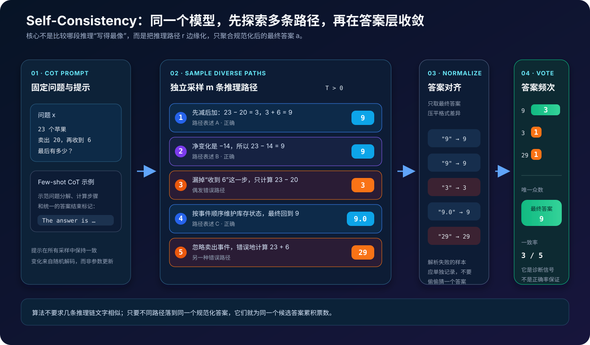
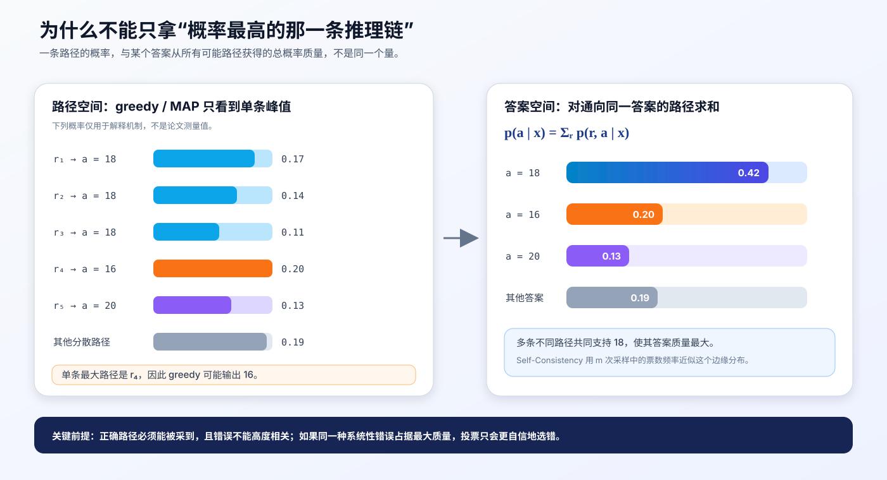
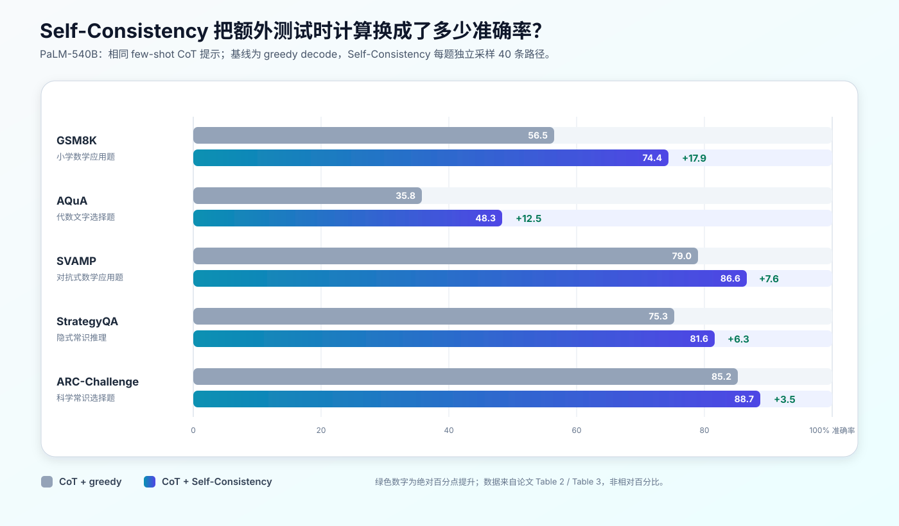

# Self-Consistency 原理：为什么“多走几条推理路径再投票”会更可靠


> **论文**：[Self-Consistency Improves Chain of Thought Reasoning in Language Models](https://arxiv.org/abs/2203.11171)<br>
> **作者**：Xuezhi Wang、Jason Wei、Dale Schuurmans、Quoc Le、Ed H. Chi、Sharan Narang、Aakanksha Chowdhery、Denny Zhou<br>
> **时间**：2022 年 3 月首次提交 arXiv；发表于 ICLR 2023<br>
> **关键词**：Self-Consistency、Chain-of-Thought、Sampling、Majority Vote、Test-time Compute<br>
> **配套源码**：[self_consistency_demo.py](./code/self_consistency_demo.py)

## 0. 先说结论

Self-Consistency（自洽性解码）没有训练新模型，也没有修改 Transformer。它只替换了 Chain-of-Thought（CoT）的**解码策略**：

1. 不再用 greedy decoding 只生成一条推理链；
2. 从同一个模型独立采样多条不同的推理路径；
3. 从每条路径中提取最终答案并做规范化；
4. 返回出现次数最多的答案。

用一句公式概括：

$$
(mathbf r_i,mathbf a_i)sim p_\theta(\mathbf r,\mathbf a\mid \mathbf x,\mathbf c),
\qquad
\hat{\mathbf a}
=
\arg\max_{a}
\sum_{i=1}^{m}\mathbb 1(\mathbf a_i=a)
$$

其中：

- $\mathbf x$ 是待解决的问题；
- $\mathbf c$ 是 few-shot CoT prompt；
- $\mathbf r_i$ 是第 $i$ 条采样到的推理路径；
- $\mathbf a_i$ 是从该路径解析出的最终答案；
- $m$ 是采样路径数；
- $\mathbb 1(\cdot)$ 是指示函数。

它背后的直觉不是“多数永远正确”，而是：

> 一道有唯一答案的复杂问题往往有多种正确解法；错误路径则更可能分散到不同错误答案。把不同路径在答案层汇总，正确答案就可能获得最大的总支持。

论文中最醒目的结果来自 40 路径采样。以 PaLM-540B 为例：

| 任务 | CoT + greedy | CoT + Self-Consistency | 绝对提升 |
|---|---:|---:|---:|
| GSM8K | 56.5 | 74.4 | +17.9 |
| AQuA | 35.8 | 48.3 | +12.5 |
| SVAMP | 79.0 | 86.6 | +7.6 |
| StrategyQA | 75.3 | 81.6 | +6.3 |
| ARC-Challenge | 85.2 | 88.7 | +3.5 |

但必须同时记住四个边界：

- 它需要额外推理成本，生成开销大致随采样数增长；
- 它要求最终答案能被可靠提取、归一化和比较；
- 如果多条路径犯的是同一种系统性错误，投票会一起选错；
- 一致率是很有用的诊断信号，但不是已经校准的正确概率。

一句话记忆：

> CoT 用中间步骤展开一次推理；Self-Consistency 用多次随机展开近似答案边缘化，再用共识抵消单条路径的偶然错误。

---

## 1. 它到底修复了 CoT 的什么问题

原始 few-shot CoT 通常使用 greedy decoding：在每个生成位置选择当前概率最高的 token，最终只得到一条路径。

```text
问题 x
  ↓
greedy CoT 路径 r̂
  ↓
答案 â
```

这里有一个明显的单点故障：只要前面某一步读错题、漏掉条件或算错，中间错误就会进入上下文，继续影响后续 token。

例如：

```text
问题：Lina 有 23 个苹果，卖出 20 个，随后又收到 6 个。最后有几个？
```

单次生成可能走出不同路径：

```text
路径 1：23 - 20 = 3，3 + 6 = 9。答案是 9。
路径 2：净变化为 -20 + 6 = -14，23 - 14 = 9。答案是 9。
路径 3：卖出后有 23 - 20 = 3。答案是 3。          # 漏掉最后一步
路径 4：按事件顺序更新库存，最后得到 9。答案是 9。
路径 5：收到 6 个后有 23 + 6 = 29。答案是 29。    # 忽略卖出事件
```

若只生成一次，命中路径 3 或路径 5 就会失败。若采样五次并投票：

```text
9  → 3 票
3  → 1 票
29 → 1 票
```

最终返回 `9`。注意，三条正确路径的文字不需要相似；Self-Consistency 聚合的是**答案一致性**，不是推理文本相似度。



### 1.1 Greedy 不是“全局找到了最佳推理链”

严格来说，自回归 greedy decoding 在每个位置做局部选择：

$$
\hat t_k
=
\arg\max_{t_k}
p_\theta(t_k\mid \mathbf x,\mathbf c,\hat t_{<k})
$$

这不保证最终序列是全局概率最高的序列，更不保证它通向正确答案。早期 token 一旦固定，后续搜索空间就被一条路径锁住。

Self-Consistency 的改动很直接：把确定性的单链解码换成随机采样，保留多条可能路径，最后才在答案层做决定。

### 1.2 它解决的是“偶然走歪”，不是“根本不会”

Self-Consistency 最适合这种模型：

- 单次有一定概率解对；
- 能产生多种有效分解；
- 不同错误会落到较分散的错误答案；
- 正确答案在答案分布中是众数，但未必是任意一条最高概率路径的答案。

如果模型在所有采样中都不具备所需知识或算法，增加样本只会重复无能为力的输出。

---

## 2. 先把几个容易混淆的概念分开

### 2.1 Self-Consistency 不是普通 CoT

| 方法 | 生成路径数 | 解码 | 最终决策 |
|---|---:|---|---|
| 标准 prompting | 1 | 常用 greedy | 直接答案 |
| CoT prompting | 1 | 原论文主实验用 greedy | 单条链的答案 |
| Self-Consistency | 多条 | 随机采样 | 规范化答案多数投票 |

CoT 决定“输出中是否显式生成中间步骤”；Self-Consistency 决定“是否对多条中间路径做答案级聚合”。两者是可组合的两个层次。

### 2.2 它不是 Self-Reflection

Self-Reflection 通常让模型阅读自己的上一版答案，再批评、修改或重写：

```text
生成 → 反思 → 修订 → 再反思
```

Self-Consistency 的路径彼此独立，不要求样本互相阅读：

```text
路径 1 ┐
路径 2 ├→ 答案聚合
路径 3 ┘
```

前者是串行迭代，后者是可并行的独立采样。

### 2.3 它不是模型集成

传统 ensemble 通常需要多个不同模型：

$$
f_{\theta_1},f_{\theta_2},\ldots,f_{\theta_m}
$$

Self-Consistency 只使用同一个 $f_\theta$，通过随机解码得到不同路径，因此论文称它更像 **self-ensemble**。

这既是优势也是限制：部署简单，但所有样本共享同一套参数、训练数据与提示，所以错误相关性可能很高。

### 2.4 它不是 Best-of-N / Sample-and-Rank

Best-of-N 通常是：

1. 采样 $N$ 个候选；
2. 用奖励模型、verifier、规则分或生成概率逐个打分；
3. 返回分数最高的单个候选。

Self-Consistency 不需要外部评分器，也不选择“最漂亮的一条链”。它把候选按最终答案分组，再选择总票数最大的组。

### 2.5 它不是 pass@k

代码或数学评测中的 `pass@k` 问的是：$k$ 个候选中是否至少有一个正确答案。这个指标在评测时能访问标准答案或测试用例，但在线部署时通常没有答案 oracle。

Self-Consistency 不知道哪个样本正确；它只利用候选之间的共识。因此：

```text
pass@k：只要有一个正确就算成功，需要外部判定
SC：    不知道谁正确，用答案频次选众数
```

### 2.6 它不是 Tree of Thoughts

Tree of Thoughts 会显式扩展中间状态、评价节点并决定继续搜索哪个分支。Self-Consistency 不在中间步骤交互，只在完整路径结束后聚合：

| 维度 | Self-Consistency | Tree of Thoughts |
|---|---|---|
| 路径关系 | 相互独立 | 共享前缀、形成搜索树 |
| 中途评价 | 无 | 有 |
| 回溯 / 剪枝 | 无 | 可有 |
| 聚合位置 | 最终答案 | 中间状态与最终答案 |
| 实现成本 | 较低 | 较高 |

---

## 3. 概率视角：真正的核心是“边缘化推理路径”

设：

- $\mathbf c$：CoT demonstrations 构成的 prompt；
- $\mathbf x$：新问题；
- $\mathbf r$：完整推理路径；
- $\mathbf a$：最终答案。

模型联合生成路径和答案：

$$
p_\theta(\mathbf r,\mathbf a\mid\mathbf x,\mathbf c)
=
\prod_{k=1}^{K}
p_\theta(t_k\mid\mathbf x,\mathbf c,t_{<k})
$$

如果只关心答案，理想目标是把所有可能推理路径求和：

$$
p_\theta(\mathbf a\mid\mathbf x,\mathbf c)
=
\sum_{\mathbf r}
p_\theta(\mathbf r,\mathbf a\mid\mathbf x,\mathbf c)
$$

然后选择答案边缘分布中的众数：

$$
\mathbf a^*
=
\arg\max_{a}
p_\theta(a\mid\mathbf x,\mathbf c)
$$

难点是 $\mathbf r$ 是长文本序列，可能路径数量呈指数增长，不可能完整枚举。

### 3.1 用 Monte Carlo 频率近似答案分布

Self-Consistency 从联合分布独立采样：

$$
(\mathbf r_i,\mathbf a_i)
\overset{\text{i.i.d.}}{\sim}
p_\theta(\mathbf r,\mathbf a\mid\mathbf x,\mathbf c),
\qquad i=1,\ldots,m
$$

答案 $a$ 的经验概率是：

$$
\hat p_m(a\mid\mathbf x,\mathbf c)
=
\frac{1}{m}
\sum_{i=1}^{m}
\mathbb 1(\mathbf a_i=a)
$$

于是：

$$
\hat{\mathbf a}
=
\arg\max_a \hat p_m(a\mid\mathbf x,\mathbf c)
$$

根据大数定律，在样本真正来自目标解码分布、答案解析正确且 $m$ 增大时，经验频率会趋近该解码分布下的答案概率。

这里有一个经常被忽略的限定：Self-Consistency 近似的是**经过 temperature、top-$k$ 或 top-$p$ 修改后的采样分布**，不是一个与解码参数无关的抽象“真答案分布”。

### 3.2 单条路径概率与答案总质量不是一回事

假设某条通向错误答案 `16` 的路径概率最高，但三条不同路径都通向答案 `18`：

$$
\begin{aligned}
p(r_1,a=18)&=0.17\\
p(r_2,a=18)&=0.14\\
p(r_3,a=18)&=0.11\\
p(r_4,a=16)&=0.20
\end{aligned}
$$

若只看单条峰值，会选 $r_4\rightarrow16$；若按答案求和，`18` 获得的质量是：

$$
0.17+0.14+0.11=0.42>0.20
$$



图中的概率只是机制示意，不是论文实验数据。

### 3.3 为什么论文最后采用不加权多数投票

论文也测试了按每条完整输出的模型概率加权。长度归一化的序列分数写作：

$$
w_i
=
\exp\left(
\frac{1}{K_i}
\sum_{k=1}^{K_i}
\log p_\theta(t_{i,k}\mid \mathbf x,\mathbf c,t_{i,<k})
\right)
$$

加权投票可写成：

$$
\hat a_{\text{weighted}}
=
\arg\max_a
\sum_{i=1}^{m}w_i\mathbb 1(\mathbf a_i=a)
$$

但 PaLM-540B 的结果显示，长度归一化加权和与直接多数投票非常接近：

| 聚合方法 | GSM8K | AQuA | SVAMP |
|---|---:|---:|---:|
| 长度归一化 weighted sum | 74.1 | 48.0 | 86.8 |
| 不加权 majority vote | 74.4 | 48.3 | 86.6 |

作者观察到不同生成的归一化概率彼此很接近，模型自身的序列概率不足以稳定区分正确与错误路径。多数投票不仅简单，结果也不逊色，因此成为方法的标准实现。

### 3.4 “多数投票”更准确地说是“取众数”

在多类别答案空间中，赢家不一定超过 50%。例如：

```text
A：4 票
B：3 票
C：2 票
D：1 票
```

`A` 只有 40%，但仍是唯一众数。工程实现不应误把“未过半”自动当作没有结果；更合适的做法是同时返回：

- 众数答案；
- 众数票数占有效样本的比例；
- 完整票数分布；
- 是否达到业务要求的置信阈值。

---

## 4. 为什么它可能有效：多样性与收敛的组合

### 4.1 正确解法可以多样，正确答案应当收敛

一道数学题可以通过：

- 顺序模拟；
- 代数方程；
- 逆向推导；
- 守恒关系；
- 分情况讨论。

推理文本不同，不代表答案不同。Self-Consistency 利用的是这种“路径多样、答案收敛”的结构。

### 4.2 错误若足够分散，正确答案甚至不要求单样本胜率超过 50%

二元独立投票的经典直觉要求单个投票者正确率 $q>0.5$。对奇数 $m$，多数正确的概率为：

$$
P_{\text{maj}}(m,q)
=
\sum_{j=(m+1)/2}^{m}
\binom{m}{j}q^j(1-q)^{m-j}
$$

但实际答案空间通常不是二元的。即使正确答案的单样本概率只有 40%，只要剩余 60% 分散在许多不同错误答案上，正确答案仍可能是众数。

例如：

```text
正确答案：0.40
错误 A：  0.18
错误 B：  0.14
错误 C：  0.10
其他错误：0.18
```

随着样本增多，正确答案仍最可能赢得众数。

### 4.3 多样性不是越高越好

温度太低：

- 路径高度重复；
- 多次调用近似复制同一条 greedy 链；
- 新增样本的信息量很低。

温度太高：

- 路径更分散；
- 但语义连贯性和计算正确率可能下降；
- 解析失败与无意义答案增多。

因此需要平衡：

$$
\text{有用的 Self-Consistency}
=
\text{足够的路径多样性}
+
\text{仍可接受的单路径质量}
$$

### 4.4 相关错误决定了“有效样本数”

Self-Consistency 的样本来自同一个模型和同一个 prompt，不是真正独立的人类专家。它们可能共享：

- 同一知识缺口；
- 同一提示诱导；
- 同一捷径模式；
- 同一训练数据偏差；
- 同一错误的数值直觉。

因此，40 条高度相似的路径远不等于 40 个独立判断。工程上除了看答案频次，还应观察路径重复率与错误相关性。

---

## 5. 原论文的方法流程与真实解码配置

### 5.1 算法流程

论文方法可以写成下面的伪代码：

```python
def self_consistency(model, cot_prompt, num_samples):
    votes = []

    for _ in range(num_samples):
        completion = model.sample(cot_prompt)
        answer = parse_final_answer(completion)
        answer = normalize_answer(answer)
        votes.append(answer)

    return mode(votes)
```

它只有三个核心动作：

```text
sample → marginalize reasoning paths → aggregate answers
```

### 5.2 论文不是统一使用一个 temperature

主实验采用的采样配置是：

| 模型 | Temperature | Top-k |
|---|---:|---:|
| UL2-20B | 0.5 | 40 |
| LaMDA-137B | 0.5 | 40 |
| PaLM-540B | 0.7 | 40 |
| GPT-3 | 0.7 | 不做 top-k 截断 |

温度采样将 logits $z_j$ 变为：

$$
p_T(t_j\mid h)
=
\frac{\exp(z_j/T)}
{\sum_\ell \exp(z_\ell/T)}
$$

- $T<1$：分布更尖锐；
- $T=1$：保持原始 softmax；
- $T>1$：分布更平坦；
- $T\rightarrow0$：逐渐接近 greedy，但数值实现通常直接切换 greedy。

Top-$k$ 则只保留当前位置概率最高的 $k$ 个 token，再重新归一化采样。

### 5.3 主结果的样本数与重复方式

论文主结果：

- 每道题独立采样 40 个输出；
- 对 Self-Consistency 的结果重复运行 10 次并取平均；
- arithmetic reasoning 任务共用 8 个手写 CoT exemplars；
- commonsense reasoning 任务使用 4–7 个从训练集选取、再手写推理链的 exemplars；
- 全部是 few-shot 推理，没有为 Self-Consistency 额外训练或微调模型。

论文也评估了 `1、5、10、20、40` 条路径。更多样本通常继续改善性能，但收益逐渐饱和；作者建议实践中先从 5 或 10 条路径开始。

---

## 6. 可运行源码：采样、解析、归一化与审计

配套实现位于：

- [papers/to-2026/code/self_consistency_demo.py](./code/self_consistency_demo.py)

它不依赖第三方库，也不绑定具体模型 API。直接运行：

```bash
python3 papers/to-2026/code/self_consistency_demo.py
```

输出类似：

```text
winner:     9
consensus:  50.0% of valid samples
valid rate: 80.0%
votes:
  answer='9', count=2, samples=(1, 3)
  answer='29', count=1, samples=(4,)
  answer='3', count=1, samples=(2,)
All self-tests passed.
```

### 6.1 模型适配接口

完整实现把任意模型包装成下面的 callable：

```python
Generator = Callable[[str, float, int], str]
```

三个参数分别是：

- `prompt`：包含 CoT exemplars 与待解问题；
- `temperature`：随机采样温度；
- `seed`：用于复现单条样本的随机种子。

若某个 API 不支持 seed，可以忽略它，但仍应为每条返回结果保留独立的样本编号。

### 6.2 为什么必须要求明确的最终答案标记

源码不会在整段推理中盲目拿“最后一个数字”，而是寻找最后一个明确标记：

```python
FINAL_ANSWER_PATTERN = re.compile(
    r"(?:The answer is|Final answer\s*:|答案(?:是|为)\s*[:：]?)"
    r"\s*(?P<answer>[^\n]+)",
    flags=re.IGNORECASE,
)
```

原因是这段输出：

```text
先算出 12，又发现应减去 3，所以答案是 9。
```

包含多个数字。若 parser 在整个文本里随便抓数，就可能把中间值当最终答案。更稳妥的 prompt 协议是强制模型以固定格式结束：

```text
Final answer: <answer>
```

### 6.3 答案归一化决定了票是否会被错误拆散

下面三个输出语义相同：

```text
The answer is 9.
Final answer: 9.0
答案是：$9.00。
```

原始字符串直接投票会得到三类；数值规范化后都应成为 `"9"`。

源码提供：

```python
normalize_numeric_answer("$1,392.00")  # "1392"
normalize_choice_answer("option (b)")  # "B"
normalize_text_answer("New York.")     # "new york"
```

生产系统还可能需要处理：

- 分数与小数等价：`1/2`、`0.5`；
- 单位换算：`1 m`、`100 cm`；
- 多选集合顺序：`A,C`、`C,A`；
- 布尔别名：`yes`、`true`；
- 符号表达式等价；
- 日期、货币和本地化格式。

归一化规则必须由任务定义，不能用一个正则表达式覆盖所有领域。

### 6.4 投票必须显式处理解析失败和并列

核心聚合逻辑是：

```python
counts = Counter(sample.normalized_answer for sample in valid_samples)
top_count = max(counts.values())
winners = [a for a, count in counts.items() if count == top_count]

if len(winners) != 1:
    raise VoteTieError("sample more or abstain")
```

配套代码选择在并列时抛出异常，而不是依赖字典顺序偷偷选第一个答案。线上系统可以：

1. 再采样若干路径；
2. 返回“不确定”；
3. 调用 verifier；
4. 使用明确记录的次级规则破局。

同样，解析失败的样本不会被静默丢弃。结果会同时返回：

```text
consensus = 赢家票数 / 有效样本数
valid_rate = 有效样本数 / 总样本数
```

只有 `consensus` 高而 `valid_rate` 也健康时，聚合结果才比较有解释价值。

### 6.5 为什么源码保留每条完整路径

`SelfConsistencyResult` 不只返回一个字符串，还保留：

- 每条路径的原始输出；
- 推理文本；
- 原始答案；
- 规范化答案；
- 解析错误；
- seed 与样本编号；
- 每个答案对应的样本索引。

这是必要的可观测性。否则，当投票选错时，你无法判断是模型系统性错误、parser 错误、格式漂移，还是采样多样性不足。

---

## 7. 论文实验到底证明了什么

论文评估了四类模型：

- UL2-20B；
- LaMDA-137B；
- GPT-3 / Codex 175B 系列；
- PaLM-540B。

任务覆盖：

- 算术推理：AddSub、MultiArith、ASDiv、AQuA、SVAMP、GSM8K；
- 常识推理：CommonsenseQA、StrategyQA、ARC-Easy、ARC-Challenge；
- 符号推理：Last Letter Concatenation、Coinflip；
- 补充实验中的自然语言推断和闭卷问答。

### 7.1 PaLM-540B 的代表结果



完整的 PaLM-540B 算术结果如下：

| 方法 | AddSub | MultiArith | ASDiv | AQuA | SVAMP | GSM8K |
|---|---:|---:|---:|---:|---:|---:|
| CoT + greedy | 91.9 | 94.7 | 74.0 | 35.8 | 79.0 | 56.5 |
| Self-Consistency | 93.7 | 99.3 | 81.9 | 48.3 | 86.6 | 74.4 |
| 绝对提升 | +1.8 | +4.6 | +7.9 | +12.5 | +7.6 | +17.9 |

常识与符号任务：

| 方法 | CSQA | StrategyQA | ARC-e | ARC-c | Letter(4) | Coinflip(4) |
|---|---:|---:|---:|---:|---:|---:|
| CoT + greedy | 79.0 | 75.3 | 95.3 | 85.2 | 65.8 | 88.2 |
| Self-Consistency | 80.7 | 81.6 | 96.4 | 88.7 | 70.8 | 91.2 |
| 绝对提升 | +1.7 | +6.3 | +1.1 | +3.5 | +5.0 | +3.0 |

这里的 `+17.9` 表示**准确率增加 17.9 个百分点**，不是相对增长 17.9%。

### 7.2 摘要中的五个 headline gain 来自哪里

论文摘要列出：

```text
GSM8K         +17.9
SVAMP         +11.0
AQuA          +12.2
StrategyQA     +6.4
ARC-Challenge  +3.9
```

其中一组完全对应 GPT-3 `code-davinci-002`：

| 任务 | CoT + greedy | Self-Consistency | 提升 |
|---|---:|---:|---:|
| GSM8K | 60.1 | 78.0 | +17.9 |
| SVAMP | 75.8 | 86.8 | +11.0 |
| AQuA | 39.8 | 52.0 | +12.2 |
| StrategyQA | 73.4 | 79.8 | +6.4 |
| ARC-Challenge | 83.6 | 87.5 | +3.9 |

不要把不同模型、不同基线的增益随意拼成一个统一配置下的结果。

### 7.3 更强模型往往获得更大收益

论文观察到：

- UL2-20B 在算术任务上的提升约为 3–7 个百分点；
- LaMDA-137B 和 GPT-3 在若干任务上可提升 9–23 个百分点；
- PaLM-540B 即便已有较强 CoT 基线，在 GSM8K、AQuA 等任务上仍有明显收益。

这并不表示“参数越大，投票必然按固定规律变好”。更合理的解释是：模型先要有能力产生足够多的有效正确路径，采样聚合才有东西可恢复。

### 7.4 样本更多通常更好，但边际收益递减

论文比较了 `1、5、10、20、40` 条路径。整体趋势是：

- 从 1 增加到 5 或 10，常能拿到主要收益；
- 继续增加到 20、40，准确率仍可能提高；
- 曲线往往逐渐饱和；
- 样本少时，不同重复运行的方差更明显。

因此，`40` 是论文主结果配置，不是所有线上系统的默认答案。

### 7.5 Self-Consistency 能修复部分 CoT 退化

论文还测试了 ANLI、e-SNLI、RTE、BoolQ、HotpotQA。在部分任务上，单链 CoT 反而低于不带 rationale 的标准提示，例如：

| 任务 | 标准提示 | CoT | Self-Consistency |
|---|---:|---:|---:|
| e-SNLI | 85.8 | 81.0 | 88.4 |
| RTE | 84.8 | 79.1 | 86.3 |
| BoolQ | 71.3 | 74.2 | 78.4 |
| HotpotQA EM / F1 | 27.1 / 36.8 | 28.9 / 39.8 | 33.8 / 44.6 |

这说明单条 rationale 的噪声可能伤害预测，而多路径聚合有机会抵消部分偶然噪声。

---

## 8. 为什么不用 Beam Search 或“选概率最高样本”

### 8.1 Beam Search 倾向于找到相似的高概率序列

Beam Search 在每一步保留若干高分前缀，目标偏向高序列概率。多个 beam 往往：

- 共享很长前缀；
- 只在措辞上轻微变化；
- 落到相同局部模式；
- 缺少 Self-Consistency 需要的推理路径多样性。

论文在 UL2-20B 上对齐 beam 数和采样路径数。AQuA 的 40 路径结果为：

| 方法 | 准确率 |
|---|---:|
| Beam search：取 top beam | 10.2 |
| 对 beam 输出做 Self-Consistency | 24.2 |
| 随机采样 + Self-Consistency | 26.9 |

这不是说 beam search 在所有生成任务上都差，而是说明它优化的目标与“探索多样推理路径再聚合”不同。

### 8.2 Sample-and-Rank 过度相信模型自己的序列概率

Sample-and-Rank 同样采样多条输出，但返回模型概率最高的一条。论文发现它有一定收益，却显著弱于答案共识。

原因之一是：语言模型可能认为流畅、自信的错误路径也很高概率；序列 likelihood 并不是可靠的正确性评分器。

### 8.3 改 prompt 顺序的 ensemble 不等价于路径采样

论文在 LaMDA-137B 上比较了：

- 三套不同 prompt 的 greedy 结果投票；
- 40 种 exemplar 顺序的 greedy 结果投票；
- 固定 prompt 下采样 40 条路径。

以 GSM8K 为例：

| 方法 | 准确率 |
|---|---:|
| CoT | 17.1 |
| 3 套 prompts 集成 | 18.6 |
| 40 种 prompt 顺序集成 | 19.2 |
| Self-Consistency：40 路径 | 27.7 |

路径级随机探索带来的收益明显更大。

---

## 9. 一致率能否当作置信度

定义有效样本集合大小为 $m_v$，赢家为 $\hat a$，则一致率为：

$$
C
=
\frac{1}{m_v}
\sum_{i=1}^{m_v}
\mathbb 1(a_i=\hat a)
$$

论文在 GSM8K 上观察到一致率与准确率高度相关，因此它可以帮助模型“知道自己什么时候不确定”。

但不要直接解释为：

```text
C = 0.8  ⇒  答案有 80% 概率正确
```

这种解释需要额外校准。高一致率仍可能来自：

- prompt 把所有样本诱导到同一个错误；
- 训练数据中的共同偏差；
- 题目存在错误前提；
- parser 把不同答案错误归一化到同一字符串；
- 温度过低导致样本几乎复制。

更稳妥的用法是把一致率作为一个特征，与以下指标一起监控：

| 指标 | 定义 | 主要诊断对象 |
|---|---|---|
| `consensus` | 赢家票数 / 有效样本数 | 答案是否集中 |
| `valid_rate` | 有效样本数 / 总样本数 | 输出协议与 parser 是否稳定 |
| `unique_answers` | 规范化答案种类数 | 答案分散程度 |
| vote entropy | $-\sum_a p_a\log p_a$ | 整体不确定性 |
| path duplication | 重复或近重复路径比例 | 多次采样是否真的带来新信息 |
| cost per solved item | token / 延迟 / 金额 | 精度收益是否值得 |

### 9.1 一致率与有效率必须分开

考虑两种情况：

```text
系统 A：10 个样本全部可解析，8 个投给答案 9
consensus = 0.8, valid_rate = 1.0

系统 B：10 个样本只有 2 个可解析，2 个都投给答案 9
consensus = 1.0, valid_rate = 0.2
```

只看 `consensus` 会误以为系统 B 更可靠。实际上它的输出协议已经严重失稳。

---

## 10. 失败模式：投票什么时候会更自信地选错

### 10.1 系统性错误成为众数

如果题目诱发一个非常自然但错误的捷径，样本可能集中到同一错误答案：

```text
错误答案 A：7 票
正确答案：  2 票
错误答案 B：1 票
```

Self-Consistency 会稳定地选择 A。它只能压低不相关的偶发噪声，不能自动识别共享偏差。

### 10.2 模型根本采不到正确路径

若：

$$
p_\theta(a_{\text{correct}}\mid x,c)\approx0
$$

那么增加 $m$ 只会更准确地估计一个错误分布。

典型原因包括：

- 缺少事实知识；
- 所需算法超出模型能力；
- 输入超出上下文；
- 问题本身不可判定；
- prompt 格式与模型不匹配。

### 10.3 最终答案不是固定集合

原论文明确把方法建立在可比较的最终答案上，例如：

- 数字；
- `yes / no`；
- 多项选择字母；
- 短字符串；
- 符号任务结果。

对“写一篇好文章”“提出一个商业策略”这类开放文本，表面字符串投票没有意义。必须先定义语义一致性、聚类或评价标准；这已超出原始 Self-Consistency 的简单多数投票。

### 10.4 答案解析器制造假分歧或假共识

假分歧：

```text
"0.5"、"1/2"、"50%" 被当成三个答案
```

假共识：

```text
parser 总是错误地抽取推理中的最后一个数字
```

后者尤其危险：看起来一致率很高，实际上聚合的是 parser bug。

### 10.5 题目允许多个合法答案

若问题本身有多个同样正确的表达，答案质量会被拆散。应先定义等价关系：

$$
a_i\sim a_j
\iff
\text{两者在任务语义下等价}
$$

然后在等价类上投票，而不是在原始字符串上投票。

### 10.6 温度太低或 seed 没有真正生效

如果 20 次调用返回几乎相同的路径，表面上是 20 票，信息上可能只相当于 1 票。需要记录：

- seed；
- 模型版本；
- 完整解码参数；
- 路径文本哈希；
- 重复率。

---

## 11. 工程落地：怎样把成本花在刀刃上

### 11.1 延迟、吞吐与成本

若单条路径平均输出 $L$ 个 token，采样 $m$ 条，最朴素的生成 token 成本约为：

$$
\text{generation cost}\propto mL
$$

但实际系统还受这些因素影响：

- prompt 前缀是否能做 KV cache / prefix cache 复用；
- API 是否支持一次返回多个 completions；
- 请求是串行还是并行；
- 不同路径长度差异；
- batch 调度与显存；
- 限流和并发上限。

并行采样能降低墙钟延迟，但不会消除 token 成本，还可能瞬时占用更多吞吐。

### 11.2 不要默认所有问题都采 40 次

比较实用的策略是分层预算：

```text
简单问题：greedy 或少量样本
中等问题：5–10 个样本
低共识问题：继续采样
高风险问题：采样 + verifier / 工具校验 / 人工复核
```

论文自己也建议从 5 或 10 条路径开始。

### 11.3 一个严格安全的提前停止条件

设最多采样 $M$ 条，当前已采 $n$ 条，剩余预算 $R=M-n$。当前第一名票数为 $c_1$，第二名为 $c_2$。

如果：

$$
c_1>c_2+R
$$

即使剩余所有票都投给第二名，第一名仍不会被追平，此时最终赢家已经不可能改变，可以安全提前停止。

这个条件很保守，但不会改变固定上限 $M$ 下的多数投票结果。更激进的“连续几轮答案不变就停止”只是启发式，需要单独评估偏差。

### 11.4 并列时不要藏起不确定性

合理的并列策略按风险从低到高可以是：

1. 继续独立采样；
2. 若达到预算上限则 abstain；
3. 使用独立 verifier；
4. 用外部工具验证可验证答案；
5. 最后才考虑预先声明的概率分或规则破局。

不建议按字典序、首个样本或最长 rationale 静默选一个。

### 11.5 答案协议优先于复杂正则

比起不断扩充脆弱 parser，更好的做法是约束输出：

```text
请在最后单独一行输出：
Final answer: <只包含规范答案>
```

如果模型或 API 支持结构化输出，可以让最终答案进入独立字段，同时保留解释文本供审计。

### 11.6 复现时必须记录的参数

至少记录：

- 模型名称与精确版本；
- 完整 prompt 和 exemplar 顺序；
- temperature、top-$k$、top-$p$；
- 最大输出长度与 stop sequence；
- 样本数；
- 每条 seed；
- parser / normalizer 版本；
- 无效样本处理方式；
- tie policy；
- 聚合前的完整答案直方图。

否则，同一句“我们用了 Self-Consistency”可能对应完全不同的实验。

---

## 12. 从最小实现到生产系统

### 12.1 最小正确版本

最小版本只需要：

```text
CoT prompt builder
      ↓
stochastic sampler × m
      ↓
final-answer parser
      ↓
task-specific normalizer
      ↓
majority vote
```

### 12.2 可用版本

还应补上：

- 超时与重试；
- 并发控制；
- 去重与重复率；
- 解析失败审计；
- 并列处理；
- 最低有效样本数；
- 一致率阈值；
- token 与成本统计；
- tracing 和可复现 seed。

### 12.3 高风险版本

医疗、法律、金融控制或生产变更等高风险场景，不能把“多次自我同意”当作事实验证。应增加独立证据通道：

```text
Self-Consistency 共识
          +
外部检索 / 计算器 / 代码执行 / 规则验证
          +
必要时的人类复核
```

多个样本共享同一模型，不构成真正独立的证据来源。

---

## 13. 论文中的其他关键消融

### 13.1 对不同采样策略相对鲁棒

论文改变了：

- temperature $T$；
- top-$k$ 中的 $k$；
- nucleus sampling 的 $p$。

Self-Consistency 在多个配置下都能改善 GSM8K，说明收益不依赖一个极其精确的超参数点。但“相对鲁棒”不代表参数无关：温度仍会改变单路径质量、答案熵与重复率。

### 13.2 对不同 prompt 集合相对鲁棒

PaLM-540B 在三套手写 GSM8K prompts 上：

| Prompt 集合 | CoT | Self-Consistency | 提升 |
|---|---:|---:|---:|
| Set 1 | 56.5 | 74.4 | +17.9 |
| Set 2 | 54.6 | 72.1 | +17.5 |
| Set 3 | 54.0 | 70.4 | +16.4 |

绝对结果仍受 prompt 影响，但增益在三套提示上都存在。

### 13.3 错误的 CoT exemplars 下仍可能获益

作者把 exemplars 推理步骤中的数字随机替换、但保留最终答案，制造不完美提示。LaMDA-137B 在 GSM8K 上：

```text
正确 CoT prompt + greedy：         17.1
不完美 CoT prompt + greedy：       14.9
不完美 prompt + SC（40 路径）：    23.4
```

这说明多路径聚合能抵消部分提示噪声，但不意味着可以故意使用错误 demonstrations。高质量 prompt 仍然重要。

### 13.4 也能和 Zero-shot CoT 组合

PaLM-540B 在 GSM8K 上：

```text
Zero-shot CoT：                 43.0
Zero-shot CoT + SC（40 路径）：69.2
```

因此 Self-Consistency 并不要求 few-shot CoT；只要解码能产生中间路径和可解析答案，就可以进行答案聚合。

---

## 14. 这篇论文没有证明什么

### 14.1 没有证明模型的推理文本忠实

多条文字路径投到同一答案，只说明输出层面一致，不证明这些文本忠实反映神经网络内部计算。

### 14.2 没有证明多数答案必然正确

Self-Consistency 是经验有效的解码策略，不是正确性定理。共同偏差会让错误答案成为高一致众数。

### 14.3 没有免费获得能力

它用额外测试时计算换取准确率。训练成本没变，不等于总成本没变。

### 14.4 没有解决开放文本的一般一致性

论文主要依赖固定、可解析答案。开放文本如何定义“同一个答案”，需要额外的语义度量或 evaluator。

### 14.5 没有给出普适的最优样本数

`40` 是主实验配置。最佳 $m$ 取决于：

- 模型强度；
- 任务难度；
- 答案空间；
- 路径相关性；
- 成本与延迟目标；
- 是否允许 abstain 或 verifier。

---

## 15. Self-Consistency 在 test-time compute 路线中的位置

Self-Consistency 的历史意义不只是一种投票技巧。它清楚地展示了：

> 固定模型参数后，改变推理阶段如何分配计算，也能显著改变最终准确率。

可以把后续路线粗略排成：

```text
单链 CoT
   ↓
多链采样 + 答案投票（Self-Consistency）
   ↓
候选生成 + verifier / process reward model
   ↓
显式树搜索与中间状态评价（Tree of Thoughts 等）
   ↓
更一般的 inference-time scaling / reasoning model
```

它提供了一个极强的基线：如果一个复杂搜索方法不能在相同推理预算下稳定超过 Self-Consistency，那么额外系统复杂度未必值得。

---

## 16. 实战检查清单

准备在项目中使用 Self-Consistency 时，可以逐项检查。

### 问题与答案

- [ ] 最终答案是否有明确、可比较的空间？
- [ ] 是否存在多个合法答案，需要先做等价类归一化？
- [ ] 是否能定义严格的 parser 与 normalizer？
- [ ] 解析失败是否会被显式记录？

### 采样

- [ ] `temperature > 0`，路径是否真的具有多样性？
- [ ] top-$k$ / top-$p$ 是否记录？
- [ ] 每条样本是否可用 seed 复现？
- [ ] 是否监控重复路径与唯一答案数？

### 聚合

- [ ] 多数投票是在规范化答案上进行吗？
- [ ] 并列策略是否预先定义？
- [ ] 是否同时返回 consensus 与 valid rate？
- [ ] 是否设置最低有效样本数或 abstain 条件？

### 成本与评测

- [ ] 是否比较 `m=1/5/10/20/...` 的精度—成本曲线？
- [ ] 是否与 greedy、Best-of-N、verifier 在相同预算下比较？
- [ ] 是否统计 token、延迟、吞吐和每道正确答案成本？
- [ ] 高风险任务是否有独立证据或人工复核？

---

## 17. 常见问题

### Q1：采样数应该取奇数吗？

二元投票中奇数可以避免平票；多类别答案空间中，奇数仍可能出现并列，例如 `2:2:1`。因此无论奇偶都需要 tie policy。

### Q2：能不能只对最终短答案采样，不生成 CoT？

可以做普通答案 self-ensemble，但它不是论文重点。论文假设多样的中间推理路径能为同一正确答案提供多个到达方式；没有路径展开时，多样性和收益可能不同，需要单独实验。

### Q3：应该按答案票数还是按路径概率加权？

原论文中，简单多数投票与长度归一化 weighted sum 相当甚至略好，因此多数投票是合理默认值。如果你有经过校准的 verifier，问题就变成另一种候选评分方案，应在验证集上比较。

### Q4：一致率低该怎么办？

可以按顺序检查：

1. parser 和 normalizer 是否正确；
2. 路径是否过度随机或输出协议失稳；
3. 增加少量样本后赢家是否稳定；
4. 任务是否本身含糊或多解；
5. 是否应 abstain、调用工具或 verifier。

### Q5：一致率高就可以省掉事实核查吗？

不可以。高一致只表示同一模型在该提示和解码设置下反复得出同一答案。共享幻觉也可能高度一致。

### Q6：为什么不让模型自己判断哪条推理最好？

可以，这会引入 verifier、judge 或 re-ranker。它可能进一步提高效果，也带来新的偏差、成本与训练问题。Self-Consistency 的价值恰恰在于不需要额外监督或辅助模型。

---

## 18. 最后的理解框架

把整篇论文压缩为四层：

### 第一层：现象

同一个模型对同一道题可以生成多条不同推理路径。

### 第二层：假设

正确路径虽然写法不同，却更容易收敛到同一个固定答案；偶发错误更分散。

### 第三层：算法

$$
\text{随机采样多条 CoT}
\rightarrow
\text{提取并归一化答案}
\rightarrow
\text{答案众数}
$$

### 第四层：代价与边界

它增加测试时计算；只在正确路径可达、答案可聚合、错误不高度相关时有效。

所以最准确的一句话不是“让模型多想几遍”，而是：

> Self-Consistency 用 Monte Carlo 采样近似对隐式推理路径的边缘化，把决策单位从“单条看似最可能的生成”改成“获得最大总支持的答案”。

---

## 19. 前置阅读与延伸阅读

### 前置阅读

- [Chain-of-Thought Prompting](./11_Chain_of_Thought_2022_原理.md)：理解为什么先生成中间步骤；
- [GPT-3](./05_GPT3_2020_原理.md)：理解 few-shot in-context learning；
- 温度采样、top-$k$ 与 nucleus sampling 的基本概念。

### 读完接着看

- [Let's Verify Step by Step](./25_Lets_Verify_Step_by_Step_2023_原理.md)：从答案投票走向过程监督；
- [Tree of Thoughts](./26_Tree_of_Thoughts_2023_原理.md)：从独立路径采样走向显式搜索；
- [DeepSeek-R1](./30_DeepSeek_R1_2025_原理.md)：理解 reasoning model 与更广义 test-time compute；
- 原论文附录：采样参数、完整 prompts、更多路径示例与消融实验。

### 主要资料

- [arXiv: 2203.11171](https://arxiv.org/abs/2203.11171)
- [ICLR 2023 OpenReview](https://openreview.net/forum?id=1PL1NIMMrw)
- 本文配套的[无依赖最小实现](./code/self_consistency_demo.py)

