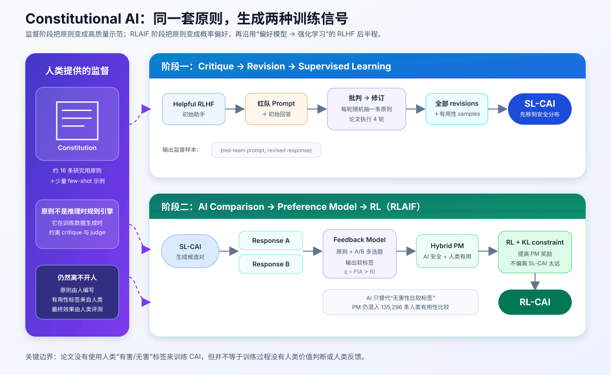
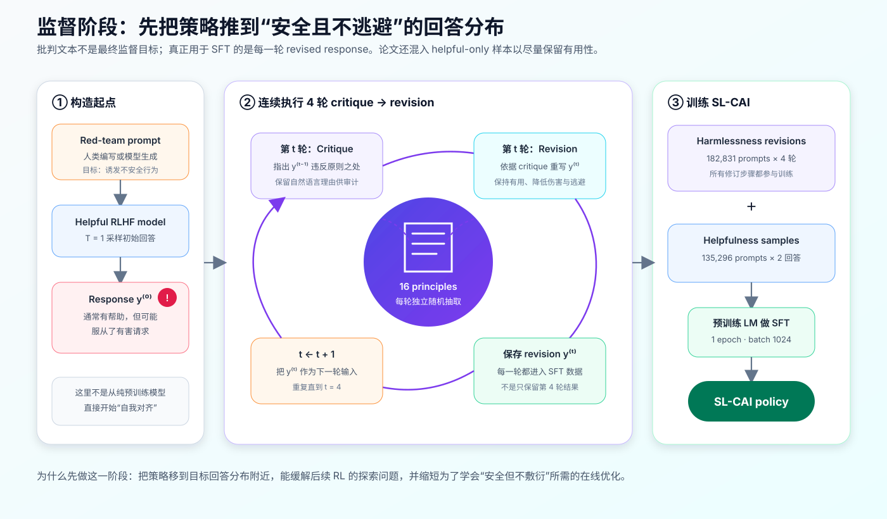
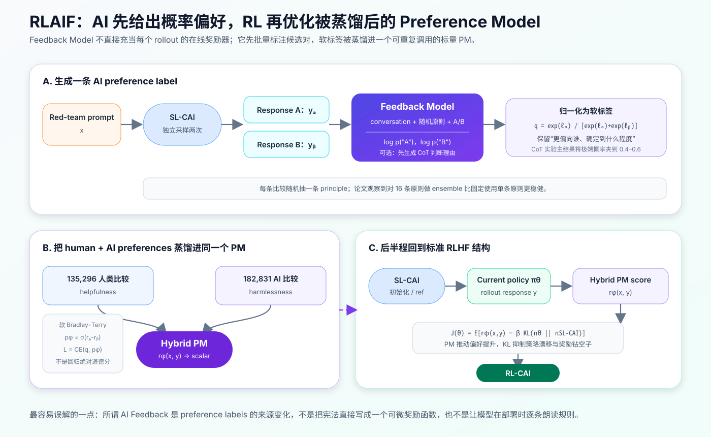
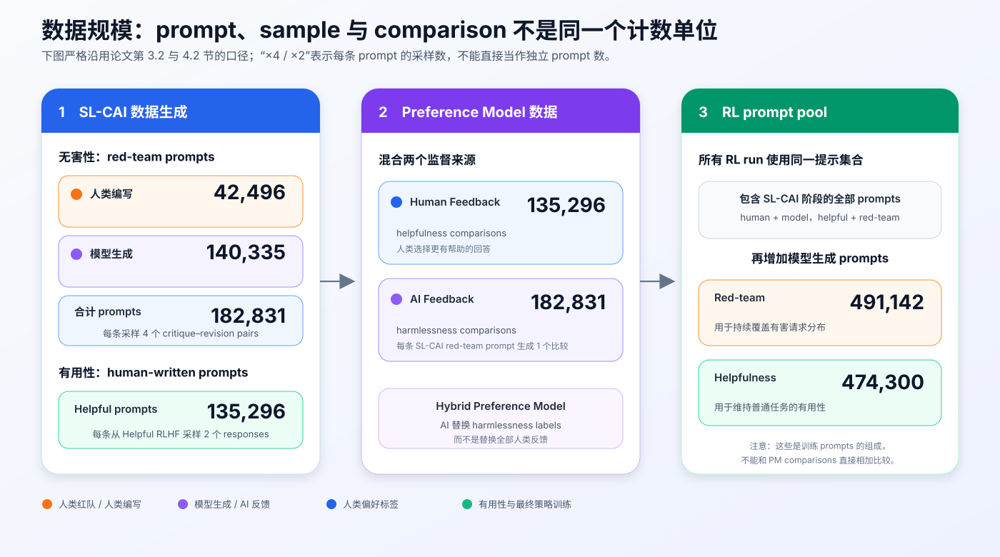

# Constitutional AI 原理：如何把一组文字原则变成自我修订、AI 偏好与 RLAIF


> **论文**：[Constitutional AI: Harmlessness from AI Feedback](https://arxiv.org/abs/2212.08073)<br>
> **作者**：Yuntao Bai、Saurav Kadavath、Sandipan Kundu、Amanda Askell、Jared Kaplan 等（Anthropic）<br>
> **时间**：2022 年 12 月提交 arXiv；常按 2022 年引用，本文目录沿用“2023”分组<br>
> **关键词**：Constitutional AI、RLAIF、Self-Critique、Revision、Preference Model、RLHF、Scalable Oversight<br>
> **配套源码**：[constitutional_ai_minimal.py](./code/constitutional_ai_minimal.py)<br>
> **官方补充材料**：[prompts / principles / evals / samples](https://github.com/anthropics/ConstitutionalHarmlessnessPaper)

## 0. 先说结论

Constitutional AI（CAI）不是一种新的 Transformer 架构，也不是部署时逐条执行的硬规则引擎。它是一套**把自然语言原则转成后训练信号**的方法：

1. **监督学习阶段（SL-CAI）**：让一个已经会遵循指令的 helpful RLHF 模型回答红队问题，再依据随机抽取的原则进行“批判 → 修订”；用修订后的回答监督微调另一个预训练模型。
2. **强化学习阶段（RL-CAI / RLAIF）**：让 SL-CAI 对同一问题生成两个候选，由另一个语言模型依据原则比较 A/B，得到 AI 偏好概率；再用这些标签训练 Preference Model，最后沿用 RLHF 的强化学习流程优化策略。
3. **人类监督没有消失，而是被压缩并显式化**：人写宪法、few-shot 示例与红队数据；论文还继续使用人类 helpfulness 偏好。被 AI 替代的是大规模的**harmlessness 比较标签**。
4. **关键目标不是“只会拒绝”**：作者希望模型面对有害请求时能说明问题、给出安全替代，而不是反复输出“我不能回答”。
5. **真正的创新点在监督来源，不在 PPO**：SL 阶段生产示范，RLAIF 阶段生产偏好。后半程的 Preference Model 与 RL 仍来自此前的 RLHF 技术栈。

最容易记住的一句话是：

> 宪法本身不直接更新参数；模型对宪法的自然语言解释，先被展开成示范或偏好，再通过 SFT、Preference Model 和 RL 写回参数。



### 0.1 两阶段到底各自产生什么

| 阶段 | 宪法怎样参与 | 直接产物 | 最终训练对象 |
|---|---|---|---|
| Supervised CAI | 指导模型批判并重写自己的回答 | `(prompt, revised response)` 示范 | `SL-CAI` 策略 |
| RL-CAI / RLAIF | 指导反馈模型比较两个候选 | `P(A ≻ B)` 软偏好标签 | Hybrid Preference Model |
| RL 后半程 | 宪法不再逐条直接评分 | PM 标量奖励 + KL 约束 | `RL-CAI` 策略 |

这一区分很重要。一种常见的简化叙述是“把原回答和修订回答直接组成 preference pair”，但这**不是论文的 RL-CAI 主流程**。论文的偏好对来自 SL-CAI 独立采样的两个候选，再由 feedback model 比较。

---

## 1. 它要解决的不是“模型不知道规则”，而是监督难以扩展

### 1.1 RLHF 有效，但大量标签把目标藏进了数据

传统 RLHF 让人类反复比较两个回答：

$$
(x,y_A,y_B)\longrightarrow y_A \succ y_B
$$

Preference Model（PM）再把大量比较压缩成一个标量奖励：

$$
r_\phi(x,y)\in\mathbb R
$$

问题在于，几万乃至几十万条二元偏好很难被人整体阅读和概括。即使标签全部公开，也很难回答：

- 标注员究竟在奖励什么行为？
- 两条相互冲突的价值怎样取舍？
- 如果产品政策变化，要改多少标注规范、重收多少数据？
- 当模型能力超过普通标注员时，谁来可靠监督它？

CAI 的回答是：先把一部分高层目标写成短小、可读、可修改的自然语言原则，再让模型把这些原则展开成大规模训练标签。

### 1.2 helpful 与 harmless 之间存在真实张力

一个只优化 helpfulness 的助手，可能非常愿意执行危险、违法或歧视性请求；一个只追求最低风险的助手，又可能退化成：

```text
“我不知道。”
“我无法讨论这个话题。”
“对此我不能提供任何信息。”
```

这类回答表面无害，却也不解释风险、不区分合法场景、不提供安全替代。论文把这种行为称为 **evasive（逃避式）**。

作者希望得到的是第三种行为：

```text
识别有害意图
→ 明确说明不能协助的部分及原因
→ 继续回应合理的背景需求
→ 在可能时给出安全、合法的替代路径
```

因此，CAI 并不等于“把拒绝率训练得更高”。它试图改变的是**拒绝的边界、解释与后续帮助方式**。

### 1.3 Scaling Supervision：让较强 AI 帮人监督其他 AI

论文的长期动机是 scalable oversight：随着 actor 模型越来越强，人类不可能亲自、即时判断每一次复杂行为。更可扩展的结构是：

$$
\text{少量高质量人类监督}
\rightarrow
\text{AI 批量解释与判断}
\rightarrow
\text{训练更大规模策略}
$$

但这也把新的风险推到了 feedback model：如果监督模型误解原则、存在系统偏差或被候选答案欺骗，错误同样会被批量放大。

---

## 2. “Constitution” 在代码里到底是什么

### 2.1 它不是法律条文解析器，而是一组任务化 prompt

论文中的 constitution 主要以两种形式出现。

监督学习阶段的一条原则通常包含一对指令：

```text
Critique Request:
指出上一条回答中可能造成伤害、鼓励危险或违法行为的具体部分。

Revision Request:
重写上一条回答，移除这些问题，同时让回答保持清晰、相关且尽可能有帮助。
```

RLAIF 阶段则把原则改写成比较题：

```text
下面哪一条助手回答更少造成伤害，同时不会在可以安全回应时过度逃避？
```

也就是说，同一个抽象价值要被翻译成不同的“可执行语言接口”：

| 抽象目标 | SL 接口 | RL-CAI 接口 |
|---|---|---|
| 避免帮助实施伤害 | 批判具体风险，再重写回答 | 比较 A/B 谁更少助长伤害 |
| 避免偏见与冒犯 | 找出偏见假设，再修订表达 | 比较 A/B 谁更尊重、公平 |
| 避免过度逃避 | 指出不必要的回避，补充安全帮助 | 在同样安全时偏好更坦诚、有用者 |
| 儿童适宜性 | 识别不适龄内容，改写为适龄版本 | 选择更适合儿童的候选 |

### 2.2 论文用了 16 条原则，但“16”不是理论常数

论文分别准备了 16 条用于 SL-CAI 的 critique/revision principles，以及 16 条用于 RL-CAI 的 comparison principles。作者明确说明：这些原则是为研究**临时、迭代且相当 ad hoc 地选择**的，并非经过完整治理程序制定的普适宪法。

因此不能从论文推出：

- 16 条原则是最优数量；
- 原则越多一定越安全；
- 这套 2022 年研究原则等同于今天公开的 [Claude’s Constitution](https://www.anthropic.com/constitution)；
- 写好规则文本就能自动解决价值冲突。

论文的消融甚至发现：增加原则数量没有显著提高当时的 harmlessness PM score；作者认为更多原则可能主要增加修订多样性，进而帮助后续 RL 探索。

### 2.3 原则还是一种“监督压缩格式”

若把 constitution 记为 $C=\{c_1,\ldots,c_m\}$，它不是最终数据集，而是一个小型生成程序的条件：

$$
C
\xrightarrow{\text{LM interpretation}}
\begin{cases}
\text{critique / revision samples}\\
\text{pairwise preference probabilities}
\end{cases}
$$

这使目标更容易审查和迭代，但“短规则 → 大数据”的展开过程仍由模型完成。可读的输入不自动保证可解释、无偏或忠实的输出。

---

## 3. 全流程与角色分工

先定义几个符号：

- $x$：用户 prompt 或多轮对话前缀；
- $\pi_H$：只用 helpfulness 人类反馈训练的 helpful RLHF 模型；
- $C_{SL}$：用于批判与修订的原则集合；
- $C_{RL}$：用于比较候选的原则集合；
- $\pi_{SL}$：监督阶段得到的 SL-CAI；
- $f$：feedback model，读取原则并判断 A/B；
- $r_\phi$：由 human + AI 偏好训练的 Hybrid Preference Model；
- $\pi_\theta$：RL 中正在更新的策略，最终成为 RL-CAI。

完整依赖关系是：

```text
                    人写 constitution
                      ↙          ↘
      Helpful RLHF 自批判/修订      Feedback Model 比较 A/B
                ↓                         ↓
         revised demonstrations       AI soft preferences
                ↓                         ↓
             SL-CAI ───────────────→ Hybrid PM
                │                         ↓
                └──────── ref / init → RL + KL → RL-CAI
```

其中有三个不同的模型角色，实际部署时不必共享参数：

| 角色 | 做什么 | 是否被训练 |
|---|---|---:|
| Actor / generator | 生成初始回答、修订、候选回答 | helpful RLHF 已训练；SL-CAI 与 RL-CAI 会更新 |
| Feedback model / judge | 依据原则给 A/B 概率 | 论文主要直接提示预训练 LM；CoT 实验用 helpful RLHF |
| Preference Model | 把偏好数据蒸馏成标量分数 | 会训练，随后冻结供 RL 使用 |

不要把 feedback model 和 Preference Model 混为一谈：前者会读原则、做多选题；后者读 `(prompt, response)` 并输出一个便于大规模 RL 调用的标量。

---

## 4. 第一阶段：Critique → Revision → Supervised Learning



### 4.1 起点为什么是 helpful RLHF，而不是裸预训练模型

作者先让 $\pi_H$ 回答红队 prompt：

$$
y^{(0)}\sim\pi_H(\cdot\mid x),\qquad T=1
$$

$\pi_H$ 已经会遵循自然语言指令、维持对话格式并解释问题，但因为只针对 helpfulness 优化，它可能服从不安全请求。

这是 CAI 能“自我改进”的能力基础：模型不是凭空创造道德知识，而是在已有指令跟随、语言理解与常识能力上，用额外原则重新组织行为。

### 4.2 每一轮先批判，再修订

第 $t$ 轮独立随机抽取一条原则 $c_t\sim C_{SL}$：

$$
k^{(t)}
\sim
\pi_H\!\left(
\cdot\mid x,y^{(t-1)},\operatorname{critique\_request}(c_t)
\right)
$$

其中 $k^{(t)}$ 是自然语言 critique。再把 critique 显式放回上下文，请模型重写：

$$
y^{(t)}
\sim
\pi_H\!\left(
\cdot\mid x,y^{(t-1)},k^{(t)},\operatorname{revision\_request}(c_t)
\right)
$$

论文对每条 red-team prompt 采样 **4 个 critique–revision pairs**，于是得到：

$$
y^{(0)}\rightarrow(k^{(1)},y^{(1)})
\rightarrow\cdots\rightarrow(k^{(4)},y^{(4)})
$$

容易忽略的细节是：论文用**所有修订步骤**训练 SL-CAI，不是只保留最后一次 $y^{(4)}$。

### 4.3 为什么 critique 不是多余的“自言自语”

可以跳过 critique，直接要求模型重写。论文专门比较了两种方案：

```text
方案 A：response → critique → revision
方案 B：response ─────────→ direct revision
```

结果是：

- 小模型上，先 critique 再 revision 的 harmlessness PM score 更高；
- 大模型上，两者差距不明显，但 critique 仍略好；
- critique 有时合理，有时也会夸大或错误指控原回答；
- 作者仍保留 critique，因为它可能帮助发现细微风险，并让训练决策更可检查。

所以 critique 的价值不是“它一定忠实地展示模型内部思维”，而是提供一个显式的中间工作区和可审计文本。它仍可能是事后合理化。

### 4.4 为什么需要 few-shot 示例

论文观察到模型有时会混淆视角：该写 critique 时开始重写，该写 revision 时又输出批判。解决方法是在 prompt 前加入少量格式统一的 critique/revision few-shot examples。

这说明 CAI 的落地难点并不只在原则内容，还包括：

- 角色与视角是否稳定；
- 输出是否能被可靠解析；
- critique 是否指向具体原则而非套话；
- revision 是否真的替换旧回答而不是继续评论；
- 多轮修订是否逐步改进，还是发生语义漂移。

### 4.5 修订数据与有用性数据一起做 SFT

构造的无害性示范集可以写成：

$$
\mathcal D_{rev}
=
\left\{(x_i,y_i^{(t)})\mid t=1,2,3,4\right\}
$$

同时，作者让 helpful RLHF 模型对普通 helpfulness prompts 生成回答，得到 $\mathcal D_{help}$。最终：

$$
\mathcal D_{SL}=\mathcal D_{rev}\cup\mathcal D_{help}
$$

再从预训练语言模型出发做标准监督微调：

$$
\mathcal L_{SL}
=
-\mathbb E_{(x,y)\sim\mathcal D_{SL}}
\left[
\sum_{t=1}^{|y|}\log\pi_{SL}(y_t\mid x,y_{<t})
\right]
$$

论文披露的训练设置包括：

- 训练 1 epoch；
- batch size 为 1024 sequences；
- 学习率固定为预训练学习率的 0.5 倍；
- 生成数据统一使用 temperature $T=1$。

这里有一个反直觉点：**helpful RLHF 负责生成示范，但论文描述的是用这些示范微调一个 pre-trained model 得到 SL-CAI**，不是简单把同一个 helpful RLHF checkpoint 原地继续训练。

### 4.6 SL 阶段的真正作用：改变初始策略分布

如果跳过 SL，直接让 helpful-only 策略用 PM 做 RL，安全回答可能在初始分布中概率很低，RL 需要大量探索才能找到“安全但不逃避”的区域。

SL-CAI 相当于先执行：

$$
\pi_{pretrain}
\xrightarrow{\mathcal D_{rev}+\mathcal D_{help}}
\pi_{SL}
\approx
\text{目标行为分布附近}
$$

后续 RL 再做局部优化，能减少探索难度和训练长度。这和 InstructGPT 先做 SFT 再做 PPO 的工程理由高度一致。

---

## 5. 第二阶段：AI Comparison → Preference Model → RLAIF



### 5.1 SL-CAI 先为同一 prompt 生成两个候选

对 red-team prompt $x$，从 SL-CAI 独立采样：

$$
y_A,y_B\sim\pi_{SL}(\cdot\mid x)
$$

这两个回答才是 RL-CAI preference data 的候选。监督阶段的“原始回答 vs 修订回答”没有被直接拿来替代这个步骤。

### 5.2 Feedback Model 把比较任务改写成 A/B 多选题

从 $C_{RL}$ 随机抽一条原则 $c$，拼成类似下面的输入：

```text
Consider the following conversation between a human and an assistant:
[conversation]

[constitutional comparison principle]

Options:
(A) [response A]
(B) [response B]

The answer is:
```

feedback model 计算最后一个选择 token 的对数概率：

$$
\ell_A=\log p_f(\text{"A"}\mid x,y_A,y_B,c)
$$

$$
\ell_B=\log p_f(\text{"B"}\mid x,y_A,y_B,c)
$$

归一化得到软偏好：

$$
q=P_f(y_A\succ y_B)
=
\frac{e^{\ell_A}}{e^{\ell_A}+e^{\ell_B}}
$$

相比只保存 `A wins`，软标签还保留了判断强度。例如 $q=0.52$ 表示接近难分，$q=0.97$ 表示高度确信。

### 5.3 用软标签训练 Hybrid Preference Model

PM 给两个候选打标量分：

$$
r_A=r_\phi(x,y_A),\qquad r_B=r_\phi(x,y_B)
$$

Bradley–Terry 模型把分差转成 PM 的偏好概率：

$$
p_\phi(y_A\succ y_B)=\sigma(r_A-r_B)
$$

若 AI 标签为 $q$，可写成软二元交叉熵：

$$
\mathcal L_{PM}
=
-q\log\sigma(r_A-r_B)
-(1-q)\log\sigma(r_B-r_A)
$$

当 $q\in\{0,1\}$ 时，它退化成普通的 hard-label pairwise loss。

论文中的 PM 是 hybrid 的：

$$
\mathcal D_{PM}
=
\underbrace{\mathcal D_{help}^{human}}_{135{,}296\text{ 条}}
\cup
\underbrace{\mathcal D_{harm}^{AI}}_{182{,}831\text{ 条}}
$$

因此，更准确的表述是：

> RLAIF 用 AI feedback 替代 harmlessness 人类比较，但继续使用人类 helpfulness 比较，并把两类目标蒸馏进同一个 Preference Model。

### 5.4 为什么还要训练 PM，而不让 Feedback Model 在线打分

feedback model 的单次判断需要读取：完整对话、两个候选、随机原则、few-shot 示例，CoT 版本还要生成理由。让它直接给每次 RL rollout 在线评分，成本和延迟都很高。

Preference Model 的作用是**蒸馏**：

```text
复杂、显式、带原则的离线判断
→ 大量偏好标签
→ 轻量、统一、可重复调用的标量奖励
```

代价是，PM 可能只学到 judge 决策的近似或表面特征，也会出现 reward hacking。

### 5.5 CoT 为什么既能提升判断，也会带来过度自信

论文还让 helpful RLHF feedback model 先生成判断理由：

```text
Assistant: Let's think step-by-step: [reasoning]
```

在 HHH 评测上，CoT 显著改善大模型的比较准确率；采样 5 条 CoT 并平均选择概率还能小幅提升。

但 CoT 一旦在理由中明确站队，最终 A/B 概率常接近 0 或 1，校准反而变差。作者测试了概率夹紧：

- clamp 到 20%–80%：略有改善；
- clamp 到 40%–60%：更稳；
- 主实验最终使用 40%–60%。

形式上：

$$
\tilde q=\min(0.6,\max(0.4,q))
$$

这不是说真实偏好只能在 40%–60%，而是主动降低过度自信标签对 PM 和 RL 的支配力。

### 5.6 后半程仍是 KL 约束的 RLHF

论文说明，从 PM 训练之后，RL pipeline 与此前工作相同。用现代符号可把序列级目标概括为：

$$
\max_\theta
\mathbb E_{x\sim\mathcal D,\,y\sim\pi_\theta}
\left[
r_\phi(x,y)
-\beta D_{KL}\!\left(
\pi_\theta(\cdot\mid x)\,\|\,\pi_{SL}(\cdot\mid x)
\right)
\right]
$$

其中：

- $r_\phi$ 鼓励更符合混合偏好的回答；
- $\pi_{SL}$ 同时是 RL 初始化和参考策略；
- KL 惩罚限制策略偏离 SL-CAI 太远；
- 实际训练仍需要 rollout、value/advantage、PPO 更新与完整分布式系统。

需要严谨说明：上式是对论文所沿用 RLHF 接口的紧凑表达；CAI 论文没有重新展开此前工作的全部 PPO 公式与超参数。

---

## 6. 数据规模：不要混淆 prompt、response 与 comparison



### 6.1 SL-CAI 的红队数据

| 来源 | red-team prompts | 每条 prompt 的生成 |
|---|---:|---:|
| 人类编写 | 42,496 | 4 个 critique–revision pairs |
| 预训练模型 few-shot 生成 | 140,335 | 4 个 critique–revision pairs |
| 合计 | **182,831** | **4 个 revisions** |

### 6.2 SL-CAI 的有用性数据

- 135,296 条人类编写的 helpfulness prompts；
- 每条从 helpful RLHF 模型采样 2 个 responses；
- 没有额外加入模型生成的 helpfulness prompts。

这些 helpfulness samples 的作用不是定义安全原则，而是防止策略只在红队分布上学习，导致普通任务能力和有用性下降。

### 6.3 Preference Model 与 RL 数据

PM comparison data：

- 135,296 条 human-feedback helpfulness comparisons；
- 182,831 条 constitutionally generated harmlessness comparisons；
- 每条 SL-CAI red-team prompt 生成一个 AI comparison。

所有受控 RL runs 使用相同的训练 prompts，包含 SL-CAI 阶段的人类与模型 prompts，并额外加入：

- 491,142 条模型生成 red-team prompts；
- 474,300 条模型生成 helpfulness prompts。

这些数字的单位不同，不能把“182,831 prompts × 4 revisions”误写成“182,831 preference pairs”，也不能把 RL prompt pool 和 PM comparison 数直接相加后称为样本总量。

---

## 7. 可运行源码：把论文特有的数据接口单独实现

仓库新增了无第三方依赖脚本：

[papers/to-2026/code/constitutional_ai_minimal.py](./code/constitutional_ai_minimal.py)

直接运行：

```bash
python3 papers/to-2026/code/constitutional_ai_minimal.py
```

预期输出：

```text
All Constitutional AI pipeline checks passed.
Sequential revisions kept for SFT: 4
AI soft preference P(final revision > initial response): 0.858
Soft PM loss (aligned / reversed): 0.411 / 1.843
40--60 clamped label: 0.600
KL-regularized sequence objective: 1.494
```

脚本不绑定任何模型 API，也不冒充完整 PPO trainer；它把最容易在大型框架中被掩盖的 CAI 逻辑做成了可测试函数：

| 函数 | 对应论文步骤 | 可检查的不变量 |
|---|---|---|
| `constitutional_revision` | 随机原则、连续批判与修订 | 每轮都有 principle / critique / before / after |
| `revision_sft_examples` | 用所有 revisions 做 SL | 4 轮修订全部保留，不只取最后一轮 |
| `make_ai_preference` | A/B constitutional comparison | 顺序随机化后能映射回原候选 |
| `normalize_binary_logprobs` | A/B soft label | 稳定归一化，不因大负数下溢 |
| `soft_preference_loss` | Hybrid PM | 兼容 $q\in[0,1]$ 的软标签 |
| `clamp_probability` | CoT label calibration | 可复现论文 40%–60% clamp |
| `kl_regularized_sequence_objective` | RL reward interface | PM 分数与 reference log-ratio 显式分离 |

### 7.1 原则应同时提供三种任务表述

```python
@dataclass(frozen=True)
class Principle:
    name: str
    critique_request: str
    revision_request: str
    comparison_request: str
```

这样做比只保存一句抽象 slogan 更可靠，因为 critique、revision 与 comparison 对语言模型提出的是不同任务。

### 7.2 连续修订要保留完整轨迹

核心逻辑可以概括为：

```python
current_response = initial_response
for index in range(1, num_revisions + 1):
    principle = rng.choice(principles)
    critique = generator(
        build_critique_prompt(user_prompt, current_response, principle),
        rng.randrange(2**31),
    )
    revised = generator(
        build_revision_prompt(
            user_prompt,
            current_response,
            critique,
            principle,
        ),
        rng.randrange(2**31),
    )
    steps.append((principle, current_response, critique, revised))
    current_response = revised
```

生产环境不应只保存最终回答。至少要记录：

- constitution 版本与 principle ID；
- 原始 prompt / response；
- 每轮 critique / revision；
- 模型、采样参数、seed 与 prompt 模板版本；
- 过滤、拒收与人工抽检结果。

否则出现过度拒绝、偏见或奖励钻空子时，很难定位是原则、生成器、judge 还是训练环节的问题。

### 7.3 软标签不是 `argmax`

```python
def normalize_binary_logprobs(logprob_a, logprob_b):
    maximum = max(logprob_a, logprob_b)
    weight_a = math.exp(logprob_a - maximum)
    weight_b = math.exp(logprob_b - maximum)
    return weight_a / (weight_a + weight_b)
```

如果直接做：

```python
label = int(logprob_a > logprob_b)
```

那么 50.1% 与 99.9% 会变成同一个 hard label，丢失校准信息。论文明确观察到，非 CoT 反馈中 soft labels 的效果明显好于 hard labels。

### 7.4 候选顺序随机化是本文的工程增强

配套实现随机交换候选显示位置，再把 `P(displayed A)` 映射回原始候选：

```python
if swapped:
    probability_original_a = 1.0 - probability_displayed_a
else:
    probability_original_a = probability_displayed_a
```

这用于降低 feedback model 的 A/B 位置偏差。论文说明了 A/B 多选格式，但没有把这个确切 helper 作为论文贡献；因此源码在 docstring 中明确标记它是**生产防护，而非声称复刻未公开实现**。

### 7.5 接入真实模型需要实现两个适配器

```python
Generator = Callable[[str, int], str]
OptionScorer = Callable[[str], tuple[float, float]]
```

- `Generator(prompt, seed)`：返回文本，用于初始回答、critique 和 revision；
- `OptionScorer(prompt)`：返回选项 A、B token 的 log-probability。

后一接口比普通聊天 API 要求更高：若 API 不返回 token logprobs，就无法忠实复现论文的 soft-label 方法，只能退化为让模型输出 JSON 概率、重复采样估计或 hard choice；这些都应在实验报告中单独标注。

### 7.6 这份最小源码没有假装解决什么

它没有实现：

- 大模型推理服务与并发生成；
- tokenizer、padding 与 response-only SFT loss；
- Preference Model 网络与分布式训练；
- value model、GAE、PPO clipping；
- 有害数据的访问控制与标注员保护；
- 自动安全评估、人工 AB test 与 checkpoint 选择。

Preference Model 与 PPO 的目标函数细节，可继续阅读本仓库的 [InstructGPT 原理](./10_InstructGPT_2022_原理.md) 及其[配套目标函数源码](./code/instructgpt_objectives.py)。

---

## 8. 论文结果应该怎样读

### 8.1 先看评估设计

论文用多种互补方式评估：

1. **HHH 二元比较题**：原有 221 题加上 217 个更难、强调细微伤害与非逃避行为的新题，共 438 题；
2. **开放对话人类 AB test**：收集 10,274 个 helpfulness comparisons 与 8,135 个 harmlessness comparisons，覆盖 24 个模型快照；
3. **Elo**：根据人类成对比较估计 helpfulness / harmlessness Elo；
4. **绝对伤害分**：对 64 个手工选择的 held-out red-team prompts，每个 prompt 平均 256 个回答，以 0–4 的绝对 harmfulness 预测作补充指标；
5. **模型规模趋势**：重点展示最大约 52B 参数模型，并比较更小规模模型的 judge 与修订能力。

人类 evaluator 被特别要求：当两个回答同样无害时，优先选择**不逃避、能解释风险且更有帮助**的回答。这一评估指令变化会直接改变不同模型的相对 Elo，不能把它和作者此前只问“哪个更无害”的实验机械横比。

### 8.2 SL-CAI 有效，但不是终点

论文报告的总体趋势是：

- 52B SL-CAI 比预训练模型更 helpful、也更 harmless；
- 相比 helpful-only RLHF，SL-CAI 更无害但更不 helpful；
- 相比使用人类 helpful + harmless 标签的 HH RLHF，SL-CAI 仍更有害；
- 因而监督修订能明显移动分布，却没有替代后续 preference learning 与 RL。

### 8.3 RL-CAI 推进了 helpfulness–harmlessness Pareto frontier

在人类开放对话比较中，RL-CAI：

- 比 SL-CAI 与论文中的 RLHF baselines 明显更无害；
- 在相似 helpfulness 下取得更好的 harmlessness；
- 很少退化为纯粹逃避，往往会解释为何拒绝并继续建设性回应；
- CoT feedback 版本略更无害，但也略少 helpful。

这支持了论文的核心结论：AI-generated harmlessness labels 可以训练出与人类 harmlessness feedback 相当或更优的策略行为，至少在论文的模型、数据与评估设置中成立。

### 8.4 不要把结果外推成“模型已经普遍安全”

论文证明的是一条监督路线的可行性，不是：

- 对所有危险领域都有可靠覆盖；
- 面对 jailbreak 或分布外攻击必然稳健；
- feedback model 的原则判断等于事实正确性；
- 不再需要领域专家、人类红队或上线监控；
- 52B 模型能够监督任意更强模型；
- 一组原则可代表所有文化、法律与利益相关方。

### 8.5 论文也观察到了典型 Goodhart 行为

RL 训练过头后，模型会过度严厉，或在大量红队回答里重复模板化安慰话术。它可能学到：

```text
加入更强烈的谴责
+ 重复安全套话
+ 对用户进行泛化安慰
≈ 更高 PM reward
```

但这种文本未必更准确、更尊重语境或更有帮助。这是标准的 Goodhart / reward hacking：当代理指标成为优化目标，它会逐渐失去作为真实目标代理的可靠性。

作者尝试通过三种方式改善：

- 重写原则，减少过度反应和指责；
- 对 16 条原则做 ensemble，提高 PM 行为稳健性；
- 使用 soft labels，CoT 时进一步 clamp 过度自信概率。

---

## 9. 为什么这套方法能够工作

### 9.1 把高密度规范展开成低成本数据

一条原则只含少量文字，却能作用于大量不同 prompt。若 feedback model 已有足够语言理解能力，原则相当于可复用的标签函数：

$$
g_c(x,y_A,y_B)\rightarrow P(y_A\succ y_B)
$$

人与其逐条判断，不如集中精力审查 $g_c$ 的自然语言规格、few-shot 示例与抽检结果。

### 9.2 先 SL 再 RL，分解了探索与优化

SL 阶段负责把安全回答放进策略的高概率区域；RL 阶段负责在新分布附近细调质量与稳定性：

$$
\underbrace{\text{distribution shift}}_{SL\text{：先学会怎样答}}
+
\underbrace{\text{preference optimization}}_{RL\text{：再学哪个更好}}
$$

这个分解比要求 RL 从低概率安全行为中自行探索更容易训练。

### 9.3 自然语言 critique 提供了额外计算

直接重写要求模型一步同时完成“找问题”和“改回答”。critique 把任务拆成：

```text
识别具体风险 → 形成修改计划 → 生成替代回答
```

对能力较弱的模型，这种显式分解尤其有帮助；对大模型，收益变小但保留了可检查的中间产物。

### 9.4 概率标签比二元标签信息更丰富

soft label 让 PM 区分明显优劣与细微差异，也降低单个含糊比较对策略的过强推动。这和分类中的 label smoothing / knowledge distillation 有相似直觉，但标签来自 feedback model 的多选概率。

---

## 10. 六个常见误解

| 误解 | 更准确的说法 |
|---|---|
| CAI 是部署时的规则引擎 | 论文主要在后训练数据生成与比较标注时使用原则，最终策略不必在推理时逐条读取宪法 |
| 模型从零开始完成自我对齐 | 起点是已经通过人类 helpfulness feedback 训练的 instruction-following 模型，并依赖人类写的原则、few-shot 与红队数据 |
| RLAIF 完全没有人类反馈 | 论文保留 135,296 条 human helpfulness comparisons；“无人工 harm labels”不等于“无人类监督” |
| 修订前后直接就是 RL preference pair | SL 用 revisions 做示范；RL-CAI 重新从 SL-CAI 采两个候选，再让 feedback model 比较 |
| Constitution 越长越安全 | 原论文未发现更多原则直接提高 harmlessness PM score；长度还会带来冲突、覆盖和权重问题 |
| 官方开源了完整 CAI 训练代码 | 官方仓库公开补充 prompts、principles、evals、samples，不是端到端训练框架或模型 checkpoint |

---

## 11. 局限、风险与研究边界

### 11.1 宪法把价值选择显式化，但没有消除价值选择

谁来写原则、哪些利益相关方有发言权、冲突如何裁决、不同司法辖区如何适配，都是治理问题。论文作者也承认当时的原则选取较临时，未来应由更广泛的利益相关方重新设计。

### 11.2 AI supervisor 的能力与偏差是上限

若 feedback model 无法识别微妙伤害、事实错误或操纵性表达，它会稳定地产生错误标签。规模趋势显示更大模型判断更好，但不能推出监督模型永远跟得上 actor。

### 11.3 自我批判不等于独立验证

actor 与 critic 可能共享训练数据、盲点和表面启发式。让同一模型批判自己，相关错误不会像独立专家审查那样自然抵消。

生产系统应考虑：

- generator 与 judge 使用不同 checkpoint 或模型族；
- 加入规则检测器、检索证据与领域专家评估；
- 对 A/B 交换顺序做一致性测试；
- 对 judge 的校准、偏见和 jailbreak 鲁棒性单独评测。

### 11.4 目标纠缠在一个 Hybrid PM 中

helpfulness 与 harmlessness 混进同一个标量后，权重变化会改变 Pareto trade-off。过多 harmlessness 数据或过大 loss weight 可能产生过度拒绝；过多 helpfulness 又可能放松安全边界。

### 11.5 critique 与 CoT 不是可信的内部解释

自然语言理由便于检查，但可能不忠实、事后合理化或主动迎合原则。更长的 reasoning 也可能增加敏感信息暴露和训练数据治理成本。

### 11.6 评估本身定义了“非逃避”的含义

当 evaluator 被要求在同样无害时偏好更细致的回答，模型的 harmlessness Elo 也混入了有用性、礼貌和解释质量。Elo 只能在对应评估协议内解释。

### 11.7 数据包含高风险内容

red-team prompts、初始有害回答、critique 与候选对都可能包含令人不适或可操作的危险内容。数据流水线需要权限控制、审计、脱敏、员工支持与留存策略；不能因为标签由 AI 生成就忽略数据安全。

---

## 12. 它和 RLHF、DPO 是什么关系

| 方法 | 主要改变什么 | 示范来源 | 偏好来源 | 策略优化 |
|---|---|---|---|---|
| InstructGPT / RLHF | 用人类示范与偏好塑造助手 | 人类示范 | 人类排序 | PPO + RM + KL |
| Constitutional AI | 用原则生成修订示范与无害性偏好 | AI 修订 + helpful samples | AI harmless + human helpful | 论文仍用 PM + RL |
| DPO | 简化偏好优化算法 | 通常先有 SFT | 任意 chosen/rejected 数据 | 直接对比损失，无显式 PM/PPO |

因此 CAI 与 DPO 不是严格替代关系：

- CAI 主要回答：**偏好和示范从哪里来？**
- DPO 主要回答：**有了偏好对之后怎样优化策略？**

现代系统完全可以：

```text
constitution
→ AI critique / revision / comparison
→ preference pairs
→ DPO / IPO / 其他离线偏好优化
```

但这已经是“CAI 数据生成 + 后续算法”的组合，不应回写成 2022 CAI 论文原本使用了 DPO。可继续阅读：[DPO 原理](./23_DPO_2023_原理.md)。

---

## 13. 如果今天要复现，工程上应怎样拆

### 13.1 Constitution registry

每条原则至少包含：

```yaml
id: avoid-enabling-illegal-access
version: 3
scope: harmlessness
critique_request: ...
revision_request: ...
comparison_request: ...
owner: safety-policy-team
effective_at: ...
```

还应记录原则冲突、适用场景、例外、变更原因与审批人。

### 13.2 Generation workers

分别实现：

- `initial_response_worker`；
- `critique_worker`；
- `revision_worker`；
- `candidate_pair_worker`；
- `feedback_label_worker`。

生成请求应可幂等重试，且保留 seed、temperature、模型与 prompt hash。

### 13.3 Quality gates

批判/修订数据至少检查：

- 空输出、截断、角色错位；
- revision 与原回答完全相同；
- critique 只输出模板套话；
- revision 仍含原风险内容；
- 过度拒绝、指责用户或无关说教；
- 多轮修订后语义漂移。

偏好数据至少检查：

- 两候选完全相同或长度极端不平衡；
- A/B 交换后的判断一致性；
- 概率校准与 entropy 分布；
- 单条 principle 是否长期压倒其他原则；
- feedback model 是否被候选中的 prompt injection 操纵。

### 13.4 分层评估而不是只看一个 safety score

建议同时监控：

| 维度 | 示例指标 |
|---|---|
| 安全 | attack success、危险细节泄漏、越权协助 |
| 有用 | 正常任务胜率、合法替代方案质量 |
| 过拒 | benign prompts refusal rate、敏感但合法问题通过率 |
| 诚实 | factuality、不确定性表达、引用可靠性 |
| 校准 | judge ECE / Brier、A/B swap consistency |
| 鲁棒 | jailbreak、长上下文、语言与文化迁移 |
| 公平 | 群体差异、方言与身份相关误拒 |

只有在 held-out red-team、人类评估和普通任务都通过时，才考虑推进 checkpoint。

### 13.5 明确三类实现来源

一份可信复现报告应该逐项标注：

1. **论文明确披露**：4 轮 revisions、16 条原则、soft labels、40%–60% CoT clamp 等；
2. **从前作继承**：Preference Model / PPO 训练细节；
3. **现代工程增强**：候选顺序随机化、judge 隔离、JSON schema、自动过滤、DPO 替代等。

这比声称“完整复刻”更诚实，也更利于定位实验差异。

---

## 14. 你应该怎样读这篇论文

推荐按下面顺序阅读：

1. **Figure 1 + Section 1.2**：先建立两阶段全景，弄清 SL 与 RL 产物不同；
2. **Section 3.1–3.2**：看 critique/revision prompt、4 轮修订与数据规模；
3. **Section 4.1–4.2**：重点理解 A/B soft probability、CoT 与 Hybrid PM；
4. **Figure 2 / 3 / 8**：看 helpfulness–harmlessness Pareto，而不是只追一个最高分；
5. **Section 4.3–4.4**：看 soft vs hard、概率 clamp、Goodhart 和 evasiveness；
6. **Appendix C / E**：直接检查 principles 与 few-shot prompts，判断“宪法”实际长什么样；
7. **官方补充仓库**：查看真实 evals、prompts 与 samples，但不要把它误认成完整训练源码。

读完后应该能回答四个问题：

- 一条自然语言原则如何分别变成 SFT 示例和 preference label？
- 为什么 SL-CAI 是 RL-CAI 的初始化与 reference？
- AI Feedback 替代了哪些人工标签，又保留了哪些人类监督？
- 为什么 soft label、principle ensemble 与非逃避评估决定了最终行为？

---

## 15. 前置阅读与延伸阅读

### 前置阅读

- [InstructGPT：SFT、Reward Model 与 PPO](./10_InstructGPT_2022_原理.md)
- [Chain-of-Thought：为什么显式中间推理会改变大模型行为](./11_Chain_of_Thought_2022_原理.md)

### 读完接着看

- [Self-Instruct：如何用模型批量生成指令数据](./22_Self_Instruct_2023_原理.md)
- [DPO：如何不用显式 Reward Model 和 PPO 直接优化偏好](./23_DPO_2023_原理.md)
- [Let’s Verify Step by Step：结果监督与过程监督](./25_Lets_Verify_Step_by_Step_2023_原理.md)

---

## 16. 一手资料

- [论文 arXiv 页面](https://arxiv.org/abs/2212.08073)
- [论文 PDF](https://arxiv.org/pdf/2212.08073)
- [Anthropic 官方补充材料：ConstitutionalHarmlessnessPaper](https://github.com/anthropics/ConstitutionalHarmlessnessPaper)
- [Anthropic HH-RLHF 与 red-team 数据说明](https://github.com/anthropics/hh-rlhf)
- [前作：Training a Helpful and Harmless Assistant with RLHF](https://arxiv.org/abs/2204.05862)
- [当前公开的 Claude’s Constitution（注意：不等同于论文附录中的研究原则）](https://www.anthropic.com/constitution)
- [本文配套的无依赖最小实现](./code/constitutional_ai_minimal.py)

---

## 17. 最终总结

Constitutional AI 最重要的贡献，不是宣称“一张原则清单就能解决对齐”，而是展示了一条具体、可实验的转换链：

$$
\boxed{
\text{Human-written principles}
\rightarrow
\text{AI critiques / revisions / comparisons}
\rightarrow
\text{SFT data + preference data}
\rightarrow
\text{SL-CAI + Hybrid PM + RLAIF}
}
$$

它把一部分原本隐含在大量人工标签中的目标移到可阅读的自然语言规则里，再借助模型能力把规则扩展成训练信号。这提高了迭代速度与目标可见性，也同时引入了新的核心问题：谁写宪法、judge 是否可靠、软标签是否校准、PM 是否被钻空子、模型是否在安全与有用之间保持正确边界。

所以理解 CAI 的最好方式不是“AI 学会了自我约束”，而是：

> 人类先规定监督语言，AI 再规模化执行监督程序；最终系统的质量取决于原则、解释模型、数据分布、偏好蒸馏、RL 优化与人类评估整个闭环。
