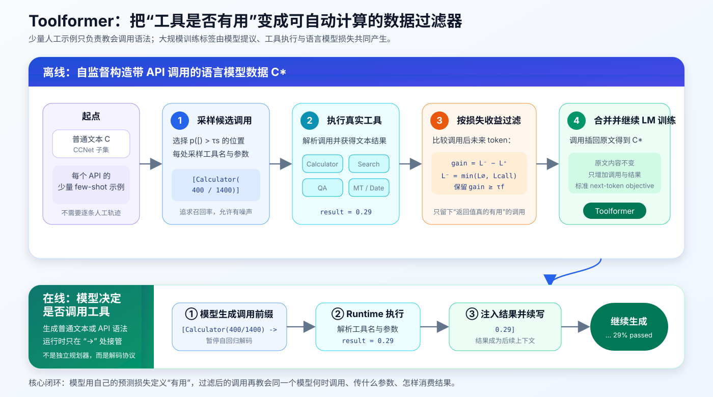
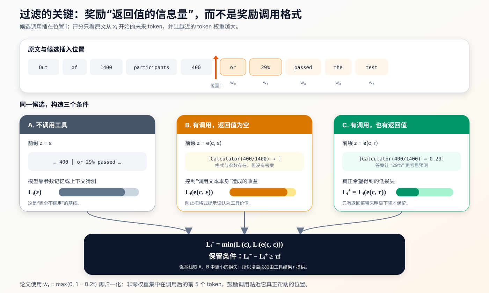
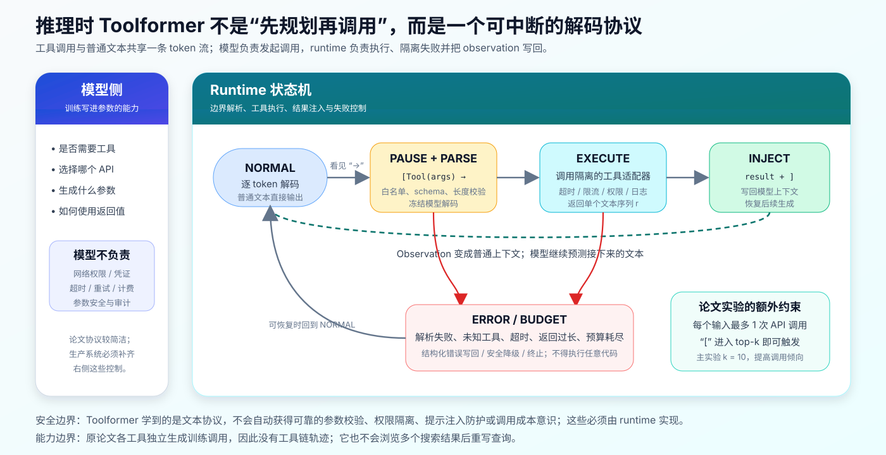
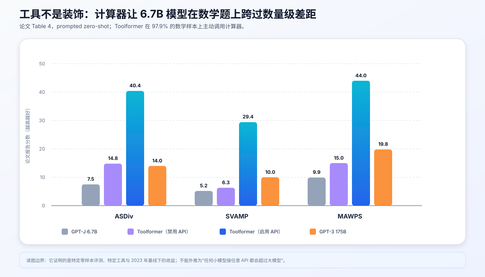

# Toolformer 原理：语言模型如何用自己的 loss 学会何时调用工具


> **论文**：[Toolformer: Language Models Can Teach Themselves to Use Tools](https://arxiv.org/abs/2302.04761)<br>
> **作者**：Timo Schick、Jane Dwivedi-Yu、Roberto Dessì、Roberta Raileanu、Maria Lomeli、Eric Hambro、Luke Zettlemoyer、Nicola Cancedda、Thomas Scialom<br>
> **机构**：FAIR, Meta；Universitat Pompeu Fabra<br>
> **时间**：2023 年 2 月提交 arXiv；NeurIPS 2023<br>
> **关键词**：Tool Use、Self-Supervised Learning、API Call、Loss Filtering、Agent、GPT-J<br>
> **配套代码**：[toolformer_minimal.py](./code/toolformer_minimal.py)（教学复现，不是论文官方实现）<br>
> **原文**：[NeurIPS 正式版本](https://proceedings.neurips.cc/paper_files/paper/2023/hash/d842425e4bf79ba039352da0f658a906-Abstract-Conference.html) · [arXiv HTML](https://arxiv.org/html/2302.04761) · [PDF](https://arxiv.org/pdf/2302.04761)

## 0. 先说结论

Toolformer 不是一种新的 Transformer 架构，也不是让大模型在推理时临时阅读 API 文档。它是一条**自动制造工具调用训练数据**的流水线：

1. 为每个工具人工写少量调用示例；
2. 让预训练语言模型在普通文本中大量插入候选 API 调用；
3. 真的执行这些调用，得到工具返回值；
4. 检查返回值能否降低调用位置之后的 next-token loss；
5. 只保留 loss 明显下降的调用，把它们插回原文；
6. 用标准语言模型目标继续训练同一个模型；
7. 推理时，模型便能自己决定**是否调用、调用哪个工具、在何处调用、传什么参数，以及如何利用结果续写**。

整篇论文最重要的不是“给 GPT-J 接了计算器”，而是下面这条自监督判据：

$$
\text{如果工具结果让后续原文更容易预测，就把这次调用当作正样本。}
$$

更精确地说，候选调用 $(c_i,r_i)$ 的收益为：

$$
\Delta_i
=
L_i^--L_i^+
=
\min\!\left(L_i(\varepsilon),L_i(e(c_i,\varepsilon))\right)
-L_i(e(c_i,r_i))
$$

只有 $\Delta_i\ge\tau_f$ 才保留。这个 `min` 不能省略：它保证模型奖励的是**工具返回值带来的信息**，而不是 `[Calculator(...)]` 这段格式本身偶然降低了 loss。



一句话记忆：

> Toolformer 把“这次工具调用值不值得学”转换成“返回值是否降低未来 token 的交叉熵”，再用筛出的文本做普通语言模型训练。

---

## 1. 它到底要解决什么问题

### 1.1 扩大参数量不能自然消除所有能力短板

语言模型擅长生成、归纳和少样本迁移，但有几类问题仅靠把知识压进参数并不理想：

- **精确计算**：`400 / 1400` 很简单，但自回归模型仍可能算错；
- **事实检索**：长尾事实容易记错或幻觉；
- **时效信息**：参数中的“今天”在训练结束后便开始过期；
- **低资源语言**：通用模型的多语言覆盖不均；
- **可更新知识**：重新训练整个模型比更新外部索引昂贵得多。

计算器、搜索引擎、日历和翻译器反而擅长这些窄任务。问题不只是“能不能调用”，而是让模型同时学会四件事：

$$
\underbrace{\text{when}}_{\text{何时调用}}
+
\underbrace{\text{which}}_{\text{调用哪个}}
+
\underbrace{\text{how}}_{\text{参数是什么}}
+
\underbrace{\text{use}}_{\text{怎样消费结果}}
$$

### 1.2 早期工具增强方法的两种常见代价

Toolformer 论文把此前方案概括为两类：

- 收集大量人工工具使用轨迹，监督成本高；
- 在特定下游任务里通过 few-shot prompt 明确告诉模型该用什么工具，泛化性有限。

Toolformer 想要的能力更接近通用语言建模：用户没有说“请用计算器”，模型也应在需要时自行调用；普通续写不需要工具时，它又应保持沉默。

### 1.3 “Teach Themselves” 不等于完全无人监督

标题很有传播力，但不要把它理解成模型凭空发现 API：

| 环节 | 人提供什么 | 自动产生什么 |
|---|---|---|
| 工具定义 | API 名称、输入输出、执行器 | 工具结果 |
| 调用启蒙 | 每个 API 的少量 few-shot 示例 | 大量候选调用 |
| 质量判断 | 阈值、损失形式、数据启发式 | 是否保留每次调用 |
| 能力写回 | 训练配置与运行时协议 | 会主动调用的模型 |

它是**弱人工启动 + 大规模自监督扩展**，不是零人工定义工具、零工程接入或零外部执行成本。

---

## 2. 把一次 API 调用表示成普通 token 序列

### 2.1 统一文本协议

设一次调用为：

$$
c=(a_c,i_c)
$$

其中 $a_c$ 是 API 名称，$i_c$ 是文本参数。若工具返回 $r$，论文定义两种线性化形式：

$$
e(c)=\langle API\rangle\,a_c(i_c)\,\langle/API\rangle
$$

$$
e(c,r)=\langle API\rangle\,a_c(i_c)\rightarrow r\,\langle/API\rangle
$$

论文为便于说明写成 `<API>` 与 `</API>`；实际实验没有扩展 GPT-J 词表，而是直接复用已有 token 序列：

```text
<API>   ≈ " ["
</API>  ≈ "]"
→       ≈ "->"
```

例如：

```text
Out of 1400 participants, 400
[Calculator(400 / 1400) -> 0.29]
(or 29%) passed the test.
```

这一步的高明之处在于：工具调用不再是模型外部的隐藏控制信号，而是可被 next-token objective 学习的文本片段。

### 2.2 为什么返回值也要进入上下文

模型不仅要学会输出：

```text
[Calculator(400 / 1400) ->
```

还要在运行时看到：

```text
0.29]
```

并继续生成：

```text
29% passed the test.
```

所以 Toolformer 同时学习两种条件分布：

$$
p_\theta(\text{tool call}\mid\text{context})
$$

与：

$$
p_\theta(\text{continuation}\mid\text{context},\text{tool result})
$$

如果只训练函数名和参数、不训练返回值之后的续写，模型会“会调用但不会用结果”。

### 2.3 论文接入的五类工具

| 工具 | 论文中的实现 | 输入 | 输出 | 补足的能力 |
|---|---|---|---|---|
| Question Answering | Atlas，基于 Natural Questions 微调 | 简短事实问题 | 简短答案 | 长尾事实 |
| Wikipedia Search | KILT Wikipedia 上的 BM25 检索 | 搜索词 | Wikipedia 片段 | 开放域背景信息 |
| Calculator | 四则运算，结果保留两位小数 | 算术表达式 | 数值 | 精确计算 |
| Machine Translation | 600M NLLB + fastText 语言识别 | 非英语短语 | 英语翻译 | 低资源语言理解 |
| Calendar | 无参数的当前日期接口 | 空 | 当前日期文本 | 时间感知 |

工具需要满足的最低条件很朴素：输入、输出能表示为文本，并且能提供少量正确用法示例。

---

## 3. 训练数据是怎样自动造出来的

给定普通文本语料：

$$
\mathcal C=\{\mathbf x^1,\ldots,\mathbf x^{|\mathcal C|}\}
$$

Toolformer 要把它变成带工具调用的语料 $\mathcal C^*$。核心分成四步：**采样位置与调用 → 执行 → 过滤 → 合并微调**。

### 3.1 第一步：为每个工具写一个 few-shot 标注 prompt

以 QA 工具为例，prompt 的结构大致是：

```text
任务：为文本添加 Question Answering API 调用。
调用写成 [QA(question)]，问题应帮助补全文本。

Input: Joe Biden was born in Scranton, Pennsylvania.
Output: Joe Biden was born in [QA("Where was Joe Biden born?")]
        Scranton, Pennsylvania.

Input: {待标注文本 x}
Output:
```

注意：few-shot 示例教的是**标注任务和调用语法**，不是某个下游 benchmark 的解题轨迹。

每个 API 分开构造候选，最后才把存活调用合并。这种独立生成也直接导致了论文的一个能力上限：训练集中没有“先查日历、再把日期传给搜索”的链式调用。

### 3.2 第二步：选择候选插入位置

对文本 $\mathbf x=x_1,\ldots,x_n$，在工具专属 prompt $P(\mathbf x)$ 下，计算每个位置开始 API 调用的概率：

$$
p_i=p_M(\langle API\rangle\mid P(\mathbf x),x_{1:i-1})
$$

给定采样阈值 $\tau_s$，保留：

$$
I=\{i\mid p_i>\tau_s\}
$$

若位置过多，只取概率最高的 $k$ 个。然后对每个 $i\in I$，用：

$$
[P(\mathbf x),x_{1:i-1},\langle API\rangle]
$$

作为前缀，最多采样 $m$ 个调用 $c_i^1,\ldots,c_i^m$，直到模型生成 `</API>`。没有正常闭合的候选直接丢弃。

默认设置是：

| 参数 | 默认值 | 含义 |
|---|---:|---|
| $\tau_s$ | 0.05 | 起始调用概率至少超过 5% |
| $k$ | 5 | 每段文本最多选择 5 个候选位置 |
| $m$ | 5 | 每个位置最多采样 5 个调用 |

Calculator 与 MT 的自然候选很稀少，论文对它们使用更激进的 $\tau_s=0$、$k=20$、$m=10$，并在进入模型前用启发式规则缩小语料范围。

### 3.3 候选生成为什么可以“宽进”

这一阶段追求的是召回率，不要求每个候选都正确。模型可能：

- 选错位置；
- 调错工具；
- 参数不完整；
- 查到无关结果；
- 在根本不需要工具的地方插入调用。

这些问题交给后面的可计算过滤器处理。Toolformer 的数据工程哲学是：

$$
\text{廉价地产生大量候选}
\quad\rightarrow\quad
\text{用模型自己的 loss 做高精度筛选}
$$

### 3.4 第三步：执行工具

每个候选调用都要真正执行，获得单一文本序列 $r_i$。执行器可以是：

- Python 计算函数；
- 另一个神经网络；
- 文档检索系统；
- 远程 API。

这里已经出现第一个工程现实：候选量大时，工具吞吐、缓存、重复查询、超时、返回长度与失败重试都会影响数据生成成本。论文方法定义了学习信号，不会自动解决这些系统问题。

### 3.5 第四步：用未来 token loss 过滤

这是整篇论文的核心。

假设调用插在位置 $i$，给定权重序列 $(w_t\mid t\in\mathbb N)$，定义从 $x_i$ 开始的加权交叉熵：

$$
L_i(z)
=
-\sum_{j=i}^{n}
w_{j-i}\log p_M(x_j\mid z,x_{1:j-1})
$$

$z$ 是额外前缀。论文构造三条支路：

1. **无调用**：$z=\varepsilon$；
2. **有调用但无结果**：$z=e(c_i,\varepsilon)$；
3. **调用且有结果**：$z=e(c_i,r_i)$。

于是：

$$
L_i^+=L_i(e(c_i,r_i))
$$

$$
L_i^-=\min\left(L_i(\varepsilon),L_i(e(c_i,\varepsilon))\right)
$$

保留条件为：

$$
L_i^- - L_i^+\ge\tau_f
$$



#### 为什么 $L_i^-$ 要取两个基线的最小值

只比较“带结果”与“无调用”会混入两个因素：

- 调用格式或参数本身给出的提示；
- 返回值 $r_i$ 真正提供的信息。

例如 `[QA(What city ...)]` 里的问题可能已经泄露了一部分语义。加入“调用存在但结果为空”的第二基线，再取两者更强的那个，候选必须证明：

> 不是因为模型看到了一个像样的问题，而是因为 API 的答案确实让后文更容易预测。

#### 为什么只重视调用之后很近的 token

论文使用：

$$
\tilde w_t=\max(0,1-0.2t),
\qquad
w_t=\frac{\tilde w_t}{\sum_s\tilde w_s}
$$

非零权重集中在调用后的前 5 个 token，分别与 $1.0,0.8,0.6,0.4,0.2$ 成比例。这样做有两个效果：

- 工具应靠近它实际帮助的词，而不是提前很远调用；
- 避免遥远文本的噪声淹没局部收益。

#### 一个直观算例

原文是：

```text
Out of 1400 participants, 400 (or 29%) passed the test.
```

候选为：

```text
[Calculator(400 / 1400) -> 0.29]
```

如果模型原本对 `29%` 很不确定，而看到 `0.29` 后给 `29%` 的概率显著上升，那么 $L_i^+$ 会下降，调用被保留。反过来，下面的搜索即使语法合法，返回值也与后文无关：

```text
[WikiSearch("fast train success") -> 某首歌曲的榜单记录]
```

它通常不会帮助预测目标后文，因而会被过滤。论文也观察到少量无关结果能碰巧降低 perplexity，这提醒我们：**loss improvement 是有用性的代理，不是真实性证明**。

### 3.6 为什么过滤时把调用放在前缀，而不是直接插进中间

评分阶段的基础模型还没有见过 API 调用格式。若突然把陌生标记插进自然文本中间，本身就可能破坏流畅性、抬高 perplexity。

因此论文在计算 $L_i(z)$ 时把 $e(c,r)$ 作为额外前缀，再预测原文后续；等筛选结束，才把调用真正插回位置 $i$。这是一个容易被简化实现漏掉的细节。

### 3.7 合并调用，得到 $\mathcal C^*$

若 $(c_i,r_i)$ 通过过滤，则把它插入原文：

$$
\mathbf x^*
=
x_{1:i-1},e(c_i,r_i),x_{i:n}
$$

多工具的存活调用合并后得到 $\mathcal C^*$。除插入的 API 片段外，原文内容与 $\mathcal C$ 相同。随后直接使用标准因果语言模型损失：

$$
\mathcal L_{LM}
=
-\sum_t\log p_\theta(x_t^*\mid x_{<t}^*)
$$

没有单独的“是否调用”分类器，也没有强化学习奖励模型。是否调用、工具路由、参数生成与结果消费，全都被统一成 next-token prediction。

---

## 4. 推理时到底发生了什么

### 4.1 基本协议

微调完成后，模型正常自回归生成，直到输出 `->`：

```text
... [Calculator(400 / 1400) ->
```

runtime 此时：

1. 暂停解码；
2. 解析工具名与参数；
3. 调用相应 API；
4. 把返回值和 `]` 写入上下文；
5. 恢复模型生成。

模型看到的最终上下文类似：

```text
... [Calculator(400 / 1400) -> 0.29]
```

接下来它根据训练中见过的模式，把 `0.29` 整合成自然文本。



### 4.2 论文主实验使用了偏置调用的 top-k 解码

如果完全贪心，只有 `[` 恰好是概率最高 token 时才开始调用，实际调用率可能偏低。论文主实验采用一项修改：只要 API 起始 token 位于当前 top-$k$，就强制选择它；主结果使用 $k=10$。

这会显著提高调用率。例如论文在 T-REx 上观察到：

| 解码 $k$ | 调用率 | 总体得分 |
|---:|---:|---:|
| 1（普通 greedy） | 40.3% | 47.8 |
| 3 | 82.8% | 52.9 |
| 10 | 98.1% | 53.5 |

但更积极地调用并不等于校准更好。$k=1$ 时，模型倾向在自己较难的样本上调用；提高 $k$ 后，这种选择性会减弱。工程上应把 $k$ 看作**调用召回率与成本、误调用率之间的旋钮**。

### 4.3 原论文限制每个输入最多调用一次

作者为了防止模型陷入不断调用的循环，评测时每个输入最多允许一次 API 调用。这不是 Toolformer 文本协议在语法上只能调用一次，而是实验控制策略。

也正因为：

- 训练时不同工具的调用独立生成；
- 数据中没有工具链；
- 推理时又限制最多一次调用；

原始 Toolformer 不能完成“查当前日期 → 带日期搜索实体 → 再计算”的多步工作流。把它直接描述为现代多步 agent 会夸大论文能力。

---

## 5. 最小可运行代码：复现算法骨架

仓库中的 [toolformer_minimal.py](./code/toolformer_minimal.py) 不下载模型、没有第三方依赖，集中复现以下机制：

- 根据 $p(\texttt{"["})$ 与 $\tau_s$ 选择候选位置；
- 线性化并安全执行 Calculator 调用；
- 计算三路加权未来 token loss；
- 根据 $L_i^- - L_i^+\ge\tau_f$ 过滤；
- 把最佳调用插回原文；
- 在生成到 `->` 时暂停、执行并注入结果。

运行：

```bash
python3 papers/to-2026/code/toolformer_minimal.py
```

示例输出：

```text
candidate positions: (5,)
tool result: 0.29
filter gain: 1.053 (accepted=True)
annotated text: Out of 1400 participants, 400 [Calculator(400 / 1400) -> 0.29] (or 29% ) passed the test.
runtime injection: Out of 1400 participants, 400 (or [Calculator(400 / 1400) -> 0.29]
```

### 5.1 核心过滤代码

下面是完整版中最关键的一段：

```python
def score_call(call, result, tokens, token_nll, weights):
    def loss(prefix):
        return weighted_future_loss(
            token_nll,
            tokens,
            start=call.position,
            api_prefix=prefix,
            weights=weights,
        )

    loss_with_result = loss(linearize_call_result(call, result))
    loss_without_call = loss("")
    loss_call_without_result = loss(linearize_call_result(call, ""))
    baseline = min(loss_without_call, loss_call_without_result)
    gain = baseline - loss_with_result
    return gain
```

`token_nll` 是需要接到真实 causal LM 的适配点，它应返回：

```python
-log p_model(target_token | api_prefix, original_prefix)
```

教学脚本使用一个确定性的假 NLL 函数，让你无需下载 GPT-J 也能观察流程。真正复现时，需要把三条前缀批量送入同一个冻结模型，使用 attention mask 对齐原文目标 token，并只聚合调用位置之后的局部窗口。

### 5.2 候选采样骨架

真实模型侧的伪代码如下：

```python
for tool in tools:
    prompted = tool.few_shot_prompt(text)
    start_probs = model.probability_of_api_start(prompted, each_position=True)
    positions = select_candidate_positions(
        start_probs,
        tau_s=tool.tau_s,
        top_k=tool.top_k,
    )

    for position in positions:
        calls = model.sample_until_api_end(
            prompted,
            text_prefix=text[:position],
            num_samples=tool.num_samples,
        )
        for call in calls:
            result = tool.execute(call.argument)
            scored.append(score_call(call, result, tokens, token_nll))
```

### 5.3 不要用 `eval()` 实现计算器

模型生成的参数是不可信输入。下面这种实现等于远程代码执行漏洞：

```python
# 危险：不要这样做
result = eval(model_generated_expression)
```

配套脚本用 Python AST 白名单只接受数字、括号与 `+ - * /`，并包含恶意输入自检。其他工具也应有同等级边界：

- 工具名白名单；
- 参数 schema 与长度限制；
- 网络与文件权限隔离；
- 超时、限流与预算；
- 返回值大小限制；
- 对提示注入和不可信结果的标记；
- 完整审计日志。

这些不是论文训练目标自动学会的能力。

---

## 6. 论文实验配置与数据规模

### 6.1 基础模型与语料

- 基础模型：GPT-J 6.7B；
- 语言模型语料：CCNet 子集；
- 为降低候选生成成本，不同工具使用不同预筛启发式；
- 例如 Calculator 只处理至少包含 3 个数字的文本；
- MT 聚焦“英语文本中夹着非英语片段”的样本，并额外过滤推理时不可实现的 look-ahead 调用。

这里要注意一个数据泄漏式风险：标注 prompt 中模型能看到完整文本 $\mathbf x$，可能根据调用位置之后的内容反推参数；但推理时只能看到左侧前缀。论文针对 MT 做了专门过滤：若被翻译短语只在调用之后出现、此前没出现，就丢弃这条样本。

### 6.2 阈值会强烈改变可用数据量

论文 Table 2 报告的存活样本数：

| API | $\tau_f=0.5$ | $\tau_f=1.0$ | $\tau_f=2.0$ |
|---|---:|---:|---:|
| Question Answering | 51,987 | 18,526 | 5,135 |
| Wikipedia Search | 207,241 | 60,974 | 13,944 |
| Calculator | 3,680 | 994 | 138 |
| Calendar | 61,811 | 20,587 | 3,007 |
| Machine Translation | 3,156 | 1,034 | 229 |

默认 $\tau_f=1.0$；Calculator 与 MT 因候选过少使用 $\tau_f=0.5$。这张表揭示两个现实：

1. 更高阈值提高单条纯度，却会迅速耗尽训练覆盖；
2. 同一阈值对不同工具并不公平，返回格式、目标 token 位置与基础模型能力都会改变 loss gain 分布。

### 6.3 微调设置

论文披露的主要配置是：

| 项目 | 设置 |
|---|---|
| 每个 API 的训练样本 | 最多 25k |
| 最大序列长度 | 1,024 |
| 有效 batch size | 128 |
| 学习率 | $1\times10^{-5}$ |
| warmup | 前 10% 训练 |
| 最大训练步数 | 2,000 |
| checkpoint 选择 | 每 500 步在 1,000 条 CCNet dev 样本上评估 PPL，选最佳 |
| 硬件 | 8 × NVIDIA A100 40GB，BF16 |
| 并行 | DeepSpeed ZeRO-3 |

这些数字是论文复现实验设置，不是 Toolformer 方法必须遵守的理论常数。

---

## 7. 实验结果应该怎样读

### 7.1 数学任务：最清楚的工具因果收益



| 模型 | ASDiv | SVAMP | MAWPS |
|---|---:|---:|---:|
| GPT-J 6.7B | 7.5 | 5.2 | 9.9 |
| Toolformer，禁用 API | 14.8 | 6.3 | 15.0 |
| **Toolformer，启用 API** | **40.4** | **29.4** | **44.0** |
| GPT-3 175B | 14.0 | 10.0 | 19.8 |

Toolformer 在 97.9% 的数学样本上调用 Calculator。启用工具相对禁用工具的巨大差距，说明收益主要来自真实计算，而不只是继续训练。

有趣的是，禁用 API 的 Toolformer 也比 GPT-J 更强。作者推测，训练时反复见到“表达式 → 结果”的调用文本，可能改善了模型自身的数学模式学习。这是**参数内能力提升**与**推理时外部计算**同时发生的例子。

### 7.2 LAMA：QA 工具让小模型超过更大基线

| 模型 | SQuAD 子集 | Google-RE | T-REx |
|---|---:|---:|---:|
| GPT-J + CC | 19.2 | 5.6 | 33.2 |
| Toolformer，禁用 API | 22.1 | 6.3 | 34.9 |
| **Toolformer，启用 API** | **33.8** | **11.5** | **53.5** |
| GPT-3 175B | 26.8 | 7.0 | 39.8 |

Toolformer 在 98.1% 的 LAMA 样本上使用 QA 工具。这里它明显超过更大的 OPT 66B 与 GPT-3 175B，展示了“合适的外部窄工具可以胜过单纯扩大参数量”。

但不要忽略评测设计：为避免直接从 Wikipedia 泄漏 LAMA 答案，论文在此禁用了 Wikipedia Search；主要收益来自单独的 QA 系统。

### 7.3 开放域 QA：有提升，但没有超过 GPT-3

在 WebQuestions、Natural Questions、TriviaQA 上，Toolformer 分别得到 26.3、17.7、48.8，高于 GPT-J 系基线，但低于 GPT-3 175B 的 29.0、22.6、65.9。

论文在这里禁用了 QA API，因为该工具本身在 Natural Questions 上训练过，容易让比较失真；Toolformer 主要调用较简单的 Wikipedia BM25 Search。作者指出它不能浏览多个结果，也不能在结果不佳时改写查询，这限制了开放域问答表现。

### 7.4 Calendar 的结果说明“工具存在”不等于“工具适合任务”

| 模型 | TempLAMA | Dateset |
|---|---:|---:|
| GPT-J | 13.7 | 3.9 |
| Toolformer，禁用 API | 12.7 | 5.9 |
| **Toolformer，启用 API** | **16.3** | **27.3** |
| GPT-3 175B | 15.5 | 0.8 |

Dateset 直接询问“距今天多少天”“某天是星期几”等问题，Toolformer 在 54.8% 的样本上使用 Calendar，收益明确。

TempLAMA 则涉及随时间变化的实体事实。Toolformer 只在 0.2% 样本上使用 Calendar，更多调用 QA 或 Search。最佳策略可能是“先拿日期，再带日期查实体”，但这正是原始方法不会链式调用的场景。

### 7.5 多语言结果更复杂

MT 工具在多数语言上被频繁调用，并且启用 API 相对禁用 API 一致改善。但 Toolformer 并没有在所有 MLQA 语言上超过原始 GPT-J，因为继续在英语 CCNet 子集训练造成分布偏移，损害了部分多语言能力。

这说明：工具能力的增量不能掩盖基础微调语料造成的遗忘或分布偏移。

### 7.6 通用语言建模能力没有明显退化

在关闭 API 的条件下：

| 模型 | WikiText PPL | CCNet PPL |
|---|---:|---:|
| GPT-J | 9.9 | 10.6 |
| GPT-J + CC | 10.3 | 10.5 |
| Toolformer，禁用 API | 10.3 | 10.5 |

Toolformer 与同样在 CCNet 上继续训练、但没有 API 标注的 `GPT-J + CC` 持平。这支持论文的设计判断：$\mathcal C^*$ 保留原始文本，只插入少量有帮助的调用，因此没有额外损伤普通语言建模。

严格说，论文没有报告“启用 API 时”的常规 perplexity，因为这要求对每个位置所有潜在调用进行边缘化，计算上不可行。

### 7.7 工具使用也存在规模门槛

作者对 GPT-2 124M、355M、775M、1.6B 与 GPT-J 6.7B 做了缩放实验。除较简单的 Wikipedia Search 外，模型大约到 **775M 参数**才开始稳定从工具中获益。

原因并不神秘：模型必须先有足够能力理解 few-shot 标注任务、生成合法参数、判断调用位置，并把返回值与后文关联起来。工具不会自动把一个太弱的模型变成强推理器。

---

## 8. 为什么这个方法有效

### 8.1 它把昂贵标签换成可并行计算的验证信号

人工不再逐条回答“此处该不该调用”，而是只定义：

- 工具协议；
- 少量调用示例；
- loss 过滤规则。

之后每个候选都可以自动执行、自动评分。它与弱监督、伪标签和 self-training 的共同结构是：

$$
\text{模型产生候选}
\rightarrow
\text{可计算信号过滤}
\rightarrow
\text{模型学习自己的高质量候选}
$$

### 8.2 训练目标与基础模型完全兼容

所有能力最终都表示成 token 序列，不需要改模型结构。工具调用学习和普通文本学习共享一个目标，因此能直接复用：

- 预训练 checkpoint；
- tokenizer；
- causal LM trainer；
- 自回归解码器。

### 8.3 “有用”是从模型视角定义的

人觉得某次调用有帮助，模型未必会用；反过来，一个人看来冗余的短结果，可能显著降低模型对接下来 token 的不确定性。

Toolformer 直接优化：

$$
\text{这个结果是否改善当前模型的预测？}
$$

这让数据选择与模型能力匹配。不过它也形成自举上限：基础模型若完全无法生成好参数、识别好位置或消费结果，过滤器就无米下锅。

### 8.4 它同时学习路由与结果整合

很多“工具增强”系统把路由器、参数提取器和回答器拆开训练。Toolformer 用一条序列同时监督：

```text
上下文 → 工具名 → 参数 → 等待结果 → 读取结果 → 继续文本
```

这种统一很简洁，也让工具使用成为模型语言能力的一部分。

---

## 9. 最重要的局限与工程风险

### 9.1 不会链式调用工具

每个工具的数据独立生成，因此训练集中没有：

```text
Calendar() → 当前日期
当前日期 + 实体 → Search(...)
搜索结果 → Calculator(...)
```

这不是简单把推理时最大调用次数从 1 改成 10 就能解决的；模型还需要见过依赖关系、失败恢复与停止策略。

### 9.2 不会与工具交互

搜索结果不好时，原始 Toolformer 不会：

- 翻页；
- 打开某条结果；
- 判断空结果；
- 改写查询；
- 对多个来源交叉验证。

它更像“单次函数调用 + 单次 observation”，不是完整 browser agent。

### 9.3 对输入措辞敏感

论文观察到是否调用 API 会受 prompt 精确措辞影响。工具决策由 token 概率隐式承载，没有显式校准目标；top-$k$ 强制触发又会进一步改变调用率。

生产系统应单独评估：

- tool precision：调用中有多少真正必要；
- tool recall：需要工具时有多少成功触发；
- argument validity：参数可执行率；
- result utilization：最终答案是否忠实利用结果；
- abstention calibration：何时不用工具；
- end-to-end utility：扣除时延和成本后的真实收益。

### 9.4 样本效率低

某些工具处理上百万文档，最终只留下几千条有效调用。Calculator 在 $\tau_f=1.0$ 时只有 994 条样本。这意味着：

- 候选生成和工具执行成本可能很高；
- 启发式预筛影响覆盖面；
- 稀有但关键的调用模式容易缺失；
- 可能需要迭代式 bootstrapping 扩充数据。

### 9.5 loss 降低不等于结果正确

一个错误但与原文一致的工具结果也可能降低 loss；一个正确但措辞不同、离目标 token 较远的结果反而可能得分低。过滤器优化的是：

$$
\text{predictive usefulness}
$$

而不是：

$$
\text{truthfulness、安全性、来源质量或任务成功率}
$$

因此今天的系统通常还会加入结果验证、引用、规则检查、执行反馈或任务级 verifier。

### 9.6 没有建模工具成本

论文的保留条件只看 loss gain，没有减去：

- API 费用；
- 网络时延；
- 能耗；
- 隐私代价；
- 失败概率；
- 上下文 token 开销。

更现实的效用可以写成：

$$
U(c_i)
=
\Delta_i
-\lambda_{cost}C_i
-\lambda_{latency}T_i
-\lambda_{risk}R_i
$$

这是对论文思想的工程扩展，不是原论文公式。

### 9.7 没有自动获得安全 runtime

模型生成的工具参数必须视为不可信输入。Toolformer 本身不提供：

- 沙箱与最小权限；
- 身份认证和密钥管理；
- SQL / shell / 路径注入防护；
- 搜索结果中的 prompt injection 防护；
- 幂等性和事务；
- 人工审批；
- 调用审计与数据治理。

“模型会生成 API 语法”与“系统可以安全执行动作”之间，还有完整的平台工程鸿沟。

---

## 10. Toolformer、RAG、ReAct 与函数调用有什么区别

| 方法 | 核心问题 | 工具选择怎样获得 | 交互形态 | 典型限制 |
|---|---|---|---|---|
| RAG | 怎样把检索内容送进生成器 | 通常系统固定先检索 | 一次检索后生成 | 不一定学会“何时不检索” |
| Toolformer | 怎样自动学会何时、怎样调用 | few-shot 候选 + loss 过滤 + LM 微调 | 原论文主要是单次调用 | 不会链式与交互式使用 |
| ReAct | 怎样把推理、行动、观察交替起来 | prompt / 轨迹示例驱动 | 多步 Thought–Action–Observation | 循环、解析与规划可能脆弱 |
| 现代函数调用 | 怎样稳定地产生结构化调用 | SFT、偏好优化、schema constrained decoding 等 | 可单步，也可放入 agent loop | 仍需 runtime、安全与评测 |

最容易混淆的是 Toolformer 与 ReAct：

- **Toolformer 更关心训练数据如何自动产生**，让调用倾向写进模型参数；
- **ReAct 更关心推理时怎样循环思考、行动、观察**，原论文主要是一种轨迹与提示范式。

两者可以组合：用 Toolformer 式自监督数据训练工具选择，再把模型放进 ReAct 式多步 runtime。但组合后仍要重新设计链式数据、停止条件、记忆与错误恢复。

---

## 11. 常见误解纠正

### 误解 1：`只要 ΔL < 0 就保留`

符号和基线都不够准确。论文保留条件是：

$$
L_i^- - L_i^+\ge\tau_f
$$

其中 $L_i^-$ 还是两条无结果基线的最小值；$\tau_f$ 通常为正数，不是只要略有下降就收下。

### 误解 2：`它完全不需要人工示例`

每个工具仍需要少量人工示范，工具本身也由人定义并接入。自监督的是大规模调用位置与轨迹筛选。

### 误解 3：`它学会了任意 API`

模型只对训练时定义并示范过的 API 学习。接入新工具仍要准备协议、示例、候选数据和执行环境，再训练或做额外适配。

### 误解 4：`loss 过滤相当于验证答案正确`

它验证的是结果对预测原文是否有帮助。原文可能错误，API 也可能错，两者甚至可能以相同方式错。

### 误解 5：`Toolformer 就是现代 agent`

原论文没有长期规划、工具链、环境回溯、交互搜索、长期记忆和成本优化。它解决的是现代 agent 栈里非常关键、但更窄的一层：**把主动工具调用变成模型可学习的语言行为**。

---

## 12. 如果今天复现，最小实验应该怎样设计

### 12.1 先从一个确定性工具开始

Calculator 最适合验证算法，因为：

- 输入输出短；
- 执行便宜；
- 正确性可自动检查；
- 结果通常紧邻目标数字；
- 不受搜索索引和网络变化影响。

先验证四个指标：合法调用率、计算正确率、保留率、启用/禁用工具的任务差值。

### 12.2 保存每个中间量

建议每条候选记录：

```text
document_id
tool_name
position
start_probability
sampled_argument
tool_result
loss_without_call
loss_call_without_result
loss_with_result
gain
accepted
failure_type
```

没有这些字段，很难区分问题来自候选采样、工具执行、loss 对齐还是阈值。

### 12.3 必做消融

| 消融 | 要回答的问题 |
|---|---|
| 禁用 API 的同一模型 | 提升来自微调还是实时工具 |
| 同语料、无调用的继续训练 | 不是普通 domain adaptation 吗 |
| 去掉空结果基线 | 调用文本本身造成了多少假收益 |
| 改变 $\tau_s$ | 候选召回率与生成成本怎样变化 |
| 改变 $\tau_f$ | 数据纯度与覆盖怎样变化 |
| greedy 与 top-$k$ 触发 | 调用率、准确率、成本怎样变化 |
| 随机/错误工具结果 | 模型是否盲从 observation |
| 输入释义改写 | 是否调用对措辞有多敏感 |

### 12.4 不要只看下游准确率

至少还要报告：

- 普通语言建模 PPL；
- 无需工具任务上的回归；
- 工具调用次数、时延和成本；
- 参数解析失败率；
- API 异常时的降级表现；
- 工具返回错误时的鲁棒性；
- 数据生成吞吐与最终样本保留率。

---

## 13. 这篇论文真正留下了什么

Toolformer 的历史价值不在那五个具体 API。今天的工具协议、函数调用格式与 agent runtime 已经复杂得多，但它留下了几个仍然重要的思想：

1. **工具使用可以成为语言模型本身的生成能力**，而不一定是外部手写路由器；
2. **少量示例 + 大规模候选 + 可计算过滤器**可以替代部分昂贵人工轨迹；
3. 训练应同时覆盖**何时调用、参数生成与结果整合**；
4. 必须用“同一模型禁用工具”的基线拆开参数学习收益与实时工具收益；
5. 工具能力不仅受工具质量影响，也受基础模型规模、数据分布和解码策略影响；
6. 单步调用只是起点，多步 agent 仍需要链式数据、交互协议和可靠 runtime。

它把一个原本像系统工程规则的问题，改写成了一个优雅的学习问题：

$$
\boxed{
\text{生成候选调用}
\rightarrow
\text{执行工具}
\rightarrow
\text{用未来 token loss 验证}
\rightarrow
\text{继续语言模型训练}
}
$$

这也是 Toolformer 最值得反复读的地方。

---

## 14. 阅读路线

### 前置阅读

- [GPT-3：理解 in-context learning](./05_GPT3_2020_原理.md)
- [RAG：理解外部检索怎样补充参数知识](./07_RAG_2020_原理.md)
- [Self-Instruct：理解模型生成并筛选自己的训练数据](./22_Self_Instruct_2023_原理.md)

### 读完接着看

- [ReAct：从单次工具调用走向 Thought–Action–Observation 循环](./21_ReAct_2023_原理.md)
- `PAL / Program-aided Language Models`：把程序执行引入推理
- `WebGPT`：浏览器交互与人类反馈
- `Gorilla / ToolBench`：更大规模的 API 学习与评测

### 建议带着三个问题重读原论文

1. 为什么过滤基线必须包含 $e(c,\varepsilon)$？
2. 候选标注模型能看见完整文本，而部署模型只能看见左侧前缀，这会造成什么偏差？
3. 如果把单次调用扩展成工具链，loss 应怎样分配给每一步，成本又怎样进入目标？

能回答这三个问题，就真正抓住了 Toolformer 的方法、实现难点与时代边界。
