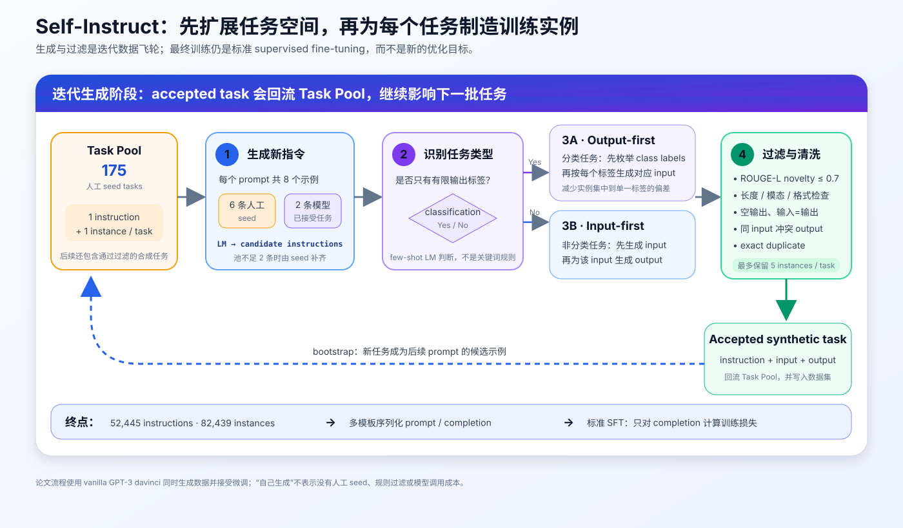
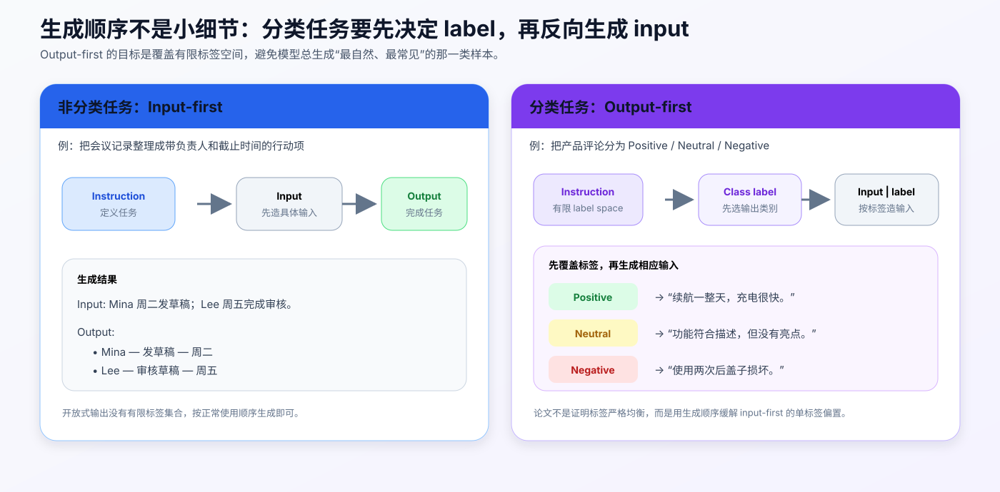
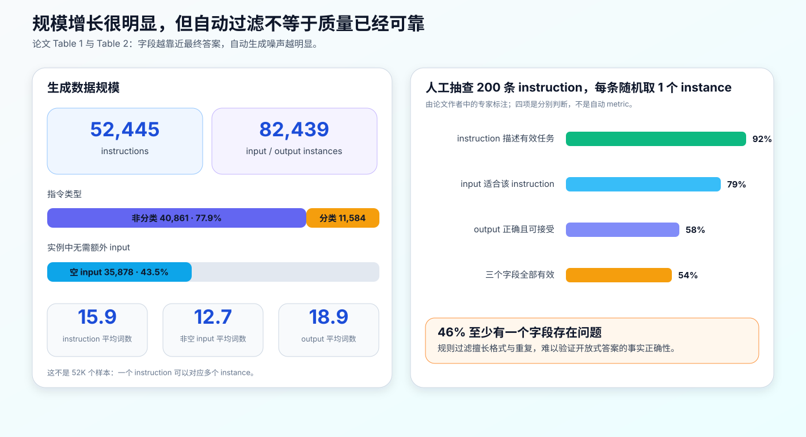
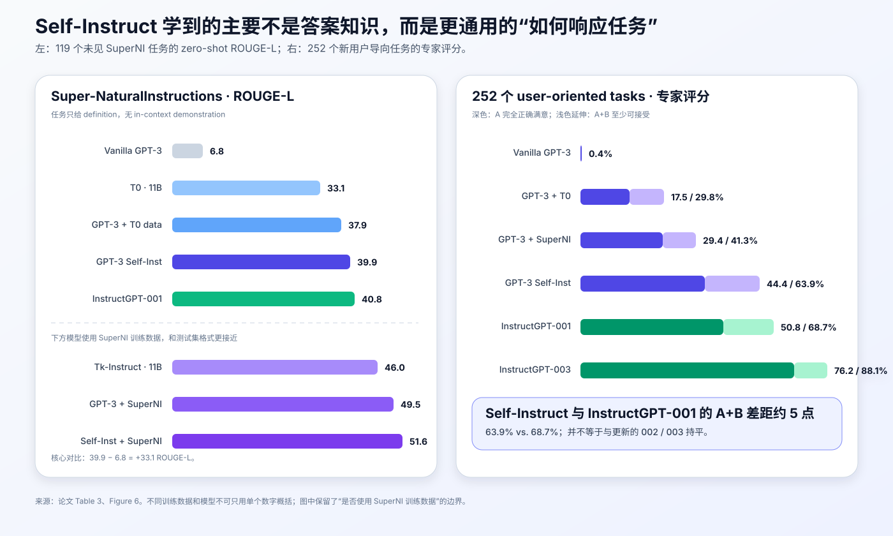

# Self-Instruct 原理与实现：大模型如何用自己生成的数据学会遵循指令


> **论文**：Self-Instruct: Aligning Language Models with Self-Generated Instructions<br>
> **作者**：Yizhong Wang、Yeganeh Kordi、Swaroop Mishra、Alisa Liu、Noah A. Smith、Daniel Khashabi、Hannaneh Hajishirzi<br>
> **会议**：ACL 2023<br>
> **关键词**：指令微调、合成数据、自举、数据过滤、监督微调<br>
> **原文**：[ACL Anthology](https://aclanthology.org/2023.acl-long.754/) · [arXiv](https://arxiv.org/abs/2212.10560) · [官方代码与数据](https://github.com/yizhongw/self-instruct)<br>
> **本文代码**：[依赖为零的最小实现](code/self_instruct_minimal.py)

Self-Instruct 的价值不在于提出了新模型结构，也不在于发明了新损失函数。它回答的是一个更像数据工程的问题：

> 如果一个预训练大模型已经能理解并生成许多任务，能否只给它少量人工示例，让它自己提出新任务、自己生成答案，再用这些数据训练自己？

论文给出的答案是“可以，但必须过滤”。作者从 **175 条人工种子任务**出发，用原始 GPT-3 `davinci` 迭代生成并筛选出 **52,445 条指令、82,439 个实例**，再对同一个 GPT-3 做标准监督微调。在未见过的 Super-NaturalInstructions 任务上，ROUGE-L 从 **6.8 提高到 39.9**，绝对提升 **33.1**。

不过，“模型自己造数据”很容易被宣传得过于神奇。人工抽查显示，虽然 92% 的指令描述了有效任务，但只有 58% 的输出正确且可接受，三项全部有效的样本仅占 54%。因此，Self-Instruct 真正留下的不是“合成数据天然可靠”，而是一条可扩展、可审计的数据自举流水线。

---

## 1. 先给出全局结论

读完整篇论文，最值得记住的是下面六点：

1. **Self-Instruct 是数据生成方法，不是新的训练算法。** 后半段依然是普通的监督微调（SFT）。
2. **“Self” 不等于无人参与。** 流程仍依赖 175 条人工种子、人工编写的提示模板、启发式规则和人工评估。
3. **分类任务必须特殊处理。** 非分类任务采用 input-first；分类任务采用 output-first，先想标签，再围绕各标签构造输入，避免标签分布塌缩。
4. **回流才构成自举。** 通过过滤的新任务会加入任务池，成为后续轮次的 few-shot 示例，而不是只扩写一轮。
5. **数量和质量必须分开看。** 52K 是通过规则过滤的数据规模，不代表 52K 条都经过人工验证。
6. **标题中的 alignment 主要指 instruction following。** 它不等同于完整的安全、价值观或人类偏好对齐，也不能替代 RLHF。



---

## 2. Self-Instruct 想解决什么问题

### 2.1 预训练模型“会做”，却不一定“会按要求做”

语言模型在大规模文本上学习的目标通常是预测下一个 token：

$$
\mathcal{L}_{\mathrm{LM}}(\theta)
=-\sum_{t=1}^{T}\log p_\theta(w_t\mid w_{<t}).
$$

这个目标让模型获得知识、语言能力和一定的任务能力，却没有直接教它：

- 哪一段是用户指令；
- 哪一段是待处理输入；
- 应该用什么格式给出答案；
- 面对从未见过的任务描述时，怎样迁移已有能力。

指令微调把训练样本组织为“指令—输入—输出”，让模型学习统一的自然语言任务接口。但在 2022 年前后，大规模、多样、开放域的指令数据主要有两条来源：

- 把已有 NLP 数据集改写成指令，如 FLAN、T0；
- 由人类编写任务和答案，再结合偏好反馈训练，如 InstructGPT。

前者受已有 benchmark 的任务边界限制，后者又昂贵且难以快速扩展。Self-Instruct 尝试让模型本身成为数据生成器。

### 2.2 三个容易混淆的对象

论文中的数据层级可以写成：

$$
\text{Task}_i
=\left(I_i,\left\{(X_{ij},Y_{ij})\right\}_{j=1}^{n_i}\right),
$$

其中：

- $I_i$：instruction，描述“要做什么”；
- $X_{ij}$：instance input，某个具体待处理对象，可以为空；
- $Y_{ij}$：instance output，期望答案；
- $n_i$：该任务拥有的实例数。

例如：

```text
Instruction: 将产品评论分成 Positive、Neutral 或 Negative。
Input:       The battery lasts all day.
Output:      Positive
```

“情感分类”是任务类型，整句要求是 instruction，而一条评论及其标签才是 instance。Self-Instruct 不只是为固定任务制造更多样本，而是同时扩展任务和实例。

---

## 3. 完整算法：Generate → Classify → Instantiate → Filter

设初始人工种子集合为 $S$，机器生成且已通过过滤的任务集合为 $M_k$，第 $k$ 轮任务池为：

$$
P_k=S\cup M_k.
$$

每一轮从 $P_k$ 采样 few-shot 示例，让基础模型生成候选任务 $C_k$；对候选任务识别类型、生成实例并过滤，得到接受集合 $A_k$：

$$
A_k=F\bigl(G(C_k)\bigr),\qquad
M_{k+1}=M_k\cup A_k.
$$

这里最重要的是 $A_k$ 会回到任务池。随着迭代进行，模型看到的不再只有人工种子，也会看到自己此前生成的任务，任务分布因此逐步扩展。

### 3.1 第 0 步：175 条人工种子任务

作者手工编写了 175 条种子任务：

| 类型 | 数量 | 占比 |
|---|---:|---:|
| 分类任务 | 25 | 14.3% |
| 非分类任务 | 150 | 85.7% |
| 合计 | 175 | 100% |

每个种子任务包含一条 instruction 和一个 instance。这些种子不是普通训练数据，而是整个合成分布的起点：它们示范了任务如何措辞、输入输出如何组织，以及模型可以沿哪些方向继续发散。

种子集需要同时满足两个看似冲突的要求：

- **足够规范**：否则模型会复制含糊格式和错误答案；
- **足够多样**：否则后续迭代只会围绕少数模板做同义改写。

### 3.2 第 1 步：生成新指令

一次指令生成 prompt 放入 8 个任务作为示例。正常情况下，其中 6 个来自人工种子，2 个来自已经通过过滤的机器生成任务；在最初机器任务不足时，用更多种子补齐。

抽象后的提示如下：

```text
Come up with a series of tasks:

1. {seed instruction 1}
2. {generated instruction 1}
...
8. {seed instruction 6}
9.
```

模型续写第 9、10、11……条任务。原论文在这一步使用相对更高的随机性：`temperature=0.7`、`top_p=0.5`，并设置较高的 presence penalty 来减少重复。参数是针对当时 GPT-3 `davinci` 调出的历史配置，不应机械照搬到今天的模型。

采样 6 条种子和 2 条机器任务有两个目的：

- 种子任务提供稳定的质量锚点；
- 已接受的机器任务扩大提示分布，推动下一轮继续探索。

### 3.3 第 2 步：识别是否为分类任务

候选指令生成后，作者再调用一次模型，判断它是否是分类任务。论文的定义不是“输出很短”，而是：

> 输出是否来自一个有限的标签集合。

例如：

| 指令 | 判断 | 原因 |
|---|---|---|
| 判断评论是正面、中性还是负面 | 分类 | 输出空间是三个标签 |
| 判断两个句子是否矛盾 | 分类 | 输出空间是有限标签 |
| 总结下面的新闻 | 非分类 | 输出是开放文本 |
| 写一封取消预约的邮件 | 非分类 | 输出是开放文本 |

这一步看似只是二分类，却决定下一步实例生成的因果顺序。

### 3.4 第 3 步：按任务类型生成实例



#### 非分类任务：input-first

开放式任务按自然顺序生成：

$$
I\rightarrow X\rightarrow Y.
$$

先根据 instruction 构造输入，再根据 instruction 与输入生成输出：

```text
Instruction: 把会议记录整理成带负责人和截止时间的行动项。
Input:       Mina 周二前发送初稿，Lee 周五完成审阅。
Output:      - Mina：发送初稿；周二
             - Lee：审阅初稿；周五
```

#### 分类任务：output-first

分类任务采用相反的生成顺序：

$$
I\rightarrow Y\rightarrow X.
$$

先确定类别标签，再让模型为各标签反向构造输入。例如先列出 `Positive / Neutral / Negative`，然后分别生成能对应这些标签的评论。

如果也使用 input-first，模型很容易连续构造最显眼、最常见的样本，导致所有实例落入同一个标签。output-first 相当于先对标签做分层采样，再条件生成 $X\sim p(X\mid I,Y)$，能显著缓解单标签偏置：

$$
p(X,Y\mid I)=p(Y\mid I)\,p(X\mid I,Y).
$$

这是 Self-Instruct 中最有辨识度、也最容易在二手解读里被省略的设计。

### 3.5 第 4 步：过滤指令与实例

生成模型擅长制造“看起来合理”的文本，但不保证新颖、可执行或正确。因此，过滤不是附属清洗，而是控制数据飞轮不失速的核心机制。

#### 指令级过滤

论文与发布代码的主要规则包括：

- 过短或过长：发布代码拒绝不超过 3 个词或超过 150 个词的指令；
- 当前纯文本模型无法处理的任务：含 `image`、`picture`、`graph`、`map`、`draw`、`plot`、`file` 等词；
- 含糊的编程任务：如以 `Write a program` 开头，却没有运行环境或输入输出约束；
- 异常开头：以标点或非 ASCII 字符开头；
- 与任务池中已有指令过于相似。

最后一项使用 ROUGE-L。设候选指令 token 序列为 $c$，已有指令为 $r$，最长公共子序列长度为 $LCS(c,r)$：

$$
R_{LCS}=\frac{LCS(c,r)}{|r|},\qquad
P_{LCS}=\frac{LCS(c,r)}{|c|},
$$

$$
F_{LCS}=\frac{2P_{LCS}R_{LCS}}{P_{LCS}+R_{LCS}}.
$$

对候选指令与任务池中所有指令计算相似度：

$$
s(c)=\max_{r\in P_k}F_{LCS}(c,r).
$$

论文正文写的是只有 $s(c)<0.7$ 才加入任务池；发布代码实际拒绝 `score > 0.7`，所以恰好等于 0.7 的边界会被接受。这种边界差异不影响主要结论，但复现时应以所采用的实现为准。

下面是本文最小实现中的核心逻辑：

```python
similarities = [
    (rouge_l_f1(instruction, existing), existing)
    for existing in existing_instructions
]
max_similarity, closest = max(similarities, default=(0.0, None))

# 与官方发布代码一致：严格大于 0.7 才拒绝。
if max_similarity > self.max_rouge_l:
    return FilterDecision(
        accepted=False,
        reason="too_similar",
        normalized_instruction=instruction,
        max_similarity=max_similarity,
        most_similar_instruction=closest,
    )
```

ROUGE-L 适合快速挡住近似复述，但它只看词序列重叠：两个表达不同、语义相同的指令可能漏过；两个共享大量固定术语、任务却不同的指令也可能被误杀。

#### 实例级过滤

发布代码还会处理：

- 完全重复的实例；
- 输入和输出完全相同；
- 输出为空；
- 输入或输出以冒号结尾，通常意味着生成被截断；
- 同一个非空输入对应冲突输出；
- 单个任务最多保留 5 个实例。

特别是“相同输入、不同输出”：原实现会丢弃这一批实例，而不是随便保留一个标签。教学实现保留了这个行为：

```python
outputs_by_input: dict[str, set[str]] = {}
for item in cleaned:
    if item.input:
        outputs_by_input.setdefault(item.input, set()).add(item.output)

if any(len(outputs) > 1 for outputs in outputs_by_input.values()):
    return ()
```

#### 规则过滤做不到什么

这些规则能判断格式、重复和部分可执行性，却不能可靠验证：

- 事实是否正确；
- 推理过程是否成立；
- 摘要是否遗漏关键信息；
- 开放式回答是否真正满足隐含要求；
- 样本是否包含偏见、隐私或训练/测试污染。

这正是为什么“通过过滤”不能写成“高质量真值”。

### 3.6 第 5 步：回流任务池

对每个通过过滤的候选任务，系统将 instruction 和有效 instances 一起加入任务池：

```python
task = Task(
    instruction=decision.normalized_instruction,
    instances=instances,
    is_classification=is_classification,
    source="generated",
)
pool.append(task)
```

下一轮采样时，新任务就可能出现在 8 个 few-shot 示例中。这个闭环把普通的数据增强变成了自举：

```text
少量人工任务
    ↓
生成候选任务 → 分类 → 生成实例 → 过滤
    ↑                              ↓
    └────────── 已接受任务回流 ────┘
```

---

## 4. 最后怎样训练：仍然是标准 SFT

数据生成完成后，作者把 instruction 与可选 input 拼成 prompt，把 output 当作 completion：

$$
Z_{ij}=T(I_i,X_{ij}),
$$

其中 $T$ 是文本模板。为了降低模型对单一格式的依赖，论文混用多种模板，例如：

```text
{instruction}
Input: {input}
Output:
```

```text
Task: {instruction}

{input}

Output:
```

当 input 为空时，则使用不含 `Input:` 的模板。训练目标只要求模型生成答案：

$$
\mathcal{L}_{\mathrm{SFT}}(\theta)
=-\sum_{i,j}\sum_{t=1}^{|Y_{ij}|}
\log p_\theta\!\left(y_{ij,t}\mid Z_{ij},y_{ij,<t}\right).
$$

原实验通过当时的 OpenAI 微调 API 从 GPT-3 `davinci` 出发，设置 `prompt_loss_weight=0`，训练 2 个 epoch。也就是说，损失只落在 completion 上，prompt 提供条件但不贡献训练损失。

论文报告，按 2022 年 12 月当时 `davinci` 的价格，生成完整数据约花费 600 美元，微调约花费 338 美元。这只是历史复现实验记录；模型、接口和价格早已变化，不应拿它估算今天的项目预算。

---

## 5. 生成了多少数据，又有多好



### 5.1 数据规模

| 统计项 | 数量 |
|---|---:|
| 指令总数 | 52,445 |
| 分类指令 | 11,584 |
| 非分类指令 | 40,861 |
| 实例总数 | 82,439 |
| input 为空的实例 | 35,878 |
| 平均指令长度 | 15.9 词 |
| 平均非空 input 长度 | 12.7 词 |
| 平均 output 长度 | 18.9 词 |

作者还用依存分析提取指令的根动词及其直接宾语。最常见的 20 个根动词及对应宾语合计只覆盖约 14% 的数据，说明合成任务并非只由少数固定模板组成。生成指令与 175 条种子的最大 ROUGE-L 分布，也显示相当一部分任务和种子的字面重叠不高。

但要注意：**词面多样不等于能力多样**。不同措辞可能仍在测同一种浅层能力，真正的任务覆盖还需要语义聚类和独立评测来验证。

### 5.2 人工质量审查

作者从生成数据中随机抽取 200 条指令，每条随机抽一个实例，由一位专家标注：

| 审查问题 | “是”的比例 |
|---|---:|
| instruction 是否描述有效任务 | 92% |
| input 是否适合该 instruction | 79% |
| output 是否正确且可接受 | 58% |
| 三个字段是否全部有效 | 54% |

这个表揭示了三个层次：

1. **任务可描述**相对容易，模型很会写“像任务的句子”；
2. **输入合适**更难，模型可能构造不完整或不匹配的输入；
3. **答案正确**最难，尤其涉及事实、推理或精确约束时。

所以，Self-Instruct 的成功不能解释为“噪声不重要”。更准确的说法是：大量、多样但有噪声的数据，仍足以显著改善模型的通用指令响应接口；如果进一步提高答案质量，效果还能继续提升。

---

## 6. 实验结果到底证明了什么



### 6.1 Super-NaturalInstructions：未见任务上的零样本泛化

作者从 Super-NaturalInstructions 中选择 119 个测试任务，每个任务抽 100 个实例。推理时只给任务 definition，不给 demonstration，并使用确定性解码。

| 模型 | 参数规模 | SuperNI ROUGE-L |
|---|---:|---:|
| GPT-3 | 175B | 6.8 |
| T5-LM | 11B | 25.7 |
| T0 | 11B | 33.1 |
| GPT-3 + T0 训练数据 | 175B | 37.9 |
| **GPT-3 Self-Inst** | **175B** | **39.9** |
| InstructGPT-001 | 175B | 40.8 |
| Tk-Instruct | 11B | 46.0 |
| GPT-3 + SuperNI 训练数据 | 175B | 49.5 |
| GPT-3 Self-Inst + SuperNI 训练数据 | 175B | 51.6 |

最重要的同底座对比是：

$$
39.9-6.8=33.1.
$$

Self-Instruct 把原始 GPT-3 的 ROUGE-L 提高了 33.1，接近 InstructGPT-001 的 40.8。加入 SuperNI 训练数据后，Self-Instruct 初始化仍比普通 GPT-3 初始化高 2.1 分（51.6 对 49.5）。

不过，不能只看排行榜位置：

- Tk-Instruct、GPT-3 + SuperNI 等模型使用了与测试体系更接近的 SuperNI 训练数据；
- Self-Instruct 主要验证“只用合成指令数据能否改善跨任务泛化”；
- “接近 InstructGPT-001”不等于接近更新的 InstructGPT-002/003，更不代表安全与偏好能力相当。

### 6.2 252 个新用户导向任务：人类评分

为减少公共 benchmark 泄漏和任务格式偏差，作者又人工编写了 252 个用户导向任务。每个模型生成一个回答，由专家评为：

- **A**：正确且令人满意；
- **B**：可接受，但有小问题；
- **C**：相关，但存在明显错误；
- **D**：无关或无效。

下表保留原图中的计数；每行总数均为 252：

| 模型 | A | B | C | D | A 占比 | A+B 占比 |
|---|---:|---:|---:|---:|---:|---:|
| GPT-3 | 1 | 0 | 64 | 187 | 0.4% | 0.4% |
| GPT-3 + T0 | 44 | 31 | 59 | 118 | 17.5% | 29.8% |
| GPT-3 + SuperNI | 74 | 30 | 80 | 68 | 29.4% | 41.3% |
| GPT-3 Self-Inst + SuperNI | 83 | 54 | 84 | 31 | 32.9% | 54.4% |
| **GPT-3 Self-Inst** | **112** | **49** | **66** | **25** | **44.4%** | **63.9%** |
| InstructGPT-001 | 128 | 45 | 61 | 18 | 50.8% | 68.7% |
| InstructGPT-002 | 168 | 40 | 34 | 10 | 66.7% | 82.5% |
| InstructGPT-003 | 192 | 30 | 28 | 2 | 76.2% | 88.1% |

Self-Instruct 的 A+B 比例为 63.9%，和 InstructGPT-001 的 68.7% 相差约 5 个百分点；但与 002、003 仍有明显差距。部分样本由第二位标注者复核，Cohen's $\kappa=0.57$，说明开放式生成质量存在中等程度的主观性，不能把人工分级视为无噪声金标准。

### 6.3 数据规模与答案质量消融

论文的数据规模曲线中，A 级回答比例从约 31.0% 逐步上升到 36.9%、43.7%、44.4%，并在约 16K 条指令之后趋于平台。它说明：

- 从 175 条种子扩展到数千、上万条任务很有价值；
- 继续堆同一生成分布的数据，边际收益会下降；
- 到某个规模后，质量与覆盖比纯数量更重要。

作者还固定 52K 条指令，用更强的 InstructGPT-003 重新生成 output，再训练 GPT-3，A 级回答比例达到 54.4%，比原 Self-Instruct 的 44.4% 高约 10 点。这直接支持了一个工程结论：**候选任务的多样性与目标答案的可靠性，是两个需要分别优化的轴。**

---

## 7. 可运行的最小实现

本文提供了一个不需要 API key、也不下载模型的教学版本：

```bash
python3 papers/to-2026/code/self_instruct_minimal.py
```

完整代码见：[self_instruct_minimal.py](code/self_instruct_minimal.py)。它不是把论文伪代码再抄一遍，而是把关键机制拆成可替换组件：

```text
GenerationBackend
├── generate_instructions()  # 生成候选指令
├── is_classification()      # 判断有限标签任务
└── generate_instances()     # input-first / output-first

SelfInstructPipeline
├── sample_prompt_tasks()    # 8-shot，最多 2 条机器任务
├── InstructionFilter        # 长度、模态、ROUGE-L 等
├── filter_instances()       # 冲突、重复、截断等
└── serialize_for_sft()      # 多模板 prompt/completion
```

### 7.1 后端接口

```python
class GenerationBackend(Protocol):
    def generate_instructions(
        self,
        prompt_examples: Sequence[Task],
        round_index: int,
    ) -> Sequence[str]: ...

    def is_classification(self, instruction: str) -> bool: ...

    def generate_instances(
        self,
        instruction: str,
        *,
        output_first: bool,
    ) -> Sequence[Instance]: ...
```

示例使用确定性的 `ScriptedBackend` 模拟模型调用，保证任何环境都能复现实验流程。要接真实模型，只需实现这三个方法，过滤、审计和 SFT 序列化不必绑定某个供应商。

### 7.2 自举主循环

```python
for round_index in range(rounds):
    prompt_tasks = sample_prompt_tasks(pool, rng=self.rng)
    candidates = self.backend.generate_instructions(
        prompt_tasks, round_index
    )

    for candidate in candidates:
        decision = self.instruction_filter.evaluate(
            candidate,
            [task.instruction for task in pool],
        )
        audit_log.append(decision)
        if not decision.accepted:
            rejection_counts[decision.reason] += 1
            continue

        is_clf = self.backend.is_classification(
            decision.normalized_instruction
        )
        raw_instances = self.backend.generate_instances(
            decision.normalized_instruction,
            output_first=is_clf,
        )
        instances = filter_instances(raw_instances)
        if not instances:
            rejection_counts["no_valid_instances"] += 1
            continue

        task = Task(
            instruction=decision.normalized_instruction,
            instances=instances,
            is_classification=is_clf,
            source="generated",
        )
        pool.append(task)
```

这个循环刻意保留 `audit_log` 和按原因统计的拒绝计数。生产系统如果只保存通过的数据，就无法回答“过滤掉了什么、为什么过滤、某轮分布为何突变”。

### 7.3 运行输出

```text
Accepted generated tasks:
- [input-first] Draft a polite cancellation email using the supplied reason and date. (1 instances)
- [output-first] Sort each product review into Positive, Neutral, or Negative. (3 instances)
- [input-first] Convert meeting notes into action items with owners and deadlines. (1 instances)
Rejections: {'ambiguous_program_request': 1, 'too_short': 1,
             'too_similar': 2, 'unsupported_modality': 1}
SFT rows: 5
```

示例故意混入近重复、过短、含不支持模态以及含糊编程请求，便于观察每条规则，而不是只展示“完美通过”的快乐路径。

### 7.4 教学实现与官方实现的边界

这份代码复现的是算法骨架，不追求逐 token 复刻 2022 年 API：

- 本地 ROUGE-L 使用轻量 tokenizer，不做 stemming，标点密集文本的分数可能与官方 `rouge_score` 略有不同；
- `ScriptedBackend` 不生成真实自然语言分布，只用于验证控制流；
- 真实系统必须补充重试、速率限制、批处理、缓存、成本核算和模型版本记录；
- 论文的提示模板与历史 API 参数应从官方仓库查阅，而不是把本文示例当成唯一模板。

---

## 8. 为什么它有效

### 8.1 指令微调更多是在学习“接口”

预训练大模型可能已经具备翻译、改写、分类和简单推理能力，只是不会稳定地把任意自然语言要求映射到正确响应形式。多样的指令数据让模型反复学习：

$$
(\text{natural-language intent},\text{optional input})
\longrightarrow \text{task-appropriate output}.
$$

所以 Self-Instruct 不必把所有事实知识重新教一遍，也能取得很大增益。39.9 对 6.8 的提升，更像“把潜在能力接上统一接口”，而不是凭空灌入 33.1 分的新知识。

### 8.2 少量种子提供归纳偏置

模型并非从空白开始发明任务。175 条种子提供了：

- 什么叫一个可执行的任务；
- instruction、input、output 的边界；
- 分类、生成、抽取、改写等任务范式；
- 期望的语言风格与粒度。

这是一种 in-context 的分布引导。种子的质量和覆盖范围，会通过迭代不断被放大。

### 8.3 过滤形成选择压力

如果所有生成结果都回流，重复、含糊和错误模式也会被强化。Self-Instruct 用 ROUGE-L 和规则构造了一个简单的选择函数：只有足够新颖且格式有效的候选才能成为下一代示例。

这个过程很像进化式搜索，但要避免类比过头：模型参数在数据生成轮次中没有在线更新，真正的参数更新发生在数据收集完成后的 SFT；迭代变化的是任务池和 prompt 分布。

### 8.4 output-first 主动控制类别覆盖

合成数据不只要“像真的”，还要避免模式塌缩。分类任务先选 $Y$ 再生成 $X$，本质上是对目标变量做显式控制。这一思想后来广泛出现在条件生成、难例构造和类别均衡数据合成中。

---

## 9. 局限：哪些问题 Self-Instruct 没有解决

### 9.1 “Self” 仍然依赖人类设计

Self-Instruct 不是自主发现世界目标的系统。人类仍负责：

- 写 175 条种子任务；
- 定义分类任务与生成模板；
- 设计过滤规则和阈值；
- 选择评测集并解释结果；
- 决定什么数据可以进入训练。

“几乎不需要人工标注”更准确地指每条合成样本不需要逐一标注，而不是整个流程没有人类监督。

### 9.2 教师偏差与错误会被继承

生成 instruction、input 和 output 的是同一个基础模型。它不懂的知识、稳定的偏见和错误推理会一起进入数据。再用这些数据训练同一底座，可能形成模型自己的分布闭环，而不是获得外部新信息。

### 9.3 规则筛选不等于语义验证

ROUGE-L 能去近重复，关键词能去纯文本模型做不了的任务，但它们不能证明答案正确。论文中只有 54% 的抽查样本三字段全部有效，已经直接量化了这个缺口。

### 9.4 多样性受种子和生成模型上限约束

任务池会扩展，但仍被三重边界限制：

$$
\text{reachable tasks}
\subseteq
\text{seed-induced region}
\cap \text{generator capability}
\cap \text{filter acceptance region}.
$$

过强的相似度过滤可能拒绝合理变体，过弱又会造成模板堆积；种子缺失的语言、领域和交互形式也未必会自然出现。

### 9.5 它不是完整的人类偏好或安全对齐

SFT 教模型“照指令回答”，但没有让人类比较多个答案，也没有专门优化帮助性、诚实性和无害性。对高风险请求的拒答、安全边界和价值冲突，需要额外的数据、策略与评测。

### 9.6 基准污染与隐私风险

基础模型可能已经在预训练中见过公开任务，合成指令也可能意外复述评测集。生成文本还可能包含个人信息、受版权保护内容或敏感信息。原论文主要研究指令泛化，并未提供今天生产系统所需的完整治理层。

---

## 10. 如果今天重做一套生产级 Self-Instruct

论文的四阶段框架仍然好用，但不应只复制 2022 年的关键词规则。一个更稳健的数据工厂通常需要以下层次。

### 10.1 先定义数据契约

每条任务至少保存：

```json
{
  "task_id": "uuid",
  "instruction": "...",
  "input": "...",
  "output": "...",
  "task_type": "classification",
  "labels": ["Positive", "Neutral", "Negative"],
  "generator": "provider/model/version",
  "prompt_version": "instruction-gen-v3",
  "seed_ids": ["seed-017", "seed-081"],
  "generation_params": {"temperature": 0.7},
  "filter_results": [],
  "created_at": "..."
}
```

没有来源、模型版本、prompt 版本和过滤轨迹的数据，出了问题很难追责或重建。

### 10.2 把“质量”拆成多道门

推荐按成本从低到高排列：

1. **结构校验**：字段完整、长度、编码、JSON schema；
2. **精确去重**：规范化文本哈希；
3. **词面去重**：ROUGE-L、MinHash；
4. **语义去重**：embedding 近邻与聚类；
5. **任务验证器**：代码执行、数学求解器、分类标签约束、格式 parser；
6. **模型评审**：独立模型按 rubric 检查正确性，但不能把 judge 当真值；
7. **人工抽检**：按任务簇、风险级别和拒绝原因分层采样。

对可验证任务，优先使用确定性工具。例如代码题运行测试、SQL 在隔离数据库执行、结构化输出过 schema、数学题用符号工具复核。模型互评只能补充，不能替代外部证据。

### 10.3 分开控制覆盖与正确性

可以让较有创造力的模型负责提议任务，让更可靠的模型或工具负责生成/验证答案：

```text
creative proposer → diverse instructions
reliable solver   → candidate outputs
tool verifier     → executable checks
independent judge → rubric review
human audit       → calibrated sample
```

这比让同一个模型同时当出题人、答题人和裁判更能降低相关错误。

### 10.4 用配额避免分布失控

单纯追求接受率会让简单任务占满数据集。应监控并设置：

- 任务类型和难度配额；
- 领域、语言、长度和输出格式分布；
- 标签平衡和拒绝原因；
- 每个种子簇的扩增倍率；
- 与训练集、验证集、公开 benchmark 的最近邻距离。

### 10.5 用隔离评测闭环，而不是训练分数闭环

数据扩张是否有用，最终要在从未进入生成 prompt、过滤器和训练集的 holdout 任务上回答。建议同时维护：

- 能力评测：正确率、ROUGE、执行成功率；
- 格式评测：schema 合规、指令约束满足率；
- 安全评测：越权、隐私、偏见和拒答；
- 数据评测：重复率、簇覆盖、人工通过率；
- 成本评测：每条最终通过样本的 token、延迟与费用。

---

## 11. 与相关方法的区别

| 方法 | 任务/数据来源 | 主要监督 | Self-Instruct 与它的区别 |
|---|---|---|---|
| FLAN / T0 | 人工模板改写已有 NLP 数据集 | 已有 gold label | Self-Instruct 从少量种子生成新任务与新实例 |
| InstructGPT | 人类示范与人类排序 | SFT + 奖励模型 + RLHF | Self-Instruct 主要依赖合成数据，只做 SFT |
| 传统 self-training | 固定目标任务下的无标签样本 | 伪标签 | Self-Instruct 连任务本身也一起生成 |
| 数据增强 | 对已有实例做扰动或改写 | 原任务标签 | Self-Instruct 扩大任务分布，而不只扩大样本数 |
| Unnatural Instructions | 大规模合成指令数据 | 强指令模型生成 | 更接近教师模型蒸馏，不强调同一 vanilla LM 自举 |
| Alpaca | 强教师根据种子批量生成 52K 样本 | 教师输出 + SFT | 受 Self-Instruct 启发，但流水线更简化，核心是蒸馏 |

Self-Instruct 最接近 self-training，但又有一个关键差异：经典 self-training 通常假设目标任务固定，只为无标签输入生成伪标签；Self-Instruct 同时生成任务定义、输入和答案，探索的是开放任务空间。

---

## 12. 复现与阅读清单

### 算法复现

- [ ] 准备高质量且覆盖足够广的种子任务；
- [ ] 每轮记录 sampled seed IDs 与完整 prompt；
- [ ] 分类任务使用 output-first，非分类任务使用 input-first；
- [ ] 指令过滤记录最大相似度及最近邻，而不只保存布尔结果；
- [ ] 实例过滤检测截断、空输出、重复与冲突；
- [ ] 通过数据回流任务池，拒绝数据保留审计记录；
- [ ] SFT 同时覆盖有 input 和无 input 的多种模板；
- [ ] 在独立未见任务上评测，而不只看训练 loss。

### 论文阅读

- [ ] Figure 1：理解迭代数据生成流程；
- [ ] §2.2：重点看分类识别与两种 instance generation；
- [ ] Table 1/2：同时看规模和质量，不只记 52K；
- [ ] Table 3：区分是否使用 SuperNI 训练数据；
- [ ] Figure 6/7：看用户任务与数据规模消融；
- [ ] Appendix A.4：阅读四类真实提示模板；
- [ ] 官方代码：核对论文描述与实现边界。

---

## 13. 一句话总结

Self-Instruct 可以压缩成一个公式：

$$
\boxed{
\text{少量人工种子}
\xrightarrow{\text{模型生成}}
\text{候选任务与实例}
\xrightarrow{\text{去重、校验、选择}}
\text{可训练数据}
\xrightarrow{\text{SFT}}
\text{更强的指令跟随能力}
}
$$

真正值得继承的不是“让模型多生成一些数据”，而是四个工程原则：

1. 把任务发现与实例生成拆开；
2. 根据任务结构改变生成顺序；
3. 让通过过滤的数据回流，但保存完整审计轨迹；
4. 永远把规模、多样性、正确性和独立评测分开衡量。

模型可以成为高吞吐量的数据提议者，但在可验证、高风险或事实密集的场景中，它不应同时充当唯一的出题人、答题人和裁判。

---

## 参考资料与延伸阅读

### 一手资料

- [Self-Instruct 论文（ACL Anthology）](https://aclanthology.org/2023.acl-long.754/)
- [Self-Instruct 官方代码与数据](https://github.com/yizhongw/self-instruct)
- [52K 指令 / 82K 实例数据说明](https://github.com/yizhongw/self-instruct/tree/main/data)

### 本仓库相关论文

- [FLAN：Instruction Tuning 的起点](08_FLAN_2021_原理.md)
- [InstructGPT：SFT、奖励模型与 RLHF](10_InstructGPT_2022_原理.md)
- [Constitutional AI：用原则与 AI 反馈扩展对齐](19_Constitutional_AI_2023_原理.md)
- [DPO：直接偏好优化](23_DPO_2023_原理.md)
- [QLoRA：低成本微调指令模型](24_QLoRA_2023_原理.md)

> 本文封面是概念示意图，流程图和统计图依据论文正文、表格与官方实现重新绘制；它们不是论文原图。实验中的 GPT-3 / InstructGPT 名称和 API 配置均为论文发表时的历史设置。
