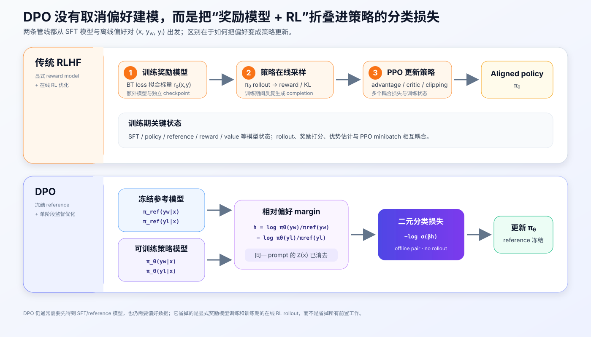
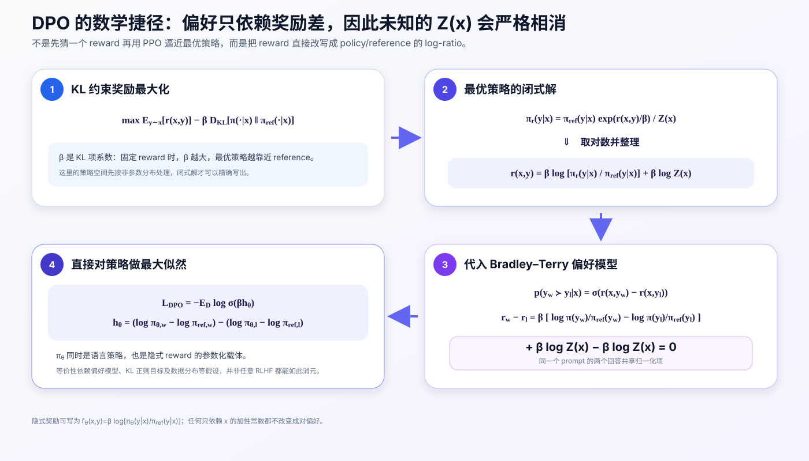
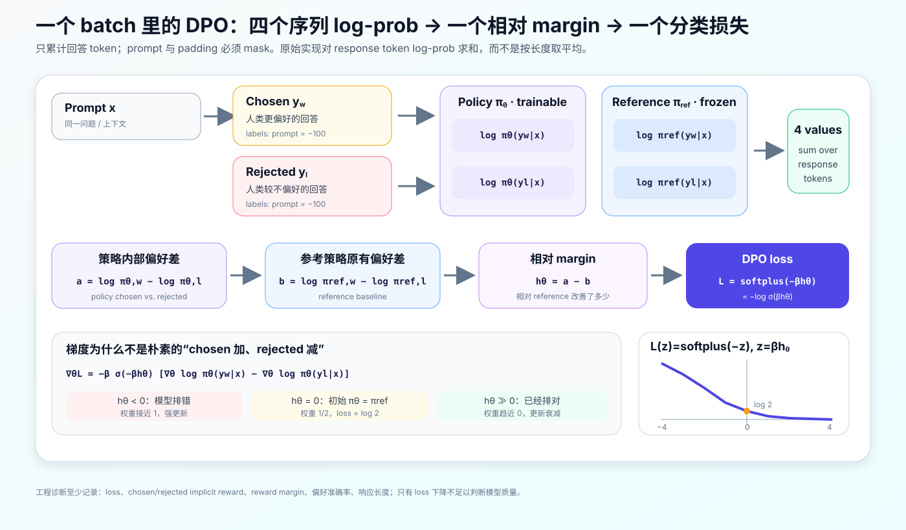
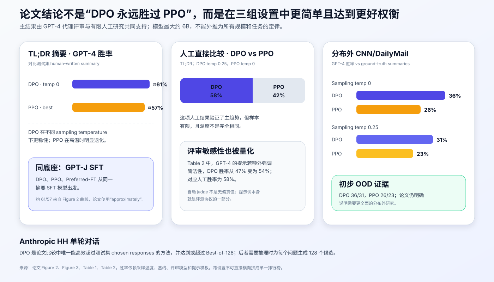

# DPO 原理与实现：不用奖励模型和 PPO，如何直接从偏好训练语言模型


> **论文**：Direct Preference Optimization: Your Language Model is Secretly a Reward Model<br>
> **作者**：Rafael Rafailov、Archit Sharma、Eric Mitchell、Christopher D. Manning、Stefano Ermon、Chelsea Finn<br>
> **会议**：NeurIPS 2023<br>
> **关键词**：偏好学习、RLHF、Bradley–Terry、KL 正则、直接对齐<br>
> **原文**：[NeurIPS Proceedings](https://proceedings.neurips.cc/paper_files/paper/2023/hash/a85b405ed65c6477a4fe8302b5e06ce7-Abstract-Conference.html) · [arXiv](https://arxiv.org/abs/2305.18290) · [官方实现](https://github.com/eric-mitchell/direct-preference-optimization)<br>
> **本文代码**：[依赖为零的 DPO 最小实现](code/dpo_minimal.py)

DPO（Direct Preference Optimization）最吸引人的地方，是把传统 RLHF 中“训练奖励模型，再用 PPO 优化策略”的多阶段流程，改写成一个普通的二元分类损失：给定同一个 prompt 的优选回答 $y_w$ 和拒选回答 $y_l$，直接让策略模型更偏向 $y_w$，同时用冻结参考模型限制策略漂移。

但“DPO 就是 chosen 概率加、rejected 概率减”只是表面直觉。它真正成立的原因是：

1. 带 KL 正则的奖励最大化存在一个闭式最优策略；
2. 这个闭式解允许把 reward 反写成 policy/reference 的 log-ratio；
3. Bradley–Terry 偏好模型只依赖两个回答的奖励差；
4. 两个回答共享的未知配分函数 $Z(x)$ 因此严格相消。

最后得到：

$$
\boxed{
\mathcal L_{\mathrm{DPO}}
=-\mathbb E_{(x,y_w,y_l)\sim\mathcal D}
\left[
\log\sigma\!\left(
\beta\log\frac{\pi_\theta(y_w\mid x)}{\pi_{\mathrm{ref}}(y_w\mid x)}
-\beta\log\frac{\pi_\theta(y_l\mid x)}{\pi_{\mathrm{ref}}(y_l\mid x)}
\right)
\right]
}
$$

这篇文章将从 RLHF 的原目标开始，一步步推到 DPO loss，再落到 token mask、序列 log-prob、参考模型、训练代码、实验边界和生产实践。

---

## 1. 先给结论：DPO 做了什么，又没做什么

### 1.1 DPO 真正做的事

- 用离线偏好对 $(x,y_w,y_l)$ 直接训练语言模型策略；
- 用 policy 相对 reference 的概率变化表示一个隐式 reward；
- 用 Bradley–Terry 最大似然拟合人类的成对选择；
- 将训练形式变成和 SFT 相近的反向传播，不需要 PPO rollout；
- 对排错的样本赋予更大的动态梯度权重，对已经排对且 margin 足够大的样本逐渐减小更新。

### 1.2 DPO 没有做的事

- 没有取消 SFT：官方流程通常仍是 `SFT → DPO`；
- 没有取消 reference：原始 DPO 明确依赖冻结参考策略；
- 没有取消偏好数据：仍要收集或构造 chosen/rejected；
- 没有证明所有现实 RLHF 都能无条件等价改写；
- 没有解决偏好标签错误、分布偏移、评测偏差和安全目标定义；
- 没有生成一个可单独调用的显式 reward model，但策略本身隐式参数化了 reward。



一句话说：

> DPO 省掉的是显式奖励模型训练和训练期在线 RL 优化，不是省掉所有对齐成本。

---

## 2. 问题设定：偏好数据究竟是什么

一条偏好样本写成：

$$
(x,y_w,y_l),\qquad y_w\succ y_l\mid x,
$$

其中：

- $x$：prompt、问题或对话上下文；
- $y_w$：winner/chosen，人类更偏好的回答；
- $y_l$：loser/rejected，人类较不偏好的回答；
- $\succ$：只表示相对排序，不提供绝对分数。

例如：

```json
{
  "prompt": "客户的订单迟迟没有退款，应该怎样回复？",
  "chosen": "先致歉，说明退款处理步骤，并给出明确时间范围。",
  "rejected": "退款不归我管，请自己阅读条款。"
}
```

偏好监督与普通 SFT 的信息量不同：

| 训练形式 | 使用的信息 | 没用到的信息 |
|---|---|---|
| SFT on chosen | $x\rightarrow y_w$ | 不知道 $y_l$ 为什么更差 |
| Unlikelihood | 提高 $y_w$、压低 $y_l$ | 没有 reference 校正与动态权重 |
| Reward model | 学习 $r_\phi(x,y_w)>r_\phi(x,y_l)$ | 还需另一步优化策略 |
| DPO | 学习 policy 相对 reference 的成对偏好变化 | 不产出独立 reward model |

相对判断往往比写出专家级完美答案容易，但它并不天然可靠：标注者可能标准不一致、忽略事实错误、偏好更长回答，或者对两个都很差的答案硬选一个。

---

## 3. 从传统 RLHF 开始

DPO 论文先回顾了常见 RLHF 管线：

1. **SFT**：用高质量示范得到 $\pi_{\mathrm{SFT}}$；
2. **偏好与奖励建模**：让人类比较回答，训练 $r_\phi(x,y)$；
3. **RL 优化**：使用 PPO 最大化 reward，同时通过 KL 不让策略离 reference 太远。

### 3.1 Bradley–Terry 奖励模型

假设人类选择 $y_1$ 而非 $y_2$ 的概率由潜在 reward 决定：

$$
p^*(y_1\succ y_2\mid x)
=\frac{\exp r^*(x,y_1)}
{\exp r^*(x,y_1)+\exp r^*(x,y_2)}
=\sigma\bigl(r^*(x,y_1)-r^*(x,y_2)\bigr).
$$

显式奖励模型通过负对数似然训练：

$$
\mathcal L_R(r_\phi)
=-\mathbb E_{(x,y_w,y_l)\sim\mathcal D}
\left[
\log\sigma\bigl(r_\phi(x,y_w)-r_\phi(x,y_l)\bigr)
\right].
$$

这个模型只通过 reward 差参与损失，因此对任意只依赖 prompt 的函数 $f(x)$，

$$
r'(x,y)=r(x,y)+f(x)
$$

会产生完全相同的偏好概率。换言之，成对偏好只能识别 reward 的等价类，不能确定每个回答的绝对 reward 零点。

### 3.2 带 KL 正则的策略目标

RL 阶段常见的理想化目标是：

$$
\max_\pi
\mathbb E_{x\sim\mathcal D,\,y\sim\pi(\cdot\mid x)}[r(x,y)]
-\beta\,
D_{\mathrm{KL}}
\left[
\pi(y\mid x)\parallel\pi_{\mathrm{ref}}(y\mid x)
\right].
$$

$\pi_{\mathrm{ref}}$ 通常是 SFT 模型。KL 项很重要：奖励模型只在其训练分布附近较可信，如果策略跑得太远，就可能利用 reward model 的漏洞，并出现模式坍缩或语言退化。

这里的 $\beta>0$ 是 KL 系数。固定 reward 时：

- $\beta$ 大：偏离 reference 更贵，最优策略更保守；
- $\beta$ 小：reward 的作用更强，最优策略允许移动更远。

由于语言生成是离散采样，传统方案通常需要 policy、reference、reward model、value/critic、rollout 和 PPO 状态，工程上耦合较多。

---

## 4. DPO 的完整推导



### 4.1 第一步：解出最优策略

对固定 prompt $x$，展开 KL：

$$
J(\pi)
=\sum_y\pi(y\mid x)r(x,y)
-\beta\sum_y\pi(y\mid x)
\log\frac{\pi(y\mid x)}{\pi_{\mathrm{ref}}(y\mid x)}.
$$

加上归一化约束 $\sum_y\pi(y\mid x)=1$，对 $\pi(y\mid x)$ 求驻点，可以得到：

$$
\pi_r(y\mid x)
=\frac{1}{Z(x)}
\pi_{\mathrm{ref}}(y\mid x)
\exp\left(\frac{r(x,y)}{\beta}\right),
$$

其中：

$$
Z(x)=\sum_y
\pi_{\mathrm{ref}}(y\mid x)
\exp\left(\frac{r(x,y)}{\beta}\right).
$$

它的含义很直观：最优策略是在 reference 分布上，按 $\exp(r/\beta)$ 重新加权。

也可以把原目标整理为：

$$
J(\pi)
=-\beta D_{\mathrm{KL}}
\left(\pi(\cdot\mid x)\parallel\pi_r(\cdot\mid x)\right)
+\beta\log Z(x),
$$

因此最大值在 $\pi=\pi_r$ 时取得。这种闭式解首先在非参数策略分布上成立；现实中的神经网络训练仍是有限参数、有限数据下的数值优化。

### 4.2 第二步：把 reward 反写成策略概率比

对闭式解取对数：

$$
\log\pi_r(y\mid x)
=\log\pi_{\mathrm{ref}}(y\mid x)
+\frac{r(x,y)}{\beta}
-\log Z(x).
$$

整理得：

$$
r(x,y)
=\beta\log
\frac{\pi_r(y\mid x)}{\pi_{\mathrm{ref}}(y\mid x)}
+\beta\log Z(x).
$$

这就是论文标题 “Your Language Model is Secretly a Reward Model” 的来源。策略相对 reference 提高某回答概率的幅度，可以解释为该回答的隐式 reward。

实践中常记录：

$$
\hat r_\theta(x,y)
=\beta\log
\frac{\pi_\theta(y\mid x)}{\pi_{\mathrm{ref}}(y\mid x)}.
$$

它省略了只依赖 $x$ 的 $\beta\log Z(x)$。由于偏好只看 reward 差，这个省略不会改变 chosen/rejected 的顺序。但 $\hat r_\theta$ 不应被当成跨 prompt 可比较、绝对标定过的 reward 分数。

### 4.3 第三步：配分函数在奖励差中相消

把 reward 反解式代入 Bradley–Terry：

$$
p^*(y_w\succ y_l\mid x)
=\sigma\bigl(r^*(x,y_w)-r^*(x,y_l)\bigr).
$$

同一个 $x$ 下：

$$
\begin{aligned}
r^*(x,y_w)-r^*(x,y_l)
=\;&\beta\log\frac{\pi^*(y_w\mid x)}
{\pi_{\mathrm{ref}}(y_w\mid x)}\\
&-\beta\log\frac{\pi^*(y_l\mid x)}
{\pi_{\mathrm{ref}}(y_l\mid x)}\\
&+\beta\log Z(x)-\beta\log Z(x).
\end{aligned}
$$

最后一行严格等于 0。昂贵、难计算的 $Z(x)$ 不需要估计。

### 4.4 第四步：直接优化策略最大似然

用参数化策略 $\pi_\theta$ 代替未知的最优策略 $\pi^*$，对偏好标签做最大似然，就得到 DPO：

$$
\mathcal L_{\mathrm{DPO}}(\pi_\theta;\pi_{\mathrm{ref}})
=-\mathbb E_\mathcal D
\left[
\log\sigma\left(\beta h_\theta(x,y_w,y_l)\right)
\right],
$$

其中：

$$
h_\theta
=\underbrace{\log\pi_\theta(y_w\mid x)
-\log\pi_\theta(y_l\mid x)}_{\text{policy 的偏好差}}
-\underbrace{\left(
\log\pi_{\mathrm{ref}}(y_w\mid x)
-\log\pi_{\mathrm{ref}}(y_l\mid x)
\right)}_{\text{reference 原有偏好差}}.
$$

$h_\theta$ 问的不是“policy 是否更喜欢 chosen”，而是：

> 相比 reference，policy 对 chosen 相对于 rejected 的偏好提高了多少？

这就是 reference 校正的核心。

### 4.5 “等价”到底意味着什么

论文的漂亮推导依赖一组建模条件：

- 使用 KL 正则的奖励最大化目标；
- 偏好服从 Bradley–Terry，或其 Plackett–Luce 推广；
- reference 对考虑的回答有正概率；
- 理论最优策略先在足够一般的策略分布中讨论；
- 偏好数据能代表所要学习的潜在偏好。

所以，准确说法是：DPO 在这些假设下，通过 reward-policy 变量替换，对同一类偏好目标给出了直接策略优化形式。它不意味着任意 PPO 实现、任意 reward shaping、任意在线 RL 任务都可以无条件换成 DPO 后得到相同结果。

---

## 5. DPO loss 到底在优化什么



### 5.1 四个序列 log-prob

每个偏好对需要：

$$
\log\pi_\theta(y_w\mid x),\quad
\log\pi_\theta(y_l\mid x),\quad
\log\pi_{\mathrm{ref}}(y_w\mid x),\quad
\log\pi_{\mathrm{ref}}(y_l\mid x).
$$

对于自回归语言模型：

$$
\log\pi_\theta(y\mid x)
=\sum_{t=1}^{|y|}
\log\pi_\theta(y_t\mid x,y_{<t}).
$$

这里只累计 completion token：

- prompt token 只提供条件，不参与序列得分；
- padding token 必须 mask；
- causal LM 的 logits 与 labels 必须错位一位；
- 原论文和官方实现使用 token log-prob 的**求和**。

如果误把 prompt token 加进去，chosen/rejected 虽共享 prompt 文本，但由于后续 padding、截断、模板或实现细节，结果不一定真的完全抵消；更重要的是，这已经不是论文定义的 $\pi(y\mid x)$。

### 5.2 一个数值例子

假设：

```text
policy:    log πθ(yw|x)   = -8.0
           log πθ(yl|x)   = -10.0

reference: log πref(yw|x) = -8.5
           log πref(yl|x) = -9.5

beta = 0.1
```

则：

$$
\Delta_\pi=-8-(-10)=2,
\qquad
\Delta_{\mathrm{ref}}=-8.5-(-9.5)=1,
$$

$$
h_\theta=2-1=1,
\qquad
z=\beta h_\theta=0.1.
$$

预测 chosen 获胜的概率：

$$
\sigma(0.1)\approx0.525,
$$

单样本损失：

$$
-\log\sigma(0.1)\approx0.644.
$$

隐式奖励诊断为：

$$
\hat r_w=0.1(-8+8.5)=0.05,
\qquad
\hat r_l=0.1(-10+9.5)=-0.05.
$$

policy 已经比 reference 多拉开 1 nat 的相对差距，但 $\beta=0.1$ 后分类 logit 只有 0.1，所以仍有更新空间。

### 5.3 初始状态为何 loss 等于 $\log2$

如果训练开始时 $\pi_\theta=\pi_{\mathrm{ref}}$，那么对所有样本：

$$
h_\theta=0,\qquad
\sigma(\beta h_\theta)=\frac12,
$$

$$
\mathcal L=-\log\frac12=\log2\approx0.693.
$$

因此初始 loss 接近 $0.693$ 并不表示实现失败，而是完全符合理论。

### 5.4 梯度中的动态样本权重

令 $z=\beta h_\theta$，有：

$$
\nabla_\theta\mathcal L_{\mathrm{DPO}}
=-\beta\,
\sigma(-z)
\left[
\nabla_\theta\log\pi_\theta(y_w\mid x)
-\nabla_\theta\log\pi_\theta(y_l\mid x)
\right].
$$

其中 $\sigma(-z)$ 是动态权重：

| 当前状态 | $h_\theta$ | 动态权重 | 训练行为 |
|---|---:|---:|---|
| 相对 reference 排错 | $<0$ | 接近 1 | 强烈提高 chosen、降低 rejected |
| 与 reference 相同 | $=0$ | $1/2$ | 中等更新 |
| 已正确且 margin 大 | $\gg0$ | 接近 0 | 更新自动衰减 |

这比朴素的 `-log π(chosen) + log π(rejected)` 更稳健：已经排对的简单样本不会一直以相同力度被推到极端。

### 5.5 $\beta$ 不是简单的“偏好强度”

从原始 RL 目标看，$\beta$ 是 KL 正则系数；从 DPO loss 看，它又是 pairwise classifier 的尺度：

$$
\mathcal L=\operatorname{softplus}(-\beta h_\theta).
$$

因此：

- 对固定 $h_\theta$，$\beta$ 越大，sigmoid 更陡；
- 对理论固定 reward，$\beta$ 越大，最优策略越接近 reference；
- 训练中 $\beta$ 还会改变梯度尺度和模型需要学到的 log-ratio margin；
- 实际策略 KL、回答长度和胜率并不只由 $\beta$ 单独决定。

所以不能笼统说“$\beta$ 越大，模型偏好越强”。应该联合观察 reward margin、经验 KL、生成质量、长度和 holdout 胜率。

论文默认使用 $\beta=0.1$，TL;DR 摘要实验使用 $\beta=0.5$；这些是当时模型和数据上的历史设置，不是所有模型的最佳值。

---

## 6. DPO 算法与训练流程

### 6.1 标准两阶段流程

官方代码仓库将实际流程总结为：

```text
预训练模型
    ↓
SFT：高质量示范或 chosen completions
    ↓
保存 SFT checkpoint
    ├── 冻结副本：πref
    └── 可训练副本：πθ
             ↓
      离线偏好对 DPO
             ↓
        aligned policy
```

如果偏好数据原本由某个 SFT 模型采样，最好使用对应 SFT 模型作为 reference。论文在没有原 SFT checkpoint 的 Anthropic HH 场景中，先对 chosen completions 做 Preferred-FT，得到更贴近数据分布的 reference，再训练 DPO。

### 6.2 论文式伪代码

```python
reference = freeze(copy(sft_model))
policy = copy(sft_model)

for prompt, chosen, rejected in preference_loader:
    pi_w = sequence_logp(policy, prompt, chosen)
    pi_l = sequence_logp(policy, prompt, rejected)

    with no_grad():
        ref_w = sequence_logp(reference, prompt, chosen)
        ref_l = sequence_logp(reference, prompt, rejected)

    policy_ratio = pi_w - pi_l
    reference_ratio = ref_w - ref_l
    logits = beta * (policy_ratio - reference_ratio)
    loss = -logsigmoid(logits).mean()

    loss.backward()
    optimizer.step()
    optimizer.zero_grad()
```

它不在训练循环里从 policy 采样新回答，也不调用 reward model 或计算 advantage。

### 6.3 PyTorch 核心损失

```python
import torch.nn.functional as F

def dpo_loss(
    policy_chosen_logps,
    policy_rejected_logps,
    reference_chosen_logps,
    reference_rejected_logps,
    beta=0.1,
):
    policy_logratios = policy_chosen_logps - policy_rejected_logps
    reference_logratios = (
        reference_chosen_logps - reference_rejected_logps
    )
    logits = beta * (policy_logratios - reference_logratios)
    losses = -F.logsigmoid(logits)

    chosen_rewards = beta * (
        policy_chosen_logps - reference_chosen_logps
    ).detach()
    rejected_rewards = beta * (
        policy_rejected_logps - reference_rejected_logps
    ).detach()
    return losses.mean(), chosen_rewards, rejected_rewards
```

`detach()` 的 reward 主要用于日志与评估。真正参与反向传播的是 `losses`。

### 6.4 为什么常把 chosen/rejected 拼成一次 forward

为了减少模型调用，常见实现会把同一个 batch 的 chosen 和 rejected 在 batch 维拼接：

```text
[chosen_1, ..., chosen_B, rejected_1, ..., rejected_B]
```

policy 一次 forward 得到两路 log-prob，reference 再一次 forward。这样比为 chosen/rejected 分别调用四次模型更高效，也能减少分布式训练中的同步开销。

这只是工程优化，不改变 DPO 数学目标。

---

## 7. 可运行的依赖为零实现

本文提供：[dpo_minimal.py](code/dpo_minimal.py)。运行：

```bash
python3 papers/to-2026/code/dpo_minimal.py
```

代码不下载模型，也不要求 PyTorch。它包含：

```text
sequence_log_probability()  # completion-only token log-prob 求和
dpo_metrics()               # loss、margin、隐式奖励、解析梯度
dpo_batch_loss()            # batch 平均损失
CategoricalPolicy           # 对完整回答的透明微型策略
sgd_step()                  # 离线偏好对训练
_self_check()               # 数值稳定性和关键不变量
```

### 7.1 completion-only log-prob

```python
def sequence_log_probability(
    token_logits,
    target_token_ids,
    completion_mask,
):
    total = 0.0
    selected = 0
    for logits, target, keep in zip(
        token_logits, target_token_ids, completion_mask
    ):
        if keep:
            total += log_softmax(logits)[target]
            selected += 1
    if selected == 0:
        raise ValueError("completion mask selects no tokens")
    return total
```

真实 causal LM 在调用这个逻辑前，还必须做：

```python
shifted_logits = logits[:, :-1, :]
shifted_labels = labels[:, 1:]
loss_mask = shifted_labels != -100
```

### 7.2 DPO 数值与梯度

```python
policy_log_ratio = logps.policy_chosen - logps.policy_rejected
reference_log_ratio = (
    logps.reference_chosen - logps.reference_rejected
)
relative_margin = policy_log_ratio - reference_log_ratio
preference_logit = beta * relative_margin
loss = softplus(-preference_logit)

gradient_scale = -beta * sigmoid(-preference_logit)
dloss_d_policy_chosen = gradient_scale
dloss_d_policy_rejected = -gradient_scale
```

代码使用稳定的 `softplus`、`sigmoid` 和 `logsumexp`，避免大正负数导致 `exp` 溢出。

### 7.3 微型训练结果

```text
Tiny offline DPO training (reference remains frozen):
Preference accuracy: 100%

refund:
  37.3% -> 99.8%  Acknowledge the issue, explain the refund steps, and give a timeline.
  33.7% ->  0.1%  Refunds are impossible. Read the policy.
  29.0% ->  0.1%  I cannot help with that.

First-pair diagnostics:
  relative margin:       6.5419
  preference probability:  78.72%
  chosen implicit reward:  0.1969
  rejected implicit reward:-1.1114
  DPO loss:              0.2392
```

这是一个把每个完整回答视为离散 action 的教学模型，不是语言模型质量实验。它故意训练到明显概率变化，让 reference 校正、pairwise margin 和梯度方向容易观察；不能据此推断真实 DPO 会把回答概率推到 99%。

---

## 8. 数据、reference 与分布匹配

### 8.1 reference 为什么必要

只最大化 chosen 相对 rejected 的 policy 概率差：

$$
\log\pi_\theta(y_w\mid x)-\log\pi_\theta(y_l\mid x)
$$

不能区分两种情况：

1. SFT 模型本来就非常偏好 chosen；
2. policy 在偏好训练后才学会偏向 chosen。

DPO 减去 reference 的原始偏好差，学习的是**相对改变量**。reference 还定义了隐式 reward 的坐标系。

### 8.2 reference 应怎样选

通常优先：

- 使用生成偏好候选时对应的 SFT checkpoint；
- 或至少使用与偏好回答分布相近的 SFT 模型；
- policy 和 reference 从同一 checkpoint 初始化；
- reference 全程冻结并设为 eval，关闭 dropout 随机性。

如果 reference 与偏好数据相距很远，序列 log-ratio 可能极端，DPO 理论中的“围绕 reference 做受约束改进”也会变得不自然。

### 8.3 可以缓存 reference log-prob 吗

偏好数据固定、tokenization 固定、reference 完全冻结时，可以提前缓存：

```text
reference_chosen_logp
reference_rejected_logp
```

训练时只 forward policy，能明显节省算力和显存。但必须把以下信息一起版本化：

- reference checkpoint hash；
- tokenizer 与 chat template；
- truncation / max length；
- BOS/EOS 规则；
- completion mask 规则；
- log-prob 使用 sum 还是 mean。

任一项变化都应重新计算缓存。

### 8.4 偏好数据至少要检查什么

| 检查项 | 典型问题 |
|---|---|
| prompt 一致性 | chosen/rejected 实际来自不同上下文 |
| 模板一致性 | 两路插入了不同 system prompt 或特殊 token |
| 标签方向 | chosen/rejected 在预处理时被交换 |
| 完整性 | 回答被截断，EOS 处理不一致 |
| 长度分布 | 标注者或 judge 系统性偏好长回答 |
| 重复/泄漏 | 同一 pair 跨 train/eval，或近重复 prompt 泄漏 |
| 标签噪声 | 两个回答都差、平局被迫二选一、标注冲突 |
| 风险覆盖 | 安全、事实、格式等目标被混成一个模糊“更好” |

DPO 会忠实优化数据表达的偏好，而不是自动发现“真正的人类价值”。

---

## 9. 原论文实验：结果到底证明了什么



论文评估了三类开放文本生成任务。

### 9.1 受控情感生成

- prompt：IMDb 电影评论的 2–8 token 前缀；
- 目标：继续生成正面情感文本；
- base/SFT：GPT-2 Large；
- ground-truth reward：预训练情感分类器；
- 数据：25,000 个前缀，每个采样 4 个 completion，组成 6 个成对偏好。

因为这里可以访问“真实”情感 reward，作者画出 reward 与对 reference 的序列 KL 前沿。DPO 在论文设置中给出了最优的 reward/KL 权衡，并严格支配 PPO 曲线，甚至优于能直接访问 ground-truth reward 的 PPO-GT。

这证明的是该受控设置中的优化效率，不是说所有任务上的 DPO 都必然优于知道真实 reward 的 RL。

### 9.2 Reddit TL;DR 摘要

- 输入：Reddit 帖子；
- 输出：简洁摘要；
- 偏好数据：Stiennon 等人收集的人类摘要偏好；
- DPO、PPO、Preferred-FT 从同一个 GPT-J SFT 模型出发；
- 评估：GPT-4 对模型摘要与测试集人写摘要做成对判断。

论文 Figure 2 报告：

| 方法 | 最佳/指定温度 | 对人写摘要的 GPT-4 胜率 |
|---|---:|---:|
| DPO | 0 | 约 61% |
| PPO | 最佳为 0 | 约 57% |

作者使用的是 “approximately 61% / 57%”，所以不应把曲线读数包装成更高精度的数字。DPO 在不同 sampling temperature 下也比 PPO 更稳健。

人工直接比较中，温度 0.25 的 DPO 回答对温度 0 的 PPO 回答取得 **58%** 胜率。但它不是完全同温度比较，样本量也有限，应作为支持主趋势的证据，而不是绝对排名。

### 9.3 Anthropic HH 单轮对话

- 数据：Anthropic Helpful and Harmless，共约 170K 对话；
- 测试子集：一轮 human-assistant 交互；
- base：Pythia-2.8B；
- 因无对应 SFT checkpoint，先对 chosen completions 做 Preferred-FT；
- 基线包括 2-shot、Preferred-FT、Best-of-128 和一个外部 PPO 模型。

论文结论是：DPO 是比较中唯一能高效超过测试集 chosen responses 的方法，并达到或超过 Best-of-128。Best-of-128 虽强，却要在推理时为每个 prompt 生成 128 个回答再由 reward model 选择，成本转移到了部署阶段。

该 PPO 模型并未在作者尝试的 prompt 和温度下超过 Pythia base，因此这部分不能当作严格同底座、同配方的 DPO-vs-PPO 决赛。

### 9.4 分布外 CNN/DailyMail

作者把 TL;DR 训练出的策略直接用于新闻摘要：

| 方法 | Temperature 0 | Temperature 0.25 |
|---|---:|---:|
| DPO | 36% | 31% |
| PPO | 26% | 23% |

指标是 GPT-4 判断模型摘要相对数据集 ground-truth summary 的胜率。DPO 保持领先，提供了初步 OOD 证据；论文自己也明确指出，需要更全面的分布外研究。

### 9.5 GPT-4 judge 是否可靠

论文用人工研究验证自动评审。所有方法都与温度 0 的 PPO 比较：

| 比较方法 | 人数 | GPT-4 简单提示胜率 | GPT-4 强调简洁胜率 | 人工胜率 |
|---|---:|---:|---:|---:|
| DPO | 272 | 47% | 54% | 58% |
| SFT | 122 | 27% | 32% | 43% |
| PPO temp 1 | 199 | 13% | 12% | 17% |

强调简洁性的 prompt 更接近人工结果，因为简单 prompt 下 GPT-4 更偏好长而重复的摘要。这个消融非常重要：

> LLM judge 的提示模板不是中性的读数工具，而是评测目标的一部分。

### 9.6 不应从论文外推什么

- 原论文只测试到约 6B 参数，不直接证明更大模型的缩放规律；
- 三类任务不能覆盖多轮对话、代码、工具使用和长程推理；
- GPT-4 judge 受 prompt 和长度偏差影响；
- DPO 超过的是论文中的具体 PPO 配置，不是所有 PPO/RL 实现；
- 离线偏好训练没有展示在线探索和持续采样的价值。

---

## 10. 为什么 DPO 工程上更简单

### 10.1 不需要显式 reward model

传统 RLHF 要维护 reward model 的训练、验证、校准和 checkpoint。DPO 将 reward 写成：

$$
\hat r_\theta(x,y)=\beta\log\frac{\pi_\theta(y\mid x)}{\pi_{\mathrm{ref}}(y\mid x)},
$$

策略参数同时承担语言建模和隐式偏好建模。

这并不代表 reward 概念消失，而是它不再作为独立网络出现。

### 10.2 不需要训练期 rollout

DPO 在固定数据上 teacher forcing：

```text
读取固定 chosen/rejected
→ 计算四个 log-prob
→ loss.backward()
```

PPO 则通常需要：

```text
当前策略生成回答
→ reward model 打分
→ KL / value / advantage
→ 多轮 PPO minibatch 更新
```

DPO 因此更容易复用 SFT 的 batching、混合精度、梯度累积和分布式训练基础设施。

### 10.3 没有 critic 与 advantage

不用训练 value function，也不用处理 GAE、reward whitening、PPO clipping、rollout/optimization batch 比例等相互影响的超参数。

但 DPO 仍有自己的敏感项：$\beta$、学习率、数据分布、reference、序列长度、标签噪声和训练轮数。

### 10.4 离线训练更易复现

固定数据避免了训练中采样策略不断改变带来的非平稳性。同一数据、模型与 tokenizer 下，训练行为更接近普通监督学习。

代价是它不能自动探索偏好数据之外的新回答，也不能在策略改变后主动收集更有信息量的比较。

---

## 11. 最容易写错的实现细节

### 11.1 causal shift 错一位

正确做法：

```python
labels = labels[:, 1:].clone()
logits = logits[:, :-1, :]
mask = labels != -100
token_logps = logits.log_softmax(-1).gather(
    dim=2,
    index=labels.clamp_min(0).unsqueeze(2),
).squeeze(2)
sequence_logps = (token_logps * mask).sum(-1)
```

如果不 shift，计算的是当前位置预测自己，而不是预测下一个 token。

### 11.2 prompt mask 不一致

chosen 和 rejected 必须共享完全相同的 prompt 边界。聊天模板中 system/user/assistant header 的归属要统一：assistant 起始 token 是 prompt 还是 completion，必须明确并在四路 log-prob 中一致。

### 11.3 sum 和 mean 混用

官方实现默认对 response token log-prob 求和。按 token 平均会改变目标，不能只因为“不同长度不公平”就无解释地替换。

求和确实可能与长度发生交互；正确做法是：

- 先复现 sum 版本；
- 监控 chosen/rejected 长度与 reward margin；
- 处理数据的长度偏好；
- 如果实验 mean 或长度正则，明确它已经是目标变体。

### 11.4 reference 没有真正冻结

需要确保：

- `requires_grad=False`；
- optimizer 不含 reference 参数；
- `eval()` 关闭 dropout；
- 不被意外覆盖成当前 policy 权重；
- 混合精度与 tokenizer 配置和 policy 一致。

reference 若跟着 policy 更新，log-ratio 坐标系不断移动，训练目标就变了。

### 11.5 chosen/rejected 模板不同

不要让 chosen 有 EOS、rejected 没有 EOS；也不要一边带 assistant prefix，一边不带。DPO 会学习任何系统性格式差异，即使它与真实偏好无关。

### 11.6 截断破坏回答

如果 `max_length` 不够：

- prompt 可能被两路不同方式截断；
- chosen/rejected 的关键结尾消失；
- 长回答系统性受到不同影响；
- EOS 被截掉。

需要分别记录 prompt 长度、completion 长度、截断率和保留策略。

### 11.7 只看 loss

DPO loss 下降可能同时伴随：

- chosen reward 上升；
- rejected reward 大幅下降；
- 回答变短或变长；
- 生成多样性降低；
- holdout 胜率先升后降。

至少记录：

```text
loss
preference accuracy
chosen implicit reward
rejected implicit reward
reward margin
policy/reference sequence log-ratio
chosen/rejected token length
holdout generation win rate
```

### 11.8 把训练 pair accuracy 当最终质量

训练集上 $\hat r_w>\hat r_l$ 只说明模型记住或拟合了排序。最终必须从 policy 生成新回答，在未见 prompt 上由独立评测协议比较。

---

## 12. DPO 的局限

### 12.1 固定离线数据限制了可学习区域

DPO 只看到数据里的两个回答。策略训练后可能进入新分布，但没有在线采样来询问“当前模型最容易犯什么新错误”。偏好数据与 reference 分布匹配很重要，策略越偏离数据支持区域，离线学习的不确定性越大。

### 12.2 Bradley–Terry 是简化的人类选择模型

它假设偏好由标量 reward 差经过 sigmoid 得到。现实偏好可能：

- 非传递；
- 依赖标注者群体；
- 多目标且上下文相关；
- 存在平局或都不可接受；
- 随回答展示顺序变化。

一个标量隐式 reward 无法完整表达这些结构。

### 12.3 二元标签忽略偏好强度

“略好一点”和“一个正确、一个危险”都被编码成同一个 `chosen > rejected`。如果采样策略让大量 pair 难度极低，模型可能花费算力学习已经明显的排序。

### 12.4 reward over-optimization 没有自动消失

虽然没有显式 reward model，policy/reference log-ratio 本身就是隐式 reward。训练过久、数据偏差或目标漏洞仍可能造成过优化。论文在讨论中也把后期性能轻微下降是否属于 reward over-optimization 列为开放问题。

### 12.5 reference 是全局固定锚点

统一 $\beta$ 和单一 reference 未必适合所有 prompt：安全任务可能要更保守，格式修正可能允许更大变化。原始 DPO 没有按样本不确定性动态调节 KL 约束。

### 12.6 自动 judge 可能重写“偏好”定义

论文自己的实验显示，仅在 judge prompt 中强调“简洁”，胜率就会显著变化。用模型生成偏好标签时，judge 的长度、风格、自偏好和位置偏差会进入训练数据，再被 DPO 放大。

### 12.7 简单不等于便宜到只需一份模型

最直观实现同时持有 policy 与 reference 两份模型。可以用缓存 reference log-prob、参数高效适配器或分片降低开销，但 DPO 的峰值显存仍可能高于普通单模型 SFT。

---

## 13. DPO 与常见替代方案

| 方法 | 是否需要显式 RM | 训练期在线采样 | 使用 rejected | reference 约束 | 主要特点 |
|---|---:|---:|---:|---:|---|
| Chosen-only SFT | 否 | 否 | 否 | 否 | 最简单，但浪费负例信息 |
| Unlikelihood | 否 | 否 | 是 | 通常否 | 直接压低 rejected，可能过度更新 |
| Reward Model + PPO | 是 | 是 | RM 阶段使用 | 显式 KL | 可在线探索，但系统复杂 |
| Best-of-N | 是 | 推理时大量采样 | RM 阶段使用 | 采样模型固定 | 不训练 policy，部署成本高 |
| **DPO** | **否** | **否** | **是** | **通过 log-ratio** | 离线、稳定、接近监督学习 |

### 13.1 DPO 与 chosen-only SFT

SFT 只提高 chosen 的绝对似然。DPO 学的是 chosen 相对 rejected、再相对 reference 的 margin。它能利用“不要怎样回答”的信息。

### 13.2 DPO 与 PPO

DPO 更适合固定离线偏好数据、追求简单稳定的场景。PPO 或其他 RL 方法的潜在优势是：

- 能从当前策略继续采样；
- 能利用没有现成偏好 pair 的新 prompt；
- 可以直接接可执行 reward、环境反馈或长程回报；
- 能形成在线数据—策略闭环。

因此“DPO 取代 RLHF”不够准确。DPO 本身也是从人类偏好对齐策略的方法，更准确的对比是“直接偏好优化”与“显式奖励模型 + RL 优化”。

### 13.3 DPO 与 Best-of-N

Best-of-N 不改变模型，只在推理时生成 $N$ 个候选并挑最高 reward。它可作为强基线，但计算量随每个请求线性增长，而且依赖 reward model 选择。DPO 把偏好内化进一次生成的 policy。

### 13.4 后续直接偏好优化方法

DPO 之后出现了大量变体，尝试处理标签噪声、reference 依赖、长度偏差、margin 形状或理论假设。阅读这些方法时，不要只比较 loss 公式长短，应逐项问：

- 改变了哪一个偏好概率模型？
- 是否还对应某个 KL 正则 reward 目标？
- 是否仍需 reference？
- 对噪声和长度做了什么假设？
- 评测是否同模型、同数据、同 judge、同 sampling budget？

---

## 14. 生产级训练建议

### 14.1 数据契约

每条 pair 建议保存：

```json
{
  "pair_id": "uuid",
  "prompt": "...",
  "chosen": "...",
  "rejected": "...",
  "criterion": "helpfulness",
  "annotator_type": "human",
  "annotator_version": "rubric-v3",
  "generator_chosen": "model/checkpoint",
  "generator_rejected": "model/checkpoint",
  "tie_allowed": true,
  "confidence": 0.82,
  "template_version": "chat-v5",
  "created_at": "..."
}
```

只有三段裸文本，无法追查偏好标准、候选来源、judge 版本或长度偏差。

### 14.2 分层切分

不要随机把近重复 prompt 分到 train/eval。应按用户、对话线程、任务簇、来源文档或语义近邻分组切分，降低泄漏。

### 14.3 先做 SFT baseline

至少比较：

- 原始 SFT；
- chosen-only SFT；
- DPO；
- 如果部署允许，Best-of-N；
- 高价值场景再比较 RL 或在线偏好更新。

否则无法判断收益来自偏好负例、更多训练 token，还是单纯继续微调。

### 14.4 小网格调参

建议优先小规模搜索：

```text
beta × learning_rate × epochs
```

每个组合同时看：

- holdout pair accuracy；
- 实际生成胜率；
- 经验 KL / log-ratio；
- 长度与拒答率；
- 安全和能力回归集。

只在训练 loss 最低处选 checkpoint，往往会错过生成质量的最佳点。

### 14.5 多维偏好不要混成一个模糊标签

帮助性、事实性、无害性、格式遵循、语气和简洁性可能冲突。更好的数据设计是保存 criterion，并进行：

- 分层采样；
- 分维度评估；
- 冲突 pair 审计；
- 必要时使用条件化策略或不同权重。

### 14.6 评测协议必须版本化

记录生成 temperature、top-p、最大长度、system prompt、judge prompt、位置随机化、tie 处理与置信区间。DPO 论文已经展示 sampling temperature 和 judge prompt 足以改变胜率。

---

## 15. 调试清单

### 数学与代码

- [ ] chosen/rejected 使用同一个 prompt；
- [ ] causal logits 和 labels 正确 shift；
- [ ] prompt 与 padding labels 为 `-100`；
- [ ] completion log-prob 使用 sum，并明确记录；
- [ ] policy/reference tokenizer、模板和截断完全一致；
- [ ] reference 冻结且处于 eval 模式；
- [ ] 初始同权重时 loss 约为 $\log2$；
- [ ] 初始 chosen/rejected implicit reward 均接近 0；
- [ ] 交换 chosen/rejected 后，loss/logit 方向相反；
- [ ] 大正负 logit 下 `logsigmoid` 不出现 NaN。

### 数据与评估

- [ ] 检查 pair 标签翻转率；
- [ ] 检查 chosen/rejected 长度和格式差异；
- [ ] 对平局、两个都差的样本有明确规则；
- [ ] train/eval 按语义簇或来源隔离；
- [ ] 生成评测使用固定且版本化的 sampling 配置；
- [ ] judge 交换 A/B 位置并报告 tie；
- [ ] 同时运行能力、安全、事实和格式回归集；
- [ ] 不用训练 pair accuracy 替代生成质量。

---

## 16. 常见问题

### Q1：DPO 是强化学习吗？

它从 KL 正则奖励最大化问题推导而来，但实际训练不使用 policy-gradient、critic 或在线 rollout，形式上是离线偏好数据上的监督式二元分类。称为“RL-free preference optimization”比简单回答“是/不是”更准确。

### Q2：没有 reward model，为什么标题说模型是 reward model？

因为 policy 相对 reference 的 log-ratio：

$$
\beta\log\frac{\pi_\theta(y\mid x)}{\pi_{\mathrm{ref}}(y\mid x)}
$$

正好参数化了一个与最优策略对应的 reward 等价类代表。reward 不是消失，而是隐式存在于策略中。

### Q3：可以不要 reference 吗？

原始 DPO 需要 reference。后来有 reference-free 或其他直接偏好方法，但那已经改变了目标或假设。不要把变体行为倒写成原论文结论。

### Q4：reference 一定要和 policy 一样大吗？

原始推导与常见实现使用同一 SFT checkpoint 的冻结副本。换成不同模型会改变 log-ratio 坐标系和数据分布关系，需要作为新实验验证，而不是默认等价。

### Q5：为什么不能只提高 chosen 概率？

因为 chosen-only SFT 不利用 rejected，也不知道 reference 已经有多强偏好。DPO 学的是“相对 reference 应该把 chosen 和 rejected 再拉开多少”。

### Q6：DPO 是否一定减少 rejected 的绝对概率？

不一定。DPO直接约束的是相对 margin。由于 softmax 参数共享、其他 token 和样本相互作用，chosen 与 rejected 的绝对序列概率可能以不同组合变化；常见结果是 chosen reward 上升、rejected reward 下降，但这不是逐样本必须同时发生的硬约束。

### Q7：训练 loss 越低越好吗？

不是。loss 可以通过不断扩大训练 pair margin 下降，但 holdout 生成可能过拟合、变长、变短或能力退化。以独立生成评测选 checkpoint。

---

## 17. 一句话总结

DPO 的核心链条是：

$$
\boxed{
\text{KL-regularized reward maximization}
\Longrightarrow
\pi^*\propto\pi_{\mathrm{ref}}e^{r/\beta}
\Longrightarrow
r=\beta\log\frac{\pi^*}{\pi_{\mathrm{ref}}}+\beta\log Z
\Longrightarrow
Z(x)\text{ cancels in pairwise preference}
\Longrightarrow
-\log\sigma(\beta h_\theta)
}
$$

它最重要的影响不是“一个更短的 loss”，而是证明了：在合适的偏好模型与 KL 正则假设下，可以把显式 reward learning 和 policy optimization 合并成一次直接的策略最大似然训练。

工程上，真正决定效果的仍然是：

1. 偏好数据表达了什么；
2. reference 是否与数据匹配；
3. token mask、模板和序列概率是否实现正确；
4. $\beta$、学习率和训练轮数是否造成过度漂移；
5. 独立评测是否真的测到了目标偏好。

DPO 降低了偏好训练的系统复杂度，但没有降低我们对数据、假设和评测严谨性的要求。

---

## 参考资料与延伸阅读

### 一手资料

- [DPO 论文（NeurIPS 2023）](https://proceedings.neurips.cc/paper_files/paper/2023/hash/a85b405ed65c6477a4fe8302b5e06ce7-Abstract-Conference.html)
- [DPO 论文 PDF](https://proceedings.neurips.cc/paper_files/paper/2023/file/a85b405ed65c6477a4fe8302b5e06ce7-Paper-Conference.pdf)
- [DPO Supplemental：完整推导与实现](https://proceedings.neurips.cc/paper_files/paper/2023/file/a85b405ed65c6477a4fe8302b5e06ce7-Supplemental-Conference.pdf)
- [作者官方参考实现](https://github.com/eric-mitchell/direct-preference-optimization)

### 本仓库相关论文

- [InstructGPT：SFT、奖励模型与 PPO](10_InstructGPT_2022_原理.md)
- [Constitutional AI：从人类反馈扩展到 AI 反馈](19_Constitutional_AI_2023_原理.md)
- [QLoRA：用量化与 LoRA 降低 DPO/SFT 微调成本](24_QLoRA_2023_原理.md)

> 本文封面是概念示意图，四张流程、推导、损失和实验 SVG 根据论文正文、补充材料与官方实现重新绘制，并非论文原图。文中的 API、模型、评审器和超参数均按 2023 年论文实验语境描述。
