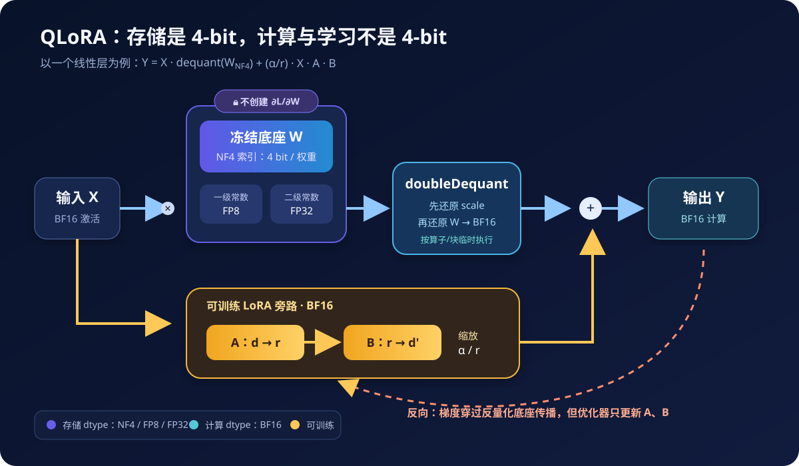
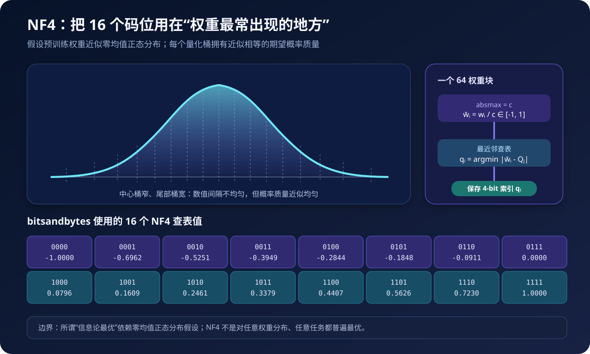
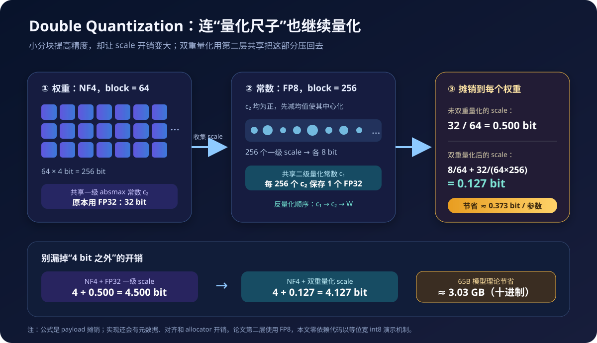
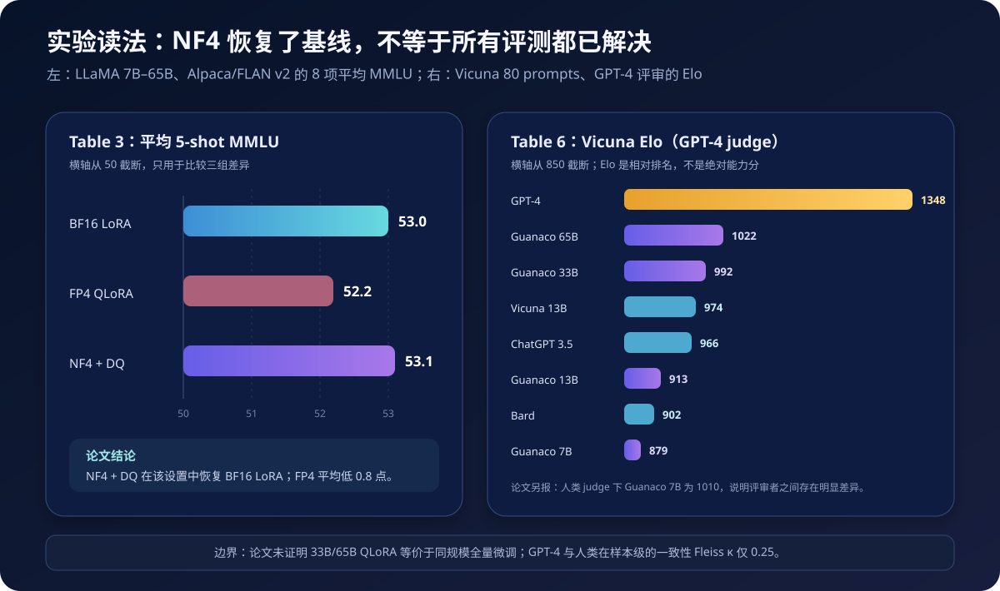

# QLoRA 原理与实现：4-bit 冻结底座如何完成高质量大模型微调


> **论文**：QLoRA: Efficient Finetuning of Quantized LLMs<br>
> **作者**：Tim Dettmers、Artidoro Pagnoni、Ari Holtzman、Luke Zettlemoyer<br>
> **会议**：NeurIPS 2023<br>
> **关键词**：参数高效微调、NF4、双重量化、Paged Optimizer、LoRA<br>
> **原文**：[NeurIPS Proceedings](https://proceedings.neurips.cc/paper_files/paper/2023/hash/1feb87871436031bdc0f2beaa62a049b-Abstract-Conference.html) · [arXiv](https://arxiv.org/abs/2305.14314) · [官方实现](https://github.com/artidoro/qlora)<br>
> **本文代码**：[零依赖 QLoRA 最小实现](code/qlora_minimal.py)

QLoRA（Quantized Low-Rank Adaptation）解决的是一个非常具体的工程矛盾：LoRA 虽然只训练极少量参数，但完整的高精度基础模型仍要驻留显存。模型一旦增大到 33B、65B，单是这份冻结权重就可能超出单卡容量。

QLoRA 的答案并不是“直接训练 4-bit 权重”，而是：

1. 把预训练权重以 **4-bit NF4** 保存，并且始终冻结；
2. 计算时把需要的权重块反量化到 **BF16**；
3. 梯度穿过这些反量化权重继续传播；
4. 只更新旁路中的 **BF16 LoRA 参数**；
5. 再用 **Double Quantization** 和 **Paged Optimizer** 压低常驻显存与偶发峰值。

单个线性层可以概括为：

$$
\boxed{
Y^{\mathrm{BF16}}
=X^{\mathrm{BF16}}\,\operatorname{doubleDequant}
\left(c_1^{\mathrm{FP32}},c_2^{\mathrm{FP8}},W^{\mathrm{NF4}}\right)
+\frac{\alpha}{r}X^{\mathrm{BF16}}A^{\mathrm{BF16}}B^{\mathrm{BF16}}
}
$$

其中 $W$ 不更新，$A,B$ 才是优化器管理的参数。

这篇文章从显存账本开始，依次推导分块量化、NF4、双重量化、分页优化器和反向传播，并提供两套代码：一套是可逐行检查的零依赖实现，另一套是生产实践中的 `bitsandbytes + PEFT` 配置。

---

## 1. 一分钟抓住 QLoRA



### 1.1 三种精度不要混为一谈

| 对象 | 典型格式 | 是否训练 | 作用 |
|---|---:|---:|---|
| 基础权重 $W$ | NF4，4-bit 索引 | 否 | 节省绝大多数权重显存 |
| 一级/二级量化常数 | FP8 + FP32 | 否 | 把 NF4 索引恢复到正确数值尺度 |
| 计算中的权重与激活 | BF16 | 不持久保存为完整副本 | 执行矩阵乘和反向传播 |
| LoRA 的 $A,B$ | BF16 | 是 | 学习任务增量 |
| LoRA 优化器状态 | 常见为 32-bit Adam | 是 | 更新少量 LoRA 参数 |

因此，下面三种说法都是错的：

- “QLoRA 用 4-bit 做所有计算”；
- “QLoRA 对 4-bit 基础权重直接求梯度并更新”；
- “模型有 65B 参数，所以训练显存就是 $65\mathrm{B}\times4$ bit”。

更准确的一句话是：

> QLoRA 用 4-bit 压缩冻结权重的存储，用 BF16 完成计算，用高精度低秩参数承接学习。

### 1.2 它是在 LoRA 上加了什么

普通 LoRA 与 QLoRA 的可训练部分几乎相同，区别主要在基础模型的驻留方式：

| 方法 | 基础权重 | 可训练参数 | 优化器状态 | 主要节省 |
|---|---|---|---|---|
| 全量微调 | BF16/FP16，可训练 | 全部参数 | 全部参数对应状态 | 无 |
| LoRA | BF16/FP16，冻结 | 低秩 $A,B$ | 只对应 $A,B$ | 梯度和优化器状态 |
| QLoRA | NF4，冻结 | BF16 低秩 $A,B$ | 只对应 $A,B$ | 再节省基础权重 |

QLoRA 不是 LoRA 的替代者，而是“**量化存储 + LoRA 学习 + 峰值内存管理**”的组合。

---

## 2. 为什么只有 LoRA 还不够

设一个线性层的原权重为：

$$
W_0\in\mathbb R^{d_{\text{in}}\times d_{\text{out}}}.
$$

LoRA 不更新 $W_0$，而是学习一个低秩增量：

$$
W'=W_0+\Delta W,
\qquad
\Delta W=\frac{\alpha}{r}AB,
$$

其中：

$$
A\in\mathbb R^{d_{\text{in}}\times r},
\qquad
B\in\mathbb R^{r\times d_{\text{out}}},
\qquad
r\ll\min(d_{\text{in}},d_{\text{out}}).
$$

一个层只增加：

$$
N_{\text{LoRA}}=r(d_{\text{in}}+d_{\text{out}})
$$

个参数，而不是 $d_{\text{in}}d_{\text{out}}$ 个参数。这大幅减少了梯度、优化器状态和 checkpoint 的体积。

但 LoRA 仍需读取冻结的 $W_0$。以 65B 参数为例，仅 BF16 权重的理论 payload 就是：

$$
65\times10^9\times16/8=130\ \text{GB}.
$$

“冻结”只代表不创建权重梯度，不代表权重不占显存。QLoRA 的第一目标正是把这 130 GB 压到单卡可容纳的量级。

---

## 3. 先补量化基础：4-bit 存的究竟是什么

### 3.1 量化通常存“索引 + 尺子”

设某个权重块为：

$$
w=(w_1,w_2,\ldots,w_B),
$$

QLoRA 论文对权重使用 $B=64$ 的分块。每个块先计算绝对值最大值：

$$
c=\operatorname{absmax}(w)=\max_i|w_i|,
$$

再归一化到 $[-1,1]$：

$$
\bar w_i=\frac{w_i}{c}.
$$

若 4-bit 码本为：

$$
\mathcal Q=\{Q_0,Q_1,\ldots,Q_{15}\},
$$

量化过程只保存最近的码本索引：

$$
q_i=\arg\min_{j\in\{0,\ldots,15\}}|\bar w_i-Q_j|.
$$

反量化则是：

$$
\hat w_i=c\,Q_{q_i}.
$$

所以每个权重的主体只需一个 4-bit 索引，但每个块还必须保存 scale $c$。如果忽略 scale，就无法把 `0110` 之类的索引恢复成这一块中的真实数值。

### 3.2 为什么要分块，而不是整张矩阵共用一个 scale

若整张矩阵只有一个 `absmax`，某个极端离群值会拉大范围，使绝大多数普通权重挤在很少几个码位附近。块越小，局部 scale 越贴合数据，量化误差通常越小；代价是 scale 数量越多。

这形成第一个精度—显存权衡：

- 大块：scale 少，额外开销小，但离群值影响更广；
- 小块：量化更细，scale 开销却更高；
- QLoRA 选择 64 个权重一块，并用双重量化压缩这些 scale。

### 3.3 量化误差从哪里来

量化误差写成：

$$
\varepsilon_i=w_i-\hat w_i.
$$

它受三件事共同影响：

1. 块内 `absmax` 是否被离群值支配；
2. 码本的 16 个数值放在哪里；
3. scale 自身是否又被近似。

NF4 主要改进第二项，Double Quantization 主要处理第三项的存储成本。

---

## 4. NF4：为什么不是普通 INT4 或 FP4



### 4.1 直觉：码位应该分配给高概率区域

均匀 INT4 在 $[-1,1]$ 上等间距放置 16 个数值。但预训练网络权重常近似零均值正态分布：0 附近权重很多，尾部权重少。

如果数值间距仍然均匀：

- 中心区域的大量权重会争用有限码位；
- 尾部稀少区域却占用同样多的数值空间；
- 平均量化误差未必最小。

NF4 的设计思想是按标准正态分布的分位数放置码位，使每个量化桶的期望概率质量近似相等。因此中心码位更密，尾部码位更疏。

### 4.2 从标准正态分位数构造码本

记标准正态分布为：

$$
X\sim\mathcal N(0,1),
$$

其分位数函数为 $Q_X(p)$。论文先用相邻分位点的中点构造 $2^k$ 个代表值：

$$
q_i=\frac{1}{2}\left[
Q_X\!\left(\frac{i}{2^k+1}\right)
+Q_X\!\left(\frac{i+1}{2^k+1}\right)
\right],
$$

然后把这些值归一化到 $[-1,1]$。对一个具体权重块，再用 `absmax` 把该块映射到相同范围，执行最近邻查表。

NF4 不是 IEEE 风格的微型浮点数：4 个 bit 不拆成符号位、指数位和尾数位，而只是 **16 项查找表的索引**。官方 `bitsandbytes` 当前实现的查表值可以直接在[源码](https://github.com/bitsandbytes-foundation/bitsandbytes/blob/main/bitsandbytes/functional.py)中核对：

```python
NF4 = (
    -1.0000000, -0.6961928, -0.5250731, -0.3949175,
    -0.2844414, -0.1847734, -0.0910500,  0.0000000,
     0.0795803,  0.1609302,  0.2461123,  0.3379152,
     0.4407098,  0.5626170,  0.7229568,  1.0000000,
)
```

### 4.3 为什么码本看起来不完全对称

简单的对称量化若使用全部 $2^k$ 个码位，未必能同时保留一个精确的 0。但精确零对 padding、稀疏值和初始化都很重要。

论文分别构造正半轴与负半轴的分位数集合，合并后去掉重复零，从而得到一个带精确零的非对称码本。结果是正负两侧不严格镜像，但 16 个码位被充分利用。

### 4.4 “信息论最优”有明确前提

论文中的结论是：NF4 对 **零均值、正态分布且标准差任意** 的数据是信息论意义上的最优量化数据类型。不能把它扩写成“NF4 对所有模型、所有层、所有分布、所有任务都最优”。

常见偏离包括：

- 权重分布偏斜或重尾；
- 某些层存在结构化离群值；
- 权重已被其他训练或量化方法改造；
- 量化目标是端到端任务损失，而不是局部重建误差。

选择 NF4 是有理论先验且被论文实验支持的默认方案，不是无条件定理。

---

## 5. Double Quantization：量化“量化常数”



### 5.1 第一层 scale 已经不便宜

每 64 个权重共享一个 FP32 scale，摊到每个权重上是：

$$
\frac{32}{64}=0.5\ \text{bit/parameter}.
$$

于是所谓“4-bit 权重”实际 payload 变成：

$$
4+0.5=4.5\ \text{bit/parameter}.
$$

对 65B 参数，0.5 bit 已对应约 4.06 GB，不是可以忽略的零头。

### 5.2 第二次量化怎样做

论文把第一层量化常数记为 $c_2^{\mathrm{FP32}}$，再把它们当成一组新的输入：

1. 因为一级 scale 都是正数，先减去均值，使残差围绕 0 分布；
2. 每 256 个一级 scale 组成一个二级块；
3. 把一级 scale 量化成 FP8，得到 $c_2^{\mathrm{FP8}}$；
4. 每个二级块只保留一个 FP32 常数 $c_1^{\mathrm{FP32}}$。

反量化顺序与量化相反：

$$
\operatorname{doubleDequant}(c_1,c_2,W)
=\operatorname{dequant}\left(
\operatorname{dequant}(c_1,c_2),W
\right).
$$

先用 $c_1$ 恢复一级 scale，再用一级 scale 恢复 NF4 权重。

### 5.3 0.373 bit 是怎样算出来的

一级 scale 现在每个只占 8 bit，并且每 256 个一级 scale 再共享一个 32-bit 二级 scale：

$$
\frac{8}{64}+\frac{32}{64\times256}
=0.126953125\ \text{bit/parameter}.
$$

相较原来的 0.5 bit，节省：

$$
0.5-0.126953125=0.373046875\ \text{bit/parameter}.
$$

65B 参数对应：

$$
65\times10^9\times\frac{0.373046875}{8}
\approx3.03\ \text{GB}.
$$

这就是论文所说“平均每参数约节省 0.37 bit，65B 约节省 3 GB”的来源。

### 5.4 不要误解 Double Quantization

- 它压缩的是量化常数，不是把权重从 4-bit 再变成 2-bit；
- 它主要改善显存，不是主要的精度来源；
- 论文 Figure 2 认为 DQ 带来的精度变化很小，价值在于让 33B/65B 卡进 24/48 GB 边界；
- 真实实现还有偏移、元数据、对齐和 allocator 开销，上面的公式是理论摊销。

---

## 6. Paged Optimizer：处理训练峰值，不是免费扩容

即使权重能装下，训练仍会出现峰值。长序列 mini-batch、梯度检查点恢复激活、优化器 step 和临时 kernel buffer 可能在某一瞬间叠加，造成 OOM。

Paged Optimizer 使用 NVIDIA Unified Memory 管理优化器状态：

```text
平稳阶段：优化器页面驻留 GPU
      ↓ GPU 显存接近耗尽
峰值阶段：部分页面自动迁移到 CPU RAM
      ↓ optimizer.step() 再次需要
更新阶段：所需页面迁回 GPU
```

它与操作系统把内存页换到磁盘的思路类似，只是这里主要发生在 GPU 与 CPU 内存之间。

### 6.1 它解决什么

- 偶发、短时、由序列长度等因素触发的显存尖峰；
- 单卡 33B/65B QLoRA 中接近容量上限的优化器状态管理；
- 避免因为少数极端 batch 直接中断训练。

### 6.2 它不解决什么

- CPU RAM 不够；
- GPU 与 CPU 互联带宽过低导致的换页延迟；
- 模型常态显存已经远超 GPU 容量；
- 激活本身长期占用过大；
- 任意硬件上的通用显存虚拟化。

论文没有给出完整的换页频率或各种场景下的硬测量。作者报告，在 48 GB GPU 上训练 65B、batch size 为 16 的测试中，Paged Optimizer 与普通优化器速度相同，因为换页只在少数长序列 batch 出现。这个结果不能推广成“分页永远没有性能代价”。

---

## 7. 完整前向与反向：梯度到底流向哪里

### 7.1 前向传播

设冻结权重以 NF4 保存，LoRA 矩阵为 $A,B$：

$$
Y=X\hat W+\frac{\alpha}{r}XAB,
$$

其中：

$$
\hat W=operatorname{doubleDequant}(c_1,c_2,W^{\mathrm{NF4}}).
$$

“反量化到 BF16”不一定意味着先永久生成一份完整 BF16 模型副本。生产 kernel 通常按层或按块读取量化权重、反量化并完成矩阵乘，临时值随后释放或复用。

### 7.2 为什么冻结权重仍参与反向传播

考虑上游激活 $X$ 的梯度：

$$
\frac{\partial\mathcal L}{\partial X}
=\frac{\partial\mathcal L}{\partial Y}
\left(\hat W+\frac{\alpha}{r}AB\right)^\top.
$$

虽然不需要 $\partial\mathcal L/\partial W$，但为了让更早层的 LoRA 收到梯度，仍需通过 $hat W$ 计算 $\partial\mathcal L/\partial X$。这就是“**梯度穿过冻结的量化模型**”的准确含义。

LoRA 梯度则为：

$$
\frac{\partial\mathcal L}{\partial A}
=\frac{\alpha}{r}X^\top
\frac{\partial\mathcal L}{\partial Y}B^\top,
$$

$$
\frac{\partial\mathcal L}{\partial B}
=\frac{\alpha}{r}A^\top X^\top
\frac{\partial\mathcal L}{\partial Y}.
$$

优化器只持有并更新 $A,B$。NF4 索引和两级 scale 在整个训练中保持不变。

### 7.3 为什么 LoRA 要覆盖所有线性层

原始 LoRA 常只在注意力的 query/value 投影上加适配器。QLoRA 论文的消融显示，对 LLaMA 7B 的 Alpaca 实验，如果只适配 Q/V，难以恢复强 16-bit baseline；适配 Transformer block 的所有线性层是关键。

论文最终配置是：

- `r = 64`；
- `alpha = 16`；
- 所有线性层都加入 LoRA；
- NF4 + Double Quantization；
- BF16 compute dtype。

论文在其搜索范围内还发现：只要 LoRA 覆盖所有层，rank 从 8 到 64 等变化对最终结果的影响不明显。这个观察来自特定模型与数据设置，不表示 rank 对所有任务都无关。

现代 PEFT 用下面的配置表达 QLoRA 风格的“所有线性层”：

```python
LoraConfig(target_modules="all-linear", ...)
```

这比手写 `q_proj`、`v_proj` 更不容易漏掉不同模型架构中的 FFN 与输出投影。

---

## 8. 65B 显存账本：从 130 GB 到单张 48 GB


### 8.1 只计算冻结基础权重

对 65B 参数，使用十进制 GB：

| 项目 | 公式 | 理论 payload |
|---|---:|---:|
| BF16 权重 | $65\mathrm B\times16/8$ | 130.00 GB |
| NF4 索引 | $65\mathrm B\times4/8$ | 32.50 GB |
| FP32 scale，无 DQ | $65\mathrm B\times0.5/8$ | 4.06 GB |
| scale，有 DQ | $65\mathrm B\times0.126953/8$ | 1.03 GB |
| NF4 + DQ 合计 | $65\mathrm B\times4.126953/8$ | 33.53 GB |

但 33.53 GB 只是量化权重 payload。训练还要加：

- LoRA 参数、梯度和 Adam 状态；
- 当前 batch 的激活；
- 梯度检查点重算时的临时值；
- logits 与 loss buffer；
- CUDA kernel workspace；
- 内存对齐、碎片和框架缓存。

论文报告 Guanaco 65B 模型内存为 41 GB，并在单张 48 GB 专业 GPU 上完成微调。二者并不矛盾：33.53 GB 是理想 payload，41 GB 是论文表格中的模型占用，48 GB 是训练设备容量。

### 8.2 为什么全量微调会超过 780 GB

BF16 权重本身只有 130 GB，但全量 Adam 微调通常还需要：

- 参数；
- 参数梯度；
- FP32 master weights（取决于实现）；
- FP32 一阶矩；
- FP32 二阶矩；
- 激活和各种缓冲。

论文给出的常规 16-bit 65B 全量微调需求超过 780 GB。不要把“780 GB”解释为裸权重大小；它是训练状态与峰值的总量级。

### 8.3 QLoRA 仍然会被激活显存限制

QLoRA 主要压缩 **模型状态**，不会自动把激活压成 4-bit。序列长度、micro-batch、hidden size 和是否启用 gradient checkpointing 仍会显著影响显存：

$$
M_{\text{peak}}
\approx M_{\text{quantized base}}
+M_{\text{LoRA states}}
+M_{\text{activations}}
+M_{\text{workspace}}.
$$

因此，从 2K 上下文改到 32K 上下文时，不能只看模型参数量判断能否训练。

---

## 9. 零依赖最小实现：亲手走一遍 QLoRA

本文提供的 [`qlora_minimal.py`](code/qlora_minimal.py) 不依赖 PyTorch、NumPy 或 GPU，重点不是速度，而是让每一步都能被读者检查。

它实现了：

1. `absmax` 分块量化；
2. 官方 NF4 的 16 项查表值；
3. 两个 4-bit 索引打包成一个字节；
4. 一级 scale 的均值中心化与 8-bit 二次量化；
5. 冻结量化矩阵的反量化前向；
6. 只对 LoRA $A,B$ 求导的手写 SGD；
7. 论文的 `4.500 → 4.127 bit/参数` 显存公式。

运行：

```bash
python3 papers/to-2026/code/qlora_minimal.py
```

一组确定性输出为：

```text
step=  1  mse=0.49248523
step= 25  mse=0.49020971
step=100  mse=0.09739919
step=200  mse=0.00010670
step=400  mse=0.00000000

Paper memory ledger (payload only):
  NF4 + FP32 scales : 4.500000 bits/parameter
  NF4 + double quant: 4.126953 bits/parameter
  saved              : 0.373047 bits/parameter
  65B saving         : 3.03 GB

base frozen: yes; loss 0.492494 -> 0.00000000
```

### 9.1 4-bit 打包

两个 NF4 索引分别放在低 4 位与高 4 位：

```python
def pack_nibbles(indices: list[int]) -> bytes:
    packed = bytearray()
    for offset in range(0, len(indices), 2):
        low = indices[offset]
        high = indices[offset + 1] if offset + 1 < len(indices) else 0
        packed.append(low | (high << 4))
    return bytes(packed)
```

如果 Python 中仍用普通 `int` 列表保存每个码位，并不会真的得到 4-bit 显存。必须像这样位打包，或交给专用张量格式与 kernel。

### 9.2 分块 NF4 量化

核心逻辑只有几行：

```python
for block in chunks(flat_weight, 64):
    absmax = max(abs(value) for value in block)
    scales.append(absmax)
    indices.extend(
        nearest_index(value / absmax, codebook=NF4)
        for value in block
    )
```

实际生产实现会并行化、处理对齐、融合反量化与矩阵乘，并对不同硬件后端提供专用 kernel。

### 9.3 手写 LoRA 反向的关键

最小实现的模型结构为：

```python
prediction = frozen_nf4_base.linear(x) + (alpha / rank) * B @ A @ x
```

训练 step 只创建 `grad_a` 和 `grad_b`，训练前后还会比较：

```python
frozen_snapshot = (base.packed_indices, base.scales)
# ... 400 steps ...
assert frozen_snapshot == (base.packed_indices, base.scales)
```

这个断言比口头说“base frozen”更直接：NF4 索引和 scale 必须逐字节保持不变。

### 9.4 教学实现与生产实现的差异

| 项目 | 本文零依赖代码 | 论文/生产实现 |
|---|---|---|
| 第二层 scale 格式 | 对称 INT8 代理 | FP8 |
| 计算 dtype | Python `float` | 通常 BF16 |
| 反量化 | 物化 Python 矩阵 | CUDA/ROCm/XPU 融合 kernel |
| 优化器 | 手写全批 SGD | Paged AdamW 等 |
| Transformer | 单线性层玩具任务 | 全模型所有线性层 |
| 目标 | 解释机制 | 训练质量与吞吐 |

INT8 代理与 FP8 都占 8 bit，因此显存摊销公式一致，但数值网格不同。本文代码不应被用于复现论文精度。

---

## 10. 生产配置：bitsandbytes + PEFT

下面代码对齐 QLoRA 的核心配置，并采用当前 PEFT 文档推荐的 `target_modules="all-linear"`。第三方库 API 会迭代，运行前应以 [Transformers bitsandbytes 文档](https://huggingface.co/docs/transformers/quantization/bitsandbytes)、[PEFT 量化指南](https://huggingface.co/docs/peft/main/developer_guides/quantization)和所安装版本为准。

### 10.1 加载 4-bit 基础模型并注入 LoRA

```python
import torch
from transformers import AutoModelForCausalLM, AutoTokenizer, BitsAndBytesConfig
from peft import LoraConfig, get_peft_model, prepare_model_for_kbit_training

MODEL_ID = "your-base-model"

quantization_config = BitsAndBytesConfig(
    load_in_4bit=True,
    bnb_4bit_quant_type="nf4",          # NF4，而不是默认猜测
    bnb_4bit_use_double_quant=True,      # Double Quantization
    bnb_4bit_compute_dtype=torch.bfloat16,
)

tokenizer = AutoTokenizer.from_pretrained(MODEL_ID)
if tokenizer.pad_token_id is None:
    tokenizer.pad_token = tokenizer.eos_token

model = AutoModelForCausalLM.from_pretrained(
    MODEL_ID,
    quantization_config=quantization_config,
    torch_dtype=torch.bfloat16,
    device_map={"": 0},                 # 单 GPU 示例
)
model.config.use_cache = False           # 训练 + checkpointing 时关闭 KV cache
model = prepare_model_for_kbit_training(
    model,
    use_gradient_checkpointing=True,
)

lora_config = LoraConfig(
    r=64,
    lora_alpha=16,
    lora_dropout=0.05,
    target_modules="all-linear",
    bias="none",
    task_type="CAUSAL_LM",
)
model = get_peft_model(model, lora_config)
model.print_trainable_parameters()
```

注意：

- BF16 需要硬件支持；不支持时要选择与硬件、kernel 匹配的 dtype，并重新验证稳定性；
- `device_map="auto"` 更适合自动放置/推理，复杂分布式训练应交给 Accelerate、FSDP 或训练框架明确管理；
- `prepare_model_for_kbit_training` 会做一组适合 k-bit 训练的准备工作，不要只加载 4-bit 后直接假定配置完整；
- 论文原始仓库曾记录 FP16 compute 的稳定性问题，这是 2023 年工具链的历史观察，不应无条件套到所有当前版本，但仍要监控 NaN/Inf。

### 10.2 只在回答 token 上计算损失

指令微调常见错误是对 prompt 也计算交叉熵。可以把 prompt 对应 label 设为 `-100`：

```python
def encode_example(example, max_length=2048):
    prompt = (
        "### Instruction:\n"
        + example["instruction"]
        + "\n\n### Response:\n"
    )
    prompt_ids = tokenizer(
        prompt,
        add_special_tokens=True,
        truncation=False,
    )["input_ids"]
    answer_ids = tokenizer(
        example["answer"] + tokenizer.eos_token,
        add_special_tokens=False,
        truncation=False,
    )["input_ids"]

    input_ids = (prompt_ids + answer_ids)[:max_length]
    prompt_length = min(len(prompt_ids), len(input_ids))
    labels = [-100] * prompt_length + input_ids[prompt_length:]

    return {
        "input_ids": input_ids,
        "attention_mask": [1] * len(input_ids),
        "labels": labels,
    }
```

还要明确截断策略。若总是从尾部粗暴截断，可能刚好把答案全部截掉，只剩一条 loss 全为 `-100` 的样本。实践中应统计：

- 每条样本的有效 answer token 数；
- 截断前后长度分布；
- padding 比例；
- 超长样本来自哪些数据源。

### 10.3 使用 Paged AdamW

`bitsandbytes` 与 Transformers 的集成支持：

```python
from transformers import TrainingArguments

training_args = TrainingArguments(
    output_dir="outputs/qlora",
    per_device_train_batch_size=1,
    gradient_accumulation_steps=16,
    learning_rate=2e-4,
    num_train_epochs=3,
    bf16=True,
    gradient_checkpointing=True,
    optim="paged_adamw_32bit",
    max_grad_norm=0.3,
    logging_steps=10,
    save_strategy="steps",
    save_steps=200,
    report_to="none",
)
```

`per_device_train_batch_size × gradient_accumulation_steps` 决定有效 batch 的一部分，但多卡时还要乘 data-parallel world size。论文官方仓库建议调整前两者，使乘积为 16 并确保显存可容纳；这不是所有任务的固定最优值。

### 10.4 训练后保存什么

默认只保存 adapter：

```python
model.save_pretrained("outputs/qlora-adapter")
tokenizer.save_pretrained("outputs/qlora-adapter")
```

这通常比保存一份完整模型更合理：

- adapter 小，便于版本管理；
- 同一底座可挂载多个任务 adapter；
- 可以明确记录基础模型 revision 与量化配置；
- 避免在低精度合并时引入额外量化误差。

部署时必须同时保存或记录：

- base model 仓库与不可变 revision；
- tokenizer revision；
- `adapter_config.json` 与 adapter 权重；
- NF4、double quant、compute dtype 配置；
- chat template 和特殊 token；
- 推理库、bitsandbytes 与硬件后端版本。

---

## 11. 论文实验：哪些结论强，哪些要保留条件



### 11.1 NF4 比 FP4/INT4 更适合这些权重

论文在 OPT、BLOOM、Pythia、LLaMA 的 125M–13B 模型上比较 Pile Common Crawl perplexity：

| 数据类型 | Mean PPL，越低越好 |
|---|---:|
| INT4 | 34.34 |
| FP4 E2M1 | 31.07 |
| FP4 E3M0 | 29.48 |
| NF4 + DQ | **27.41** |

这支持了 NF4 的经验优势，但不是对所有量化算法的永久排名。

### 11.2 NF4 + DQ 恢复 16-bit LoRA 的 MMLU

论文将 LLaMA 7B、13B、33B、65B 分别在 Alpaca 与 FLAN v2 上微调，汇总 8 项 5-shot MMLU：

| 数据类型 | 8 项平均 MMLU |
|---|---:|
| BF16 LoRA | 53.0 |
| FP4 QLoRA | 52.2 |
| NF4 + DQ QLoRA | **53.1** |

因此，在这组实验里：

- NF4 + DQ 恢复了 BF16 LoRA 表现；
- FP4 平均落后约 0.8 个点；
- DQ 没有表现出明显精度损失。

论文也在 RoBERTa/T5 的 125M–3B 设置中比较了 16-bit 全量微调，4-bit adapter 方法能够恢复基线。

但论文在限制章节明确承认：由于同规模全量微调成本过高，**没有建立 33B/65B QLoRA 与 33B/65B 全量微调等价的证据**。文章标题或二手总结里的“恢复全量微调表现”必须带上实验范围。

### 11.3 Guanaco 的结果

Guanaco 是在 OASST1 多轮对话数据上用 QLoRA 训练的模型系列。论文 Table 4 报告的 GPT-4 评分、相对 ChatGPT 的 Vicuna 成绩包括：

| 模型 | 权重 | 模型内存 | 相对 ChatGPT 均值 |
|---|---:|---:|---:|
| Guanaco 65B | 4-bit | 41 GB | 99.3% |
| Guanaco 33B | 4-bit | 21 GB | 97.8% |
| Vicuna 13B | 16-bit | 26 GB | 94.9% |
| Guanaco 13B | 4-bit | 10 GB | 90.4% |
| Guanaco 7B | 4-bit | 5 GB | 87.0% |

训练时间方面，论文报告：

- 65B 在单张专业 GPU 上约 24 小时；
- 33B 在单张 24 GB 消费级 GPU 上少于 12 小时；
- 7B 部署内存约 5 GB。

这些数字来自 2023 年的特定模型、数据、序列长度、kernel 与硬件环境，不应当作今天任意模型的通用耗时估算。

### 11.4 评测器自身并不可靠

论文同时使用 GPT-4 与人类评审，并诚实报告两者分歧：

- 系统级 Kendall $\tau=0.43$；
- 系统级 Spearman $r=0.55$；
- 样本级多数票一致性 Fleiss $\kappa=0.25$。

特别是 Guanaco 7B，在 Vicuna 的人类评审 Elo 为 1010，GPT-4 评审 Elo 只有 879，排名差异明显。

所以“99.3% of ChatGPT”应读成：在论文当时、特定 Vicuna prompt 集、特定 GPT-4 评判流程下得到的相对分数；它不是覆盖事实性、数学、安全、长上下文、多语言与真实用户分布的综合能力百分比。

### 11.5 数据质量比简单堆数量更重要

作者训练了 1000 多个模型，覆盖 8 个指令数据集、LLaMA/T5、80M–65B。一个重要观察是：经过处理后约 9.8K 样本的 OASST1，在聊天评测上胜过抽样 450K 的 FLAN v2。

更准确的结论不是“小数据永远胜过大数据”，而是：

> 数据质量与目标评测/使用场景的匹配度，可能比样本数量更重要。

论文也发现 FLAN v2 在 MMLU 上很好，却在 Vicuna 聊天评测中靠后；OASST1 则相反。一个 benchmark 上的提升不能自动外推到另一种能力。

---

## 12. 常见误解与排错

### 12.1 “QLoRA 就是把模型转成 4-bit 再训练”

错。基础权重冻结；训练的是额外的高精度 LoRA。若你真的让量化权重可训练，就进入量化感知训练、低比特优化或其他研究问题，不再是原始 QLoRA。

### 12.2 “4-bit 一定比 BF16 更快”

不一定。4-bit 减少内存带宽与容量需求，但需要反量化，并依赖硬件上的融合 kernel。吞吐由 batch、序列长度、GPU 架构、kernel、通信与换页共同决定。

论文附录在当时特定 GPU、batch size 1 推理中报告过 1.1–4.0 倍加速；这不能替代对当前模型与当前软件栈的实测。

### 12.3 “显存没有降到参数量 × 0.5 byte，说明没量化成功”

错。还存在 scale、LoRA、激活、缓存、workspace、allocator reserve。正确排查方式是分别测：

1. 加载量化 base 后；
2. 注入 LoRA 后；
3. 第一次 forward 后；
4. backward 后；
5. optimizer step 峰值；
6. 最长序列 batch。

### 12.4 “只给 q_proj/v_proj 加 LoRA 就是论文配置”

不是。原论文认为覆盖所有 Transformer 线性层是恢复强基线的关键因素。使用现代 PEFT 时优先从 `target_modules="all-linear"` 开始，再基于显存与消融缩减。

### 12.5 “loss 降了，训练就成功”

还要检查：

- prompt token 是否意外参与 loss；
- answer 是否被截断为空；
- tokenizer/chat template 是否与部署一致；
- 特殊 token embedding 是否需要训练或初始化；
- 长度分组是否导致 loss 周期性振荡；
- 量化层是否真的冻结；
- adapter 是否覆盖预期模块；
- 验证集是否泄漏或过于接近训练集。

### 12.6 NaN、Inf 或 loss 突然爆炸

按顺序检查：

1. compute dtype 是否受硬件与 kernel 支持；
2. 学习率是否照搬了不匹配的模型规模；
3. `max_grad_norm` 与梯度累计是否正确；
4. 数据中是否有空 answer、极端长样本或非法 token；
5. LoRA 参数和归一化层的 dtype 是否符合预期；
6. 是否混用了不兼容的 Transformers、PEFT、Accelerate、bitsandbytes 版本。

---

## 13. 合并、保存与部署

### 13.1 最安全的是分开保存

QLoRA 训练得到的是：

$$
\hat W_{\mathrm{NF4}} + \Delta W_{\mathrm{LoRA}}.
$$

部署可以保留量化 base 与 adapter 两条路径，避免制作一份新的完整权重。

### 13.2 合并不是在 4-bit 索引上直接相加

若要得到合并后的权重，概念上需要：

$$
W_{\text{merged}}
=\operatorname{dequant}(W_{\mathrm{NF4}})
+\frac{\alpha}{r}AB.
$$

之后选择：

- 以 BF16/FP16 保存：体积重新变大，但避免第二次量化误差；
- 再量化为 4-bit：体积小，但新一轮量化可能改变结果；
- 保留 base + adapter：灵活、可复用，运行时多一条旁路。

绝不能把浮点 LoRA delta 直接加到 4-bit code index 上；索引不是线性数值。

### 13.3 生产验收至少包含

- 合并前后或 adapter 模式下的固定提示回归；
- 困惑度/任务指标变化；
- 峰值显存、首 token 延迟、吞吐；
- 长上下文和不同 batch；
- 量化前后安全与拒答行为；
- tokenizer、chat template、EOS 停止条件；
- adapter 与 base revision 的强绑定检查。

---

## 14. 局限、边界与后续发展

### 14.1 论文明确留下的边界

- 没有在 33B/65B 上与同规模 16-bit 全量微调直接对照；
- 主要研究 4-bit，没有系统比较更低 bit；
- 主要使用 LoRA，没有系统评估其他 PEFT 方法；
- 聊天评测覆盖有限，未证明能推广到 BigBench、RAFT、HELM 等；
- 模型评审与人类评审只有中等或较弱一致性。

### 14.2 方法自身的工程边界

- 省的是模型状态，不是所有激活；
- 量化误差仍可能影响少数敏感层与任务；
- 反量化 kernel 的质量决定吞吐；
- Paged Optimizer 依赖 CPU 内存与互联，频繁换页会变慢；
- 多卡训练还涉及量化权重分片、通信和 checkpoint 兼容；
- adapter 的表达能力仍受 rank、覆盖层、数据质量与优化配置限制。

### 14.3 QLoRA 最重要的影响

QLoRA 的价值不只是某个 4-bit 格式，而是把几类技术拼成一套可工作的训练系统：

```text
分布感知量化 NF4
        +
量化元数据压缩 Double Quantization
        +
只训练低秩增量 LoRA
        +
统一内存处理峰值 Paged Optimizer
        ↓
大模型微调从多卡服务器下放到单张高显存 GPU
```

它让“模型是否装得下”不再完全由 BF16 参数量决定，也推动了后续低比特微调、量化误差补偿、LoRA 初始化和多后端 kernel 的发展。

---

## 15. 实践清单

在启动训练前，逐项确认：

### 模型与量化

- [ ] base revision 与 tokenizer revision 已固定；
- [ ] `load_in_4bit=True`；
- [ ] `bnb_4bit_quant_type="nf4"`；
- [ ] `bnb_4bit_use_double_quant=True`；
- [ ] compute dtype 受当前硬件支持；
- [ ] base 参数 `requires_grad=False`。

### LoRA

- [ ] 从 `target_modules="all-linear"` 开始；
- [ ] 记录 $r$、$\alpha$、dropout 与 bias 配置；
- [ ] 打印可训练参数名与比例；
- [ ] 检查输出头、embedding 和新增 token 是否需要特殊处理。

### 数据

- [ ] chat template 与部署完全一致；
- [ ] label mask 只覆盖预期回答；
- [ ] 截断后仍有有效 answer token；
- [ ] 长度、语言、数据源和去重分布已统计；
- [ ] 验证集与 benchmark 无泄漏。

### 训练与显存

- [ ] 先用小样本做 overfit 测试；
- [ ] 记录加载、forward、backward、step 各阶段峰值；
- [ ] 最长序列 batch 能安全运行；
- [ ] Paged Optimizer 与 gradient checkpointing 已按需启用；
- [ ] 监控 loss、grad norm、NaN/Inf 与吞吐。

### 交付

- [ ] adapter、tokenizer、量化配置与 base revision 一起归档；
- [ ] 固定提示集通过回归；
- [ ] 合并/再量化带来的质量变化已实测；
- [ ] 目标硬件上的延迟、吞吐和显存已实测。

---

## 16. FAQ

### Q1：QLoRA 是训练量化还是训练 LoRA？

训练 LoRA。量化基础权重冻结，只在计算时反量化参与前后向。

### Q2：为什么不把 LoRA 参数也量化成 4-bit？

LoRA 参数占比很小，保持 BF16 带来的稳定性和表达能力通常比进一步节省这点显存更有价值。

### Q3：NF4、FP4、INT4 的 4 bit 有何不同？

位宽相同，16 个可表示值的分布不同。INT4 通常均匀；FP4 有符号/指数/尾数结构；NF4 是针对正态权重构造的非均匀查表索引。

### Q4：Double Quantization 会把计算也变成两遍吗？

它确实需要先恢复 scale、再恢复权重，但生产实现会尽量融合和并行。它增加少量解码工作，换取约 0.373 bit/参数的常驻显存节省。

### Q5：QLoRA 能保证与全量微调一样好吗？

不能保证。论文在小模型全量微调对照和 7B–65B 的 16-bit LoRA 对照上给出强证据，但没有完成 33B/65B 同规模全量微调对照。具体任务仍需验证。

### Q6：QLoRA 适合预训练吗？

原论文关注在预训练模型上做参数高效微调，不是从随机初始化开始的大规模预训练方案。

### Q7：最终推理必须依赖 bitsandbytes 吗？

不一定。可以保留兼容的量化 base + adapter，也可以在高精度合并后转换到其他部署格式；每次转换都必须重新验证数值与任务质量。

---

## 17. 与前后论文的关系

- 前置：[LoRA 原理](17_LoRA_2022_原理.md)——理解低秩更新与参数高效微调；
- 前置：[LLaMA 原理](15_LLaMA_2023_原理.md)——理解论文主要实验所用基础模型；
- 数据：[Self-Instruct 原理](22_Self_Instruct_2023_原理.md)——理解指令数据生成与质量控制；
- 后续：[DPO 原理](23_DPO_2023_原理.md)——QLoRA 可作为偏好优化阶段的参数高效训练底座。

---

## 参考资料

1. Dettmers, T. et al. [QLoRA: Efficient Finetuning of Quantized LLMs](https://proceedings.neurips.cc/paper_files/paper/2023/hash/1feb87871436031bdc0f2beaa62a049b-Abstract-Conference.html). NeurIPS 2023.
2. QLoRA authors. [Official QLoRA repository](https://github.com/artidoro/qlora).
3. Hu, E. J. et al. [LoRA: Low-Rank Adaptation of Large Language Models](https://arxiv.org/abs/2106.09685). ICLR 2022.
4. bitsandbytes. [NF4 and quantization implementation](https://github.com/bitsandbytes-foundation/bitsandbytes/blob/main/bitsandbytes/functional.py).
5. Hugging Face PEFT. [Quantization guide](https://huggingface.co/docs/peft/main/developer_guides/quantization).
6. Hugging Face PEFT. [QLoRA-style LoRA configuration](https://huggingface.co/docs/peft/main/package_reference/lora#training).
7. Hugging Face bitsandbytes. [Framework integrations](https://huggingface.co/docs/bitsandbytes/main/integrations).
