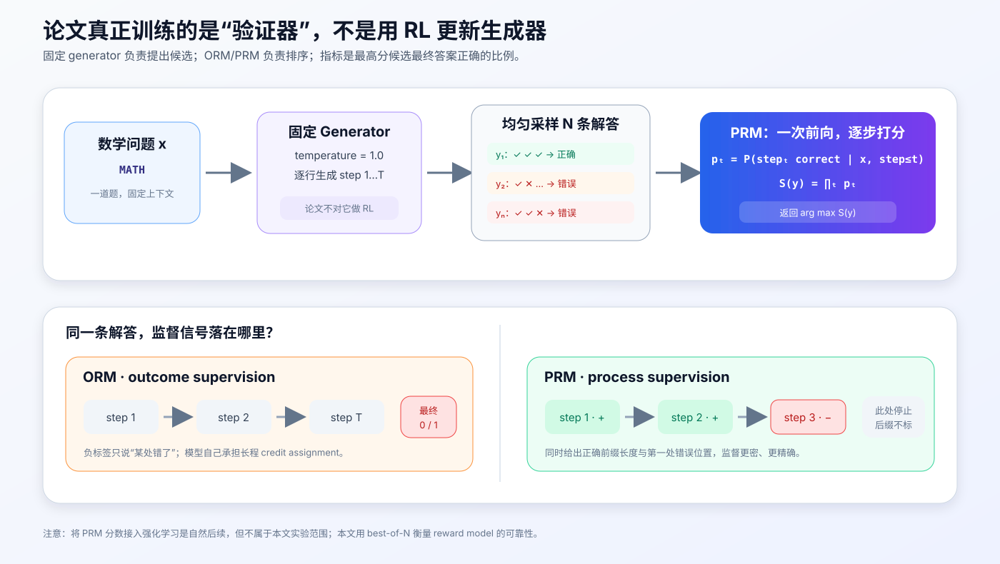
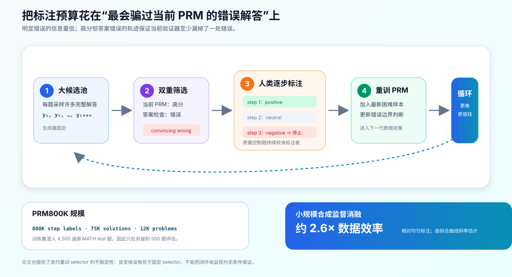
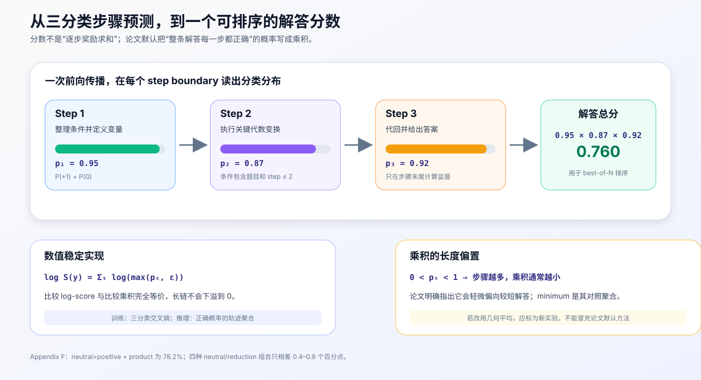
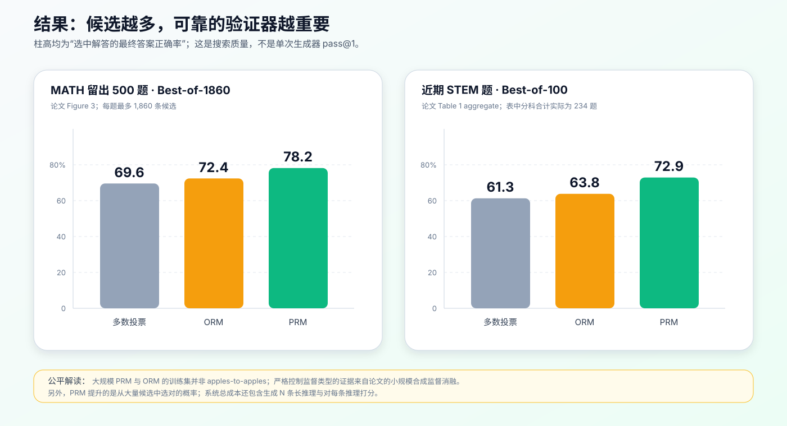

# Let's Verify Step by Step 原理与实现：过程奖励模型如何逐步验证数学推理


> **论文**：Let's Verify Step by Step<br>
> **作者**：Hunter Lightman、Vineet Kosaraju、Yura Burda、Harri Edwards、Bowen Baker、Teddy Lee、Jan Leike、John Schulman、Ilya Sutskever、Karl Cobbe<br>
> **发布**：arXiv，2023 年 5 月 31 日<br>
> **关键词**：过程监督、结果监督、过程奖励模型、PRM800K、Best-of-N、主动学习<br>
> **原文**：[arXiv](https://arxiv.org/abs/2305.20050) · [OpenAI PDF](https://cdn.openai.com/improving-mathematical-reasoning-with-process-supervision/Lets_Verify_Step_by_Step.pdf) · [官方解读](https://openai.com/index/improving-mathematical-reasoning-with-process-supervision/)<br>
> **数据与评测代码**：[OpenAI PRM800K](https://github.com/openai/prm800k)<br>
> **本文代码**：[依赖为零的 PRM 数据、打分与主动学习最小实现](code/prm_minimal.py)

这篇论文常被概括成“给推理过程的每一步发奖励”，但这个说法容易同时制造三个误解：

1. 论文主要训练的是 **reward model / verifier**，不是用强化学习训练生成器；
2. 步骤分数不是简单相加，论文默认把每一步正确概率 **相乘**，再用于候选解答排序；
3. 论文报告的 `78.2%` 是固定生成器产生最多 1,860 条解答后，PRM 选中正确解答的比例，不是生成器单次作答准确率。

它真正研究的问题是：

> 当算力允许模型为同一道数学题生成很多条候选推理时，只看最终答案训练的结果奖励模型（ORM），和逐步标注训练的过程奖励模型（PRM），谁更能从候选池中找到那条真正可靠的解答？

训练目标与推理打分可以先压缩成两行：

$$
\boxed{
\mathcal L_{\mathrm{PRM}}(\theta)
=-\mathbb E_{(x,s_{1:T},z_{1:T})}
\left[\sum_{t=1}^{T'}
\log p_\theta(z_t\mid x,s_{\le t})\right]
}
$$

$$
\boxed{
S_{\mathrm{PRM}}(x,s_{1:T})
=\prod_{t=1}^{T}q_t,
\qquad
q_t=P_\theta(\text{step }t\text{ correct}\mid x,s_{\le t})
}
$$

其中 $z_t\in\{-1,0,+1\}$ 是人工步骤标签，$T'$ 通常只到第一处错误；$q_t$ 是把 neutral 按指定规则并入 positive 或 negative 后的步骤正确概率。

---

## 1. 先给结论：论文做了什么，又没有做什么



### 1.1 做了什么

- 在具有自动可检查最终答案的 MATH 数据集上，对比 outcome supervision 与 process supervision；
- 训练 ORM 预测整条解答是否正确，训练 PRM 预测每一步是 positive、neutral 还是 negative；
- 用固定生成器为每道测试题均匀采样多条逐步解答；
- 让 reward model 给候选排序，返回分数最高的一条，即 best-of-N；
- 发布约 80 万条过滤后步骤标签组成的 PRM800K；
- 用主动学习优先寻找“当前 PRM 认为很像真的、但最终答案错误”的高价值样本。

### 1.2 没有做什么

- 没有用 PRM reward 对生成器做 PPO 或其他 RL；
- 没有证明“步骤奖励一定要逐步求和”；论文默认使用概率乘积；
- 没有证明 PRM 在所有领域都优于 ORM，实证核心仍是可校验数学推理；
- 没有证明模型写出的自然语言推理就是其内部因果计算过程；
- 没有开源论文使用的 GPT-4 系列 generator、ORM、PRM 权重和完整训练栈；
- 大规模 PRM 与 ORM 的训练数据并不完全可比，严格控制变量的证据来自小规模合成监督实验。

一句话说：

> 这篇论文把“推理是否可靠”的监督单位从整条答案缩小到单个步骤，并证明这种更精确的监督能训练出更可靠的候选排序器。

---

## 2. 为什么只看最终答案不够

设题目是：

$$
2x+3=11,\qquad \text{求 }x.
$$

一条模型输出可能是：

```text
Step 1: 两边减去 3，得到 2x = 14。     # 错误
Step 2: 两边除以 2，得到 x = 7。       # 沿着错误继续
Step 3: 因此最终答案是 x = 4。         # 答案碰巧正确
```

如果 ORM 的标签由最终答案检查器产生，这条轨迹会被标成正例。它无法知道模型中间已经犯错，只看到结尾的 `4` 与标准答案一致。

反过来也可能发生：推导有效，但答案解析器没有识别等价表达式，从而把正确解答标成负例。官方仓库因此使用规范化与 SymPy 等逻辑检查表达式等价性，同时明确说明自动判题仍可能拒绝正确答案或放过错误答案。

### 2.1 ORM 的 credit assignment 难题

把整条推理写成：

$$
y=(s_1,s_2,\ldots,s_T,a),
$$

ORM 只收到：

$$
z_{\text{outcome}}\in\{0,1\}.
$$

当 $z_{\text{outcome}}=0$ 时，它只知道“某处有错”，却要自己推断：

- 前几步是否其实正确；
- 第一处错误发生在哪一步；
- 后续错误是独立错误还是被前面的错误污染；
- 最终答案检查是否误判。

在困难题上，大部分采样解答都包含某个错误，一条统一的负标签信息量很低。

### 2.2 PRM 提供局部定位

PRM 获得的是：

$$
(z_1,z_2,\ldots,z_{t^*}),
$$

其中 $t^*$ 是第一处被判为 negative 的步骤。它直接知道正确前缀有多长，也知道错误在哪里首次出现，因此不必完全依靠模型自己解决长程 credit assignment。

| 监督方式 | 标签落点 | 主要优点 | 主要风险 |
|---|---|---|---|
| Outcome supervision | 整条解答/最终答案 | 标签便宜，可自动生成 | 过程错误被隐藏，负标签定位模糊 |
| Process supervision | 每个步骤边界 | 信号密、能定位第一处错误 | 人工成本高，步骤与正确性的定义更主观 |

---

## 3. 实验系统：Generator、ORM、PRM 各自做什么

设问题为 $x$，固定生成器为 $G$。对同一道题均匀采样 $N$ 条候选：

$$
y^{(1)},y^{(2)},\ldots,y^{(N)}\sim G(\cdot\mid x).
$$

### 3.1 固定 Generator

Generator 负责提出候选推理。论文在每个模型规模下都固定一个 generator，不通过 reward model 更新它。

为了让步骤边界易解析，作者先让基础模型 few-shot 生成 MATH 解答，保留最终答案正确的样本，再微调一个 epoch，让 generator 学会按换行输出逐步解答。论文明确说，这一步的目标是规范输出格式，不是教授新的数学能力。

### 3.2 Outcome Reward Model（ORM）

ORM 学习：

$$
o_\phi(x,y)\approx P(\text{最终解答正确}\mid x,y).
$$

训练标签通常由最终答案检查器自动产生。论文训练时把同一个 outcome 标签分配给解答中的每个 token，推理时只读取 completion 最后一个 token 的分数作为整条解答分数。

### 3.3 Process Reward Model（PRM）

PRM 在每个步骤结束位置预测：

$$
p_\theta(z_t\mid x,s_{\le t}),\qquad z_t\in\{-1,0,+1\}.
$$

虽然叫 process reward model，它在论文实现中更像一个步骤级三分类 verifier。整个解答只需一次前向传播，然后在各步骤边界读取分类预测。

### 3.4 Best-of-N 评估

对每条候选计算 $S(x,y^{(i)})$，选择：

$$
\hat y=\arg\max_{i\in\{1,\ldots,N\}} S(x,y^{(i)}).
$$

最后只检查 $\hat y$ 的最终答案是否正确。这个指标同时依赖两件事：

1. generator 的候选池里必须至少存在一条正确解答；
2. reward model 必须把那条正确解答排到最前。

因此 `best-of-N accuracy` 不是 verifier 自身的普通分类准确率，也不是 generator 的 `pass@1`。

---

## 4. “一步”究竟是什么

过程监督看似只比结果监督多了下标 $t$，实际第一项工程决策就是步骤切分。

论文让 generator 输出 newline-delimited solution，因此通常把一个换行分隔的文本块视为一步。这样可以：

- 让标注界面逐步展示候选；
- 在每一步结尾放置监督 token；
- 一次前向传播中定位所有 step boundary；
- 在第一处错误停止标注。

但“一行”不是数学上天然存在的原子单位。模型可以把三次代数变换塞进一行，也可以把一句无信息的过渡话拆成三行。步骤过粗时，一个标签覆盖多个逻辑动作；步骤过细时，neutral 比例、序列长度和标注成本都会上升。

生产系统至少要固定以下数据协议：

```text
problem
step_separator
steps[]
step_end_positions[]
labels[]
final_answer
generator_version
prompt_template_version
```

切分器版本一旦变化，训练分布和推理分数的含义也会变化，不能把两套结果直接混在一起。

---

## 5. 步骤标签：positive、neutral、negative

论文正文对三类标签给出简化解释，附录 D 的实际标注准则更细：

| 标签 | 详细含义 | 例子 |
|---:|---|---|
| `+1` positive | 合理、正确、易核验，并且推动求解向前 | 得到新的有效方程、完成关键推导 |
| `0` neutral | 合理、正确、易核验，但没有明显推进；也用于部分模糊情况 | 重述题目、技术上正确但帮助很小的提示 |
| `-1` negative | 不满足以上条件：错误、不合理、误导或不可接受 | 算术错误、无效定理、跳过必要论证 |

几个容易忽略的细节：

- 标注者能看到标准最终答案，但看不到标准解题过程；这样既能辅助核验，又避免把所有有效解法强行拉向一条参考路径；
- phase 2 在第一处 negative 后停止，不继续标注已经被错误前缀污染的后缀；
- neutral 不是简单的“无法判断”。它还承担“正确但不推进”的语义；
- 推理时可以把 neutral 当成 positive 或 negative，论文对两种规则都做了消融。

### 5.1 为什么只监督到第一处错误

设 $s_{t^*}$ 是第一处错误。对 $t>t^*$ 的后续步骤，判断“相对于错误前提是否推导一致”和“相对于原题是否正确”可能给出不同答案。继续标注会引入语义不一致。

只标到第一处错误还让 ORM/PRM 对比更清楚：

- 正确解答：两者都透露所有步骤最终构成正确答案；
- 错误解答：两者都透露至少存在一处错误；
- PRM 额外透露正确前缀长度与第一处错误位置。

代价是 PRM 很少直接学习“错误之后如何恢复”，也无法充分利用后缀中可能重新变得有效的局部推导。

---

## 6. PRM800K：数据集不是 80 万条完整解答



PRM800K 的“800K”指过滤后约 80 万个 **step-level labels**，不是 80 万道题或 80 万条解答。

| 统计 | 原始收集 | 训练时过滤后 |
|---|---:|---:|
| 步骤标签 | 1,085,590 | 约 800,000 |
| 解答样本 | 101,599 | 约 75,000 |
| 数学问题 | — | 约 12,000 |

过滤会移除质量控制标签，以及标注者无法完成任务的步骤标签。

### 6.1 Phase 1：在线分支式标注

第一阶段在每一步给标注者多个候选 continuation；如果所有候选都错，标注者可以自己写一个正确步骤。它能探索分支，但重复候选很多，且容易把人拖进漫长、无信息的轨迹。

Phase 1 约占 PRM800K 的 5%，即约 4 万条步骤标签。

### 6.2 Phase 2：预生成整条解答 + 第一错即停

第二阶段先生成完整解答，再逐步标注，到第一处 negative 就结束。它分为 10 个 generation，在 generation 之间用新数据重训 PRM，再筛下一批更难的样本。

由于主动学习偏向最终答案错误的解答，phase 2 只有 13.2% 的标注轨迹以正确解答结束，但其中 74.1% 的单个步骤仍是正确的。这正体现了过程监督的信息优势：一条最终失败的长解答仍贡献许多正确前缀标签。

### 6.3 质量控制

作者先让标注者完成 30 道筛选题，至少与 gold labels 达到 75% 一致才进入 phase 2；之后每个 generation 还混入 10–20 道质量控制题，持续监控标注质量并制作纠错材料。

### 6.4 官方 JSONL 结构

官方仓库每行是一条完整 solution record，核心层级是：

```json
{
  "question": {
    "problem": "...",
    "ground_truth_answer": "...",
    "pre_generated_steps": ["...", "..."]
  },
  "label": {
    "steps": [
      {
        "completions": [
          {"text": "...", "rating": 1, "flagged": null}
        ],
        "human_completion": null,
        "chosen_completion": 0
      }
    ],
    "finish_reason": "found_error"
  }
}
```

注意 `completions` 是候选分支，`chosen_completion` 才定义被接受并进入下一步的前缀。不能简单把所有 completion 按文件顺序串成一条轨迹。

本文的 [`flatten_prm800k_record`](code/prm_minimal.py) 会：

1. 给同一步的所有候选构造共享前缀；
2. 为每个未 flagged 的候选产生训练样本；
3. 只沿 `chosen_completion` 或 phase-1 `human_completion` 推进前缀；
4. 在无法继续或第一处 negative 后停止。

### 6.5 非标准 MATH 切分

随着同一道训练题被反复采样，作者担心只使用原始 7,500 道 MATH train 题会过拟合，于是把原 MATH test 中 4,500 题并入训练问题集，只留下随机抽取的 500 题评估。

所以复现实验必须使用官方仓库的 `math_splits/`，不能直接拿标准 MATH test 全集比较数字。

---

## 7. PRM 的训练目标

令问题和截至第 $t$ 步的前缀为：

$$
c_t=x\oplus s_1\oplus s_2\oplus\cdots\oplus s_t.
$$

模型在 $s_t$ 最后一个 token 之后预测标签 token $z_t$。若三类标签集合为 $\mathcal Z=\{-1,0,+1\}$，则：

$$
p_\theta(z_t=k\mid c_t)
=\frac{\exp \ell_{t,k}}
{\sum_{j\in\mathcal Z}\exp \ell_{t,j}}.
$$

步骤交叉熵是：

$$
\mathcal L_t=-\log p_\theta(z_t\mid c_t).
$$

一条轨迹的训练损失为有标签边界上的平均或求和：

$$
\mathcal L_{\text{trace}}
=-\frac{1}{T'}\sum_{t=1}^{T'}
\log p_\theta(z_t\mid x,s_{\le t}).
$$

论文把标签预测实现成单个 token，因此可以沿用标准语言模型训练流水线；只有 step boundary 的标签 token 承担所需监督。用三分类 head 读取步骤末尾 hidden state 是常见的等价工程改写，但不是论文逐字描述的实现。

### 7.1 一次前向为什么能得到所有步骤分数

因果模型在位置 $e_t$ 的 hidden state 已经编码：

$$
(x,s_1,\ldots,s_t),
$$

而不包含未来步骤。把整条解答输入一次，然后同时取 $h_{e_1},h_{e_2},\ldots,h_{e_T}$ 即可得到所有局部预测，无需为每个 prefix 重跑一次模型。

### 7.2 与 ORM 损失的区别

ORM 的一条轨迹只有统一 outcome 标签 $z$。论文实现让 context 中每个 token 都预测相同标签，测试时只使用最终 token 的预测。

PRM 则在不同边界获得不同标签：

```text
step 1 结束 → positive
step 2 结束 → positive
step 3 结束 → neutral
step 4 结束 → negative
```

PRM 训练两轮。作者指出从普通 next-token prediction 切换到分类任务是较大的分布迁移，低学习率对训练稳定很重要。

---

## 8. 从步骤概率到整条解答分数



### 8.1 Neutral 怎样处理

设模型输出：

$$
(p_t^-,p_t^0,p_t^+)
=P_\theta(z_t=-1,0,+1\mid x,s_{\le t}).
$$

若 neutral 视为 positive：

$$
q_t=p_t^0+p_t^+.
$$

若 neutral 视为 negative：

$$
q_t=p_t^+.
$$

论文的最佳配置是 neutral=positive。

### 8.2 Product 聚合

默认轨迹分数为：

$$
S_{\mathrm{prod}}(y)=\prod_{t=1}^{T}q_t.
$$

它近似表达“每一步都正确”的联合可信度。只要某一步 $q_t$ 很低，整条轨迹分数就会被明显拉低。

实现时不要真的连续相乘，而要在 log-space 中计算：

$$
\log S_{\mathrm{prod}}(y)
=\sum_{t=1}^{T}\log\max(q_t,\epsilon).
$$

这既避免长序列下溢，也不改变排序。

### 8.3 Minimum 聚合

论文还比较：

$$
S_{\min}(y)=\min_t q_t.
$$

它只看最可疑的一步，不让许多“还不错但小于 1”的步骤持续压低总分。

### 8.4 四种组合的原论文结果

| Neutral 规则 | Product | Minimum |
|---|---:|---:|
| neutral = positive | **78.2%** | 77.6% |
| neutral = negative | 77.4% | 77.8% |

这里都是 MATH 500 题上的 best-of-1860。四种策略差异不大，但 product + neutral-as-positive 最好。

### 8.5 Product 的长度偏置

由于 $0<q_t\le1$，额外步骤通常只能让乘积不变或变小。因此两个同样正确、校准相近的解答中，短解答可能天然得分更高。论文明确承认 product 对长解答有轻微负偏置。

可以实验几何平均：

$$
S_{\mathrm{geo}}(y)
=\exp\left(\frac1T\sum_t\log q_t\right),
$$

但这是对原方案的修改，必须重新验证它是否鼓励冗长、碎片化步骤，不能直接当成论文方法。

---

## 9. 主动学习：寻找“高分错解”

若当前 PRM 给一条最终答案错误的解答很高分，那么可以确定：它至少漏判了一个错误步骤。这种样本直接暴露当前决策边界的薄弱点。

Phase 2 的核心循环是：

```text
固定 generator 大量采样
    ↓
当前 PRM 给完整解答排序
    ↓
答案检查器筛出 wrong-answer
    ↓
优先提交高 PRM 分的 wrong-answer 给人类
    ↓
逐步标注到第一处错误
    ↓
加入训练集并重训 PRM
```

这和只选“PRM 最不确定”的普通 uncertainty sampling 不完全一样。它利用最终答案检查器提供的便宜约束，寻找 **高置信度假阳性**。

### 9.1 小规模消融的精确定义

为了量化收益，作者先用每题 1 个样本训练 $\mathrm{PRM}_{\text{selector}}$，再让它给每题 1,000 个候选打分。构造更大训练集时：

- 80% 取 selector 评分最高的 wrong-answer 解答；
- 20% 取剩余候选中评分最高的解答，不限最终对错；
- 再由大模型 $\mathrm{PRM}_{\text{large}}$ 产生合成过程标签。

比较学习曲线拟合斜率后，论文估计这种主动学习约有 **2.6 倍** 于均匀标注的数据效率。这个数字是曲线斜率估计，不是“同样 80 万标签就一定提升 2.6 倍准确率”。

作者还尝试在小规模实验中迭代重训 selector，但观察到未诊断的不稳定，最终没有优于固定 selector。主动学习闭环不能被理解成无条件单调改进。

---

## 10. 结果应该怎样读



### 10.1 大规模 MATH：PRM 达到 78.2%

在专门保留的 500 道 MATH 测试题上，每题最多生成 1,860 条候选：

| 方法 | Best-of-1860 最终答案正确率 |
|---|---:|
| Majority voting | 69.6% |
| ORM | 72.4% |
| PRM | **78.2%** |

PRM 在各个 $N$ 上都优于 ORM 与多数投票，而且 $N$ 越大差距越明显。直觉上，候选池越大，既更可能出现罕见正确解，也更可能出现能欺骗 verifier 的高分错解；更可靠的 PRM 更能把前者找出来。

### 10.2 为什么大规模结果不能单独证明因果

大规模 ORM 与 PRM 的训练集不是 apples-to-apples：

- PRM 使用主动学习构造的 PRM800K，强烈偏向高分 wrong-answer；
- ORM 使用 generator 每题 100 个均匀样本；
- ORM 数据集与 PRM800K 不重叠，且规模约大一个数量级。

因此 Figure 3 更接近“各自最佳工程方案谁更强”，而不是只改变监督粒度的严格受控实验。

### 10.3 小规模合成监督：控制变量的证据

为隔离混杂因素，作者固定小规模 generator 的同一批数据，让 $\mathrm{PRM}_{\text{large}}$ 分别产生：

1. 步骤级 process labels；
2. 由所有步骤是否正确汇总出的 outcome labels；
3. 另一个基线使用自动最终答案 outcome labels。

训练数据、模型与评测流程保持一致，只改变监督形式。每题从 1 到 200 个训练解答、best-of-500 评估时，process supervision 在所有数据规模上都显著领先两种 outcome supervision。

同时，由 $\mathrm{PRM}_{\text{large}}$ 生成的 outcome label 优于纯最终答案检查，说明自动判题把“错误过程 + 正确答案”当正例，确实伤害了 ORM。

### 10.4 分布外 STEM 题

论文还在较新的 AP Calculus、AP Chemistry、AP Physics、AMC10/12 题上做 best-of-100：

| 方法 | Aggregate |
|---|---:|
| Majority voting | 61.3% |
| ORM | 63.8% |
| PRM | **72.9%** |

有一个原文细节值得保留：正文写的是 224 道题，但 Table 1 四个分组的题数 $45+60+45+84=234$，Aggregate 列也写 234。本文按表格数字报告结果，同时不替原文擅自消解这个不一致。

---

## 11. 必要源代码：从数据到 Best-of-N

仓库新增的 [`prm_minimal.py`](code/prm_minimal.py) 不依赖 PyTorch 或模型下载，专门演示论文最容易实现错的部分：

- PRM800K 分支结构如何展开；
- `-1 / 0 / +1` 三分类交叉熵；
- neutral 合并成步骤正确概率；
- product/minimum/geometric-mean 三种聚合；
- log-space 轨迹打分；
- best-of-N 排序；
- convincing wrong-answer 主动学习选样。

运行：

```bash
python3 papers/to-2026/code/prm_minimal.py
```

示例输出：

```text
flattened step labels: [1, -1, 1]

PRM best-of-N ranking (product):
  1. sound-derivation          score=0.7447 answer=4
  2. confident-wrong-answer    score=0.1026 answer=7
  3. lucky-final-answer        score=0.0776 answer=4

active-learning selection: ['wrong-convincing', 'wrong-medium', 'right-high']
self-checks passed
```

可以看到，即使 `lucky-final-answer` 最终答对，只要中间有低置信度错误步骤，PRM 就不会把它排在扎实推导之前。

### 11.1 一个可接真实 backbone 的 PyTorch 骨架

下面用三分类 head 表达相同监督。`step_end_positions[b, k]` 是第 $b$ 条序列第 $k$ 个步骤末 token 的位置，padding 位置为 `-1`：

```python
import torch
import torch.nn as nn
import torch.nn.functional as F


class ProcessRewardModel(nn.Module):
    """Classifier-head adaptation; labels are [negative, neutral, positive]."""

    def __init__(self, backbone):
        super().__init__()
        self.backbone = backbone
        self.step_head = nn.Linear(backbone.config.hidden_size, 3)

    def forward(
        self,
        input_ids,
        attention_mask,
        step_end_positions,
        step_labels=None,
    ):
        hidden = self.backbone(
            input_ids=input_ids,
            attention_mask=attention_mask,
        ).last_hidden_state                       # [B, L, H]

        valid_position = step_end_positions.ge(0) # [B, K]
        safe_position = step_end_positions.clamp_min(0)
        batch_index = torch.arange(
            hidden.size(0), device=hidden.device
        )[:, None]
        step_hidden = hidden[batch_index, safe_position]  # [B, K, H]
        logits = self.step_head(step_hidden)              # [B, K, 3]

        loss = None
        if step_labels is not None:
            valid_label = valid_position & step_labels.ne(-100)
            loss = F.cross_entropy(
                logits[valid_label],
                step_labels[valid_label],
            )
        return {"loss": loss, "logits": logits, "mask": valid_position}
```

标签应映射为：

```python
LABEL_TO_CLASS = {-1: 0, 0: 1, +1: 2}
```

### 11.2 Neutral-as-positive 与稳定聚合

不要先转普通概率再连乘，可以直接从 log-softmax 聚合：

```python
def prm_trace_log_score(logits, step_mask):
    # logits: [B, K, 3]，类别顺序为 negative / neutral / positive
    log_probs = logits.log_softmax(dim=-1)

    # neutral-as-positive:
    # log(exp(log p_neutral) + exp(log p_positive))
    log_correct = torch.logsumexp(log_probs[..., 1:3], dim=-1)
    log_correct = log_correct.masked_fill(~step_mask, 0.0)
    return log_correct.sum(dim=-1)  # 等于 log(product_t q_t)
```

若 neutral-as-negative，只取 `log_probs[..., 2]`。若使用 minimum，则在 masked 位置填 `+inf` 后取 `min`，不要填 0 破坏比较。

### 11.3 为什么不用 `hidden[:, -1]`

原简稿中的 verifier 只读取最后一个 token：

```python
self.head(hidden[:, -1])
```

这更接近 ORM，不足以实现 PRM。真正的 PRM 必须：

- 保留所有步骤边界；
- 在每个边界产生一个监督目标；
- 训练和推理使用完全一致的分隔规则；
- 在一次前向中读取多个位置。

如果 batch 右侧 padding，`hidden[:, -1]` 甚至可能读到 padding 位置。

---

## 12. 一套可落地的训练与推理流水线

### 12.1 数据生成

1. 固定 generator checkpoint、prompt template、temperature、top-p 与最大长度；
2. 强制稳定的步骤分隔符，例如换行或专用 `<STEP_END>`；
3. 保存原始文本、解析后步骤、最终答案、解析状态和生成配置；
4. 同一道题生成多条候选，并按 `problem_id` 组织，便于 best-of-N 评测。

### 12.2 标注

1. 给标注者统一的 positive/neutral/negative 定义和反例；
2. 提供最终答案是否可见要作为任务规范固定；
3. 记录标注者、耗时、flag、finish reason 与分歧；
4. 通过筛选题和持续质量控制估计一致率；
5. 明确第一处错误后是停止、继续还是标为 ignore。

### 12.3 训练

1. 按 `problem_id` 而不是按 solution 随机划分，避免同题泄漏；
2. tokenizer 增加的步骤/标签 token 必须被 checkpoint 固化；
3. 只在有效 step boundary 计算损失；
4. 监控三类比例、每题样本数和 generator 来源，避免格式捷径；
5. 使用较低学习率，保存分类校准指标和 best-of-N 指标；
6. checkpoint 选择不能只看 step accuracy。

### 12.4 推理

1. generator 采样 $N$ 条完整解答；
2. PRM 对所有解答做批量前向；
3. 提取每个 step boundary 的三类 logits；
4. 按固定 neutral 规则得到 $q_t$；
5. 在 log-space 聚合并返回最高分候选；
6. 记录第二名分数、最低分步骤和候选多样性，支持拒答或人工复核。

### 12.5 评估

至少同时报告：

- generator `pass@1` 与候选池 `pass@N`；
- PRM best-of-N 最终答案正确率；
- oracle best-of-N，即候选池里只要有正确解就算成功；
- step-level macro-F1、各类召回率、ECE/Brier 等校准指标；
- 按题目难度、解答长度、generator 版本和学科切片的结果；
- 不同 $N$ 下的质量—延迟—成本曲线。

Oracle 与实际 best-of-N 的差距，才是 verifier 还有多少排序空间；如果候选池根本没有正确解，继续优化 PRM 也救不了生成器。

---

## 13. 为什么过程监督有效

### 13.1 更密的监督信号

一条最终失败的 12 步解答，可能前 10 步都正确。ORM 只产生一个负标签；PRM 能产生 10 个正确前缀信号和 1 个错误定位信号。

### 13.2 更容易学习局部规律

判断一个代数变换是否保持等价，通常比从整篇解答反推“错误到底在哪”更局部。把长程 credit assignment 拆成局部分类，降低了 reward model 的学习难度。

### 13.3 更难依赖最终答案捷径

ORM 可能过度依赖答案格式、是否与常见数值相似、结尾措辞等表面信号。PRM 被要求在中间边界做预测，更有机会学习推导是否合法。

### 13.4 大候选池放大 verifier 差异

当 $N$ 很大，候选池同时包含罕见正确轨迹和对 verifier 的对抗性错解。弱 verifier 会被极值效应欺骗；可靠 verifier 才能把增加的 test-time compute 转化为准确率。

### 13.5 主动学习修补当前盲点

高分 wrong-answer 是可观测的 false positive。优先标注这些样本，比反复标声明显错误的步骤更直接地移动分类边界。

---

## 14. 局限、风险与不能外推的地方

### 14.1 人工步骤监督昂贵

最终答案可以自动核验时，outcome label 几乎免费；复杂步骤需要具备数学能力的标注者逐行阅读。PRM800K 的价值很大程度上来自昂贵的数据工程，而不是一个新网络层。

### 14.2 步骤没有唯一粒度

模型可以通过合并、拆分或填充步骤改变得分分布。若部署时输出格式与训练 generator 不同，boundary-level classifier 很容易失配。

### 14.3 正确推理不唯一

标注者没有参考解答能减少路径偏置，但也增加判断难度。非常规证明、跨步省略、等价变形和高阶定理使用都可能被错误拒绝。

### 14.4 Product 不是完美联合概率

每个 $q_t$ 来自同一个模型且共享前缀，校准误差高度相关。乘积是有效排序启发式，不意味着步骤事件在统计上独立，也不保证得到严格校准的整条解答概率。

### 14.5 长度与格式捷径

Product 偏向短解答；模型也可能学习“某种措辞、LaTeX 风格或步骤长度更像正例”，而不是数学有效性。必须做去格式化、对抗改写和长度分层评测。

### 14.6 Reward overoptimization 仍会发生

论文只用固定 generator 做离线 best-of-N。如果未来用 PRM 做 RL，策略会主动搜索 reward model 漏洞，分布偏移和 reward hacking 可能远强于论文设置。

### 14.7 可见推理不等于真实内部因果过程

PRM 能约束模型展示出的 chain-of-thought 是否合理，却不能自动证明这些文字忠实反映模型内部计算。模型可能先得到答案，再生成看似合理的事后解释。

### 14.8 领域外泛化有限

数学有明确规则和最终答案，步骤相对容易局部核验。开放域研究、医疗建议、长期软件任务或价值判断没有同样清晰的 gold answer 与 step semantics。

### 14.9 评测污染与可复现性

作者对 MathMix 做了去污染检查，但明确无法给出强保证；MATH 题也可能出现在预训练数据中。论文使用的模型与 MathMix 全量构建细节未完全开源，因此 PRM800K 能复现数据接口和部分评测，不能复现完整大规模训练。

---

## 15. 它与 CoT、Self-Consistency、Tree of Thoughts、RLVR 的关系

| 方法 | 核心对象 | 何时工作 | 与 PRM 的关系 |
|---|---|---|---|
| Chain-of-Thought | 生成显式中间步骤 | 推理时生成 | 给 PRM 提供可分段、可检查的轨迹 |
| Self-Consistency | 对最终答案多数投票 | 推理时聚合 | 不判断步骤；是论文中的强基线 |
| PRM / 本文 | 对每一步正确性打分 | 训练 verifier + 推理时排序 | 从多条完整轨迹中选最可信的一条 |
| Tree of Thoughts | 搜索部分思维状态 | 推理时树搜索 | PRM 可作为 partial-state evaluator，但本文未这样实验 |
| RL with PRM | 用过程分数更新策略 | 训练 generator | 是自然后续，不是本文完成的工作 |
| RLVR | 可验证奖励驱动的 RL | 训练 reasoning policy | 最终规则奖励与学习式过程奖励可互补，但目标和风险不同 |

CoT 解决“让过程出现”，Self-Consistency 解决“多采样后按答案投票”，PRM 解决“逐步判断哪条过程更可靠”。三者不是替代关系。

---

## 16. 论文结论的证据边界

| 说法 | 论文是否支持 | 应如何表述 |
|---|---:|---|
| PRM 在本文 MATH best-of-N 设置优于 ORM | 是 | 大规模结果强，且小规模控制实验方向一致 |
| PRM 本身让 generator 学会更强推理 | 否 | generator 固定，提升来自候选选择 |
| 过程监督永远比结果监督省数据 | 否 | 本文小规模设置估计主动学习约 2.6× 数据效率 |
| PRM 能用于 RL | 原理上可以，本文未做 | 需要新的在线优化与 reward hacking 实验 |
| 78.2% 是 GPT-4 单次准确率 | 否 | 是最多 1,860 条候选后的 PRM 选择准确率 |
| PRM800K 有 80 万条完整解答 | 否 | 约 80 万步骤标签、7.5 万条过滤后解答 |
| 结果已证明泛化到所有推理领域 | 否 | 只展示 MATH 与有限的近期 STEM 分布外结果 |

---

## 17. 实现与调试清单

### 数据

- [ ] 按官方非标准 MATH split 复现实验；
- [ ] 按 `problem_id` 切 train/eval，不按 solution 随机切；
- [ ] `chosen_completion` 正确推进轨迹，未把候选分支串在一起；
- [ ] flagged、give_up、bad_problem、quality-control 样本按协议过滤；
- [ ] 第一处 negative 后的标签处理规则固定；
- [ ] 统计每类标签、每题轨迹数、每条步骤数与 generator 版本。

### 模型

- [ ] step separator 在 tokenizer 与数据中完全一致；
- [ ] `step_end_positions` 指向真实步骤最后 token，而不是 padding；
- [ ] 只在有效 boundary 计算 loss；
- [ ] 三类索引与 `-1/0/+1` 映射没有颠倒；
- [ ] 一次完整前向的边界分数与逐 prefix 前向近似一致；
- [ ] 使用低学习率并监控训练早期是否塌成多数类。

### 打分

- [ ] neutral-as-positive/negative 明确记录；
- [ ] product 使用 log-space，而不是浮点直接连乘；
- [ ] padding boundary 不参与 sum/min；
- [ ] minimum 的 padding 用 $+\infty$ 屏蔽；
- [ ] 同时报长度分层结果，检查 product 长度偏置；
- [ ] tie-break、拒答阈值和解析失败策略版本化。

### 评测

- [ ] 区分 pass@1、pass@N、oracle@N 与 PRM best-of-N；
- [ ] $N$、temperature、最大 token 数完全固定；
- [ ] 最终答案 normalizer 与符号等价检查有回归测试；
- [ ] 报告多个随机子采样或置信区间；
- [ ] 用不同 generator 和改写格式测试 verifier 分布外鲁棒性；
- [ ] 对高分错解做人工错误归因，而不只看 aggregate accuracy。

---

## 18. 常见问题

### Q1：PRM 是生成模型还是分类器？

它以语言模型为 backbone，但任务是步骤级分类/验证。论文用单个标签 token 表示 positive、neutral、negative，因此能复用 LM 训练管线；工程上也可以接三分类 head。

### Q2：过程奖励应该求和还是求积？

这篇论文的默认推理分数是每一步正确概率的乘积。直接写 $r=\sum_t r_t$ 是更一般的 RL 奖励表达，不等于本文的 best-of-N 打分规则。

### Q3：为什么不只取最差一步？

可以。论文比较了 minimum 与 product，结果相近；product + neutral-as-positive 在该实验中最好，但有轻微长度偏置。

### Q4：为什么正确步骤不全标 `+1`？

因为 `+1` 还要求推进求解。正确但只重述、绕圈或帮助很小的步骤可以标 neutral，这能让模型区分“没有错”和“真正有用”。

### Q5：既然最终答案能自动检查，为什么还要人？

最终答案检查只能提供 outcome label，无法可靠定位中间第一处逻辑错误。PRM800K 的人力主要花在这项细粒度判断上。

### Q6：PRM 与 Self-Consistency 哪个更好？

Self-Consistency 按最终答案频数投票，PRM 按推理链质量排序。论文中 PRM 优于 majority voting；但投票便宜、无需额外标注模型，二者也可以组合。论文尝试 reward-model-weighted voting，没有看到明显额外收益。

### Q7：可以边生成边用 PRM 剪枝吗？

可以作为新系统设计，但本文主要给完整解答打分再 best-of-N。在线剪枝会改变候选分布，并可能过早丢弃暂时看起来可疑但最终有效的路径，需要单独评测。

### Q8：用 PRM 做 RL 就一定更好吗？

不一定。固定候选排序与在线策略优化的分布压力不同。RL 策略会主动利用 verifier 漏洞，因此需要更强的对抗评测、KL/约束、reward ensemble 或持续数据闭环。

---

## 19. 一句话总结

这篇论文的核心链条不是“把最终奖励拆成许多小奖励然后求和”，而是：

$$
\boxed{
\text{逐行生成可解析推理}
\Longrightarrow
\text{人工标出每步 }(-1,0,+1)
\Longrightarrow
\text{PRM 学习 }P(z_t\mid x,s_{\le t})
\Longrightarrow
\sum_t\log q_t
\Longrightarrow
\text{Best-of-N 选择最可信解答}
}
$$

它最重要的贡献有三层：

1. **学习问题**：把整条轨迹的模糊 credit assignment 改成步骤边界分类；
2. **数据问题**：通过 PRM800K 与高分错解主动学习，把人力集中在当前 verifier 的盲点；
3. **推理问题**：证明更可靠的 verifier 能把大规模候选采样转化成更高的最终答案准确率。

工程上，真正决定成败的并不是 `Linear(hidden_size, 3)`，而是步骤协议、标签一致性、log-space 聚合、候选分布、答案检查器、主动学习偏置和 best-of-N 评测是否严谨。

---

## 参考资料与延伸阅读

### 一手资料

- [Let's Verify Step by Step（arXiv）](https://arxiv.org/abs/2305.20050)
- [Let's Verify Step by Step（OpenAI PDF）](https://cdn.openai.com/improving-mathematical-reasoning-with-process-supervision/Lets_Verify_Step_by_Step.pdf)
- [OpenAI：Improving mathematical reasoning with process supervision](https://openai.com/index/improving-mathematical-reasoning-with-process-supervision/)
- [PRM800K 数据、标注说明、答案检查与评测代码](https://github.com/openai/prm800k)
- [MATH 数据集论文](https://arxiv.org/abs/2103.03874)
- [Solving Math Word Problems With Process- and Outcome-Based Feedback](https://arxiv.org/abs/2211.14275)

### 本仓库相关论文

- [Chain-of-Thought：让模型显式生成中间推理](11_Chain_of_Thought_2022_原理.md)
- [Self-Consistency：多路径采样与多数投票](18_Self_Consistency_2022_原理.md)
- [InstructGPT：奖励模型与 PPO 管线](10_InstructGPT_2022_原理.md)
- [Tree of Thoughts：在思维状态空间中搜索](26_Tree_of_Thoughts_2023_原理.md)
- [DeepSeek-R1：可验证奖励与推理强化学习](30_DeepSeek_R1_2025_原理.md)

> 本文封面由图像生成工具创作，用于表达“逐步验证”的概念；四张 SVG 根据论文正文、附录和 PRM800K 官方仓库重新绘制，并非论文原图。文中模型、数据与结果均按 2023 年论文实验语境描述。
