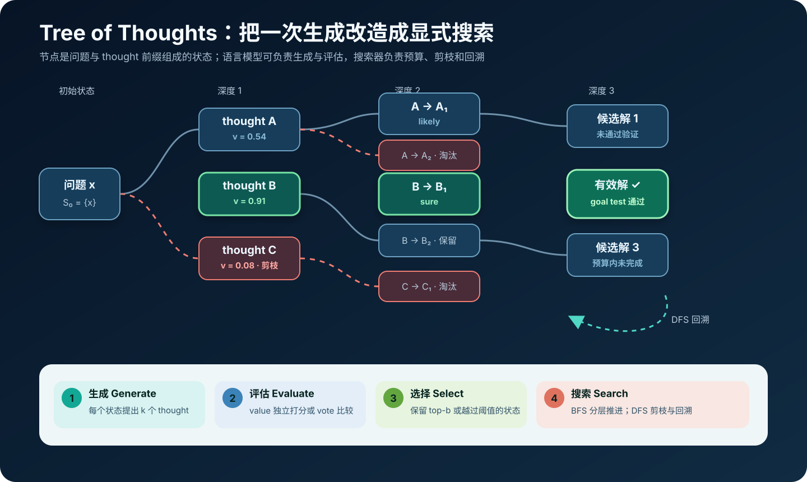
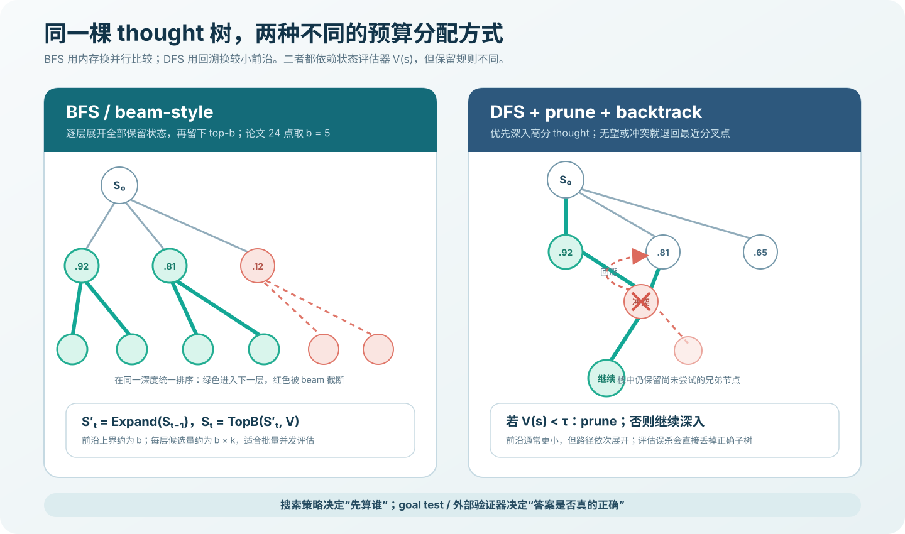
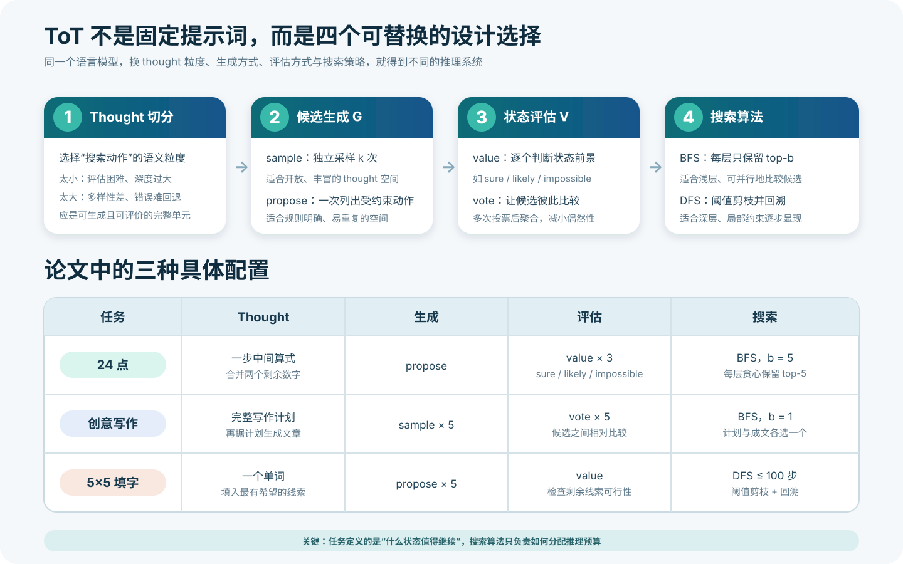

# Tree of Thoughts 原理与实现：把语言模型推理变成可回溯的启发式搜索


> **论文**：Tree of Thoughts: Deliberate Problem Solving with Large Language Models<br>
> **作者**：Shunyu Yao、Dian Yu、Jeffrey Zhao、Izhak Shafran、Thomas L. Griffiths、Yuan Cao、Karthik Narasimhan<br>
> **会议**：NeurIPS 2023<br>
> **关键词**：Tree of Thoughts、启发式搜索、BFS、DFS、状态评估、测试时计算<br>
> **原文**：[NeurIPS 论文页](https://proceedings.neurips.cc/paper_files/paper/2023/hash/271db9922b8d1f4dd7aaef84ed5ac703-Abstract.html) · [PDF](https://proceedings.neurips.cc/paper_files/paper/2023/file/271db9922b8d1f4dd7aaef84ed5ac703-Paper-Conference.pdf) · [arXiv](https://arxiv.org/abs/2305.10601)<br>
> **官方实现**：[princeton-nlp/tree-of-thought-llm](https://github.com/princeton-nlp/tree-of-thought-llm)<br>
> **本文代码**：[零依赖、模型无关的 BFS/DFS 与 24 点完整实现](code/tot_minimal.py)

Tree of Thoughts（ToT）常被简化成“让模型一次想很多条思路”。这个说法只讲对了一半，也容易造成四个误解：

1. ToT **不是一段固定提示词**，而是一套可替换生成器、评估器与搜索器的推理框架；
2. 树节点不是 token，而是“问题 + 已有 thought 序列”组成的外部状态；
3. ToT 的核心发生在 **推理阶段**，原论文不要求额外训练模型；
4. 论文的 `74%` 是 GPT-4 在 100 道困难 24 点题上的特定配置结果，不是所有推理任务都能得到类似增益。

它真正做的事情可以压缩为一个闭环：

$$
\boxed{
\text{state}
\xrightarrow{\text{generate }k\text{ thoughts}}
\text{candidates}
\xrightarrow{\text{evaluate}}
\text{scores}
\xrightarrow{\text{select / prune}}
\text{new frontier}
}
$$

普通 Chain-of-Thought（CoT）选择一条路径后一路写到底；ToT 则允许在中间步骤提出多个候选、估计前景、保留更好的状态，并在必要时回溯。

---

## 1. 先给结论：这篇论文最重要的贡献是什么



论文的关键贡献不是“树”这个数据结构本身，也不是发明 BFS 或 DFS，而是给出了一个把语言模型接入经典启发式搜索的通用接口：

- **thought decomposition**：先定义什么算一步可搜索、可评价的语义动作；
- **thought generator** $G$：从一个状态提出若干下一步；
- **state evaluator** $V$：判断部分解是否值得继续；
- **search algorithm**：在有限预算下决定先扩展谁、保留谁、何时回退。

这四部分可以分别替换。生成器与评估器可以是同一个 LLM，也可以是不同模型、规则程序、检索器或学习到的 verifier；搜索器可以是 BFS、DFS，也可以进一步换成 A*、MCTS 等算法。

### 1.1 它做了什么

- 将语言推理显式建模为“部分解状态”上的搜索；
- 把搜索粒度从 token 提升为有语义的 thought；
- 提出 `sample / propose` 两类 thought 生成方式；
- 提出 `value / vote` 两类状态评估方式；
- 用 beam-style BFS 和带剪枝、回溯的 DFS 完成三个任务；
- 在 24 点、创意写作、5×5 迷你填字上展示可观提升；
- 公开了提示词、任务代码与搜索轨迹。

### 1.2 它没有做什么

- 没有训练一个新的基础模型；
- 没有证明自然语言 thought 就是模型内部真实的因果推理；
- 没有得到一个跨任务通用的评估器；
- 没有消除搜索成本，反而用更多测试时计算换取性能；
- 没有在真实生产工作流或大规模基准上证明普遍有效；
- 没有证明 BFS/DFS 是最佳选择，论文把 A* 与 MCTS 留作后续方向。

一句话说：

> ToT 把“让模型写出一条推理”改造成“让模型为一个外部搜索过程提出动作并提供启发式分数”。

---

## 2. 为什么单链 CoT 会失败

自回归模型生成第 $t$ 个 token 时，条件是已经写出的前缀：

$$
p_\theta(y\mid x)
=\prod_{t=1}^{|y|}p_\theta(y_t\mid x,y_{<t}).
$$

这种机制非常适合流畅续写，却有一个结构性问题：**早期决定一旦写进上下文，后续生成通常只能在它之上继续修补**。

假设某道题的第一步有三条路线：

```text
A：看起来合理，但第三步必然矛盾
B：局部不显眼，却能稳定到达正确答案
C：语法流畅，但违反隐藏约束
```

单条 CoT 一旦采到 A，通常不会自动退回第一步重选 B。Self-Consistency 可以独立采样很多条完整 CoT，再对最终答案投票，但每一条链内部仍然缺少局部回退：若大量样本在相同早期模式上犯错，多数票也会一起犯错。

ToT 针对的正是两种缺失能力：

- **局部探索**：同一个中间状态要能比较多个下一步；
- **全局控制**：搜索器要能前瞻、剪枝、保留备选并回溯。

### 2.1 IO、CoT、Self-Consistency 与 ToT 的结构差异

| 方法 | 中间过程 | 并行候选 | 中途评估 | 回溯 | 选择发生在哪里 |
|---|---|---:|---:|---:|---|
| IO prompting | 无显式步骤 | 否 | 否 | 否 | 直接输出 |
| CoT | 单条思维链 | 否 | 否 | 否 | token 局部采样 |
| CoT-SC | 多条独立完整链 | 是 | 否 | 否 | 最终答案投票 |
| Best-of-N | 多个完整答案 | 是 | 可选 | 否 | 完整答案排序 |
| ToT | 多层 thought 树 | 是 | 是 | 可选 | 每个搜索深度 |

ToT 不是简单的“多采几次”。它把计算预算投到**分支仍然可纠正的中间时刻**，而不是等所有错误链都生成完才比较终点。

---

## 3. 形式化：把语言问题写成搜索问题

设输入问题为 $x$，第 $i$ 层已经生成 thought：

$$
z_1,z_2,\ldots,z_i.
$$

论文把一个树节点定义为：

$$
\boxed{s_i=[x,z_1,z_2,\ldots,z_i]}
$$

它是一个**部分解状态**，而不是只有最新一句文本。一个完整的 ToT 实例至少要定义下面六项：

| 搜索概念 | ToT 中的对应物 | 24 点示例 |
|---|---|---|
| 初始状态 $s_0$ | 原问题 $x$ | `[4, 5, 6, 10]` |
| 动作 / thought $z$ | 一段有意义的中间推理 | `10 - 4 = 6` |
| 转移 $f(s,z)$ | 应用 thought 后的新状态 | `[5, 6, 6]` |
| 启发值 $V(s)$ | 部分解的前景 | sure / likely / impossible |
| 目标测试 | 判断是否真的完成 | 恰好为 24，且每个数只用一次 |
| 搜索预算 | 深度、宽度、调用数 | 3 次合并、beam width 5 |

这里最容易混淆的是：

> $V(s)$ 是“值得不值得继续”的启发式估计，goal test 才是“答案是否有效”的最终判据。

评估器可能误判，因此不能把高分直接当作正确。凡是能用代码验证的约束——算式等于 24、代码测试通过、JSON schema 合法、数据库查询不越权——都应交给确定性验证器。

### 3.1 候选扩展

给定上一层保留状态集合 $S_{t-1}$，每个状态生成最多 $k$ 个 thought：

$$
S'_t=left\{[s,z]\mid s\in S_{t-1},\ z\in G(p_\theta,s,k)\right\}.
$$

其中 $S'_t$ 是尚未剪枝的候选前沿。

### 3.2 状态评估与选择

评估器为候选给出启发值：

$$
v(s)=V(p_\theta,s),\qquad s\in S'_t.
$$

论文的 BFS 每层保留分数最高的 $b$ 个状态：

$$
\boxed{S_t=\operatorname{TopB}_{s\in S'_t}V(p_\theta,s)}.
$$

因此它更准确地说是 **beam-style breadth-first search**：按深度同步推进，但不会像完整 BFS 那样保留整层所有节点。

---

## 4. 第一个设计选择：thought 应该多大

论文没有把 thought 固定为一句话。它只要求 thought 是一个连贯、能作为中间步骤的语言序列。

一个好粒度必须同时满足：

1. **足够小**：同一状态能生成多个有差异的候选；
2. **足够大**：评估器能判断这一步对目标是否有帮助；
3. **可转移**：应用后能形成明确的新状态；
4. **可约束**：最好能检测重复、冲突和非法动作。

论文的三个任务故意选择了不同粒度：

- 24 点：一行中间算式；
- 创意写作：一整段写作计划；
- 迷你填字：为一条横向或纵向线索填一个词。

### 4.1 粒度太小会怎样

如果把单个 token 当 thought，树会极深，而且“前缀多了一个 token 后成功概率是多少”很难由自然语言评估器稳定判断。这退化成普通 token-level beam search。

### 4.2 粒度太大会怎样

如果一个 thought 直接生成整份方案或整篇文章，搜索深度虽然变浅，却失去了局部修改能力；错误发生后只能丢弃整个候选。这又接近 Best-of-N。

### 4.3 工程判断法

可以问三个问题：

- 这一步是否对应一个领域内可命名的动作？
- 应用它后，剩余问题是否明显变化？
- 人或模型能否只看当前状态，判断它大致“有希望 / 无希望”？

如果三个答案都是“是”，这个粒度通常适合成为 thought。

---

## 5. 第二个设计选择：如何生成候选 thought

论文给出两种生成方式。

### 5.1 独立采样 sample

从同一个状态独立采样 $k$ 次：

$$
z^{(j)}_{i+1}\sim p_\theta^{\text{CoT}}(z_{i+1}\mid s_i),
\qquad j=1,\ldots,k.
$$

它适合开放、丰富的空间，例如创意写作计划。温度与随机采样可以带来真正不同的构思。

风险是：受强先验影响，$k$ 次采样仍可能高度相似。生产实现应记录规范化后的 thought，并对语义重复项去重。

### 5.2 集中提议 propose

让模型在一次上下文中列出多个不同动作：

$$
[z^{(1)}_{i+1},\ldots,z^{(k)}_{i+1}]
\sim p_\theta^{\text{propose}}(\cdot\mid s_i).
$$

它适合离散而受约束的空间，例如 24 点的合法算式或填字候选。在同一输出中要求“不重复”，通常比多次独立采样更省调用，也更容易覆盖不同动作。

一个更适合工程使用的提议输出可以是：

```json
{
  "state": [4, 5, 6, 10],
  "thoughts": [
    {"expression": "10 - 4", "result": 6, "remaining": [5, 6, 6]},
    {"expression": "10 + 6", "result": 16, "remaining": [4, 5, 16]},
    {"expression": "6 / 4", "result": 1.5, "remaining": [1.5, 5, 10]}
  ]
}
```

官方 2023 实现按换行解析文本；生产系统最好改用结构化输出，再由程序重算 `result` 与 `remaining`，不要信任模型自己填写的算术结果。

### 5.3 生成器不是越强越好，而是要覆盖“有用差异”

候选质量有两个维度：

- **precision**：提出的 thought 有多少合法、相关；
- **recall**：正确路径的下一步有没有出现在候选中。

评估器再准，也救不回从未生成的正确分支。论文附录的混合模型实验很说明问题：24 点中，“GPT-4 生成 + GPT-3.5 评估”得到 `64%`，而“GPT-3.5 生成 + GPT-4 评估”只有 `31%`。在这个设置里，生成候选是更明显的瓶颈。

---

## 6. 第三个设计选择：如何评估状态

启发式评估是 ToT 最关键、也最脆弱的部分。论文提出两种方式。

### 6.1 Value：独立评价每个状态

对每个状态单独询问：从这里继续，成功前景如何？输出可以是标量，也可以是类别：

$$
v_s\sim p_\theta^{\text{value}}(v\mid s).
$$

24 点采用 `sure / likely / impossible` 一类判断。官方代码随后用一个手工映射把文本标签变成数值：

```python
value_map = {
    "sure": 20,
    "likely": 1,
    "impossible": 0.001,
}
```

并不是 `20、1、0.001` 有理论最优性；它只是让 `sure` 在排序中拥有压倒性优势。论文每个 24 点状态采样三次 value，再把结果聚合。

Value 的优点是候选可独立评估、方便并发；缺点是不同请求中的分数尺度可能漂移，模型也可能把“写得像”误当作“真的可达”。

### 6.2 Vote：把候选放在一起比较

当绝对分数很难定义时，可以让模型直接选择最有希望的候选：

$$
s^*\sim p_\theta^{\text{vote}}(s^*\mid S').
$$

重复投票 $m$ 次后，用票数作为分数：

$$
V(s)=\sum_{j=1}^{m}\mathbf 1[s_j^*=s].
$$

创意写作就使用这种方式：一篇文章计划很难独立打出校准良好的“7.3 分”，但把五个计划放在一起比较，哪个更能连起四个指定句子，相对容易一些。

Vote 的代价是候选顺序偏差、位置偏差和上下文长度增长。可采用随机打乱、多轮投票、隐藏候选来源等方式缓解。

### 6.3 评估器要回答“可继续性”，不是重做整道题

有效的评估提示应明确：

- 当前已经满足哪些约束；
- 哪些约束仍未满足；
- 是否存在明显矛盾或不可逆错误；
- 在少量前瞻内是否能找到可行延续；
- 输出必须落在什么结构与标签集合中。

如果每次评价都要求模型从头完整解题，评估成本会吞掉搜索收益，还会使生成器与评估器产生高度相关的错误。

---

## 7. 第四个设计选择：BFS 还是 DFS



### 7.1 Beam-style BFS

论文算法可以写成：

```text
S₀ ← {x}
for t = 1 ... T:
    S′ₜ ← Expand every state in Sₜ₋₁ with at most k thoughts
    value every state in S′ₜ
    Sₜ ← keep the top-b states from S′ₜ
return the best final state
```

它有三个特点：

- 同一深度的候选可以批量生成、并行评估；
- 前沿大小被 $b$ 限制，内存和调用预算容易控制；
- 正确分支若在某一层掉出 top-$b$，之后不会自动回来。

论文在深度较浅的 24 点和创意写作中使用 BFS。24 点取 $b=5$；创意写作虽然每次生成五个候选，但只保留一个，所以 $b=1$。

### 7.2 DFS + prune + backtrack

DFS 把候选按启发值排序，优先深入最有希望的一条：

```text
DFS(state, depth):
    if state is complete: record it
    for child in sorted(generate(state), by=value descending):
        if value(child) > threshold:
            DFS(child, depth + 1)
        # child 失败后，自然回到这里尝试下一个兄弟节点
```

它适合路径较深、局部冲突逐步出现的任务。论文的迷你填字使用 DFS：当某个局面被判断为不可能时剪掉子树，再退回上一个分叉点。

DFS 的风险更尖锐：如果评估器误把正确状态判为低于阈值，整个正确子树会被永久删除。

### 7.3 搜索复杂度

不剪枝时，分支数为 $k$、深度为 $T$ 的完整树节点量是：

$$
1+k+k^2+\cdots+k^T=O(k^T).
$$

beam-style BFS 把第 1 层之后的父状态限制为 $b$ 个，候选规模近似：

$$
N_{\text{candidate}}\lesssim k+(T-1)bk.
$$

这不是总 API 调用数。调用数还取决于：

- 一次请求能否批量生成 $k$ 个 thought；
- value 是逐状态调用还是批量调用；
- 每个状态重复评估多少次；
- 是否命中缓存、去重或提前停止；
- prompt 是否携带完整历史，导致输入 token 随深度增长。

---

## 8. 三个任务如何实例化同一框架



同一套 ToT 抽象，在论文中落成了三种差异很大的系统：

| 配置 | 24 点 | 创意写作 | 5×5 迷你填字 |
|---|---|---|---|
| thought | 一步中间算式 | 完整写作计划 | 为一条线索填词 |
| 生成 | propose | sample 5 次 | propose 5 次 |
| 评估 | value，采样 3 次 | vote，投票 5 次 | value / 置信度聚合 |
| 搜索 | BFS，$b=5$ | BFS，$b=1$ | DFS，最多 100 步 |
| 目标 | 合法表达式等于 24 | 四段连贯且按序结尾 | 25 个字母全部一致 |

这张表揭示了论文最重要的方法论：**搜索算法不是第一步，任务建模才是第一步**。如果状态不可比较、动作不可约束、目标不可验证，换再复杂的树搜索也没有意义。

---

## 9. 实验一：Game of 24

### 9.1 任务设置

输入四个数，只能使用 `+ - * /` 和括号，每个输入恰好用一次，构造结果为 24 的表达式。

论文从 4nums.com 的 1,362 道题中，按人类求解时间排序后选择索引 `901–1000` 的 100 道困难题。成功必须同时满足：

- 表达式值为 24；
- 四个输入各使用一次；
- 运算符与表达式格式合法。

一个 thought 合并两个剩余数，因此概念上的三步搜索是：

```text
[4, 5, 6, 10]
→ 10 - 4 = 6，剩余 [5, 6, 6]
→ 5 × 6 = 30，剩余 [6, 30]
→ 30 - 6 = 24
```

官方任务代码把 `steps` 设为 4，是因为前三轮形成中间算式，最后一轮把轨迹格式化为答案；论文表格把真正的 thought 步数记为 3。两种计数口径并不矛盾。

### 9.2 为什么普通 CoT 在这里反而比 IO 低

论文观察到约 60% 的 CoT 样本在第一步之后就已失败。错误的早期运算会消耗数字并改变剩余状态，后面很难补救。生成更长的“解释”并不自动带来更强的组合搜索。

ToT 每一步都重新提议合法运算，并判断剩余数字是否还能到达 24，从而把计算集中到更有希望的部分解上。

### 9.3 结果

| 方法 | 搜索/采样设置 | 成功率 |
|---|---:|---:|
| IO | 单次 | 7.3% |
| CoT | 单次 | 4.0% |
| CoT-SC | $k=100$ | 9.0% |
| ToT | $b=1$ | 45% |
| **ToT** | **$b=5$** | **74%** |
| IO + Refine | $k=10$ | 27% |
| IO best-of-100 | 答案 oracle | 33% |
| CoT best-of-100 | 答案 oracle | 49% |

这里的 best-of-100 是事后用正确性检查器判断“100 个样本里是否至少有一个正确”，属于 oracle 上界，并不是一个不知道标准答案时可直接部署的选择器。

官方仓库还特别标注：公开日志中的复现实验为 `69%`，低于论文的 `74%`，原因是 API 解码存在随机性。这提醒我们不要把单次随机运行的百分点当成算法常数。

---

## 10. 实验二：Creative Writing

### 10.1 任务设置

输入四个随机句子，要求写四段连贯文章，并让每一段依次以对应句子结尾。这个任务没有唯一标准答案，困难在于全局规划：四个互不相干的句子要被同一条叙事线串起来。

ToT 的搜索深度为 2，但只有一个中间 thought：

1. 采样 5 个写作计划，投票 5 次，保留 1 个；
2. 基于该计划采样 5 篇文章，再投票 5 次，保留 1 篇。

因此这里的 $b=1$。ToT 的价值不来自维持很宽的前沿，而是**在生成正文之前显式比较高层计划**。

### 10.2 结果与评价边界

100 个任务上的 GPT-4 连贯性平均分为：

| 方法 | 连贯性评分（0–10） |
|---|---:|
| IO | 6.19 |
| CoT | 6.93 |
| **ToT** | **7.56** |

人类对 100 对 CoT / ToT 文章进行比较：

- 偏好 CoT：21；
- 认为相近：38；
- 偏好 ToT：41。

自动评分有同模型偏好与噪声，人评差距也并非压倒性，所以合理结论是“显式计划搜索改善了平均连贯性”，而不是“ToT 已解决开放式创作评价”。

论文还发现 refinement 很有效：IO 从 `6.19` 提高到 `7.67`，ToT 从 `7.56` 提高到 `7.91`。这说明“搜索新 thought”和“改写旧 thought”可以互补。

---

## 11. 实验三：Mini Crosswords

### 11.1 任务设置

论文从 GooBix 的 156 个 5×5 填字中选 20 个测试局。每局有 5 条横向和 5 条纵向线索，最终需要填对 25 个交叉字母。

与浅层 24 点不同，填字具有：

- 可变的 5–10 步深度；
- 一个词会同时约束横向与纵向字母；
- 局部看似合理的词可能在几步后制造冲突；
- 遇到死路必须回到早期词重新选择。

因此论文采用带剪枝与回溯的 DFS，最多访问 100 个搜索步骤。生成器优先给最有希望的线索提议单词；评估器检查剩余线索是否仍有可行候选。

### 11.2 结果与消融

| 方法 | 字母正确率 | 单词正确率 | 整局成功率 |
|---|---:|---:|---:|
| IO | 38.7% | 14.0% | 0% |
| CoT | 40.6% | 15.6% | 1% |
| **ToT** | **78.0%** | **60.0%** | **20%** |
| + best state oracle | 82.4% | 67.5% | 35% |
| 去掉 prune | 65.4% | 41.5% | 5% |
| 去掉 backtrack | 54.6% | 20.0% | 5% |

这里的整局成功率换算成 20 个样本，就是 ToT 完全解出 4 局，best-state oracle 解出 7 局。CoT 的 `1%` 是 10 个样本/任务平均后的比例，并不等同于“20 局中解出 0.2 局”。

两个消融共同说明：提升不是因为“提示词更长”，而是剪枝与回溯真的改变了访问路径。

但评估器也会误杀。例如论文提到旧式单词可能被 GPT-4 当成拼写错误。去掉剪枝时，搜索过程有时访问过正确状态，却因为最终返回启发式选出的状态不对，只得到较低的实际结果。**搜索过正确答案**与**能够识别并返回正确答案**是两个问题。

---

## 12. 三组结果放在一起看


三项实验共同支持的结论是：当任务存在中间可评价状态、错误分支会在后续暴露、单条 CoT 缺乏回退时，显式搜索可以显著改善结果。

但不能从图中推出“ToT 对所有任务都提升几十个百分点”。论文附录在较常规任务上做了 100 样本的零样本实验：

| 方法 | GSM8K | StrategyQA |
|---|---:|---:|
| IO | 51 | 73 |
| CoT | 86 | 82 |
| ToT | 90 | 83 |

当 CoT 已经很强，或瓶颈是外部知识而不是搜索，ToT 的额外收益很小，未必覆盖成本。

---

## 13. 可运行源码：一个模型无关的 ToT 控制器

本文提供的 [`tot_minimal.py`](code/tot_minimal.py) 不依赖第三方包，完整包含：

- 通用 `Node`、`SearchResult` 与预算统计；
- beam-style BFS；
- 带阈值剪枝、栈式回溯的 DFS；
- 状态去重与确定性 tie-break；
- 基于 `fractions.Fraction` 的精确 24 点环境；
- 可解性 lookahead 评估器；
- 命令行参数和成功/失败路径输出。

### 13.1 搜索器只依赖五个任务接口

```python
result = beam_search(
    initial_state,
    generate=generate_thoughts,   # state -> thoughts
    transition=apply_thought,     # (state, thought) -> new_state
    evaluate=value_state,         # state -> heuristic score
    is_goal=verify_goal,           # state -> definitive bool
    state_key=canonical_key,       # state -> hashable identity
    max_depth=3,
    beam_width=5,
    branch_limit=100,
    max_expansions=1000,
)
```

控制器不知道底层是 GPT、开源模型还是规则程序。替换回调即可复用搜索过程。

### 13.2 BFS 的关键不是循环，而是预算与不变量

核心逻辑可以缩写为：

```python
for depth in range(1, max_depth + 1):
    candidates = {}
    for parent in frontier:
        for thought in generate(parent.state, branch_limit):
            state = transition(parent.state, thought)
            key = state_key(state)
            if key in seen or key in candidates:
                continue
            node = Node(state, parent.thoughts + (thought,), evaluate(state))
            candidates[key] = node
            if is_goal(state):
                return SearchResult(found=True, best=node, ...)

    frontier = sorted(candidates.values(), key=rank)[:beam_width]
```

这段代码有三个重要不变量：

1. `state_key` 只在未来行为确实等价时才能合并状态；
2. `evaluate` 只负责排序，不能替代 `is_goal`；
3. `max_depth / beam_width / branch_limit / max_expansions` 都是硬预算。

在自然语言任务里，若后续生成依赖完整历史，`state_key` 必须包含相关历史；不能只按最后一句文字去重。

### 13.3 为什么示例评估器不用 LLM

24 点适合用精确程序演示搜索控制。源码用 `Fraction` 避免浮点误差，并递归枚举一个状态能到达的所有结果：

```python
def evaluate(state):
    if is_goal(state):
        return 100.0
    if target in reachable_results(state.values):
        return 20.0 + 1.0 / len(state)  # “sure”
    return 1.0 / (1.0 + distance_to_target(state))
```

这相当于一个确定性的可解性 oracle，**比论文用 GPT-4 做 few-step lookahead 的启发式更强**。它的作用是验证搜索器的剪枝、去重、回溯和预算统计，不是复现论文的 74%。

真实 LLM 版本只需替换生成器与评估器：

```python
def generate_thoughts(state, k):
    payload = llm.generate_json(
        system="只提出合法且互不重复的下一步，不要直接完成整题。",
        input={"state": state, "max_candidates": k},
        schema=THOUGHT_LIST_SCHEMA,
    )
    return validate_and_normalize(payload["thoughts"])


def value_state(state):
    payload = judge.generate_json(
        system="评估从当前状态继续完成目标的可行性。",
        input={"state": state},
        schema={"label": ["sure", "likely", "impossible"]},
    )
    return {"sure": 20.0, "likely": 1.0, "impossible": 0.001}[payload["label"]]
```

上面是适配器骨架；`llm.generate_json`、schema 和规则校验需按实际 SDK 实现。搜索器本身不需要改。

### 13.4 运行

在仓库根目录执行：

```bash
python3 papers/to-2026/code/tot_minimal.py
python3 papers/to-2026/code/tot_minimal.py --algorithm dfs 4 5 6 10
python3 papers/to-2026/code/tot_minimal.py --algorithm bfs 1 1 1 1
```

默认输入的关键输出为：

```text
[BFS] numbers=[4, 5, 6, 10], target=24
  path:
    1. (6-10)=-4
    2. ((6-10)*5)=-20
    3. (4-((6-10)*5))=24
  solution: (4-((6-10)*5)) = 24

[DFS] numbers=[4, 5, 6, 10], target=24
  solution: (4-((6-10)*5)) = 24
```

对 `[1,1,1,1]`，程序会遍历预算内状态并返回：

```text
no solution found within the budget
```

表达式不是用 `eval` 验证，而是在每次状态转移时使用精确有理数运算构造，因此不会出现浮点 `23.999999`、偷偷重复输入或代码注入问题。

---

## 14. ToT 为什么有效

### 14.1 把早期承诺变成可撤销选择

单链 CoT 把“生成下一步”和“承诺这一步”绑定在一起。ToT 先生成，再评价，最后由搜索器决定是否承诺；DFS 甚至能在之后发现冲突时撤销早期选择。

### 14.2 在语义层而不是 token 层分配计算

经典 beam search 比较 token 前缀的语言概率，但“最像常见文本”不等于“最能解题”。ToT 比较完整中间动作，并用面向任务的前景评价来排序。

### 14.3 把语言模型变成通用启发式函数

许多开放任务难以手写精确 $h(s)$。语言模型可以利用常识、局部模拟和自然语言约束，给出便宜但不完美的启发值。这使经典搜索能够进入创意写作等难以完全形式化的空间。

### 14.4 把测试时计算用于“有反馈的探索”

单纯增加样本数是无反馈探索；ToT 在每一层利用评估反馈重新分配预算。这是它相对 CoT-SC 和普通 Best-of-N 的核心优势。

---

## 15. ToT 与相邻方法的边界

| 方法 | 搜索单位 | 反馈时机 | 是否保留中间分支 | 典型选择规则 |
|---|---|---|---:|---|
| Token beam search | token 前缀 | 每个 token | 是 | 累积对数概率 |
| CoT | 完整推理链 | 无 | 否 | 单次采样/贪心 |
| Self-Consistency | 完整推理链 | 最终 | 否 | 答案多数票 |
| Best-of-N | 完整答案 | 最终 | 否 | verifier/reward 排序 |
| Self-Refine | 完整或局部答案 | 每轮改写后 | 通常一条 | 根据反馈迭代修订 |
| PRM-guided search | 推理步骤 | 每一步 | 是 | 过程奖励分数 |
| **ToT** | 任务定义的 thought | 每个搜索层/节点 | **是** | value / vote + 搜索 |
| MCTS | 状态/动作 | rollout 后 | 是 | 价值与访问次数平衡 |

### 15.1 ToT 不等于 beam search

两者都可保留 top-$b$，但差别在于：

- beam search 通常以 token 为动作，以序列概率为分数；
- ToT 以语义 thought 为动作，以面向任务的可行性为启发值；
- ToT 还允许 DFS 回溯、规则转移与外部验证。

### 15.2 ToT 不等于 Self-Consistency

Self-Consistency 的多条链彼此独立，只有终点相遇；ToT 会在每个中间层合并预算并淘汰分支。SC 更简单、更易并行，ToT 更适合错误能被中途识别的任务。

### 15.3 ToT 与 PRM 可以组合

ToT 定义搜索控制，PRM 提供步骤级价值。可以让生成模型提出 thought，让过程奖励模型打分，再用 BFS、A* 或 MCTS 分配预算。两者不是互斥替代关系。

### 15.4 ToT 与 MCTS 的关系

论文只实现 BFS 与 DFS，把 MCTS 留给未来。MCTS 通过选择、扩展、模拟和回传，在探索未知分支与利用高价值分支之间显式平衡；ToT-BFS 的 top-$b$ 更简单，但可能过早丢掉当前估分较低、实际潜力很高的状态。

---

## 16. 成本：74% 不是免费的

论文附录给出了 2023 年实验所用 API 与计价下的近似单题成本：

| 24 点方法 | 生成 / prompt token | 当时单题成本 | 成功率 |
|---|---:|---:|---:|
| IO best-of-100 | 1.8k / 1.0k | $0.13 | 33% |
| CoT best-of-100 | 6.7k / 2.2k | $0.47 | 49% |
| **ToT** | **5.5k / 1.4k** | **$0.74** | **74%** |

创意写作中：

| 方法 | 生成 / prompt token | 当时单题成本 |
|---|---:|---:|
| IO | 0.9k / 0.4k | $0.06 |
| CoT | 0.9k / 0.4k | $0.07 |
| ToT | 4.0k / 2.9k | $0.32 |

这些美元数字只用于理解论文当时的性能—成本权衡，不能当作今天任何模型或供应商的报价。论文估计 ToT 可能使用 CoT 的 `5–100` 倍生成 token，具体取决于提示词与搜索算法。

为什么 ToT 的 token 数接近 CoT best-of-100，价格却更高？因为 ToT 包含大量生成与评估的交替请求，prompt 上下文、模型类型和当时计价共同影响总成本；只看 completion token 会低估它。

---

## 17. 生产实现：从论文原型到可靠系统

### 17.1 状态必须规范化、可哈希

同一状态可能由不同文本路径到达：

```text
10 - 4 = 6  与  10 + (-4) = 6
```

如果它们对未来动作完全等价，应映射到同一个 key，避免重复评估。24 点可以按剩余有理数排序；代码搜索可以按补丁哈希、测试结果与环境快照；规划任务则要谨慎，不能丢掉会影响未来的历史信息。

### 17.2 先用规则过滤，再调用昂贵评估器

推荐两阶段评分：

$$
\text{candidate}
\xrightarrow{\text{schema / rule / sandbox}}
\text{valid candidate}
\xrightarrow{\text{LLM or verifier}}
V(s).
$$

非法 JSON、重复动作、类型错误、算术不一致、编译失败等不需要 LLM 判断。确定性检查器越早过滤，成本越低。

### 17.3 生成器与评估器隔离

同一模型可以兼任两者，但错误往往相关：生成器钟爱的套路，评估时也可能继续偏爱。可以采用：

- 不同 prompt 与不同上下文；
- 不同模型或不同 checkpoint；
- 评估时隐藏生成者身份；
- 用规则/verifier 覆盖硬约束；
- 对临界状态重复采样并估计方差。

### 17.4 所有预算都要显式化

至少记录：

- 最大深度 $T$；
- 每状态候选数 $k$；
- beam width $b$ 或 DFS 阈值 $\tau$；
- 最大扩展节点数；
- 每状态评估次数；
- 总输入/输出 token；
- wall-clock latency 与并发数；
- 缓存命中、重复状态与解析失败数。

只设置“最多循环三轮”并不能控制并行候选和重复投票造成的成本。

### 17.5 保存完整轨迹，支持重放

每个节点至少保存：

```text
node_id, parent_id, depth, canonical_state,
thought, generator_prompt_version, raw_generation,
value, evaluator_prompt_version, raw_evaluation,
selected/pruned reason, token usage, latency
```

这样才能回答：正确 thought 没有被生成，还是生成后被误评？失败来自解析器、去重、预算耗尽，还是目标验证器？官方仓库公开搜索日志，正是 ToT 很值得保留的工程习惯。

### 17.6 把搜索前沿批处理

BFS 同一层天然可并行，但应有并发上限和批量接口。常见优化顺序是：

1. 规范化并去重；
2. 规则过滤；
3. 缓存历史评估；
4. 批量 value / vote；
5. 根据分数间隔动态缩小 beam；
6. goal test 通过后立即停止。

---

## 18. 局限、争议与失败模式

### 18.1 自我评估可能放大同源偏差

如果同一 LLM 既生成又评价，它可能把流畅、自信、符合自身习惯的错误分支打高分。多次采样减少随机噪声，却不能消除系统偏差。

### 18.2 剪枝错误不可逆

BFS 中正确路径掉出 top-$b$，或 DFS 中低于阈值，就可能永久消失。填字消融与 obsolete word 案例已经说明评估器并不可靠。

缓解方式包括更宽 beam、临界分支保留、置信下界、周期性随机探索，以及用可验证约束覆盖主观 value。

### 18.3 thought 粒度依赖人工任务设计

论文的强结果建立在精心设计的中间状态上。真实任务的状态可能既长又不可逆，动作边界也不清楚。若找不到可评价的局部状态，ToT 很容易退化为昂贵的多样本生成。

### 18.4 延迟与费用高

交替生成—评价会形成串行层级。即使层内并发，下一层仍要等待上一层选择完成。对低延迟对话、简单分类或已有高准确率的任务，ToT 往往不划算。

### 18.5 论文证据范围有限

主实验只有三个刻意构造、规模较小的任务，且以 2023 年的 GPT-4 为主。论文证明了框架的潜力，不等于已经建立跨模型、跨领域的稳定缩放规律。

### 18.6 可读 thought 不等于忠实解释

外部轨迹便于审计，但模型可能先形成答案倾向，再生成貌似合理的 thought；自然语言轨迹也可能遗漏真实影响输出的内部计算。ToT 提高的是搜索过程的可观察性，不自动保证机制上的忠实性。

### 18.7 可复现性受解码与服务变化影响

温度采样、模型快照、提示词格式、API 实现都会改变候选树。官方复现 `69%` 与论文 `74%` 的差异就是直接例子。报告结果时应保存模型版本、随机参数、完整轨迹和多次运行方差。

---

## 19. 什么时候值得用 ToT

ToT 更适合同时满足以下条件的任务：

- 单条 CoT 经常因早期选择失败；
- 一个问题确实存在多个可替代的中间动作；
- 部分解可以被规则、模型或人相对可靠地评价；
- 失败分支会在终点之前暴露；
- 成功价值高于额外延迟和模型调用成本；
- 能定义可靠的 goal test 或最终 verifier。

不太适合：

- 一步即可完成的简单任务；
- 瓶颈主要是缺失外部知识而非规划；
- 中间状态无法评价；
- 实时延迟极严；
- 最终目标本身完全主观，评估器又没有可靠校准。

一个实用升级路径是：

```text
单次回答
  → CoT
  → 少量 Self-Consistency / Best-of-N
  → 增加确定性 verifier
  → 只对高难度样本启用 ToT
  → 依据失败日志再考虑 PRM、A* 或 MCTS
```

不要一开始就把所有请求都送入宽而深的搜索树。

---

## 20. 常见问题

### Q1：ToT 需要训练吗？

原论文的方法不需要额外训练，使用现成 LLM 通过提示完成生成与评价。后续系统当然可以训练专用 generator、value model 或 PRM，但那不是 ToT 定义的必要条件。

### Q2：生成器和评估器必须是同一个模型吗？

不必须。框架是模块化的。论文附录甚至混合 GPT-4 与 GPT-3.5，说明两者可以拆开做性能—成本权衡。

### Q3：为什么论文称 BFS，而本文强调 beam-style？

论文算法按深度分层扩展，所以属于 BFS 风格；但每层只保留 top-$b$，不保留完整层，因此工程上更接近 beam search。强调这一点能避免把它误解为无损、完备的 BFS。

### Q4：评估分数高，能否直接返回？

不能。启发值只说明“看起来有希望”。只要任务存在可执行规则，就应再跑目标验证器。代码题要运行测试，数学题要重算，结构化输出要做 schema 与业务约束检查。

### Q5：ToT 是否一定比多采样强？

不一定。若评估器很差，错误剪枝会比独立采样更糟；若任务简单，额外搜索只有成本。论文在 GSM8K、StrategyQA 上的小幅增益已经体现这一边界。

### Q6：74% 还能当作当前模型的基准吗？

不能。它是特定日期、模型、提示词、数据子集和搜索配置下的历史结果。它适合解释机制，不适合代表今天任一模型的当前能力。

---

## 21. 读论文与读代码时应该抓住什么

建议按下面顺序阅读：

1. 先看论文第 3 节，记住四个组件，而不是先背提示词；
2. 对照 Table 1，看三个任务为什么选择不同 thought 粒度；
3. 看 Algorithm 1/2，理解 BFS 的 top-$b$ 与 DFS 的阈值剪枝；
4. 看 Game of 24 的 Figure 2，区分 propose 与 value；
5. 看 Creative Writing 的 Figure 4，理解 vote 是相对评价；
6. 看 Crosswords 消融，理解 prune/backtrack 的实际贡献与风险；
7. 最后看附录成本、弱模型与简单任务结果，校准主结果的边界；
8. 运行本文源码，再读官方 `bfs.py`、任务类、prompts 与 logs。

---

## 22. 总结

Tree of Thoughts 的核心不是把一条思维链画成树，而是建立一个显式的闭环：

$$
\boxed{
\text{定义 thought}
\rightarrow
\text{生成多个动作}
\rightarrow
\text{评价部分解}
\rightarrow
\text{按预算搜索}
\rightarrow
\text{用目标验证器确认}
}
$$

它的重要性在于重新划分了语言模型与算法控制器的职责：

- LLM 擅长在难以形式化的空间中提出语义动作、提供柔性启发；
- 搜索器擅长维护备选、控制预算、剪枝与回溯；
- 确定性程序擅长检查硬约束与最终正确性。

这三者结合，比单纯要求模型“再仔细想想”更接近一个可观察、可调试、可扩展的推理系统。

---

## 参考资料

1. [Tree of Thoughts: Deliberate Problem Solving with Large Language Models — NeurIPS 2023](https://proceedings.neurips.cc/paper_files/paper/2023/hash/271db9922b8d1f4dd7aaef84ed5ac703-Abstract.html)
2. [论文 PDF（含算法、主实验与成本附录）](https://proceedings.neurips.cc/paper_files/paper/2023/file/271db9922b8d1f4dd7aaef84ed5ac703-Paper-Conference.pdf)
3. [官方代码、prompts 与 trajectories](https://github.com/princeton-nlp/tree-of-thought-llm)
4. [官方 Game of 24 BFS 实现](https://github.com/princeton-nlp/tree-of-thought-llm/blob/master/src/tot/methods/bfs.py)
5. [官方 Game of 24 任务与答案验证](https://github.com/princeton-nlp/tree-of-thought-llm/blob/master/src/tot/tasks/game24.py)
6. [Chain-of-Thought Prompting Elicits Reasoning in Large Language Models](https://arxiv.org/abs/2201.11903)
7. [Self-Consistency Improves Chain of Thought Reasoning in Language Models](https://arxiv.org/abs/2203.11171)

## 延伸阅读

- [Self-Consistency 原理](18_Self_Consistency_2022_原理.md)：多条完整 CoT 与最终答案投票；
- [Let's Verify Step by Step 原理](25_Lets_Verify_Step_by_Step_2023_原理.md)：用过程奖励模型逐步验证推理；
- A*、MCTS、PRM-guided decoding：把更强的启发式与探索策略接入 thought 搜索。
