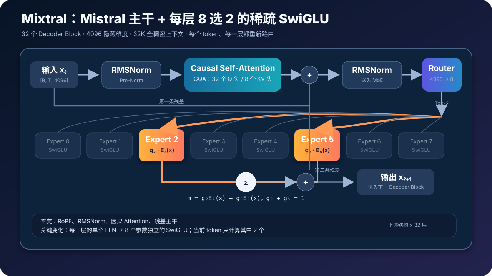
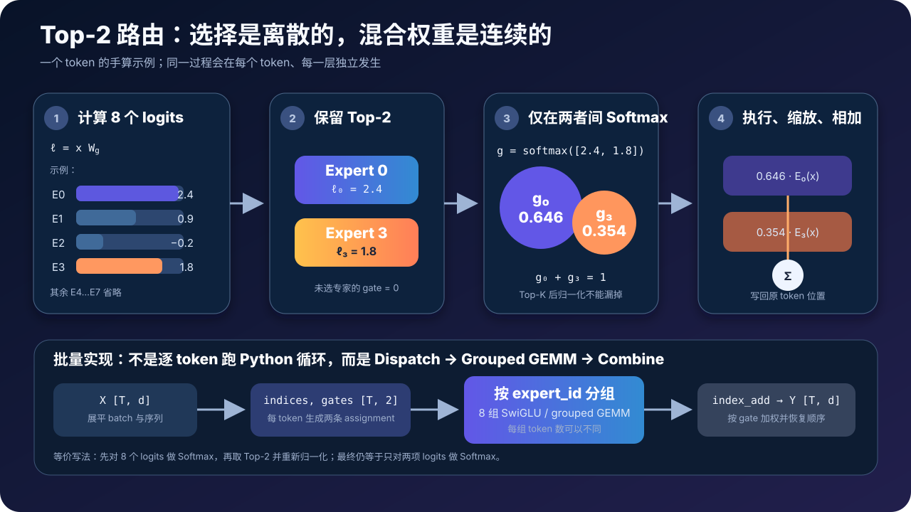
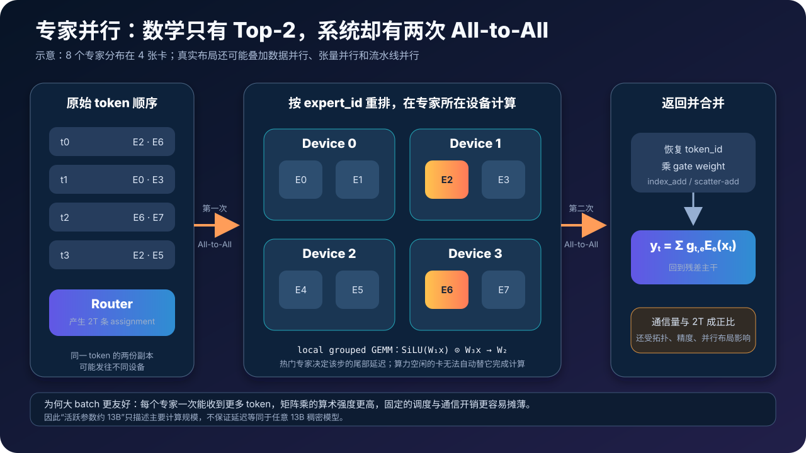
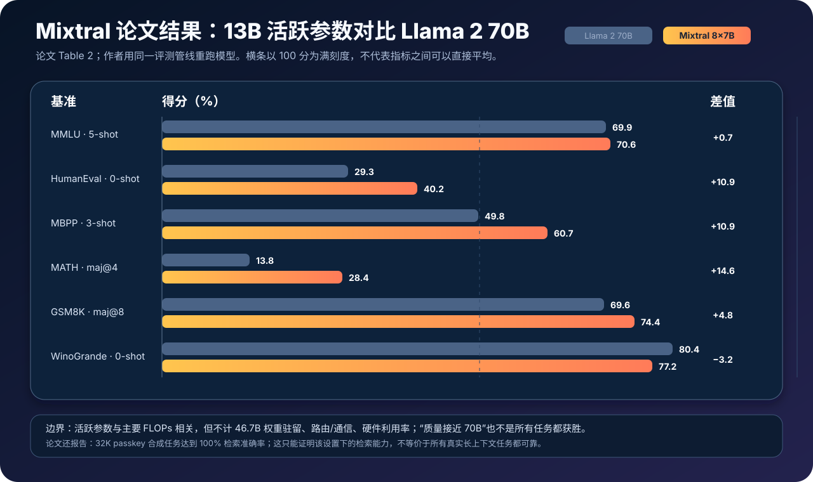

# Mixtral 原理与实现：Top-2 稀疏专家如何用 13B 活跃参数承载 47B 容量


> **论文**：Mixtral of Experts<br>
> **作者**：Albert Q. Jiang 等 26 位作者（Mistral AI）<br>
> **时间**：模型于 2023 年 12 月发布；论文于 2024 年 1 月提交 arXiv<br>
> **关键词**：Sparse Mixture of Experts、Top-2 Routing、SwiGLU、GQA、Expert Parallelism<br>
> **原文**：[arXiv](https://arxiv.org/abs/2401.04088) · [HTML 版](https://ar5iv.labs.arxiv.org/html/2401.04088) · [官方发布页](https://mistral.ai/news/mixtral-of-experts/)<br>
> **模型与配置**：[Mixtral-8x7B-v0.1](https://huggingface.co/mistralai/Mixtral-8x7B-v0.1) · [config.json](https://huggingface.co/mistralai/Mixtral-8x7B-v0.1/blob/main/config.json)<br>
> **本文代码**：[零依赖 Mixtral Top-2 最小实现](./code/mixtral_minimal.py)

> 本文讨论的是 **Mixtral 8x7B v0.1**。`8x7B`、`47B` 与 `13B` 分别描述不同口径，不能互相替换。论文没有公开完整预训练数据、优化器和所有路由训练细节；下文会明确区分“论文披露”“公开 checkpoint 配置”和“常见工程实现”。

Mixtral 的关键不是“把八个 7B 模型投票集成”，而是把每个 Transformer Block 里的单个 FFN 换成八个参数独立的 SwiGLU FFN。对每个 token、在每一层，Router 只选两个专家，执行后按门控权重相加。

这带来一种很有价值的解耦：

- 模型保存约 **46.7B 总参数**，获得更大的参数容量；
- 一个 token 只激活约 **12.9B 参数**，主要计算量不按总参数同比增长；
- 但全部权重仍要驻留内存，且动态路由会引入重排、通信和负载不均；
- 所以 MoE 节省的是每 token 的专家计算，不是凭空消除了参数内存与系统成本。

下面从一个 Decoder Block 开始，把 Top-2 数学、SwiGLU、参数账本、训练梯度、专家并行与论文实验逐层拆开。

---

## 0. 一分钟抓住 Mixtral



对第 $\ell$ 层的 token 表示 $x_\ell$，Mixtral Block 可以简写为：

$$
h_\ell
=x_\ell+\operatorname{Attention}
\left(\operatorname{RMSNorm}(x_\ell)\right),
$$

$$
x_{\ell+1}
=h_\ell+\operatorname{MoE}
\left(\operatorname{RMSNorm}(h_\ell)\right).
$$

其中 Attention 仍是稠密的因果 Self-Attention；变化发生在第二个子层：

$$
\boxed{
\operatorname{MoE}(x)
=\sum_{i\in\mathcal T(x)}g_i(x)E_i(x),
\qquad |\mathcal T(x)|=2,
\qquad \sum_{i\in\mathcal T(x)}g_i(x)=1
}
$$

$E_i$ 是第 $i$ 个 SwiGLU 专家，$\mathcal T(x)$ 是 Router 选出的两个专家集合。

读懂 Mixtral，先记住七件事：

1. **稀疏的是 FFN 参数激活，不是 Attention。** 32K 上下文仍使用全稠密因果 Attention。
2. **每层都有 8 个专家，每个 token 选 2 个。** 选择在 token 维度、层维度上都可以变化。
3. **Top-2 后还要归一化。** 两个被选专家的权重之和为 1，再加权合并输出。
4. **专家是普通 SwiGLU FFN。** 它们不是八个能独立对话的完整模型，也没有人工指定“数学专家”“代码专家”。
5. **总参数约 46.7B，活跃参数约 12.9B。** `8 × 7B = 56B` 是错误的参数算法，因为 Attention、Embedding 和 Norm 都被共享。
6. **活跃参数不等于显存。** 推理前仍需放下全部 46.7B 权重。
7. **性能收益依赖系统实现。** 小 batch 容易受权重读取和调度限制；专家并行还要支付两次跨设备交换。

一句话概括：

> Mixtral 用输入相关的 Top-2 条件计算扩大 FFN 参数容量，在保持约 13B 级活跃参数的同时，把开源权重模型推到当时接近或超过 Llama 2 70B 的质量区间。

---

## 1. Mixtral 要解决的不是“参数不够”，而是“每个 token 都算全部参数”

### 1.1 稠密 FFN：容量与计算绑在一起

标准 Transformer 中，FFN 通常占据大部分参数。以 SwiGLU 为例：

$$
\operatorname{SwiGLU}(x)
=W_2\left(
\operatorname{SiLU}(W_1x)\odot W_3x
\right).
$$

若隐藏维度为 $d$、中间维度为 $d_{ff}$，忽略 bias，一个 FFN 的参数量为：

$$
P_{\text{FFN}}=3dd_{ff}.
$$

把 $d_{ff}$ 继续加大时：

- 模型容量增加；
- 每个 token 执行的矩阵乘也同步增加；
- 权重读取、训练 FLOPs 和推理延迟一起上升。

稠密模型的含义就是：无论 token 是换行符、常见介词还是复杂代码片段，都经过同一份 FFN 参数。

### 1.2 稀疏 MoE：增加候选参数，不增加同等比例的活跃路径

MoE 把一份 FFN 扩展成 $N$ 份参数不同、结构相同的专家：

$$
E_0,E_1,\ldots,E_{N-1}.
$$

总专家参数约为：

$$
P_{\text{experts,total}}=N\cdot 3dd_{ff}.
$$

若每个 token 只调用 $K$ 个专家，主要专家计算只与 $K$ 成正比：

$$
P_{\text{experts,active}}=K\cdot 3dd_{ff},
\qquad K\ll N.
$$

固定 $K$、增加 $N$，就能扩大候选参数容量，而不让单 token 专家 FLOPs 与 $N$ 同比增长。Mixtral 取：

$$
N=8,\qquad K=2.
$$

### 1.3 这不是“免费扩容”

条件计算只改变执行路径，不改变这些事实：

- 8 个专家的权重都必须保存在某处；
- 每个 token 会产生两条 assignment，需要重排和合并；
- 专家分布在多卡时，token 要被发往专家所在设备；
- Router 可能形成热点，最忙的专家决定该步何时结束；
- 小 batch 下每个专家收到的 token 太少，矩阵乘不够“饱满”。

因此 MoE 的正确目标不是“用 13B 显存运行 47B”，而是：

> 用接近 13B 级的活跃参数计算，访问 47B 级的可选参数容量。

---

## 2. Mixtral 的完整架构：哪些继承 Mistral，哪些被替换

论文给出的核心结构参数如下：

| 参数 | Mixtral 8x7B v0.1 | 含义 |
|---|---:|---|
| `dim` | 4096 | 残差流隐藏维度 |
| `n_layers` | 32 | Decoder Block 数量 |
| `head_dim` | 128 | 每个注意力头维度 |
| `n_heads` | 32 | Query 头数量 |
| `n_kv_heads` | 8 | Key/Value 头数量 |
| `hidden_dim` | 14336 | 每个 SwiGLU 专家的中间维度 |
| `context_len` | 32768 | 训练上下文长度 |
| `vocab_size` | 32000 | 词表大小 |
| `num_experts` | 8 | 每层专家数量 |
| `top_k_experts` | 2 | 每 token 每层激活专家数 |

公开 checkpoint 配置还给出：`rms_norm_eps=1e-5`、`rope_theta=1_000_000`、`torch_dtype=bfloat16`、`sliding_window=null`、输入 Embedding 与 LM Head 不绑权重。

### 2.1 每一层都把 FFN 换成 MoE

Mixtral 不是只在少数层插入 MoE，而是把 **所有 32 层**的 FFN 子层都换成稀疏专家层。论文特别指出，它与 GShard 的差异之一就是：GShard 每隔一层替换，Mixtral 每一层都替换。

一层的高层结构是：

```text
hidden states
  │
  ├─ RMSNorm → Causal GQA → residual add
  │
  └─ RMSNorm → Router → Top-2 SwiGLU → weighted sum → residual add
```

### 2.2 Attention 没有变成稀疏 Attention

Mixtral 使用 32 个 Query 头、8 个 Key/Value 头，即 Grouped-Query Attention（GQA）。每 4 个 Query 头共享一组 K/V：

$$
n_{\text{groups}}
=\frac{n_q}{n_{kv}}
=\frac{32}{8}
=4.
$$

GQA 的主要收益是减少 K/V 投影参数和 KV Cache，而不是改变 token 之间的注意力连接。

这里有一个常见误读：Mistral 7B 以 Sliding Window Attention 著称，但 Mixtral 论文明确说它支持 **32K fully dense context**；公开 v0.1 配置也是：

```json
"max_position_embeddings": 32768,
"sliding_window": null
```

所以不能把“Mistral 7B 的滑动窗口”直接当成 Mixtral 8x7B 的论文设计。

### 2.3 Router 在每层重新决定路径

“一个 token 选两个专家”不代表它在 32 层始终绑定同一对专家。更准确的写法是：

$$
\mathcal T_{t,\ell}
=\operatorname{Top2}
\left(x_{t,\ell}W_{g,\ell}\right).
$$

这里 $t$ 是 token 位置，$\ell$ 是层号。因为隐藏状态 $x_{t,\ell}$ 和 Router 参数 $W_{g,\ell}$ 都随层变化，同一个 token 可以走出：

```text
Layer 0  → Expert 1 + Expert 6
Layer 1  → Expert 0 + Expert 4
Layer 2  → Expert 4 + Expert 7
...
Layer 31 → Expert 2 + Expert 5
```

因此不能把 Mixtral 想成“先挑两个完整子模型，再一路执行到底”。

---

## 3. Top-2 Router：从 logits 到加权专家输出



### 3.1 第一步：线性 Router 产生 8 个 logits

对一个隐藏状态：

$$
x\in\mathbb R^d,
\qquad d=4096,
$$

Router 是一个很小的无 bias 线性层：

$$
W_g\in\mathbb R^{d\times N},
\qquad N=8,
$$

$$
\ell=xW_g\in\mathbb R^8.
$$

$\ell_i$ 越大，代表当前 Router 越倾向让专家 $i$ 处理这个 token。

Router 每层只有：

$$
4096\times8=32768
$$

个参数，相比一个 176M 参数的专家非常小。

### 3.2 第二步：先选 Top-2，再在两项之间 Softmax

记被选专家集合为：

$$
\mathcal T(x)=\operatorname{argTop2}(\ell).
$$

门控权重为：

$$
g_i(x)=
\begin{cases}
\dfrac{\exp(\ell_i)}
{\sum_{j\in\mathcal T(x)}\exp(\ell_j)},
& i\in\mathcal T(x),\\[8pt]
0,&i\notin\mathcal T(x).
\end{cases}
$$

论文把它写作：

$$
G(x)=\operatorname{Softmax}
\left(\operatorname{TopK}(xW_g)\right),
$$

其中未进入 Top-K 的坐标被设为 $-\infty$。

有些实现会采用等价顺序：

1. 先对 8 个 logits 做 Softmax；
2. 取概率最大的两个；
3. 再除以这两个概率之和。

由于公共分母会约掉，最终仍等于只对两个被选 logits 做 Softmax。真正不能漏的是第 3 步的重新归一化。

### 3.3 第三步：两个专家都执行，再按权重求和

最终输出为：

$$
\boxed{
y=\sum_{i=0}^{7}g_i(x)\operatorname{SwiGLU}_i(x)
}
$$

虽然求和写了 8 项，但 6 个 $g_i$ 为 0，因此只计算两份 SwiGLU。

### 3.4 手算一个 token

假设 8 个 Router logits 中最大两项为：

$$
\ell_0=2.4,
\qquad
\ell_3=1.8.
$$

则：

$$
g_0
=\frac{e^{2.4}}{e^{2.4}+e^{1.8}}
\approx0.646,
$$

$$
g_3
=\frac{e^{1.8}}{e^{2.4}+e^{1.8}}
\approx0.354.
$$

MoE 输出是：

$$
y=0.646E_0(x)+0.354E_3(x).
$$

这说明 Top-2 同时包含两种性质：

- `TopK` 的专家索引是离散选择；
- 被选专家的 gate 是连续、可微的混合权重。

### 3.5 Top-2 与 Top-1 的差别

相比 Switch Transformer 的 Top-1：

- Top-2 为每个 token 提供两条变换路径，表达更灵活；
- 两个专家输出可以形成连续插值；
- 但专家 FLOPs 约翻倍；
- assignment 数从 $T$ 变成 $2T$；
- 跨设备通信与加权合并更复杂；
- 热点专家问题仍然存在。

Mixtral 不是在证明 Top-2 对所有场景都优于 Top-1，而是在给定质量与系统目标下选取了 $K=2$。

---

## 4. 一个 Expert 内部究竟是什么

### 4.1 专家就是参数独立的 SwiGLU

第 $i$ 个专家为：

$$
E_i(x)
=W_{2,i}\left[
\operatorname{SiLU}(W_{1,i}x)
\odot(W_{3,i}x)
\right].
$$

在 Mixtral 中：

$$
x\in\mathbb R^{4096},
$$

$$
W_{1,i},W_{3,i}in\mathbb R^{14336\times4096},
$$

$$
W_{2,i}\in\mathbb R^{4096\times14336}.
$$

三个矩阵分别承担：

- $W_1$：产生经过 SiLU 的门控分支；
- $W_3$：产生值分支；
- 逐元素乘法：让门控调制值分支；
- $W_2$：把 14336 维投影回 4096 维残差流。

### 4.2 单个专家约 176M 参数

忽略 bias：

$$
P_E
=3\times4096\times14336
=176{,}160{,}768.
$$

一层 8 个专家共有：

$$
8P_E
=1{,}409{,}286{,}144
\approx1.409\text{B}.
$$

但一个 token 只激活两个：

$$
2P_E
=352{,}321{,}536
\approx0.352\text{B / layer}.
$$

这正是总容量与活跃计算解耦的主要来源。

### 4.3 专家不是人工定义的学科角色

训练开始时，8 个专家只是一组随机初始化、结构相同的 FFN。没有人在配置里写：

```text
Expert 0 = 数学
Expert 1 = Python
Expert 2 = 法语
...
```

专家分工由 Router、专家参数、训练数据与优化过程共同涌现。论文的路由分析甚至发现：专家选择并没有呈现清晰的主题领域划分，反而更容易观察到语法与位置局部性。第 9 节会详细讨论。

---

## 5. 从公式到伪代码：Dispatch 与 Combine 才是实现核心

### 5.1 形状级伪代码

设展平后的 token 数为 $T=B\times S$：

```text
输入:
    X          [T, d]
    W_router   [d, E]
    experts    E 个 SwiGLU
    K = 2

logits = X @ W_router                    # [T, E]
expert_id = TopK(logits, K)              # [T, K]
top_logits = Gather(logits, expert_id)   # [T, K]
gate = Softmax(top_logits, axis=-1)      # [T, K]

Y = ZerosLike(X)                         # [T, d]

for e in 0 .. E-1:
    token_id, slot = Where(expert_id == e)
    X_e = X[token_id]                    # 分发到专家 e
    Z_e = Expert_e(X_e)                  # 批量 SwiGLU
    Z_e = Z_e * gate[token_id, slot, None]
    Y.index_add_(token_id, Z_e)          # 合并回原 token

return Reshape(Y, [B, S, d])
```

两个索引都不能丢：

- `token_id` 决定专家输出写回哪个 token；
- `slot` 决定使用该 token 的第一还是第二个 gate weight。

因为每个 token 有两条路由，最终写回必须是累加语义，而不是覆盖语义。

### 5.2 一个语义正确的 PyTorch 核心

下面的代码强调正确性，不代表高性能 kernel：

```python
def sparse_moe(x, router, experts, top_k=2):
    # x: [batch, seq, hidden]
    batch, seq, hidden = x.shape
    flat = x.reshape(-1, hidden)                       # [T, d]

    logits = router(flat)                             # [T, E]
    top_logits, top_ids = logits.topk(top_k, dim=-1) # [T, K]
    gates = top_logits.softmax(dim=-1)                # [T, K]

    out = flat.new_zeros(flat.shape)

    for expert_id, expert in enumerate(experts):
        token_id, slot = (top_ids == expert_id).nonzero(as_tuple=True)
        if token_id.numel() == 0:
            continue

        expert_out = expert(flat[token_id])
        weighted = expert_out * gates[token_id, slot, None]
        out.index_add_(0, token_id, weighted)

    return out.reshape(batch, seq, hidden)
```

这段代码已经表达了 Top-2 的完整语义，但仍不快：

- Python 按专家循环会产生调度开销；
- 小专家 batch 会形成许多碎片化 GEMM；
- `nonzero`、高级索引和 `index_add_` 会创建中间张量；
- 多卡时还缺少 All-to-All；
- 训练时还要保存反向所需状态。

真实系统通常把 token 排序、分组矩阵乘和写回融合进专用 MoE kernel。论文提到 MegaBlocks 会把专家 FFN 表述为大型稀疏矩阵乘，并自然处理各专家 token 数不同的情况。

### 5.3 配套零依赖实现

本文提供了一个只依赖 Python 标准库的教学实现：

- 实现稳定的 Top-K Softmax；
- 实现完整的 SwiGLU Expert；
- 显式记录 `(token, expert, slot, weight)`；
- 按专家分组执行并加权写回；
- 用非分组参考路径逐元素校验结果；
- 重建 Mixtral 的总参数与活跃参数账本。

运行：

```bash
python3 papers/to-2026/code/mixtral_minimal.py
```

期望输出类似：

```text
Top-2 routes (token -> expert: weight):
  token 0 -> E0: 0.5655, E1: 0.4345
  token 1 -> E3: 0.5346, E2: 0.4654
  token 2 -> E1: 0.5500, E3: 0.4500
max sparse-vs-reference error: 0.000e+00
Mixtral full parameters:   46.703B
Mixtral active parameters: 12.880B
```

源码中的矩阵很小，目的是让路由语义可检查；它不会也不应该用来加载 47B 真实权重。

---

## 6. 为什么叫 8x7B，却只有约 46.7B 总参数


### 6.1 共享部分只算一次

`8x7B` 是易传播的型号名，不是精确乘法。Mixtral 并没有复制八份：

- Token Embedding；
- LM Head；
- Attention；
- RMSNorm；
- 残差主干。

复制的是每层 FFN。完整参数可以拆为：

| 组成 | 近似参数量 | 是否每 token 全部参与 |
|---|---:|---:|
| 32 层 × 8 个 SwiGLU | 45.097B | 否，只选 2/8 |
| 32 层 GQA Attention | 1.342B | 是 |
| Token Embedding + LM Head | 0.262B | 共享 |
| Router + RMSNorm | 约 0.001B | 是 |
| **总计** | **46.703B** | — |

注意公开配置中 `tie_word_embeddings=false`，所以输入 Embedding 与输出 LM Head 各算一份：

$$
2\times32000\times4096
=262{,}144{,}000.
$$

### 6.2 Attention 参数为什么约 41.94M / 层

GQA 中：

$$
d_q=32\times128=4096,
$$

$$
d_k=d_v=8\times128=1024.
$$

所以每层四个投影矩阵共：

$$
P_{\text{attn/layer}}
=4096\times4096
+2\times4096\times1024
+4096\times4096,
$$

$$
P_{\text{attn/layer}}
=41{,}943{,}040.
$$

32 层约为 1.342B。

### 6.3 活跃参数为什么约 12.9B，而不是 14B

对每层，只把 8 个专家替换为 2 个活跃专家：

$$
P_{\text{active}}
=P_{\text{shared}}
+32\times2\times176{,}160{,}768.
$$

其中：

$$
P_{\text{active experts}}
=11.274\text{B},
$$

共享主干约为：

$$
P_{\text{shared}}
\approx1.606\text{B}.
$$

因此：

$$
P_{\text{active}}
\approx11.274+1.606
=12.880\text{B}.
$$

“两个 7B 专家所以是 14B”错在把 Expert 当成了完整 7B 模型。Mixtral 的单个 Expert 只是某一层的一份 176M FFN。

### 6.4 活跃参数只近似主要计算，不等于真实延迟

用活跃参数比较模型很有用，因为矩阵乘 FLOPs 与参与计算的权重规模大体相关。但它没有包含：

- Router 与 Top-K；
- token 排序、padding、scatter/gather；
- 专家 batch 大小造成的硬件利用率差异；
- 多卡通信；
- 权重读取；
- Attention 随上下文长度增长的成本；
- 采样、Tokenizer 与服务框架开销。

论文也明确提醒：活跃参数分析没有考虑内存成本与设备利用率。

---

## 7. 权重显存与 KV Cache：MoE 部署最容易算错的两项

### 7.1 全部 46.7B 权重仍要驻留

只按权重 payload 粗算：

| 权重格式 | 十进制大小 | 二进制大小 | 说明 |
|---|---:|---:|---|
| BF16 / FP16 | 93.4 GB | 约 87.0 GiB | 未计框架与临时缓冲 |
| INT8 | 46.7 GB | 约 43.5 GiB | 未计 scale / metadata |
| 4-bit | 23.4 GB | 约 21.7 GiB | 未计 scale、分组与 kernel workspace |

即便当前 token 只执行两个专家，也不能在生成前只加载这两个，因为下一层、下一个 token 可能选择其他专家。

把冷专家临时从 CPU 或磁盘换入 GPU 理论上可行，但会把预测路径变成不可预测的 I/O 路径，通常只适合极低吞吐或专门设计的专家缓存系统。

### 7.2 GQA 把 32K KV Cache 从 16 GiB 降到约 4 GiB

对单序列、BF16、完整 32K 上下文，KV Cache payload 为：

$$
M_{KV}
=2\times L\times n_{kv}\times d_h\times S\times b,
$$

其中：

- 2 表示 K 与 V；
- $L=32$ 层；
- $n_{kv}=8$；
- $d_h=128$；
- $S=32768$；
- $b=2$ bytes。

代入得到：

$$
M_{KV}
=4{,}294{,}967{,}296\text{ bytes}
=4\text{ GiB / sequence}.
$$

若使用 32 个独立 KV 头的普通 MHA，则约为 16 GiB。GQA 在这里减少了 4 倍 KV Cache。

但 4 GiB 仍不是完整服务账单：batch、KV 分页碎片、量化元数据、激活、通信缓冲和框架 workspace 都会继续占用显存。

### 7.3 上下文越长，Attention 越可能盖过 MoE 优势

在 prefill 阶段，全稠密 Attention 的主要计算随序列长度近似二次增长；MoE FFN 仍随 token 数近似线性增长。上下文足够长时，端到端瓶颈可能从专家计算转移到 Attention。

所以“MoE 比稠密模型省计算”不能脱离：

- prefill 还是 decode；
- 上下文长度；
- batch 大小；
- 专家并行布局；
- 权重量化与 Attention kernel。

---

## 8. 训练时梯度如何流过离散 Top-2

### 8.1 专家索引不可微，门控权重可微

Top-K 的索引选择是离散操作。对当前前向中已选集合 $\mathcal T(x)$，主任务梯度会流向：

- 两个被选专家的 $W_1,W_2,W_3$；
- 两个 gate weight；
- 进一步流入 Router 的相关 logits；
- 输入隐藏状态与之前各层。

没有被选中的专家不会从这个 token 的主任务损失收到专家参数梯度。

可以把 Top-K 看成一个分段常数的选择边界：在专家排序没有变化的小邻域内，连续 gate 与专家网络正常反向；跨过排序边界时，激活集合发生跳变。

### 8.2 为什么主任务损失不保证负载均衡

如果某个专家偶然更容易降低早期 loss，Router 会给它更多 token；它得到更多梯度后又可能变得更强，于是形成正反馈：

```text
早期略强 → 获得更多 token → 更新更多 → 更强 → Router 更偏向它
```

后果包括：

- 少数专家过载；
- 其他专家训练不足；
- 多卡时部分设备忙、部分设备空闲；
- 有效参数容量低于名义总容量；
- 路由分布对 batch 组成变得敏感。

### 8.3 常见的负载均衡辅助损失

记完整 Router 概率为：

$$
p_{t,e}=\operatorname{softmax}(\ell_t)_e.
$$

定义专家 $e$ 的实际分配频率：

$$
f_e
=\frac{1}{TK}
\sum_{t=1}^{T}\sum_{j=1}^{K}
\mathbf 1[i_{t,j}=e],
$$

以及平均 Router 概率：

$$
P_e=\frac{1}{T}\sum_{t=1}^{T}p_{t,e}.
$$

一种常见的 Switch-style 辅助目标是：

$$
\mathcal L_{aux}
=N\sum_{e=1}^{N}f_eP_e.
$$

它把离散流量 $f_e$ 与可微概率 $P_e$ 结合起来。负载完全塌缩到单个专家时损失较大，均匀分配时较小。

### 8.4 论文披露边界：不要替作者补训练配方

这里必须谨慎：

- Mixtral 论文解释了 Top-2 架构、专家并行与负载均衡挑战；
- 论文没有完整公开预训练优化器、batch、学习率、辅助损失细节和数据配比；
- 公开 v0.1 checkpoint 配置包含 `router_aux_loss_coef: 0.02`；
- Hugging Face 的参考实现提供 Switch-style `load_balancing_loss_func`。

这些公开实现证据可以帮助理解与复现接口，但不能反向宣称“论文正文明确给出了全部训练配方”。

### 8.5 训练时至少监控什么

仅看语言模型 loss 不足以判断 MoE 是否健康。每一层至少监控：

1. 每个专家的 Top-1 / Top-2 token 数；
2. `max(load) / mean(load)` 与负载变异系数；
3. Router 熵、最大 gate、Top-1 与 Top-2 margin；
4. 辅助损失占总 loss 的比例；
5. 各专家梯度范数与更新次数；
6. token 重排、Grouped GEMM、All-to-All 的耗时；
7. 是否存在长期“冷专家”或固定热点设备。

负载完全均匀也不是最终目的。强行把所有专家压成同样使用率，可能妨碍有意义的 specialization；工程目标是在表达分工与系统可执行性之间取得平衡。

---

## 9. 专家并行：一行 MoE 公式背后的分布式系统



### 9.1 单卡：按专家分组，避免碎片化小矩阵乘

朴素实现会逐 token 执行两个专家，产生大量小 GEMM。高性能实现通常：

1. 把 $T$ 个 token 展平成 $2T$ 条 assignment；
2. 按 `expert_id` 排序或分桶；
3. 为每个专家形成一块连续 token 矩阵；
4. 用 Grouped GEMM 或 block-sparse kernel 执行 8 组 SwiGLU；
5. 乘 gate 后按 `token_id` scatter-add 回去。

如果 batch 太小，某些专家一次只收到几个 token，GPU 就无法充分利用大矩阵乘单元。这也是 MoE 经常“理论 FLOPs 很漂亮，实测延迟却不成比例”的原因。

### 9.2 多卡 Expert Parallelism：两次 All-to-All

假设 8 个专家分在 4 张 GPU，每卡 2 个专家：

```text
GPU 0: Expert 0, 1
GPU 1: Expert 2, 3
GPU 2: Expert 4, 5
GPU 3: Expert 6, 7
```

一个 MoE 层通常经历：

1. 每张卡上的 Router 为本地 token 生成两个 expert id；
2. 第一次 All-to-All：把 token 副本发往专家所在 GPU；
3. 每张 GPU 执行本地专家；
4. 第二次 All-to-All：把专家输出发回 token 原属设备；
5. 按 gate 加权合并，进入残差主干。

“All-to-All”不一定由单个同名 API 完成，但逻辑上存在一次去程交换和一次回程交换。

### 9.3 网络可能取代算力成为瓶颈

通信量大致随这些量增长：

$$
O(TKd\cdot\text{bytes per activation}).
$$

它受以下因素影响：

- $K=2$ 带来的 token 复制；
- hidden size；
- 激活精度；
- 专家到设备的映射；
- 节点内 NVLink 与节点间网络拓扑；
- 是否能把通信与其他计算重叠；
- 是否出现热点专家。

因此部署时不能只按“每卡放两个专家”做静态算术，还要结合实际路由 trace 测量。

### 9.4 为什么论文说大 batch 更适合 MoE

大 batch 往往让每个专家收到更多 token：

- Grouped GEMM 更大、更规整；
- Router 和重排固定开销被摊薄；
- 权重被更多 token 复用，提高算术强度；
- 通信更容易聚合成较大的消息。

小 batch 或单请求 decode 则更容易被权重读取、kernel launch 和不规则路由主导。Mixtral 在低 batch 仍可能很快，但“13B 活跃参数”并不保证它在任意硬件上都等价于一个 13B 稠密模型的延迟。

---

## 10. 专家到底学会了什么：论文没有发现八个清晰学科

### 10.1 不同主题的专家频率很相似

论文在 The Pile 的多个子集上分析第 0、15、31 层，包括：

- ArXiv；
- PubMed Abstracts；
- PhilPapers；
- GitHub；
- Gutenberg；
- StackExchange；
- Wikipedia；
- DM Mathematics。

结果没有显示“某个主题稳定对应某个专家”的明显模式。ArXiv、生命科学和哲学文本的专家分布相当接近；DM Mathematics 有一些差异，但作者认为可能与其合成数据性质有关。

所以对 Mixtral 更准确的理解是：

> Router 学到的是隐藏状态空间中的条件分工，不一定能被人类用八个主题标签概括。

### 10.2 语法结构比主题标签更明显

论文的 token 着色示例观察到：

- Python 中的 `self` 往往被路由到相同专家；
- 缩进 token 呈现稳定选择；
- 英文中的 `Question` 等词也出现一致路由；
- 初层和末层更接近输入/输出词嵌入，因此语法模式尤其明显。

这不代表专家“只懂语法”，而是说明可观察的 specialization 更细粒度、更依赖 token 表征。

### 10.3 连续 token 存在路由局部性

若专家完全随机且均匀：

- 连续 token 的 Top-1 专家相同概率为 $1/8=12.5\%$；
- 两个 Top-2 集合至少共享一个专家的概率约为 $46\%$。

以论文 Table 5 的 GitHub 子集为例：

| 指标 | Layer 0 | Layer 15 | Layer 31 | 随机参考 |
|---|---:|---:|---:|---:|
| 连续 token 的第一专家相同 | 14.9% | 28.1% | 19.7% | 12.5% |
| 两个 Top-2 集合至少共享一个专家 | 49.9% | 66.9% | 49.2% | 约 46% |

中层的局部性明显高于随机。这有两面性：

- 可以为专家缓存、批处理聚合提供机会；
- 也可能让一段连续文本同时压向少数专家，放大热点。

---

## 11. 论文实验：哪些结论强，哪些不能过度外推



### 11.1 统一评测管线下，数学与代码优势最明显

论文使用自己的统一 pipeline 重跑 Llama 与 Mixtral。Table 2 中：

| 指标 | Llama 2 70B | Mixtral 8x7B | Mixtral 差值 |
|---|---:|---:|---:|
| MMLU 5-shot | 69.9 | 70.6 | +0.7 |
| HumanEval 0-shot | 29.3 | 40.2 | +10.9 |
| MBPP 3-shot | 49.8 | 60.7 | +10.9 |
| MATH 4-shot, maj@4 | 13.8 | 28.4 | +14.6 |
| GSM8K 8-shot, maj@8 | 69.6 | 74.4 | +4.8 |
| WinoGrande 0-shot | 80.4 | 77.2 | −3.2 |

最稳妥的结论不是“Mixtral 全面碾压 70B”，而是：

- 在论文覆盖的大多数基准上匹配或超过 Llama 2 70B；
- 代码与数学的差距尤其明显；
- 仍存在 Mixtral 落后的具体指标；
- 13B 活跃参数带来了很强的质量—计算折中。

### 11.2 多语言收益不能只归因于 MoE

论文报告 Mixtral 在法语、德语、西班牙语和意大利语的 ARC-Challenge、HellaSwag、MMLU 上超过 Llama 2 70B。同时作者明确说，相比 Mistral 7B，预训练时显著提高了多语言数据比例。

因此多语言提升至少来自两个共同因素：

- 更大的稀疏参数容量；
- 不同的训练数据配比。

不能把所有提升都当成 Top-2 架构的纯因果效果。

### 11.3 32K Passkey 达到 100%，但它是合成检索任务

论文把随机 passkey 放到不同长度、不同位置的上下文中，Mixtral 在测试设置下达到 100% 检索准确率；Proof-Pile 子集的 perplexity 也随上下文增长单调下降。

这支持“模型确实利用了训练到的 32K 上下文”，但不能推出：

- 所有真实长文档问答都 100% 正确；
- 多跳推理、跨文档矛盾消解同样可靠；
- 超过 32K 可无损外推；
- 32K 下的延迟和显存成本可以忽略。

Passkey 主要测“能否找到并复述一段显眼信息”，不是完整的长上下文能力。

### 11.4 Instruct 版本使用 SFT + DPO

论文披露的对齐流程是：

```text
Base Model
  → Supervised Fine-Tuning（指令数据）
  → Direct Preference Optimization（成对反馈数据）
  → Mixtral 8x7B Instruct v0.1
```

论文报告 Instruct 版本 MT-Bench 为 8.30，并引用 2023 年 12 月 22 日 LMSys 榜单快照做比较。

必须保留时间条件：排行榜、对手版本和评测器都会变化。这些数字描述论文发布时的快照，不是永久的“当前排名”。

### 11.5 公平比较至少需要四个口径

比较 MoE 与稠密模型时，至少同时报告：

1. 总参数与权重内存；
2. 活跃参数或模型 FLOPs；
3. 在目标硬件、目标 batch 上的实测吞吐和延迟；
4. 使用同一 prompt、shot、采样与评分器的质量。

只报其中一个口径，很容易把容量优势、计算优势或硬件优势混为一谈。

---

## 12. 与 Switch Transformer、GShard、Mistral 7B 的关系

| 模型 / 方法 | Backbone | MoE 放置 | 每 token 专家数 | 关键特征 |
|---|---|---|---:|---|
| Mistral 7B | Decoder-only | 无，单个 SwiGLU | 1 份稠密 FFN | 简单、全部参数活跃 |
| Switch Transformer | T5 Encoder-Decoder | 典型设置每隔一个 FFN | Top-1 | 强调简化路由、capacity 与稳定训练 |
| GShard | Transformer | 每隔一个 FFN | Top-2 | 第二专家使用更复杂的 gating 策略 |
| Mixtral 8x7B | Decoder-only | 所有 32 层 FFN | Top-2 / 8 | 开放权重、GQA、32K 全稠密上下文 |

### 12.1 Mixtral 继承了什么

- 从通用 MoE / GShard 路线继承 Top-2 条件计算；
- 从 Mistral 主干继承 Decoder-only、RMSNorm、RoPE、SwiGLU 与 GQA；
- 从现代 MoE 系统继承 token dispatch、Grouped GEMM 与 Expert Parallelism。

### 12.2 Mixtral 没有在论文中说明什么

Switch Transformer 对 expert capacity、overflow token 与 token dropping 有明确讨论。Mixtral 论文没有给出同等细节的训练容量机制，不能把 Switch 的“溢出 token 跳过专家分支”自动套到 Mixtral。

论文提到 MegaBlocks 能自然处理不同专家收到不同 token 数的情况，公开推理实现也通常按实际 assignment 分组；但这仍不等于论文公开了完整训练内核和所有负载策略。

---

## 13. 部署 Mixtral 时的实用检查表

### 13.1 加载前先算四本账

- 权重 payload 是否能放进 GPU / CPU 内存；
- 目标上下文和并发下的 KV Cache；
- MoE workspace、通信缓冲和量化元数据；
- 框架是否真的支持该量化格式的 MoE kernel。

“4-bit 权重约 21.7 GiB”不意味着一张 24 GiB 卡必然能稳定服务 32K：KV Cache、临时缓冲和碎片会很快吃掉余量。

### 13.2 不要只测单个 prompt

至少分别测：

- batch = 1 的短 prompt decode；
- 长 prompt prefill；
- 多请求 continuous batching；
- 目标上下文长度；
- 冷启动与稳态；
- P50 / P95 / P99 token latency。

MoE 的专家负载随 token 内容变化，单个 prompt 很难代表真实服务。

### 13.3 记录路由分布

如果框架能返回 Router logits，可做一个简单诊断：

```python
with torch.no_grad():
    outputs = model(
        **inputs,
        output_router_logits=True,
        return_dict=True,
    )

for layer_id, logits in enumerate(outputs.router_logits):
    top2 = logits.float().topk(2, dim=-1).indices
    counts = torch.bincount(top2.flatten(), minlength=8)
    print(layer_id, counts.tolist())
```

实际 API 会随库版本变化，但诊断目标不变：检查各层 token 数、热点、Router 熵和跨请求波动。

### 13.4 专家布局必须结合互联拓扑

部署在多卡、多节点时：

- 尽量让高频通信留在高速互联域；
- 测量专家到 GPU 的不同映射；
- 避免某些设备同时承载热点专家与其他重负载模块；
- 评估 Expert Parallel 与 Tensor Parallel 的组合；
- 不要只凭平均流量判断，尾部热点更影响同步步长。

### 13.5 量化解决权重驻留，不自动解决路由开销

权重量化可以显著降低内存带宽与驻留压力，但还要确认：

- 专家 Linear 是否有高效量化 kernel；
- Grouped GEMM 是否支持目标量化格式；
- 反量化是否在每个小 expert batch 上产生额外开销；
- Router、Attention 和 KV Cache 使用什么精度；
- 质量是否在代码、数学、多语言与长上下文任务上分别验收。

---

## 14. 十个常见误解

### 误解 1：“Mixtral 是八个 7B 模型组成的投票系统”

不是。它共享 Attention、Embedding、Norm 和残差主干，只在每层拥有 8 份 FFN。

### 误解 2：“总参数是 8 × 7B = 56B”

不是。按公开结构重建约 46.703B；`8x7B` 是型号名，不是精确总参数公式。

### 误解 3：“每个 token 使用两个完整 7B 模型，所以活跃 14B”

不是。一个 Expert 是单层 FFN，不是完整模型。共享主干加每层两个专家约 12.880B。

### 误解 4：“只激活 13B，所以显存只需容纳 13B”

不是。下一个 token 可能选择任意专家，全部 46.7B 权重仍需驻留或被某种分层存储系统管理。

### 误解 5：“MoE 把 Attention 也稀疏化了”

不是。Mixtral 的稀疏性位于 FFN；32K 因果 Attention 是全稠密的。

### 误解 6：“Mixtral 使用 Mistral 7B 的滑动窗口”

v0.1 论文与公开配置都指向 32K fully dense context，`sliding_window=null`。

### 误解 7：“Top-2 只取两个专家，不需要 gate weight”

错误。两个 logits 还要 Softmax，输出是两份专家结果的加权和。

### 误解 8：“八个专家分别是数学、代码、英语等领域专家”

论文没有观察到清晰的主题分区，反而发现更多语法行为与连续 token 路由局部性。

### 误解 9：“13B 活跃参数意味着速度一定等同于 13B 稠密模型”

不一定。权重读取、token 重排、Grouped GEMM 尺寸、All-to-All 与热点会改变实际延迟。

### 误解 10：“Passkey 100% 代表所有 32K 长上下文任务都解决了”

不是。Passkey 是合成检索任务，不能替代真实长文档、多跳推理与抗干扰测试。

---

## 15. 局限与开放问题

### 15.1 论文复现信息有限

论文公开了权重、架构、评测与部分分析，但没有完整披露：

- 预训练 token 总量；
- 数据来源与精确配比；
- 学习率、优化器、batch 等训练超参数；
- 路由辅助目标与训练 kernel 的全部细节；
- 专家容量与负载控制的完整策略。

所以可以复现模型结构和推理，难以仅凭论文从头复现训练结果。

### 15.2 总权重内存仍然很大

MoE 主要降低活跃计算，不按同样比例降低权重驻留。对于边缘设备、单卡低延迟场景，较小的稠密模型可能更容易部署。

### 15.3 动态路由让性能依赖输入

不同请求会产生不同专家分布。均值吞吐很好，不代表尾部延迟稳定；某些语言、格式或代码片段可能持续命中同一组专家。

### 15.4 专家可解释性仍然有限

Router 的选择有结构，但很难用简单人类标签解释。专家频率不等于因果重要性，屏蔽某个专家后的能力变化也可能被其他层和第二专家补偿。

### 15.5 MoE 仍需与 Attention 优化共同设计

短上下文时 FFN 与权重读取可能主导；长上下文 prefill 时 Attention 可能主导。只优化专家 kernel 而忽略 FlashAttention、KV Cache 和调度，无法得到稳定的端到端收益。

---

## 16. 如何验证一个 Mixtral 实现是可信的

### 16.1 数学正确性

- Top-2 gate 每个 token 的和是否为 1；
- 稀疏路径是否与“计算全部专家、未选 gate 置零”的参考实现一致；
- `index_add` 是否正确处理一个 token 的两份输出；
- batch、padding 与序列展平后是否能恢复原位置；
- BF16/FP16 下 Router 是否存在 NaN 或极端饱和。

### 16.2 参数与配置

- 是否为 32 层、4096 维、8 专家、Top-2；
- 每个专家中间维度是否为 14336；
- 是否使用 32 Q 头 / 8 KV 头；
- 是否错误启用了 Sliding Window；
- Embedding 与 LM Head 是否按 checkpoint 正确加载。

### 16.3 性能

- 分开计时 Router、dispatch、expert GEMM、combine、Attention；
- 报告 batch、prompt 长度、生成长度、精度和 GPU 拓扑；
- 同时报告 prefill tokens/s、decode tokens/s 与 P95 延迟；
- 检查各专家 token 数与最慢设备；
- 与同质量稠密模型比较，而不只与同活跃参数比较。

### 16.4 教学源码自检

```bash
python3 -m py_compile papers/to-2026/code/mixtral_minimal.py
python3 papers/to-2026/code/mixtral_minimal.py
```

配套脚本会断言：

- 每个 token 的 Top-2 gate 之和为 1；
- 分组稀疏实现与参考实现误差小于 $10^{-12}$；
- 参数账本输出约 46.703B / 12.880B。

---

## 17. 阅读路线与最后总结

### 17.1 前置阅读

1. [Transformer](./00_Transformer_2017_原理.md)：理解 Decoder Block、残差与 FFN；
2. [LLaMA](./15_LLaMA_2023_原理.md)：理解 RMSNorm、SwiGLU、RoPE 与 Decoder-only 主干；
3. [Switch Transformer](./16_Switch_Transformer_2021_原理.md)：理解 Top-1、负载均衡与 Expert Parallelism；
4. [DPO](./23_DPO_2023_原理.md)：理解 Mixtral Instruct 的偏好优化阶段。

### 17.2 读原论文时优先看

- Table 1：架构数字；
- Section 2.1：Top-2 公式与 Expert Parallelism；
- Table 2 / Figure 3：质量—活跃参数折中；
- Figure 4：32K 长上下文实验；
- Section 4：SFT + DPO；
- Section 5 / Table 5：专家选择、语法模式与时间局部性。

### 17.3 一页纸总结

**结构**

$$
\text{Mistral-style Decoder}
+\text{every-layer Top-2 SwiGLU MoE}.
$$

**路由**

$$
\mathcal T(x)=\operatorname{argTop2}(xW_g),
$$

$$
g_i=\operatorname{softmax}_{i\in\mathcal T}(\ell_i),
$$

$$
y=\sum_{i\in\mathcal T(x)}g_iE_i(x).
$$

**参数**

$$
P_{\text{total}}\approx46.703\text{B},
\qquad
P_{\text{active}}\approx12.880\text{B}.
$$

**系统**

```text
Router → Top-2 assignments → 按专家重排
→ Grouped GEMM / Expert Parallelism
→ 按 gate 加权 → 写回 token → 残差
```

**真正的价值**

> Mixtral 证明了开放权重 MoE 可以同时做到强质量、较低活跃计算与可用的工程生态；它也把“参数容量、实际计算、权重内存、通信成本必须分开计算”变成理解现代大模型的基本功。

---

## 参考资料

### 一手资料

- Jiang et al., [Mixtral of Experts](https://arxiv.org/abs/2401.04088), 2024.
- Mistral AI, [Mixtral of Experts 官方发布页](https://mistral.ai/news/mixtral-of-experts/).
- Mistral AI, [Mixtral-8x7B-v0.1 模型页](https://huggingface.co/mistralai/Mixtral-8x7B-v0.1).
- Mistral AI, [Mixtral-8x7B-v0.1 config.json](https://huggingface.co/mistralai/Mixtral-8x7B-v0.1/blob/main/config.json).
- Hugging Face Transformers, [Mixtral reference implementation](https://github.com/huggingface/transformers/blob/main/src/transformers/models/mixtral/modeling_mixtral.py).

### 本仓库延伸阅读

- [Switch Transformer：Top-1 路由与容量控制](./16_Switch_Transformer_2021_原理.md)
- [LLaMA：现代 Decoder-only 主干](./15_LLaMA_2023_原理.md)
- [FlashAttention：长上下文中的 Attention IO](./14_FlashAttention_2022_原理.md)
- [QLoRA：4-bit 权重驻留与低成本微调](./24_QLoRA_2023_原理.md)
- [DPO：直接偏好优化](./23_DPO_2023_原理.md)
