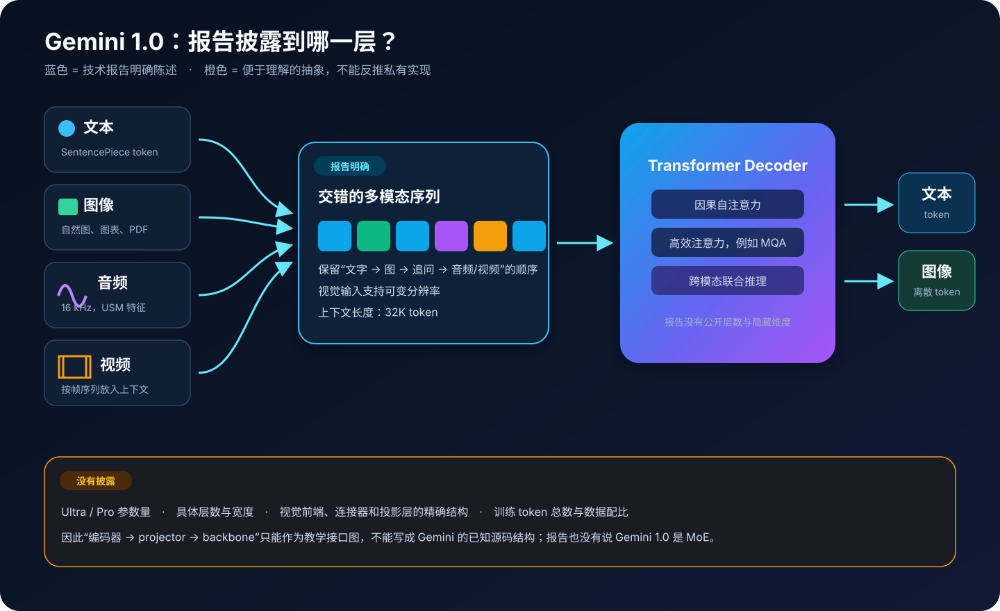
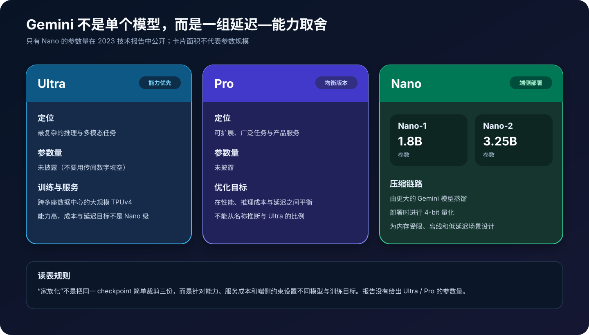
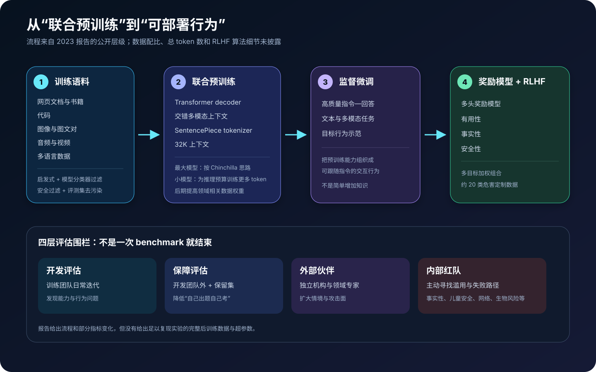
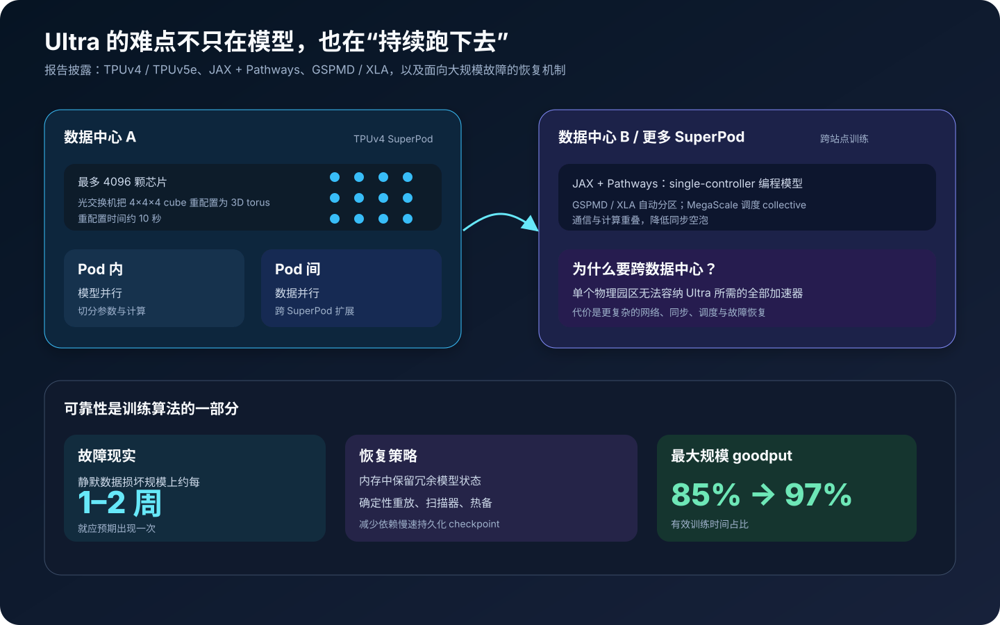
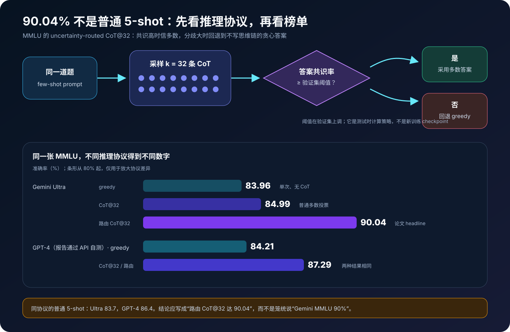
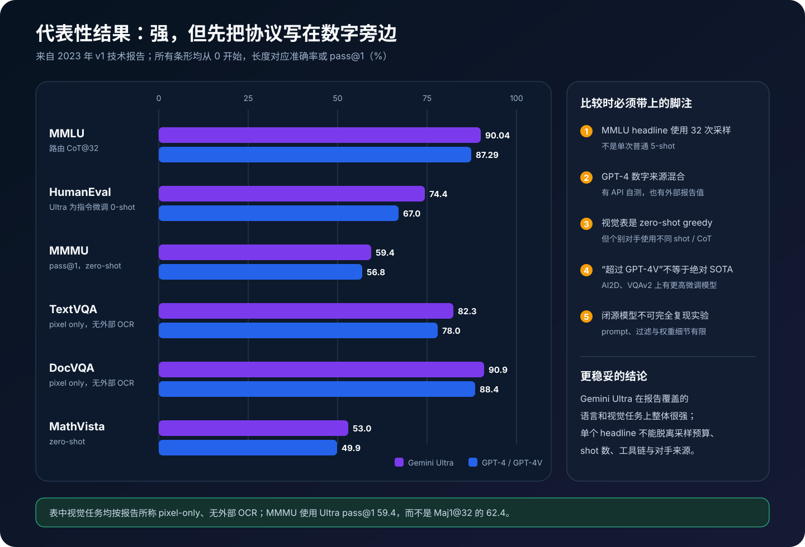

# Gemini 1.0 原理详解：原生多模态、训练系统与 90.04% MMLU 的真相


> **论文**：*Gemini: A Family of Highly Capable Multimodal Models*<br>
> **作者**：Gemini Team, Google<br>
> **首次公开**：2023 年 12 月<br>
> **本文依据**：[arXiv v1（2023 原始报告）](https://arxiv.org/pdf/2312.11805v1)<br>
> **关键词**：Transformer Decoder、原生多模态、32K Context、TPUv4、RLHF、Uncertainty-routed CoT

> [!IMPORTANT]
> 本文讨论的是 **2023 年 Gemini 1.0 技术报告**。arXiv 后来多次修订，新增作者、实验和章节；为了不把后来的 Gemini 版本倒灌进 2023 年结论，架构与数字以 `v1` 为准。文中的投影层、统一 token 序列等公式是**教学抽象**，不是 Google 公开的 Gemini 源码。

## 0. 先给结论

Gemini 1.0 最值得记住的，不是某个神秘层结构，而是四件事：

1. **多模态从预训练开始就是模型本体的一部分**。文本、图像、音频和视频可以按原始顺序交错进入模型，而不是只在一个纯语言模型后面临时挂视觉插件。
2. **模型仍以 Transformer decoder 为主干**，训练到 32K 上下文，并使用高效注意力方案，例如 Multi-Query Attention；但层数、宽度、Ultra/Pro 参数量等关键细节没有公开。
3. **Gemini 是一个家族，不是一个 checkpoint**：Ultra 追求能力，Pro 平衡性能与服务成本，Nano 面向端侧。公开参数量的只有 Nano-1（1.8B）和 Nano-2（3.25B）。
4. **榜单必须连同推理预算一起读**。著名的 MMLU `90.04%` 使用 32 次思维链采样和不确定性路由；在普通 5-shot 协议下，Ultra 是 `83.7%`，报告列出的 GPT-4 是 `86.4%`。

这篇报告更像一张“能力、训练系统和产品化约束”的全景图，而不是可以逐层复现的模型说明书。

---

## 1. 报告究竟公开了什么？



先把事实边界钉牢，后面所有推导才不会跑偏。

| 问题 | 2023 报告的答案 |
|---|---|
| 主干是什么？ | 基于 **Transformer decoder** |
| 上下文长度？ | 训练支持 **32K** 上下文 |
| 输入模态？ | 文本、自然图像、图表、截图、PDF、视频和音频，可交错输入 |
| 输出模态？ | 文本；报告还展示了通过离散图像 token 生成图像 |
| 视频怎样进入？ | 作为有顺序的帧序列放进长上下文 |
| 音频怎样进入？ | 16 kHz 信号，使用 USM（Universal Speech Model）特征 |
| 注意力是什么？ | 报告说采用高效注意力，举例为 Multi-Query Attention |
| Ultra / Pro 参数量？ | **未披露** |
| 精确视觉编码器和连接器？ | **未披露** |
| 训练 token 总数与数据比例？ | **未披露** |
| Gemini 1.0 是否为 MoE？ | 报告**没有这样说**，不能从后续版本倒推 |

一个很重要的措辞是：报告称 Gemini “从一开始就是多模态训练的”。它否定的是“训练完纯文本模型以后，再把多模态能力当补丁”的产品路线，并不意味着原始像素、波形可以不经任何前端直接进入 Transformer。

报告明确提到视觉编码受到 Flamingo、CoCa 和 PaLI 等工作的启发，也明确说音频使用 USM 特征。这意味着模态前端仍然存在；只不过它们怎样实现、怎样投影、在哪里与 decoder 融合，公开材料没有给出足够细节。

---

## 2. 从数学上怎样理解“原生多模态”？

### 2.1 不要先把模态顺序弄丢

假设用户的输入是：

```text
“请解释这张图” → [图像] → “再结合这段声音” → [音频] → [视频]
```

它不是四个互不相干的集合，而是一串带顺序的事件：

$$
\mathcal{S}=
\left(s_1^{\text{text}},
s_2^{\text{image}},
s_3^{\text{text}},
s_4^{\text{audio}},
s_5^{\text{video}}\right).
$$

对模态 $m$，用 $E_m$ 表示一个**概念上的**前端，再用 $P_m$ 表示把前端输出映射到模型宽度 $d$ 的**概念投影**：

$$
Z_i=P_{m_i}\!\left(E_{m_i}(s_i)\right),
\qquad Z_i\in\mathbb{R}^{L_i\times d}.
$$

把它们按输入顺序连接：

$$
Z=Z_1\Vert Z_2\Vert\cdots\Vert Z_n,
\qquad L=\sum_{i=1}^{n}L_i.
$$

这里的关键不是 `concat` 这个操作本身，而是三件更难的事：

- 每种前端要保留对任务有用的信息；
- 模型要知道 token 的模态、局部位置、帧时间和跨段顺序；
- 训练数据必须让 decoder 学会跨模态指代与推理，而不只是分别识图、听音和补文字。

> **披露边界**：$E_m$ 和 $P_m$ 是为了建立心智模型的接口符号。报告没有公布 Gemini 的精确视觉层、投影层形状或连接方式。

### 2.2 统一的是条件建模接口

无论输出是文字 token 还是离散图像 token，都可以用自回归条件概率抽象：

$$
p_\theta(Y\mid Z)
=\prod_{t=1}^{|Y|}
p_\theta\!\left(y_t\mid Z,y_{<t}\right).
$$

训练时最基本的 next-token loss 为：

$$
\mathcal{L}_{\text{AR}}
=-\sum_t\log p_\theta\!\left(y_t^*\mid Z,y_{<t}^*\right).
$$

这个公式能解释“一个 decoder 为什么可以接多种输入并产生多种序列输出”，但不能据此断言所有模态共用同一张 embedding 表、同一个词表或同一个 loss 权重——这些实现细节没有公开。

### 2.3 必要的元代码：先表达语义，不假装复现源码

下面是最小的**元代码 / 伪代码**：

```python
def native_multimodal_generate(interleaved_segments):
    sequence = []

    for segment in interleaved_segments:       # 保留跨模态原顺序
        features = frontend[segment.modality](segment.payload)
        features = control_token_budget(features)
        tokens = to_model_width(features)       # 教学接口，真实结构未披露
        tokens += modality_position_time_info(segment)
        sequence.extend(tokens)

    hidden = transformer_decoder(
        sequence,
        attention_mask="causal",
        max_context=32_768,
    )
    return autoregressive_decode(hidden, output="text_or_image_tokens")
```

比“`image_encoder + projector + LLM`”的三行示意更重要的是：它显式保留交错顺序、控制模态 token 预算、加入空间/时间身份，并使用因果遮罩。

---

## 3. 四种模态分别发生了什么？

### 3.1 文本：SentencePiece 与多语言效率

Gemini 使用 SentencePiece tokenizer。报告强调，tokenizer 在整个语料的大样本上训练，以改善非拉丁文字的 token 化效率、模型质量与推理速度。

这不是无关紧要的预处理。如果某种语言平均每个词被拆成更多 token，那么相同 32K 窗口能装下的语义更少，训练和推理也更贵。可以粗略写成：

$$
\text{有效语义容量}
\propto
\frac{L_{\max}}{\text{每个语义单元的平均 token 数}}.
$$

### 3.2 图像：可变分辨率，不等于“没有视觉编码器”

报告称视觉编码受到 Flamingo、CoCa 和 PaLI 启发，支持可变输入分辨率，并覆盖自然图、图表、截图、文档和 PDF 等输入。

在教学实现里，可以把图像切成 patch：

$$
N_{\text{patch}}
=\left\lceil\frac{H}{P_h}\right\rceil
 \left\lceil\frac{W}{P_w}\right\rceil.
$$

但这只是常见实现思路。报告没有公布 Gemini 的 patch 大小、视觉骨干、resampler、投影层或每张图像产生多少 token。

### 3.3 视频：帧是 token 预算的放大器

报告把视频表示为一串帧，并利用大上下文处理时间顺序。若采样 $F$ 帧，每帧产生 $N_v$ 个表示，那么仅视频部分就有：

$$
L_{\text{video}}\approx F\cdot N_v.
$$

帧率越高、分辨率越高，信息更丰富，但上下文和注意力成本也会快速膨胀。因此实际系统必须在抽帧、空间压缩和任务需要之间取舍。

### 3.4 音频：报告说的是 USM 特征

音频输入为 16 kHz 信号，并通过 USM 特征进入系统。若每秒产生 $r$ 个声学表示，时长为 $T$ 秒：

$$
L_{\text{audio}}\approx rT.
$$

需要注意：初版报告中的音频表没有评测 Ultra。不能把 Gemini 家族的音频结果自动写成“Gemini Ultra 的音频成绩”。

### 3.5 图像输出：离散图像 token

报告展示了交错文本—图像生成，图像通过离散 token 表示。概念上，可以先把图像压成代码序列：

$$
I\xrightarrow{\text{image tokenizer}}
(c_1,c_2,\ldots,c_K),
$$

decoder 预测代码，再由图像解码器还原像素。这个方向让“文字—图片—文字”的序列生成成为可能，但报告没有公布图像 tokenizer 的码本大小和训练配方。

---

## 4. 32K 上下文、因果遮罩与 MQA

### 4.1 多模态让序列长度更昂贵

一条请求的总长度可粗略记为：

$$
L=L_{\text{text}}+L_{\text{image}}+L_{\text{audio}}+L_{\text{video}}+L_{\text{output}}.
$$

普通全注意力的主要计算量近似为：

$$
\mathcal{O}(L^2d).
$$

所以“支持 32K”不等于每次都应该塞满 32K。视觉和视频 token 预算、批处理形状、KV cache 与延迟都必须一起设计。

报告的长上下文实验显示，面对保留的长文档，负对数似然能一路受益到完整 32K；这说明模型确实在训练中利用长上下文。它不等价于“32K 内任意位置、任意模态都能 100% 精确检索”。

### 4.2 因果遮罩防止偷看未来

decoder 的遮罩满足：

$$
M_{ij}=
\begin{cases}
0, & j\le i,\\
-\infty, & j>i.
\end{cases}
$$

于是第 $i$ 个位置只能读取自己和更早位置。训练时虽然整段目标同时送入 GPU/TPU，遮罩仍然保证每个位置没有看到未来答案。

### 4.3 Multi-Query Attention 优化什么？

标准多头注意力为每个 head 保留自己的 $K,V$；MQA 让多个 query head 共享一组 $K,V$：

$$
Q_h=XW_h^Q,\qquad K=XW^K,\qquad V=XW^V.
$$

它主要减少自回归解码时 KV cache 的内存和读带宽。若有 $H$ 个头，忽略批次和层数后：

$$
\text{MHA KV cache}=\mathcal{O}(LHd_h),
\qquad
\text{MQA KV cache}=\mathcal{O}(Ld_h).
$$

但报告的原文是“高效注意力，例如 MQA”。最稳妥的表述是：Gemini 使用了面向长上下文和推理效率的注意力优化，MQA 是报告明确举出的例子；不要把它扩写成每个家族成员完全相同的层级配置。

---

## 5. Ultra、Pro、Nano：家族化设计



| 版本 | 目标 | 参数量 | 报告中的关键信息 |
|---|---|---:|---|
| Ultra | 复杂推理与高难多模态任务 | 未披露 | 能力优先；训练跨多个 TPUv4 SuperPod 和数据中心 |
| Pro | 广泛服务场景 | 未披露 | 在性能、推理成本和延迟之间平衡 |
| Nano-1 | 端侧、低内存 | 1.8B | 从更大 Gemini 蒸馏，部署时 4-bit 量化 |
| Nano-2 | 更强端侧能力 | 3.25B | 同样面向设备端，并采用蒸馏与 4-bit 量化 |

### 5.1 为什么小模型反而训练更多 token？

报告说，最大模型的训练 token 规模参考 Chinchilla 的计算最优思路；更小的模型为了给定推理预算下的表现，会训练**显著更多的 token**，与 LLaMA 所代表的取舍相似。

直觉是：

- 大模型训练一次极贵，倾向在训练 FLOPs 约束下寻找较优的参数—数据配比；
- 小模型部署后会被调用很多次，宁愿多花一次性训练成本，也要换取长期推理成本更低的 checkpoint。

因此，参数少并不意味着看过的数据一定少。

### 5.2 蒸馏与 4-bit 量化解决不同问题

- **蒸馏**：让小模型学习大模型输出分布或行为，主要解决能力迁移。
- **量化**：用更低位宽保存和计算权重，主要解决内存、带宽和端侧效率。

如果只把 FP16 权重量化成 4-bit，理论权重存储约降为四分之一；真实端侧占用还包括量化尺度、运行时 buffer、激活和 KV cache，不能简单按参数量乘 `0.5 byte` 当作完整内存。

---

## 6. 数据与联合预训练



### 6.1 数据组成

报告列出的语料类型包括：

- 网页文档、书籍和代码；
- 图像、音频和视频；
- 多语言与多模态交错数据。

公开的是类型，不是完整配方。总 token 数、各模态百分比、采样温度、去重阈值、来源清单均不足以复现。

### 6.2 数据质量流水线

报告提到四类治理：

1. 启发式规则过滤低质量内容；
2. 模型分类器进行质量判断；
3. 安全过滤器移除高风险材料；
4. 对评测集进行过滤和污染分析。

训练混合比例先在小模型上做消融，再用于大规模训练；训练后期采用 staged mixture，提高与目标领域相关的数据权重。

可用一个抽象采样分布表示：

$$
p_t(D_k)=
\frac{w_k(t)\,|D_k|^{\alpha}}
{\sum_j w_j(t)\,|D_j|^{\alpha}},
$$

其中 $w_k(t)$ 随训练阶段变化。这个式子只是解释“阶段性调整混合权重”，不是报告公布的 Gemini 采样公式。

### 6.3 联合训练为什么可能产生迁移？

联合预训练给共享 decoder 提供了跨模态共现：文字描述图像、语音对应转写、视频帧对应动作说明、图表对应数值问答。一个模态学到的结构可能帮助另一个模态，例如：

- 代码和数学数据强化精确的步骤结构；
- 文档图像把 OCR、布局与语义绑定；
- 视频让静态视觉概念获得时间关系；
- 多语言数据让同一视觉概念连接到不同语言表达。

这是合理机制解释，不等于报告对每种迁移都给出了因果消融。闭源报告的限制之一，正是缺少足够细的模态混合消融。

---

## 7. Ultra 是怎样在多座数据中心训练的？



Gemini Ultra 的规模超过单个 TPU 园区能方便容纳的范围。报告披露的系统栈包括：

- 根据模型规模和配置使用 TPUv5e 与 TPUv4；
- Ultra 使用跨多个数据中心的大规模 TPUv4 集群；
- 每个 TPUv4 SuperPod 最多有 4096 颗芯片；
- 光交换机可把 `4×4×4` cube 重配置为 3D torus，约需 10 秒；
- SuperPod 内做模型并行，SuperPod 之间做数据并行；
- JAX + Pathways 提供 single-controller 编程模型；
- GSPMD / XLA 负责分区，MegaScale 调度 collective 并重叠通信与计算。

### 7.1 goodput 比峰值 FLOPs 更重要

在超大集群上，硬件故障、网络抖动、重启和 checkpoint 会让一部分墙钟时间没有产生有效训练步。定义：

$$
\text{goodput}=
\frac{\text{完成有效训练工作的时间}}
{\text{总墙钟时间}}.
$$

报告称，最大规模训练的 goodput 从约 `85%` 提高到 `97%`。这相当于每 100 小时多得到约 12 小时有效训练，而不需要增加芯片。

### 7.2 为什么传统 checkpoint 不够？

大规模状态写入持久存储很慢，故障又更频繁。Gemini 的训练系统在内存里维护冗余模型状态，以便故障后快速恢复，而不是只依赖定期落盘 checkpoint。

报告还指出，在这个规模上，静默数据损坏大约每一到两周就应该预期发生一次。因此系统加入确定性重放、数据扫描器和热备等机制。

这揭示了一个常被忽略的事实：训练前沿模型时，**容错本身就是有效算力放大器**。

---

## 8. 后训练：SFT、奖励模型与 RLHF

预训练回答的是“模型能学会什么”，后训练回答的是“模型面对用户时倾向怎样做”。2023 报告给出的主线是：

```text
预训练模型
  → 监督微调（SFT）
  → 多头奖励模型
  → 多目标奖励加权
  → RLHF
  → 多层安全评估与迭代
```

奖励模型同时考虑：

- helpfulness：是否切题、有帮助；
- factuality：事实是否准确、是否能归因；
- safety：是否避免高风险行为。

抽象地写：

$$
R(x,y)=
\lambda_h R_{\text{help}}+
\lambda_f R_{\text{fact}}+
\lambda_s R_{\text{safe}}.
$$

报告提到约 20 类危害，并使用受 Constitutional AI 思想启发的定制数据生成流程。这里也要守住边界：公开材料没有完整奖励权重、RL 算法超参数或训练数据，公式只是多目标奖励的概念表达。

### 8.1 事实性不只等于“回答正确”

报告把事实性拆成至少三个方向：

| 方向 | 问题 | Gemini Pro 指令微调前 → 后 |
|---|---|---:|
| closed-book accuracy | 没有来源时是否仍给出错误事实 | 不准确率 `7.9% → 3.4%` |
| attribution | 有来源时，陈述是否被来源支持 | AIS `40.2% → 59.7%` |
| hedging | 不确定时是否恰当表达不确定 | 准确率 `0% → 69.3%` |

这些是报告特定评测集上的变化，不应扩写成“幻觉下降了某个统一百分比”。它们更重要的启示是：可靠性需要分别训练“知道”“有证据”和“知道自己不知道”。

### 8.2 四层安全评估

报告把评估分成：

1. 开发评估：训练团队日常迭代；
2. 保障评估：开发团队之外的人使用保留集检查；
3. 外部伙伴评估：引入独立机构和领域专家；
4. 内部红队：主动寻找滥用与失败路径。

覆盖领域包括事实性、儿童安全、有害内容、网络安全、生物风险、表征与包容性等。分层的价值在于降低训练团队既优化又裁判导致的盲区，但它依然不能证明开放世界中的所有风险都已解决。

---

## 9. MMLU 90.04%：最容易被误读的数字



### 9.1 路由规则

对同一道题：

1. 生成一个不使用 CoT 的 greedy 答案 $a_g$；
2. 采样 $k=32$ 条 CoT，得到答案集合 $A=\{a_1,\ldots,a_k\}$；
3. 计算最高投票答案 $a^*$ 的共识率；

$$
c=\frac{1}{k}\max_a\sum_{i=1}^{k}\mathbf{1}[a_i=a].
$$

4. 若 $c$ 高于在验证集上调好的阈值 $\tau$，使用多数答案；否则回退到 $a_g$：

$$
\hat a=
\begin{cases}
a^*, & c\ge\tau,\\
a_g, & c<\tau.
\end{cases}
$$

对应的元代码只有几行：

```python
def uncertainty_routed_cot(question, k=32, threshold=TAU):
    greedy = answer(question, chain_of_thought=False, greedy=True)
    samples = [answer(question, chain_of_thought=True) for _ in range(k)]
    majority, votes = most_common(final_answer(x) for x in samples)
    consensus = votes / k
    return majority if consensus >= threshold else greedy
```

### 9.2 为什么路由优于无条件多数投票？

思维链在数学、物理等推理题上可能有帮助，但在某些知识型选择题上也可能把正确直觉“推理错”。采样分歧大表示模型不稳定，此时回退到直接回答，等于为两种推理模式做一个轻量门控。

报告附录给出的 Gemini Ultra 结果是：

| 协议 | MMLU |
|---|---:|
| greedy，无 CoT | 83.96% |
| 普通 CoT@32 | 84.99% |
| uncertainty-routed CoT@32 | **90.04%** |

报告通过 API 自测的 GPT-4 为：`84.21% → 87.29% → 87.29%`。路由对 Ultra 的收益明显更大。

### 9.3 为什么 90.04% 不能直接和所有 MMLU 数字比？

- 它最多使用 32 次采样，测试时计算量远高于单次回答；
- 阈值在验证集上调优；
- prompt、答案抽取与模型版本都会影响结果；
- 同表普通 5-shot 下，Ultra 为 `83.7%`，GPT-4 的外部报告值为 `86.4%`。

正确写法是：

> Gemini Ultra 在 uncertainty-routed CoT@32 协议下达到 90.04% MMLU；在普通 5-shot 协议下为 83.7%。

而不是：

> Gemini 的 MMLU 就是 90%，全面超过 GPT-4。

---

## 10. 代表性结果与协议脚注



### 10.1 文本与代码

| 基准 | Gemini Ultra | GPT-4 | 需要同时写出的协议 |
|---|---:|---:|---|
| MMLU | **90.04** | 87.29 | CoT@32；Ultra 使用不确定性路由 |
| BIG-Bench Hard | **83.6** | 83.1 | 3-shot |
| GSM8K | **94.4** | 92.0 | Ultra 为 Maj1@32；GPT-4 为 SFT + 5-shot CoT |
| MATH | **53.2** | 52.9 | 4-shot；GPT-4 为报告 API 自测 |
| HumanEval | **74.4** | 67.0 | Ultra 为指令微调 0-shot；GPT-4 为外部报告值 |
| Natural2Code | **74.9** | 73.9 | 新的保留代码集；GPT-4 为 API 自测 |

Natural2Code 的意义在于它是较新的保留集，降低直接网页泄漏的风险；但“保留”仍不代表所有语义近邻都能完全排除。

### 10.2 视觉理解

报告中的视觉表对 Gemini 使用 zero-shot greedy，并强调 pixel-only、没有外部 OCR：

| 基准 | Gemini Ultra | GPT-4V | 说明 |
|---|---:|---:|---|
| MMMU | **59.4** | 56.8 | pass@1；Ultra 的 Maj1@32 另为 62.4 |
| TextVQA | **82.3** | 78.0 | 图中文字理解 |
| DocVQA | **90.9** | 88.4 | 文档视觉问答 |
| ChartQA | **80.8** | 78.5 | GPT-4V 使用 4-shot CoT |
| InfographicVQA | **80.3** | 75.1 | 信息图问答 |
| MathVista | **53.0** | 49.9 | 视觉数学推理 |
| AI2D | **79.5** | 78.2 | 但微调 PaLI-X 为 81.4 |
| VQAv2 | **77.8** | 77.2 | 但微调 PaLI-X 为 86.1 |

这张表说明 Ultra 相对 GPT-4V 很有竞争力，却不能简化成“每项都是绝对 SOTA”。zero-shot 模型与专门微调模型也不是同一种部署取舍。

### 10.3 30/32 的 headline 怎样读？

报告摘要称 Ultra 在 32 个广泛使用的基准中有 30 个达到当时 SOTA，并强调 20 个多模态基准的整体领先。这个结论有方向价值，但读者仍应逐行检查：

- 是否相同 shot 数；
- 是否使用 CoT、self-consistency 或多数投票；
- 是否使用工具、外部 OCR 或代码执行；
- 对手数字来自同一 API 自测，还是另一篇论文；
- 比的是通用 zero-shot 模型，还是任务微调 SOTA；
- 测试集是否可能被训练语料污染。

模型报告最危险的阅读方式，是只复制粗体数字、不复制它旁边的小字。

---

## 11. 可运行的最小实现

完整代码：[gemini_multimodal_minimal.py](code/gemini_multimodal_minimal.py)

它是零第三方依赖的教学程序，**不是 Gemini 复现**。程序实现：

- 文本、图像、音频、视频的玩具前端；
- 按用户顺序打包交错模态 token；
- 每段 token budget 限制；
- 投影到同一模型宽度；
- 一层纯 Python 因果自注意力；
- “改变最后一个 token 不影响更早输出”的未来泄漏测试；
- uncertainty-routed CoT 的共识路由函数。

运行：

```bash
python3 papers/to-2026/code/gemini_multimodal_minimal.py
```

预期输出的核心部分：

```text
causal future-leak check: max earlier change = 0.0
high-consensus route: RoutedAnswer(... route='sample-majority' ...)
low-consensus route:  RoutedAnswer(... route='greedy-fallback' ...)
all checks passed
```

### 11.1 为什么代码不使用 PyTorch？

这里要验证的是机制，而不是吞吐：

- 纯 Python 更容易看清 token ledger 和遮罩；
- 不下载模型与数据，文章可离线复核；
- 不会用一个常见 LLaVA 风格实现，冒充未公开的 Gemini 架构。

若要把它扩成真实研究原型，可依次替换：

```text
玩具文本特征   → SentencePiece / 真实 tokenizer
图像 patch 统计 → ViT 类视觉前端
音频帧统计     → USM / Whisper 类声学前端
纯 Python 注意力 → PyTorch / JAX decoder
固定 token budget → 可学习 resampler 或自适应压缩
```

替换后得到的是“受 Gemini 报告启发的多模态原型”，仍然不是 Gemini 源码。

---

## 12. AlphaCode 2 为什么不能算成“裸 Gemini 分数”？

报告还展示了基于 Gemini 的 AlphaCode 2，在 Codeforces 竞赛中达到大约参赛者前 15% 的水平。

关键在“基于 Gemini 的系统”：它不只是让 base model 单次生成一份代码，而是包含大规模候选生成、搜索、过滤、聚类与重排序等系统过程。其能力更接近：

$$
\text{系统能力}
=\text{基础模型}
+\text{测试时采样}
+\text{搜索/筛选}
+\text{工程约束}.
$$

这与 MMLU CoT@32 是同一个阅读原则：**把模型能力和测试时系统能力分开记账**。否则会把几十次甚至更多次尝试的最佳结果，误当成单次推理准确率。

---

## 13. 为什么 Gemini 1.0 有效？

从报告能支持的证据看，可以归纳为五层原因：

### 13.1 多模态共同进入预训练分布

跨模态关系不是最后用少量指令数据硬对齐，而是在更早阶段反复出现，有利于共享 decoder 学到跨模态条件关系。

### 13.2 大规模、高质量且分阶段的数据配方

多模态能力既取决于“有多少数据”，也取决于模态比例、质量过滤、去污染和训练后期的领域权重。

### 13.3 32K 上下文容纳交错媒体

长上下文为多图、多帧、音频片段和文字说明提供同一推理窗口。它是多模态规模化的必要条件之一，但仍要配合 token 压缩。

### 13.4 训练基础设施把理论 FLOPs 变成有效步数

跨数据中心并行、通信调度和内存冗余把 goodput 提到 97%。对固定硬件预算而言，这直接增加可完成的有效训练量。

### 13.5 后训练和测试时计算放大可用能力

SFT / RLHF 改善遵循指令、事实性与安全行为；CoT 采样、路由、搜索和排序又在推理阶段放大结果。榜单上的最终数字是这几层共同作用，而不是单靠参数规模。

---

## 14. 局限、争议与复现边界

### 14.1 架构披露不足

Ultra / Pro 参数量、层数、隐藏维度、各模态前端、融合位置、损失权重等均未充分公开。学术界无法按报告独立复现同一模型。

### 14.2 数据披露不足

数据来源、总量、模态配比和过滤阈值不透明，使数据版权、污染和能力来源难以外部审计。

### 14.3 评测协议不完全同构

同一表格里可能混合不同 shot、CoT、API 自测和外部报告结果。“横向排在同一行”不自动意味着严格 apples-to-apples。

### 14.4 测试时计算会改变排名

CoT@32、Maj1@32 和系统搜索都增加延迟与成本。真实产品若只能单次低延迟回答，不能直接获得同样的 headline 数字。

### 14.5 benchmark 污染不能彻底排除

报告认真讨论了污染问题，甚至因风险省略 LAMBADA，并用较新的保留任务补充验证；但互联网规模训练很难证明没有语义近邻或间接泄漏。

### 14.6 “原生多模态”不等于“所有模态同样成熟”

输入、理解、推理、生成和产品开放是不同层面。报告展示某种研究能力，不代表首发产品/API 一定暴露该能力；初版报告也没有给出 Ultra 的音频评测。

---

## 15. 七个常见误区

### 误区一：Gemini 1.0 的内部结构已经公开

**纠正**：只公开到 Transformer decoder、32K、高效注意力与模态输入方式等较粗层级。

### 误区二：Gemini 1.0 是 MoE

**纠正**：2023 报告没有这个结论。后续 Gemini 版本的公开结构不能反推 1.0。

### 误区三：原生多模态意味着没有视觉/音频前端

**纠正**：报告明确提到视觉编码的研究来源和 USM 音频特征。原生主要描述联合训练与统一能力定位。

### 误区四：Ultra 和 Pro 的参数量可以从产品名猜出

**纠正**：没有官方数字。网上流传值不能写成论文事实。

### 误区五：MMLU 90.04% 是普通单次 5-shot

**纠正**：它是 uncertainty-routed CoT@32；普通 5-shot 是 83.7%。

### 误区六：Ultra 在每个视觉任务上都是绝对 SOTA

**纠正**：它整体强且常超过 GPT-4V，但 AI2D、VQAv2 等任务仍有更高的专门微调模型。

### 误区七：AlphaCode 2 就是 Gemini 单次写代码

**纠正**：AlphaCode 2 是带采样、搜索、过滤和排序的完整系统。

---

## 16. 对多模态工程的实际启示

### 16.1 先设计 token 账本

在写模型代码前，先把每类输入的 token 预算列出来：

| 组成 | 数量估计 | 可控旋钮 |
|---|---:|---|
| 文本 | $L_t$ | tokenizer、截断、检索压缩 |
| 图片 | $N_iL_i$ | 分辨率、patch、resampler |
| 音频 | $rT$ | 帧步长、声学压缩、切片 |
| 视频 | $FN_v$ | 抽帧率、分辨率、时序压缩 |
| 输出 | $L_o$ | 最大生成长度、停止条件 |

如果 token 账本超过上下文，换更大的模型只是推迟问题。

### 16.2 数据顺序是一等公民

“两张图片 + 三段问题”不能只保存成两个列表。应保存 segment 顺序、模态类型、空间/时间位置和样本边界，否则模型不知道“第二个问题里的它”指哪张图。

### 16.3 离线榜单同时记录测试时预算

至少记录：

```text
model checkpoint
prompt version
shot count
sampling temperature
number of samples
selection / routing rule
tool access
latency and token cost
```

只记最终 accuracy，会把模型升级、prompt 优化和测试时搜索混成一个不可解释的数字。

### 16.4 将可靠性拆成多个指标

不要只设一个“幻觉率”。分别测闭卷正确率、引用支持度、拒答边界、不确定性表达、跨模态证据一致性和安全风险，才能知道后训练究竟改进了哪一层。

### 16.5 基础设施优化也要做消融

模型结构不变时，goodput、恢复时间、通信重叠和数据加载效率仍会改变最终能完成多少训练。训练报告应该同时给理论利用率、goodput 和失败恢复开销。

---

## 17. 建议阅读顺序

如果第一次读：

1. 先读报告摘要和第 2 节模型架构，标出“公开”与“未公开”；
2. 再读第 4 节文本评测，重点看 MMLU 路由；
3. 读第 5 节多模态评测，同时检查每张表的 shot 和工具脚注；
4. 回到第 3 节训练基础设施，理解规模如何真正落地；
5. 最后读第 6 节负责任部署，把 SFT / RLHF、事实性和安全评估连起来。

配套前置论文：

- Transformer：*Attention Is All You Need*；
- Scaling law：*Training Compute-Optimal Large Language Models*（Chinchilla）；
- 多模态路线：Flamingo、CoCa、PaLI；
- 音频前端：Universal Speech Model；
- 高效解码：*Fast Transformer Decoding: One Write-Head is All You Need*（MQA）。

---

## 18. 总结

Gemini 1.0 的核心贡献，可以压缩成一句话：

> 它把文本、图像、音频和视频放进同一个从预训练开始设计的模型家族，并证明多模态能力、训练系统、后训练和测试时计算可以共同扩展到前沿水平。

但严谨理解还必须补上后半句：

> 报告只公开了架构外轮廓；Ultra / Pro 内部细节、完整数据和训练配方仍是黑箱，90.04% 等 headline 也必须连同 32 次采样和路由协议一起引用。

真正值得迁移到自己项目里的，不是猜一个隐藏参数量，而是四种方法论：

- 用交错序列保存真实的多模态语境；
- 用 token 账本约束长上下文成本；
- 把模型、后训练和测试时搜索分开评估；
- 把系统 goodput 与数据质量当作模型能力的一部分。

---

## 参考资料

1. Gemini Team. [*Gemini: A Family of Highly Capable Multimodal Models*（arXiv v1, 2023）](https://arxiv.org/pdf/2312.11805v1)
2. arXiv. [论文页面与修订历史](https://arxiv.org/abs/2312.11805)
3. Google DeepMind. [Gemini 1 Technical Report（官方当前版）](https://storage.googleapis.com/deepmind-media/gemini/gemini_1_report.pdf)
4. Google. [Introducing Gemini: our largest and most capable AI model](https://blog.google/technology/ai/google-gemini-ai/)
5. Noam Shazeer. [*Fast Transformer Decoding: One Write-Head is All You Need*](https://arxiv.org/abs/1911.02150)
6. Hoffmann et al. [*Training Compute-Optimal Large Language Models*](https://arxiv.org/abs/2203.15556)
7. Kudo and Richardson. [*SentencePiece: A simple and language independent subword tokenizer and detokenizer for Neural Text Processing*](https://aclanthology.org/D18-2012/)

> **版本说明**：本文刻意以 2023 年 `v1` 为主。若你阅读 arXiv 当前版本，章节编号、作者规模和部分实验可能不同；引用具体数字时请同时写明版本与评测协议。
