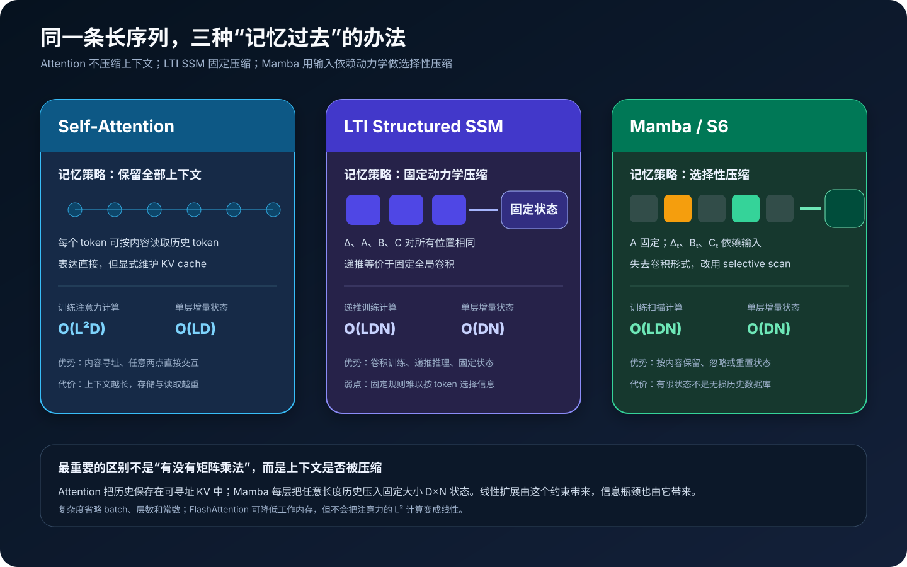
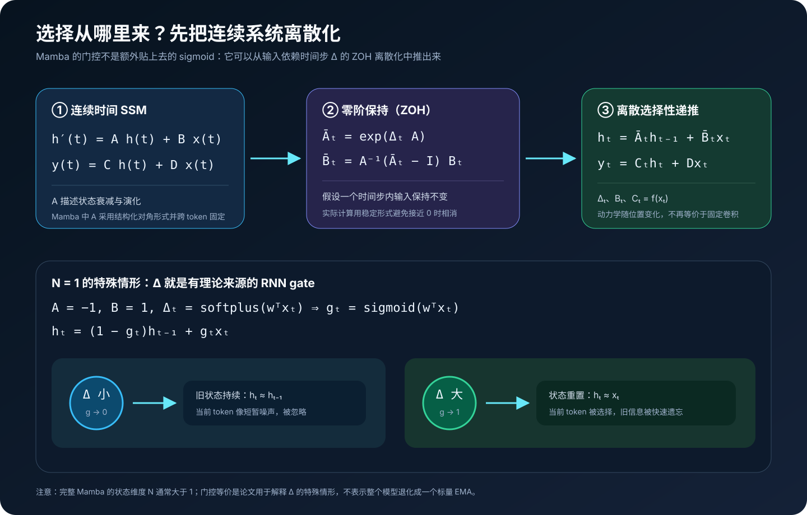
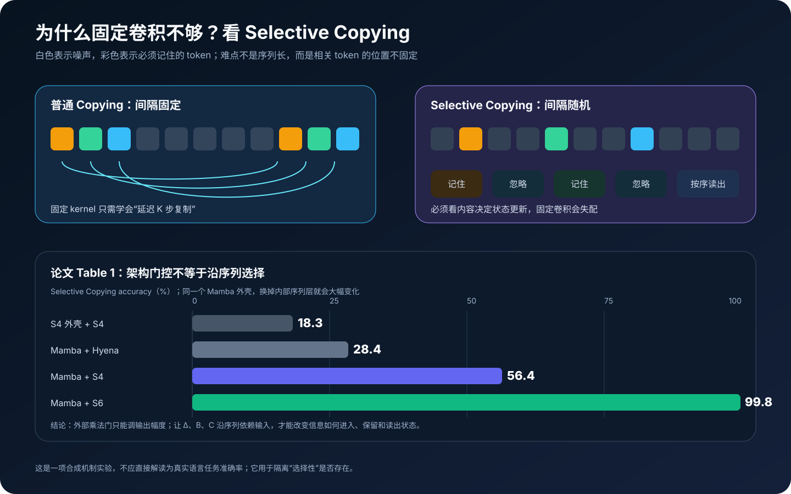
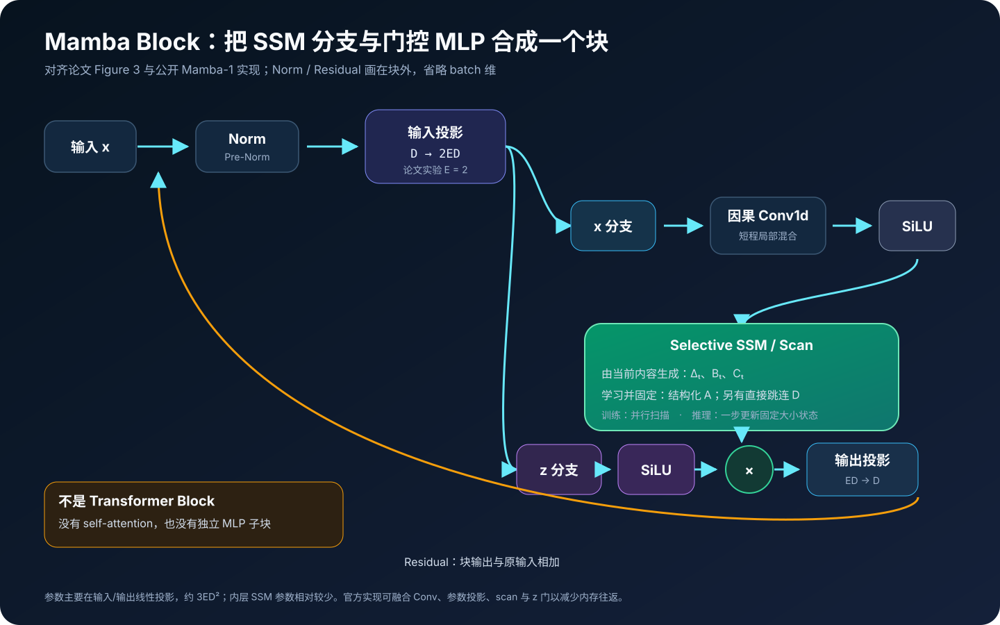
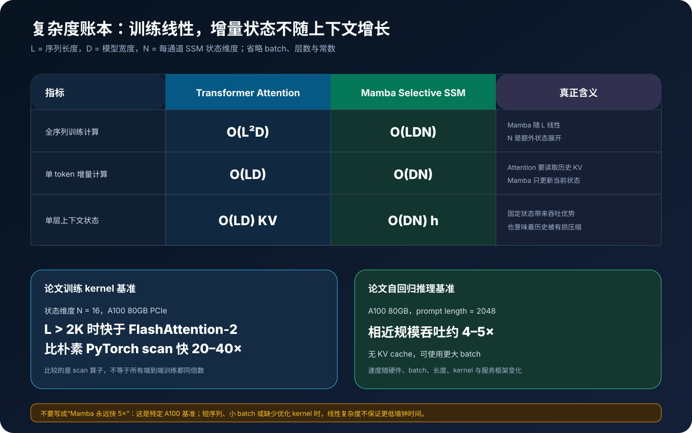
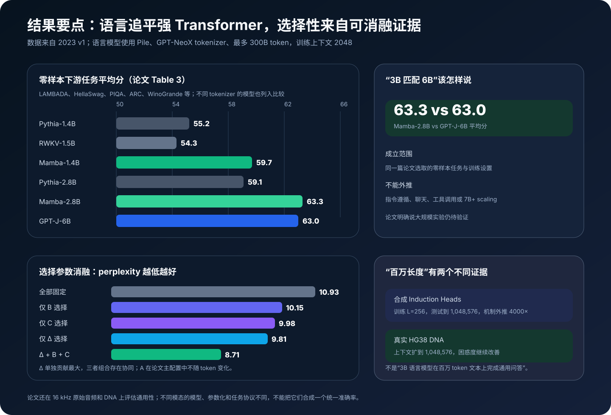

# Mamba 原理详解：从选择性状态空间到硬件感知并行扫描


> **论文**：*Mamba: Linear-Time Sequence Modeling with Selective State Spaces*<br>
> **作者**：Albert Gu、Tri Dao<br>
> **首次公开**：2023 年 12 月 1 日<br>
> **本文依据**：[arXiv v1（2023 原始版本）](https://arxiv.org/pdf/2312.00752v1)<br>
> **关键词**：State Space Model、S4 / S6、Selection、ZOH、Parallel Scan、Kernel Fusion

> [!IMPORTANT]
> 本文讨论的是 **Mamba-1（2023）**。arXiv 在 2024 年修订为 v2，官方仓库后来又加入 Mamba-2、Mamba-3；后续版本的 SSD、chunk scan 等概念不能倒灌成 2023 论文原理。文中的纯 Python 程序用于验证数学，不是官方 CUDA kernel，也不是可训练的大语言模型。

## 0. 先给结论

Mamba 并不是“把 Attention 换成一个普通 RNN”，它同时完成了三次改造：

1. **模型层面**：把传统线性时不变 SSM（LTI SSM）改成输入依赖的时变 SSM，让模型能按 token 选择写入、保留、遗忘和读出信息。
2. **算法层面**：输入依赖破坏了 SSM 的固定卷积形式，论文改用满足结合律的 parallel scan 训练，在自回归推理时使用固定大小状态递推。
3. **系统层面**：通过 kernel fusion、SRAM 内离散化与扫描、反向重计算，避免把巨大的中间状态写入 HBM。

最值得记住的公式不是含糊的

$$
h_t=A(x_t)h_{t-1}+B(x_t)x_t,
$$

因为它会让人误以为所有参数都随输入变化。Mamba-1 主配置更准确的表达是：

$$
\begin{aligned}
\Delta_t &= \operatorname{softplus}(s_\Delta(x_t)+b_\Delta),\\
B_t &= s_B(x_t),\qquad C_t=s_C(x_t),\\
\bar A_t &= \exp(\Delta_t A),\\
h_t &= \bar A_t h_{t-1}+\bar B_t x_t,\\
y_t &= C_t h_t+D x_t.
\end{aligned}
$$

其中 **$A$ 是学习得到但跨 token 固定的结构化参数**；随输入变化的是 $Delta_t、B_t、C_t$。论文消融也显示，$Delta$ 是最重要的选择参数。

---

## 1. Mamba 要解决的不是“长序列”三个字，而是上下文压缩



### 1.1 Attention：不压缩，所以好用也昂贵

Self-Attention 为每个 token 构造 Key / Value，之后的 token 可以按内容直接读取历史：

$$
\operatorname{Attention}(Q,K,V)
=\operatorname{softmax}\!\left(\frac{QK^\top}{\sqrt d}\right)V.
$$

它的优势是历史信息仍以 token 为单位存在，任意位置之间可以建立直接路径。代价是：

- 全序列注意力计算随长度近似为 $\mathcal O(L^2D)$；
- 自回归推理要保存随 $L$ 增长的 KV cache；
- 每生成一个 token，还要读取此前的 Key / Value。

FlashAttention 可以避免物化完整 $L\times L$ 注意力矩阵、显著减少 HBM 流量，但不会消除 attention score 的二次计算量，也不会让自回归 KV cache 变成常数大小。

### 1.2 递推模型：必须把过去压进有限状态

递推模型只有一个有限状态：

$$
h_t=f(h_{t-1},x_t).
$$

它的推理状态不随上下文无限增长，但这意味着历史经过了有损压缩。真正的问题于是变成：

> 在固定大小的状态里，应该留下什么、丢掉什么？

传统 LTI SSM 使用同一套动力学处理所有位置，适合连续规则和长程信号，却不擅长离散内容选择。Mamba 的 selection mechanism 正是一个可学习的压缩策略。

### 1.3 “线性时间”不等于“无限记忆”

对每层 Mamba，状态大小约为 $D\times N$，与已经读过的 token 数无关：

$$
h_t\in\mathbb R^{D\times N}.
$$

处理 1K 或 1M token 后，状态形状仍然相同。这带来线性扩展和无 KV cache 的优势，也构成信息瓶颈。Mamba 可以学习更聪明地压缩历史，却不能把有限状态解释成无损、可随机访问的历史数据库。

---

## 2. 从连续时间状态空间模型开始

### 2.1 连续系统

经典线性状态空间模型写作：

$$
\begin{aligned}
h'(t)&=Ah(t)+Bx(t),\\
y(t)&=Ch(t)+Dx(t).
\end{aligned}
$$

- $x(t)$：输入信号；
- $h(t)$：不可直接观察的隐藏状态；
- $A$：状态自身怎样衰减、振荡与传播；
- $B$：输入怎样写入状态；
- $C$：状态怎样被读出；
- $D$：输入到输出的直接 skip。

这套语言来自控制理论。深度学习里的 SSM 并不是直接数值求解任意微分方程，而是把连续参数离散化成适合序列计算的层。

### 2.2 零阶保持离散化

设一个 token 对应时间步长 $Delta$，并假设该步内输入保持常数（Zero-Order Hold，ZOH）：

$$
\bar A=\exp(\Delta A),
$$

$$
\bar B=(\Delta A)^{-1}
\left(\exp(\Delta A)-I\right)\Delta B.
$$

于是连续系统变成离散递推：

$$
h_t=\bar A h_{t-1}+\bar Bx_t,
\qquad
y_t=Ch_t+Dx_t.
$$

若 $A$ 可逆，$\bar B$ 也常写成：

$$
\bar B=A^{-1}(\bar A-I)B.
$$

实际数值代码不能在 $Delta A\approx0$ 时直接做 `exp(z) - 1`，否则会发生消减误差；最小实现使用 `expm1(z)`，并为 $A\to0$ 使用极限 $\bar B\to\Delta B$。

### 2.3 为什么 $A$ 要有结构？

若 $A\in\mathbb R^{N\times N}$ 完全稠密，每个通道每步都要做昂贵矩阵乘法。结构化 SSM 通常约束 $A$，Mamba 使用对角结构；于是 $A$ 可由 $N$ 个数表示，状态更新退化成高效的逐元素运算。

对 batch $B$、长度 $L$、模型宽度 $D$、状态维度 $N$：

| 张量 | 典型形状 |
|---|---|
| 输入 / 输出 | $(B,L,D)$ |
| 每个位置的隐状态 | $(B,D,N)$ |
| 若物化全部中间状态 | $(B,L,D,N)$ |
| 结构化 $A$ | $(D,N)$ |

状态展开 $N$ 提高了递推的表达容量。论文常用 $N=16$ 做扫描基准；这不是所有 Mamba 模型必须采用的宇宙常数。

---

## 3. LTI SSM 为什么可以变成卷积？

如果 $\bar A、\bar B、C$ 对所有位置都相同，从零状态展开递推：

$$
\begin{aligned}
y_0 &= C\bar Bx_0,\\
y_1 &= C\bar A\bar Bx_0+C\bar Bx_1,\\
y_2 &= C\bar A^2\bar Bx_0+C\bar A\bar Bx_1+C\bar Bx_2.
\end{aligned}
$$

定义固定卷积核：

$$
K=\left(
C\bar B,
C\bar A\bar B,
C\bar A^2\bar B,
\ldots
\right),
$$

便有：

$$
y=x*K.
$$

这就是 S4 等 LTI SSM 的递推—卷积对偶：

- 训练时已知整段序列，可用全局卷积并行；
- 自回归推理时每次只有一个 token，可用递推更新固定状态。

问题也藏在“固定”二字里：同一个 kernel 只能根据相对距离处理信息，不能看到一个 token 的内容后临时决定“这个要记住，接下来 500 个都忽略”。

---

## 4. Selection：让压缩规则依赖当前输入



### 4.1 S4 到 S6 的精确变化

论文 Algorithm 2 的核心张量是：

$$
\begin{aligned}
A &: (D,N) && \text{学习参数，跨位置固定},\\
B &: (B,L,N) && \leftarrow s_B(x),\\
C &: (B,L,N) && \leftarrow s_C(x),\\
\Delta &: (B,L,D) && \leftarrow
\operatorname{softplus}(b_\Delta+s_\Delta(x)).
\end{aligned}
$$

离散化后：

$$
\bar A,\bar B:(B,L,D,N).
$$

这使系统从 LTI（Linear Time Invariant）变成 LTV（Linear Time Varying）：它对状态 $h$ 仍然是线性的，但参数会随时间位置和输入变化。

> **常见错误**：写成“$A_t、B_t、C_t$ 都由当前 token 生成”。论文主配置没有令 $A$ 随输入变化。$A$ 通过 $\bar A_t=\exp(\Delta_tA)$ 间接产生时变转移；作者明确说令 $A$ selective 是可能的，但为了简化没有这样做。

### 4.2 $Delta_t$：决定时间流速，也决定保留与重置

当 $A=-1、B=1、N=1$ 且：

$$
\Delta_t=\operatorname{softplus}(w^\top x_t),
$$

ZOH 离散化给出：

$$
\bar A_t=e^{-\Delta_t}
=1-\sigma(w^\top x_t).
$$

令 $g_t=\sigma(w^\top x_t)$，递推就变成：

$$
h_t=(1-g_t)h_{t-1}+g_tx_t.
$$

这正是 RNN gate：

- $Delta_t$ 小，$g_t\to0$：状态持续，当前输入近似被忽略；
- $Delta_t$ 大，$g_t\to1$：旧状态被重置，模型聚焦当前输入。

完整 Mamba 有 $N>1$ 的状态展开和选择性 $B,C$，不能把整个模型简化成一个 EMA；这个特殊情形只是解释 $Delta$ 为什么具有门控作用。

### 4.3 $B_t$ 和 $C_t$：精细控制写入与读出

直觉上：

- $B_t$ 决定当前 $x_t$ 以怎样的方向写入状态；
- $C_t$ 决定当前输出从状态的哪些方向读取信息；
- $Delta_t$ 控制旧状态的保留时长和当前输入的整体权重。

论文的约 350M 语言模型消融结果为：

| Selective $Delta$ | Selective $B$ | Selective $C$ | Perplexity ↓ |
|---:|---:|---:|---:|
| 否 | 否 | 否 | 10.93 |
| 否 | 是 | 否 | 10.15 |
| 否 | 否 | 是 | 9.98 |
| 是 | 否 | 否 | 9.81 |
| 是 | 是 | 是 | **8.71** |

$Delta$ 单独贡献最大，三者组合进一步产生协同作用。这比“像 attention 一样内容感知”的口号更有证据价值。

---

## 5. Selective Copying：区分“架构门控”和“序列选择”



### 5.1 固定间隔复制存在捷径

普通 Copying task 把要记住的 token 放在固定位置，隔固定长度后要求复现。LTI 模型可以不理解内容，只学一个固定延迟 kernel。

Selective Copying 把相关 token 随机插进噪声：

```text
噪声  A  噪声 噪声 噪声  B  噪声  C  噪声 ... → A B C
```

相关 token 之间距离每次都变，固定卷积核无法只靠时间位置解决。模型必须按内容决定哪些输入进入状态、哪些噪声被忽略。

### 5.2 外部乘法门为什么不够？

有些架构在序列层外做：

$$
y=\operatorname{SequenceLayer}(x)\odot\sigma(z).
$$

它能调节当前位置输出，却未必改变信息沿序列轴怎样传播。真正的 selection 必须进入状态转移本身，即改变 $\bar A_t、\bar B_t$ 或读出 $C_t$。

论文 Table 1 中：

| 架构 | 内层序列算子 | Selective Copying 准确率 |
|---|---|---:|
| S4，无 gate | S4 | 18.3% |
| Mamba 外壳 | Hyena | 28.4% |
| Mamba 外壳 | S4 | 56.4% |
| Mamba 外壳 | S6 | **99.8%** |

所以 Mamba 的效果不能只归因于外部 SiLU gate 或块结构，选择性 SSM 是核心变量。

### 5.3 Induction Heads 测什么？

Induction Heads 合成任务要求关联回忆：历史出现过 `Harry → Potter`，再次看到 `Harry` 时应预测 `Potter`。

论文用长度 256 训练 2 层小模型，并测试到 $2^{20}=1,048,576$。Mamba 在该机制任务上保持正确，相当于外推到训练长度 4000 倍；attention 基线受显存限制只测试到 16K。

这证明 selective SSM 可以实现特定的上下文关联机制，不证明 2.8B Mamba 语言模型已经在百万 token 自然语言上完成通用检索和问答。

---

## 6. 为什么有了选择性，就不能再用固定卷积？

LTI 展开时，从 $x_k$ 到 $y_t$ 的权重只依赖距离 $t-k$：

$$
C\bar A^{t-k}\bar B.
$$

选择性 SSM 中，这条路径变成：

$$
C_t
\left(
\prod_{j=k+1}^{t}\bar A_j
\right)
\bar B_k.
$$

每个 $\bar A_j$ 都通过 $Delta_j$ 依赖沿途 token，$B_k$ 和 $C_t$ 也依赖输入。因此权重不再只是相对距离的函数，无法预先生成一个适用于所有样本的固定卷积核。

这带来一个看似矛盾的问题：

> 内容选择提高了表达力，却把训练从高度并行卷积拉回递推；怎样在 GPU 上跑快？

答案是 selective scan。

---

## 7. Scan 的数学：递推为什么仍然可以并行？

先看一维仿射递推：

$$
h_t=a_th_{t-1}+b_t.
$$

把每一步看成函数：

$$
T_t(h)=a_th+b_t.
$$

两步复合为：

$$
T_2(T_1(h))
=(a_2a_1)h+(a_2b_1+b_2).
$$

定义二元运算：

$$
(a_1,b_1)\otimes(a_2,b_2)
=\left(a_2a_1,a_2b_1+b_2\right).
$$

它不必满足交换律，但满足结合律：

$$
(T_3\circ T_2)\circ T_1
=T_3\circ(T_2\circ T_1).
$$

所以可以用并行前缀扫描计算：

$$
T_0,quad
T_1\circ T_0,quad
T_2\circ T_1\circ T_0,quad\ldots
$$

而每个前缀作用在零状态时，其偏置项就是对应 $h_t$。

### 7.1 元代码：顺序递推

```python
def sequential_scan(a_bar, input_term):
    state = zeros_like(input_term[0])
    states = []

    for a_t, b_t in zip(a_bar, input_term):
        state = a_t * state + b_t
        states.append(state)

    return states
```

它做 $mathcal O(L)$ 次工作，但依赖链深度也是 $mathcal O(L)$，单个 Python 循环无法充分利用 GPU。

### 7.2 元代码：并行 prefix scan

```python
def compose(left, right):
    # right(left(h))
    a_l, b_l = left
    a_r, b_r = right
    return a_r * a_l, a_r * b_l + b_r


prefixes = associative_prefix_scan(transforms, op=compose)
states = [prefix.bias for prefix in prefixes]  # 零初始状态
```

Blelloch scan 通过树形 up-sweep / down-sweep 把并行深度降到 $mathcal O(\log L)$，并保持 $mathcal O(L)$ 总工作量。论文的 GPU 实现还要结合分块、线程组织与内存层级；“满足结合律”只是算法并行化的入口。

---

## 8. Hardware-aware selective scan


### 8.1 朴素实现为什么会慢？

选择性离散参数和全部中间状态的逻辑形状可达：

$$
(B,L,D,N).
$$

若逐算子执行：

```text
生成 Δ/B/C → 写 HBM
离散化 Ā/B̄ → 写 HBM
扫描并保存每个 h_t → 写 HBM
读回 → 计算输出
```

算术并不复杂，真正昂贵的是反复搬运大张量。Selective scan 和 FlashAttention 一样，首先是一个 IO-aware 算法。

### 8.2 Kernel fusion：参数来了就地计算

论文的核心路径是：

1. 从较慢的 HBM 加载 $x、\Delta、A、B、C$；
2. 放入更快但更小的 SRAM；
3. 在片上完成离散化、扫描和读出；
4. 只把 $(B,L,D)$ 的最终输出写回 HBM。

这样就不需要在 HBM 里物化 $(B,L,D,N)$ 的全部离散参数和中间状态。

### 8.3 Recomputation：不保存中间状态，反向时重算

反向传播需要 $h_t$，但前向若保存每一个状态，显存就被 $N$ 倍放大。论文选择：

- 前向不保存全部 $h_t$；
- 反向从 HBM 重新加载输入和参数；
- 在 SRAM 中重算所需状态。

这增加部分计算，却减少更昂贵的内存流量。论文称融合后的 selective scan 内存需求可与 FlashAttention 优化的 Transformer 实现相当。

### 8.4 三种优化缺一不可

| 技术 | 解决的问题 |
|---|---|
| Parallel scan | 递推依赖链难以并行 |
| Kernel fusion / SRAM | 中间张量反复读写 HBM |
| Recomputation | 反向保存全部状态导致显存膨胀 |

因此只用 PyTorch 或 Python 写出正确递推，并不会自动获得论文中的训练速度。

---

## 9. Mamba Block 到底长什么样？



Mamba 把传统 SSM 架构中的序列层和独立 MLP 子块合并成一个同构 block。概念数据流是：

```text
x
├─ Norm → Input Projection ─┬─ x branch
│                           │    → causal Conv1d
│                           │    → SiLU
│                           │    → generate Δ, B, C
│                           │    → selective SSM / scan
│                           │
│                           └─ z branch → SiLU gate
│
└──────────────────────────────────────────── residual

scan_output × SiLU(z) → Output Projection → + x
```

### 9.1 输入投影与 expansion

输入宽度 $D$ 先扩展到内部宽度 $ED$，并生成两条分支。论文实验固定 $E=2$。

一个 block 的主要参数在三组线性映射中，近似：

$$
2ED^2+ED^2=3ED^2.
$$

内层 SSM 参数相对较少。论文用两个 Mamba block 对齐一个包含 MHA 和 MLP 的 Transformer layer 约 $12D^2$ 参数预算。

### 9.2 x 分支：局部混合 + 长程状态

- causal Conv1d 建模很短的局部模式；
- SiLU 提供非线性；
- 线性投影从当前位置内容生成 $Delta_t、B_t、C_t$；
- selective SSM 沿序列传播状态。

局部卷积不是全局长卷积。Mamba 的长程路径来自状态递推。

### 9.3 z 分支：输出门

另一条分支经过 SiLU 后，与 SSM 输出逐元素相乘，再投影回 $D$。这提供类似 SwiGLU 的内容门控。

必须区分：

- z 门控制当前 block 输出；
- selective $Delta/B/C$ 控制信息沿序列怎样进入、持续和读出。

### 9.4 没有 Attention，也没有独立 MLP Block

论文的 Mamba 端到端架构同构堆叠这些 block，在 block 之间加入标准 normalization 和 residual。语言模型训练配置采用改进的 Transformer++ recipe，包括 RMSNorm、无 linear bias、SwiGLU 风格设计和 AdamW 参数等。

“没有 MLP block”不等于没有线性层和非线性；输入/输出投影正是参数主体。

### 9.5 更贴近公开实现的元代码

```python
def mamba_block(hidden, recurrent_state=None, conv_state=None):
    residual = hidden
    hidden = norm(hidden)

    x, z = input_projection(hidden).chunk(2, dim=-1)
    x, conv_state = causal_depthwise_conv(x, conv_state)
    x = silu(x)

    delta_raw, B, C = parameter_projection(x)
    delta = softplus(delta_projection(delta_raw) + delta_bias)

    y, recurrent_state = selective_scan_or_step(
        x=x,
        delta=delta,
        A=-exp(A_log),       # 学习，但不随 token 变化
        B=B,
        C=C,
        D=D_skip,
        state=recurrent_state,
    )
    y = y * silu(z)
    return residual + output_projection(y), recurrent_state, conv_state
```

官方 fused kernel 会重新组织甚至合并这些操作；元代码表达语义，不表达真实性能边界。

---

## 10. 训练与推理复杂度怎样记账？



### 10.1 全序列训练

忽略 batch 和层数：

$$
\text{Attention compute}=\mathcal O(L^2D),
$$

$$
\text{Selective SSM compute}=\mathcal O(LDN).
$$

$N$ 是状态展开维度，通常远小于序列长度。若 $L$ 很短、kernel 启动和投影开销占主导，Mamba 的 Big-O 不保证实际墙钟时间更短。

### 10.2 自回归增量推理

Transformer 每层缓存历史 KV：

$$
\text{KV state}=\mathcal O(LD),
\qquad
\text{next-token attention}=\mathcal O(LD).
$$

Mamba 每层保存：

$$
\text{SSM state}=\mathcal O(DN),
$$

再加 causal Conv1d 的固定窗口缓存 $mathcal O(DK)$。二者都不随已经处理的上下文长度增长。

单 token 推理元代码：

```python
def selective_step(x_t, state, A, B_t, C_t, delta_t, D):
    A_bar, B_bar = zoh_discretize(delta_t, A, B_t)
    state = A_bar * state + B_bar * x_t
    y_t = contract(C_t, state) + D * x_t
    return y_t, state
```

这就是 Mamba 在长上下文、高 batch 自回归服务中的核心吸引力：没有随上下文增长的 KV cache。

### 10.3 论文速度数字的适用条件

论文 Figure 8 在 A100 80GB PCIe 上报告：

- 状态维度 $N=16$ 时，优化 scan 在序列超过 2K 后快于 FlashAttention-2；
- 比标准 PyTorch scan 快约 20–40 倍；
- prompt 长度 2048 的自回归测试中，相近规模 Mamba 吞吐约为 Transformer 的 4–5 倍；
- 无 KV cache 使 Mamba 可以使用更大 batch。

其中 6.9B Mamba 只用于未训练模型的吞吐测试，不能把它写成“论文训练了一个达到某种语言能力的 Mamba-6.9B”。

速度还依赖硬件、精度、batch、序列长度、生成长度、kernel 版本和服务框架。正确结论是“论文特定基准达到 4–5×”，而不是“Mamba 在所有设备上永远快 5×”。

---

## 11. 可运行的最小 selective scan

完整代码：[mamba_selective_scan_minimal.py](code/mamba_selective_scan_minimal.py)

它零第三方依赖，实现了：

- 对角连续 SSM 的 ZOH 离散化；
- 固定 $A$ 与输入依赖 $Delta/B/C$；
- 顺序 selective recurrence；
- 具有结合律的 Affine map 复合；
- work-efficient Blelloch inclusive scan；
- 顺序与并行扫描一致性测试；
- $Delta$ 与 sigmoid gate 的定理特例；
- 固定大小状态的检查。

运行：

```bash
python3 papers/to-2026/code/mamba_selective_scan_minimal.py
```

核心输出：

```text
sequential vs parallel scan max error: 5.551e-17
state scalars: D*N = 2*3 = 6
sequence length: 7; final state size is still 6
small delta / ignore: g=0.000335, state=7.0312
large delta / select: g=0.999665, state=99.9688
all checks passed
```

### 11.1 代码与官方实现的边界

教学代码使用 Python tuple 和标量循环，只验证数学。官方实现位于 `mamba_ssm` 的 selective scan 与 Mamba block 模块，使用 PyTorch、C++/CUDA/Triton 和融合 kernel。

| 教学代码 | 官方高性能实现 |
|---|---|
| 标量 `expm1` 离散化 | 向量化、混合精度与专用 kernel |
| Python Blelloch scan | GPU 分层并行 scan |
| 显式保存状态列表做检查 | 前向不物化全部状态，反向重算 |
| 固定玩具投影 | 可训练 Linear / Conv1d / Norm |
| 无 batch / autograd | 完整 batch、梯度和分布式训练 |

它不是 benchmark 程序；用它测速只会测出 Python 慢。

---

## 12. 实验结果应该怎样读？



### 12.1 语言建模设置

论文在 Pile 上做自回归语言模型训练：

- 模型宽度和深度大体对齐 GPT-3 规格；
- Mamba、Pythia 使用 GPT-NeoX tokenizer；
- 下游对比中的 Mamba、Pythia、RWKV 最多训练 300B token；
- Mamba 与 Pythia 训练上下文为 2048，RWKV 为 1024；
- scaling law 主要覆盖约 125M–1.3B，Table 3 下游模型扩到约 2.8B。

论文称 Mamba 是首个在该 scaling 设置下匹配强 Transformer++ recipe 的 attention-free 模型，且序列变长时趋势更有利。

### 12.2 零样本下游平均分

| 模型 | 参数量 | 论文任务平均分 |
|---|---:|---:|
| Pythia | 1.4B | 55.2 |
| RWKV | 1.5B | 54.3 |
| **Mamba** | **1.4B** | **59.7** |
| Pythia | 2.8B | 59.1 |
| **Mamba** | **2.8B** | **63.3** |
| GPT-J | 6B | 63.0 |
| OPT | 6.7B | 62.9 |

任务包括 LAMBADA、HellaSwag、PIQA、ARC-Easy、ARC-Challenge 和 WinoGrande 等。

“Mamba-3B 匹配两倍规模 Transformer”在这组零样本任务平均分上成立，但不能扩写为：

- 已证明所有 6B Transformer 都不如 Mamba；
- 已证明聊天、instruction tuning、RLHF、工具调用也同样领先；
- 已证明 7B、70B 的 scaling 仍保持同一优势。

论文自己明确把更大规模、下游交互方式和成熟生态列为未来问题。

### 12.3 DNA：真实数据上的百万长度

论文在 HG38 人类基因组上训练 causal model。上下文从 $2^{10}$ 增加到 $2^{20}$ 时，Mamba 的预训练 perplexity继续改善，而 HyenaDNA 变差；物种分类也受益于长上下文。

这支持“选择性可以过滤长序列噪声”的解释，也是摘要中“真实数据达到百万长度”的主要证据。它是 DNA 模型，不是 2.8B Pile 语言模型。

### 12.4 音频：选择性不是所有时候都越强越好

论文评估：

- YouTubeMix：4 小时、16 kHz 钢琴波形的 next-sample prediction；
- SC09：一秒钟数字语音的无条件生成。

SC09 上，6.1M Mamba-UNet 的 FID 为 `0.94`，优于 5.8M SaShiMi 的 `1.99`；24.3M Mamba 为 `0.67`。

但作者也指出 continuous–discrete spectrum 的 no-free-lunch：LTI SSM 对连续信号有强先验，selection 解决文本和 DNA 的离散内容问题，却可能干扰 LTI 擅长的连续任务。YouTubeMix 是论文唯一切换到复数参数化的实验。

---

## 13. 为什么 Mamba 有效？

### 13.1 它把“记忆容量”与“选择策略”分开

$N$ 提供每个通道的状态展开容量，$Delta/B/C$ 决定怎样使用容量。论文发现，只有 $B,C$ 也具有选择性时，增大 $N$ 才显著改善 perplexity；这说明大状态必须配合内容依赖写入和读出。

### 13.2 顺序偏置天然存在

Attention 本身是集合运算，需要位置编码表达顺序。递推按 $t=1,2,\ldots$ 更新，顺序已经进入计算图。标准 Mamba 不依赖 Transformer 式 RoPE 来建立基本序列顺序。

这不意味着它拥有无限精确的绝对位置；状态动力学和内容选择决定位置与距离信息如何被编码。

### 13.3 本地与全局路径互补

因果 Conv1d 快速提取邻域模式，SSM 状态负责跨长距离传播，z 门和 selective 参数提供内容调制。Mamba block 不是只有一条“神奇递推公式”。

### 13.4 算法与硬件共同成立

如果没有 selection，模型缺乏离散内容能力；如果没有 scan 和融合 kernel，selection 的时变递推又会在 GPU 上变慢。论文贡献恰恰是把表达力与硬件效率同时闭环。

---

## 14. 局限与争议

### 14.1 有限状态是强约束

Mamba 不保存逐 token KV。遇到需要精确回看大量互不相关细节、随机访问原文位置或逐项复制的任务，固定状态可能形成瓶颈。

Selection 能改善压缩策略，却不能违反信息容量约束。

### 14.2 线性扩展不等于零成本长上下文

训练仍需 $mathcal O(LDN)$ 计算；输入/输出投影、激活、优化器状态和数据加载也占资源。百万长度依然很贵，只是不再有 $L^2$ attention score。

### 14.3 论文语言规模仍有限

主要有质量结果的最大语言模型约 2.8B。6.9B 只做未训练吞吐实验。论文明确说尚未验证 7B 及以上 scaling，也未系统验证 instruction tuning、RLHF、in-context affordances 和量化生态。

### 14.4 速度依赖专用 kernel

缺少匹配硬件和编译环境时，Mamba 可能退回低效参考实现。其部署成熟度、算子支持和量化工具链不能仅从 Big-O 推断。

### 14.5 选择性存在模态取舍

离散文本、DNA 需要强内容过滤；连续音频可能更受益于平滑 LTI 动力学。论文没有证明同一选择配置在所有模态都最优。

### 14.6 Benchmark 不等于完整 LLM 能力

Pile perplexity 和少量 zero-shot 任务没有覆盖长文档问答、事实可靠性、对齐、安全、工具使用和多轮对话。2023 论文证明的是 backbone 潜力，不是完整聊天产品已经成熟。

---

## 15. 八个常见误区

### 误区一：$A、B、C$ 都由每个 token 动态生成

**纠正**：Mamba-1 主配置让 $Delta、B、C$ selective；结构化 $A$ 学习后跨位置固定。

### 误区二：Mamba 是 LSTM 换了名字

**纠正**：它与 gate/RNN 有数学联系，但使用状态展开、结构化连续 SSM 离散化和硬件感知 parallel scan。

### 误区三：Mamba 训练时只能串行 for 循环

**纠正**：时变递推不能变成固定卷积，但仿射状态转移满足结合律，可用并行 prefix scan。

### 误区四：线性时间来自“没有 Attention”这一句话

**纠正**：还需要控制 $A$ 结构、状态维度和中间状态内存，并实现融合 scan kernel。

### 误区五：Mamba 没有 MLP，所以没有非线性

**纠正**：没有独立 MLP 子块；block 仍包含 Linear、Conv1d、SiLU 和乘法门。

### 误区六：论文证明 3B 语言模型支持百万 token

**纠正**：百万长度证据来自小型 induction 合成任务和 DNA；语言模型训练上下文为 2048。

### 误区七：Mamba 在任何机器上都快 5×

**纠正**：4–5× 是特定 A100、prompt 2048、batch 扫描下的吞吐基准。

### 误区八：Mamba 已在 70B 规模全面替代 Transformer

**纠正**：2023 论文明确把 7B+ scaling 和下游生态列为未解决问题。

---

## 16. 实现与排错清单

### 16.1 数学正确性

- $A$ 应保持稳定，常参数化为 `A = -exp(A_log)`；
- $Delta$ 经过 softplus，保证正时间步；
- ZOH 在接近零处使用稳定计算；
- 检查 $B,C$ 的 broadcast 维度，不要误把 $D$ 和 $N$ 混掉；
- 顺序 reference scan 与优化 scan 的 forward / gradient 应对齐。

### 16.2 因果性

- Conv1d 必须 causal，不能读取未来；
- scan 顺序必须从左到右；
- 序列 packing 时要正确重置跨样本状态；
- chunk 推理的初始状态应等于上一个 chunk 的末状态。

### 16.3 数值稳定性

- 长序列下监控 $\bar A$ 是否下溢或状态爆炸；
- 累积与敏感参数可保留 FP32；
- 混合精度下单测长序列 forward 差异；
- 初始化 $Delta$ 时避免所有通道同时过快遗忘或完全冻结。

### 16.4 性能

- 不要在 Python 序列维写循环做正式训练；
- 检查是否真正加载 fused selective scan；
- profile HBM throughput、kernel launch、投影 GEMM，而不只算理论 FLOPs；
- 同时测短序列/长序列、小 batch/大 batch；
- 推理缓存应包含 SSM state 和 causal-conv state，且大小不随历史长度增长。

### 16.5 公平比较

```text
相同 tokenizer
相同训练 token 数
相近参数量与训练 FLOPs
相同上下文长度
相同精度、batch 与硬件
同等级优化 kernel
同时报告质量、吞吐、首 token 延迟和显存
```

若 Transformer 用 FlashAttention，而 Mamba 用 Python reference scan，或反过来，比较没有意义。

---

## 17. 怎样读论文与官方代码？

推荐顺序：

1. 论文第 2 节：先掌握连续 SSM、离散化、递推—卷积对偶；
2. 第 3.1 节：用 Selective Copying 理解为什么 LTI 不够；
3. Algorithm 2：逐个核对 $A、B、C、\Delta$ 的形状；
4. 第 3.3 节：把 parallel scan、SRAM、fusion、recompute 连起来；
5. Figure 3：再看 Mamba block 怎样合并 H3 和门控 MLP；
6. Table 6–10：用消融确认哪些设计真正贡献质量；
7. 官方仓库先读 Mamba-1 的 `mamba_simple.py`，再读 `selective_scan_interface.py` 和 CUDA 实现。

前置知识建议：

- RNN / GRU 的状态与 gate；
- 卷积与线性递推；
- 矩阵指数和 ZOH；
- S4 / S4D；
- associative scan；
- GPU HBM、SRAM 与 kernel fusion；
- FlashAttention 的 IO-aware 思路。

---

## 18. 总结

Mamba 的核心不应被压成“Attention 是平方，SSM 是线性”。更完整的逻辑链是：

```text
传统 LTI SSM
  → 固定动力学难以处理离散内容选择
  → 令 Δ、B、C 依赖输入
  → 获得选择性写入、遗忘与读出
  → 时变系统失去固定卷积形式
  → 用结合律 parallel scan 恢复训练并行
  → 用 SRAM fusion + recomputation 控制内存流量
  → 形成无 Attention、无独立 MLP 的同构 Mamba Block
```

一句话概括：

> Mamba 用固定大小状态压缩任意长度上下文，用输入依赖动力学决定压缩什么，再用硬件感知 scan 把这种递推变成可训练的高吞吐序列模型。

它证明了 Attention 并不是高质量通用序列建模的唯一道路；同时，固定状态的信息瓶颈、专用 kernel 依赖和当时有限的模型规模，也决定了它不是“免费无限上下文”或已经完成的 Transformer 终结者。

---

## 参考资料

1. Gu and Dao. [*Mamba: Linear-Time Sequence Modeling with Selective State Spaces*（arXiv v1, 2023）](https://arxiv.org/pdf/2312.00752v1)
2. arXiv. [论文页面与 v1 / v2 修订记录](https://arxiv.org/abs/2312.00752)
3. State Spaces. [Mamba 官方代码仓库](https://github.com/state-spaces/mamba)
4. State Spaces. [Mamba-1 selective scan 接口](https://github.com/state-spaces/mamba/blob/main/mamba_ssm/ops/selective_scan_interface.py)
5. State Spaces. [Mamba-1 Block 实现](https://github.com/state-spaces/mamba/blob/main/mamba_ssm/modules/mamba_simple.py)
6. Gu, Goel and Ré. [*Efficiently Modeling Long Sequences with Structured State Spaces*（S4）](https://arxiv.org/abs/2111.00396)
7. Blelloch. [*Prefix Sums and Their Applications*](https://www.cs.cmu.edu/~guyb/papers/Ble93.pdf)
8. Dao. [*FlashAttention-2: Faster Attention with Better Parallelism and Work Partitioning*](https://arxiv.org/abs/2307.08691)

> **版本说明**：本文数字和结构以 2023 年 v1 为主。官方仓库当前主分支包含后续架构与安装方式；复核 Mamba-1 时应锁定论文版本和相应历史代码，避免把 Mamba-2 / Mamba-3 的实现当成 Algorithm 2。
