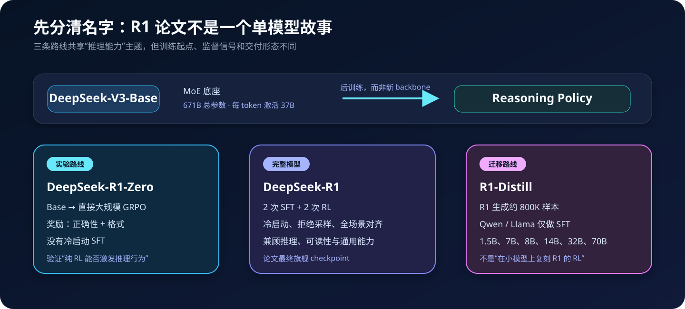
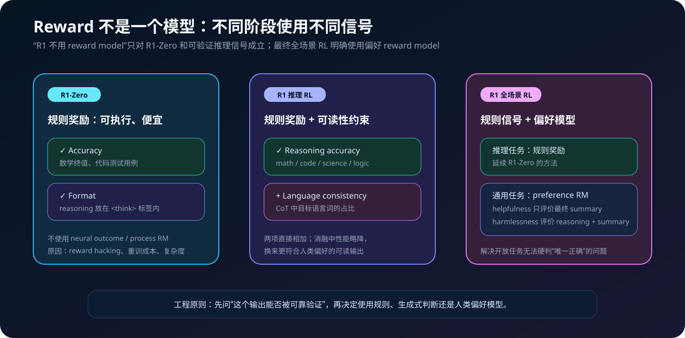
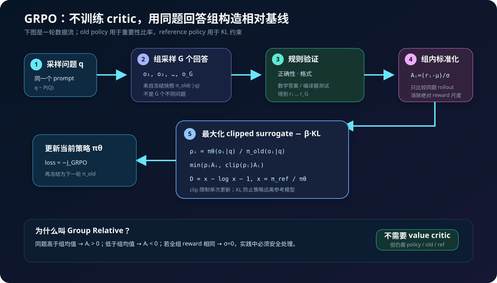
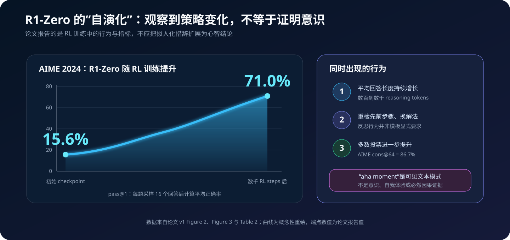
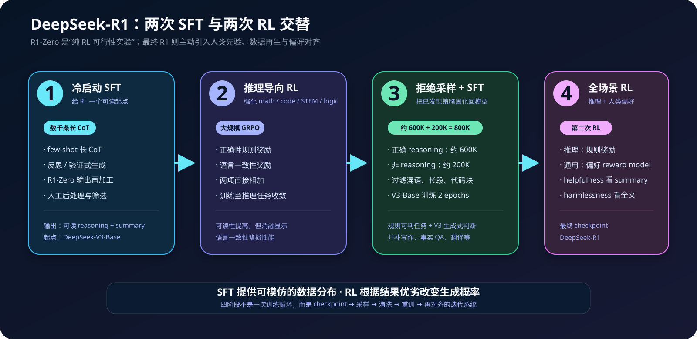
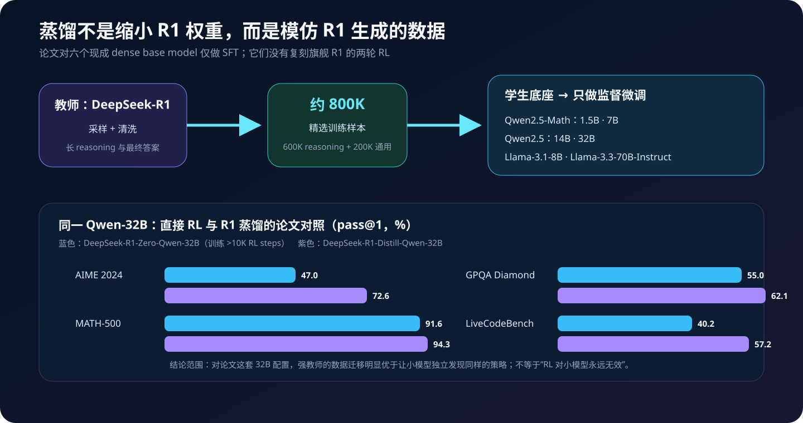
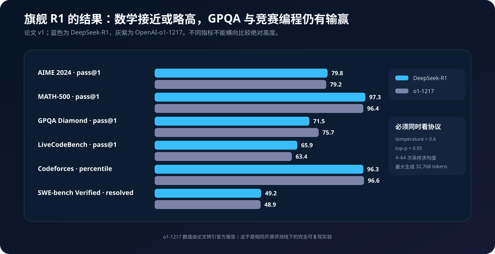

# DeepSeek-R1 原理详解：从纯 RL、GRPO 到四阶段训练与推理蒸馏


> **论文**：*DeepSeek-R1: Incentivizing Reasoning Capability in LLMs via Reinforcement Learning*<br>
> **作者**：DeepSeek-AI<br>
> **首次公开**：2025 年 1 月 22 日<br>
> **本文依据**：[arXiv v1（2025 原始版本）](https://arxiv.org/pdf/2501.12948v1)<br>
> **官方资源**：[GitHub / 模型与使用说明](https://github.com/deepseek-ai/DeepSeek-R1)<br>
> **关键词**：Reasoning Model、RLVR、GRPO、Cold Start、Rejection Sampling、Distillation、Test-time Compute

> [!IMPORTANT]
> arXiv 页面在 2026 年新增了 v2；这篇博客按文件名所指的 **2025 年论文 v1** 解读，避免把后续修订或社区复现倒灌进原始结论。论文没有公开训练数据全集、完整超参数、分布式训练代码与算力账单，因此本文的程序只能复现核心数学和数据流，不能复刻 DeepSeek-R1 checkpoint。

## 0. 先给结论

DeepSeek-R1 论文最重要的价值，不是发明一个新 Transformer 层，而是公开了一条推理模型的后训练路线：

1. **R1-Zero 证明可行性**：从 DeepSeek-V3-Base 出发，不做冷启动 SFT，直接使用大规模 GRPO 和可验证奖励；AIME 2024 的 pass@1 从 15.6% 提升到 71.0%。
2. **R1 修正纯 RL 的产品缺陷**：用少量长 CoT 冷启动，再交替进行推理 RL、拒绝采样 SFT 与全场景 RL，改善 R1-Zero 的可读性和语言混杂问题。
3. **GRPO 用“同题组内平均”替代 learned value baseline**：同一道题采样多个回答，按组内 reward 均值和标准差计算相对优势，从而不必训练 PPO 式 critic。
4. **奖励设计比一句“用了 RL”更关键**：数学终值、代码测试和输出格式可以被规则可靠验证；最终 R1 在通用开放任务上仍使用偏好 reward model。
5. **蒸馏把已发现的推理轨迹迁移给小模型**：论文用约 800K 条 R1 数据对六个 Qwen / Llama 模型做 SFT；这些 Distill 模型并没有执行旗舰 R1 的完整 RL 流水线。
6. **长 CoT 是受奖励塑造的可见行为**：训练中确实出现了重检、反思和延长计算等策略，但“aha moment”不是模型拥有意识或内在体验的证据。

一句话概括：

> R1-Zero 用纯 RL 探索“推理策略能否自己长出来”，R1 用 SFT 与 RL 的迭代把它变得更强、更可读，R1-Distill 再把已发现的策略压进更小的 dense model。

---

## 1. 先分清三个名字



| 名称 | 起点 | 主要训练 | 是否有冷启动 SFT | 论文中的角色 |
|---|---|---|---:|---|
| DeepSeek-R1-Zero | DeepSeek-V3-Base | 大规模 GRPO | 否 | 验证纯 RL 能否激发推理行为 |
| DeepSeek-R1 | DeepSeek-V3-Base | 2 次 SFT + 2 次 RL | 是 | 最终旗舰 reasoning model |
| DeepSeek-R1-Distill-* | Qwen / Llama | 对约 800K 条 R1 数据做 SFT | 来自教师数据 | 把推理模式迁移给 1.5B–70B dense model |

三个常见误读需要先消除：

- **R1-Zero 不等于 R1**。前者是纯 RL 实验，后者主动引入人类先验、清洗数据和偏好对齐。
- **R1-Distill 不是 R1 的量化版**。它们使用不同的 Qwen / Llama 底座，通过数据模仿教师输出。
- **R1 不是新的 backbone 名称**。旗舰 R1 与 R1-Zero 都继承 DeepSeek-V3-Base 的 MoE 架构；论文 Table 4 报告 671B 总参数、每 token 激活 37B。

因此，理解这篇论文的重点应该从“模型层长什么样”转向：

$$
\text{prompt 分布}
\rightarrow \text{group rollouts}
\rightarrow \text{verifiable rewards}
\rightarrow \text{policy update}
\rightarrow \text{data regeneration}.
$$

---

## 2. R1-Zero：先做一个不带 SFT 的受控实验

### 2.1 实验问题

过去的 reasoning 后训练通常先让模型模仿大量高质量 CoT，再用 RL 或偏好优化继续增强。这样得到强模型后，很难回答一个因果问题：

> 推理行为究竟来自人工示范，还是可以仅由结果奖励激发？

R1-Zero 的控制变量设计很直接：

```text
DeepSeek-V3-Base
    ↓ 不做 reasoning SFT
同一道题采样一组完整回答
    ↓
规则检查答案正确性与格式
    ↓
GRPO 更新策略
```

它不是“完全没有监督信息”。题目本身、答案验证器、输出标签和 reward 都在定义目标；准确说法应是：

> R1-Zero 没有把人类标注的 reasoning trajectory 作为冷启动 SFT 数据，但仍有任务、规则和奖励监督。

### 2.2 极简训练模板

论文给 R1-Zero 的模板只要求两个结构区域：

```xml
<think>
reasoning process here
</think>
<answer>
answer here
</answer>
```

研究者特意没有写入“必须反思”“必须自检”“必须尝试第二种解法”等内容偏置。这样，后续出现的重检或换策略行为就不能简单归因于模板照抄。

但要注意：这只能说明模板没有显式规定这些行为，不足以证明模型的表征里从未在预训练阶段见过类似文本模式。

---

## 3. Reward：R1-Zero 的关键是硬验证，不是神秘评分器



### 3.1 Accuracy reward

对于结果确定的数学题，先把答案规范化，再与标准答案比较；对于代码题，可以编译并执行预定义测试：

$$
r_{\text{acc}}(q,o)=
\begin{cases}
1,&\operatorname{verify}(q,o)=\text{true},\\
0,&\text{otherwise}.
\end{cases}
$$

这种奖励的优势是：

- 直接对应任务成功；
- 大规模运行成本相对低；
- 不会因为回答“看起来很像正确答案”就给高分；
- 规则明确时，比开放式偏好评分更难被语言风格欺骗。

但 verifier 并不天然可靠。工程上至少要处理：

- 数学答案的等价形式，如 `1/2`、`0.5` 与 $\frac12$；
- 单位、区间、集合、多解和数值容差；
- 代码沙箱、超时、内存上限和隐藏测试；
- benchmark 数据泄漏；
- 模型是否能注入或绕过解析器。

“规则奖励”不是随手写一个正则表达式，而是一套安全、稳定、可审计的验证基础设施。

### 3.2 Format reward

论文的格式奖励要求 reasoning 位于 `<think>...</think>` 标签中。它解决的是机器可解析性：

$$
r_{\text{format}}(o)
=\mathbb 1[\text{reasoning 区域符合指定结构}].
$$

R1-Zero 可把两个信号合并为：

$$
r_i=r_{\text{acc},i}+r_{\text{format},i}.
$$

论文没有在 v1 中公开所有权重、采样规模和训练超参数，因此不应把上式中的等权相加当作完整复现配置；它只是最忠实的概念表达。

### 3.3 为什么 R1-Zero 不用神经 reward model

论文给出的理由是：大规模 RL 中，神经 reward model 可能被 reward hacking；反复重训 reward model 也会增加资源开销和流水线复杂度。

这不是在说“神经 reward model 永远没用”。最终 R1 面对写作、通用问答和安全等无法硬判唯一正确答案的任务时，仍然使用 reward model 捕获人类偏好。

更准确的决策规则是：

| 输出能否可靠自动判定 | 更自然的奖励 |
|---|---|
| 数学终值、代码测试、结构格式 | 规则 / 执行器 |
| 写作质量、帮助性、风格 | 偏好 reward model 或人类判断 |
| 安全性、潜在伤害 | 全响应级安全判断与红队评估 |
| 中间推理步骤是否正确 | PRM 有吸引力，但标注、粒度与 hacking 很难 |

---

## 4. GRPO：同一道题里，谁比同伴更好



### 4.1 为什么不用普通监督交叉熵

SFT 已知目标序列 $y^*$，优化：

$$
\mathcal L_{\text{SFT}}
=-\sum_t\log\pi_\theta(y_t^*\mid q,y_{<t}^*).
$$

RL 阶段没有一条必须逐 token 模仿的标准 CoT。模型可以尝试许多路径，只要最终结果和约束更好，就应提高那条轨迹的概率：

$$
\max_\theta\;
\mathbb E_{o\sim\pi_\theta(\cdot\mid q)}[r(q,o)].
$$

真正困难的是：只得到一个完整回答的 reward，怎样判断这条采样轨迹比模型自己的正常水平好多少？

### 4.2 同题组采样

对问题 $q$，从旧策略 $\pi_{\theta_{\text{old}}}$ 采样 $G$ 个回答：

$$
\{o_1,o_2,\ldots,o_G\}
\sim\pi_{\theta_{\text{old}}}(\cdot\mid q).
$$

验证器得到一组 reward：

$$
\{r_1,r_2,\ldots,r_G\}.
$$

GRPO 用组内统计量计算优势：

$$
A_i=
\frac{r_i-\operatorname{mean}(r_1,\ldots,r_G)}
{\operatorname{std}(r_1,\ldots,r_G)}.
$$

直觉非常简单：

- $A_i>0$：这个回答比同题的组内平均更好，提高其概率；
- $A_i<0$：这个回答更差，降低其概率；
- 标准化后 reward 的平移与统一缩放不再直接改变优势尺度。

所谓 **Group Relative**，就是“不拿这道难题的 0 分去和另一道简单题的 1 分直接比较”，而是在同题 rollouts 内构造相对基线。

### 4.3 GRPO 与 PPO 的关系

PPO 常用一个学习得到的 value function $V_\phi(s)$ 估计 baseline，因此除了 policy 还要训练 critic。GRPO 用同题组均值近似 baseline：

$$
\underbrace{r_i-V_\phi(q)}_{\text{PPO 风格}}
\quad\longrightarrow\quad
\underbrace{r_i-\bar r_q}_{\text{GRPO 组内相对值}}.
$$

这省掉了 critic 的参数、训练和显存，但“不需要 critic”不等于只保留一份模型：

- 当前策略 $\pi_\theta$：正在更新；
- 旧策略 $\pi_{\theta_{\text{old}}}$：产生 rollouts，并构造重要性比率；
- 参考策略 $\pi_{\text{ref}}$：用于 KL 约束，防止策略漂移过远。

工程实现可以通过冻结快照、权重共享或按需计算降低开销，但概念角色不能混为一谈。

### 4.4 裁剪目标

论文 v1 在回答级写出：

$$
\rho_i(\theta)=
\frac{\pi_\theta(o_i\mid q)}
{\pi_{\theta_{\text{old}}}(o_i\mid q)}.
$$

GRPO 目标为：

$$
\begin{aligned}
J_{\text{GRPO}}(\theta)
=\mathbb E\Bigg[
\frac1G\sum_{i=1}^G
\Big(&\min\big(
\rho_iA_i,
\operatorname{clip}(\rho_i,1-\varepsilon,1+\varepsilon)A_i
\big)\\
&-\beta D_{\mathrm{KL}}(\pi_\theta\Vert\pi_{\mathrm{ref}})
\Big)\Bigg].
\end{aligned}
$$

其中：

- $\rho_i$ 校正“rollout 由旧策略生成、梯度却更新当前策略”的分布差异；
- clip 限制一步中概率比变化过大；
- $\beta$ 控制保守程度；
- 实际优化器通常最小化 $\mathcal L=-J_{\text{GRPO}}$。

若 $A_i>0$，目标希望提高该回答概率，但最高只按 $1+\varepsilon$ 的裁剪比率获益；若 $A_i<0$，则相反。这就是 PPO 式 clipped surrogate 的核心稳定机制。

### 4.5 论文中的 KL 项

论文给出单样本估计：

$$
x_i=\frac{\pi_{\mathrm{ref}}(o_i\mid q)}{\pi_\theta(o_i\mid q)},
\qquad
D_i=x_i-\log x_i-1.
$$

因为对 $x>0$ 有 $x-\log x-1\ge0$，两策略一致时该项为 0。它惩罚当前策略偏离参考策略。

不要把“一个采样回答上的 $D_i$”误解为已经精确求出了两个超大语言分布的完整 KL；它是可由样本计算、其期望对应目标的估计形式。

### 4.6 一个经常被忽略的退化情况

若一组回答全部正确或全部错误：

$$
r_1=r_2=\cdots=r_G
\quad\Rightarrow\quad
\operatorname{std}(r)=0.
$$

论文公式没有展示数值保护。实现必须加 $\epsilon$ 或在零方差时令优势全为 0，否则会除零：

```python
def group_relative_advantages(rewards, eps=1e-8):
    mean = sum(rewards) / len(rewards)
    var = sum((r - mean) ** 2 for r in rewards) / len(rewards)
    std = var ** 0.5
    if std < eps:
        return [0.0] * len(rewards)
    return [(r - mean) / std for r in rewards]
```

这也暴露 GRPO 的一个性质：若题目对当前模型过易或过难、组内没有 reward 差异，这一组几乎不给 policy-gradient 学习信号。任务难度调度和采样多样性因此非常重要。

---

## 5. 从伪代码看一轮训练

下面是比“generate → reward → backward”更接近真实职责划分的元代码：

```python
policy = load_trainable_policy("DeepSeek-V3-Base")
reference = freeze(copy(policy))

for iteration in range(num_iterations):
    old_policy = freeze(copy(policy))

    for prompts in prompt_loader:
        # 每个 prompt 都要生成一组 G 个完整回答
        grouped_rollouts = old_policy.generate(
            prompts,
            num_return_sequences=group_size,
            do_sample=True,
        )

        rewards = verifier.score(grouped_rollouts)  # accuracy + format
        advantages = normalize_within_each_prompt_group(rewards)

        new_logps = policy.log_prob(grouped_rollouts)
        old_logps = old_policy.log_prob(grouped_rollouts)
        ref_logps = reference.log_prob(grouped_rollouts)

        ratio = exp(new_logps - old_logps)
        surrogate = minimum(
            ratio * advantages,
            clip(ratio, 1 - epsilon, 1 + epsilon) * advantages,
        )
        kl = exp(ref_logps - new_logps) - (ref_logps - new_logps) - 1

        loss = -(surrogate - beta * kl).masked_mean()
        optimizer.zero_grad()
        loss.backward()
        clip_grad_norm_(policy.parameters(), max_grad_norm)
        optimizer.step()
```

生产系统还需要本文无法从论文补齐的部分：

- rollout engine 与训练 engine 的并行调度；
- 变长序列 padding / token mask；
- 回答级 reward 怎样广播到 token；
- MoE expert parallel、tensor parallel 与数据并行；
- 旧策略同步频率、梯度累计与优化器状态；
- 超长输出的显存、吞吐和 straggler 管理；
- verifier 超时、异常和沙箱隔离；
- 数据去重、污染检测与审计。

所以几十行伪代码能解释算法，却不能代表训练 R1 只需几十行代码。

---

## 6. R1-Zero 的“自演化”到底观察到了什么



### 6.1 AIME 从 15.6% 到 71.0%

论文在 AIME 2024 上为每题采样 16 个回答并计算平均准确率，报告 R1-Zero 的 pass@1 从初始 15.6% 上升到 71.0%。再用 64 个样本多数投票，cons@64 达到 86.7%。

Table 2 的结果为：

| 模型 | AIME pass@1 | AIME cons@64 | MATH-500 | GPQA Diamond | LiveCodeBench | Codeforces rating |
|---|---:|---:|---:|---:|---:|---:|
| OpenAI-o1-mini | 63.6 | 80.0 | 90.0 | 60.0 | 53.8 | 1820 |
| OpenAI-o1-0912 | 74.4 | 83.3 | 94.8 | 77.3 | 63.4 | 1843 |
| DeepSeek-R1-Zero | 71.0 | 86.7 | 95.9 | 73.3 | 50.0 | 1444 |

这组数据支持“纯 RL 显著增强了可验证推理任务”，但不支持“R1-Zero 全面超过 o1”。它在 MATH-500 与多数投票上很强，在 LiveCodeBench 和 Codeforces 上仍明显落后。

### 6.2 回答为什么越来越长

训练过程中，R1-Zero 的平均响应长度持续增长。模型获得了更多机会去：

- 展开中间计算；
- 回看前一步；
- 发现矛盾后重算；
- 尝试替代路径；
- 在最终答案前投入更多 test-time compute。

但 reward 并没有直接写成“越长越好”。更合理的解释是：在当时的任务分布和策略状态下，增加有效计算提高了答对概率，于是长轨迹作为一种工具被间接强化。

这不保证长度会无限增长，也不代表任何长输出都更强。若轨迹只是重复、绕圈或填充，长度反而会增加延迟而没有准确率收益。

### 6.3 “aha moment”应该怎样读

论文展示一个中间 checkpoint：模型生成类似“等一下，让我重新检查”的文本，转而重算先前步骤。它说明在没有把“反思”写进模板的情况下，结果奖励可以提高某些重检行为的概率。

最稳健的表述是：

> 训练中涌现出可观察的自我修正语言模式和策略切换行为。

不应直接推导为：

- 模型产生主观惊悟；
- 模型理解自己正在思考；
- 所有重检文本都对应可靠的内部验证；
- 拟人化语气本身就是推理能力。

行为证据很有价值，但行为描述与心智归因必须分开。

### 6.4 为什么还需要 R1

R1-Zero 的问题同样明显：

- 输出可读性差；
- 中英文或其他语言混杂；
- 可能出现重复和混乱结构；
- 只靠可验证任务，难以保持完整通用助手能力。

这正是最终 R1 从“纯 RL 实验”转向“四阶段工程流水线”的原因。

---

## 7. DeepSeek-R1 的四阶段训练流水线



论文把完整 R1 概括为 **两个 SFT 阶段 + 两个 RL 阶段**。

### 7.1 阶段一：数千条长 CoT 冷启动 SFT

研究者从多条路径收集数千条数据：

- 用长 CoT 作为 few-shot 示例；
- 直接提示模型生成带反思、验证的详细答案；
- 整理 R1-Zero 的可读输出；
- 人工后处理与标注。

冷启动数据使用更可读的 `reasoning_process + summary` 结构，强调最终摘要和用户阅读体验。

它的作用不是替代 RL，而是：

1. 避免从 base model 直接 RL 的早期不稳定期；
2. 先建立可读输出格式；
3. 用少量人类先验加速搜索；
4. 为下一阶段准备更好的 actor。

因此，R1 不能被描述为“完全不靠监督数据”。**R1-Zero** 才是不经冷启动 SFT 的纯 RL 实验。

### 7.2 阶段二：推理导向 RL

在冷启动 checkpoint 上应用与 R1-Zero 类似的大规模 RL，重点任务包括：

- coding；
- mathematics；
- science；
- logic reasoning。

这一阶段额外加入语言一致性奖励：CoT 中目标语言词语的占比。

$$
r_{\text{lang}}
=\frac{\text{CoT 中目标语言词数}}
{\text{CoT 总词数}}.
$$

最终把推理正确性与语言一致性直接相加：

$$
r=r_{\text{reasoning-accuracy}}+r_{\text{lang}}.
$$

论文消融观察到语言对齐让性能略有下降，但输出更符合人类可读性偏好。这是一个典型多目标权衡：单一 benchmark 正确率不是产品质量的全部。

### 7.3 阶段三：拒绝采样，构造约 800K 数据，再做 SFT

当推理 RL 接近收敛后，用该 checkpoint 对每个 prompt 采样多个回答，只留下正确、可读的轨迹：

```text
RL checkpoint
    ↓ 每题生成多个回答
规则 verifier / 生成式判断
    ↓ 只保留正确候选
过滤混合语言、超长段落、代码块等混乱输出
    ↓
约 600K reasoning samples
```

这一阶段把题目范围扩展到部分不能由规则直接判断的任务：论文会把 ground truth 与模型预测交给 DeepSeek-V3 做生成式判断。

然后加入约 200K 条非推理数据：

- writing；
- factual QA；
- self-cognition；
- translation；
- 其他来自 DeepSeek-V3 流水线的数据。

简单问候不强行附带 CoT；某些复杂非推理任务才先生成潜在推理。这点很重要：R1 的目标不是让任何请求都输出冗长思维链。

最终：

$$
600\text{K reasoning}+200\text{K non-reasoning}
\approx800\text{K samples}.
$$

论文用这批数据对 DeepSeek-V3-Base 进行 **2 个 epoch 的 SFT**。这是把 RL 搜索出的有效行为重新固化进干净的监督分布，同时恢复写作和通用任务能力。

### 7.4 阶段四：面向所有场景的第二轮 RL

最后一轮同时处理两类目标：

- 推理 prompt：继续使用数学、代码、逻辑等规则奖励；
- 通用 prompt：沿用 DeepSeek-V3 的偏好数据分布和 reward model。

偏好评估又被有意拆开：

- **helpfulness**：只评价最终 summary，尽量避免干扰底层 reasoning；
- **harmlessness**：评价 reasoning 与 summary 的完整响应，识别全链路风险。

所以一句“DeepSeek-R1 只用规则奖励，不用 reward model”是不准确的。正确范围是：

> R1-Zero 的主要奖励是规则化 accuracy 与 format；完整 R1 的最终全场景 RL 对通用任务使用偏好 reward model。

---

## 8. 拒绝采样与 RL 的职责不同

两者都依赖 reward / verifier，但优化对象不同：

| 方法 | 输入 | 做什么 | 改变什么 |
|---|---|---|---|
| GRPO | 一组在线 rollouts + rewards | 相对提高高 reward 轨迹概率 | policy 分布 |
| Rejection sampling | 多个候选回答 | 丢弃错误或不可读样本 | 训练数据分布 |
| SFT | 已筛选的 `(prompt, response)` | 逐 token 模仿保留轨迹 | policy 分布 |

它们组合成一个迭代闭环：

$$
\underbrace{\text{RL 探索更好策略}}_{\text{online optimization}}
\rightarrow
\underbrace{\text{拒绝采样生成更好数据}}_{\text{data curation}}
\rightarrow
\underbrace{\text{SFT 固化并扩散行为}}_{\text{behavior cloning}}.
$$

只做拒绝采样不会让模型参数自动改变；只做 SFT 又局限于已经采到的轨迹；只做 RL 则可能牺牲可读性与通用能力。R1 的工程贡献恰恰在于三者迭代。

---

## 9. 蒸馏：让小模型学习大模型已经找到的路径



### 9.1 论文实际做了什么

论文使用阶段三的约 800K 条精选样本，直接 fine-tune 六个开源底座：

| Distill 模型 | 学生底座 |
|---|---|
| DeepSeek-R1-Distill-Qwen-1.5B | Qwen2.5-Math-1.5B |
| DeepSeek-R1-Distill-Qwen-7B | Qwen2.5-Math-7B |
| DeepSeek-R1-Distill-Qwen-14B | Qwen2.5-14B |
| DeepSeek-R1-Distill-Qwen-32B | Qwen2.5-32B |
| DeepSeek-R1-Distill-Llama-8B | Llama-3.1-8B |
| DeepSeek-R1-Distill-Llama-70B | Llama-3.3-70B-Instruct |

论文明确说明：这些 distilled model **只做 SFT，没有增加 RL 阶段**。因此它们学习的是 R1 已采到的长推理轨迹和答案分布，而不是自己从规则 reward 中重新发现策略。

### 9.2 为什么强教师蒸馏能胜过小模型直接 RL

论文还在 Qwen-32B-Base 上训练超过 10K 个 RL steps，得到 DeepSeek-R1-Zero-Qwen-32B：

| 模型 | AIME pass@1 | AIME cons@64 | MATH-500 | GPQA Diamond | LiveCodeBench |
|---|---:|---:|---:|---:|---:|
| R1-Zero-Qwen-32B（直接 RL） | 47.0 | 60.0 | 91.6 | 55.0 | 40.2 |
| R1-Distill-Qwen-32B（R1 数据 SFT） | 72.6 | 83.3 | 94.3 | 62.1 | 57.2 |

在这组实验中，蒸馏全面更强。原因可以从搜索难度理解：

- 小模型直接 RL 必须自己探索出反思、验证和长程策略；
- 强教师已经完成昂贵搜索，给出高质量行为轨迹；
- 学生用 token-level SFT 获得比稀疏终局 reward 密集得多的监督；
- 800K 数据覆盖了推理与通用任务，分布比只做可验证 RL 更丰富。

不过结论范围不能扩大成“RL 对小模型无用”。论文也提到在 distilled models 上继续 RL 能再提升，只是没有在 Table 5 中报告该路线。合理结论是：

> 在论文的 32B 对照里，从更强模型蒸馏是一条比让小模型从零进行同类大规模 RL 更经济、更有效的起点。

### 9.3 六个 Distill 模型的结果

| 模型 | AIME pass@1 | cons@64 | MATH-500 | GPQA Diamond | LiveCodeBench | Codeforces rating |
|---|---:|---:|---:|---:|---:|---:|
| Qwen-1.5B | 28.9 | 52.7 | 83.9 | 33.8 | 16.9 | 954 |
| Qwen-7B | 55.5 | 83.3 | 92.8 | 49.1 | 37.6 | 1189 |
| Qwen-14B | 69.7 | 80.0 | 93.9 | 59.1 | 53.1 | 1481 |
| Qwen-32B | 72.6 | 83.3 | 94.3 | 62.1 | 57.2 | 1691 |
| Llama-8B | 50.4 | 80.0 | 89.1 | 49.0 | 39.6 | 1205 |
| Llama-70B | 70.0 | 86.7 | 94.5 | 65.2 | 57.5 | 1633 |

参数更多通常更强，但底座、训练数据与任务适配也在起作用；不能从这六个点推出统一的参数缩放曲线。

---

## 10. Test-time compute：训练学到“何时多算”，推理才真正花算力

Reasoning model 的两种 scaling 要分开：

### 10.1 Training-time scaling

- 采更多 rollouts；
- 做更大规模 RL；
- 使用更丰富的题目和 verifier；
- 训练更强 base model；
- 反复生成、清洗并 SFT。

### 10.2 Test-time scaling

- 单次生成更长 reasoning；
- 对同一问题采样多个候选；
- 用 verifier、reranker 或多数投票选择答案；
- 让模型回溯并尝试替代方案。

R1-Zero 的训练使策略更愿意在难题上生成更长轨迹；AIME 的 cons@64 又显示多采样投票能进一步提高准确率。这两者都增加推理成本：

$$
\text{inference cost}
\approx
\text{samples per problem}
\times
\text{tokens per sample}
\times
\text{cost per token}.
$$

所以“test-time scaling”不是免费能力。生产系统需要在准确率、首 token 延迟、总时延、吞吐、显存和成本之间选择 operating point。

### 10.3 长度不是能力本身

一个模型可以通过重复同一句话增加 token 数，却不增加有效搜索。更合理的评估应同时记录：

- pass@1 / solve rate；
- token 数与 wall-clock latency；
- best-of-$N$ 或 consensus 的边际收益；
- 错误轨迹中是否发生有效重检；
- 单位成功样本成本；
- 重复、语言混杂和不可解析率。

只有准确率随额外计算稳定上升，才构成有用的 inference-time scaling。

---

## 11. 怎样正确阅读 R1 的基准数字



论文 v1 的代表性数据为：

| Benchmark | Metric | DeepSeek-R1 | OpenAI-o1-1217 | 观察 |
|---|---|---:|---:|---|
| AIME 2024 | pass@1 | 79.8 | 79.2 | R1 略高 |
| MATH-500 | pass@1 | 97.3 | 96.4 | R1 略高 |
| GPQA Diamond | pass@1 | 71.5 | 75.7 | o1-1217 更高 |
| LiveCodeBench | pass@1-CoT | 65.9 | 63.4 | R1 更高 |
| Codeforces | percentile | 96.3 | 96.6 | 非常接近 |
| Codeforces | rating | 2029 | 2061 | o1-1217 略高 |
| SWE-bench Verified | resolved | 49.2 | 48.9 | 非常接近 |
| Aider-Polyglot | accuracy | 53.3 | 61.7 | o1-1217 更高 |
| MMLU | pass@1 | 90.8 | 91.8 | o1-1217 略高 |
| MMLU-Pro | EM | 84.0 | 未报告 | — |

“performance comparable to o1-1217”比“全面超过 o1”更符合表格：数学有优势，GPQA、Codeforces rating 与 Aider 仍落后。

### 11.1 评测不是 greedy 单次生成

论文发现长输出 reasoning model 用 greedy decoding 会有更多重复，而且不同 checkpoint 波动明显。默认设置是：

- 最大生成长度：32,768 tokens；
- temperature：0.6；
- top-$p$：0.95；
- 每题采样 $k=4$ 到 $64$ 次，取正确率平均；
- AIME 额外报告 64 次采样多数投票 `cons@64`。

论文把 pass@1 写作：

$$
\operatorname{pass@1}
=\frac1k\sum_{i=1}^{k}p_i,
\qquad
p_i\in\{0,1\}.
$$

这里的 pass@1 是多次随机采样正确率的估计，不是只跑一次得到的确定值。

### 11.2 横向对比仍有限制

论文说明 o1-1217 数据来自其官方报告，因为作者难以在中国大陆访问对应 API。这意味着：

- 并非所有模型都在同一个本地 harness 中重新运行；
- 闭源模型的精确 prompt、采样和系统配置不可完全控制；
- 不同 benchmark 的 metric 不同，柱状长度不能跨行解释；
- 0.x 分差可能落在抽样波动内，论文未为每项给出置信区间。

因此数字用于定位能力轮廓，而不是把 79.8 与 79.2 解释成稳定的绝对胜负。

---

## 12. 可运行的零依赖 GRPO 元代码

仓库提供完整脚本：[deepseek_r1_grpo_minimal.py](code/deepseek_r1_grpo_minimal.py)。它实现：

- `<think>` / `<answer>` 结构检查；
- 简化的 exact-match accuracy reward；
- 同题 group reward 标准化；
- clipped surrogate；
- 论文式 $x-\log x-1$ KL 项；
- 零方差保护；
- 供下一轮 SFT 使用的 rejection sampling。

运行：

```bash
python3 papers/to-2026/code/deepseek_r1_grpo_minimal.py
```

预期输出形如：

```text
prompt: What is 12 * 7?
idx  acc  fmt  reward  advantage  answer
  0    1    1    2.00     0.9045  84
  1    0    0    0.00    -1.5076  <missing>
  2    0    1    1.00    -0.3015  82
  3    1    1    2.00     0.9045  84
group objective: 0.065125
accepted for SFT: 2/4
```

### 12.1 为什么这是“元代码”而非训练实现

脚本用一个聚合 `logp` 代表整条回答。真实语言模型需要逐 token 计算：

$$
\log\pi_\theta(o_i\mid q)
=\sum_{t=1}^{|o_i|}
\log\pi_\theta(o_{i,t}\mid q,o_{i,<t}),
$$

并正确处理：

- prompt token 不参与 completion loss；
- padding token 被 mask；
- 不同回答长度导致的归一化偏差；
- stop token 与截断回答；
- reward 是回答级还是 token 级；
- 分布式 rollout 中 old log-prob 的一致性。

教学脚本验证了代数与边界条件，但刻意不伪装成官方复现。

### 12.2 Verifier 也只是教学版

代码中的 exact match 只能处理 `84 == 84` 这种简单答案。生产数学 verifier 至少需要：

```python
class MathVerifier:
    def normalize(self, answer: str) -> CanonicalExpression: ...
    def check_equivalence(
        self,
        prediction: CanonicalExpression,
        ground_truth: CanonicalExpression,
    ) -> bool: ...

class CodeVerifier:
    def compile_in_sandbox(self, source: str) -> BuildResult: ...
    def run_hidden_tests(
        self,
        artifact: BuildArtifact,
        limits: ResourceLimits,
    ) -> TestReport: ...
```

执行模型生成代码时必须使用真正的进程 / 容器隔离、资源上限和无网络策略；不要在训练主进程里直接 `eval` 或 `exec` 模型输出。

---

## 13. 论文主动公开的失败路线

### 13.1 Process Reward Model（PRM）

PRM 试图给每个中间推理步骤评分，比只看最终答案更密集。但论文报告三类困难：

1. 通用 reasoning 中很难定义统一的“细粒度步骤”；
2. 判断当前中间步骤是否正确本身很难，人工标注又难规模化；
3. 模型式 PRM 会带来 reward hacking，重训也增加资源和复杂度。

作者认为 PRM 对 top-$N$ reranking 或 guided search 有帮助，但在他们的大规模 RL 实验中，收益不足以覆盖额外计算开销。

这不是“PRM 已被证伪”。论文明确说分享失败经验并不意味着这些方法不能训练出有效 reasoning model；结论只覆盖其当时配置。

### 13.2 Monte Carlo Tree Search（MCTS）

研究者还尝试把回答拆成多个步骤，以 value model 指导 MCTS，再迭代训练 actor 与 value model。扩展时遇到：

- token 生成的搜索空间比棋类动作空间大得多；
- 每个节点限制扩展数会陷入局部最优；
- 生成质量高度依赖细粒度 value model；
- value model 本身难以稳定训练和持续改进。

论文的结论是：预训练 value model 配合 MCTS 可以改善推理期性能，但用自搜索持续迭代提升模型仍非常困难。

这段失败经验很重要，因为它说明 R1 的路线选择并非“搜索越复杂越好”，而是优先使用可扩展的完整回答采样与终局规则奖励。

---

## 14. 局限与开放问题

### 14.1 通用能力仍有短板

论文承认 R1 在以下任务上不如 DeepSeek-V3：

- function calling；
- multi-turn 对话；
- complex role-playing；
- JSON output。

长 CoT 对可验证推理有效，不代表它自动改善结构化工具调用和多轮状态管理。

### 14.2 中英文之外的语言混杂

R1 主要针对中文和英文优化，其他语言 prompt 可能触发英文 reasoning 或混合语言输出。语言一致性 reward 缓解问题，却未完全解决多语言 reasoning。

### 14.3 Prompt 敏感

论文观察到 few-shot prompting 会持续降低性能，建议直接描述问题并在 zero-shot 中指定输出格式。这与普通 instruct model“给几个例子通常更好”的经验并不总是一致。

官方仓库还建议：

- temperature 在 0.5–0.7，推荐 0.6；
- 不添加 system prompt，把指令放在 user prompt；
- 数学题明确要求逐步推理并把最终答案放入 `\boxed{}`；
- 多次运行并对结果取平均。

这些是该模型系列的使用建议，不应泛化成所有 reasoning model 的通用定律。

### 14.4 软件工程 RL 数据有限

软件工程任务评估耗时长，影响 RL 吞吐，因此论文承认还没有广泛应用大规模 RL。结果也显示 R1 在 Aider-Polyglot 落后 o1-1217，说明竞赛代码能力不能直接等同真实仓库修改能力。

### 14.5 Outcome reward 的信用分配仍粗糙

若一条 20K-token 轨迹最后答对，终局 reward 不知道哪些步骤关键；若最后抄错一个符号，前面大量正确步骤也可能全部拿到低分。这会造成：

- 稀疏信用分配；
- 偶然正确轨迹被强化；
- 冗长但有效性低的模式残留；
- verifier 能力成为训练上限。

PRM 正是试图解决这个问题，只是论文当时没有找到足够可扩展的实现。

### 14.6 关键复现信息不完整

v1 没有给出完整的：

- prompt 数据组成和过滤规则；
- group size $G$；
- $\varepsilon$、$\beta$ 与学习率；
- reward 权重和 curriculum；
- 每阶段 token / step / GPU 用量；
- rollout 与训练基础设施；
- 全量模型训练代码。

因此可以验证思路、公式和部分实验结论，但无法仅凭论文精确复现训练过程。

---

## 15. 常见误解速查

### 误解一：DeepSeek-R1 完全不使用 SFT

错。R1-Zero 没有 cold-start SFT；最终 R1 有两次 SFT：数千条长 CoT 冷启动，以及约 800K 条数据的再训练。

### 误解二：R1 的秘密是输出越长越好

错。长度是策略在当前奖励与任务下形成的手段。重复、绕圈和无效 token 不会天然提高正确率。

### 误解三：GRPO 完全不需要额外模型

错。它省掉的是 learned value critic；目标仍涉及当前 policy、old policy 与 reference policy。

### 误解四：组内标准化让所有难度题贡献都一样

不完全。它消除组内 reward 的平移与缩放，但全对 / 全错组可能零方差，没有有效梯度；任务难度与采样多样性仍决定信号质量。

### 误解五：R1 不用任何 reward model

错。R1-Zero 依靠规则奖励；最终 R1 的全场景 RL 对通用数据使用偏好 reward model。

### 误解六：Distill 模型是旗舰 R1 的小参数版本

错。它们是 Qwen / Llama dense base model，用 R1 生成数据做 SFT。

### 误解七：“aha moment”证明模型产生意识

错。论文观察到的是可见的重检措辞和策略变化，不能直接推出主观体验。

### 误解八：R1 全面超过 o1

错。v1 中 R1 在 AIME、MATH-500、LiveCodeBench 略强，但 GPQA Diamond、Codeforces rating、Aider-Polyglot 等仍低于 o1-1217；论文自己的用词是 comparable。

---

## 16. 如果要做一个小规模复现实验

无法复现 671B MoE 训练时，仍可做一个诚实、可验证的小实验。

### 16.1 最小系统拆分

```text
Dataset
  └─ prompt + canonical answer + verifier metadata

Rollout Worker
  └─ 对每题采样 G 个完整回答，保存 old log-prob

Verifier
  ├─ answer parser
  ├─ symbolic / numeric checker
  ├─ code sandbox
  └─ format checker

GRPO Trainer
  ├─ group reward normalization
  ├─ clipped policy objective
  ├─ reference KL
  └─ distributed optimizer

Evaluator
  ├─ pass@1 with repeated sampling
  ├─ cons@N
  ├─ token / latency / cost
  └─ repetition / language / parse failure
```

### 16.2 推荐对照组

至少比较：

1. Base model；
2. reasoning SFT only；
3. GRPO from base；
4. cold-start SFT → GRPO；
5. teacher distillation；
6. teacher distillation → GRPO。

否则无法区分提升来自 base model、示范数据、在线 RL，还是单纯增加生成长度。

### 16.3 必须记录的训练指标

- reward mean / std，以及零方差组占比；
- accuracy reward 与 format reward 分项；
- KL、clip fraction、entropy；
- 每题有效 rollout 数；
- completion length 分布；
- 正确率与长度的条件关系；
- verifier exception / timeout / parse failure；
- 重复率与语言混杂率；
- held-out benchmark 与污染审计结果。

如果 reward 持续上升而 held-out 正确率不升，优先怀疑 reward hacking 或 verifier 过拟合，而不是继续加大 RL。

### 16.4 安全边界

- 模型代码必须在隔离环境运行；
- 训练 benchmark 与评测 benchmark 去重；
- 不记录或发布敏感 reasoning 数据；
- 开放式 reward model 要做 adversarial audit；
- 不能只按最终 reward 选择 checkpoint，还要看可读性、安全和通用能力回归。

---

## 17. 这篇论文真正改变了什么

DeepSeek-R1 没有解决 reasoning 的所有问题，也没有给出可一键复现的训练配方。它带来的转折更具体：

1. **公开展示纯 RL 的能力增益**：R1-Zero 在没有 reasoning 冷启动示范的情况下，显著提升可验证任务并产生长 CoT、重检和策略切换行为。
2. **把 RLVR 变成完整数据工程闭环**：规则 reward 负责探索，拒绝采样负责清洗，SFT 负责固化，全场景 RL 负责偏好对齐。
3. **证明大模型策略可以向小模型迁移**：强教师生成的轨迹，让 7B–70B dense model 获得远超普通指令微调的推理能力。
4. **把失败经验也公开出来**：PRM 和 MCTS 的规模化困难，为后续研究明确了信用分配、value model 与搜索空间问题。

最后，用一组等式记住全文：

$$
\begin{aligned}
\text{R1-Zero}
&=\text{V3-Base}+\text{GRPO}+\text{rule rewards},\\
\text{R1}
&=\text{cold-start SFT}+\text{reasoning RL}
+\text{rejection SFT}+\text{all-scenario RL},\\
\text{R1-Distill}
&=\text{Qwen/Llama base}+\text{R1-generated data SFT}.
\end{aligned}
$$

以及 GRPO 的核心：

$$
\boxed{
A_i=\frac{r_i-\operatorname{mean}(r_{1:G})}
{\operatorname{std}(r_{1:G})}
}
$$

它最深刻的含义不是一个 z-score，而是：**用同一道题上的相对成功与失败，让模型在自己的行为分布中逐步提高有效推理轨迹的概率。**

---

## 18. 参考资料与延伸阅读

### 原始资料

1. DeepSeek-AI, [*DeepSeek-R1: Incentivizing Reasoning Capability in LLMs via Reinforcement Learning*, arXiv v1](https://arxiv.org/pdf/2501.12948v1), 2025.
2. DeepSeek-AI, [DeepSeek-R1 官方仓库](https://github.com/deepseek-ai/DeepSeek-R1).
3. Zhihong Shao et al., [*DeepSeekMath: Pushing the Limits of Mathematical Reasoning in Open Language Models*](https://arxiv.org/abs/2402.03300), 2024 —— GRPO 的前序来源。
4. DeepSeek-AI, [*DeepSeek-V3 Technical Report*](https://arxiv.org/abs/2412.19437), 2024 —— R1 的 base model 与 MoE 架构背景。

### 建议阅读顺序

```text
Chain-of-Thought
    → Self-Consistency
    → Let's Verify Step by Step / Process Supervision
    → DeepSeekMath / GRPO
    → DeepSeek-V3
    → DeepSeek-R1
```

读到最后应始终保留三条边界：

- 可验证奖励强，不代表开放任务都有可靠 verifier；
- 长推理能增加 test-time compute，不代表 token 越多越聪明；
- 蒸馏能迁移已有策略，但前沿能力的首次发现仍依赖强底座、数据、算力与大规模探索。
