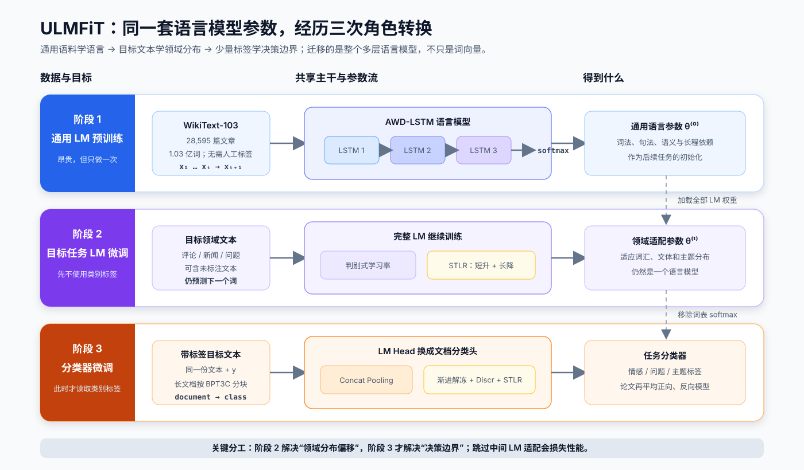
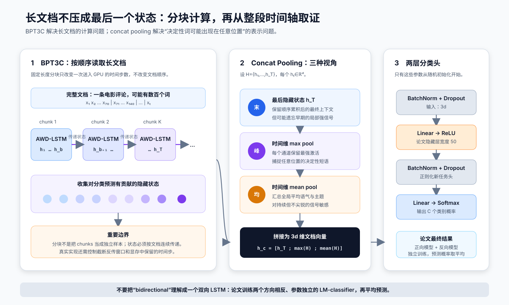
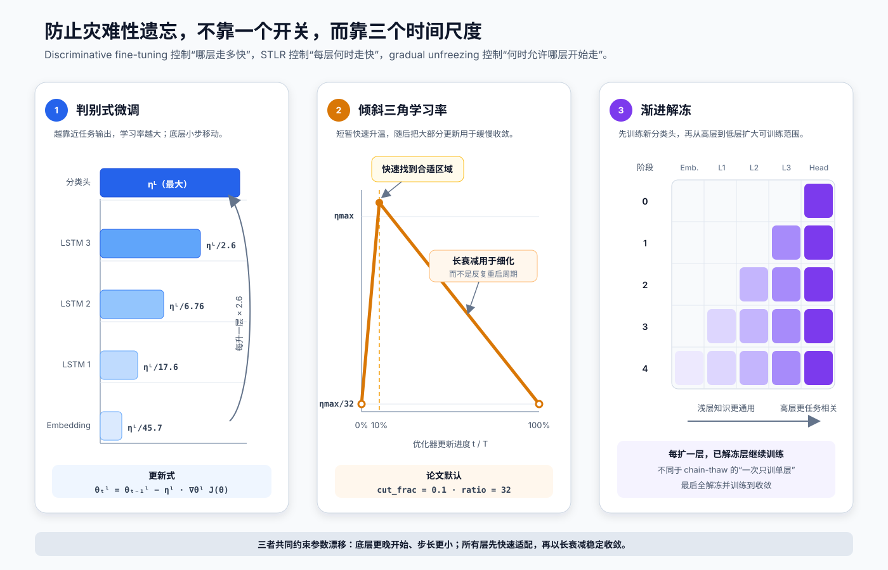
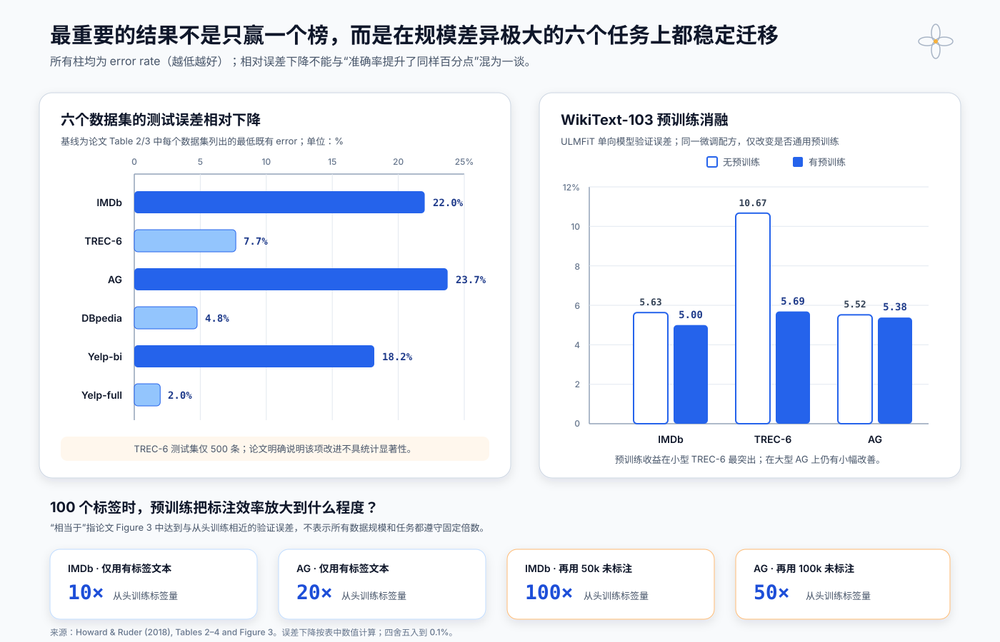

# ULMFiT 原理与实现：如何把通用语言模型稳健迁移到文本分类


> **论文**：Universal Language Model Fine-tuning for Text Classification<br>
> **作者**：Jeremy Howard、Sebastian Ruder<br>
> **首次公开 / 发表**：2018 年 1 月 / ACL 2018（长论文）<br>
> **关键词**：语言模型预训练、归纳迁移、AWD-LSTM、判别式微调、STLR、渐进解冻、Concat Pooling<br>
> **原文**：[ACL Anthology](https://aclanthology.org/P18-1031/) · [arXiv](https://arxiv.org/abs/1801.06146) · [作者博客](https://nlp.fast.ai/classification/2018/05/15/introducing-ulmfit.html)<br>
> **本文代码**：[零依赖 ULMFiT 微调机制最小实现](code/ulmfit_minimal.py)

ULMFiT（Universal Language Model Fine-tuning）并不是一种新的循环单元，也不是 Transformer。它真正解决的是一个训练问题：**一个已经学会通用语言规律的多层语言模型，怎样适应新的文本分布和分类标签，又不把预训练知识迅速忘掉？**

论文给出的答案是一个三阶段迁移流程：

1. 在 WikiText-103 上训练通用 AWD-LSTM 语言模型；
2. 在目标任务文本上继续做语言建模，先适应领域分布；
3. 换上文档分类头，再从高层到低层逐步解冻。

真正让这条流程稳定工作的，是三种互补的微调控制：

- **Discriminative fine-tuning**：不同层使用不同学习率；
- **Slanted triangular learning rates（STLR）**：学习率短时间线性升高，再长时间线性衰减；
- **Gradual unfreezing**：先训练任务头和高层，随后逐层向下解冻。

一句话概括：

> **ULMFiT 把“先学语言、再学领域、最后学标签”做成一套可复用配方，并用分层、分时的参数更新抑制灾难性遗忘。**

---

## 1. 一分钟抓住 ULMFiT

ULMFiT 的核心并不是“用 LSTM 做分类”，而是把监督任务拆成三个难度逐渐增加的参数迁移阶段：

| 阶段 | 数据 | 训练目标 | 主要作用 |
|---|---|---|---|
| 通用 LM 预训练 | WikiText-103，无标签 | 预测下一个词 | 学通用词法、句法、语义和长程依赖 |
| 目标任务 LM 微调 | 目标领域文本，标签可忽略 | 仍预测下一个词 | 适应领域词汇、文体与主题分布 |
| 目标分类器微调 | 目标文本与类别标签 | 分类交叉熵 | 学习任务决策边界 |

这三步对应三种不同的分布变化：

$$
\underbrace{p_{\text{wiki}}(x)}_{\text{通用文本}}
\quad\longrightarrow\quad
\underbrace{p_{\text{target}}(x)}_{\text{目标领域}}
\quad\longrightarrow\quad
\underbrace{p_{\text{target}}(y\mid x)}_{\text{分类任务}}.
$$

如果直接从第一项跳到第三项，模型要同时处理领域偏移和标签学习；当标注数据很少时，梯度很容易把原有表示拉坏。中间的目标任务 LM 微调把这两个问题拆开了。

论文结果覆盖情感、问题类型和主题分类六个数据集。最终系统在 IMDb、TREC-6、AG、DBpedia、Yelp-bi、Yelp-full 上都超过论文选择的既有结果；低样本实验中，`100` 个标签配合目标领域未标注文本，在 IMDb 上达到从头训练使用 `100×` 标签时的相近表现。

这里有两个边界要先说清：

- “Universal” 指一套架构和训练过程可跨文本分类任务复用，不表示一个 checkpoint 零样本完成所有任务；
- 论文声称方法可用于任意 NLP 任务，但实证只覆盖**文本分类**，没有在序列标注、问答或生成任务上给出同等完整验证。

---

## 2. 2018 年的症结：为什么只迁移词向量还不够

当时 NLP 中最常见的迁移方式，是用 word2vec、GloVe 等预训练词向量初始化 embedding，网络其余层仍从随机参数开始训练。这样只迁移了“每个词大致是什么意思”，没有迁移多层网络已经学到的组合规律。

| 方法 | 迁移什么 | 下游主干 | 主要问题 |
|---|---|---|---|
| 预训练词向量 | 一张静态 embedding 表 | 大部分随机初始化 | 上下文建模和高层特征没有迁移 |
| 冻结 LM 特征 | 预训练网络的固定表示 | 还需任务专用结构 | 源表示不能按目标任务调整 |
| 直接全量微调 LM | 全部参数 | 共享主干 | 小数据上容易过拟合和灾难性遗忘 |
| ULMFiT | 全部 LM 参数 + 分阶段微调配方 | 同一 AWD-LSTM | 用领域适配和受控更新提高稳定性 |

“直接微调语言模型”并非 ULMFiT 首创。Dai 与 Le 在 2015 年已经研究过半监督序列学习，但论文指出，既有方法在约 `10k` 标注样本上仍可能过拟合，并常需数百万篇领域内文档才能获得好结果。

ULMFiT 的判断是：**问题不只在预训练任务，而在我们不知道怎样微调多层语言模型。**

### 2.1 两种失败模式

**更新太激进：灾难性遗忘。** 下游分类损失产生的梯度会迅速改写预训练参数。训练误差可能继续下降，验证误差却在早期达到最低点后反弹。

**更新太保守：收敛慢并过拟合。** 如果长期冻结主干、只训练顶部分类层，模型无法充分适应新领域；随机初始化的小分类头可能在有限特征上反复拟合。

因此 ULMFiT 不是简单选择“冻结”或“全解冻”，而是同时控制：

$$
\boxed{\text{哪些层更新}}\quad+
\boxed{\text{每层走多大一步}}\quad+
\boxed{\text{整个训练期何时快、何时慢}}.
$$

### 2.2 “Universal” 的四个操作性标准

论文把通用性定义为：

1. 能处理文档长度、样本规模和标签类型不同的任务；
2. 使用同一种架构和训练过程；
3. 不需要为每个任务设计专门的特征工程或预处理；
4. 不强制要求额外的领域文档或标签。

第四点不等于“领域文本无用”。ULMFiT 至少可以把任务本身的训练文本当作无标签语料；低样本的半监督设置还额外开放了任务数据中的未标注文本。

---

## 3. 三阶段流程：先学语言，再学领域，最后学标签



**读图要点：**

1. 阶段 1 最昂贵，但通用 LM 只需预训练一次，可以复用于多个任务。
2. 阶段 2 不使用类别标签，优化目标仍是 next-word prediction；它解决 `p(x)` 的领域偏移。
3. 阶段 3 移除词表 softmax，保留 embedding 和三层 LSTM，并新增文档分类头。
4. 模型不是每个阶段重新训练；`θ⁽⁰⁾ → θ⁽ᵗ⁾ → θ⁽ᶜ⁾` 是连续的 checkpoint 迁移。
5. 论文的最终测试结果平均两个独立模型的预测：一个从左到右，一个从右到左。

这套流程与后来常见的 continued pretraining / domain-adaptive pretraining 很接近：先让预训练目标在目标分布上继续学习，再进入带标签任务。ULMFiT 的历史价值之一，就是把这一中间阶段和微调稳定性放在同一方法中系统验证。

---

## 4. 阶段一：通用领域语言模型预训练

### 4.1 语言模型是怎样产生监督信号的

给定词序列 $x_1,\ldots,x_T$，正向语言模型最大化：

$$
\mathcal L_{\text{LM}}(\theta)
=
\sum_{t=1}^{T-1}
\log p_\theta(x_{t+1}\mid x_{\le t}).
$$

若实现使用要最小化的交叉熵，则：

$$
\mathcal J_{\text{LM}}
=-
\frac{1}{T-1}
\sum_{t=1}^{T-1}
\log p_\theta(x_{t+1}\mid x_{\le t}).
$$

原文本自身就提供标签：位置 $t$ 的输入预测位置 $t+1$ 的真实词，因此 WikiText-103 不需要人工标注。

```text
输入：  the   best  scene  ever
目标：  best  scene  ever   ...
```

反向 LM 单独把序列方向翻转，学习 $p(x_{t-1}\mid x_{\ge t})$。它与正向 LM 参数不共享，不是一个端到端双向 LSTM。

### 4.2 AWD-LSTM 仍然是标准 LSTM 单元

对输入向量 $x_t$、上一时刻隐藏状态 $h_{t-1}$ 和记忆状态 $c_{t-1}$，一个标准 LSTM 可写为：

$$
\begin{aligned}
i_t &= \sigma(W_{xi}x_t+W_{hi}h_{t-1}+b_i),\\
f_t &= \sigma(W_{xf}x_t+W_{hf}h_{t-1}+b_f),\\
o_t &= \sigma(W_{xo}x_t+W_{ho}h_{t-1}+b_o),\\
g_t &= \tanh(W_{xg}x_t+W_{hg}h_{t-1}+b_g),\\
c_t &= f_t\odot c_{t-1}+i_t\odot g_t,\\
h_t &= o_t\odot\tanh(c_t).
\end{aligned}
$$

`AWD-LSTM` 的关键不是改造这些门，而是在普通 LSTM 周围组合一套强正则化和优化方法。其中 “Weight-Dropped” 指对隐藏到隐藏的权重施加 DropConnect：

$$
\widetilde W_{hh}=M\odot W_{hh},
\qquad
M_{ij}\sim\operatorname{Bernoulli}(1-p).
$$

它随机屏蔽的是**权重连接**，不是每个时间步随意抹掉不同的循环状态。AWD-LSTM 体系还使用 embedding dropout、跨时间步锁定的 dropout、层间 dropout、激活正则等做法。

一个容易混淆的名字细节是：原 AWD-LSTM 论文标题中的 `AWD` 常解释为 ASGD Weight-Dropped，但 ULMFiT 的下游微调实验使用 Adam，而不是照搬 NT-ASGD。这里迁移的是 AWD-LSTM 的模型与正则化配方，不代表优化器必须固定。

### 4.3 通用语料与模型规模

ULMFiT 使用 WikiText-103：`28,595` 篇预处理 Wikipedia 文章、约 `1.03 亿`词。它足够大，且保留文章级上下文，承担类似计算机视觉中 ImageNet 的通用源任务角色。

| 配置 | 论文设置 |
|---|---:|
| 主干 | AWD-LSTM |
| LSTM 层数 | 3 |
| 词 embedding 维度 | 400 |
| 每层隐藏单元 | 1,150 |
| BPTT 序列长度 | 70 |
| 层 dropout | 0.4 |
| RNN 层 dropout | 0.3 |
| 输入 embedding 层 dropout | 0.4 |
| embedding dropout | 0.05 |
| 循环 hidden-to-hidden weight dropout | 0.5 |

论文强调：AWD-LSTM 没有 attention、shortcut 或复杂任务专用模块。强结果来自**通用 LM + 合适的迁移过程**，不是堆叠分类器工程。

---

## 5. 阶段二：目标任务语言模型微调

无论通用语料多大，Wikipedia 与电影评论、新闻标题、百科类别描述之间都存在分布差异。阶段二把通用参数 $\theta^{(0)}$ 作为初始化，在目标任务文本上继续最小化同一个 LM loss：

$$
\theta^{(t)}
=
\arg\min_\theta
\mathbb E_{x\sim p_{\text{target}}(x)}
\left[\mathcal J_{\text{LM}}(x;\theta)\right].
$$

这里有一个非常实用的性质：即使分类标签昂贵，领域文本通常便宜。IMDb 中额外的 `50k` 条未标注评论不能直接计算情感分类 loss，却能继续提供每个词位置的语言建模信号。

### 5.1 判别式微调：每层学习率不同

设模型参数按层分组为：

$$
\theta=\{\theta^1,\theta^2,\ldots,\theta^L\},
$$

第 $l$ 层单独使用学习率 $\eta^l$：

$$
\theta_t^l
=
\theta_{t-1}^l
-\eta^l\nabla_{\theta^l}\mathcal J(\theta).
$$

论文先选择最顶层学习率 $\eta^L$，再向下按 `2.6` 衰减：

$$
\eta^{l-1}=\frac{\eta^l}{2.6}.
$$

直觉是：

- 底层更接近通用词法和局部模式，应保守更新；
- 高层更接近源任务输出，应允许更快适应目标分布；
- 一个全局学习率要么对底层太大，要么对高层太小。

今天常见的 layer-wise learning-rate decay 与它思想相近，但具体层分组、衰减系数和优化器并不必然等同。

### 5.2 STLR：先快速进入合适区域，再长时间细化

固定小学习率收敛太慢，固定大学习率又容易破坏预训练表示。STLR 把总更新数记为 $T$，先计算：

$$
\operatorname{cut}=\left\lfloor T\cdot\operatorname{cut\_frac}\right\rfloor.
$$

训练进度 $p(t)$ 为：

$$
p(t)=
\begin{cases}
\dfrac{t}{\operatorname{cut}}, & t<\operatorname{cut},\\[6pt]
1-\dfrac{t-\operatorname{cut}}
{\operatorname{cut}(1/\operatorname{cut\_frac}-1)},
& t\ge\operatorname{cut}.
\end{cases}
$$

学习率为：

$$
\eta_t
=
\eta_{\max}
\cdot
\frac{1+p(t)(\operatorname{ratio}-1)}{\operatorname{ratio}}.
$$

论文通常使用：

$$
\operatorname{cut\_frac}=0.1,
\qquad
\operatorname{ratio}=32,
\qquad
\eta_{\max}=0.01.
$$

于是学习率从 $\eta_{\max}/32$ 开始，用前 `10%` 更新线性升至 $\eta_{\max}$，再用后 `90%` 更新线性降回低位。它与对称三角不同，也不是多次 cosine restart。

### 5.3 为什么第二阶段不能省略

论文的 LM 微调消融显示，在 IMDb、TREC-6、AG 上，完整的 `Full + discr + stlr` 均优于“不做目标 LM 微调”。但普通全量微调在小型 TREC-6 上从 `6.38` 变成 `6.54`，反而更差；加上判别式学习率和 STLR 后才降到 `5.69`。

这说明有用的不是“多训练几轮”本身，而是：

> **目标领域 LM 适配有价值，但只有受控更新才能把价值兑现出来。**

---

## 6. 阶段三：从语言模型变成文档分类器



### 6.1 Concat Pooling：最后状态、峰值和均值一起用

若只取最后隐藏状态 $h_T$，长文档早期的重要信号可能被冲淡。对时间序列：

$$
H=\{h_1,h_2,\ldots,h_T\},
$$

ULMFiT 构造：

$$
\boxed{
h_c=
\left[
h_T;
\operatorname{maxpool}(H);
\operatorname{meanpool}(H)
\right]
}
$$

三项分别捕捉：

- $h_T$：按顺序累积后的最终上下文；
- `maxpool`：任意位置出现的最强局部证据；
- `meanpool`：贯穿全文的整体语气和主题。

若顶层 LSTM 隐藏维度为 $d=1150$，拼接后分类器输入维度就是 $3d=3450$。

### 6.2 两个线性块

论文在 LM 上增加两个线性 block：

```text
3d 维 concat pooled vector
  → BatchNorm → Dropout → Linear(3d, 50) → ReLU
  → BatchNorm → Dropout → Linear(50, C) → Softmax
```

其中 `C` 是类别数。只有这些新分类层从随机参数开始；embedding 和三层 LSTM 来自阶段二的领域适配 checkpoint。

### 6.3 渐进解冻：可训练集合逐步扩大

一个常见实施顺序是：

```text
阶段 0：classifier
阶段 1：LSTM 3 + classifier
阶段 2：LSTM 2 + LSTM 3 + classifier
阶段 3：LSTM 1 + LSTM 2 + LSTM 3 + classifier
阶段 4：embedding + 全部 LSTM + classifier
```

每次新解冻一组后，已经解冻的更高层继续训练；最终所有层训练到收敛。它不同于 chain-thaw：后者倾向一次只训练单独一层，再切换到另一层。

渐进解冻不是为了永远保护底层，而是让随机初始化的任务头和高层先稳定下来，再逐步把较干净的监督信号传向通用层。

### 6.4 BPT3C：长文档按块计算，但保持状态连续

语言模型用 BPTT 训练，长文档一次放入 GPU 可能超出显存。BPTT for Text Classification（BPT3C）把文档切成固定长度块：

$$
x_{1:b},\quad x_{b+1:2b},\quad\ldots
$$

处理第 $k+1$ 块时，用第 $k$ 块的最终循环状态初始化；同时保存可用于 mean/max pooling 的隐藏状态。关键是：

- chunk 顺序不能打乱；
- chunk 不是独立分类样本；
- 跨块传递的是 LSTM 状态；
- 反向传播窗口和保留的隐藏状态仍受显存限制。

论文实际使用可变长度 BPTT 序列。BPT3C 是计算和状态管理方案，不会把 RNN 变成无限上下文、无限反传的模型。

### 6.5 “双向”结果来自两个模型集成

论文对正向、反向语言模型分别完成三阶段训练，再平均分类概率：

$$
p(y\mid x)
=
\frac{1}{2}
\left[
p_{\rightarrow}(y\mid x)
+p_{\leftarrow}(y\mid x)
\right].
$$

这带来约 `0.5–0.7` 个百分点提升；IMDb 测试误差从单模型 `5.30` 降到双向集成 `4.58`。代价是预训练、微调和推理几乎都要维护两套模型。

---

## 7. 三种微调控制为什么互补



可以把一次参数更新写成带有三个“阀门”的形式：

$$
\theta_{t}^{l}
=
\theta_{t-1}^{l}
-
\underbrace{m_t^l}_{\text{是否解冻}}
\cdot
\underbrace{s_t}_{\text{STLR 时间系数}}
\cdot
\underbrace{\eta^l}_{\text{层级学习率}}
\cdot
\nabla_{\theta^l}\mathcal J.
$$

其中 $m_t^l\in\{0,1\}$ 表示第 $l$ 层在时刻 $t$ 是否可训练。这不是论文原式，而是帮助理解三种机制如何组合的等价抽象：

| 机制 | 控制对象 | 单独缺失时的风险 |
|---|---|---|
| 渐进解冻 | 哪些层现在允许更新 | 一开始所有层同时被噪声梯度改写 |
| 判别式微调 | 不同层的相对步长 | 底层过度漂移或高层适配不足 |
| STLR | 全局训练过程中的步长变化 | 进入好区域太慢，或后期持续震荡 |

三者共同形成的更新模式是：

1. 高层先开始更新；
2. 高层学习率大，底层学习率小；
3. 每个训练阶段先快速适配，再长时间衰减；
4. 越通用的底层越晚、越慢地改变。

这比“冻结前 N 层”更柔性，也比“全模型同一学习率”更符合迁移表示从通用到任务相关的层级结构。

---

## 8. 必要代码：把论文机制拆成可检查组件

本文提供的 [零依赖最小实现](code/ulmfit_minimal.py) 不下载模型，也不假装复现论文精度；它专门隔离 ULMFiT 方法中最值得复用的机制，并带有自检：

```bash
python3 papers/to-2026/code/ulmfit_minimal.py
```

### 8.1 判别式学习率

```python
def discriminative_learning_rates(
    num_groups: int,
    top_learning_rate: float,
    layer_decay: float = 2.6,
) -> list[float]:
    return [
        top_learning_rate / layer_decay ** (num_groups - 1 - group)
        for group in range(num_groups)
    ]


groups = ["embedding", "lstm_1", "lstm_2", "lstm_3", "classifier"]
rates = discriminative_learning_rates(len(groups), top_learning_rate=0.01)
```

返回顺序是从底层到顶层：

```text
embedding   0.00021883
lstm_1      0.00056896
lstm_2      0.00147929
lstm_3      0.00384615
classifier  0.01000000
```

### 8.2 原论文 STLR

```python
def stlr(step, total_steps, max_lr, cut_fraction=0.1, ratio=32.0):
    cut = min(max(int(total_steps * cut_fraction), 1), total_steps - 1)
    if step < cut:
        progress = step / cut
    else:
        progress = 1 - (step - cut) / (
            cut * (1 / cut_fraction - 1)
        )
    return max_lr * (1 + progress * (ratio - 1)) / ratio
```

对 `T=100, ηmax=0.01`：

```text
step  0: 0.00031250
step  5: 0.00515625
step 10: 0.01000000
step 50: 0.00569444
step 99: 0.00042014
```

离散训练通常只有 `0…T-1` 号 update，所以最后一步会略高于理论端点；下一时刻 `t=T` 才精确回到 `ηmax/ratio`。

### 8.3 Concat Pooling 的 PyTorch 语义

下面假设 `hidden` 形状为 `[batch, time, hidden_size]`，`mask=True` 表示真实 token：

```python
import torch
from torch import nn


class ConcatPool(nn.Module):
    def forward(self, hidden: torch.Tensor, mask: torch.Tensor) -> torch.Tensor:
        if hidden.ndim != 3 or mask.shape != hidden.shape[:2]:
            raise ValueError("shape mismatch")

        lengths = mask.sum(dim=1).clamp_min(1)
        batch = torch.arange(hidden.size(0), device=hidden.device)
        last = hidden[batch, lengths - 1]

        max_input = hidden.masked_fill(~mask.unsqueeze(-1), -torch.inf)
        maximum = max_input.max(dim=1).values

        summed = (hidden * mask.unsqueeze(-1)).sum(dim=1)
        mean = summed / lengths.unsqueeze(-1)
        return torch.cat([last, maximum, mean], dim=-1)
```

常见 bug 是把 padding 位置的零值直接纳入 max/mean：

- 对全为负的有效激活，padding 的 `0` 会错误成为最大值；
- mean 的分母若使用补齐后的固定长度，会系统性缩小短文本表示。

### 8.4 渐进解冻不等于反复重建优化器而丢失状态

框架实现通常按 layer group 控制 `requires_grad`，并在每阶段明确设置参数组学习率：

```python
stages = [
    ["classifier"],
    ["lstm_3", "classifier"],
    ["lstm_2", "lstm_3", "classifier"],
    ["lstm_1", "lstm_2", "lstm_3", "classifier"],
    ["embedding", "lstm_1", "lstm_2", "lstm_3", "classifier"],
]
```

如果每次解冻都新建优化器，要决定是否迁移已训练参数的动量状态；若继续使用同一个优化器，则需确认新解冻参数已经在参数组中。两种方式都可以，最危险的是以为某层已解冻，实际优化器根本没有管理它。

---

## 9. 用现代 fastai 跑通三阶段

当前 fastai 仍提供 AWD-LSTM 和 ULMFiT 教程。下面代码展示 IMDb 的完整数据流，API 以当前文档为准：

```python
from fastai.text.all import *

path = untar_data(URLs.IMDB)

# 阶段 2：只用 train / unsup，保留 test 直到最终评估。
get_lm_files = partial(get_text_files, folders=["train", "unsup"])
lm_block = DataBlock(
    blocks=TextBlock.from_folder(path, is_lm=True),
    get_items=get_lm_files,
    splitter=RandomSplitter(valid_pct=0.1, seed=42),
)
dls_lm = lm_block.dataloaders(path, path=path, bs=128, seq_len=80)
lm = language_model_learner(
    dls_lm,
    AWD_LSTM,
    metrics=[accuracy, Perplexity()],
    path=path,
    wd=0.1,
).to_fp16()

# 先训练当前可训练头，再解冻整个 LM 做领域适配。
lm.fit_one_cycle(1, 1e-2)
lm.unfreeze()
lm.fit_one_cycle(10, 1e-3)
lm.save_encoder("imdb_finetuned")

# 阶段 3：分类器必须复用 LM 的词表，否则 embedding 索引失去含义。
dls_clas = TextDataLoaders.from_folder(
    path,
    valid="test",
    text_vocab=dls_lm.vocab,
)
clf = text_classifier_learner(
    dls_clas,
    AWD_LSTM,
    drop_mult=0.5,
    metrics=accuracy,
    path=path,
).to_fp16(clip=0.1)
clf.load_encoder("imdb_finetuned")

# 渐进解冻 + 分层学习率范围。
lr = 0.05  # 官方示例按 batch size 缩放；实际先做 LR range test。
clf.fit_one_cycle(1, lr)

clf.freeze_to(-2)
lr /= 2
clf.fit_one_cycle(1, slice(lr / (2.6**4), lr))

clf.freeze_to(-3)
lr /= 2
clf.fit_one_cycle(1, slice(lr / (2.6**4), lr))

clf.unfreeze()
lr /= 5
clf.fit_one_cycle(2, slice(lr / (2.6**4), lr))
```

这段代码适合跑通现代 fastai 工作流，但不应被叫作“论文逐位复现”：

- 当前 fastai 的预训练 checkpoint、tokenization、默认 dropout 和软件栈可能与 2018 年不同；
- `fit_one_cycle` 是现代 one-cycle 实现，不是原论文那条严格分段线性的 STLR；
- 上例只训练正向模型，论文最终测试结果还集成了独立反向模型；
- 真正复现实验还需固定数据版本、验证切分、随机种子、epoch 和历史实现版本。

如果目标是理解原算法，先运行本文零依赖代码；如果目标是完成一个实际分类任务，再使用 fastai，并以当前官方文档和锁定版本为准。

---

## 10. 数据、预处理与原论文训练配方

### 10.1 六个分类数据集

| 数据集 | 类型 | 类别数 | 训练样本数 | 典型文本长度 |
|---|---|---:|---:|---|
| TREC-6 | 问题分类 | 6 | 5.5k | 单句 |
| IMDb | 情感分类 | 2 | 25k | 多段评论 |
| Yelp-bi | 情感分类 | 2 | 560k | 评论 |
| Yelp-full | 情感分类 | 5 | 650k | 评论 |
| AG | 主题分类 | 4 | 120k | 新闻文本 |
| DBpedia | 主题分类 | 14 | 560k | 百科描述 |

它们同时覆盖：

- `5.5k → 650k` 的训练集规模跨度；
- 二分类、五分类、十四分类；
- 单句问题到多段电影评论；
- 情感、问题类型和主题三种任务。

这正是论文对“通用”的实证定义：同一三层 AWD-LSTM 和训练配方，不为每个数据集换一个专用网络。

### 10.2 特殊 token 保留分类线索

论文沿用既有预处理，并额外为以下现象加入特殊 token：

- 全大写；
- 字符拉长；
- 重复。

例如现代 fastai tokenization 中常见：

```text
THIS MOVIE IS SOOOOO GOOD!!!
→ xxbos xxup this xxup movie xxup is xxrep ... good ...
```

这样做不是为了美化文本，而是避免 lowercasing 或归一化抹掉情感强度。特殊 token 自己成为可学习词元，让语言模型看到“接下来是大写词”“某字符重复若干次”等结构信号。

### 10.3 词表必须跨阶段一致

阶段二保存的 encoder 中，embedding 第 `i` 行对应 LM 词表第 `i` 个词。阶段三若重新按频率建立另一个词表，即使矩阵形状相同，索引语义也会错位。

因此必须同时归档：

- tokenizer 规则；
- vocabulary 及顺序；
- 特殊 token 表；
- 数值化与未知词策略；
- 正向/反向模型方向。

只保存 `state_dict` 不足以可靠复用文本模型。

### 10.4 微调超参数

| 项目 | 论文默认或报告值 |
|---|---:|
| Optimizer | Adam |
| $\beta_1$ / $\beta_2$ | `0.7 / 0.99` |
| Batch size | 64 |
| 目标 LM 微调基础学习率 | 0.004 |
| 分类器微调基础学习率 | 0.01 |
| 分类器隐藏层 | 50 |
| 小型 TREC-6 LM 微调 | 15 epochs |
| 分类器常用默认 | 50 epochs |

论文尽量使用在 IMDb 验证集上选择的一套超参数跨任务复用，但每个任务的训练 epoch 仍由各自验证集调整。因此“相同超参数”不是完全不做任务级模型选择。

---

## 11. 主结果：强项是跨规模稳定，而不只是单榜最高



**怎样读图：**

- 左图是相对 error reduction，不是准确率绝对百分点；
- 右图是消融实验的**验证误差**，不能与左图最终双向集成的**测试误差**直接混算；
- 低样本倍数表示达到与从头训练相近的验证表现，不是理论上的固定样本复杂度定律。

### 11.1 六任务测试误差

| 数据集 | 论文表中最强既有结果 | ULMFiT | 相对误差下降 |
|---|---:|---:|---:|
| IMDb | 5.90 | **4.60** | 22.0% |
| TREC-6 | 3.90 | **3.60** | 7.7% |
| AG | 6.57 | **5.01** | 23.7% |
| DBpedia | 0.84 | **0.80** | 4.8% |
| Yelp-bi | 2.64 | **2.16** | 18.2% |
| Yelp-full | 30.58 | **29.98** | 2.0% |

相对误差下降按：

$$
\operatorname{relative\ error\ reduction}
=
\frac{e_{\text{baseline}}-e_{\text{ULMFiT}}}
{e_{\text{baseline}}}\times100\%.
$$

以 AG 为例：

$$
\frac{6.57-5.01}{6.57}\approx23.7\%.
$$

这不表示准确率提升 `23.7` 个百分点；准确率只是从 `93.43%` 变为 `94.99%`，绝对提升 `1.56` 个百分点。

TREC-6 测试集只有 `500` 条。论文明确说明该数据集上的提升不具统计显著性，不能只凭 `3.9 → 3.6` 宣称稳健胜出。

### 11.2 低样本结果必须区分两种设置

论文定义：

| 设置 | 目标 LM 微调可使用什么文本 |
|---|---|
| Supervised ULMFiT | 只使用被抽中的有标签样本，但忽略其标签做 LM |
| Semi-supervised ULMFiT | 可使用任务中全部可用文本，包括未标注样本 |

当只有 `100` 个标签时：

- Supervised ULMFiT 在 IMDb 上匹配从头训练用 `10×` 标签，在 AG 上匹配 `20×`；
- 再开放 `50k` IMDb 未标注评论后，匹配从头训练用 `100×` 标签；
- 再开放 `100k` AG 未标注文本后，匹配从头训练用 `50×` 标签。

摘要中的“`100` 个标签相当于 `100×` 数据”指 IMDb 的半监督场景，不应推广成 ULMFiT 在任意任务上固定节省 99% 标签。

---

## 12. 消融：哪些组件真的重要

以下均为论文分析部分的**单向模型验证误差**。作者从训练集划出 `10%` 作为验证集；分类器训练 `50` epochs，除完整 ULMFiT 外的比较方法使用 early stopping。

### 12.1 预训练与 LM 质量

| 设置 | IMDb | TREC-6 | AG |
|---|---:|---:|---:|
| 无 WikiText-103 预训练 | 5.63 | 10.67 | 5.52 |
| 有 WikiText-103 预训练 | **5.00** | **5.69** | **5.38** |

预训练在小型 TREC-6 上收益最大，但在大型 AG 上仍有小幅改善。这支持论文的核心判断：通用源任务不是只在“几乎没数据”时才有用。

| LM 主干 | IMDb | TREC-6 | AG |
|---|---:|---:|---:|
| 无 dropout 的 vanilla LM | 5.98 | 7.41 | 5.76 |
| AWD-LSTM | **5.00** | **5.69** | **5.38** |

vanilla LM 在大数据集上仍能获得不错迁移效果，说明三阶段微调本身有价值；但在 TREC-6 上，强正则化的 LM 明显更稳。

### 12.2 目标 LM 微调

| 目标 LM 微调方式 | IMDb | TREC-6 | AG |
|---|---:|---:|---:|
| 不做目标 LM 微调 | 6.99 | 6.38 | 6.09 |
| Full | 5.86 | 6.54 | 5.61 |
| Full + discr | 5.55 | 6.36 | 5.47 |
| Full + discr + STLR | **5.00** | **5.69** | **5.38** |

最有信息量的是 TREC-6：朴素 full fine-tuning 比不微调还差；判别式学习率和 STLR 加入后才出现清晰改善。**微调策略不是锦上添花，而是小数据上让 LM 适配从有害变有益的条件。**

### 12.3 分类器微调

| 分类器微调方式 | IMDb | TREC-6 | AG |
|---|---:|---:|---:|
| 从头训练 | 9.93 | 13.36 | 6.81 |
| Full | 6.87 | 6.86 | 5.81 |
| Full + discr | 5.57 | 6.21 | 5.62 |
| Last（只训练最后层） | 6.49 | 16.09 | 8.38 |
| Chain-thaw | 5.39 | 6.71 | 5.90 |
| Freez（渐进解冻） | 6.37 | 6.86 | 5.81 |
| Freez + discr | 5.39 | 5.86 | 6.04 |
| Freez + STLR | 5.04 | 6.02 | 5.35 |
| Freez + cosine | 5.70 | 6.38 | **5.29** |
| Freez + discr + STLR | **5.00** | **5.69** | 5.38 |

这张表不支持“每个组件在每列都单调变好”的简单故事：

- `Last` 在 TREC-6 和 AG 严重欠拟合，说明冻结主干不是稳妥默认；
- `Freez + cosine` 在 AG 上取得表中最低误差 `5.29`；
- `Freez + STLR` 在 AG 上也略优于完整配方；
- 完整 ULMFiT 的优势是 IMDb、TREC-6 最好，AG 仍接近最好，即**跨任务稳健**，不是每个单项都绝对第一。

论文训练曲线还显示，普通 full fine-tuning 在 IMDb 第一轮左右就达到最低验证误差，之后上升；ULMFiT 到较晚 epoch 仍稳定或改善。作者把它解释为减少灾难性遗忘。严格说，这是行为证据：论文没有直接度量参数空间中的“知识保留量”。

---

## 13. 为什么它有效

### 13.1 语言建模是密集、自监督的源任务

一段长度 $T$ 的文本近似提供 $T-1$ 个预测目标。相比一个文档只有一个分类标签，LM 能从未标注数据中提取更密集的训练信号。

### 13.2 中间 LM 适配拆开两种学习难题

先学习 $p_{\text{target}}(x)$，再学习 $p(y\mid x)$，比用少量分类标签同时修正语言分布和任务边界更容易。尤其当领域词汇和写作风格与 Wikipedia 差异明显时，这一步价值更大。

### 13.3 分层学习率符合表示层级

多层网络的底层通常更通用，高层更接近源任务。让所有层同速移动忽略了这一结构；逐层衰减为“保留通用知识、重写任务相关知识”提供连续控制。

### 13.4 渐进解冻改善早期梯度质量

新分类头随机初始化时，反向传播给底层的梯度噪声最大。先稳定顶部，再向下释放参数，相当于延迟让通用层接触任务信号。

### 13.5 Concat pooling 为长文档保留稀疏证据

情感分类的决定性短语可能只出现一次，例如否定转折或极端评价。max pool 捕捉尖峰，mean pool 捕捉整体，最后状态保留顺序上下文；三者比单独最后状态更适合文档分类。

### 13.6 同一配方减少任务专用工程

六个数据集没有分别设计 CNN、attention 或层级网络。统一主干使改进更容易归因于预训练与微调方法，也降低新任务启动成本。

---

## 14. 常见误解

### 14.1 “ULMFiT 是一种 LSTM 架构”

不准确。论文实验使用 AWD-LSTM，但作者明确预期更强的 LM 会带来更好下游表现。ULMFiT 的主体是三阶段迁移与微调策略。

### 14.2 “第二阶段需要标签”

不需要。目标文本即使有标签，也是在阶段二忽略标签、继续预测下一个词。类别标签到阶段三才进入 loss。

### 14.3 “只训练分类头最安全”

论文 `Last` 消融在 TREC-6 上验证误差达到 `16.09`，比从头训练的 `13.36` 还差。冻结可以防遗忘，也会阻止适配；安全不等于有效。

### 14.4 “渐进解冻每次只训练一层”

不是。新层解冻后，之前已解冻的高层继续训练，可训练集合逐步扩大。一次只训练一个层组更接近 chain-thaw。

### 14.5 “STLR 就是任意 one-cycle 或 cosine schedule”

不是。原论文 STLR 是明确的分段线性曲线：前 `10%` 升、后 `90%` 降，最低与最高相差 `32×`。现代库的 one-cycle 可以继承类似思想，但曲线和动量调度未必相同。

### 14.6 “论文的 bidirectional LM 是一个双向 LSTM”

不是。它训练正向和反向两套 LM-classifier，最终平均概率。计算、存储和推理成本也随之增加。

### 14.7 “100 个标签总能等价 10,000 个标签”

这是 IMDb 半监督实验中的经验结果，并且使用了约 `50k` 未标注评论。它不是跨数据集保证。

### 14.8 “Universal 表示不需要任务 checkpoint”

ULMFiT 仍为每个任务训练单独的领域 LM 和分类器。它统一的是训练范式，不是 GPT-3 式上下文学习或现代指令模型的单 checkpoint 多任务接口。

---

## 15. ULMFiT、ELMo、GPT-1 与 BERT 的位置

2018 年不是只有一篇论文突然发明“预训练”。更准确的历史图景是多条路线在同一年收敛：

| 方法 | 首次公开 | 主干 | 预训练目标 | 下游如何使用 | 关键侧重 |
|---|---|---|---|---|---|
| ULMFiT | 2018-01 | AWD-LSTM | 正向/反向 next-word LM | 目标 LM 适配后全参数分类微调 | 怎样稳健微调 LM |
| ELMo | 2018-02 | 双向 LSTM LM | 双向 LM | 多层表示作为上下文化特征 | feature extraction |
| GPT-1 | 2018-06 | 因果 Transformer | next-token LM | 任务序列化 + 全参数微调 | Transformer 生成式预训练 |
| BERT | 2018-10 | Transformer Encoder | MLM + NSP | 任务头 + 全参数微调 | 深层双向编码 |

ULMFiT 的若干思想后来以不同名字延续：

- 目标任务 LM 微调 → domain/task-adaptive continued pretraining；
- 判别式微调 → layer-wise learning-rate decay；
- 渐进解冻 → staged unfreezing；
- 通用预训练后端到端微调 → 现代预训练模型标准范式。

但不要抹平差异：

- ULMFiT 是 word-level RNN 路线，不含 Self-Attention；
- GPT-1 在输入接口和主干上走向统一 Transformer；
- BERT 用 MLM 获得单模型深层双向上下文，而 ULMFiT 最终双向结果依赖两个方向模型集成；
- 现代 Transformer 常直接全量微调或使用 LoRA，是否仍需渐进解冻要通过任务与规模验证。

ULMFiT 最持久的贡献，不是让 AWD-LSTM 成为最终赢家，而是把“**微调本身是一门需要设计的优化问题**”推到 NLP 主舞台。

---

## 16. 局限、证据边界与复现风险

### 16.1 “任意 NLP 任务”超出了论文实证范围

论文只在文本分类上做完整实验。作者认为序列标注较易扩展，但也承认蕴含和问答等复杂交互可能需要新的预训练与微调方式。因此应把“any NLP task”理解为方法愿景，而不是已经完成的验证结论。

### 16.2 最终双向结果成本翻倍

正向和反向模型要独立预训练、领域适配、分类微调和推理。若只部署单模型，IMDb 误差会从论文双向结果约 `4.58` 回到 `5.30` 左右。

### 16.3 RNN 训练难以并行

LSTM 的 $h_t$ 依赖 $h_{t-1}$，时间维并行度远低于 Transformer。BPT3C 能控制显存，却不能消除顺序计算瓶颈。

### 16.4 词级词表限制跨语言和新领域

源、目标阶段要复用词表；大量 OOV、形态变化丰富的语言和专业符号会削弱迁移。后续工作使用子词 tokenization 扩展 ULMFiT，但这不是原论文的核心实验设置。

### 16.5 统计不确定性报告有限

- TREC-6 的提升明确不显著；
- 主表没有为每个任务提供多随机种子均值、方差或置信区间；
- 消融使用单向模型和 10% 验证切分，与最终测试集双向结果不是同一估计量；
- 历史 baselines 来自不同论文，预处理和调参预算未必完全一致。

### 16.6 低样本半监督结果使用了大量未标注文本

IMDb 的 `100×` 标签效率比较同时使用约 `50k` 未标注评论。它证明的是“通用预训练 + 目标未标注适配”能减少标签，而不是只靠 100 条文本完成任务。

### 16.7 灾难性遗忘主要由验证曲线间接判断

ULMFiT 的训练曲线更稳定，但论文没有通过 probing、参数距离或源任务性能保持量直接测量“忘掉了多少知识”。因而更严谨的表述是：方法**表现出与减轻灾难性遗忘一致的行为**。

---

## 17. 实践清单

### 数据与词表

- [ ] 通用 LM、目标 LM、分类器使用同一 tokenizer 和词表顺序；
- [ ] 特殊 token、大小写、重复和拉长规则已固定；
- [ ] 未标注目标文本只进入 LM 阶段，测试文本和测试标签均保持隔离；
- [ ] 文档级 train/validation/test 切分先于随机分块，避免同一文档跨集合；
- [ ] 正向和反向模型的数据方向明确记录。

### 目标 LM 微调

- [ ] 从通用 checkpoint 加载了 embedding、全部 LSTM 和 LM head；
- [ ] 验证 perplexity/next-token loss 确实下降；
- [ ] 不同层学习率按预期递减，而不是所有参数同一个 LR；
- [ ] STLR 的 `T` 按 optimizer update 数计算，已考虑 gradient accumulation；
- [ ] 小数据先监控过拟合，再决定 epoch 与 dropout。

### 分类器微调

- [ ] LM softmax 已替换为 concat pooling 分类头；
- [ ] max/mean pooling 正确屏蔽 padding；
- [ ] 长文档 chunk 保持原顺序并传递循环状态；
- [ ] 每个解冻阶段打印可训练参数名和参数量；
- [ ] 新解冻参数确实进入优化器参数组；
- [ ] 使用梯度裁剪并监控 grad norm、NaN 和验证误差反弹。

### 评估与交付

- [ ] 区分单向单模型、双向集成和多种子集成；
- [ ] 区分 validation error、test error、accuracy 与 relative error reduction；
- [ ] 小测试集报告置信区间或 bootstrap，不只报告一个小数；
- [ ] 记录有标签与未标注样本量，避免夸大标签效率；
- [ ] checkpoint 与 tokenizer、vocab、方向、库版本一起归档。

---

## 18. 建议阅读顺序

1. 先读本文第 3、5、6、7 节，掌握三阶段和三种微调控制。
2. 阅读原论文第 3 节，逐式核对 discriminative fine-tuning、STLR 和 concat pooling。
3. 对照第 5 节消融，特别关注“普通 full fine-tuning 在 TREC-6 上变差”这一反例。
4. 阅读 [GPT-1 原理导读](02_GPT_2018_原理.md)，比较同年的生成式预训练迁移路线。
5. 阅读 [BERT 原理导读](01_BERT_2018_原理.md)，理解单模型双向 Transformer 如何改变主干与预训练目标。
6. 再读 [LoRA 原理](17_LoRA_2022_原理.md) 和 [QLoRA 原理](24_QLoRA_2023_原理.md)，比较“控制全参数微调”与“只训练参数增量”两种稳定性思路。

---

## 参考资料

1. Howard, J. & Ruder, S. [Universal Language Model Fine-tuning for Text Classification](https://aclanthology.org/P18-1031/). ACL 2018.
2. Howard, J. & Ruder, S. [Introducing state of the art text classification with universal language models](https://nlp.fast.ai/classification/2018/05/15/introducing-ulmfit.html). fast.ai, 2018.
3. Merity, S., Keskar, N. S. & Socher, R. [Regularizing and Optimizing LSTM Language Models](https://arxiv.org/abs/1708.02182). 2017.
4. Salesforce Research. [AWD-LSTM official implementation](https://github.com/salesforce/awd-lstm-lm).
5. Merity, S. et al. [Pointer Sentinel Mixture Models / WikiText](https://arxiv.org/abs/1609.07843). 2016.
6. fastai. [Text transfer learning tutorial](https://docs.fast.ai/tutorial.text.html).
7. fastai. [ULMFiT example](https://docs.fast.ai/examples/ulmfit.html).
8. Dai, A. M. & Le, Q. V. [Semi-supervised Sequence Learning](https://arxiv.org/abs/1511.01432). NeurIPS 2015.
