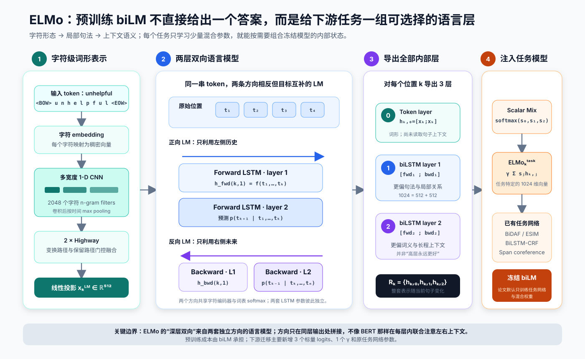
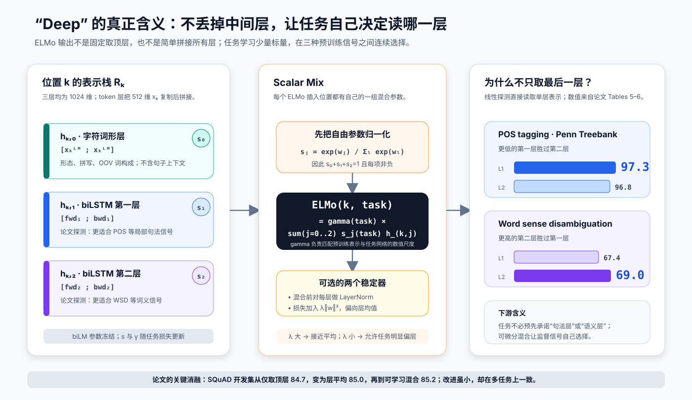
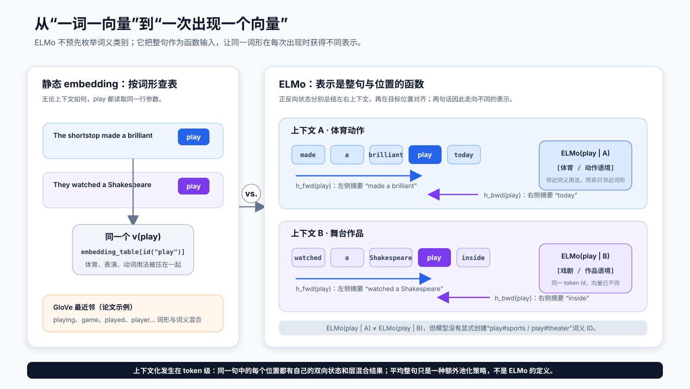
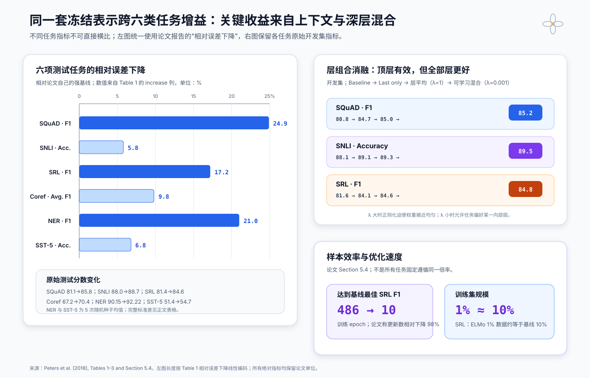

# ELMo 原理与实现：上下文如何把同一个词变成不同向量


> **论文**：Deep Contextualized Word Representations<br>
> **作者**：Matthew E. Peters、Mark Neumann、Mohit Iyyer、Matt Gardner、Christopher Clark、Kenton Lee、Luke Zettlemoyer<br>
> **首次公开 / 发表**：2018 年 2 月 / NAACL-HLT 2018（长论文）<br>
> **关键词**：上下文词表示、双向语言模型、字符 CNN、BiLSTM、Scalar Mix、特征式迁移、半监督学习<br>
> **原文**：[ACL Anthology](https://aclanthology.org/N18-1202/) · [arXiv](https://arxiv.org/abs/1802.05365) · [原始 bilm-tf 代码](https://github.com/allenai/bilm-tf) · [AllenNLP ELMo 文档](https://docs.allennlp.org/main/api/modules/elmo/)<br>
> **本文代码**：[零依赖 ELMo 核心机制最小实现](code/elmo_minimal.py)

ELMo（Embeddings from Language Models）解决的不是“怎样再训练一张更大的词向量表”，而是一个更根本的问题：**同一个词出现在不同句子里，为什么还要被迫使用完全相同的向量？**

在下面两句话中，`play` 的词形相同，词义却不同：

```text
The shortstop made a brilliant play.   # 体育动作
They watched a Shakespeare play.       # 戏剧作品
```

GloVe、word2vec 等静态词向量只能查到同一个 $v_{	ext{play}}$。ELMo 则先用大规模无标签文本预训练一个两层双向语言模型（biLM），再为 `play` 的每次出现生成一组依赖整句上下文的内部状态。下游任务不必只取顶层，而是学习怎样混合：

1. 字符 CNN 产生的上下文无关词形表示；
2. 第一层双向 LSTM 表示；
3. 第二层双向 LSTM 表示。

一句话概括：

> **ELMo 把“词向量”从词表中的固定参数，改造成预训练深层双向语言模型在当前句子上的函数值，并让每个任务自行选择最有用的内部层。**

---

## 1. 一分钟抓住 ELMo

ELMo 的迁移方式可以压缩成一条公式：

$$
\operatorname{ELMo}^{\text{task}}_k
=
\gamma^{\text{task}}
\sum_{j=0}^{L}
s_j^{\text{task}}h^{\text{LM}}_{k,j},
\qquad
\sum_j s_j^{\text{task}}=1.
$$

其中：

- $k$ 表示当前 token 的位置；
- $h^{\text{LM}}_{k,0}$ 是字符 CNN 词形层；
- $h^{\text{LM}}_{k,1},\ldots,h^{\text{LM}}_{k,L}$ 是各层正反向 LSTM 状态的拼接；
- $s_j^{\text{task}}$ 是由 softmax 归一化的任务特定层权重；
- $\gamma^{\text{task}}$ 学习整体数值尺度，方便 ELMo 与原任务网络协同优化。

原论文使用 $L=2$，因此每个 token 导出 `3` 个同宽表示，混合后得到一个 `1024` 维上下文向量。

| 维度 | 静态词向量 | ELMo |
|---|---|---|
| 表示单位 | word type：同一词形共用一行参数 | token occurrence：每次出现单独计算 |
| 上下文 | 不读取句子 | 正向 LM 读左侧，反向 LM 读右侧 |
| 深度 | 通常只有词表 embedding | 字符层 + 两层 biLSTM |
| 多义词 | 多种词义挤在一个向量里 | 表示随当前句子改变 |
| 未登录词输入 | 只能用 `<UNK>`，除非另加子词机制 | 字符 CNN 可为新词形计算输入表示 |
| 下游适配 | 常与任务网络一起更新或冻结 | 原论文主要冻结 biLM，只训练任务网络与层混合 |
| 迁移范式 | 迁移静态参数表 | 迁移一个上下文特征生成器 |

这里最重要的两个词是：

**Contextualized。** 表示属于“这个句子中这个位置的词”，而不是词典中的抽象词条。

**Deep。** ELMo 不只使用 biLM 顶层，而是把字符层和每个 LSTM 层都暴露给下游任务。论文的核心消融显示，顶层已经很强，但混合全部层还能稳定提升。

---

## 2. 2018 年以前：静态词向量留下了什么缺口

word2vec 和 GloVe 把大规模无标签语料中的共现统计压进词向量，显著改善了 NLP 模型。但它们学习的是从词形到向量的函数：

$$
e_k = E[\operatorname{id}(t_k)].
$$

只要 token id 相同，$e_k$ 就相同。上下文只能交给下游的 LSTM、CNN 或 attention 从头学习。

### 2.1 一词一向量同时丢失两类信息

**多义性。** `bank` 可以表示银行或河岸，`play` 可以是比赛中的动作、戏剧作品，也可以是动词。静态向量往往把高频义项和不同词性平均在一起。

**组合后的语法语义。** 单独知道每个词的相似邻居，不等于知道当前词在句子中充当什么句法角色、指向哪个实体、表达哪一种词义。

下游模型当然可以自己补上上下文，但标注数据远少于无标签文本。每个任务都重新学习语言结构，浪费了大规模预训练可以提供的监督。

### 2.2 ELMo 不是第一个上下文表示，但改变了使用方式

| 方法 | 预训练来源 | 下游读取什么 | ELMo 的推进 |
|---|---|---|---|
| context2vec | 无标签上下文编码 | 围绕中心词的单个上下文向量 | ELMo 同时保留 token 本身、两侧上下文与深层状态 |
| CoVe | 机器翻译平行语料 | MT 编码器顶层 | ELMo 使用更易扩展的单语 LM 目标，并混合全部层 |
| TagLM | 双向语言模型 | 顶层 biLM 状态 | ELMo 把中间层变成可学习的任务特定组合 |
| ELMo | 大规模单语语料 | 字符层 + 所有 biLSTM 层 | 统一验证于六类下游任务 |

ELMo 的创新不是单独发明字符 CNN、LSTM 或双向语言模型，而是把三个判断组合并系统验证：

1. 预训练表示必须随句子变化；
2. 深层网络的不同层携带不同类型的语言信息；
3. 下游任务应该学习如何取用这些层，而不是由研究者提前固定。

---

## 3. 完整流程：预训练一个语言特征生成器，再冻结使用



**读图要点：**

1. 每个 token 首先由字符组成，不依赖固定输入词表查表；字符 CNN、两层 Highway 和线性投影产生 $x_k^{\text{LM}}$。
2. 正向 LM 按左到右顺序预测下一个词，反向 LM 按右到左顺序预测前一个词。
3. 两个方向共享字符输入编码器与输出 softmax 参数，但正反向 LSTM 参数彼此独立。
4. 对每一层，正反向状态先在同一原始 token 位置对齐，再拼成一个 `1024` 维向量。
5. 原论文下游实验主要冻结 biLM；任务训练只学习原任务网络、softmax 层权重 $s_j$、尺度 $\gamma$ 等少量新增参数。

因此 ELMo 更接近今天所说的 **feature-based transfer**：把预训练模型当成一个动态特征提取器。它与 BERT 常见的“加载 checkpoint 后全参数微调”不是同一种默认协议。

论文还做了一个容易被忽略的中间步骤：在多数任务中，作者先用目标领域的无标签数据继续训练 biLM，使困惑度下降，再冻结它进入监督任务。这属于领域迁移，但不改变 ELMo 的特征式下游接口。

---

## 4. 字符 CNN：先回答“这个词形由什么构成”

### 4.1 为什么不用普通词 embedding

原始 ELMo 希望输入表示具备两个性质：

- 能利用前缀、后缀、大小写和字符 n-gram；
- 即使 token 不在训练词表中，也能从字符组合得到表示。

对 token $t_k$ 的字符序列加入词首、词尾标记后，先查字符 embedding：

$$
C_k=[e(c_1),e(c_2),\ldots,e(c_m)]
\in \mathbb R^{m\times d_c}.
$$

一个宽度为 $w_q$ 的卷积核 $W_q$ 在字符窗口上滑动：

$$
z_{k,i}^{(q)}
=
\operatorname{ReLU}
\left(
\langle W_q,C_{k,i:i+w_q-1}\rangle+b_q
\right).
$$

随后对字符位置做 max-over-time pooling：

$$
f_k^{(q)}=\max_i z_{k,i}^{(q)}.
$$

不同宽度的卷积核可以响应词缀和局部拼写模式。例如窄核容易识别短字符组合，宽核可以覆盖较长词根或前后缀组合。

### 4.2 2048 个 filter 不是输出维度的终点

论文模型使用 `2048` 个字符 n-gram 卷积 filter。公开 checkpoint 的配置把 filter 分布在宽度 `1–7` 上，输出拼接为：

$$
f_k=[f_k^{(1)},\ldots,f_k^{(2048)}]\in\mathbb R^{2048}.
$$

之后经过两层 Highway Network。对输入 $x$，一层 Highway 可写为：

$$
\begin{aligned}
T &= \sigma(W_Tx+b_T),\\
H &= g(W_Hx+b_H),\\
y &= T\odot H+(1-T)\odot x.
\end{aligned}
$$

门 $T$ 决定每个维度应该使用非线性变换后的特征，还是保留原输入。最后再线性投影到 `512` 维：

$$
x_k^{\text{LM}}=W_p\operatorname{Highway}_2(f_k)+b_p
\in\mathbb R^{512}.
$$

### 4.3 “字符输入没有 OOV”需要加半句话

字符编码器确实能为训练时未出现的词形计算**输入表示**。但语言模型的输出仍然要在固定 softmax 词表上预测 token。原始训练使用大小为 `793,471`（含特殊符号）的输出词表，词表外的目标会映射为 `<UNK>`。

所以更准确的说法是：

> ELMo 的字符输入显著缓解了下游特征提取时的 OOV 问题，但没有让预训练 LM 的输出空间变成开放词表。

本文配套代码中的 `character_cnn()` 和 `valid_conv_max()` 用零依赖实现展示了卷积、ReLU 与 max-over-time 的最小计算路径。

---

## 5. 双向语言模型：分别从过去和未来预测

### 5.1 正向 LM

给定 token 序列 $(t_1,t_2,\ldots,t_N)$，正向语言模型分解为：

$$
p(t_1,t_2,\ldots,t_N)
=
\prod_{k=1}^{N}
p(t_k\mid t_1,\ldots,t_{k-1}).
$$

在位置 $k$，两层正向 LSTM 依次产生：

$$
\overrightarrow h^{\text{LM}}_{k,1},
\quad
\overrightarrow h^{\text{LM}}_{k,2}.
$$

顶层状态用于预测下一个 token：

$$
p(t_{k+1}\mid t_{\le k})
=
\operatorname{softmax}
(W_s\overrightarrow h^{\text{LM}}_{k,2}+b_s).
$$

### 5.2 反向 LM

反向模型从右向左处理同一句子：

$$
p(t_1,t_2,\ldots,t_N)
=
\prod_{k=1}^{N}
p(t_k\mid t_{k+1},\ldots,t_N).
$$

它在原始位置 $k$ 的状态总结当前 token 右侧的未来上下文，并预测前一个 token。

### 5.3 耦合目标共享什么、不共享什么

正反向对数似然相加：

$$
\begin{aligned}
\mathcal L_{\text{biLM}}
=\sum_{k=1}^{N}
\big[&\log p(t_k\mid t_1,\ldots,t_{k-1};
\Theta_x,\overrightarrow\Theta_{\text{LSTM}},\Theta_s)\\
+&\log p(t_k\mid t_{k+1},\ldots,t_N;
\Theta_x,\overleftarrow\Theta_{\text{LSTM}},\Theta_s)\big].
\end{aligned}
$$

参数分工如下：

| 参数 | 正反向是否共享 | 含义 |
|---|---|---|
| $\Theta_x$ | 共享 | 字符 CNN、Highway 与输入投影 |
| $\overrightarrow\Theta_{\text{LSTM}}$ / $\overleftarrow\Theta_{\text{LSTM}}$ | 不共享 | 两套方向相反的循环网络 |
| $\Theta_s$ | 共享 | 预测词表的 softmax 参数 |

“耦合”并不表示正向 LSTM 在运行时读取反向状态，也不表示一个方向可以偷看需要预测的未来。两个 LM 仍各自遵守单向条件分解，只是共同优化并共享输入、输出组件。

### 5.4 原始大模型配置

| 配置项 | 论文 / 官方实现设置 |
|---|---:|
| 预训练语料 | 1 Billion Word Benchmark，约 3000 万句 |
| biLSTM 层数 | 2 |
| 每个方向每层 LSTM cell | 4096 单元 |
| 每个方向投影维度 | 512 |
| 每层双向拼接宽度 | 1024 |
| 层间连接 | 第一层到第二层 residual connection |
| 字符卷积 filter | 2048 |
| Highway 层 | 2 |
| 训练 epoch | 10 |
| 正反向平均 perplexity | 39.7 |
| 官方训练窗口 | 固定 20 token，并跨 batch 传递状态 |

`4096` 是 LSTM 内部 cell 宽度，`512` 是投影后的输出宽度。把“每方向 4096”误写成 ELMo 输出 `8192` 维，是常见的形状错误；下游实际使用的是每方向 `512` 的投影状态，拼接后为 `1024`。

---

## 6. ELMo 的定义：从 $2L+1$ 个内部状态到 $L+1$ 个同宽层

一个 $L$ 层 biLM 在位置 $k$ 计算：

$$
R_k=
\left\{
x_k^{\text{LM}},
\overrightarrow h^{\text{LM}}_{k,j},
\overleftarrow h^{\text{LM}}_{k,j}
\mid j=1,\ldots,L
\right\}.
$$

从原始方向状态数看，共有 $2L+1$ 个表示。为了让各层可以相加，ELMo 把同层两方向拼接：

$$
h^{\text{LM}}_{k,j}
=
\left[
\overrightarrow h^{\text{LM}}_{k,j};
\overleftarrow h^{\text{LM}}_{k,j}
\right],
\quad j=1,\ldots,L.
$$

字符 token 层只有一个 `512` 维向量。官方实现把它复制后拼接，得到同为 `1024` 维的：

$$
h^{\text{LM}}_{k,0}
=
[x_k^{\text{LM}};x_k^{\text{LM}}].
$$

于是原始模型导出：

```text
layer 0: character-CNN token representation   [B, T, 1024]
layer 1: forward LSTM 1 ; backward LSTM 1     [B, T, 1024]
layer 2: forward LSTM 2 ; backward LSTM 2     [B, T, 1024]
stack                                            [B, 3, T, 1024]
```

### 6.1 先 softmax，再做加权和

任务实际学习的是未归一化 logits $w_j^{\text{task}}$：

$$
s_j^{\text{task}}
=
\frac{\exp(w_j^{\text{task}})}
{\sum_{l=0}^{L}\exp(w_l^{\text{task}})}.
$$

再计算：

$$
\operatorname{ELMo}^{\text{task}}_k
=
\gamma^{\text{task}}
\sum_{j=0}^{L}
s_j^{\text{task}}h^{\text{LM}}_{k,j}.
$$

$\gamma$ 不是装饰项。预训练层的激活尺度与随机初始化的任务网络可能差异很大；如果只能靠 $s_j$ 调整，softmax 权重总和固定为 `1`，无法自由改变整体幅度。$\gamma$ 把“选哪层”和“总体放大多少”解耦。

### 6.2 LayerNorm 与层权重正则

论文指出，各 biLM 层的激活分布不同，某些任务在混合前对每层做 LayerNorm 会更好：

$$
\widetilde h_{k,j}
=
\frac{h_{k,j}-\mu_j}{\sqrt{\sigma_j^2+\epsilon}}.
$$

作者还可在任务损失中加入：

$$
\mathcal J
=
\mathcal J_{\text{task}}+lambda\lVert w\rVert_2^2.
$$

当 $\lambda$ 很大，logits 被压向相近数值，softmax 权重接近层平均；当 $\lambda$ 较小，任务可以更明显地偏好某一层。



**图中的重要边界：** POS 和 WSD 数值来自论文的线性探测实验，用于说明层的统计倾向；它们不证明“第一层只懂句法、第二层只懂语义”。真实层表示仍然混合了多类信息，最佳组合也依赖任务架构和训练数据。

---

## 7. 上下文化到底发生在哪里



上图的两个句子是教学构造，机制与论文对 `play` 的最近邻分析一致：静态 GloVe 邻居容易混合词形、词性和高频义项；biLM 的上下文表示能把体育动作与舞台作品的用法分开。

对原始位置 $k$：

$$
\overrightarrow h_{k,j}
=f_{\rightarrow,j}(t_1,\ldots,t_k),
$$

$$
\overleftarrow h_{k,j}
=f_{\leftarrow,j}(t_N,\ldots,t_k).
$$

实现反向 LSTM 时，序列通常先 reverse 后运行，输出时间轴必须再 reverse 回原顺序，才能保证：

```text
forward_states[:, k]  <-> 原始 token t_k
backward_states[:, k] <-> 原始 token t_k
```

随后才可以在最后一维拼接。若忘记对齐，模型会把一个 token 的左上下文与另一个 token 的右上下文组合，形状仍然正确，却语义完全错误。本文代码的 `align_backward_states()` 与 `concatenate_directions()` 专门把这一容易隐蔽的步骤写出来。

### 7.1 ELMo 不显式预测词义标签

模型不会创建 `play#sports`、`play#theater` 这样的离散词义 id。表示是连续函数：

$$
e_k=F_\theta(t_1,\ldots,t_N,k).
$$

相似上下文通常产生相似向量，不同用法可以平滑分布在表示空间中。这比预先规定每个词有多少个词义更灵活，但也意味着 ELMo 向量不是天然可解释的离散词典条目。

### 7.2 token 向量不等于句向量

ELMo 的原生输出是每个 token 一个向量：`[B, T, 1024]`。若要得到句向量，还必须额外选择 mean/max pooling、attention pooling 或任务专用编码器。直接平均可以成为基线，但不是论文对 ELMo 的定义。

---

## 8. 怎样接入已有任务模型

ELMo 的设计目标之一，是尽量不推翻已有架构。假设原任务模型对 token $k$ 的输入为：

$$
x_k=[e_k^{\text{word}};e_k^{\text{char}}].
$$

加入 ELMo 后只需扩展：

$$
x_k'=[x_k;\operatorname{ELMo}_k^{\text{input}}].
$$

任务自己的 BiLSTM、GRU、CRF、attention 或 span scorer 可以保持原样。

### 8.1 输入层与输出层可以有不同混合权重

部分模型还在任务 BiRNN 输出后再次拼接 ELMo：

$$
h_k'=[h_k^{\text{task}};\operatorname{ELMo}_k^{\text{output}}].
$$

输入处和输出处是两个不同的表示需求，应各自学习一组 $w_j,\gamma$。biLM 只运行一次，内部三层可以被多个 Scalar Mix 复用。

论文 Table 3 给出开发集对比：

| 任务 | 只在输入加入 | 输入与输出都加入 | 只在输出加入 | 最优位置 |
|---|---:|---:|---:|---|
| SQuAD F1 | 85.1 | **85.6** | 84.8 | 输入 + 输出 |
| SNLI Accuracy | 88.9 | **89.5** | 88.7 | 输入 + 输出 |
| SRL F1 | **84.7** | 84.3 | 80.9 | 只在输入 |

作者推测，SQuAD 与 SNLI 在任务 BiRNN 后还有 attention，使 attention 能直接读取 biLM 内部表示会有帮助；SRL 与共指消解则更适合只在输入处提供 ELMo。

这说明“把 ELMo 拼在哪里”不是纯粹接口细节。它改变了哪些任务模块能直接访问预训练信号，需要通过验证集选择。

### 8.2 冻结 biLM 的梯度路径

原论文典型训练图可以写成：

```text
tokens
  └─ frozen biLM ──> h0, h1, h2
                       └─ trainable ScalarMix(w, gamma)
                              └─ trainable task model ──> task loss
```

反向传播更新：

- 下游任务网络；
- 每个插入位置的层混合 logits；
- 每个插入位置的 $\gamma$；
- 必要的投影或归一化参数。

它默认不更新预训练 biLM。现代库允许设置 `requires_grad=True`，但那属于扩展的全参数微调协议，不能反过来描述原论文的主要实验设置。

---

## 9. 训练与迁移的三个时间尺度

### 9.1 大规模通用预训练

字符编码器、两套 LSTM 和共享 softmax 在 1 Billion Word Benchmark 上联合训练。每个 token 同时提供正向与反向两个自监督目标，不需要人工任务标签。

### 9.2 可选的领域 LM 适配

作者在多数任务中使用领域文本继续训练 biLM。目标仍是双向 LM loss，而不是下游标签：

$$
\theta_{\text{domain}}
=
\arg\min_\theta
\mathbb E_{x\sim p_{\text{target}}(x)}
[-\mathcal L_{\text{biLM}}(x;\theta)].
$$

官方仓库建议，小于约一千万 token 的小语料只训练少量 epoch，并监控 held-out perplexity，以免过拟合。

### 9.3 下游监督学习

领域适配完成后再冻结 biLM，训练任务网络与 Scalar Mix。这三个阶段分别解决：

| 阶段 | 学习信号 | 解决的问题 |
|---|---|---|
| 通用 biLM 预训练 | 大规模无标签语言序列 | 学一般词法、句法与语义模式 |
| 领域 LM 适配（可选） | 目标领域无标签文本 | 缓解文本分布偏移 |
| 下游任务训练 | 任务标签 | 学任务决策边界与层选择 |

这一流程与 ULMFiT 都重视领域 LM 适配，但下游参数策略不同：ULMFiT 研究怎样稳定微调整个 LM；ELMo 的核心协议则把 biLM 当作冻结特征生成器。

---

## 10. 代码：把关键公式变成可运行检查

### 10.1 零依赖最小实现

运行本文配套脚本：

```bash
python3 papers/to-2026/code/elmo_minimal.py
```

输出会展示：

```text
Coupled biLM supervision:
  forward : [('the', 'bank'), ('bank', 'closed')]
  backward: [('bank', 'the'), ('closed', 'bank')]

Exported ELMo stack:
  shape: layers=3, tokens=3, width=4
  levels: character token layer + biLSTM layer 1 + biLSTM layer 2
  task softmax weights: [0.1205, 0.6598, 0.2196]
  task gamma: 1.3
  contextual vector for 'bank': [0.6784, 0.9075, 0.3928, 0.9358]

All self-checks passed.
```

示例使用小维度手工状态，不声称复现预训练 checkpoint；它验证的是结构不变量：

- 反向状态必须还原到原 token 顺序；
- `h0` 把 token 表示复制后拼接，使层宽一致；
- 三层 logits 经过稳定 softmax 后总和为 `1`；
- `gamma` 在加权和外统一缩放；
- 字符卷积按有效窗口计算，再 ReLU 和 max pooling；
- 正反向目标分别是 next-token 与 previous-token。

### 10.2 一个紧凑的 PyTorch Scalar Mix

下面代码只实现任务特定层混合。输入 `layers` 为三个 `[B,T,D]` 张量：

```python
import torch
from torch import nn


class ScalarMix(nn.Module):
    def __init__(self, num_layers: int) -> None:
        super().__init__()
        self.logits = nn.Parameter(torch.zeros(num_layers))
        self.gamma = nn.Parameter(torch.ones(()))

    def forward(self, layers: list[torch.Tensor]) -> torch.Tensor:
        if len(layers) != self.logits.numel():
            raise ValueError("one tensor is required for every scalar weight")
        stacked = torch.stack(layers, dim=0)       # [L, B, T, D]
        weights = self.logits.softmax(dim=0)       # [L]
        view = (len(layers),) + (1,) * (stacked.ndim - 1)
        return self.gamma * (weights.view(view) * stacked).sum(dim=0)
```

若需要 mask-aware LayerNorm，应只在真实 token 位置统计均值与方差，避免 padding 改变尺度。

### 10.3 官方 AllenNLP 接口示例

AllenNLP 的 ELMo 模块直接接收字符 id。下例体现官方接口和张量形状；原始 checkpoint 与库版本较老，实际运行应使用与 AllenNLP 文档兼容的隔离环境：

```python
from allennlp.modules.elmo import Elmo, batch_to_ids

OPTIONS = (
    "https://allennlp.s3.amazonaws.com/models/elmo/"
    "2x4096_512_2048cnn_2xhighway/"
    "elmo_2x4096_512_2048cnn_2xhighway_options.json"
)
WEIGHTS = (
    "https://allennlp.s3.amazonaws.com/models/elmo/"
    "2x4096_512_2048cnn_2xhighway/"
    "elmo_2x4096_512_2048cnn_2xhighway_weights.hdf5"
)

sentences = [
    ["The", "bank", "approved", "the", "loan", "."],
    ["They", "sat", "on", "the", "river", "bank", "."],
]

character_ids = batch_to_ids(sentences)  # [batch, time, 50]
elmo = Elmo(
    options_file=OPTIONS,
    weight_file=WEIGHTS,
    num_output_representations=1,
    requires_grad=False,
    dropout=0.5,
)

output = elmo(character_ids)
context = output["elmo_representations"][0]  # [batch, time, 1024]
mask = output["mask"]                        # [batch, time]
```

`num_output_representations=2` 不会运行两次 biLM，而是对同一组三层内部状态学习两套独立 Scalar Mix，适合输入处和输出处各用一次。

### 10.4 三种工程部署方式

原始 `bilm-tf` 仓库给出三种策略：

| 方式 | 计算 | 优点 | 限制 |
|---|---|---|---|
| 从字符实时计算 | CharCNN + biLM 每次运行 | 可处理测试时新词与新句子 | 最慢 |
| 缓存 token 词形表示 | 预存 CharCNN，实时跑 biLM | 固定词表下折中 | 未缓存新词不能自动回退 |
| 预计算整套句子表示 | 直接读取 HDF5 | 小数据集训练最快 | 文件很大；文本变化就要重算 |

无论使用哪种方式，只要上下文变化，biLSTM 层就必须重新计算或读取对应句子的预计算结果。不能把 `bank` 的完整 ELMo 向量缓存成一张静态词表，否则会抹掉模型的核心价值。

---

## 11. 六项任务结果：同一特征接口跨架构迁移



论文没有只在相似的分类数据集上比较，而是把 ELMo 接到六种已有强架构中：

| 任务 | 指标 | 既有 SOTA | 论文基线 | 基线 + ELMo | 绝对提升 / 相对误差下降 |
|---|---:|---:|---:|---:|---:|
| SQuAD 问答 | F1 | 84.4 | 81.1 | **85.8** | +4.7 / 24.9% |
| SNLI 自然语言推断 | Accuracy | 88.6 | 88.0 | **88.7 ± 0.17** | +0.7 / 5.8% |
| OntoNotes SRL | F1 | 81.7 | 81.4 | **84.6** | +3.2 / 17.2% |
| Coreference | Average F1 | 67.2 | 67.2 | **70.4** | +3.2 / 9.8% |
| CoNLL-2003 NER | F1 | 91.93 ± 0.19 | 90.15 | **92.22 ± 0.10** | +2.06 / 21.0% |
| SST-5 情感分类 | Accuracy | 53.7 | 51.4 | **54.7 ± 0.5** | +3.3 / 6.8% |

指标不同，不能说 `92.22` 的 NER 一定比 `85.8` 的问答“更强”。真正可比的是：在每个任务自己的基线和指标下，只增加 ELMo 后是否稳定改善。

### 11.1 相对误差下降怎样计算

对上限为 `100` 的 Accuracy/F1，论文使用：

$$
\text{relative error reduction}
=
\frac{m_{\text{ELMo}}-m_{\text{base}}}
{100-m_{\text{base}}}.
$$

例如 SQuAD：

$$
\frac{85.8-81.1}{100-81.1}
\approx 24.9\%.
$$

这不等于“F1 提升 24.9 个百分点”；绝对提升仍是 `4.7`。

### 11.2 为什么六任务证据比单榜第一更重要

六个任务分别要求：

- 问答跨度定位；
- 句对推断；
- 序列语义角色标注；
- 文档内实体提及聚类；
- 命名实体序列标注；
- 五分类情感判断。

它们的监督粒度、任务架构和决策头差异很大。ELMo 无需为每个任务重新设计预训练目标，只通过同一个 token 级特征接口迁移，正是论文“通用性”的主要证据。

---

## 12. 消融实验真正证明了什么

### 12.1 顶层很有用，但全部层更好

论文 Table 2：

| 任务 | Baseline | 只取顶层 | 全层平均 $\lambda=1$ | 可学习全层混合 $\lambda=0.001$ |
|---|---:|---:|---:|---:|
| SQuAD F1 | 80.8 | 84.7 | 85.0 | **85.2** |
| SNLI Accuracy | 88.1 | 89.1 | 89.3 | **89.5** |
| SRL F1 | 81.6 | 84.1 | 84.6 | **84.8** |

结论分成三层：

1. `Baseline → Last only`：上下文语言模型表示本身提供了大部分收益；
2. `Last only → Average`：低层不是冗余信息；
3. `Average → Learned mix`：任务特定选择比固定平均更好。

第三步的绝对数值不大，但在三类任务上方向一致，而且它只增加几个标量参数。

### 12.2 低层偏句法，高层偏词义

论文把单层状态直接输入线性分类器，尽量隔离表示本身的能力：

| 探测任务 | biLM 第一层 | biLM 第二层 | 哪层更好 |
|---|---:|---:|---|
| PTB POS Accuracy | **97.3** | 96.8 | 第一层 |
| All-words WSD F1 | 67.4 | **69.0** | 第二层 |

POS 更依赖局部形态与句法，WSD 更依赖语义与长程上下文。这与深层序列模型中“低层先组织局部结构，高层再组合抽象语义”的直觉一致。

但这只是相对倾向：

- 第一层也含语义；
- 第二层也含句法；
- 换语料、架构或训练目标后，层级分工可能移动；
- 线性探测性能不等于下游端到端因果贡献。

### 12.3 收益主要来自上下文，不只是字符子词

论文 Table 7：

| 任务 | GloVe | 仅 ELMo 字符 type 层 | 完整 ELMo、无 GloVe | ELMo + GloVe |
|---|---:|---:|---:|---:|
| SQuAD F1 | 80.8 | 81.4 | 85.3 | **85.6** |
| SNLI Accuracy | 88.1 | 88.5 | 89.1 | **89.5** |
| SRL F1 | 81.6 | 81.7 | 84.5 | **84.7** |

字符层比 GloVe 略好，但远小于加入 biLSTM 上下文后的提升。因此不能把 ELMo 的结果主要归因于字符 CNN。

GloVe 在完整 ELMo 之上仍提供小幅增益，说明两类表示并非完全重复。论文最终结果保留了原任务模型的静态预训练词向量，并额外拼接 ELMo。

### 12.4 少数据时收益更大

论文缩小 SNLI 与 SRL 训练集后发现，ELMo 在小数据比例下的优势更明显。SRL 中：

- ELMo 使用 `1%` 训练集，约等于基线使用 `10%` 训练集的 F1；
- 无 ELMo 的模型训练 `486` 个 epoch 才达到自身最佳开发集 F1；
- 加入 ELMo 后，第 `10` 个 epoch 已超过该水平，论文称所需更新数相对下降 `98%`。

这体现预训练的两个不同收益：

1. **统计效率**：更少标注样本达到相近效果；
2. **优化效率**：更少参数更新进入高质量解空间。

---

## 13. 为什么 ELMo 有效

### 13.1 它迁移的是“条件计算”，不是词典

静态 embedding 迁移：

$$
t_k\mapsto e(t_k).
$$

ELMo 迁移：

$$
(t_1,\ldots,t_N,k)\mapsto e(t_k\mid t_{1:N}).
$$

后者把大量无标签语料中学到的组合模式带进每个下游样本，而不是只把孤立词语的平均统计带进去。

### 13.2 双向上下文适合理解任务

命名实体、词义消歧、问答和推断都常需要同时看目标位置两侧。两个方向的 LM 各自保持合法的自回归训练目标，又在下游表示中同时提供过去和未来证据。

### 13.3 深层混合把迁移信号变成软选择

若只取顶层，研究者假设所有任务都需要最抽象表示；若拼接全部层，维度膨胀且任务网络必须自己做更重的映射。Scalar Mix 用几个参数完成受约束的连续选择：

$$
\text{共享的大表示库}
+
\text{任务特定的小路由器}.
$$

这种思想后来在 BERT 层混合、adapter 路由、特征金字塔与多层表示分析中反复出现。

### 13.4 冻结预训练主干降低小数据优化难度

下游任务不需要在有限标注数据上更新近亿级 biLM 参数。冻结减少可训练自由度，既节省梯度显存，也降低灾难性遗忘风险；代价是预训练表示无法针对任务做深度重塑。

---

## 14. ELMo、ULMFiT、GPT 与 BERT：不要把 2018 年的方法混成一类

| 方法 | 预训练主干 | 上下文方向 | 默认迁移方式 | 下游拿到什么 |
|---|---|---|---|---|
| GloVe / fastText | 共现统计 / 子词词向量 | 无序或窗口共现 | 查表，可冻结或更新 | 静态 type embedding |
| CoVe | 双向 MT 编码器 | 双向编码 | 冻结特征 | 通常取 MT 编码器顶层 |
| ELMo | 两层 LSTM biLM | 两套独立正反向 LM | 冻结特征 + Scalar Mix | 字符层与全部 biLSTM 层 |
| ULMFiT | AWD-LSTM LM | 单向；最终可集成反向模型 | 领域适配后逐层全参数微调 | 整个 LM 主干迁移到分类器 |
| GPT-1 | Transformer Decoder | 左到右 | 全参数微调 | 顶层因果表示 |
| BERT | Transformer Encoder + MLM | 每层联合读取左右 token | 全参数微调 | 深层双向 Transformer 表示 |

### 14.1 ELMo 的“双向”不等于 BERT 的“深层双向”

ELMo 在每个方向内部仍是单向 LSTM：

```text
forward layer:  left context  ---> token
backward layer: token <--- right context
最终在同层输出处 concat
```

BERT 的非因果 self-attention 则让同一层的每个 token 直接读取左右两侧：

```text
token <---- self-attention ----> all non-padding tokens
```

ELMo 两方向在预训练 LSTM 内不交互；BERT 的左右信息在每层 attention 后反复融合。这是架构与训练目标的实质差异，不只是“LSTM 换成 Transformer”。

### 14.2 ELMo 与 ULMFiT 是两条互补迁移路线

- ELMo 证明：冻结大语言模型、把深层上下文特征注入各种任务架构，可以广泛有效；
- ULMFiT 证明：如果配合判别式学习率、STLR 和逐层解冻，整个语言模型也能在小数据分类任务上稳定微调。

随后 BERT 把“预训练 Transformer + 全参数微调”推成主流，但 feature-based 表示并未消失：当部署需要共享冻结主干、预计算特征或减少任务训练参数时，ELMo 的设计思想仍然有价值。

### 14.3 一条历史阅读线

```text
word2vec / GloVe
        │  静态词表示
        ▼
CoVe / TagLM
        │  顶层上下文特征
        ▼
ELMo ──────────── ULMFiT
深层特征抽取       全参数 LM 微调
        │             │
        └──────┬──────┘
               ▼
         GPT-1 / BERT
     通用预训练主干成为默认范式
```

---

## 15. 局限：ELMo 为什么被 Transformer 主干取代

### 15.1 RNN 的序列计算难以并行

LSTM 的 $h_k$ 依赖 $h_{k-1}$，每个方向必须沿时间逐步推进。字符 CNN 可并行，但两层大 LSTM 仍是主要计算瓶颈。Transformer 的 self-attention 在训练时更容易并行处理序列位置。

### 15.2 两个方向直到输出才融合

正向状态不知道右侧，反向状态不知道左侧，只有下游拼接后才共同出现。相比 BERT 每层都进行双向交互，ELMo 的跨方向组合深度有限。

### 15.3 特征式迁移存在表示瓶颈

冻结主干很稳定，却也限制任务梯度改造预训练表示。若预训练语料与任务差异大，少量 Scalar Mix 可能不足以补偿；需要领域 LM 适配、增加任务网络容量，或解冻主干承担更高训练成本。

### 15.4 存储和推理并不轻

每句需要保存三层 `[T,1024]` 浮点表示。若预计算全数据：

$$
\text{storage}
\approx N_{\text{tokens}}\times3\times1024\times4\text{ bytes}.
$$

一百万 token 的未压缩 float32 表示约 `12.3 GB`，还未计算 HDF5 元数据。只存混合后的单层可以降到约三分之一，但失去训练期间重新学习层权重的自由。

### 15.5 字符鲁棒性不等于无限长度、无限语言覆盖

官方 `batch_to_ids` 默认把每个 token 编成固定 `50` 个字符位置；过长 token 会被截断或按实现规则处理。模型预训练语料主要是英文新闻，字符可表示新拼写，不代表它自动学会其他语言的语法与语义。

### 15.6 语言模型会继承语料偏差

ELMo 从新闻语料学习统计关联，也会吸收其中的社会偏差、地域与时代分布。上下文化不自动消除静态词向量中的偏见；在敏感任务上仍需分群评测、误差分析和数据治理。

---

## 16. 常见误解与排错

### 16.1 “ELMo 是一张更好的词向量表”

不准确。字符层可以对固定词形缓存，但完整 ELMo 依赖整句 biLM 状态。同一词在两个句子中的完整向量通常不同。

### 16.2 “双向 LM 就是把前后文一起喂给一个 LSTM”

不是。它是两套方向相反、LSTM 参数独立的语言模型；输入字符编码和输出 softmax 共享，同层方向状态在下游表示处拼接。

### 16.3 “ELMo 就是 biLSTM 顶层输出”

这更接近早期 TagLM。ELMo 的定义性贡献之一，正是任务特定地混合 token 层与所有 biLSTM 层。

### 16.4 “有字符 CNN，所以没有任何 OOV”

输入特征可以处理新词形；预训练输出 softmax 仍有固定词表，词表外目标映射为 `<UNK>`。

### 16.5 “原论文把整个 biLM 与任务一起微调”

主要下游协议冻结 biLM。作者会先在领域无标签文本上做 LM 适配，但进入监督任务后主要把它当特征提取器。

### 16.6 “越高层越高级，因此永远应该只取第二层”

论文恰好证明了相反的工程结论：不同任务需要的层不同；POS 探测第一层更好，WSD 第二层更好，全层可学习混合在 SQuAD、SNLI、SRL 上优于只取顶层。

### 16.7 “反向 LSTM 输出直接与正向输出 zip 即可”

要看实现返回顺序。若反向网络输出仍是处理顺序 `[t_N,...,t_1]`，必须先把时间轴还原为 `[t_1,...,t_N]` 再拼接。

### 16.8 “padding 位置也参与层归一化和池化没关系”

padding 会污染均值、方差、max 与任务 loss。必须保留 `[B,T]` mask；序列标注、attention 和任何句级池化都要屏蔽 padding。

---

## 17. 从零实现时的检查清单

### 17.1 输入与字符编码

- [ ] tokenizer 在预训练、领域适配、下游阶段保持一致；
- [ ] 每个 token 加词首 / 词尾字符标记；
- [ ] 明确最大字符长度，官方接口常见形状为 `[B,T,50]`；
- [ ] 卷积只在有效窗口滑动，之后 ReLU 与 max-over-time；
- [ ] 两层 Highway 后投影到 `512`，不是直接把 `2048` 送入 LSTM；
- [ ] 区分输入字符开放性与输出 softmax 固定词表。

### 17.2 biLM

- [ ] 正向目标是 next-token，反向目标是 previous-token；
- [ ] 两方向共享字符编码器和输出 softmax；
- [ ] 两套 LSTM 参数不共享；
- [ ] 每层内部 cell 为 `4096`、每方向投影为 `512`；
- [ ] 第一层到第二层 residual connection 形状一致；
- [ ] 反向输出恢复到原 token 顺序后再拼接；
- [ ] 句首、句尾与 padding 的 mask 明确。

### 17.3 ELMo 层栈

- [ ] `h0=[x;x]`，宽度为 `1024`；
- [ ] `h1=[forward_1;backward_1]`；
- [ ] `h2=[forward_2;backward_2]`；
- [ ] 输出栈形状是 `[B,3,T,1024]` 或等价轴顺序；
- [ ] 每个 Scalar Mix 对三层 logits 做 softmax；
- [ ] $\gamma$ 是独立可训练标量；
- [ ] 若有多个插入位置，各自使用不同混合参数；
- [ ] LayerNorm 与 $\lambda\lVert w\rVert^2$ 是否启用写入实验配置。

### 17.4 下游训练

- [ ] 明确 biLM 是冻结、领域适配后冻结，还是额外全参数微调；
- [ ] ELMo dropout 只作用于真实 token；
- [ ] 比较输入注入、输入 + 输出注入的位置；
- [ ] 静态词向量是否保留作为独立特征；
- [ ] 预计算特征时不让测试标签参与任何适配；
- [ ] 报告多随机种子均值和方差，尤其是小数据集；
- [ ] 将绝对指标提升与相对误差下降分开表述。

---

## 18. 结论：ELMo 留下的核心思想

ELMo 今天已经不是最常用的预训练主干，但它确立了三个持续影响后续模型的原则：

1. **词义属于上下文中的 token，不属于孤立词形。**
2. **深层网络的中间层不是废料，而是可迁移的多尺度语言特征。**
3. **预训练模型与下游任务之间，可以通过轻量、可学习的层选择接口连接。**

如果把静态词向量看作一本词典，ELMo 更像一位读完整句后再解释每个词的语言分析器。它让 NLP 的迁移学习从“复制一张 embedding 表”迈向“复用一个预训练的上下文计算过程”，也为随后 GPT、BERT 把整个语言模型变成通用基础主干铺平了道路。

---

## 19. 建议阅读顺序

### 前置阅读

1. [word2vec：Efficient Estimation of Word Representations in Vector Space](https://arxiv.org/abs/1301.3781)
2. [GloVe：Global Vectors for Word Representation](https://aclanthology.org/D14-1162/)
3. [Character-Aware Neural Language Models](https://arxiv.org/abs/1508.06615)
4. [Highway Networks](https://arxiv.org/abs/1505.00387)
5. LSTM、双向 RNN、语言模型 perplexity

### 读完接着看

1. [ULMFiT 原理与实现](31_ULMFiT_2018_原理.md)：同一时期的全参数 LM 微调路线
2. [GPT-1 原理](02_GPT_2018_原理.md)：Transformer 自回归预训练与微调
3. [BERT 原理](01_BERT_2018_原理.md)：MLM 如何实现每层联合双向上下文
4. [Dissecting Contextual Word Embeddings](https://aclanthology.org/D18-1179/)：进一步分析 ELMo 层内语言信息

---

## 参考资料

1. Peters, M. E., et al. [Deep Contextualized Word Representations](https://aclanthology.org/N18-1202/). NAACL-HLT, 2018.
2. Allen Institute for AI. [bilm-tf: TensorFlow implementation of ELMo biLMs](https://github.com/allenai/bilm-tf).
3. AllenNLP. [ELMo module documentation](https://docs.allennlp.org/main/api/modules/elmo/).
4. Jozefowicz, R., et al. [Exploring the Limits of Language Modeling](https://arxiv.org/abs/1602.02410). 2016.
5. Kim, Y., et al. [Character-Aware Neural Language Models](https://arxiv.org/abs/1508.06615). AAAI, 2016.
6. McCann, B., et al. [Learned in Translation: Contextualized Word Vectors](https://arxiv.org/abs/1708.00107). NeurIPS, 2017.
7. Peters, M. E., et al. [Semi-supervised Sequence Tagging with Bidirectional Language Models](https://aclanthology.org/P17-1161/). ACL, 2017.
